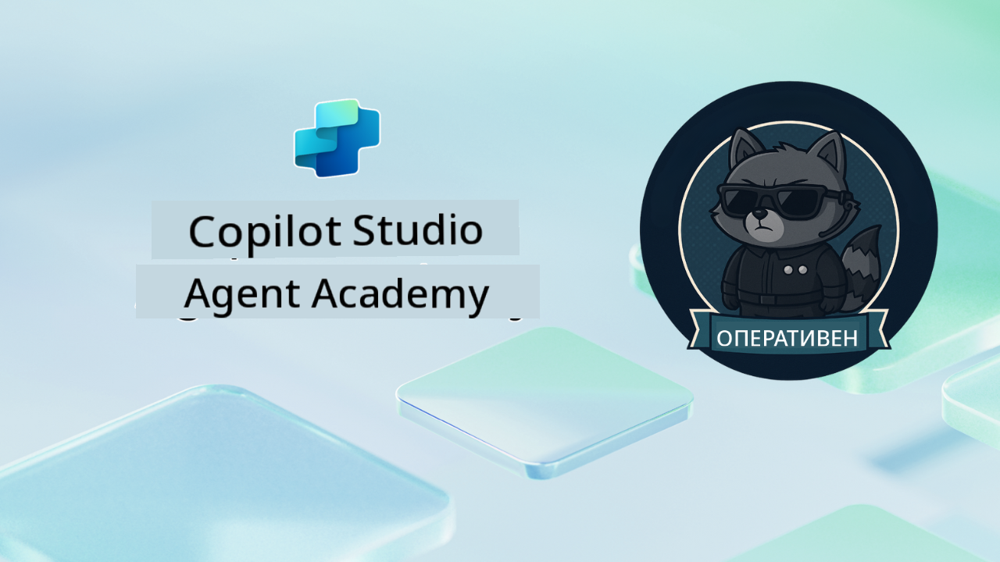

<!--
CO_OP_TRANSLATOR_METADATA:
{
  "original_hash": "24fcbe9a57d3439e05f8866e550c0a84",
  "translation_date": "2025-10-20T22:41:53+00:00",
  "source_file": "docs/operative-preview/README.md",
  "language_code": "bg"
}
-->
# Добре дошли, Оперативен агент

**Добре дошли, Оперативен агент.**  
Вашата напреднала мисия—ако решите да я приемете—е да овладеете изкуството на изграждане на **мулти-агентни системи от корпоративен клас** с помощта на **Microsoft Copilot Studio**.

Това интензивно обучение ще ви отведе отвъд основното създаване на агенти в сложния свят на **мулти-агентна оркестрация**: от автоматизация на наемането до безопасност на AI, ще научите как да изграждате, координирате и внедрявате интелигентни екосистеми от агенти, използвайки реални корпоративни сценарии.

--8<-- "disclaimer.md"

---

## 🎯 Цел на мисията

След завършване на програмата Agent Academy Operative, ще можете:

- Да проектирате и внедрявате **мулти-агентни системи** за сложни бизнес сценарии
- Да овладеете **оркестрацията на агенти** и модели за сътрудничество
- Да внедрявате **AI безопасност и модерация на съдържание** в производствени системи
- Да създавате **мултимодални подсказки** за обработка и анализ на документи
- Да внедрявате **агенти, готови за корпоративна употреба**, с подходящо управление и тестване

---

## 🧪 Предварителни изисквания

За да завършите всички мисии, ще ви е необходимо:

- Завършено обучение **Agent Academy Recruit**
- Среда на Microsoft Power Platform с лиценз за **Copilot Studio**
- Достъп до **Microsoft Dataverse**
- Административни права за създаване на решения и агенти

---

## 🧬 За кого е предназначено

Този напреднал курс е идеален за:

- **Архитекти на решения**, които проектират корпоративни AI системи
- **Разработчици**, които изграждат агенти, готови за производство
- **IT специалисти**, които внедряват управление и безопасност на AI
- **Бизнес анализатори**, които създават сложни автоматизирани работни процеси
- Всеки, който е готов да **надгради** от основни агенти към корпоративни системи

---

## 🧭 Преглед на учебната програма

Тази академия е структурирана като прогресивна серия от полеви операции—всяка мисия надгражда предходната, за да създаде цялостна система за автоматизация на наемането.

| Мисия | Заглавие | Оперативен брифинг |
|-------|----------|--------------------|
| `01` | 🚨 [Започнете с агента за наемане](./01-get-started/README.md) | Внедрете основна инфраструктура и създайте вашия централен оркестратор агент |
| `02` | 🎭 [Направете вашия агент готов за мулти-агентна работа с свързани агенти](./02-multi-agent/README.md) | Превърнете единичния агент в координирана мулти-агентна система |
| `03` | ⚡ [Автоматизирайте вашия агент с тригери](./03-automate-triggers/README.md) | Внедрете автономно поведение на агента с тригери, базирани на събития |
| `04` | 📝 [Създаване на инструкции за агента](./04-agent-instructions/README.md) | Овладейте прецизна комуникация и контрол на поведението на агента |
| `05` | 💬 [Персонализиране на отговорите на агента](./05-agent-responses/README.md) | Персонализирайте отговорите на агента за максимално въздействие и ангажираност |
| `06` | 🛡️ [Основи на модерацията на съдържание и безопасността на AI](./06-ai-safety/README.md) | Внедрете мерки за безопасност и съответствие от корпоративен клас |
| `07` | 🎨 [Извличане на съдържание от автобиографии с мултимодални подсказки](./07-multimodal-prompts/README.md) | Обработвайте документи и изображения с напреднали AI възможности |
| `08` | 🗄️ [Подсказки - Основа в Dataverse](./08-dataverse-grounding/README.md) | Осигурете на агентите достъп до корпоративни данни за точни отговори |
| `09` | 🧠 [Приложение на дълбоко разсъждение за оценка на пригодността на кандидатите и подготовка за интервю](./09-deep-reasoning/README.md) | Внедрете сложни AI разсъждения за вземане на сложни решения |
| `10` | 📄 [Генериране на документи за интервю, специфични за кандидата, с подсказки](./10-generate-documents/README.md) | Създавайте динамични документи, базирани на анализа на агента |
| `11` | 📊 [Получаване на обратна връзка от потребителите с адаптивни карти](./11-obtain-user-feedback/README.md) | Събирайте и обработвайте обратна връзка от потребителите за непрекъснато подобрение |
| `12` | 🌐 [Публикуване на вашите агенти на демонстрационен уебсайт за тестване от заинтересовани страни](./12-demo-website/README.md) | Внедрете цялостно решение за демонстрация и тестване от заинтересовани страни |

!!! note
    ✅ Завършването на тази учебна програма ви носи значката **Operative**.  
    🔓 **Commander** ще бъде отключен в бъдещи фази.

<!-- markdownlint-disable-next-line MD033 -->

---

**Отказ от отговорност**:  
Този документ е преведен с помощта на AI услуга за превод [Co-op Translator](https://github.com/Azure/co-op-translator). Въпреки че се стремим към точност, моля, имайте предвид, че автоматизираните преводи може да съдържат грешки или неточности. Оригиналният документ на неговия роден език трябва да се счита за авторитетен източник. За критична информация се препоръчва професионален човешки превод. Ние не носим отговорност за каквито и да е недоразумения или погрешни интерпретации, произтичащи от използването на този превод.