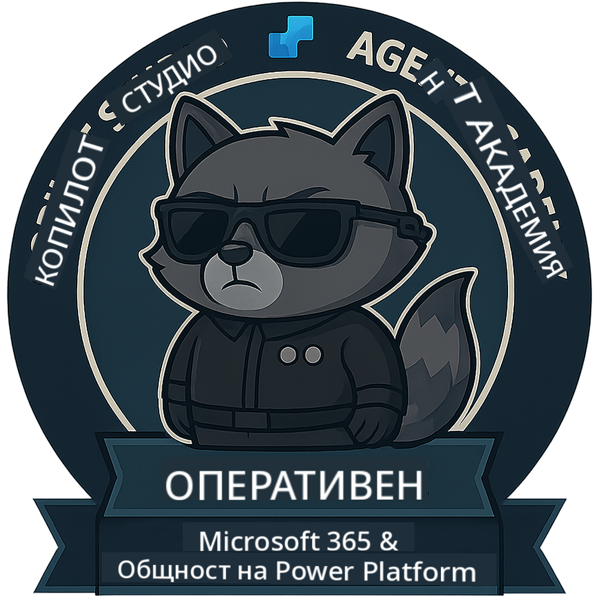

<!--
CO_OP_TRANSLATOR_METADATA:
{
  "original_hash": "1c5c8f18a1c1ec8fcbbb271403cf2ac6",
  "translation_date": "2025-10-21T00:06:39+00:00",
  "source_file": "docs/operative/README.md",
  "language_code": "bg"
}
-->
---
hide:
- навигация
---

# Оперативен (Очаквайте скоро)

Този курс все още е строго секретен. Ще бъде отключен в бъдеще! 🔓

{ width="300" }

<!-- markdownlint-disable-next-line MD033 -->

---

**Отказ от отговорност**:  
Този документ е преведен с помощта на AI услуга за превод [Co-op Translator](https://github.com/Azure/co-op-translator). Въпреки че се стремим към точност, моля, имайте предвид, че автоматизираните преводи може да съдържат грешки или неточности. Оригиналният документ на неговия роден език трябва да се счита за авторитетен източник. За критична информация се препоръчва професионален човешки превод. Не носим отговорност за каквито и да е недоразумения или погрешни интерпретации, произтичащи от използването на този превод.