<!--
CO_OP_TRANSLATOR_METADATA:
{
  "original_hash": "d9cd8cd1a4fbd8915171a2ed972cc322",
  "translation_date": "2025-10-21T00:04:29+00:00",
  "source_file": "docs/recruit/00-course-setup/README.md",
  "language_code": "bg"
}
-->
# 🚨 Мисия 00: Настройка на курса

## 🕵️‍♂️ КОДОВО ИМЕ: `ОПЕРАЦИЯ ГОТОВНОСТ ЗА ДЕПЛОЙМЪНТ`

> **⏱️ Времеви прозорец на операцията:** `~30 минути`  

## 🎯 Кратко описание на мисията

Добре дошли в първата мисия от вашето обучение като агент на Copilot Studio.  
Преди да започнете да изграждате своя първи AI агент, трябва да създадете своята **развойна среда, готова за работа на терен**.

Тази инструкция описва системите, достъпите и стъпките за настройка, необходими за успешна работа в екосистемата на Microsoft 365.

## 🔎 Цели

Вашата мисия включва:

1. Получаване на акаунт в Microsoft 365  
1. Достъп до Microsoft Copilot Studio  
1. (По избор) Осигуряване на лиценз за Microsoft 365 Copilot за публикуване в продукция  
1. Създаване на развойна среда като ваша среда за работа в Copilot Studio  
1. Създаване на сайт в SharePoint, който ще служи като източник на данни за следващите мисии  

---

## 🔍 Предварителни изисквания

Преди да започнете, уверете се, че разполагате с:

1. **Служебен или училищен имейл адрес** (лични имейли като @outlook.com, @gmail.com и т.н. не се поддържат).  
1. Достъп до интернет и модерен браузър (препоръчват се Edge, Chrome или Firefox).  
1. Основни познания за Microsoft 365 (например, как да влезете в Office приложения или Teams).  
1. (По избор) Кредитна карта или метод за плащане, ако планирате да закупите платени лицензи.  

---

## Стъпка 1: Получете акаунт в Microsoft 365

Copilot Studio се намира в Microsoft 365, затова ви е необходим акаунт в Microsoft 365, за да получите достъп до него. Можете да използвате съществуващ акаунт, ако имате такъв, или да следвате тези стъпки, за да получите подходящ лиценз:

1. **Придобийте платен абонамент за Microsoft 365 Business**  
   1. Отидете на [Страницата с планове и цени за Microsoft 365 Business](https://www.microsoft.com/microsoft-365/business/microsoft-365-plans-and-pricing)  
   1. Най-евтиният вариант за начало е планът Microsoft 365 Business Basic. Изберете `Try for free` и следвайте указанията, за да попълните информацията за абонамента, акаунта и плащането.  
   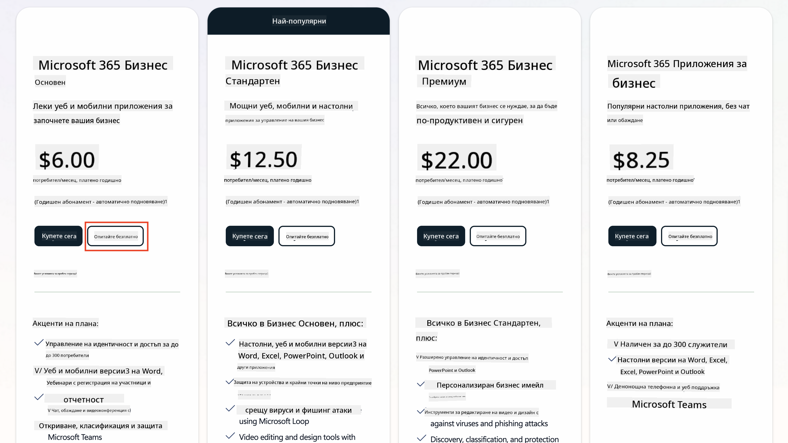  
   1. След като създадете новия си акаунт, влезте в него.

    !!! Tip
        Ако планирате да публикувате агенти в Microsoft 365 Copilot Chat или да се свързвате с организационни данни (SharePoint, OneDrive, Dataverse), ще ви е необходим лиценз за Microsoft 365 Copilot. Това е допълнителен лиценз, за който можете да научите повече [на сайта за лицензи](https://www.microsoft.com/microsoft-365/copilot#plans).

---

## Стъпка 2: Стартирайте пробен период на Copilot Studio

След като имате своя Microsoft 365 Tenant, трябва да получите достъп до Copilot Studio. Можете да получите безплатен 30-дневен пробен период, като следвате тези стъпки:

1. Отидете на [aka.ms/TryCopilotStudio](https://aka.ms/TryCopilotStudio).  
1. Въведете имейл адреса от новия акаунт, който сте конфигурирали в предишната стъпка, и изберете `Next`.  
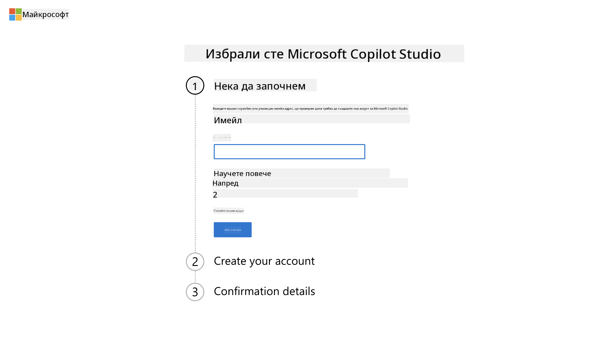  
1. Системата трябва да разпознае вашия акаунт. Изберете `Sign In`.  
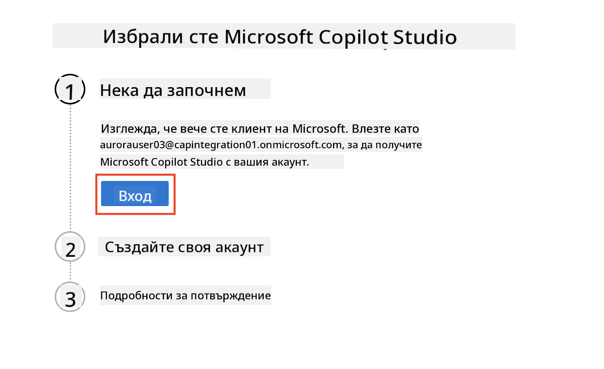  
1. Изберете `Start Free Trial`.  
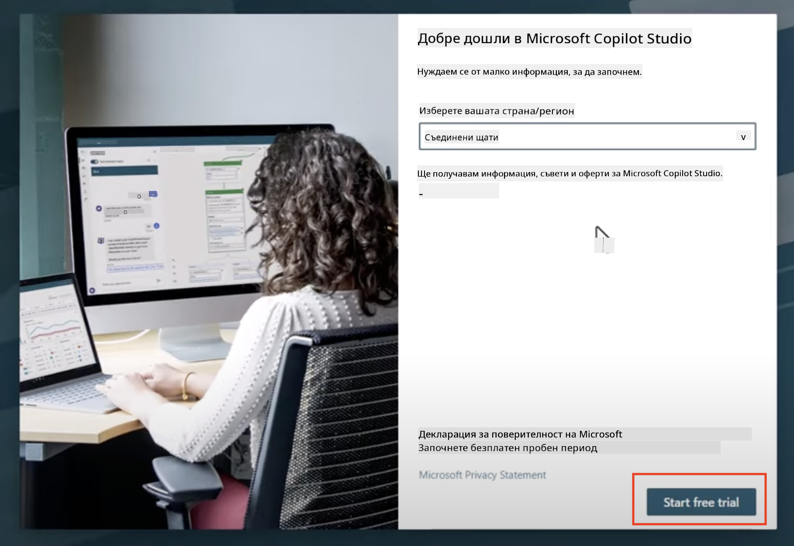

!!! info "Бележки за пробния период"  
     1. Безплатният пробен период предоставя **пълни възможности на Copilot Studio**.  
     1. Ще получавате известия по имейл за изтичането на пробния период. Можете да удължите пробния период с 30-дневни интервали (до 90 дни работа на агента).  
     1. Ако администраторът на вашия tenant е деактивирал самостоятелната регистрация, ще видите грешка — свържете се с администратора на Microsoft 365, за да я активира отново.  

---

## Стъпка 3: Създайте нова развойна среда

### Регистрирайте се за Power Apps Developer Plan

Използвайки същия Microsoft 365 tenant от Стъпка 1, регистрирайте се за Power Apps Developer Plan, за да създадете безплатна развойна среда за изграждане и тестване с Copilot Studio.

1. Регистрирайте се на [уебсайта на Power Apps Developer Plan](https://aka.ms/PowerAppsDevPlan).

    - Въведете своя имейл адрес  
    - Отбележете отметката  
    - Изберете **Start free**  

    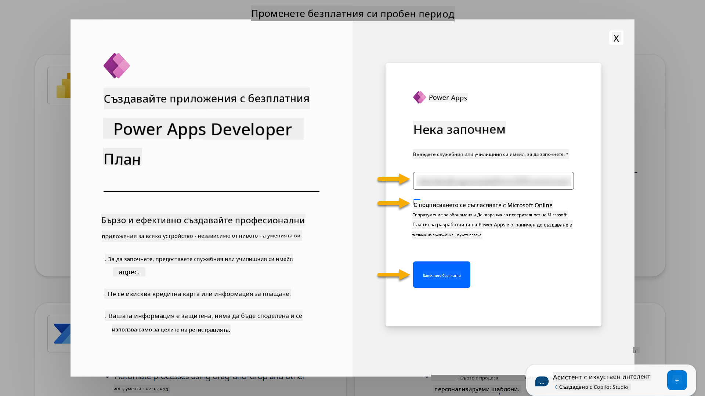

1. След регистрацията ще бъдете пренасочени към [Power Apps](https://make.powerapps.com/). Средата ще използва вашето име, например **Среда на Adele Vance**. Ако вече има среда с това име, новата развойна среда ще бъде наречена **Среда на Adele Vance (1)**.

    Използвайте тази развойна среда в Copilot Studio, когато изпълнявате лабораторните задачи.

!!! Note
    Ако използвате съществуващ акаунт в Microsoft 365 и не сте създали нов в Стъпка 1, например използвате своя акаунт в работната си организация, вашият IT администратор (или еквивалентният екип) може да е деактивирал процеса на регистрация. В този случай, моля, свържете се с вашия администратор или създайте тестов tenant, както е описано в Стъпка 1.

---

## Стъпка 4: Създайте нов сайт в SharePoint

Трябва да създадете нов сайт в SharePoint, който ще бъде използван в [Урок 06 - Създаване на персонализиран агент чрез разговорен интерфейс с Copilot и свързването му с вашите данни](../06-create-agent-from-conversation/README.md#62-add-an-internal-knowledge-source-using-a-sharepoint-site).

1. Изберете иконата с вафла в горния ляв ъгъл на Microsoft Copilot Studio, за да видите менюто. Изберете SharePoint от менюто.

    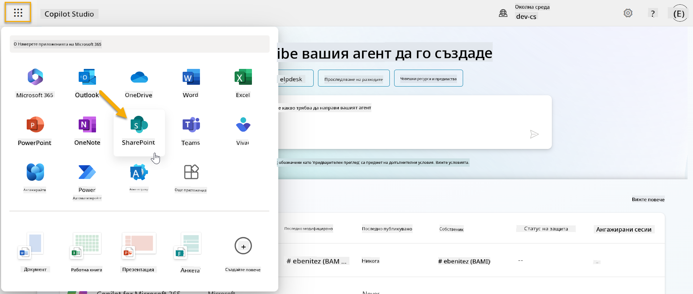

1. SharePoint ще се зареди. Изберете **+ Create site**, за да създадете нов сайт в SharePoint.

    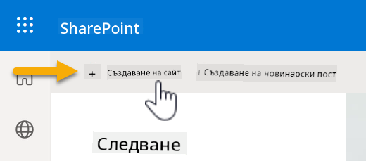

1. Ще се появи диалогов прозорец, който ще ви насочи в създаването на нов сайт в SharePoint. Изберете **Team site**.

    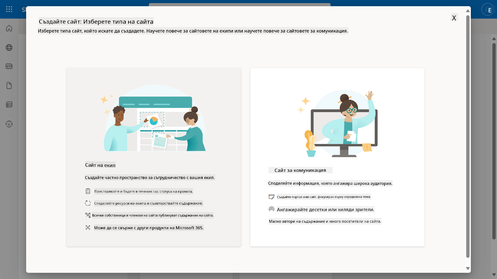

1. В следващата стъпка по подразбиране ще се зареди списък с шаблони на Microsoft. Превъртете надолу и изберете шаблона **IT help desk**.

    

1. Изберете **Use template**, за да създадете нов сайт в SharePoint, използвайки шаблона IT help desk.

    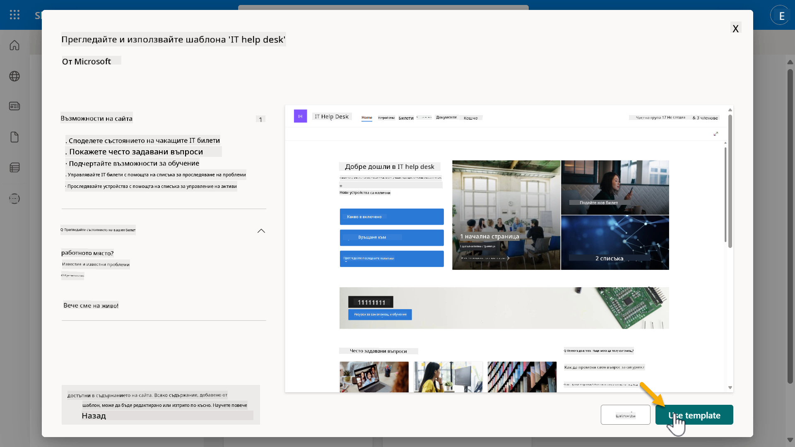

1. Въведете информация за вашия сайт. Ето пример:

    | Поле | Стойност |
    | --- | --- |
    | Име на сайта | Contoso IT |
    | Описание на сайта | Copilot Studio за начинаещи |
    | Адрес на сайта | ContosoIT |

    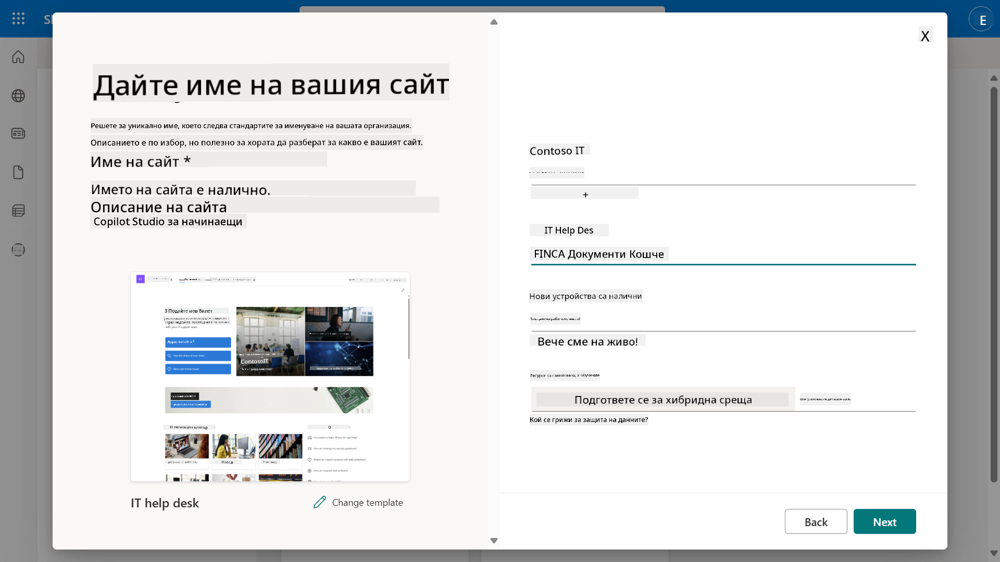

1. В последната стъпка можете да изберете език за сайта в SharePoint. По подразбиране ще бъде **Английски**. Оставете езика като **Английски** и изберете **Create site**.

    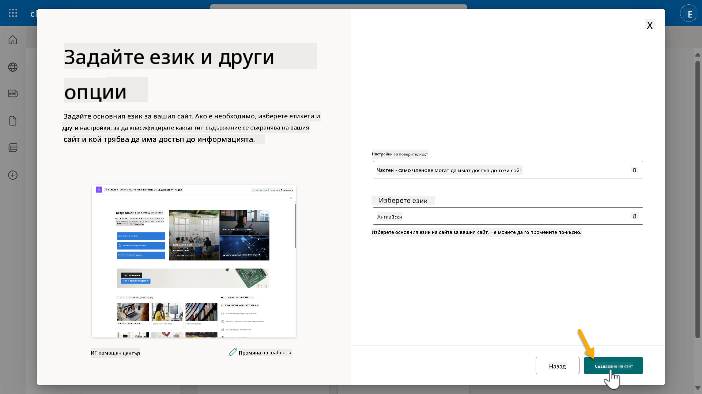

1. Сайтът в SharePoint ще се създаде за няколко секунди. Междувременно можете да добавите други потребители към вашия сайт, като въведете техния имейл адрес в полето **Add members**. Когато приключите, изберете **Finish**.

    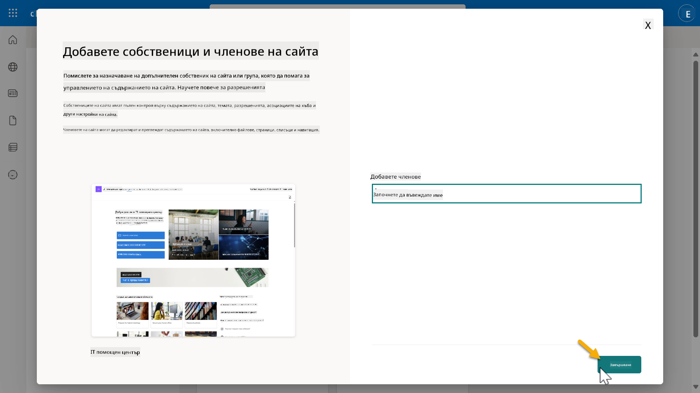

1. Ще се зареди началната страница на сайта в SharePoint. **Копирайте** URL адреса на сайта.

1. Този шаблон предоставя страници с примерни данни за различни IT политики и два примерни списъка (Tickets и Devices).

### Използване на списъка Devices в SharePoint

Ще използваме списъка **Devices** в [Мисия 07 - Добавяне на нова тема с тригер и възли](../07-add-new-topic-with-trigger/README.md#73-add-a-tool-using-a-connector).

### Добавяне на нова колона

Превъртете до най-дясната част на списъка и изберете бутона **+ Add column**. Изберете тип **hyperlink**, въведете **Image** за име на колоната и изберете добавяне.

### Създаване на примерни данни в списъка Devices в SharePoint

Трябва да се уверите, че този списък съдържа поне 4 примерни елемента с данни и да добавите още една колона към този списък.  

Когато добавяте примерни данни, уверете се, че следните полета са попълнени:

- Снимка на устройството - използвайте изображенията от [папката с изображения на устройства](https://github.com/microsoft/agent-academy/tree/main/docs/recruit/00-course-setup/images/device-images)  
- Заглавие  
- Състояние  
- Производител  
- Модел  
- Тип актив  
- Цвят  
- Сериен номер  
- Дата на покупка  
- Цена на покупка  
- Номер на поръчка  
- Изображение - използвайте следните връзки  

|Устройство  |URL  |
|---------|---------|
|Surface Laptop 13     | [https://raw.githubusercontent.com/microsoft/agent-academy/refs/heads/main/docs/recruit/00-course-setup/images/device-images/Surface-Laptop-13.png](https://raw.githubusercontent.com/microsoft/agent-academy/refs/heads/main/docs/recruit/00-course-setup/images/device-images/Surface-Laptop-13.png)        |
|Surface Laptop 15     | [https://raw.githubusercontent.com/microsoft/agent-academy/refs/heads/main/docs/recruit/00-course-setup/images/device-images/Surface-Laptop-15.png](https://raw.githubusercontent.com/microsoft/agent-academy/refs/heads/main/docs/recruit/00-course-setup/images/device-images/Surface-Laptop-15.png)        |
|Surface Pro    | [https://raw.githubusercontent.com/microsoft/agent-academy/refs/heads/main/docs/recruit/00-course-setup/images/device-images/Surface-Pro-12.png](https://raw.githubusercontent.com/microsoft/agent-academy/refs/heads/main/docs/recruit/00-course-setup/images/device-images/Surface-Pro-12.png)        |
|Surface Studio    | [https://raw.githubusercontent.com/microsoft/agent-academy/refs/heads/main/docs/recruit/00-course-setup/images/device-images/Surface-Studio.png](https://raw.githubusercontent.com/microsoft/agent-academy/refs/heads/main/docs/recruit/00-course-setup/images/device-images/Surface-Studio.png)        |

---

## ✅ Мисията е завършена

Вие успешно:

- Настроихте развойна среда в Microsoft 365  
- Активирахте пробния период на Copilot Studio  
- Създадохте сайт в SharePoint за свързване на агенти  
- Попълнихте списъка Devices за използване в бъдещи мисии  

Вече сте официално готови да започнете своето обучение като **агент на ниво Рекрут** в [Урок 01](../01-introduction-to-agents/README.md).  

<!-- markdownlint-disable-next-line MD033 -->

---

**Отказ от отговорност**:  
Този документ е преведен с помощта на AI услуга за превод [Co-op Translator](https://github.com/Azure/co-op-translator). Въпреки че се стремим към точност, моля, имайте предвид, че автоматизираните преводи може да съдържат грешки или неточности. Оригиналният документ на неговия роден език трябва да се счита за авторитетен източник. За критична информация се препоръчва професионален човешки превод. Ние не носим отговорност за каквито и да било недоразумения или погрешни интерпретации, произтичащи от използването на този превод.