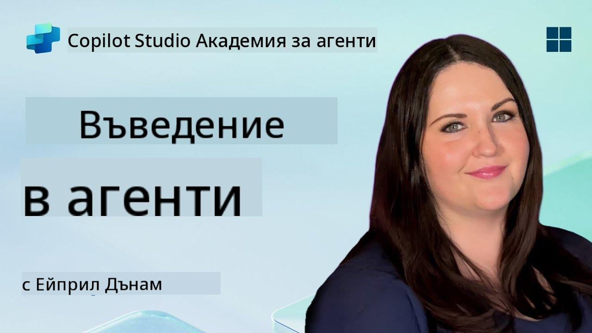

<!--
CO_OP_TRANSLATOR_METADATA:
{
  "original_hash": "d6706e107678264168d77b2e107710b1",
  "translation_date": "2025-10-20T23:31:57+00:00",
  "source_file": "docs/recruit/01-introduction-to-agents/README.md",
  "language_code": "bg"
}
-->
# 🚨 Мисия 01: Въведение в агентите

## 🕵️‍♂️ КОДОВО ИМЕ: `ОПЕРАЦИЯ ДЕКОДИРАНЕ НА AI АГЕНТ`

> **⏱️ Времеви прозорец на операцията:** `~30 минути – само информация, без работа на терен`

🎥 **Гледайте видео ръководството**

## 🎯 Кратко описание на мисията

Добре дошли, новобранци. Преди да се потопим в изграждането на агенти, трябва да имате солидно разбиране за AI концепциите, които ги захранват. Тази мисия ще ви предостави основни знания за разговорния AI, големите езикови модели (LLMs), генерирането с допълнително извличане (RAG) и типовете агенти, които можете да създадете в Copilot Studio.

## 🔎 Цели

В тази мисия ще научите:

1. Какво представлява разговорният AI и защо е важен  
1. Как големите езикови модели (LLMs) захранват чат изживяванията  
1. Какво предлага генерирането с допълнително извличане (RAG)  
1. Разликата между разговорни агенти и автономни агенти  
1. Как агентите в Copilot Studio използват тези концепции  

Да започваме!

---

## Какво е разговорен AI?

Разговорният AI се отнася до всяка система, която може да разбира, обработва и отговаря на човешки език – било то текст или реч – по начин, който изглежда естествен. Помислете за чатботове в помощни центрове или виртуални лични асистенти във вашите любими приложения. В основата си, повечето съвременни разговорни AI системи разчитат на големи езикови модели (LLMs), които ще разгледаме след малко.

### Защо е важен

- **Потребителско изживяване:** Разговорните интерфейси често са по-интуитивни от навигацията през менюта.  
- **Скалируемост:** Един агент може да обработва десетки или стотици едновременни разговори.  
- **Ефективност:** Вместо да изграждате персонализирани скриптове, базирани на правила, агентите, захранвани от LLM, се адаптират в движение към потребителския вход.  
- **Разширяемост:** С правилния дизайн агентите могат да се свързват с бази знания, API-та или да действат като "дигитални колеги" в бизнес процеси.

---

## Големи езикови модели (LLMs) 101

В основата на повечето разговорни AI системи са **големите езикови модели** – невронни мрежи, обучени върху огромни текстови корпуси. Те изучават статистическите модели на езика, за да могат да генерират свързани изречения, да отговарят на въпроси или дори да предлагат идеи. Основни точки за разбиране:

1. **Обучителни данни:** LLMs обработват терабайти текст (уеб страници, книги, статии). Това "световно знание" им позволява да отговарят на много теми.  
1. **Токенизация:** Текстът се разделя на по-малки единици, наречени токени (думи, части от думи или символи). Моделът предсказва един токен наведнъж.  
1. **Контекстен прозорец:** Всеки LLM има ограничение за броя токени, които може да "види" наведнъж. След това ограничение предишните токени се отрязват.  
1. **Подканване:** Взаимодействате с LLM, като му изпращате подканващ текст. Колкото по-добра е подканата, толкова по-фокусирани и релевантни са отговорите.  
1. **Zero-shot срещу фина настройка:** Zero-shot означава използване на LLM в оригиналния му вид (само сурови тегла). Фина настройка означава адаптиране на модела към специфични за домейна данни, за да отговаря по-точно на вашите нужди.

!!! Tip "Професионален съвет"
    Често срещано сравнение е, че LLM е като "супер интелигентен автозавършващ текст". Той не разбира истински значението като човешки мозък, но е изключително добър в предсказването на следващата най-подходяща дума (или фраза) в последователност.

---

## Генериране с допълнително извличане (RAG)

Когато LLMs разчитат само на статични обучителни данни, те могат да създават грешни или остарели отговори. RAG решава този проблем, като позволява на модела да "търси" актуална информация, преди да състави отговор. На високо ниво, RAG работи така:

1. **Потребителски въпрос:** Потребителят задава въпрос (например: "Какво ново за тримесечните приходи на Contoso?").  
1. **Стъпка на извличане:** Системата прави запитване към източник на знания (документи, вътрешни бази данни, библиотеки в SharePoint и др.), за да намери релевантни пасажи.  
1. **Допълнение:** Извлечените пасажи се добавят към или преди подканата на LLM.  
1. **Генериране:** LLM обработва както въпроса на потребителя, така и извлечения контекст, след което генерира отговор, основан на актуални данни.  

С RAG вашият агент може да се свързва с вътрешни фирмени уикита, API-та за плъгини или да търси в база данни с често задавани въпроси – и да предоставя отговори, които не са ограничени до статично публикувани параметри на модела.

---

## Разговорни срещу автономни агенти

В контекста на Copilot Studio терминът **агент** може да се отнася до различни видове AI асистенти. Полезно е да се направи разграничение между:

**Разговорни агенти:**

- Основно се фокусират върху двупосочен диалог.  
- Запазват контекста през множество завои на разговор.  
- Обикновено се управляват чрез предварително дефинирани потоци или тригери (например: "Ако потребителят каже X, отговори с Y").  
- Идеални за клиентска поддръжка, често задавани въпроси, насочени взаимодействия, планиране или прости въпроси и отговори.  
  - Примери:  
    - Чатбот в Teams, който отговаря на въпроси за HR политики.  
    - Бот Power Virtual Agents на страница в SharePoint, който насочва потребителите през формуляр.  

**Автономни агенти:**

- Надхвърлят обикновения чат; те могат **да предприемат действия** от името на потребителя.  
- Използват цикли на разсъждение с LLM (мислете "планиране → действие → наблюдение → препланиране"), за да изпълняват задачи.  
- Свързват се с външни инструменти или API-та (например: стартиране на поток в Power Automate, изпращане на покани за календар, манипулиране на данни в Dataverse).  
- Работят без постоянни човешки подканвания – след като бъдат активирани, те могат автономно да обработват многоетапни процеси.  
  - Примери:  
    - Агент, който генерира маршрут за пътуване, резервира полети и изпраща потвърждения по имейл.  
    - Агент "Обобщение на среща", който се присъединява към Teams разговор, транскрибира го в реално време и пише изпълнително обобщение в OneNote.  

!!! Info "Основна разлика"
    Разговорните агенти чакат потребителски вход и се придържат към диалог. Автономните агенти проактивно планират и изпълняват последователност от стъпки, използвайки по-широк достъп до инструменти.

---

## Агенти в Copilot Studio

**Copilot Studio** обединява както разговорни, така и автономни сценарии под една рамка. Ето как Copilot Studio ви помага да изграждате агенти:

1. **Визуален дизайнер на агенти:** Платформа с нисък код за дефиниране на подканвания, памет и инструменти както за чат, така и за работни потоци с действия.  
1. **Конфигурации на LLM:** Изберете от различни модели на OpenAI или корпоративния GPT на Microsoft, за да съответствате на вашите нужди за производителност и разходи.  
1. **Конектори за извличане:** Предварително изградени интеграции за SharePoint, OneDrive, Azure Cognitive Search и Dataverse, позволяващи RAG директно.  
1. **Персонализирани инструменти и функции:** Дефинирайте персонализирани HTTP действия или потоци в Power Automate, които вашият агент може да извиква автономно.  
1. **Поддръжка на мултимодалност:** Освен текст, агентите в Copilot Studio могат да обработват изображения, файлове или структурирани данни за обогатяване на контекста.  
1. **Публикуване и разпространение:** След като вашият агент е готов, можете да го публикувате в Microsoft 365 Copilot (за да бъде използван в Teams, SharePoint, Outlook и др.) или да го вградите като самостоятим чат модул на уеб страница.

---

## 🎉 Мисията е изпълнена

Вече завършихте вашето въведение в агентите и основните AI концепции. Разбирате:

1. **LLMs = "Мозъкът" на вашия агент**  
   - Отговаря за разбирането и генерирането на език.  
   - Повече токени = по-богат контекст, но и по-висока цена на заявка.  

1. **RAG = Интеграция на знания в реално време**  
   - Преодолява пропастта между статичен LLM и постоянно променящи се източници на данни.  
   - Извлича и вмъква релевантни документи или записи в подканата на LLM.  

1. **Разговорни срещу автономни**  
   - **Разговорни:** Фокус върху диалоговия поток и запазване на контекста (например "Памет на сесията").  
   - **Автономни:** Добавяне на "Блокове за действия", които позволяват на агента да се свързва с външни инструменти или услуги.

---
Следващата стъпка е да разгледате [основите на Copilot Studio](../02-copilot-studio-fundamentals/README.md)!

Бъдете нащрек, новобранци - вашето AI пътешествие тепърва започва!

## 📚 Тактически ресурси

🔗 [Начална страница на документацията за Copilot Studio](https://learn.microsoft.com/microsoft-copilot-studio/)

---

---

**Отказ от отговорност**:  
Този документ е преведен с помощта на AI услуга за превод [Co-op Translator](https://github.com/Azure/co-op-translator). Въпреки че се стремим към точност, моля, имайте предвид, че автоматизираните преводи може да съдържат грешки или неточности. Оригиналният документ на неговия роден език трябва да се счита за авторитетен източник. За критична информация се препоръчва професионален човешки превод. Не носим отговорност за недоразумения или погрешни интерпретации, произтичащи от използването на този превод.