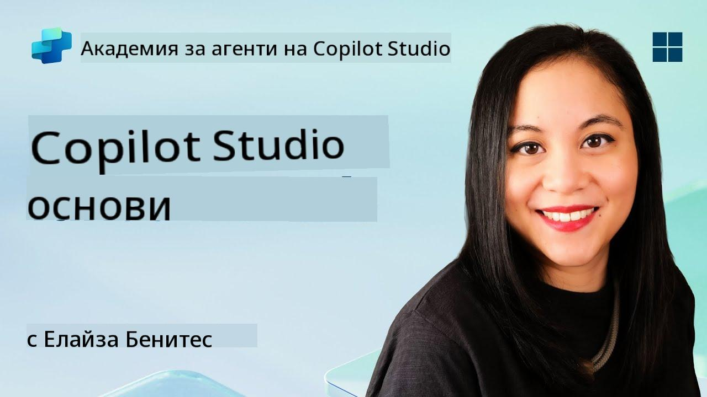
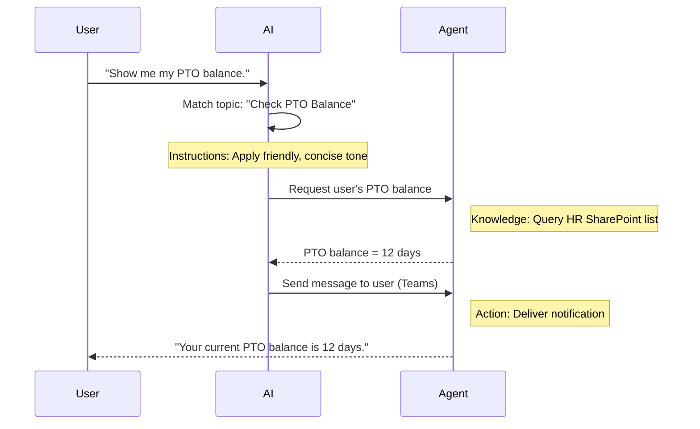

<!--
CO_OP_TRANSLATOR_METADATA:
{
  "original_hash": "90a3c5122f5687bbc8cc819990f175d4",
  "translation_date": "2025-10-20T23:54:43+00:00",
  "source_file": "docs/recruit/02-copilot-studio-fundamentals/README.md",
  "language_code": "bg"
}
-->
# 🚨 Мисия 02: Основи на Copilot Studio

## 🕵️‍♂️ КОДОВО ИМЕ: `ОПЕРАЦИЯ ОСНОВЕН ПРОТОКОЛ`

> **⏱️ Времеви прозорец на операцията:** `~30 минути – само информация, без работа на терен`  

🎥 **Гледайте видео ръководството**

[](https://www.youtube.com/watch?v=x4OCwDRGeLE "Гледайте ръководството в YouTube")

## 🎯 Описание на мисията

Добре дошли, новобранци. Тази мисия ще ви предостави основна информация за това как работи Copilot Studio и как да създавате интелигентни агенти, които предоставят реална бизнес стойност.

Преди да създадете първия си агент, трябва да разберете четирите ключови компонента, които изграждат всеки персонализиран AI агент: Знания, Инструменти, Теми и Инструкции. Ще научите също как тези елементи работят заедно в оркестратора на Copilot Studio.

## 🔎 Цели

В тази мисия ще:

- **Научите какво е Copilot Studio**
- **Научите кога и защо да използвате агенти**
- **Разгледате четирите градивни блока на агентите**
      - **Знания**
      - **Инструменти**
      - **Теми**
      - **Инструкции**
- **Разберете как тези компоненти работят заедно**, за да създадат интелигентен, автоматизиран агент

---

## Какво представляват агентите в Copilot Studio?

**Агент** е специализиран AI асистент, който създавате, за да се справя с конкретни задачи или запитвания. За разлика от универсалния чатбот, вашият агент:

- **Познавa специфични данни за компанията** (политики, документи, бази данни)  
- **Извършва реални задачи** (изпращане на съобщения, създаване на събития в календара, актуализиране на записи)  
- **Поддържа контекст на разговора**, за да може да продължи от предишни въпроси  

Тъй като Copilot Studio е с нисък код, можете да плъзгате и пускате предварително изградени компоненти – без да са необходими задълбочени умения за програмиране. След като създадете своя агент, хората могат да го използват в Teams, Slack или дори на персонализирана уеб страница, за да получават отговори или автоматично да задействат работни процеси.

---

## Кога и защо да използвате Copilot Studio

Докато Microsoft 365 Copilot предоставя обща AI помощ в приложенията на Office, ще ви е необходим персонализиран агент, когато:

### Имате нужда от специфични за домейна знания

- Стандартният Copilot може да не знае вътрешните процедури или данни на вашата компания. Агентът може да прави запитвания към вашите сайтове в SharePoint, бази данни или персонализирани източници, за да предоставя точни и актуални отговори.  

### Искате да автоматизирате многоетапни работни процеси

- Например: "Когато някой подаде разход, изпратете го за одобрение, актуализирайте финансовия тракер и уведомете мениджъра." Персонализиран агент може да се справи с всяка стъпка, задействана от една команда или събитие.  

### Нуждаете се от контекстуално преживяване в инструмента  

- Представете си агент за въвеждане на нови служители в Teams, който насочва HR персонала през всяка политика, изпраща необходимите формуляри и насрочва срещи за ориентация – директно във вашата съществуваща платформа за сътрудничество.  

---

## Четирите градивни блока на един агент

Всеки агент в Copilot Studio се изгражда от четири основни компонента:

1. **Знания**  
1. **Инструменти (Действия)**  
1. **Теми**  
1. **Инструкции**

По-долу ще дефинираме всеки градивен блок и ще покажем как те работят заедно, за да създадат ефективен агент.

### 1. Знания

**Знанията** са данните и контекстът, които вашият агент използва, за да отговаря точно на въпроси. Те имат две части:

#### Персонализирани инструкции и контекст

- Вие пишете кратко описание на целта и тона на агента. Например:  

    ```text
    You are an IT support agent. You help employees troubleshoot common software issues, provide troubleshooting steps, and escalate urgent tickets.
    ```

- По време на разговор агентът запомня предишни реплики, за да може да се позовава на вече обсъденото (например, ако потребителят първо каже: "Принтерът ми не работи," а след това попита: "Проверихте ли нивото на мастилото?" агентът си спомня контекста за принтера).

#### Източници на знания (основни данни)

- Свързвате вашия агент с множество източници на данни – библиотеки в SharePoint, сайтове с документация, уикита или други бази данни.  
- Когато потребител зададе въпрос, агентът извлича подходящи откъси от тези източници, така че отговорите да бъдат **основани** на действителните политики, ръководства за продукти или всяка собствена информация на вашата организация.  
- Можете дори да принудите агента да отговаря само с информация от тези източници, предотвратявайки предположения или "измисляне" на отговори.

!!! example
    Агент "Помощник за политики" може да се свърже с вашия HR сайт в SharePoint. Ако потребител попита: "Какъв е нашият процент на натрупване на PTO?" агентът извлича точния текст от документа за HR политики, вместо да разчита на общ AI отговор.

---

### 2. Инструменти (Действия)

**Инструментите (Действия)** определят какво може да прави агентът, освен да води разговори. Всяко действие е задача, която агентът изпълнява програмно, като например:

- Изпращане на имейл или съобщение в Teams  
- Създаване или актуализиране на събитие в календара  
- Добавяне или редактиране на запис в база данни (например списък в SharePoint или таблица в Dataverse)  
- Извикване на Power Automate поток или REST API  

#### Как работят действията

- **Определяне на входни и изходни данни**  
      - Например, действие за изпращане на имейл може да изисква:  
        - `RecipientEmailAddress`  
        - `SubjectLine`  
        - `EmailBody`  

- **Комбиниране на действия в работни процеси**  
      - Често изпълнението на заявка от потребител включва множество стъпки.  
      - Можете да подредите действията така, че:  
             1. Агентът извлича данни от списък в SharePoint.  
             2. Генерира резюме с помощта на LLM.  
             3. Изпраща съобщение в Teams с това резюме.  

- **Свързване с външни системи**  
      - Ако трябва да актуализирате CRM или да извикате вътрешен API, създайте персонализирано действие за това.  
      - Copilot Studio може да се интегрира с Power Platform или всяка HTTP-базирана крайна точка.

!!! example "Агент "Помощник за разходи" може да:"  
    1. Слуша за заявка "Подай разход".  
    2. Вземе детайлите за разхода от формуляр.  
    3. Използва действие "Добавяне към списък в SharePoint", за да съхрани данните.  
    4. Задейства действие "Изпращане на имейл", за да уведоми одобряващия.  

---

### 3. Теми

**Теми** определят разговорните тригери или входни точки за вашия агент. Всяка тема съответства на функционалност или категория въпроси.

#### Разговорни тригери  

- Една тема може да бъде "Подай IT билет", "Провери баланс на отпуска" или "Създай отчет за продажби".  
- В основата си, Copilot Studio използва **генеративна оркестрация**: вместо да разчита на точни ключови думи, AI интерпретира намерението на потребителя и избира правилната тема въз основа на кратко описание, което предоставяте.  

#### Описания на теми  

- Във всяка тема пишете ясно и кратко описание на това, което обхваща темата.

!!! example "Пример за описание на тема"
    Тази тема помага на потребителите да подадат IT билет за поддръжка, като събира детайли за проблема, приоритет и контактна информация.

- AI използва това описание, за да реши кога да активира тази тема, дори ако формулировката на потребителя не съвпада точно.

#### Свързване на теми с действия  

- Всяка тема е свързана с едно или повече действия или стъпки за извличане на данни.  
- Когато AI избере тема, той насочва разговора през последователността, която сте дефинирали (задава последващи въпроси, извиква действия, връща резултати).

!!! example
    Ако потребител каже: "Имам нужда от помощ за настройка на новия ми лаптоп," AI може да съпостави това намерение с темата "Подай IT билет". Агентът след това пита за модела на лаптопа, детайлите на потребителя и автоматично създава билет в системата за поддръжка.

---

### 4. Инструкции

**Инструкциите** (понякога наричани "Подсказки" или "Системни съобщения") насочват тона, стила и границите на LLM. Те оформят как агентът отговаря във всяка ситуация.

#### Роля и персона  

- Казвате на AI каква роля играе (например: "Вие сте агент за обслужване на клиенти за Contoso Retail").  
- Това задава тона – приятелски, кратък, формален или неформален – в зависимост от вашия случай на употреба.

#### Насоки за отговор  

- Уточнявате правила, които агентът трябва да следва, като:  
      - "Винаги обобщавайте информацията за политиките в точки."  
      - "Ако не знаете отговора, кажете ‘Съжалявам, нямам тази информация.’"  
      - "Никога не включвайте поверителни данни извън контекста."

#### Правила за памет и контекст

- Можете да инструктирате агента колко реплики от разговора да запомни.  
- Например: "Запомнете детайли от заявките на този потребител за до три последващи въпроса."

!!! example "В агент "Съветник за придобивки" може да включите:"
    "Винаги се позовавайте на последния HR наръчник, когато отговаряте на въпроси. Ако бъдете попитани за крайни срокове за записване, предоставете конкретните дати от политиката. Дръжте отговорите под 150 думи."

---

## Как работят четирите градивни блока заедно

Когато съберете **Знания**, **Инструменти**, **Теми** и **Инструкции**, AI оркестраторът на Copilot Studio създава агент, който:

1. **Слуша за подходяща тема** (воден от вашите описания на теми).  
1. **Прилага инструкции**, за да зададе тон, да реши кога да зададе последващи въпроси и да наложи правила.  
1. **Използва източници на знания**, за да основава отговорите си на данните на вашата организация.  
1. **Извиква инструменти (действия)**, когато е необходимо, за да изпълнява задачи – изпращане на съобщения, актуализиране на записи или извикване на API.  

В основата си оркестраторът използва подход **генеративно планиране**: той решава какви стъпки да предприеме, в какъв ред, за да изпълни заявката на потребителя. Ако дадено действие се провали (например, ако имейлът не може да бъде изпратен), агентът следва вашите насоки за обработка на изключения (задава уточняващ въпрос или докладва за грешката). Тъй като LLM се адаптира към контекста на разговора, агентът може да поддържа памет през множество реплики и да включва нова информация, докато разговорът се развива.

**Пример за визуален поток:**  
<!--
1. **Потребител:** "Покажи ми баланса на отпуска ми."
1. **AI (Теми):** Съпоставя темата "Провери баланс на отпуска".  
1. **AI (Инструкции):** Използва приятелски, кратък тон.  
1. **Агент (Знания):** Прави запитване към HR списъка в SharePoint за баланса на потребителя.  
1. **Агент (Действия):** Извлича стойността и изпраща съобщение в Teams:  
   > "Вашият текущ баланс на отпуска е 12 дни."  
-->



---

## 🎉 Мисията е изпълнена

Успешно завършихте основния брифинг. Вече научихте четирите основни градивни блока на всеки агент в Copilot Studio:

1. **Знания** – Откъде агентът намира фактическа информация и поддържа паметта на разговора.  
1. **Инструменти** – Задачите, които агентът може да изпълнява автоматично.  
1. **Теми** – Как агентът разпознава намерението на потребителя и решава кой работен процес да изпълни.  
1. **Инструкции** – Правилата, тонът и границите, които насочват всеки отговор.

С тези компоненти можете да създадете основен агент, който отговаря на въпроси и изпълнява прости работни процеси. В следващия урок ще преминем през стъпка по стъпка ръководство за създаване на агент "Сервизен център" – от свързването на първия източник на знания до дефинирането на тема и свързването на действие.

Следва: Ще създадете [първия си декларативен агент за M365 Copilot](../03-create-a-declarative-agent-for-M365Copilot/README.md).

<!-- markdownlint-disable-next-line MD033 -->


---

**Отказ от отговорност**:  
Този документ е преведен с помощта на AI услуга за превод [Co-op Translator](https://github.com/Azure/co-op-translator). Въпреки че се стремим към точност, моля, имайте предвид, че автоматизираните преводи може да съдържат грешки или неточности. Оригиналният документ на неговия роден език трябва да се счита за авторитетен източник. За критична информация се препоръчва професионален човешки превод. Ние не носим отговорност за каквито и да било недоразумения или погрешни интерпретации, произтичащи от използването на този превод.