<!--
CO_OP_TRANSLATOR_METADATA:
{
  "original_hash": "0c51aabca81d6256990caf4c015e6195",
  "translation_date": "2025-10-20T23:33:23+00:00",
  "source_file": "docs/recruit/04-creating-a-solution/README.md",
  "language_code": "bg"
}
-->
# 🚨 Мисия 04: Създаване на решение за вашия агент

## 🕵️‍♂️ КОДОВО ИМЕ: `ОПЕРАЦИЯ CTRL-ALT-ПАКЕТ`

> **⏱️ Времеви прозорец на операцията:** `~45 минути`

🎥 **Гледайте ръководството**

[](https://www.youtube.com/watch?v=1iATbkgfcpU "Гледайте ръководството в YouTube")

## 🎯 Кратко описание на мисията

Създателю на агенти, добре дошъл в следващата си тактическа операция. В тази мисия ще научите как да създадете Решение - официалното средство за внедряване на вашия агент за помощен център, създаден с Microsoft Copilot Studio. Помислете за това като за дигитално куфарче, което съхранява вашия агент и неговите артефакти.

Всеки агент се нуждае от добре структурирано място. Това е, което Power Platform решението предоставя - ред, преносимост и готовност за производство.

Да започнем с опаковането.

## 🔎 Цели

В тази мисия ще научите:

1. Какво представляват Power Platform решенията и тяхната роля в разработката на агенти
1. Ползите от използването на решения за организиране и внедряване на агенти
1. Изследване на издателите на решения и тяхното значение за управлението на компоненти
1. Разбиране на жизнения цикъл на Power Platform решенията от разработка до производство
1. Създаване на собствен издател на решения и персонализирано решение за вашия агент за помощен център

## 🕵🏻‍♀️ Решение? Какво е това?

В Microsoft Power Platform решенията са като контейнери или пакети, които съдържат всички части на вашите приложения или агенти - това могат да бъдат таблици, форми, потоци и персонализирана логика. Решенията са от съществено значение за управлението на жизнения цикъл на приложенията (ALM), тъй като ви позволяват да управлявате вашето приложение и агенти от идея до разработка, тестване, внедряване и актуализации.

В Copilot Studio всеки агент, който създавате, се съхранява в Power Platform решение. По подразбиране агентите се създават в стандартното решение, освен ако не създадете ново персонализирано решение, в което да създадете вашия агент. Това ще научим 🤓 в този урок и в практическата лаборатория.

Решенията традиционно се създават в **портала за създаване на Power Apps** - уеб базиран интерфейс, където можете да изграждате и персонализирате приложения, Dataverse, потоци, да изследвате AI компоненти и други.

   

В Copilot Studio вече има **Solution Explorer**, където можете да управлявате вашите решения директно. Вече не е необходимо да превключвате към портала за създаване на Power Apps, за да управлявате вашите решения, това може да се направи директно в Copilot Studio 🪄

Това означава, че можете да извършвате обичайните задачи, свързани с решения:

- **Създаване на решение** - персонализираните решения позволяват агентите да бъдат експортирани и импортирани между среди.
- **Задаване на предпочитано решение** - изберете решението, в което по подразбиране ще се създават агенти, приложения и др.
- **Добавяне или премахване на компоненти** - вашият агент може да се позовава на други компоненти като променливи на средата или облачни потоци. Следователно тези компоненти трябва да бъдат включени в решението.
- **Експортиране на решения** - за преместване на решения в друга целева среда.
- **Импортиране на решения** - импортиране на решения, създадени другаде, включително надграждане или актуализиране на решения.
- **Създаване и управление на тръбопроводи за решения** - автоматизиране на внедряването на решения между среди.
- **Интеграция с Git** - позволява на разработчиците да свързват решения с Git хранилища за контрол на версиите, сътрудничество и ALM. Предназначено за използване само в среди за разработка.

   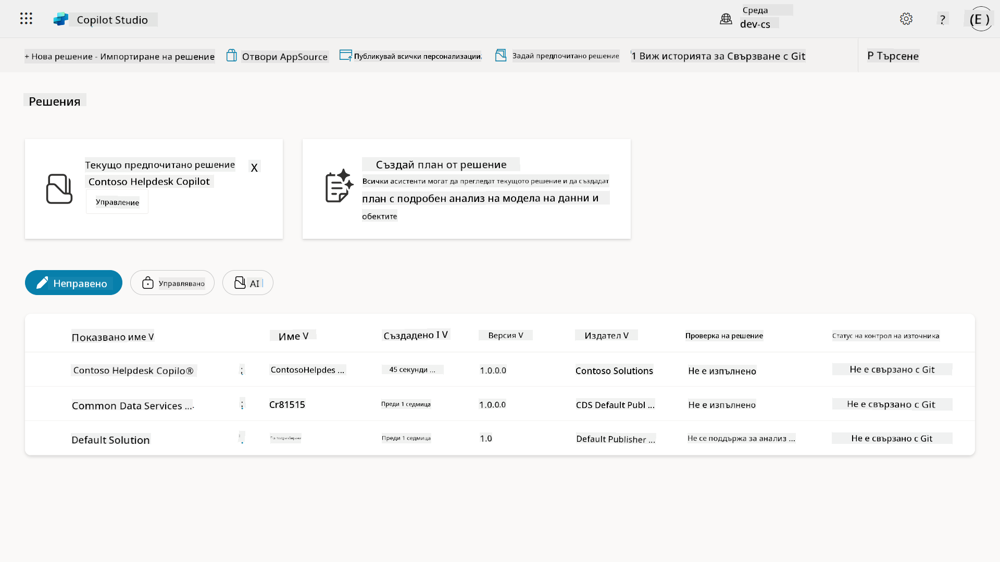

Има два вида решения:

- **Неправени решения** - използвани по време на разработката. Можете свободно да редактирате и персонализирате според нуждите.
- **Правени решения** - използвани, когато сте готови да внедрите вашето приложение за тестване или производство. Те са защитени, за да се предотвратят случайни промени.

## 🤔 Защо _трябва_ да използвам решение за моя агент?

Помислете за решенията като за _кутия с инструменти_. Когато трябва да поправите или изградите нещо (агент) на друго място (среда), събирате всички необходими инструменти (компоненти) и ги поставяте в кутията с инструменти (решение). След това можете да занесете тази кутия на новото място (среда) и да използвате инструментите (компонентите), за да завършите работата си или да добавите нови инструменти (компоненти), за да персонализирате вашия агент или проект, който изграждате.

!!! quote "Елайза, вашият приятелски облачен адвокат, се включва тук 🙋🏻‍♀️, за да сподели няколко думи:"
    Имаме една поговорка в Нова Зеландия: "Бъди чист киви!" - призив към новозеландците 🥝 да поемат отговорност за своята среда, като изхвърлят отпадъците правилно и поддържат обществените пространства чисти. Можем да използваме същия контекст за агентите, като поддържаме всичко, свързано с вашия агент, организирано и преносимо, което ще ви помогне да поддържате чиста среда.

Добра практика е да създадете агент в специално решение във вашата изходна (разработваща) среда. Ето защо решенията са ценни:

🧩 **Организирана разработка**

- Държите вашия агент отделно от стандартното решение, което съдържа всичко в средата. Всички компоненти на вашия агент са на едно място 🎯

- Всичко, което ви е необходимо за вашия агент, е в едно решение, което улеснява експортирането и импортирането в целева среда 👉🏻 това е здравословен навик за ALM.

🧩 **Безопасно внедряване**

- Можете да експортирате вашето приложение или агент като правено решение и да го внедрите в други целеви среди (като тестване или производство), без риск от случайни редакции.

🧩 **Контрол на версиите**

- Можете да създавате корекции (целеви поправки), актуализации (по-обширни промени) или надграждания (замяна на решение - обикновено големи промени и въвеждане на нови функции).

- Помага ви да внедрявате промени по контролиран начин.

🧩 **Управление на зависимости**

- Решенията следят кои части зависят от други. Това ви предпазва от счупване на неща, когато правите промени.

🧩 **Сътрудничество в екип**

- Разработчиците и създателите могат да работят заедно, използвайки неправени решения в разработката, след което да предадат правено решение за внедряване.

## 🪪 Разбиране на издателите на решения

Издателят на решения в Power Platform е като етикет или марка, която идентифицира кой е създал или притежава решението. Това е малка, но важна част от управлението на вашите приложения, агенти и персонализирани потоци, особено когато работите в екипи или между различни среди.

Когато създавате решение, трябва да изберете издател. Този издател определя:

- Префикс, който се добавя към всички персонализирани компоненти (като таблици, полета и потоци).

- Име и контактна информация за организацията или лицето, което притежава решението.

### 🤔 Защо е важно?

1. **Лесна идентификация** - префиксът (например `new_` или `abc_`) ви помага бързо да идентифицирате кои компоненти принадлежат на кое решение или екип.

1. **Избягване на конфликти** - ако два екипа създадат колона, наречена статус, техните префикси (`teamA_status`, `teamB_status`) предотвратяват сблъсъци на имена.

1. **Поддържа ALM** - при преместване на решения между среди (Разработка → Тест → Производство), издателят помага за проследяване на собствеността и поддържане на последователност.

### ✨ Пример

Да кажем, че създавате издател, наречен Contoso Solutions с префикс `cts_`.

Ако добавите персонализирана колона, наречена _Priority_, тя ще бъде съхранена като `cts_Priority` в решението.

Всеки, който срещне колоната на ниво решение, независимо в коя среда се намира, лесно може да я идентифицира като колона, свързана с Contoso Solutions.

## 🧭 Жизнен цикъл на Power Platform решенията

Сега, когато разбирате целта на едно решение, нека научим за жизнения му цикъл.

**1. Създаване на решение в среда за разработка** - започнете със създаването на ново решение във вашата среда за разработка.

**2. Добавяне на компоненти** - добавете приложения, потоци, таблици и други елементи към вашето решение.

**3. Експортиране като правено решение** - пакетирайте вашето решение за внедряване, като го експортирате като правено решение.

**4. Импортиране в тестова среда** - тествайте вашето решение в отделна тестова среда, за да се уверите, че всичко работи както се очаква.

**5. Импортиране в производствена среда** - внедрете тестваното решение в вашата активна производствена среда.

**6. Прилагане на корекции, актуализации или надграждания** - правете подобрения или поправки, използвайки корекции, актуализации или надграждания. 🔁 Повторете цикъла!

### ✨ Пример

Представете си, че изграждате агент за помощен център, който да помага на служителите с проблеми като проблеми с устройствата, отстраняване на мрежови проблеми, настройка на принтери и други.

- Започвате в среда за разработка, използвайки неправено решение.

- След като е готово, го експортирате като правено решение и го импортирате в целева среда, като например среда за системно тестване или приемане от потребители (UAT).

- След тестване го премествате в производствената среда - всичко това без да докосвате оригиналната версия за разработка.

## 🧪 Лаборатория 04: Създаване на ново решение

Сега ще научим

- [4.1 Как да създадем издател на решение](../../../../../docs/recruit/04-creating-a-solution)
- [4.2 Как да създадем решение](../../../../../docs/recruit/04-creating-a-solution)

Ще се придържаме към примера от по-рано, където ще създадем решение в специалната среда на Copilot Studio, за да изградим нашия агент за помощен център.

Да започваме!

### Предварителни условия

#### Роля за сигурност

В Copilot Studio това, което _можете да направите_ в Solution Explorer, зависи от вашата роля за сигурност на потребителя.
Ако нямате разрешение да управлявате решения в Power Apps администраторския център, няма да можете да изпълнявате тези задачи и в Copilot Studio.

За да се уверите, че всичко работи гладко, проверете дали имате правилните роли за сигурност и разрешения. Или ако не управлявате среди във вашата организация, попитайте вашия IT администратор (или еквивалентния екип), който управлява вашия клиент/среди.

Следните са роли за сигурност, които позволяват на потребителите да създават решение в тяхната среда.

| Роля за сигурност    | Описание |
| ---------- | ---------- |
| Създател на среда | Осигурява необходимите разрешения за създаване, персонализиране и управление на ресурси в конкретна среда, включително решения  |
| Персонализатор на система  | По-широки разрешения от Създател на среда, включително възможността за персонализиране на средата и управление на роли за сигурност |
| Администратор на система   | Най-високо ниво на разрешения и може да управлява всички аспекти на средата, включително създаване и присвояване на роли за сигурност     |

#### Среда за разработка

Уверете се, че сте превключили към вашата специална среда за разработка, вижте [Урок 00 - Настройка на курса - Стъпка 3: Създаване на нов разработчик](../00-course-setup/README.md#step-3-create-new-developer-environment).

1. В горния десен ъгъл изберете иконата **Cog wheel** и превключете от стандартната среда към вашата среда, например **Средата на Адел Ванс**.

    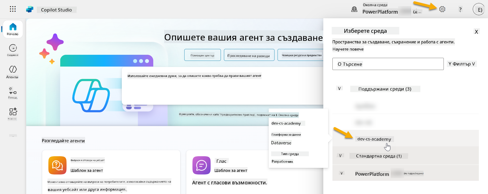

### 4.1 Създаване на издател на решение

1. Използвайки същата среда на Copilot Studio, използвана в предишния урок, изберете **иконата с три точки (. . .)** в менюто отляво в Copilot Studio. Изберете **Решения** под заглавието **Explore**.

    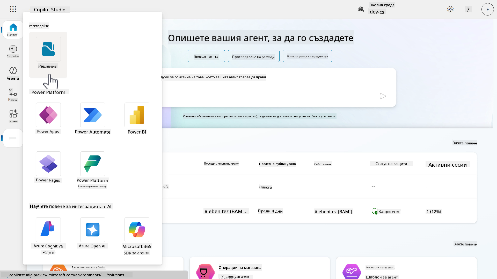

1. **Solution Explorer** в Copilot Studio ще се зареди. Изберете **+ Ново решение**

    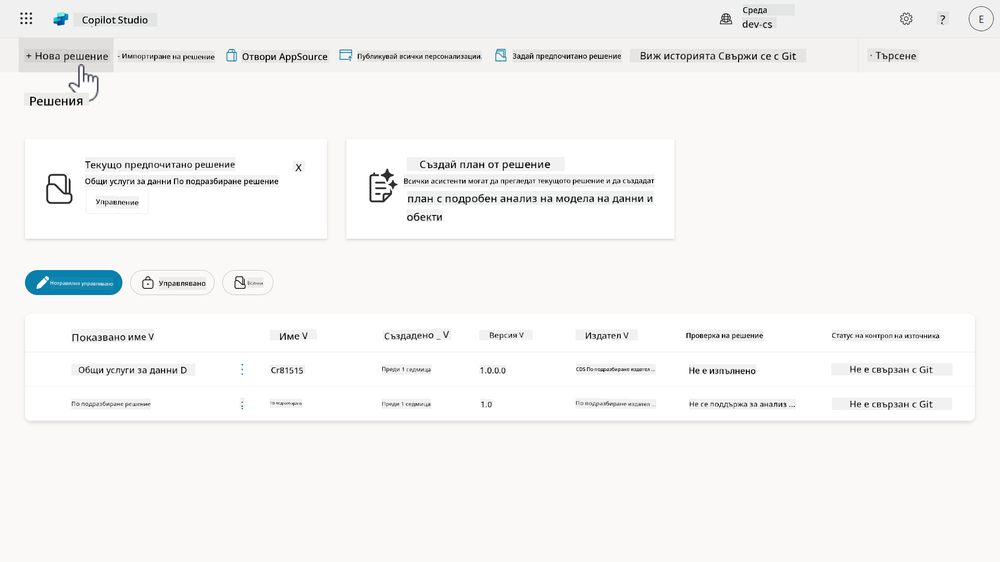

1. Ще се появи панелът **Ново решение**, където можем да дефинираме детайлите на нашето решение. Първо, трябва да създадем нов издател. Изберете **+ Нов издател**.

    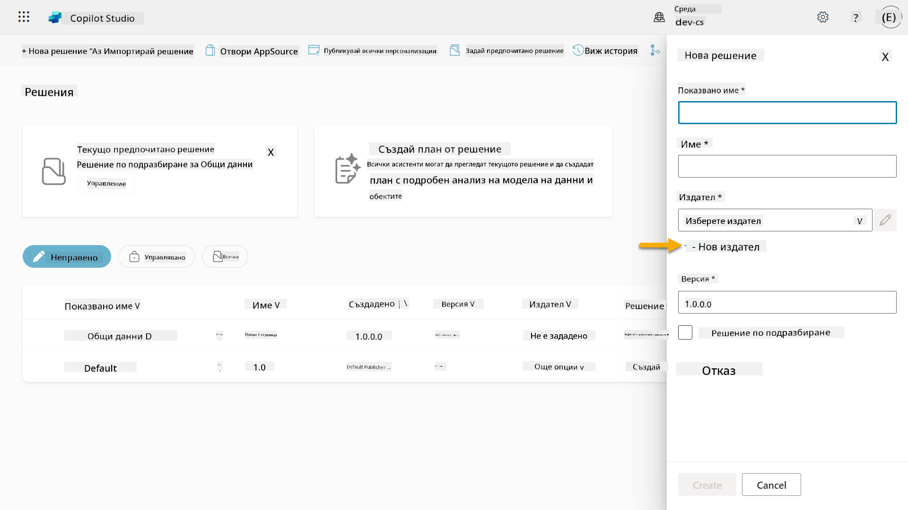  

1. Ще се появи разделът **Свойства** на панела **Нов издател** с задължителни и незадължителни полета, които трябва да бъдат попълнени в раздела **Свойства**. Тук можем да очертаем детайлите на издателя, който ще се използва като етикет или марка, идентифицираща кой е създал или притежава решението.

    | Свойство    | Описание | Задължително |
    | ---------- | ---------- | :----------: |
    | Име за показване | Име за показване на издателя | Да   |
    | Име  | Уникално име и схема на име за издателя  | Да    |
    | Описание   | Очертава целта на решението    | Не     |
    | Префикс    | Префикс на издателя, който ще бъде приложен към новосъздадените компоненти   | Да      |
    | Префикс за стойност на избор   | Генерира число, базирано на префикса на издателя. Това число се използва, когато добавяте опции към избори и предоставя индикатор за това кое решение е използвано за добавяне на опцията.   | Да      |

    Копирайте и поставете следното като **Име за показване**,

    ```text
    Contoso Solutions
    ```

    Копирайте и поставете следното като **Име**,

    ```text
    ContosoSolutions
    ```

    Копирайте и поставете следното като **Описание**,

    ```text
    Copilot Studio Agent Academy
    ```

    Копирайте и поставете следното за **Префикс**,

    ```text
    cts
    ```

    По подразбиране, префиксът за стойност на избор ще показва
1. Панелът за нов издател ще се затвори и ще бъдете върнати обратно към панела **Ново решение** с избрания новосъздаден издател.

    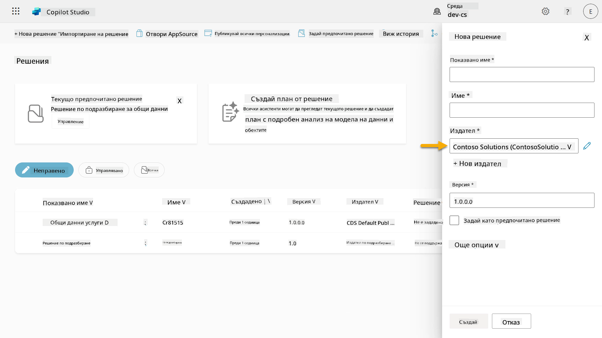  

Поздравления, вече създадохте издател на решения! 🙌🏻 Сега ще научим как да създадем ново персонализирано решение.

### 4.2 Създаване на ново решение

1. Сега, когато сме създали нашите решения, можем да попълним останалата част от формуляра в панела **Ново решение**.

    Копирайте и поставете следното като **Име за показване**,

    ```text
    Contoso Helpdesk Agent
    ```

    Копирайте и поставете следното като **Име**,

    ```text
    ContosoHelpdeskAgent
    ```

    Тъй като създаваме ново решение, [**Версия**](https://learn.microsoft.com/power-apps/maker/data-platform/update-solutions#understanding-version-numbers-for-updates/?WT.mc_id=power-172615-ebenitez) по подразбиране ще бъде `1.0.0.0`.

    Отметнете полето **Задайте като предпочитано решение**.

    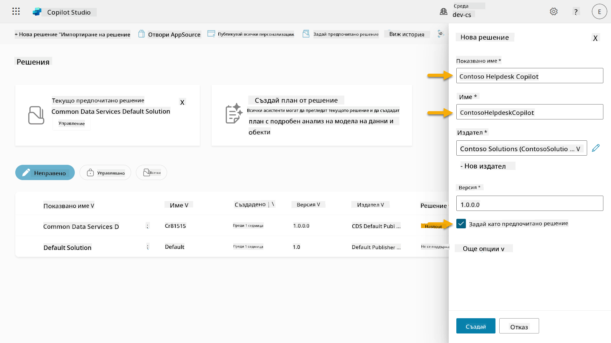  

1. Разгънете **Още опции**, за да видите допълнителни детайли, които могат да бъдат предоставени в решението.

    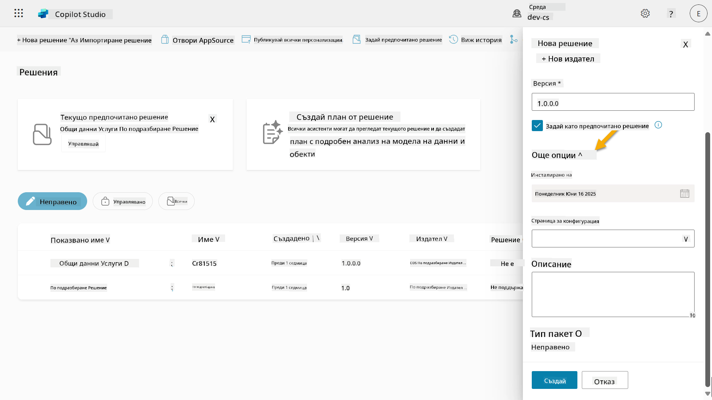

1. Ще видите следното:

    - **Инсталирано на** - датата, на която решението е инсталирано.

    - **Страница за конфигурация** - разработчиците настройват HTML уеб ресурс, който помага на потребителите да взаимодействат с тяхното приложение, агент или инструмент, където ще се появи като уеб страница в секцията Информация с инструкции или бутони. Това се използва най-вече от компании или разработчици, които създават и споделят решения с други.

    - **Описание** - описва решението или предоставя общо описание на страницата за конфигурация.

    Ще оставим тези полета празни за тази лаборатория.

    Изберете **Създай**.

    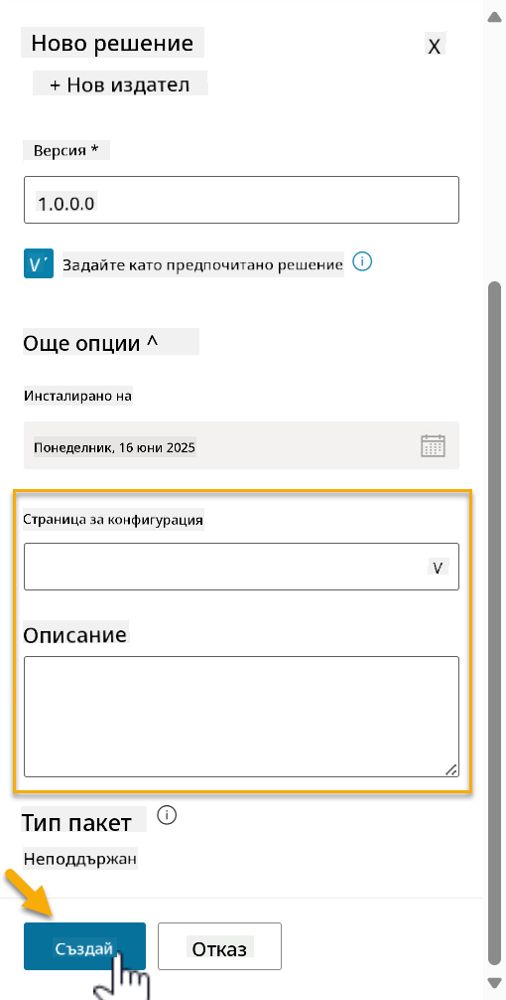

1. Решението за Contoso Helpdesk Agent вече е създадено. Ще има нулеви компоненти, докато не създадем агент в Copilot Studio.

    Изберете иконата **стрелка назад**, за да се върнете към Solution Explorer.

    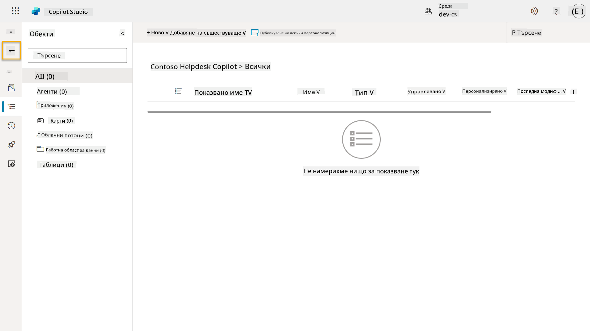

1. Забележете как Contoso Helpdesk Agent вече се показва като **Текущо предпочитано решение**, тъй като по-рано отметнахме полето **Задайте като предпочитано решение**.

    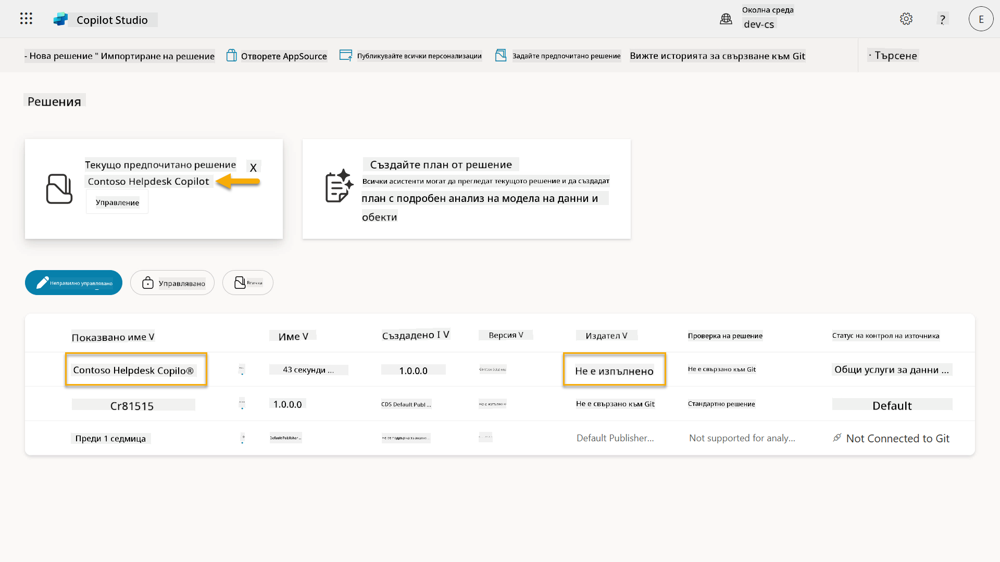

## ✅ Мисията е изпълнена

Поздравления! 👏🏻 Създадохте издател и го използвахте в новосъздаденото решение, за да изградите вашия агент!

Браво, създателю на агенти. Чистият дигитален отпечатък е първата стъпка към оперативност в мащаб. Сега разполагате с инструментите и нагласата за устойчиво, готово за предприятие развитие на агенти.

Това е краят на **Лаборатория 04 - Създаване на решение**, изберете линка по-долу, за да преминете към следващия урок. Вашето решение, създадено в тази лаборатория, ще бъде използвано в лабораторията на следващия урок.

⏭️ [Преминете към урока **Бърз старт с предварително изградени агенти**](../05-using-prebuilt-agents/README.md)

## 📚 Тактически ресурси

🔗 [Създаване на решение](https://learn.microsoft.com/power-apps/maker/data-platform/create-solution/?WT.mc_id=power-172615-ebenitez)

🔗 [Създаване и управление на решения в Copilot Studio](https://learn.microsoft.com/microsoft-copilot-studio/authoring-solutions-overview/?WT.mc_id=power-172615-ebenitez)

🔗 [Споделяне на агенти с други потребители](https://learn.microsoft.com/microsoft-copilot-studio/admin-share-bots/?WT.mc_id=power-172615-ebenitez)

🔗 [Обобщение на наличните ресурси за предварително дефинирани роли за сигурност](https://learn.microsoft.com/power-platform/admin/database-security#summary-of-resources-available-to-predefined-security-roles/?WT.mc_id=power-172615-ebenitez)

🔗 [Надграждане или актуализиране на решение](https://learn.microsoft.com/power-apps/maker/data-platform/update-solutions/?WT.mc_id=power-172615-ebenitez)

🔗 [Преглед на тръбопроводите в Power Platform](https://learn.microsoft.com/power-platform/alm/pipelines/?WT.mc_id=power-172615-ebenitez)

🔗 [Преглед на интеграцията с Git в Power Platform](https://learn.microsoft.com/power-platform/alm/git-integration/overview/?WT.mc_id=power-172615-ebenitez)


---

**Отказ от отговорност**:  
Този документ е преведен с помощта на AI услуга за превод [Co-op Translator](https://github.com/Azure/co-op-translator). Въпреки че се стремим към точност, моля, имайте предвид, че автоматизираните преводи може да съдържат грешки или неточности. Оригиналният документ на неговия роден език трябва да се счита за авторитетен източник. За критична информация се препоръчва професионален човешки превод. Ние не носим отговорност за каквито и да е недоразумения или погрешни интерпретации, произтичащи от използването на този превод.