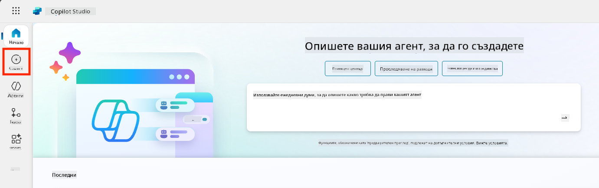
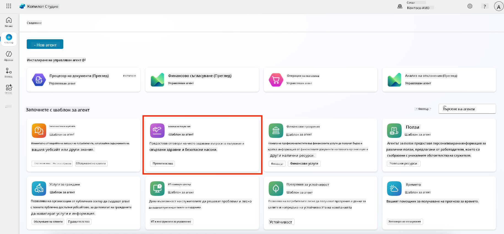
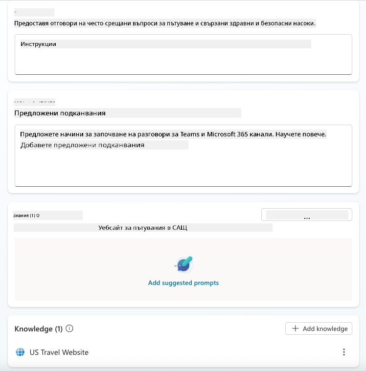
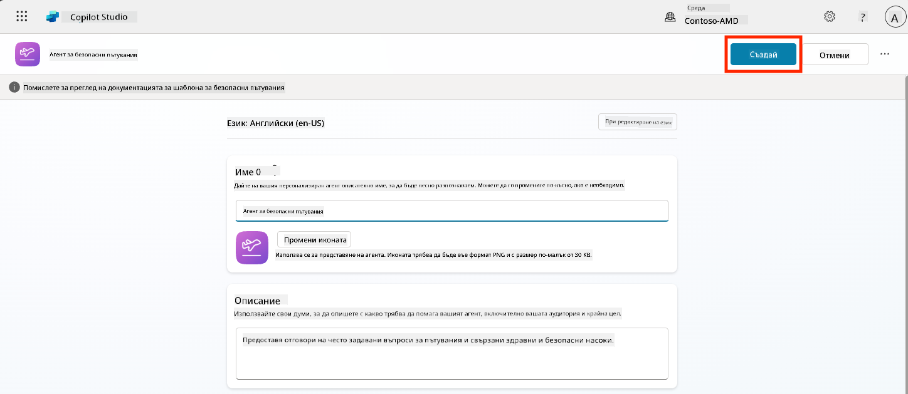
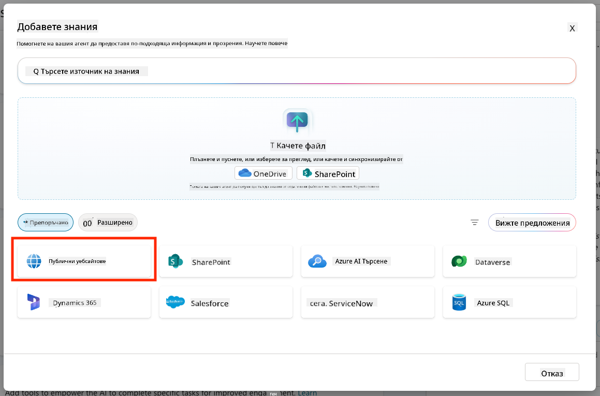
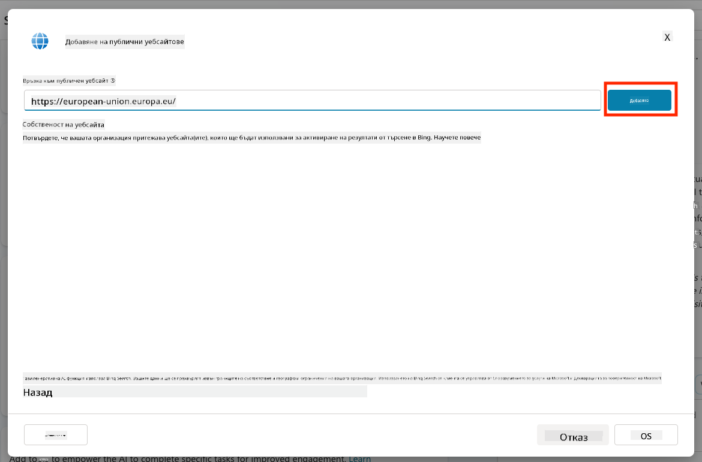
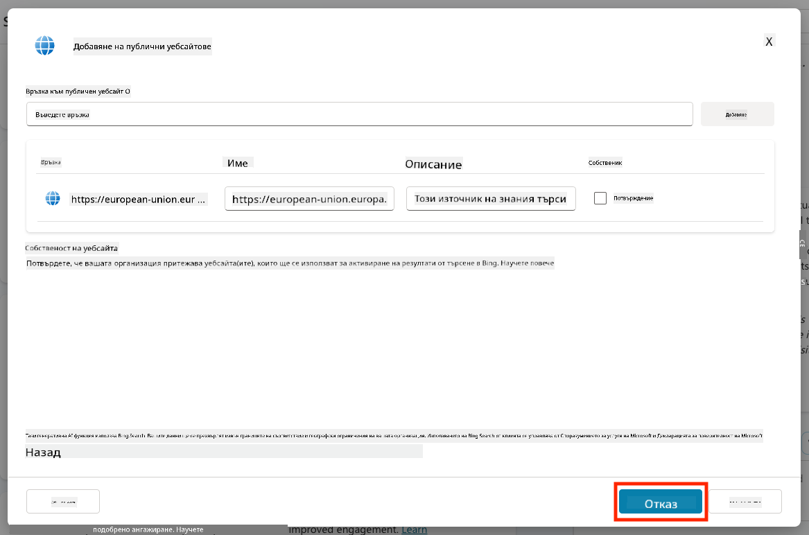
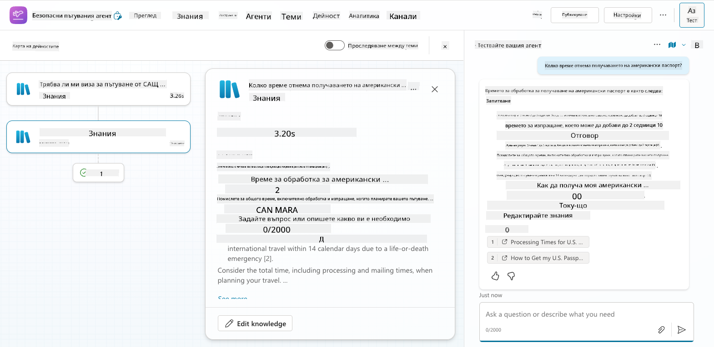
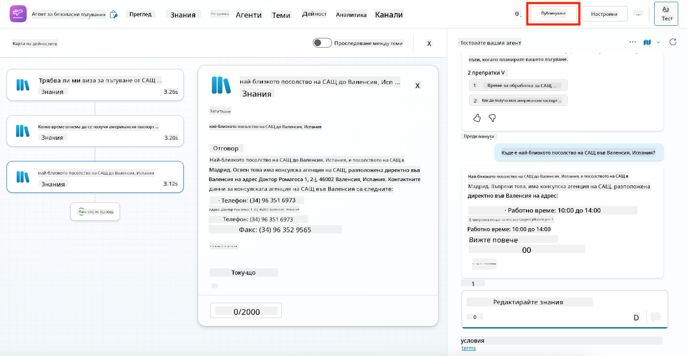

<!--
CO_OP_TRANSLATOR_METADATA:
{
  "original_hash": "8e2c64a7f9303e58329ec8bb468c80b4",
  "translation_date": "2025-10-20T23:47:06+00:00",
  "source_file": "docs/recruit/05-using-prebuilt-agents/README.md",
  "language_code": "bg"
}
-->
# 🧰 Мисия 05: Използване на предварително създаден агент  

## 🕵️‍♂️ КОДОВО ИМЕ: `ОПЕРАЦИЯ БЕЗОПАСНИ ПЪТУВАНИЯ`

> **⏱️ Времеви прозорец на операцията:** `~30 минути`

🎥 **Гледайте видео ръководството**

## 🎯 Кратко описание на мисията

Добре дошли в следващата си мисия в Академията за агенти на Copilot Studio. Сега ще изследвате света на **предварително създадените агенти**—интелигентни, целенасочени агенти, създадени от Microsoft, за да ускорят внедряването и да намалят времето за постигане на резултати.

Вместо да изграждате от нулата, предварително създадените агенти (наричани също **шаблони за агенти**) ви дават преднина, като предоставят готови за използване сценарии, които можете да персонализирате и внедрите за минути.

В тази мисия ще внедрите агента **Safe Travels**—агент, който помага на вашите потребители да се подготвят за бизнес пътувания, да разбират политиките на компанията и да улесняват планирането.

---

## 🧭 Цели

Вашите цели за тази мисия са:

1. Да разберете какво представляват предварително създадените агенти и защо са важни  
1. Да внедрите шаблона за агент **Safe Travels**  
1. Да персонализирате отговорите и съдържанието на агента  
1. Да тествате и публикувате агента  

---

## 🧠 Какво представляват предварително създадените агенти?

Предварително създадените агенти са готови за използване AI агенти, създадени от Microsoft, които:

- Отговарят на често срещани бизнес нужди (като пътувания, човешки ресурси, IT поддръжка)
- Включват напълно функциониращи теми, ключови фрази, инструкции и примерни знания.
- Могат да бъдат редактирани, разширявани и свързани с вашите собствени данни

Тези агенти са идеални за бърз старт или за изучаване на структурата на агентите.

---

## 🧪 Лаборатория 05: Бърз старт с предварително създаден агент

Сега ще научим как да изберем предварително създаден агент и да го персонализираме.

- [5.1 Стартиране на Copilot Studio](../../../../../docs/recruit/05-using-prebuilt-agents)
- [5.2 Избор на шаблон за агент Safe Travels](../../../../../docs/recruit/05-using-prebuilt-agents)
- [5.3 Персонализиране на агента](../../../../../docs/recruit/05-using-prebuilt-agents)
- [5.4 Тестване и публикуване](../../../../../docs/recruit/05-using-prebuilt-agents)

Ще се придържаме към примера от по-рано, където ще създадем решение в специалната среда на Copilot Studio, за да изградим нашия агент за IT помощен център.

Да започваме!

### 5.1 Стартиране на Copilot Studio

1. Отидете на [https://copilotstudio.microsoft.com](https://copilotstudio.microsoft.com)

1. Влезте с вашия служебен или училищен акаунт в Microsoft 365

!!! warning
    Трябва да сте в клиент, където Copilot Studio е активиран. Ако не виждате Copilot Studio, върнете се към [Мисия 00](../00-course-setup/README.md), за да завършите настройката си.

### 5.2 Избор на шаблон за агент Safe Travels

1. От началната страница на Copilot Studio, кликнете **+ Create**
    

1. Превъртете надолу до секцията **Start with an agent template**

1. Намерете и изберете **Safe Travels**

    

1. Забележете, че шаблонът идва предварително зареден с описание, инструкции и знания.

    

1. Кликнете **Create**

    

Това ще създаде нов агент във вашата среда, базиран на конфигурацията на Safe Travels.

### 5.3 Персонализиране на агента

След като агентът е създаден, нека го адаптираме към вашата организация:

1. Изберете **Enabled generative AI**, за да активирате функцията за генериращ AI, така че да може да използва предоставените инструкции в шаблона.

    

1. Сега ще оборудваме агента с допълнителен източник на знания, за да може да отговаря на въпроси за пътувания в Европа. За целта превъртете надолу до секцията **knowledge** и изберете **Add knowledge**

    

1. Изберете **Public websites**

    

1. В текстовото поле поставете **<https://european-union.europa.eu/>** и изберете **Add**

    

1. Изберете **Add to agent**

    

### 5.4 Тестване и публикуване

1. Кликнете **Test** в горния десен ъгъл, за да стартирате прозореца за тестване  

1. Опитайте фрази като:

    - `“Трябва ли ми виза, за да пътувам от САЩ до Амстердам?”`
    - `“Колко време отнема да се издаде американски паспорт?”`
    - `“Къде е най-близкото американско посолство във Валенсия, Испания?”`

1. Потвърдете, че агентът отговаря с точна и полезна информация и наблюдавайте Activity Map, за да видите откъде е извлечена информацията.

    

1. Когато сте готови, кликнете **Publish**

    

1. Изберете **Publish** отново в диалоговия прозорец
    

1. По желание добавете агента към Microsoft Teams, използвайки вградената функция **Channels**.

!!! note "🧳 Допълнителна цел"
    Опитайте да свържете агента Safe Travels със сайт в SharePoint или файл с често задавани въпроси, за да го направите по-релевантен към политиките за пътуване на вашата компания.

## ✅ Мисията е изпълнена

Вече успешно:

- Внедрихте предварително създаден агент на Microsoft  
- Персонализирахте агента
- Тествахте и публикувахте своя собствена версия на шаблона за агент **Safe Travels**

⏭️ [Преминете към урока **Създаване на персонализиран агент от нулата**](../06-create-agent-from-conversation/README.md).

<!-- markdownlint-disable-next-line MD033 -->

---

**Отказ от отговорност**:  
Този документ е преведен с помощта на AI услуга за превод [Co-op Translator](https://github.com/Azure/co-op-translator). Въпреки че се стремим към точност, моля, имайте предвид, че автоматизираните преводи може да съдържат грешки или неточности. Оригиналният документ на неговия роден език трябва да се счита за авторитетен източник. За критична информация се препоръчва професионален човешки превод. Ние не носим отговорност за каквито и да било недоразумения или погрешни интерпретации, произтичащи от използването на този превод.