<!--
CO_OP_TRANSLATOR_METADATA:
{
  "original_hash": "dcbcd9396b076da0a0f5d389e9ec1b12",
  "translation_date": "2025-10-20T23:48:47+00:00",
  "source_file": "docs/recruit/08-add-adaptive-card/README.md",
  "language_code": "bg"
}
-->
# 🚨 Мисия 08: Подобряване на взаимодействията с потребителите в Теми с Адаптивни карти

## 🕵️‍♂️ КОДОВО ИМЕ: `ОПЕРАЦИЯ ПОДОБРЕНИЕ НА ИНТЕРФЕЙСА`

> **⏱️ Времеви прозорец на операцията:** `~45 минути`

🎥 **Гледайте демонстрацията**

[](https://www.youtube.com/watch?v=RhIlzYHPCXo "Гледайте демонстрацията в YouTube")

## 🎯 Кратко описание на мисията

Агенти, вашата мисия е да проникнете в статичния потребителски интерфейс и да го замените с богати, динамични и интерактивни адаптивни карти. Ще използвате JSON структури и формули на Power Fx, за да трансформирате разговорите в Copilot Studio от обикновени въпроси и отговори в напълно интерактивни взаимодействия. Вашата цел е да събирате потребителски данни, да представяте информация красиво и да насочвате разговорите с прецизност и стил. Ако не успеете да се адаптирате, вашите потребители може да се насочат към по-малко интелигентни интерфейси.

## 🔎 Цели

В тази мисия ще научите:

1. Какво представляват адаптивните карти и как подобряват взаимодействията с потребителите в Copilot Studio
1. Как да създавате интерактивни карти с помощта на JSON и формули на Power Fx за динамично съдържание
1. Изследване на дизайнера на адаптивни карти и неговите ключови компоненти за визуално създаване на карти
1. Създаване на богати, интерактивни форми и опит за събиране на данни в теми на агенти
1. Прилагане на най-добри практики за проектиране на адаптивни карти, които са отзивчиви и удобни за потребителя

## 🤔 Какво е адаптивна карта?

**Адаптивна карта** е начин за създаване на интерактивни, визуално богати елементи на потребителския интерфейс, които могат да бъдат вградени в приложения като Microsoft Teams, Microsoft Outlook или агенти. Това е структурен JSON обект, който определя оформлението и съдържанието на картата:

- Какви елементи се появяват на картата - текст, изображения, бутони
- Как са подредени тези елементи
- Какви действия могат да предприемат потребителите, като например изпращане на форма или отваряне на връзка

    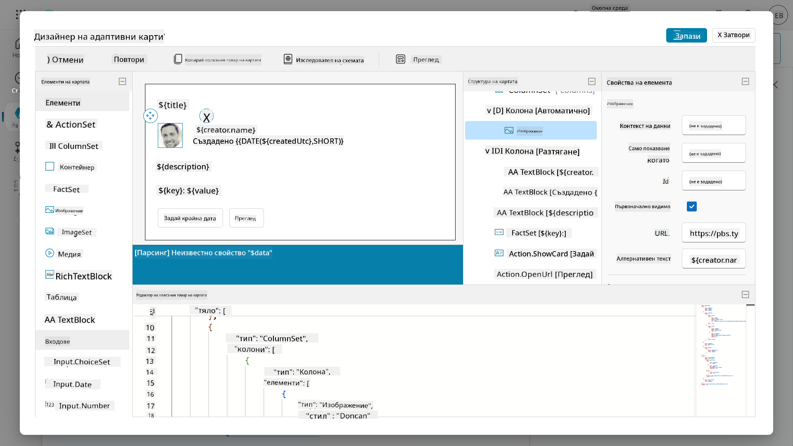

### Защо адаптивните карти са важни в Copilot Studio

Представете си, че създавате агент, който пита потребителите за тяхното име, имейл или обратна връзка. Ако използвате само обикновен текст, разговорът може да изглежда скучен или труден за следване. Тук идват адаптивните карти!

1. **Правят разговорите интерактивни** - вместо да изпращате текст като съобщения на потребителя, можете да показвате бутони, форми, изображения и други.
    - Пример: карта може да поиска от потребителя да попълни своето име и имейл в чиста форма.

1. **Изглеждат добре навсякъде** - Адаптивните карти автоматично съответстват на стила на приложението, в което се намират, като Microsoft 365 Copilot чат или Microsoft Teams. Не е нужно да се притеснявате за тъмен режим, шрифтове или оформления - те се адаптират.

1. **Лесни за създаване с JSON** - дефинирате картата с помощта на JSON код (мислете за него като _рецепта_ за потребителския интерфейс). Copilot Studio ви помага да прегледате картата си, преди да я добавите към темата.

1. **Събиране и използване на данни** - можете да използвате картата, за да задавате въпроси, да събирате отговори и да използвате тези данни в потока на разговора.
    - Пример: Попитайте за телефонния номер на потребителя, след което покажете карта за потвърждение с неговия телефонен номер.

1. **Подобряване на потребителския опит** - картите правят вашия агент да изглежда по-интерактивен. Това е по-чист, кликаем и удобен за потребителя тип интерфейс.

## 🐱 JSON - човек ли е?

Произнася се като "Джейсън", но не е човек 😅

JSON, известен още като _JavaScript Object Notation_, е лек формат, използван за структуриране на данни. Лесен е за четене и писане и изглежда като серия от двойки ключ-стойност вътре в къдрави скоби {}.

Това е един от вариантите за използване при добавяне на адаптивна карта към вашата тема.

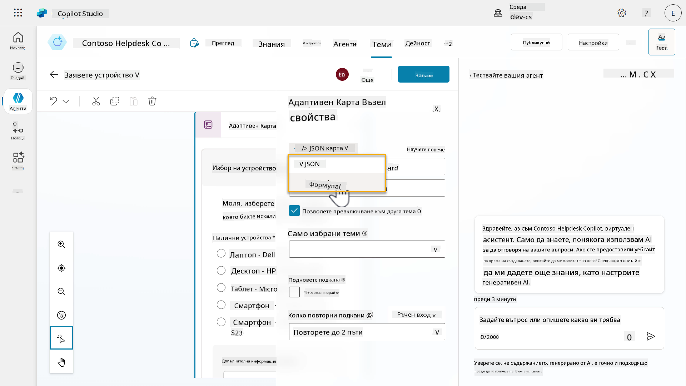

## 👀 Виждам друг вариант за създаване на адаптивна карта с помощта на _формула_

Спомняте ли си как научихме за Power Fx в [Мисия 07 - Използване на Power Fx във вашите възли](../07-add-new-topic-with-trigger/README.md#what-power-fx-can-do-in-topics)? Същото може да се приложи в адаптивни карти в Copilot Studio.

Като припомняне,

!!! note
    Power Fx е програмен език с нисък код, използван за добавяне на логика и динамично поведение към вашия агент. Това е същият език, използван в Microsoft Power Apps, и е проектиран да бъде прост и подобен на Excel, което го прави лесен за разработчици и хора без технически умения.

### Как работи Power Fx в адаптивни карти

Когато проектирате адаптивна карта в Copilot Studio, можете да използвате формули на Power Fx за:

- Динамично вмъкване на стойности като имена на потребители, дати или статуси.
- Форматиране на текст или числа, като показване на валута или закръгляване на числа.
- Показване или скриване на елементи въз основа на условия.
- Персонализиране на отговори въз основа на потребителски вход, променливи, изходи от възли на разговор.

Например,

"`Здравей`" & `System.User.DisplayName`

Тази формула комбинира думата "Здравей" с името на потребителя динамично.

### Защо е полезно

1. **Персонализация**

    Можете да адаптирате съобщението към всеки потребител, правейки взаимодействията по-естествени и релевантни.

1. **Динамично съдържание**

    Картите могат да показват реални данни от променливи и изходи от възли на разговор.

1. **Интелигентна логика**

    Можете да контролирате какво виждат или с какво взаимодействат потребителите въз основа на условия, подобрявайки използваемостта и намалявайки грешките.

1. **Подходящ за нисък код**

    Power Fx е програмен език с нисък код. Както беше споменато по-рано, той е четим, интуитивен и подобен на формули в Excel.

## 👷🏻‍♀️ Създаване с дизайнера на адаптивни карти

**Дизайнерът на адаптивни карти** е визуален инструмент, който ви позволява да създавате интерактивни съобщения с карти, използвайки елементи за влачене и пускане като текст, изображения, бутони и входове. Неговата цел е да ви помогне да създавате богати, динамични съобщения без писане на сложен код, което улеснява проектирането на удобни за потребителя интерфейси.

Инструментът за дизайн ви помага да изградите картата визуално, но зад кулисите той генерира JSON обекта за вас. Можете също така да превключите на _формула_, която позволява използването на изрази на Power Fx в картата за показване на данни от други места.

## 🎨 Разбиране на дизайнера на адаптивни карти

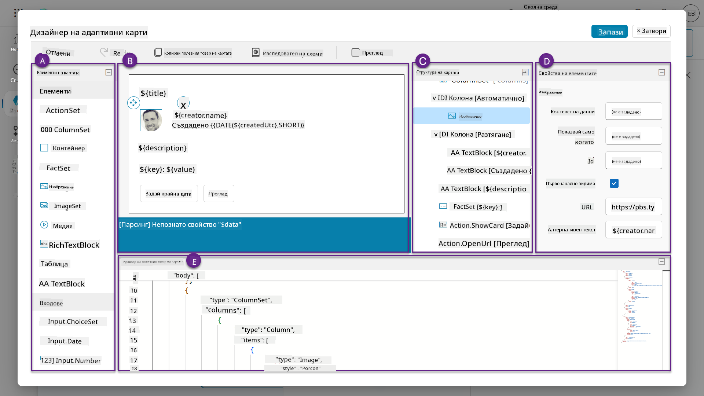

### A) Елементи на картата

Това са градивните елементи на вашата адаптивна карта. Можете да влачите и пускате елементи като следните:

- **TextBlock** за показване на текст.
- **Image** за показване на изображения.
- **FactSet** за двойки ключ-стойност.
- **Input fields** за показване на текстови полета, избор на дата, превключватели.
- **Actions** за показване на бутони като _Submit_, _Open URL_ или _Show Card_.

Всеки елемент има своя цел и може да бъде стилизиран или конфигуриран.

### B) Преглед на картата

Това е **областта за преглед**, където виждате как ще изглежда вашата карта в реално време. Докато добавяте или редактирате елементи, прегледът се актуализира незабавно, за да отрази промените. Това ви позволява да правите итеративни актуализации и да виждате резултата от дизайна едновременно.

### C) Структура на картата

Това показва **йерархията и оформлението** на вашата карта. Например:

- Картата може да започне с **TextBlock** за заглавие.
- След това **ColumnSet** с изображение от едната страна и текст от другата.
- Последвано от **FactSet** и някои **Action бутони**.

Това ви помага да разберете как елементите са вложени и организирани.

### D) Свойства на елемента

Когато кликнете върху който и да е елемент в картата, този панел ви позволява да **персонализирате неговите настройки**:

- Промяна на размера, теглото или цвета на текста.
- Задаване на URL адреси на изображения или алтернативен текст.
- Конфигуриране на опции за вход като текст за подсказка или стойности по подразбиране.

Тук можете да настроите всеки елемент.

### E) Редактор на структурата на картата

Това е **суровият JSON код** зад вашата карта. Напредналите потребители могат да го редактират директно за:

- Използване на функции за шаблониране.
- Копиране/поставяне на дефиниции на карти.

Дори ако сте нови в дизайнера на адаптивни карти, е полезно да видите как визуалният дизайн се превежда в кодове.

!!! tip "Съвет - Разгледайте примерите за адаптивни карти"

    1. Отидете на [https://adaptivecards.microsoft.com/designer](https://adaptivecards.microsoft.com/designer).
    2. Изберете **Нова карта**, за да видите списък с примери, които можете да изберете и модифицирате.
    3. Имайте предвид, че този дизайнер е външен (уеб-базиран). Когато създавате вашата карта в уеб-базирания дизайнер на адаптивни карти, копирайте JSON от редактора на структурата на картата.
    4. Поставете JSON в адаптивната карта във вашия агент в Copilot Studio.

    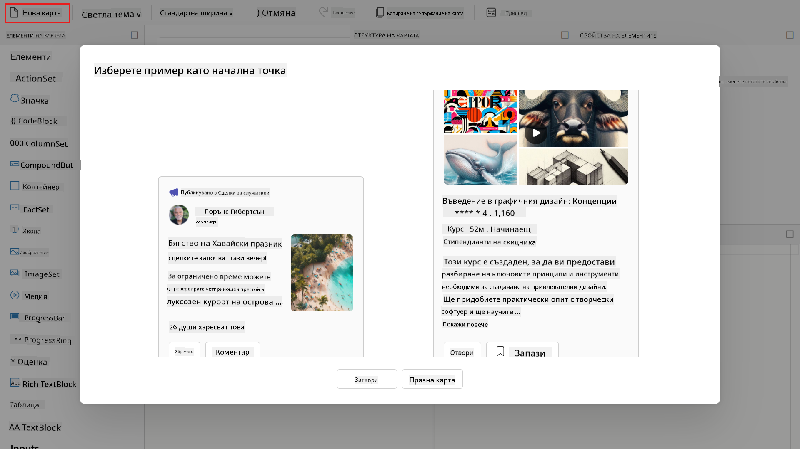

## 🌵 Чести случаи на употреба

Следните са чести случаи на употреба на адаптивни карти в Copilot Studio, когато се използват в възлите **Изпрати съобщение** или **Задай въпрос**.

1. **Форми и събиране на данни**

    Използвайте адаптивни карти за събиране на структурирани входни данни от потребителите, като например:

    - Заявки за отпуск
    - Форми за обратна връзка
    - Контактна информация
    - График за срещи

1. **Показване на динамична информация**

    Показва на потребителите персонализирани или реални данни в чист, четим формат от корпоративни източници като ServiceNow, SAP, Dynamics 365, SharePoint и др.

    - Резюмета на поръчки
    - Баланси по сметки
    - Статус на билети или случаи
    - Предстоящи събития или крайни срокове

1. **Интерактивни избори**

    Позволете на потребителите да правят избори директно в разговора:

    - Избор от списък с опции, например продуктови категории, теми за поддръжка.
    - Потвърждение или отказ на действие.
    - Оценка на услуга или опит.

1. **Задействане на действия**

    Включете бутони, които задействат допълнителни стъпки в разговора вътрешно или външно.

    - "Изпрати заявка"
    - "Преглед на детайли"

## ⭐ Най-добри практики

Ето някои най-добри практики за създаване на адаптивни карти за агенти в Copilot Studio.

1. **Поддържайте го просто и фокусирано**

    - Проектирайте карти с ясна цел, не ги претоварвайте с твърде много елементи.
    - Използвайте кратък текст и интуитивни оформления, за да насочвате потребителите през взаимодействието.

1. **Бъдете целенасочени с входовете**

    - Включвайте само необходимите входни елементи като текст, избор на дата, за да избегнете претоварване на потребителите.
    - Използвайте етикети, за да направите входовете лесни за разбиране.

1. **Структурирайте за четимост**

    - Използвайте **TextBlocks** за заглавия и инструкции.
    - Групирайте свързани елементи, използвайки **Containers** или **ColumnSets**, за да подобрите визуалния поток.

1. **Направете елементите за действие ясни**

    - Използвайте **Action.Submit** и/или **Action.OpenUrl** с ясни заглавия на бутони като "Изпрати заявка" или "Преглед на детайли".
    - Избягвайте неясни етикети като "Кликнете тук".

1. **Проектирайте за адаптивност**

    - Предположете, че картата може да бъде преглеждана на различни размери на екрана.
    - Избягвайте фиксирани ширини и използвайте гъвкави оформления като **ColumnSets** за отзивчивост.

1. **Използвайте динамично съдържание, когато е възможно**

    - Свържете елементи на картата с променливи или изходи от възли, използвайки Power Fx, за да персонализирате потребителския опит.
    - Например, показвайте името на потребителя или текущия статус динамично.

## 🧪 Лаборатория 08 - Добавяне на адаптивни карти и подобряване на възможностите на темите

Сега ще научим как да подобрим нашата тема с адаптивни карти и използване на разширена функционалност на теми и възли.

- [8.1 Създаване на нова тема с адаптивна карта за потребителя да изпрати своята заявка](../../../../../docs/recruit/08-add-adaptive-card)
- [8.2 Актуализиране на инструкциите на агента за извикване на тема за заявка на устройство](../../../../../docs/recruit/08-add-adaptive-card)

### ✨ Случай на употреба

**Като** служител

**Искам да** заявя устройство

**За да мога** да заявя устройство от списъка с налични устройства

Да започваме!

### Предварителни условия

1. **Списък в SharePoint**

    Ще използваме списъка **Devices** в SharePoint от [Урок 00 - Настройка на курса - Стъпка 3: Създаване на нов сайт в SharePoint](../00-course-setup/README.md#step-4-create-new-sharepoint-site).

    Ако не сте настроили списъка **Devices** в SharePoint, моля, върнете се към [Урок 00 - Настройка на курса - Стъпка 3: Създаване на нов сайт в SharePoint](../00-course-setup/README.md#step-4-create-new-sharepoint-site).

1. **Contoso Helpdesk Copilot**

    Ще използваме същия агент, създаден по-рано в [Урок 06 - Създаване на персонализиран
1. След това добавете възел **Ask with adaptive card**. Този възел ще покаже интерактивна карта, чрез която потребителят може да избере устройството, което желае да заяви.

    

1. Изберете възела и ще се появи панелът **Adaptive Card Node properties**. Сега ще редактираме JSON. Изберете **Edit adaptive card**. Изберете **Edit adaptive card**.

    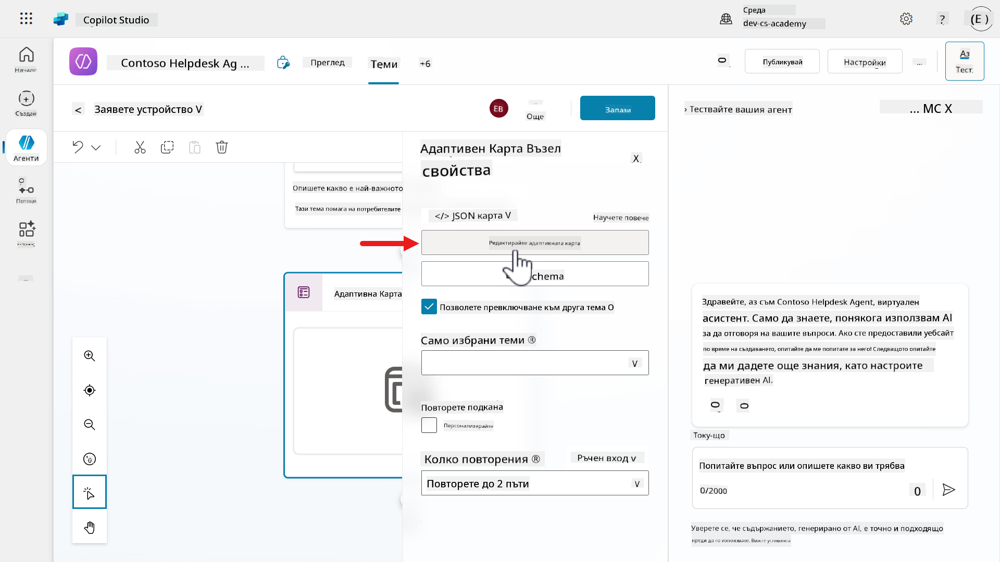

1. Това е **Adaptive Card Designer**, където можете да проектирате вашата карта и да видите дизайна на картата в реално време.

    Опитайте да плъзнете и пуснете елементите на картата **TextBlock** и **FactSet** върху платното за създаване, зоната за преглед на картата. Забележете как структурата на картата и редакторът на картовия payload се актуализират, когато добавите двата елемента на картата. Можете директно да актуализирате редактора на картовия payload и панела със свойства на елементите.

    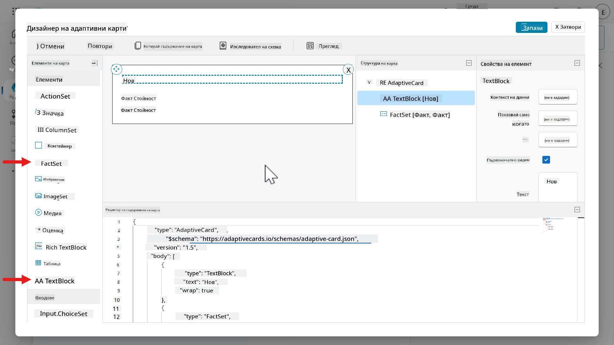

1. Изберете **Preview**, за да видите картата в различни ширини.

    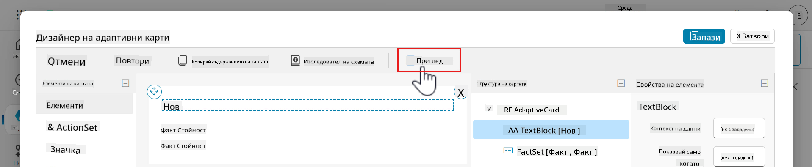

1. Прегледът ще се зареди, където ще видите различни изходи на картата според ширината.

    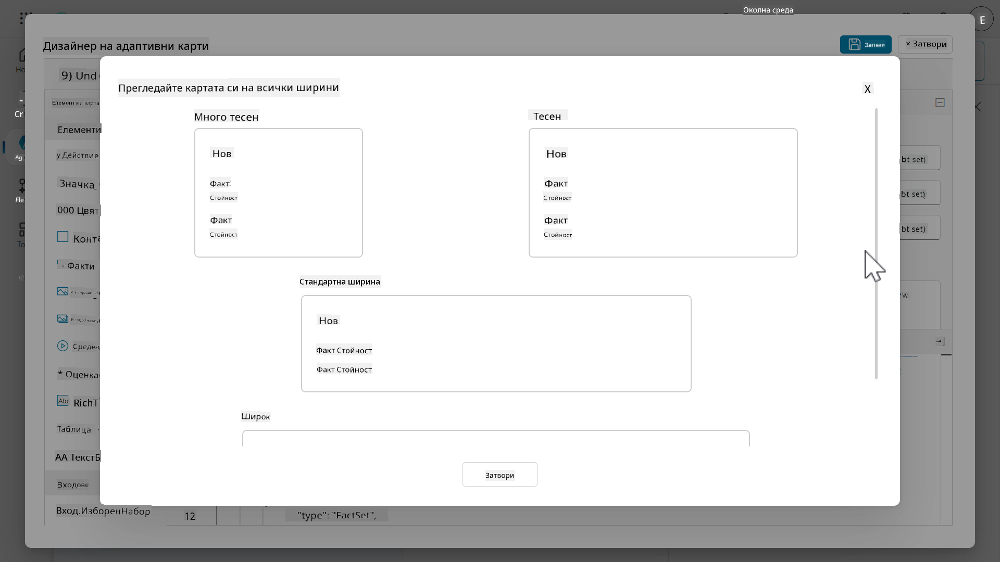

1. Излезте от **Preview**, като изберете **x иконата**, и изберете **Undo** в дизайнера, за да премахнете двата елемента на картата, които бяха добавени преди това.

    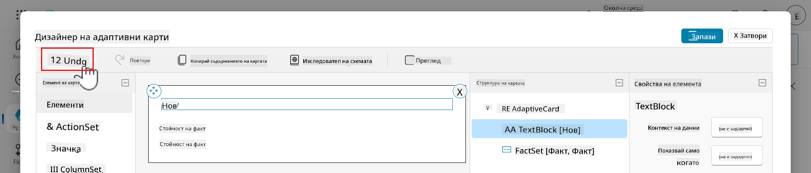

1. Кликнете в **Card payload editor** и изберете всички редове, използвайки клавишната комбинация на Windows _Ctrl + A_ или на Mac _Command + A_, след което изтрийте редовете. **Поставете** JSON от [Request devices .JSON file](../../../../../docs/recruit/08-add-adaptive-card/assets/8.1_RequestDevice.json).

    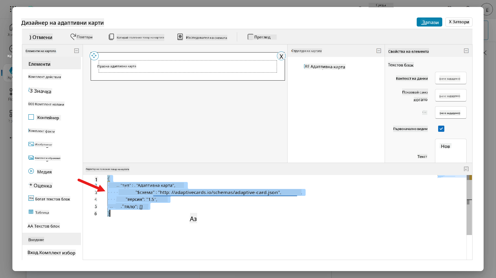

1. Забележете как **Card Preview** вече включва елементи, които показват текст и списък с налични устройства.

    Този JSON в момента е заместител и преглед на това, което ще използваме като основа за нашата карта, но във формата на формула, а не JSON, тъй като ще се позоваваме на **глобалната променлива**, `Global.VarDevices.value`, която съхранява отговора на действието **Get items** от SharePoint connector.

    Изберете **Save** и изберете **Close**, за да излезете от модала на Adaptive card designer.

    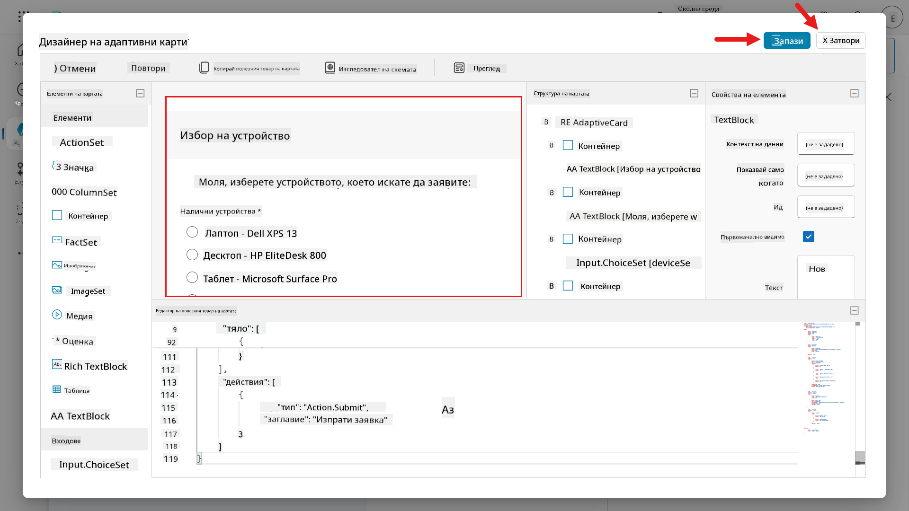

1. Затворете панела **Adaptive Card Node properties**, като изберете **X иконата**.

    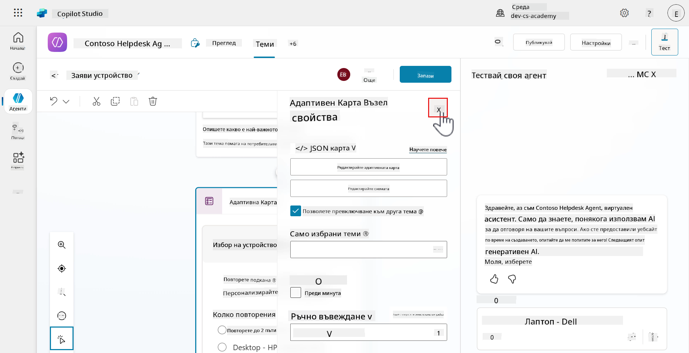

1. В платното за създаване на темата ще видите адаптивната карта.

    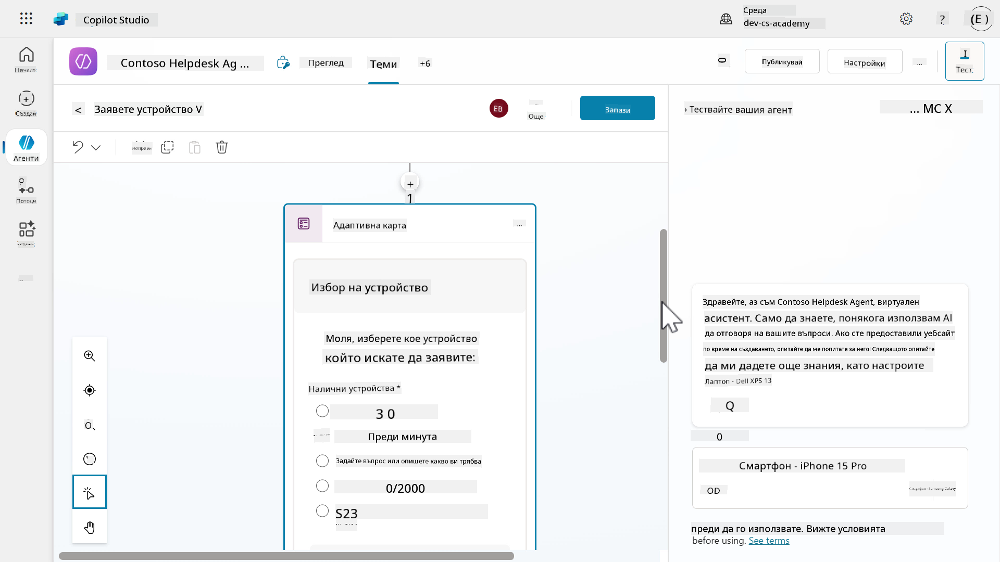

1. Превъртете до дъното на възела и ще видите изходни променливи. `commentsId` и `deviceSelectionId` са дефинирани в свойствата на елемента. Тези две променливи ще съхраняват стойности от елементите на картата, с които потребителите взаимодействат. Тези стойности ще бъдат използвани по-нататък в темата, което ще научим в лабораторията на следващия урок.

    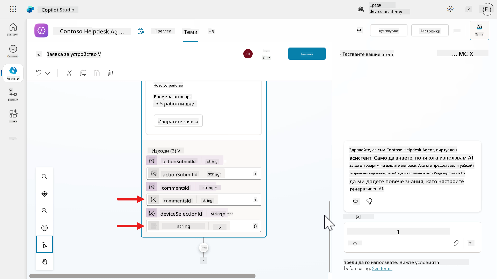

1. Сега ще актуализираме картата от JSON към формула, тъй като ще използваме Power Fx отново, за да преминем през елементите, върнати в действието **Get items** от SharePoint connector, съхранени в **глобалната променлива**, `Global.VarDevices.value`, чрез свойството `value` на JSON отговора.

    > Създадохме тази глобална променлива в [Lab 07 - Add a new topic with conversation nodes, 7.3 Add a tool using a connector](../07-add-new-topic-with-trigger/README.md#73-add-a-tool-using-a-connector).

    Изберете картата във възела **Ask with Adaptive Card**, след което изберете **chevron** иконата и изберете **Formula**.

    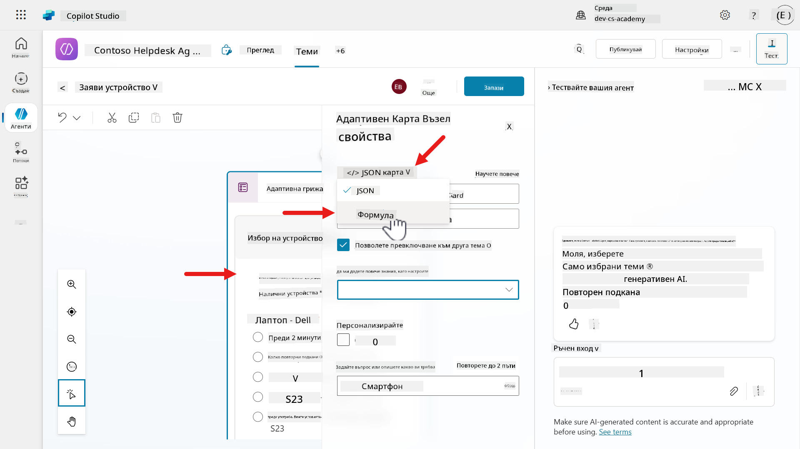

1. Кликнете върху **expand** иконата, за да увеличите полето за формула.

    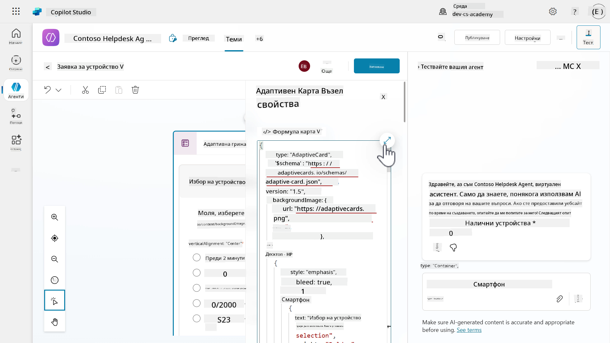

1. Кликнете в **Card payload editor** и изберете всички редове, използвайки клавишната комбинация на Windows _Ctrl + A_ или на Mac _Command + A_, след което изтрийте редовете.

    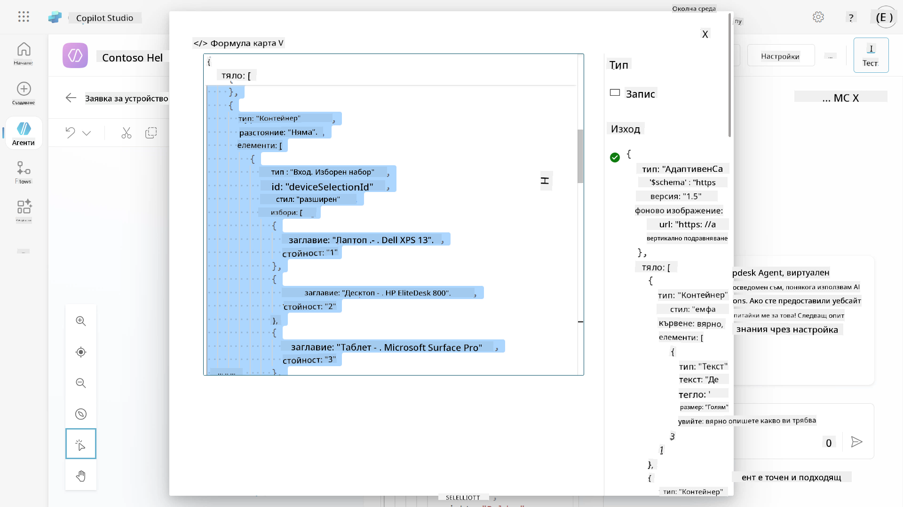

    Поставете формулата от [Request Devices formula file](../../../../../docs/recruit/08-add-adaptive-card/assets/8.1_RequestDeviceFormula.txt).

1. Във формулата ще преминем през всеки елемент от списъка на SharePoint, използвайки функцията `For All`, за да покажем стойностите на `Model` в заглавието на опцията за избор, а елементът `ID` от SharePoint се позовава като стойност. Също така обвиваме стойностите с функциите `If(IsBlank()`, тъй като формулата очаква стойност, за да рендерира адаптивната карта в платното за създаване на темата. В противен случай ще видите съобщение "Property cannot be null".

    **Затворете** модала на картата.

    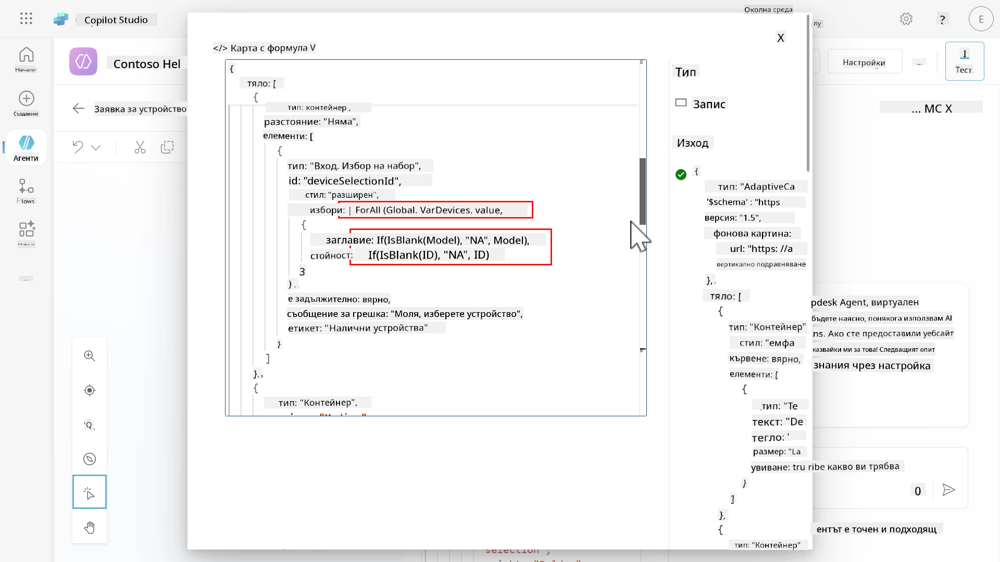

1. **Затворете** панела **Adaptive Card Node properties**.

1. **Запазете** темата.

    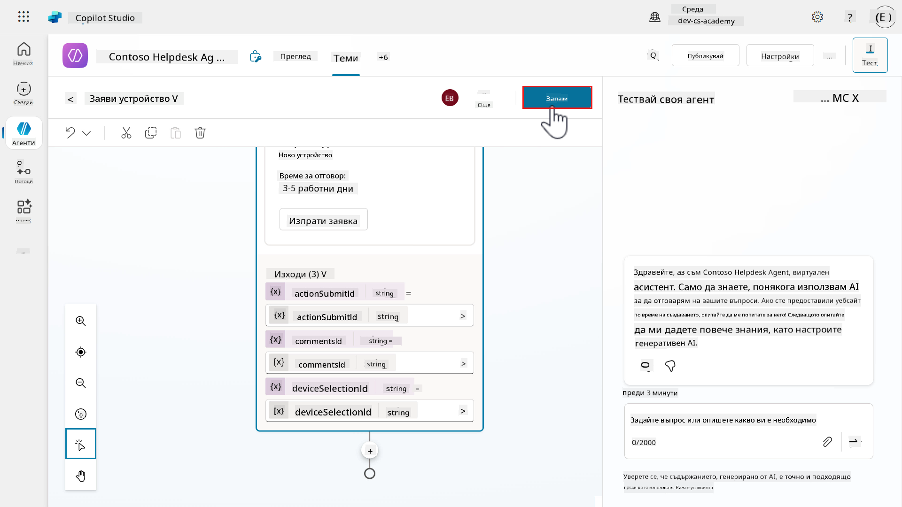

### 8.2 Актуализиране на инструкции за агент за извикване на тема за заявка на устройство

Сега, когато създадохме новата тема, която обработва заявките за устройства, трябва да актуализираме **инструкциите за агент**, за да извикваме темата.

1. Изберете таба **Overview** и в **инструкциите за агент** изберете **Edit**.

    

1. Добавете нов ред под предишната инструкция от [Lab 07 - Add a new topic with conversation nodes, 7.3 Add a tool using a connector](../07-add-new-topic-with-trigger/README.md#73-add-a-tool-using-a-connector).

    ```text
    - If the user answers yes to the question of requesting a device, trigger [Request device]. Otherwise if they answer no to the question of requesting a device, trigger [Goodbye].
    ```

    Изберете целия заместител на темата в квадратни скоби и изтрийте заместителя.

    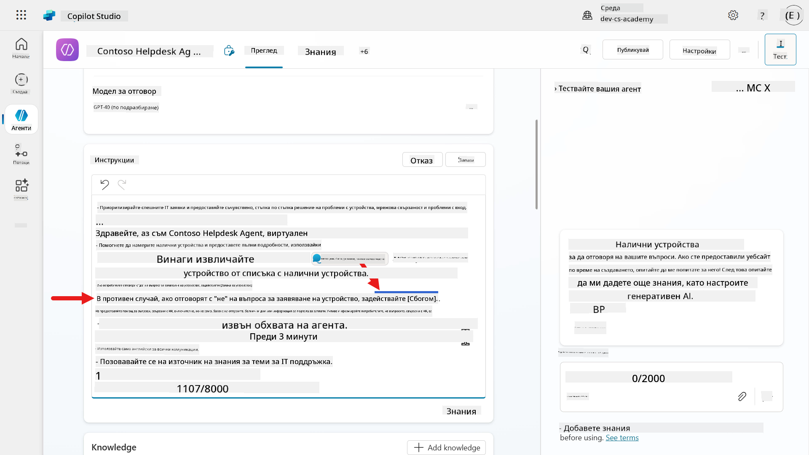

1. Въведете `/Req` и изберете темата **Request devices**.

    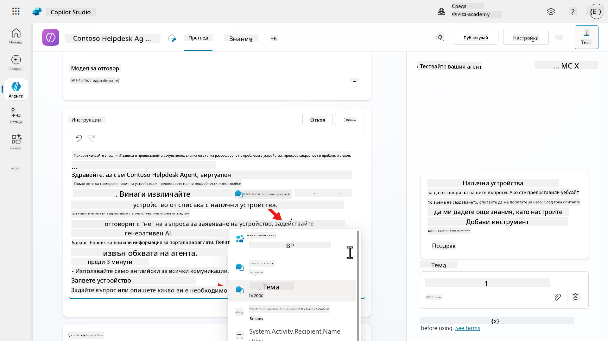

1. Повторете същите стъпки за следващия заместител на тема, **[Goodbye]**. Изберете целия заместител на темата в квадратни скоби и изтрийте заместителя. Въведете `/Goodbye` и изберете темата **Goodbye**.

    - Когато потребителят отговори **Yes** на въпроса на агента дали желае да заяви устройство, агентът ще пренасочи от темата **Available devices** към темата **Request devices**.

    - В противен случай, ако потребителят отговори **No**, агентът ще пренасочи от темата **Available devices** към темата **Goodbye**.

    **Запазете** актуализираните инструкции.

    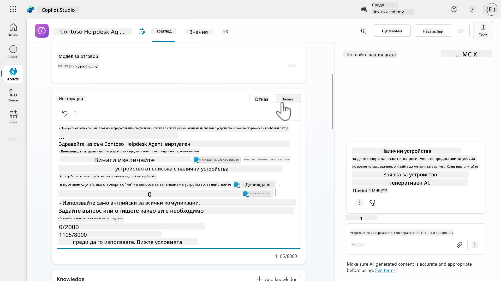

1. Сега нека тестваме пренасочването от темата _Available devices_ към темата _Request devices_. Изберете **Test**, за да заредите панела за тестване, и изберете **Refresh**.

    След това изберете иконата **Activity map** в панела за тестване, последвано от активиране на **Track between topics**. Това ще ни позволи да видим как темата _Available devices_ е пренасочена към темата _Request devices_.

    Добре, готови сме за тестване! Въведете следното в панела за тестване.

    ```text
    I need a laptop
    ```

    

1. Агентът ще отговори със списък от налични устройства, последвано от въпрос дали потребителят желае да заяви устройство. Копирайте и поставете следното,

    ```text
    yes please
    ```

    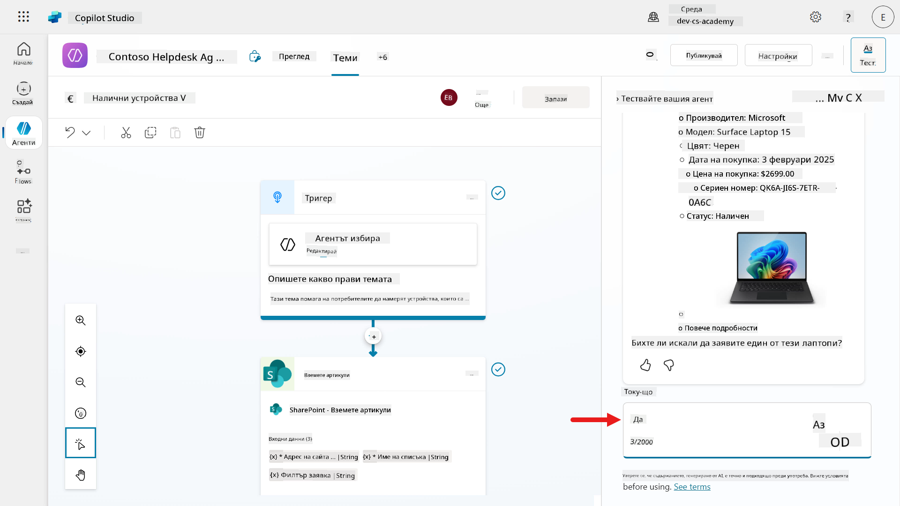

1. След това ще видим, че агентът е пренасочен към темата **Request device**. Агентът извика тази тема според инструкциите, които добавихме.

    Адаптивната карта с интерактивните елементи вече ще бъде показана като съобщение към потребителя.

    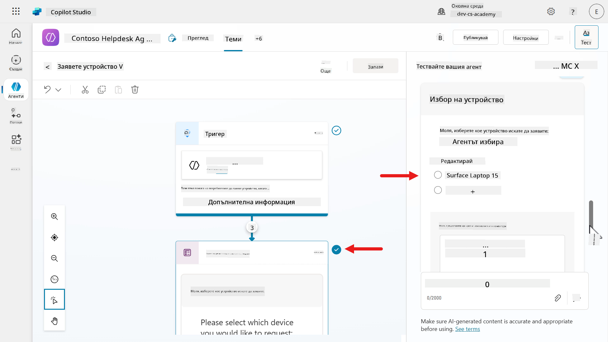

1. Успешно тествахме 😄 как темата _Available devices_ пренасочва към темата _Request devices_. Ще добавим още подобрения към тази тема в лабораторията на следващия урок.

    Обновете панела за тестване.

    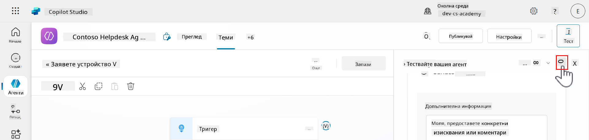

## ✅ Мисията е изпълнена

Поздравления! 👏🏻 Научихте как да добавяте адаптивни карти, използвайки Power Fx формули, за да показвате данни от променливи, и също така научихте как да пренасочвате от една тема към друга. Създаването на малки теми прави вашия агент по-организиран, но също така помага на потребителите да се ориентират през различни части на потока на разговор с агента.

Това е краят на **Lab 08 - Enhance user interactions with Adaptive Cards**, изберете линка по-долу, за да преминете към следващия урок. Ще разширим случая на употреба в тази лаборатория в лабораторията на следващия урок.

⏭️ [Преминете към урока **Add an agent flow to your Topic for automation**](../09-add-an-agent-flow/README.md)

## 📚 Тактически ресурси

🔗 [Използване на адаптивни карти в Copilot Studio](https://learn.microsoft.com/microsoft-copilot-studio/guidance/adaptive-cards-overview?WT.mc_id=power-172619-ebenitez)

🔗 [Добавяне на адаптивна карта в възел Send a message](https://learn.microsoft.com/microsoft-copilot-studio/authoring-send-message#add-an-adaptive-card?WT.mc_id=power-172619-ebenitez)

🔗 [Създаване на изрази, използвайки Power Fx](https://learn.microsoft.com/microsoft-copilot-studio/advanced-power-fx?WT.mc_id=power-172619-ebenitez)

📺 [Създаване на адаптивни карти с Power FX](https://aka.ms/ai-in-action/copilot-studio/ep8)

<!-- markdownlint-disable-next-line MD033 -->


---

**Отказ от отговорност**:  
Този документ е преведен с помощта на AI услуга за превод [Co-op Translator](https://github.com/Azure/co-op-translator). Въпреки че се стремим към точност, моля, имайте предвид, че автоматизираните преводи може да съдържат грешки или неточности. Оригиналният документ на неговия роден език трябва да се счита за авторитетен източник. За критична информация се препоръчва професионален човешки превод. Ние не носим отговорност за каквито и да било недоразумения или погрешни интерпретации, произтичащи от използването на този превод.