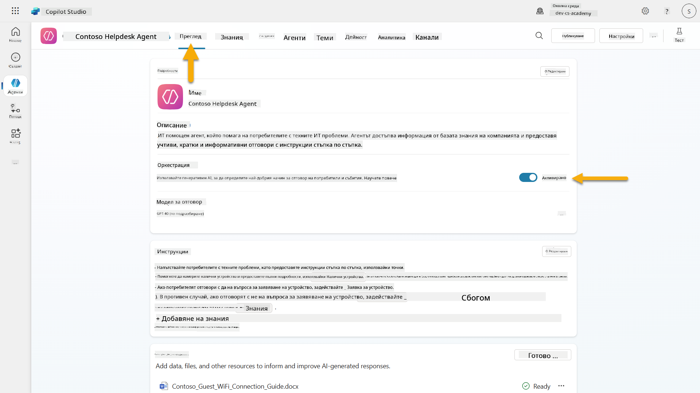
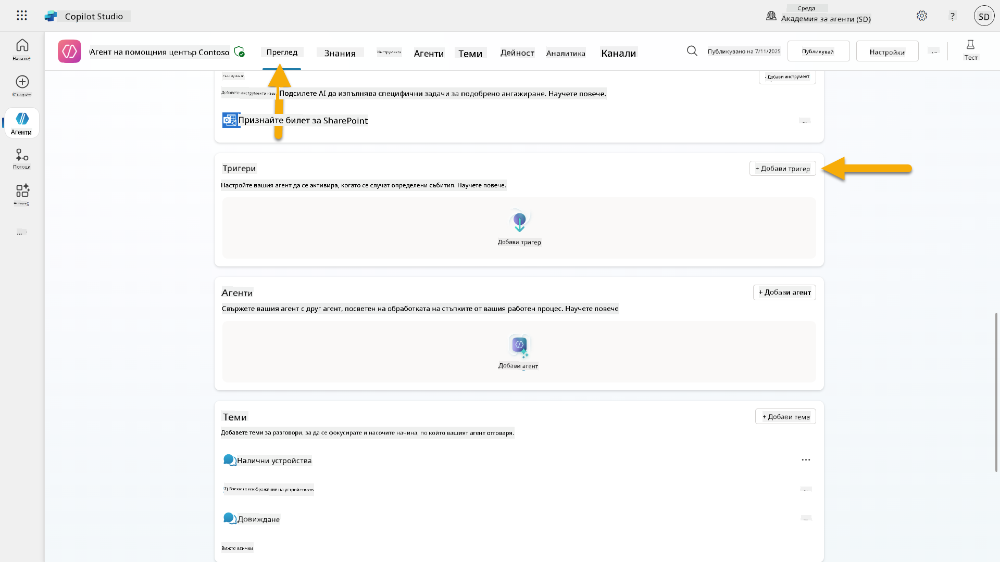
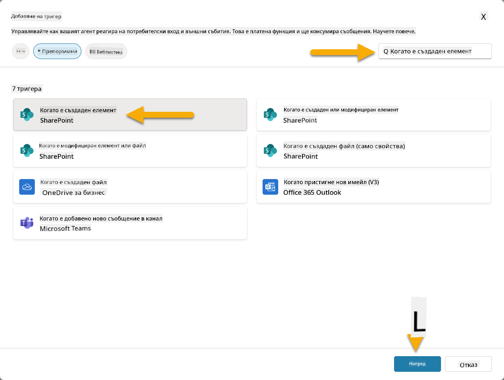
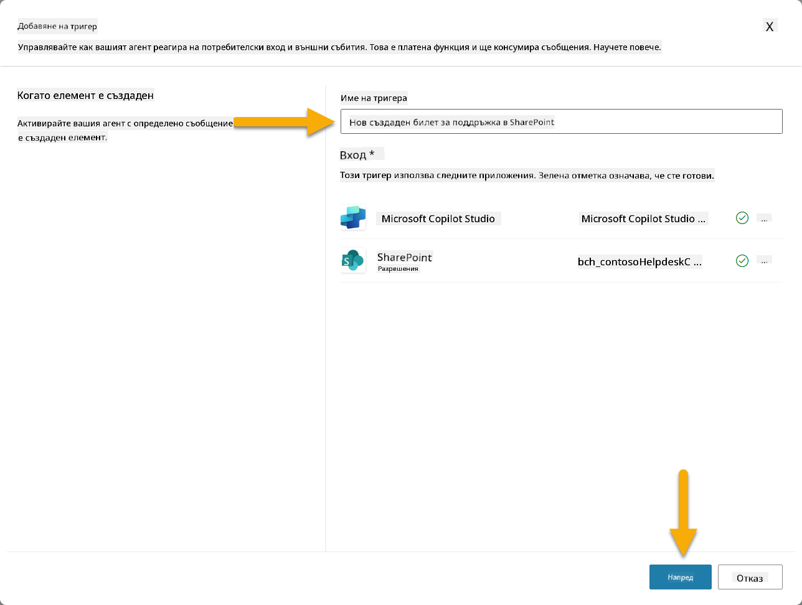
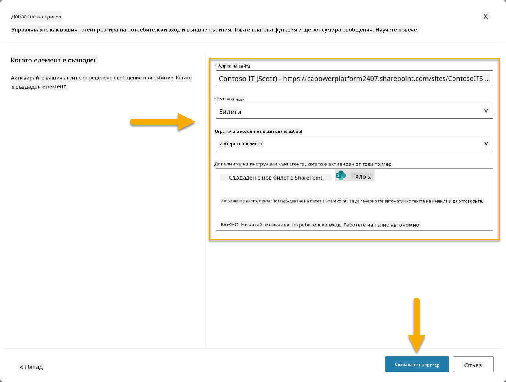
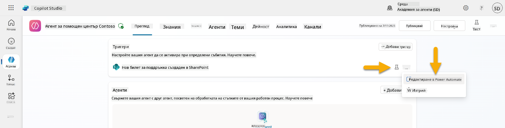
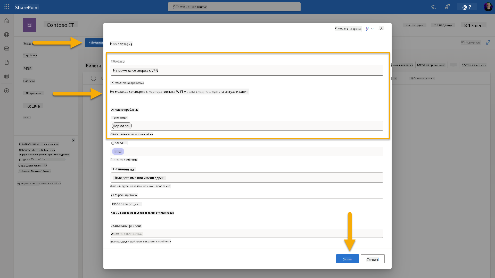
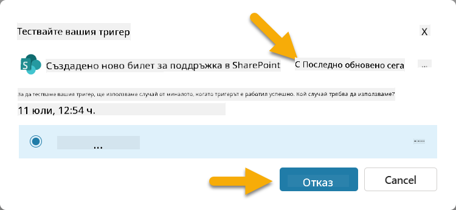
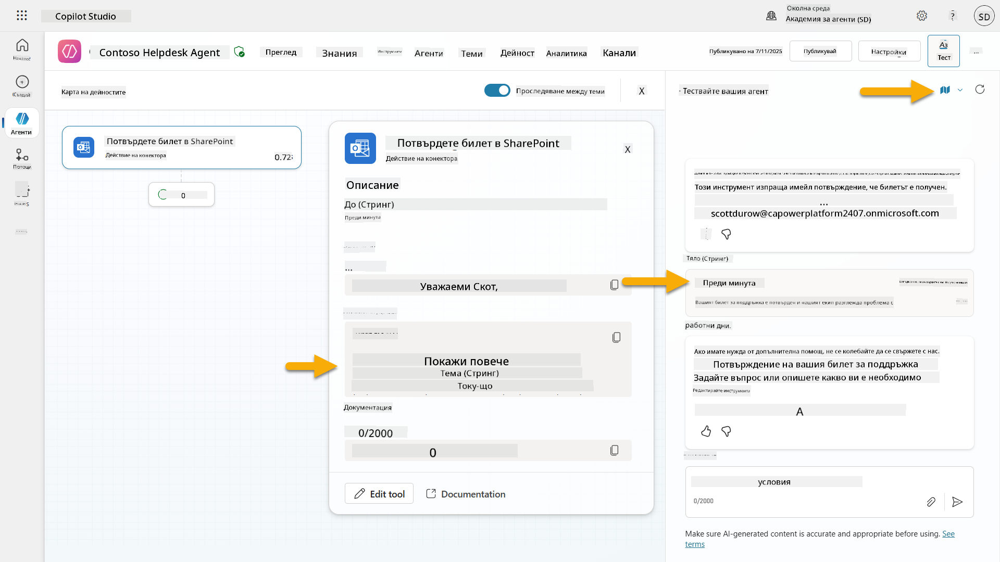
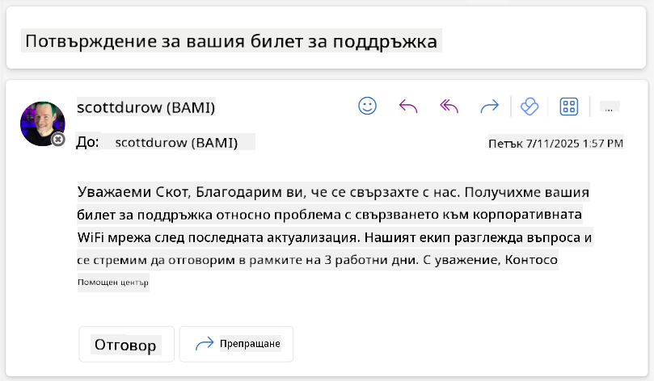

<!--
CO_OP_TRANSLATOR_METADATA:
{
  "original_hash": "cd99a76bcb7372ac2771b6ae178b023d",
  "translation_date": "2025-10-20T23:20:19+00:00",
  "source_file": "docs/recruit/10-add-event-triggers/README.md",
  "language_code": "bg"
}
-->
# 🚨 Мисия 10: Добавяне на събитийни тригери - Активиране на автономни способности на агента

## 🕵️‍♂️ КОДОВО ИМЕ: `ОПЕРАЦИЯ ПРИЗРАЧНА РУТИНА`

> **⏱️ Времеви прозорец на операцията:** `~45 минути`

🎥 **Гледайте демонстрацията**

[](https://www.youtube.com/watch?v=ZgwHL8PQ1nY "Гледайте демонстрацията в YouTube")

## 🎯 Кратко описание на мисията

Време е да издигнете вашия агент от разговорен асистент до автономен оперативен агент. Вашата мисия е да позволите на агента да действа без да бъде призован - да реагира на сигнали от вашия дигитален свят с прецизност и бързина.

Със събитийни тригери ще обучите вашия агент да наблюдава външни системи като SharePoint, Teams и Outlook и да изпълнява интелигентни действия веднага щом получи сигнал. Тази операция трансформира вашия агент в напълно оперативен полеви актив - тих, бърз и винаги нащрек.

Успехът означава създаване на агенти, които създават стойност, а не само реагират на нея.

## 🔎 Цели

📖 Този урок ще обхване:

- Разбиране на събитийните тригери и как те позволяват автономно поведение на агента
- Научаване на разликата между събитийни тригери и тригери по теми, включително работни потоци и полезни товари на тригерите
- Изследване на често срещани сценарии за събитийни тригери
- Разбиране на автентикация, сигурност и съображения за публикуване на агенти, базирани на събития
- Създаване на автономен агент за IT Help Desk, който реагира на събития в SharePoint и изпраща потвърждения по имейл

## 🤔 Какво е събитийният тригер?

**Събитийният тригер** е механизъм, който позволява на вашия агент да действа автономно в отговор на външни събития, без да се изисква директен потребителски вход. Можете да си го представите като начин да накарате вашия агент да "наблюдава" за специфични събития и автоматично да предприема действия, когато те се случат.

За разлика от тригерите по теми, които изискват потребителите да въведат нещо, за да активират разговор, събитийните тригери се активират въз основа на събития, случващи се във вашите свързани системи. Например:

- Когато се създаде нов файл в SharePoint или OneDrive за бизнеса
- Когато се създаде запис в Dataverse
- Когато задача бъде завършена в Planner
- Когато се изпрати нов отговор на Microsoft Form
- Когато се добави ново съобщение в Microsoft Teams
- Въз основа на повтарящ се график (като ежедневни напомняния)  


### Защо събитийните тригери са важни за автономните агенти

Събитийните тригери трансформират вашия агент от реактивен асистент в проактивен, автономен помощник:

1. **Автономна работа** - вашият агент може да работи 24/7 без човешка намеса, реагирайки на събития веднага щом се случат.
    - *Пример:* Автоматично приветстване на нови членове на екипа, когато бъдат добавени към екип.

1. **Реакция в реално време** - вместо да чака потребителите да задават въпроси, вашият агент реагира незабавно на съответните събития.
    - *Пример:* Уведомяване на IT екипа, когато документ в SharePoint бъде модифициран.

1. **Автоматизация на работния процес** - свързване на множество действия въз основа на едно събитие.
    - *Пример:* Когато се създаде нов билет за поддръжка, създайте задача, уведомете мениджъра и актуализирайте таблото за проследяване.

1. **Последователни процеси** - гарантиране, че важните стъпки никога не се пропускат чрез автоматизиране на отговорите на ключови събития.
    - *Пример:* Всеки нов служител автоматично получава материали за въвеждане и заявки за достъп.

1. **Действия, базирани на данни** - използване на информация от активиращото събитие за вземане на интелигентни решения и предприемане на подходящи действия.
    - *Пример:* Пренасочване на спешни билети към старши персонал въз основа на нивото на приоритет в полезния товар на тригера.

## ⚙️ Как работят събитийните тригери?

Събитийните тригери работят чрез тристепенен работен процес, който позволява на вашия агент да реагира автономно на външни събития:

### Работен процес на тригера

1. **Откриване на събитие** - Специфично събитие се случва в свързана система (SharePoint, Teams, Outlook и др.)
1. **Активиране на тригера** - Събитийният тригер открива това събитие и изпраща полезен товар към вашия агент чрез Power Automate Cloud Flow.
1. **Отговор на агента** - Вашият агент получава полезния товар и изпълнява инструкциите, които сте дефинирали.

### Събитийни тригери срещу тригери по теми

Разбирането на разликата между тези два типа тригери е от съществено значение:

| **Събитийни тригери** | **Тригери по теми** |
|-------------------|-------------------|
| Активирани от събития във външни системи | Активирани от потребителски вход/фрази |
| Позволяват автономно поведение на агента | Позволяват разговорни отговори |
| Използват автентикация на създателя | Опция за автентикация на потребителя |
| Работят без взаимодействие с потребителя | Изискват потребителят да започне разговор |
| Примери: Създаден файл, получен имейл | Пример: "Какво е времето?" |

## 📦 Разбиране на полезните товари на тригерите

Когато се случи събитие, тригерът изпраща **полезен товар** към вашия агент, съдържащ информация за събитието и инструкции как да реагира.

### Стандартни срещу персонализирани полезни товари

Всеки тип тригер идва със стандартна структура на полезния товар, но можете да я персонализирате:

**Стандартен полезен товар** - Използва стандартен формат като `Използвай съдържание от {Body}`

- Съдържа основна информация за събитието
- Използва общи инструкции за обработка
- Подходящ за прости сценарии

**Персонализиран полезен товар** - Добавя специфични инструкции и форматиране на данни

- Включва подробни указания за вашия агент
- Определя точно какви данни да се използват и как
- По-добър за сложни работни потоци

### Инструкции за агента срещу инструкции за персонализиран полезен товар

Имате две места, където можете да насочите поведението на вашия агент със събитийни тригери:

**Инструкции за агента** (Глобални)

- Общи указания, които се прилагат за всички тригери
- Пример: "При обработка на билети, винаги първо проверявай за дублирани записи"
- Най-добри за общи модели на поведение

**Инструкции за полезния товар** (Специфични за тригера)

- Специфични указания за отделни типове тригери  
- Пример: "За тази актуализация в SharePoint, изпрати резюме в канала на проекта"
- Най-добри за сложни агенти с множество тригери

💡 **Съвет**: Избягвайте противоречиви инструкции между тези две нива, тъй като това може да доведе до неочаквано поведение.

## 🎯 Често срещани сценарии за събитийни тригери

Ето практически примери за това как събитийните тригери могат да подобрят вашия агент:

### IT Help Desk агент

- **Тригер**: Нов елемент в списъка на SharePoint (билет за поддръжка)
- **Действие**: Автоматично категоризиране, задаване на приоритет и уведомяване на съответните членове на екипа

### Агенти за въвеждане на служители

- **Тригер**: Нов потребител, добавен в Dataverse
- **Действие**: Изпращане на приветствено съобщение, създаване на задачи за въвеждане и предоставяне на достъп

### Агенти за управление на проекти

- **Тригер**: Завършена задача в Planner
- **Действие**: Актуализиране на таблото за проекта, уведомяване на заинтересованите страни и проверка за пречки

### Агенти за управление на документи

- **Тригер**: Качен файл в специфична папка на SharePoint
- **Действие**: Извличане на метаданни, прилагане на етикети и уведомяване на собствениците на документа

### Агенти за срещи

- **Тригер**: Създадено събитие в календара
- **Действие**: Изпращане на напомняния и дневен ред преди срещата, резервиране на ресурси

## ⚠️ Съображения за публикуване и автентикация

Преди вашият агент да може да използва събитийни тригери в продукция, трябва да разберете автентикацията и последиците за сигурността.

### Автентикация на създателя

Събитийните тригери използват **учетните данни на създателя на агента** за всички автентикации:

- Вашият агент получава достъп до системи, използвайки вашите разрешения
- Потребителите могат потенциално да получат достъп до данни чрез вашите учетни данни
- Всички действия се извършват "като вас", дори когато потребителите взаимодействат с агента

### Най-добри практики за защита на данните

За да поддържате сигурността при публикуване на агенти със събитийни тригери:

1. **Оценете достъпа до данни** - Прегледайте кои системи и данни могат да бъдат достъпни чрез вашите тригери
1. **Тествайте внимателно** - Разберете каква информация включват тригерите в полезните товари
1. **Ограничете обхвата на тригерите** - Използвайте специфични параметри, за да ограничите кои събития активират тригерите
1. **Прегледайте данните в полезния товар** - Уверете се, че тригерите не разкриват чувствителна информация
1. **Наблюдавайте използването** - Следете активността на тригерите и потреблението на ресурси

## ⚠️ Отстраняване на проблеми и ограничения

Имайте предвид тези важни съображения, когато работите със събитийни тригери:

### Влияние върху квотите и таксуването

- Всяко активиране на тригер се брои към вашето потребление на съобщения
- Чести тригери (като повтарящи се на всяка минута) могат бързо да изчерпят квотата
- Наблюдавайте използването, за да избегнете ограничения

### Технически изисквания

- Налични само за агенти с активирана генеративна оркестрация
- Изисква активиране на споделяне на облачни потоци, осведомени за решения, във вашата среда

### Политики за предотвратяване на загуба на данни (DLP)

- Политиките за DLP на вашата организация определят кои тригери са налични
- Администраторите могат напълно да блокират събитийните тригери
- Свържете се с вашия администратор, ако очакваните тригери не са налични

## 🧪 Лаборатория 10 - Добавяне на събитийни тригери за автономно поведение на агента

### 🎯 Примерен случай

Ще подобрите вашия IT Help Desk агент, за да реагира автоматично на нови заявки за поддръжка. Когато някой създаде нов елемент в списъка с билети за поддръжка в SharePoint, вашият агент ще:

1. Автоматично се активира, когато билетът в SharePoint бъде създаден
1. Предоставя подробности за билета и инструкции за стъпките, които искате да изпълни
1. Автоматично потвърждава билета на подателя чрез имейл, генериран от AI

Тази лаборатория демонстрира как събитийните тригери позволяват истински автономно поведение на агента.

### Предварителни условия

Преди да започнете тази лаборатория, уверете се, че имате:

- ✅ Завършени предишни лаборатории (особено Лаборатории 6-8 за IT Help Desk агента)
- ✅ Достъп до сайта на SharePoint със списъка за билети за IT поддръжка
- ✅ Среда Copilot Studio с активирани събитийни тригери
- ✅ Вашият агент има активирана генеративна оркестрация
- ✅ Подходящи разрешения в SharePoint и вашата среда Copilot Studio

### 10.1 Активиране на Generative AI и създаване на тригер за създаване на елемент в SharePoint

1. Отворете вашия **IT Help Desk агент** в **Copilot Studio**

1. Първо, уверете се, че **Generative AI** е активиран за вашия агент:
   - Отидете в раздела **Overview**
   - Под секцията Orchestration, включете **Generative orchestration** на **On**, ако все още не е активирано  
     

1. Отидете в раздела **Overview** и намерете секцията **Triggers**

1. Кликнете върху **+ Add trigger**, за да отворите библиотеката с тригери  
    

1. Потърсете и изберете **When an item is created** (SharePoint)  
    

1. Конфигурирайте името на тригера и връзките:

   - **Име на тригера:** Създаден нов билет за поддръжка в SharePoint

1. Изчакайте конфигурацията на връзките и изберете **Next**, за да продължите.  
   

1. Конфигурирайте параметрите на тригера:

   - **Адрес на сайта**: Изберете вашия SharePoint сайт "Contoso IT"

   - **Име на списъка**: Изберете вашия списък "Tickets"

   - **Допълнителни инструкции към агента, когато тригерът бъде активиран:**

     ```text
     New Support Ticket Created in SharePoint: {Body}
     
     Use the 'Acknowledge SharePoint Ticket' tool to generate the email body automatically and respond.
     
     IMPORTANT: Do not wait for any user input. Work completely autonomously.
     ```

     

1. Изберете **Create trigger**, за да завършите създаването на тригера. Автоматично се създава Power Automate Cloud Flow, който активира агента автономно.

1. Изберете **Close**.

### 10.2 Редактиране на тригера

1. В секцията **Triggers** на раздела **Overview**, изберете менюто **...** на тригера **New Support Ticket Created in SharePoint**

1. Изберете **Edit in Power Automate**  
   

1. Изберете възела **Sends a prompt to the specified copilot for processing**

1. В полето **Body/message**, премахнете съдържани
1. Отворете нов раздел в браузъра и отидете на вашия **SharePoint списък с IT заявки за поддръжка**  
1. Кликнете върху **+ Добавяне на нов елемент**, за да създадете тестова заявка:  
   - **Заглавие**: "Не мога да се свържа с VPN"  
   - **Описание**: "Не мога да се свържа с корпоративната WIFI мрежа след последната актуализация"  
   - **Приоритет**: "Нормален"  

1. **Запазете** елемента в SharePoint  
      
1. Върнете се в **Copilot Studio** и наблюдавайте панела **Тествайте вашия тригер** за активиране на тригера. Използвайте иконата **Обновяване**, за да заредите събитието на тригера, това може да отнеме няколко минути.  
      
1. След като тригерът се появи, изберете **Започнете тестване**  
1. Изберете **Иконата на карта на активностите** в горната част на панела **Тествайте вашия агент**  
1. Уверете се, че вашият агент:  
   - Получи данните от тригера  
   - Извика инструмента "Потвърждаване на заявка в SharePoint"  
       
1. Проверете имейл кутията на подателя, за да потвърдите, че е изпратен имейл за потвърждение  
      
1. Прегледайте раздела **Активност** в Copilot Studio, за да видите пълния процес на тригера и изпълнението на инструмента  

## ✅ Мисията е изпълнена  

🎉 **Поздравления!** Успешно внедрихте тригери за събития с инструменти за свързване, които позволяват на вашия агент да работи автономно, автоматично изпращайки имейли за потвърждение и обработвайки заявки за поддръжка без намеса от потребителя. След като вашият агент бъде публикуван, той ще действа автономно от ваше име.  

🚀 **Следващо**: В следващия урок ще научите как да [публикувате вашия агент](../11-publish-your-agent/README.md) в Microsoft Teams и Microsoft 365 Copilot, правейки го достъпен за цялата ви организация!  

⏭️ [Преминете към урока **Публикуване на вашия агент**](../11-publish-your-agent/README.md)  

## 📚 Тактически ресурси  

Готови ли сте да се задълбочите в тригери за събития и автономни агенти? Разгледайте тези ресурси:  

- **Microsoft Learn**: [Направете вашия агент автономен в Copilot Studio](https://learn.microsoft.com/training/modules/autonomous-agents-online-workshop/?WT.mc_id=power-177340-scottdurow)  
- **Документация**: [Добавяне на тригер за събитие](https://learn.microsoft.com/microsoft-copilot-studio/authoring-trigger-event?WT.mc_id=power-177340-scottdurow)  
- **Най-добри практики**: [Въведение в тригерите на Power Automate](https://learn.microsoft.com/power-automate/triggers-introduction?WT.mc_id=power-177340-scottdurow)  
- **Разширени сценарии**: [Използване на Power Automate потоци с агенти](https://learn.microsoft.com/microsoft-copilot-studio/advanced-flow-create?WT.mc_id=power-177340-scottdurow)  
- **Сигурност**: [Предотвратяване на загуба на данни за Copilot Studio](https://learn.microsoft.com/microsoft-copilot-studio/admin-data-loss-prevention?WT.mc_id=power-177340-scottdurow)  

  

---

**Отказ от отговорност**:  
Този документ е преведен с помощта на AI услуга за превод [Co-op Translator](https://github.com/Azure/co-op-translator). Въпреки че се стремим към точност, моля, имайте предвид, че автоматизираните преводи може да съдържат грешки или неточности. Оригиналният документ на неговия роден език трябва да се счита за авторитетен източник. За критична информация се препоръчва професионален човешки превод. Ние не носим отговорност за каквито и да е недоразумения или погрешни интерпретации, произтичащи от използването на този превод.