<!--
CO_OP_TRANSLATOR_METADATA:
{
  "original_hash": "9dceeba2eae2bb73e328602a060eddab",
  "translation_date": "2025-10-20T23:52:38+00:00",
  "source_file": "docs/recruit/11-publish-your-agent/README.md",
  "language_code": "bg"
}
-->
# 🚨 Мисия 11: Публикувай своя агент

## 🕵️‍♂️ КОДОВО ИМЕ: `ОПЕРАЦИЯ ПУБЛИКУВАЙ ПУБЛИКУВАЙ ПУБЛИКУВАЙ`

> **⏱️ Времеви прозорец на операцията:** `~30 минути`  

🎥 **Гледай видео ръководството**

## 🎯 Описание на мисията

След като завърши серия от предизвикателни модули, Създателю на агенти, вече си готов за най-важната стъпка досега: публикуването на твоя агент. Време е твоето творение да стане достъпно за потребителите в Microsoft Teams и Microsoft 365 Copilot.

Твоят агент—оборудван с ясна мисия, мощни инструменти и достъп до ключови източници на знания—е готов да служи. С помощта на Microsoft Copilot Studio ще разположиш своя агент, за да започне да помага на реални потребители, точно там, където работят.

Нека стартираме твоя агент в действие.

## 🔎 Цели

📖 Този урок обхваща:

1. Защо е важно да публикуваш своя агент
1. Какво се случва, когато публикуваш своя агент
1. Как да добавиш канал (Microsoft Teams & Microsoft 365 Copilot)
1. Как да добавиш агента в Microsoft Teams
1. Как да направиш агента достъпен в Microsoft Teams за цялата организация

## 🚀 Публикувай агент

Всеки път, когато работиш върху агент в Copilot Studio, може да го актуализираш, като добавиш знания или инструменти. Когато си готов с всички промени и си тествал внимателно, можеш да го публикуваш. Публикуването гарантира, че последните актуализации са на живо. Ако актуализираш агента си с нови инструменти, но не натиснеш бутона за публикуване, те няма да бъдат достъпни за крайните потребители.

Увери се, че винаги натискаш бутона за публикуване, когато искаш да предоставиш актуализациите на потребителите на твоя агент. Твоят агент може да има добавени канали и когато натиснеш публикуване, актуализациите стават достъпни за всички канали, които си добавил към агента.

## ⚙️ Конфигурирай канали

Каналите определят къде потребителите могат да получат достъп и да взаимодействат с твоя агент. След като публикуваш своя агент, можеш да го направиш достъпен в множество канали. Всеки канал може да показва съдържанието на твоя агент по различен начин.

Можеш да добавиш своя агент към следните канали:

- **Microsoft Teams и Microsoft 365 Copilot** - Направи агента си достъпен в чатове и срещи в Teams, както и в Microsoft 365 Copilot ([Научи повече](https://learn.microsoft.com/microsoft-copilot-studio/publication-add-bot-to-microsoft-teams))
- **Демо уебсайт** - Тествай своя агент на демо уебсайт, предоставен от Copilot Studio ([Научи повече](https://learn.microsoft.com/microsoft-copilot-studio/publication-connect-bot-to-web-channels))
- **Персонализиран уебсайт** - Вгради своя агент директно в собствения си уебсайт ([Научи повече](https://learn.microsoft.com/microsoft-copilot-studio/publication-connect-bot-to-web-channels))
- **Мобилно приложение** - Интегрирай своя агент в персонализирано мобилно приложение ([Научи повече](https://learn.microsoft.com/microsoft-copilot-studio/publication-connect-bot-to-custom-application))
- **SharePoint** - Добави своя агент към сайтове в SharePoint за помощ с документи и сайтове ([Научи повече](https://learn.microsoft.com/microsoft-copilot-studio/publication-add-bot-to-sharepoint))
- **Facebook Messenger** - Свържи се с потребители чрез платформата за съобщения на Facebook ([Научи повече](https://learn.microsoft.com/microsoft-copilot-studio/publication-add-bot-to-facebook))
- **Power Pages** - Интегрирай своя агент в уебсайтове на Power Pages ([Научи повече](https://learn.microsoft.com/microsoft-copilot-studio/publication-add-bot-to-power-pages))
- **Канали на Azure Bot Service** - Достъп до допълнителни канали, включително Slack, Telegram, Twilio SMS и други ([Научи повече](https://learn.microsoft.com/microsoft-copilot-studio/publication-connect-bot-to-azure-bot-service-channels))

За да добавиш канал, отиди в раздела **Channels** на твоя агент и избери канала, който искаш да конфигурираш. Всеки канал има специфични изисквания за настройка и може да изисква допълнителна автентикация или стъпки за конфигурация.

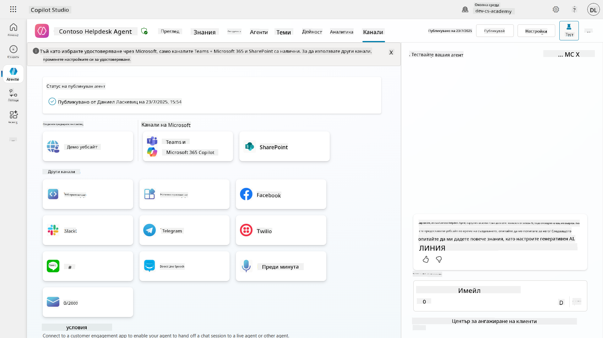

## 📺 Опит с каналите

Различните канали предлагат различни потребителски изживявания. Когато създаваш агент за множество канали, увери се, че си наясно с разликите за всеки канал. Винаги е добра стратегия да тестваш своя агент в множество канали, за да видиш дали наистина работи според очакванията ти.

| Опит                              | Уебсайт       | Teams и Microsoft 365 Copilot          | Facebook                 | Dynamics Omnichannel за обслужване на клиенти               |
| --------------------------------- | ------------- | --------------------------------------- | ------------------------ | ----------------------------------------------------------- |
| [Анкета за удовлетвореност на клиентите][1] | Адаптивна карта | Само текст                              | Само текст               | Само текст                                                   |
| [Опции за избор][1]               | Поддържани    | [Поддържани до шест (като hero карта)][4] | [Поддържани до 13][6]   | [Частично поддържани][8]                                     |
| [Markdown][2]                     | Поддържани    | [Частично поддържани][5]                | [Частично поддържани][7] | [Частично поддържани][9]                                     |
| [Приветствено съобщение][1]       | Поддържано    | Поддържано                              | Не се поддържа           | Поддържано за [Chat][10]. Не се поддържа за други канали.    |
| [Did-You-Mean][3]                 | Поддържано    | Поддържано                              | Поддържано               | Поддържано за [Microsoft Teams][11], [Chat][10], Facebook и текстови канали (SMS чрез [TeleSign][12] и [Twilio][13], [WhatsApp][14], [WeChat][15] и [Twitter][16]). Предложените действия се представят като текстов списък; потребителите трябва да въведат отново опция, за да отговорят. |

[1]: https://learn.microsoft.com/microsoft-copilot-studio/authoring-create-edit-topics
[2]: https://daringfireball.net/projects/markdown/
[3]: https://learn.microsoft.com/microsoft-copilot-studio/advanced-ai-features
[4]: https://learn.microsoft.com/microsoftteams/platform/concepts/cards/cards-reference#hero-card
[5]: https://learn.microsoft.com/microsoftteams/platform/bots/how-to/format-your-bot-messages#text-only-messages
[6]: https://developers.facebook.com/docs/messenger-platform/send-messages/quick-replies/
[7]: https://www.facebook.com/help/147348452522644?helpref=related
[8]: https://learn.microsoft.com/dynamics365/customer-service/asynchronous-channels#suggested-actions-support
[9]: https://learn.microsoft.com/dynamics365/customer-service/asynchronous-channels#preview-support-for-formatted-messages
[10]: https://learn.microsoft.com/dynamics365/customer-service/set-up-chat-widget
[11]: https://learn.microsoft.com/dynamics365/customer-service/configure-microsoft-teams
[12]: https://learn.microsoft.com/dynamics365/customer-service/configure-sms-channel
[13]: https://learn.microsoft.com/dynamics365/customer-service/configure-sms-channel-twilio
[14]: https://learn.microsoft.com/dynamics365/customer-service/configure-whatsapp-channel
[15]: https://learn.microsoft.com/dynamics365/customer-service/configure-wechat-channel
[16]: https://learn.microsoft.com/dynamics365/customer-service/configure-twitter-channel

> [!NOTE]
> Има някои примери за това как можеш да използваш различна логика за различни канали. Пример за това може да се намери в хранилището Power Platform Snippets:
>
> Хенри Джамес сподели пример за това как да покажеш различна адаптивна карта, когато каналът е Microsoft Teams. ([Линк към примера](https://github.com/pnp/powerplatform-snippets/blob/main/copilot-studio/multiple-topics-matched-topic/source/multiple-topics-matched.yaml#L40))

## 🧪 Лаборатория 11: Публикувай своя агент в Teams и Microsoft 365 Copilot

### 🎯 Пример за употреба

Твоят агент за помощен център на Contoso вече е напълно конфигуриран с мощни възможности—може да получава достъп до източници на знания в SharePoint, да създава билети за поддръжка, да изпраща проактивни известия и да отговаря интелигентно на запитвания на потребителите. Въпреки това, всички тези функции в момента са достъпни само в средата за разработка, където са създадени.

**Предизвикателството:** Крайните потребители не могат да се възползват от възможностите на твоя агент, докато той не бъде правилно публикуван и направен достъпен чрез каналите, където реално работят.

**Решението:** Публикуването на твоя агент гарантира, че последната версия—с всички твои скорошни актуализации, нови теми, подобрени източници на знания и конфигурирани потоци—е достъпна за реални потребители. Без публикуване, потребителите ще взаимодействат със стара версия на твоя агент, която може да липсва важна функционалност.

Добавянето на канала Teams и Microsoft 365 Copilot е също толкова важно, защото:

- **Интеграция с Teams**: Служителите на твоята организация прекарват по-голямата част от деня си в Microsoft Teams за сътрудничество, срещи и комуникация. Като добавиш своя агент в Teams, потребителите могат да получат IT поддръжка, без да напускат основната си работна среда.

- **Microsoft 365 Copilot**: Потребителите могат да получат достъп до твоя специализиран агент за помощен център директно в своята Microsoft 365 Copilot среда, което го прави безпроблемно интегриран в ежедневния им работен процес в приложенията на Office.

- **Централизиран достъп**: Вместо да запомнят отделни уебсайтове или приложения, потребителите могат да получат IT поддръжка чрез платформите, които вече използват, намалявайки трудностите и увеличавайки приемането.

Тази мисия трансформира твоята разработка в готово за производство решение, което предоставя реална стойност на крайните потребители в твоята организация.

### Предварителни условия

Преди да започнеш тази лаборатория, увери се, че:

- ✅ Завършил си предишните лаборатории и имаш напълно конфигуриран агент за помощен център Contoso
- ✅ Твоят агент е тестван и готов за използване в продукция
- ✅ Имаш разрешения в средата на Copilot Studio за публикуване на агенти
- ✅ Имаш достъп до Microsoft Teams в твоята организация

### 11.1 Публикувай своя агент

Сега, когато цялата ни работа по агента е завършена, трябва да се уверим, че тя е достъпна за крайните потребители, които ще използват агента. За да се уверим, че съдържанието е достъпно за всички потребители, трябва да публикуваме агента.

1. Отиди до агента за помощен център Contoso в Copilot Studio (чрез [портала за създаване на Copilot Studio](https://copilotstudio.microsoft.com))

    В Copilot Studio е лесно да публикуваш своя агент. Просто избери бутона за публикуване в горната част на прегледа на агента.

    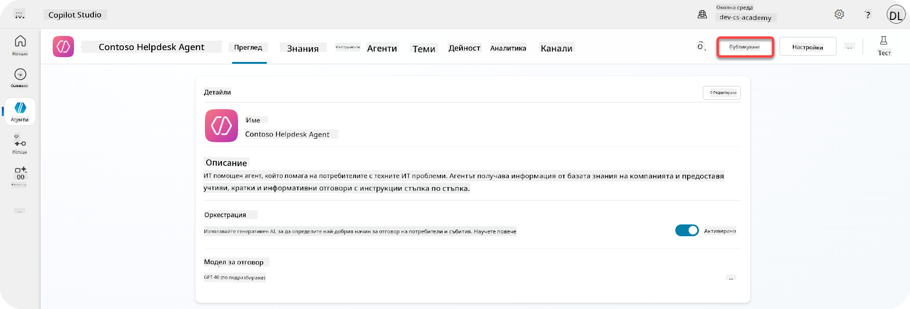

1. Избери бутона **Publish** в твоя агент

    Ще се отвори изскачащ прозорец за потвърждение, че наистина искаш да публикуваш своя агент.

    

1. Избери **Publish**, за да потвърдиш публикуването на своя агент

    Сега ще се появи съобщение, че твоят агент се публикува. Не е необходимо да държиш този прозорец отворен. Ще получиш известие, когато агентът бъде публикуван.

    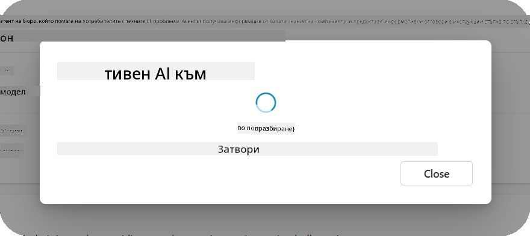

    Когато публикуването на агента приключи, ще видиш известие в горната част на страницата на агента.

    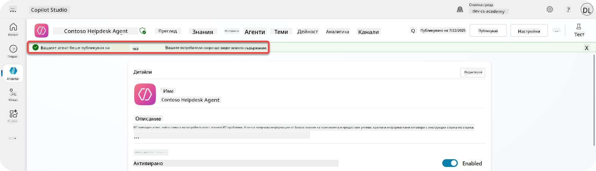

Но - ние само публикувахме агента, все още не сме го добавили към канал, така че нека го направим сега!

### 11.2 Добави канала Teams и Microsoft 365 Copilot

1. За да добавиш канала Teams и Microsoft 365 Copilot към нашия агент, трябва да избереш **Channel** в горната навигация на агента

    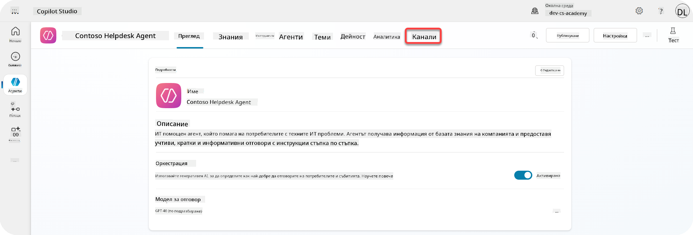

    Тук можем да видим всички канали, които можем да добавим към този агент.

1. Избери **Teams и Microsoft 365**

    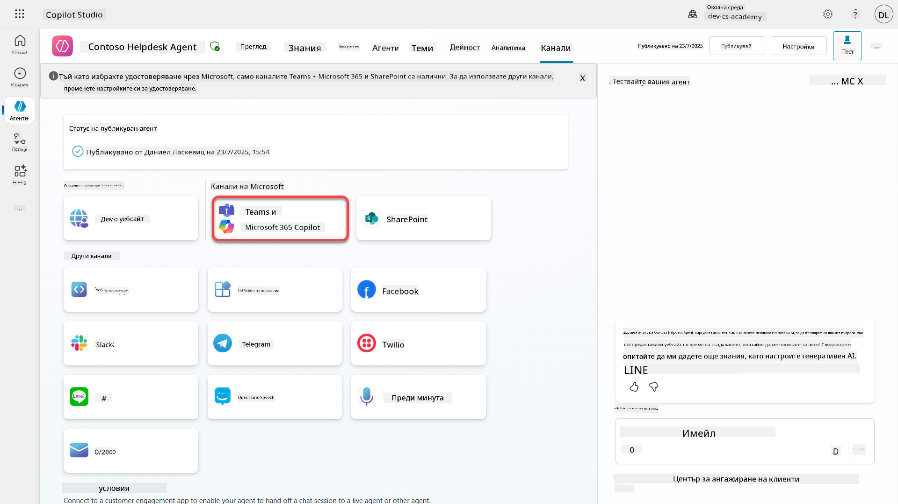

1. Избери **Add channel**, за да завършиш съветника и да добавиш канала към агента

    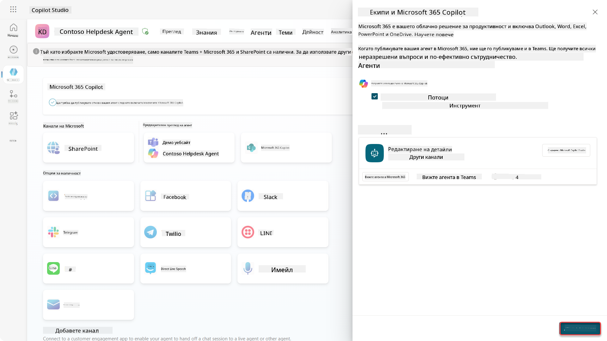

    Ще отнеме малко време, докато бъде добавен. След като бъде добавен, ще се появи зелено известие в горната част на страничната лента.

    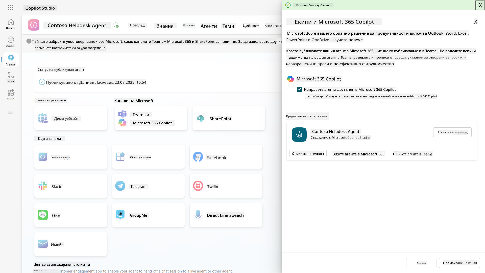

1. Избери **See agent in Teams**, за да отвориш нов раздел

    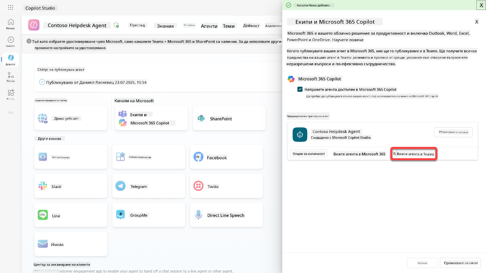

1. Избери **Add**, за да добавиш агента за помощен център Contoso в Teams

    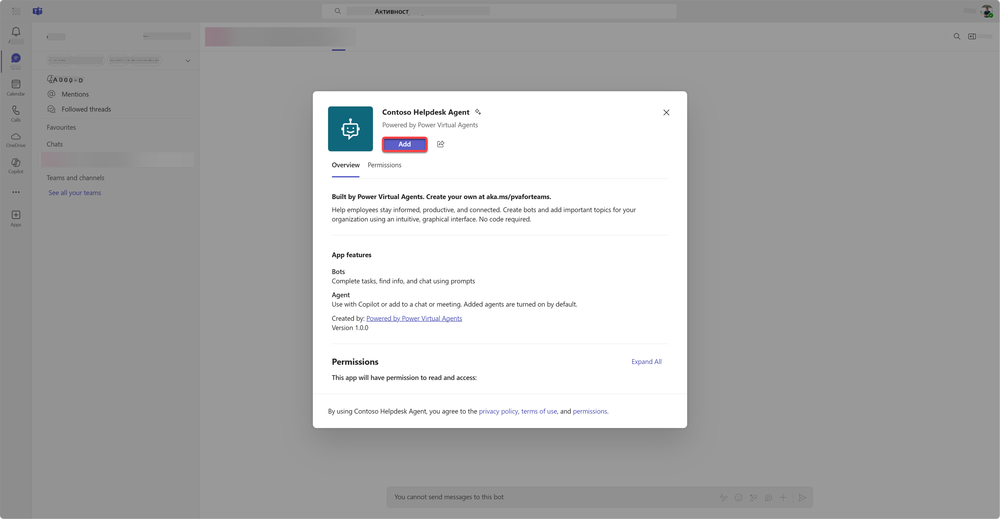

    Това ще отнеме малко време. След това трябва да се покаже следният екран:

    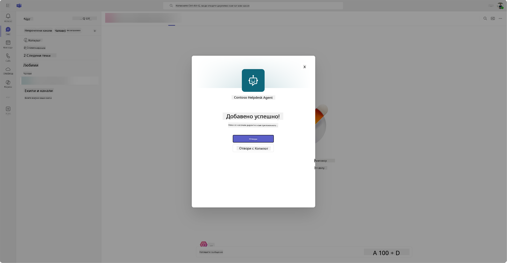

1. Избери **Open**, за да отвориш агента в Teams

    Това ще отвори агента в Teams като приложение за Teams

    

Сега публикувахме агента, за да работи за теб в Microsoft Teams, но може да искаш да го направиш достъпен за повече хора.

### 11.3 Направи агента достъпен за всички потребители в тенанта

1. Затвори раздела на браузъра, където е отворен агентът за помощен център Contoso

    Това трябва да те върне обратно в Copilot Studio, където страничният панел на Teams и Microsoft 365 Copilot все още е отворен. Сега само отворихме агента в Teams, но можем да направим много повече тук. Можем да редактираме детайлите на агента, да го разположим за повече потребители и други.

1. Избери **Edit details**

    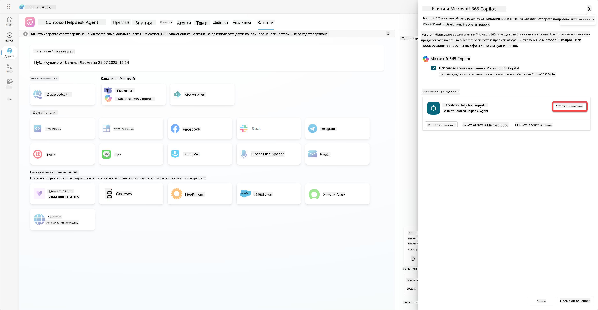
Това ще отвори панел, в който можем да променим множество детайли и настройки на агента. Можем да променим основни детайли като иконата, цвета на фона на иконата и описанията. Също така можем да променим настройките за Teams (например да позволим на потребител да добави агента към екип или да го използва в групови и срещи чатове) тук. Когато изберете *още*, можете да промените и детайли за разработчика като името на разработчика, уебсайта, декларацията за поверителност и условията за ползване.

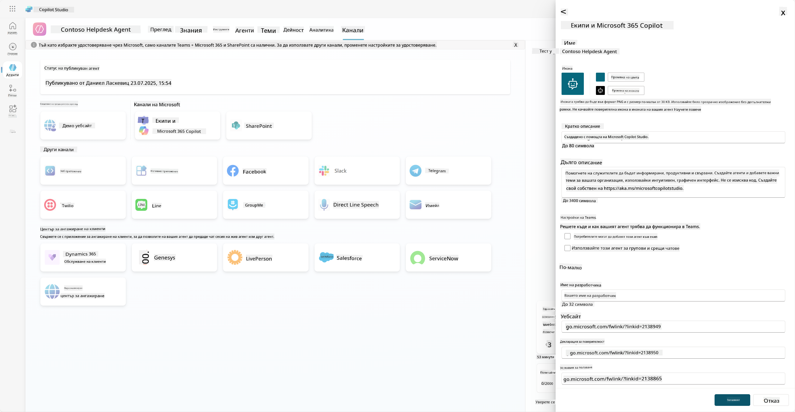

1. Изберете **Отказ** за затваряне на панела за редактиране на детайли.

1. Изберете **Опции за наличност**

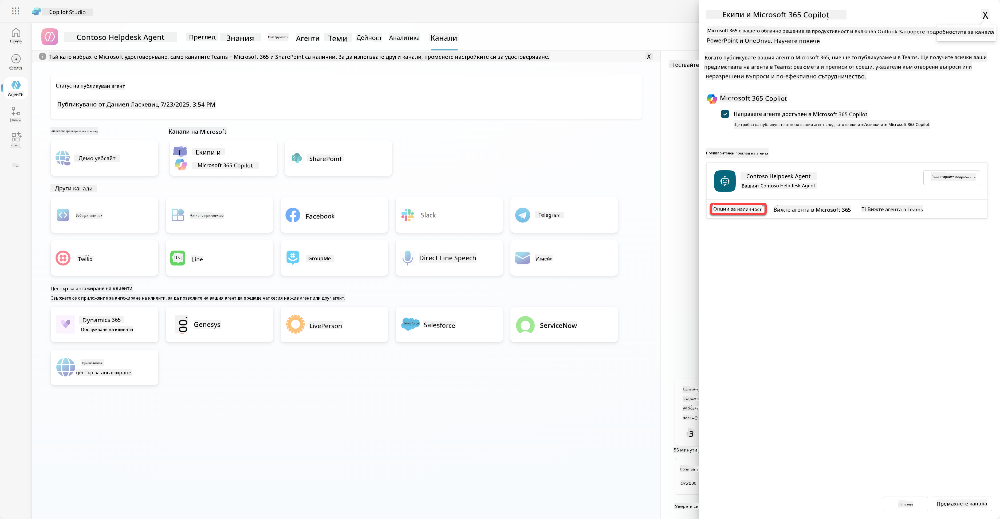

Това ще отвори панел за опции за наличност, където можете да копирате линк, който да изпратите на потребителите, за да използват този агент (имайте предвид, че трябва да споделите агента с потребителя също) и можете да изтеглите файл, за да добавите вашия агент в магазина на Microsoft Teams или Microsoft 365. За да покажете агента в магазина, имате и други опции: можете да го покажете на вашите колеги и споделени потребители (за да се появи в секцията *Създадено с Power Platform*) или можете да го покажете на всички във вашата организация (това изисква одобрение от администратор).

1. Изберете **Покажи на всички в моята организация**

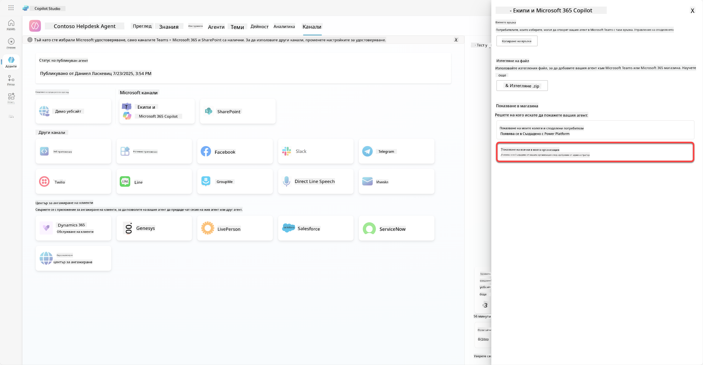

1. Изберете **Изпрати за одобрение от администратор**

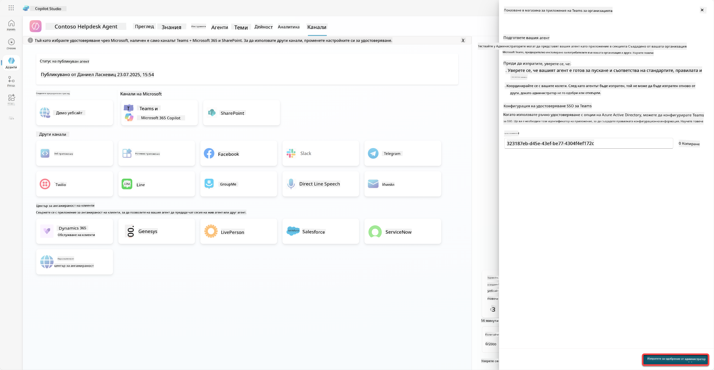

Сега вашият администратор трябва да одобри изпращането на агента. Те могат да направят това, като отидат в Teams Admin Center и намерят Contoso Helpdesk Agent в приложенията. На скрийншота можете да видите какво би видял администраторът в Teams Admin Center.

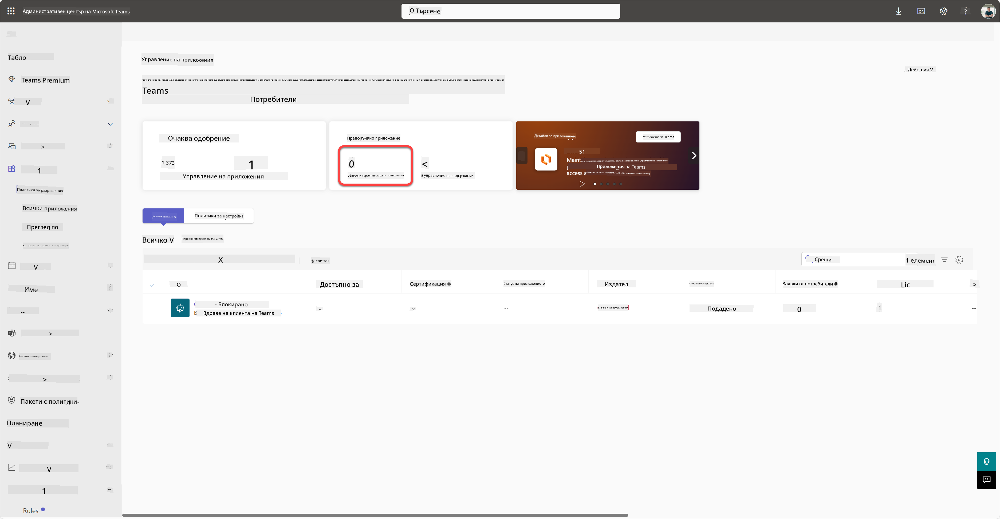

Администраторът трябва да избере Contoso Helpdesk Agent и да избере *Публикувай*, за да публикува Contoso Helpdesk Agent за всички.

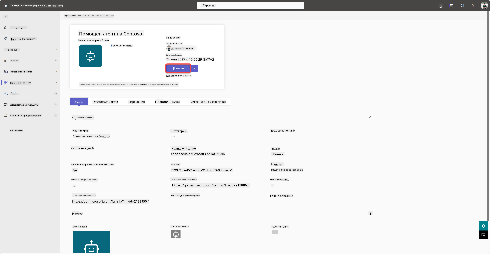

Когато администраторът публикува изпращането на агента, ще можете да обновите Copilot Studio и трябва да видите банера *налично в магазина за приложения* в опциите за наличност.

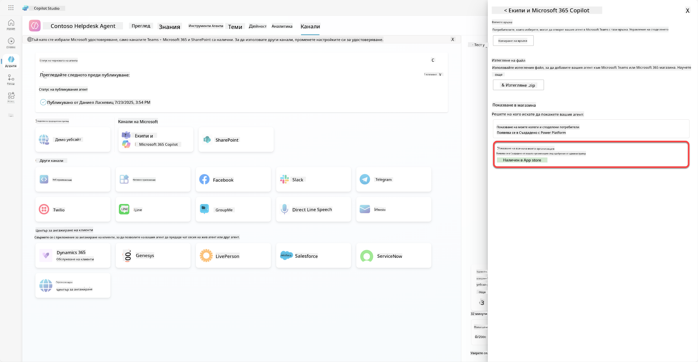

Тук има още възможности. Вашият администратор може да промени глобалната политика за настройка и автоматично да инсталира Contoso Helpdesk Agent за всички в наемателя. Освен това - можете да закачите Contoso Helpdesk Agent в лявата лента, за да има всеки лесен достъп до него.

## ✅ Мисията е изпълнена

🎉 **Поздравления!** Успешно публикувахте вашия агент и го добавихте към Teams и Microsoft 365 Copilot! Следва последната мисия от курса: Разбиране на лицензирането.

⏭️ [Преминете към урока **Разбиране на лицензирането**](../12-understanding-licensing/README.md)

## 📚 Тактически ресурси

🔗 [Документация за публикуване на канали](https://learn.microsoft.com/microsoft-copilot-studio/publication-fundamentals-publish-channels)

---

**Отказ от отговорност**:  
Този документ е преведен с помощта на AI услуга за превод [Co-op Translator](https://github.com/Azure/co-op-translator). Въпреки че се стремим към точност, моля, имайте предвид, че автоматизираните преводи може да съдържат грешки или неточности. Оригиналният документ на неговия роден език трябва да се счита за авторитетен източник. За критична информация се препоръчва професионален човешки превод. Не носим отговорност за недоразумения или погрешни интерпретации, произтичащи от използването на този превод.