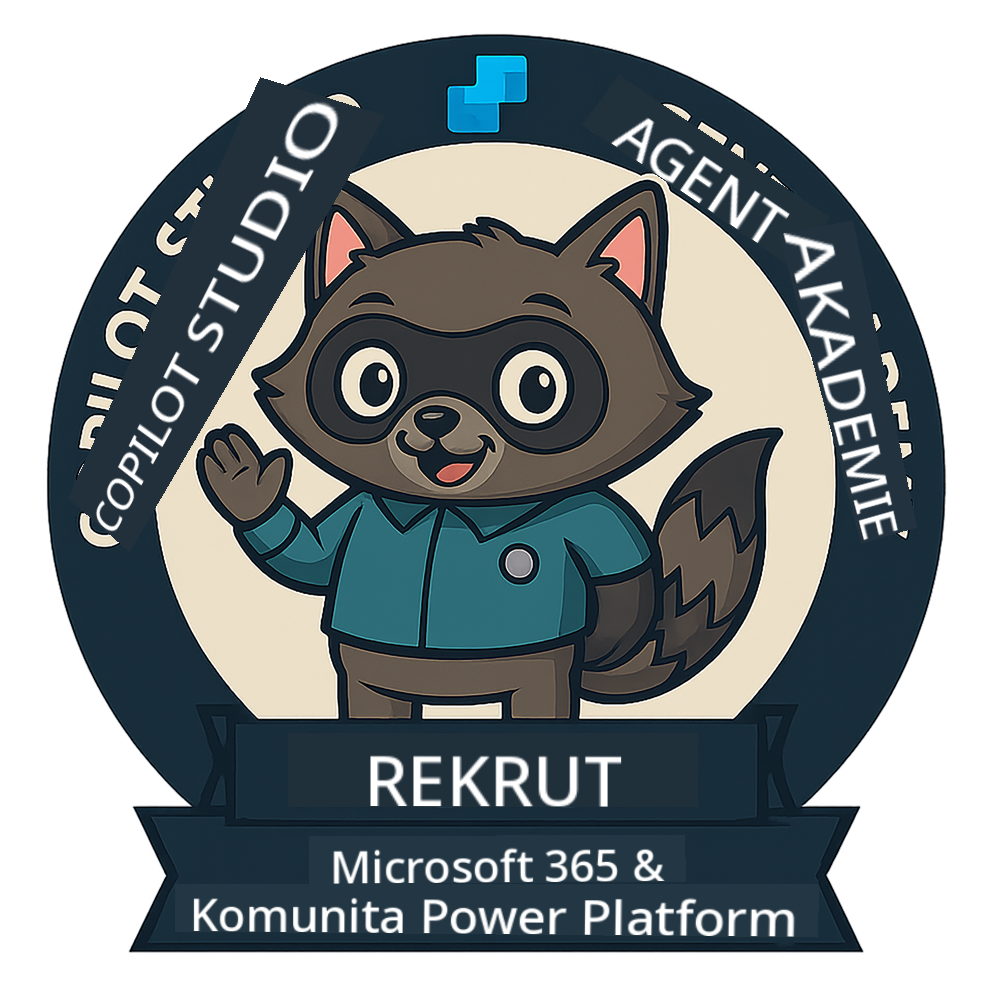
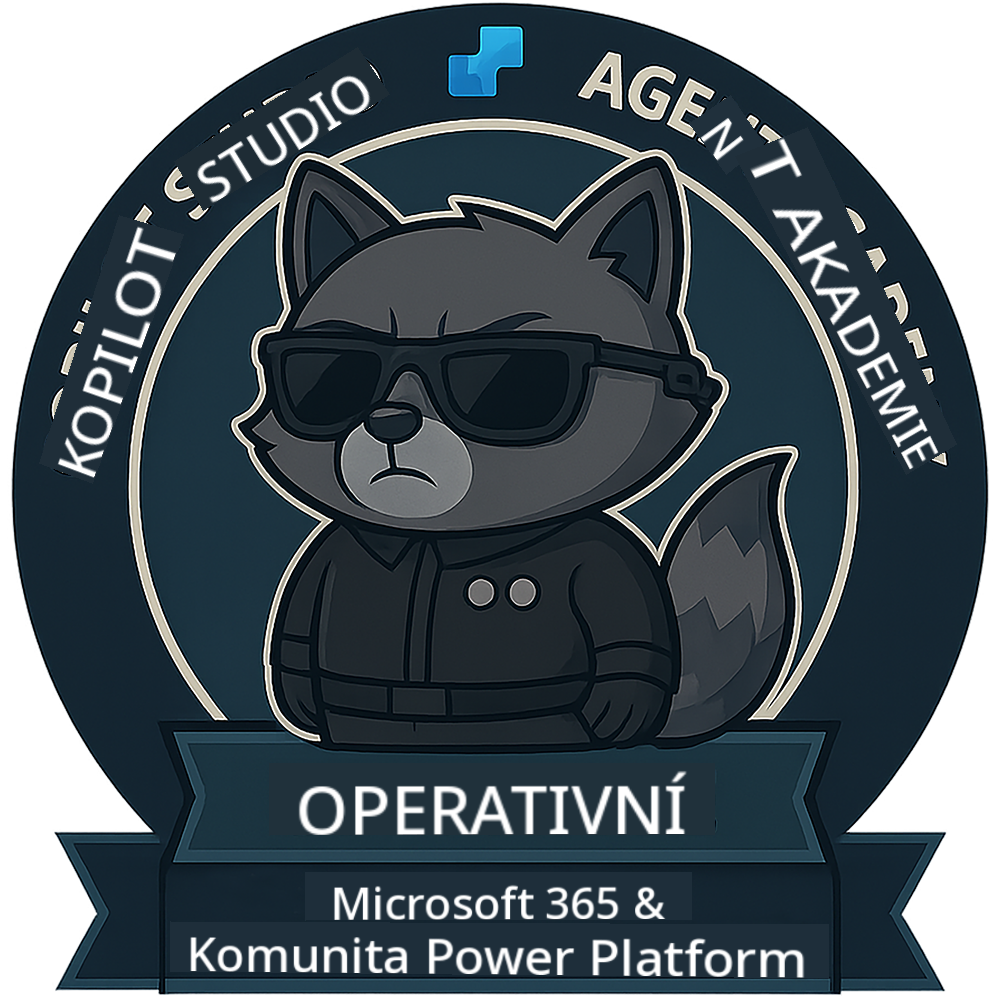
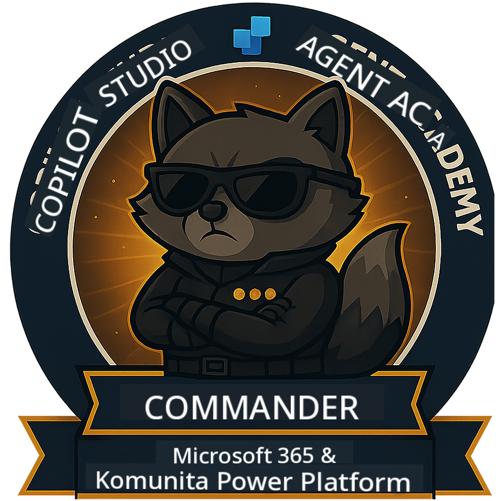

<!--
CO_OP_TRANSLATOR_METADATA:
{
  "original_hash": "15e57e059ce7689d602d7853187235cd",
  "translation_date": "2025-10-20T17:04:46+00:00",
  "source_file": "docs/index.md",
  "language_code": "cs"
}
-->
---
hide:
- navigation
---

# Akademie agentů Copilot Studio

**Vítejte v Akademii agentů Copilot Studio.**  

Vaším úkolem – pokud se rozhodnete ho přijmout – je zvládnout umění vytváření agentů pomocí **Microsoft Copilot Studio**.

Tento praktický výcvik je vaším vstupem do **světa agentů**: od přesných promptů přes Adaptive Cards až po agentní toky. Naučíte se, jak vytvářet, škálovat a nasazovat inteligentní agenty pomocí reálných nástrojů a případů použití.

---

## 🏅 Postup v hodnostech

**Akademie agentů Copilot Studio** je vícestupňový výcvikový program navržený tak, aby rozvíjel vaše dovednosti napříč třemi hodnostmi agentů. Každá úroveň zahrnuje odznak a rostoucí odpovědnosti:

| Hodnost          | Úroveň | Vizualizace |
|------------------|:-----:|-------------|
| 🟢 **Nováček**  [🚀 Začněte](https://aka.ms/agent-academy-recruit){ .md-button .md-button--primary }     | •     | { width="300" }     |
| 🔵 **Operativní pracovník** (Již brzy)   | ••    | { width="300" } |
| 🟡 **Velitel** (Již brzy)    | •••   | { width="300" } |

Každá úroveň navazuje na předchozí. Dokončete misi Nováček a sledujte další kroky, abyste si zvýšili své agentní kvalifikace.

---

## 🎒 Další kurzy

Podívejte se na tyto další kurzy a pokračujte v učení o AI a agentech:

- [Microsoft Copilot Studio <3 MCP Lab](https://aka.ms/mcsmcplab)
- [Copilot Developer Camp](https://microsoft.github.io/copilot-camp/)
- [AI Agents for Beginners](https://microsoft.github.io/ai-agents-for-beginners/)
- [Model Context Protocol (MCP) For Beginners](https://github.com/microsoft/mcp-for-beginners)

---

## 🚑 Problémy

Vaše zpětná vazba je pro nás velmi důležitá! Použijte [seznam problémů](https://github.com/microsoft/agent-academy/issues) k sdílení vašich komentářů a problémů. Děkujeme!

---

## 📜 Kodex chování

Tento projekt přijal [Kodex chování pro open source od Microsoftu](https://opensource.microsoft.com/codeofconduct/).

!!! info "Zdroje:"

    - [Kodex chování pro open source od Microsoftu](https://opensource.microsoft.com/codeofconduct/)
    - [FAQ ke Kodexu chování Microsoftu](https://opensource.microsoft.com/codeofconduct/faq/)
    - Kontaktujte [opencode@microsoft.com](mailto:opencode@microsoft.com) s dotazy nebo obavami

---

[⭐️ Ohodnoťte náš repozitář](https://github.com/microsoft/agent-academy){ .md-button .md-button--primary }

<!-- markdownlint-disable-next-line MD033 -->

---

**Prohlášení**:  
Tento dokument byl přeložen pomocí služby AI pro překlady [Co-op Translator](https://github.com/Azure/co-op-translator). I když se snažíme o přesnost, mějte prosím na paměti, že automatizované překlady mohou obsahovat chyby nebo nepřesnosti. Původní dokument v jeho původním jazyce by měl být považován za autoritativní zdroj. Pro důležité informace se doporučuje profesionální lidský překlad. Neodpovídáme za žádná nedorozumění nebo nesprávné interpretace vyplývající z použití tohoto překladu.