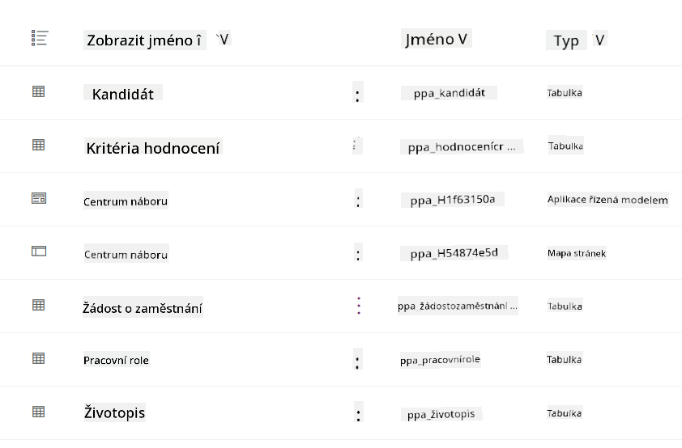
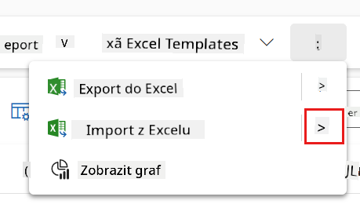
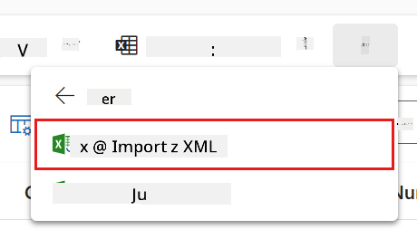
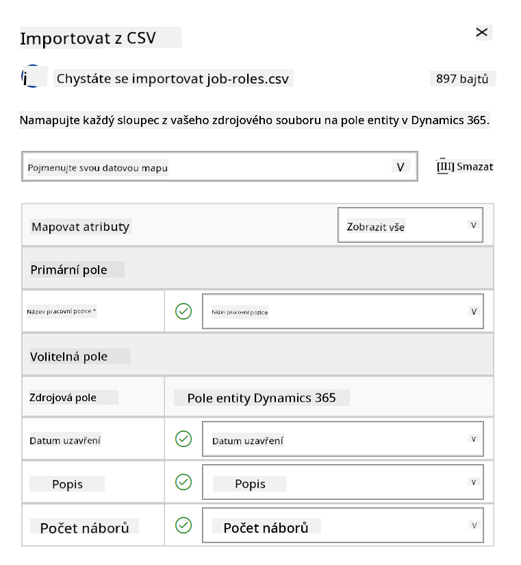
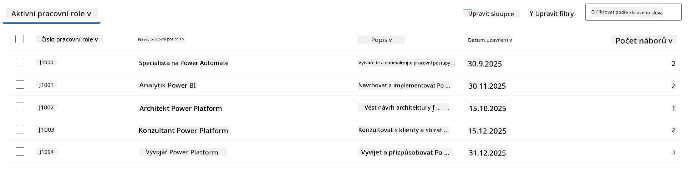
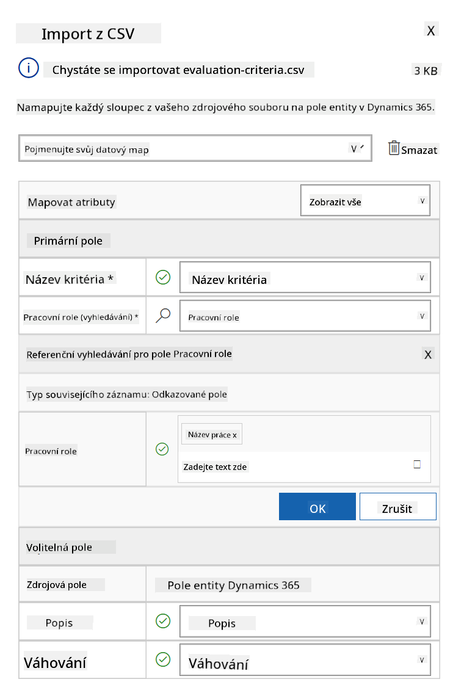
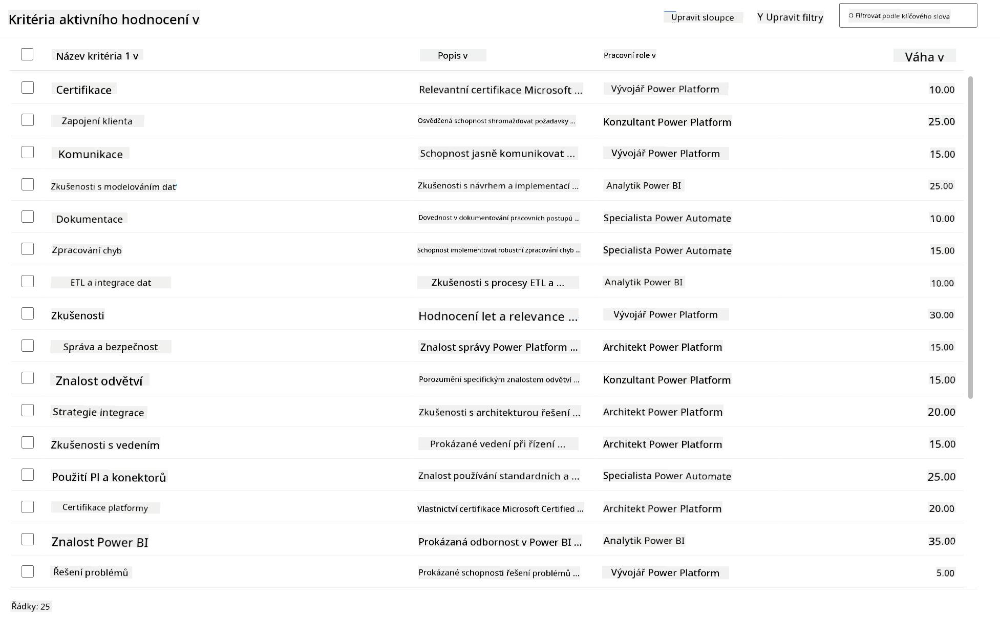

<!--
CO_OP_TRANSLATOR_METADATA:
{
  "original_hash": "2620cf9eaf09a3fc6be7fa31a3a62956",
  "translation_date": "2025-10-20T18:04:24+00:00",
  "source_file": "docs/operative-preview/01-get-started/README.md",
  "language_code": "cs"
}
-->
# 🚨 Mise 01: Začněte s náborovým agentem

--8<-- "disclaimer.md"

## 🕵️‍♂️ KRYCÍ JMÉNO: `OPERACE TALENT SCOUT`

> **⏱️ Časový rámec operace:** `~45 minut`

## 🎯 Popis mise

Vítejte, agente. Vaším prvním úkolem je **Operace Talent Scout** - vytvoření základní infrastruktury pro náborový systém poháněný umělou inteligencí, který změní způsob, jakým organizace identifikují a najímají špičkové talenty.

Vaším úkolem, pokud se rozhodnete jej přijmout, je nasadit a nakonfigurovat komplexní systém pro řízení náboru pomocí Microsoft Copilot Studio. Importujete předem připravené řešení obsahující všechny potřebné datové struktury a poté vytvoříte svého prvního AI agenta - **Náborového agenta**, který bude sloužit jako centrální koordinátor pro všechny budoucí náborové operace.

Toto počáteční nasazení vytvoří velín, který budete v průběhu programu Agent Academy Operative dále rozvíjet. Považujte to za základnu, na které vybudujete celou síť specializovaných agentů v následujících misích.

---

## 🔎 Cíle

Po splnění této mise budete:

- **Porozumění scénáři**: Získáte komplexní znalosti o výzvách a řešeních automatizace náboru
- **Nasazení řešení**: Úspěšně importujete a nakonfigurujete základy systému pro řízení náboru
- **Vytvoření agenta**: Vytvoříte náborového agenta, který bude základem scénáře, který budete budovat jako operativní agent Akademie

---

## 🔍 Předpoklady

Než se pustíte do této mise, ujistěte se, že máte:

- Licenci na Copilot Studio
- Přístup k prostředí Microsoft Power Platform
- Administrátorská oprávnění pro vytváření řešení a agentů

---

## 🏢 Porozumění scénáři automatizace náboru

Tento scénář ukazuje, jak může společnost využít Microsoft Copilot Studio ke zlepšení a automatizaci svého náborového procesu. Představuje systém agentů, kteří spolupracují na úkolech, jako je přezkoumávání životopisů, doporučování pracovních pozic, příprava materiálů na pohovory a hodnocení kandidátů.

### Hodnota pro podnikání

Řešení pomáhá HR týmům šetřit čas a přijímat lepší rozhodnutí díky:

- Automatickému zpracování životopisů přijatých e-mailem.
- Doporučování vhodných pracovních pozic na základě profilů kandidátů.
- Vytváření pracovních žádostí a průvodců pohovory přizpůsobených každému kandidátovi.
- Zajištění spravedlivých a transparentních náborových praktik díky vestavěným bezpečnostním a moderovacím funkcím.
- Sbírání zpětné vazby pro zlepšení řešení.

### Jak to funguje

- Centrální **Náborový agent** koordinuje proces a ukládá data do Microsoft Dataverse.
- **Agent pro příjem žádostí** čte životopisy a vytváří pracovní žádosti.
- **Agent pro přípravu pohovorů** generuje otázky na pohovory a dokumenty na základě informací o kandidátovi.
- Systém může být publikován na demo webu, což umožňuje zainteresovaným stranám s ním interagovat.

Tento scénář je ideální pro organizace, které chtějí modernizovat své náborové procesy pomocí automatizace poháněné AI, přičemž si zachovají transparentnost, spravedlnost a efektivitu.

---

## 🧪 Laboratoř: Nastavení náborového agenta

V této praktické laboratoři vytvoříte základ pro svůj systém automatizace náboru. Začnete importem předem nakonfigurovaného řešení, které obsahuje všechny potřebné tabulky Dataverse a datové struktury pro správu kandidátů, pracovních pozic a náborových procesů. Poté naplníte tyto tabulky ukázkovými daty, která podpoří vaše učení v průběhu tohoto modulu a poskytnou realistické scénáře pro testování. Nakonec vytvoříte Náborového agenta v Copilot Studio, nastavíte základní konverzační rozhraní, které bude základem pro všechny další funkce, které přidáte v budoucích misích.

### 🧪 Laboratoř 1.1: Import řešení

1. Přejděte na **[Copilot Studio](https://copilotstudio.microsoft.com)**
1. Vyberte **...** v levé navigaci a zvolte **Řešení**
1. Klikněte na tlačítko **Importovat řešení** nahoře
1. **[Stáhněte](https://raw.githubusercontent.com/microsoft/agent-academy/refs/heads/main/docs/operative-preview/01-get-started/assets/Operative_1_0_0_0.zip)** připravené řešení
1. Klikněte na **Procházet** a vyberte stažené řešení z předchozího kroku
1. Klikněte na **Další**
1. Klikněte na **Importovat**

!!! success
    Po úspěšném importu se zobrazí zelený oznamovací pruh s následující zprávou:  
    "Řešení "Operative" bylo úspěšně importováno."

Po importu řešení se podívejte na to, co jste importovali, kliknutím na zobrazovaný název řešení (`Operative`).



Následující komponenty byly importovány:

| Zobrazený název | Typ | Popis |
|-----------------|------|-------|
| Kandidát | Tabulka | Informace o kandidátovi |
| Kritéria hodnocení | Tabulka | Kritéria hodnocení pro roli |
| Náborový hub | Aplikace řízená modelem | Aplikace pro správu náborového procesu |
| Náborový hub | Mapa webu | Navigační struktura pro aplikaci Náborový hub |
| Pracovní žádost | Tabulka | Pracovní žádosti |
| Pracovní role | Tabulka | Pracovní role |
| Životopis | Tabulka | Životopisy kandidátů |

Jako poslední úkol této laboratoře klikněte na tlačítko **Publikovat všechny přizpůsobení** nahoře na stránce.

### 🧪 Laboratoř 1.2: Import ukázkových dat

V této laboratoři přidáte ukázková data do některých tabulek, které jste importovali v laboratoři 1.1.

#### Stáhněte soubory k importu

1. **[Stáhněte](https://raw.githubusercontent.com/microsoft/agent-academy/refs/heads/main/docs/operative-preview/01-get-started/assets/evaluation-criteria.csv)** soubor CSV s kritérii hodnocení
1. **[Stáhněte](https://raw.githubusercontent.com/microsoft/agent-academy/refs/heads/main/docs/operative-preview/01-get-started/assets/job-roles.csv)** soubor CSV s pracovními rolemi

#### Import ukázkových dat pracovních rolí

1. Vraťte se k řešení, které jste právě importovali v poslední laboratoři
1. Vyberte **Náborový hub** aplikaci řízenou modelem kliknutím na zaškrtávací políčko před řádkem
1. Klikněte na tlačítko **Přehrát** nahoře

    !!! warning
        Může se stát, že budete vyzváni k opětovnému přihlášení. Ujistěte se, že to provedete. Poté byste měli vidět aplikaci Náborový hub.

1. Vyberte **Pracovní role** v levé navigaci
1. Klikněte na ikonu **Více** (tři tečky pod sebou) v příkazovém panelu
1. Klikněte na **pravou šipku** vedle *Importovat z Excelu*

    

1. Klikněte na **Importovat z CSV**

    

1. Klikněte na tlačítko **Vybrat soubor**, vyberte soubor **job-roles.csv**, který jste právě stáhli, a poté klikněte na **Otevřít**
1. Klikněte na **Další**
1. Další krok ponechte beze změny a klikněte na **Zkontrolovat mapování**

    

1. Ujistěte se, že je mapování správné, a klikněte na **Dokončit import**

    !!! info
        Tím se zahájí import a budete moci sledovat průběh nebo proces ihned dokončit kliknutím na **Hotovo**

1. Klikněte na **Hotovo**

Toto může chvíli trvat, ale můžete kliknout na tlačítko **Obnovit**, abyste zjistili, zda byl import úspěšný.



#### Import ukázkových dat kritérií hodnocení

1. Vyberte **Kritéria hodnocení** v levé navigaci
1. Klikněte na ikonu **Více** (tři tečky pod sebou) v příkazovém panelu
1. Klikněte na **pravou šipku** vedle *Importovat z Excelu*

    

1. Klikněte na **Importovat z CSV**

    

1. Klikněte na tlačítko **Vybrat soubor**, vyberte soubor **evaluation-criteria.csv**, který jste právě stáhli, a poté klikněte na **Otevřít**
1. Klikněte na **Další**
1. Další krok ponechte beze změny a klikněte na **Zkontrolovat mapování**

    

1. Nyní musíme provést trochu více práce na mapování. Klikněte na lupu (ikona 🔎) vedle pole Job Role
1. Ujistěte se, že je zde vybrán **Job Title**, pokud ne - přidejte jej
1. Klikněte na **OK**
1. Ujistěte se, že je zbytek mapování také správný, a klikněte na **Dokončit import**

    !!! info
        Tím se opět zahájí import a budete moci sledovat průběh nebo proces ihned dokončit kliknutím na **Hotovo**

1. Klikněte na **Hotovo**

Toto může chvíli trvat, ale můžete kliknout na tlačítko **Obnovit**, abyste zjistili, zda byl import úspěšný.



### 🧪 Laboratoř 1.3: Vytvoření náborového agenta

Nyní, když jste dokončili nastavení předpokladů, je čas na skutečnou práci! Nejprve přidáme našeho Náborového agenta!

1. Přejděte na **[Copilot Studio](https://copilotstudio.microsoft.com)** a ujistěte se, že jste ve stejném prostředí, kde jste importovali řešení a data
1. Vyberte **Agenti** v levé navigaci
1. Klikněte na **Nový agent**
1. Klikněte na **Konfigurovat**
1. Do pole **Název** zadejte:

    ```text
    Hiring Agent
    ```

1. Do pole **Popis** zadejte:

    ```text
    Central orchestrator for all hiring activities
    ```

1. Klikněte na **...** vedle tlačítka *Vytvořit* v pravém horním rohu
1. Klikněte na **Aktualizovat pokročilá nastavení**
1. Jako **Řešení** vyberte `Operative`
1. Klikněte na **Aktualizovat**
1. Klikněte na **Vytvořit** v pravém horním rohu

Tím se vytvoří Náborový agent, kterého budete používat v průběhu tohoto operativního kurzu.

---

## 🎉 Mise splněna

Mise 01 je dokončena! Nyní jste zvládli následující dovednosti:

✅ **Porozumění scénáři**: Komplexní znalosti o výzvách a řešeních automatizace náboru  
✅ **Nasazení řešení**: Úspěšně jste importovali a nakonfigurovali základy systému pro řízení náboru  
✅ **Vytvoření agenta**: Vytvořili jste náborového agenta, který je základem scénáře, který budete budovat jako operativní agent Akademie  

Další na řadě je [Mise 02](../02-multi-agent/README.md): Připravte svého agenta na spolupráci s dalšími agenty.

---

## 📚 Taktické zdroje

📖 [Microsoft Copilot Studio - Vytvoření agenta](https://learn.microsoft.com/microsoft-copilot-studio/authoring-first-bot)  
📖 [Dokumentace Microsoft Dataverse](https://learn.microsoft.com/power-apps/maker/data-platform)

---

**Prohlášení**:  
Tento dokument byl přeložen pomocí služby AI pro překlady [Co-op Translator](https://github.com/Azure/co-op-translator). I když se snažíme o přesnost, mějte prosím na paměti, že automatické překlady mohou obsahovat chyby nebo nepřesnosti. Původní dokument v jeho rodném jazyce by měl být považován za autoritativní zdroj. Pro důležité informace se doporučuje profesionální lidský překlad. Neodpovídáme za žádná nedorozumění nebo nesprávné interpretace vyplývající z použití tohoto překladu.