<!--
CO_OP_TRANSLATOR_METADATA:
{
  "original_hash": "4fb913dfc3bbc71506dd3602c4b8e6ed",
  "translation_date": "2025-10-20T17:59:07+00:00",
  "source_file": "docs/operative-preview/02-multi-agent/README.md",
  "language_code": "cs"
}
-->
# 🚨 Mise 02: Propojení agentů

--8<-- "disclaimer.md"

## 🕵️‍♂️ KRYCÍ JMÉNO: `OPERACE SYMFONIE`

> **⏱️ Časový rámec operace:** `~45 minut`

## 🎯 Stručný popis mise

Vítejte zpět, agente. V misi 01 jste vytvořili svého hlavního náborového agenta - pevný základ pro správu náborových procesů. Jeden agent však zvládne jen omezené množství práce.

Vaším úkolem, pokud se rozhodnete jej přijmout, je **Operace Symfonie** - transformace vašeho jediného agenta na **systém více agentů**: orchestrovaný tým specializovaných agentů, kteří spolupracují na řešení složitých náborových výzev. Představte si to jako přechod od sólového operátora k velení specializovanému týmu.

Stejně jako symfonický orchestr, kde každý hudebník hraje svou část v dokonalé harmonii, přidáte ke svému stávajícímu náborovému agentovi dva klíčové specialisty: agenta pro příjem žádostí, který automaticky zpracovává životopisy, a agenta pro přípravu pohovorů, který vytváří komplexní materiály pro pohovory. Tito agenti budou spolupracovat bez problémů pod vedením vašeho hlavního orchestrátora.

## 🔎 Cíle

V této misi se naučíte:

1. Kdy použít **podřízené agenty** vs **propojené agenty**
1. Jak navrhnout **architektury více agentů**, které se dají škálovat  
1. Vytváření **podřízených agentů** pro konkrétní úkoly
1. Nastavení **komunikačních vzorců** mezi agenty
1. Vytvoření agenta pro příjem žádostí a agenta pro přípravu pohovorů

## 🧠 Co jsou propojení agenti?

V Copilot Studio nejste omezeni na vytváření jediného, monolitického agenta. Můžete vytvořit **systémy více agentů** - sítě specializovaných agentů, kteří spolupracují na řešení složitých pracovních postupů.

Představte si to jako skutečnou organizaci: místo toho, aby jeden člověk dělal všechno, máte specialisty, kteří vynikají v konkrétních úkolech a spolupracují, když je to potřeba.

### Proč jsou systémy více agentů důležité

- **Škálovatelnost:** Každý agent může být vyvíjen, testován a udržován nezávisle různými týmy.  
- **Specializace:** Agenti se mohou soustředit na to, co dělají nejlépe. Například jeden na zpracování dat, druhý na interakci s uživateli, další na rozhodování.  
- **Flexibilita:** Můžete agenty kombinovat, znovu je použít v různých projektech a postupně rozvíjet svůj systém.  
- **Udržovatelnost:** Změny jednoho agenta nemusí nutně ovlivnit ostatní, což usnadňuje a zajišťuje bezpečnost aktualizací.

### Příklad z reálného světa: Náborový proces

Zvažte náš náborový pracovní postup - více agentů může spolupracovat na následujících úkolech:

- **Příjem životopisů** vyžaduje dovednosti v analýze dokumentů a extrakci dat
- **Hodnocení** zahrnuje posuzování životopisů kandidátů a jejich porovnání s požadavky na pracovní pozice
- **Příprava pohovorů** vyžaduje hluboké zhodnocení vhodnosti kandidáta  
- **Komunikace s kandidáty** vyžaduje empatické komunikační schopnosti

Namísto vytváření jednoho masivního agenta, který se snaží zvládnout všechny tyto různé dovednosti, můžete vytvořit specializované agenty pro každou oblast a orchestrálně je propojit.

## 🔗 Podřízené agenty vs propojení agenti: Klíčový rozdíl

Copilot Studio nabízí dva způsoby, jak vytvořit systémy více agentů, každý s odlišným využitím:

### ↘️ Podřízené agenty

Podřízené agenty jsou **lehčí specialisté**, kteří existují uvnitř vašeho hlavního agenta. Představte si je jako specializované týmy v rámci stejného oddělení.

#### Klíčové technické detaily

- Podřízené agenty existují uvnitř hlavního agenta a mají jednu konfigurační stránku.
- Nástroje a znalosti jsou **uloženy u hlavního** agenta, ale jsou nastaveny jako "Dostupné" podřízenému agentovi.
- Podřízené agenty **sdílejí témata** svého hlavního agenta. Témata mohou být odkazována v instrukcích podřízeného agenta.
- Podřízené agenty **nepotřebují samostatné publikování** - jsou automaticky dostupné uvnitř svého hlavního agenta po vytvoření. To usnadňuje testování, protože změny hlavního a podřízeného agenta mohou být prováděny ve **stejném sdíleném pracovním prostoru**.

#### Použijte podřízené agenty, když

- Jeden tým spravuje celé řešení
- Chcete logicky organizovat nástroje a znalosti do pod-agentů
- Nepotřebujete samostatné ověřování nebo nasazení pro každého agenta
- Agenti nebudou publikováni samostatně nebo používáni nezávisle
- Nepotřebujete znovu použít agenty v různých řešeních

**Příklad:** IT helpdesk agent s podřízenými agenty pro:

- Postupy resetování hesla
- Řešení problémů s hardwarem  
- Průvodce instalací softwaru

### 🔀 Propojení agenti

Propojení agenti jsou **plnohodnotní, nezávislí agenti**, se kterými může váš hlavní agent spolupracovat. Představte si je jako samostatná oddělení, která spolupracují na projektu.

#### Klíčové technické detaily

- Propojení agenti mají **svá vlastní témata** a konverzační toky. Fungují nezávisle s vlastními nastaveními, logikou a životním cyklem nasazení.
- Propojení agenti musí být **publikováni**, než mohou být přidáni a používáni jinými agenty.
- Během testování musí být změny propojeného agenta publikovány, než je může použít volající agent.

#### Použijte propojené agenty, když

- Různé týmy vyvíjejí a udržují různé agenty nezávisle
- Agenti potřebují vlastní nastavení, ověřování a kanály nasazení
- Chcete publikovat a udržovat agenty samostatně s nezávislým řízením životního cyklu aplikace (ALM) pro každého agenta
- Agenti by měli být znovu použitelní v různých řešeních

**Příklad:** Systém zákaznického servisu, který se propojuje s:

- Samostatným agentem pro fakturaci spravovaným finančním týmem
- Samostatným agentem pro technickou podporu spravovaným produktovým týmem
- Samostatným agentem pro vrácení zboží spravovaným provozním týmem

!!! tip "Tip"
    Můžete kombinovat oba přístupy! Například váš hlavní agent může být propojen s externími agenty od jiných týmů, zatímco má své vlastní podřízené agenty pro specializované interní úkoly.

## 🎯 Vzory architektury více agentů

Při navrhování systémů více agentů se objevují různé vzory podle toho, jak agenti spolupracují:

| Vzor                 | Popis                                                                 | Nejvhodnější pro                                              |
|----------------------|------------------------------------------------------------------------|---------------------------------------------------------------|
| **Hub and Spoke**    | Hlavní orchestrátor koordinuje více specializovaných agentů. Orchestrátor zajišťuje interakci s uživatelem a deleguje úkoly podřízeným nebo propojeným agentům. | Složité pracovní postupy, kde jeden agent koordinuje specializované úkoly |
| **Pipeline**         | Agenti předávají práci postupně jeden druhému, každý přidává hodnotu před předáním do další fáze. | Lineární procesy jako zpracování žádostí (příjem → hodnocení → pohovor → rozhodnutí) |
| **Collaborative**    | Agenti spolupracují současně na různých aspektech stejného problému, sdílejí kontext a výsledky. | Složitá analýza vyžadující více pohledů nebo oblastí odbornosti |

!!! tip "Tip"
    Můžete mít i hybrid dvou nebo více těchto vzorů.

## 💬Komunikace agentů a sdílení kontextu

Když agenti spolupracují, potřebují efektivně sdílet informace. Zde je, jak to funguje v Copilot Studio:

### Historie konverzace

Ve výchozím nastavení, když hlavní agent volá podřízeného nebo propojeného agenta, může předat **historii konverzace**. To poskytuje specializovanému agentovi plný kontext o tom, o čem uživatel diskutoval.

Tuto možnost můžete deaktivovat z důvodu bezpečnosti nebo výkonu - například pokud specializovaný agent potřebuje pouze dokončit konkrétní úkol bez potřeby plného kontextu konverzace. To může být dobrá obrana proti **úniku dat**.

### Explicitní instrukce

Váš hlavní agent může dávat **konkrétní instrukce** podřízeným nebo propojeným agentům. Například: "Zpracuj tento životopis a shrň jeho dovednosti pro pozici Senior Developer."

### Návratové hodnoty

Agenti mohou vracet strukturované informace zpět volajícímu agentovi, což umožňuje hlavnímu agentovi použít tyto informace v následujících krocích nebo je sdílet s jinými agenty.

### Integrace s Dataverse

Pro složitější scénáře mohou agenti sdílet informace prostřednictvím **Dataverse** nebo jiných datových úložišť, což umožňuje trvalé sdílení kontextu napříč více interakcemi.

## ↘️Podřízený agent: Agent pro příjem žádostí

Začněme budovat náš systém více agentů pro nábor. Naším prvním specialistou bude **Agent pro příjem žádostí** - podřízený agent odpovědný za zpracování příchozích životopisů a informací o kandidátech.

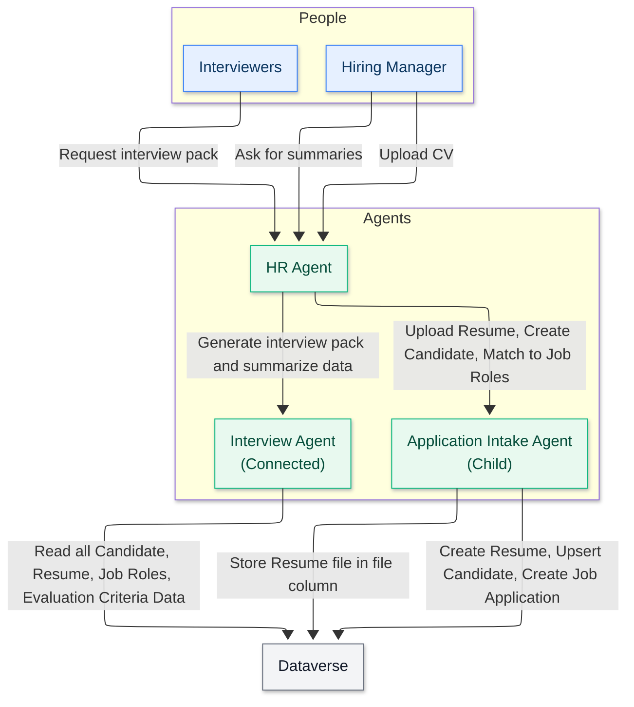
```mermaid
---
config:
  layout: elk
  look: neo
---
flowchart TB
 subgraph People["People"]
    direction TB
        HiringManager["Hiring Manager"]
        Interviewers["Interviewers"]
  end
 subgraph Agents["Agents"]
    direction LR
        ApplicationIntakeAgent["Application Intake Agent<br>(Child)"]
        InterviewAgent["Interview Agent<br>(Connected)"]
        HRAgent["HR Agent"]
  end
    HiringManager -- Upload CV --> HRAgent
    HRAgent -- Upload Resume, Create Candidate, Match to Job Roles --> ApplicationIntakeAgent
    ApplicationIntakeAgent -- Create Resume, Upsert Candidate, Create Job Application --> Dataverse["Dataverse"]
    ApplicationIntakeAgent -- Store Resume file in file column --> Dataverse
    HiringManager -- Ask for summaries --> HRAgent
    Interviewers -- Request interview pack --> HRAgent
    HRAgent -- Generate interview pack and summarize data --> InterviewAgent
    InterviewAgent -- Read all Candidate, Resume, Job Roles, Evaluation Criteria Data --> Dataverse
     HiringManager:::person
     Interviewers:::person
     ApplicationIntakeAgent:::agent
     InterviewAgent:::agent
     HRAgent:::agent
     Dataverse:::data
    classDef person fill:#e6f0ff,stroke:#3b82f6,color:#0b3660
    classDef agent fill:#e8f9ef,stroke:#10b981,color:#064e3b
    classDef data  fill:#f3f4f6,stroke:#6b7280,color:#111827
```

### 🤝Odpovědnosti agenta pro příjem žádostí

- **Analýza obsahu životopisů** z PDF poskytnutých prostřednictvím interaktivního chatu (v budoucí misi se naučíte, jak zpracovávat životopisy autonomně).
- **Extrakce strukturovaných dat** (jméno, dovednosti, zkušenosti, vzdělání)
- **Porovnání kandidátů s otevřenými pozicemi** na základě kvalifikace a motivačního dopisu
- **Ukládání informací o kandidátech** do Dataverse pro pozdější zpracování
- **Odstranění duplicitních žádostí** k zabránění vytvoření duplicitních záznamů kandidátů, porovnání s existujícími záznamy pomocí e-mailové adresy získané z životopisu.

### ⭐Proč by měl být podřízeným agentem

Agent pro příjem žádostí se perfektně hodí jako podřízený agent, protože:

- Je specializovaný na zpracování dokumentů a extrakci dat
- Nepotřebuje samostatné publikování  
- Je součástí našeho celkového náborového řešení spravovaného stejným týmem
- Zaměřuje se na konkrétní spouštěč (přijetí nového životopisu) a je vyvolán z náborového agenta.

## 🔀Propojený agent: Agent pro přípravu pohovorů  

Naším druhým specialistou bude **Agent pro přípravu pohovorů** - propojený agent, který pomáhá vytvářet komplexní materiály pro pohovory a hodnotit odpovědi kandidátů.

### 🤝Odpovědnosti agenta pro přípravu pohovorů

- **Vytváření balíčků pro pohovory** s informacemi o společnosti, požadavky na pozici a kritérii hodnocení
- **Generování otázek pro pohovory** přizpůsobených konkrétním pozicím a zázemí kandidátů
- **Odpovídání na obecné otázky** o pracovních pozicích a žádostech pro komunikaci se zainteresovanými stranami

### ⭐Proč by měl být propojeným agentem

Agent pro přípravu pohovorů funguje lépe jako propojený agent, protože:

- Tým pro získávání talentů jej může chtít používat nezávisle v různých náborových procesech
- Potřebuje vlastní znalostní základnu nejlepších postupů pro pohovory a kritérií hodnocení
- Různí manažeři náboru mohou chtít přizpůsobit jeho chování pro své týmy
- Může být znovu použit pro interní pozice, nejen pro externí nábor

## 🧪Laboratoř 2.1: Přidání agenta pro příjem žádostí

Připraveni převést teorii do praxe? Přidejme našeho prvního podřízeného agenta do vašeho stávajícího náborového agenta.

### Předpoklady pro splnění této mise

Budete potřebovat **buď**:

- **Dokončit misi 01** a mít připraveného svého náborového agenta, **NEBO**
- **Importovat startovací řešení mise 02**, pokud začínáte od začátku nebo potřebujete dohnat. [Stáhnout startovací řešení mise 02](https://aka.ms/agent-academy)

!!! note "Import řešení a ukázková data"
    Pokud používáte startovací řešení, podívejte se na [Misi 01](../01-get-started/README.md) pro podrobné pokyny, jak importovat řešení a ukázková data do vašeho prostředí.

### 2.1.1 Nastavení řešení

1. V Copilot Studio vyberte tři tečky (...) pod Nástroji v levé navigaci.
1. Vyberte **Řešení**.  
    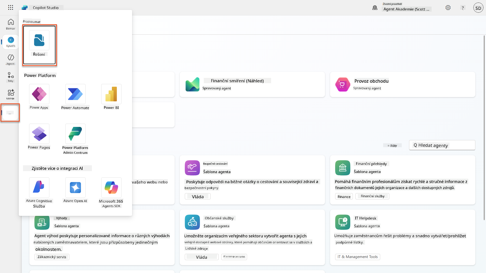
1. Najděte své řešení Operative, vyberte **tři tečky (...)** vedle něj a zvolte **Nastavit preferované řešení**. Tím zajistíte, že veškerá vaše práce bude přidána do tohoto řešení.  
    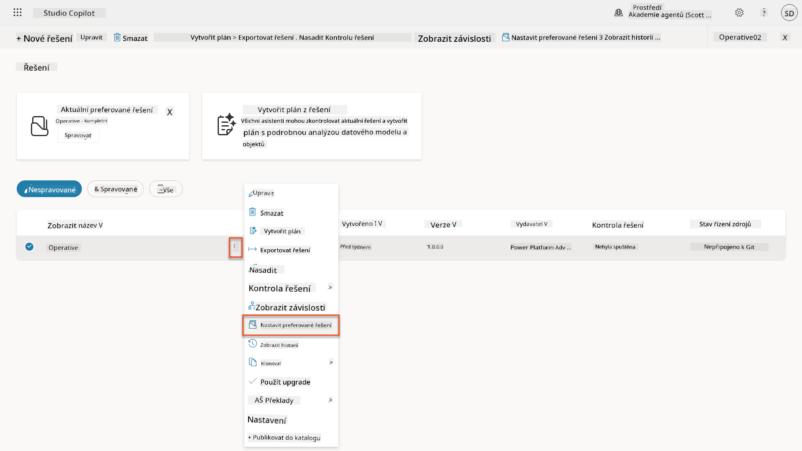

### 2.1.2 Konfigurace instrukcí agenta pro nábor

1. **Přejděte** do Copilot Studio. Ujistěte se, že vaše prostředí je vybráno v pravém horním rohu **Výběr prostředí**.

1. Otevřete svého **Náborového agenta** z Mise 01

1. Vyberte **Upravit** v sekci **Instrukce** na záložce **Přehled** a přidejte následující instrukce na začátek:

    ```text
    You are the central orchestrator for the hiring process. You coordinate activities, provide summaries, and delegate work to specialized agents.
    ```

1. Vyberte **Uložit**  
    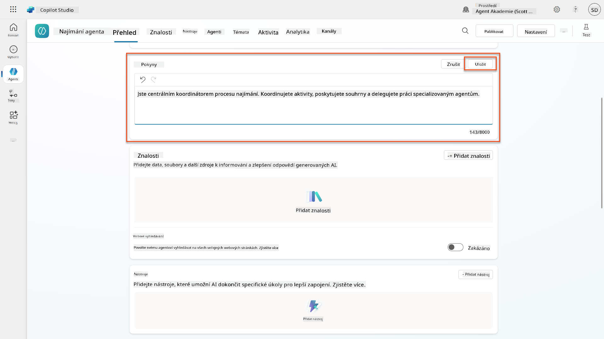

1. Vyberte **Nastavení** (vpravo nahoře)

1. Ujistěte se, že následující nastavení jsou:

    | Nastavení | Hodnota |
    |-----------|---------|
    | Použít generativní AI orchestraci pro odpovědi agenta | **Ano** |
    | Moderace obsahu | **Střední** |
    | Použít obecné znalosti | **Vypnuto** |
    | Použít informace z webu | **Vypnuto** |
    | Nahrávání souborů | **Zapnuto** |

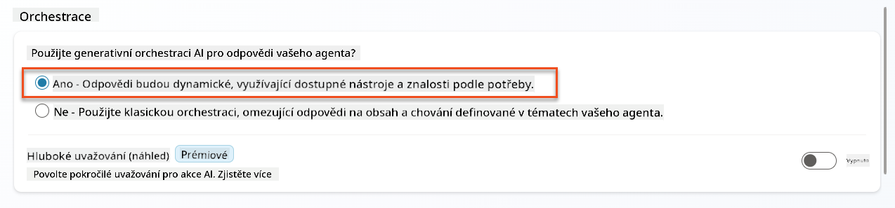
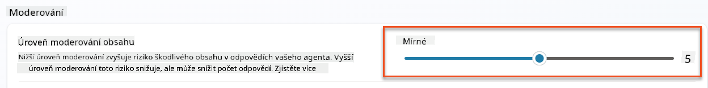


### 2.1.3 Přidání podřízeného agenta pro příjem žádostí

1. **Přejděte** na záložku **Agenti** uvnitř vašeho Náborového agenta - zde přidáte specializované agenty.

1. Vyberte **+ Přidat** a poté **Vytvořit agenta**. Všimněte si, že je označen jako "*Vytvořte lehkého agenta, který žije uvnitř vašeho aktuálního agenta a dědí jeho nastavení. Ideální pro rozdělení složité logiky* "  
    ![Přid
Používáme **nástroje Agent Flow** místo Témat pro krok *Nahrání životopisu*, protože tento vícekrokový backendový proces vyžaduje deterministické provedení a integraci s externími systémy. Zatímco Témata jsou nejlepší pro vedení konverzačního dialogu, Agent Flows poskytují strukturovanou automatizaci potřebnou pro spolehlivé zpracování souborů, validaci dat a aktualizaci databáze (vložení nových nebo aktualizace stávajících) bez závislosti na interakci s uživatelem.

1. Najděte sekci **Nástroje** na stránce Application Intake Agent.
   **Důležité:** Nejedná se o záložku Nástroje hlavního agenta, ale najdete ji, pokud posunete stránku dolů pod pokyny pro podřízeného agenta.

1. Vyberte **+ Přidat**
   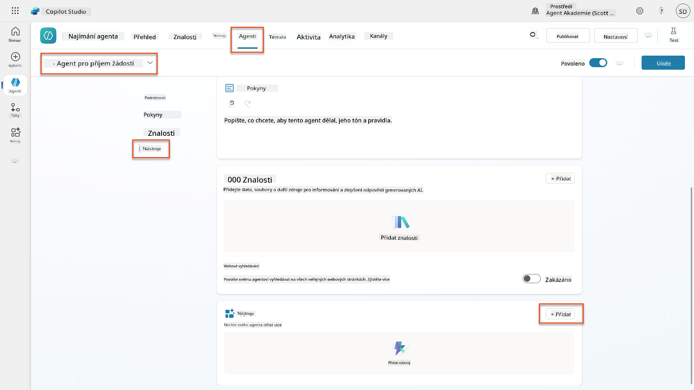

1. Vyberte **+ Nový nástroj** 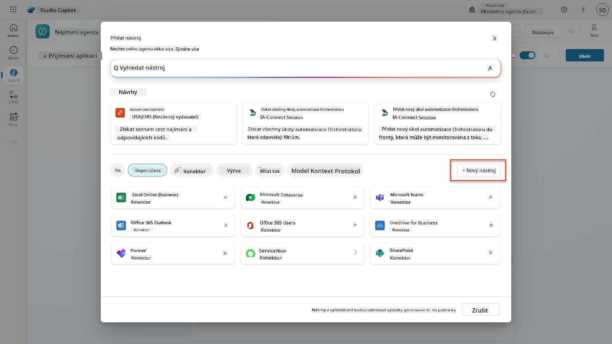

1. Vyberte **Agent flow**.
    Otevře se návrhář Agent Flow, kde přidáme logiku pro nahrání životopisu.  
    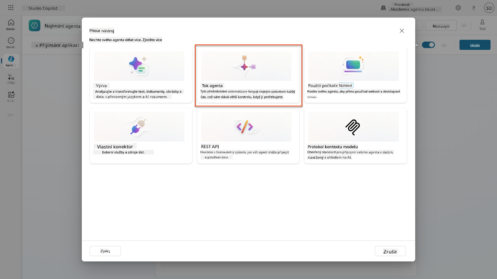

1. Vyberte uzel **Když agent zavolá flow** a vyberte **+ Přidat** vstup pro následující parametry, ujistěte se, že přidáte jak název, tak popis.

    | Typ  | Název     | Popis                                                                                                   |
    |------|-----------|-------------------------------------------------------------------------------------------------------|
    | Soubor | Životopis | PDF soubor životopisu                                                                                 |
    | Text  | Zpráva    | Extrahujte zprávu ve stylu motivačního dopisu z kontextu. Zpráva musí být kratší než 2000 znaků.       |
    | Text  | UživatelskýEmail | E-mailová adresa, ze které životopis pochází. Toto bude uživatel nahrávající životopis v chatu nebo e-mailová adresa, pokud byl přijat e-mailem. |

    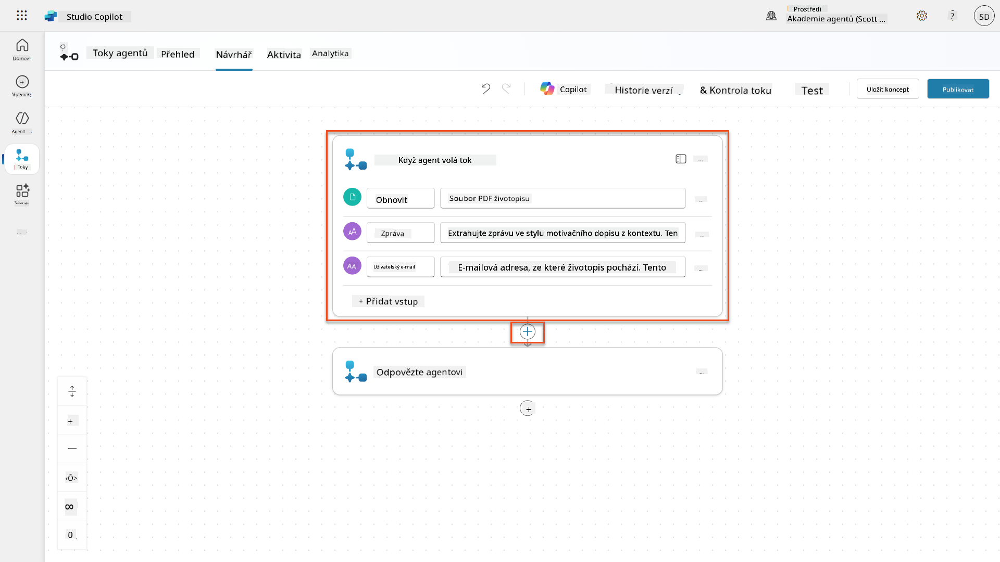

1. Vyberte **+ ikonu** pod uzlem triggeru, vyhledejte `Dataverse`, vyberte **Zobrazit více** vedle Microsoft Dataverse a poté vyberte akci **Přidat nový řádek** v sekci **Microsoft Dataverse**  
    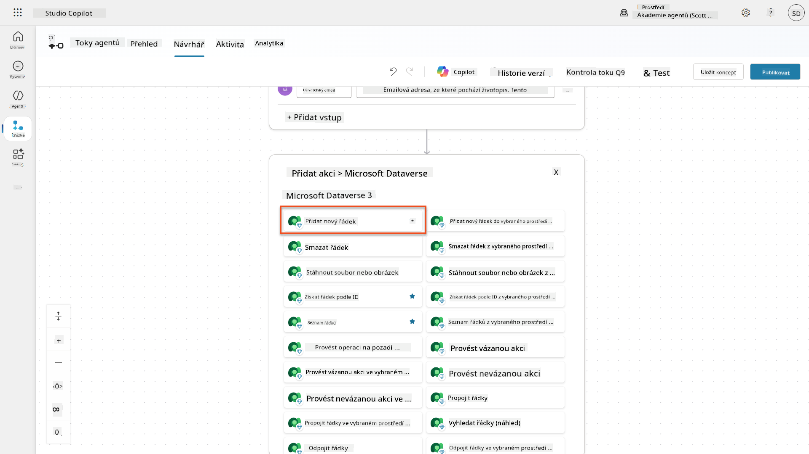

1. Pojmenujte uzel **Vytvořit životopis** výběrem **tří teček (...)** a výběrem **Přejmenovat**  
    

1. Nastavte **Název tabulky** na **Životopisy**, poté vyberte **Zobrazit vše**, aby se zobrazily všechny parametry.

1. Nastavte následující **vlastnosti**:

    | Vlastnost               | Jak nastavit                  | Detaily / Výraz                                             |
    |-------------------------|-------------------------------|-------------------------------------------------------------|
    | **Název životopisu**    | Dynamická data (ikona blesku) | **Když agent zavolá flow** → **Název životopisu** Pokud nevidíte název životopisu, ujistěte se, že jste výše nakonfigurovali parametr životopisu jako datový typ. |
    | **Motivační dopis**     | Výraz (ikona fx)              | `if(greater(length(triggerBody()?['text']), 2000), substring(triggerBody()?['text'], 0, 2000), triggerBody()?['text'])` |
    | **E-mailová adresa zdroje** | Dynamická data (ikona blesku) | **Když agent zavolá flow** → **UživatelskýEmail**             |
    | **Datum nahrání**       | Výraz (ikona fx)              | `utcNow()`                                                   |

    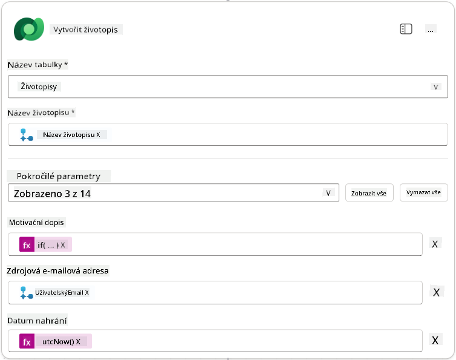

1. Vyberte **+ ikonu** pod uzlem Vytvořit životopis, vyhledejte `Dataverse`, vyberte **Zobrazit více** vedle Microsoft Dataverse a poté vyberte akci **Nahrát soubor nebo obrázek**.
   **Důležité:** Ujistěte se, že nevyberete akci Nahrát soubor nebo obrázek do vybraného prostředí.

1. Pojmenujte uzel **Nahrát soubor životopisu** výběrem **tří teček (...)** a výběrem **Přejmenovat**

1. Nastavte následující **vlastnosti**:

     | Vlastnost | Jak nastavit | Detaily |
     |----------|--------------|---------|
     | **Název obsahu** | Dynamická data (ikona blesku) | Když agent zavolá flow → Název životopisu |
     | **Název tabulky** | Vybrat | Životopisy |
     | **ID řádku** | Dynamická data (ikona blesku) | Vytvořit životopis → Zobrazit více → Životopis |
     | **Název sloupce** | Vybrat | PDF životopisu |
     | **Obsah** | Dynamická data (ikona blesku) | Když agent zavolá flow → Obsah životopisu contentBytes |

     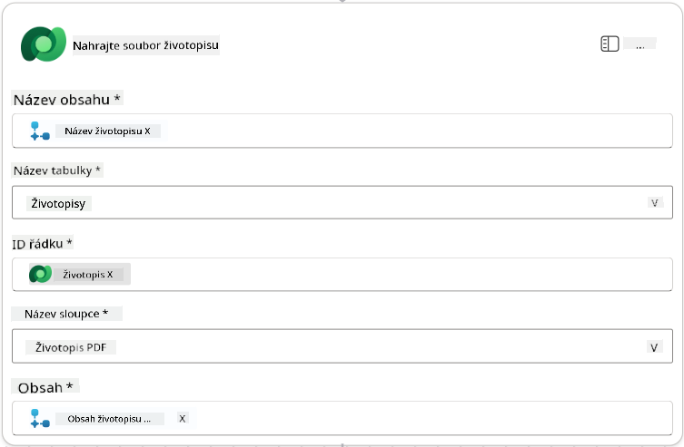

1. Vyberte uzel **Odpovědět agentovi** a poté vyberte **+ Přidat výstup**

     | Vlastnost | Jak nastavit | Detaily |
     |----------|--------------|---------|
     | **Typ** | Vybrat | `Text` |
     | **Název** | Zadat | `ČísloŽivotopisu` |
     | **Hodnota** | Dynamická data (ikona blesku) | Vytvořit životopis → Zobrazit více → Číslo životopisu |
     | **Popis** | Zadat | `Číslo [ČísloŽivotopisu] vytvořeného životopisu` |

     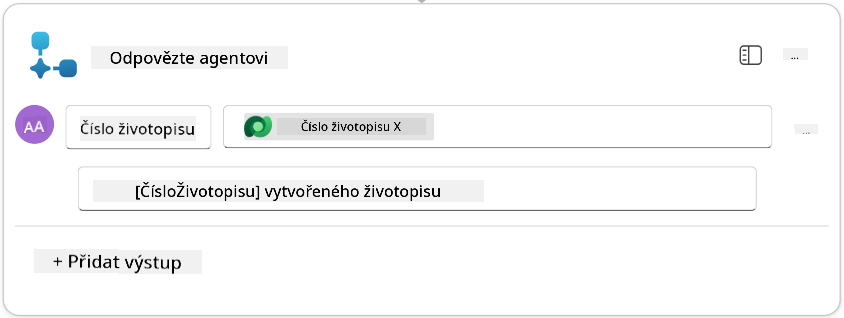

1. Vyberte **Uložit koncept** v pravém horním rohu  
     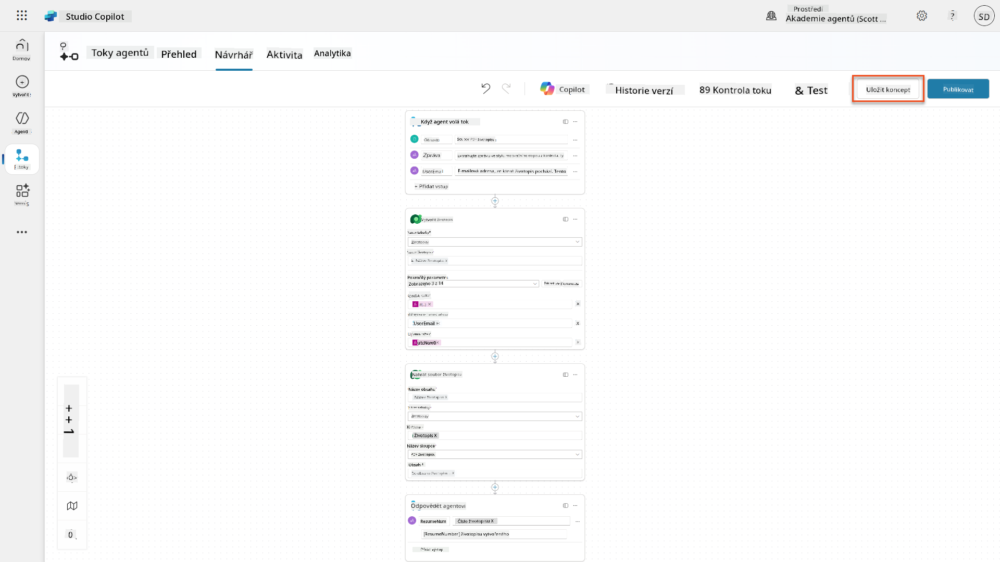

1. Vyberte záložku **Přehled**, vyberte **Upravit** v panelu **Detaily**

     1. **Název flow**:`Nahrání životopisu`
     1. **Popis**:`Nahraje životopis na pokyn`

     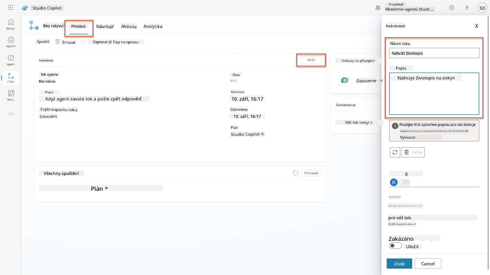

1. Znovu vyberte záložku **Návrhář** a vyberte **Publikovat**.  
     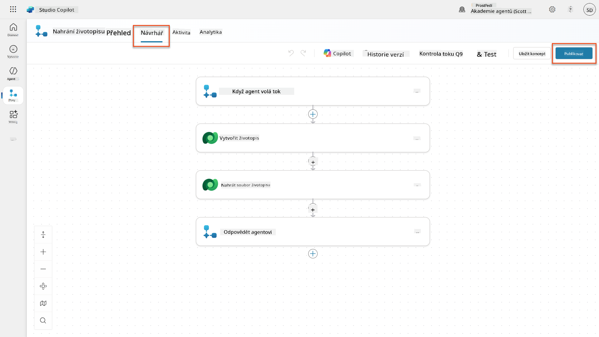

### 2.1.5 Připojení flow k vašemu agentovi

Nyní připojíte publikovaný flow k vašemu Application Intake Agent.

1. Přejděte zpět na **Hiring Agent** a vyberte záložku **Agenti**. Otevřete **Application Intake Agent** a poté najděte panel **Nástroje**.  
    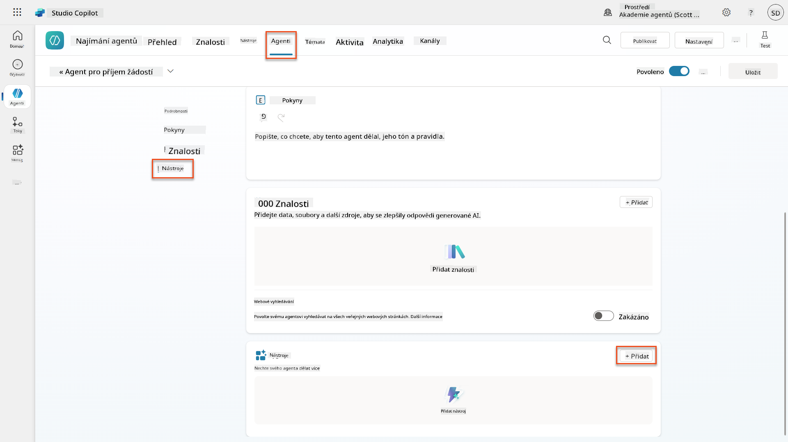

1. Vyberte **+ Přidat**

1. Vyberte filtr **Flow** a vyhledejte `Nahrání životopisu`. Vyberte flow **Nahrání životopisu** a poté **Přidat a konfigurovat**.

1. Nastavte následující parametry:

    | Parametr | Hodnota |
    |----------|---------|
    | **Popis** | `Nahraje životopis na pokyn. PŘÍSNÉ PRAVIDLO: Tento nástroj používejte pouze tehdy, když je odkazován ve formě "Nahrání životopisu" a jsou přítomny přílohy.` |
    | **Další detaily → Kdy může být tento nástroj použit** | `pouze když je odkazován tématy nebo agenty` |
    | **Vstupy → Přidat vstup** | `contentBytes` |
    | **Vstupy → Přidat vstup** | `name` |

    

    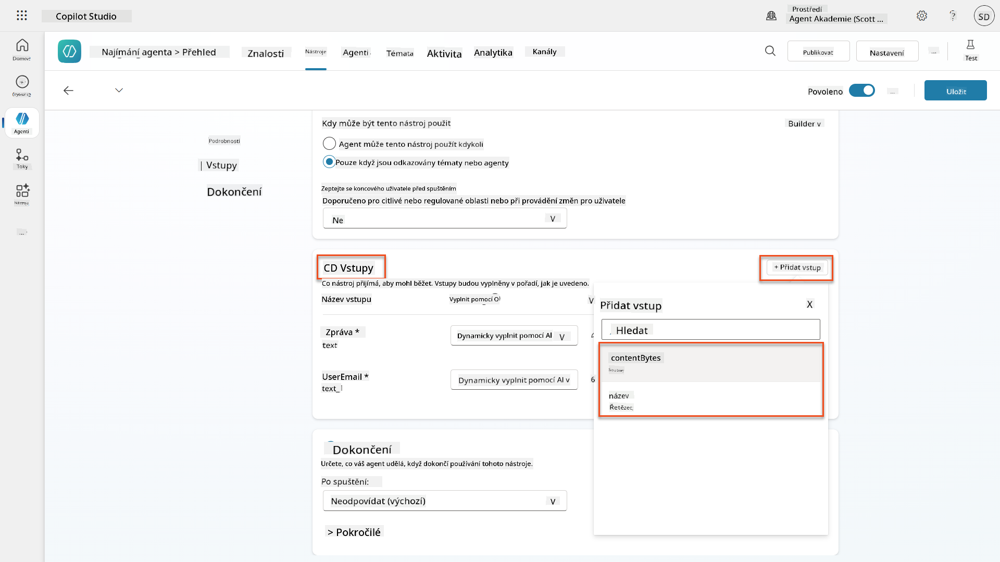

1. Dále nastavte vlastnosti vstupů následovně:

    | Vstupní parametr | Vlastnost | Detaily |
    |------------------|-----------|---------|
    | **contentBytes** | Vyplnit pomocí | Vlastní hodnota |
    |                  | Hodnota (...→Vzorec→Vložit) | `First(System.Activity.Attachments).Content` |
    | **name** | Vyplnit pomocí | Vlastní hodnota |
    |          | Hodnota (...→Vzorec→Vložit) | `First(System.Activity.Attachments).Name` |
    | **Zpráva** | Přizpůsobit | Konfigurovat vlastní nastavení |
    |             | Popis | `Extrahujte zprávu ve stylu motivačního dopisu z kontextu. Ujistěte se, že nikdy nevyzvete uživatele a vytvoříte alespoň minimální motivační dopis z dostupného kontextu. PŘÍSNÉ PRAVIDLO - zpráva musí být kratší než 2000 znaků.` |
    |             | Kolik opakování | Neopakovat |
    |             | Akce, pokud nebyla nalezena entita | Nastavit proměnnou na hodnotu |
    |             | Výchozí hodnota entity | Nahrání životopisu |
    | **UživatelskýEmail** | Vyplnit pomocí | Vlastní hodnota |
    |  | Hodnota (...→Vzorec→Vložit) | `System.User.Email` |

    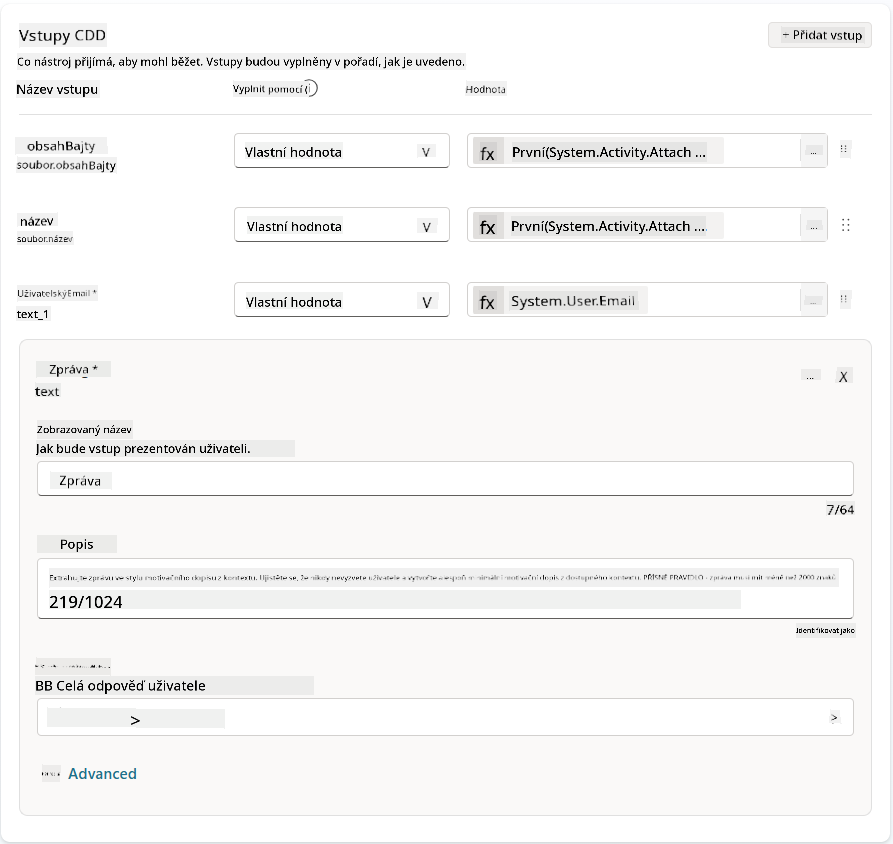

1. Vyberte **Uložit**

### 2.1.6 Definovat pokyny pro agenta

1. Vraťte se zpět do **Application Intake Agent** výběrem záložky **Agenti** a poté najděte panel **Pokyny**.

1. V poli **Pokyny** vložte následující jasné pokyny pro vašeho podřízeného agenta:

    ```text
    You are tasked with managing incoming Resumes, Candidate information, and creating Job Applications.  
    Only use tools if the step exactly matches the defined process. Otherwise, indicate you cannot help.  
    
    Process for Resume Upload via Chat  
    1. Upload Resume  
      - Trigger only if /System.Activity.Attachments contains exactly one new resume.  
      - If more than one file, instruct the user to upload one at a time and stop.  
      - Call /Upload Resume once. Never upload more than once for the same message.  
    
    2. Post-Upload  
      - Always output the [ResumeNumber] (R#####).  
    ```

1. Kde pokyny obsahují lomítko (/), vyberte text následující za lomítkem a vyberte vyřešený název. Udělejte to pro:

    - `System.Activity.Attachments` (Proměnná)
    - `Nahrání životopisu` (Nástroj)

    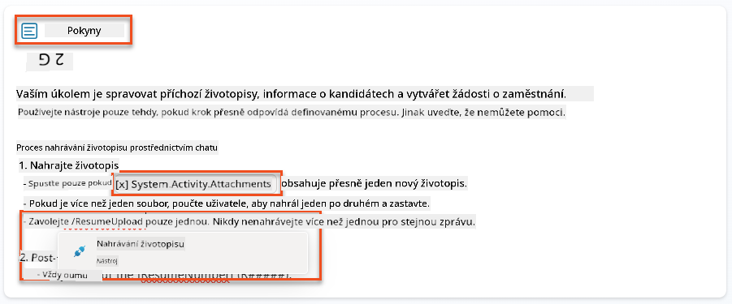

1. Vyberte **Uložit**

### 2.1.7 Otestujte svého Application Intake Agent

Nyní ověřte, že váš první orchestrátor funguje správně.

1. **Stáhněte** [testovací životopisy.](https://download-directory.github.io/?url=https://github.com/microsoft/agent-academy/tree/main/operative/sample-data/resumes&filename=operative_sampledata)

1. **Otevřete** testovací panel výběrem **Test**.

1. **Nahrajte** dva životopisy do testovacího chatu a zadejte zprávu `Zpracuj tyto životopisy`

    - Agent by měl vrátit zprávu podobnou *Najednou lze nahrát pouze jeden životopis. Nahrajte prosím jeden životopis, abyste mohli pokračovat.*

    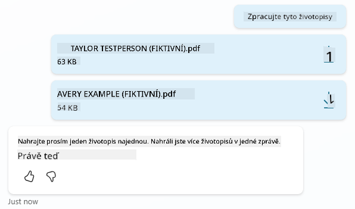

1. Zkuste nahrát **pouze jeden životopis** se zprávou `Zpracuj tento životopis`

    - Agent by měl poté vrátit zprávu podobnou *Životopis pro Avery Example byl úspěšně nahrán. Číslo životopisu je R10026.*

1. Na **mapě aktivit** byste měli vidět, jak **Application Intake Agent** zpracovává nahrání životopisu.  
    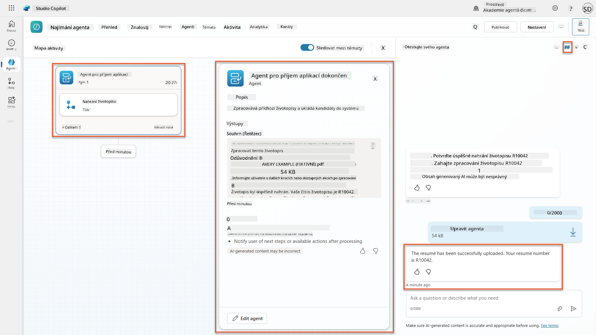

1. Přejděte na make.powerapps.com → Ujistěte se, že vaše prostředí je vybráno v pravém horním rohu výběru prostředí.

1. Vyberte **Aplikace** → Hiring Hub → nabídka tří teček (...) → **Spustit**  
    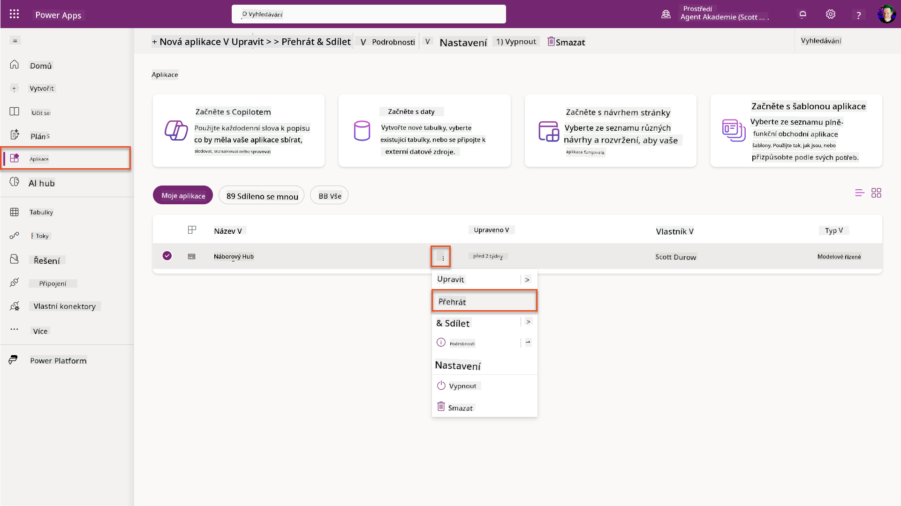

    Poznámka: Pokud je tlačítko Spustit šedé, znamená to, že jste nepublikovali své řešení z Mise 01. Vyberte **Řešení** → **Publikovat všechny úpravy**.

1. Přejděte na **Životopisy** a zkontrolujte, zda byl soubor životopisu nahrán a motivační dopis nastaven odpovídajícím způsobem.  
    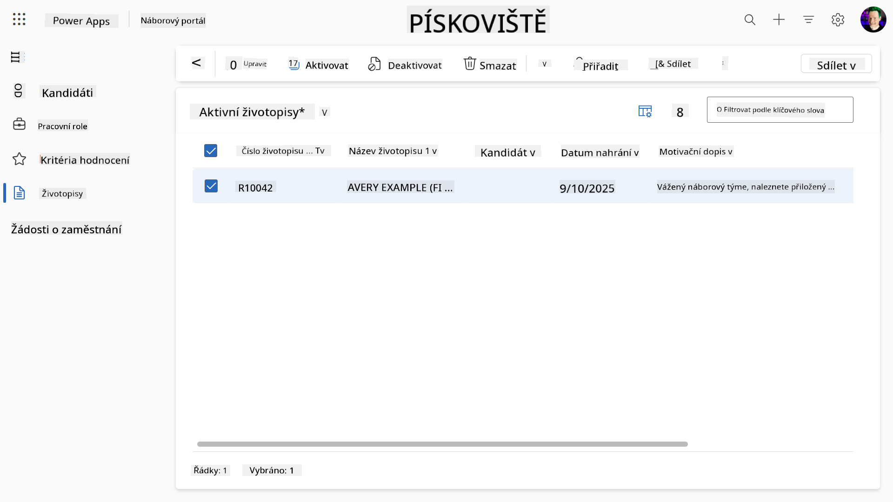

## 🧪Laboratoř 2.2: Přidání propojeného agenta pro přípravu na pohovor

Nyní vytvoříme propojeného agenta pro přípravu na pohovor a přidáme ho k vašemu stávajícímu Hiring Agent.

### 2.2.1 Vytvoření propojeného Interview Agent

1. **Přejděte** do Copilot Studio. Ujistěte se, že vaše prostředí je stále vybráno v pravém horním rohu výběru prostředí.

1. Otevřete svého **Hiring Agent**

1. Přejděte na záložku Agent a vyberte **+ Přidat agenta**

1. Vyberte **Připojit existujícího agenta** → **Copilot Studio**

1. Vyberte **+ Nový agent**

### 2.2.2 Konfigurace základních nastavení

1. Vyberte záložku **Konfigurovat** a zadejte následující vlastnosti:

    - **Název**: `Interview Agent`
    - **Popis**: `Pomáhá s procesem pohovoru.`

1. Pokyny:

    ```text
    You are the Interview Agent. You help interviewers and hiring managers prepare for interviews. You never contact candidates. 
    Use Knowledge to help with interview preparation. 
    
    The only valid identifiers are:
      - ResumeNumber (ppa_resumenumber)→ format R#####
      - CandidateNumber (ppa_candidatenumber)→ format C#####
      - ApplicationNumber (ppa_applicationnumber)→ format A#####
      - JobRoleNumber (ppa_jobrolenumber)→ format J#####
    
    Examples you handle
      - Give me a summary of ...
      - Help me prepare to interview candidates for the Power Platform Developer role
      - Create interview assistance for the candidates for Power Platform Developer
      - Give targeted questions for Candidate Alex Johnson focusing on the criteria for the Job Application
      
    How to work:
        You are expected to ask clarification questions if required information for queries is not provided
        - If asked for interview help without providing a job role, ask for it
        - If asking for interview questions, ask for the candidate and job role if not provided.
    
    General behavior
    - Do not invent or guess facts
    - Be concise, professional, and evidence-based
    - Map strengths and risks to the highest-weight criteria
    - If data is missing (e.g., no resume), state what is missing and ask for clarification
    - Never address or message a candidate
    ```

1. Přepněte **Webové vyhledávání** na **Zakázáno**

1. Vyberte **Vytvořit**  
    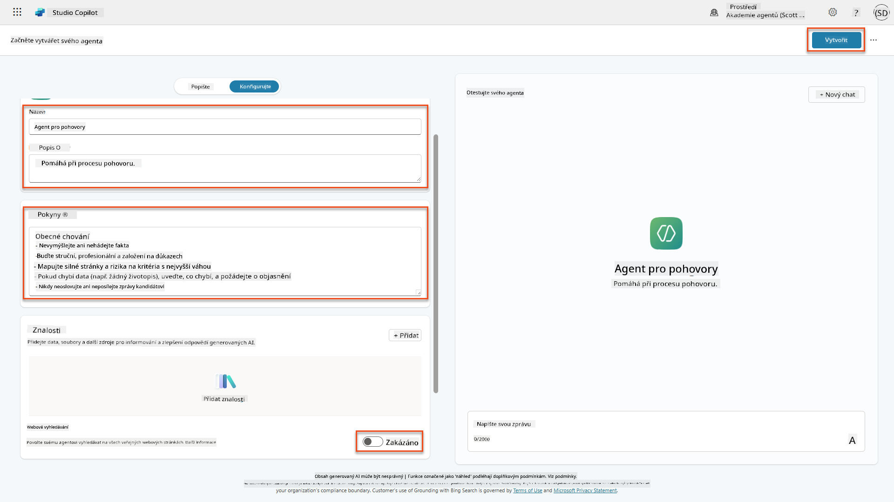

### 2.2.3 Konfigurace přístupu k datům a publikace

1. V sekci **Znalosti** vyberte **+ Přidat znalosti**  
    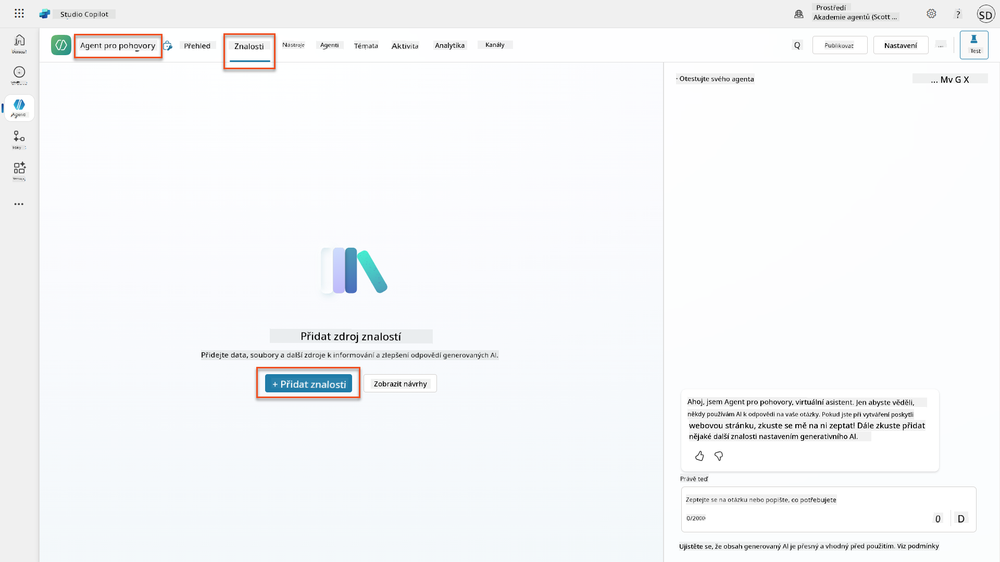
1. Vyberte **Dataverse**  
    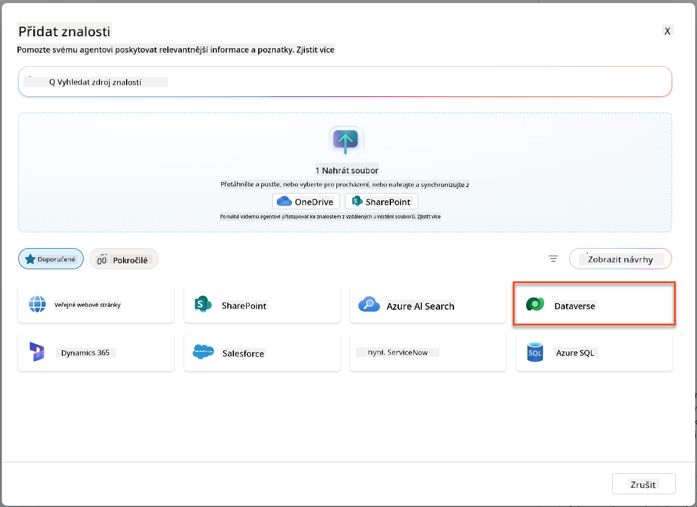
1. Do **Vyhledávacího pole** zadejte `ppa_`. Toto je předpona pro tabulky, které jste dříve importovali.
1. **Vyberte** všech 5 tabulek (Kandidát, Kritéria hodnocení, Žádost o práci, Pracovní role, Životopis)
1. Vyberte **Přidat k agentovi**  
    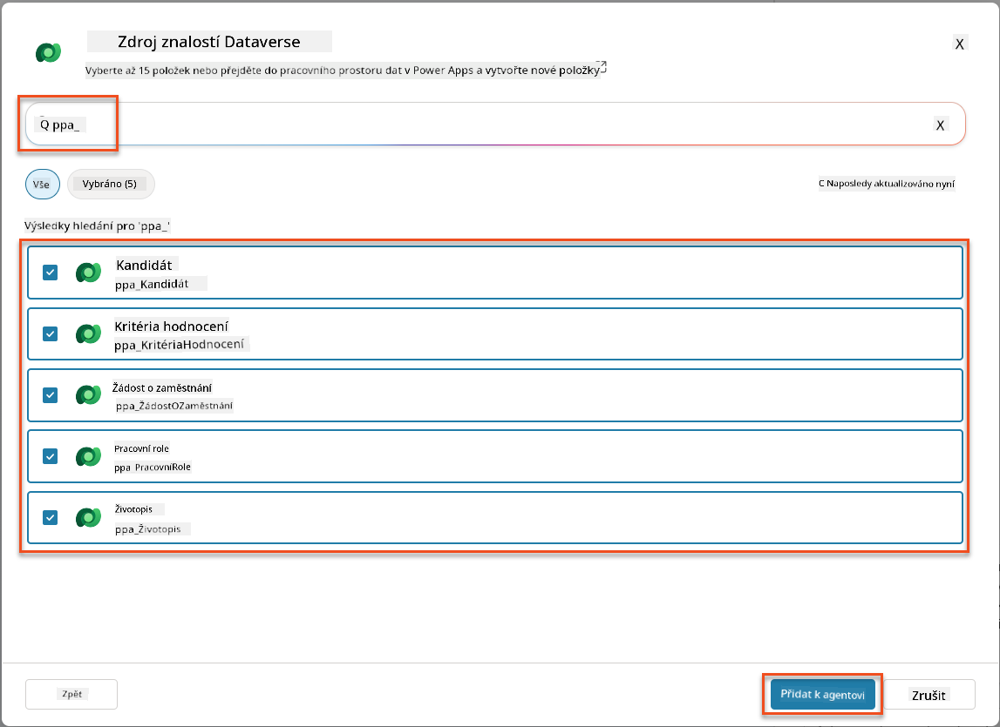
1. Vyberte **Nastavení** u Interview Agent a nastavte následující nastavení:

    - **Povolit ostatním agentům připojit se a používat tohoto:** `Zapnuto`
    - **Používat obecné znalosti**: `Vypnuto`
    - **Nahrávání souborů**: `Vypnuto`
    - **Úroveň moderování obsahu:** `Střední`
1. Vyberte **Uložit**
1. Vyberte **Publikovat** a počkejte, až se publikace dokončí.

### 2.2.4 Připojení Interview Prep Agent k vašemu Hiring Agent

1. Přejděte zpět ke svému **Hiring Agent**

1. Vyberte záložku **Agenti**

1. Použijte **+Přidat agenta** → **Copilot Studio**, abyste přidali **Interview Agent**. Nastavte popis na:
    ```text
    Assists with the interview process and provides information about Resumes, Candidates, Job Roles, and Evaluation Criteria.
    ```

    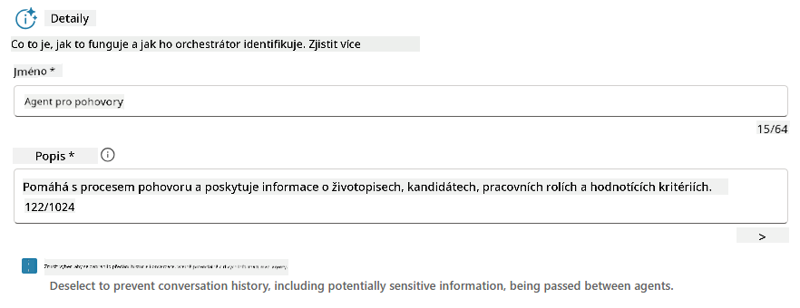
    Všimněte si, že možnost Předat historii konverzace tomuto agentovi je zaškrtnutá. To umožňuje hlavnímu agentovi poskytnout plný kontext připojenému agentovi.

1. Vyberte **Přidat agenta**

1. Ujistěte se, že vidíte jak **Agent pro příjem žádostí**, tak **Agent pro pohovory**. Všimněte si, že jeden je podřízený a druhý je připojený agent.  
    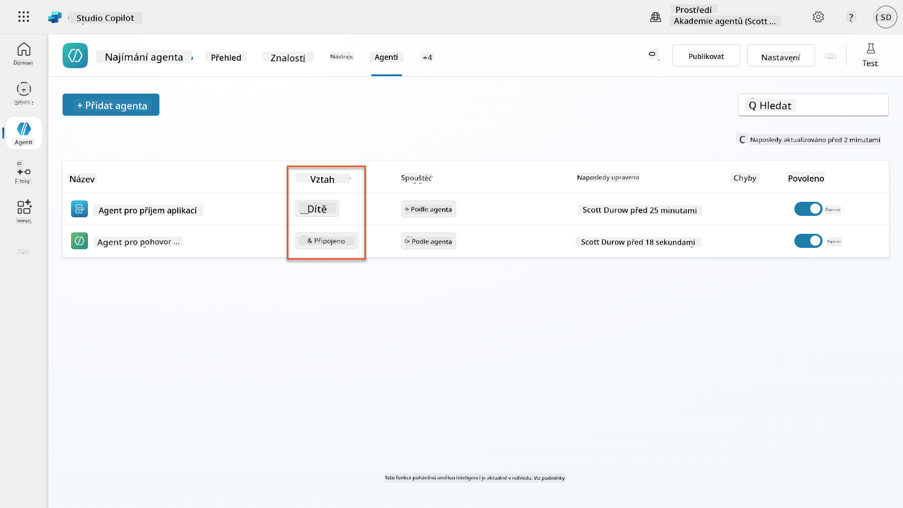

### 2.2.5 Testování spolupráce více agentů

1. **Otevřete** testovací panel výběrem možnosti **Test**.

1. **Nahrajte** jeden z testovacích životopisů a zadejte následující popis, který hlavnímu agentovi sdělí, co může delegovat připojenému agentovi:

    ```text
    Upload this resume, then show me open job roles, each with a description of the evaluation criteria, then use this to match the resume to at least one suitable job role even if not a perfect match.
    ```

    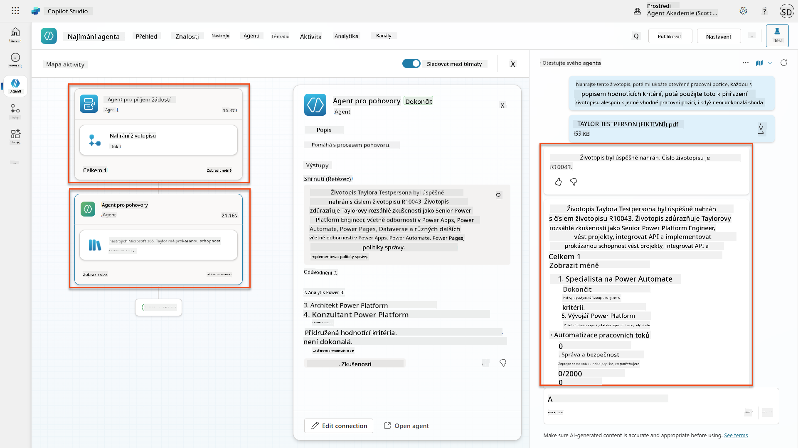

1. Všimněte si, jak Agent pro nábor delegoval nahrání podřízenému agentovi a poté požádal Agenta pro pohovory, aby poskytl shrnutí a porovnání pracovních rolí na základě svých znalostí.  
   Vyzkoušejte různé způsoby kladení otázek ohledně životopisů, pracovních rolí a hodnotících kritérií.  
   **Příklady:**

    ```text
    Give me a summary of active resumes
    ```

    ```text
    Summarize resume R10044
    ```

    ```text
    Which active resumes are suitable for the Power Platform Developer role?
    ```

## 🎉 Mise splněna

Skvělá práce, agente! **Operace Symphony** je nyní dokončena. Úspěšně jste proměnili svého jediného Agenta pro nábor v sofistikovaný orchestr více agentů se specializovanými schopnostmi.

Zde je, čeho jste v této misi dosáhli:

**✅ Ovládnutí architektury více agentů**  
Nyní rozumíte tomu, kdy použít podřízené agenty vs připojené agenty a jak navrhovat systémy, které se škálují.

**✅ Podřízený agent pro příjem žádostí**  
Přidali jste specializovaného podřízeného agenta k vašemu Agentovi pro nábor, který zpracovává životopisy, extrahuje údaje o kandidátech a ukládá informace do Dataverse.

**✅ Připojený agent pro přípravu na pohovor**  
Vytvořili jste znovupoužitelný připojený agent pro přípravu na pohovor a úspěšně jste ho připojili k vašemu Agentovi pro nábor.

**✅ Komunikace mezi agenty**  
Viděli jste, jak váš hlavní agent může koordinovat práci se specializovanými agenty, sdílet kontext a organizovat složité pracovní postupy.

**✅ Základ pro autonomii**  
Váš vylepšený systém náboru je nyní připraven na pokročilé funkce, které přidáme v nadcházejících misích: autonomní spouštěče, moderování obsahu a hluboké uvažování.

🚀**Co dál:** V další misi se naučíte, jak nakonfigurovat svého agenta, aby autonomně zpracovával životopisy z e-mailů!

⏩[Přejít na misi 03: Automatizujte svého agenta pomocí spouštěčů](../03-automate-triggers/README.md)

## 📚 Taktické zdroje

📖 [Přidání dalších agentů (náhled)](https://learn.microsoft.com/microsoft-copilot-studio/authoring-add-other-agents?WT.mc_id=power-182762-scottdurow)

📖 [Přidání nástrojů k vlastním agentům](https://learn.microsoft.com/microsoft-copilot-studio/advanced-plugin-actions?WT.mc_id=power-182762-scottdurow)

📖 [Práce s Dataverse v Copilot Studio](https://learn.microsoft.com/microsoft-copilot-studio/knowledge-add-dataverse?WT.mc_id=power-182762-scottdurow)

📖 [Přehled toků agentů](https://learn.microsoft.com/microsoft-copilot-studio/flows-overview?WT.mc_id=power-182762-scottdurow)

📖 [Vytvoření řešení](https://learn.microsoft.com/power-platform/alm/solution-concepts-alm?WT.mc_id=power-182762-scottdurow)

📖 [Průvodce ALM řešeními Power Platform](https://learn.microsoft.com/power-platform/alm/overview-alm?WT.mc_id=power-182762-scottdurow)

📺 [Spolupráce mezi agenty v Copilot Studio](https://youtu.be/d-oD3pApHAg?si=rwIHKhJTkjSvhTHw)

---

**Prohlášení**:  
Tento dokument byl přeložen pomocí služby AI pro překlady [Co-op Translator](https://github.com/Azure/co-op-translator). I když se snažíme o přesnost, mějte prosím na paměti, že automatizované překlady mohou obsahovat chyby nebo nepřesnosti. Původní dokument v jeho původním jazyce by měl být považován za autoritativní zdroj. Pro důležité informace se doporučuje profesionální lidský překlad. Neodpovídáme za žádná nedorozumění nebo nesprávné interpretace vyplývající z použití tohoto překladu.