<!--
CO_OP_TRANSLATOR_METADATA:
{
  "original_hash": "75efaf515d5694d4fd549bfd6518901a",
  "translation_date": "2025-10-20T18:20:10+00:00",
  "source_file": "docs/operative-preview/03-automate-triggers/README.md",
  "language_code": "cs"
}
-->
# Mise 03: Přidání spouštěčů událostí pro autonomní činnost

--8<-- "disclaimer.md"

## 🕵️‍♂️ KRYCÍ JMÉNO: `OPERACE SIGNAL POINT`

> **⏱️ Časový rámec operace:** `~45 minut`

## 🎯 Stručný popis mise

Vítejte zpět, agente. V [Misi 02](../02-multi-agent/README.md) jste se naučili, jak vytvořit podřízeného agenta pro příjem žádostí a propojeného agenta pro přípravu na pohovor, čímž jste rozšířili schopnosti svého hlavního náborového agenta.

Vaším úkolem, pokud se rozhodnete jej přijmout, je **Operace Signal Point** – hlubší ponoření do **spouštěčů událostí** – povýšení vašeho systému agentů z reaktivního na **autonomní provoz**. Přeměníte své agenty z čekání na lidský vstup na proaktivní reakci na externí události a inteligentní činnost bez dohledu.

Představte si to jako upgrade z agentů, kteří _odpovídají na otázky_, na agenty, kteří _předvídají potřeby_ a _jednají nezávisle_. Prostřednictvím spouštěčů událostí a automatizovaných pracovních postupů váš náborový agent detekuje příchozí e-maily s životopisy, automaticky zpracuje přílohy, uloží data do Dataverse a upozorní váš HR tým náboru prostřednictvím Microsoft Teams – zatímco vy se soustředíte na úkoly s vyšší hodnotou.

Vítejte ve světě, kde se automatizace setkává s inteligencí.

## 🔎 Cíle

V této misi se naučíte:

1. Jak spouštěče událostí umožňují autonomní chování agentů bez interakce uživatele
1. Rozdíly mezi interaktivními a autonomními agenty v Copilot Studio
1. Jak vytvořit spouštěče událostí, které automaticky zpracovávají e-mailové přílohy a nahrávají soubory do Dataverse
1. Jak vytvořit pracovní postupy agentů, které zveřejňují adaptivní karty v kanálech Teams pro upozornění
1. Jak předávat data mezi spouštěči událostí a pracovními postupy agentů pro automatizaci od začátku do konce

## 🤔 Co je spouštěč událostí?

Dříve v [Recruit](../../recruit/10-add-event-triggers/README.md) jsme se naučili o spouštěčích událostí. Udělejme si rychlé shrnutí, pokud jste to minuli.

**Spouštěče událostí** umožňují agentovi _jednat_ samostatně, když se něco stane v jiném systému – není potřeba žádná zpráva od uživatele. Když se spustí konfigurovaná událost – například „nová položka v SharePointu“, „nový e-mail“, „přiřazený úkol v Planneru“ nebo dokonce časově založená opakování, konektor odešle spouštěcí data vašemu agentovi. Agent pak následuje vaše pokyny, aby rozhodl, jaké akce nebo témata má zavolat.

### Klíčové vlastnosti

- **Autonomní aktivace:**
      - Na rozdíl od spouštěčů témat, které začínají, když uživatel píše agentovi, spouštěče událostí se spouštějí z externích událostí, což umožňuje proaktivní chování.

- **Řízené daty:**
      - Každá událost doručuje data (proměnné + volitelné pokyny) prostřednictvím konektoru. Agent používá vaše definované pokyny a data k rozhodnutí, co dělat dál.
      - Například _zavolat téma_ nebo _provést akce definované nástroji_.

- **Příklady připravené k použití:**
      - Soubor nebo položka vytvořená v SharePointu/OneDrive
      - Úkol v Planneru dokončen/přiřazen
      - Odpověď na Microsoft Forms odeslána
      - Opakování/plán

    Dostupnost závisí na datových politikách vaší organizace nakonfigurovaných v Power Automate.

- **Vyžaduje generativní orchestraci:**
      - Spouštěče událostí jsou dostupné pouze tehdy, když je pro agenta povolena generativní orchestrace.

- **Fakturace/užívání:**
      - Každé doručení spouštěče se počítá jako zpráva do kapacity Copilot Studio.
      - Například opakování každých 10 minut odešle zprávu každých 10 minut.

- **Model autentizace a nastavení:**
      - Spouštěče přidáváte v přehledu agenta, pod _Triggers_. Autentizace pro konektor spouštěče používá účet autora agenta („autentizace autora agenta“).
      - Parametry spouštěče a data můžete upravit v portálu Power Automate maker.

- **Testování a sledování:**
      - Spouštěče můžete testovat z testovacího panelu agenta a zkoumat chování pomocí mapy aktivit před publikováním.

!!! info "Shrnutí pro vývojáře"

    Představte si spouštěče událostí jako **signály podobné webhookům**, které posílají strukturovaná data vašemu agentovi, umožňují mu _zahájit_ práci a řetězit akce napříč systémy – aniž by čekal na uživatele.

### Spouštěče témat – jak se liší

Dříve jste se naučili o spouštěčích témat v [Recruit](../../recruit/07-add-new-topic-with-trigger/README.md), ale možná stále přemýšlíte, jak se _spouštěče témat_ liší od _spouštěčů událostí_ a proč je tento rozdíl důležitý pro pochopení toho, co činí agenta autonomním.

Spouštěče témat kontrolují _kdy se téma spustí_, obvykle v reakci na zprávu uživatele.

- V generativní orchestraci je výchozí spouštěč **Podle agenta** – plánovač vybere téma, jehož název/popisek nejlépe odpovídá zprávě uživatele.
- V klasické orchestraci je výchozí **Fráze** – plánovač vybere téma, když jedna nebo několik spouštěcích frází nejlépe odpovídá zprávě uživatele.

Další typy spouštěčů zahrnují `Přijatá zpráva`, `Přijatá událost`, `Přijatá aktivita`, `Aktualizace konverzace`, `Přijaté vyvolání`, `Nečinnost` a `Dokončení plánu`.

!!! info "Základní rozdíl"

    Spouštěče témat jsou _zahajovače konverzace_ uvnitř chatu.
    
    Spouštěče událostí jsou _zahajovače systému_ doručené prostřednictvím konektorů, které mohou spustit agenta bez jakékoli konverzace.

### Rychlý přehled spouštěče témat vs spouštěče událostí

- **Spouštěč témat:** Uživatel (nebo aktivita v chatu) řekl/udělal X ➡️ spustit téma T.
- **Spouštěč událostí:** SharePoint/Planner/E-mail/Časovač spustil s daty P ➡️ agent vyhodnotí pokyny ➡️ zavolat akce/témata podle potřeby.

## 🏓 Interaktivní agent vs autonomní agent – srovnání

Nyní, když znáte rozdíl mezi spouštěči událostí a spouštěči témat, se naučíme rozdíl mezi interaktivním agentem a autonomním agentem.

V termínech Copilot Studio „interaktivní“ odpovídá agentům, kteří primárně komunikují prostřednictvím **témat** v chatu nebo kanálu. „Autonomní“ odpovídá agentům, kteří také využívají **spouštěče událostí**, aby fungovali bez vstupu uživatele.

Následující tabulka shrnuje jejich rozdíly a podobnosti.

| Dimenze                             | Interaktivní agent    | Autonomní agent                                                                                              |
|-------------------------------------|-----------------------|---------------------------------------------------------------------------------------------------------------|
| Jak začíná                          | Uživatel (nebo aktivita v chatu) spustí téma. Příklad: Podle agenta, Fráze, Přijatá zpráva.   | Externí spouštěč událostí odešle data prostřednictvím konektoru agentovi. Příklad: SharePoint, Planner, e-mail, plán, atd. |
| Primární použití                    | Otázky a odpovědi, řízené pracovní postupy, akce na vyžádání v chatu – Teams, web, atd.  | Proaktivní operace a automatizace na pozadí – reagovat na změny v systému a poté upozornit, uložit nebo organizovat úkoly. |
| Povrch spouštěče                   | Spouštěče témat: Podle agenta / Fráze / Přijatá zpráva / Typy aktivit / Vyvolání / Nečinnost / Dokončení plánu | Knihovna spouštěčů událostí prostřednictvím konektorů; data zahrnují údaje o události + volitelné pokyny. |
| Plánovač (generativní orchestrace)  | Silně využíván pro spouštěče Podle agenta a Dokončení plánu k výběru/seřazení témat. | Vyžadováno pro spouštěče událostí; agent používá pokyny + data k rozhodnutí, jaké akce/témata zavolat. |
| Typický příklad                     | Uživatel se ptá „Jaká je naše politika vracení peněz?“ → Spustí se téma, dotazuje se na znalosti, odpovídá. | Nový úkol v Planneru přiřazen → Spustí se spouštěč událostí → Agent zveřejní zprávu v Teams, aktualizuje záznam nebo zavolá téma. |
| Cesta nastavení                     | Vytvořit témata, definovat typ spouštěče, vytvořit dialog/akce; publikovat do kanálů. | Přidat spouštěč událostí (Přehled → Spouštěče), autentizovat konektor pomocí přihlašovacích údajů autora agenta, nakonfigurovat data/pokyny; testovat přes testovací panel; publikovat. |
| Autentizace a správa                | Funguje v kontextu kanálu/autentizace; spouštěče témat reagují na aktivity chatu v povolených kanálech. | Dostupnost spouštěčů závisí na datových politikách Power Automate; konektory fungují pod účtem autora agenta. |
| Sledování                           | Testovat témata v Copilot Studio, zkoumat přepisy konverzací/aktivity. | Použít Test spouštěče a mapu aktivit k ověření provedení před publikováním, sledovat aktivitu po publikování. |
| Dopad na kapacitu                   | Každá zpráva uživatele/odpověď agenta je zpráva spotřebovávající kapacitu. | Každé doručení události je také zpráva, plus jakékoli následné akce. Příklad: opakování každých 10 minut = 6 zpráv/hodinu |

### Kdy použít který?

- Zvolte **spouštěče témat (interaktivní)**, když uživatelé zahajují konverzaci s agentem – FAQ, řízený příjem nebo úkoly ve stylu příkazů uvnitř chatu. Spouštěč Podle agenta plánovače snižuje manuální kuraci frází.
- Přidejte **spouštěče událostí (autonomní)**, když by měl agent zahájit konverzaci nebo provést akci sám – při aktualizacích v SharePointu/Dataverse, příchozím e-mailu nebo podle plánu. To vás posouvá z reaktivních na proaktivní operace.

## Tipy pro vývojáře a úskalí

1. **Povolte generativní orchestraci** pro jakéhokoli agenta, kterého chcete učinit autonomním. Spouštěče událostí se jinak nezobrazí.

1. **Modelujte data včas.** Rozhodněte, jaká minimální pole váš agent potřebuje ze spouštěče, například `itemId`, `assignedTo`, `dueDate`, a přidejte stručné pokyny, které agentovi řeknou, jakou akci/téma zavolat na základě hodnot dat.

1. **Na autentizaci záleží.** Spouštěče se autentizují pomocí účtu autora agenta. Ujistěte se, že tento účet má správná oprávnění konektoru a splňuje datové politiky Power Automate.

1. **Kontrolujte náklady a šum.** Vysokofrekvenční opakování nebo velmi časté zdroje mohou rychle zvýšit spotřebu zpráv – omezte, kde je to možné, nebo přidejte podmínky ve spouštěči k filtrování událostí.

1. **Testujte před publikováním.** Použijte **Test spouštěče** a mapu aktivit k sledování plánu a volaných akcí – iterujte pokyny/data, dokud nebude chování stabilní.

## 🧪 Laboratoř 03 - Automatizace e-mailů s žádostmi kandidátů

Dále přidáme spouštěč událostí k **Náborovému agentovi** a vytvoříme pracovní postup agenta v podřízeném **Agentovi pro příjem žádostí**, který bude zajišťovat další zpracování pro autonomii.

### ✨ Scénář použití

!!! info ""

    **Jako** HR náborář

    **Chci** být upozorněn, když do mé schránky dorazí e-mail s životopisem, který byl automaticky nahrán do Dataverse

    **Abych mohl** být informován o životopisech zaslaných e-mailem pro žádosti automaticky nahrané do Dataverse

Toho dosáhneme pomocí dvou technik:

1. Spouštěč událostí pro příchozí e-mail,
    1. Zkontrolovat, zda `contentType` souboru odpovídá `PDF` jako formátu.
    1. Extrahovat soubor a nahrát do Dataverse pomocí akcí prostřednictvím konektoru Dataverse.
    1. Poté poslat výzvu agentovi pro další zpracování předáním vstupních parametrů z akcí Dataverse.

1. Pracovní postup agenta bude přidán do podřízeného **Agenta pro příjem žádostí**, který je vyvolán výzvou ve spouštěči událostí.
    1. Použít vstupní parametry předané z výzvy spouštěče událostí v adaptivní kartě zveřejněné v kanálu Microsoft Teams k upozornění HR týmu náboru. Adaptivní karta bude obsahovat odkaz na řádek v Dataverse, který bude zobrazen v **Náborovém agentovi**.

Začněme!

### ✨ Předpoklady pro splnění mise

Budete potřebovat **buď**:

- **Dokončit Misi 01 a Misi 02** a mít připraveného Náborového agenta, **NEBO**
- **Importovat startovací řešení Mise 03**, pokud začínáte od začátku nebo potřebujete dohnat. [Stáhnout startovací řešení Mise 03](https://aka.ms/agent-academy)

!!! note "Import řešení a ukázková data"
    Pokud používáte startovací řešení, podívejte se na [Misi 01](../01-get-started/README.md) pro podrobné pokyny, jak importovat řešení a ukázková data do vašeho prostředí.

Budete také potřebovat přístup k **Microsoft Teams**, abyste dokončili druhé cvičení laboratoře zveřejnění adaptivní karty v Microsoft Teams.

### Laboratoř 3.1 - Automatizace nahrávání životopisů do Dataverse přijatých e-mailem

1. V Náborovém agentovi přejděte dolů na **záložku Přehled** a vyberte **+ Přidat spouštěč**.

       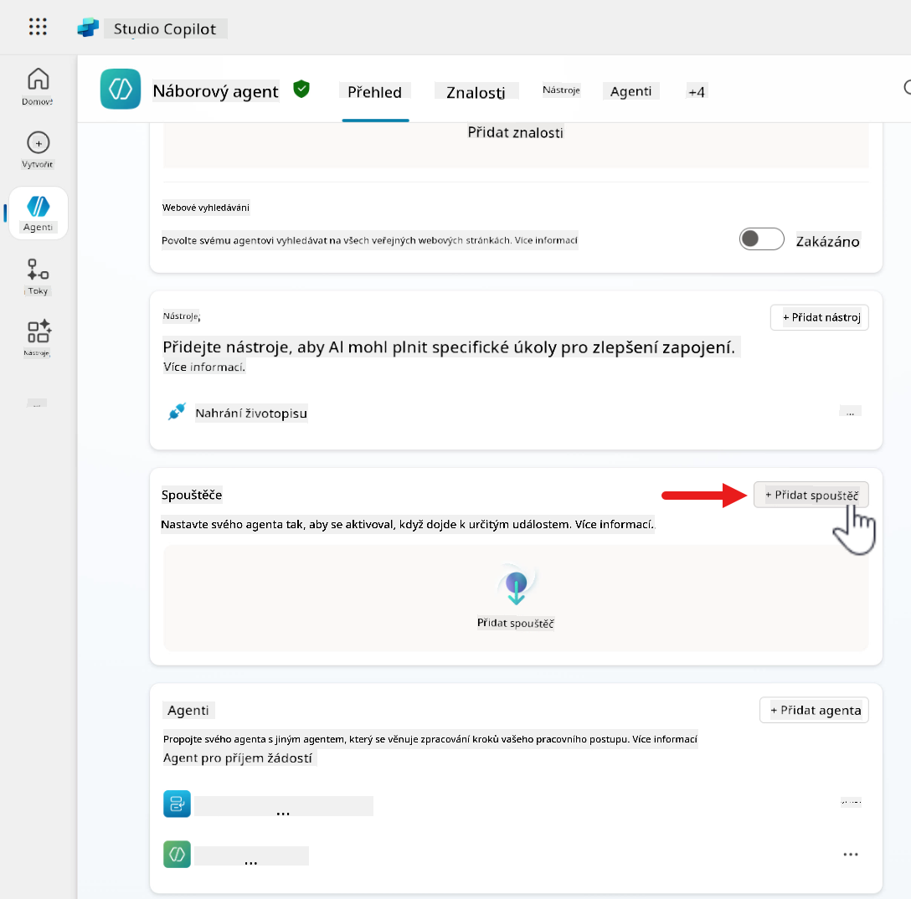

1. Zobrazí se seznam spouštěčů. Vyberte **Když dorazí nový e-mail (V3)** a zvolte **Další**.

       

1. Nyní uvidíme **Název spouštěče** a **Přihlášení** k referencím připojení pro uvedené aplikace.

       Přejmenujte název spouštěče na následující,
    
      
Nyní aktualizujeme spouštěč události, abychom přidali další možnosti automatizace. Vyberte **tři tečky (...)** u spouštěče a zvolte **Upravit v Power Automate**.

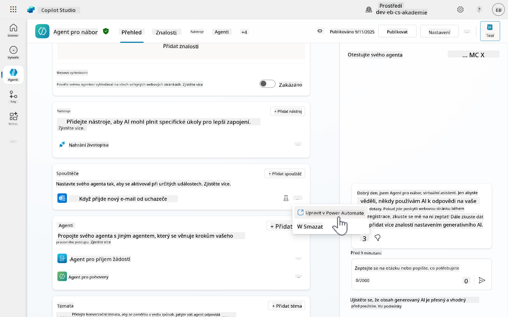

1. Spouštěč se načte jako tok v portálu Power Automate maker. To, co vidíte, je návrhář toků v portálu Power Automate maker. Zde můžeme přidat další logiku a akce pro větší automatizaci. Spouštěč se zobrazí nahoře, následovaný akcí **Odesílá výzvu určenému copilotovi k zpracování** jako poslední akcí v toku.

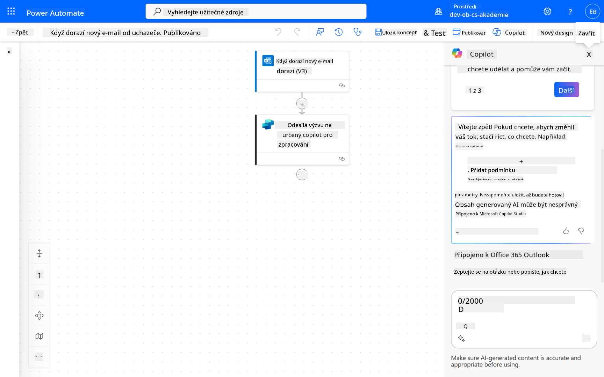

1. Ve výchozím nastavení může spouštěč **Když dorazí nový e-mail** v Power Automate zpracovat více e-mailů najednou, pokud dorazí současně, a spustit tok pouze jednou pro celou dávku.

Aby se tok spouštěl samostatně pro každý e-mail, povolte nastavení **Split On** v nastavení spouštěče a vyberte `@triggerOutputs()?['body/value']` v poli rozbalovacího seznamu.

S povoleným **Split On** a nastaveným polem na `@triggerOutputs()?['body/value']` se tok spustí jednotlivě pro každou zprávu, i když dorazí více zpráv současně.

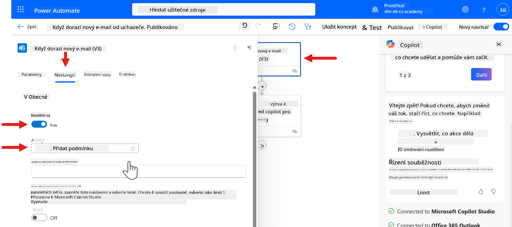

1. Dále přidáme logiku pro kontrolu typu souboru přílohy, chceme nahrávat pouze přílohy ve formátu .PDF a ne obrázky (ty by mohly pocházet z podpisů e-mailů). Vyberte ikonu **+** pod spouštěčem a zvolte **Control** v sekci **Vestavěné nástroje**.


1. Vyberte akci **Podmínka**.

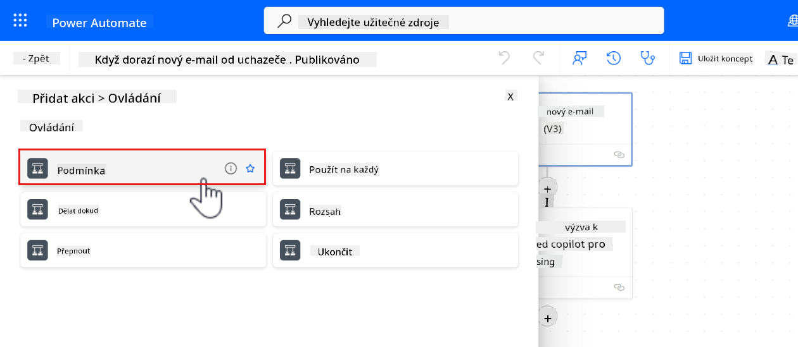

1. Nyní nakonfigurujeme podmínku, která zkontroluje, zda je typ souboru přílohy .PDF. V poli **Vyberte hodnotu** vyberte **ikonu blesku** nebo **ikonu fx** napravo.

1. Do pole **Hledat** zadejte následující,

```text
content type
```

1. Poté vyberte parametr **Attachments Content-Type** ze spouštěče.

1. Dále vyberte **Přidat**, abyste přidali dynamický obsah do parametru **Id** akce.

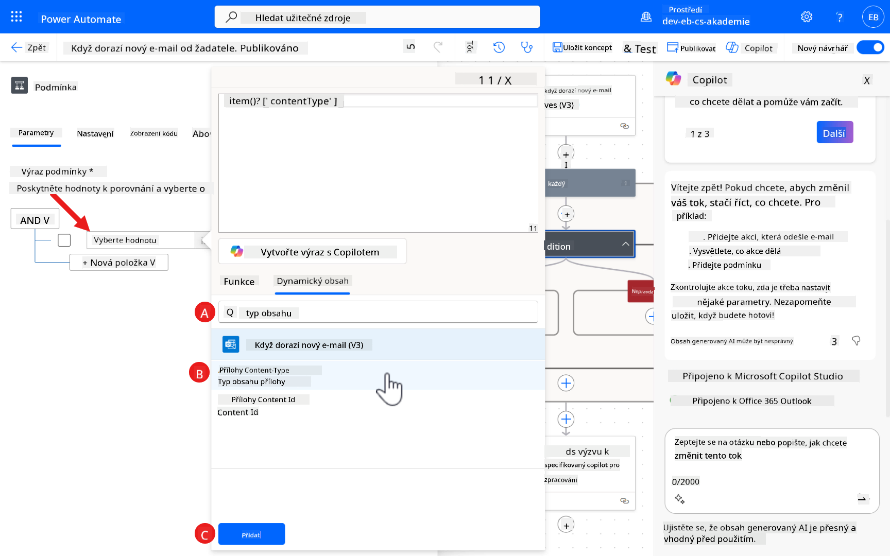

1. Zastavme se na chvíli, pravděpodobně jste si všimli, že se automaticky objevila akce **Pro každou**.

Vyberte akci **Pro každou**. Tato akce představuje procházení každé přílohy v e-mailu, protože parametr **Attachments Content-Type** ze spouštěče je vázán na každou přílohu.

Pod povrchem se jedná o pole, a proto byla akce **Pro každou** automaticky přidána, když jsme vybrali parametr **Attachments Content-Type** v akci **Podmínka**.

Chcete-li se o tom dozvědět více, rozbalte následující blok dalšího učení.

??? info "Další učení: Automatické zobrazení akce Pro každou"

🤔 **Proč se automaticky objevuje "Použít na každou" nebo "Pro každou"?**

Když vyberete parametr (dynamický obsah), který představuje seznam nebo pole položek - například seznam příloh, e-mailů nebo řádků - Power Automate rozpozná, že možná chcete zpracovat každou položku jednotlivě.

Aby vám s tím pomohl, Power Automate automaticky přidá smyčku **"Použít na každou"** (nebo **"Pro každou"**) kolem vaší akce. To zajišťuje, že vaše akce bude spuštěna jednou pro každou položku v seznamu, místo aby se pokoušela zpracovat celý seznam najednou (což by mohlo způsobit chyby).

🦋 **Příklad**

- Pokud vyberete "Přílohy" z předchozí akce (což je pole) a pokusíte se ji použít v akci, která očekává jeden soubor, Power Automate obalí vaši akci smyčkou **"Použít na každou"** (nebo **"Pro každou"**).
- Tímto způsobem vaše akce bude spuštěna pro **každou přílohu** - jednu po druhé.

💡 **Klíčové body**

- **Automatické:** Smyčka se objeví automaticky, aby vám pomohla zpracovat každou položku v kolekci.
- **Zabraňuje chybám:** Bez smyčky by vaše akce mohla selhat, protože nemůže zpracovat více položek najednou.
- **Vizualizace:** Je to vizuální způsob, jak ukázat, že váš tok bude opakovat akci pro každou položku v seznamu.

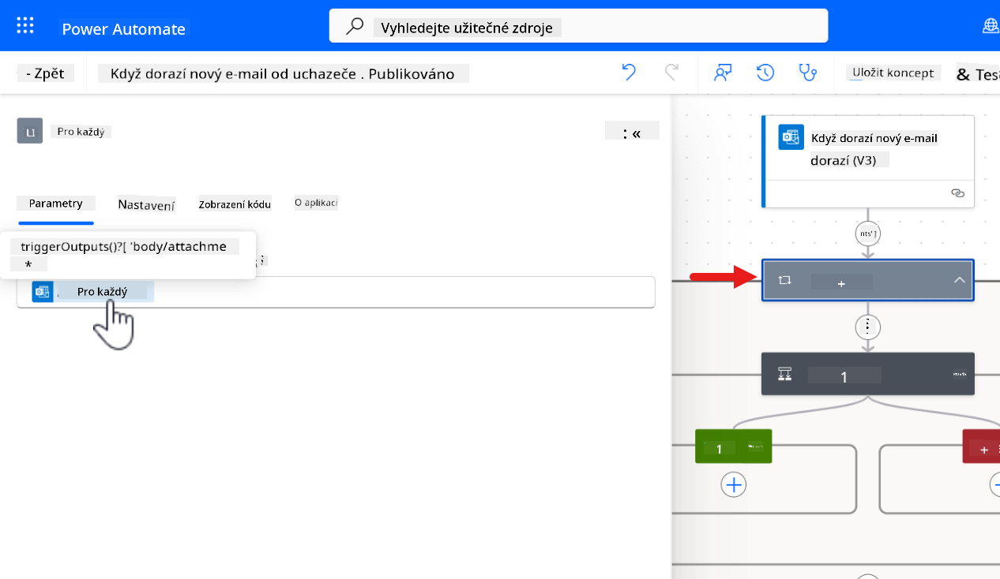

1. Dále do druhého pole **Vyberte hodnotu** zadejte následující,

```text
application/pdf
```

Tím zajistíte, že pro každou přílohu bude zkontrolováno, zda má formát souboru .PDF.

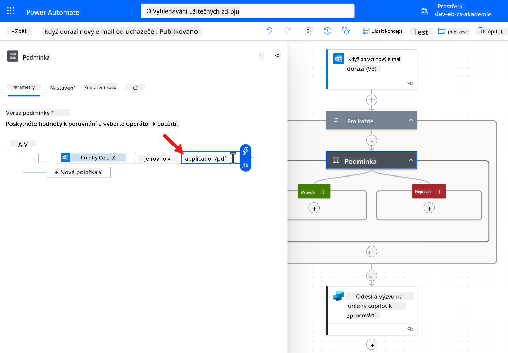

1. Nyní nakonfigurujeme cestu **True**, abychom extrahovali soubor z e-mailu a nahráli jej do tabulky **Resume** v Dataverse.

Přidejte novou akci níže v cestě **True** a vyhledejte `html to text`. Vyberte akci **Html to text**.

Chcete-li se dozvědět více o akci **Html to text**, rozbalte následující blok dalšího učení.

??? info "Další učení: Akce Html to text"

🤔 **Co je akce "HTML to text"?**

Akce **HTML to text** v Power Automate se používá k převodu obsahu ve formátu HTML na prostý text. To je obzvláště užitečné, když obdržíte data (například e-maily, webový obsah nebo odpovědi API), která obsahují HTML značky, a chcete extrahovat pouze čitelný text bez jakéhokoliv formátování nebo kódu.

⚙️ **Jak to funguje?**

- **Vstup:** Poskytnete řetězec HTML obsahu (například tělo e-mailu).
- **Výstup:** Akce odstraní všechny HTML značky a vrátí pouze prostý text.

👍🏻 **Kdy byste ji měli použít?**

- Když chcete extrahovat čitelný text z e-mailů, webových stránek nebo odpovědí API, které obsahují HTML.
- Před odesláním obsahu do systémů, které nepodporují HTML formátování (například SMS, zprávy Teams nebo databáze).
- K vyčištění dat pro další zpracování nebo analýzu.

🔭 **Kde ji najdete?**

- V Power Automate pro Agent Flows, vyhledejte akci nazvanou `HTML to text`. Nachází se pod konektorem **Data Operations**.

💡 **Klíčové body**

- Odstraňuje všechny HTML značky a ponechává pouze text.
- Neinterpretuje ani nespouští skripty/styly - pouze odstraňuje značky.
- Užitečné pro čištění dat a přípravu obsahu pro výstupy v prostém textu.

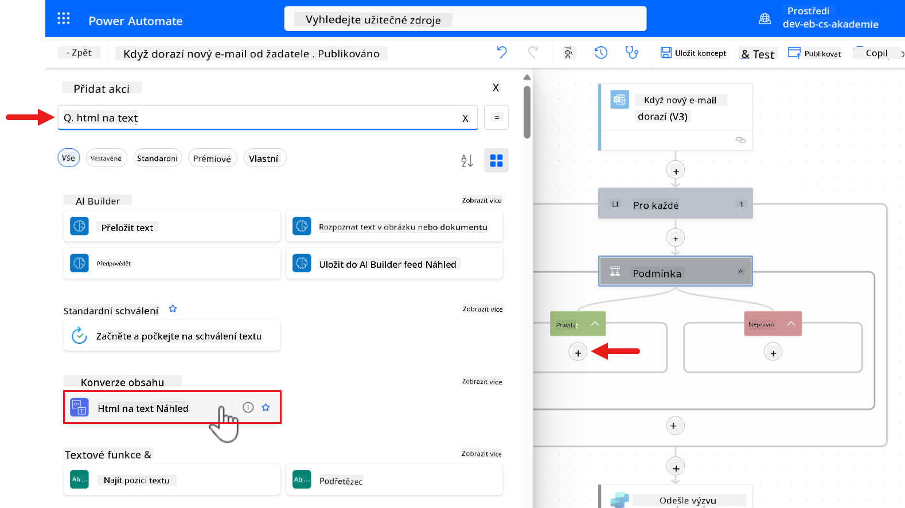

1. Dále musíme vytvořit nové připojení pro akci **Html to text** výběrem **Přidat nové**.

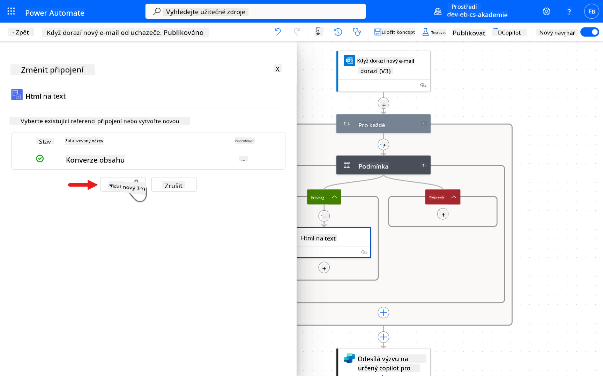

1. Akce může být nyní nakonfigurována. Přidejme parametr **Body** ze spouštěče. V poli **Obsah** vyberte **ikonu blesku** nebo **ikonu fx** napravo.

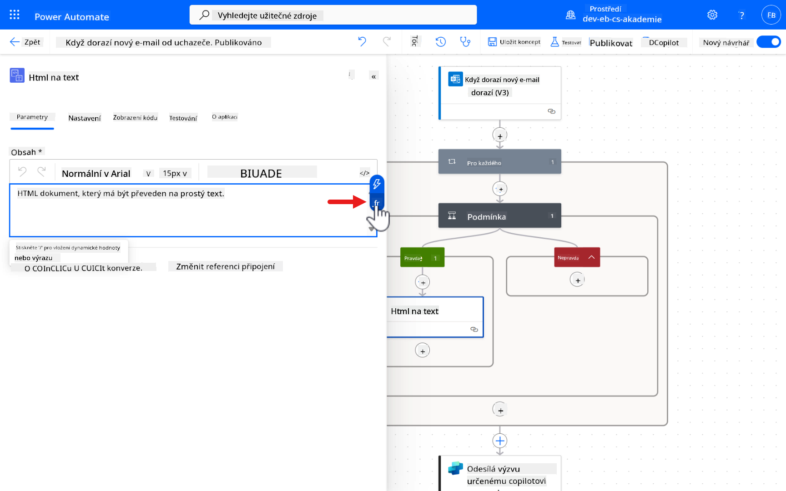

1. Na kartě **Dynamický obsah** vyhledejte `body` a vyberte parametr **Body**, poté zvolte **Přidat**.

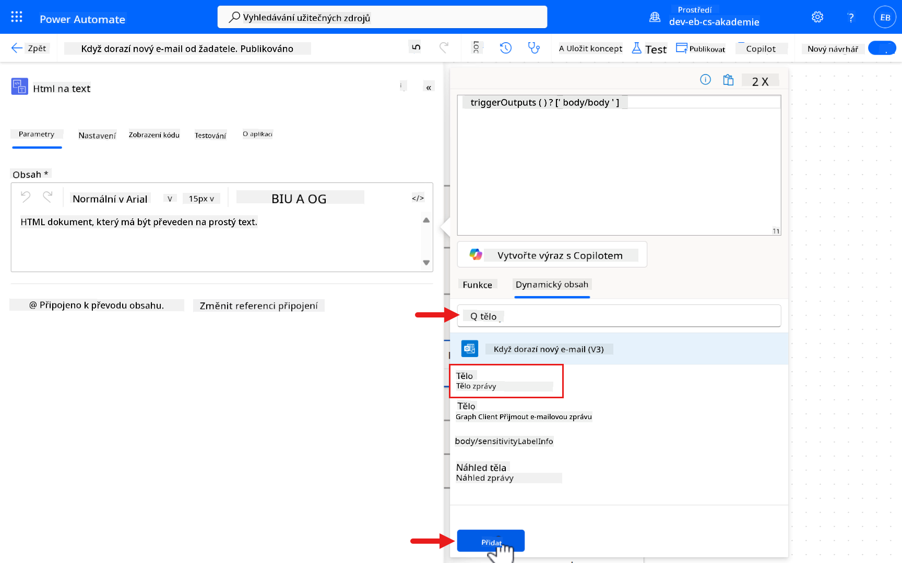

1. Dokončili jsme konfiguraci této akce, takže ji opustíme výběrem dvou šipek («) směřujících doleva pro sbalení panelu.

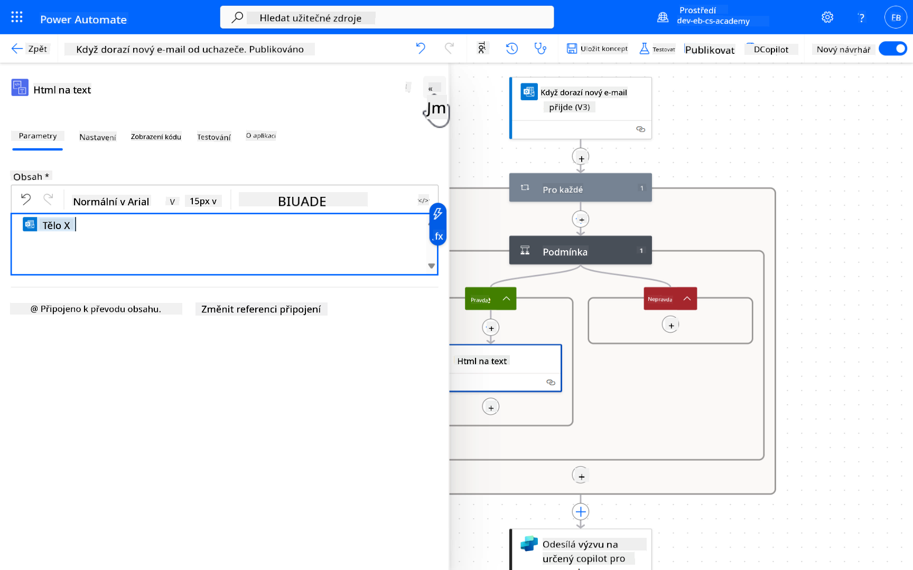

1. Přidáme novou akci výběrem **+ ikony** pod akcí **Html to text**, což načte panel pro přidání akcí. Vyberte konektor **Microsoft Dataverse**.

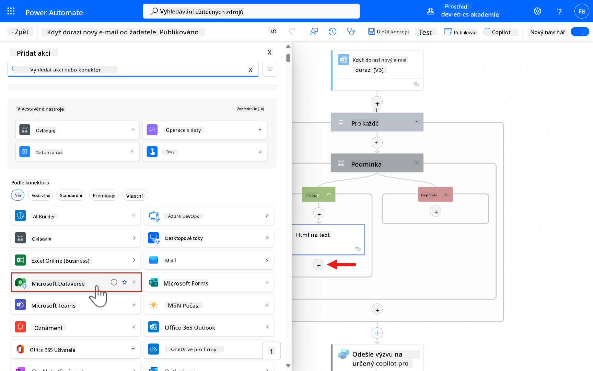

1. Vyberte akci **Přidat nový řádek**.

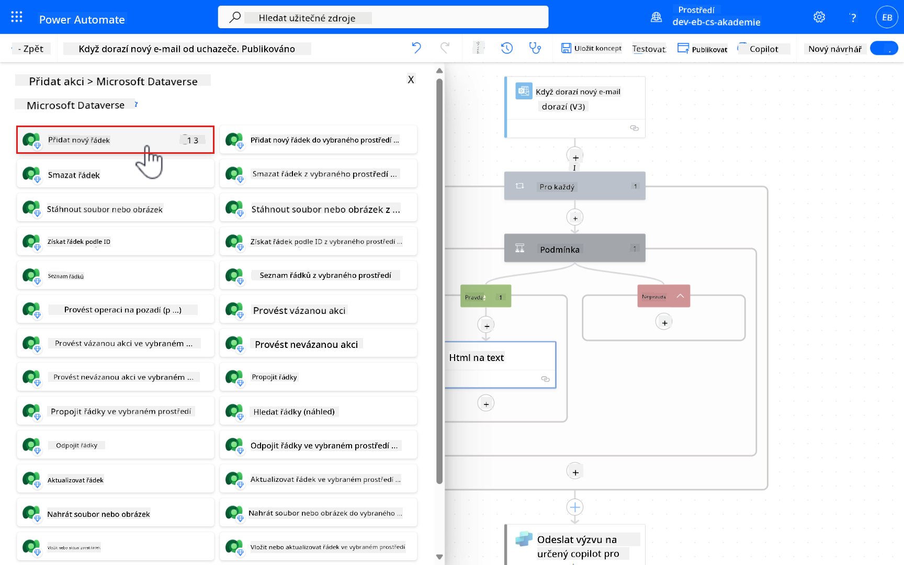

1. Přejmenujte akci výběrem **tří teček (...)**, zkopírujte a vložte následující jako název,

```text
Přidat nový řádek Resume
```

Pro parametr **Název tabulky** vyhledejte `res` a vyberte tabulku **Resumes**.

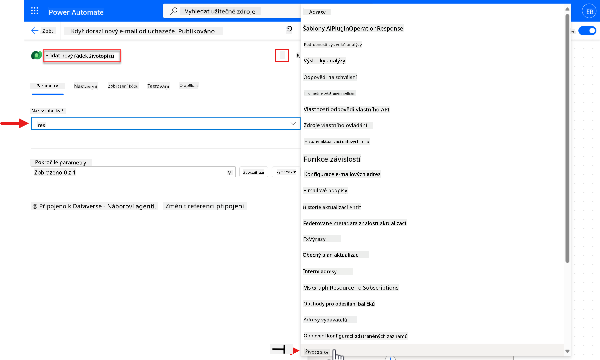

1. Vyberte pole **Název životopisu** a zvolte **ikonu blesku** nebo **ikonu fx** napravo.

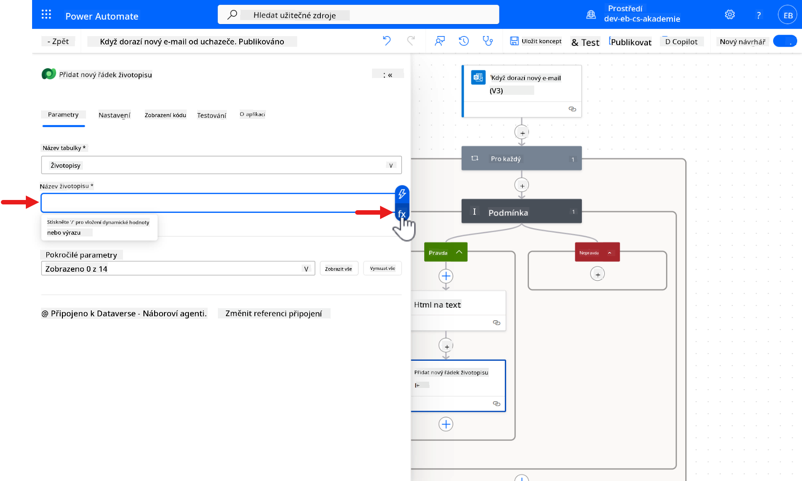

1. Na kartě **Funkce** zadejte následující výraz, který používá funkci `item()`.

```text
item()?['name']
```

Chcete-li se dozvědět více o funkci `item()`, rozbalte následující blok dalšího učení.

??? info "Další učení: Funkce `item()`"

🤔 **Co je funkce `item()`?**

- Když použijete akci **Použít na každou**, Power Automate prochází každým prvkem v kolekci (poli).
- Nejčastěji se používá uvnitř akcí jako **Použít na každou** (nebo **Pro každou**), **Vybrat** nebo **Filtrovat pole**.

⚙️ **Jak to funguje?**

- `item()` je funkce, která vrací aktuální položku zpracovávanou ve smyčce nebo operaci pole.
- Uvnitř této smyčky `item()` odkazuje na _aktuální prvek_, který se zpracovává.

📌 **Kde ji použít?**

- **Použít na každou:** pro přístup k vlastnostem aktuální položky.
- **Vybrat:** pro transformaci každé položky v poli.
- **Filtrovat pole:** pro odkaz na aktuální položku, která se vyhodnocuje.

🦋 **Příklad**

- Výraz uvnitř smyčky:
       -  `item()?['Email']`
- Tím získáte vlastnost `Email` aktuální položky.

💡 **Klíčové body**

- `item()` je _kontextově citlivé_: vždy odkazuje na aktuální položku ve smyčce nebo operaci pole, ve které se nacházíte.
- Pokud vnoříte smyčky, můžete použít `items('LoopName')` pro odkaz na položky v konkrétní smyčce.

Vyberte **Přidat**, abyste přidali výraz do parametru **Název životopisu**.

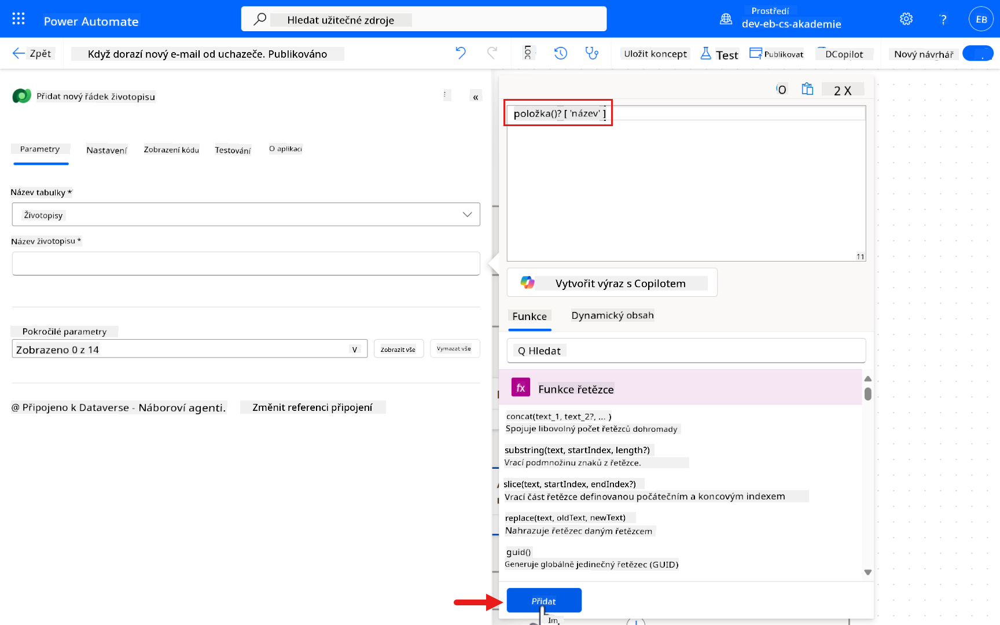

1. Stále musíme nakonfigurovat několik dalších parametrů, vyberte **Zobrazit vše** a v poli **Motivační dopis** vyberte **ikonu blesku** nebo **ikonu fx** napravo.

Na kartě **Funkce** zadejte následující výraz, který používá stejný výraz jako v předchozí [misi](../02-multi-agent/README.md).

```text
if(greater(length(body('Html_to_text')), 2000), substring(body('Html_to_text'), 0, 2000), body('Html_to_text'))
```

Tento výraz kontroluje, zda _text_ z akce **Html to text** je delší než 2000 znaků, a pokud ano, vrátí pouze prvních 2000 znaků; jinak vrátí celý text.

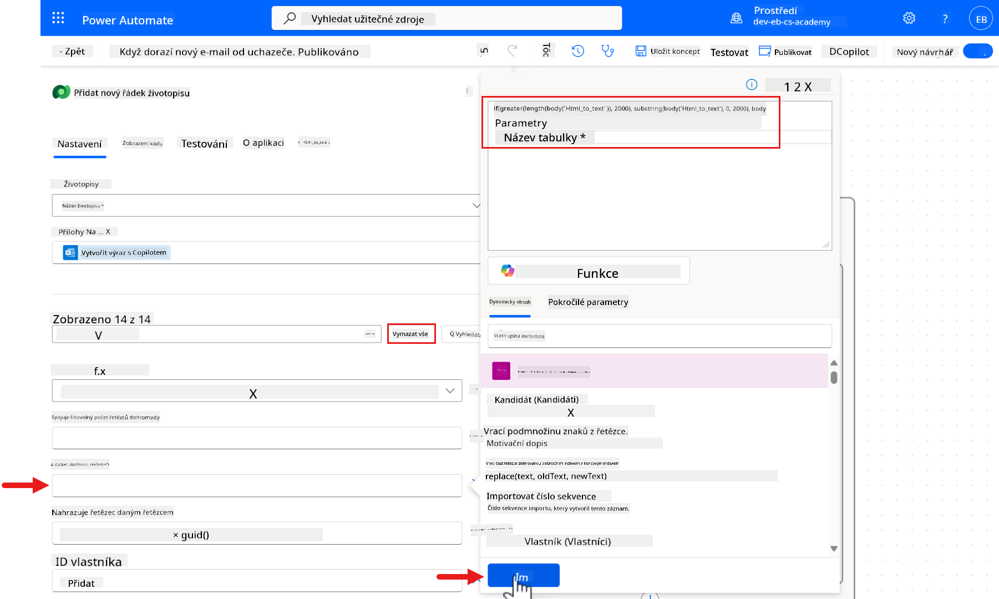

1. Výraz bude nyní přidán do pole **Motivační dopis**.


1. Pro pole **Zdrojová e-mailová adresa** vyhledejte `from` a vyberte parametr **From** ze spouštěče, protože obsahuje hodnotu e-mailové adresy.

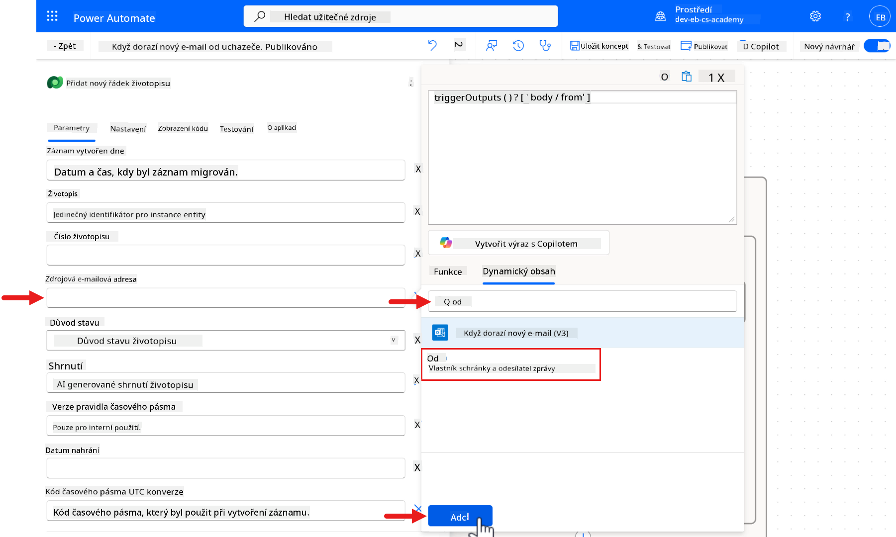

1. Pro pole **Datum nahrání** vyberte **ikonu blesku** nebo **ikonu fx** napravo. Na kartě **Funkce** zadejte následující výraz, který používá funkci `utcNow()`.

```text
utcNow()
```

Chcete-li se dozvědět více o funkci `utcNow`, rozbalte následující blok dalšího učení.

??? info "Další učení: Funkce `utcNow`"

🤔 **Co je funkce `utcNow()`?**

- Funkce utcnow() v Power Automate vrací aktuální datum a čas v koordinovaném světovém čase (UTC) ve formátu ISO 8601, například: `2025-09-23T04:32:14Z`

🦋 **Příklad**

- Výraz:
       -  `concat('Report generated on ', utcnow())`
- Výstup je:
       - Report generated on `2025-09-23T04:32:14Z`

💡 **Klíčové body**
- **Žádné argumenty (vstupní parametry) nejsou vyžadovány:** vždy vrací aktuální UTC časové razítko.
   - **Použití**
       - Přidávání časových razítek do logů nebo názvů souborů
       - Porovnávání aktuálního času s jinými daty
       - Plánování nebo podmínky založené na čase

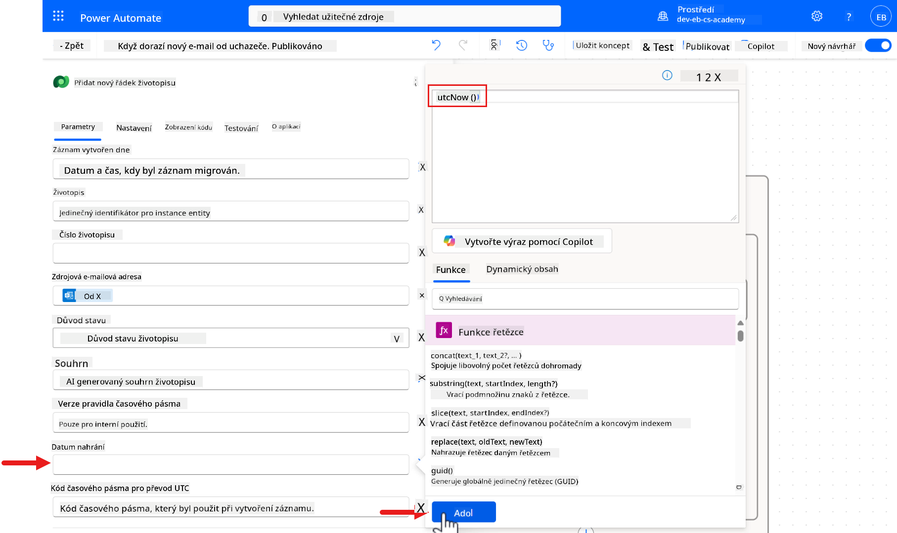

1. Nyní jsme dokončili konfiguraci akce **Přidat nový řádek životopisu**, takže opustíme panel jeho sbalením.

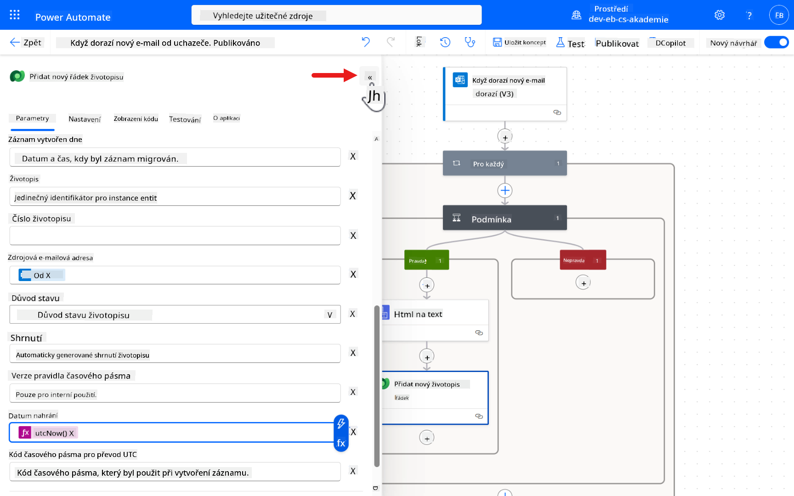

1. Přidáme novou akci výběrem **+ ikony** pod akcí **Přidat nový řádek životopisu**, což načte panel pro přidání akcí. Znovu vyberte konektor **Microsoft Dataverse**.

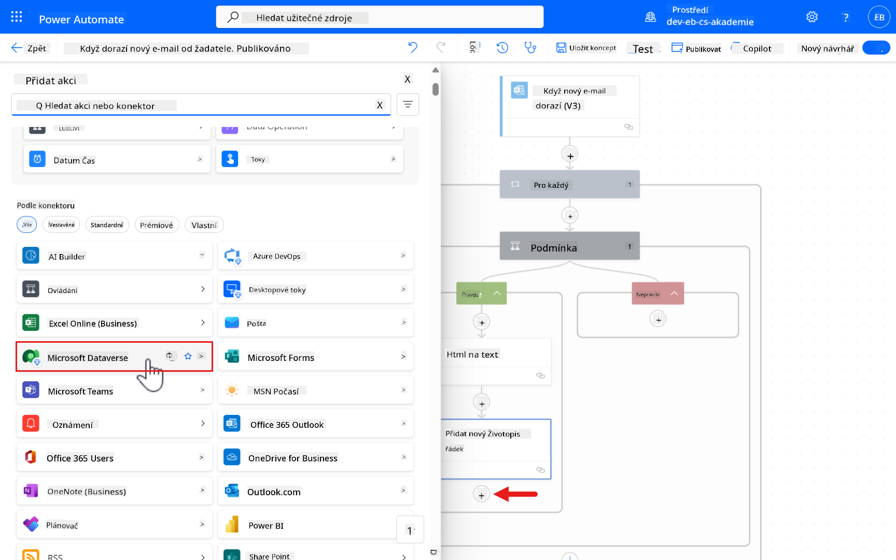

1. Vyberte akci **Nahrát soubor nebo obrázek**.

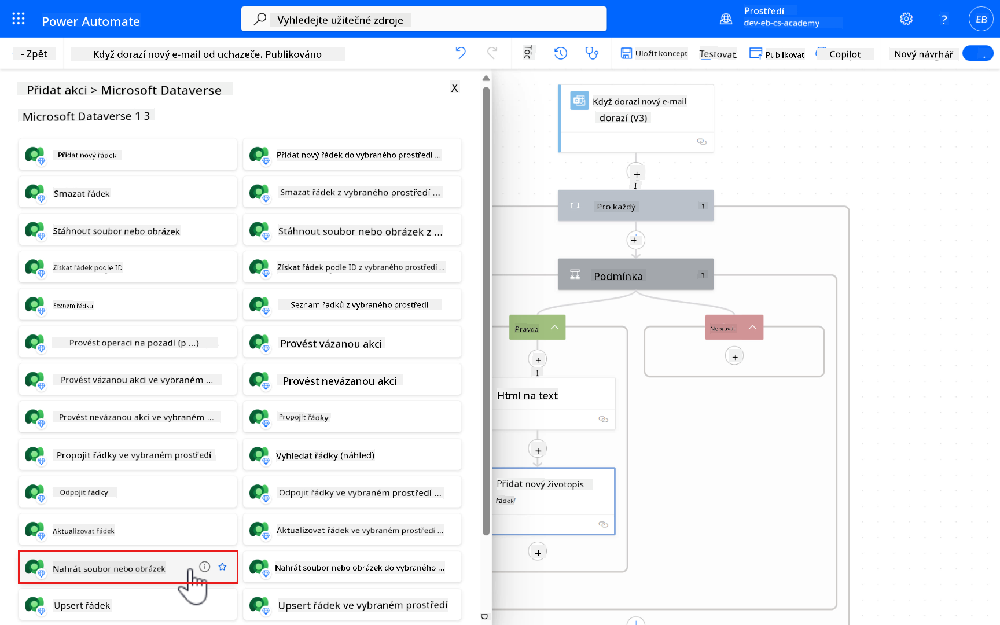

1. Přejmenujte akci výběrem **Tři tečky (...)**, zkopírujte a vložte následující jako název:

```text
Nahrát soubor životopisu
```

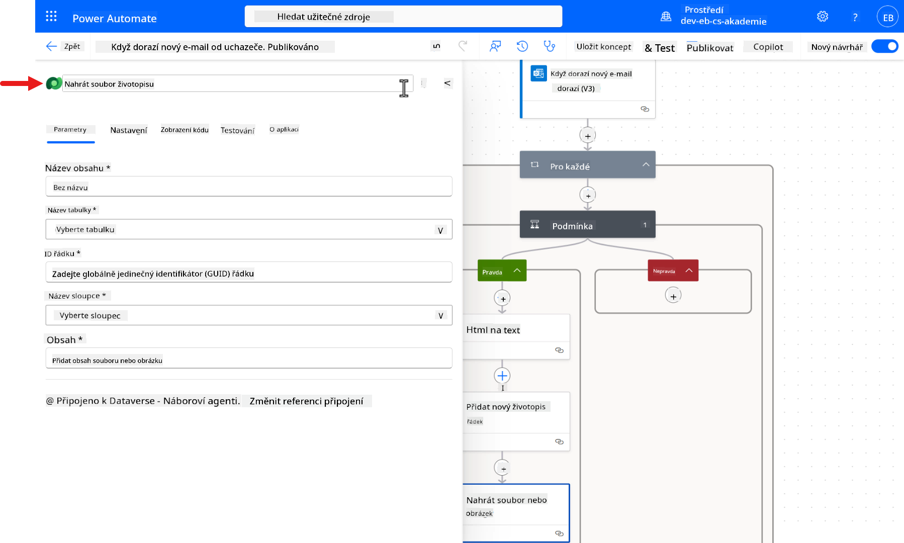

1. Dále vyberte pole **Název obsahu** a klikněte na **ikonu blesku** nebo **fx ikonu** napravo.

V **záložce Funkce** zadejte následující výraz, který používá funkci `item ()`. Tento výraz získá vlastnost `name` aktuální položky (přiloženého souboru).

```text
item()?['name']
```

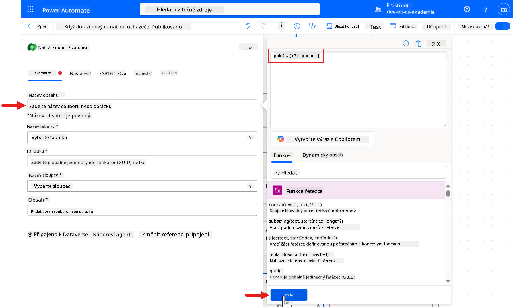

1. Pro parametr **Název tabulky** vyhledejte `res` a vyberte tabulku **Životopisy**.

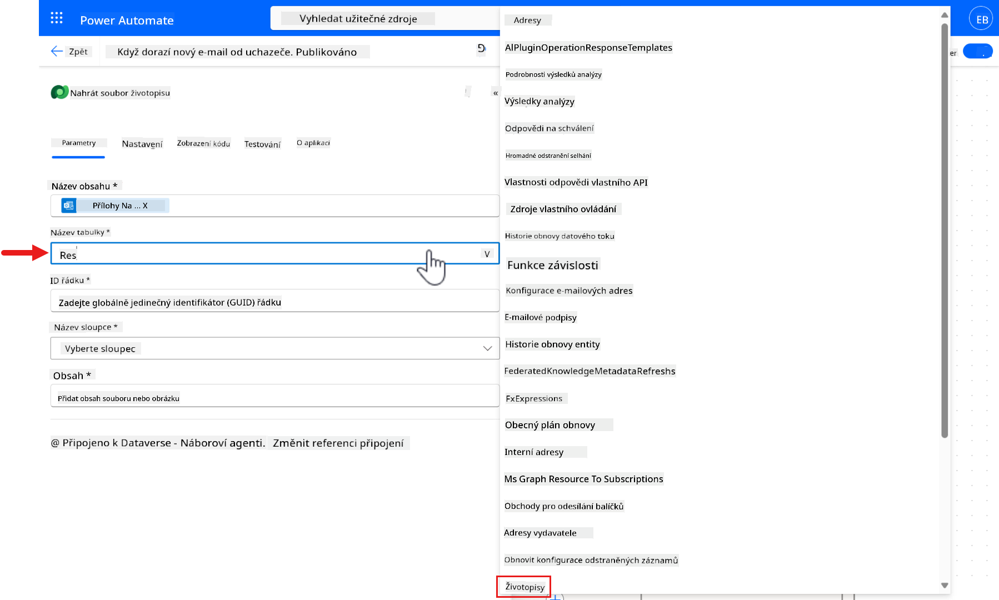

1. Dále vyberte pole **ID řádku** a klikněte na **ikonu blesku** nebo **fx ikonu** napravo.

Vyhledejte `ID` a vyberte parametr **Životopis** z akce _Přidat nový řádek Dataverse_, protože obsahuje hodnotu ID řádku, do kterého se má nahrát soubor PDF.

Vyberte **Přidat**.


1. Vyberte pole **Název sloupce** a zvolte možnost **PDF životopisu**.

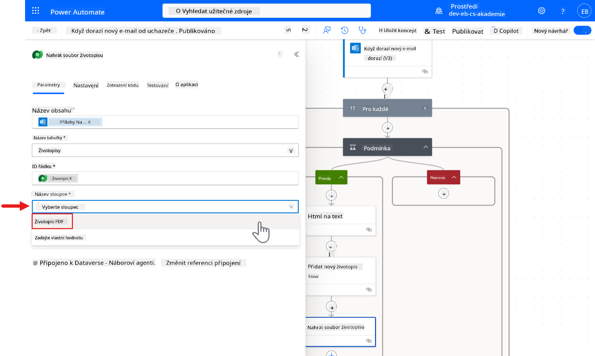

1. Vyberte pole **Obsah** a klikněte na **ikonu blesku** nebo **fx ikonu** napravo.

V **záložce Funkce** zadejte následující výraz, který používá funkci `item ()`. Tento výraz získá vlastnost `contentBytes` aktuální položky (přiloženého souboru). `contentBytes` odkazuje na surová binární data souboru nebo přílohy, zakódovaná jako Base64 řetězec.

```text
item()?['contentBytes']
```

1. Dokončili jsme konfiguraci této akce, takže ji opustíme výběrem dvou úhlových závorek («) směřujících doleva pro sbalení panelu.

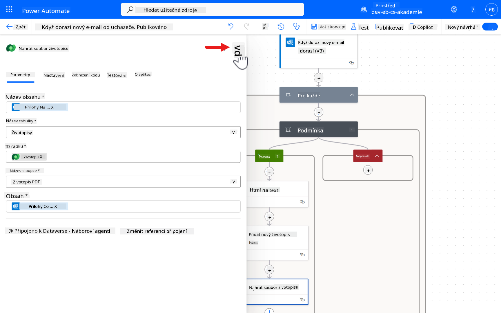

1. Dále vyberte **Odeslat výzvu určenému copilotovi k zpracování**, poté přetáhněte tuto akci pod akci **Nahrát soubor životopisu** v _True_ cestě podmínky.

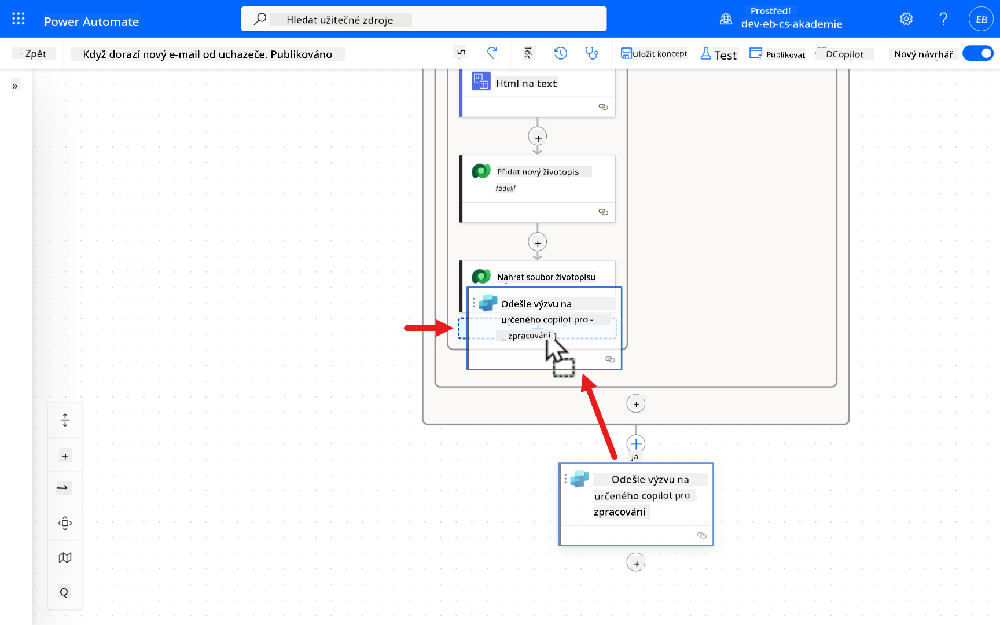

1. Vyberte **Odeslat výzvu určenému copilotovi k zpracování** pro její konfiguraci.

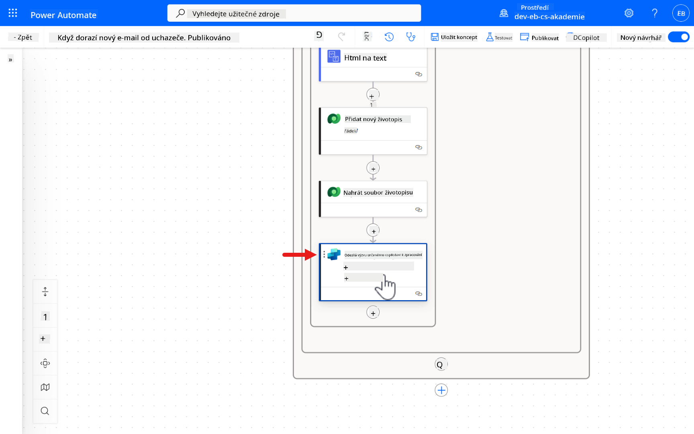

1. V poli **Tělo/zpráva** vyberte veškerý obsah pole a vymažte/smažte jej.

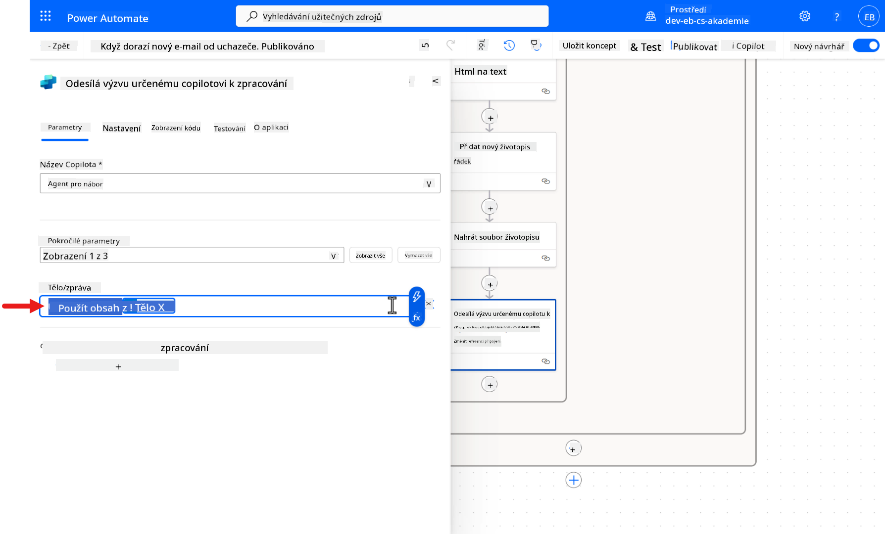

1. Zkopírujte a vložte následující text do pole **Tělo/zpráva** a zvýrazněte `RESUME ID PLACEHOLDER`.

```text
Odeslat [ResumeId (text)] = "RESUME ID PLACEHOLDER" a [ResumeTitle (text_1)] = "RESUME TITLE PLACEHOLDER" a [ResumeNumber (text_2)]= "RESUME NUMBER PLACEHOLDER" do nástroje "Notify Teams Applicant channel" v podagentovi "Application Intake Agent"
```

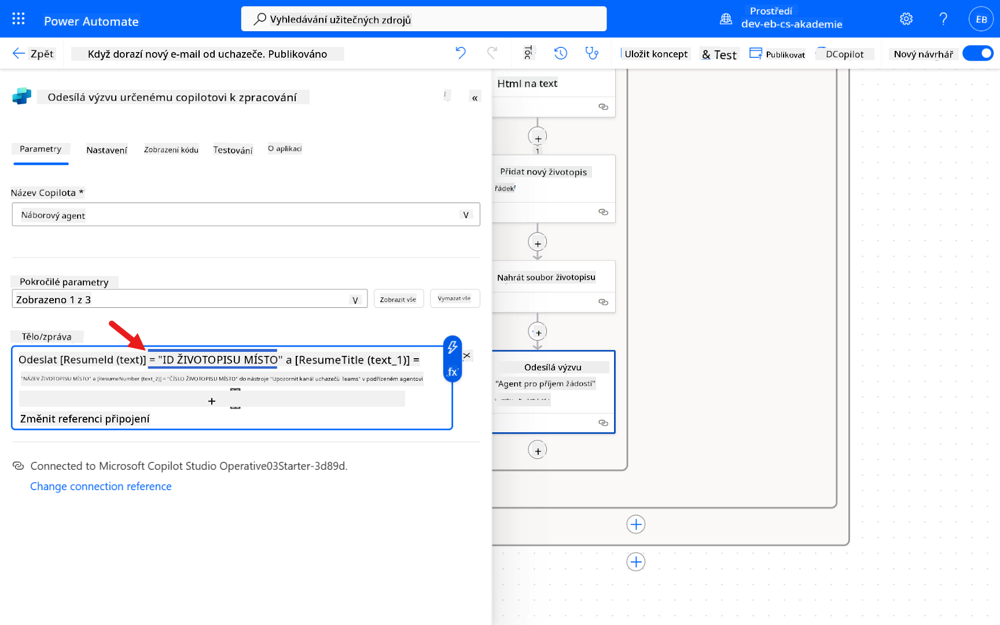

1. Vyberte **ikonu blesku** nebo **fx ikonu** napravo.

Vyhledejte `resume` a vyberte parametr **Životopis** z akce _Přidat nový řádek Dataverse_, protože obsahuje hodnotu `ID` řádku vytvořeného životopisu.

Vyberte **Přidat**.

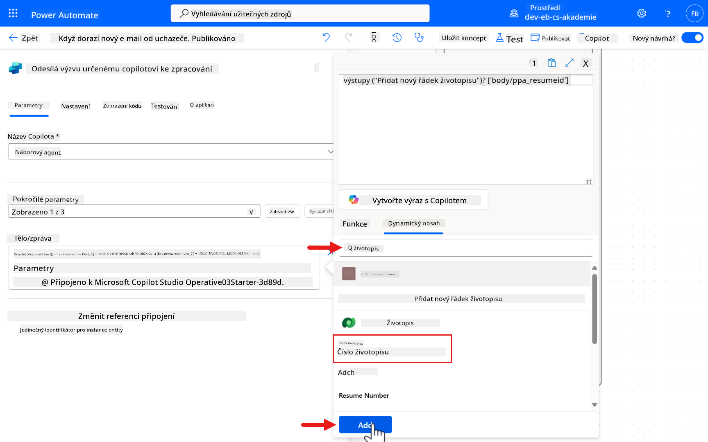

1. Zvýrazněte `RESUME TITLE PLACEHOLDER`. Vyberte **ikonu blesku** nebo **fx ikonu** napravo.

Vyhledejte `title` a vyberte parametr **Název životopisu** z akce _Přidat nový řádek Dataverse_, protože obsahuje hodnotu `název životopisu` vytvořeného řádku životopisu.

Vyberte **Přidat**.

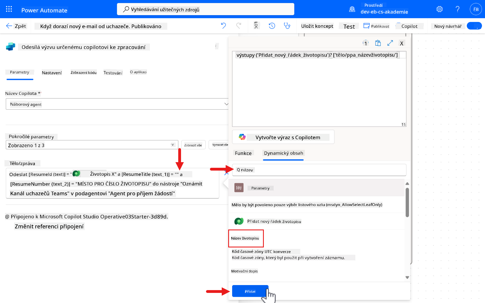

1. Zvýrazněte `RESUME NUMBER PLACEHOLDER`. Vyberte **ikonu blesku** nebo **fx ikonu** napravo.

Vyhledejte `resume number` a vyberte parametr **Číslo životopisu** z akce _Přidat nový řádek Dataverse_, protože obsahuje hodnotu `Číslo životopisu` vytvořeného řádku životopisu.

Vyberte **Přidat**.

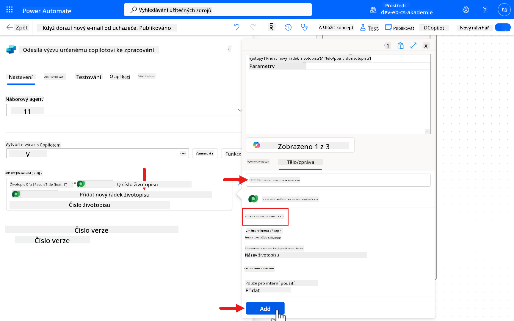

1. Dokončili jsme konfiguraci této akce a náš tok agenta 🙌🏻 Skvělá práce! Nyní uložme náš tok událostí výběrem **Uložit koncept**.

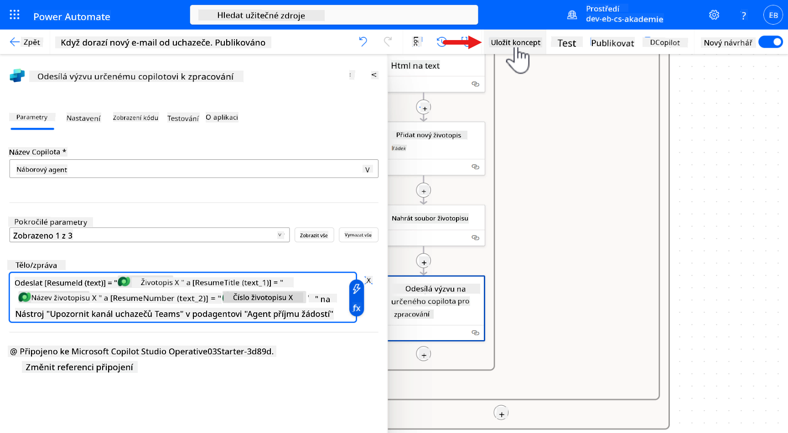

1. Nyní musíme upravit podrobnosti toku agenta, vyberte **Zpět**.

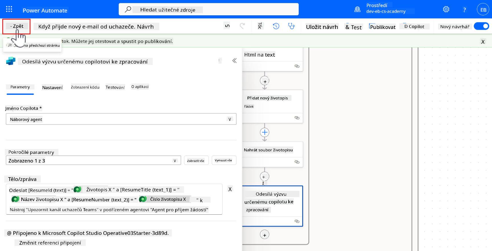

1. Vyberte **Upravit** v sekci **Podrobnosti** a aktualizujte **Plán** na možnost **Copilot Studio**.

Vyberte **Uložit**.

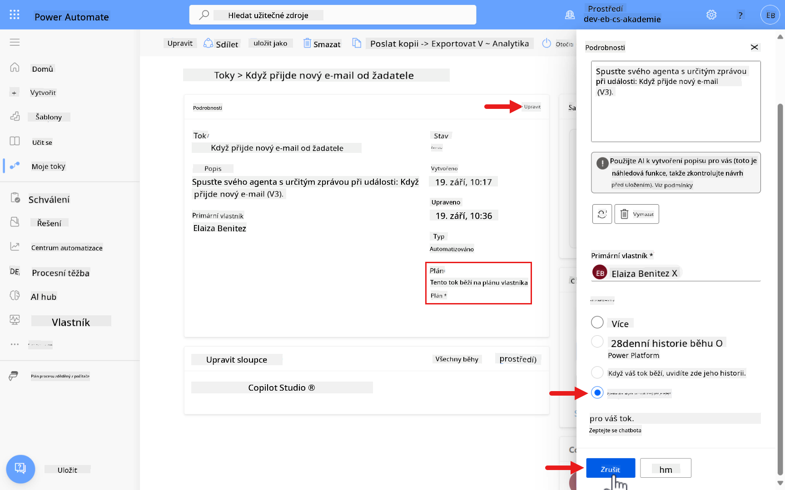

1. Zobrazí se modální okno, které vás požádá o potvrzení přepnutí na plán Copilot Studio. Vyberte **Potvrdit**.

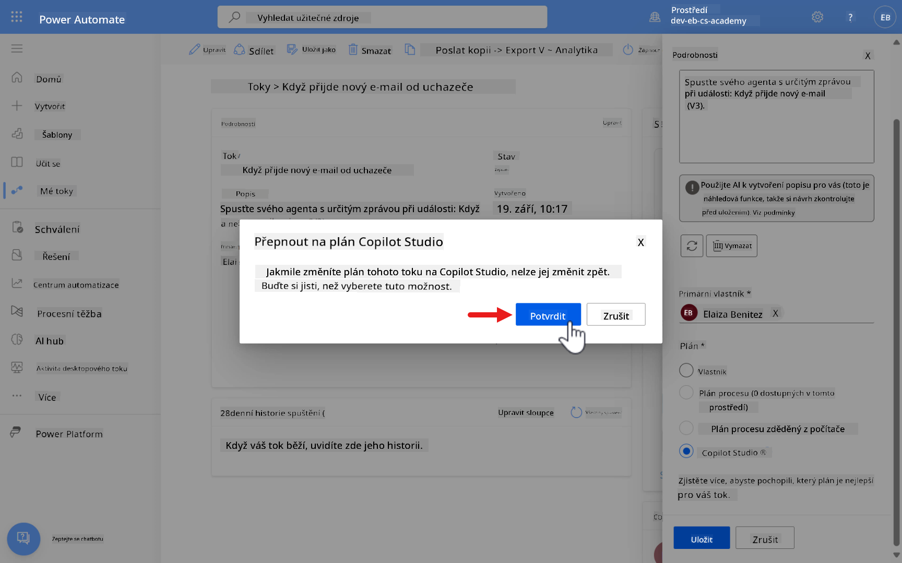

1. Plán je nyní aktualizován na **Copilot Studio**. Vyberte **Upravit**, protože potřebujeme publikovat tok událostí pro našeho agenta.

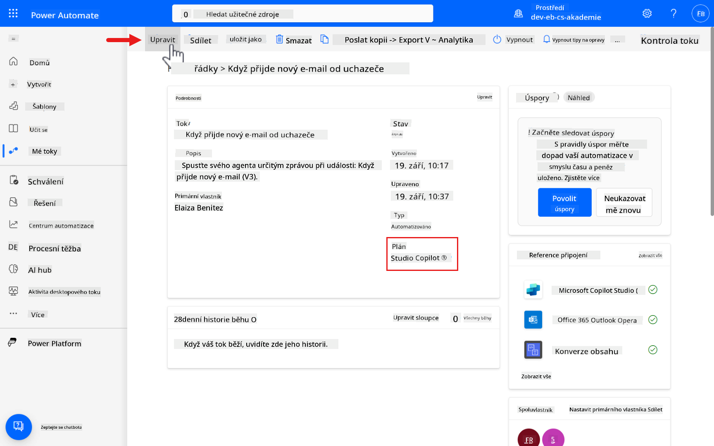

1. Vyberte **Publikovat**.

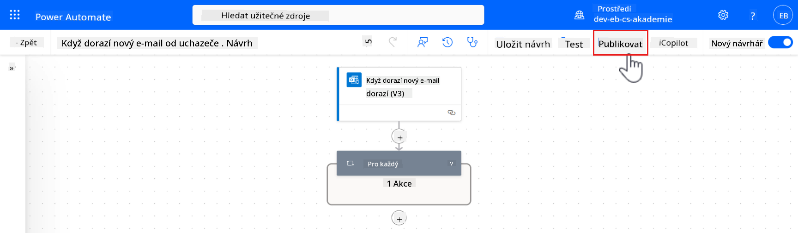

Hurá! Tok událostí je nyní publikován 😃

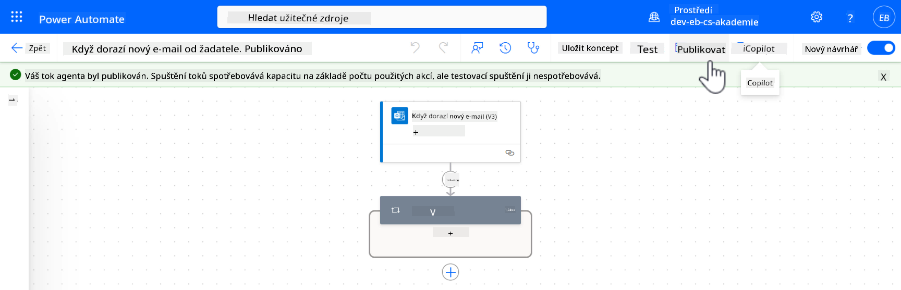

Pokračujme vytvořením nového toku agenta, který bude vyvolán podagentem **Intake Application Agent**.

### Laboratoř 3.2 - Upozornění na kanál Teams pomocí adaptivní karty

Nyní vytvoříme nový tok agenta pro podagenta **Intake Application Agent**, který využije hodnoty předané tokem událostí k odeslání adaptivní karty do kanálu Teams. Tato adaptivní karta upozorní tým HR na nábor na automaticky nahraný PDF soubor, aby jej mohli zkontrolovat.

Začněme!

1. V **Hiring Agent** vyberte záložku **Agenti** a zvolte **Application Intake Agent**.

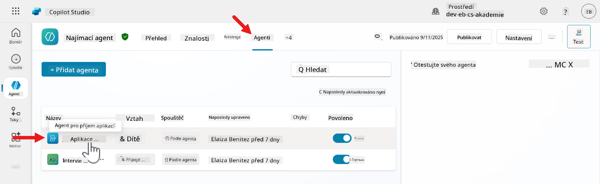

1. Přejděte dolů na **Nástroje** a vyberte **+ Přidat**.

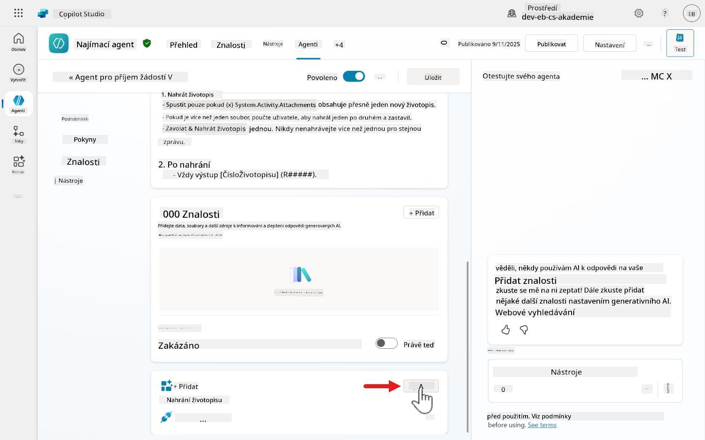

1. Zobrazí se modální okno **Přidat nástroj**. Vyberte **+ Nový nástroj**.

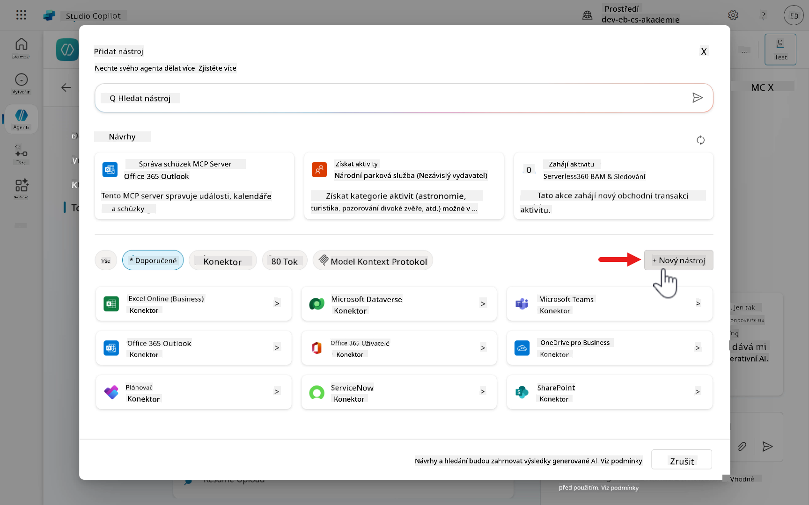

1. Vyberte **Tok agenta**.


1. Následně se načte **návrhář toku agenta**. V triggeru **Když agent zavolá tok** vyberte **+ Přidat vstup**.

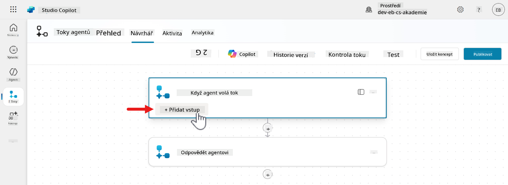

1. Vyberte **Text** jako typ uživatelského vstupu.

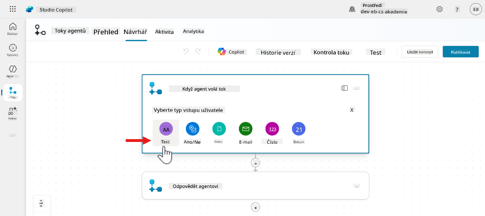

1. Do textového pole vstupu zkopírujte a vložte následující jako název vstupního parametru.

```text
ResumeId
```

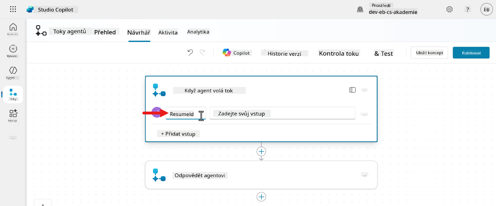

1. Opakujte stejné kroky pro přidání druhého textového vstupu. Zkopírujte a vložte následující jako název vstupního parametru.

```text
ResumeTitle
```

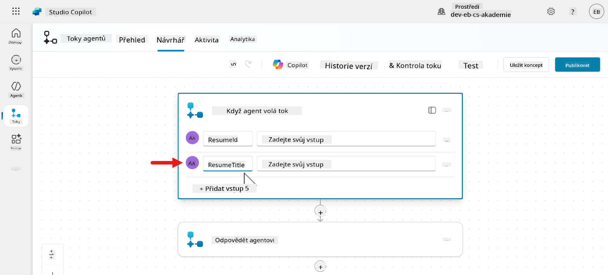

1. Opakujte stejné kroky pro přidání třetího textového vstupu. Zkopírujte a vložte následující jako název vstupního parametru.

```text
ResumeNumber
```


1. Pamatujete si, jak jsme v [Recruit](../../recruit/08-add-adaptive-card/README.md#81-create-a-new-topic-with-an-adaptive-card-for-user-to-submit-their-request) přidali adaptivní kartu do Tématu pro našeho agenta? Tentokrát přidáme adaptivní kartu do toku agenta. Nyní přidáme další akci do našeho toku agenta, která odešle adaptivní kartu do kanálu Teams.

Vyberte **+ ikonu** pod triggerem.


1. Vyberte akci **Odeslat kartu do chatu nebo kanálu**.


1. Je třeba vytvořit referenci připojení k Microsoft Teams pomocí vašeho přihlášeného uživatelského účtu. Vyberte **Přihlásit se**.


1. Vyberte svůj uživatelský účet a poté klikněte na **Povolit přístup**.


1. Pro následující vstupní parametry:

| Parametr | Jak nastavit | Detaily |
|----------|--------------|---------|
| **Odeslat jako** | Rozbalovací nabídka | Vyberte možnost `Flow bot` |
| **Odeslat do** | Rozbalovací nabídka | Vyberte možnost `Kanál` |
| **Tým** | Rozbalovací nabídka | Vyberte tým, který je dostupný ve vašem prostředí a ke kterému máte přístup pro účely dokončení tohoto cvičení |
| **Kanál** | Rozbalovací nabídka | Vyberte kanál, který je dostupný ve vašem prostředí a ke kterému máte přístup pro účely dokončení tohoto cvičení |


1. Dále nakonfigurujeme pole **Adaptivní karta**. Vyberte pole **Adaptivní karta**.


1. Otevřete [JSON soubor aktualizované tabulky životopisů](../../../../../docs/operative-preview/03-automate-triggers/assets/3.2_ResumeTableUpdated.json), zkopírujte jeho celý obsah a vložte jej do pole Adaptivní karta.


1. Podobně jako jsme to udělali v [Recruit](../../recruit/08-add-adaptive-card/README.md#81-create-a-new-topic-with-an-adaptive-card-for-user-to-submit-their-request), nahradíme existující hodnoty v JSON payload skutečnými hodnotami nebo dynamickým obsahem.

Nejprve aktualizujeme URL pro vlastnost `url` v rámci vlastnosti `selectAction`. Tato URL bude nahrazena URL systémového zobrazení Životopisů v modelové aplikaci **Hiring Hub**. To umožní náboráři vybrat akci a být přesměrován na systémové zobrazení Životopisů v modelové aplikaci.

Zvýrazněte aktuální hodnotu URL a smažte ji.


1. V modelové aplikaci **Hiring Hub** přejděte do systémového zobrazení **Životopisy** pomocí nabídky na levé straně a zkopírujte URL. Poté se vraťte do toku agenta a vložte zkopírovanou URL do vlastnosti **url** v rámci vlastnosti `selectAction`.


1. Měli byste vidět následující, kde žlutě zvýrazněné jsou detaily vašeho prostředí modelové aplikace **Hiring Hub**.

     | Parametr | Hodnota | Vysvětlení |
     |----------|------------|---------|
     | **Organizační URI** | GUID | URL organizace prostředí Dataverse/Dynamics 365 |
     | **appid** | GUID | Pro otevření konkrétní modelové aplikace se používá parametr dotazu buď appid nebo appname. V tomto případě se používá appid |
     | **viewid** | GUID | Parametr dotazu, který je ID zobrazení |

       

1. Dále přidáme hodnoty dynamického obsahu pro několik vlastností. Začněme textem, který zobrazí referenci čísla životopisu řádku, který byl autonomně vytvořen spouštěčem události.

      Vyberte ikonu **panelu** pro načtení akčního panelu.

       

1. Posuňte se dolů na řádek, kde vidíte vlastnost `text` pro `RESUME NUMBER PLACEHOLDER`. Zvýrazněte hodnotu zástupného symbolu a smažte ji.

       

1. Klikněte mezi dvojité uvozovky a vyberte ikonu **blesku** nebo **fx ikonu** napravo.

      Na kartě **Dynamický obsah** vyberte parametr **ResumeNumber** a zvolte **Přidat**.

       

1. Parametr **ResumeNumber** bude nyní přidán jako dynamický obsah do vlastnosti `text`.

       

1. Stejné kroky zopakujeme pro `RESUME NAME PLACEHOLDER`. Posuňte se dolů na řádek, kde vidíte vlastnost `text` pro `RESUME NAME PLACEHOLDER`. Zvýrazněte hodnotu zástupného symbolu a smažte ji.

       

1. Klikněte mezi dvojité uvozovky a vyberte ikonu **blesku** nebo **fx ikonu** napravo.

      Na kartě **Dynamický obsah** vyberte parametr **ResumeTitle** a zvolte **Přidat**.

       

1. Parametr **ResumeTitle** bude nyní přidán jako dynamický obsah do vlastnosti `text`.

       

1. Stejné kroky zopakujeme pro hodnotu **Due Date**, která představuje, kdy by měl náborář životopis zkontrolovat. Posuňte se dolů na řádek, kde vidíte vlastnost `text` pro `May 21, 2023`.

       

1. Smažte tuto hodnotu zástupného symbolu data a klikněte mezi dvojité uvozovky.

       

1. Vyberte ikonu **blesku** nebo **fx ikonu** napravo a na kartě **Funkce** zadejte následující výraz a zvolte **Přidat**.

       ```text
       addDays(utcNow(), 3, 'MMM dd, yyyy')
       ```

      Tento výraz využívá dvě funkce.

     | Funkce | Vysvětlení |
     |----------|------------|
     | **addDays** | Přidá specifikovaný počet dní k danému datu a vrátí výsledné datum ve formátu řetězce |
     | **utcNow** | Vrátí aktuální datum a čas v univerzálním koordinovaném čase (UTC) ve formátu řetězce. |

      Pro hodnotu utcNow formátujeme datum na měsíc a den, následovaný rokem.

       

      Výraz bude nyní přidán do vlastnosti `text`.

       

1. Nakonec aktualizujeme URL pro vlastnost `url` v rámci vlastnosti `actions` na konci JSON payloadu. Aktuální zástupný symbol URL bude nahrazen URL řádku životopisu v modelové aplikaci **Hiring Hub**. To umožní náboráři vybrat akci `Action.OpenURL` adaptivní karty a být přesměrován na životopis v modelové aplikaci.

       

1. V modelové aplikaci **Hiring Hub** otevřete řádek v systémovém zobrazení **Resumes** pomocí levého menu. Řádek životopisu se načte jako formulář v modelové aplikaci.

      Zkopírujte URL řádku životopisu.

    ??? info "Jak se vrátit zpět do modelové aplikace **Hiring Hub**, pokud jste ji opustili/zavřeli"

        1. Přejděte na [https://make.powerapps.com](https://make.powerapps.com) a ujistěte se, že jste ve svém vývojářském prostředí, které používáte pro tyto laboratorní cvičení, jinak na něj přepněte.
        
        

        1. Vyberte **Apps** v levém menu a u modelové aplikace **Hiring Hub** vyberte ikonu **Play**, aby se načetla ve vašem prohlížeči.
        
        

       

1. Poté se vraťte zpět do toku agenta, zvýrazněte aktuální hodnotu zástupného symbolu URL a smažte ji.

       

1. Poté vložte zkopírované URL do vlastnosti **url** v rámci vlastnosti `url`.

       

1. Měli byste vidět následující. Smažte hodnotu ID `GUID` na konci. Nahradíme ji dynamickým obsahem - parametrem **ResumeId**.

       

1. Vyberte ikonu **blesku** nebo **fx ikonu** napravo.

      Na kartě **Dynamický obsah** vyberte parametr **ResumeId** a zvolte **Přidat**.

       

1. Parametr **ResumeId** bude přidán jako dynamický obsah. Následující žlutě zvýrazněné jsou detaily vašeho prostředí modelové aplikace **Hiring Hub**.

     | Parametr | Hodnota | Vysvětlení |
     |----------|------------|---------|
     | **Organizační URI** | GUID | URL organizace prostředí Dataverse/Dynamics 365 |
     | **appid** | GUID | Pro otevření konkrétní modelové aplikace se používá parametr dotazu buď appid nebo appname. V tomto případě se používá appid |
     | **id** | GUID | Parametr dotazu, který je ID řádku životopisu |

       

1. Dokončili jsme konfiguraci akce **Post card in a chat or channel** 👏🏻 Ukončete konfiguraci akčního panelu výběrem ikony **x**.

       

1. Nakonec nakonfigurujeme poslední akci, **Respond to the agent**, odesláním textu zpět agentovi pro ukončení zpracování.

      V akci **Respond to the agent** vyberte **+Přidat výstup**.

       

1. Vyberte **Text** jako typ výstupu.

       

1. Zadejte následující jako název výstupu.

       

1. Zadejte následující jako hodnotu výstupu.

       ```text
       Finished
       ```

       

1. Nyní jsme dokončili konfiguraci toku agenta. Vyberte **Uložit koncept** pro uložení toku agenta. Po uložení se zobrazí potvrzovací zpráva.

       

1. Před publikováním toku agenta musíme aktualizovat detaily toku agenta. Vyberte kartu **Přehled** a zvolte **Upravit**.

      Do pole názvu toku zadejte následující.

       ```text
       Notify Teams Applicant channel
       ```      

      Poté vyberte ikonu **Obnovit**, aby se pomocí AI aktualizoval popis toku agenta.

      Poté vyberte **Uložit** pro uložení aktualizovaných detailů toku agenta.

       

1. Vraťte se zpět na kartu **Designer** a vyberte **Publikovat** pro publikování toku agenta. Po uložení se zobrazí potvrzovací zpráva.

       

1. Tok agenta nyní musí být přidán jako nástroj do **Application Intake Agent**. Vraťte se zpět do **Hiring Agent** a vyberte kartu **Agenti**, poté zvolte **Application Intake Agent**.

       

1. V sekci **Detaily** agenta aktualizujeme pole **Popis**. Zkopírujte následující a vložte na konec textu popisu.

       ```text
       a také upozorní kanál Teams Applicant
       ```

       

1. Dále přidáme tok agenta jako nástroj. Posuňte se dolů a vyberte **+ Přidat**.

       

1. Vyberte tok agenta vytvořený dříve, **Notify Teams Applicant Channel**.

       

1. Poté vyberte **Přidat a konfigurovat**.

       

1. V sekci **Vstupy** toku agenta jsou viditelné tři vstupy, které jsme dříve nakonfigurovali v toku agenta. Ve výchozím nastavení je konfigurace **Vyplnit pomocí** nastavena na **Dynamicky vyplnit pomocí AI**. Toto nastavení ponecháme, protože výzva ze spouštěče události (v poslední akci, **Odeslat výzvu specifikovanému copilotovi pro zpracování** - to jsou kroky 38-44 z **Lab 3.1 - Automatizace nahrávání životopisů do Dataverse přijatých e-mailem**) bude obsahovat hodnoty parametrů, které AI extrahuje.

       

1. Nyní, když byl nástroj přidán do **Application Intake Agent**, je třeba aktualizovat instrukce agenta. Vyberte ikonu **zpětné šipky** pro návrat na seznam agentů.

       

1. Vyberte **Application Intake Agent** na kartě **Agenti** v **Hiring Agent**.

       

1. Do pole **Instrukce** zadejte nový řádek po instrukcích `2.Post-Upload`. Zkopírujte a vložte následující instrukce.

       ```text
       Proces pro nahrávání životopisů e-mailem
       1. Když obdržíte zprávu, **Pošlete [ResumeId (text)] = "1680265f-5793-f011-b41b-7c1e525be9f7" a [ResumeTitle (text_1)] = "TAYLOR TESTPERSON (FICTITIOUS).pdf" a [ResumeNumber (text_2)]= "R01026" nástroji "Notify Teams Applicant channel"** v podagentovi "Application Intake Agent", zavolejte [AGENT FLOW PLACEHOLDER]
       ```

       

1. Zvýrazněte text `[AGENT FLOW PLACEHOLDER`.

       

1. Zadejte znak lomítka `/` a vyberte nástroj **Notify Teams Applicant Channel**.

       
1. Tok agenta nyní bude spuštěn **Application Intake Agent** podle pokynů, po poslední akci (**Odesílá výzvu určenému copilotovi k zpracování**) v event triggeru, který odešle výzvu obsahující hodnoty parametrů zpět agentovi.

      Vyberte **Uložit**, abyste uložili aktualizované pokyny pro **Application Intake Agent**.

       

1. Pokyny budou nyní aktualizovány, jakmile bude agent uložen.

       

1. Nyní je potřeba **Publikovat** **Hiring Agent**. Vyberte **Publikovat** v pravém horním rohu a v modálním okně _Publikovat tohoto agenta_, které se objeví, vyberte **Publikovat**.

       

1. Po publikování se objeví potvrzovací zpráva, že agent byl publikován.

       

Nyní můžeme agenta otestovat!

### Lab 3.3 - Testování event triggeru

1. Pro spuštění event triggeru je potřeba odeslat e-mail s přiloženým souborem PDF životopisu. V Outlooku vytvořte novou e-mailovou zprávu.

     | Komponenta e-mailu | Detaily |
     |----------|------------|
     | **Příjemce** | Použijte svůj přihlášený uživatelský účet jako hodnotu |
     | **Příloha souboru** | Nahrajte soubor [TAYLOR TESTPERSON (FICTITIOUS)](../../../../../docs/operative-preview/test-data/resumes/TAYLOR%20TESTPERSON%20(FICTITIOUS).pdf)  |
     | **Tělo** | Zkopírujte a vložte následující text jako tělo e-mailu  |

       ```text
       Vážený manažere náboru,

       Píši, abych vyjádřil svůj zájem o pozici Senior Power Platform Engineer ve vaší organizaci. S více než devíti lety zkušeností s poskytováním bezpečných a škálovatelných řešení na platformách Microsoft cloud jsem si jistý, že mohu efektivně přispět vašemu týmu.

       Ve své poslední roli jako Lead Power Platform Engineer jsem vyvinul automatizovaný pipeline pro příjem životopisů, což snížilo manuální třídění a zlepšilo vyhledatelnost. Dodal jsem aplikace pro správu HR případů, zavedl řešení-aware flows a implementoval PR kontroly pro zlepšení doby nasazení. Moje odborné znalosti zahrnují Power Apps, Power Automate, Power Pages, Dataverse a řadu služeb Microsoft 365, stejně jako integraci s Graph/REST API a Azure Functions.

       Dříve jsem vyvinul schvalování v Teams pomocí adaptivních karet, což zkrátilo dobu schvalování na stejný den, a vytvořil robustní rámce pro zpracování chyb. Moje zkušenosti zahrnují také migraci starších workflow na Power Automate a budování samoobslužných portálů, které si osvojily stovky zaměstnanců.

       Mám titul B.Sc. v oboru informatiky a certifikace Power Platform Developer (PL-400) a Solution Architect (PL-600). Také se vášnivě věnuji mentorování a dobrovolně spolupracuji s místními maker skupinami.

       Přikládám svůj životopis pro vaše zvážení. Rád bych měl příležitost diskutovat o tom, jak mé dovednosti a zkušenosti odpovídají vašim potřebám.

       Děkuji za váš čas a zvážení.

       S úctou,
       Taylor Testperson
       ```

       **Odeslat** e-mail po jeho vytvoření.

       

1. V Power Automate maker portálu pro tok event triggeru vyberte ikonu **Obnovit**, abyste zobrazili úspěšný běh toku pro odeslaný e-mail.

       

1. Zpět v Copilot Studio v **Hiring Agent** vyberte záložku **Aktivita**.

       

1. Záložka **Aktivita** se načte a zobrazí všechny aktivity **Hiring Agent**. Bude zde aktivita s názvem **Automated**, která má stav **Complete**. Tato aktivita představuje event trigger a tok agenta, který byl spuštěn.

       

1. Vyberte aktivitu a v mapě aktivit vyberte event trigger. Na panelu na pravé straně si všimněte, jak vstupní parametry ve výzvě obsahují hodnoty parametrů `Resume Id`, `Resume Title` a `Resume Number` z řádku **Dataverse**, který byl vytvořen. To bylo z dynamických hodnot obsahu nakonfigurovaných dříve v krocích 18 - 27 **Lab 3.1 - Automatizace nahrávání životopisů do Dataverse přijatých e-mailem**.

       

1. Vraťte se zpět do modelové aplikace **Hiring Hub** a v zobrazení systému **Resumes** vyberte **Obnovit**, abyste obnovili zobrazení. Nově vytvořený řádek pro životopis, který byl odeslán e-mailem, bude nyní uveden, protože byl vytvořen prostřednictvím event triggeru.

       

1. Vraťte se zpět do Copilot Studio a vyberte tok agenta **Notify Teams Applicant Channel** v rámci **Application Intake Agent** v mapě aktivit. Na panelu na pravé straně si všimněte, jak vstupy obsahují hodnoty z řádku Dataverse. To bylo z výzvy odeslané poslední akcí (**Odesílá výzvu určenému copilotovi k zpracování**) v event triggeru, která obsahuje hodnoty parametrů z nově vytvořeného řádku Dataverse. Takto můžeme předávat hodnoty parametrů z event triggerů do toků agenta.

       

1. Nakonec se podívejme na adaptivní kartu zveřejněnou v kanálu **Microsoft Teams**. V kanálu uvidíme adaptivní kartu, která zobrazuje informace o nově vytvořeném řádku životopisu v Dataverse. Přejeďte kurzorem nad hypertextový odkaz na začátku adaptivní karty, všimněte si, že URL je URL zobrazení systému Resumes, které jsme dříve nakonfigurovali v JSON (kroky 15 - 19 **Lab 3.2 - Oznámení kanálu Teams pomocí adaptivní karty**) payloadu adaptivní karty.

       

1. Vyberte hypertextový odkaz a budete přesměrováni na zobrazení systému Resumes v modelové aplikaci **Hiring Hub** ve vašem prohlížeči.

       

1. Vraťte se zpět k adaptivní kartě zveřejněné v kanálu Microsoft Teams. Tentokrát přejeďte kurzorem nad **Zobrazit životopis**, což je akce `Action.OpenURL` adaptivní karty. Všimněte si, že URL je řádek životopisu, který jsme dříve nakonfigurovali v JSON (kroky 30 - 36 **Lab 3.2 - Oznámení kanálu Teams pomocí adaptivní karty**) payloadu adaptivní karty.

       

1. Vyberte akci a budete přesměrováni na formulář řádku životopisu v modelové aplikaci **Hiring Hub** ve vašem prohlížeči.

       

## ✅ Mise splněna

Gratulujeme! 👏🏻 Skvělá práce, Operative.

✅ Event trigger: vytvořili jste event trigger, který předává hodnoty parametrů Dataverse do toku agenta.  
✅ Vytvořili jste tok agenta: využívá hodnoty parametrů Dataverse k zveřejnění adaptivní karty v kanálu Microsoft Teams, aby upozornil HR tým na nábor.  
✅ Aktualizovali jste pokyny podřízeného agenta: aby spustil tok, jakmile event trigger dokončí.

To umožňuje **Hiring Agent** pracovat autonomně, kdykoli jsou životopisy přijaty jako přílohy e-mailů, a upozornit HR tým na nábor na manuální kontrolu.

Tím končí **Lab 03 - Automatizace e-mailů s žádostmi o zaměstnání**, vyberte níže uvedený odkaz pro přechod na další lekci.

⏭️ [Přejít na lekci **Pokyny pro tvorbu agenta**](../04-agent-instructions/README.md)

## 📚 Taktické zdroje

📖 [Udělejte svého agenta autonomním v Copilot Studio](https://learn.microsoft.com/training/modules/autonomous-agents-online-workshop/?WT.mc_id=power-188561-ebenitez)  

📖 [Přidání event triggeru](https://learn.microsoft.com/microsoft-copilot-studio/authoring-trigger-event?WT.mc_id=power-188561-ebenitez)  

📖 [Použití toků agenta s vaším agentem](https://learn.microsoft.com/microsoft-copilot-studio/advanced-flow?WT.mc_id=power-188561-ebenitez)  

📖 [Úvod do triggerů Power Automate](https://learn.microsoft.com/power-automate/triggers-introduction?WT.mc_id=power-188561-ebenitez)  

📖 [Použití toků Power Automate s agenty](https://learn.microsoft.com/microsoft-copilot-studio/advanced-flow-create?WT.mc_id=power-188561-ebenitez)  

📖 [Prevence ztráty dat pro Copilot Studio](https://learn.microsoft.com/microsoft-copilot-studio/admin-data-loss-prevention?WT.mc_id=power-188561-ebenitez)  

---

**Prohlášení**:  
Tento dokument byl přeložen pomocí služby AI pro překlady [Co-op Translator](https://github.com/Azure/co-op-translator). Ačkoli se snažíme o přesnost, mějte prosím na paměti, že automatizované překlady mohou obsahovat chyby nebo nepřesnosti. Původní dokument v jeho původním jazyce by měl být považován za autoritativní zdroj. Pro důležité informace se doporučuje profesionální lidský překlad. Neodpovídáme za žádná nedorozumění nebo nesprávné interpretace vyplývající z použití tohoto překladu.