<!--
CO_OP_TRANSLATOR_METADATA:
{
  "original_hash": "616d142d4fb5f45d2a168fad6c1f9545",
  "translation_date": "2025-10-20T18:29:14+00:00",
  "source_file": "docs/operative-preview/07-multimodal-prompts/README.md",
  "language_code": "cs"
}
-->
# 🚨 Mise 07: Extrahování obsahu životopisů pomocí multimodálních výzev

--8<-- "disclaimer.md"

## 🕵️‍♂️ KRYCÍ JMÉNO: `DOKUMENT ŽIVOTOPIS REKON`

> **⏱️ Časový rámec operace:** `~45 minut`

## 🎯 Stručný popis mise

Vítejte, operativče. Vaše předchozí mise vás vybavily dovednostmi v orchestrace agentů, ale nyní je čas odemknout schopnost měnící pravidla hry: **analýzu multimodálních dokumentů**.

Vaším úkolem, pokud se rozhodnete jej přijmout, je **Dokument Životopis Rekon** - extrahování strukturovaných dat z jakéhokoliv dokumentu s přesností. Zatímco vaši agenti dokáží snadno zpracovávat text, skutečný svět vyžaduje každodenní práci s PDF, obrázky a složitými dokumenty. Životopisy se hromadí, faktury potřebují zpracování a formuláře vyžadují okamžitou digitalizaci.

Tato mise vás promění z tvůrce agentů pracujících pouze s textem na **multimodálního experta**. Naučíte se konfigurovat AI, která čte a rozumí dokumentům jako lidský analytik - ale s rychlostí a konzistencí AI. Na konci mise budete mít kompletní systém pro extrakci životopisů, který se integruje do vašeho náborového procesu.

Techniky, které se zde naučíte, budou nezbytné pro pokročilé operace s daty ve vaší další misi.

## 🔎 Cíle

V této misi se naučíte:

1. Co jsou multimodální výzvy a kdy používat různé modely AI
1. Jak konfigurovat výzvy s obrazovými a dokumentovými vstupy
1. Jak formátovat výstupy výzev jako JSON pro extrakci strukturovaných dat
1. Nejlepší postupy pro návrh výzev při analýze dokumentů
1. Jak integrovat multimodální výzvy s Agent Flows

## 🧠 Porozumění multimodálním výzvám

### Co dělá výzvu "multimodální"?

Tradiční výzvy pracují pouze s textem. Multimodální výzvy však dokáží zpracovávat více typů obsahu:

- **Text**: Písemné instrukce a obsah
- **Obrázky**: Fotografie, snímky obrazovky, grafy a diagramy (.PNG, .JPG, .JPEG)  
- **Dokumenty**: Faktury, životopisy, formuláře (.PDF)

Tato schopnost otevírá silné scénáře, jako je analýza životopisů, zpracování faktur nebo extrakce dat z formulářů.

### Proč multimodální výzvy jsou důležité pro vaše pracovní postupy

Každý den vaše organizace čelí těmto výzvám při zpracování dokumentů:

- **Screening životopisů**: Ruční čtení stovek životopisů zabírá cenný čas
- **Zpracování faktur**: Extrahování údajů o dodavatelích, částek a dat z různých formátů dokumentů
- **Analýza formulářů**: Převod papírových formulářů na digitální data

Multimodální výzvy eliminují tyto překážky kombinací jazykového porozumění AI s vizuálními analytickými schopnostmi. To dává vaší AI schopnost zpracovávat dokumenty stejně efektivně jako text.

### Běžné obchodní scénáře

Zde jsou některé příklady, jak lze multimodální výzvy aplikovat:

| Scénář                | Úkol                                                                                                                                      | Příklad výstupních polí                                                                                   |
|-----------------------|-------------------------------------------------------------------------------------------------------------------------------------------|---------------------------------------------------------------------------------------------------------|
| **Screening životopisů**    | Extrahování jména kandidáta, e-mailu, telefonu, aktuálního titulu, let zkušeností a klíčových dovedností.                                                 | Jméno kandidáta, e-mailová adresa, telefonní číslo, aktuální pracovní titul, roky zkušeností, klíčové dovednosti         |
| **Zpracování faktur**  | Extrahování informací o dodavateli, datu faktury, celkové částky a položek z této faktury.                                                 | Jméno dodavatele, datum faktury, celková částka, položky faktury                                             |
| **Analýza formulářů**       | Analyzujte tento formulář žádosti a extrahujte všechna vyplněná pole.                                                                              | Název pole (např. Jméno žadatele), Zadaná hodnota (např. Jan Novák), ...                                  |
| **Ověření dokladu totožnosti** | Extrahujte jméno, číslo dokladu, datum expirace a adresu z tohoto dokladu totožnosti. Ověřte, že veškerý text je jasně čitelný a označte jakékoli nejasné části. | Celé jméno, Číslo dokladu totožnosti, Datum expirace, Adresa, Označení nejasných částí                        |

## ⚙️ Výběr modelu v AI Builder

AI Builder nabízí různé modely optimalizované pro specifické úkoly. Porozumění tomu, který model použít, je klíčové pro úspěch.

!!! note "Platné k září 2025"
    Modely AI Builder jsou pravidelně aktualizovány, proto si ověřte nejnovější [dokumentaci k nastavení modelů AI Builder](https://learn.microsoft.com/ai-builder/prompt-modelsettings) pro aktuální dostupnost modelů.

### Porovnání modelů

Všechny následující modely podporují zpracování vizuálních a dokumentových dat.

| Model | 💰Cena | ⚡Rychlost | ✅Nejlepší pro |
|-------|------|-------|----------|
| **GPT-4.1 mini** | Základní (nejúspornější) | Rychlá | Standardní zpracování dokumentů, sumarizace, projekty s omezeným rozpočtem |
| **GPT-4.1** | Standardní | Střední | Složité dokumenty, pokročilé vytváření obsahu, potřeba vysoké přesnosti |
| **o3** | Prémiový | Pomalý (nejprve důvody) | Analýza dat, kritické myšlení, sofistikované řešení problémů |
| **GPT-5 chat** | Standardní | Vylepšený | Nejnovější porozumění dokumentům, nejvyšší přesnost odpovědí |
| **GPT-5 reasoning** | Prémiový | Pomalý (složitá analýza) | Nejsofistikovanější analýza, plánování, pokročilé uvažování |

### Vysvětlení nastavení teploty

Teplota ovládá, jak kreativní nebo předvídatelné jsou odpovědi AI:

- **Teplota 0**: Nejvíce předvídatelné, konzistentní výsledky (nejlepší pro extrakci dat)
- **Teplota 0.5**: Vyvážená kreativita a konzistence  
- **Teplota 1**: Maximální kreativita (nejlepší pro generování obsahu)

Pro analýzu dokumentů použijte **teplotu 0**, abyste zajistili konzistentní extrakci dat.

## 📊 Formáty výstupů: Text vs JSON

Výběr správného formátu výstupu je klíčový pro následné zpracování.

### Kdy použít textový výstup

Textový výstup je vhodný pro:

- Čitelná shrnutí pro člověka
- Jednoduché klasifikace
- Obsah, který nepotřebuje strukturované zpracování

### Kdy použít JSON výstup

JSON výstup je nezbytný pro:

- Extrakci strukturovaných dat
- Integraci s databázemi nebo systémy
- Zpracování v Power Automate flow
- Konzistentní mapování polí

### Nejlepší postupy pro JSON

1. **Definujte jasné názvy polí**: Používejte popisné, konzistentní názvy
1. **Poskytněte příklady**: Zahrňte ukázkové výstupy a hodnoty pro každé pole
1. **Specifikujte datové typy**: Zahrňte příklady pro data, čísla a text
1. **Řešte chybějící data**: Plánujte pro nulové nebo prázdné hodnoty
1. **Ověřte strukturu**: Testujte s různými typy dokumentů

### Úvahy o kvalitě dokumentů

- **Rozlišení**: Zajistěte, aby obrázky byly jasné a čitelné
- **Orientace**: Otočte dokumenty do správné orientace před zpracováním
- **Podpora formátů**: Testujte s vašimi specifickými typy dokumentů (PDF, JPG, PNG)
- **Velikostní limity**: Buďte si vědomi omezení velikosti souborů ve vašem prostředí

### Optimalizace výkonu

- **Vyberte vhodné modely**: Upgradujte modely pouze v případě potřeby
- **Optimalizujte výzvy**: Často kratší, jasnější instrukce fungují lépe
- **Řešení chyb**: Plánujte pro dokumenty, které nelze zpracovat
- **Sledujte náklady**: Různé modely spotřebovávají různé množství kreditů AI Builder

## 🧪 Laboratoř 7: Vytvoření systému pro extrakci životopisů

Čas uvést vaše znalosti multimodálních výzev do praxe. Vytvoříte komplexní systém pro extrakci životopisů, který analyzuje dokumenty kandidátů a transformuje je na strukturovaná data pro váš náborový proces.

### Předpoklady pro splnění mise

1. Budete potřebovat **buď**:

    - **Dokončit Misi 06** a mít připravený váš multi-agentní náborový systém, **NEBO**
    - **Importovat startovací řešení Mise 07**, pokud začínáte od začátku nebo potřebujete dohnat. [Stáhnout startovací řešení Mise 07](https://aka.ms/agent-academy)

1. Ukázkové dokumenty životopisů z [Testovací životopisy](https://download-directory.github.io/?url=https://github.com/microsoft/agent-academy/tree/main/operative/sample-data/resumes&filename=operative_sampledata)

!!! note "Import řešení a ukázkových dat"
    Pokud používáte startovací řešení, podívejte se na [Misi 01](../01-get-started/README.md) pro podrobné instrukce, jak importovat řešení a ukázková data do vašeho prostředí.

### 7.1 Vytvoření multimodální výzvy

Vaším prvním cílem je vytvořit výzvu schopnou analyzovat dokumenty životopisů a extrahovat strukturovaná data.

1. Přihlaste se do [Copilot Studio](https://copilotstudio.microsoft.com) a vyberte **Nástroje** z levé navigace.

1. Vyberte **+ Nový nástroj**, poté vyberte **Výzva**.  
    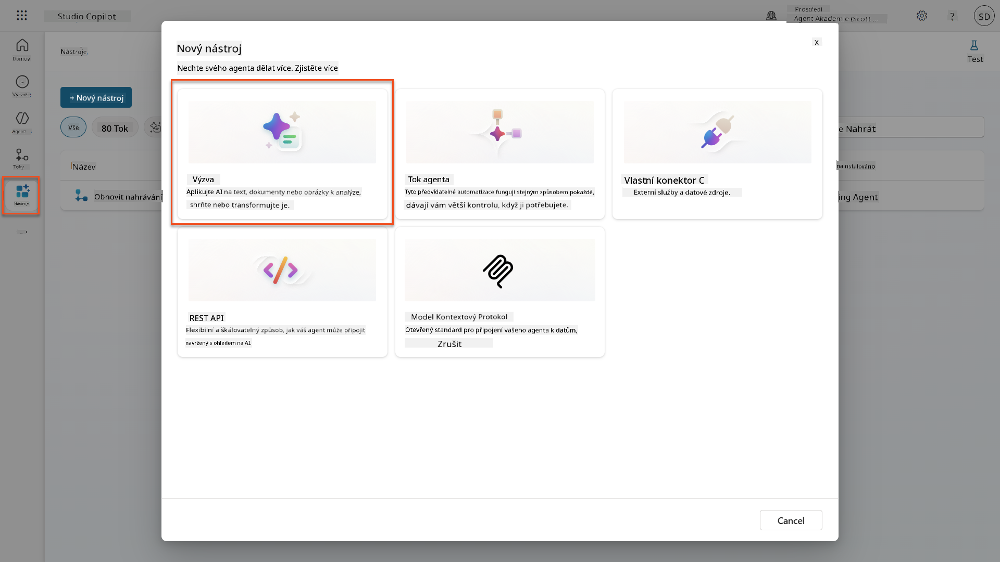

1. **Přejmenujte** výzvu z výchozího názvu s časovým razítkem (např. *Vlastní výzva 09/04/2025, 04:59:11 PM*) na `Shrnutí životopisu`.

1. Do pole Instrukce přidejte tuto výzvu:

    ```text
    You are tasked with extracting key candidate information from a resume and cover letter to facilitate matching with open job roles and creating a summary for application review.
    
    Instructions:
    1. Extract Candidate Details:
        - Identify and extract the candidate’s full name.
        - Extract contact information, specifically the email address.
    2. Create Candidate Summary:
        - Summarize the candidate’s profile as multiline text (max 2000 characters) with the following sections:
            - Candidate name
            - Role(s) applied for if present
            - Contact and location
            - One-paragraph summary
            - Experience snapshot (last 2–3 roles with outcomes)
            - Key projects (1–3 with metrics)
            - Education and certifications
            - Top skills (Top 10)
            - Availability and work authorization
    
    Guidelines:
    - Extract information only from the provided resume and cover letter documents.
    - Ensure accuracy in identifying all details such as contact details and skills.
    - The summary should be concise but informative, suitable for quick application review.
    
    Resume: /document
    CoverLetter: /text
    ```

    !!! tip "Použijte asistenci Copilota"
        Můžete použít "Začít s Copilotem" k vytvoření vaší výzvy pomocí přirozeného jazyka. Zkuste požádat Copilota, aby vytvořil výzvu pro shrnutí životopisu!

1. **Konfigurujte** vstupní parametry:

    | Parametr | Typ | Název | Ukázková data |
    |----------|-----|-------|---------------|
    | Životopis | Obrázek nebo dokument | Životopis | Nahrajte ukázkový životopis z testovací složky |
    | Motivační dopis | Text | Motivační dopis | Tady je životopis! |

1. Vyberte **Test**, abyste viděli počáteční textový výstup z vaší výzvy.  
    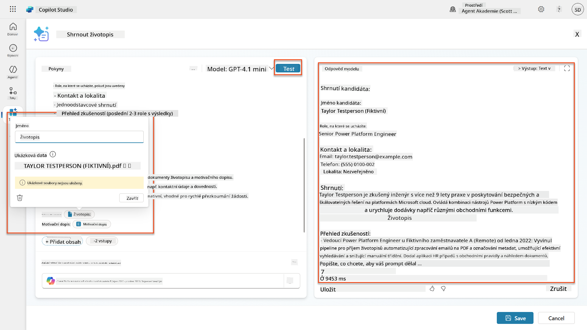

### 7.2 Konfigurace JSON výstupu

Nyní převedete výzvu na výstup strukturovaných dat JSON místo prostého textu.

1. Přidejte tuto specifikaci formátu JSON na konec instrukcí vaší výzvy:

    ```text
    Output Format:
    Provide the output in valid JSON format with the following structure:
    
    {
        "CandidateName": "string",
        "Email": "string",
        "Summary": "string max 2000 characters",
        "Skills": [ {"item": "Skill 1"}, {"item": "Skill 2"}],
        "Experience": [ {"item": "Experience 1"}, {"item": "Experience 2"}],
    }
    ```

1. Změňte nastavení **Výstup** z "Text" na **JSON**.

1. Znovu vyberte **Test**, abyste ověřili, že výstup je nyní formátován jako JSON.  
    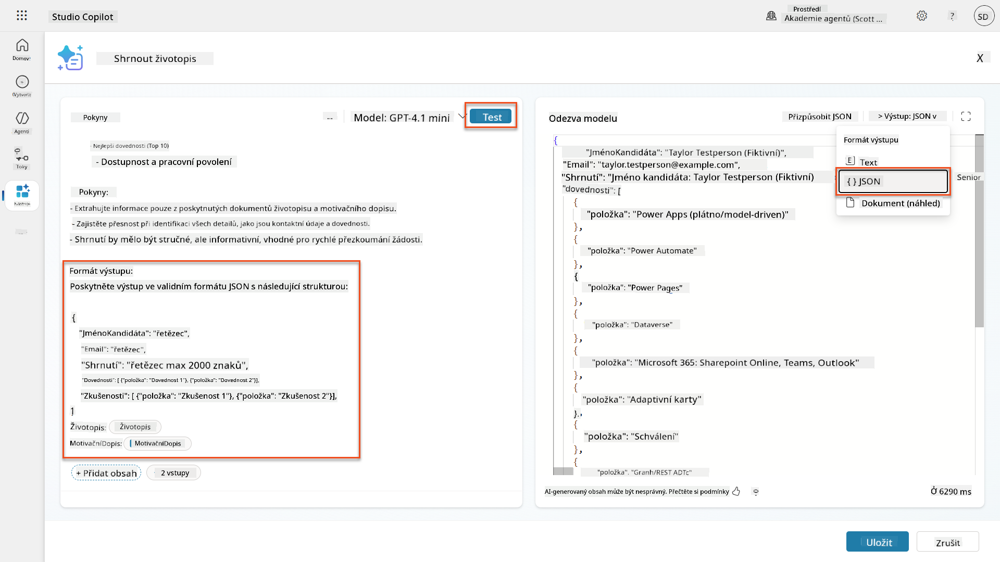

1. **Volitelné:** Experimentujte s různými modely AI, abyste viděli, jak se výstupy liší, poté se vraťte k výchozímu modelu.

1. Vyberte **Uložit**, abyste vytvořili výzvu.

1. V dialogu **Konfigurace pro použití v agentovi** vyberte **Zrušit**.

    !!! info "Proč tuto výzvu zatím nepřidáváme jako nástroj"
        Tuto výzvu použijete v Agent Flow místo přímo jako nástroj, což vám poskytne větší kontrolu nad pracovním postupem zpracování dat.

### 7.3 Přidání výzvy do Agent Flow

Vytvoříte Agent Flow, který použije vaši výzvu k zpracování životopisů uložených v Dataverse.

!!! tip "Výrazy v Agent Flow"
    Je velmi důležité, abyste přesně dodržovali pokyny pro pojmenování vašich uzlů a zadávání výrazů, protože výrazy odkazují na předchozí uzly pomocí jejich názvu! Podívejte se na [Misi Agent Flow v Recruit](../../recruit/09-add-an-agent-flow/README.md#you-mentioned-expressions-what-are-expressions) pro rychlé osvěžení!

1. Přejděte do svého **Náborového agenta** uvnitř Copilot Studio.

1. Vyberte záložku **Agenti** a vyberte podřízeného **Agenta pro příjem žádostí**.

1. Uvnitř panelu **Nástroje** vyberte **+ Přidat** → **+ Nový nástroj** → **Agent flow**.

1. Vyberte uzel Když agent volá flow, použijte **+ Přidat vstup**, abyste přidali následující parametr:

    | Typ | Název | Popis |
    |-----|-------|-------|
    | Text | Číslo životopisu | Ujistěte se, že používáte [Číslo životopisu]. Musí vždy začínat písmenem R |

1. Vyberte ikonu **+** Vložit akci pod prvním uzlem, vyhledejte **Dataverse**, vyberte **Zobrazit více**, a poté najděte akci **Seznam řádků**.

1. Vyberte **tři tečky (...)** na uzlu Seznam řádků a vyberte **Přejmenovat** na `Získat záznam životopisu`, a poté nastavte následující parametry:

    | Vlastnost | Jak nastavit | Hodnota |
    |-----------|--------------|---------|
    | **Název tabulky** | Vyberte | Životopisy |
    | **Filtr řádků** | Dynamická data (ikona blesku) | `ppa_resumenumber eq 'Číslo životopisu'` Nahraďte **Číslo životopisu** za **Když agent volá flow** → **Číslo životopisu** |
    | **Počet řádků** | Zadejte | 1 |

    !!! tip "Optimalizujte tyto dotazy!"
        Při použití této techniky v produkci byste měli vždy omezit výběr sloupců pouze na ty, které jsou vyžadovány Agent Flow.

    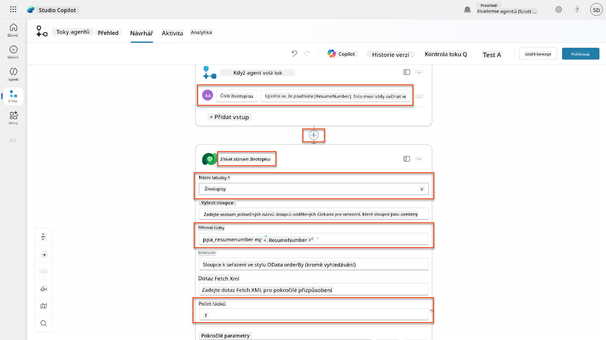

1. Vyberte ikonu **+** Vložit akci pod uzlem Získat záznam životopisu, vyhledejte **Dataverse**, vyberte **Zobrazit více**, a poté najděte akci **Stáhnout soubor nebo obrázek**.

    !!! tip "Vyberte správnou akci!"
        Ujistěte se, že nevyberete akci, která končí "z vybraného prostředí".

1. Stejně jako předtím, přejmenujte akci na `Stáhnout životopis`, a poté nastavte následující parametry:

    | Vlastnost | Jak nast
| **Výzva** | Vybrat | Shrnutí životopisu |
| **Motivační dopis** | Výraz (ikona fx) | `first(body('Get_Resume_Record')?['value'])?['ppa_coverletter']` |
| **Životopis** | Dynamická data (ikona blesku) | Stáhnout životopis → Obsah souboru nebo obrázku |

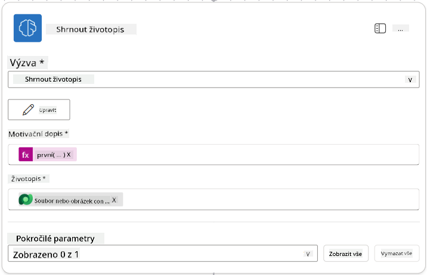

!!! tip "Parametry výzvy"
    Všimněte si, že parametry, které vyplňujete, jsou stejné jako ty, které jste nastavili jako vstupní parametry při vytváření vaší výzvy.

### 7.4 Vytvoření záznamu kandidáta

Nyní je třeba vzít informace, které vám výzva poskytla, a vytvořit nový záznam kandidáta, pokud ještě neexistuje.

1. Vyberte ikonu **+** Vložit akci pod uzlem Shrnutí životopisu, vyhledejte **Dataverse**, vyberte **Zobrazit více** a poté najděte akci **List rows**.

1. Přejmenujte uzel na `Get Existing Candidate` a nastavte následující parametry:

    | Vlastnost | Jak nastavit | Hodnota |
    |-----------|--------------|---------|
    | **Název tabulky** | Vybrat | Kandidáti |
    | **Filtr řádků** | Dynamická data (ikona blesku) | `ppa_email eq 'Email'`  **Nahraďte** `Email` za **Shrnutí životopisu → Email** |
    | **Počet řádků** | Zadat | 1 |

    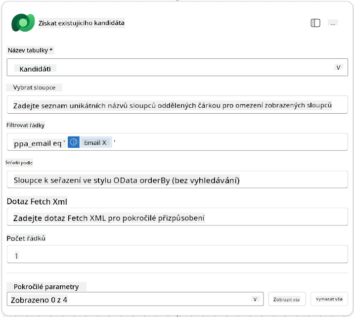

1. Vyberte ikonu **+** Vložit akci pod uzlem Get Existing Candidate, vyhledejte **Control**, vyberte **Zobrazit více** a poté najděte akci **Condition**.

1. V nastavení podmínek nastavte následující podmínku:

    | Podmínka | Operátor | Hodnota |
    |----------|----------|---------|
    | Výraz (ikona fx): `length(outputs('Get_Existing_Candidate')?['body/value'])` | rovná se | 0 |

    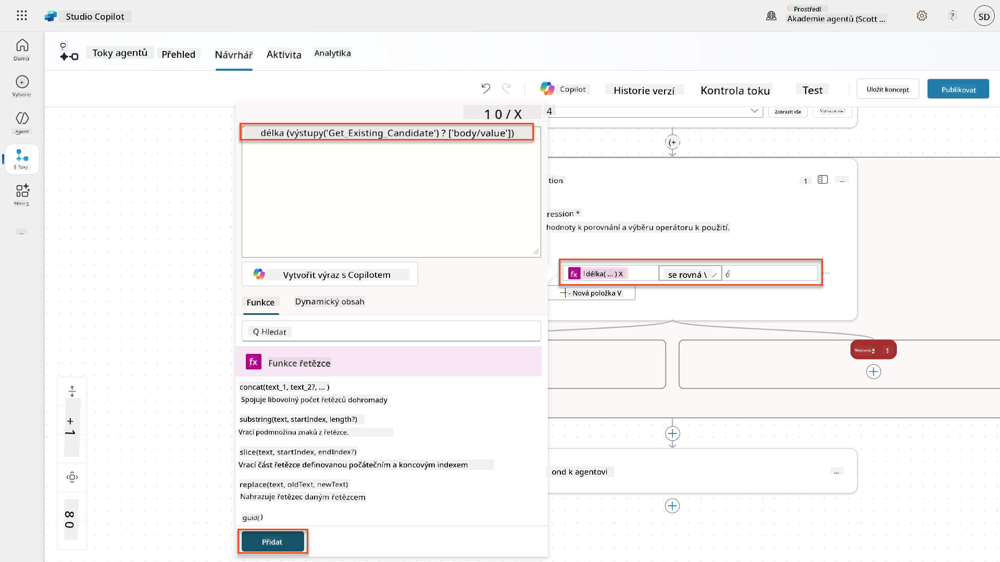

1. Vyberte ikonu **+** Vložit akci ve větvi **True**, vyhledejte **Dataverse**, vyberte **Zobrazit více** a poté najděte akci **Add a new row**.

1. Přejmenujte uzel na `Add a New Candidate` a nastavte následující parametry:

    | Vlastnost | Jak nastavit | Hodnota |
    |-----------|--------------|---------|
    | **Název tabulky** | Vybrat | Kandidáti |
    | **Jméno kandidáta** | Dynamická data (ikona blesku) | Shrnutí životopisu → `CandidateName` |
    | **Email** | Dynamická data (ikona blesku) | Shrnutí životopisu → `Email` |

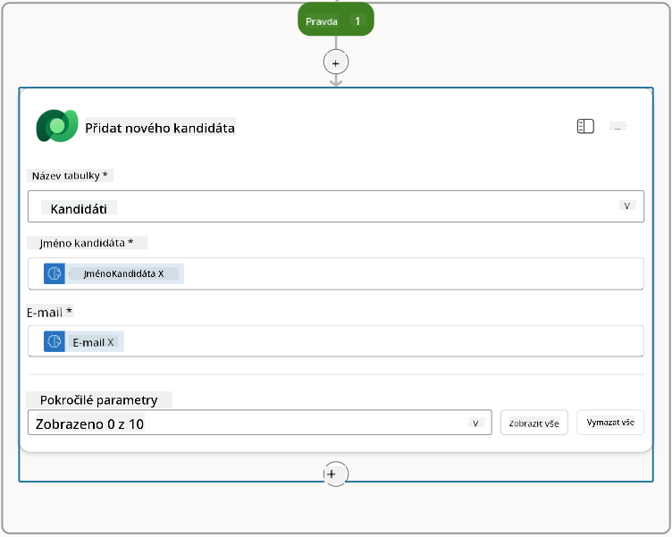

### 7.5 Aktualizace životopisu a konfigurace výstupů toku

Dokončete tok aktualizací záznamu životopisu a konfigurací dat, která se vrátí vašemu agentovi.

1. Vyberte ikonu **+** Vložit akci pod podmínkou, vyhledejte **Dataverse**, vyberte **Zobrazit více** a poté najděte akci **Update a row**.

1. Vyberte název a přejmenujte uzel na `Update Resume`, vyberte **Zobrazit vše** a nastavte následující parametry:

    | Vlastnost | Jak nastavit | Hodnota |
    |-----------|--------------|---------|
    | **Název tabulky** | Vybrat | Životopisy |
    | **ID řádku** | Výraz (ikona fx) | `first(body('Get_Resume_Record')?['value'])?['ppa_resumeid']` |
    | **Shrnutí** | Dynamická data (ikona blesku) | Shrnutí životopisu → Text |
    | **Kandidát (Kandidáti)** | Výraz (ikona fx) | `if(equals(length(outputs('Get_Existing_Candidate')?['body/value']), 1), first(outputs('Get_Existing_Candidate')?['body/value'])?['ppa_candidateid'], outputs('Add_a_New_Candidate')?['body/ppa_candidateid'])` |

    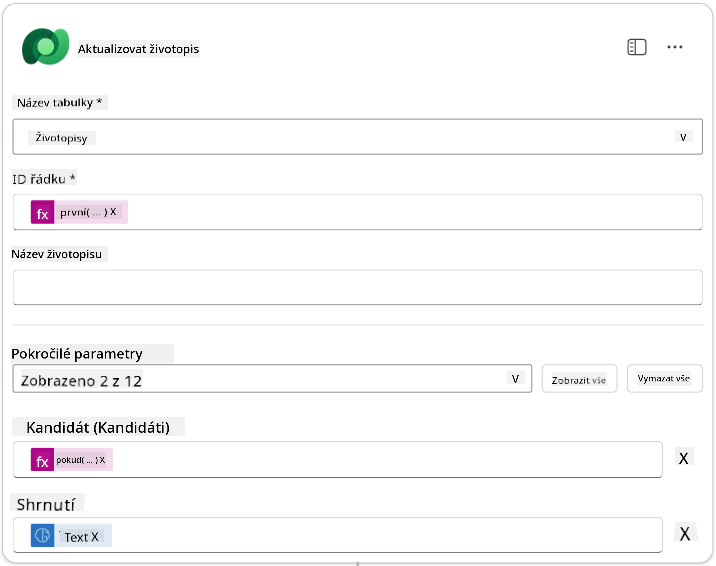

1. Vyberte uzel **Respond to the agent** a poté použijte **+ Přidat výstup** k nastavení:

    | Typ | Název              | Jak nastavit                  | Hodnota                                                        | Popis                                            |
    |-----|--------------------|-------------------------------|----------------------------------------------------------------|-------------------------------------------------|
    | Text | `CandidateName`   | Dynamická data (ikona blesku) | Shrnutí životopisu → Zobrazit více → CandidateName             | [CandidateName] uvedené v životopisu            |
    | Text | `CandidateEmail`  | Dynamická data (ikona blesku) | Shrnutí životopisu → Zobrazit více → Email                     | [CandidateEmail] uvedený v životopisu           |
    | Text | `CandidateNumber` | Výraz (ikona fx)              | `concat('ppa_candidates/', if(equals(length(outputs('Get_Existing_Candidate')?['body/value']), 1), first(outputs('Get_Existing_Candidate')?['body/value'])?['ppa_candidateid'], outputs('Add_a_New_Candidate')?['body/ppa_candidateid']) )` | [CandidateNumber] nového nebo existujícího kandidáta |
    | Text | `ResumeSummary`   | Dynamická data (ikona blesku) | Shrnutí životopisu → Zobrazit více → body/responsev2/predictionOutput/structuredOutput | Shrnutí životopisu a detaily ve formátu JSON    |

    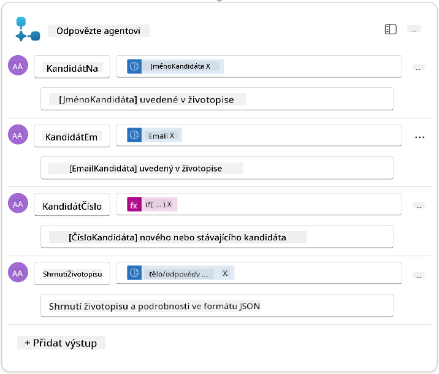

1. Vyberte **Uložit koncept** v pravém horním rohu. Váš Agent Flow by měl vypadat následovně  
    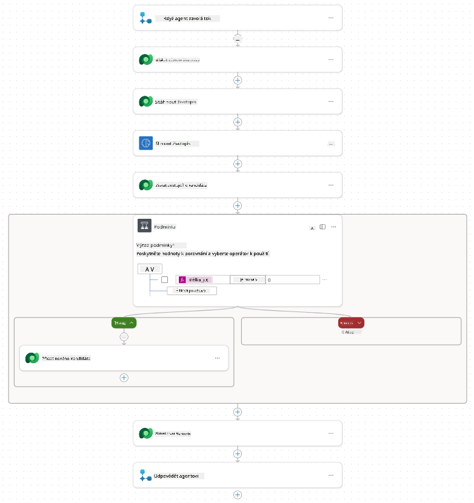

1. Vyberte záložku **Přehled**, vyberte **Upravit** v panelu **Detaily**

    1. **Název toku**:`Shrnutí životopisu`
    1. **Popis**:

        ```text
        Summarize an existing Resume stored in Dataverse using a [ResumeNumber] as input, return the [CandidateNumber], and resume summary JSON
        ```

1. Vyberte **Uložit**

1. Znovu vyberte záložku **Návrhář** a poté vyberte **Publikovat**.

### 7.6 Připojení toku k vašemu agentovi

Nyní přidáte tok jako nástroj a nakonfigurujete svého agenta, aby jej používal.

1. Otevřete svého **Hiring Agent** v Copilot Studio.

1. Vyberte záložku **Agenti** a otevřete **Application Intake Agent**.

1. Vyberte panel **Nástroje** a vyberte **+ Přidat nástroj** - > **Tok** -> **Shrnutí životopisu** **(Agent Flow)**.

1. Vyberte **Přidat a nakonfigurovat**.

1. Nakonfigurujte nastavení nástroje následovně:

    | Nastavení | Hodnota |
    |-----------|---------|
    | **Popis** | Shrnutí existujícího životopisu uloženého v Dataverse pomocí [ResumeNumber] jako vstupu, vrácení [CandidateNumber] a shrnutí životopisu ve formátu JSON |
    | **Kdy může být tento nástroj použit** | Pouze pokud je odkazován tématy nebo agenty |

1. Vyberte **Uložit**  
    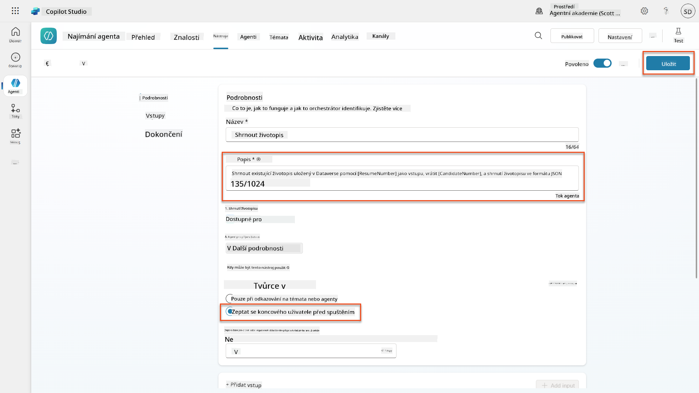

1. Pokud vyberete Nástroje uvnitř Hiring Agent, nyní uvidíte oba naše nástroje, které jsou použitelné **Application Intake Agent**.  
    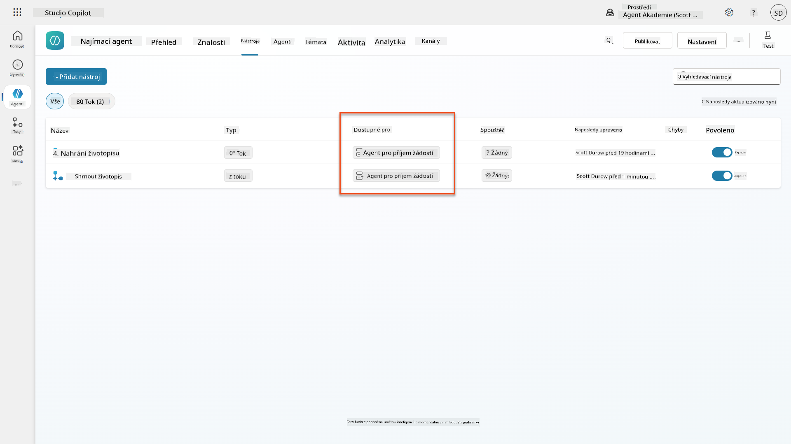

1. Přejděte na pokyny agenta **Application Intake Child** a upravte krok **Post-Upload** na následující:

    ```text
    2. Post-Upload Processing  
        - After uploading, be sure to also output the [ResumeNumber] in all messages
        - Pass [ResumeNumber] to /Summarize Resume  - Be sure to use the correct value that will start with the letter R.
        - Be sure to also output the [CandidateNumber] in all messages
        - Use the [ResumeSummary] to output a summary of the processed Resume and candidate
    ```

    Nahraďte `/Shrnutí životopisu` vložením odkazu na **Shrnutí životopisu agent flow** zadáním lomítka (`/)` nebo výběrem `/Shrnutí` pro vložení odkazu.  
    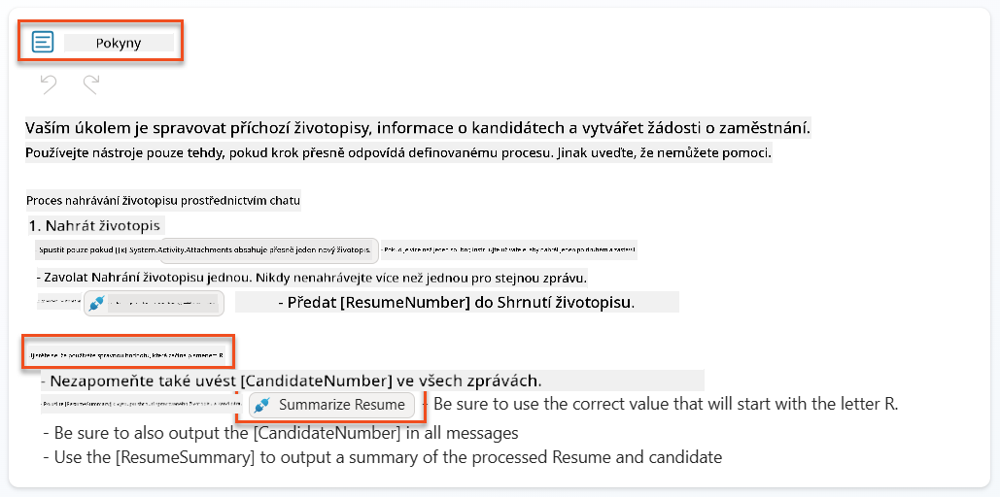

1. Vyberte **Uložit**.

### 7.7 Testování vašeho agenta

Otestujte svůj kompletní multimodální systém, abyste se ujistili, že vše funguje správně.

1. **Začněte testování**:

    - Vyberte **Test** pro otevření testovacího panelu
    - Zadejte: `Tady je životopis kandidáta`

    - Nahrajte jeden ze vzorových životopisů z [Testovací životopisy](https://download-directory.github.io/?url=https://github.com/microsoft/agent-academy/tree/main/operative/sample-data/resumes&filename=operative_sampledata)

1. **Ověřte výsledky**:
    - Jakmile odešlete zprávu a životopis, zkontrolujte, zda obdržíte číslo životopisu (formát: R#####)
    - Ověřte, že dostanete číslo kandidáta a shrnutí
    - Použijte mapu aktivit k zobrazení nástroje pro nahrání životopisu a nástroje pro shrnutí životopisu v akci a výstupy výzvy Shrnutí jsou přijaty agentem:  
        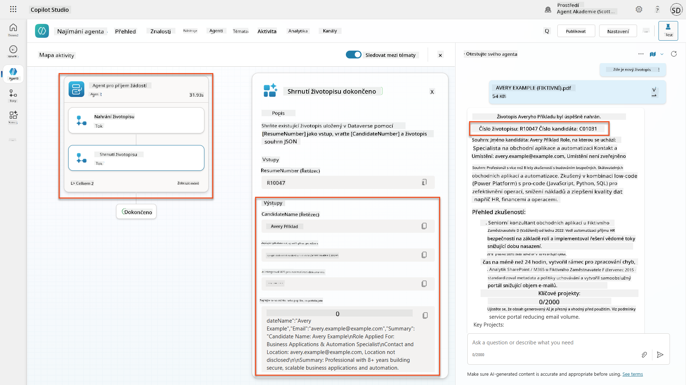

1. **Zkontrolujte trvalost dat**:
    - Přejděte na [Power Apps](https://make.powerapps.com)
    - Otevřete **Apps** → **Hiring Hub** → **Play**
    - Přejděte na **Životopisy** a ověřte, že životopis byl nahrán a zpracován. Měl by obsahovat informace o shrnutí a přidružený záznam kandidáta.
    - Zkontrolujte **Kandidáty**, abyste viděli extrahované informace o kandidátovi  
        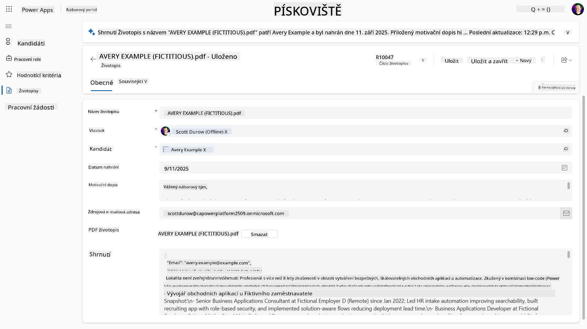
    - Když proces spustíte znovu, měl by použít existujícího kandidáta (shodného na základě emailu extrahovaného z životopisu) místo vytvoření nového.

!!! tip "Řešení problémů"
    - **Životopis se nezpracovává**: Ujistěte se, že soubor je ve formátu PDF a nepřekračuje velikostní limity
    - **Žádný kandidát nebyl vytvořen**: Zkontrolujte, zda byl email správně extrahován z životopisu
    - **Chyby formátu JSON**: Ověřte, že vaše pokyny výzvy obsahují přesnou strukturu JSON
    - **Chyby toku**: Zkontrolujte, zda jsou všechny připojení Dataverse a výrazy správně nakonfigurovány

### Připravenost na produkci

Ačkoli to není součástí této mise, abyste učinili tento agent flow připraveným na produkci, můžete zvážit následující:

1. **Zpracování chyb** - Pokud nebylo nalezeno číslo životopisu nebo výzva nedokázala dokument zpracovat, mělo by být přidáno zpracování chyb, které agentovi vrátí jasnou chybu.
1. **Aktualizace existujících kandidátů** - Kandidát je nalezen pomocí emailu, poté by mohlo být aktualizováno jméno, aby odpovídalo tomu v životopisu.
1. **Rozdělení shrnutí životopisu a vytvoření kandidáta** - Tato funkčnost by mohla být rozdělena na menší agent flowy, aby byly snáze udržovatelné, a poté by agent dostal pokyny, jak je postupně používat.

## 🎉 Mise splněna

Skvělá práce, Operative! **Document Resume Recon** je nyní dokončen. Úspěšně jste zvládli multimodální výzvy a nyní můžete s přesností extrahovat strukturovaná data z jakéhokoli dokumentu.

Co jste v této misi dosáhli:

**✅ Mistrovství v multimodálních výzvách**  
Nyní rozumíte tomu, co jsou multimodální výzvy a kdy použít různé AI modely pro optimální výsledky.

**✅ Odbornost v zpracování dokumentů**  
Naučili jste se konfigurovat výzvy s obrazovými a dokumentovými vstupy a formátovat výstupy jako JSON pro extrakci strukturovaných dat.

**✅ Systém pro extrakci životopisů**  
Vytvořili jste kompletní systém pro zpracování životopisů, který integruje dokumenty kandidátů do vašeho náborového procesu.

**✅ Implementace osvědčených postupů**  
Aplikovali jste osvědčené postupy pro návrh výzev při analýze dokumentů a integrovali multimodální výzvy s Agent Flowy.

**✅ Základ pro pokročilé zpracování**  
Vaše vylepšené schopnosti analýzy dokumentů jsou nyní připraveny na pokročilé funkce ukotvení dat, které přidáme v nadcházejících misích.

🚀 **Další krok:** V misi 08 objevíte, jak vylepšit své výzvy pomocí dat v reálném čase z Dataverse, čímž vytvoříte dynamická AI řešení, která se přizpůsobí měnícím se obchodním požadavkům.

⏩ [Přejít na misi 08: Vylepšené výzvy s ukotvením Dataverse](../08-dataverse-grounding/README.md)

## 📚 Taktické zdroje

📖 [Vytvoření výzvy](https://learn.microsoft.com/ai-builder/create-a-custom-prompt?WT.mc_id=power-power-182762-scottdurow)

📖 [Přidání textového, obrazového nebo dokumentového vstupu do výzvy](https://learn.microsoft.com/ai-builder/add-inputs-prompt?WT.mc_id=power-182762-scottdurow)

📖 [Zpracování odpovědí s výstupem JSON](https://learn.microsoft.com/ai-builder/process-responses-json-output?WT.mc_id=power-182762-scottdurow)

📖 [Výběr modelu a nastavení teploty](https://learn.microsoft.com/ai-builder/prompt-modelsettings?WT.mc_id=power-182762-scottdurow)

📖 [Použití výzvy v Power Automate](https://learn.microsoft.com/ai-builder/use-a-custom-prompt-in-flow?WT.mc_id=power-182762-scottdurow)

📺 [AI Builder: JSON výstupy v návrháři výzev](https://www.youtube.com/watch?v=F0fGnWrRY_I)

---

**Prohlášení**:  
Tento dokument byl přeložen pomocí služby AI pro překlad [Co-op Translator](https://github.com/Azure/co-op-translator). Ačkoli se snažíme o přesnost, mějte prosím na paměti, že automatizované překlady mohou obsahovat chyby nebo nepřesnosti. Původní dokument v jeho rodném jazyce by měl být považován za autoritativní zdroj. Pro důležité informace se doporučuje profesionální lidský překlad. Neodpovídáme za žádná nedorozumění nebo nesprávné interpretace vyplývající z použití tohoto překladu.