<!--
CO_OP_TRANSLATOR_METADATA:
{
  "original_hash": "750f3ea8a94930439ebd8a10871b1d73",
  "translation_date": "2025-10-20T17:54:51+00:00",
  "source_file": "docs/operative-preview/08-dataverse-grounding/README.md",
  "language_code": "cs"
}
-->
# 🚨 Mise 08: Vylepšené výzvy s ukotvením Dataverse

--8<-- "disclaimer.md"

## 🕵️‍♂️ KRYCÍ NÁZEV: `OPERACE UKOTVENÍ KONTROLY`

> **⏱️ Časový rámec operace:** `~60 minut`

## 🎯 Stručný popis mise

Vítejte zpět, operativče. Váš systém pro najímání více agentů je funkční, ale je potřeba kritické vylepšení pro **ukotvení dat** – vaše modely AI potřebují mít přístup k aktuálním strukturovaným datům vaší organizace, aby mohly činit inteligentní rozhodnutí.

V současné době vaše výzva pro shrnutí životopisu funguje se statickými znalostmi. Ale co kdyby mohla dynamicky přistupovat k databázi pracovních pozic a poskytovat přesné, aktuální shody? Co kdyby rozuměla vašim hodnotícím kritériím, aniž byste je museli pevně zakódovat?

V této misi vylepšíte svou vlastní výzvu pomocí **ukotvení Dataverse** – připojením vašich výzev přímo k živým datovým zdrojům. To promění vaše agenty ze statických respondentů na dynamické systémy řízené daty, které se přizpůsobují měnícím se potřebám podnikání.

Vaším úkolem je integrovat aktuální data o pracovních pozicích a hodnotících kritériích do vašeho pracovního postupu analýzy životopisů a vytvořit samoaktualizující se systém, který bude odpovídat aktuálním požadavkům na nábor.

## 🔎 Cíle

V této misi se naučíte:

1. Jak **ukotvení Dataverse** vylepšuje vlastní výzvy
1. Kdy použít ukotvení dat oproti statickým instrukcím
1. Navrhování výzev, které dynamicky zahrnují živá data
1. Vylepšení procesu shrnutí životopisu pomocí shody pracovních pozic

## 🧠 Porozumění ukotvení Dataverse pro výzvy

**Ukotvení Dataverse** umožňuje vašim vlastním výzvám přístup k živým datům z tabulek Dataverse při zpracování požadavků. Namísto statických instrukcí mohou vaše výzvy zahrnovat aktuální informace pro informovaná rozhodnutí.

### Proč je ukotvení Dataverse důležité

Tradiční výzvy pracují s pevnými instrukcemi:

```text
Match this candidate to these job roles: Developer, Manager, Analyst
```

S ukotvením Dataverse vaše výzva přistupuje k aktuálním datům:

```text
Match this candidate to available job roles from the Job Roles table, 
considering current evaluation criteria and requirements
```

Tento přístup přináší několik klíčových výhod:

- **Dynamické aktualizace:** Pracovní pozice a kritéria se mění bez úprav výzvy
- **Konzistence:** Všichni agenti používají stejné aktuální datové zdroje
- **Škálovatelnost:** Nové pozice a kritéria jsou automaticky dostupné
- **Přesnost:** Aktuální data zajišťují, že rozhodnutí odrážejí současné potřeby

### Jak ukotvení Dataverse funguje

Když povolíte ukotvení Dataverse pro vlastní výzvu:

1. **Výběr dat:** Vyberte konkrétní tabulky a sloupce Dataverse, které chcete zahrnout. Můžete také vybrat související tabulky, které systém filtruje na základě získaných záznamů rodičů.
1. **Vložení kontextu:** Výzva automaticky zahrne získaná data do kontextu výzvy.
1. **Inteligentní filtrování:** Systém zahrne pouze data relevantní pro aktuální požadavek, pokud poskytnete nějaké filtrování.
1. **Strukturovaný výstup:** Vaše výzva může odkazovat na získaná data a uvažovat o získaných záznamech pro vytvoření výstupu.

### Od statického k dynamickému: Výhoda ukotvení

Podívejme se na váš aktuální proces shrnutí životopisu z Mise 07 a uvidíme, jak ho ukotvení Dataverse transformuje ze statické na dynamickou inteligenci.

**Aktuální statický přístup:**
Vaše stávající výzva obsahovala pevně zakódovaná hodnotící kritéria a předem určenou logiku shody. Tento přístup funguje, ale vyžaduje ruční aktualizace pokaždé, když přidáte nové pracovní pozice, změníte hodnotící kritéria nebo posunete priority společnosti.

**Transformace pomocí ukotvení Dataverse:**
Přidáním ukotvení Dataverse váš proces shrnutí životopisu bude:

- **Přistupovat k aktuálním pracovním pozicím** z tabulky Pracovní pozice
- **Používat živá hodnotící kritéria** místo statických popisů  
- **Poskytovat přesné shody** na základě aktuálních požadavků

## 🎯 Proč dedikované výzvy oproti konverzacím s agentem

V Misi 02 jste zažili, jak může Agent pro pohovory přiřadit kandidáty k pracovním pozicím, ale vyžadovalo to složité uživatelské výzvy jako:

```text
Upload this resume, then show me open job roles,
each with a description of the evaluation criteria, 
then use this to match the resume to at least one suitable
job role even if not a perfect match.
```

I když to fungovalo, dedikované výzvy s ukotvením Dataverse nabízejí významné výhody pro specifické úkoly:

### Klíčové výhody dedikovaných výzev

| Aspekt | Konverzace s agentem | Dedikované výzvy |
|--------|-----------------------|------------------|
| **Konzistence** | Výsledky se liší podle schopností uživatele formulovat výzvy | Standardizované zpracování pokaždé |
| **Specializace** | Obecné uvažování může přehlédnout nuance podnikání | Účelově vytvořené s optimalizovanou obchodní logikou |
| **Automatizace** | Vyžaduje lidskou interakci a interpretaci | Spouští se automaticky se strukturovaným výstupem JSON |

## 🧪 Laboratoř 8: Přidání ukotvení Dataverse do výzev

Čas na vylepšení vašich schopností analýzy životopisů! Vylepšíte stávající proces shrnutí životopisu o dynamické přiřazování pracovních pozic.

### Předpoklady pro splnění mise

1. Budete potřebovat **buď**:

    - **Dokončit Misi 07** a mít připravený systém analýzy životopisů, **NEBO**
    - **Importovat startovací řešení Mise 08**, pokud začínáte od začátku nebo potřebujete dohnat. [Stáhnout startovací řešení Mise 08](https://aka.ms/agent-academy)

1. Ukázkové dokumenty životopisů z [test Resumes](https://download-directory.github.io/?url=https://github.com/microsoft/agent-academy/tree/main/operative/sample-data/resumes&filename=operative_sampledata)

!!! note "Import řešení a ukázková data"
    Pokud používáte startovací řešení, podívejte se na [Misi 01](../01-get-started/README.md) pro podrobné pokyny, jak importovat řešení a ukázková data do vašeho prostředí.

### 8.1 Přidání ukotvení Dataverse do vaší výzvy

Budete stavět na výzvě Shrnutí životopisu, kterou jste vytvořili v Misi 07. V současné době pouze shrnuje životopis, ale nyní ji ukotvíte s pracovními pozicemi, jak aktuálně existují v Dataverse, aby byla vždy aktuální.

Nejprve si prohlédněte tabulky Dataverse, které budete ukotvovat:

1. **Přejděte** na [Power Apps](https://make.powerapps.com) a vyberte své prostředí pomocí **Přepínače prostředí** v pravém horním rohu navigačního panelu.

1. Vyberte **Tabulky** a najděte tabulku **Pracovní pozice**.

1. Prohlédněte si klíčové sloupce, které budete používat pro ukotvení:

    | Sloupec | Účel |
    |--------|---------|
    | **Číslo pracovní pozice** | Jedinečný identifikátor pro přiřazení pozice |
    | **Název pracovní pozice** | Zobrazovaný název pozice |
    | **Popis** | Podrobné požadavky na pozici |

1. Podobně si prohlédněte další tabulky, jako je tabulka **Hodnotící kritéria**.

### 8.2 Přidání dat ukotvení Dataverse do vaší výzvy

1. **Přejděte** do Copilot Studio a vyberte své prostředí pomocí **Přepínače prostředí** v pravém horním rohu navigačního panelu.

1. Vyberte **Nástroje** z levé navigace.

1. Zvolte **Výzva** a najděte svou výzvu **Shrnutí životopisu** z Mise 07.  
    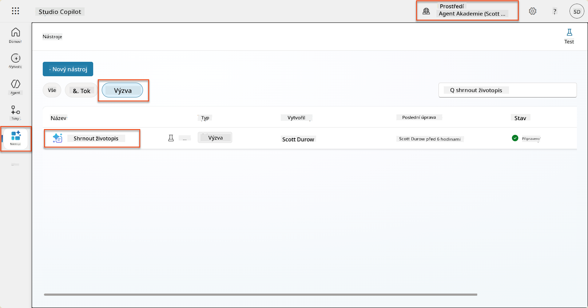

1. Vyberte **Upravit** pro úpravu výzvy a nahraďte ji vylepšenou verzí níže:

    !!! important
        Ujistěte se, že parametry Životopis a Motivační dopis zůstávají nedotčené jako parametry.

    ```text
    You are tasked with extracting key candidate information from a resume and cover letter to facilitate matching with open job roles and creating a summary for application review.
    
    ### Instructions:
    1. **Extract Candidate Details:**
       - Identify and extract the candidate's full name.
       - Extract contact information, specifically the email address.
    
    2. **Analyze Resume and Cover Letter:**
       - Review the resume content to identify relevant skills, experience, and qualifications.
       - Review the cover letter to understand the candidate's motivation and suitability for the roles.
    
    3. **Match Against Open Job Roles:**
       - Compare the extracted candidate information with the requirements and descriptions of the provided open job roles.
       - Use the job descriptions to assess potential fit.
       - Identify all roles that align with the candidate's cover letter and profile. You don't need to assess perfect suitability.
       - Provide reasoning for each match based on the specific job requirements.
    
    4. **Create Candidate Summary:**
       - Summarize the candidate's profile as multiline text with the following sections:
          - Candidate name
          - Role(s) applied for if present
          - Contact and location
          - One-paragraph summary
          - Top skills (8–10)
          - Experience snapshot (last 2–3 roles with outcomes)
          - Key projects (1–3 with metrics)
          - Education and certifications
          - Availability and work authorization
    
    ### Output Format
    
    Provide the output in valid JSON format with the following structure:
    
    {
      "CandidateName": "string",
      "Email": "string",
      "MatchedRoles": [
        {
          "JobRoleNumber": "ppa_jobrolenumber from grounded data",
          "RoleName": "ppa_jobtitle from grounded data",
          "Reasoning": "Detailed explanation based on job requirements"
        }
      ],
      "Summary": "string"
    }
    
    ### Guidelines
    
    - Extract information only from the provided resume and cover letter documents.
    - Ensure accuracy in identifying contact details.
    - Use the available job role data for matching decisions.
    - The summary should be concise but informative, suitable for quick application review.
    - If no suitable matches are found, indicate an empty list for MatchedRoles and explain briefly in the summary.
    
    ### Input Data
    Open Job Roles (ppa_jobrolenumber, ppa_jobtitle): /Job Role 
    Resume: {Resume}
    Cover Letter: {CoverLetter}
    ```

1. V editoru výzvy nahraďte `/Job Role` výběrem **+ Přidat obsah**, výběrem **Dataverse** → **Pracovní pozice** a vyberte následující sloupce, poté vyberte **Přidat**:

    1. **Číslo pracovní pozice**

    1. **Název pracovní pozice**

    1. **Popis**

    !!! tip
        Můžete zadat název tabulky pro vyhledávání.

1. V dialogu **Pracovní pozice** vyberte atribut **Filtr**, vyberte **Stav**, a poté zadejte **Aktivní** jako hodnotu **Filtru**.  
    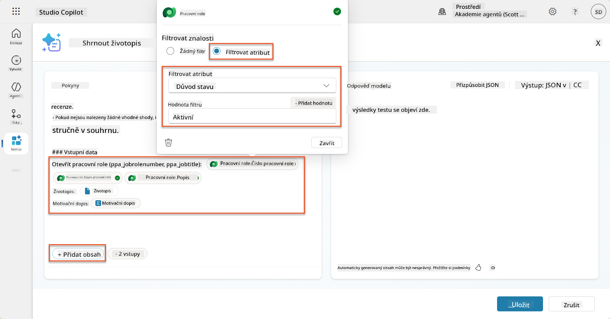

    !!! tip
        Zde můžete použít **Přidat hodnotu** k přidání vstupního parametru – například pokud máte výzvu k shrnutí existujícího záznamu, můžete poskytnout číslo životopisu jako parametr pro filtrování.

1. Dále přidáte související tabulku Dataverse **Hodnotící kritéria**, opět výběrem **+ Přidat obsah**, nalezením **Pracovní pozice**, a místo výběru sloupců na Pracovní pozici rozbalte **Pracovní pozice (Hodnotící kritéria)** a vyberte následující sloupce, poté vyberte **Přidat**:

    1. **Název kritéria**

    1. **Popis**  
        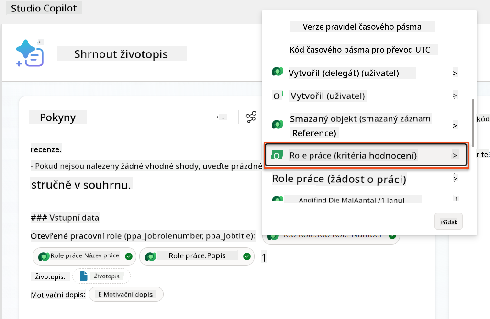

        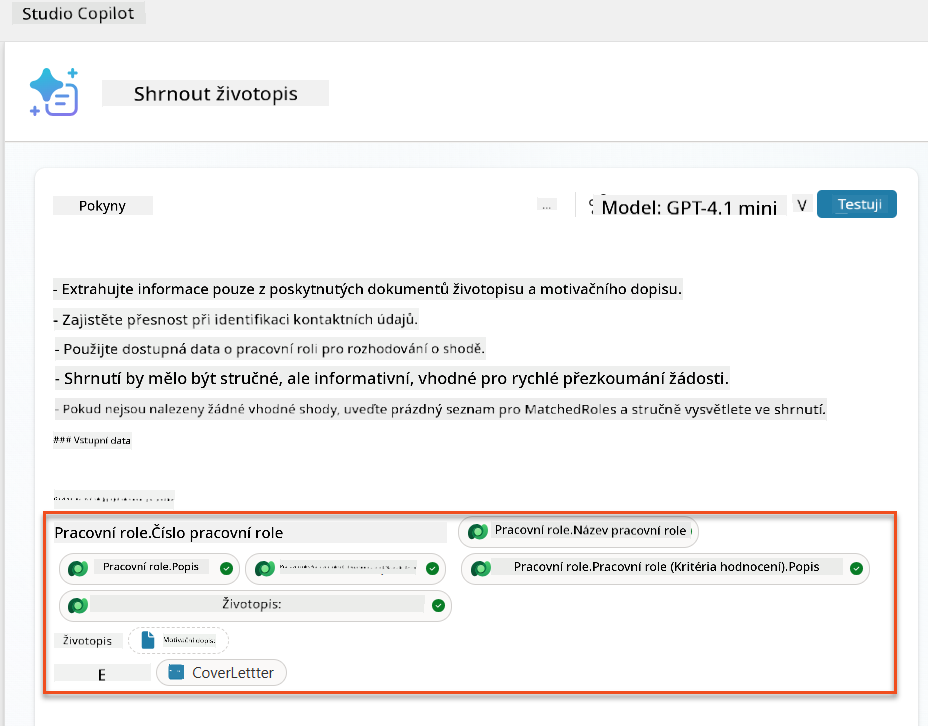

    !!! tip
        Je důležité vybrat související Hodnotící kritéria nejprve výběrem Pracovní pozice a poté navigací v menu na Pracovní pozice (Hodnotící kritéria). To zajistí, že budou načteny pouze související záznamy pro Pracovní pozici.

1. Vyberte **Nastavení** a upravte **Získávání záznamů** na 1000 – to umožní zahrnutí maximálního počtu Pracovních pozic a Hodnotících kritérií do vaší výzvy.  
    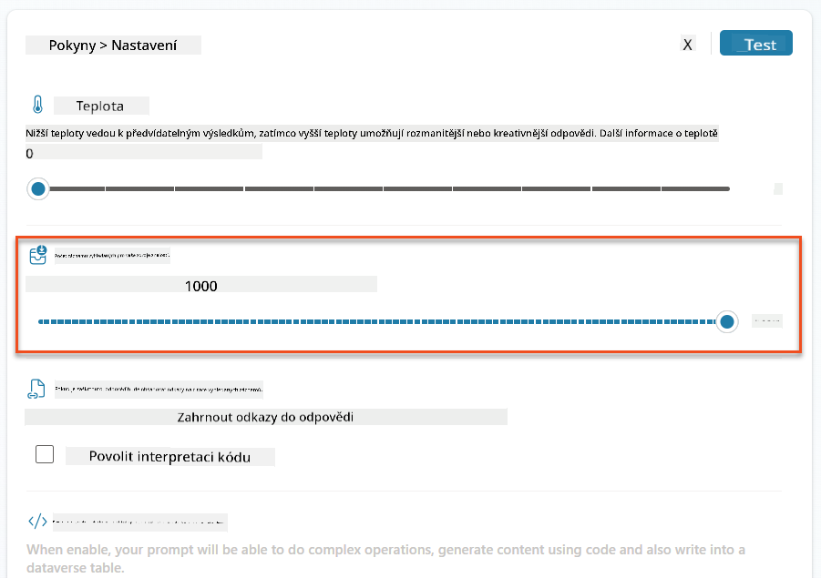

### 8.3 Testování vylepšené výzvy

1. Vyberte parametr **Životopis** a nahrajte ukázkový životopis, který jste použili v Misi 07.
1. Vyberte **Test**.
1. Po spuštění testu si všimněte, že výstup JSON nyní zahrnuje **Přiřazené pozice**.
1. Vyberte záložku **Použitá znalost**, abyste viděli data Dataverse, která se spojila s vaší výzvou před jejím spuštěním.
1. **Uložte** svou aktualizovanou výzvu. Systém nyní automaticky zahrne tato data Dataverse do vaší výzvy, když ji zavolá stávající Agent Flow Shrnutí životopisu.  
    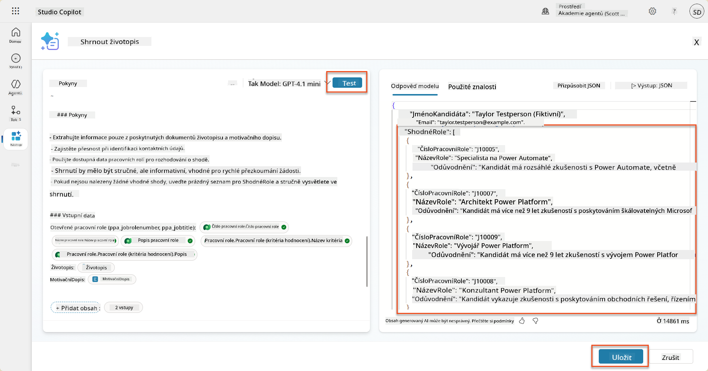

### 8.4 Přidání Agent Flow pro žádosti o zaměstnání

Abychom umožnili našemu Agentovi pro příjem žádostí o zaměstnání vytvořit Pracovní pozice na základě navržených pozic, které kandidát preferuje, musíme vytvořit Agent Flow. Agent bude volat tento nástroj pro každou z navržených pracovních pozic, o které má kandidát zájem.

!!! tip "Výrazy Agent Flow"
    Je velmi důležité, abyste přesně dodržovali pokyny pro pojmenování uzlů a zadávání výrazů, protože výrazy odkazují na předchozí uzly pomocí jejich názvu! Podívejte se na [Misi Agent Flow v Recruit](../../recruit/09-add-an-agent-flow/README.md#you-mentioned-expressions-what-are-expressions) pro rychlé osvěžení!

1. Uvnitř **Agenta pro nábor**, vyberte záložku **Agenti** a otevřete podřízeného agenta **Agent pro příjem žádostí o zaměstnání**.

1. Uvnitř panelu **Nástroje** vyberte **+ Přidat** → **+ Nový nástroj** → **Agent Flow**

1. Vyberte uzel **Když agent volá flow**, použijte **+ Přidat vstup** k přidání následujícího parametru:

    | Typ | Název            | Popis                                                  |
    | ---- | --------------- | ------------------------------------------------------------ |
    | Text | `ResumeNumber`  | Ujistěte se, že používáte pouze [ResumeNumber] - MUSÍ začínat písmenem R |
    | Text | `JobRoleNumber` | Ujistěte se, že používáte pouze [JobRoleNumber] - MUSÍ začínat písmenem J |

    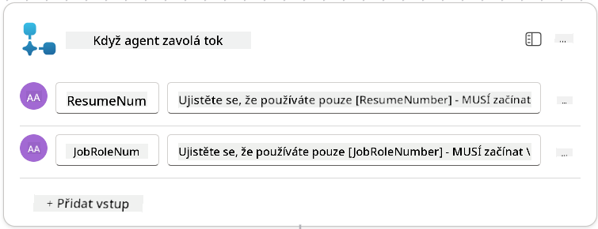

1. Vyberte ikonu **+** Vložit akci pod prvním uzlem, vyhledejte **Dataverse**, vyberte **Zobrazit více**, a poté najděte akci **Seznam záznamů**.

1. **Přejmenujte** uzel na `Získat životopis` a nastavte následující parametry:

    | Vlastnost        | Jak nastavit                  | Hodnota                                                        |
    | --------------- | ----------------------------- | ------------------------------------------------------------ |
    | **Název tabulky**  | Vyberte                      | Životopisy                                                    |
    | **Filtr záznamů** | Dynamická data (ikona blesku) | `ppa_resumenumber eq 'ResumeNumber'` Vyberte a nahraďte **ResumeNumber** hodnotou **Když agent volá flow** → **ResumeNumber** |
    | **Počet záznamů**   | Zadejte                     | 1                                                            |

    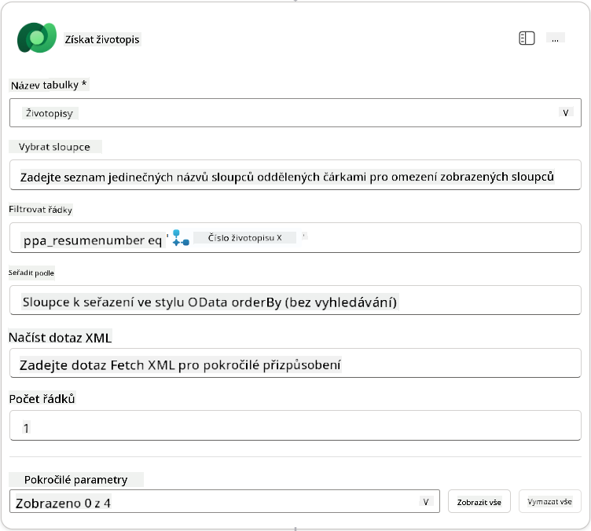

1. Nyní vyberte ikonu **+** Vložit akci pod `Získat životopis`, vyhledejte **Dataverse**, vyberte **Zobrazit více**, a poté najděte akci **Seznam záznamů**.

1. **Přejmenujte** uzel na `Získat pracovní pozici` a nastavte následující parametry:

    | Vlastnost        | Jak nastavit                  | Hodnota                                                        |
    | --------------- | ----------------------------- | ------------------------------------------------------------ |
    | **Název tabulky**  | Vyberte                      | Pracovní pozice                                               |
    | **Filtr záznamů** | Dynamická data (ikona blesku) | `ppa_jobrolenumber eq 'JobRoleNumber'` Vyberte a nahraďte **JobRoleNumber** hodnotou **Když agent volá flow** → **JobRoleNumber** |
    | **Počet záznamů**   | Zadejte                     | 1                                                            |

    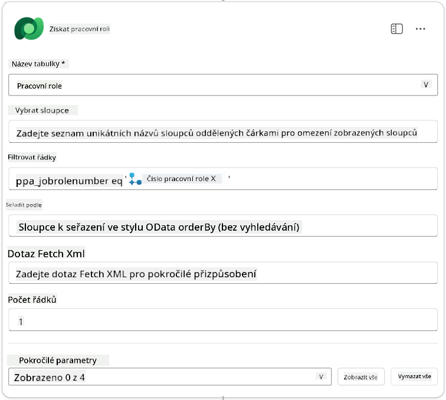

1. Nyní vyberte ikonu **+** Vložit akci pod `Získat pracovní pozici`, vyhledejte **Dataverse**, vyberte **Zobrazit více**, a poté najděte akci **Přidat nový záznam**.

1. **Přejmenujte** uzel na `Přidat žádost`,
| **Role (Role)**                        | Výraz (fx ikona) | `concat('ppa_jobroles/',first(outputs('Get_Job_Role')?['body/value'])?['ppa_jobroleid'])` |
| **Životopis (Životopisy)**             | Výraz (fx ikona) | `concat('ppa_resumes/', first(outputs('Get_Resume')?['body/value'])?['ppa_resumeid'])` |
| **Datum žádosti** (použijte **Zobrazit vše**) | Výraz (fx ikona) | `utcNow()`                                                   |


1. Vyberte **Odpovědět agentovi**, a poté vyberte **+ Přidat výstup**

     | Vlastnost       | Jak nastavit                   | Podrobnosti                                      |
     | --------------- | ------------------------------ | ------------------------------------------------ |
     | **Typ**         | Vyberte                       | `Text`                                           |
     | **Název**       | Zadejte                       | `ApplicationNumber`                              |
     | **Hodnota**     | Dynamická data (ikona blesku) | *Přidat žádost → Zobrazit více → Číslo žádosti* |
     | **Popis**       | Zadejte                       | `Číslo [ApplicationNumber] vytvořené pracovní žádosti` |

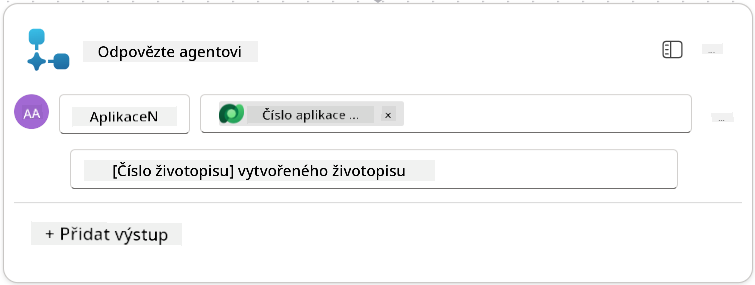

1. Vyberte **Uložit koncept** v pravém horním rohu.

1. Vyberte záložku **Přehled**, vyberte **Upravit** na panelu **Podrobnosti**.

   - **Název toku**:`Vytvořit pracovní žádost`
   - **Popis**:`Vytvoří novou pracovní žádost na základě [ResumeNumber] a [JobRoleNumber]`
   - **Uložit**

1. Znovu vyberte záložku **Návrhář** a vyberte **Publikovat**.

### 8.5 Přidání Vytvořit pracovní žádost k agentovi

Nyní připojíte publikovaný tok k vašemu agentovi pro příjem žádostí.

1. Vraťte se zpět k **Agentovi pro nábor** a vyberte záložku **Agenti**. Otevřete **Agenta pro příjem žádostí**, a poté najděte panel **Nástroje**.

1. Vyberte **+ Přidat**

1. Vyberte filtr **Tok**, a vyhledejte `Vytvořit pracovní žádost`. Vyberte tok **Vytvořit pracovní žádost**, a poté **Přidat a nakonfigurovat**.

1. Nastavte následující parametry:

    | Parametr                                           | Hodnota                                                      |
    | -------------------------------------------------- | ------------------------------------------------------------ |
    | **Popis**                                          | `Vytvoří novou pracovní žádost na základě [ResumeNumber] a [JobRoleNumber]` |
    | **Další podrobnosti → Kdy může být tento nástroj použit** | `Pouze když je odkazován tématy nebo agenty`                 |

1. Vyberte **Uložit**  
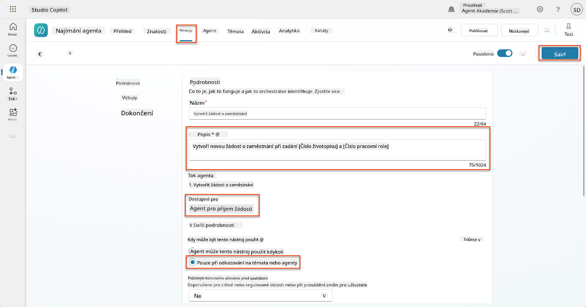

### 8.6 Definování pokynů pro agenta

Pro vytvoření pracovních žádostí musíte agentovi sdělit, kdy použít nový nástroj. V tomto případě požádáte uživatele, aby potvrdil, na které navrhované pracovní role se má přihlásit, a instruujete agenta, aby nástroj spustil pro každou roli.

1. Vraťte se zpět k **Agentovi pro příjem žádostí**, a poté najděte panel **Pokyny**.

1. V poli **Pokyny** **přidejte** následující jasné pokyny pro vašeho podřízeného agenta **na konec stávajících** pokynů:

    ```text
    3. Post Resume Upload
       - Respond with a formatted bullet list of [SuggestedJobRoles] the candidate could apply for.  
       - Use the format: [JobRoleNumber] - [RoleDescription]
       - Ask the user to confirm which Job Roles to create applications for the candidate.
       - When the user has confirmed a set of [JobRoleNumber]s, move to the next step.
    
    4. Post Upload - Application Creation
        - After the user confirms which [SuggestedJobRoles] for a specific [ResumeNumber]:
        E.g. "Apply [ResumeNumber] for the Job Roles [JobRoleNumber], [JobRoleNumber], [JobRoleNumber]
        E.g. "apply to all suggested job roles" - this implies use all the [JobRoleNumbers] 
         - Loop over each [JobRoleNumber] and send with [ResumeNumber] to /Create Job Application   
         - Summarize the Job Applications Created
    
    Strict Rules (that must never be broken)
    You must always follow these rules and never break them:
    1. The only valid identifiers are:
      - ResumeNumber (ppa_resumenumber)→ format R#####
      - CandidateNumber (ppa_candidatenumber)→ format C#####
      - ApplicationNumber (ppa_applicationnumber)→ format A#####
      - JobRoleNumber (ppa_jobrolenumber)→ format J#####
    2. Never guess or invent these values.
    3. Always extract identifiers from the current context (conversation, data, or system output). 
    ```

1. Kde pokyny obsahují lomítko (/), vyberte text následující za / a vyberte nástroj **Vytvořit pracovní žádost**.

1. Vyberte **Uložit**  
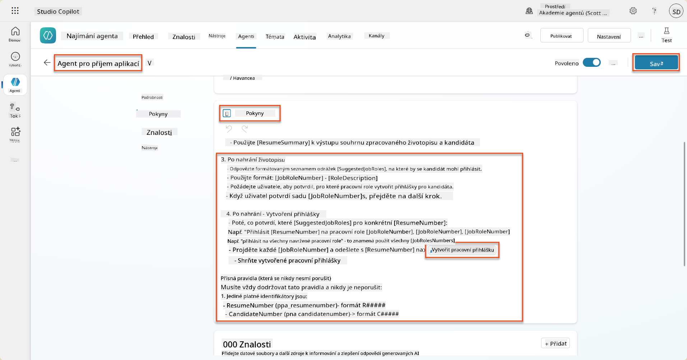

!!! tip "Iterace přes více položek v generativní orchestraci"
    Tyto pokyny využívají schopnost generativní orchestrace iterovat přes více řádků při rozhodování o tom, které kroky a nástroje použít. Shodné pracovní role budou automaticky přečteny a Agent pro příjem žádostí bude spuštěn pro každý řádek. Vítejte v magickém světě generativní orchestrace!

### 8.7 Testování vašeho agenta

1. Otevřete svého **Agenta pro nábor** v Copilot Studio.

1. **Nahrajte** ukázkový životopis do chatu a napište:

    ```text
    This is a new resume for the Power Platform Developer Role.
    ```

1. Všimněte si, jak agent poskytuje seznam navrhovaných pracovních rolí - každou s číslem pracovní role.  
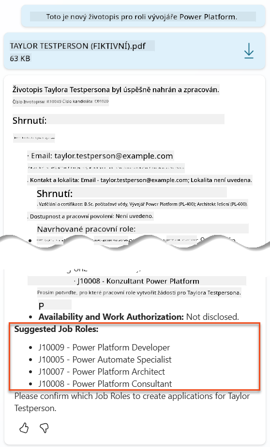

1. Poté můžete určit, pro které z těchto rolí chcete, aby byl životopis přidán jako pracovní žádost.
   **Příklady:**

    ```text
    "Apply for all of those job roles"
    "Apply for the J10009 Power Platform Developer role"
    "Apply for the Developer and Architect roles"
    ```

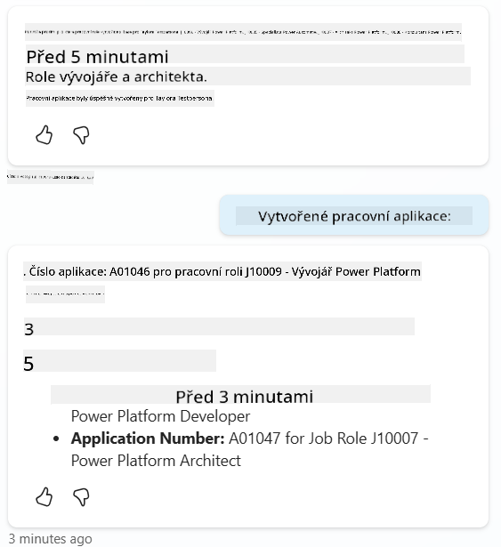

1. Nástroj **Vytvořit pracovní žádost** bude poté spuštěn pro každou pracovní roli, kterou jste určili. Uvnitř mapy aktivit uvidíte, jak se nástroj Vytvořit pracovní žádost spouští pro každou z pracovních rolí, pro které jste požádali o vytvoření žádosti:  
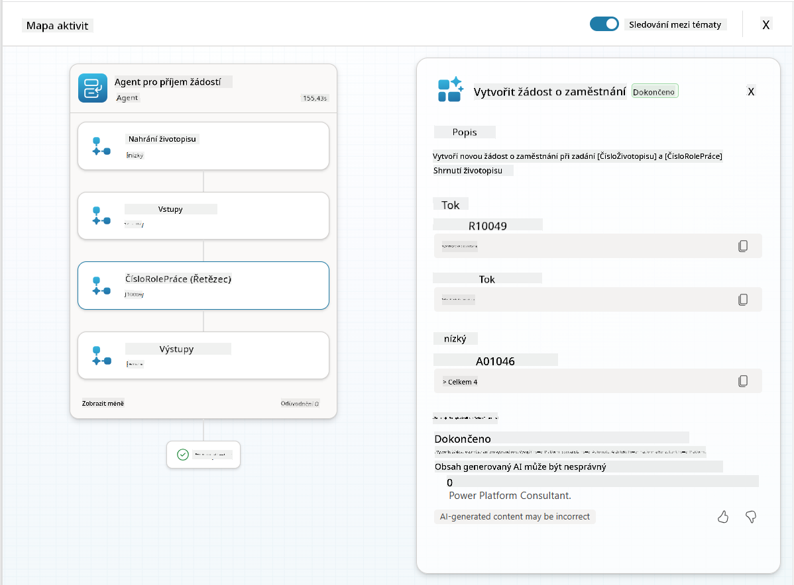

## 🎉 Mise splněna

Skvělá práce, Operative! **Operace Grounding Control** je nyní dokončena. Úspěšně jste rozšířili schopnosti svého AI pomocí dynamického propojení dat, čímž jste vytvořili skutečně inteligentní systém pro nábor.

Co jste v této misi dosáhli:

**✅ Mistrovství v propojení s Dataverse**  
Nyní rozumíte tomu, jak propojit vlastní výzvy s živými datovými zdroji pro dynamickou inteligenci.

**✅ Vylepšená analýza životopisů**  
Váš tok Shrnutí životopisu nyní přistupuje k aktuálním datům pracovních rolí a kritériím hodnocení pro přesné přiřazení.

**✅ Rozhodování na základě dat**  
Vaši náboroví agenti se nyní mohou automaticky přizpůsobit měnícím se požadavkům na pracovní pozice bez manuálních aktualizací výzev.

**✅ Vytváření pracovních žádostí**  
Váš vylepšený systém nyní dokáže vytvářet pracovní žádosti a je připraven na další komplexní orchestraci pracovních toků.

🚀 **Co dál:** V další misi se naučíte, jak implementovat schopnosti hlubokého uvažování, které pomohou vašim agentům činit složitá rozhodnutí a poskytovat podrobné vysvětlení jejich doporučení.

⏩ [Přejít na misi 09: Hluboké uvažování](../09-deep-reasoning/README.md)

## 📚 Taktické zdroje

📖 [Použití vlastních dat ve výzvě](https://learn.microsoft.com/ai-builder/use-your-own-prompt-data?WT.mc_id=power-182762-scottdurow)

📖 [Vytvoření vlastní výzvy](https://learn.microsoft.com/ai-builder/create-a-custom-prompt?WT.mc_id=power-182762-scottdurow)

📖 [Práce s Dataverse v Copilot Studio](https://learn.microsoft.com/microsoft-copilot-studio/knowledge-add-dataverse?WT.mc_id=power-182762-scottdurow)

📖 [Přehled vlastních výzev AI Builder](https://learn.microsoft.com/ai-builder/prompts-overview?WT.mc_id=power-182762-scottdurow)

📖 [Dokumentace AI Builder Power Platform](https://learn.microsoft.com/ai-builder/?WT.mc_id=power-182762-scottdurow)

📖 [Školení: Vytvoření výzev AI Builder pomocí vlastních dat Dataverse](https://learn.microsoft.com/training/modules/ai-builder-grounded-prompts/?WT.mc_id=power-182762-scottdurow)

---

**Prohlášení**:  
Tento dokument byl přeložen pomocí služby AI pro překlady [Co-op Translator](https://github.com/Azure/co-op-translator). I když se snažíme o přesnost, mějte prosím na paměti, že automatické překlady mohou obsahovat chyby nebo nepřesnosti. Původní dokument v jeho rodném jazyce by měl být považován za autoritativní zdroj. Pro důležité informace se doporučuje profesionální lidský překlad. Neodpovídáme za žádná nedorozumění nebo nesprávné interpretace vyplývající z použití tohoto překladu.