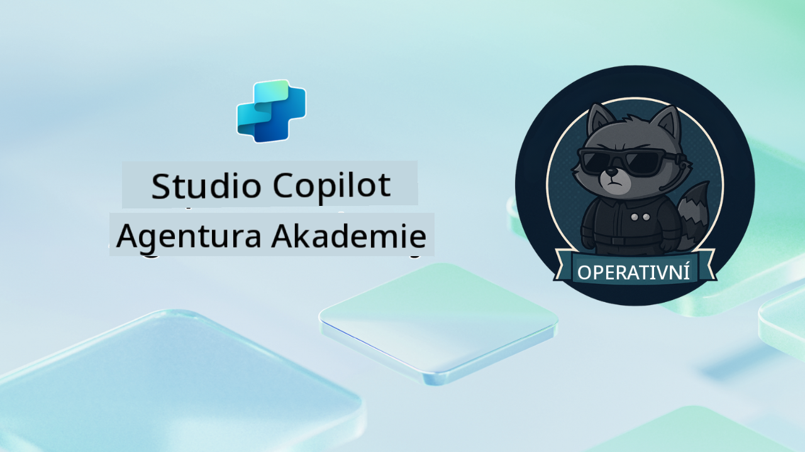

<!--
CO_OP_TRANSLATOR_METADATA:
{
  "original_hash": "24fcbe9a57d3439e05f8866e550c0a84",
  "translation_date": "2025-10-20T17:53:05+00:00",
  "source_file": "docs/operative-preview/README.md",
  "language_code": "cs"
}
-->
# Vítejte, Operative

**Vítejte, Operative.**  
Vaše pokročilá mise—pokud ji přijmete—je zvládnout umění vytváření **podnikových systémů s více agenty** pomocí **Microsoft Copilot Studio**.

Tento intenzivní výcvik vás zavede za hranice základního vytváření agentů do sofistikovaného světa **orchestrace více agentů**: od automatizace náboru po bezpečnost AI. Naučíte se budovat, koordinovat a nasazovat inteligentní ekosystémy agentů na základě reálných podnikových scénářů.

--8<-- "disclaimer.md"

---

## 🎯 Cíl mise

Po absolvování programu Agent Academy Operative budete schopni:

- Navrhovat a implementovat **systémy s více agenty** pro složité obchodní scénáře
- Ovládnout **orchestraci agentů** a vzory spolupráce
- Implementovat **bezpečnost AI a moderaci obsahu** v produkčních systémech
- Vytvářet **multimodální výzvy** pro zpracování a analýzu dokumentů
- Nasazovat **podnikové agenty** s odpovídající správou a testováním

---

## 🧪 Požadavky

Pro splnění všech misí budete potřebovat:

- Absolvovaný výcvik **Agent Academy Recruit**
- Prostředí Microsoft Power Platform s licencí **Copilot Studio**
- Přístup k **Microsoft Dataverse**
- Administrátorská oprávnění pro vytváření řešení a agentů

---

## 🧬 Pro koho je kurz určen

Tento pokročilý kurz je ideální pro:

- **Architekty řešení**, kteří navrhují podnikové AI systémy
- **Vývojáře**, kteří vytvářejí produkčně připravené řešení agentů
- **IT profesionály**, kteří implementují správu a bezpečnost AI
- **Obchodní analytiky**, kteří vytvářejí složité automatizační pracovní postupy
- Každého, kdo je připraven **posunout se** od základních agentů k podnikovým systémům

---

## 🧭 Přehled kurikula

Tato akademie je strukturována jako postupná série operací v terénu—každá mise navazuje na předchozí a vytváří komplexní systém automatizace náboru.

| Mise | Název | Stručný popis operace |
|------|-------|-----------------------|
| `01` | 🚨 [Začínáme s náborovým agentem](./01-get-started/README.md) | Nasazení základní infrastruktury a vytvoření centrálního orchestrujícího agenta |
| `02` | 🎭 [Připravte svého agenta na spolupráci s dalšími agenty](./02-multi-agent/README.md) | Přeměna jednoho agenta na koordinovaný systém s více agenty |
| `03` | ⚡ [Automatizace agenta pomocí Triggerů](./03-automate-triggers/README.md) | Implementace autonomního chování agenta pomocí událostmi řízených triggerů |
| `04` | 📝 [Vytváření pokynů pro agenta](./04-agent-instructions/README.md) | Ovládnutí přesné komunikace a řízení chování agenta |
| `05` | 💬 [Personalizace odpovědí agenta](./05-agent-responses/README.md) | Přizpůsobení odpovědí agenta pro maximální dopad a zapojení |
| `06` | 🛡️ [Základy moderace obsahu a bezpečnosti AI](./06-ai-safety/README.md) | Implementace bezpečnostních a compliance opatření na podnikové úrovni |
| `07` | 🎨 [Extrahování obsahu životopisů pomocí multimodálních výzev](./07-multimodal-prompts/README.md) | Zpracování dokumentů a obrázků pomocí pokročilých AI schopností |
| `08` | 🗄️ [Výzvy - Ukotvení v Dataverse](./08-dataverse-grounding/README.md) | Ukotvení agentů v podnikových datech pro přesné odpovědi |
| `09` | 🧠 [Použití hlubokého uvažování k hodnocení vhodnosti kandidátů a přípravě na pohovor](./09-deep-reasoning/README.md) | Implementace sofistikovaného AI uvažování pro složitá rozhodnutí |
| `10` | 📄 [Generování dokumentů specifických pro kandidáty pomocí výzev](./10-generate-documents/README.md) | Vytváření dynamických dokumentů na základě analýzy agenta |
| `11` | 📊 [Získávání zpětné vazby od uživatelů pomocí adaptivních karet](./11-obtain-user-feedback/README.md) | Sbírání a zpracování zpětné vazby od uživatelů pro neustálé zlepšování |
| `12` | 🌐 [Publikování vašich agentů na demo webu pro testování zainteresovanými stranami](./12-demo-website/README.md) | Nasazení kompletního řešení pro demonstraci a testování zainteresovanými stranami |

!!! note
    ✅ Dokončení tohoto kurikula vám přinese odznak **Operative**.  
    🔓 **Commander** bude odemčen v budoucích fázích.

<!-- markdownlint-disable-next-line MD033 -->

---

**Prohlášení**:  
Tento dokument byl přeložen pomocí služby AI pro překlady [Co-op Translator](https://github.com/Azure/co-op-translator). Ačkoli se snažíme o přesnost, mějte prosím na paměti, že automatizované překlady mohou obsahovat chyby nebo nepřesnosti. Původní dokument v jeho rodném jazyce by měl být považován za autoritativní zdroj. Pro důležité informace se doporučuje profesionální lidský překlad. Neodpovídáme za žádná nedorozumění nebo nesprávné interpretace vyplývající z použití tohoto překladu.