<!--
CO_OP_TRANSLATOR_METADATA:
{
  "original_hash": "d9cd8cd1a4fbd8915171a2ed972cc322",
  "translation_date": "2025-10-20T17:19:32+00:00",
  "source_file": "docs/recruit/00-course-setup/README.md",
  "language_code": "cs"
}
-->
# 🚨 Mise 00: Nastavení kurzu

## 🕵️‍♂️ KRYCÍ NÁZEV: `OPERACE PŘIPRAVENOST NA NASAZENÍ`

> **⏱️ Časový rámec operace:** `~30 minut`  

## 🎯 Popis mise

Vítejte na první misi vašeho výcviku jako agenta Copilot Studio.  
Než začnete vytvářet svého prvního AI agenta, musíte si nastavit **vývojové prostředí připravené na provoz**.

Tento dokument obsahuje přehled systémů, přístupových údajů a kroků nastavení, které jsou nezbytné pro úspěšné fungování v ekosystému Microsoft 365.

## 🔎 Cíle

Vaše mise zahrnuje:

1. Získání účtu Microsoft 365  
1. Získání přístupu k Microsoft Copilot Studio  
1. (Volitelné) Zajištění licence Microsoft 365 Copilot pro publikování v produkčním prostředí  
1. Vytvoření vývojového prostředí jako vašeho prostředí Copilot Studio  
1. Vytvoření SharePoint webu, který bude sloužit jako váš zdroj dat v pozdějších misích

---

## 🔍 Předpoklady

Než začnete, ujistěte se, že máte:

1. **Pracovní nebo školní e-mailovou adresu** (osobní @outlook.com, @gmail.com apod. nejsou podporovány).
1. Přístup k internetu a moderní prohlížeč (doporučujeme Edge, Chrome nebo Firefox).  
1. Základní znalosti Microsoft 365 (například přihlášení do aplikací Office nebo Teams).  
1. (Volitelné) Kreditní kartu nebo platební metodu, pokud plánujete zakoupit placené licence.

---

## Krok 1: Získejte účet Microsoft 365

Copilot Studio se nachází v rámci Microsoft 365, takže k jeho přístupu potřebujete účet Microsoft 365. Můžete použít existující účet, pokud ho máte, nebo postupovat podle těchto kroků k získání vhodné licence:

1. **Získejte placené předplatné Microsoft 365 Business**  
   1. Přejděte na [Stránku plánů a cen Microsoft 365 Business](https://www.microsoft.com/microsoft-365/business/microsoft-365-plans-and-pricing)
   1. Nejlevnější možností, jak začít, je plán Microsoft 365 Business Basic. Vyberte `Vyzkoušet zdarma` a projděte průvodce vyplněním údajů o předplatném, účtu a platbě.
   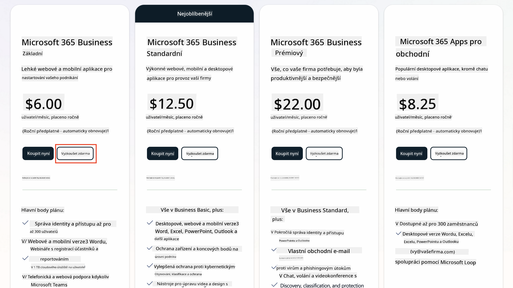
   1. Jakmile budete mít nový účet, přihlaste se.

    !!! Tip
        Pokud plánujete publikovat agenty do Microsoft 365 Copilot Chat nebo připojit k organizačním datům (SharePoint, OneDrive, Dataverse), je nutná licence Microsoft 365 Copilot. Jedná se o doplňkovou licenci, o které se můžete dozvědět více [na stránce o licencování](https://www.microsoft.com/microsoft-365/copilot#plans)

---

## Krok 2: Spusťte zkušební verzi Copilot Studio

Jakmile budete mít svůj Microsoft 365 Tenant, musíte získat přístup k Copilot Studio. Bezplatnou 30denní zkušební verzi můžete získat podle těchto kroků:

1. Přejděte na [aka.ms/TryCopilotStudio](https://aka.ms/TryCopilotStudio).  
1. Zadejte e-mailovou adresu z nově vytvořeného účtu a vyberte `Další`.  
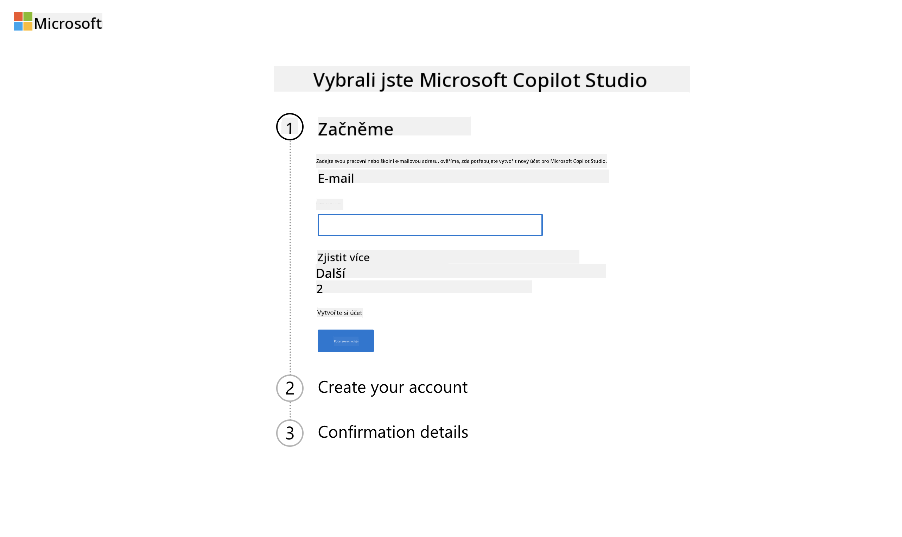
1. Systém by měl váš účet rozpoznat. Vyberte `Přihlásit se`.
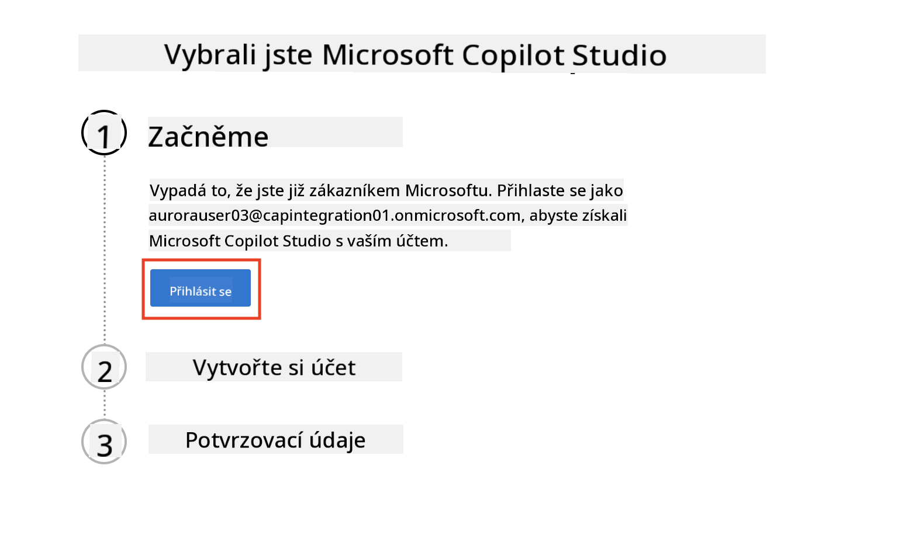  
1. Vyberte `Spustit bezplatnou zkušební verzi`.
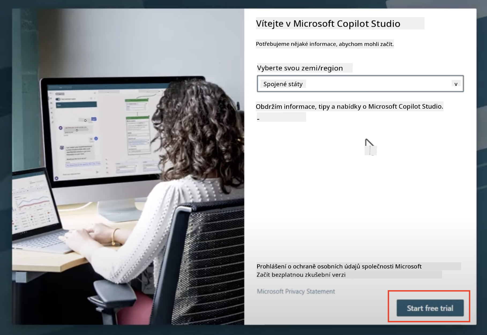

!!! info "Poznámky ke zkušební verzi"  
     1. Bezplatná zkušební verze poskytuje **plné funkce Copilot Studio**.
     1. Obdržíte e-mailová upozornění o vypršení platnosti zkušební verze. Zkušební verzi můžete prodloužit o dalších 30 dní (až na 90 dní provozu agenta).  
     1. Pokud váš správce tenantu zakázal samoobslužnou registraci, zobrazí se chyba—kontaktujte svého správce Microsoft 365, aby ji znovu povolil.

---

## Krok 3: Vytvořte nové vývojové prostředí

### Zaregistrujte se do plánu Power Apps Developer

Pomocí stejného tenantu Microsoft 365 z kroku 1 se zaregistrujte do plánu Power Apps Developer, abyste vytvořili bezplatné vývojové prostředí pro tvorbu a testování s Copilot Studio.

1. Zaregistrujte se na [webu plánu Power Apps Developer](https://aka.ms/PowerAppsDevPlan).

    - Zadejte svou e-mailovou adresu
    - Zaškrtněte políčko
    - Vyberte **Spustit zdarma**

    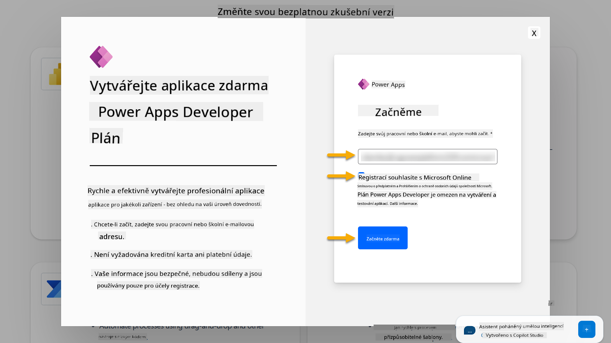

1. Po registraci do plánu Developer budete přesměrováni na [Power Apps](https://make.powerapps.com/). Prostředí bude mít vaše jméno, například **Prostředí Adele Vance**. Pokud již existuje prostředí s tímto názvem, nové vývojové prostředí bude pojmenováno **Prostředí Adele Vance (1)**.

    Toto vývojové prostředí použijte v Copilot Studio při plnění úkolů.

!!! Note
    Pokud používáte existující účet Microsoft 365 a nevytvořili jste si nový v kroku 1, například - používáte svůj vlastní účet ve své pracovní organizaci, váš IT administrátor (nebo ekvivalentní tým) spravující váš tenant/prostředí mohl proces registrace vypnout. V takovém případě kontaktujte svého administrátora nebo vytvořte testovací tenant podle kroku 1.

---

## Krok 4: Vytvořte nový SharePoint web

Je třeba vytvořit nový SharePoint web, který bude použit v [Lekci 06 - Vytvoření vlastního agenta pomocí konverzačního prostředí s Copilotem a jeho propojení s vašimi daty](../06-create-agent-from-conversation/README.md#62-add-an-internal-knowledge-source-using-a-sharepoint-site).

1. Klikněte na ikonu "vafle" v levém horním rohu Microsoft Copilot Studio pro zobrazení nabídky. Z nabídky vyberte SharePoint.

    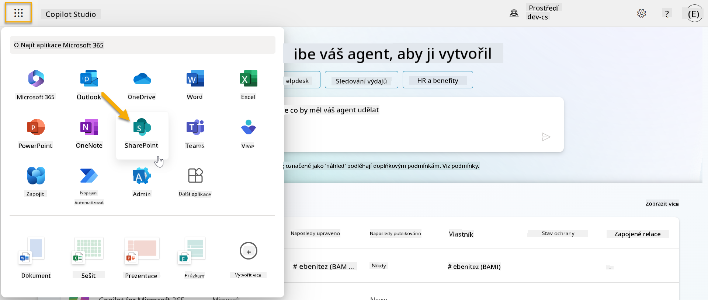

1. SharePoint se načte. Vyberte **+ Vytvořit web** pro vytvoření nového SharePoint webu.

    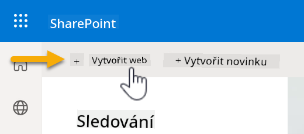

1. Zobrazí se dialogové okno, které vás provede vytvořením nového SharePoint webu. Vyberte **Týmový web**.

    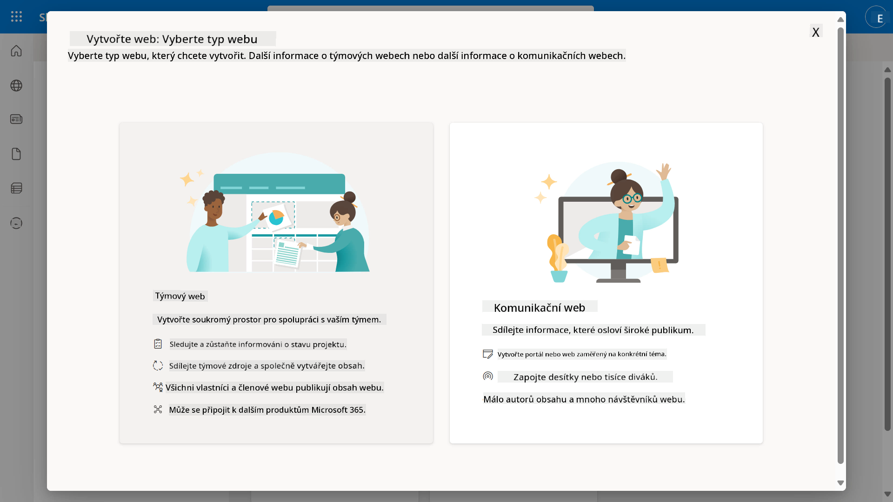

1. V dalším kroku se automaticky načte seznam šablon Microsoft. Posuňte se dolů a vyberte šablonu **IT help desk**.

    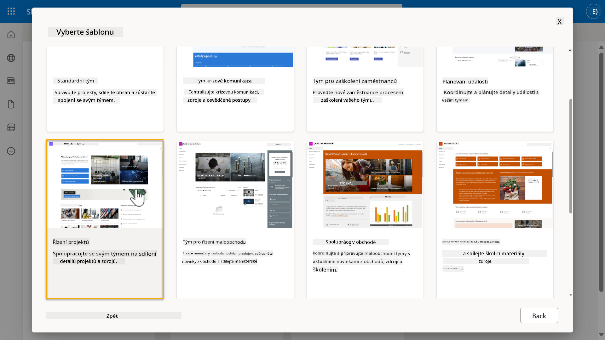

1. Vyberte **Použít šablonu** pro vytvoření nového SharePoint webu pomocí šablony IT help desk.

    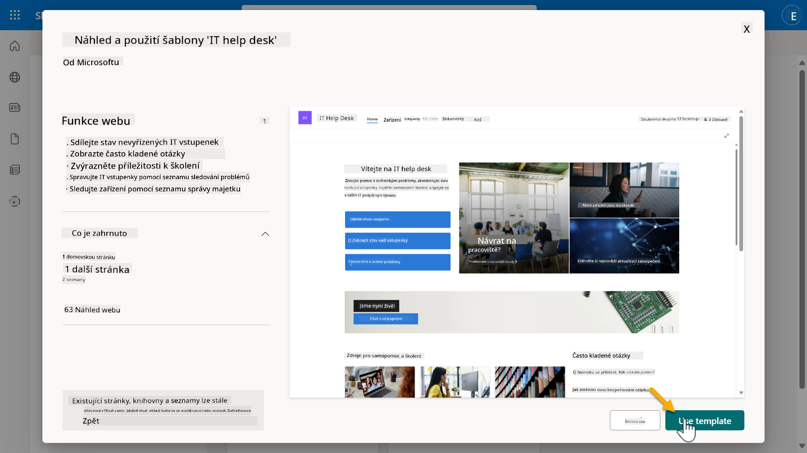

1. Zadejte informace o svém webu. Následuje příklad:

    | Pole | Hodnota |
    | --- | --- |
    | Název webu | Contoso IT |
    | Popis webu | Copilot Studio pro začátečníky |
    | Adresa webu | ContosoIT |

    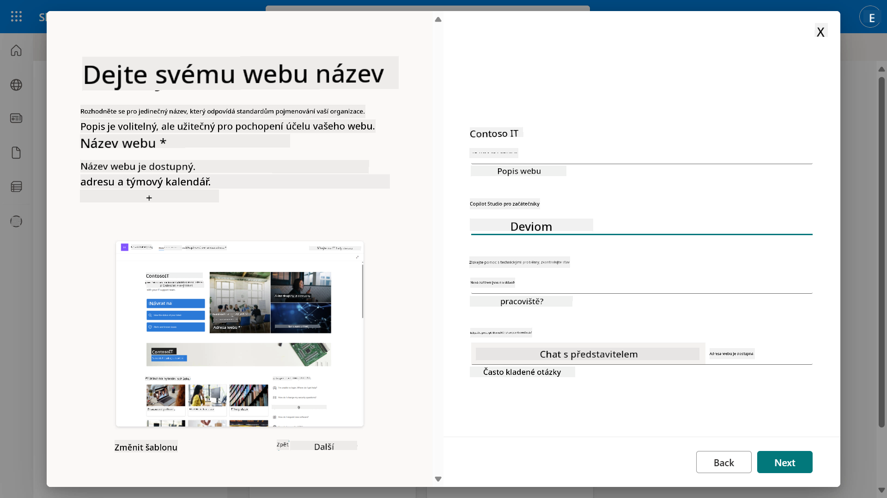

1. V posledním kroku můžete vybrat jazyk pro SharePoint web. Ve výchozím nastavení bude **Angličtina**. Nechte jazyk jako **Angličtina** a vyberte **Vytvořit web**.

    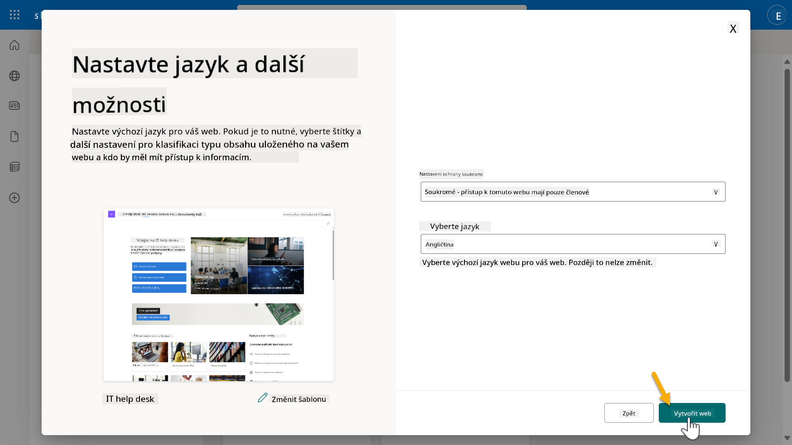

1. SharePoint web se bude několik sekund vytvářet. Mezitím můžete přidat další uživatele na svůj web zadáním jejich e-mailové adresy do pole **Přidat členy**. Po dokončení vyberte **Dokončit**.

    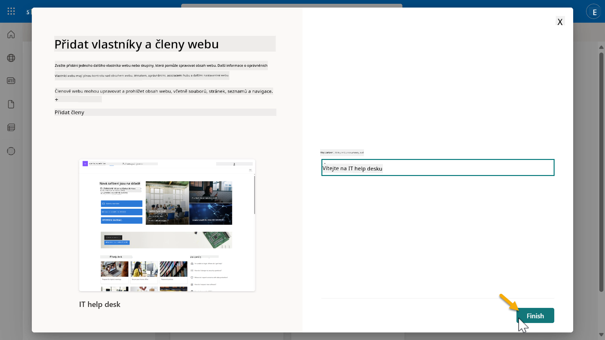

1. Následně se načte domovská stránka SharePoint webu. **Zkopírujte** URL adresu SharePoint webu.

1. Tato šablona poskytuje stránky se vzorovými daty o různých IT politikách a dva vzorové seznamy (Požadavky a Zařízení).

### Použijte seznam Zařízení v SharePointu

Použijeme seznam **Zařízení** v [Misi 07 - Přidání nového tématu s triggerem a uzly](../07-add-new-topic-with-trigger/README.md#73-add-a-tool-using-a-connector).

### Přidání nového sloupce

Posuňte se na pravou stranu seznamu a vyberte tlačítko **+ Přidat sloupec**. Zvolte typ **hyperlink**, zadejte **Obrázek** jako název sloupce a vyberte přidat.

### Vytvoření vzorových dat v seznamu Zařízení v SharePointu

Ujistěte se, že tento seznam obsahuje alespoň 4 vzorové položky dat a přidejte do tohoto seznamu jeden další sloupec.  

Při přidávání vzorových dat se ujistěte, že jsou vyplněna následující pole:

- Fotografie zařízení - použijte obrázky z [složky obrázků zařízení](https://github.com/microsoft/agent-academy/tree/main/docs/recruit/00-course-setup/images/device-images)
- Název
- Stav
- Výrobce
- Model
- Typ zařízení
- Barva
- Sériové číslo
- Datum nákupu
- Cena nákupu
- Číslo objednávky
- Obrázek - použijte následující odkazy

|Zařízení  |URL  |
|---------|---------|
|Surface Laptop 13     | [https://raw.githubusercontent.com/microsoft/agent-academy/refs/heads/main/docs/recruit/00-course-setup/images/device-images/Surface-Laptop-13.png](https://raw.githubusercontent.com/microsoft/agent-academy/refs/heads/main/docs/recruit/00-course-setup/images/device-images/Surface-Laptop-13.png)        |
|Surface Laptop 15     | [https://raw.githubusercontent.com/microsoft/agent-academy/refs/heads/main/docs/recruit/00-course-setup/images/device-images/Surface-Laptop-15.png](https://raw.githubusercontent.com/microsoft/agent-academy/refs/heads/main/docs/recruit/00-course-setup/images/device-images/Surface-Laptop-15.png)        |
|Surface Pro    | [https://raw.githubusercontent.com/microsoft/agent-academy/refs/heads/main/docs/recruit/00-course-setup/images/device-images/Surface-Pro-12.png](https://raw.githubusercontent.com/microsoft/agent-academy/refs/heads/main/docs/recruit/00-course-setup/images/device-images/Surface-Pro-12.png)        |
|Surface Studio    | [https://raw.githubusercontent.com/microsoft/agent-academy/refs/heads/main/docs/recruit/00-course-setup/images/device-images/Surface-Studio.png](https://raw.githubusercontent.com/microsoft/agent-academy/refs/heads/main/docs/recruit/00-course-setup/images/device-images/Surface-Studio.png)        |

---

## ✅ Mise splněna

Úspěšně jste:

- Nastavili vývojové prostředí Microsoft 365  
- Aktivovali zkušební verzi Copilot Studio  
- Vytvořili SharePoint web pro propojení agentů  
- Naplnili seznam Zařízení pro použití v budoucích misích

Jste oficiálně připraveni začít svůj **výcvik na úrovni Rekrut** v [Lekci 01](../01-introduction-to-agents/README.md).  

<!-- markdownlint-disable-next-line MD033 -->

---

**Prohlášení**:  
Tento dokument byl přeložen pomocí služby AI pro překlady [Co-op Translator](https://github.com/Azure/co-op-translator). I když se snažíme o přesnost, mějte prosím na paměti, že automatizované překlady mohou obsahovat chyby nebo nepřesnosti. Původní dokument v jeho původním jazyce by měl být považován za autoritativní zdroj. Pro důležité informace se doporučuje profesionální lidský překlad. Neodpovídáme za žádná nedorozumění nebo nesprávné interpretace vyplývající z použití tohoto překladu.