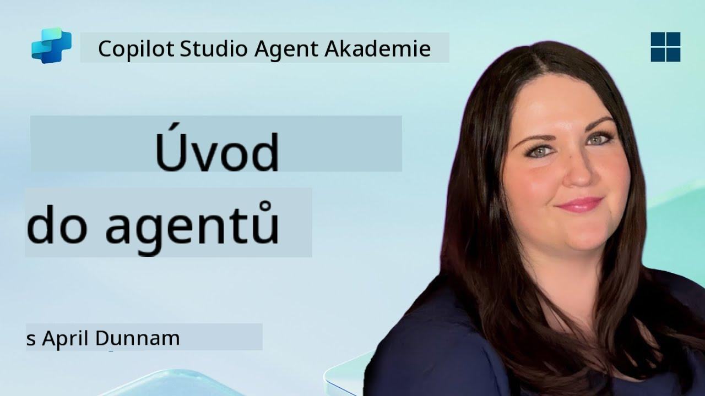

<!--
CO_OP_TRANSLATOR_METADATA:
{
  "original_hash": "d6706e107678264168d77b2e107710b1",
  "translation_date": "2025-10-20T17:45:27+00:00",
  "source_file": "docs/recruit/01-introduction-to-agents/README.md",
  "language_code": "cs"
}
-->
# 🚨 Mise 01: Úvod do agentů

## 🕵️‍♂️ KRYCÍ JMÉNO: `OPERACE DEKÓDOVÁNÍ AI AGENTA`

> **⏱️ Časový rámec operace:** `~30 minut – pouze informace, žádná terénní práce není nutná`

🎥 **Podívejte se na průvodce**

## 🎯 Úkol mise

Vítejte, rekrute. Než se pustíme do vytváření agentů, je důležité pochopit základní koncepty AI, které je pohánějí. Tato mise vás vybaví základními znalostmi o konverzační AI, velkých jazykových modelech (LLMs), generování s podporou vyhledávání (RAG) a typech agentů, které můžete vytvořit v Copilot Studio.

## 🔎 Cíle

V této misi se naučíte:

1. Co je konverzační AI a proč je důležitá  
1. Jak velké jazykové modely (LLMs) pohánějí chatovací zážitky  
1. Co přináší generování s podporou vyhledávání (RAG)  
1. Rozdíl mezi konverzačními agenty a autonomními agenty  
1. Jak agenti v Copilot Studio využívají tyto koncepty  

Pojďme na to!

---

## Co je konverzační AI?

Konverzační AI označuje jakýkoli systém, který dokáže rozumět, zpracovávat a reagovat na lidský jazyk – ať už textový nebo mluvený – způsobem, který působí přirozeně. Představte si chatboty na zákaznické podpoře nebo virtuální osobní asistenty ve vašich oblíbených aplikacích. V zákulisí většina moderních konverzačních AI spoléhá na velké jazykové modely (LLMs), které si podrobněji představíme dále.

### Proč je důležitá

- **Uživatelský zážitek:** Konverzační rozhraní jsou často intuitivnější než proklikávání menu.  
- **Škálovatelnost:** Jeden agent může zvládnout desítky nebo stovky současných konverzací.  
- **Efektivita:** Místo vytváření vlastních skriptů založených na pravidlech se agenti pohánění LLM přizpůsobují uživatelským vstupům.  
- **Rozšiřitelnost:** S vhodným designem mohou agenti čerpat z databází znalostí, připojovat se k API nebo fungovat jako „digitální spolupracovníci“ v pracovních procesech.

---

## Velké jazykové modely (LLMs) 101

Základem většiny konverzačních AI systémů jsou **velké jazykové modely** – neuronové sítě trénované na obrovských textových korpusech. Učí se statistické vzory jazyka, aby mohly generovat smysluplné věty, odpovídat na otázky nebo dokonce přicházet s nápady. Klíčové body k pochopení:

1. **Tréninková data:** LLMs zpracovávají terabajty textu (webové stránky, knihy, články). Tato „světová znalost“ jim umožňuje reagovat na mnoho témat.  
1. **Tokenizace:** Text je rozdělen na menší jednotky zvané tokeny (slova, části slov nebo znaky). Model předpovídá jeden token za druhým.  
1. **Okno kontextu:** Každý LLM má limit na počet tokenů, které může „vidět“ najednou. Po překročení tohoto limitu se předchozí tokeny zkracují.  
1. **Prompting:** S LLM komunikujete zasláním výzvy (promptu). Čím lepší je váš prompt, tím více zaměřená a relevantní bude odpověď.  
1. **Zero-shot vs. Fine-tuning:** Zero-shot znamená použití LLM tak, jak je (jen surové váhy). Fine-tuning znamená přizpůsobení modelu na specifická data, aby odpovídal přesněji vašim potřebám.

!!! Tip "Profesionální tip"
    Běžná analogie je, že LLM je jako „super chytré automatické doplňování“. Nechápe skutečný význam jako lidský mozek, ale je extrémně dobré v předpovídání dalšího nejlepšího slova (nebo fráze) v sekvenci.

---

## Generování s podporou vyhledávání (RAG)

Když se LLMs spoléhají pouze na statická tréninková data, mohou halucinovat nebo zastarávat. RAG to řeší tím, že modelu umožní „vyhledat“ aktuální informace před sestavením odpovědi. Na vysoké úrovni funguje RAG takto:

1. **Dotaz uživatele:** Uživatel položí otázku (např. „Jaké jsou nejnovější výsledky Contoso za čtvrtletí?“).  
1. **Krok vyhledávače:** Systém prohledá zdroj znalostí (dokumenty, interní databáze, knihovny SharePointu atd.) a najde relevantní pasáže.  
1. **Augmentace:** Nalezené pasáže se připojí k promptu LLM (před nebo za).  
1. **Generování:** LLM zpracuje jak otázku uživatele, tak získaný kontext a vytvoří odpověď založenou na aktuálních datech.  

S RAG může váš agent čerpat z interních firemních wiki, plugin API nebo prohledávat databázi FAQ – a vracet odpovědi, které nejsou omezeny na staticky publikované parametry modelu.

---

## Konverzační vs. autonomní agenti

V kontextu Copilot Studio může termín **agent** označovat různé typy AI asistentů. Je užitečné rozlišit:

**Konverzační agenti:**

- Zaměřují se primárně na obousměrný dialog.  
- Uchovávají kontext napříč několika kroky konverzace.  
- Obvykle jsou řízeni předem definovanými toky nebo spouštěči (např. „Pokud uživatel řekne X, odpověz Y“).  
- Ideální pro zákaznickou podporu, FAQ, řízené interakce, plánování nebo jednoduché otázky a odpovědi.  
  - Příklady:
    - Chatbot v Teams, který odpovídá na otázky ohledně HR politiky.  
    - Bot Power Virtual Agents na stránce SharePointu, který uživatele provede formulářem.  

**Autonomní agenti:**

- Jdou nad rámec konverzace; mohou **provádět akce** jménem uživatele.  
- Používají smyčky logiky LLM (představte si „plán → akce → pozorování → přeplánování“) k dokončení úkolů.  
- Připojují se k externím nástrojům nebo API (např. spustí tok Power Automate, pošlou pozvánky do kalendáře, manipulují s daty v Dataverse).  
- Fungují bez neustálých podnětů od člověka – jakmile jsou spuštěni, mohou autonomně zvládnout vícekrokové procesy.  
  - Příklady:  
    - Agent, který vytvoří itinerář cesty, rezervuje letenky a pošle potvrzení e-mailem.  
    - Agent „Shrnutí schůzky“, který se připojí k hovoru v Teams, přepisuje ho v reálném čase a vytvoří výkonný souhrn do OneNote.  

!!! Info "Klíčový rozdíl"
    Konverzační agenti čekají na vstup uživatele a drží se dialogu. Autonomní agenti proaktivně plánují a provádějí sekvenci kroků s širším přístupem k nástrojům.

---

## Agenti v Copilot Studio

**Copilot Studio** sjednocuje jak konverzační, tak autonomní scénáře pod jedním rámcem. Zde je, jak Copilot Studio pomáhá při vytváření agentů:

1. **Vizuální návrhář agentů:** Nástroj s nízkým kódem pro definování promptů, paměti a nástrojů pro chatovací i akční pracovní postupy.  
1. **Konfigurace LLM:** Výběr z různých modelů OpenAI nebo podnikových GPT od Microsoftu, které odpovídají vašim požadavkům na výkon a náklady.  
1. **Konektory pro vyhledávání:** Předem připravené integrace pro SharePoint, OneDrive, Azure Cognitive Search a Dataverse, umožňující RAG bez nutnosti dalšího nastavení.  
1. **Vlastní nástroje a funkce:** Definujte vlastní HTTP akce nebo toky Power Automate, které váš agent může autonomně spustit.  
1. **Podpora multimodálních dat:** Kromě textu mohou agenti Copilot Studio zpracovávat obrázky, soubory nebo strukturovaná data pro obohacení kontextu.  
1. **Publikování a distribuce:** Jakmile je váš agent připraven, můžete ho publikovat do Microsoft 365 Copilot (aby ho uživatelé mohli spustit v Teams, SharePointu, Outlooku atd.) nebo ho vložit jako samostatný chatovací widget na webovou stránku.

---

## 🎉 Mise splněna

Nyní jste dokončili svůj úvod do agentů a základních konceptů AI. Rozumíte:

1. **LLMs = „Mozek“ vašeho agenta**  
   - Zodpovědný za porozumění jazyku a jeho generování.  
   - Více tokenů = bohatší kontext, ale také vyšší náklady na volání.  

1. **RAG = Integrace aktuálních znalostí**  
   - Překonává propast mezi statickým LLM a neustále se měnícími zdroji dat.  
   - Vyhledává a vkládá relevantní dokumenty nebo záznamy do promptu LLM.  

1. **Konverzační vs. autonomní**  
   - **Konverzační:** Zaměřují se na tok dialogu a uchovávání kontextu (např. „Paměť relace“).  
   - **Autonomní:** Přidávají „Akční bloky“, které umožňují agentovi volat externí nástroje nebo služby.

---
Dále se podíváte na [základy Copilot Studio](../02-copilot-studio-fundamentals/README.md)!

Buďte ve střehu, rekrute – vaše cesta AI teprve začíná!

## 📚 Taktické zdroje

🔗 [Domovská stránka dokumentace Copilot Studio](https://learn.microsoft.com/microsoft-copilot-studio/)

---

<!-- markdownlint-disable-next-line MD033 -->

---

**Prohlášení**:  
Tento dokument byl přeložen pomocí služby AI pro překlad [Co-op Translator](https://github.com/Azure/co-op-translator). Ačkoli se snažíme o přesnost, mějte prosím na paměti, že automatizované překlady mohou obsahovat chyby nebo nepřesnosti. Původní dokument v jeho rodném jazyce by měl být považován za autoritativní zdroj. Pro důležité informace se doporučuje profesionální lidský překlad. Neodpovídáme za žádná nedorozumění nebo nesprávné interpretace vyplývající z použití tohoto překladu.