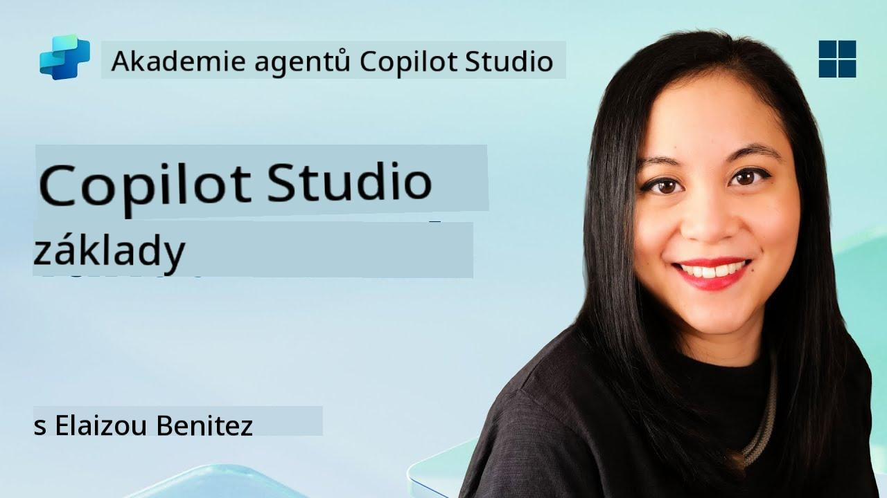
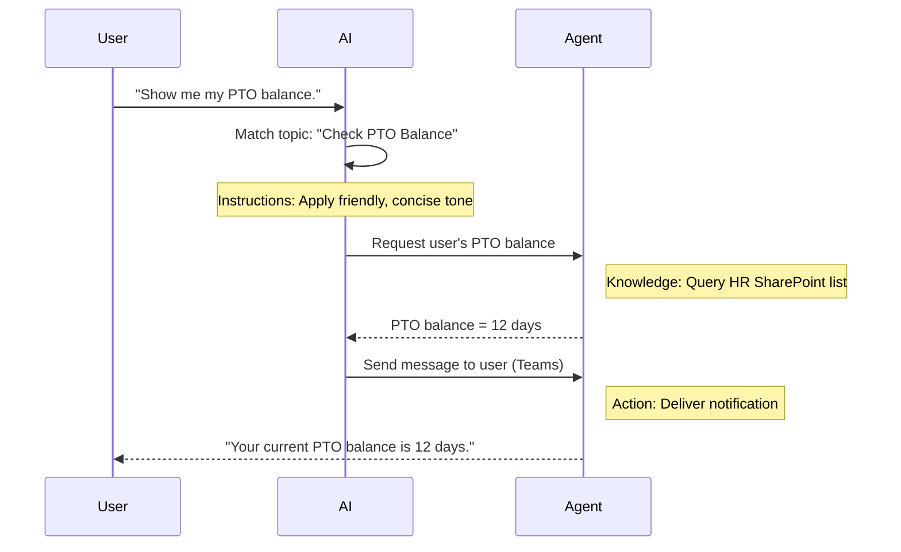

<!--
CO_OP_TRANSLATOR_METADATA:
{
  "original_hash": "90a3c5122f5687bbc8cc819990f175d4",
  "translation_date": "2025-10-20T17:46:59+00:00",
  "source_file": "docs/recruit/02-copilot-studio-fundamentals/README.md",
  "language_code": "cs"
}
-->
# 🚨 Mise 02: Základy Copilot Studio

## 🕵️‍♂️ KRYCÍ NÁZEV: `OPERACE JÁDROVÝ PROTOKOL`

> **⏱️ Časový rámec operace:** `~30 minut – pouze informace, žádná terénní práce`  

🎥 **Podívejte se na průvodce**

[](https://www.youtube.com/watch?v=x4OCwDRGeLE "Podívejte se na průvodce na YouTube")

## 🎯 Úkol mise

Vítejte, rekrute. Tato mise vás vybaví základními informacemi o tom, jak funguje Copilot Studio a jak vytvořit inteligentní agenty, kteří přinášejí skutečnou hodnotu pro podnikání.

Než začnete vytvářet svého prvního agenta, musíte pochopit čtyři klíčové komponenty, které tvoří každého vlastního AI agenta: Znalosti, Nástroje, Témata a Pokyny. Také se dozvíte, jak tyto prvky spolupracují v orchestrátoru Copilot Studio.

## 🔎 Cíle

V této misi se naučíte:

- **Co je Copilot Studio**
- **Kdy a proč používat agenty**
- **Prozkoumat čtyři stavební bloky agentů**
      - **Znalosti**
      - **Nástroje**
      - **Témata**
      - **Pokyny**
- **Pochopit, jak tyto komponenty spolupracují** při vytváření inteligentního, automatizovaného agenta

---

## Co jsou agenti v Copilot Studio?

**Agent** je specializovaný AI asistent, kterého navrhnete pro zvládání konkrétních úkolů nebo dotazů. Na rozdíl od obecného chatbotu váš agent:

- **Zná specifická data společnosti** (politiky, dokumenty, databáze)  
- **Provádí úkoly v reálném světě** (posílání zpráv, vytváření událostí v kalendáři, aktualizace záznamů)  
- **Udržuje kontext konverzace**, takže může navázat na předchozí otázky  

Protože Copilot Studio je nízkokódové, můžete přetahovat předpřipravené komponenty – nejsou potřeba hluboké znalosti programování. Jakmile je váš agent vytvořen, lidé ho mohou využívat v Teams, Slacku nebo dokonce na vlastních webových stránkách, aby získali odpovědi nebo automaticky spustili pracovní postupy.

---

## Kdy a proč používat Copilot Studio

Zatímco Microsoft 365 Copilot poskytuje obecnou AI asistenci napříč aplikacemi Office, vlastní agent se hodí, když:

### Potřebujete znalosti specifické pro danou oblast

- Standardní Copilot nemusí znát interní postupy nebo data vaší společnosti. Agent může dotazovat vaše SharePoint stránky, databáze nebo vlastní zdroje, aby poskytl přesné a aktuální odpovědi.  

### Chcete automatizovat vícekrokové pracovní postupy

- Například: "Když někdo podá žádost o výdaj, pošlete ji ke schválení, aktualizujte finanční tracker a informujte manažera." Vlastní agent může zvládnout každý krok, spuštěný jediným příkazem nebo událostí.  

### Potřebujete kontextový zážitek přímo v nástroji  

- Představte si agenta pro onboarding nových zaměstnanců v Teams, který provede HR tým všemi politikami, pošle potřebné formuláře a naplánuje orientační schůzky – přímo v existující platformě pro spolupráci.  

---

## Čtyři stavební bloky agenta

Každý agent v Copilot Studio je postaven ze čtyř základních komponent:

1. **Znalosti**  
1. **Nástroje (Akce)**  
1. **Témata**  
1. **Pokyny**

Níže definujeme každý stavební blok a ukážeme, jak spolupracují na vytvoření efektivního agenta.

### 1. Znalosti

**Znalosti** jsou data a kontext, které váš agent používá k přesnému zodpovídání otázek. Mají dvě části:

#### Vlastní pokyny a kontext

- Napíšete stručný popis účelu a tónu agenta. Například:  

    ```text
    You are an IT support agent. You help employees troubleshoot common software issues, provide troubleshooting steps, and escalate urgent tickets.
    ```

- Během konverzace si agent pamatuje předchozí kroky, takže se může odkazovat na to, co již bylo diskutováno (například pokud uživatel nejprve řekne: "Moje tiskárna nefunguje," a později se zeptá: "Zkontrolovali jste hladinu inkoustu?" agent si pamatuje kontext tiskárny).

#### Zdroje znalostí (Podkladová data)

- Připojíte svého agenta k několika datovým zdrojům – knihovnám SharePoint, dokumentačním stránkám, wiki nebo jiným databázím.  
- Když se uživatel na něco zeptá, agent vytáhne relevantní výňatky z těchto zdrojů, takže odpovědi jsou **podložené** skutečnými politikami, manuály produktů nebo jakýmkoli vlastním informacemi vaší organizace.  
- Můžete dokonce přinutit agenta, aby odpovídal pouze na základě těchto zdrojů, čímž zabráníte, aby si odpovědi "vymýšlel" nebo "halucinoval".

!!! example
    Agent "Asistent pro politiky" by se mohl připojit k vašemu HR SharePointu. Pokud se uživatel zeptá: "Jaká je naše míra akumulace PTO?" agent získá přesný text z dokumentu HR politiky místo spoléhání se na obecnou AI odpověď.

---

### 2. Nástroje (Akce)

**Nástroje (Akce)** definují, co agent může dělat nad rámec konverzace. Každá akce je úkol, který agent provádí programově, například:

- Posílání e-mailu nebo zprávy v Teams  
- Vytváření nebo aktualizace události v kalendáři  
- Přidávání nebo úprava záznamu v databázi (např. seznamu SharePoint nebo tabulce Dataverse)  
- Volání Power Automate flow nebo REST API  

#### Jak akce fungují

- **Definování vstupů a výstupů**  
      - Například akce Poslat e-mail může vyžadovat:  
        - `Emailová adresa příjemce`  
        - `Předmět`  
        - `Tělo e-mailu`  

- **Kombinování akcí do pracovních postupů**  
      - Často splnění požadavku uživatele zahrnuje několik kroků.  
      - Můžete sekvencovat akce tak, aby:  
             1. Agent získal data ze seznamu SharePoint.  
             2. Vytvořil souhrn pomocí LLM.  
             3. Poslal zprávu v Teams s tímto souhrnem.  

- **Připojení k externím systémům**  
      - Pokud potřebujete aktualizovat CRM nebo volat interní API, vytvořte vlastní akci, která to zvládne.  
      - Copilot Studio se může integrovat s Power Platform nebo jakýmkoli HTTP-based endpointem.

!!! example "Agent "Pomocník pro výdaje" by mohl:"  
    1. Poslouchat požadavek "Podat žádost o výdaj".  
    2. Získat detaily výdaje uživatele z formuláře.  
    3. Použít akci "Přidat do seznamu SharePoint" k uložení dat.  
    4. Spustit akci "Poslat e-mail" k informování schvalovatele.  

---

### 3. Témata

**Témata** definují konverzační spouštěče nebo vstupní body pro vašeho agenta. Každé téma odpovídá funkci nebo kategorii otázek.

#### Konverzační spouštěče  

- Téma může být "Podat IT tiket," "Zkontrolovat zůstatek dovolené," nebo "Vytvořit prodejní zprávu."  
- V zákulisí používá Copilot Studio **generativní orchestraci**: místo spoléhání na přesná klíčová slova AI interpretuje záměr uživatele a vybere správné téma na základě krátkého popisu, který poskytnete.  

#### Popisy témat  

- V každém tématu napíšete jasný, stručný popis toho, co téma pokrývá.

!!! example "Příklad popisu tématu"
    Toto téma pomáhá uživatelům podat IT tiket tím, že shromažďuje detaily problému, prioritu a kontaktní informace.

- AI používá tento popis k rozhodnutí, kdy aktivovat toto téma, i když formulace uživatele přesně neodpovídá.

#### Mapování témat na akce  

- Každé téma je spojeno s jednou nebo více akcemi nebo kroky pro získání dat.  
- Když AI vybere téma, vede konverzaci podle sekvence, kterou jste definovali (klade doplňující otázky, volá akce, vrací výsledky).

!!! example
    Pokud uživatel řekne: "Potřebuji pomoc s nastavením nového notebooku," AI může přiřadit tento záměr k tématu "Podat IT tiket". Agent pak požádá o model notebooku, detaily uživatele a automaticky vloží tiket do systému technické podpory.

---

### 4. Pokyny

**Pokyny** (někdy nazývané "Prompty" nebo "Systémové zprávy") řídí tón, styl a hranice LLM. Formují, jak agent reaguje v jakékoli situaci.

#### Role a persona  

- Řeknete AI, kdo je (např. "Jste zákaznický servisní agent pro Contoso Retail").  
- To nastaví tón – přátelský, stručný, formální nebo neformální – podle vašeho použití.

#### Pokyny pro odpovědi  

- Specifikujte jakákoliv pravidla, která musí agent dodržovat, například:  
      - "Vždy shrnujte informace o politice v bodech."  
      - "Pokud neznáte odpověď, řekněte: ‘Je mi líto, nemám tuto informaci.’"  
      - "Nikdy nezahrnujte důvěrná data mimo kontext."

#### Pravidla paměti a kontextu

- Můžete instruovat agenta, kolik kroků konverzace si má pamatovat.  
- Například: "Pamatujte si detaily z požadavků tohoto uživatele až na tři následné otázky."

!!! example "V agentovi "Poradce pro benefity" byste mohli zahrnout:"
    "Vždy odkazujte na nejnovější HR příručku při odpovídání na otázky. Pokud se ptají na termíny registrace, poskytněte konkrétní data z politiky. Udržujte odpovědi pod 150 slovy."

---

## Jak čtyři stavební bloky spolupracují

Když sestavíte **Znalosti**, **Nástroje**, **Témata** a **Pokyny**, orchestrátor AI v Copilot Studio vytvoří agenta, který:

1. **Poslouchá relevantní téma** (řízené vašimi popisy témat).  
1. **Aplikuje pokyny** k nastavení tónu, rozhodování, kdy klást doplňující otázky, a dodržování pravidel.  
1. **Využívá zdroje znalostí** k podložení odpovědí daty vaší organizace.  
1. **Volá nástroje (akce)** podle potřeby k provádění úkolů – posílání zpráv, aktualizace záznamů nebo volání API.  

V zákulisí orchestrátor používá přístup **generativního plánování**: rozhoduje, jaké kroky podniknout a v jakém pořadí, aby splnil požadavek uživatele. Pokud akce selže (například nelze odeslat e-mail), agent následuje vaše pokyny pro zpracování výjimek (položí upřesňující otázku nebo nahlásí chybu). Protože LLM se přizpůsobuje kontextu konverzace, agent si může pamatovat průběh konverzace a začlenit nové informace, jak se konverzace vyvíjí.

**Příklad vizuálního toku:**  
<!--
1. **Uživatel:** "Ukaž mi můj zůstatek dovolené."
1. **AI (Témata):** Přiřadí téma "Zkontrolovat zůstatek dovolené".  
1. **AI (Pokyny):** Použije přátelský, stručný tón.  
1. **Agent (Znalosti):** Dotazuje seznam HR SharePointu na zůstatek uživatele.  
1. **Agent (Akce):** Získá hodnotu a pošle zprávu v Teams:  
   > "Váš aktuální zůstatek dovolené je 12 dní."  
-->



---

## 🎉 Mise splněna

Úspěšně jste dokončili základní briefing. Nyní jste se naučili čtyři základní stavební bloky každého agenta v Copilot Studio:

1. **Znalosti** – Odkud agent čerpá faktické informace a udržuje paměť konverzace.  
1. **Nástroje** – Úkoly, které agent může provádět pro automatizaci procesů.  
1. **Témata** – Jak agent rozpoznává záměr uživatele a rozhoduje, který pracovní postup spustit.  
1. **Pokyny** – Pravidla, tón a hranice, které řídí každou odpověď.

S těmito komponenty můžete vytvořit základního agenta, který odpovídá na otázky a provádí jednoduché pracovní postupy. V další lekci projdeme krok za krokem návod na vytvoření agenta "Service Desk" – od připojení prvního zdroje znalostí po definování tématu a propojení akce.

Další krok: Vytvoříte svého [prvního deklarativního agenta pro M365 Copilot](../03-create-a-declarative-agent-for-M365Copilot/README.md).

<!-- markdownlint-disable-next-line MD033 -->


---

**Prohlášení**:  
Tento dokument byl přeložen pomocí služby AI pro překlady [Co-op Translator](https://github.com/Azure/co-op-translator). I když se snažíme o přesnost, mějte prosím na paměti, že automatické překlady mohou obsahovat chyby nebo nepřesnosti. Původní dokument v jeho rodném jazyce by měl být považován za autoritativní zdroj. Pro důležité informace se doporučuje profesionální lidský překlad. Neodpovídáme za žádná nedorozumění nebo nesprávné interpretace vyplývající z použití tohoto překladu.