<!--
CO_OP_TRANSLATOR_METADATA:
{
  "original_hash": "0c51aabca81d6256990caf4c015e6195",
  "translation_date": "2025-10-20T17:32:41+00:00",
  "source_file": "docs/recruit/04-creating-a-solution/README.md",
  "language_code": "cs"
}
-->
# 🚨 Mise 04: Vytvoření řešení pro vašeho agenta

## 🕵️‍♂️ KRYCÍ NÁZEV: `OPERACE CTRL-ALT-PACKAGE`

> **⏱️ Časový rámec operace:** `~45 minut`

🎥 **Podívejte se na průvodce**

[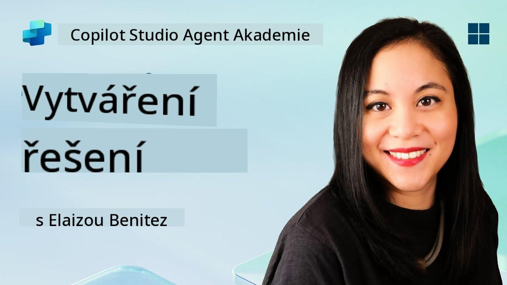](https://www.youtube.com/watch?v=1iATbkgfcpU "Podívejte se na průvodce na YouTube")

## 🎯 Mise - stručný přehled

Tvůrce agentů, vítejte na další taktické operaci. V této misi se naučíte sestavit Řešení - oficiální prostředek pro nasazení vašeho IT Helpdesk agenta vytvořeného pomocí Microsoft Copilot Studio. Představte si to jako digitální kufřík, který obsahuje vašeho agenta a jeho artefakty.

Každý agent potřebuje dobře strukturovaný domov. To je přesně to, co poskytuje řešení Power Platform - pořádek, přenositelnost a připravenost pro produkci.

Pojďme balit.

## 🔎 Cíle

V této misi se naučíte:

1. Porozumět tomu, co jsou řešení Power Platform a jakou roli hrají při vývoji agentů
1. Zjistit výhody používání řešení pro organizaci a nasazení agentů
1. Prozkoumat vydavatele řešení a jejich význam při správě komponent
1. Porozumět životnímu cyklu řešení Power Platform od vývoje po produkci
1. Vytvořit vlastního vydavatele řešení a vlastní řešení pro vašeho IT Helpdesk agenta

## 🕵🏻‍♀️ Řešení? Co to je?

V Microsoft Power Platform jsou řešení jako kontejnery nebo balíčky, které obsahují všechny části vašich aplikací nebo agentů - mohou to být tabulky, formuláře, toky a vlastní logika. Řešení jsou nezbytná pro správu životního cyklu aplikací (ALM), umožňují vám spravovat vaši aplikaci a agenty od nápadu přes vývoj, testování, nasazení až po aktualizace.

V Copilot Studio je každý agent, kterého vytvoříte, uložen v řešení Power Platform. Ve výchozím nastavení jsou agenti vytvořeni ve výchozím řešení, pokud nevytvoříte nové vlastní řešení, ve kterém svého agenta vytvoříte. To se naučíme 🤓 v této lekci a v praktické laboratoři.

Řešení se tradičně vytvářela v **Power Apps maker portálu** - webovém rozhraní, kde můžete vytvářet a přizpůsobovat aplikace, Dataverse, toky, prozkoumávat AI komponenty a další.

   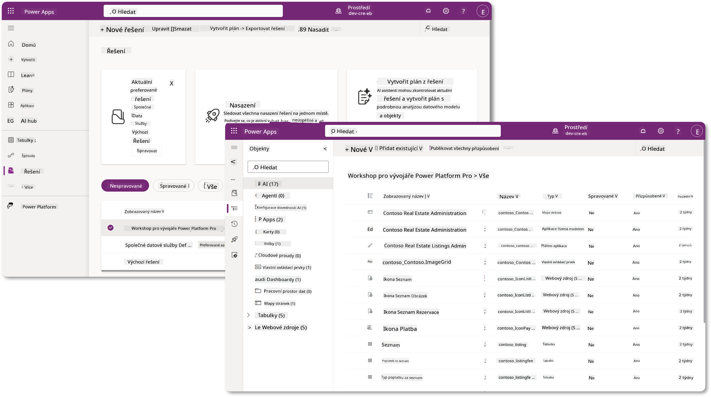

V Copilot Studio je nyní **Průzkumník řešení**, kde můžete spravovat svá řešení přímo. Už nemusíte přepínat do Power Apps maker portálu, abyste spravovali svá řešení, vše lze provést přímo v Copilot Studio 🪄

To znamená, že můžete provádět obvyklé úkoly související s řešením:

- **Vytvořit řešení** - vlastní řešení umožňují exportovat a importovat agenty mezi prostředími.
- **Nastavit preferované řešení** - vybrat řešení, ve kterém budou agenti, aplikace atd. vytvořeni ve výchozím nastavení.
- **Přidat nebo odebrat komponenty** - váš agent může odkazovat na jiné komponenty, jako jsou proměnné prostředí nebo cloudové toky. Tyto komponenty je tedy třeba zahrnout do řešení.
- **Exportovat řešení** - přesunout řešení do jiného cílového prostředí.
- **Importovat řešení** - importovat řešení vytvořená jinde, včetně upgradu nebo aktualizace řešení.
- **Vytvořit a spravovat pipeline řešení** - automatizovat nasazení řešení mezi prostředími.
- **Integrace s Git** - umožňuje vývojářům propojit řešení s Git repozitáři pro správu verzí, spolupráci a ALM. Určeno pouze pro vývojářská prostředí.

   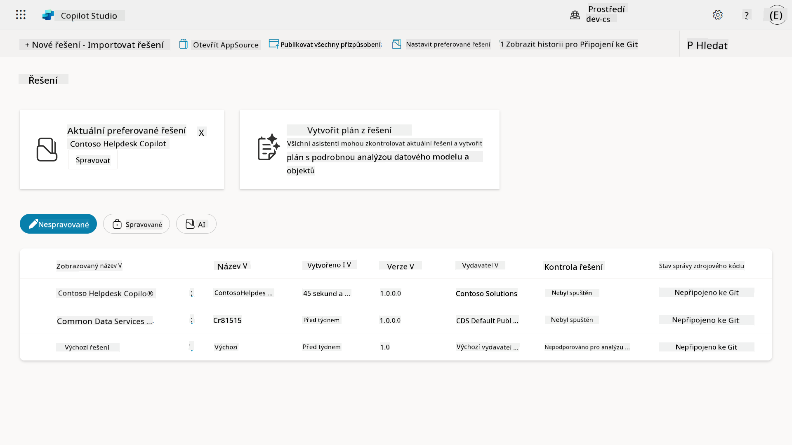

Existují dva typy řešení:

- **Neřízená řešení** - používají se během vývoje. Můžete je volně upravovat a přizpůsobovat podle potřeby.
- **Řízená řešení** - používají se, když jste připraveni nasadit svou aplikaci k testování nebo do produkce. Jsou uzamčena, aby se zabránilo nechtěným změnám.

## 🤔 Proč _bych měl_ použít řešení pro svého agenta?

Představte si řešení jako _nástrojovou sadu_. Když potřebujete opravit nebo vytvořit něco (agenta) na jiném místě (prostředí), shromáždíte všechny potřebné nástroje (komponenty) a vložíte je do své nástrojové sady (řešení). Poté můžete tuto nástrojovou sadu přenést na nové místo (prostředí) a použít nástroje (komponenty) k dokončení práce nebo přidat nové nástroje (komponenty) k přizpůsobení svého agenta nebo projektu, který vytváříte.

!!! quote "Elaiza, vaše přátelská cloudová advokátka se hlásí 🙋🏻‍♀️, aby sdílela pár slov:"
    V Novém Zélandu máme rčení "Buďte pořádní Kiwi!" což je výzva pro Novozélanďany 🥝, aby převzali odpovědnost za své prostředí tím, že správně likvidují odpadky a udržují veřejné prostory čisté. Stejný přístup můžeme použít pro agenty tím, že vše, co se týká vašeho agenta, udržíme organizované a přenosné, což vám pomůže udržet čisté prostředí.

Je dobrým zvykem vytvořit agenta v dedikovaném řešení ve vašem zdrojovém (vývojářském) prostředí. Zde je důvod, proč jsou řešení cenná:

🧩 **Organizovaný vývoj**

- Udržujete svého agenta odděleného od výchozího řešení, které obsahuje vše v prostředí. Všechny komponenty vašeho agenta jsou na jednom místě 🎯

- Vše, co potřebujete pro svého agenta, je v řešení, což usnadňuje export a import do cílového prostředí 👉🏻 to je zdravý zvyk ALM.

🧩 **Bezpečné nasazení**

- Můžete exportovat svou aplikaci nebo agenta jako řízené řešení a nasadit jej do jiných cílových prostředí (například testování nebo produkce) bez rizika nechtěných úprav.

🧩 **Správa verzí**

- Můžete vytvářet opravy (cílené opravy), aktualizace (rozsáhlejší změny) nebo upgrady (nahrazení řešení - obvykle zásadní změny a zavedení nových funkcí).

- Pomáhá vám zavádět změny kontrolovaným způsobem.

🧩 **Správa závislostí**

- Řešení sledují, které části závisí na jiných. To vám brání v tom, abyste něco rozbili při provádění změn.

🧩 **Týmová spolupráce**

- Vývojáři a tvůrci mohou spolupracovat pomocí neřízených řešení během vývoje a poté předat řízené řešení k nasazení.

## 🪪 Porozumění vydavatelům řešení

Vydavatel řešení v Power Platform je jako štítek nebo značka, která identifikuje, kdo řešení vytvořil nebo vlastní. Je to malá, ale důležitá součást správy vašich aplikací, agentů a přizpůsobení toků, zejména při práci v týmech nebo napříč prostředími.

Když vytvoříte řešení, musíte vybrat vydavatele. Tento vydavatel definuje:

- Předponu, která se přidává ke všem vlastním komponentům (například tabulkám, polím a tokům).

- Název a kontaktní informace organizace nebo osoby, která řešení vlastní.

### 🤔 Proč je to důležité?

1. **Snadná identifikace** - předpona (například `new_` nebo `abc_`) vám pomůže rychle identifikovat, které komponenty patří ke kterému řešení nebo týmu.

1. **Zamezení konfliktům** - pokud dva týmy vytvoří sloupec nazvaný status, jejich předpony (`teamA_status`, `teamB_status`) zabrání kolizím názvů.

1. **Podpora ALM** - při přesunu řešení mezi prostředími (Vývoj → Test → Produkce) vydavatel pomáhá sledovat vlastnictví a udržovat konzistenci.

### ✨ Příklad

Představte si, že vytvoříte vydavatele nazvaného Contoso Solutions s předponou `cts_`.

Pokud přidáte vlastní sloupec nazvaný _Priority_, bude uložen jako `cts_Priority` v řešení.

Kdokoli, kdo narazí na tento sloupec na úrovni řešení, bez ohledu na to, v jakém prostředí se nachází, snadno rozpozná, že jde o sloupec spojený s Contoso Solutions.

## 🧭 Životní cyklus řešení Power Platform

Nyní, když rozumíte účelu řešení, se naučíme o jeho životním cyklu.

**1. Vytvoření řešení ve vývojovém prostředí** - začněte vytvořením nového řešení ve vašem vývojovém prostředí.

**2. Přidání komponent** - přidejte aplikace, toky, tabulky a další prvky do svého řešení.

**3. Export jako řízené řešení** - zabalte své řešení pro nasazení exportem jako řízené řešení.

**4. Import do testovacího prostředí** - otestujte své řešení v samostatném testovacím prostředí, abyste se ujistili, že vše funguje podle očekávání.

**5. Import do produkčního prostředí** - nasazení testovaného řešení do vašeho živého produkčního prostředí.

**6. Použití oprav, aktualizací nebo upgradů** - provádějte vylepšení nebo opravy pomocí oprav, aktualizací nebo upgradů. 🔁 Opakujte cyklus!

### ✨ Příklad

Představte si, že vytváříte IT helpdesk agenta, který pomáhá zaměstnancům s problémy, jako jsou problémy se zařízením, řešení problémů s připojením k síti, nastavení tiskárny a další.

- Začnete ve vývojovém prostředí pomocí neřízeného řešení.

- Jakmile je připraven, exportujete jej jako řízené řešení a importujete do cílového prostředí, například do testovacího systému nebo prostředí pro uživatelské akceptační testování (UAT).

- Po testování jej přesunete do produkčního prostředí - vše bez dotyku původní vývojové verze.

## 🧪 Laboratoř 04: Vytvoření nového řešení

Nyní se naučíme

- [4.1 Jak vytvořit vydavatele řešení](../../../../../docs/recruit/04-creating-a-solution)
- [4.2 Jak vytvořit řešení](../../../../../docs/recruit/04-creating-a-solution)

Budeme se držet příkladu z dřívějška, kde vytvoříme řešení v dedikovaném prostředí Copilot Studio, abychom v něm mohli vytvořit našeho IT helpdesk agenta.

Začněme!

### Předpoklady

#### Bezpečnostní role

V Copilot Studio závisí to, co _můžete dělat_ v průzkumníku řešení, na vaší uživatelské bezpečnostní roli.
Pokud nemáte oprávnění spravovat řešení v Power Apps admin centru, nebudete moci tyto úkoly provádět ani v Copilot Studio.

Aby vše fungovalo hladce, zkontrolujte, zda máte správné bezpečnostní role a oprávnění. Pokud nespravujete prostředí ve vaší organizaci, požádejte svého IT administrátora (nebo ekvivalentní tým), který spravuje váš tenant/prostředí.

Následující bezpečnostní role umožňují uživatelům vytvářet řešení ve svém prostředí.

| Bezpečnostní role    | Popis |
| ---------- | ---------- |
| Tvůrce prostředí | Poskytuje potřebná oprávnění k vytváření, přizpůsobování a správě zdrojů v konkrétním prostředí, včetně řešení  |
| Přizpůsobitel systému  | Širší oprávnění než Tvůrce prostředí, včetně možnosti přizpůsobit prostředí a spravovat bezpečnostní role |
| Správce systému   | Nejvyšší úroveň oprávnění, může spravovat všechny aspekty prostředí, včetně vytváření a přidělování bezpečnostních rolí     |

#### Vývojové prostředí

Ujistěte se, že jste přepnuli do svého dedikovaného vývojového prostředí, viz [Lekce 00 - Nastavení kurzu - Krok 3: Vytvoření nového vývojového prostředí](../00-course-setup/README.md#step-3-create-new-developer-environment).

1. V pravém horním rohu vyberte ikonu **Zubaté kolečko** a přepněte z výchozího prostředí na vaše prostředí, například **Prostředí Adele Vance**.

    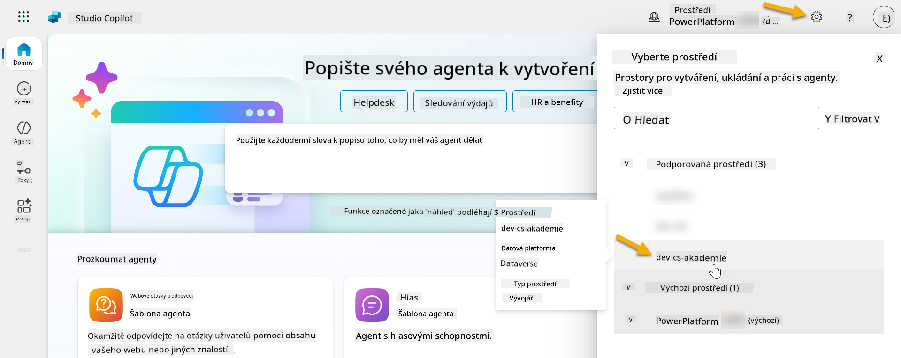

### 4.1 Vytvoření vydavatele řešení

1. Použijte stejné prostředí Copilot Studio jako v předchozí lekci, vyberte **ikonu elipsy (. . .)** v levém menu v Copilot Studio. Vyberte **Řešení** pod záhlavím **Prozkoumat**.

    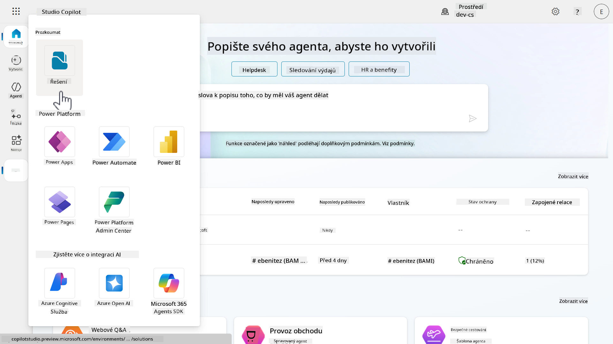

1. Načte se **Průzkumník řešení** v Copilot Studio. Vyberte **+ Nové řešení**

    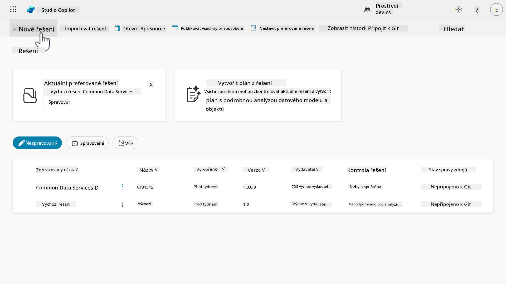

1. Zobrazí se panel **Nové řešení**, kde můžeme definovat podrobnosti našeho řešení. Nejprve musíme vytvořit nového vydavatele. Vyberte **+ Nový vydavatel**.

    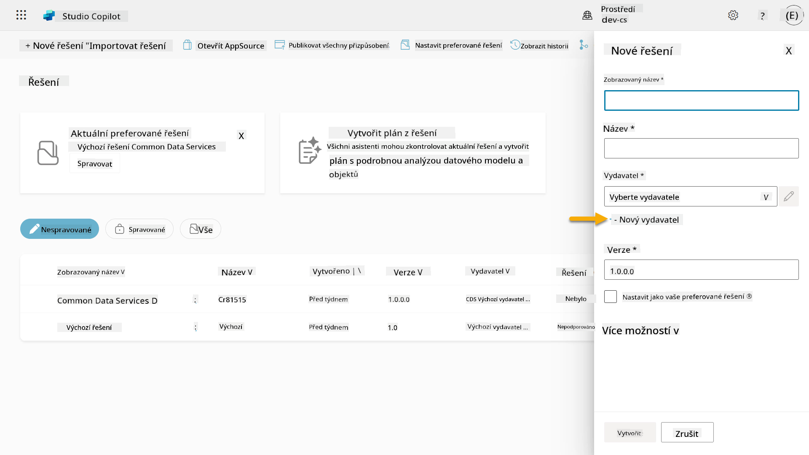  

1. Zobrazí se karta **Vlastnosti** panelu **Nový vydavatel** s povinnými a nepovinnými poli, která je třeba vyplnit na kartě **Vlastnosti**. Zde můžeme nastínit podrobnosti o vydavateli, který bude použit jako štítek nebo značka identifikující, kdo řešení vytvořil nebo vlastní.

    | Vlastnost    | Popis | Povinné |
    | ---------- | ---------- | :----------: |
    | Zobrazený název | Zobrazený název pro vydavatele | Ano   |
    | Název  | Jedinečný název a schéma názvu pro vydavatele  | Ano    |
    | Popis   | Popisuje účel řešení    | Ne     |
    | Předpona    | Předpona vydavatele, která bude aplikována na nově vytvořené komponenty   | Ano      |
    | Předpona hodnoty volby   | Generuje číslo na základě předpony vydavatele. Toto číslo se používá při přidávání možností do voleb a poskytuje indikátor, které řešení bylo použito k přidání možnosti.   | Ano      |

    Zkopírujte a vložte následující jako **Zobrazený název**,

    ```text
    Contoso Solutions
    ```

    Zkopírujte a vložte následující jako **Název**,

    ```text
    ContosoSolutions
    ```

    Zkopírujte a vložte následující jako **Popis**,

    ```text
    Copilot Studio Agent Academy
    ```

    Zkopírujte a vložte následující pro **Předponu**,

    ```text
    cts
    ```

    Ve výchozím nastavení se u **Předpony hodnoty volby** zobrazí číselná hodnota. Aktualizujte tuto číselnou hodnotu na nejbližší tisíc. Například na mém snímku obrazovky níže byla původně `77074`. Aktualizujte ji z `77074` na `77000`.

    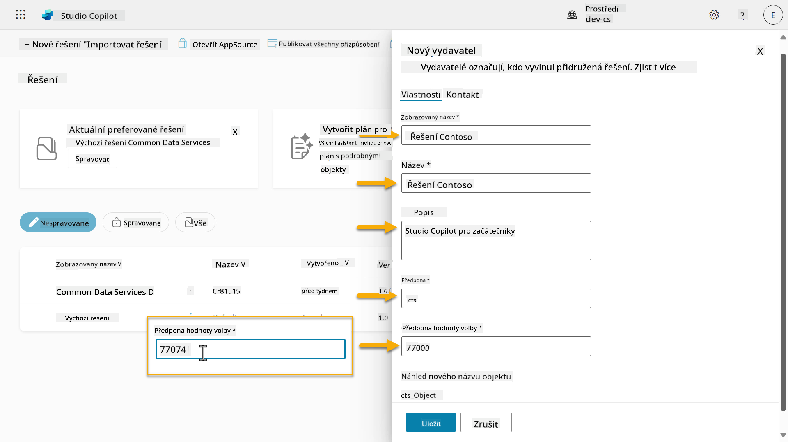  

1. Pokud chcete poskytnout kontaktní údaje pro řešení, vyberte kartu **Kontakt** a vyplňte následující zobrazené sloupce.

    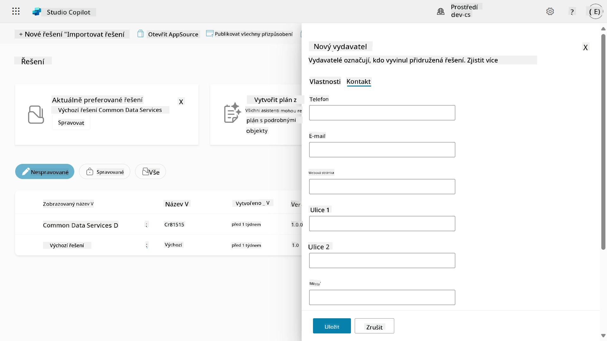

1. Vyberte kartu **Vlastnosti** a klikněte na **Uložit**, abyste vytvo
1. Panel **Nový vydavatel** se zavře a budete přesměrováni zpět na panel **Nové řešení** s nově vytvořeným vydavatelem vybraným.

    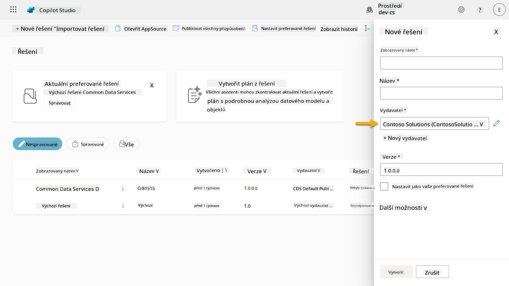  

Skvělá práce, právě jste vytvořili vydavatele řešení! 🙌🏻 Nyní se naučíme, jak vytvořit nové vlastní řešení.

### 4.2 Vytvoření nového řešení

1. Nyní, když jsme vytvořili naše řešení, můžeme dokončit zbytek formuláře v panelu **Nové řešení**.

    Zkopírujte a vložte následující jako **Zobrazovaný název**,

    ```text
    Contoso Helpdesk Agent
    ```

    Zkopírujte a vložte následující jako **Název**,

    ```text
    ContosoHelpdeskAgent
    ```

    Protože vytváříme nové řešení, [**Číslo verze**](https://learn.microsoft.com/power-apps/maker/data-platform/update-solutions#understanding-version-numbers-for-updates/?WT.mc_id=power-172615-ebenitez) bude ve výchozím nastavení `1.0.0.0`.

    Zaškrtněte políčko **Nastavit jako preferované řešení**.

    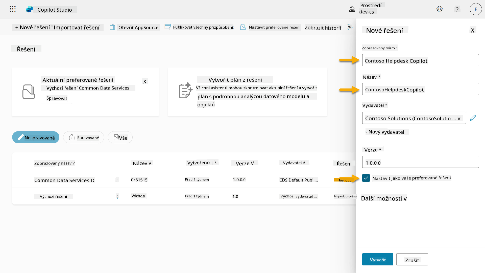  

1. Rozbalte **Další možnosti**, abyste viděli další podrobnosti, které lze v řešení poskytnout.

    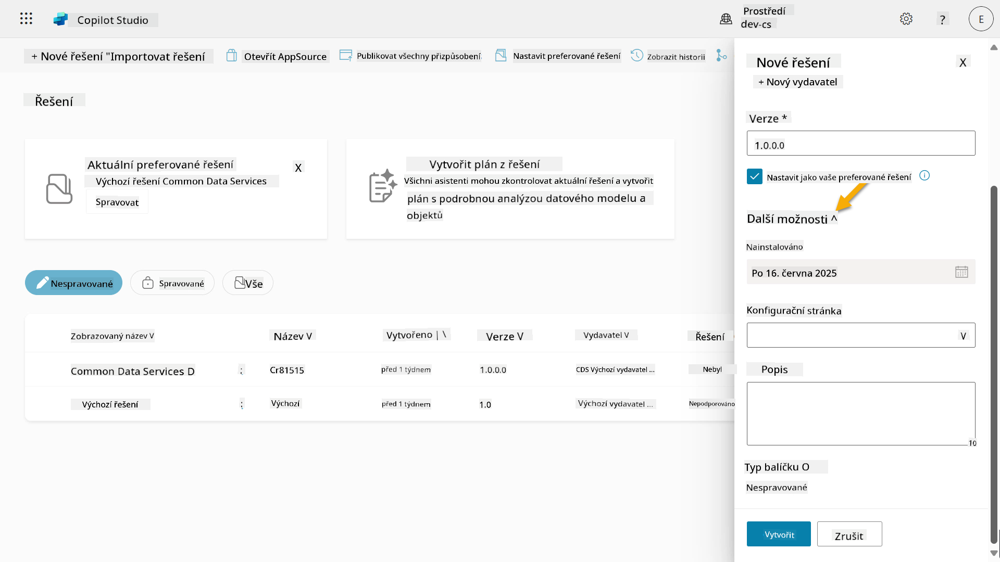

1. Uvidíte následující:

    - **Nainstalováno dne** - datum, kdy bylo řešení nainstalováno.

    - **Konfigurační stránka** - vývojáři nastavují HTML webový zdroj, který pomáhá uživatelům interagovat s jejich aplikací, agentem nebo nástrojem, kde se objeví jako webová stránka v sekci Informace s pokyny nebo tlačítky. Používá se především společnostmi nebo vývojáři, kteří vytvářejí a sdílejí řešení s ostatními.

    - **Popis** - popisuje řešení nebo poskytuje obecný popis konfigurační stránky.

    Tyto položky necháme pro tento praktický úkol prázdné.

    Vyberte **Vytvořit**.

    

1. Řešení pro Contoso Helpdesk Agent bylo nyní vytvořeno. Nebudou v něm žádné komponenty, dokud nevytvoříme agenta ve studiu Copilot.

    Vyberte ikonu **zpětné šipky**, abyste se vrátili do Průzkumníka řešení.

    

1. Všimněte si, že Contoso Helpdesk Agent se nyní zobrazuje jako **Aktuální preferované řešení**, protože jsme dříve zaškrtli políčko **Nastavit jako preferované řešení**.

    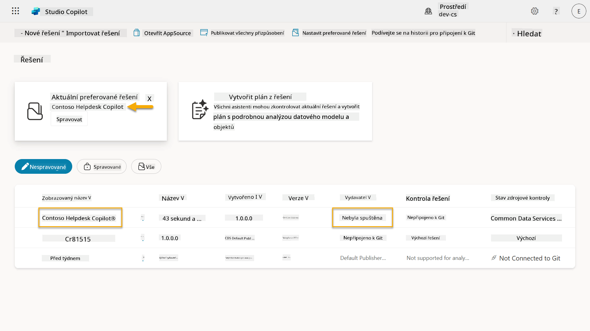

## ✅ Mise splněna

Gratulujeme! 👏🏻 Vytvořili jste vydavatele a použili ho ve svém nově vytvořeném řešení k vytvoření svého agenta!

Skvělá práce, tvůrce agentů. Uspořádaná digitální stopa je prvním krokem k provoznímu měřítku. Nyní máte nástroje a přístup k udržitelnému vývoji agentů připravených pro podnikové prostředí.

Toto je konec **Lab 04 - Vytvoření řešení**, vyberte odkaz níže pro přechod na další lekci. Řešení vytvořené v tomto praktickém úkolu bude použito v praktickém úkolu další lekce.

⏭️ [Přejít na lekci **Rychlý začátek s předem vytvořenými agenty**](../05-using-prebuilt-agents/README.md)

## 📚 Taktické zdroje

🔗 [Vytvoření řešení](https://learn.microsoft.com/power-apps/maker/data-platform/create-solution/?WT.mc_id=power-172615-ebenitez)

🔗 [Vytváření a správa řešení ve studiu Copilot](https://learn.microsoft.com/microsoft-copilot-studio/authoring-solutions-overview/?WT.mc_id=power-172615-ebenitez)

🔗 [Sdílení agentů s ostatními uživateli](https://learn.microsoft.com/microsoft-copilot-studio/admin-share-bots/?WT.mc_id=power-172615-ebenitez)

🔗 [Přehled dostupných zdrojů pro předdefinované bezpečnostní role](https://learn.microsoft.com/power-platform/admin/database-security#summary-of-resources-available-to-predefined-security-roles/?WT.mc_id=power-172615-ebenitez)

🔗 [Upgrade nebo aktualizace řešení](https://learn.microsoft.com/power-apps/maker/data-platform/update-solutions/?WT.mc_id=power-172615-ebenitez)

🔗 [Přehled pipeline v Power Platform](https://learn.microsoft.com/power-platform/alm/pipelines/?WT.mc_id=power-172615-ebenitez)

🔗 [Přehled integrace Git v Power Platform](https://learn.microsoft.com/power-platform/alm/git-integration/overview/?WT.mc_id=power-172615-ebenitez)

<!-- markdownlint-disable-next-line MD033 -->


---

**Prohlášení**:  
Tento dokument byl přeložen pomocí služby AI pro překlady [Co-op Translator](https://github.com/Azure/co-op-translator). I když se snažíme o přesnost, mějte prosím na paměti, že automatizované překlady mohou obsahovat chyby nebo nepřesnosti. Původní dokument v jeho rodném jazyce by měl být považován za autoritativní zdroj. Pro důležité informace se doporučuje profesionální lidský překlad. Neodpovídáme za žádná nedorozumění nebo nesprávné interpretace vyplývající z použití tohoto překladu.