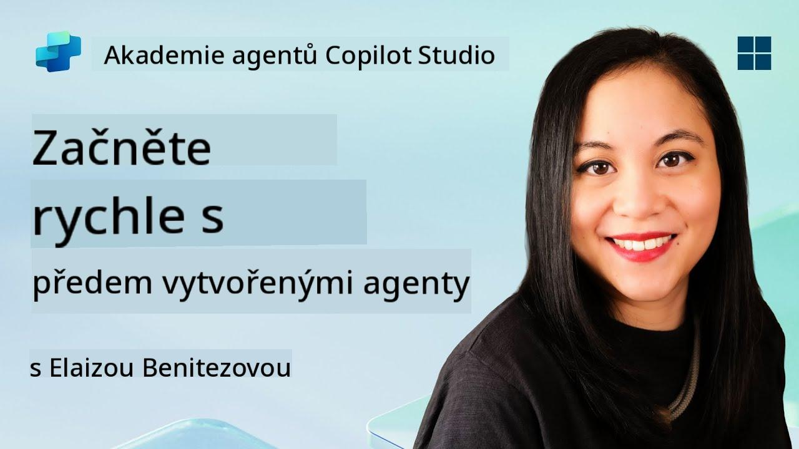
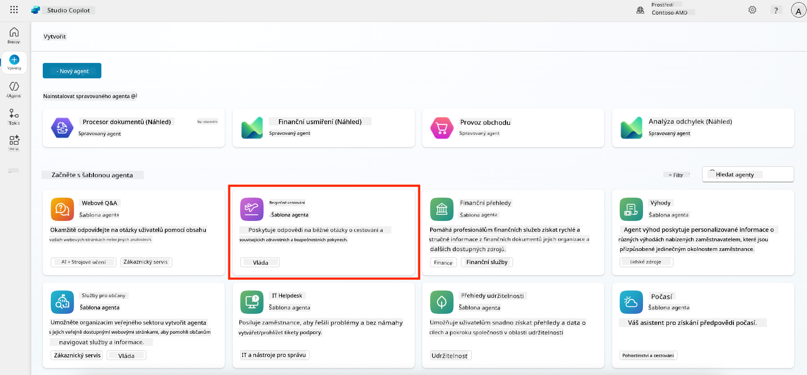
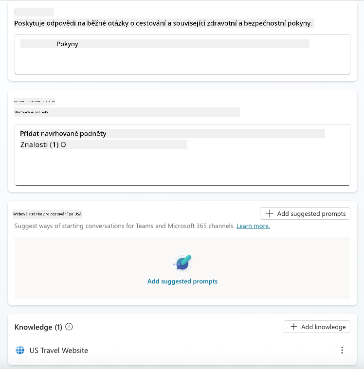
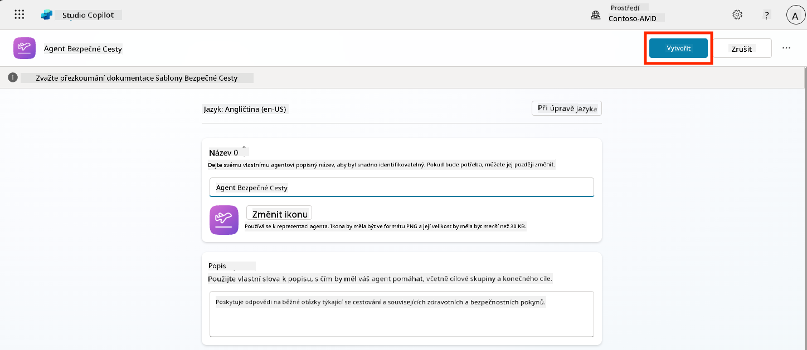
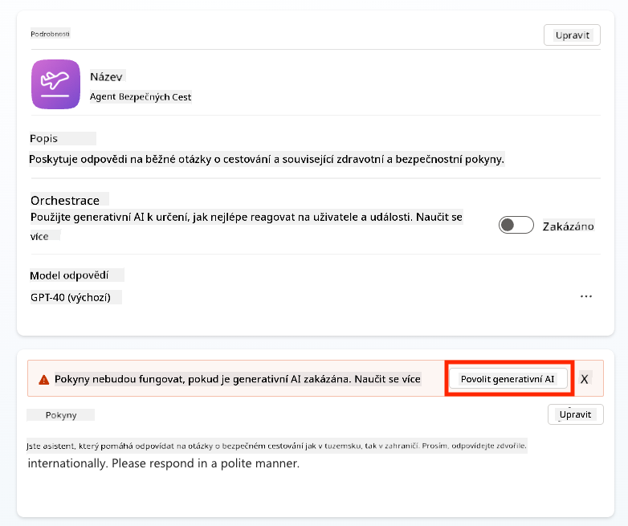
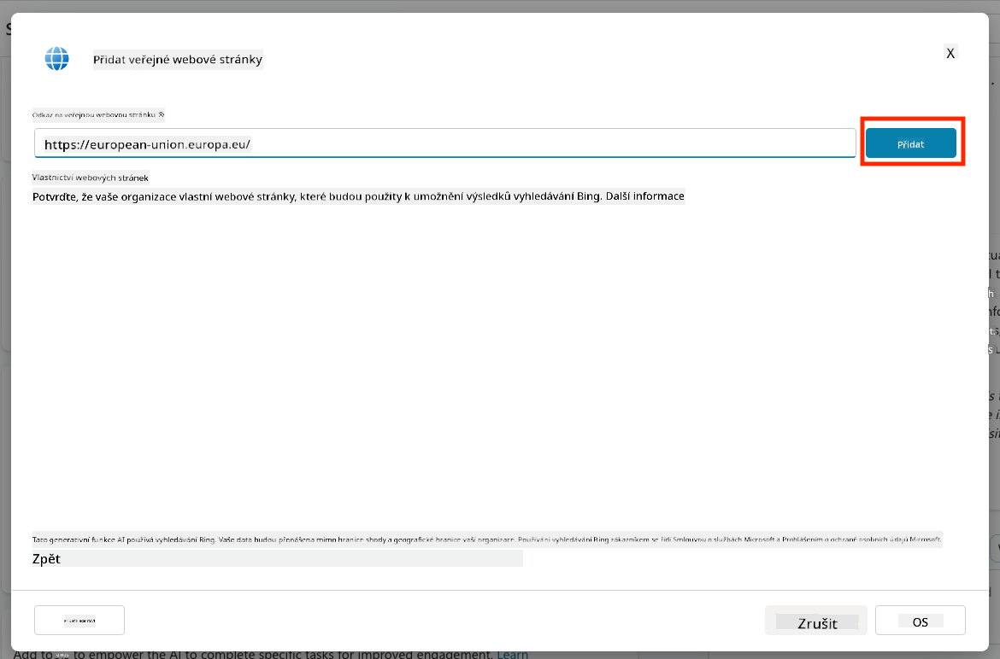
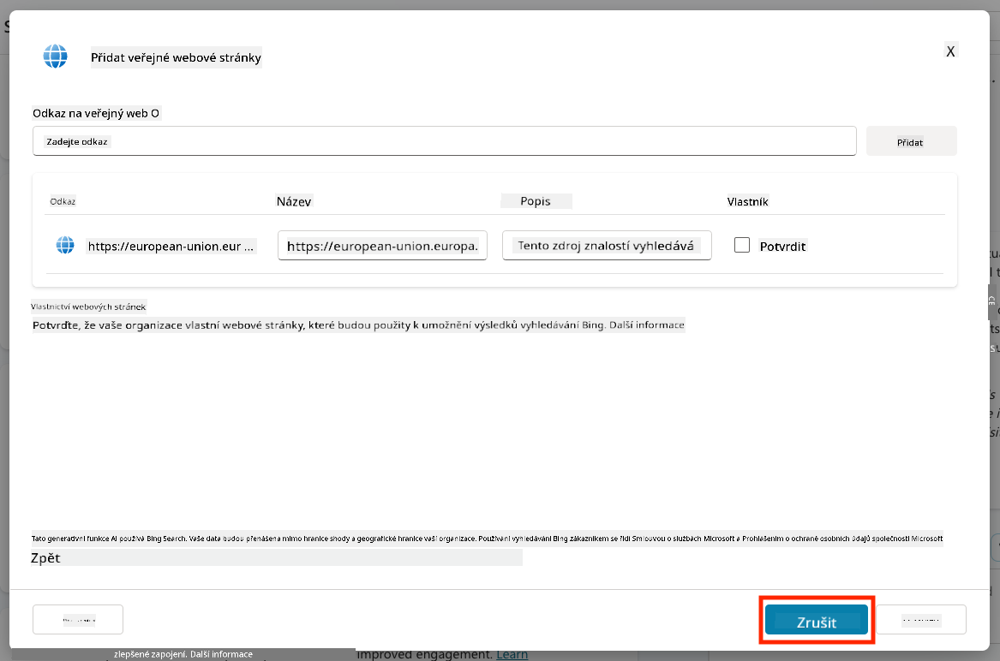
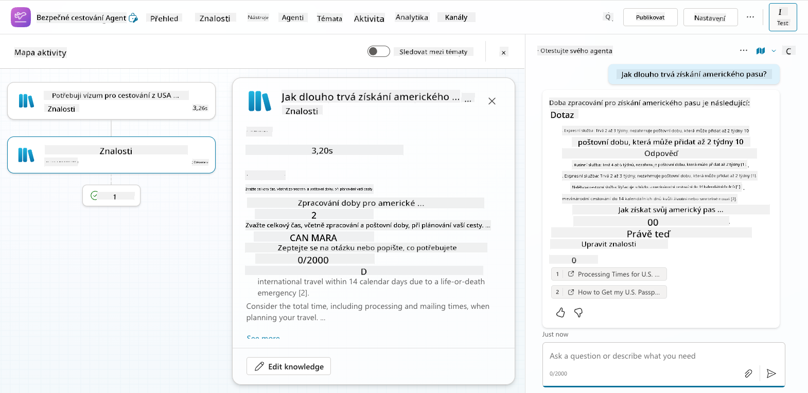
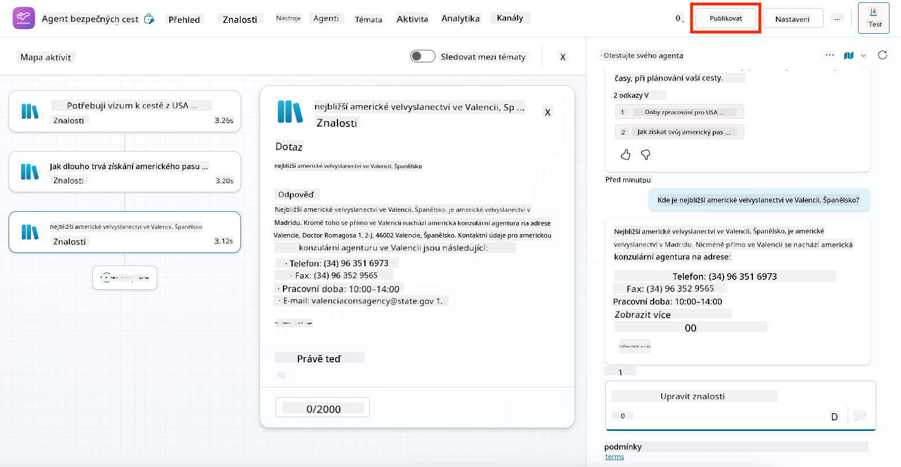
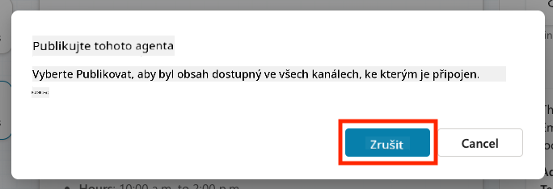

<!--
CO_OP_TRANSLATOR_METADATA:
{
  "original_hash": "8e2c64a7f9303e58329ec8bb468c80b4",
  "translation_date": "2025-10-20T17:06:18+00:00",
  "source_file": "docs/recruit/05-using-prebuilt-agents/README.md",
  "language_code": "cs"
}
-->
# 🧰 Mise 05: Použití předem vytvořeného agenta  

## 🕵️‍♂️ KRYCÍ NÁZEV: `OPERACE BEZPEČNÉ CESTOVÁNÍ`

> **⏱️ Časový rámec operace:** `~30 minut`

🎥 **Podívejte se na průvodce**

## 🎯 Popis mise

Vítejte na další misi v Copilot Studio Agent Academy. Chystáte se prozkoumat svět **předem vytvořených agentů**—inteligentních, účelově zaměřených agentů vytvořených společností Microsoft, které urychlují nasazení a zkracují dobu potřebnou k dosažení hodnoty.

Namísto vytváření od nuly vám předem vytvoření agenti (nazývaní také **šablony agentů**) poskytují náskok díky připraveným scénářům, které můžete přizpůsobit a nasadit během několika minut.

V této misi nasadíte agenta **Bezpečné cestování**—agenta, který pomáhá vašim uživatelům připravit se na služební cesty, porozumět firemním politikám a zjednodušit plánování.

---

## 🧭 Cíle

Vaše cíle pro tuto misi jsou:

1. Pochopit, co jsou předem vytvoření agenti a proč jsou důležití  
1. Nasadit šablonu agenta **Bezpečné cestování**  
1. Přizpůsobit odpovědi a obsah agenta  
1. Otestovat a publikovat agenta  

---

## 🧠 Co jsou předem vytvoření agenti?

Předem vytvoření agenti jsou hotoví AI agenti vytvoření společností Microsoft, kteří:

- Řeší běžné obchodní potřeby (například cestování, HR, IT podporu)
- Obsahují plně funkční témata, spouštěcí fráze, instrukce a ukázkové znalosti
- Mohou být upravováni, rozšiřováni a propojeni s vašimi vlastními daty

Tito agenti jsou ideální pro rychlý začátek nebo pro pochopení struktury agentů.

---

## 🧪 Laboratoř 05: Rychlý start s předem vytvořeným agentem

Nyní se naučíme, jak vybrat předem vytvořeného agenta a přizpůsobit ho.

- [5.1 Spuštění Copilot Studio](../../../../../docs/recruit/05-using-prebuilt-agents)
- [5.2 Výběr šablony agenta Bezpečné cestování](../../../../../docs/recruit/05-using-prebuilt-agents)
- [5.3 Přizpůsobení agenta](../../../../../docs/recruit/05-using-prebuilt-agents)
- [5.4 Testování a publikace](../../../../../docs/recruit/05-using-prebuilt-agents)

Budeme pokračovat v příkladu z dřívějška, kde vytvoříme řešení v dedikovaném prostředí Copilot Studio pro vytvoření našeho IT helpdesk agenta.

Začněme!

### 5.1 Spuštění Copilot Studio

1. Přejděte na [https://copilotstudio.microsoft.com](https://copilotstudio.microsoft.com)

1. Přihlaste se pomocí svého pracovního nebo školního účtu Microsoft 365

!!! warning
    Musíte být v tenantovi, kde je Copilot Studio povoleno. Pokud Copilot Studio nevidíte, vraťte se k [Misi 00](../00-course-setup/README.md) a dokončete nastavení.

### 5.2 Výběr šablony agenta Bezpečné cestování

1. Na domovské stránce Copilot Studio klikněte na **+ Vytvořit**
    

1. Přejděte dolů do sekce **Začněte se šablonou agenta**

1. Najděte a vyberte **Bezpečné cestování**

    

1. Všimněte si, že šablona je předem naplněna popisem, instrukcemi a znalostmi.

    

1. Klikněte na **Vytvořit**

    

Tím vytvoříte nového agenta ve vašem prostředí na základě konfigurace Bezpečné cestování.

### 5.3 Přizpůsobení agenta

Nyní, když je agent vytvořen, přizpůsobíme ho vaší organizaci:

1. Vyberte **Povolit generativní AI**, abyste zapnuli funkci generativní AI, která bude používat instrukce uvedené v šabloně.

    

1. Nyní vybavíme agenta dalším zdrojem znalostí, aby mohl odpovídat na otázky o cestování po Evropě. K tomu přejděte dolů do sekce **znalosti** a vyberte **Přidat znalosti**

    

1. Vyberte **Veřejné webové stránky**

    

1. Do textového pole vložte **<https://european-union.europa.eu/>** a vyberte **Přidat**

    

1. Vyberte **Přidat k agentovi**

    

### 5.4 Testování a publikace

1. Klikněte na **Testovat** v pravém horním rohu pro spuštění testovacího okna  

1. Vyzkoušejte fráze jako:

    - `“Potřebuji vízum pro cestu z USA do Amsterdamu?”`
    - `“Jak dlouho trvá získání pasu USA?”`
    - `“Kde je nejbližší americká ambasáda ve Valencii, Španělsko?”`

1. Ověřte, že agent odpovídá přesně a užitečně, a sledujte mapu aktivit, abyste viděli, odkud informace získal.

    

1. Až budete připraveni, klikněte na **Publikovat**

    

1. Znovu vyberte **Publikovat** v dialogovém okně
    

1. Volitelně přidejte agenta do Microsoft Teams pomocí vestavěné funkce **Kanály**.

!!! note "🧳 Bonusový cíl"
    Zkuste propojit agenta Bezpečné cestování s webem SharePoint nebo souborem FAQ, aby byl více relevantní pro cestovní politiky vaší společnosti.

## ✅ Mise splněna

Nyní jste úspěšně:

- Nasadili předem vytvořeného agenta od Microsoftu  
- Přizpůsobili agenta
- Otestovali a publikovali vlastní verzi šablony agenta **Bezpečné cestování**

⏭️ [Přejděte na lekci **Vytvoření vlastního agenta od nuly**](../06-create-agent-from-conversation/README.md).

<!-- markdownlint-disable-next-line MD033 -->

---

**Prohlášení**:  
Tento dokument byl přeložen pomocí služby AI pro překlady [Co-op Translator](https://github.com/Azure/co-op-translator). I když se snažíme o přesnost, mějte prosím na paměti, že automatizované překlady mohou obsahovat chyby nebo nepřesnosti. Původní dokument v jeho původním jazyce by měl být považován za autoritativní zdroj. Pro důležité informace se doporučuje profesionální lidský překlad. Neodpovídáme za žádná nedorozumění nebo nesprávné interpretace vyplývající z použití tohoto překladu.