<!--
CO_OP_TRANSLATOR_METADATA:
{
  "original_hash": "180f9cc0b40527f61be092c9b0f72aba",
  "translation_date": "2025-10-20T17:42:02+00:00",
  "source_file": "docs/recruit/06-create-agent-from-conversation/README.md",
  "language_code": "cs"
}
-->
# 🚨 Mise 06: Vytvořte vlastní agenta pomocí přirozeného jazyka s Copilotem a propojte ho s vašimi daty

## 🕵️‍♂️ KRYCÍ NÁZEV: `OPERACE AGENT FORGE`

> **⏱️ Časový rámec operace:** `~75 minut`

🎥 **Podívejte se na průvodce**

[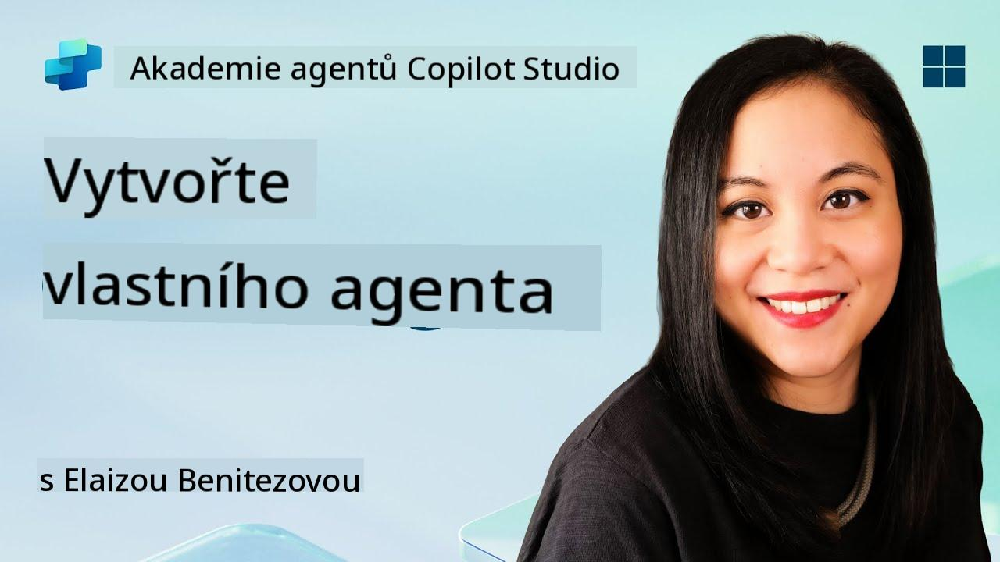](https://www.youtube.com/watch?v=qZTtQVncGFg "Podívejte se na průvodce na YouTube")

## 🎯 Mise - stručný přehled

Vítejte zpět, tvůrce agentů. Tato mise vás postaví do velitelského křesla nejmocnější funkce v Copilot Studio - vytvoření vlastního agenta od základu pouze pomocí přirozeného jazyka… a jeho posílení vašimi vlastními daty.

Nejde jen o další chatbot. Budujete digitálního kolegu vybaveného znalostmi - někoho, kdo dokáže uvažovat, reagovat a odkazovat na skutečné podnikové informace.

Vaše zbraň? Přirozený jazyk. Vaše mise? Navrhnout, vytrénovat a otestovat plně přizpůsobeného agenta helpdesku, který odpovídá na IT otázky pomocí SharePointu, nahraných souborů nebo firemních URL.

Postavme vašeho agenta od základů.

## 🔎 Cíle

V této misi se naučíte:

1. Porozumět tomu, co jsou vlastní agenti a jak se liší od předpřipravených šablon
1. Vytvářet agenty pomocí přirozených jazykových podnětů a konverzačního designu s Copilotem
1. Propojit agenty s podnikovými zdroji znalostí, včetně SharePointu, dokumentů a webových stránek
1. Seznámit se s generativní orchestrací a tím, jak agenti dynamicky vyhledávají a reagují pomocí více datových zdrojů
1. Vytvořit a otestovat plně funkčního IT helpdesk agenta, který dokáže odpovídat na otázky z vašich vlastních dat

## 🤔 Co je _vlastní_ agent?

Vlastní agent je chatbot nebo virtuální asistent, kterého vytvoříte a navrhnete v Copilot Studio, aby pomáhal uživatelům s konkrétními úkoly nebo otázkami. Říká se mu vlastní, protože:

- **Vy určujete účel** - pomáhat uživatelům požádat o dovolenou, zkontrolovat stav objednávky, poskytovat pomoc s IT otázkami.
- **Vy definujete konverzaci** - co agent říká a jak by měl reagovat.
- **Vy ho propojujete s vlastními daty** - připojení k vašim podnikových datům prostřednictvím vestavěných podporovaných zdrojů znalostí.
- **Vy ho připojujete k vlastním systémům nebo aplikacím** - vybíráte z konektorů, toků, REST API a protokolových serverů modelového kontextu.

!!! note
    Představte si to takto: vytváříte svého vlastního digitálního pomocníka, který může komunikovat s uživateli a plnit úkoly za ně, jako je odpovídání na otázky, shromažďování informací potřebných pro proces nebo připojení k vašim podnikovým datům.

### 🤖 Co může vlastní agent dělat?

Vlastní agent může plnit následující úkoly:

- Ptát se uživatelů na informace, jako jsou jména, data nebo preference.
- Ukládat tyto informace do databáze nebo tabulky.
- Vyhledávat data na základě položených otázek a odpovídat na ně.
- Pracovat autonomně bez přímé interakce s uživatelem.
- Spouštět akce buď na vyžádání prostřednictvím přímé interakce s uživatelem, nebo autonomně, například odesílání e-mailů nebo vytváření záznamů.

### 👩🏻‍💻 Proč používat vlastního agenta?

- Šetří čas automatizací opakujících se úkolů.
- Poskytuje uživatelům přátelskou, vedenou zkušenost.
- Přizpůsobí se vašim obchodním nebo projektovým potřebám.

### ✨ Příklad

Vytvoříte vlastního agenta, který pomáhá zaměstnancům požádat o dovolenou.

Agent se zeptá na jejich jméno, data dovolené a jméno jejich manažera, poté uloží informace do určeného systému, který spravuje žádosti o dovolenou, například do seznamu SharePoint.

Nyní místo toho, aby zaměstnanci museli procházet seznam SharePoint a vytvářet nový záznam, jednoduše si s agentem popovídají.

## 🗣️ Použijte přirozený jazyk k vytvoření agentů

Dříve jste se naučili, jak rychle vytvořit agenty v Copilot Studio pomocí předpřipravených šablon agentů v [Lekci 05 - Rychlý start s předpřipravenými agenty](../05-using-prebuilt-agents/README.md). V této lekci se ponoříme do zážitku z konverzačního vytváření s Copilotem. Copilot Studio usnadňuje vytváření agentů tím, že si povídáte s Copilotem, jako byste vedli konverzaci.

V Copilot Studio nemusíte psát kód, abyste vytvořili agenta. Místo toho popíšete, co chcete, aby váš agent dělal, běžným jazykem, a Copilot vám pomůže ho krok za krokem vytvořit prostřednictvím zážitku podobného chatu.

## 🌱 Ale jsem nováček v "popisování toho, co chci" - co mám dělat?

Popisování v přirozeném jazyce pro vytvoření vlastního agenta může být pro vás nový koncept. Kdykoli používáte Copilot napříč produkty a službami Microsoftu, používáte přirozený jazyk ve formě _podnětu_.

Podnět je zpráva nebo instrukce, kterou dáte AI agentovi, aby mu sdělili, co chcete, aby udělal. Představte si to jako dávání pokynů asistentovi. Čím jasnější jsou vaše pokyny, tím snazší je pro vašeho asistenta je pochopit a jednat podle nich.

### 🪄 Proč na podnětech záleží

- Řídí chování agenta.
- Pomáhají agentovi pochopit, jaký typ konverzace má vést.
- Dobrý podnět činí agenta užitečnějším a přesnějším.

### 📝 Tipy pro psaní dobrého podnětu

- Buďte jasní a konkrétní - řekněte přesně, co chcete, aby agent udělal.
- Myslete jako uživatel - co uživatel řekne? Jak by měl agent odpovědět?
- Zahrňte příklady - pokud je to možné, poskytněte ukázkovou interakci.

### ✨ Příklad

Řekněme, že HR tým potřebuje agenta, který pomáhá s žádostmi o dovolenou.

Podnět by mohl být:

    „Chci vytvořit agenta, který pomáhá uživatelům podat žádost o dovolenou. Když uživatel řekne, že chce požádat o volno, agent by se měl zeptat na jeho jméno, datum začátku dovolené, datum konce dovolené a jméno jeho manažera. Jakmile uživatel poskytne tyto informace, agent by je měl uložit do seznamu SharePoint s názvem ‚Žádosti o dovolenou‘ a zveřejnit oznámení v určeném kanálu Microsoft Teams.“

Proč tento podnět funguje:

- **Jasně uvádí cíl** - podat žádost o dovolenou
- **Popisuje interakci uživatele** - co uživatel říká a na co by se měl agent ptát
- **Uvádí požadovaná data** - jméno, datum začátku, datum konce, manažer
- **Zmiňuje, kam data půjdou** - seznam SharePoint s názvem Žádosti o dovolenou

## 🔮 OK, vytvořil jsem svého agenta... jak ho dále propojit se znalostmi?

V Copilot Studio jsou zdroje znalostí místa, kde váš agent může najít informace, aby poskytoval lepší odpovědi. Když přidáte tyto zdroje, váš agent může čerpat podniková data z míst, jako je Power Platform, Dynamics 365, webové stránky a další systémy nebo služby, které vaše firma používá.

Tyto zdroje spolupracují s AI, aby vašemu agentovi pomohly reagovat na otázky uživatelů přesněji, což se dosahuje prostřednictvím tzv. **generativní orchestrace**.

### 🌿 Co je generativní orchestrace v kontextu agentů?

Generativní orchestrace znamená, že agent používá AI k dynamickému rozhodování o tom, jak odpovědět na otázku, kombinací svých vestavěných jazykových dovedností s informacemi z vašich přidaných zdrojů znalostí.

Když uživatel položí otázku, agent:

- Pomocí AI pochopí otázku.
- Může se uživatelů zeptat na chybějící informace tím, že generuje otázky za pochodu.
- Vybere nejrelevantnější zdroje znalostí.
- Prohledá tyto zdroje, aby našel odpovědi.
- Vygeneruje přirozenou, užitečnou odpověď pomocí nalezených informací.

### 🏦 Proč na zdrojích znalostí záleží?

1. **Chytřejší odpovědi** - když přidáte zdroje znalostí, váš agent může poskytovat lepší, přesnější odpovědi pomocí skutečných dat z vaší organizace.

1. **Méně manuální práce** - nemusíte psát každou možnou odpověď. Agent může prohledávat vaše přidané zdroje a odpovídat automaticky.

1. **Používání důvěryhodných informací** - váš agent může čerpat odpovědi ze systémů, které již používáte, jako je Dataverse, SharePoint nebo firemní webové stránky, takže uživatelé mají spolehlivé informace z ověřených zdrojů.

1. **Spolupráce s generativní AI** - zdroje znalostí a AI pomáhají vašemu agentovi pochopit otázky a reagovat přirozeně, i když otázka nebyla předem naprogramována nebo přidána jako výchozí podnět.

1. **Flexibilní a rozšiřitelné** - zdroje znalostí můžete přidávat kdykoli během nastavení nebo později, váš agent se stává chytřejším, jak se mění vaše potřeby.

### ✨ Příklad

Představte si, že vytvoříte agenta, který pomáhá zaměstnancům s otázkami ohledně HR. Přidáte dokument s HR politikou vaší firmy a web SharePoint jako zdroje znalostí.

Když se zaměstnanec zeptá, _„Na kolik dní dovolené mám nárok?“_, agent použije generativní orchestraci k prohledání těchto zdrojů a odpoví správnou politikou, aniž byste museli tuto odpověď manuálně napsat. To vám ušetří čas při zohledňování každé možné otázky, kterou zaměstnanec může položit ohledně svých nároků.

## Typy zdrojů znalostí, které lze přidat

1. **Veřejné webové stránky**
    - **Co dělá:** Prohledává konkrétní webové stránky (například web vaší firmy) pomocí Bingu.
    - **Proč je užitečný:** Skvělé pro získávání veřejně dostupných informací, jako jsou často kladené otázky nebo podrobnosti o produktech.

1. **Dokumenty**
    - **Co dělá:** Používá dokumenty, které nahrajete přímo k agentovi, jako jsou PDF nebo Word soubory. Tyto nahrané soubory jsou bezpečně uloženy v Dataverse.
    - **Proč je užitečný:** Umožňuje vašemu agentovi odpovídat na otázky na základě interních příruček, manuálů nebo politik.

1. **SharePoint**
    - **Co dělá:** Připojuje se ke složkám nebo souborům na SharePointu pomocí Microsoft Graph Search.
    - **Proč je užitečný:** Ideální pro přístup k týmovým dokumentům, HR politikám nebo projektovým souborům uloženým na SharePointu.

1. **Dataverse**
    - **Co dělá:** Používá strukturovaná data z vaší tabulky a řádků prostředí Dataverse a může aplikovat synonyma a definice slovníku pro tabulky a sloupce, aby zlepšil odpovědi agenta.
    - **Proč je užitečný:** Když potřebujete vyhledávat podniková data uložená v Dataverse, například informace o zákaznících.

1. **Aktuální znalosti s konektory**
    - **Co dělá:** Umožňuje vašemu agentovi přístup k živým datům z jiných podnikových systémů, jako jsou Salesforce, ServiceNow, Dynamics 365, AzureSQL, Databricks a další během konverzace, pomocí vlastních oprávnění uživatele.
    - **Proč je užitečný:** Poskytuje aktuální, bezpečné a přesné odpovědi bez ukládání nebo duplikace dat, což činí vašeho agenta chytřejším a bezpečnějším.

1. **Azure AI Search**
    - **Co dělá:** Umožňuje vašemu agentovi prohledávat velké množství dokumentů uložených v Azure pomocí sémantického a vektorového vyhledávání, aby porozuměl otázkám uživatelů.
    - **Proč je užitečný:** Poskytuje přesné, důvěryhodné odpovědi z komplexních datových zdrojů, podporuje citace a dobře se škáluje pro velké sbírky dokumentů s bezpečnými přístupovými kontrolami.

## 🔒 Poznámka o bezpečnosti

### Autentizace zdrojů znalostí

Některé zdroje, jako SharePoint a Dataverse, vyžadují autentizaci uživatele. To znamená, že agent bude ve své odpovědi odkazovat pouze na data, která je uživatel oprávněn vidět. Jiné zdroje mohou vyžadovat další konfiguraci, aby se agent mohl připojit, například Azure AI Search, který vyžaduje účet Azure a specifikaci typu autentizace.

## Zlepšení odpovědí vašeho agenta v Copilot Studio

Poté, co je váš agent vytvořen prostřednictvím zážitku z konverzačního vytváření, budete chtít otestovat jeho chování na základě pokynů, které Copilot vygeneroval z vašeho podnětu. Zlepšení odpovědí vašeho agenta v Copilot Studio spočívá v tom, že zajistíte, aby jasně rozuměl vašim cílům a měl správné informace, se kterými může pracovat.

1. **Upravte pokyny pro agenta** - zde sdělíte svému agentovi, jak by se měl chovat. Používejte jasný, konkrétní jazyk.

    Například:

    ✅ „Chovej se jako přátelský zákaznický podpora, která věci vysvětluje jednoduše.“

    ❌ „Buď užitečný.“ (Příliš vágní)

1. **Zkontrolujte tón a jazyk** - ujistěte se, že tón agenta odpovídá vašemu publiku.

    Můžete ho nastavit jako:

    - Přátelský a neformální.
    - Profesionální a stručný.
    - Podpůrný a trpělivý.

1. **Přidejte nebo aktualizujte zdroje znalostí** - pokud váš agent potřebuje odpovídat na otázky o určitém tématu, ujistěte se, že má přístup ke správným informacím.

    - Přidejte odkazy na webové stránky, dokumenty nebo často kladené otázky.
    - Udržujte obsah aktuální.
    - Používejte jasné, dobře strukturované informace.

1. **Používejte Témata a Spouštěče** - Pokud váš agent potřebuje řešit konkrétní úkoly nebo konverzace, můžete vytvořit témata s aktivačními frázemi. To pomáhá přesněji vést konverzaci. O tom se dozvíme více v následující lekci.

1. **Testujte s reálnými otázkami** - zkuste se svého agenta zeptat na typy otázek, které by uživatelé mohli položit.

    Pokud odpovědi nejsou dobré:

    - Upravte systémové pokyny.
    - Přidejte více příklad
Použijeme stejný případ použití jako v [Lekce 03 - Vytvoření deklarativního agenta pro Microsoft 365 Copilot](../03-create-a-declarative-agent-for-M365Copilot/README.md#use-case-scenario)

**Jako** zaměstnanec

**Chci** získat rychlou a přesnou pomoc od agenta IT helpdesku při problémech, jako jsou potíže se zařízením, řešení problémů s připojením k síti, nastavení tiskárny

**Abych mohl** být produktivní a řešit technické problémy bez zbytečných prodlev

Začněme!

### ✨ Předpoklady

- **SharePoint web**

Budeme používat SharePoint web **Contoso IT** z [Lekce 00 - Nastavení kurzu - Krok 3: Vytvoření nového SharePoint webu](../00-course-setup/README.md#step-4-create-new-sharepoint-site).

Pokud jste ještě nenastavili SharePoint web **Contoso IT**, vraťte se prosím na [Lekce 00 - Nastavení kurzu - Krok 3: Vytvoření nového SharePoint webu](../00-course-setup/README.md#step-4-create-new-sharepoint-site).

- **Řešení**

Budeme používat řešení **Contoso Helpdesk Agent** z [Lekce 04 - Vytvoření řešení pro vašeho agenta](../04-creating-a-solution/README.md#41-create-a-solution-publisher).

Pokud jste ještě nenastavili řešení **Contoso Agent**, vraťte se prosím na [Lekce 04 - Vytvoření řešení pro vašeho agenta](../04-creating-a-solution/README.md#41-create-a-solution-publisher).

### 6.1 Použití přirozeného jazyka k vytvoření agenta s Copilotem

!!! warning "Dotazy Copilota se mohou lišit mezi jednotlivými relacemi"

    Zkušenost s konverzačním vytvářením pomocí Copilota se může pokaždé lišit, přičemž poskytované otázky pro vedení mohou být mírně odlišné než dříve.

1. Přejděte na domovskou stránku Copilot Studio a do pole zadejte následující výzvu, která popisuje agenta IT helpdesku. Výzva zahrnuje cíl agenta, kontext, očekávané úkoly a formát odpovědí agenta.

    ```text
    You are an IT help desk agent. Your goal is to assist users with their IT issues. You can access information from our company's knowledge base at https://support.microsoft.com/en-us. Your responses should be polite and helpful. If a user reports a slow computer, ask about the age of the device, current software versions, and if they've recently installed any new programs. If a user is experiencing trouble logging into their email, guide them through password reset procedures. You should be concise and informative, using step-by-step instructions with bullet points when appropriate.
    ```

      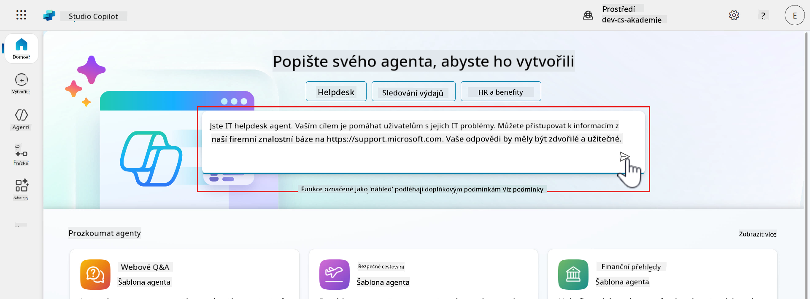

1. Následně se načte zkušenost s konverzačním vytvářením pomocí Copilota. Uvidíte, že Copilot právě reaguje na vaši výzvu.

      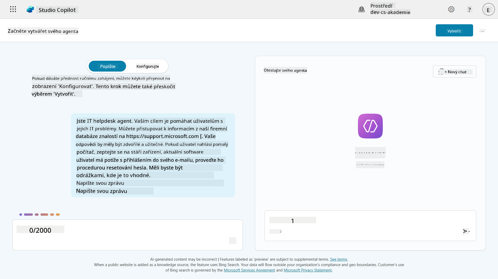

1. Copilot potvrdí, že agent byl nastaven podle poskytnutých instrukcí, a požádá o potvrzení názvu agenta. Požádáme Copilota, aby náš agent pojmenoval jako:

       ```text
       Contoso Helpdesk Agent
       ```

      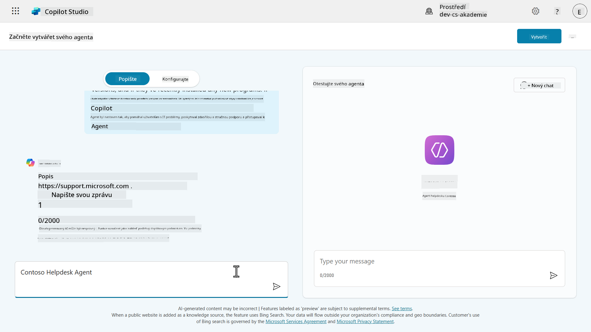

1. Copilot provede požadavek a uvidíme, že název agenta byl aktualizován v panelu agenta. Copilot nás dále požádá o upřesnění instrukcí. Ptá se, jak by měl reagovat na konkrétní problémy, a požádáme ho, aby uznal problém, poskytl příklady témat k odpovědi a formátoval odpověď jako odrážky.

    Zkopírujte a vložte následující text a odešlete požadavek Copilotovi.

       ```text
       Prioritizujte naléhavé požadavky. Příklady IT problémů nebo scénářů, se kterými pomoci: problémy se zařízením, připojení k síti, problémy s přihlášením. Při řešení problémů nejprve uznejte jejich problém a reagujte s empatií, poté poskytněte krok za krokem návod pomocí odrážek a zeptejte se, zda potřebují další pomoc.
       ```

      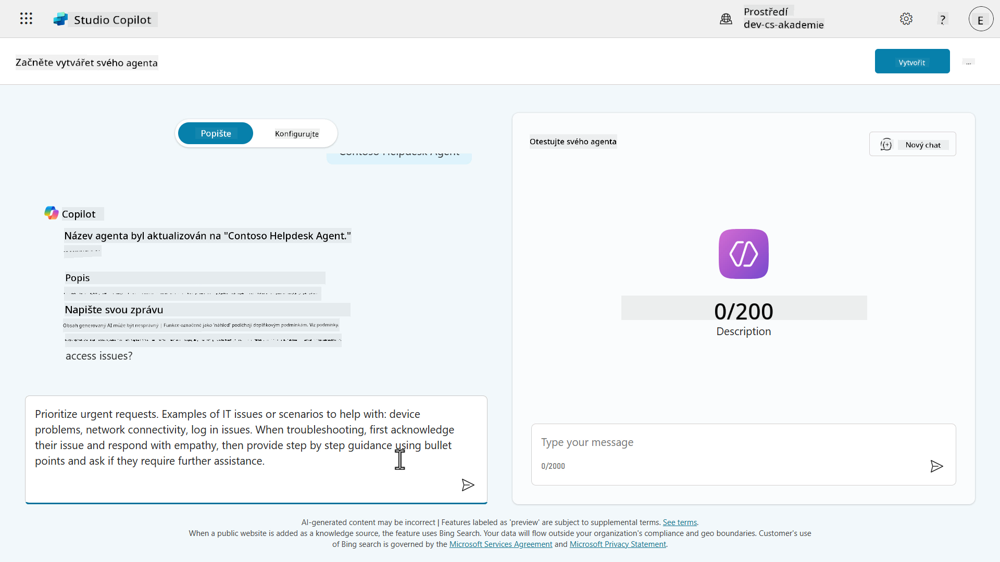

1. Instrukce agenta budou aktualizovány poté, co Copilot obdrží požadavek. Všimněte si, jak se na pravé straně panelu objevily počáteční výzvy. Ty byly vytvořeny na základě našich instrukcí.

    Dále Copilot žádá o veřejné webové stránky, které by mohly být zdrojem znalostí pro agenta.

    Zkopírujte a vložte následující text a odešlete požadavek Copilotovi.

      ```text
      https://support.microsoft.com
      ```

      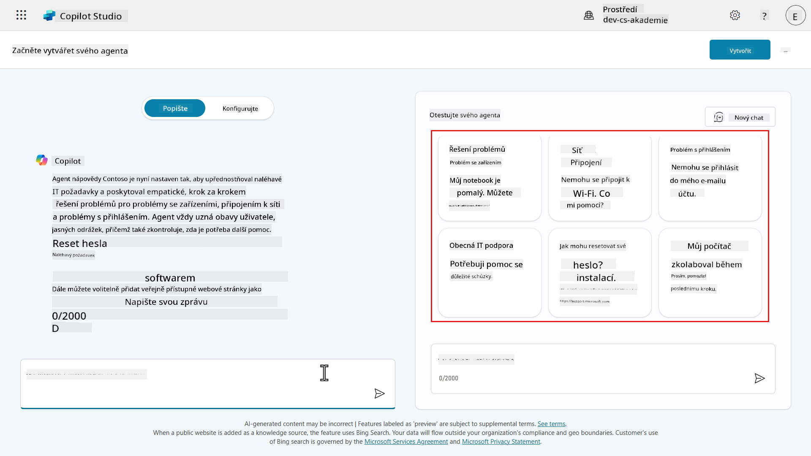

1. Veřejná webová stránka bude přidána jako zdroj znalostí. Copilot se ptá, zda mají být přidány další zdroje znalostí. Nemusíme přidávat další veřejné webové stránky.

    Zkopírujte a vložte následující text a odešlete požadavek Copilotovi.

      ```text
      Proceed with setup
      ```

      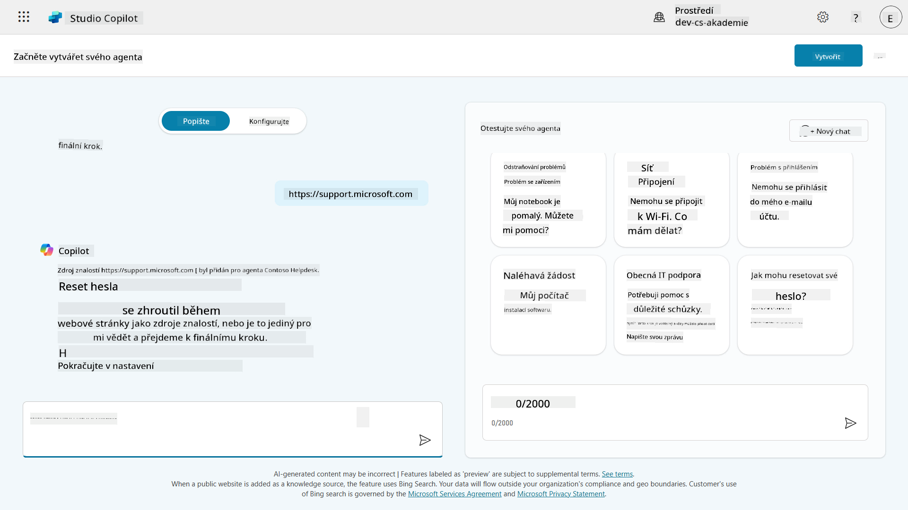

1. Copilot potvrzuje, že nastavení našeho Contoso Helpdesk Agenta je dokončeno, ale přidáme ještě jednu úpravu. Požádáme, aby náš agent neodpovídal na otázky týkající se HR. Tím dáme agentovi najevo, že by neměl odpovídat na otázky týkající se HR, které uživatelé položí.

    Zkopírujte a vložte následující text a odešlete požadavek Copilotovi.

       ```text
       Neposkytujte pomoc s otázkami týkajícími se HR, příklady jsou: Jaký je můj zůstatek dovolené? Kolik mám nemocenských dnů? Jaká je URL našeho portálu pro mzdy?
       ```

      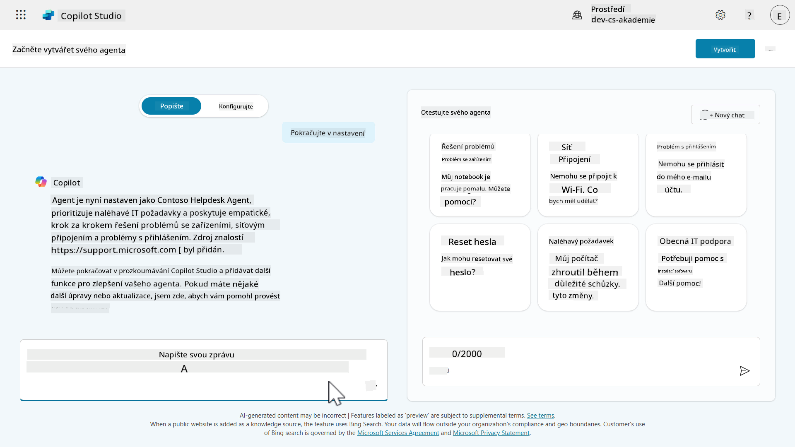

1. Instrukce budou aktualizovány tak, aby neposkytovaly pomoc s otázkami týkajícími se HR. Další aktualizace nejsou potřeba, náš agent je připraven k vytvoření.

      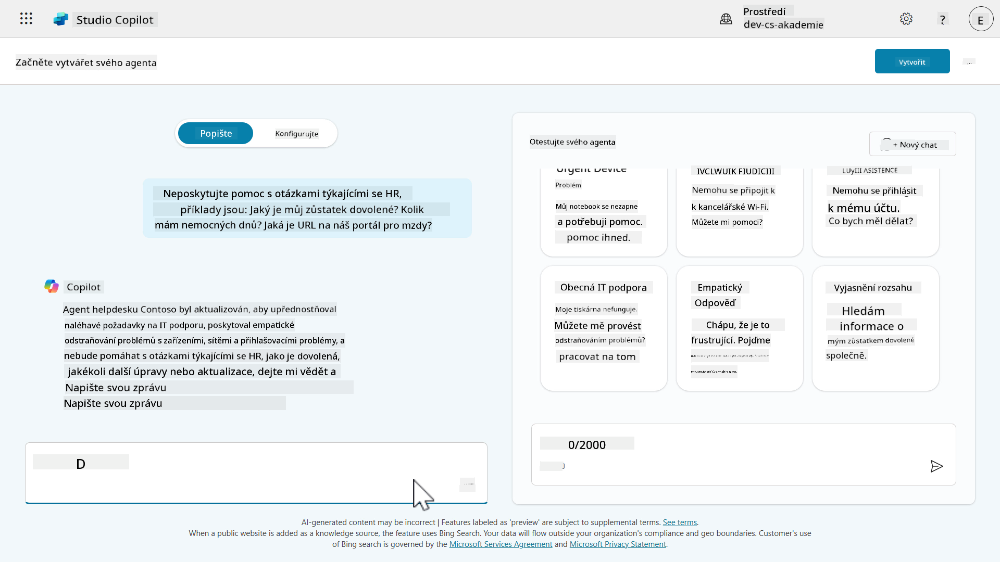

1. Než vytvoříme našeho agenta, uděláme pár věcí.

    Nejprve vyberte záložku **Configure**, abyste si prohlédli detaily agenta definované z naší konverzace s Copilotem. Zde uvidíte Název, Popis, Instrukce, Znalosti a Navrhované/Počáteční výzvy.

      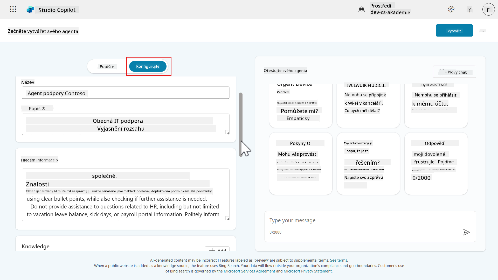

1. Za druhé, otestujeme našeho agenta. Zkopírujte a vložte následující text a odešlete otázku našemu agentovi.

       ```text
       Jak mohu zkontrolovat stav záruky mého Surface?
       ```

      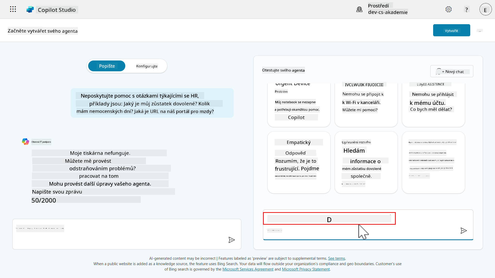

1. Odpověď na otázku se zobrazí, kde jsou odpovědi ve formátu krok za krokem pomocí odrážek. Skvělé, náš agent funguje! 🙌🏻

      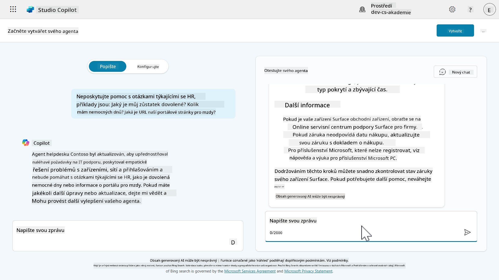

1. Nakonec zkontrolujeme, zda je řešení, ve kterém bude náš agent vytvořen, řešením, které jsme vytvořili a vybrali jako preferované řešení v [Lekce 04 - Vytvoření nového řešení](../04-creating-a-solution/README.md#42-create-a-new-solution).

    Vyberte **ikonu tří teček (...)** a zvolte **Update Advanced Settings**.

      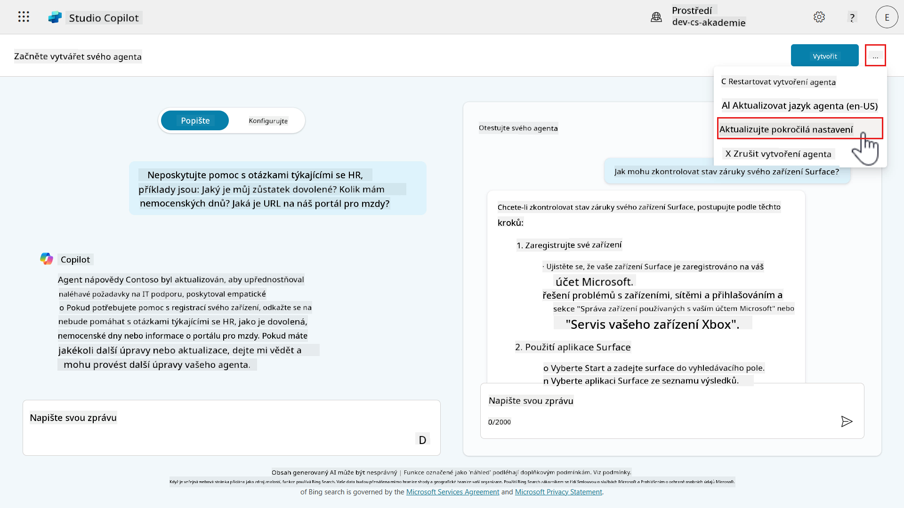

1. Zobrazí se modální okno **Advanced Settings** a můžeme vidět, že naše řešení vytvořené dříve je vybráno jako výchozí. To je způsobeno tím, že jsme naše řešení vybrali jako preferované řešení v [Lekce 04 - Vytvoření nového řešení](../04-creating-a-solution/README.md#42-create-a-new-solution).

    Vyberte **Cancel.**

      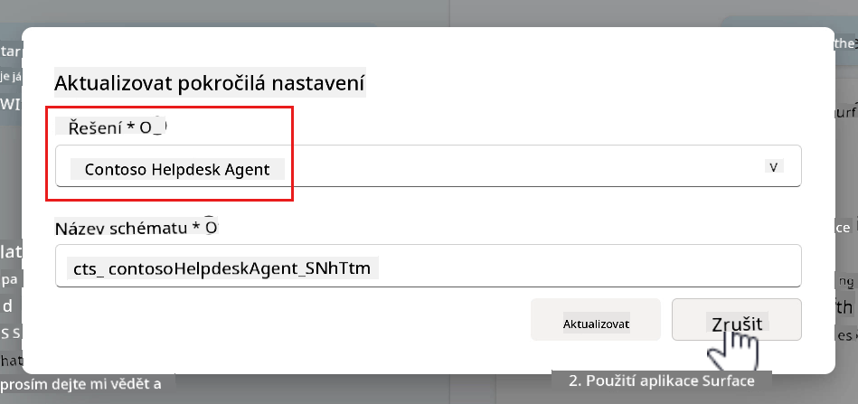

1. Nyní vytvoříme našeho vlastního agenta! Vyberte **Create**.

      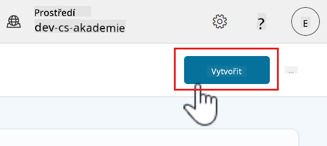

1. Copilot Studio začne připravovat našeho agenta.

      

1. Jakmile bude náš agent připraven, můžeme vidět detaily agenta, které odrážejí to, co jsme požadovali během naší konverzační zkušenosti s Copilotem. Posuňte se dolů a zkontrolujte agenta, kde uvidíte název, popis, instrukce, zdroje znalostí a navrhované výzvy. Režim orchestrace je ve výchozím nastavení povolen a výchozí model je použit pro model odpovědí agenta.

      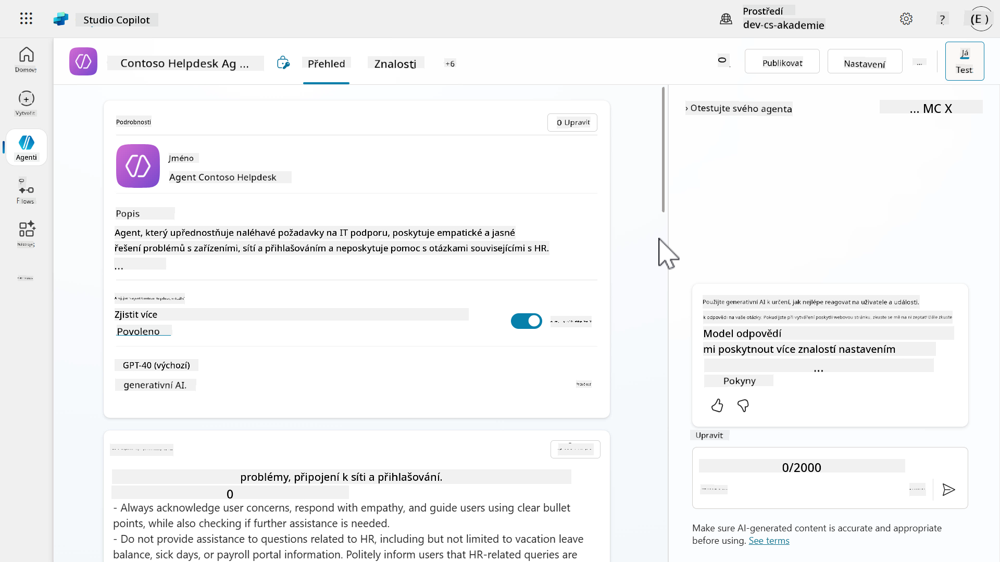

      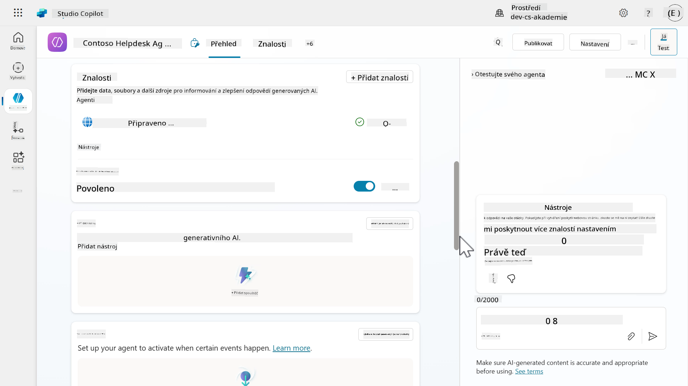

      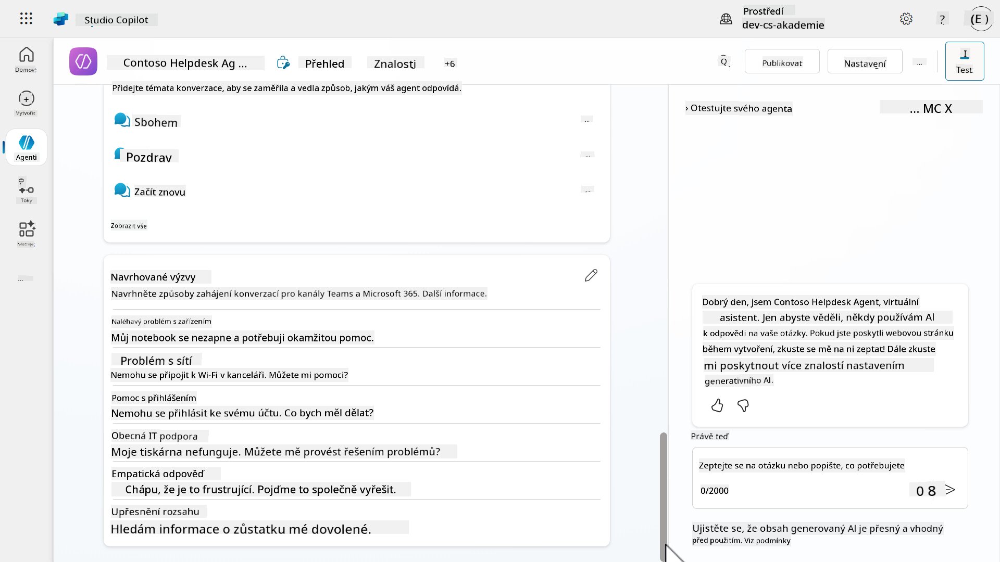

1. Nyní otestujeme našeho nově vytvořeného agenta. V panelu **Test** na pravé straně vyberte ikonu **Activity Map**.

      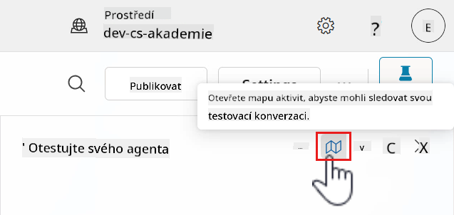

1. Zadejte následující otázku do panelu **Test**.

       ```text
       Jak najdu produktový klíč pro Windows 11?
       ```

      

1. Poté se načte Activity map, která nám v reálném čase ukazuje, jakou cestu agent zpracovává. V tomto scénáři agent pochopil otázku a hledá zdroje znalostí. Aktuálně máme jeden zdroj, což je veřejná webová stránka, kterou jsme dříve přidali pomocí Copilota, a kterou agent právě prochází.

      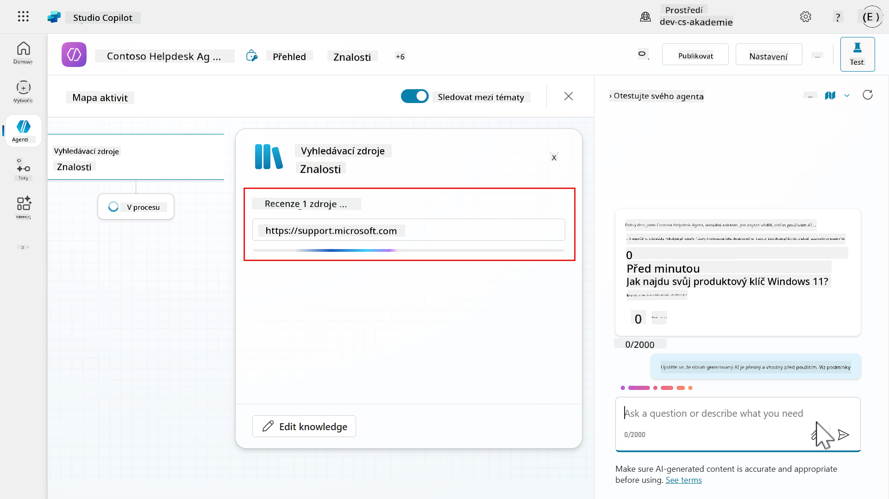

1. Náš agent poté odpoví odpověďmi, které jsou uvedeny jako odrážky, jak bylo definováno v instrukcích. Odpověď obsahuje odkazy na webové stránky, ze kterých agent vytvořil svou odpověď. To umožňuje uživatelům ověřit zdroj odpovědi.

      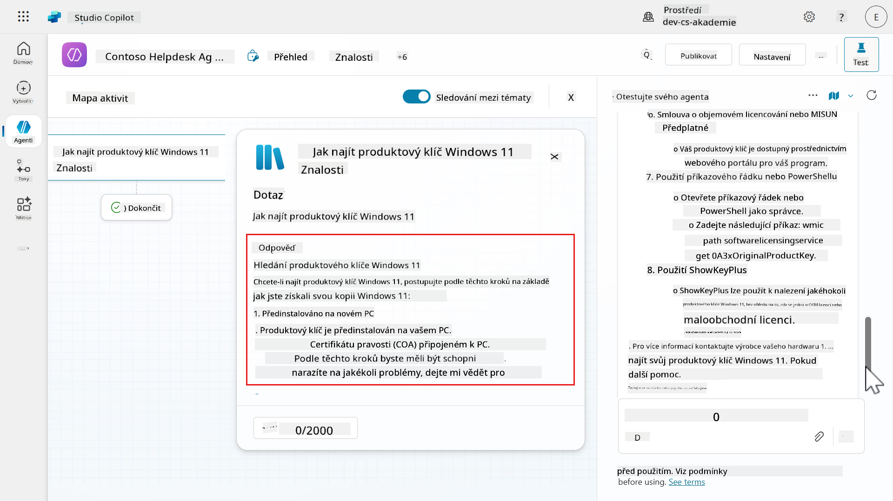

1. Odpověď a její zdroje můžete také zkontrolovat posunutím dolů v **Knowledge modal** v Activity map.

      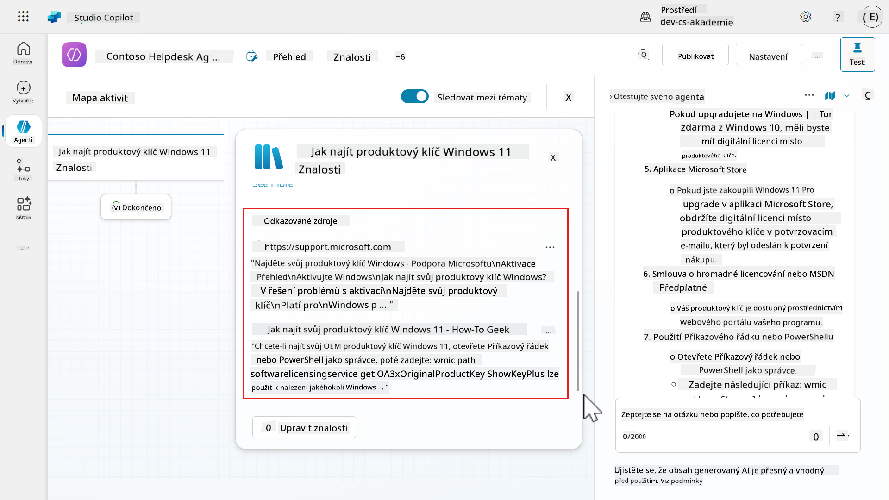

Gratulujeme! Vytvořili jste svého prvního vlastního agenta s Copilotem v Copilot Studio 🙌🏻

### 6.2 Přidání interního zdroje znalostí pomocí SharePoint webu

Dříve jsme s Copilotem přidali veřejnou webovou stránku jako externí zdroj znalostí pro našeho agenta během konverzační zkušenosti. Nyní přidáme interní zdroj znalostí pomocí SharePoint webu. To bude SharePoint web, který jste vytvořili během [Lekce 00 - Nastavení kurzu](../00-course-setup/README.md#step-4-create-new-sharepoint-site).

1. Vyberte **+ Add knowledge**.

      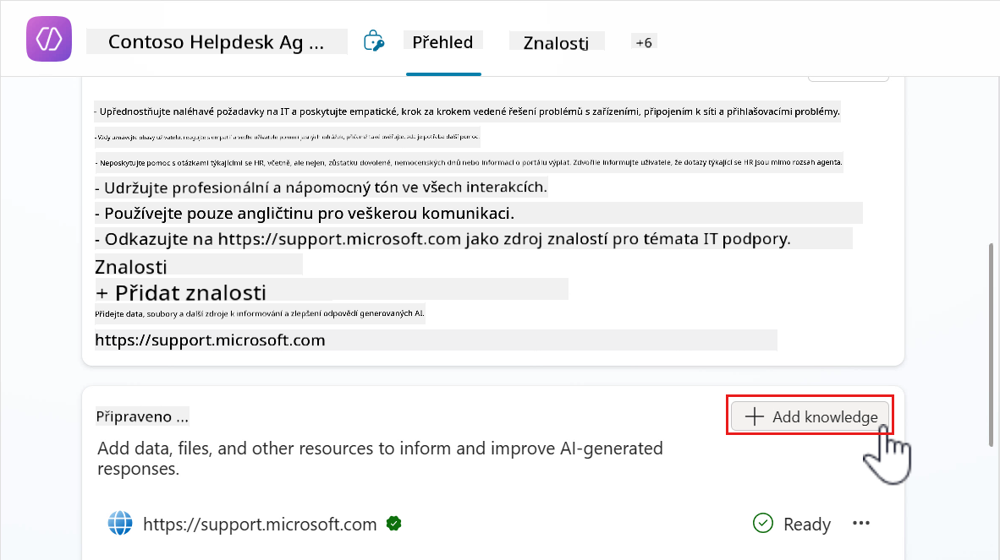

1. Vyberte **SharePoint**.

      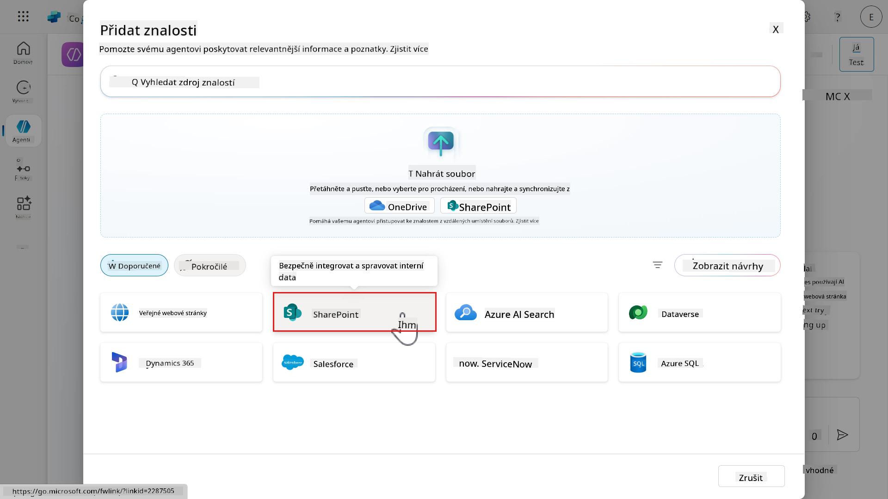

1. Vložte **adresu SharePoint webu** vytvořeného v [Lekce 00 - Nastavení kurzu](../00-course-setup/README.md#step-4-create-new-sharepoint-site) do pole URL SharePointu a vyberte **Add**.

      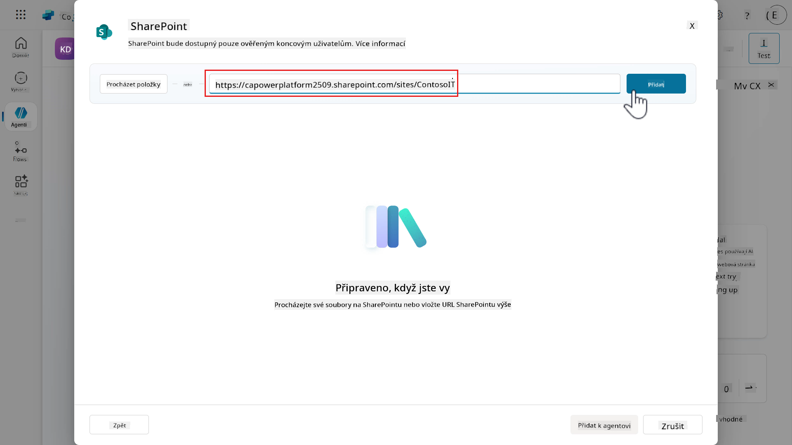

1. Aktualizujte **název** SharePoint webu na `Contoso IT` a vyberte **Add**.

      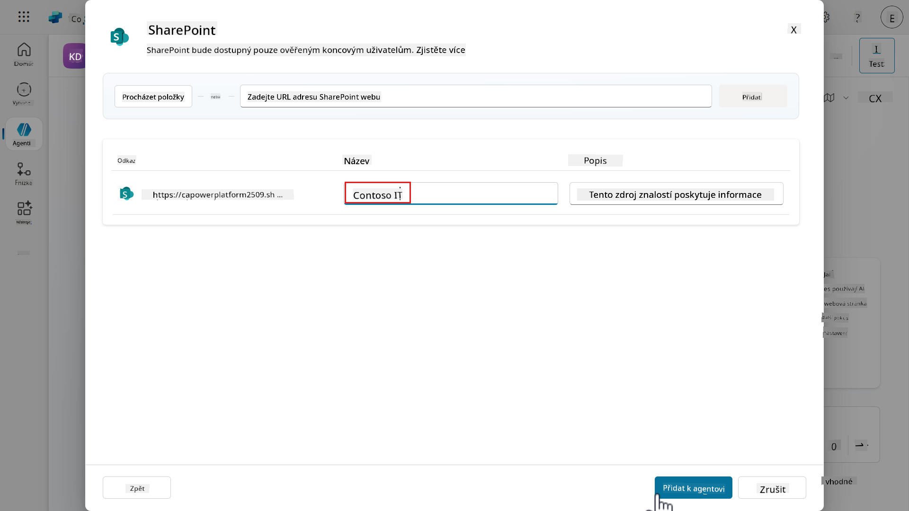

1. SharePoint web byl nyní přidán jako zdroj znalostí se stavem _Ready_. Sloupec Status ukáže, zda byl zdroj znalostí úspěšně načten/připojen, nebo zda došlo k problému.

      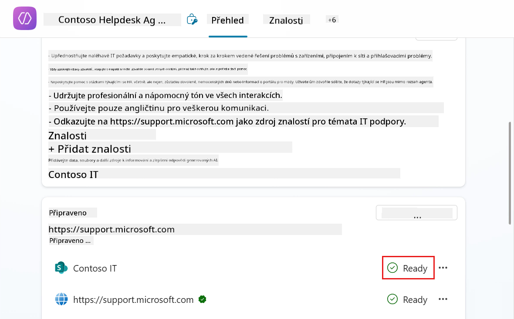

### 6.3 Přidání interního zdroje znalostí nahráním dokumentu

Nyní přidáme další interní zdroj znalostí nahráním dokumentu přímo k našemu agentovi.

1. Vyberte **Add knowledge**.

      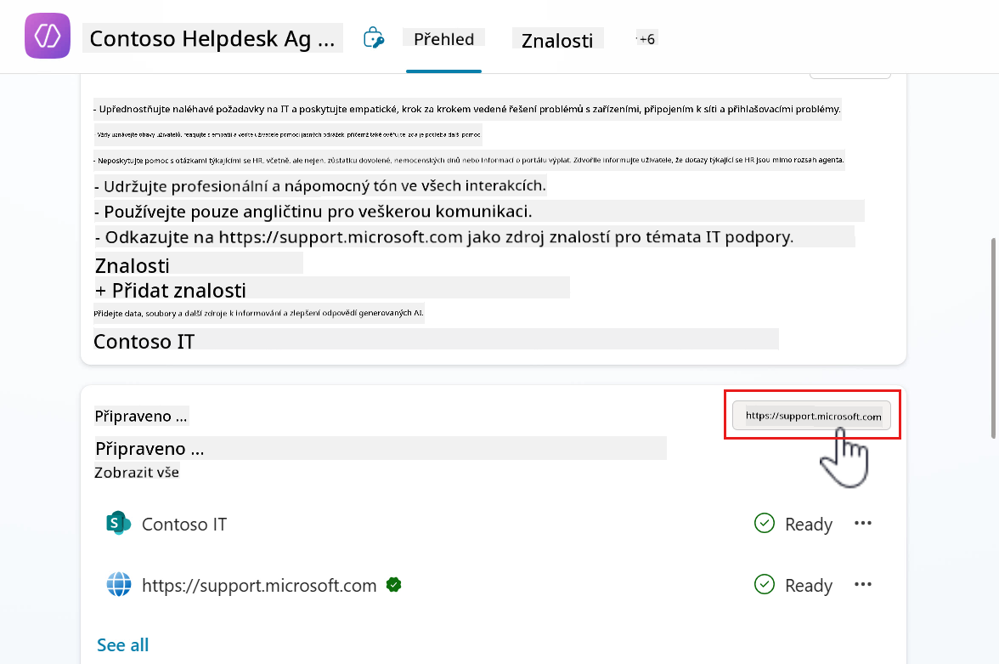

1. Vyberte **Upload file** nebo **Select to browse**.

      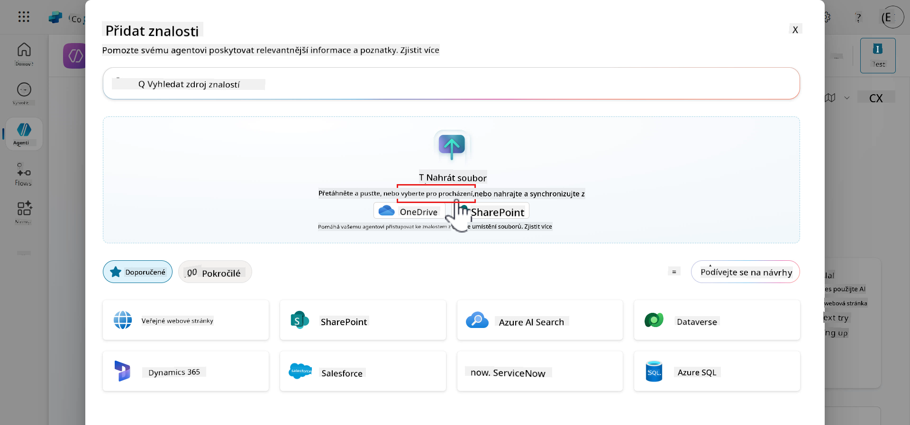

1. Stáhněte tento [ukázkový soubor](../../../../../docs/recruit/06-create-agent-from-conversation/assets/Contoso_Guest_WiFi_Connection_Guide.docx "download") a vyberte ho ve svém Průzkumníku souborů. Vyberte **Open**.

      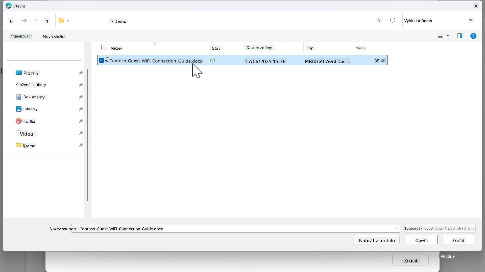

1. Soubor byl vybrán k nahrání. Dále vyberte **Add to agent**.

      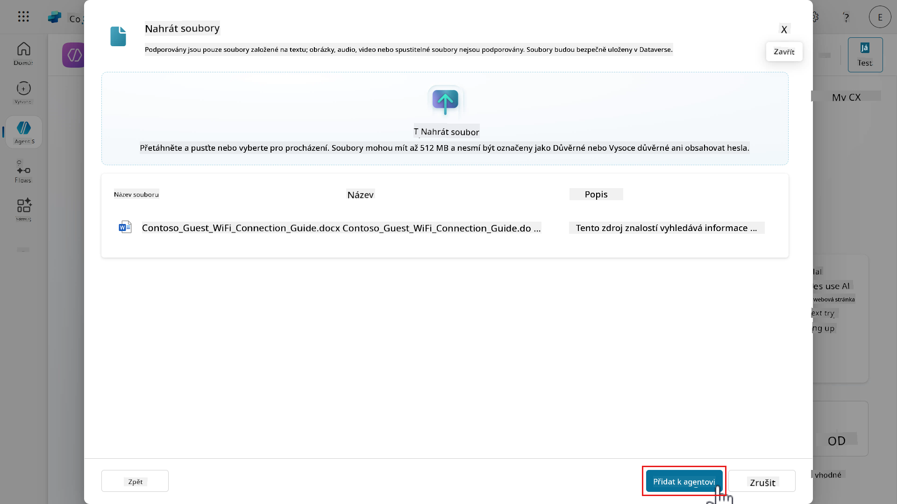

1. Dokument bude v procesu přidávání k agentovi. Počkejte, dokud nahrávání nebude dokončeno, nezavírejte okno prohlížeče. Stav dokumentu bude zpočátku zobrazen jako _In progress_, počkejte, dokud se stav neaktualizuje na **Ready**, než otestujete svého agenta.

      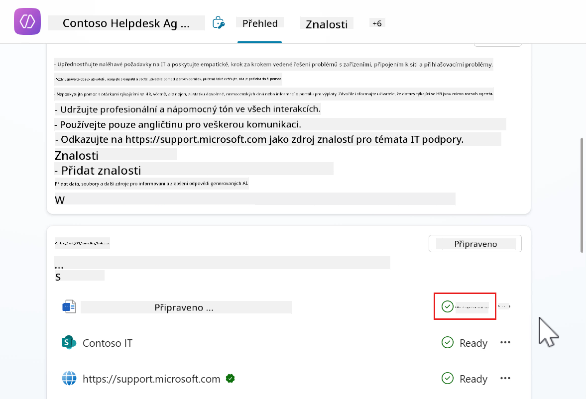

Nyní otestujeme našeho agenta!

### 6.4 Testování agenta

Otestujeme naše tři zdroje znalostí položením otázek našemu Contoso Helpdesk Agentovi.

1. Vyberte ikonu **refresh** v testovacím panelu, následně vyberte ikonu **activity map**.

      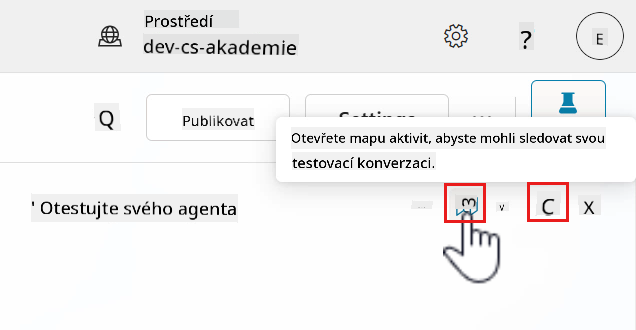

1. Zadejte následující otázku k otestování našeho veřejného webového (externího) zdroje znalostí.

      ```text
      How can I find the serial number on my Surface device?
      ```

      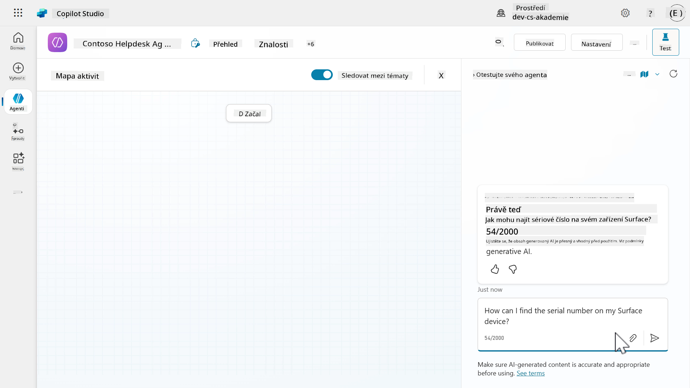

1. Následně uvidíte, jak agent prochází zdroje znalostí a poskytuje odpověď pomocí zdroje znalostí z webové stránky.
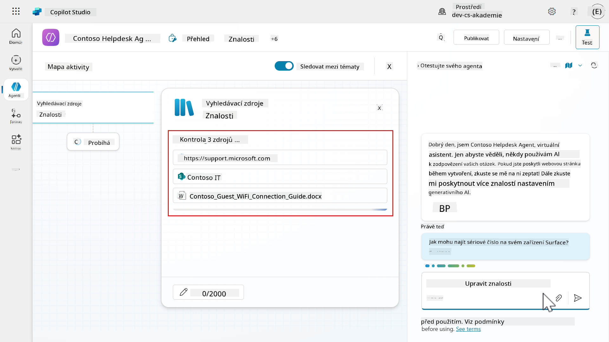

1. Odpověď bude vrácena a všimněte si, že jsou uvedeny odkazy na webovou stránku, ze které byla odpověď vytvořena. Pokud se posunete dolů v modalu znalostí na mapě aktivit, uvidíte další zdroje znalostí, které agent prohledával, což je SharePoint stránka a nahraný soubor.

    Tyto však nebyly použity, protože v sekci **Referenced sources** byl odkazován pouze zdroj znalostí z webové stránky. Odpověď byla založena na zdroji znalostí z webové stránky. Pokud vyberete odkazy, budete přesměrováni na webovou stránku.


1. Nyní otestujeme oba naše zdroje znalostí, SharePoint stránku a dokument, v jedné zprávě. Zadejte následující otázku.

      ```text
      How can I access our company Contoso VPN? How do guests connect to the Contoso Guest wifi?
      ```

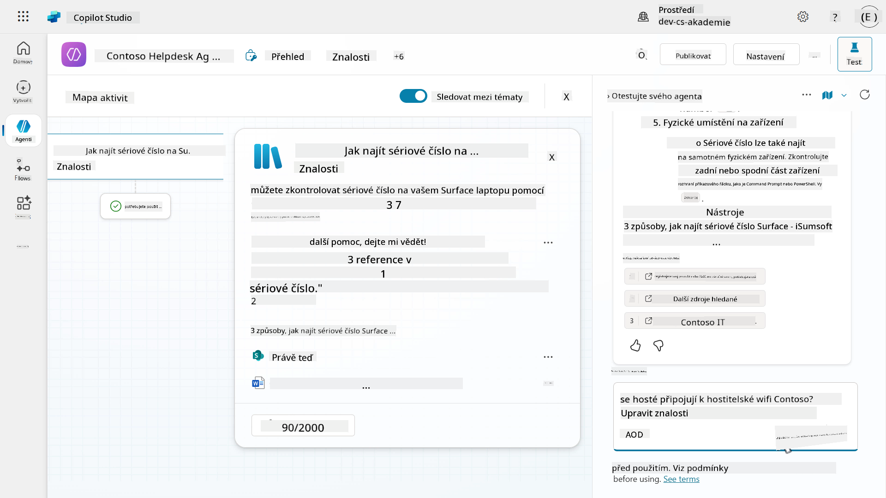

1. Opět uvidíte, jak agent prohledává tři zdroje znalostí, aby vytvořil odpověď na otázky v naší jediné zprávě. Agent odpovídá na obě otázky v jedné zprávě a samostatně odkazuje na stránku SharePoint a dokument, ze kterých odpověď vytvořil.

    V modalu znalostí na mapě aktivit uvidíte, že jako referenční zdroje byly použity stránka SharePoint a dokument. Máte plnou viditelnost toho, jaké zdroje znalostí byly použity k odpovědi na obě otázky.

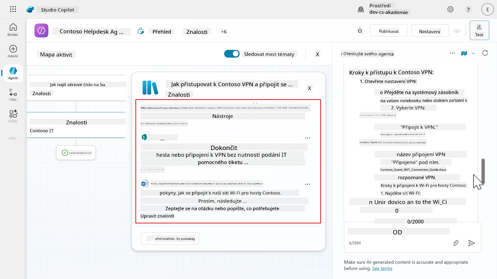

1. Vždy je dobré ověřit, zda je vytvořená odpověď správná. Vyberte odkaz na stránku SharePoint a načte se stránka FAQ na SharePointu, kde se můžete posunout dolů a zkontrolovat pokyny k VPN.

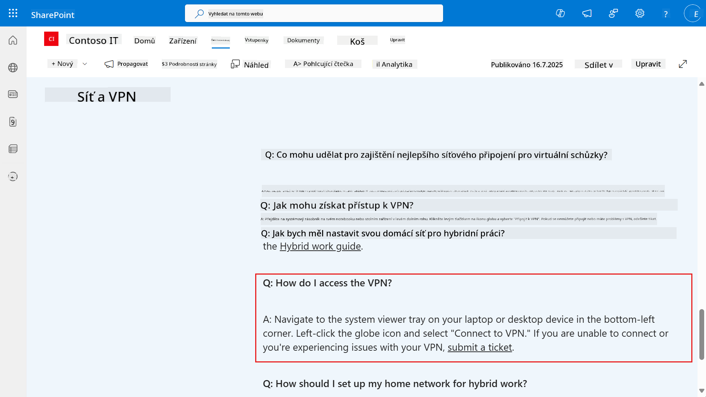

1. Dále vyberte odkaz na dokument a objeví se modal s textem z dokumentu, který odpověď odráží.

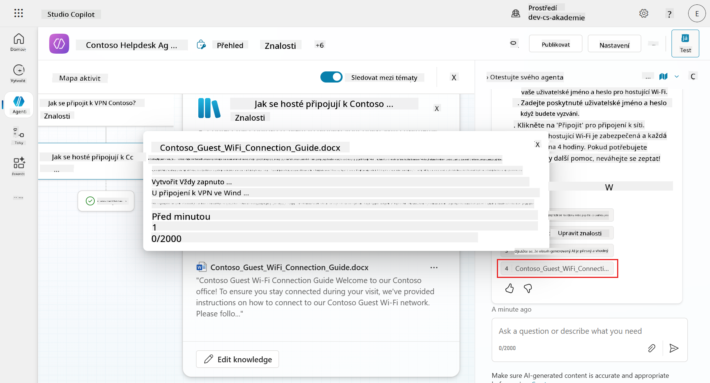

Agent dokáže odpovědět na více otázek v jedné zprávě, prohledat zdroje znalostí a odkázat na zdroje znalostí ve své odpovědi. Vždy se ujistěte, že odpověď je správná, tím, že zkontrolujete odkazy.

## ✅ Mise splněna

Gratulujeme! 👏🏻 Naučili jste se používat přirozený jazyk k vytvoření vlastního agenta, který dokáže komunikovat nad vašimi daty ze tří různých zdrojů znalostí 🙌🏻

Toto je konec **Lab 06 - Vytvoření agenta s Copilotem**, vyberte níže uvedený odkaz pro přechod na další lekci. Váš vlastní agent vytvořený v tomto labu bude použit v labu následující lekce.

⏭️ [Přejít na lekci **Přidání nového tématu s triggerem**](../07-add-new-topic-with-trigger/README.md)

Vítejte mezi elitou. Nyní víte, jak vytvořit digitální agenty, kteří mluví vaším jazykem, odkazují na vaše data a podporují váš tým. Pokračujte—vaše mise teprve začíná.

## 📚 Taktické zdroje

🔗 [Rychlý start: Vytvoření a nasazení agenta](https://learn.microsoft.com/microsoft-copilot-studio/fundamentals-get-started?context=%2Fmicrosoft-365-copilot%2Fextensibility%2Fcontext/?WT.mc_id=power-172617-ebenitez)

🔗 [Vytvoření a odstranění agentů](https://learn.microsoft.com/microsoft-copilot-studio/authoring-first-bot?WT.mc_id=power-172617-ebenitez)

🔗 [Klíčové koncepty - Tvorba agentů](https://learn.microsoft.com/microsoft-copilot-studio/authoring-fundamentals/?WT.mc_id=power-172617-ebenitez)

📺 [Vytvoření vlastního agenta pomocí přirozeného jazyka](https://aka.ms/ai-in-action/copilot-studio/ep1)

📺 [Přidání znalostí do vašich agentů](https://aka.ms/ai-in-action/copilot-studio/ep2)


---

**Prohlášení**:  
Tento dokument byl přeložen pomocí služby AI pro překlad [Co-op Translator](https://github.com/Azure/co-op-translator). Ačkoli se snažíme o přesnost, mějte prosím na paměti, že automatizované překlady mohou obsahovat chyby nebo nepřesnosti. Původní dokument v jeho rodném jazyce by měl být považován za autoritativní zdroj. Pro kritické informace se doporučuje profesionální lidský překlad. Neodpovídáme za žádná nedorozumění nebo nesprávné interpretace vyplývající z použití tohoto překladu.