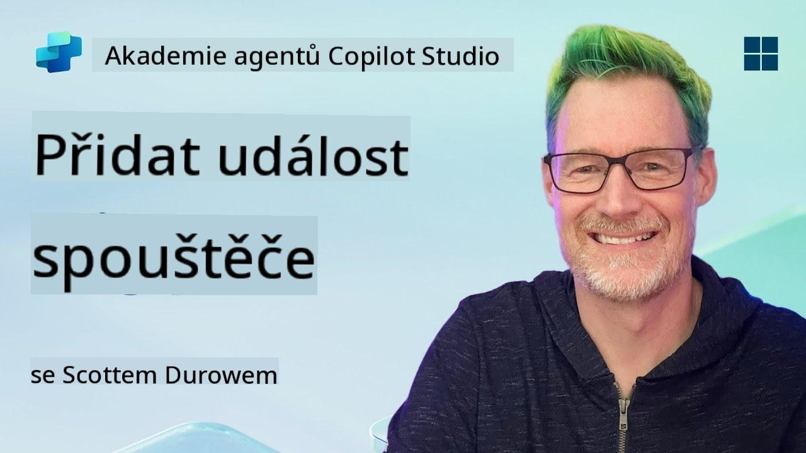
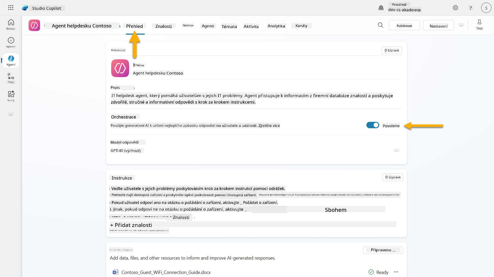
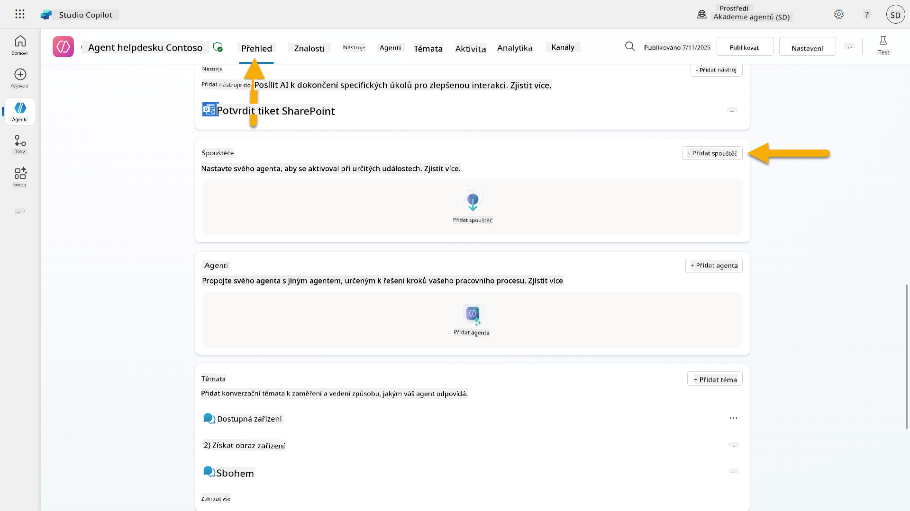
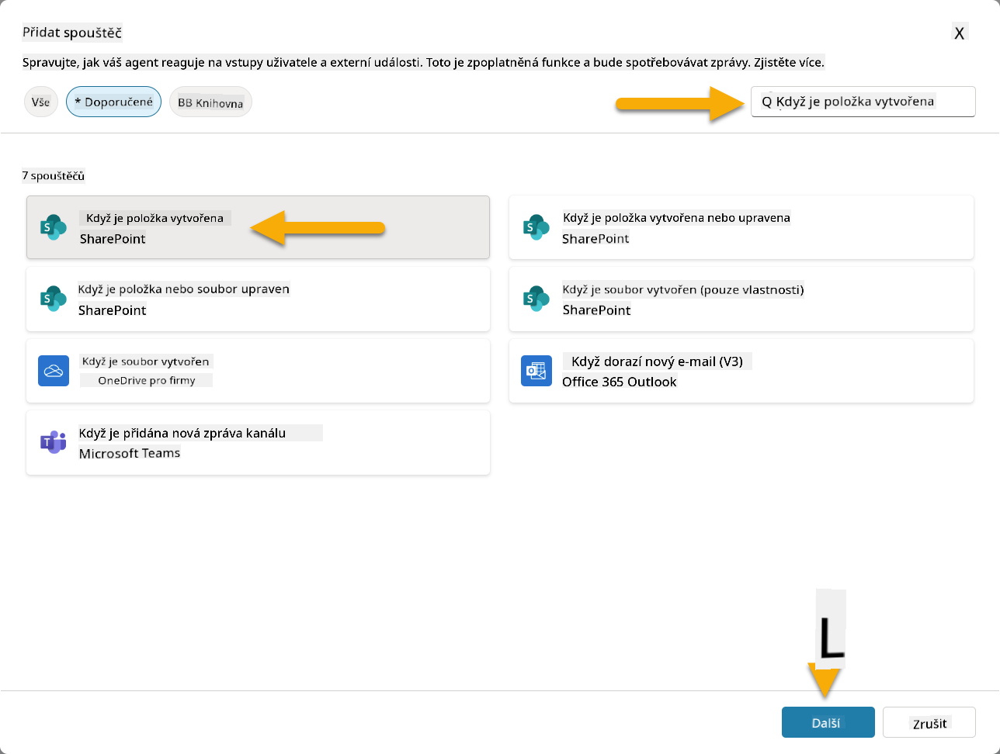
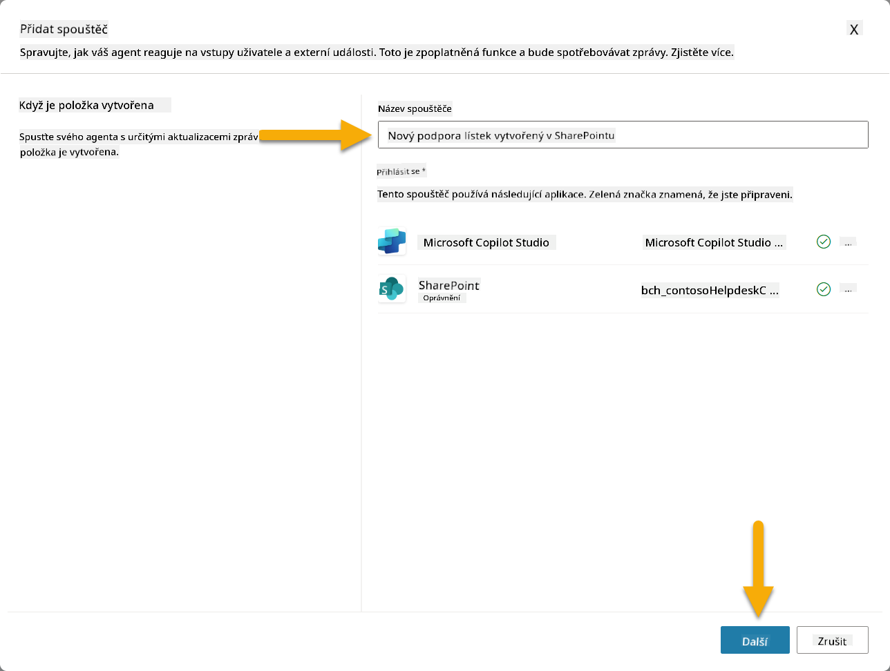
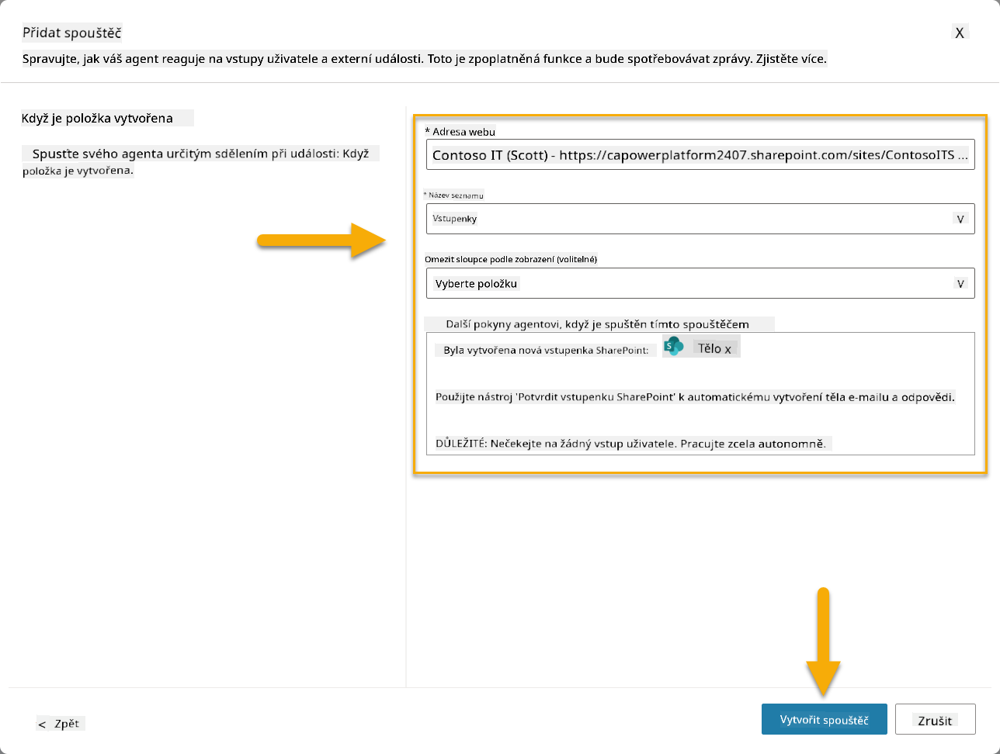
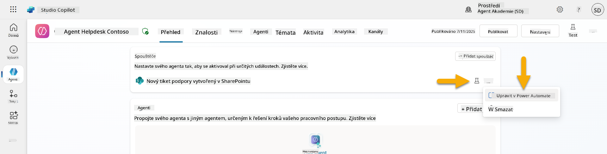
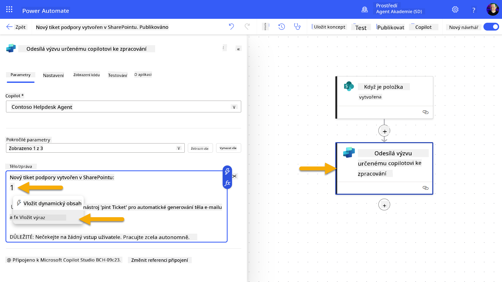
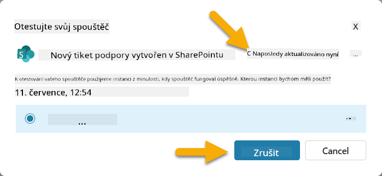
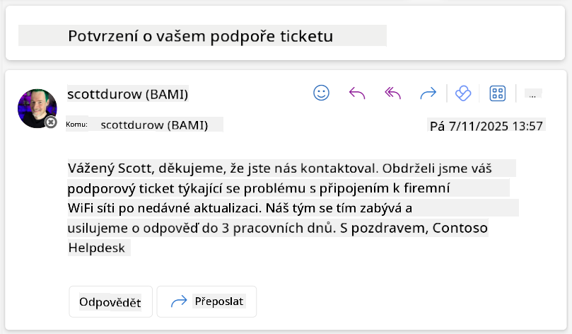

<!--
CO_OP_TRANSLATOR_METADATA:
{
  "original_hash": "cd99a76bcb7372ac2771b6ae178b023d",
  "translation_date": "2025-10-20T17:50:13+00:00",
  "source_file": "docs/recruit/10-add-event-triggers/README.md",
  "language_code": "cs"
}
-->
# 🚨 Mise 10: Přidání spouštěčů událostí - Aktivace schopností autonomního agenta

## 🕵️‍♂️ KRYCÍ NÁZEV: `OPERACE DUCHOVNÍ RUTINA`

> **⏱️ Časový rámec operace:** `~45 minut`

🎥 **Podívejte se na průvodce**

[](https://www.youtube.com/watch?v=ZgwHL8PQ1nY "Podívejte se na průvodce na YouTube")

## 🎯 Mise

Je čas povýšit vašeho agenta z konverzačního asistenta na autonomního operativce. Vaším úkolem je umožnit vašemu agentovi jednat bez vyzvání - reagovat na signály z vašeho digitálního prostředí s přesností a rychlostí.

Díky spouštěčům událostí naučíte svého agenta sledovat externí systémy jako SharePoint, Teams a Outlook a provádět inteligentní akce okamžitě po obdržení signálu. Tato operace promění vašeho agenta v plně funkčního terénního agenta - tichého, rychlého a neustále bdělého.

Úspěch znamená vytvořit agenty, kteří iniciují hodnotu - nejen na ni reagují.

## 🔎 Cíle

📖 Tato lekce pokryje:

- Porozumění spouštěčům událostí a tomu, jak umožňují autonomní chování agenta
- Naučení se rozdílu mezi spouštěči událostí a spouštěči témat, včetně pracovních postupů spouštěčů a datových balíčků
- Prozkoumání běžných scénářů spouštěčů událostí
- Porozumění autentizaci, bezpečnosti a publikování agentů řízených událostmi
- Vytvoření autonomního agenta IT Help Desk, který reaguje na události v SharePointu a odesílá potvrzovací e-maily

## 🤔 Co je spouštěč událostí?

**Spouštěč událostí** je mechanismus, který umožňuje vašemu agentovi jednat autonomně v reakci na externí události, aniž by vyžadoval přímý vstup uživatele. Představte si to jako způsob, jak "naučit" svého agenta sledovat konkrétní události a automaticky jednat, když k těmto událostem dojde.

Na rozdíl od spouštěčů témat, které vyžadují, aby uživatelé něco napsali pro aktivaci konverzace, spouštěče událostí se aktivují na základě událostí, které se odehrávají ve vašich připojených systémech. Například:

- Když je vytvořen nový soubor v SharePointu nebo OneDrive for Business
- Když je vytvořen záznam v Dataverse
- Když je úkol dokončen v Planneru
- Když je odeslána nová odpověď na Microsoft Form
- Když je přidána nová zpráva v Microsoft Teams
- Na základě opakovaného plánu (například denní připomínky)  


### Proč jsou spouštěče událostí důležité pro autonomní agenty

Spouštěče událostí transformují vašeho agenta z reaktivního asistenta na proaktivního, autonomního pomocníka:

1. **Autonomní provoz** - váš agent může pracovat 24/7 bez lidského zásahu, reagovat na události, jakmile k nim dojde.
    - *Příklad:* Automaticky přivítat nové členy týmu, když jsou přidáni do týmu.

1. **Reakce v reálném čase** - místo čekání na dotazy uživatelů váš agent okamžitě reaguje na relevantní události.
    - *Příklad*: Upozornit IT tým, když je upraven dokument v SharePointu.

1. **Automatizace pracovních postupů** - propojit více akcí na základě jedné spouštěcí události.
    - *Příklad:* Když je vytvořen nový tiket podpory, vytvořit úkol, upozornit manažera a aktualizovat sledovací panel.

1. **Konzistentní procesy** - zajistit, že důležité kroky nebudou opomenuty automatizací reakcí na klíčové události.
    - *Příklad:* Každý nový zaměstnanec automaticky obdrží materiály pro zaškolení a žádosti o přístup.

1. **Akce založené na datech** - využít informace z vyvolávající události k chytrým rozhodnutím a provedení vhodných akcí.
    - *Příklad:* Přesměrovat naléhavé tikety na vedoucí pracovníky na základě úrovně priority v datovém balíčku spouštěče.

## ⚙️ Jak fungují spouštěče událostí?

Spouštěče událostí fungují prostřednictvím tříkrokového pracovního postupu, který umožňuje vašemu agentovi autonomně reagovat na externí události:

### Pracovní postup spouštěče

1. **Detekce události** - V připojeném systému (SharePoint, Teams, Outlook atd.) dojde ke konkrétní události.
1. **Aktivace spouštěče** - Spouštěč události detekuje tuto událost a odešle datový balíček vašemu agentovi prostřednictvím Power Automate Cloud Flow.
1. **Reakce agenta** - Váš agent obdrží datový balíček a provede instrukce, které jste definovali.

### Spouštěče událostí vs. spouštěče témat

Porozumění rozdílu mezi těmito dvěma typy spouštěčů je klíčové:

| **Spouštěče událostí** | **Spouštěče témat** |
|------------------------|--------------------|
| Aktivovány událostmi v externím systému | Aktivovány vstupem/frázemi uživatele |
| Umožňují autonomní chování agenta | Umožňují konverzační reakce |
| Používají autentizaci tvůrce | Možnost autentizace uživatele |
| Fungují bez interakce s uživatelem | Vyžadují zahájení konverzace uživatelem |
| Příklady: Vytvoření souboru, přijetí e-mailu | Příklad: "Jaké je počasí?" |

## 📦 Porozumění datovým balíčkům spouštěčů

Když dojde k události, spouštěč odešle vašemu agentovi **datový balíček**, který obsahuje informace o události a instrukce, jak reagovat.

### Výchozí vs. vlastní datové balíčky

Každý typ spouštěče má výchozí strukturu datového balíčku, ale můžete ji přizpůsobit:

**Výchozí datový balíček** - Používá standardní formát jako `Použít obsah z {Body}`

- Obsahuje základní informace o události
- Používá obecné instrukce pro zpracování
- Vhodné pro jednoduché scénáře

**Vlastní datový balíček** - Přidává konkrétní instrukce a formátování dat

- Zahrnuje podrobné pokyny pro vašeho agenta
- Specifikuje přesně, jaká data použít a jak
- Lepší pro složité pracovní postupy

### Instrukce agenta vs. instrukce datového balíčku

Máte dvě místa, kde můžete řídit chování vašeho agenta pomocí spouštěčů událostí:

**Instrukce agenta** (Globální)

- Obecné pokyny, které platí pro všechny spouštěče
- Příklad: "Při zpracování tiketů vždy nejprve zkontrolujte duplicity"
- Nejlepší pro obecné vzorce chování

**Instrukce datového balíčku** (Specifické pro spouštěč)

- Konkrétní pokyny pro jednotlivé typy spouštěčů  
- Příklad: "Pro tuto aktualizaci SharePointu pošlete souhrn do projektového kanálu"
- Nejlepší pro složité agenty s více spouštěči

💡 **Tip**: Vyhněte se konfliktním pokynům mezi těmito dvěma úrovněmi, protože to může způsobit neočekávané chování.

## 🎯 Běžné scénáře spouštěčů událostí

Zde jsou praktické příklady, jak spouštěče událostí mohou zlepšit vašeho agenta:

### Agent IT Help Desk

- **Spouštěč**: Nová položka seznamu SharePoint (tiket podpory)
- **Akce**: Automaticky kategorizovat, přiřadit prioritu a upozornit příslušné členy týmu

### Agent pro zaškolení zaměstnanců

- **Spouštěč**: Nový uživatel přidán do Dataverse
- **Akce**: Poslat uvítací zprávu, vytvořit úkoly pro zaškolení a zajistit přístup

### Agent projektového managementu

- **Spouštěč**: Dokončený úkol v Planneru
- **Akce**: Aktualizovat projektový panel, upozornit zainteresované strany a zkontrolovat překážky

### Agent správy dokumentů

- **Spouštěč**: Soubor nahrán do konkrétní složky SharePointu
- **Akce**: Extrahovat metadata, aplikovat tagy a upozornit vlastníky dokumentu

### Asistent pro schůzky

- **Spouštěč**: Vytvoření události v kalendáři
- **Akce**: Poslat připomínky před schůzkou a agendu, rezervovat zdroje

## ⚠️ Zvažování publikování a autentizace

Než váš agent bude moci používat spouštěče událostí v produkci, musíte porozumět autentizaci a bezpečnostním aspektům.

### Autentizace tvůrce

Spouštěče událostí používají **přihlašovací údaje tvůrce agenta** pro veškerou autentizaci:

- Váš agent přistupuje k systémům pomocí vašich oprávnění
- Uživatelé mohou potenciálně přistupovat k datům prostřednictvím vašich přihlašovacích údajů
- Veškeré akce jsou prováděny "jako vy", i když uživatelé interagují s agentem

### Nejlepší postupy ochrany dat

Pro zachování bezpečnosti při publikování agentů se spouštěči událostí:

1. **Vyhodnoťte přístup k datům** - Zkontrolujte, k jakým systémům a datům mají vaše spouštěče přístup
1. **Důkladně testujte** - Porozumějte, jaké informace spouštěče zahrnují v datových balíčcích
1. **Omezte rozsah spouštěčů** - Používejte specifické parametry k omezení událostí, které spouštěče aktivují
1. **Zkontrolujte data v balíčcích** - Ujistěte se, že spouštěče neodhalují citlivé informace
1. **Sledujte využití** - Monitorujte aktivitu spouštěčů a spotřebu zdrojů

## ⚠️ Řešení problémů a omezení

Mějte na paměti tyto důležité aspekty při práci se spouštěči událostí:

### Dopady na kvóty a fakturaci

- Každá aktivace spouštěče se počítá do vaší spotřeby zpráv
- Časté spouštěče (například opakování každou minutu) mohou rychle vyčerpat kvótu
- Sledujte využití, abyste se vyhnuli omezením

### Technické požadavky

- K dispozici pouze pro agenty s povolenou generativní orchestrací
- Vyžaduje povolení sdílení cloudových toků s povědomím o řešení ve vašem prostředí

### Prevence ztráty dat (DLP)

- Politiky DLP vaší organizace určují, které spouštěče jsou dostupné
- Administrátoři mohou spouštěče událostí zcela zablokovat
- Kontaktujte svého administrátora, pokud očekávané spouštěče nejsou dostupné

## 🧪 Laboratoř 10 - Přidání spouštěčů událostí pro autonomní chování agenta

### 🎯 Případ použití

Vylepšíte svého agenta IT Help Desk, aby automaticky reagoval na nové požadavky na podporu. Když někdo vytvoří novou položku v seznamu tiketů podpory na SharePointu, váš agent:

1. Automaticky se spustí, když je vytvořen tiket na SharePointu
1. Poskytne podrobnosti o tiketu a instrukce o krocích, které má provést
1. Automaticky potvrdí přijetí tiketu odesílateli prostřednictvím e-mailu generovaného AI

Tato laboratoř demonstruje, jak spouštěče událostí umožňují skutečně autonomní chování agenta.

### Předpoklady

Před zahájením této laboratoře se ujistěte, že máte:

- ✅ Dokončené předchozí laboratoře (zejména Laboratoře 6-8 pro agenta IT Help Desk)
- ✅ Přístup na SharePoint s seznamem tiketů podpory IT
- ✅ Prostředí Copilot Studio s povolenými spouštěči událostí
- ✅ Váš agent má povolenou generativní orchestraci
- ✅ Odpovídající oprávnění na SharePointu a ve vašem prostředí Copilot Studio

### 10.1 Povolení Generativní AI a vytvoření spouštěče pro vytvoření položky na SharePointu

1. Otevřete svého **agenta IT Help Desk** v **Copilot Studio**

1. Nejprve se ujistěte, že je pro vašeho agenta povolena **Generativní AI**:
   - Přejděte na záložku **Přehled**
   - V sekci Orchestrace přepněte **Generativní orchestraci** na **Zapnuto**, pokud již není aktivována  
     

1. Přejděte na záložku **Přehled** a najděte sekci **Spouštěče**

1. Klikněte na **+ Přidat spouštěč**, aby se otevřela knihovna spouštěčů  
    

1. Vyhledejte a vyberte **Když je vytvořena položka** (SharePoint)  
    

1. Nakonfigurujte název spouštěče a připojení:

   - **Název spouštěče:** Nový tiket podpory vytvořen na SharePointu

1. Počkejte na konfiguraci připojení a vyberte **Další** pro pokračování.  
   

1. Nakonfigurujte parametry spouštěče:

   - **Adresa webu**: Vyberte svůj SharePoint web "Contoso IT"

   - **Název seznamu**: Vyberte svůj seznam "Tikety"

   - **Další instrukce pro agenta při aktivaci spouštěčem:**

     ```text
     New Support Ticket Created in SharePoint: {Body}
     
     Use the 'Acknowledge SharePoint Ticket' tool to generate the email body automatically and respond.
     
     IMPORTANT: Do not wait for any user input. Work completely autonomously.
     ```

     

1. Vyberte **Vytvořit spouštěč** pro dokončení vytvoření spouštěče. Automaticky se vytvoří Power Automate Cloud Flow, který autonomně spustí agenta.

1. Vyberte **Zavřít**.

### 10.2 Úprava spouštěče

1. V sekci **Spouštěče** na záložce **Přehled** vyberte nabídku **...** u spouštěče **Nový tiket podpory vytvořen na SharePointu**

1. Vyberte **Upravit v Power Automate**  
   

1. Vyberte uzel **Odesílá výzvu určenému copilotovi ke zpracování**

1. V poli **Tělo/zpráva** odstraňte obsah Těla, **stiskněte klávesu lomítko** (/) a vyberte **Vložit výraz**  
   

1. Zadejte následující výraz, aby agentovi poskytl konkrétní podrobnosti o tiketu:

    ```text
    concat('Submitted By Name: ', first(triggerOutputs()?['body/value'])?['Author/DisplayName'], '\nSubmitted By Email: ', first(triggerOutputs()?['body/value'])?['Author/Email'], '\nTitle: ', first(triggerOutputs()?['body/value'])?['Title'], '\nIssue Description: ', first(triggerOutputs()?['body/value'])?['Description'], '\nPriority: ', first(triggerOutputs()?['body/value'])?['Priority/Value'],'\nTicket ID : ', first(triggerOutputs()?['body/value'])?['ID'])
    ```

1. Vyberte **Přidat**  
     
1. Vraťte se do **Copilot Studio** a sledujte panel **Otestujte svůj spouštěč** pro aktivaci spouštěče. Použijte ikonu **Obnovit** pro načtení události spouštěče, což může trvat několik minut.  
      
1. Jakmile se spouštěč objeví, vyberte **Začít testování**  
1. Klikněte na **Ikonu mapy aktivit** v horní části panelu **Otestujte svého agenta**  
1. Ověřte, že váš agent:  
   - Přijal data spouštěče  
   - Použil nástroj "Potvrdit tiket v SharePointu"  
       
1. Zkontrolujte e-mailovou schránku odesílatele a ověřte, že byl odeslán potvrzovací e-mail  
      
1. Projděte si záložku **Aktivita** v Copilot Studio, abyste viděli kompletní provedení spouštěče a nástroje  

## ✅ Mise splněna  

🎉 **Gratulujeme!** Úspěšně jste implementovali spouštěče událostí s konektorovými nástroji, které umožňují vašemu agentovi pracovat autonomně, automaticky odesílat potvrzovací e-maily a zpracovávat tikety podpory bez zásahu uživatele. Jakmile bude váš agent publikován, bude jednat autonomně vaším jménem.  

🚀 **Co dál**: V naší další lekci se naučíte, jak [publikovat svého agenta](../11-publish-your-agent/README.md) do Microsoft Teams a Microsoft 365 Copilot, aby byl dostupný celé vaší organizaci!  

⏭️ [Přejít na lekci **Publikovat svého agenta**](../11-publish-your-agent/README.md)  

## 📚 Taktické zdroje  

Připraveni ponořit se hlouběji do spouštěčů událostí a autonomních agentů? Podívejte se na tyto zdroje:  

- **Microsoft Learn**: [Udělejte svého agenta autonomním v Copilot Studio](https://learn.microsoft.com/training/modules/autonomous-agents-online-workshop/?WT.mc_id=power-177340-scottdurow)  
- **Dokumentace**: [Přidat spouštěč události](https://learn.microsoft.com/microsoft-copilot-studio/authoring-trigger-event?WT.mc_id=power-177340-scottdurow)  
- **Osvědčené postupy**: [Úvod do spouštěčů v Power Automate](https://learn.microsoft.com/power-automate/triggers-introduction?WT.mc_id=power-177340-scottdurow)  
- **Pokročilé scénáře**: [Použití toků Power Automate s agenty](https://learn.microsoft.com/microsoft-copilot-studio/advanced-flow-create?WT.mc_id=power-177340-scottdurow)  
- **Bezpečnost**: [Prevence ztráty dat pro Copilot Studio](https://learn.microsoft.com/microsoft-copilot-studio/admin-data-loss-prevention?WT.mc_id=power-177340-scottdurow)  

<!-- markdownlint-disable-next-line MD033 -->
  

---

**Prohlášení**:  
Tento dokument byl přeložen pomocí služby AI pro překlady [Co-op Translator](https://github.com/Azure/co-op-translator). I když se snažíme o přesnost, mějte prosím na paměti, že automatizované překlady mohou obsahovat chyby nebo nepřesnosti. Původní dokument v jeho původním jazyce by měl být považován za autoritativní zdroj. Pro důležité informace se doporučuje profesionální lidský překlad. Neodpovídáme za žádná nedorozumění nebo nesprávné interpretace vyplývající z použití tohoto překladu.