<!--
CO_OP_TRANSLATOR_METADATA:
{
  "original_hash": "9dceeba2eae2bb73e328602a060eddab",
  "translation_date": "2025-10-20T17:29:44+00:00",
  "source_file": "docs/recruit/11-publish-your-agent/README.md",
  "language_code": "cs"
}
-->
# 🚨 Mise 11: Publikujte svého agenta

## 🕵️‍♂️ KRYCÍ NÁZEV: `OPERACE PUBLIKOVAT PUBLIKOVAT PUBLIKOVAT`

> **⏱️ Časový rámec operace:** `~30 minut`  

🎥 **Podívejte se na průvodce**

[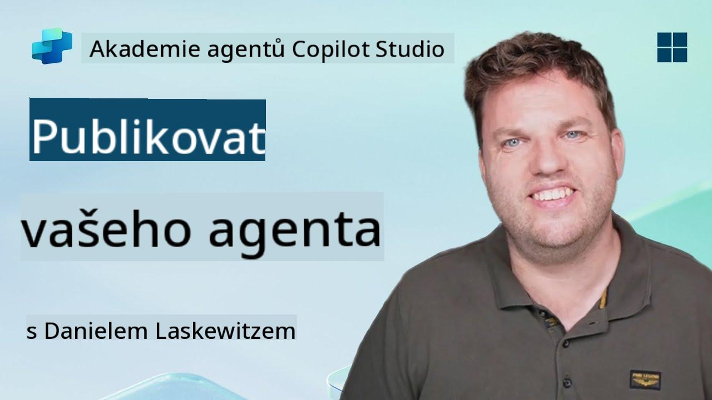](https://www.youtube.com/watch?v=eVZmljhYlSI "Podívejte se na průvodce na YouTube")

## 🎯 Popis mise

Po dokončení série náročných modulů, Agent Maker, jste nyní připraveni na svůj nejdůležitější krok: publikování svého agenta. Je čas zpřístupnit vaše dílo uživatelům v Microsoft Teams a Microsoft 365 Copilot.

Váš agent—vybavený jasným posláním, výkonnými nástroji a přístupem k důležitým zdrojům informací—je připraven sloužit. Pomocí Microsoft Copilot Studio nasadíte svého agenta, aby mohl začít pomáhat skutečným uživatelům přímo tam, kde pracují.

Pojďme spustit vašeho agenta do akce.

## 🔎 Cíle

📖 Tato lekce zahrnuje:

1. Proč je důležité publikovat svého agenta
1. Co se stane, když svého agenta publikujete
1. Jak přidat kanál (Microsoft Teams & Microsoft 365 Copilot)
1. Jak přidat agenta do Microsoft Teams
1. Jak zpřístupnit agenta v Microsoft Teams pro celou organizaci

## 🚀 Publikujte agenta

Pokaždé, když pracujete na agentovi v Copilot Studio, můžete ho aktualizovat přidáním znalostí nebo nástrojů. Když jste se všemi změnami hotovi a důkladně je otestujete, jste připraveni ho publikovat. Publikování zajišťuje, že nejnovější aktualizace jsou aktivní. Pokud aktualizujete svého agenta novými nástroji a nestisknete tlačítko publikovat, nejsou tyto změny zatím dostupné koncovým uživatelům.

Vždy se ujistěte, že stisknete tlačítko publikovat, když chcete aktualizace zpřístupnit uživatelům vašeho agenta. Váš agent může mít přidané kanály, a když stisknete publikovat, aktualizace budou dostupné pro všechny kanály, které jste k agentovi přidali.

## ⚙️ Konfigurace kanálů

Kanály určují, kde mohou vaši uživatelé přistupovat k vašemu agentovi a komunikovat s ním. Po publikování svého agenta ho můžete zpřístupnit v několika kanálech. Každý kanál může zobrazovat obsah vašeho agenta odlišně.

Můžete přidat svého agenta do následujících kanálů:

- **Microsoft Teams a Microsoft 365 Copilot** - Zpřístupněte svého agenta v chatech a schůzkách Teams a v prostředí Microsoft 365 Copilot ([Další informace](https://learn.microsoft.com/microsoft-copilot-studio/publication-add-bot-to-microsoft-teams))
- **Demo webová stránka** - Otestujte svého agenta na demo webové stránce poskytované Copilot Studio ([Další informace](https://learn.microsoft.com/microsoft-copilot-studio/publication-connect-bot-to-web-channels))
- **Vlastní webová stránka** - Vložte svého agenta přímo na svůj vlastní web ([Další informace](https://learn.microsoft.com/microsoft-copilot-studio/publication-connect-bot-to-web-channels))
- **Mobilní aplikace** - Integrujte svého agenta do vlastní mobilní aplikace ([Další informace](https://learn.microsoft.com/microsoft-copilot-studio/publication-connect-bot-to-custom-application))
- **SharePoint** - Přidejte svého agenta na SharePoint stránky pro asistenci s dokumenty a stránkami ([Další informace](https://learn.microsoft.com/microsoft-copilot-studio/publication-add-bot-to-sharepoint))
- **Facebook Messenger** - Spojte se s uživateli prostřednictvím platformy pro zasílání zpráv na Facebooku ([Další informace](https://learn.microsoft.com/microsoft-copilot-studio/publication-add-bot-to-facebook))
- **Power Pages** - Integrujte svého agenta do webových stránek Power Pages ([Další informace](https://learn.microsoft.com/microsoft-copilot-studio/publication-add-bot-to-power-pages))
- **Kanály Azure Bot Service** - Získejte přístup k dalším kanálům, včetně Slack, Telegram, Twilio SMS a dalších ([Další informace](https://learn.microsoft.com/microsoft-copilot-studio/publication-connect-bot-to-azure-bot-service-channels))

Chcete-li přidat kanál, přejděte na záložku **Kanály** ve vašem agentovi a vyberte kanál, který chcete konfigurovat. Každý kanál má specifické požadavky na nastavení a může vyžadovat další autentizaci nebo konfigurační kroky.

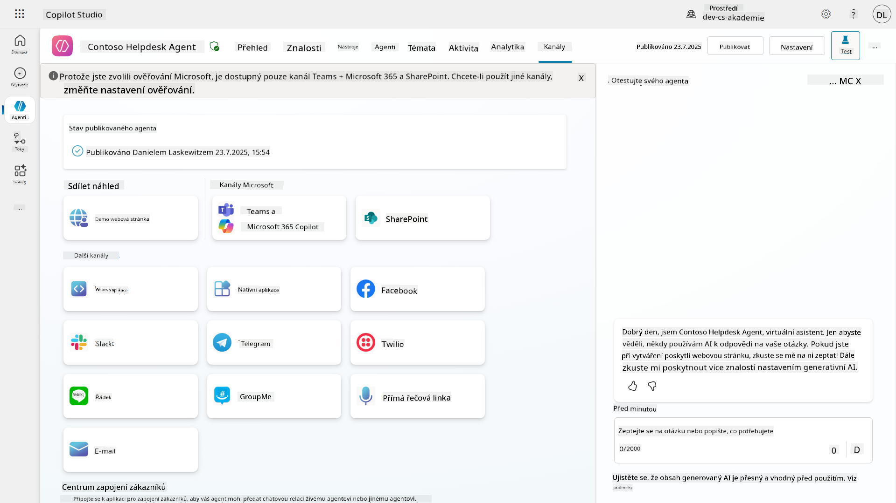

## 📺 Zkušenosti s kanály

Různé kanály nabízejí různé uživatelské zkušenosti. Při vytváření agenta pro více kanálů se ujistěte, že jste si vědomi rozdílů mezi jednotlivými kanály. Vždy je dobré otestovat svého agenta v různých kanálech, abyste se ujistili, že funguje tak, jak jste zamýšleli.

| Zkušenost                      | Webová stránka | Teams a Microsoft 365 Copilot         | Facebook                 | Dynamics Omnichannel pro zákaznický servis                 |
| ------------------------------ | -------------- | -------------------------------------- | ------------------------ | ---------------------------------------------------------- |
| [Dotazník spokojenosti zákazníka][1] | Adaptivní karta | Pouze text                            | Pouze text               | Pouze text                                                  |
| [Možnosti výběru][1]           | Podporováno    | [Podporováno až šest (jako hero karta)][4] | [Podporováno až 13][6]  | [Částečně podporováno][8]                                  |
| [Markdown][2]                  | Podporováno    | [Částečně podporováno][5]             | [Částečně podporováno][7] | [Částečně podporováno][9]                                  |
| [Uvítací zpráva][1]            | Podporováno    | Podporováno                           | Nepodporováno            | Podporováno pro [Chat][10]. Nepodporováno pro jiné kanály. |
| [Mysleli jste tím][3]          | Podporováno    | Podporováno                           | Podporováno              | Podporováno pro [Microsoft Teams][11], [Chat][10], Facebook a textové kanály (SMS přes [TeleSign][12] a [Twilio][13], [WhatsApp][14], [WeChat][15] a [Twitter][16]). Navrhované akce jsou prezentovány jako seznam pouze textových možností; uživatelé musí znovu napsat možnost, aby odpověděli. |

[1]: https://learn.microsoft.com/microsoft-copilot-studio/authoring-create-edit-topics
[2]: https://daringfireball.net/projects/markdown/
[3]: https://learn.microsoft.com/microsoft-copilot-studio/advanced-ai-features
[4]: https://learn.microsoft.com/microsoftteams/platform/concepts/cards/cards-reference#hero-card
[5]: https://learn.microsoft.com/microsoftteams/platform/bots/how-to/format-your-bot-messages#text-only-messages
[6]: https://developers.facebook.com/docs/messenger-platform/send-messages/quick-replies/
[7]: https://www.facebook.com/help/147348452522644?helpref=related
[8]: https://learn.microsoft.com/dynamics365/customer-service/asynchronous-channels#suggested-actions-support
[9]: https://learn.microsoft.com/dynamics365/customer-service/asynchronous-channels#preview-support-for-formatted-messages
[10]: https://learn.microsoft.com/dynamics365/customer-service/set-up-chat-widget
[11]: https://learn.microsoft.com/dynamics365/customer-service/configure-microsoft-teams
[12]: https://learn.microsoft.com/dynamics365/customer-service/configure-sms-channel
[13]: https://learn.microsoft.com/dynamics365/customer-service/configure-sms-channel-twilio
[14]: https://learn.microsoft.com/dynamics365/customer-service/configure-whatsapp-channel
[15]: https://learn.microsoft.com/dynamics365/customer-service/configure-wechat-channel
[16]: https://learn.microsoft.com/dynamics365/customer-service/configure-twitter-channel

> [!NOTE]
> Existují příklady, kde můžete použít odlišnou logiku pro různé kanály. Příklad najdete v repozitáři Power Platform Snippets:
>
> Henry Jammes sdílel příklad, jak zobrazit odlišnou adaptivní kartu, když je kanál Microsoft Teams. ([Odkaz na příklad](https://github.com/pnp/powerplatform-snippets/blob/main/copilot-studio/multiple-topics-matched-topic/source/multiple-topics-matched.yaml#L40))

## 🧪 Laboratoř 11: Publikujte svého agenta do Teams a Microsoft 365 Copilot

### 🎯 Případ použití

Váš agent Contoso IT Help Desk je nyní plně nakonfigurován s výkonnými funkcemi—má přístup ke zdrojům znalostí na SharePointu, dokáže vytvářet tikety podpory, posílat proaktivní oznámení a inteligentně reagovat na dotazy uživatelů. Nicméně všechny tyto funkce jsou momentálně dostupné pouze v prostředí pro vývoj, kde jste je vytvořili.

**Výzva:** Koncoví uživatelé nemohou využívat schopnosti vašeho agenta, dokud nebude správně publikován a zpřístupněn v kanálech, kde skutečně pracují.

**Řešení:** Publikování vašeho agenta zajišťuje, že nejnovější verze—se všemi vašimi nedávnými aktualizacemi, novými tématy, rozšířenými zdroji znalostí a nakonfigurovanými toky—je dostupná skutečným uživatelům. Bez publikování by uživatelé stále komunikovali se starší verzí vašeho agenta, která by mohla postrádat klíčové funkce.

Přidání kanálu Teams a Microsoft 365 Copilot je stejně důležité, protože:

- **Integrace s Teams**: Zaměstnanci vaší organizace tráví většinu svého dne v Microsoft Teams při spolupráci, schůzkách a komunikaci. Přidáním vašeho agenta do Teams mohou uživatelé získat IT podporu, aniž by opustili své primární pracovní prostředí.

- **Microsoft 365 Copilot**: Uživatelé mohou přistupovat k vašemu specializovanému agentovi IT Help Desk přímo v rámci svého prostředí Microsoft 365 Copilot, což umožňuje bezproblémovou integraci do jejich každodenního pracovního procesu napříč aplikacemi Office.

- **Centralizovaný přístup**: Místo toho, aby si uživatelé museli pamatovat různé webové stránky nebo aplikace, mohou přistupovat k IT podpoře prostřednictvím platforem, které již používají, což snižuje překážky a zvyšuje míru přijetí.

Tato mise transformuje vaši vývojovou práci na řešení připravené k produkci, které přináší skutečnou hodnotu koncovým uživatelům vaší organizace.

### Předpoklady

Než začnete s touto laboratoří, ujistěte se, že máte:

- ✅ Dokončené předchozí laboratoře a plně nakonfigurovaného agenta Contoso Helpdesk
- ✅ Váš agent byl otestován a je připraven k použití v produkčním prostředí
- ✅ Oprávnění ve vašem prostředí Copilot Studio k publikování agentů
- ✅ Přístup k Microsoft Teams ve vaší organizaci

### 11.1 Publikujte svého agenta

Nyní, když jsme dokončili veškerou práci na agentovi, musíme zajistit, aby byl dostupný pro koncové uživatele, kteří ho budou používat. Aby byl obsah dostupný pro všechny uživatele, musíme svého agenta publikovat.

1. Přejděte na Contoso Helpdesk Agent v Copilot Studio (přes [portál Copilot Studio maker](https://copilotstudio.microsoft.com))

    V Copilot Studio je snadné publikovat svého agenta. Stačí vybrat tlačítko publikovat v horní části přehledu agenta.

    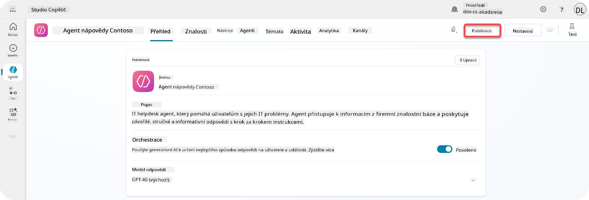

1. Vyberte tlačítko **Publikovat** u svého agenta

    Otevře se vyskakovací okno pro potvrzení, že opravdu chcete svého agenta publikovat.

    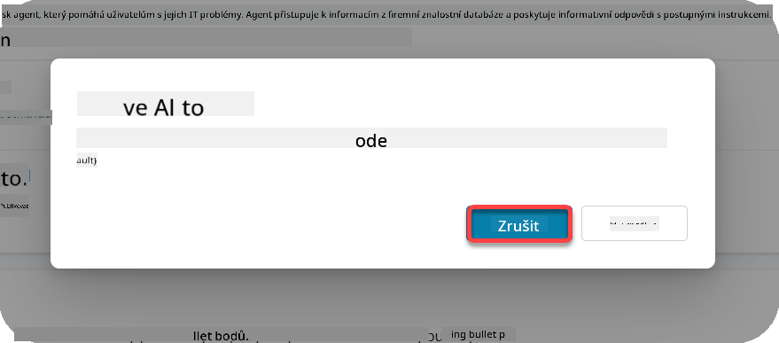

1. Vyberte **Publikovat**, abyste potvrdili publikování svého agenta

    Nyní se zobrazí zpráva, že váš agent se publikuje. Nemusíte mít toto okno otevřené. Budete informováni, až bude agent publikován.

    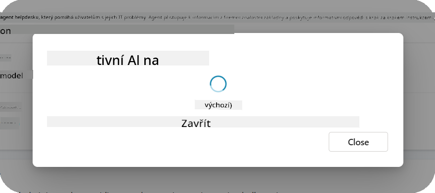

    Po dokončení publikování agenta se zobrazí oznámení v horní části stránky agenta.

    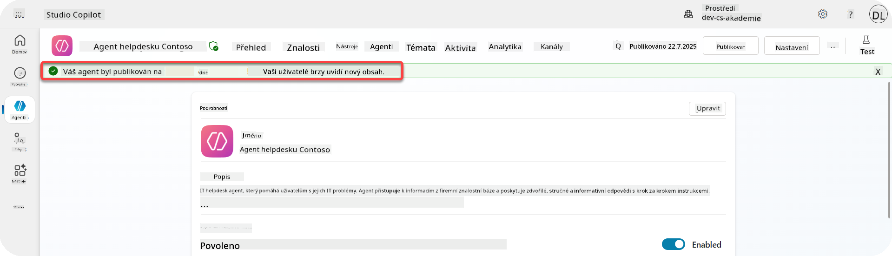

Ale - právě jsme publikovali agenta, ještě jsme ho nepřidali do žádného kanálu, takže to teď napravíme!

### 11.2 Přidejte kanál Teams a Microsoft 365 Copilot

1. Chcete-li přidat kanál Teams a Microsoft 365 Copilot ke svému agentovi, musíte vybrat **Kanál** v horní navigaci agenta

    

    Zde můžete vidět všechny kanály, které můžete k tomuto agentovi přidat.

1. Vyberte **Teams a Microsoft 365**

    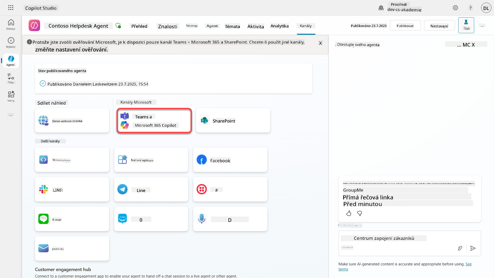

1. Vyberte **Přidat kanál**, abyste dokončili průvodce a přidali kanál k agentovi

    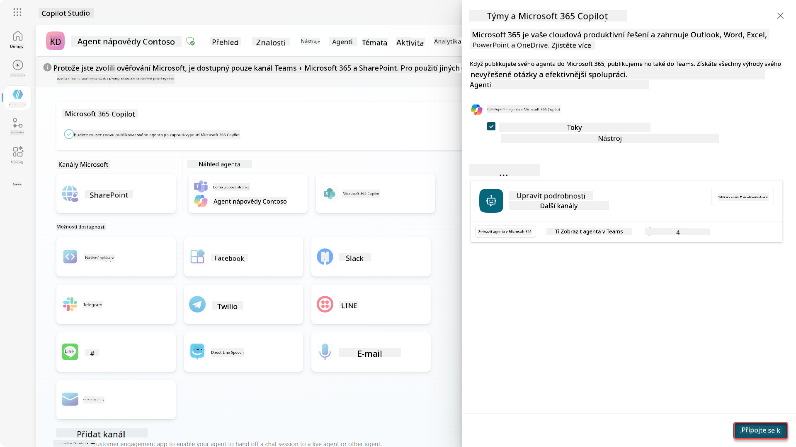

    Chvíli to potrvá, než bude kanál přidán. Po přidání se v horní části postranního panelu objeví zelené oznámení.

    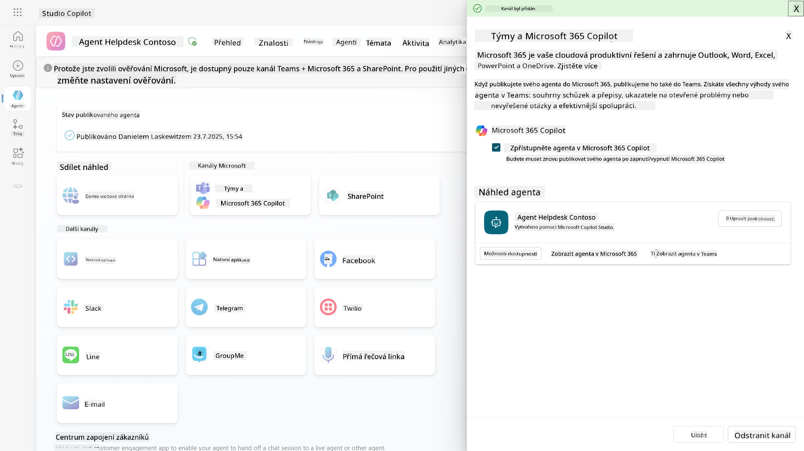

1. Vyberte **Zobrazit agenta v Teams**, čímž otevřete nové okno

    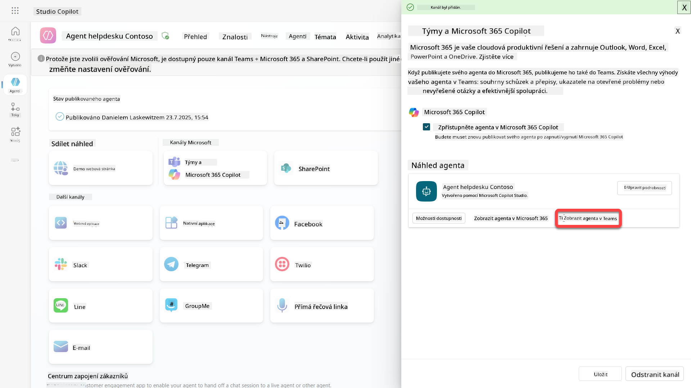

1. Vyberte **Přidat**, abyste přidali Contoso Helpdesk Agent do Teams

    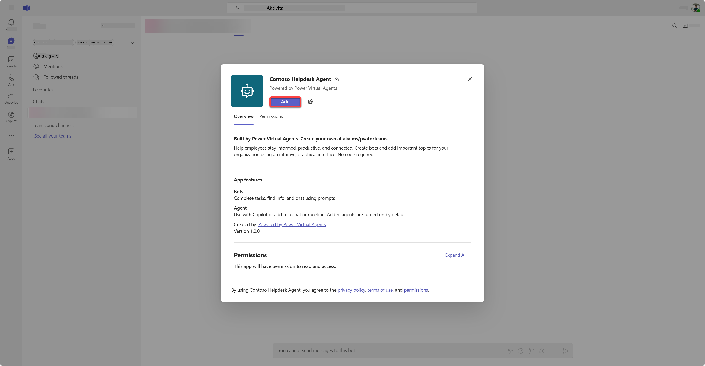

    To by mělo chvíli trvat. Poté by se měla zobrazit následující obrazovka:

    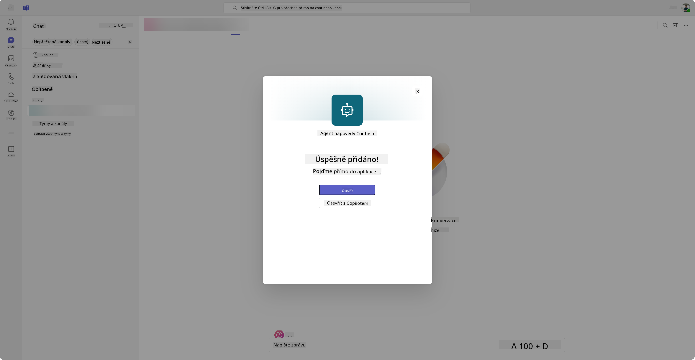

1. Vyberte **Otevřít**, abyste otevřeli agenta v Teams

    Tím se agent otevře v Teams jako aplikace Teams

    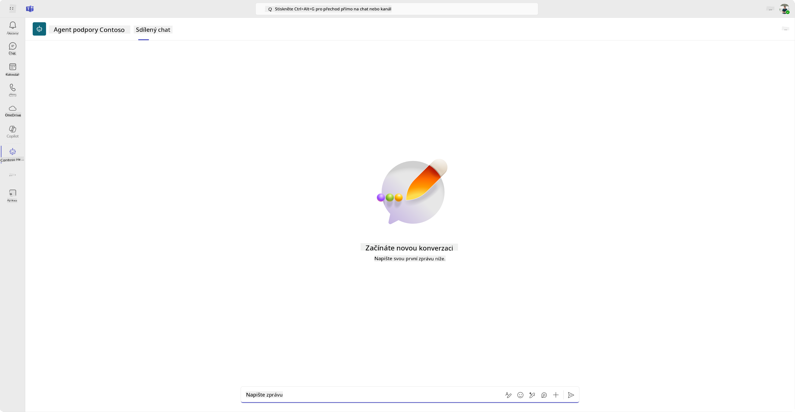

Nyní jsme publikovali agenta, aby fungoval pro vás v Microsoft Teams, ale možná budete chtít zpřístupnit ho více lidem.

### 11.3 Zpřístupněte agenta všem uživatelům v tenantovi

1. Zavřete záložku prohlížeče, kde je otevřen Contoso Helpdesk Agent

    Tím byste se měli vrátit do Copilot Studio, kde je stále otevřený postranní panel Teams a Microsoft 365 Copilot. Nyní jsme agenta pouze otevřeli v Teams, ale můžeme zde udělat mnohem více. Můžeme upravit detaily agenta, nasadit agenta více uživatelům a další.

1. Vyberte **Upravit detaily**

    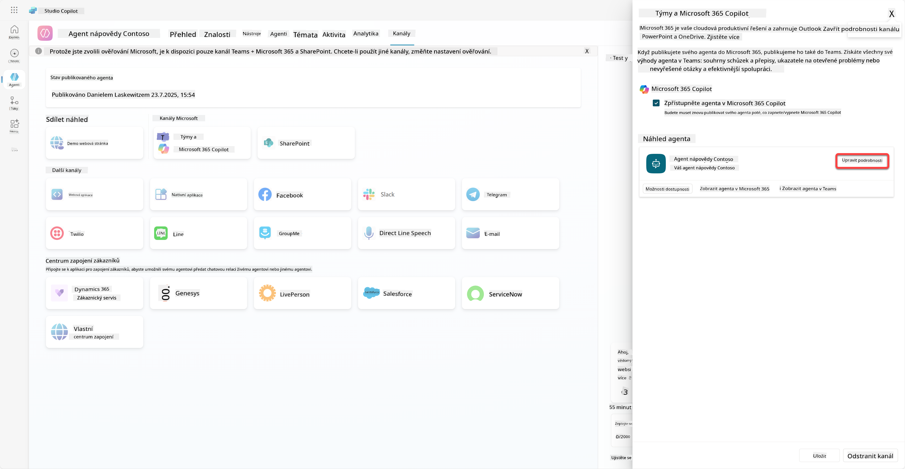
Tím se otevře panel, kde můžeme změnit řadu detailů a nastavení agenta. Můžeme upravit základní informace, jako je ikona, barva pozadí ikony a popisy. Také zde můžeme změnit nastavení pro Teams (například povolit uživateli přidat agenta do týmu nebo umožnit použití tohoto agenta ve skupinových a schůzkových chatech). Když vyberete *více*, můžete také upravit podrobnosti pro vývojáře, jako je jméno vývojáře, webová stránka, prohlášení o ochraně soukromí a podmínky použití.

1. Vyberte **Zrušit** pro zavření panelu pro úpravu detailů.

1. Vyberte **Možnosti dostupnosti**.

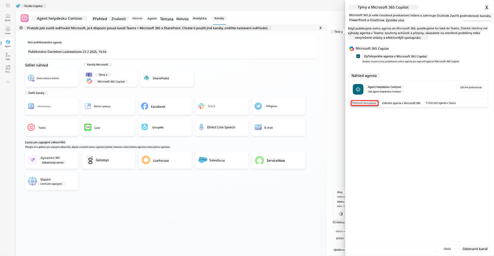

Tím se otevře panel možností dostupnosti, kde můžete zkopírovat odkaz pro zaslání uživatelům, aby mohli použít tohoto agenta (mějte na paměti, že agenta musíte s uživatelem také sdílet) a můžete stáhnout soubor pro přidání vašeho agenta do obchodu Microsoft Teams nebo Microsoft 365. Pro zobrazení agenta v obchodě máte i další možnosti: můžete ho zobrazit svým kolegům a sdíleným uživatelům (aby se zobrazil v sekci *Vytvořeno pomocí Power Platform*) nebo ho můžete zobrazit všem ve vaší organizaci (to vyžaduje schválení administrátorem).

1. Vyberte **Zobrazit všem v mé organizaci**.

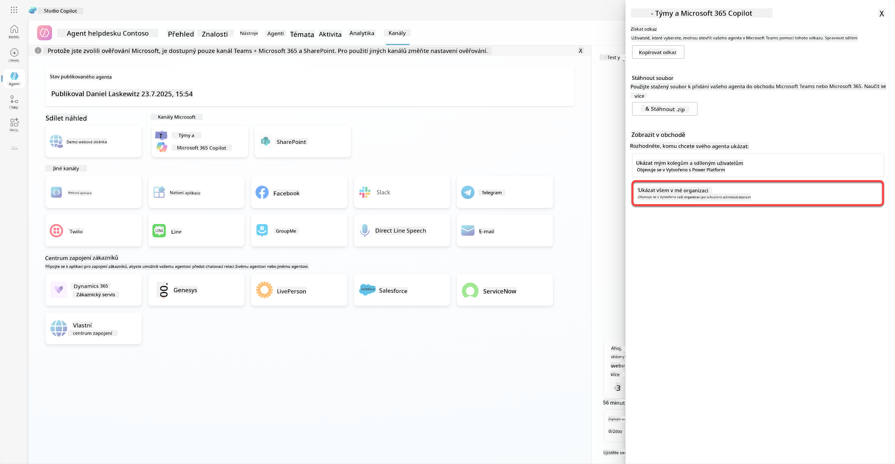

1. Vyberte **Odeslat ke schválení administrátorem**.

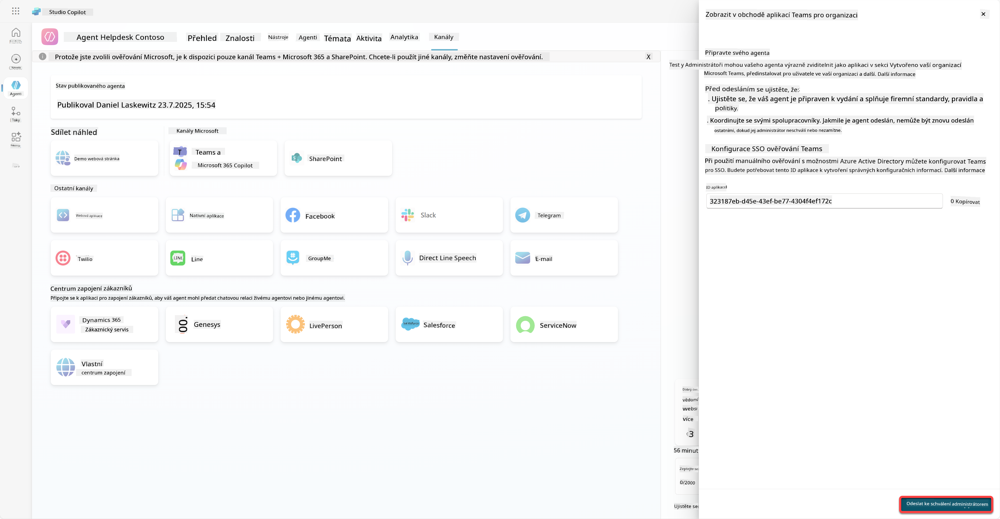

Nyní musí váš administrátor schválit odeslání vašeho agenta. To může udělat tak, že přejde do Teams Admin Center a vyhledá Contoso Helpdesk Agent v aplikacích. Na snímku obrazovky můžete vidět, co by administrátor viděl v Teams Admin Center.

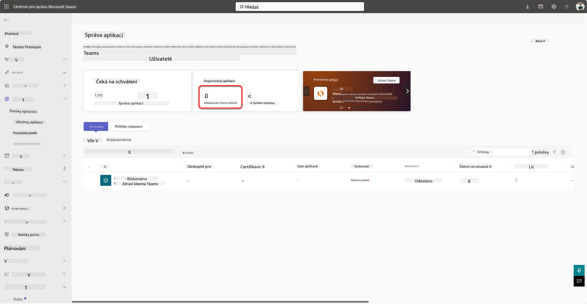

Administrátor musí vybrat Contoso Helpdesk Agent a zvolit *Publikovat*, aby publikoval Contoso Helpdesk Agent pro všechny.

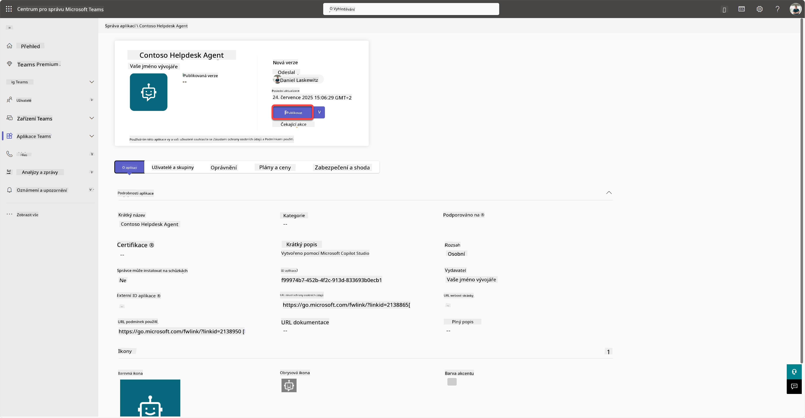

Jakmile administrátor publikoval odeslání agenta, budete moci aktualizovat Copilot Studio a měli byste vidět banner *dostupné v obchodě aplikací* v možnostech dostupnosti.

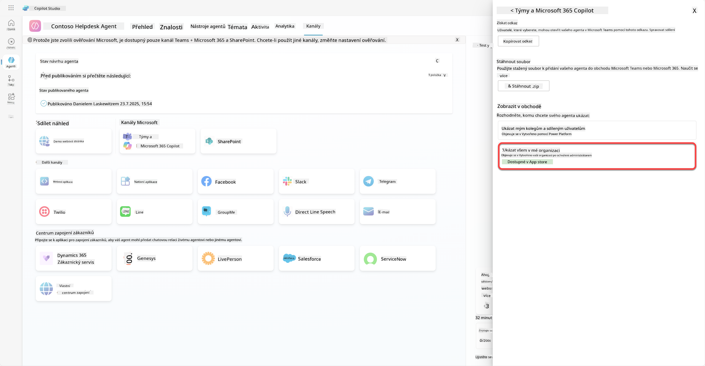

Existují zde ještě další možnosti. Váš administrátor může změnit globální politiku nastavení a automaticky nainstalovat Contoso Helpdesk Agent pro všechny v tenantu. Navíc - můžete připnout Contoso Helpdesk Agent na levý panel, aby k němu měli všichni snadný přístup.

## ✅ Mise splněna

🎉 **Gratulujeme!** Úspěšně jste publikovali svého agenta a přidali ho do Teams a Microsoft 365 Copilot! Další na řadě je poslední mise kurzu: Porozumění licencování.

⏭️ [Přejít na lekci **Porozumění licencování**](../12-understanding-licensing/README.md)

## 📚 Taktické zdroje

🔗 [Dokumentace k publikování kanálů](https://learn.microsoft.com/microsoft-copilot-studio/publication-fundamentals-publish-channels)

<!-- markdownlint-disable-next-line MD033 -->

---

**Prohlášení**:  
Tento dokument byl přeložen pomocí služby AI pro překlady [Co-op Translator](https://github.com/Azure/co-op-translator). Ačkoli se snažíme o přesnost, mějte prosím na paměti, že automatizované překlady mohou obsahovat chyby nebo nepřesnosti. Původní dokument v jeho rodném jazyce by měl být považován za autoritativní zdroj. Pro důležité informace se doporučuje profesionální lidský překlad. Neodpovídáme za žádná nedorozumění nebo nesprávné interpretace vyplývající z použití tohoto překladu.