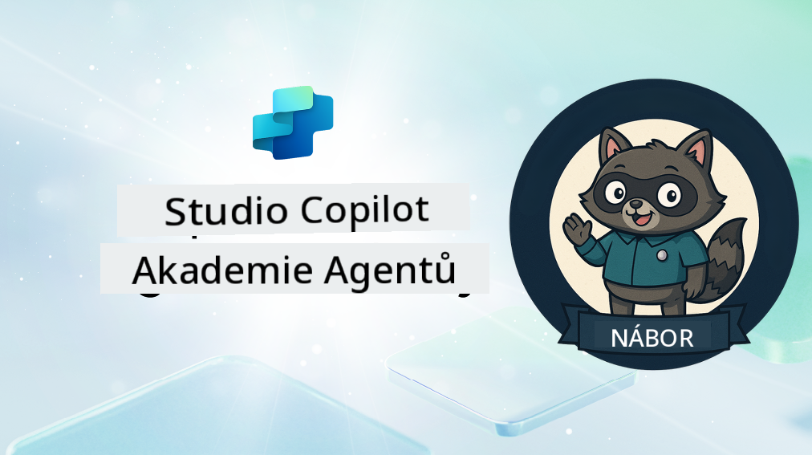

<!--
CO_OP_TRANSLATOR_METADATA:
{
  "original_hash": "8b5ecad9d5d073ea3f4c2b844e80f2e5",
  "translation_date": "2025-10-20T17:05:26+00:00",
  "source_file": "docs/recruit/README.md",
  "language_code": "cs"
}
-->
# Vítejte, nováčku

**Vítejte, nováčku.**  
Vaším úkolem—pokud se rozhodnete jej přijmout—je zvládnout umění vytváření agentů pomocí **Microsoft Copilot Studio**.

Tento praktický výcvik je vaším vstupním bodem do **světa agentů**: od promyšlených promptů přes Adaptive Cards až po agentní toky. Naučíte se, jak vytvářet, škálovat a nasazovat inteligentní agenty pomocí reálných nástrojů a případů použití.

---

## 🎯 Cíl mise

Po absolvování Agent Academy budete schopni:

- Porozumět tomu, co jsou agenti v kontextu Microsoft Copilot Studio
- Prozkoumat, jak se velké jazykové modely (LLMs), generování s podporou vyhledávání (RAG) a orchestrace spojují v agenta
- Vytvářet jak **deklarativní**, tak **vlastní agenty**
- Vylepšovat agenty pomocí **Témat**, **Adaptive Cards** a **Agentních toků**
- Nasazovat agenty do **Microsoft Teams** a **Microsoft 365 Copilot**

---

## 🧪 Požadavky

Pro splnění všech misí budete potřebovat:

- Microsoft 365 Developer tenant (s povoleným SharePointem)
- Přístup k **Microsoft Copilot Studio** (zkušební nebo licencovaný)
- Volitelné: Základní znalosti SharePointu, Power Platform nebo Power Fx

---

## 🧬 Pro koho je kurz určen

Tento kurz je ideální pro:

- Tvořitele a vývojáře, kteří zkoumají **Copilot Studio**
- IT profesionály vytvářející **rozšíření Microsoft 365 Copilot**
- Nadšence Power Platform, kteří chtějí **zlepšit své dovednosti** s inteligentními agenty
- Každého, kdo preferuje učení **praxi**

---

## 🧭 Přehled učebního plánu

Tato akademie je rozdělena do postupných lekcí—každá z nich je navržena jako terénní mise, která vám pomůže zlepšit vaše dovednosti při vytváření agentů.

| Lekce | Název | Stručný popis mise |
|-------|-------|--------------------|
| `00` | 🧰 [Nastavení kurzu](./00-course-setup/README.md) | Nastavte si vývojové prostředí, zkušební verzi Copilot Studio a SharePoint web |
| `01` | 🧠 [Úvod do agentů](./01-introduction-to-agents/README.md) | Porozumějte konceptům konverzační AI, LLMs a autonomním vs. deklarativním agentům |
| `02` | 🛠️ [Základy Copilot Studio](./02-copilot-studio-fundamentals/README.md) | Naučte se základní stavební kameny: znalosti, dovednosti, autonomii |
| `03` | 👩‍💻 [Vytvoření deklarativního agenta](./03-create-a-declarative-agent-for-M365Copilot/README.md) | Přidejte svého vlastního agenta do Microsoft 365 Copilot, založeného na promptu |
| `04` | 🧩 [Vytvoření řešení](./04-creating-a-solution/README.md) | Zabalte svého agenta do opakovaně použitelného řešení pro správu prostředí |
| `05` | 🚀 [Začínáme s předpřipravenými agenty](./05-using-prebuilt-agents/README.md) | Použijte a přizpůsobte šablonu agenta pro urychlení nastavení |
| `06` | ✍️ [Vytvoření vlastního agenta](./06-create-agent-from-conversation/README.md) | Vytvořte nový Copilot založený na zdrojích znalostí |
| `07` | 🧠 [Přidání tématu s triggery](./07-add-new-topic-with-trigger/README.md) | Použijte Témata k definování vlastních cest otázek/odpovědí |
| `08` | 🪪 [Vylepšení pomocí Adaptive Cards](./08-add-adaptive-card/README.md) | Vytvořte Adaptive Card pomocí Power Fx a SharePointu |
| `09` | 🔁 [Automatizace pomocí agentních toků](./09-add-an-agent-flow/README.md) | Použijte vstup z Adaptive Card k aktivaci back-end toků |
| `10` | 🧭 [Přidání triggerů událostí](./10-add-event-triggers/README.md) | Umožněte svému agentovi jednat autonomně pomocí logiky založené na událostech |
| `11` | 📢 [Publikování vašeho agenta](./11-publish-your-agent/README.md) | Nasazení vašeho agenta do Microsoft Teams a Microsoft 365 Copilot |
| `12` | 🪪 [Porozumění licencování](./12-understanding-licensing/README.md) | Naučte se, jak funguje licencování a fakturace v Copilot Studio |
| `13` | 🚨 [Získání odznaku nováčka](./course-completion-badges-recruit/README.md) | Získejte svůj odznak a označte svůj úspěch! |

!!! note
    ✅ Dokončení tohoto učebního plánu vám přinese odznak **Nováček**.  
    🔓 **Operative** a **Commander** budou odemčeny v budoucích fázích.

<!-- markdownlint-disable-next-line MD033 -->

---

**Prohlášení**:  
Tento dokument byl přeložen pomocí služby AI pro překlad [Co-op Translator](https://github.com/Azure/co-op-translator). Ačkoli se snažíme o přesnost, mějte prosím na paměti, že automatizované překlady mohou obsahovat chyby nebo nepřesnosti. Původní dokument v jeho rodném jazyce by měl být považován za autoritativní zdroj. Pro důležité informace se doporučuje profesionální lidský překlad. Neodpovídáme za žádná nedorozumění nebo nesprávné interpretace vyplývající z použití tohoto překladu.