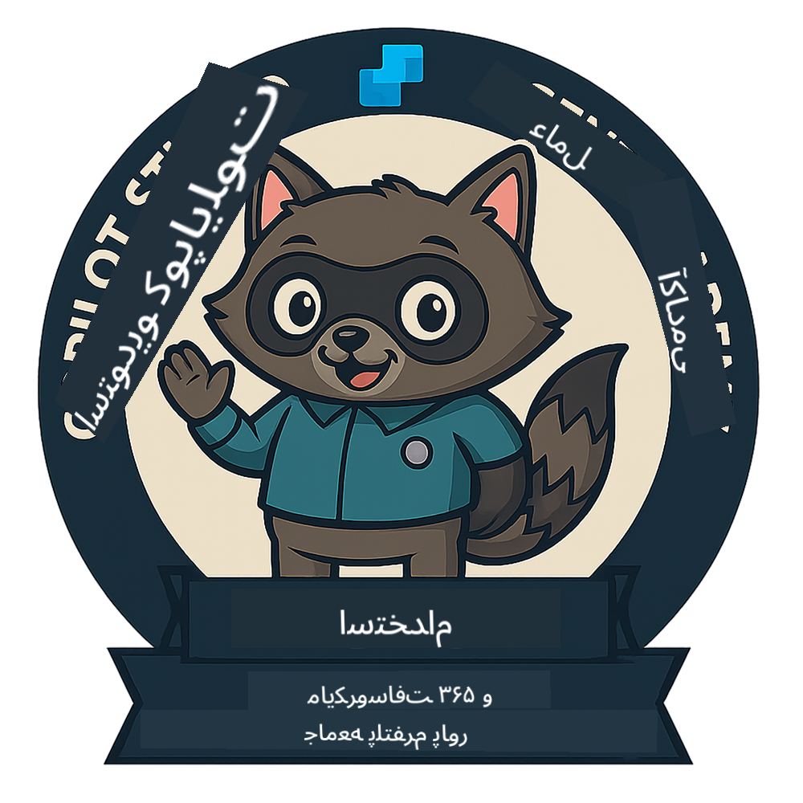
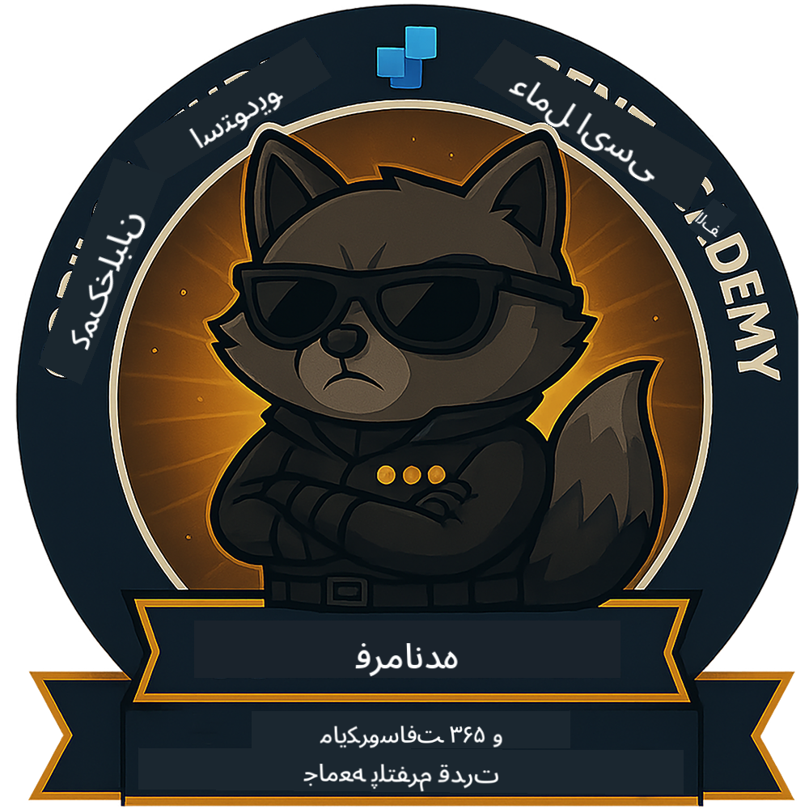

<!--
CO_OP_TRANSLATOR_METADATA:
{
  "original_hash": "15e57e059ce7689d602d7853187235cd",
  "translation_date": "2025-10-21T17:35:30+00:00",
  "source_file": "docs/index.md",
  "language_code": "fa"
}
-->
---
hide:
- navigation
---

# آکادمی نماینده Copilot Studio

**به آکادمی نماینده Copilot Studio خوش آمدید.**  

ماموریت شما—اگر تصمیم به پذیرش آن دارید—تسلط بر هنر ساخت نماینده‌ها با استفاده از **Microsoft Copilot Studio** است.

این آموزش عملی نقطه ورود شما به **دنیای نماینده‌ها** است: از درخواست‌های پایه گرفته تا Adaptive Cards و جریان‌های نماینده، شما یاد خواهید گرفت که چگونه نماینده‌های هوشمند را با استفاده از ابزارها و موارد استفاده واقعی بسازید، گسترش دهید و مستقر کنید.

---

## 🏅 پیشرفت رتبه

**آکادمی نماینده Copilot Studio** یک برنامه آموزشی چند مرحله‌ای است که برای ارتقای مهارت‌های شما در سه رتبه نماینده طراحی شده است. هر سطح شامل یک نشان و مسئولیت‌های بیشتر است:

| رتبه             | سطح | تصویر |
|------------------|:-----:|--------|
| 🟢 **تازه‌کار**  [🚀 شروع کنید](https://aka.ms/agent-academy-recruit){ .md-button .md-button--primary }     | •     | { width="300" }     |
| 🔵 **عملیات‌گر** (به زودی)   | ••    | { width="300" } |
| 🟡 **فرمانده** (به زودی)    | •••   | { width="300" } |

هر سطح بر اساس سطح قبلی ساخته می‌شود. ماموریت تازه‌کار خود را به پایان برسانید و منتظر باشید تا اعتبار نماینده خود را ارتقا دهید.

---

## 🎒 دوره‌های دیگر

این دوره‌های دیگر را بررسی کنید تا به یادگیری درباره هوش مصنوعی و نماینده‌ها ادامه دهید:

- [Microsoft Copilot Studio <3 MCP Lab](https://aka.ms/mcsmcplab)
- [اردوی توسعه‌دهندگان Copilot](https://microsoft.github.io/copilot-camp/)
- [نماینده‌های هوش مصنوعی برای مبتدیان](https://microsoft.github.io/ai-agents-for-beginners/)
- [پروتکل زمینه مدل (MCP) برای مبتدیان](https://github.com/microsoft/mcp-for-beginners)

---

## 🚑 مشکلات

ما از بازخورد شما بسیار قدردانی می‌کنیم! لطفاً از [لیست مشکلات](https://github.com/microsoft/agent-academy/issues) برای به اشتراک گذاشتن نظرات و مشکلات خود استفاده کنید. متشکریم!

---

## 📜 قوانین رفتاری

این پروژه [قوانین رفتاری منبع باز مایکروسافت](https://opensource.microsoft.com/codeofconduct/) را پذیرفته است.

!!! info "منابع:"

    - [قوانین رفتاری منبع باز مایکروسافت](https://opensource.microsoft.com/codeofconduct/)
    - [پرسش‌های متداول قوانین رفتاری مایکروسافت](https://opensource.microsoft.com/codeofconduct/faq/)
    - برای سوالات یا نگرانی‌ها با [opencode@microsoft.com](mailto:opencode@microsoft.com) تماس بگیرید

---

[⭐️ به مخزن ما امتیاز دهید](https://github.com/microsoft/agent-academy){ .md-button .md-button--primary }

<!-- markdownlint-disable-next-line MD033 -->

---

**سلب مسئولیت**:  
این سند با استفاده از سرویس ترجمه هوش مصنوعی [Co-op Translator](https://github.com/Azure/co-op-translator) ترجمه شده است. در حالی که ما تلاش می‌کنیم دقت را حفظ کنیم، لطفاً توجه داشته باشید که ترجمه‌های خودکار ممکن است شامل خطاها یا نادرستی‌ها باشند. سند اصلی به زبان اصلی آن باید به عنوان منبع معتبر در نظر گرفته شود. برای اطلاعات حساس، ترجمه حرفه‌ای انسانی توصیه می‌شود. ما مسئولیتی در قبال سوء تفاهم‌ها یا تفسیرهای نادرست ناشی از استفاده از این ترجمه نداریم.