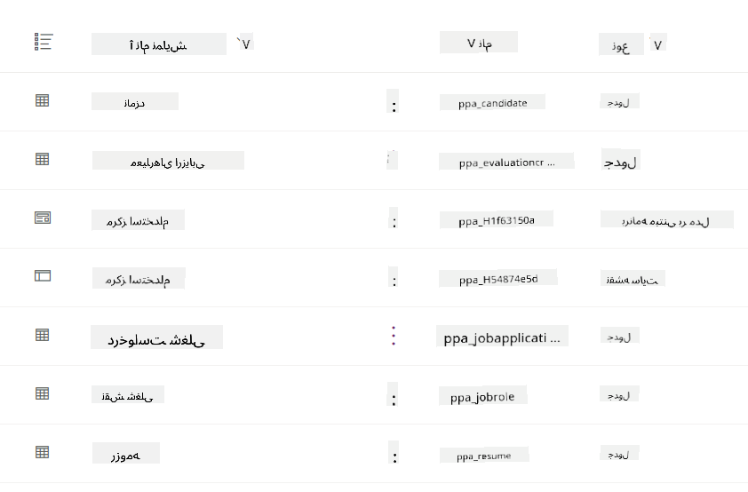
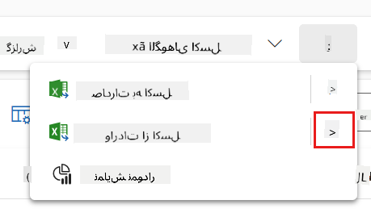
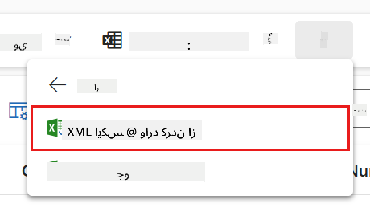
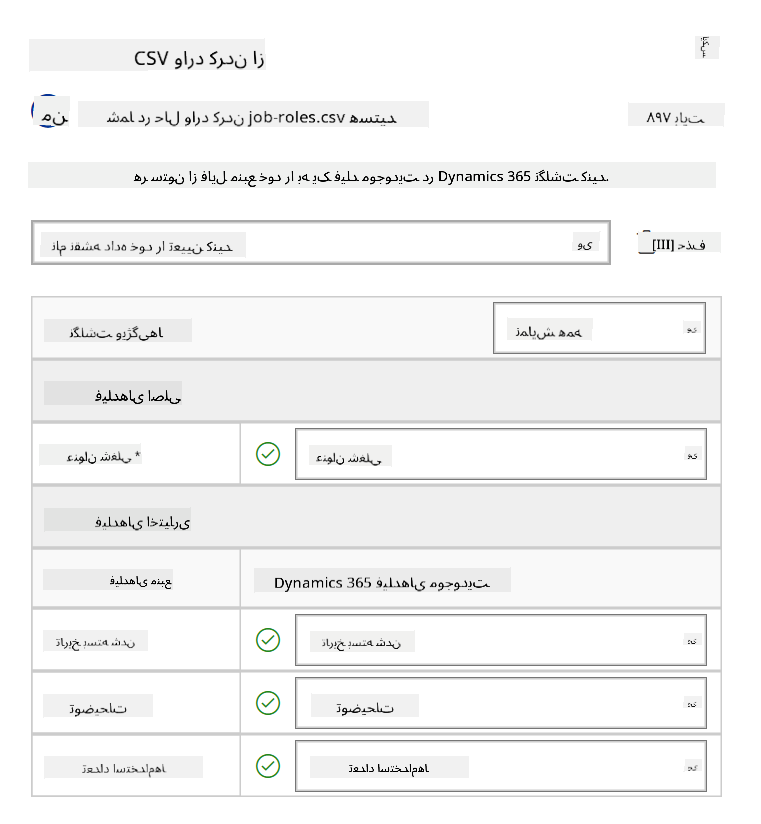
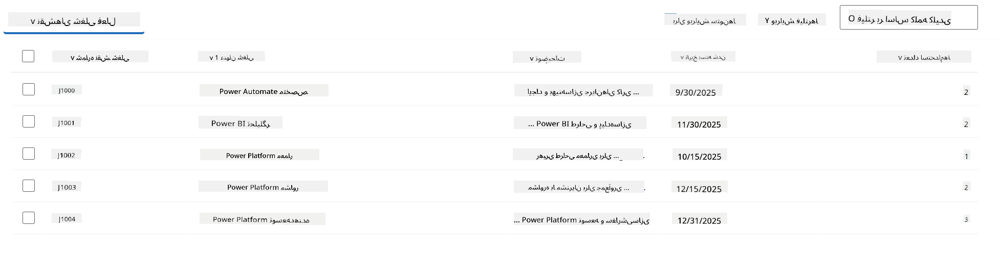
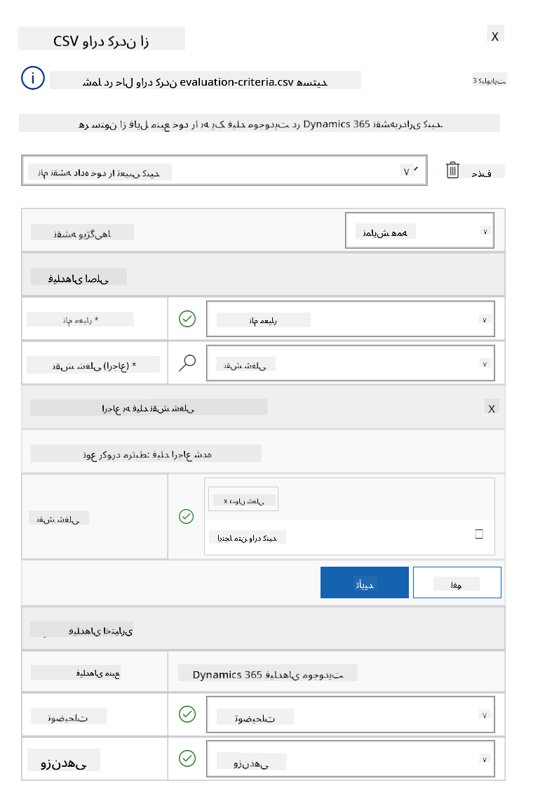
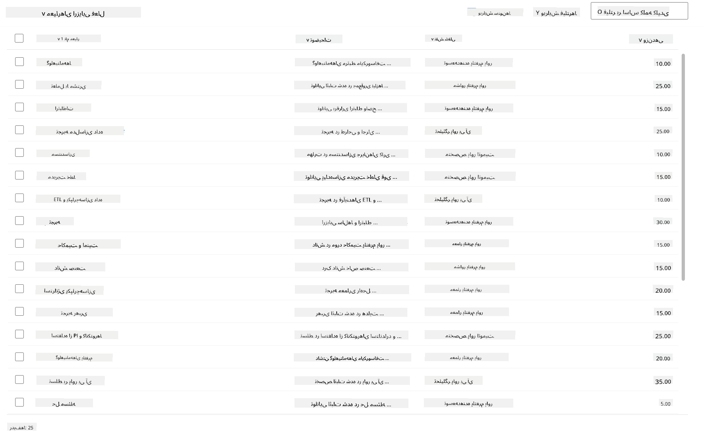

<!--
CO_OP_TRANSLATOR_METADATA:
{
  "original_hash": "2620cf9eaf09a3fc6be7fa31a3a62956",
  "translation_date": "2025-10-21T18:04:11+00:00",
  "source_file": "docs/operative-preview/01-get-started/README.md",
  "language_code": "fa"
}
-->
# 🚨 مأموریت ۰۱: شروع به کار با عامل استخدام

--8<-- "disclaimer.md"

## 🕵️‍♂️ نام رمز: `عملیات جستجوی استعداد`

> **⏱️ مدت زمان عملیات:** `~45 دقیقه`

## 🎯 خلاصه مأموریت

خوش آمدید، مأمور. مأموریت اول شما **عملیات جستجوی استعداد** است - ایجاد زیرساخت‌های پایه‌ای برای یک سیستم استخدام مبتنی بر هوش مصنوعی که نحوه شناسایی و استخدام استعدادهای برتر توسط سازمان‌ها را متحول خواهد کرد.

مأموریت شما، اگر تصمیم به پذیرش آن دارید، این است که یک سیستم مدیریت استخدام جامع را با استفاده از Microsoft Copilot Studio پیاده‌سازی و پیکربندی کنید. شما یک راه‌حل از پیش ساخته شده را که شامل تمام ساختارهای داده ضروری است وارد خواهید کرد و سپس اولین عامل هوش مصنوعی خود - **عامل استخدام** - را ایجاد خواهید کرد که به عنوان هماهنگ‌کننده مرکزی برای تمام عملیات استخدام آینده عمل خواهد کرد.

این پیاده‌سازی اولیه مرکز فرماندهی را ایجاد می‌کند که در طول برنامه عملیاتی آکادمی عامل آن را ارتقا خواهید داد. این را به عنوان پایگاه عملیاتی خود در نظر بگیرید - پایه‌ای که بر اساس آن شبکه‌ای کامل از عوامل تخصصی را در مأموریت‌های بعدی خواهید ساخت.

---

## 🔎 اهداف

با تکمیل این مأموریت، شما:

- **درک سناریو**: دانش جامع درباره چالش‌ها و راه‌حل‌های خودکارسازی استخدام کسب خواهید کرد  
- **پیاده‌سازی راه‌حل**: اصول یک سیستم مدیریت استخدام را با موفقیت وارد و پیکربندی خواهید کرد  
- **ایجاد عامل**: یک عامل استخدام ایجاد خواهید کرد که نقطه شروع سناریویی است که به عنوان یک مأمور آکادمی عامل خواهید ساخت  

---

## 🔍 پیش‌نیازها

قبل از شروع این مأموریت، مطمئن شوید که موارد زیر را دارید:

- مجوز Copilot Studio  
- دسترسی به محیط Microsoft Power Platform  
- مجوزهای مدیریتی برای ایجاد راه‌حل‌ها و عوامل  

---

## 🏢 درک سناریوی خودکارسازی استخدام

این سناریو نشان می‌دهد که چگونه یک شرکت می‌تواند از Microsoft Copilot Studio برای بهبود و خودکارسازی فرآیند استخدام خود استفاده کند. این سیستم مجموعه‌ای از عوامل را معرفی می‌کند که با همکاری یکدیگر وظایفی مانند بررسی رزومه‌ها، پیشنهاد نقش‌های شغلی، آماده‌سازی مواد مصاحبه و ارزیابی کاندیداها را انجام می‌دهند.

### ارزش کسب‌وکار

این راه‌حل به تیم‌های منابع انسانی کمک می‌کند تا زمان صرفه‌جویی کنند و تصمیمات بهتری بگیرند از طریق:

- پردازش خودکار رزومه‌های دریافت شده از طریق ایمیل.  
- پیشنهاد نقش‌های شغلی مناسب بر اساس پروفایل کاندیداها.  
- ایجاد درخواست‌های شغلی و راهنماهای مصاحبه متناسب با هر کاندیدا.  
- اطمینان از شیوه‌های استخدام منصفانه و مطابق با قوانین از طریق ویژگی‌های ایمنی و نظارت داخلی.  
- جمع‌آوری بازخورد برای بهبود راه‌حل.  

### نحوه عملکرد

- یک **عامل استخدام مرکزی** فرآیند را هماهنگ می‌کند و داده‌ها را در Microsoft Dataverse ذخیره می‌کند.  
- یک **عامل دریافت درخواست** رزومه‌ها را می‌خواند و درخواست‌های شغلی ایجاد می‌کند.  
- یک **عامل آماده‌سازی مصاحبه** سوالات و اسناد مصاحبه را بر اساس پیشینه کاندیدا تولید می‌کند.  
- سیستم می‌تواند به یک وب‌سایت نمایشی منتشر شود تا ذینفعان بتوانند با آن تعامل داشته باشند.  

این سناریو برای سازمان‌هایی که به دنبال مدرن‌سازی جریان‌های کاری استخدام خود با استفاده از خودکارسازی مبتنی بر هوش مصنوعی هستند، در حالی که شفافیت، انصاف و کارایی را حفظ می‌کنند، ایده‌آل است.

---

## 🧪 آزمایشگاه: راه‌اندازی عامل استخدام

در این آزمایشگاه عملی، شما پایه‌های سیستم خودکارسازی استخدام خود را ایجاد خواهید کرد. ابتدا یک راه‌حل از پیش پیکربندی شده را وارد می‌کنید که شامل تمام جداول Dataverse و ساختار داده‌های ضروری برای مدیریت کاندیداها، موقعیت‌های شغلی و جریان‌های کاری استخدام است. سپس این جداول را با داده‌های نمونه پر می‌کنید که در طول این ماژول از آن‌ها برای یادگیری و ایجاد سناریوهای واقعی برای آزمایش استفاده خواهید کرد. در نهایت، عامل استخدام را در Copilot Studio ایجاد می‌کنید و رابط مکالمه‌ای پایه‌ای را تنظیم می‌کنید که به عنوان سنگ بنای تمام ویژگی‌های دیگر که در مأموریت‌های آینده اضافه خواهید کرد، عمل خواهد کرد.

### 🧪 آزمایشگاه ۱.۱: وارد کردن راه‌حل

1. به **[Copilot Studio](https://copilotstudio.microsoft.com)** بروید  
1. گزینه **...** در ناوبری سمت چپ را انتخاب کنید و **Solutions** را انتخاب کنید  
1. دکمه **Import Solution** در بالا را انتخاب کنید  
1. **[دانلود](https://raw.githubusercontent.com/microsoft/agent-academy/refs/heads/main/docs/operative-preview/01-get-started/assets/Operative_1_0_0_0.zip)** راه‌حل آماده  
1. گزینه **Browse** را انتخاب کنید و راه‌حل دانلود شده از مرحله قبل را انتخاب کنید  
1. گزینه **Next** را انتخاب کنید  
1. گزینه **Import** را انتخاب کنید  

!!! success
    در صورت موفقیت، یک نوار اعلان سبز با پیام زیر مشاهده خواهید کرد:  
    "راه‌حل "Operative" با موفقیت وارد شد."

پس از وارد کردن راه‌حل، با انتخاب نام نمایشی راه‌حل (`Operative`) نگاهی به آنچه وارد کرده‌اید بیندازید.



اجزای زیر وارد شده‌اند:

| نام نمایشی | نوع | توضیحات |
|-------------|------|-------------|
| کاندیدا | جدول | اطلاعات کاندیدا |
| معیارهای ارزیابی | جدول | معیارهای ارزیابی برای نقش |
| مرکز استخدام | اپلیکیشن مدل‌محور | اپلیکیشن برای مدیریت فرآیند استخدام |
| مرکز استخدام | نقشه سایت | ساختار ناوبری برای اپلیکیشن مرکز استخدام |
| درخواست شغلی | جدول | درخواست‌های شغلی |
| نقش شغلی | جدول | نقش‌های شغلی |
| رزومه | جدول | رزومه‌های کاندیداها |

به عنوان آخرین وظیفه برای این آزمایشگاه، دکمه **Publish all customizations** در بالای صفحه را انتخاب کنید.

### 🧪 آزمایشگاه ۱.۲: وارد کردن داده‌های نمونه

در این آزمایشگاه، شما داده‌های نمونه را به برخی از جداولی که در آزمایشگاه ۱.۱ وارد کرده‌اید اضافه خواهید کرد.

#### دانلود فایل‌ها برای وارد کردن

1. **[دانلود](https://raw.githubusercontent.com/microsoft/agent-academy/refs/heads/main/docs/operative-preview/01-get-started/assets/evaluation-criteria.csv)** فایل CSV معیارهای ارزیابی  
1. **[دانلود](https://raw.githubusercontent.com/microsoft/agent-academy/refs/heads/main/docs/operative-preview/01-get-started/assets/job-roles.csv)** فایل CSV نقش‌های شغلی  

#### وارد کردن داده‌های نمونه نقش شغلی

1. به راه‌حلی که در آزمایشگاه قبلی وارد کرده‌اید بازگردید  
1. اپلیکیشن مدل‌محور **Hiring Hub** را با انتخاب علامت چک در جلوی ردیف انتخاب کنید  
1. دکمه **Play** در بالا را انتخاب کنید  

    !!! warning
        ممکن است از شما خواسته شود دوباره وارد شوید. مطمئن شوید که این کار را انجام دهید. پس از انجام این کار، باید اپلیکیشن Hiring Hub را مشاهده کنید.

1. گزینه **Job Roles** در ناوبری سمت چپ را انتخاب کنید  
1. آیکون **More** (سه نقطه زیر هم) در نوار فرمان را انتخاب کنید  
1. فلش راست را در کنار *Import from Excel* انتخاب کنید  

    

1. گزینه **Import from CSV** را انتخاب کنید  

    

1. دکمه **Choose File** را انتخاب کنید، فایل **job-roles.csv** که تازه دانلود کرده‌اید را انتخاب کنید و سپس گزینه **Open** را انتخاب کنید  
1. گزینه **Next** را انتخاب کنید  
1. مرحله بعدی را همانطور که هست بگذارید و گزینه **Review Mapping** را انتخاب کنید  

    

1. مطمئن شوید که نگاشت صحیح است و گزینه **Finish Import** را انتخاب کنید  

    !!! info
        این وارد کردن را شروع می‌کند و شما می‌توانید پیشرفت را دنبال کنید یا فرآیند را بلافاصله با انتخاب **Done** به پایان برسانید.

1. گزینه **Done** را انتخاب کنید  

این ممکن است کمی زمان ببرد، اما می‌توانید دکمه **Refresh** را فشار دهید تا ببینید آیا وارد کردن موفقیت‌آمیز بوده است.



#### وارد کردن داده‌های نمونه معیارهای ارزیابی

1. گزینه **Evaluation Criteria** در ناوبری سمت چپ را انتخاب کنید  
1. آیکون **More** (سه نقطه زیر هم) در نوار فرمان را انتخاب کنید  
1. فلش راست را در کنار *Import from Excel* انتخاب کنید  

    

1. گزینه **Import from CSV** را انتخاب کنید  

    

1. دکمه **Choose File** را انتخاب کنید، فایل **evaluation-criteria.csv** که تازه دانلود کرده‌اید را انتخاب کنید و سپس گزینه **Open** را انتخاب کنید  
1. گزینه **Next** را انتخاب کنید  
1. مرحله بعدی را همانطور که هست بگذارید و گزینه **Review Mapping** را انتخاب کنید  

    

1. اکنون باید کمی بیشتر برای نگاشت کار کنید. آیکون ذره‌بین (آیکون 🔎) کنار فیلد Job Role را انتخاب کنید  
1. مطمئن شوید که **Job Title** در اینجا انتخاب شده است، و اگر نیست - آن را اضافه کنید  
1. گزینه **OK** را انتخاب کنید  
1. مطمئن شوید که بقیه نگاشت نیز صحیح است و گزینه **Finish Import** را انتخاب کنید  

    !!! info
        این وارد کردن را دوباره شروع می‌کند و شما می‌توانید پیشرفت را دنبال کنید یا فرآیند را بلافاصله با انتخاب **Done** به پایان برسانید.

1. گزینه **Done** را انتخاب کنید  

این ممکن است کمی زمان ببرد، اما می‌توانید دکمه **Refresh** را فشار دهید تا ببینید آیا وارد کردن موفقیت‌آمیز بوده است.



### 🧪 آزمایشگاه ۱.۳: ایجاد عامل استخدام

اکنون که تنظیمات پیش‌نیازها را انجام داده‌اید، وقت کار واقعی است! بیایید ابتدا عامل استخدام خود را اضافه کنیم!

1. به **[Copilot Studio](https://copilotstudio.microsoft.com)** بروید و مطمئن شوید که در همان محیطی هستید که راه‌حل و داده‌ها را وارد کرده‌اید  
1. گزینه **Agents** در ناوبری سمت چپ را انتخاب کنید  
1. گزینه **New Agent** را انتخاب کنید  
1. گزینه **Configure** را انتخاب کنید  
1. برای **Name** وارد کنید:

    ```text
    Hiring Agent
    ```

1. برای **Description** وارد کنید:

    ```text
    Central orchestrator for all hiring activities
    ```

1. گزینه **...** کنار دکمه *Create* در گوشه بالا سمت راست را انتخاب کنید  
1. گزینه **Update advanced settings** را انتخاب کنید  
1. به عنوان **Solution**، `Operative` را انتخاب کنید  
1. گزینه **Update** را انتخاب کنید  
1. گزینه **Create** در گوشه بالا سمت راست را انتخاب کنید  

این عامل استخدام را برای شما ایجاد می‌کند که در طول این دوره عملیاتی از آن استفاده خواهید کرد.

---

## 🎉 مأموریت کامل شد

مأموریت ۰۱ کامل شد! شما اکنون مهارت‌های زیر را به دست آورده‌اید:

✅ **درک سناریو**: دانش جامع درباره چالش‌ها و راه‌حل‌های خودکارسازی استخدام  
✅ **پیاده‌سازی راه‌حل**: اصول یک سیستم مدیریت استخدام را با موفقیت وارد و پیکربندی کرده‌اید  
✅ **ایجاد عامل**: یک عامل استخدام ایجاد کرده‌اید که نقطه شروع سناریویی است که به عنوان یک مأمور آکادمی عامل خواهید ساخت  

مأموریت بعدی [مأموریت ۰۲](../02-multi-agent/README.md): آماده‌سازی عامل شما برای کار با عوامل متصل.

---

## 📚 منابع تاکتیکی

📖 [Microsoft Copilot Studio - ایجاد یک عامل](https://learn.microsoft.com/microsoft-copilot-studio/authoring-first-bot)  
📖 [مستندات Microsoft Dataverse](https://learn.microsoft.com/power-apps/maker/data-platform)  

---

**سلب مسئولیت**:  
این سند با استفاده از سرویس ترجمه هوش مصنوعی [Co-op Translator](https://github.com/Azure/co-op-translator) ترجمه شده است. در حالی که ما تلاش می‌کنیم دقت را حفظ کنیم، لطفاً توجه داشته باشید که ترجمه‌های خودکار ممکن است شامل خطاها یا نادرستی‌ها باشند. سند اصلی به زبان اصلی آن باید به عنوان منبع معتبر در نظر گرفته شود. برای اطلاعات حیاتی، ترجمه حرفه‌ای انسانی توصیه می‌شود. ما مسئولیتی در قبال سوء تفاهم‌ها یا تفسیرهای نادرست ناشی از استفاده از این ترجمه نداریم.