<!--
CO_OP_TRANSLATOR_METADATA:
{
  "original_hash": "75efaf515d5694d4fd549bfd6518901a",
  "translation_date": "2025-10-21T18:11:11+00:00",
  "source_file": "docs/operative-preview/03-automate-triggers/README.md",
  "language_code": "fa"
}
-->
# مأموریت 03: افزودن محرک‌های رویداد برای عملکرد خودکار

--8<-- "disclaimer.md"

## 🕵️‍♂️ نام رمز: `عملیات نقطه سیگنال`

> **⏱️ مدت زمان عملیات:** `~45 دقیقه`

## 🎯 خلاصه مأموریت

خوش آمدید، مأمور. در [مأموریت 02](../02-multi-agent/README.md) - شما یاد گرفتید که چگونه یک عامل فرعی پذیرش درخواست و یک عامل متصل آماده‌سازی مصاحبه بسازید تا قابلیت‌های عامل اصلی استخدام خود را گسترش دهید.

وظیفه شما، اگر تصمیم به پذیرش آن دارید، **عملیات نقطه سیگنال** است - ورود به عمق **محرک‌های رویداد** - ارتقای سیستم عامل خود از حالت واکنشی به **عملکرد خودکار**. شما عوامل خود را از حالت پاسخگویی به سوالات به حالت پیش‌بینی نیازها و اقدام مستقل تبدیل خواهید کرد. از طریق محرک‌های رویداد و جریان‌های خودکار، عامل استخدام شما ایمیل‌های رزومه ورودی را شناسایی می‌کند، پیوست‌ها را به صورت خودکار پردازش می‌کند، داده‌ها را در Dataverse ذخیره می‌کند و تیم استخدام منابع انسانی شما را از طریق Microsoft Teams مطلع می‌کند - در حالی که شما بر وظایف با ارزش‌تر تمرکز می‌کنید.

به دنیای جایی که اتوماسیون با هوش ترکیب می‌شود خوش آمدید.

## 🔎 اهداف

در این مأموریت، شما یاد خواهید گرفت:

1. چگونه محرک‌های رویداد رفتار خودکار عامل را بدون تعامل کاربر فعال می‌کنند
1. تفاوت‌های بین عوامل تعاملی و خودکار در Copilot Studio
1. چگونه محرک‌های رویداد ایجاد کنیم که به صورت خودکار پیوست‌های ایمیل را پردازش کرده و فایل‌ها را به Dataverse آپلود کنند
1. چگونه جریان‌های عامل بسازیم که کارت‌های تطبیقی را به کانال‌های Teams برای اطلاع‌رسانی ارسال کنند
1. چگونه داده‌ها را بین محرک‌های رویداد و جریان‌های عامل برای اتوماسیون انتها به انتها منتقل کنیم

## 🤔 محرک رویداد چیست؟

قبلاً در [Recruit](../../recruit/10-add-event-triggers/README.md)، ما درباره محرک‌های رویداد یاد گرفتیم. بیایید یک مرور سریع بر این موضوع داشته باشیم در صورتی که آن را از دست داده باشید.

**محرک‌های رویداد** به یک عامل اجازه می‌دهند که _به تنهایی_ عمل کند وقتی چیزی در سیستم دیگر اتفاق می‌افتد - بدون نیاز به پیام کاربر. وقتی رویداد تنظیم شده فعال می‌شود - مانند "ایجاد آیتم جدید در SharePoint"، "ایمیل جدید"، "وظیفه Planner اختصاص داده شده"، یا حتی یک تکرار زمانی، یک کانکتور یک بار داده محرک به عامل شما ارسال می‌کند. سپس عامل دستورالعمل‌های شما را دنبال می‌کند تا تصمیم بگیرد که کدام اقدامات یا موضوعات را فراخوانی کند.

### ویژگی‌های کلیدی

- **فعال‌سازی خودکار:**
      - برخلاف محرک‌های موضوع که وقتی کاربر به عامل پیام می‌دهد شروع می‌شوند، محرک‌های رویداد از رویدادهای خارجی فعال می‌شوند و رفتار پیش‌فعال را ممکن می‌سازند.

- **مبتنی بر بار داده:**
      - هر رویداد یک بار داده (متغیرها + دستورالعمل‌های اختیاری) از طریق یک کانکتور ارسال می‌کند. عامل از دستورالعمل‌های تعریف‌شده شما و بار داده برای انتخاب اقدام بعدی استفاده می‌کند.
      - به عنوان مثال _فراخوانی یک موضوع_ یا _اجرای اقدامات تعریف‌شده توسط ابزارها_.

- **نمونه‌های آماده:**
      - فایل یا آیتم ایجاد شده در SharePoint/OneDrive
      - وظیفه Planner تکمیل شده/اختصاص داده شده
      - پاسخ ارسال شده به Microsoft Forms
      - تکرار/برنامه زمانی

    دسترسی به این موارد به سیاست‌های داده سازمان شما که در Power Automate تنظیم شده‌اند بستگی دارد.

- **نیاز به ارکستراسیون تولیدی:**
      - محرک‌های رویداد فقط زمانی در دسترس هستند که ارکستراسیون تولیدی برای عامل فعال شده باشد.

- **هزینه/مصرف:**
      - هر تحویل محرک به عنوان یک پیام به ظرفیت Copilot Studio محاسبه می‌شود.
      - به عنوان مثال یک تکرار 10 دقیقه‌ای هر 10 دقیقه یک پیام ارسال می‌کند.

- **مدل احراز هویت و تنظیمات:**
      - شما محرک‌ها را در نمای کلی عامل، تحت _محرک‌ها_ اضافه می‌کنید. احراز هویت برای کانکتور محرک از حساب سازنده عامل استفاده می‌کند ("احراز هویت نویسنده عامل").
      - شما می‌توانید پارامترهای محرک و بار داده را در پورتال سازنده Power Automate ویرایش کنید.

- **آزمایش و مشاهده‌پذیری:**
      - شما می‌توانید محرک‌ها را از پنل آزمایش عامل آزمایش کنید و رفتار را با نقشه فعالیت قبل از انتشار بررسی کنید.

!!! info "خلاصه برای توسعه‌دهندگان"

    محرک‌های رویداد را به عنوان **سیگنال‌های مشابه وب‌هوک** در نظر بگیرید که یک بار داده ساختاریافته را به عامل شما ارسال می‌کنند و به آن اجازه می‌دهند _کار را آغاز کند_ و اقدامات را در سیستم‌ها زنجیره‌ای کند - بدون انتظار برای درخواست کاربر.

### محرک‌های موضوع - تفاوت آن‌ها

قبلاً شما درباره محرک‌های موضوع در [Recruit](../../recruit/07-add-new-topic-with-trigger/README.md) یاد گرفتید، اما ممکن است هنوز در مورد تفاوت محرک‌های _موضوع_ و _رویداد_ و اینکه چرا این تمایز برای درک اینکه چه چیزی یک عامل را خودکار می‌کند مهم است، سوال داشته باشید.

محرک‌های موضوع کنترل می‌کنند _چه زمانی یک موضوع اجرا شود_، معمولاً در پاسخ به پیام کاربر.

- در ارکستراسیون تولیدی، محرک پیش‌فرض **توسط عامل** است - برنامه‌ریز موضوعی را انتخاب می‌کند که نام/توضیحات آن بهترین تطابق را با پیام کاربر دارد.
- در ارکستراسیون کلاسیک، پیش‌فرض **عبارات** است - برنامه‌ریز موضوعی را انتخاب می‌کند که یک یا چند عبارت محرک بهترین تطابق را با پیام کاربر دارد.

سایر انواع محرک شامل `پیام دریافت شده`، `رویداد دریافت شده`، `فعالیت دریافت شده`، `به‌روزرسانی مکالمه`، `فراخوانی دریافت شده`، `عدم فعالیت` و `پایان برنامه‌ریزی` هستند.

!!! info "تفاوت اصلی"

    محرک‌های موضوع _شروع‌کننده فعالیت مکالمه_ در داخل چت هستند.
    
    محرک‌های رویداد _شروع‌کننده رویداد سیستم_ هستند که از طریق کانکتورها ارسال می‌شوند و می‌توانند عامل را بدون هیچ مکالمه‌ای اجرا کنند.

### راهنمای سریع محرک موضوع در مقابل محرک رویداد

- **محرک موضوع:** کاربر (یا فعالیت چت) گفت/انجام داد X ➡️ اجرای موضوع T.
- **محرک رویداد:** SharePoint/Planner/ایمیل/تایمر فعال شد با بار داده P ➡️ عامل دستورالعمل‌ها را ارزیابی می‌کند ➡️ اقدامات/موضوعات را بر اساس آن فراخوانی می‌کند.

## 🏓 عامل تعاملی در مقابل عامل خودکار - مقایسه

حالا که تفاوت بین محرک‌های رویداد و محرک‌های موضوع را می‌دانید، بیایید تفاوت بین عامل تعاملی و عامل خودکار را یاد بگیریم.

در اصطلاح Copilot Studio، "تعاملی" به عوامل اشاره دارد که عمدتاً از طریق **موضوعات** در یک چت یا کانال تعامل دارند. "خودکار" به عواملی اشاره دارد که همچنین از **محرک‌های رویداد** برای اجرا بدون ورودی کاربر استفاده می‌کنند.

جدول زیر تفاوت‌ها و شباهت‌های آن‌ها را خلاصه می‌کند.

| بعد                               | عامل تعاملی          | عامل خودکار                                                                                              |
|-----------------------------------|-----------------------|----------------------------------------------------------------------------------------------------------|
| نحوه شروع                        | کاربر (یا فعالیت چت) یک موضوع را فعال می‌کند. مثال: توسط عامل، عبارات، پیام دریافت شده.   | محرک رویداد خارجی یک بار داده از طریق کانکتور به عامل ارسال می‌کند. مثال: SharePoint، Planner، ایمیل، برنامه زمانی و غیره. |
| استفاده اصلی                     | پرسش و پاسخ، جریان‌های هدایت‌شده، اقدامات درخواست‌شده در چت - Teams، وب و غیره.  | عملیات پیش‌فعال و اتوماسیون پس‌زمینه - واکنش به تغییرات سیستم و سپس اطلاع‌رسانی، ثبت، یا هماهنگی وظایف. |
| سطح محرک                         | محرک‌های موضوع: توسط عامل / عبارات / پیام دریافت شده / انواع فعالیت / فراخوانی / عدم فعالیت / پایان برنامه‌ریزی | کتابخانه محرک‌های رویداد از طریق کانکتورها؛ بار داده شامل داده‌های رویداد + دستورالعمل‌های اختیاری است. |
| برنامه‌ریز (ارکستراسیون تولیدی)  | به شدت برای محرک‌های توسط عامل و پایان برنامه‌ریزی استفاده می‌شود تا موضوعات را انتخاب/ترتیب دهد. | برای محرک‌های رویداد ضروری است؛ عامل از دستورالعمل‌ها + بار داده برای تصمیم‌گیری در مورد اقدامات/موضوعات استفاده می‌کند. |
| مثال معمول                       | کاربر می‌پرسد "سیاست بازپرداخت ما چیست؟" → موضوع اجرا می‌شود، دانش را جستجو می‌کند، پاسخ می‌دهد. | وظیفه جدید Planner اختصاص داده شده → محرک رویداد فعال می‌شود → عامل پیام Teams ارسال می‌کند، رکورد را به‌روزرسانی می‌کند، یا موضوعی را فراخوانی می‌کند. |
| مسیر تنظیم                       | ایجاد موضوعات، تعریف نوع محرک، نوشتن دیالوگ/اقدامات؛ انتشار به کانال‌ها. | افزودن محرک رویداد (نمای کلی → محرک‌ها)، احراز هویت کانکتور با اعتبارنامه نویسنده عامل، پیکربندی بار داده/دستورالعمل‌ها؛ آزمایش از طریق پنل آزمایش؛ انتشار. |
| احراز هویت و حاکمیت              | تحت زمینه کانال/احراز هویت اجرا می‌شود؛ محرک‌های موضوع به فعالیت‌های چت در کانال‌های مجاز پاسخ می‌دهند. | دسترسی محرک به سیاست‌های داده Power Automate بستگی دارد؛ کانکتورها تحت حساب سازنده عامل اجرا می‌شوند. |
| مشاهده‌پذیری                     | آزمایش موضوعات در Copilot Studio، بررسی رونوشت‌های مکالمه/فعالیت‌ها. | استفاده از آزمایش محرک و نقشه فعالیت برای اعتبارسنجی اجرا قبل از انتشار، نظارت بر فعالیت پس از انتشار. |
| تأثیر ظرفیت                      | هر پیام کاربر/پاسخ عامل یک پیام مصرف‌کننده ظرفیت است. | هر تحویل رویداد نیز یک پیام است، به علاوه هر اقدام بعدی. مثال: یک تکرار 10 دقیقه‌ای = 6 پیام در ساعت |

### چه زمانی از کدام استفاده کنیم؟

- **محرک‌های موضوع (تعاملی)** را انتخاب کنید وقتی کاربران مکالمه عامل را آغاز می‌کنند - پرسش‌های متداول، پذیرش هدایت‌شده، یا وظایف سبک فرمان در داخل چت. محرک توسط عامل برنامه‌ریز نیاز به تنظیم دستی عبارات را کاهش می‌دهد.
- **محرک‌های رویداد (خودکار)** را اضافه کنید وقتی عامل باید مکالمه را آغاز کند یا خود اقدام کند - در به‌روزرسانی‌های SharePoint/Dataverse، ایمیل‌های ورودی، یا در یک برنامه زمانی. این شما را از عملیات واکنشی به عملیات پیش‌فعال منتقل می‌کند.

## نکات توسعه‌دهنده و موارد مهم

1. **ارکستراسیون تولیدی را فعال کنید** برای هر عاملی که می‌خواهید خودکار کنید. محرک‌های رویداد در غیر این صورت نمایش داده نمی‌شوند.

1. **بار داده را زود مدل کنید.** تصمیم بگیرید که چه فیلدهای حداقلی عامل شما از محرک نیاز دارد مانند `itemId`، `assignedTo`، `dueDate` و دستورالعمل‌های مختصر اضافه کنید که به عامل می‌گوید بر اساس مقادیر بار داده کدام اقدام/موضوع را فراخوانی کند.

1. **دامنه احراز هویت مهم است.** محرک‌ها با استفاده از حساب سازنده عامل احراز هویت می‌شوند. اطمینان حاصل کنید که آن حساب دارای مجوزهای کانکتور مناسب است و با سیاست‌های داده Power Automate مطابقت دارد.

1. **هزینه و نویز را کنترل کنید.** تکرارهای با فرکانس بالا یا منابع بسیار پرحرف می‌توانند به سرعت مصرف پیام را افزایش دهند - در صورت امکان محدود کنید یا شرایطی را در محرک اضافه کنید تا رویدادها را فیلتر کنید.

1. **قبل از انتشار آزمایش کنید.** از **آزمایش محرک** و نقشه فعالیت برای مشاهده برنامه و اقدامات فراخوانی‌شده استفاده کنید - دستورالعمل‌ها/بار داده را تا زمانی که رفتار پایدار شود تکرار کنید.

## 🧪 آزمایشگاه 03 - خودکارسازی ایمیل‌های درخواست کاندیدا

ما در مرحله بعدی یک محرک رویداد به **عامل استخدام** اضافه خواهیم کرد و یک جریان عامل در **عامل پذیرش درخواست** فرعی ایجاد خواهیم کرد تا پردازش بیشتر برای خودکارسازی انجام شود.

### ✨ سناریوی استفاده

!!! info ""

    **به عنوان یک** استخدام‌کننده منابع انسانی

    **می‌خواهم** از رسیدن ایمیلی با رزومه به صندوق ورودی‌ام که به صورت خودکار به Dataverse آپلود شده است مطلع شوم

    **تا بتوانم** از رزومه‌های ارسال‌شده توسط ایمیل برای درخواست‌ها که به صورت خودکار به Dataverse آپلود شده‌اند مطلع بمانم

ما این کار را با استفاده از دو تکنیک انجام خواهیم داد:

1. یک محرک رویداد برای زمانی که ایمیل می‌رسد،
    1. بررسی کنید که `contentType` فایل برابر با `PDF` به عنوان نوع فرمت باشد.
    1. فایل را استخراج کرده و با استفاده از اقدامات از طریق کانکتور Dataverse به Dataverse آپلود کنید.
    1. سپس یک درخواست به عامل ارسال کنید برای پردازش بیشتر با انتقال پارامترهای ورودی از اقدامات Dataverse.

1. یک جریان عامل به **عامل پذیرش درخواست** فرعی اضافه خواهد شد که توسط درخواست در محرک رویداد فراخوانی می‌شود.
    1. از پارامترهای ورودی منتقل‌شده از درخواست محرک رویداد در یک کارت تطبیقی ارسال‌شده به یک کانال در Microsoft Teams برای اطلاع‌رسانی تیم استخدام منابع انسانی استفاده کنید. کارت تطبیقی شامل لینکی به ردیف در Dataverse خواهد بود که در **عامل استخدام** مشاهده خواهد شد.

بیایید شروع کنیم!

### ✨ پیش‌نیازها برای تکمیل این مأموریت

شما باید **یکی از موارد زیر را داشته باشید**:

- **مأموریت 01 و مأموریت 02 را تکمیل کرده باشید** و عامل استخدام خود را آماده کرده باشید، **یا**
- **راه‌حل شروع مأموریت 03 را وارد کنید** اگر تازه شروع می‌کنید یا نیاز به جبران دارید. [دانلود راه‌حل شروع مأموریت 03](https://aka.ms/agent-academy)

!!! note "وارد کردن راه‌حل و داده‌های نمونه"
    اگر از راه‌حل شروع استفاده می‌کنید، به [مأموریت 01](../01-get-started/README.md) برای دستورالعمل‌های دقیق در مورد وارد کردن راه‌حل‌ها و داده‌های نمونه به محیط خود مراجعه کنید.

شما همچنین به دسترسی به **Microsoft Teams** نیاز دارید تا تمرین دوم آزمایشگاه ارسال کارت تطبیقی به Microsoft Teams را تکمیل کنید.

### آزمایشگاه 3.1 - خودکارسازی آپلود رزومه‌ها به Dataverse دریافت‌شده توسط ایمیل

1. در عامل استخدام، به پایین در **تب نمای کلی** بروید و **+ افزودن محرک** را انتخاب کنید.

       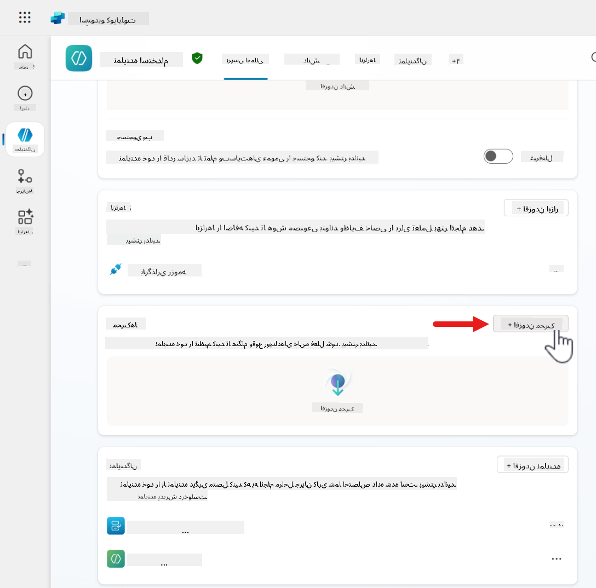

1. لیستی از محرک‌ها ظاهر خواهد شد. **وقتی ایمیل جدیدی می‌رسد (V3)** را انتخاب کنید و **بعدی** را انتخاب کنید.

       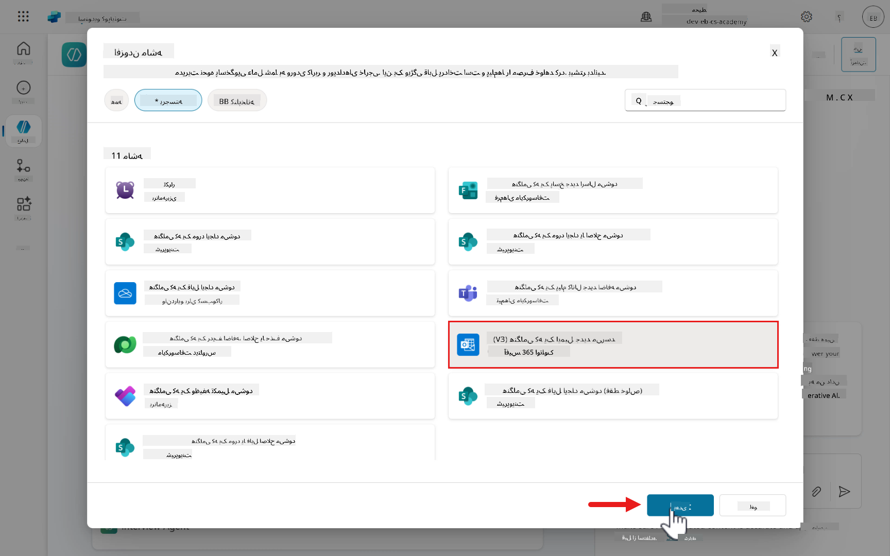

1. اکنون **نام محرک** و **اتصال‌های ورود** برای برنامه‌های لیست‌شده را مشاهده خواهیم کرد.

       نام محرک را به موارد زیر تغییر دهید،
    
       ```text
       وقتی ایمیل جدیدی از یک متقاضی می‌رسد
       ```

       مطمئن شوید که یک علامت سبز در کنار هر یک از اتصال‌های برنامه‌های لیست‌شده مشاهده می‌کنید. اگر علامت سبز نمی‌بینید، از طریق سه نقطه (...) وارد شوید و **+ اتصال جدید** را انتخاب کنید تا یک اتصال جدید ایجاد کنید.

       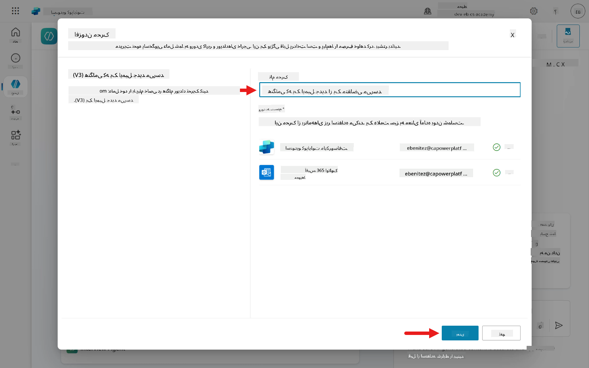

1. مرحله نهایی تنظیم ویژگی‌های ورودی محرک است. ویژگی‌های زیر را به موارد زیر به‌روزرسانی کنید،

     | ویژگی | نحوه تنظیم | جزئیات |
     |----------|------------|---------|
     | **شامل پیوست‌ها (اختیاری)** | منوی کشویی | بله |
     | **فیلتر موضوع (اختیاری)** | تایپ/وارد کردن با کیبورد | درخواست |
     | **فقط با پیوست‌ها (اختیاری)** | منوی کشویی | بله |

       **ایجاد محرک** را انتخاب کنید.

       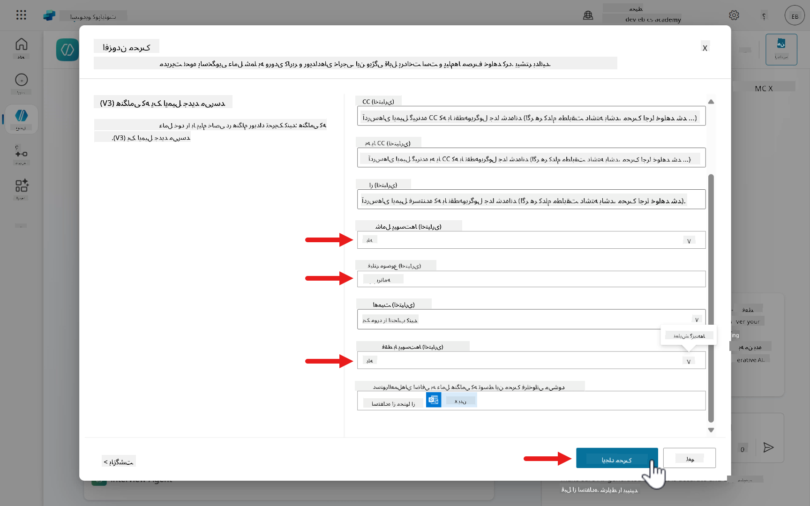

1. پس از ایجاد، یک پیام تأیید ظاهر خواهد شد که محرک به عامل اضافه شده است. **بستن** را انتخاب کنید و محرک در
اکنون قصد داریم محرک رویداد را به‌روزرسانی کنیم تا قابلیت‌های خودکارسازی بیشتری به آن اضافه کنیم. روی **سه نقطه (...)** کنار محرک کلیک کنید و گزینه **Edit in Power Automate** را انتخاب کنید.


1. محرک به‌عنوان یک جریان در پورتال سازنده Power Automate بارگذاری می‌شود. چیزی که مشاهده می‌کنید، طراح جریان در پورتال سازنده Power Automate است. اینجا جایی است که می‌توانیم منطق و اقدامات بیشتری برای خودکارسازی اضافه کنیم. محرک در بالای صفحه ظاهر می‌شود و **ارسال یک درخواست به کوپایلوت مشخص‌شده برای پردازش** به‌عنوان آخرین اقدام در جریان نمایش داده می‌شود.

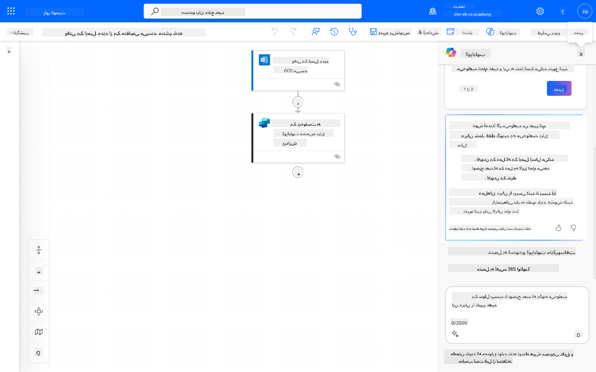

1. به‌طور پیش‌فرض، محرک **هنگامی که یک ایمیل جدید دریافت می‌شود** در Power Automate ممکن است چندین ایمیل را به‌صورت دسته‌ای پردازش کند اگر چندین ایمیل به‌طور همزمان دریافت شوند و جریان فقط یک‌بار برای دسته اجرا شود.

برای اطمینان از اینکه جریان به‌صورت جداگانه برای هر ایمیل اجرا می‌شود، تنظیمات **Split On** را در تنظیمات محرک فعال کنید و `@triggerOutputs()?['body/value']` را در فیلد آرایه کشویی انتخاب کنید.

با فعال کردن **Split On** و تنظیم فیلد آرایه به `@triggerOutputs()?['body/value']`، جریان به‌صورت جداگانه برای هر پیام اجرا می‌شود، حتی اگر چندین پیام به‌طور همزمان دریافت شوند.

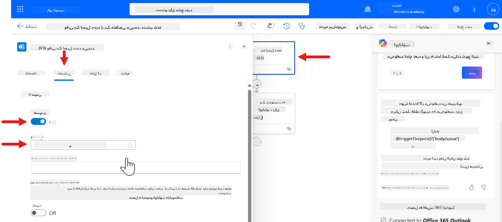

1. حالا بیایید منطق جدیدی اضافه کنیم تا نوع فایل پیوست را بررسی کنیم. ما فقط می‌خواهیم فایل‌های پیوست با فرمت .PDF را آپلود کنیم و نه تصاویر (این‌ها ممکن است از امضاهای ایمیل باشند). روی آیکون **+** زیر محرک کلیک کنید و گزینه **Control** را در بخش **ابزارهای داخلی** انتخاب کنید.

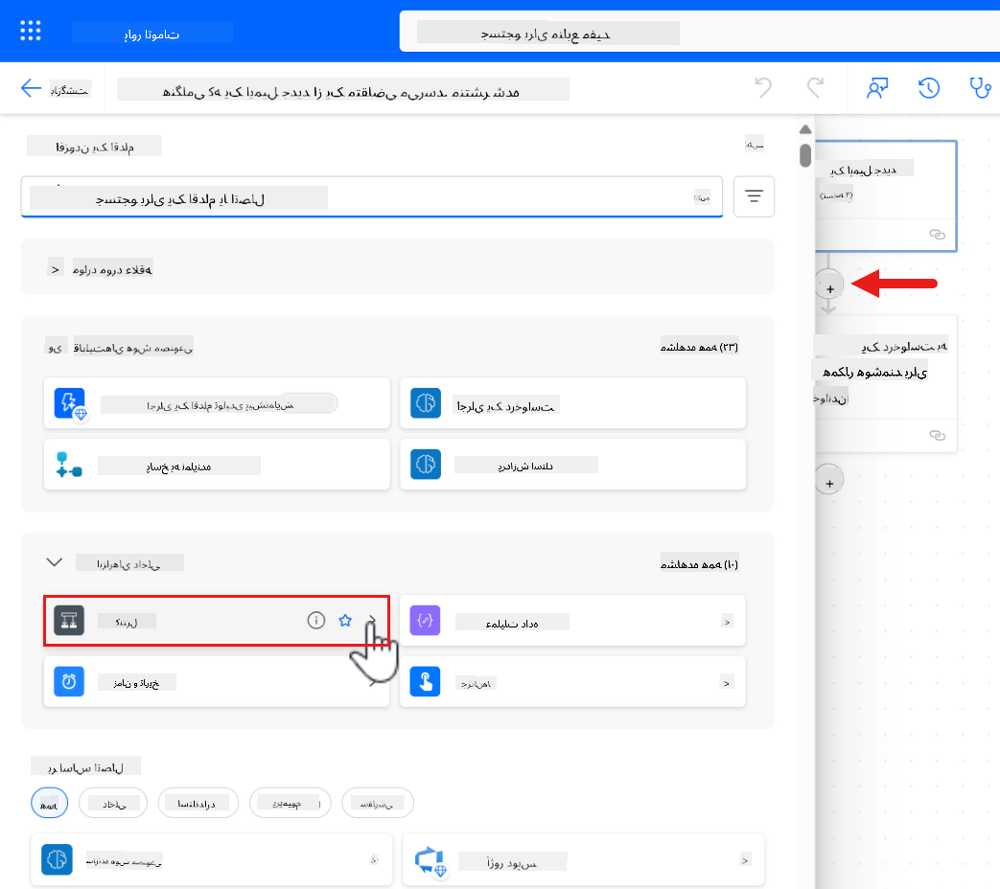

1. اقدام **Condition** را انتخاب کنید.

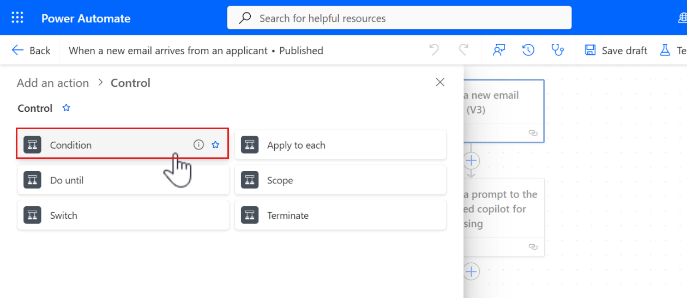

1. اکنون شرط را تنظیم می‌کنیم تا بررسی کنیم که آیا نوع فایل پیوست .PDF است یا خیر. در فیلد **Choose a value**، آیکون **صاعقه** یا **fx** در سمت راست را انتخاب کنید.

1. در فیلد **Search** عبارت زیر را وارد کنید:

```text
content type
```

1. سپس پارامتر **Attachments Content-Type** را از محرک انتخاب کنید.

1. بعد، گزینه **Add** را انتخاب کنید تا ورودی محتوای پویا را به پارامتر **Id** اقدام اضافه کنید.

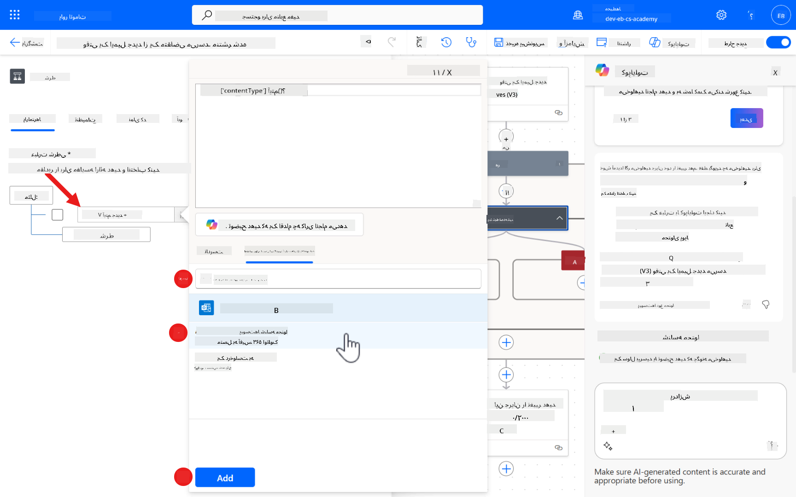

1. بیایید اینجا کمی مکث کنیم، احتمالاً متوجه شدید که اقدام **For each** به‌طور خودکار ظاهر شد.

اقدام **For each** را انتخاب کنید. این اقدام نشان‌دهنده حلقه زدن از طریق هر پیوست در ایمیل است، زیرا پارامتر **Attachments Content-Type** از محرک به هر پیوست مرتبط است.

در پشت صحنه، این یک آرایه است و به همین دلیل اقدام **For each** به‌طور خودکار اضافه شد وقتی پارامتر **Attachments Content-Type** را در اقدام **Condition** انتخاب کردیم.

برای اطلاعات بیشتر در این مورد، بلوک یادگیری اضافی زیر را گسترش دهید.

??? info "یادگیری اضافی: اقدام For each به‌طور خودکار ظاهر می‌شود"

🤔 **چرا "Apply to each" یا "For each" به‌طور خودکار ظاهر می‌شود؟**

وقتی پارامتری (محتوای پویا) را انتخاب می‌کنید که نمایانگر یک لیست یا آرایه از آیتم‌ها است - برای مثال، لیستی از پیوست‌ها، ایمیل‌ها یا ردیف‌ها - Power Automate تشخیص می‌دهد که ممکن است بخواهید هر آیتم را به‌صورت جداگانه پردازش کنید.

برای کمک به شما در این کار، Power Automate به‌طور خودکار یک حلقه **“Apply to each”** (یا **For each**) را در اطراف اقدام شما اضافه می‌کند. این تضمین می‌کند که اقدام شما یک‌بار برای هر آیتم در لیست اجرا می‌شود، به‌جای تلاش برای پردازش کل لیست به‌صورت یکجا (که ممکن است باعث خطا شود).

🦋 **مثال**

- اگر "Attachments" را از یک اقدام قبلی انتخاب کنید (که یک آرایه است)، و سعی کنید از آن در اقدامی استفاده کنید که انتظار یک فایل واحد را دارد، Power Automate اقدام شما را در یک حلقه **"Apply to each"** (یا **For each**) قرار می‌دهد.
- به این ترتیب، اقدام شما برای **هر پیوست** - یکی در یک زمان - اجرا می‌شود.

💡 **نکات کلیدی**

- **خودکار:** حلقه به‌طور خودکار ظاهر می‌شود تا به شما کمک کند هر آیتم را در یک مجموعه پردازش کنید.
- **جلوگیری از خطاها:** بدون حلقه، اقدام شما ممکن است شکست بخورد زیرا نمی‌تواند چندین آیتم را به‌طور همزمان پردازش کند.
- **نشانه بصری:** این یک روش بصری برای نشان دادن این است که جریان شما اقدام را برای هر آیتم در لیست تکرار خواهد کرد.

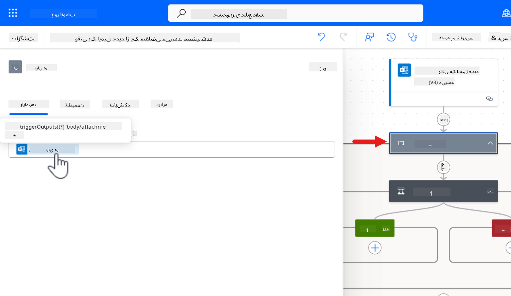

1. در فیلد دیگر **Choose a value**، عبارت زیر را وارد کنید:

```text
application/pdf
```

این اطمینان حاصل می‌کند که برای هر فایل پیوست، بررسی می‌شود که فرمت فایل .PDF باشد.


1. اکنون مسیر **True** را تنظیم می‌کنیم تا فایل را از ایمیل استخراج کرده و آن را در جدول **Resume** در Dataverse آپلود کنیم.

یک اقدام جدید در مسیر **True** اضافه کنید و عبارت `html to text` را جستجو کنید. اقدام **Html to text** را انتخاب کنید.

برای اطلاعات بیشتر درباره اقدام **Html to text**، بلوک یادگیری اضافی زیر را گسترش دهید.

??? info "یادگیری اضافی: اقدام Html to text"

🤔 **اقدام "HTML to text" چیست؟**

اقدام **HTML to text** در Power Automate برای تبدیل محتوای HTML به متن ساده استفاده می‌شود. این اقدام به‌ویژه زمانی مفید است که داده‌هایی (مانند ایمیل‌ها، محتوای وب یا پاسخ‌های API) دریافت می‌کنید که شامل تگ‌های HTML هستند و می‌خواهید فقط متن قابل خواندن را بدون هیچ‌گونه قالب‌بندی یا کد استخراج کنید.

⚙️ **چگونه کار می‌کند؟**

- **ورودی:** شما یک رشته از محتوای HTML (برای مثال، متن ایمیل) ارائه می‌دهید.
- **خروجی:** اقدام تمام تگ‌های HTML را حذف کرده و فقط متن ساده را بازمی‌گرداند.

👍🏻 **چه زمانی باید از آن استفاده کنید؟**

- زمانی که می‌خواهید متن قابل خواندن را از ایمیل‌ها، صفحات وب یا پاسخ‌های API که شامل HTML هستند استخراج کنید.
- قبل از ارسال محتوا به سیستم‌هایی که از قالب‌بندی HTML پشتیبانی نمی‌کنند (مانند پیام‌های SMS، پیام‌های Teams یا پایگاه‌های داده).
- برای پاک‌سازی داده‌ها برای پردازش یا تحلیل بیشتر.

🔭 **کجا می‌توان آن را پیدا کرد؟**

- در Power Automate برای جریان‌های عامل، اقدام `HTML to text` را جستجو کنید. این اقدام تحت کانکتور **Data Operations** قرار دارد.

💡 **نکات کلیدی**

- تمام تگ‌های HTML را حذف می‌کند و فقط متن را باقی می‌گذارد.
- اسکریپت‌ها/استایل‌ها را تفسیر یا اجرا نمی‌کند - فقط تگ‌ها را حذف می‌کند.
- برای پاک‌سازی داده‌ها و آماده‌سازی محتوا برای خروجی‌های متن ساده مفید است.

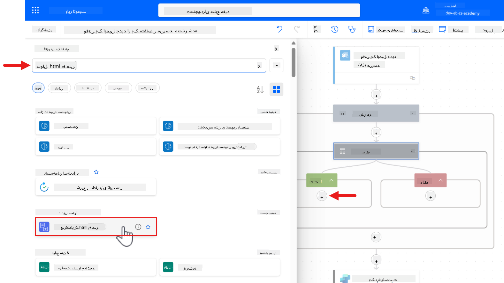

1. اکنون باید یک مرجع اتصال جدید برای اقدام **Html to text** ایجاد کنیم. گزینه **Add new** را انتخاب کنید.

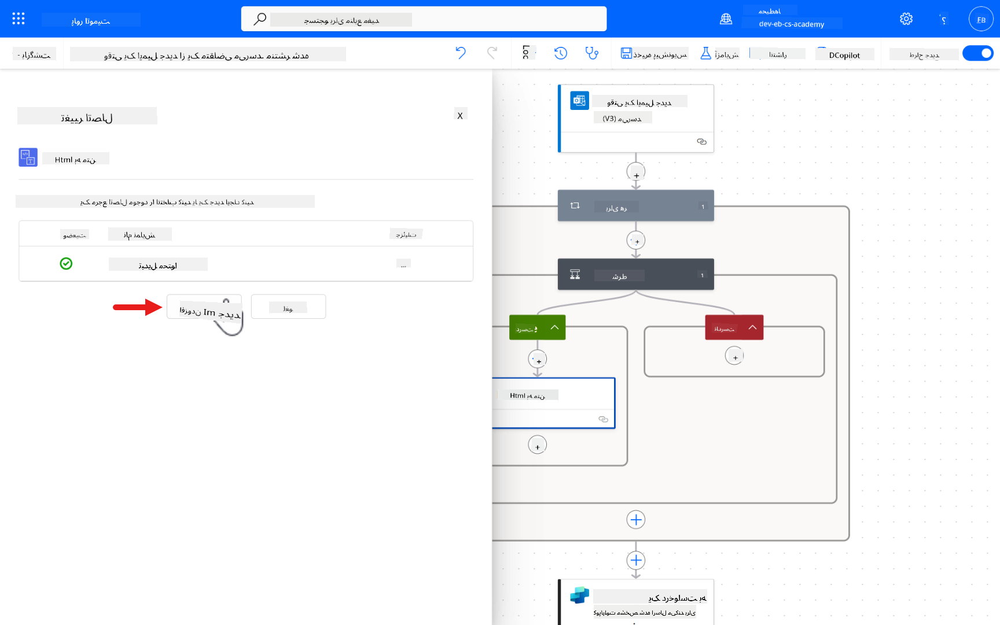

1. اقدام اکنون قابل تنظیم است. پارامتر **Body** را از محرک اضافه کنید. در فیلد **Content**، آیکون **صاعقه** یا **fx** در سمت راست را انتخاب کنید.

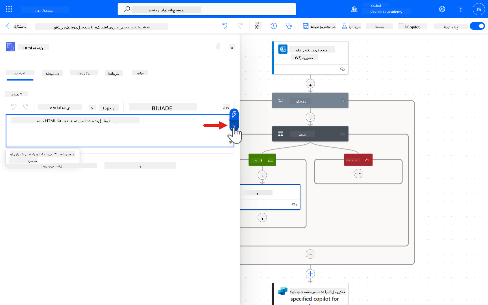

1. در تب **Dynamic content**، عبارت `body` را جستجو کنید و پارامتر **Body** را انتخاب کنید، سپس گزینه **Add** را انتخاب کنید.

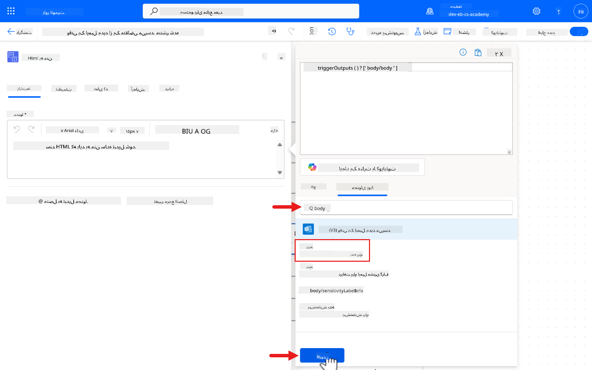

1. تنظیم این اقدام به پایان رسیده است، بنابراین از اقدام خارج شوید و با انتخاب دو براکت زاویه‌دار («) که به سمت چپ اشاره می‌کنند، پانل را جمع کنید.

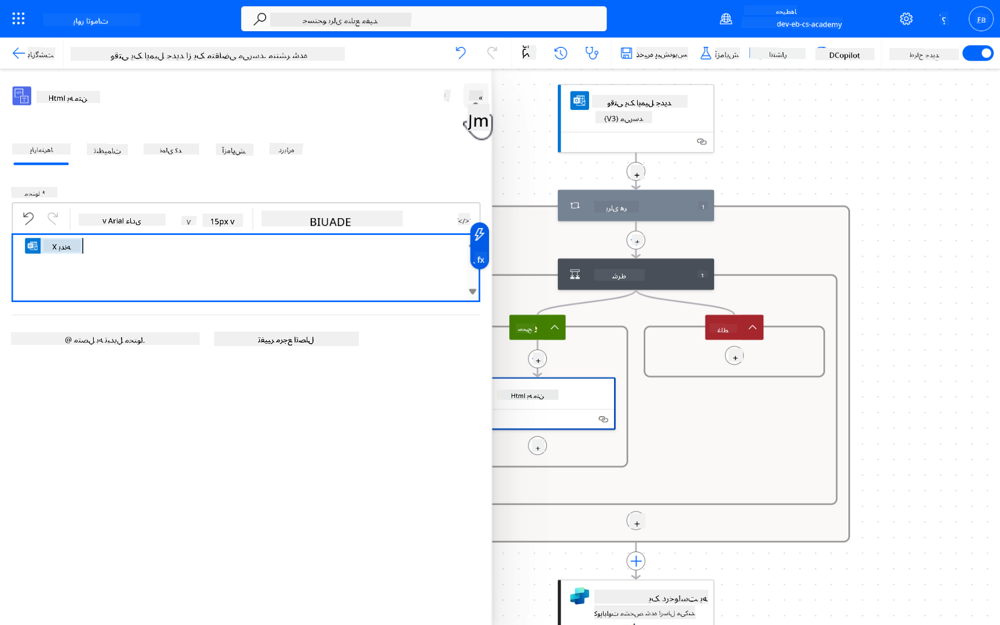

1. یک اقدام جدید اضافه کنید با کلیک روی **+ icon** زیر اقدام **Html to text** که پانل اضافه کردن اقدامات را بارگذاری می‌کند. کانکتور **Microsoft Dataverse** را انتخاب کنید.

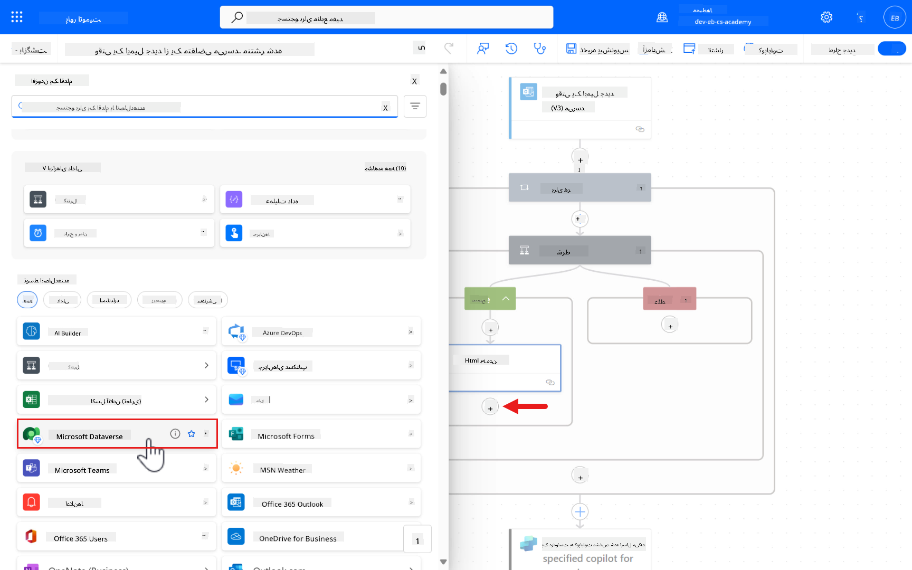

1. اقدام **Add a new row** را انتخاب کنید.

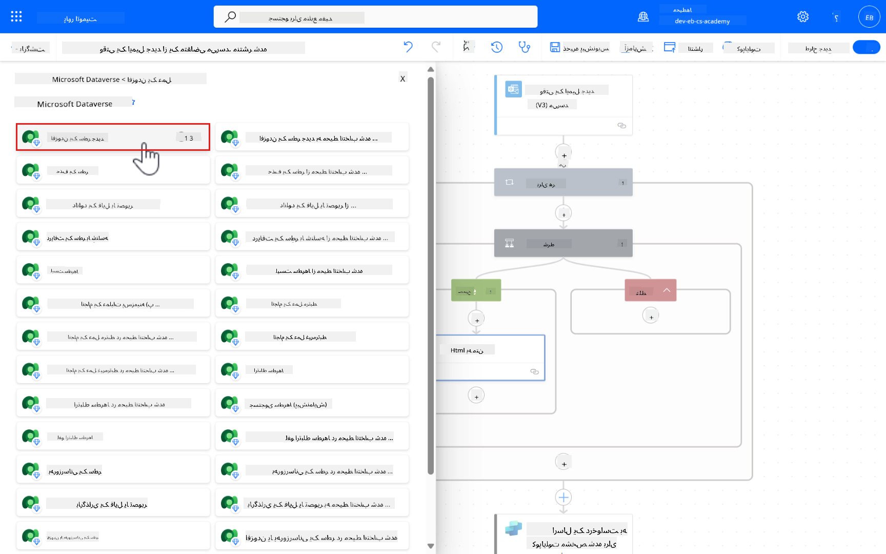

1. نام اقدام را تغییر دهید با انتخاب **سه نقطه (...)**، متن زیر را کپی و جای‌گذاری کنید:

```text
Add a new Resume row
```

برای پارامتر **Table name**، عبارت `res` را جستجو کنید و جدول **Resumes** را انتخاب کنید.

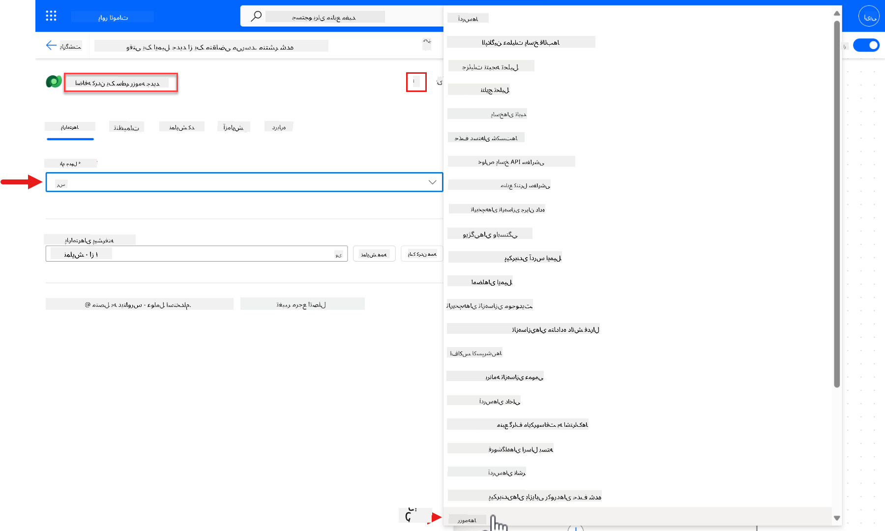

1. فیلد **Resume Title** را انتخاب کنید و آیکون **صاعقه** یا **fx** در سمت راست را انتخاب کنید.

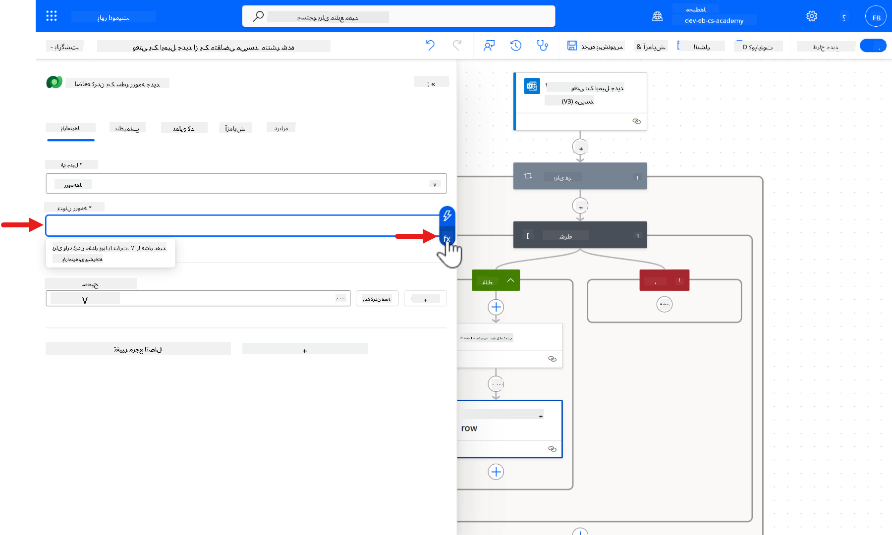

1. در تب **Function**، عبارت زیر را وارد کنید که از تابع `item()` استفاده می‌کند:

```text
item()?['name']
```

برای اطلاعات بیشتر درباره تابع `item()`، بلوک یادگیری اضافی زیر را گسترش دهید.

??? info "یادگیری اضافی: تابع `item()`"

🤔 **تابع `item()` چیست؟**

- وقتی از اقدام **Apply to each** استفاده می‌کنید، Power Automate از طریق هر عنصر در یک مجموعه (آرایه) عبور می‌کند.
- این تابع بیشتر در داخل اقداماتی مانند **Apply to each** (یا **For each**)، **Select** یا **Filter array** استفاده می‌شود.

⚙️ **چگونه کار می‌کند؟**

- `item()` یک تابع است که آیتم فعلی در حال پردازش در یک حلقه یا عملیات آرایه را بازمی‌گرداند.
- در داخل آن حلقه، `item()` به عنصر _فعلی_ در حال پردازش اشاره دارد.

📌 **کجا از آن استفاده می‌شود؟**

- **Apply to each:** برای دسترسی به ویژگی‌های آیتم فعلی.
- **Select:** برای تبدیل هر آیتم در یک آرایه.
- **Filter array:** برای ارجاع به آیتم فعلی در حال ارزیابی.

🦋 **مثال**

- عبارت داخل یک حلقه:
       -  `item()?['Email']`
- این ویژگی `Email` آیتم فعلی را دریافت می‌کند.

💡 **نکات کلیدی**

- `item()` _حساس به زمینه_ است: همیشه به آیتم فعلی در حلقه یا عملیات آرایه‌ای که در آن هستید اشاره دارد.
- اگر حلقه‌ها را تو در تو کنید، می‌توانید از `items('LoopName')` برای ارجاع به آیتم‌ها در یک حلقه خاص استفاده کنید.

گزینه **Add** را انتخاب کنید تا عبارت به پارامتر **Resume Title** اضافه شود.

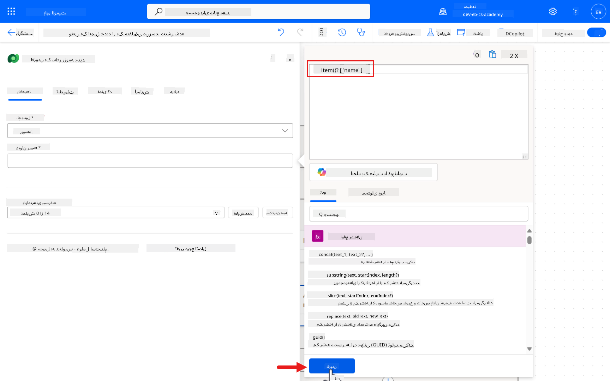

1. هنوز باید چندین پارامتر دیگر را تنظیم کنیم، گزینه **Show all** را انتخاب کنید و در فیلد **Cover Letter**، آیکون **صاعقه** یا **fx** در سمت راست را انتخاب کنید.

در تب **Function**، عبارت زیر را وارد کنید که از همان عبارت در [ماموریت قبلی](../02-multi-agent/README.md) استفاده می‌کند:

```text
if(greater(length(body('Html_to_text')), 2000), substring(body('Html_to_text'), 0, 2000), body('Html_to_text'))
```

این عبارت بررسی می‌کند که آیا _متن_ از اقدام **Html to text** طولانی‌تر از 2000 کاراکتر است یا خیر، و اگر چنین باشد، فقط 2000 کاراکتر اول را بازمی‌گرداند؛ در غیر این صورت، متن کامل را بازمی‌گرداند.

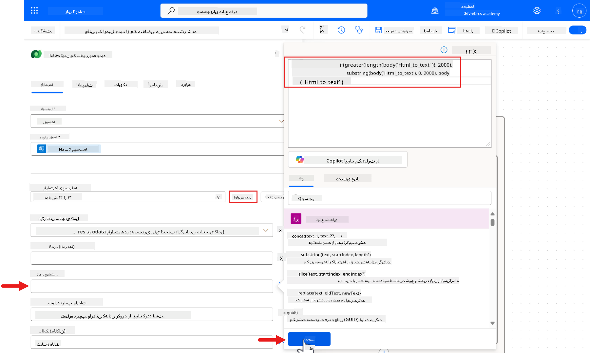

1. عبارت اکنون به فیلد **Cover Letter** اضافه شده است.


1. برای فیلد **Source Email Address**، عبارت `from` را جستجو کنید و پارامتر **From** را از محرک انتخاب کنید زیرا این پارامتر شامل مقدار آدرس ایمیل است.

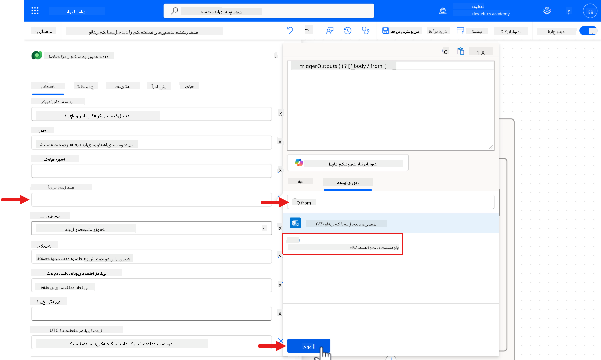

1. برای فیلد **Upload Date**، آیکون **صاعقه** یا **fx** در سمت راست را انتخاب کنید. در تب **Function**، عبارت زیر را وارد کنید که از تابع `utcNow()` استفاده می‌کند:

```text
utcNow()
```

برای اطلاعات بیشتر درباره تابع `utcNow`، بلوک یادگیری اضافی زیر را گسترش دهید.

??? info "یادگیری اضافی: تابع `utcNow`"

🤔 **تابع `utcNow()` چیست؟**

- تابع utcnow() در Power Automate تاریخ و زمان فعلی را در زمان هماهنگ جهانی (UTC) در قالب ISO 8601 بازمی‌گرداند، مانند: `2025-09-23T04:32:14Z`

🦋 **مثال**

- عبارت:
       -  `concat('Report generated on ', utcnow())`
- خروجی:
       - گزارش تولید شده در `2025-09-23T04:32:14Z`

💡 **نکات کلیدی**
- **بدون نیاز به آرگومان‌ها (پارامترهای ورودی):** همیشه زمان‌بندی فعلی UTC را ارائه می‌دهد.
   - **موارد استفاده**
       - افزودن زمان‌بندی به گزارش‌ها یا نام فایل‌ها
       - مقایسه زمان فعلی با تاریخ‌های دیگر
       - برنامه‌ریزی یا شرایط مبتنی بر زمان

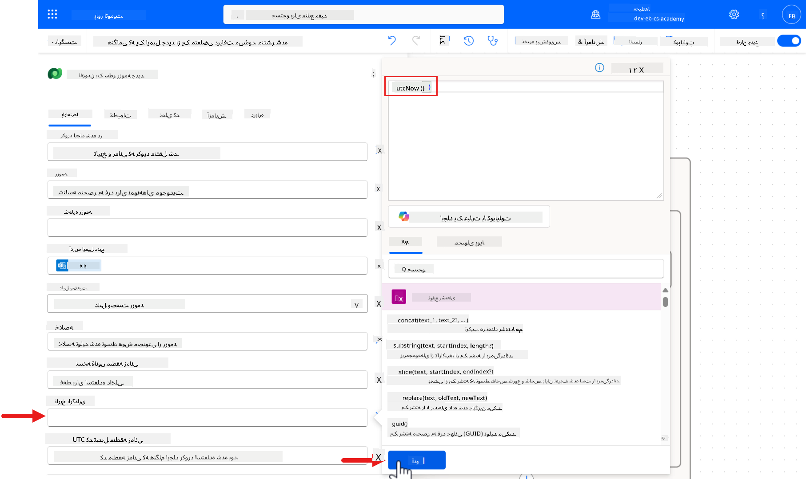

1. اکنون پیکربندی اقدام **افزودن یک ردیف رزومه جدید** را تکمیل کرده‌ایم، بنابراین از پنل خارج شده و آن را جمع می‌کنیم.

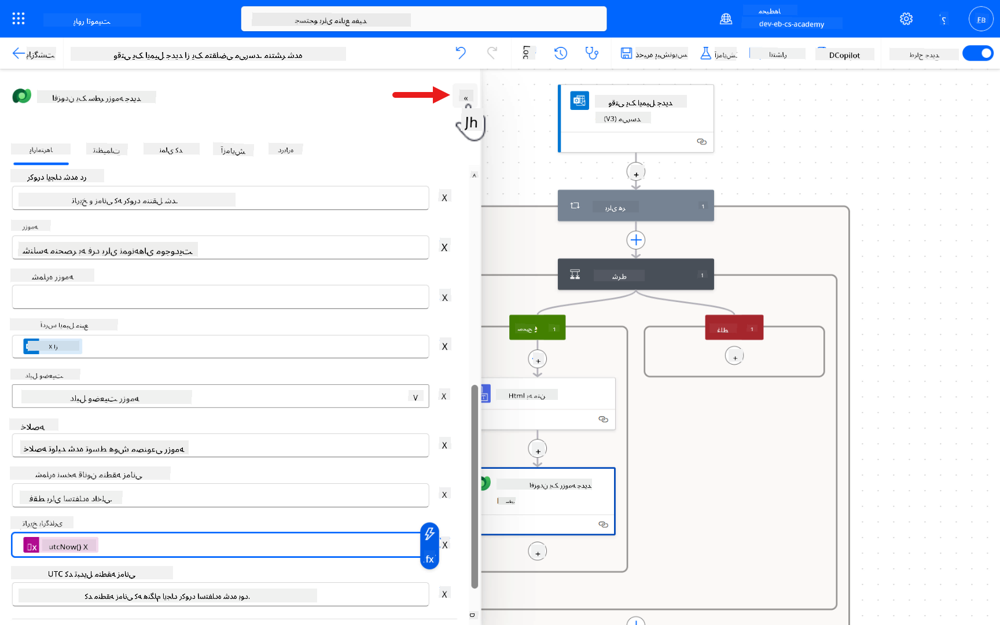

1. یک اقدام جدید اضافه می‌کنیم با انتخاب **آیکون +** زیر اقدام **افزودن یک ردیف رزومه جدید** که پنل افزودن اقدامات را بارگذاری می‌کند. دوباره اتصال‌دهنده **Microsoft Dataverse** را انتخاب کنید.

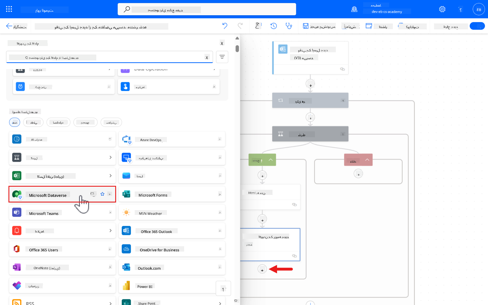

1. اقدام **بارگذاری یک فایل یا تصویر** را انتخاب کنید.

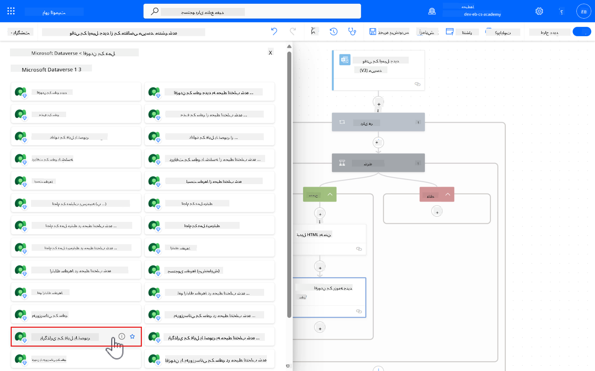

1. اقدام را با انتخاب **سه نقطه (...)** تغییر نام دهید، متن زیر را کپی کرده و به عنوان نام جای‌گذاری کنید:

```text
بارگذاری فایل رزومه
```

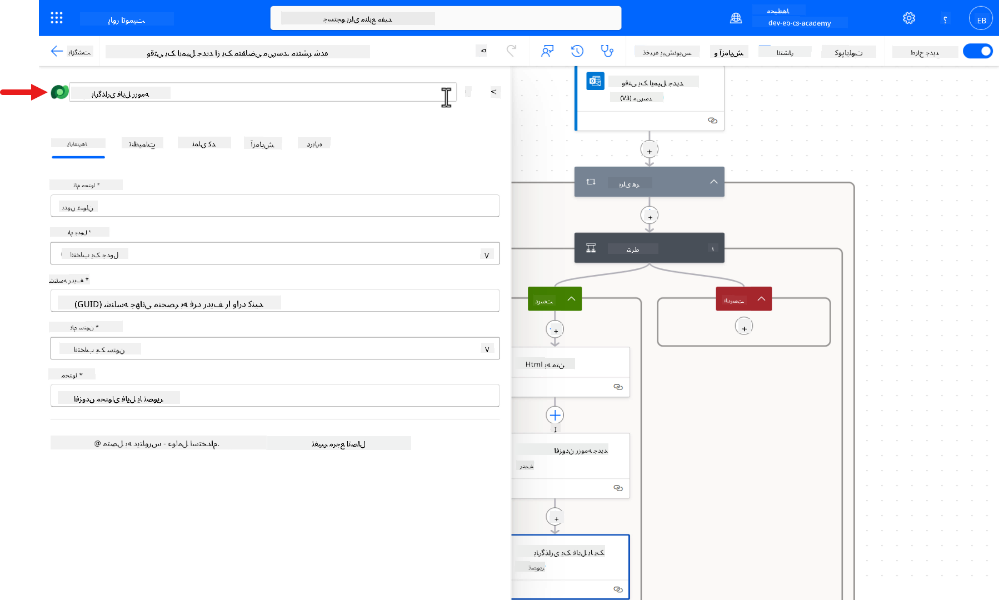

1. سپس فیلد **نام محتوا** را انتخاب کنید و آیکون **صاعقه** یا **fx** را در سمت راست انتخاب کنید.

در تب **تابع**، عبارت زیر را وارد کنید که از تابع `item ()` استفاده می‌کند. این ویژگی `name` آیتم فعلی (فایل پیوست) را دریافت می‌کند.

```text
item()?['name']
```

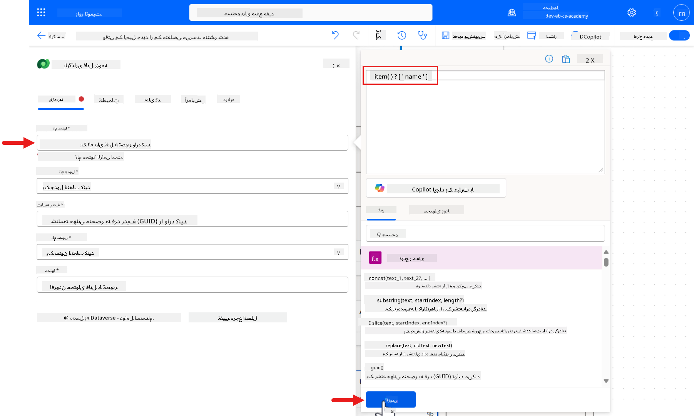

1. برای پارامتر **نام جدول**، `res` را جستجو کنید و جدول **رزومه‌ها** را انتخاب کنید.

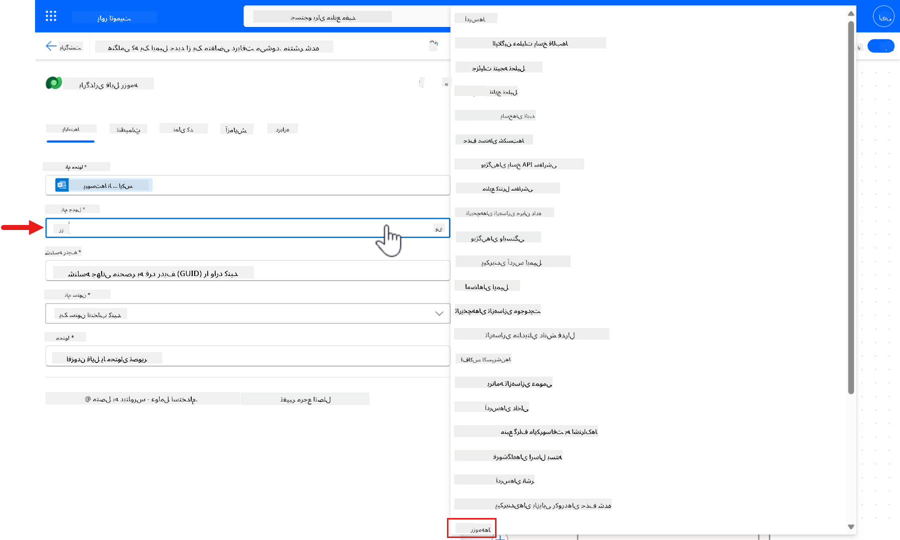

1. سپس فیلد **شناسه ردیف** را انتخاب کنید و آیکون **صاعقه** یا **fx** را در سمت راست انتخاب کنید.

`ID` را جستجو کنید و پارامتر **رزومه** را از اقدام Dataverse _افزودن یک ردیف جدید_ انتخاب کنید زیرا این شامل مقدار شناسه ردیف برای بارگذاری فایل PDF است.

**افزودن** را انتخاب کنید.

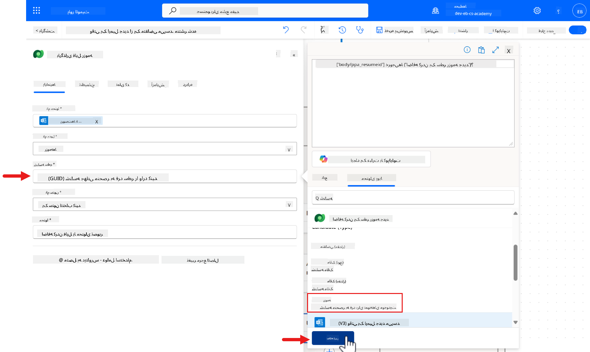

1. فیلد **نام ستون** را انتخاب کنید و گزینه **رزومه PDF** را انتخاب کنید.

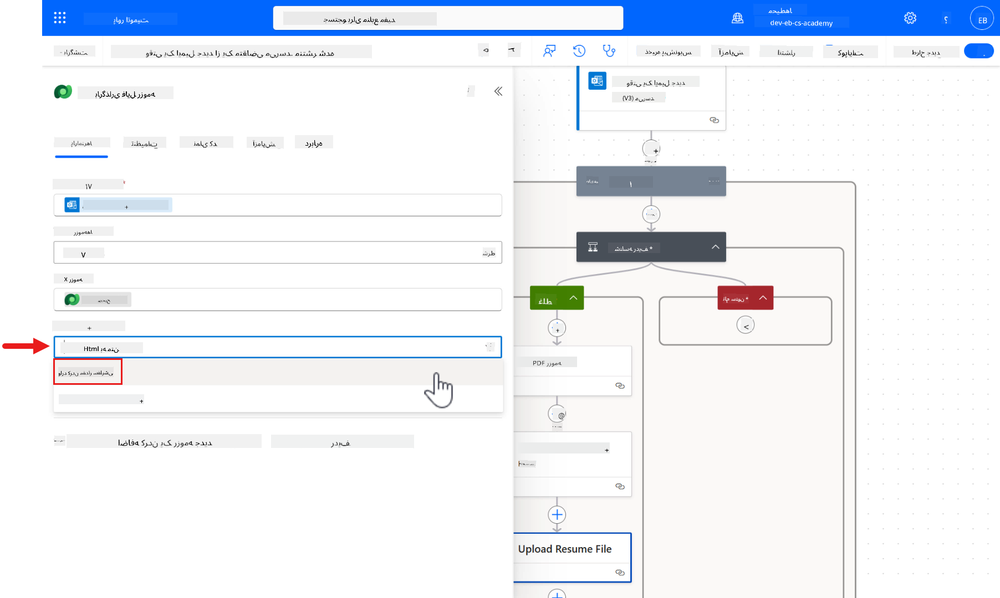

1. فیلد **محتوا** را انتخاب کنید و آیکون **صاعقه** یا **fx** را در سمت راست انتخاب کنید.

در تب **تابع**، عبارت زیر را وارد کنید که از تابع `item ()` استفاده می‌کند. این ویژگی `contentBytes` آیتم فعلی (فایل پیوست) را دریافت می‌کند. `contentBytes` به داده‌های خام باینری یک فایل یا پیوست اشاره دارد که به صورت رشته Base64 کدگذاری شده است.

```text
item()?['contentBytes']
```

1. پیکربندی این اقدام را تکمیل کرده‌ایم، بنابراین با انتخاب دو علامت زاویه‌ای («) که به سمت چپ اشاره می‌کنند، پنل را جمع می‌کنیم.

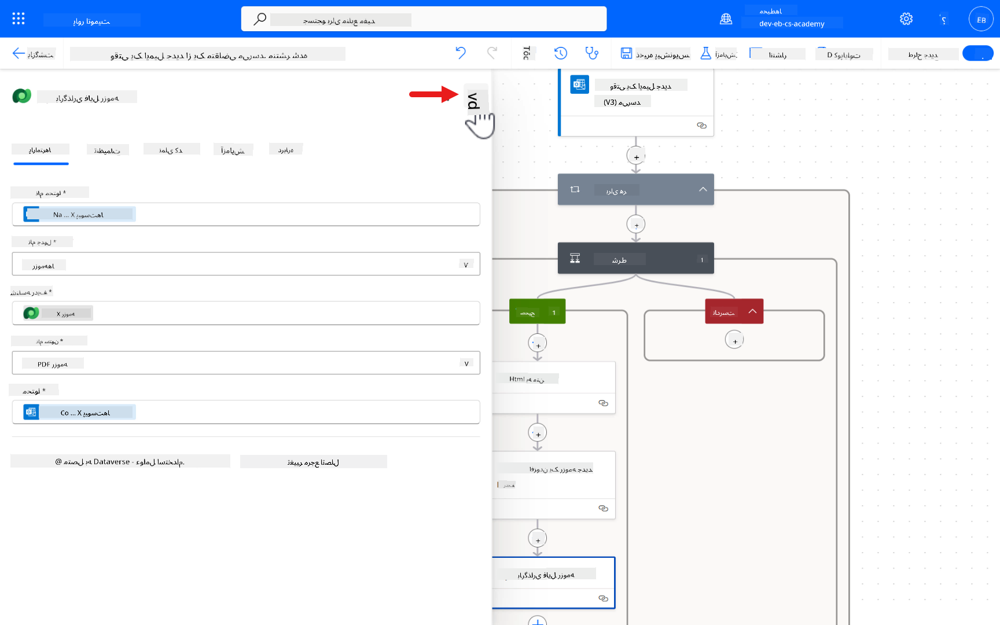

1. سپس اقدام **ارسال یک درخواست به کوپایلوت مشخص برای پردازش** را انتخاب کنید، سپس این اقدام را به زیر اقدام **بارگذاری فایل رزومه** در مسیر _True_ شرط بکشید و رها کنید.

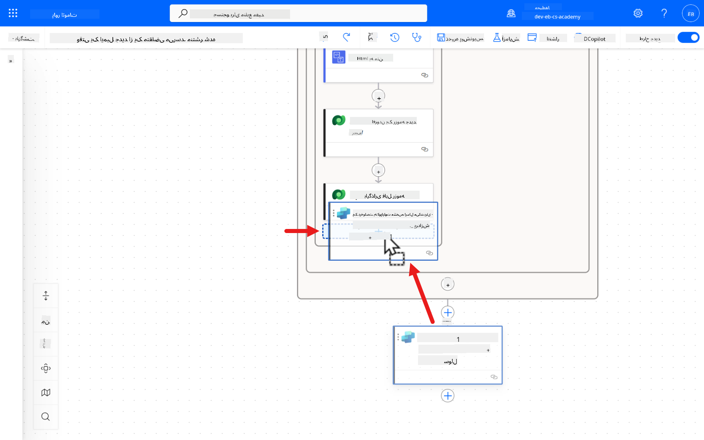

1. اقدام **ارسال یک درخواست به کوپایلوت مشخص برای پردازش** را انتخاب کنید تا آن را پیکربندی کنید.

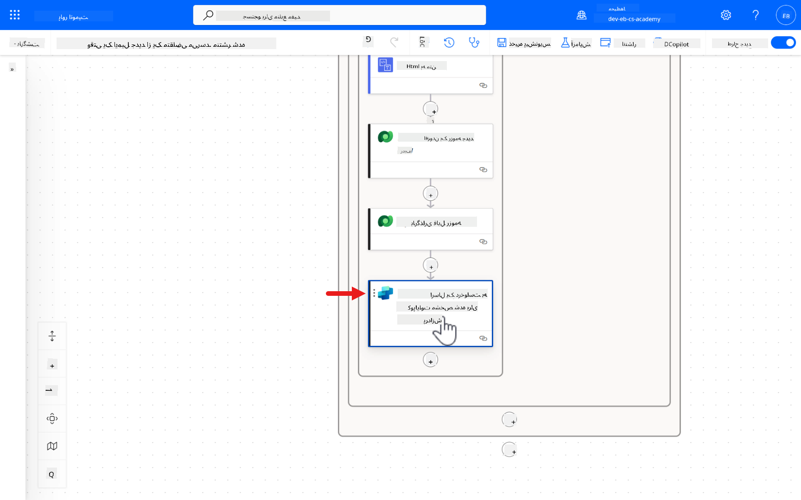

1. در فیلد **بدنه/پیام**، تمام محتوای فیلد را انتخاب کرده و پاک کنید.

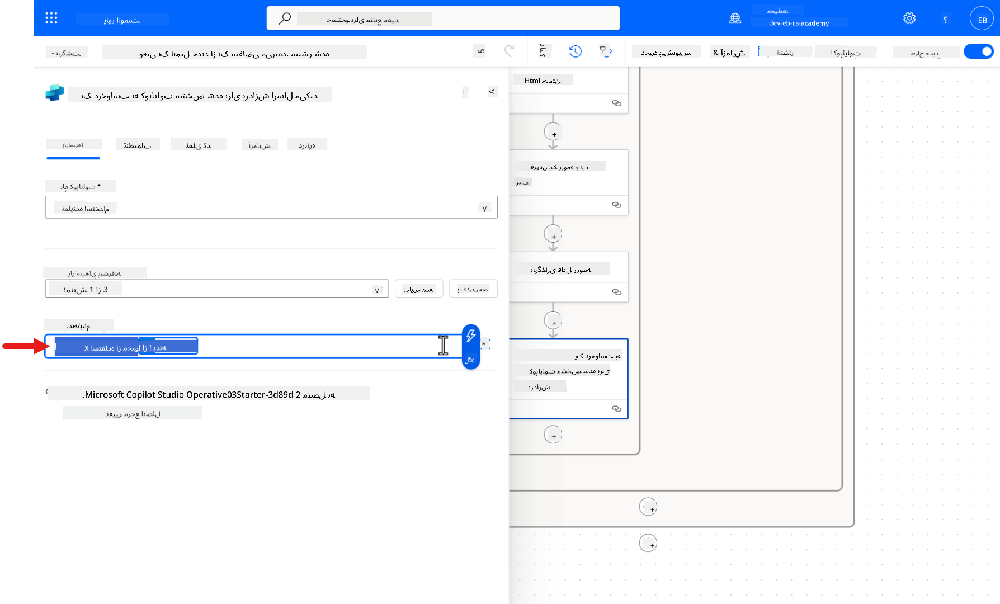

1. متن زیر را در فیلد **بدنه/پیام** کپی و جای‌گذاری کنید و `RESUME ID PLACEHOLDER` را برجسته کنید.

```text
ارسال [ResumeId (text)] = "RESUME ID PLACEHOLDER" و [ResumeTitle (text_1)] = "RESUME TITLE PLACEHOLDER" و [ResumeNumber (text_2)]= "RESUME NUMBER PLACEHOLDER" به ابزار "Notify Teams Applicant channel" در عامل فرعی "Application Intake Agent"
```

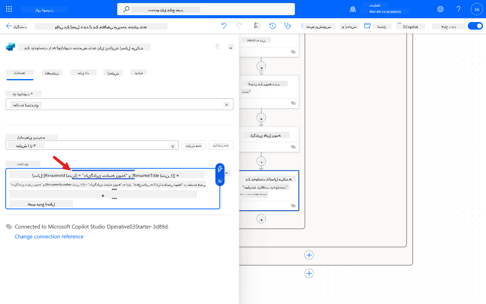

1. آیکون **صاعقه** یا **fx** را در سمت راست انتخاب کنید.

`resume` را جستجو کنید و پارامتر **رزومه** را از اقدام Dataverse _افزودن یک ردیف جدید_ انتخاب کنید زیرا این شامل مقدار `ID` ردیف رزومه ایجاد شده است.

**افزودن** را انتخاب کنید.


1. `RESUME TITLE PLACEHOLDER` را برجسته کنید. آیکون **صاعقه** یا **fx** را در سمت راست انتخاب کنید.

`title` را جستجو کنید و پارامتر **عنوان رزومه** را از اقدام Dataverse _افزودن یک ردیف جدید_ انتخاب کنید زیرا این شامل مقدار `عنوان رزومه` ردیف رزومه ایجاد شده است.

**افزودن** را انتخاب کنید.

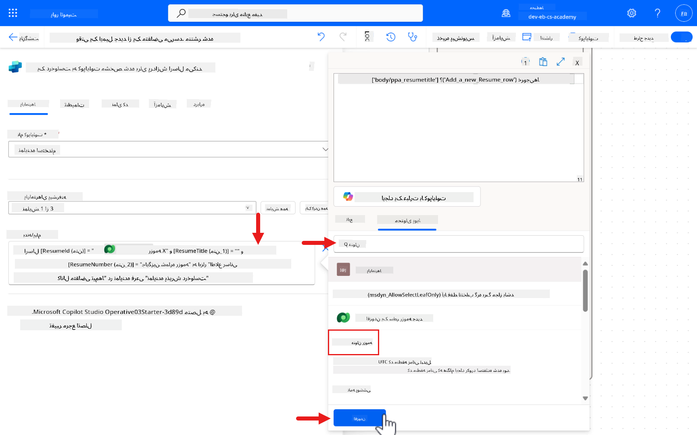

1. `RESUME NUMBER PLACEHOLDER` را برجسته کنید. آیکون **صاعقه** یا **fx** را در سمت راست انتخاب کنید.

`resume number` را جستجو کنید و پارامتر **شماره رزومه** را از اقدام Dataverse _افزودن یک ردیف جدید_ انتخاب کنید زیرا این شامل مقدار `شماره رزومه` ردیف رزومه ایجاد شده است.

**افزودن** را انتخاب کنید.

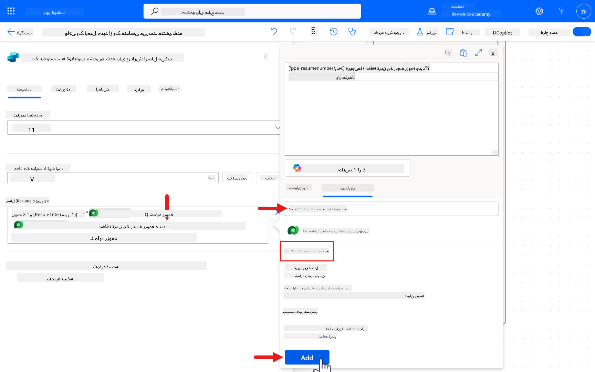

1. پیکربندی این اقدام و جریان عامل ما را تکمیل کرده‌ایم 🙌🏻 شما عالی کار می‌کنید! اکنون جریان رویداد خود را با انتخاب **ذخیره پیش‌نویس** ذخیره کنید.

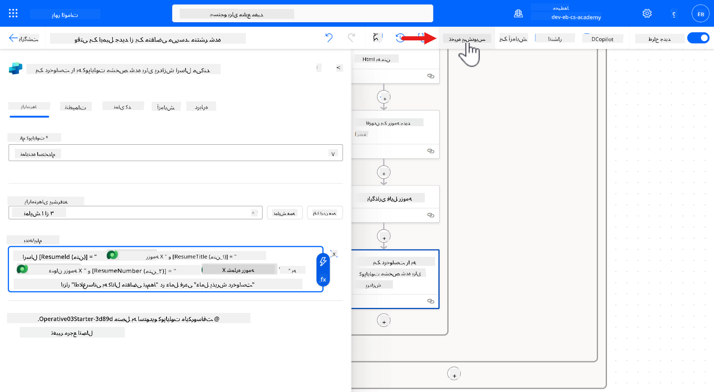

1. اکنون باید جزئیات جریان عامل را ویرایش کنیم، **بازگشت** را انتخاب کنید.

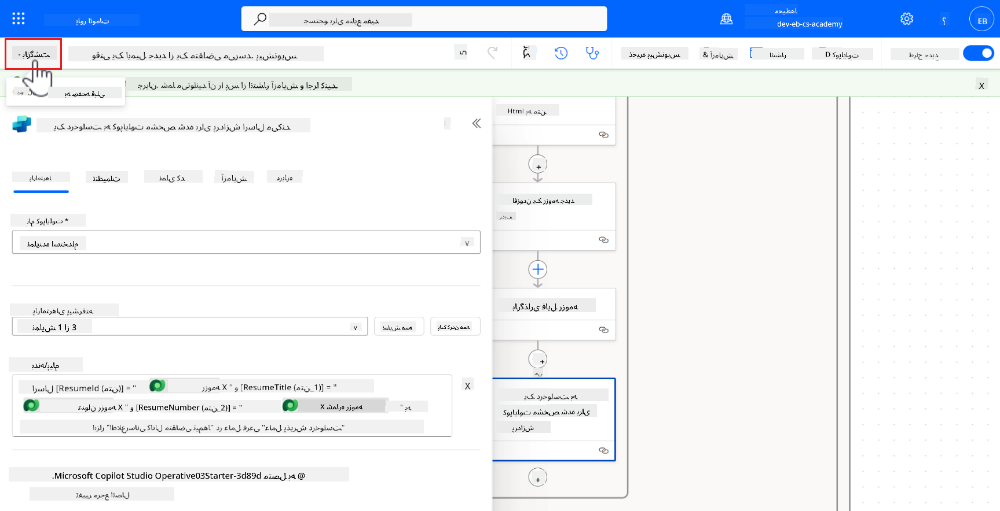

1. در بخش **جزئیات** گزینه **ویرایش** را انتخاب کنید و **طرح** را به گزینه **Copilot Studio** به‌روزرسانی کنید.

**ذخیره** را انتخاب کنید.

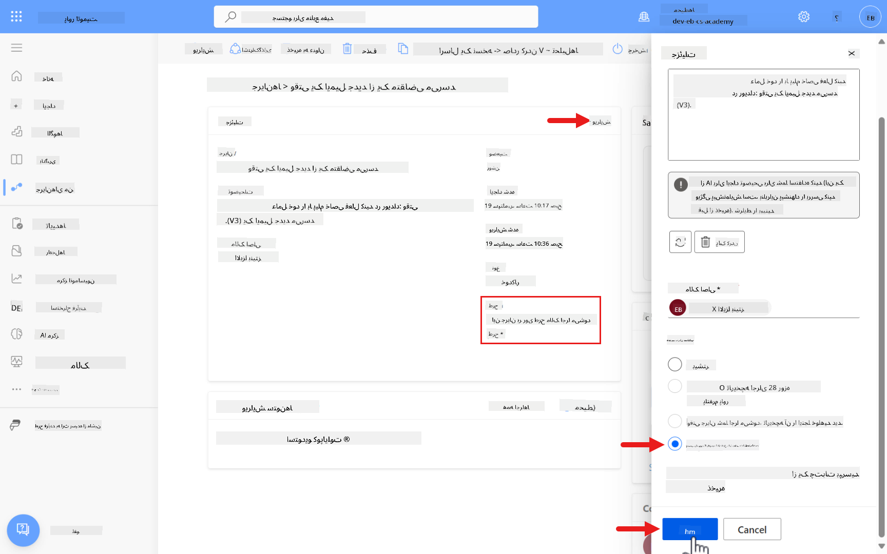

1. یک پنجره ظاهر می‌شود که از شما می‌خواهد تغییر به طرح Copilot Studio را تأیید کنید. **تأیید** را انتخاب کنید.

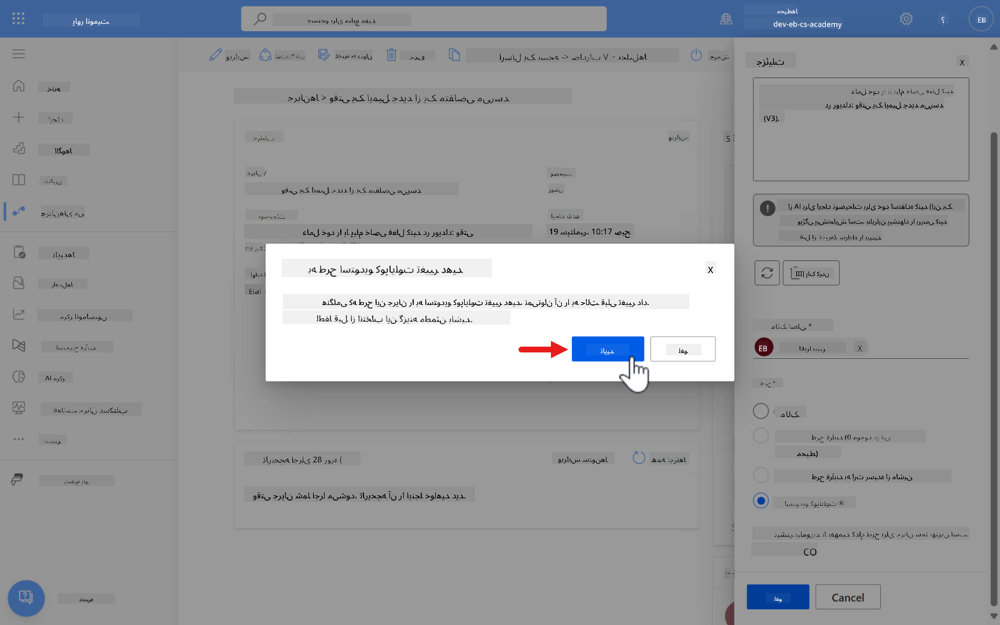

1. طرح اکنون به **Copilot Studio** به‌روزرسانی شده است. **ویرایش** را انتخاب کنید زیرا باید جریان رویداد را برای عامل خود منتشر کنیم.

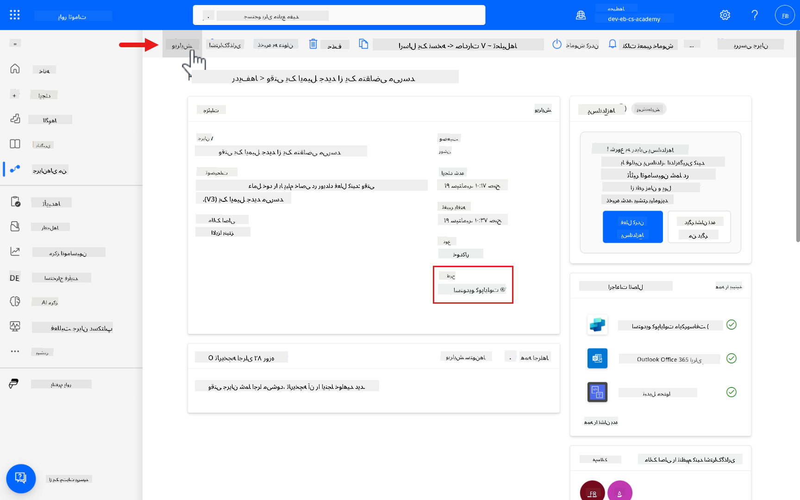

1. **انتشار** را انتخاب کنید.

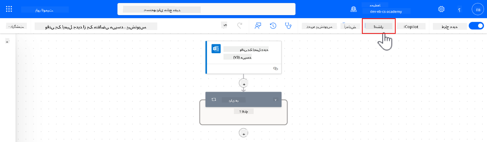

هورا! جریان رویداد اکنون منتشر شده است 😃

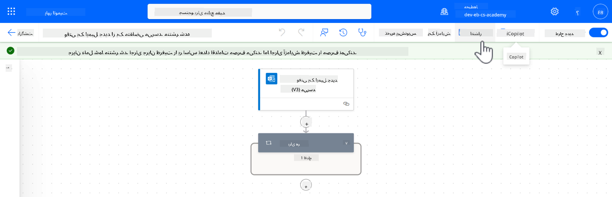

بیایید ادامه دهیم و یک جریان عامل جدید ایجاد کنیم که توسط عامل فرعی **Intake Application Agent** فراخوانی شود.

### آزمایشگاه 3.2 - اطلاع‌رسانی به کانال Teams با استفاده از کارت تطبیقی

اکنون قصد داریم یک جریان عامل جدید برای عامل فرعی **Intake Application Agent** ایجاد کنیم که از مقادیر ارسال شده توسط رویداد استفاده کند تا یک کارت تطبیقی را به کانال Teams ارسال کند. این کارت تطبیقی تیم استخدام منابع انسانی را در مورد فایل PDF که به صورت خودکار بارگذاری شده است مطلع می‌کند تا بتوانند آن را بررسی کنند.

بیایید شروع کنیم!

1. در **عامل استخدام** تب **عوامل** را انتخاب کنید و عامل **Application Intake Agent** را انتخاب کنید.

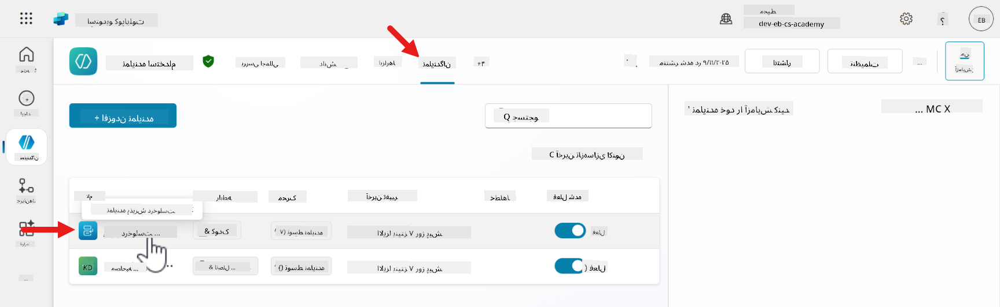

1. به پایین به **ابزارها** بروید و **+ افزودن** را انتخاب کنید.

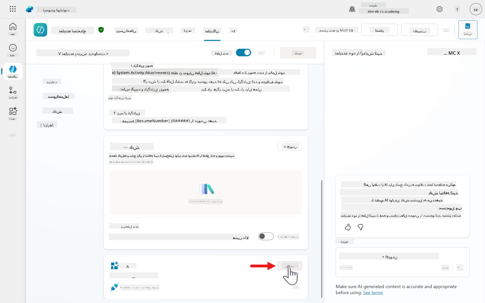

1. پنجره **افزودن ابزار** ظاهر می‌شود. **+ ابزار جدید** را انتخاب کنید.

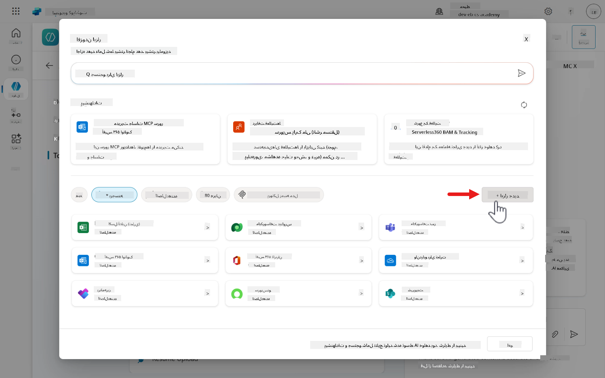

1. **جریان عامل** را انتخاب کنید.

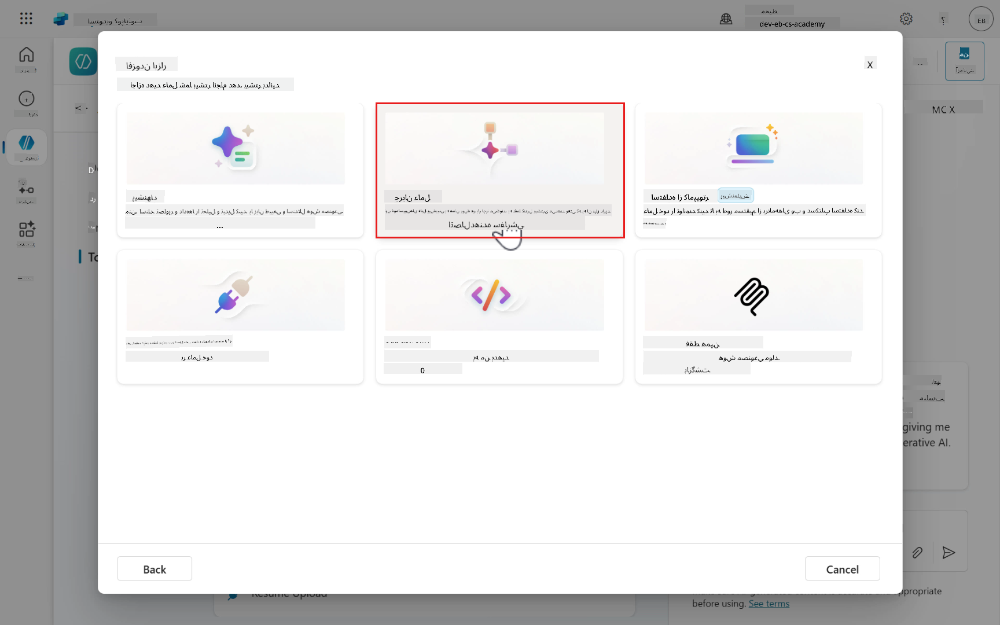

1. سپس **طراح جریان عامل** بارگذاری می‌شود. در محرک **وقتی یک عامل جریان را فراخوانی می‌کند**، **+ افزودن ورودی** را انتخاب کنید.

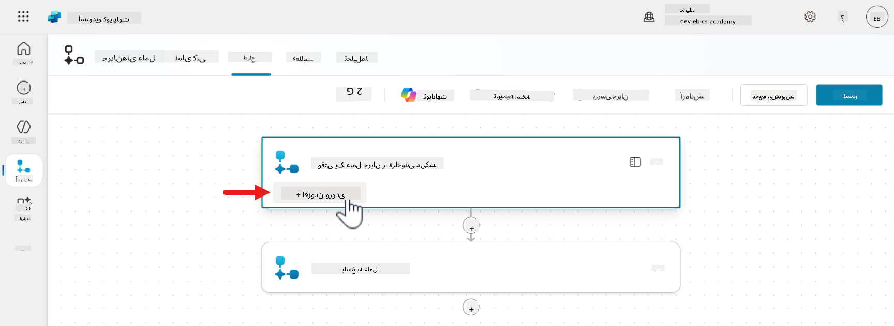

1. **متن** را به عنوان نوع ورودی کاربر انتخاب کنید.

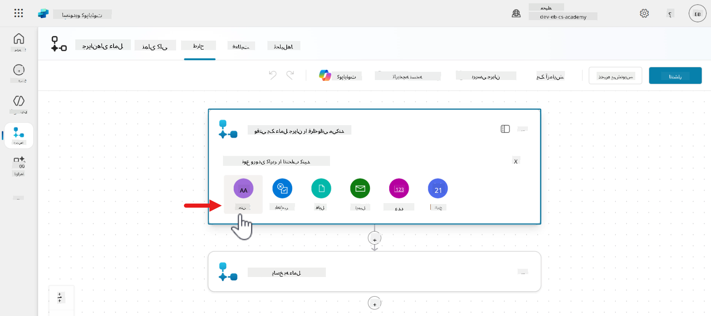

1. در فیلد متن ورودی، متن زیر را برای نام پارامتر ورودی کپی و جای‌گذاری کنید.

```text
ResumeId
```

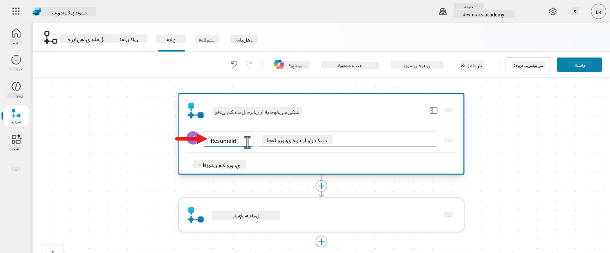

1. همان مراحل را برای افزودن ورودی متن دوم تکرار کنید. متن زیر را برای نام پارامتر ورودی کپی و جای‌گذاری کنید.

```text
ResumeTitle
```

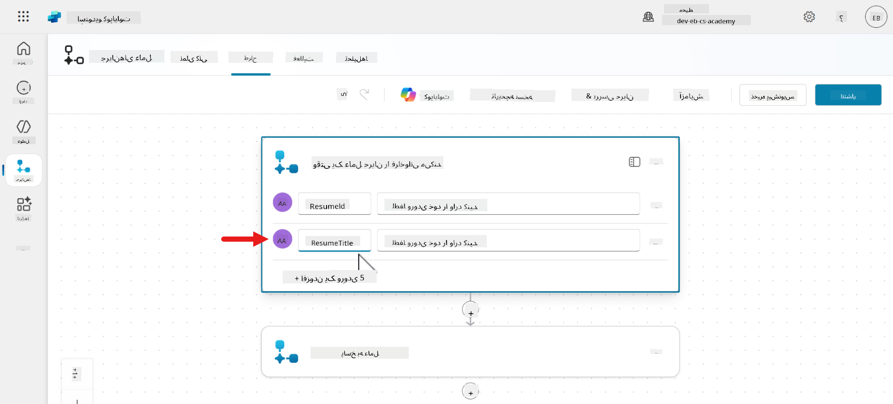

1. همان مراحل را برای افزودن ورودی متن سوم تکرار کنید. متن زیر را برای نام پارامتر ورودی کپی و جای‌گذاری کنید.

```text
ResumeNumber
```

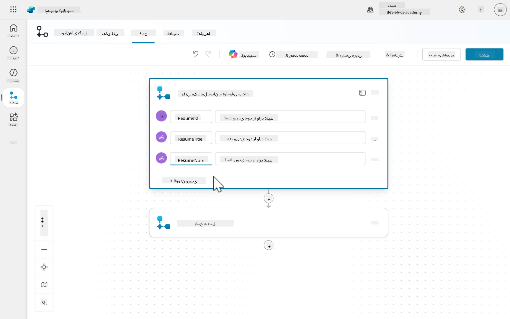

1. به یاد دارید که در [استخدام](../../recruit/08-add-adaptive-card/README.md#81-create-a-new-topic-with-an-adaptive-card-for-user-to-submit-their-request) یک کارت تطبیقی را در یک موضوع برای عامل خود اضافه کردیم؟ این بار، قصد داریم یک کارت تطبیقی را در یک جریان عامل اضافه کنیم. اکنون قصد داریم یک اقدام دیگر به جریان عامل خود اضافه کنیم که یک کارت تطبیقی را به کانال Teams ارسال کند.

آیکون **+** زیر محرک را انتخاب کنید.

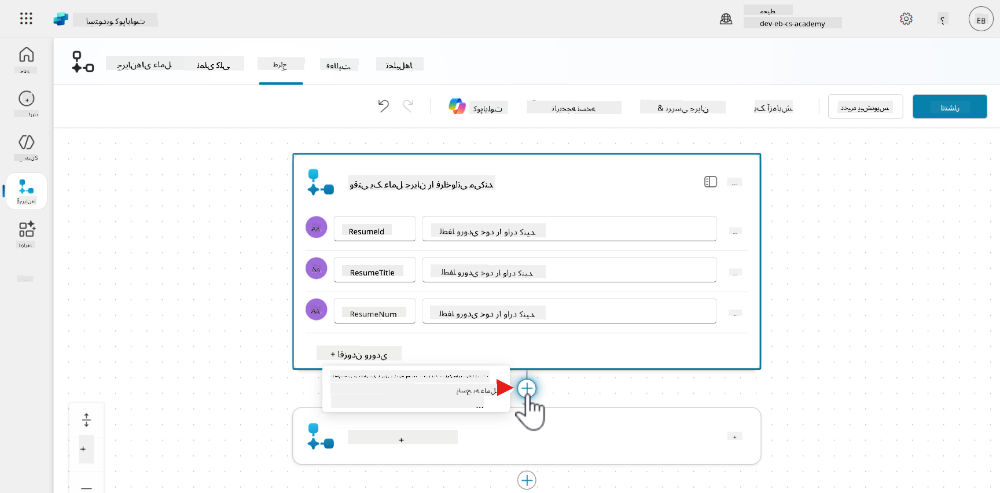

1. اقدام **ارسال کارت در چت یا کانال** را انتخاب کنید.

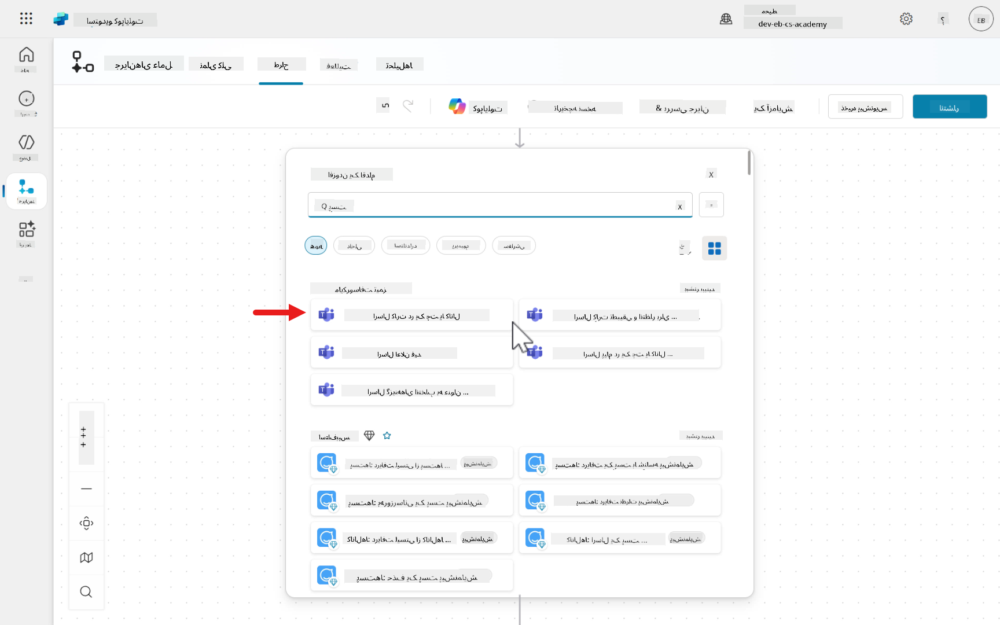

1. یک مرجع اتصال به Microsoft Teams باید با حساب کاربری وارد شده شما ایجاد شود. **ورود به سیستم** را انتخاب کنید.

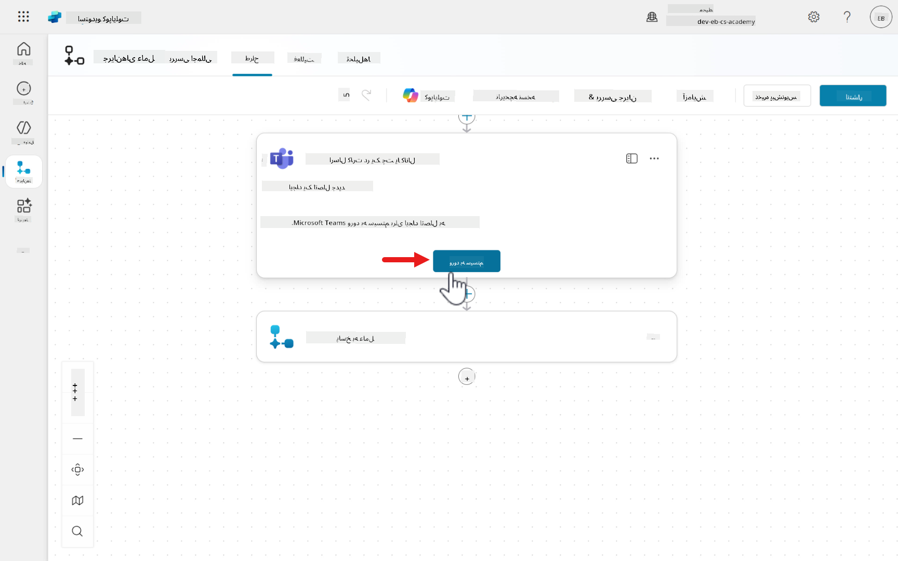

1. حساب کاربری خود را انتخاب کنید و سپس **اجازه دسترسی** را انتخاب کنید.

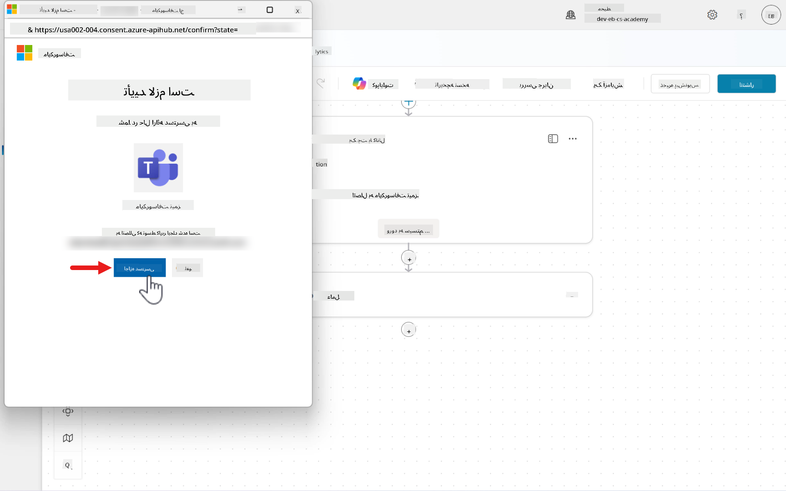

1. برای پارامترهای ورودی زیر،

| پارامتر | نحوه تنظیم | جزئیات |
|----------|------------|---------|
| **ارسال به عنوان** | کشویی | گزینه `Flow bot` را انتخاب کنید |
| **ارسال در** | کشویی | گزینه `کانال` را انتخاب کنید |
| **تیم** | کشویی | یک تیم را که در محیط شما موجود است و به آن دسترسی دارید برای انجام این تمرین آزمایشگاهی انتخاب کنید |
| **تیم** | کشویی | یک کانال را که در محیط شما موجود است و به آن دسترسی دارید برای انجام این تمرین آزمایشگاهی انتخاب کنید |

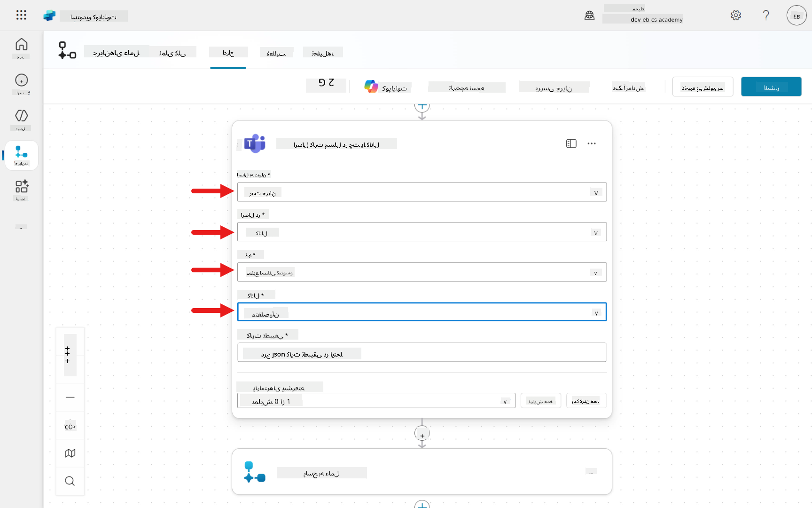

1. سپس فیلد **کارت تطبیقی** را پیکربندی می‌کنیم. فیلد **کارت تطبیقی** را انتخاب کنید.


1. فایل JSON به‌روزرسانی شده جدول رزومه [Resume Table Updated JSON file](../../../../../docs/operative-preview/03-automate-triggers/assets/3.2_ResumeTableUpdated.json) را باز کنید، تمام محتوای آن را کپی کرده و در فیلد کارت تطبیقی جای‌گذاری کنید.

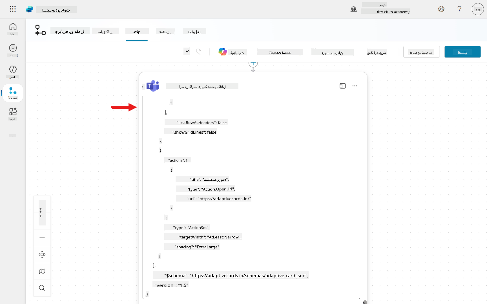

1. مشابه کاری که در [استخدام](../../recruit/08-add-adaptive-card/README.md#81-create-a-new-topic-with-an-adaptive-card-for-user-to-submit-their-request) انجام دادیم، قصد داریم مقادیر موجود در payload JSON را با مقادیر واقعی یا محتوای پویا جایگزین کنیم.

ابتدا، بیایید URL مربوط به ویژگی `url` درون ویژگی `selectAction` را به‌روزرسانی کنیم. این URL با URL نمای سیستم رزومه‌ها در اپلیکیشن مدل‌محور **Hiring Hub** جایگزین خواهد شد. این به استخدام‌کننده اجازه می‌دهد تا اقدام را انتخاب کرده و به نمای سیستم رزومه‌ها در اپلیکیشن مدل‌محور هدایت شود.

مقدار فعلی URL را برجسته کرده و حذف کنید.


1. در اپلیکیشن مدل‌محور **Hiring Hub**، به نمای سیستم **رزومه‌ها** با استفاده از منوی سمت چپ بروید و URL را کپی کنید. سپس به جریان عامل بازگردید و URL کپی شده را در ویژگی **url** درون ویژگی `selectAction` جای‌گذاری کنید.

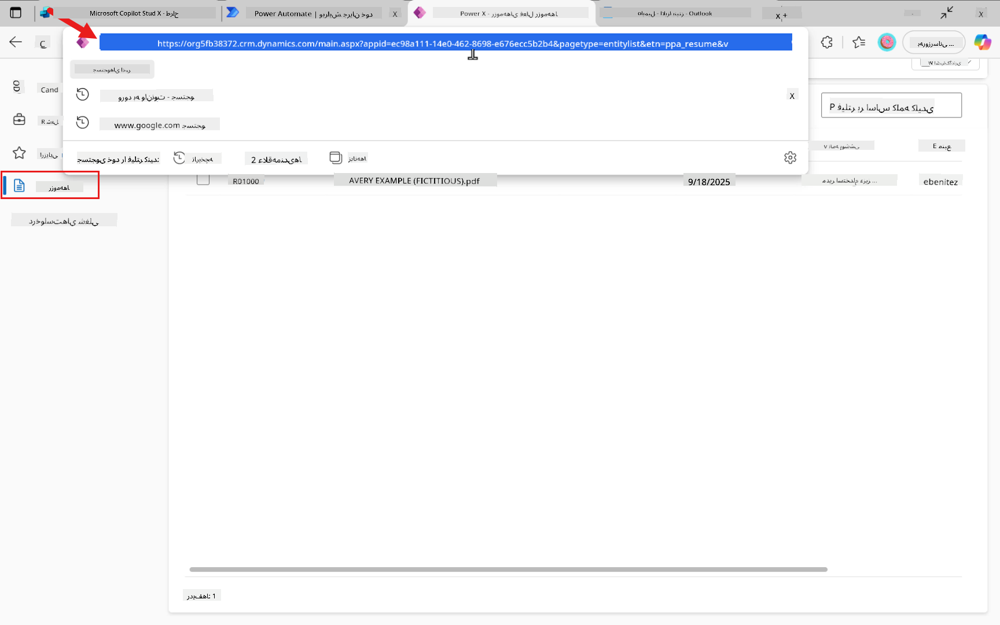
1. شما باید موارد زیر را مشاهده کنید که جزئیات محیط شما در برنامه مدل‌محور **Hiring Hub** با رنگ زرد برجسته شده است.

     | پارامتر | مقدار | توضیحات |
     |----------|------------|---------|
     | **Organization URI** | GUID | آدرس URL سازمان محیط Dataverse/Dynamics 365 |
     | **appid** | GUID | برای باز کردن یک برنامه مدل‌محور خاص، از پارامترهای پرس‌وجو appid یا appname استفاده می‌شود. در این مورد، از appid استفاده شده است |
     | **viewid** | GUID | پارامتر پرس‌وجو که شناسه نمای مورد نظر است |

       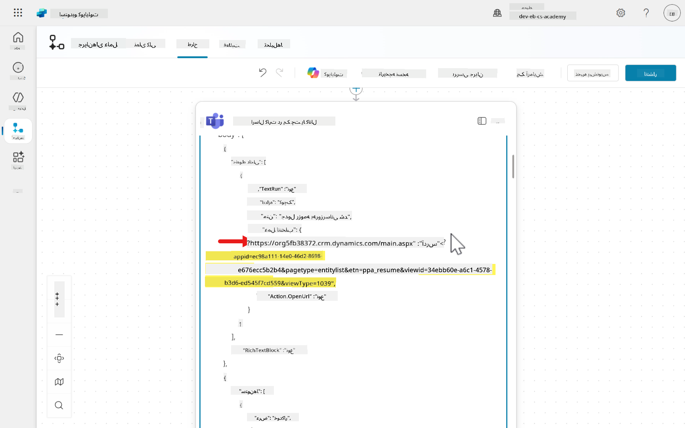

1. حالا مقادیر محتوای پویا را برای چندین ویژگی اضافه می‌کنیم. ابتدا با متنی شروع می‌کنیم که شماره رزومه ردیف ایجاد شده توسط محرک رویداد را به صورت خودکار نمایش می‌دهد.

      آیکون **پنل** را انتخاب کنید تا پنل اقدامات بارگذاری شود.

       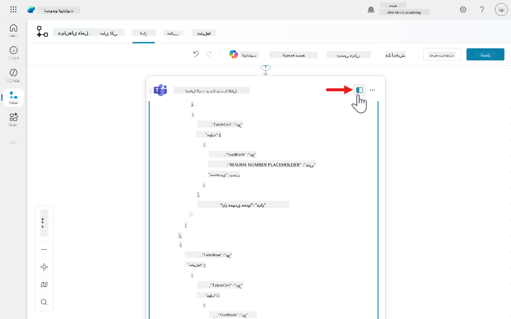

1. به خطی که ویژگی `text` برای `RESUME NUMBER PLACEHOLDER` را مشاهده می‌کنید، پایین بروید. مقدار جایگزین را برجسته کرده و حذف کنید.

       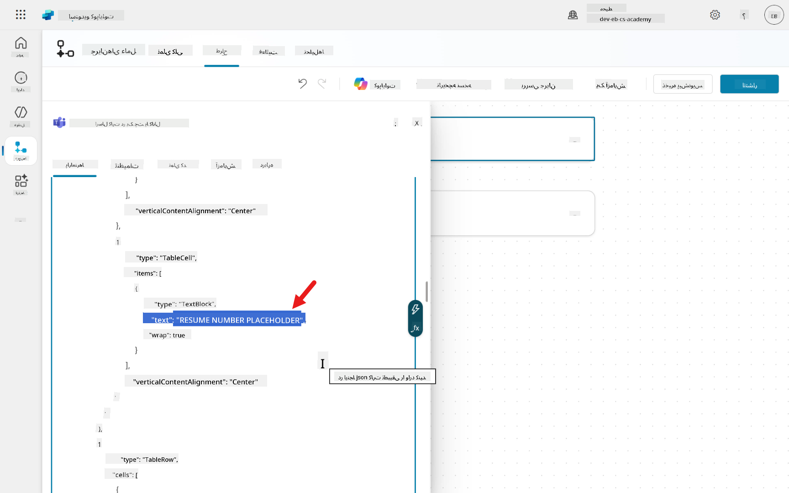

1. بین علامت‌های نقل قول دوبل کلیک کنید و آیکون **صاعقه** یا **fx icon** را در سمت راست انتخاب کنید.

      در تب **Dynamic Content**، پارامتر **ResumeNumber** را انتخاب کرده و گزینه **Add** را انتخاب کنید.

       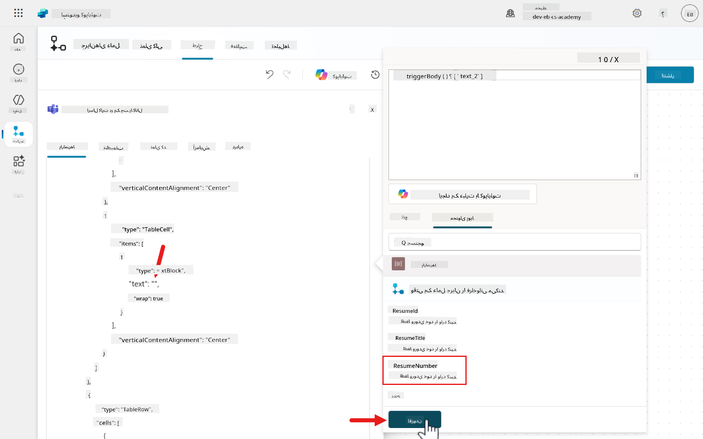

1. پارامتر **ResumeNumber** اکنون به عنوان محتوای پویا به ویژگی `text` اضافه خواهد شد.

       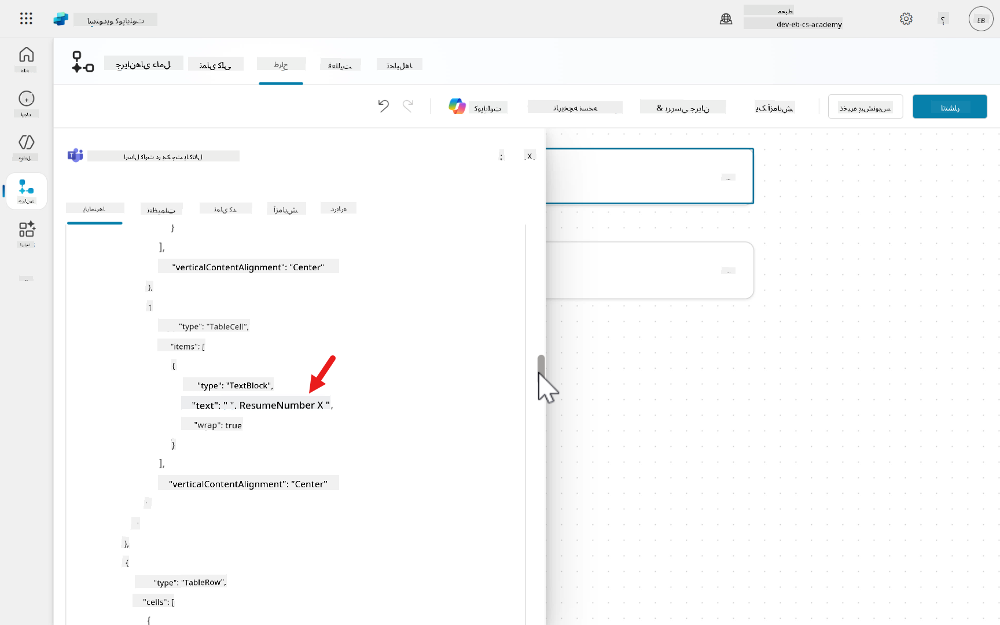

1. همین مراحل را برای `RESUME NAME PLACEHOLDER` تکرار می‌کنیم. به خطی که ویژگی `text` برای `RESUME NAME PLACEHOLDER` را مشاهده می‌کنید، پایین بروید. مقدار جایگزین را برجسته کرده و حذف کنید.

       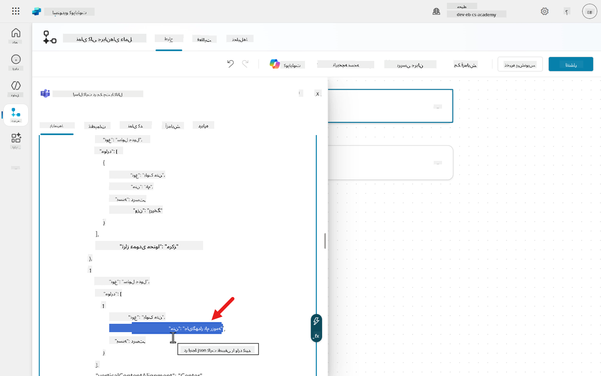

1. بین علامت‌های نقل قول دوبل کلیک کنید و آیکون **صاعقه** یا **fx icon** را در سمت راست انتخاب کنید.

      در تب **Dynamic Content**، پارامتر **ResumeTitle** را انتخاب کرده و گزینه **Add** را انتخاب کنید.

       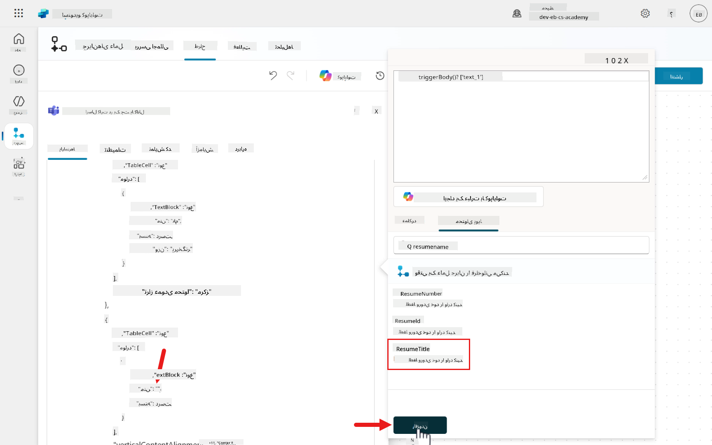

1. پارامتر **ResumeTitle** اکنون به عنوان محتوای پویا به ویژگی `text` اضافه خواهد شد.

       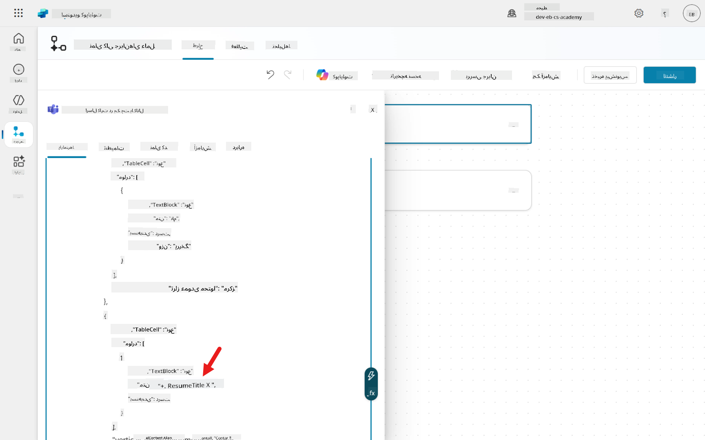

1. همین مراحل را برای مقدار **Due Date** که نشان‌دهنده زمانی است که یک استخدام‌کننده باید رزومه را بررسی کند، تکرار می‌کنیم. به خطی که ویژگی `text` برای `May 21, 2023` را مشاهده می‌کنید، پایین بروید.

       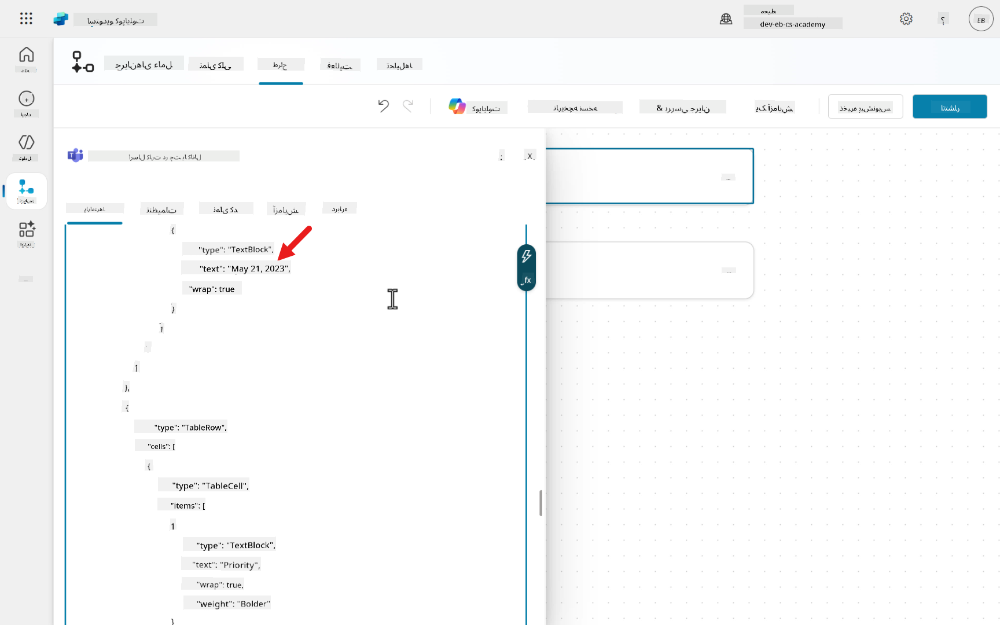

1. مقدار جایگزین تاریخ را حذف کنید و بین علامت‌های نقل قول دوبل کلیک کنید.

       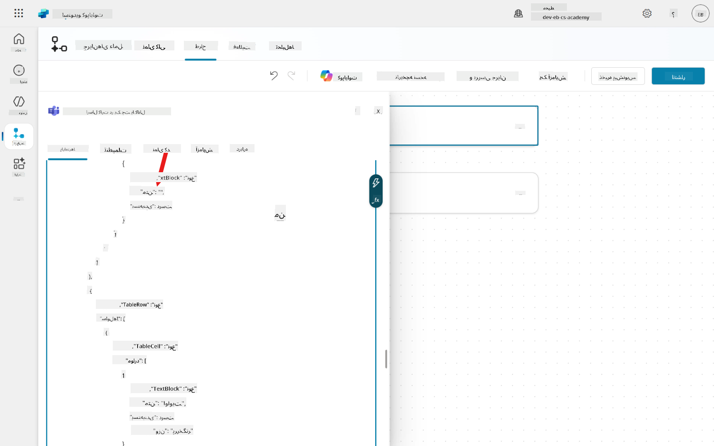

1. آیکون **صاعقه** یا **fx icon** را در سمت راست انتخاب کنید و در تب **Function**، عبارت زیر را وارد کرده و گزینه **Add** را انتخاب کنید.

       ```text
       addDays(utcNow(), 3, 'MMM dd, yyyy')
       ```

      این عبارت از دو تابع استفاده می‌کند.

     | تابع | توضیحات |
     |----------|------------|
     | **addDays** | تعداد مشخصی روز به یک تاریخ داده شده اضافه می‌کند و تاریخ حاصل را به صورت رشته بازمی‌گرداند |
     | **utcNow** | تاریخ و زمان فعلی را در قالب زمان جهانی هماهنگ (UTC) به صورت رشته بازمی‌گرداند. |

      برای مقدار utcNow، ما تاریخ را به صورت ماه و روز، به همراه سال قالب‌بندی می‌کنیم.

       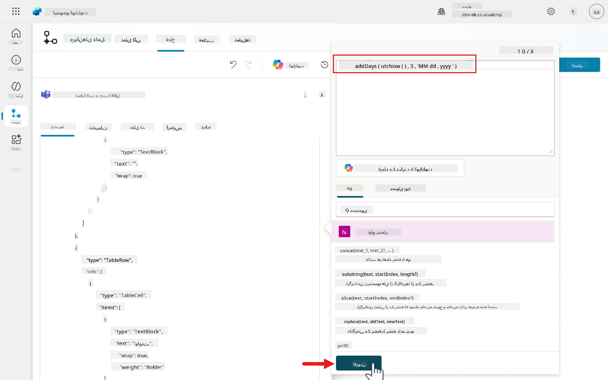

      عبارت اکنون به ویژگی `text` اضافه خواهد شد.

       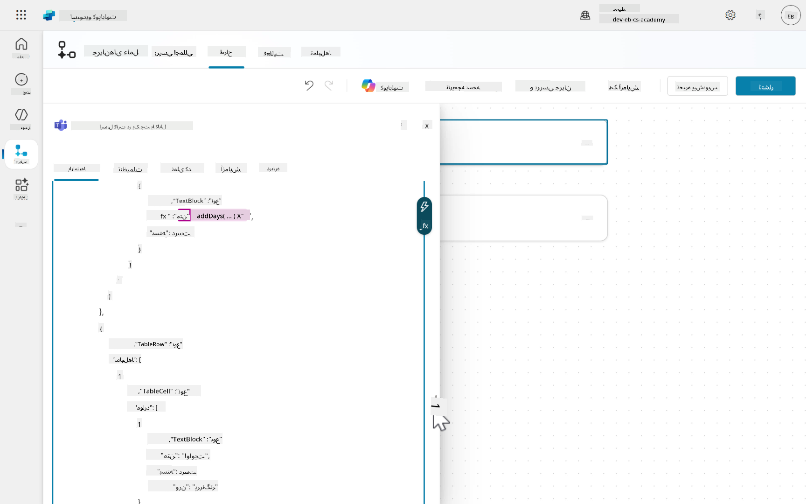

1. در نهایت، URL برای ویژگی `url` درون ویژگی `actions` در انتهای JSON payload به‌روزرسانی خواهد شد. این URL جایگزین URL جایگزین فعلی خواهد شد و به رزومه در برنامه مدل‌محور **Hiring Hub** اشاره خواهد کرد. این امکان را به استخدام‌کننده می‌دهد که اقدام `Action.OpenURL` کارت تطبیقی را انتخاب کرده و به رزومه در برنامه مدل‌محور هدایت شود.

       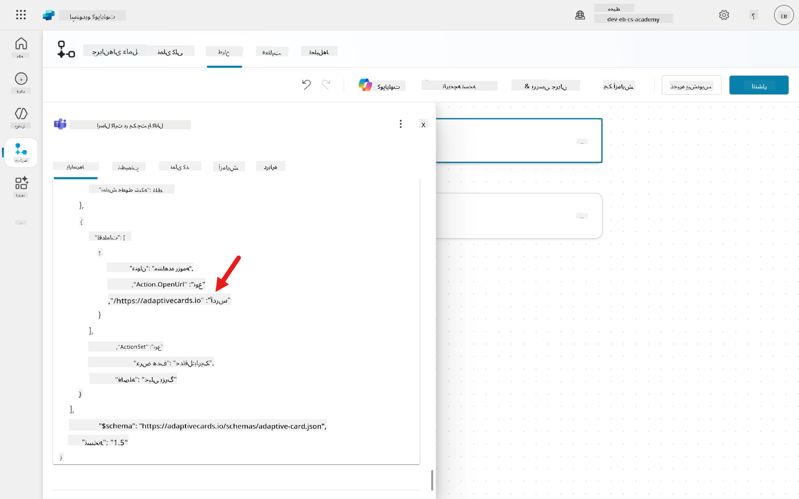

1. در برنامه مدل‌محور **Hiring Hub**، یک ردیف را در نمای سیستم **Resumes** با استفاده از منوی سمت چپ باز کنید. ردیف رزومه به صورت یک فرم در برنامه مدل‌محور بارگذاری خواهد شد.

      URL ردیف رزومه را کپی کنید.

    ??? info "چگونه به برنامه مدل‌محور **Hiring Hub** بازگردید اگر از آن خارج شده‌اید/بسته‌اید"

        1. به [https://make.powerapps.com](https://make.powerapps.com) بروید و مطمئن شوید که در محیط توسعه‌دهنده‌ای که برای این تمرینات آزمایشگاهی استفاده می‌کنید، هستید، در غیر این صورت به آن تغییر دهید.
        
        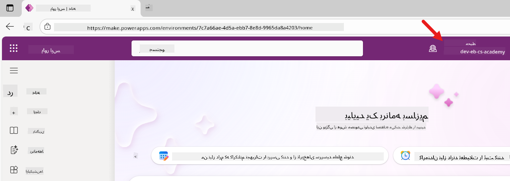

        1. در پنل منوی سمت چپ، **Apps** را انتخاب کنید و برای برنامه مدل‌محور **Hiring Hub**، آیکون **Play** را انتخاب کنید تا در مرورگر شما بارگذاری شود.
        
        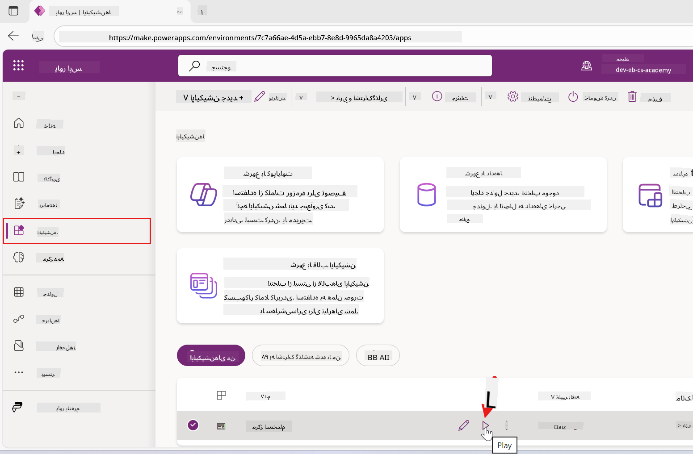

       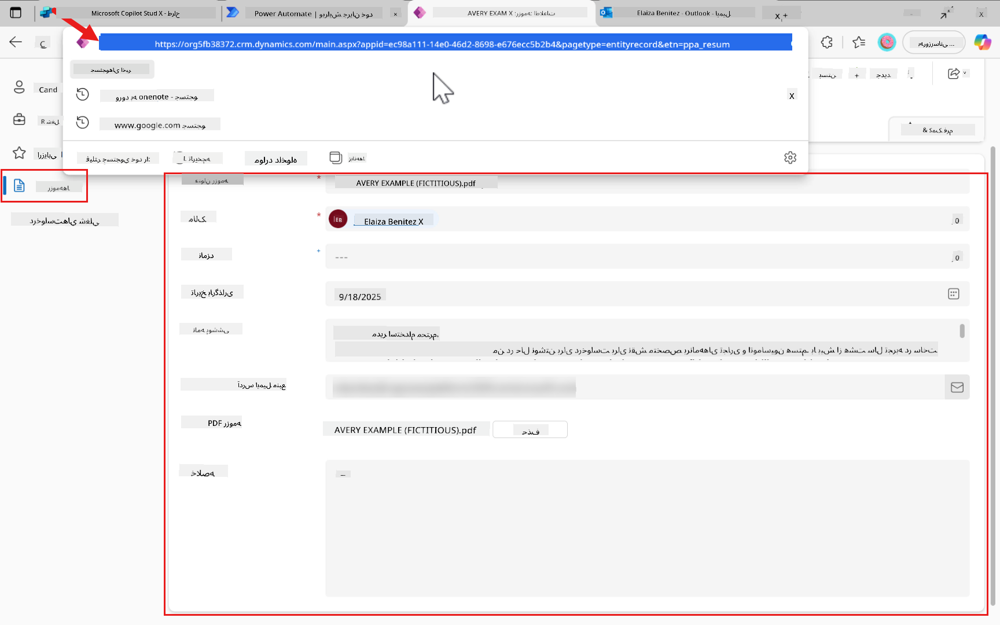

1. سپس به جریان عامل بازگردید، مقدار URL جایگزین فعلی را برجسته کرده و حذف کنید.

       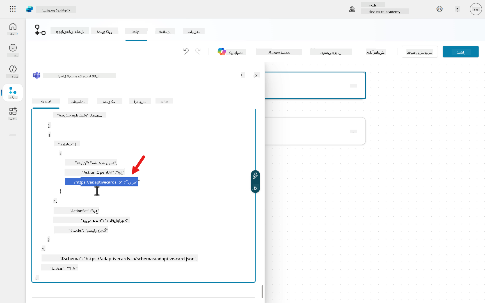

1. سپس URL کپی شده را در ویژگی **url** درون ویژگی `url property` جای‌گذاری کنید.

       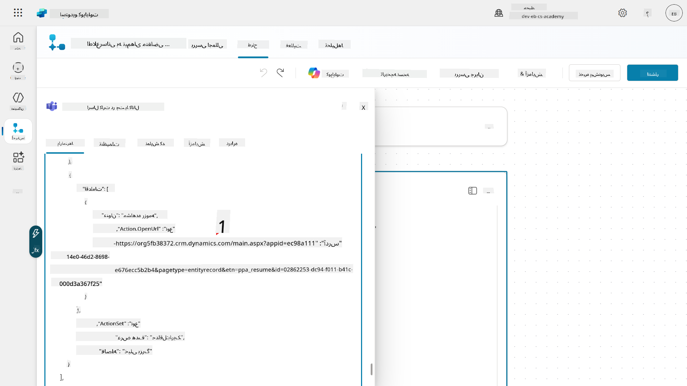

1. شما باید موارد زیر را مشاهده کنید. مقدار شناسه `GUID` در انتها را حذف کنید. ما این محتوا پویا - پارامتر **ResumeId** را جایگزین خواهیم کرد.

       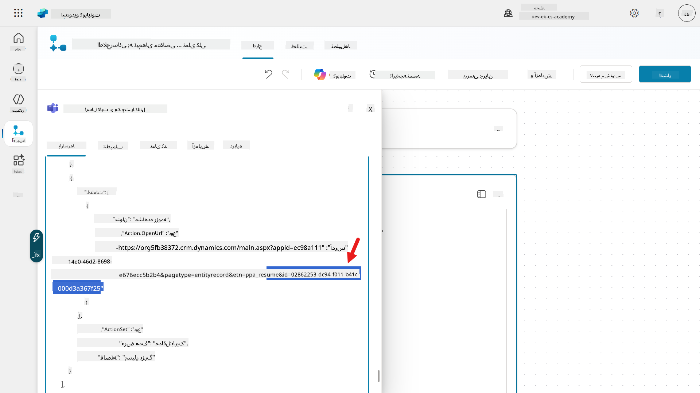

1. آیکون **صاعقه** یا **fx icon** را در سمت راست انتخاب کنید.

      در تب **Dynamic Content**، پارامتر **ResumeId** را انتخاب کرده و گزینه **Add** را انتخاب کنید.

       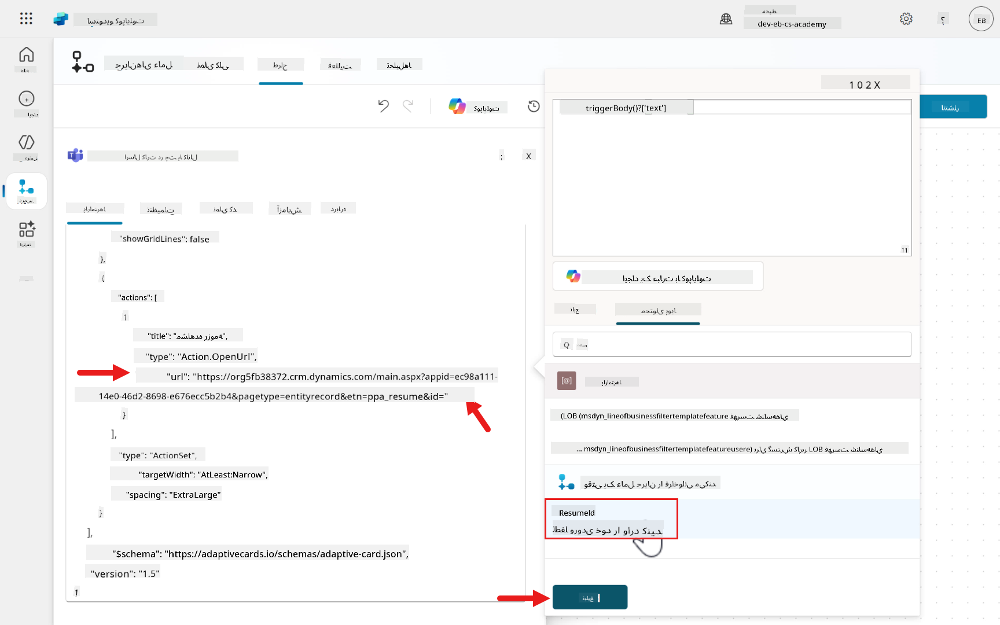

1. پارامتر **ResumeId** به عنوان محتوای پویا اضافه خواهد شد. موارد زیر که با رنگ زرد برجسته شده‌اند جزئیات محیط شما در برنامه مدل‌محور **Hiring Hub** هستند.

     | پارامتر | مقدار | توضیحات |
     |----------|------------|---------|
     | **Organization URI** | GUID | آدرس URL سازمان محیط Dataverse/Dynamics 365 |
     | **appid** | GUID | برای باز کردن یک برنامه مدل‌محور خاص، از پارامترهای پرس‌وجو appid یا appname استفاده می‌شود. در این مورد، از appid استفاده شده است |
     | **id** | GUID | پارامتر پرس‌وجو که شناسه ردیف رزومه است |

       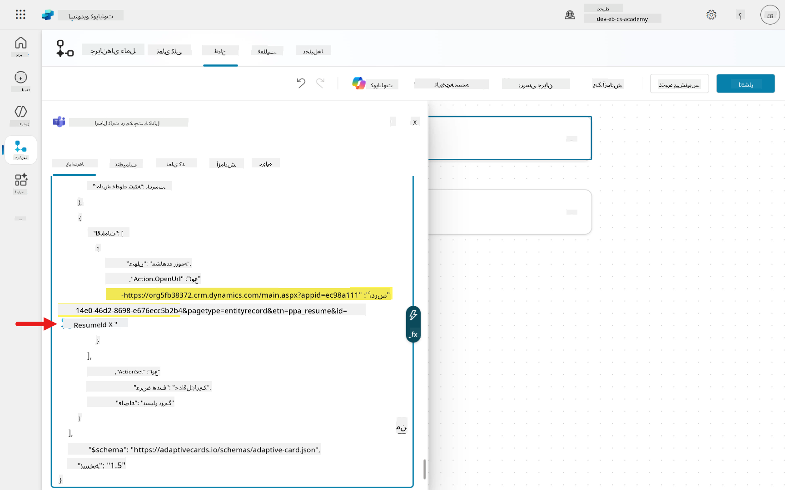

1. پیکربندی اقدام **Post card in a chat or channel** را به پایان رسانده‌ایم 👏🏻 از پنل پیکربندی اقدام با انتخاب آیکون **x** خارج شوید.

       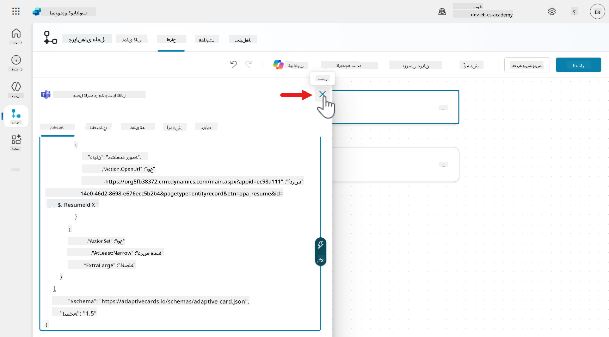

1. در نهایت، آخرین اقدام، **Respond to the agent** را با ارسال یک متن به عامل برای پایان پردازش پیکربندی خواهیم کرد.

      در اقدام **Respond to the agent**، گزینه **+Add an output** را انتخاب کنید.

       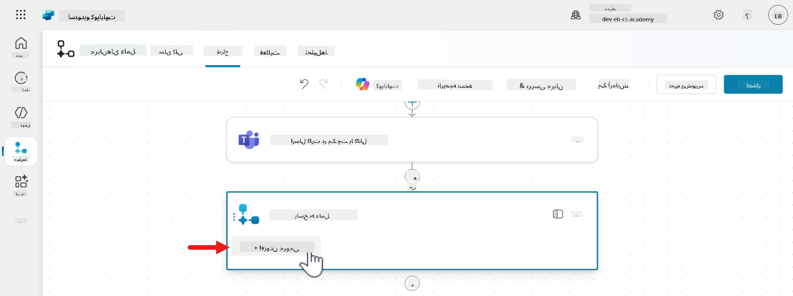

1. نوع خروجی را به **Text** انتخاب کنید.

       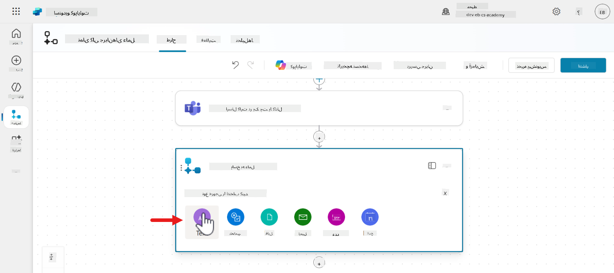

1. نام خروجی را به صورت زیر وارد کنید.

       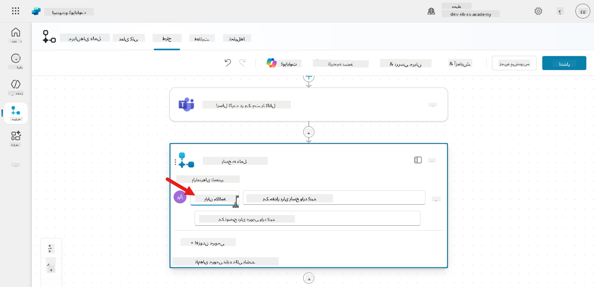

1. مقدار خروجی را به صورت زیر وارد کنید.

       ```text
       Finished
       ```

       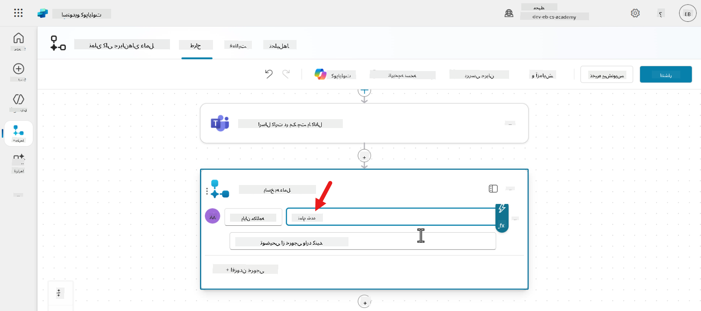

1. پیکربندی جریان عامل را به پایان رسانده‌ایم. گزینه **Save draft** را انتخاب کنید تا جریان عامل ذخیره شود. یک پیام تأیید پس از ذخیره ظاهر خواهد شد.

       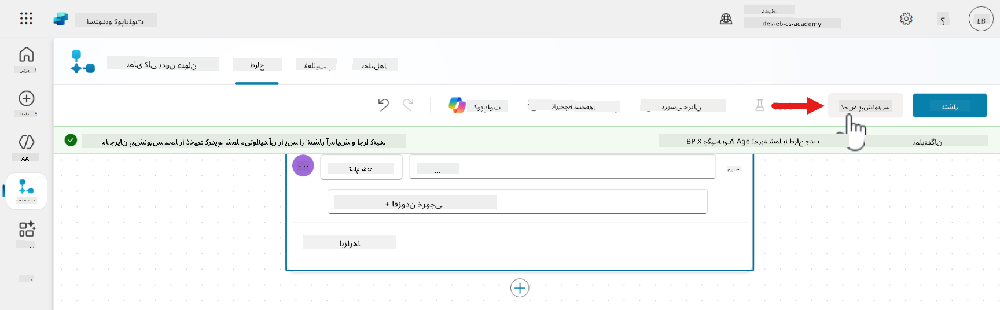

1. قبل از انتشار جریان عامل، باید جزئیات جریان عامل را به‌روزرسانی کنیم. تب **Overview** را انتخاب کرده و گزینه **Edit** را انتخاب کنید.

      در فیلد نام جریان، متن زیر را وارد کنید.

       ```text
       Notify Teams Applicant channel
       ```      

      سپس آیکون **Refresh** را انتخاب کنید تا توضیحات جریان عامل با استفاده از AI به‌روزرسانی شود.

      سپس گزینه **Save** را انتخاب کنید تا جزئیات به‌روزرسانی شده برای جریان عامل ذخیره شود.

       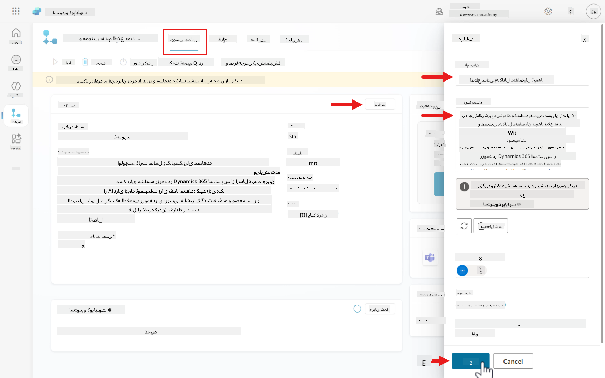

1. به تب **Designer** بازگردید و گزینه **Publish** را انتخاب کنید تا جریان عامل منتشر شود. یک پیام تأیید پس از ذخیره ظاهر خواهد شد.

       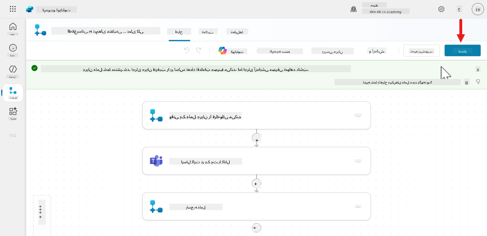

1. جریان عامل اکنون باید به عنوان یک ابزار در **Application Intake Agent** اضافه شود. به **Hiring Agent** بازگردید و تب **Agents** را انتخاب کنید، سپس **Application Intake Agent** را انتخاب کنید.

       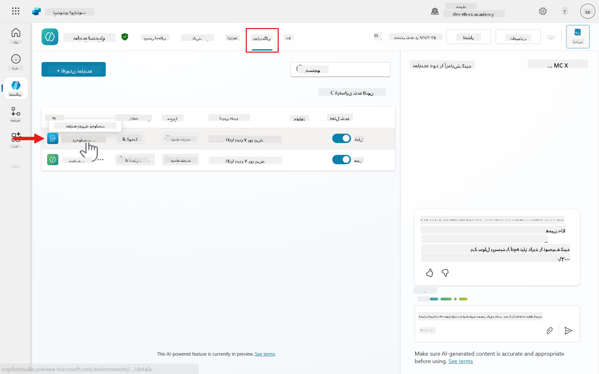

1. در بخش **Details** عامل، فیلد **Description** را به‌روزرسانی خواهیم کرد. متن زیر را کپی کرده و در انتهای متن توضیحات جای‌گذاری کنید.

       ```text
       and also notify the Teams Applicant channel
       ```

       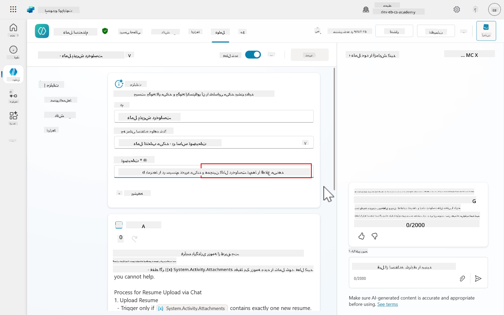

1. سپس جریان عامل را به عنوان یک ابزار اضافه خواهیم کرد. پایین بروید و گزینه **+ Add** را انتخاب کنید.

       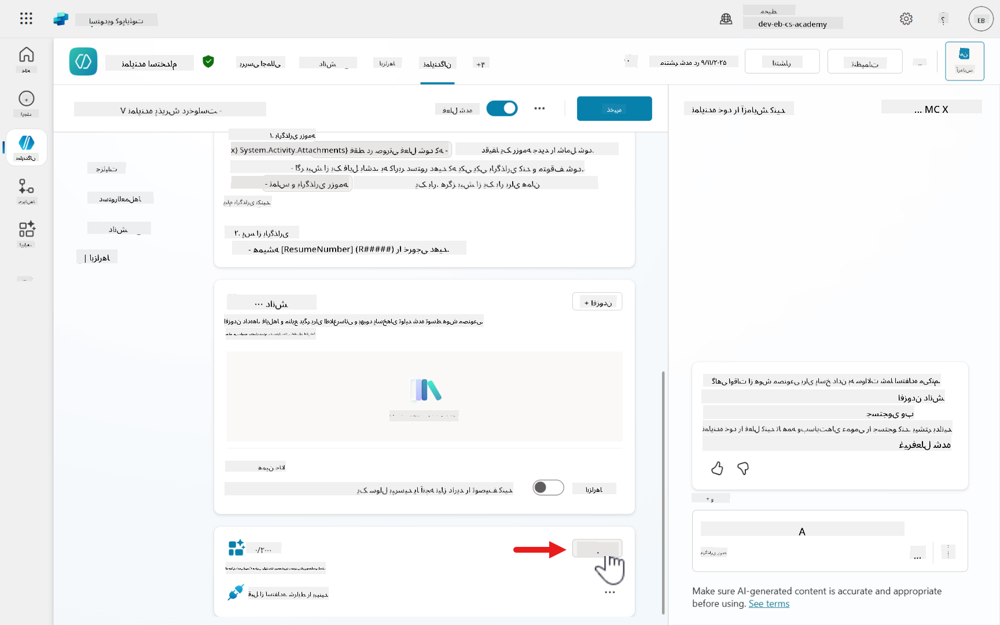

1. جریان عامل ایجاد شده قبلی، **Notify Teams Applicant Channel** را انتخاب کنید.

       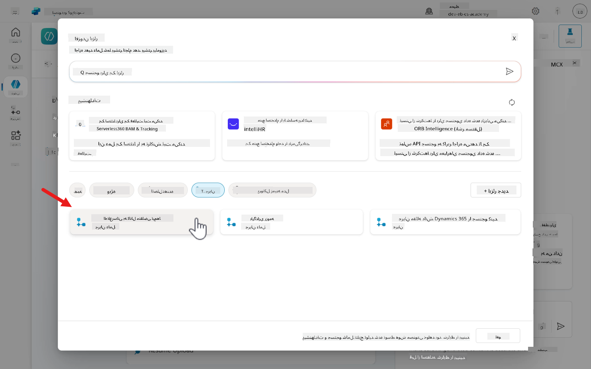

1. سپس گزینه **Add and configure** را انتخاب کنید.

       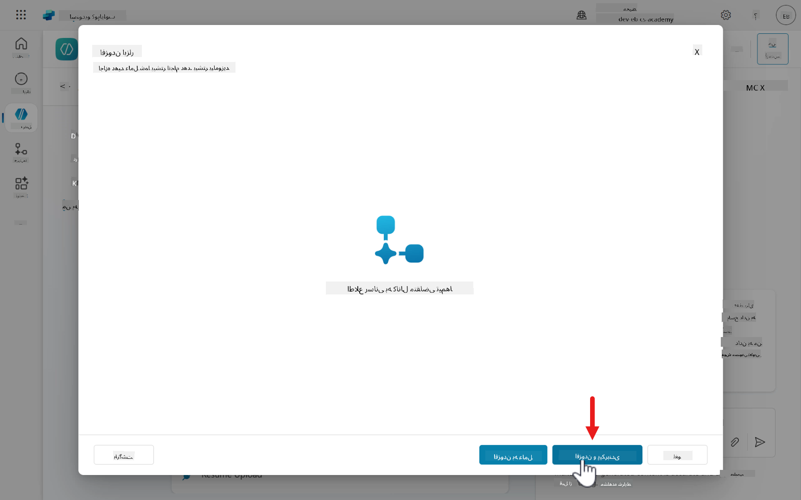

1. در بخش **Inputs** جریان عامل، سه ورودی که قبلاً در جریان عامل پیکربندی کرده‌ایم قابل مشاهده هستند. به طور پیش‌فرض، تنظیم **Fill using** به **Dynamically fill with AI** تنظیم شده است. این تنظیم را به همین صورت نگه می‌داریم زیرا درخواست از محرک رویداد (در آخرین اقدام، **Sends a prompt to the specified copilot for processing** - این مراحل 38-44 از **Lab 3.1 - Automate uploading resumes to Dataverse received by email**) شامل مقادیر پارامترهایی است که AI استخراج خواهد کرد.

       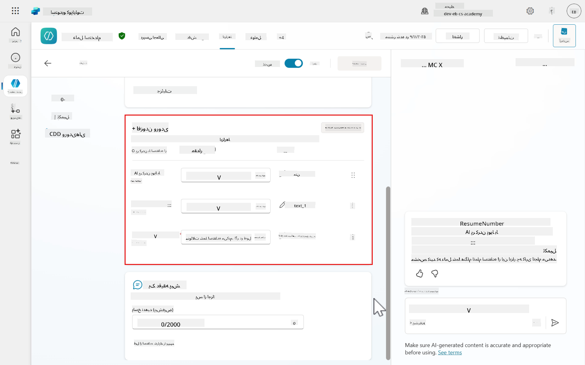

1. حالا که ابزار به **Application Intake Agent** اضافه شده است، دستورالعمل‌های عامل باید به‌روزرسانی شوند. آیکون **پیکان بازگشت** را انتخاب کنید تا به لیست عوامل بازگردید.

       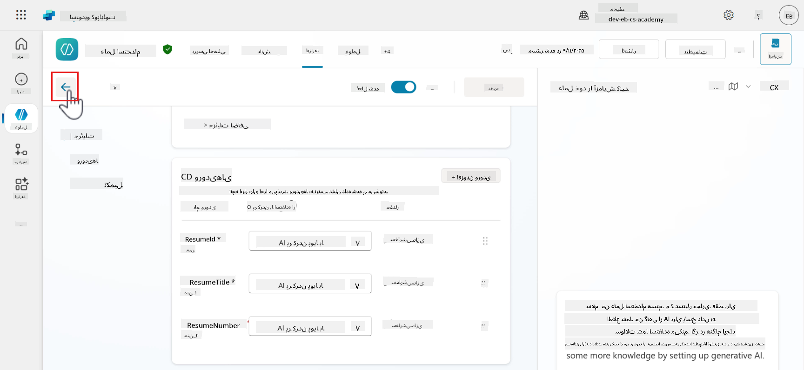

1. در تب **Agents** از **Hiring Agent**، **Application Intake Agent** را انتخاب کنید.

       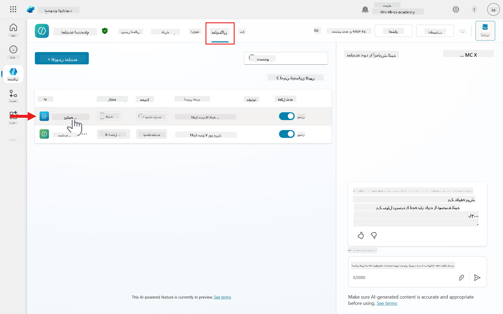

1. در فیلد **Instructions**، یک خط جدید بعد از دستورالعمل‌های `2.Post-Upload` وارد کنید. دستورالعمل‌های زیر را کپی کرده و جای‌گذاری کنید.

       ```text
       Process for Resume Upload via Email
       1. When you receive a message, **Send [ResumeId (text)] = "1680265f-5793-f011-b41b-7c1e525be9f7" and [ResumeTitle (text_1)] = "TAYLOR TESTPERSON (FICTITIOUS).pdf" and [ResumeNumber (text_2)]= "R01026" to the Tool "Notify Teams Applicant channel"** in the child agent "Application Intake Agent", call [AGENT FLOW PLACEHOLDER]
       ```

       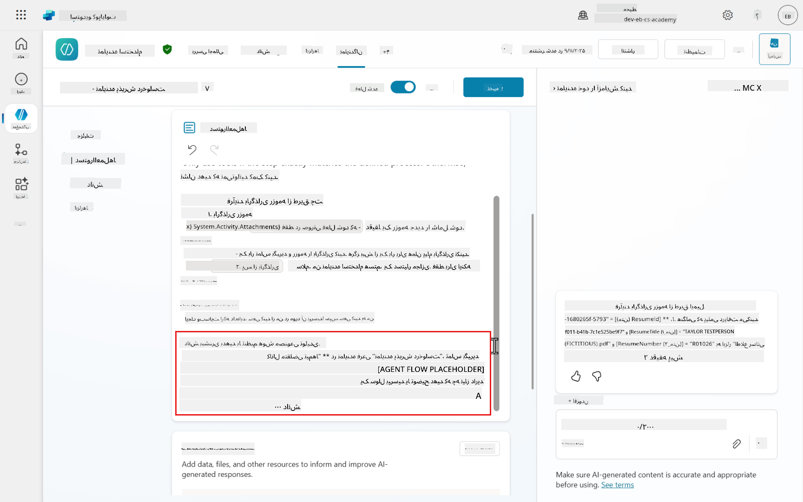

1. متن `[AGENT FLOW PLACEHOLDER` را برجسته کنید.

       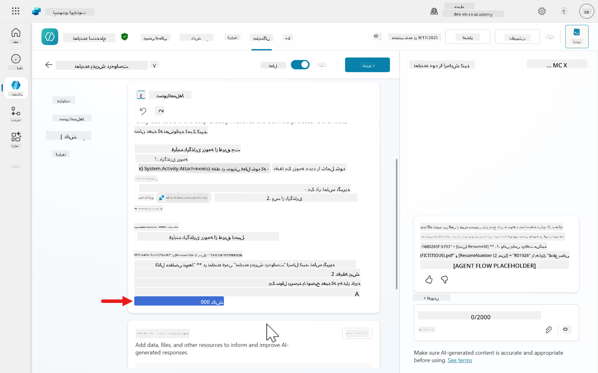

1. کاراکتر اسلش، `/` را وارد کنید و ابزار **Notify Teams Applicant Channel** را انتخاب کنید.

       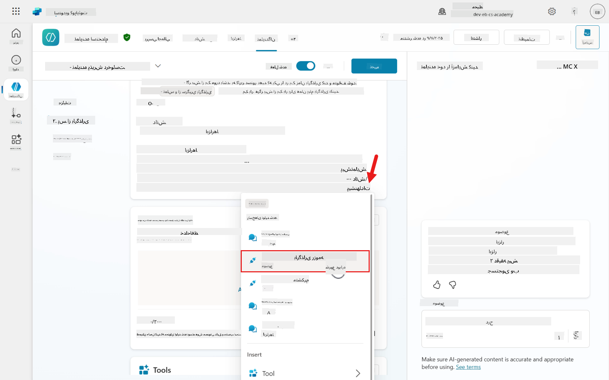
1. جریان عامل اکنون طبق دستورالعمل‌ها توسط **Application Intake Agent** فراخوانی خواهد شد، پس از آخرین اقدام (**ارسال یک پیام به کوپایلوت مشخص شده برای پردازش**) در محرک رویداد، پیام حاوی مقادیر پارامترها را به عامل بازمی‌گرداند.

      گزینه **Save** را انتخاب کنید تا دستورالعمل‌های به‌روزرسانی شده برای **Application Intake Agent** ذخیره شود.

       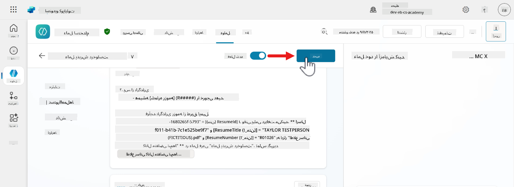

1. دستورالعمل‌ها اکنون پس از ذخیره شدن عامل به‌روزرسانی خواهند شد.

       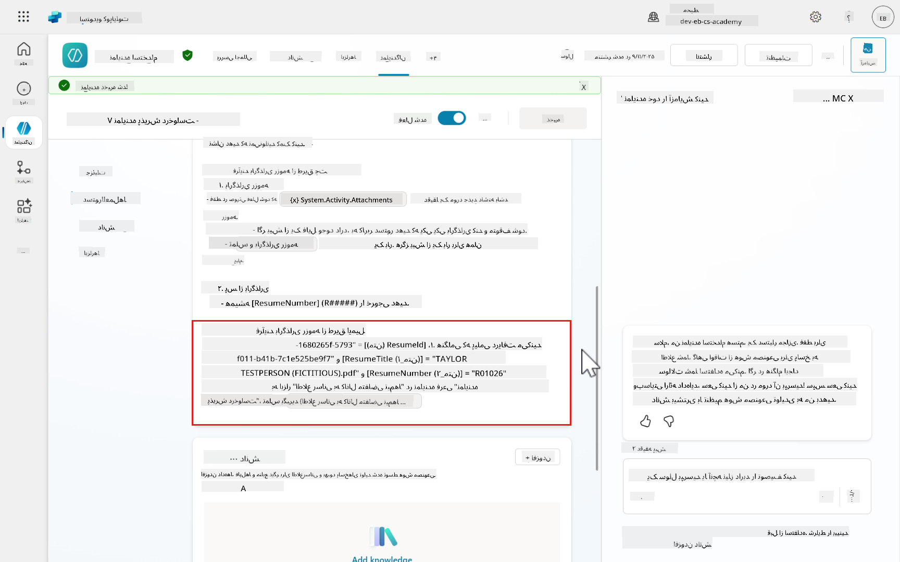

1. اکنون باید **Hiring Agent** را منتشر کنیم. گزینه **Publish** را در بالا سمت راست انتخاب کنید و در پنجره _Publish this agent modal_ که ظاهر می‌شود، گزینه **Publish** را انتخاب کنید.

       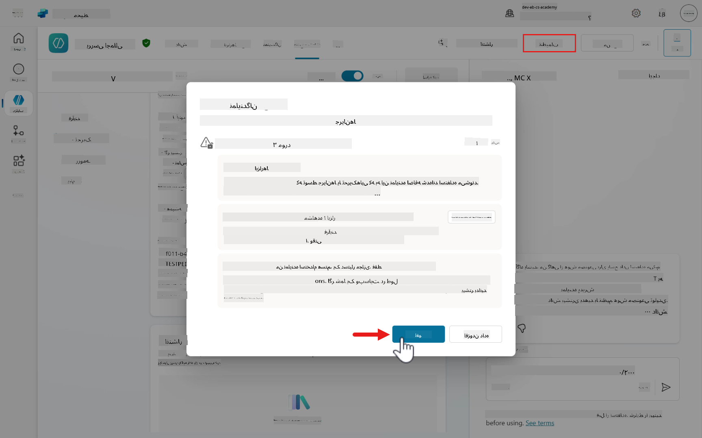

1. پس از انتشار، یک پیام تأیید ظاهر خواهد شد که نشان می‌دهد عامل منتشر شده است.

       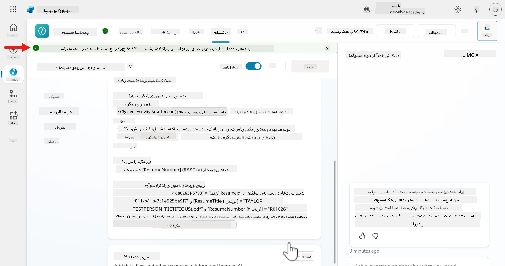

اکنون می‌توانیم عامل را آزمایش کنیم!

### آزمایش محرک رویداد - آزمایش 3.3

1. برای اجرای محرک رویداد، باید یک ایمیل با فایل رزومه به صورت PDF ارسال شود. در Outlook، یک پیام ایمیل جدید ایجاد کنید.

     | بخش ایمیل | جزئیات |
     |----------|------------|
     | **گیرنده** | از حساب کاربری وارد شده خود به عنوان مقدار استفاده کنید |
     | **فایل پیوست** | فایل [TAYLOR TESTPERSON (FICTITIOUS)](../../../../../docs/operative-preview/test-data/resumes/TAYLOR%20TESTPERSON%20(FICTITIOUS).pdf) را آپلود کنید |
     | **متن ایمیل** | متن زیر را به عنوان متن ایمیل کپی و جای‌گذاری کنید |

       ```text
       مدیر استخدام عزیز،

       من این نامه را برای ابراز علاقه خود به موقعیت مهندس ارشد پلتفرم پاور در سازمان شما می‌نویسم. با بیش از نه سال تجربه در ارائه راه‌حل‌های امن و مقیاس‌پذیر بر روی پلتفرم‌های ابری مایکروسافت، مطمئن هستم که می‌توانم به طور مؤثر به تیم شما کمک کنم.

       در آخرین نقش خود به عنوان مهندس ارشد پلتفرم پاور، یک خط لوله خودکار برای دریافت رزومه توسعه دادم که فرآیند دستی را کاهش داده و قابلیت جستجو را بهبود بخشید. من برنامه‌های مدیریت پرونده‌های منابع انسانی ارائه داده‌ام، جریان‌های آگاه به راه‌حل معرفی کرده‌ام و بررسی‌های PR را برای بهبود زمان‌های استقرار اجرا کرده‌ام. تخصص من شامل Power Apps، Power Automate، Power Pages، Dataverse و مجموعه‌ای از خدمات Microsoft 365، همچنین ادغام با Graph/REST APIs و Azure Functions است.

       پیش‌تر، من تأییدیه‌های Teams را با کارت‌های تطبیقی توسعه دادم که زمان تأیید را به همان روز کاهش داد و چارچوب‌های مدیریت خطا قوی ایجاد کردم. سابقه من همچنین شامل مهاجرت جریان‌های کاری قدیمی به Power Automate و ساخت پورتال‌های خودخدمتی است که توسط صدها کارمند پذیرفته شده است.

       من دارای مدرک کارشناسی علوم کامپیوتر هستم و به عنوان توسعه‌دهنده پلتفرم پاور (PL-400) و معمار راه‌حل (PL-600) گواهی شده‌ام. همچنین به آموزش علاقه‌مندم و با گروه‌های محلی سازنده داوطلبانه همکاری کرده‌ام.

       لطفاً رزومه من را برای بررسی در پیوست مشاهده کنید. خوشحال می‌شوم فرصت بحث درباره چگونگی تطابق مهارت‌ها و تجربیاتم با نیازهای شما را داشته باشم.

       از وقت و توجه شما سپاسگزارم.

       با احترام،
       تیلور تستپرسون
       ```

       **ارسال** ایمیل پس از ایجاد.

       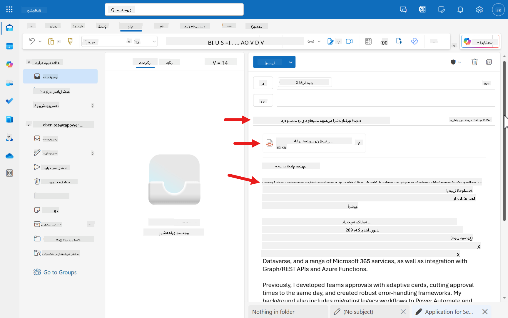

1. در پورتال سازنده Power Automate برای جریان محرک رویداد، آیکون **Refresh** را انتخاب کنید تا اجرای جریان موفق برای ایمیل ارسال شده مشاهده شود.

       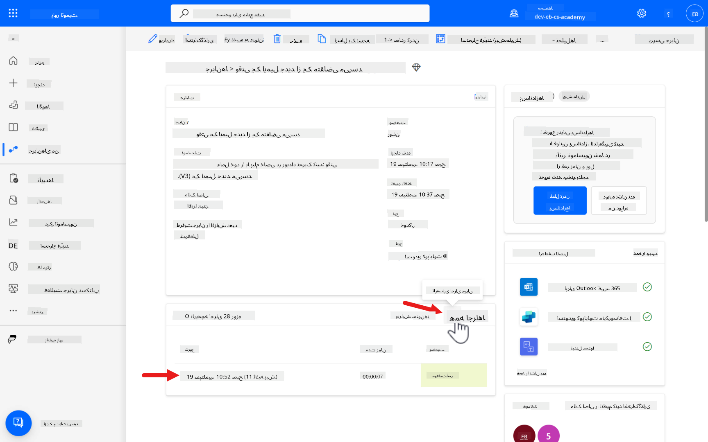

1. در Copilot Studio در **Hiring Agent**، تب **Activity** را انتخاب کنید.

       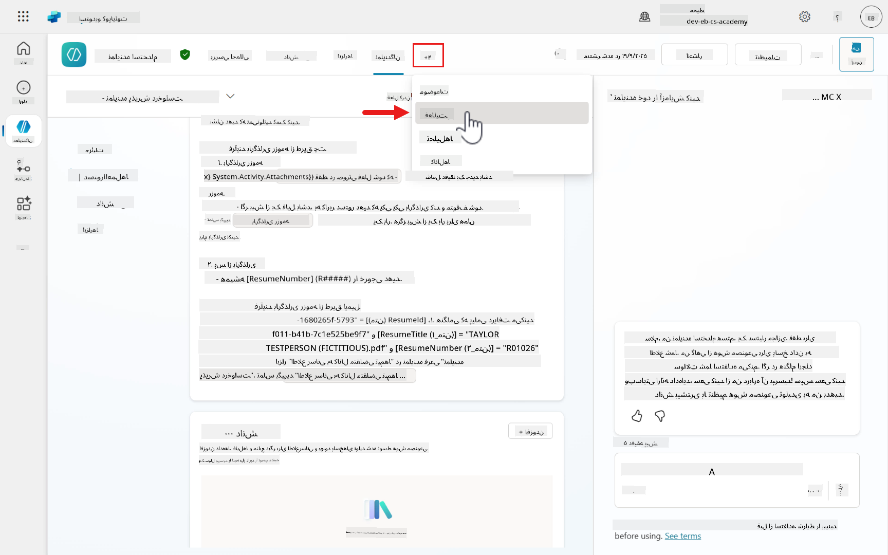

1. تب **Activity** بارگذاری خواهد شد که تمام فعالیت‌های **Hiring Agent** را نمایش می‌دهد. فعالیتی با نام **Automated** و وضعیت **Complete** وجود خواهد داشت. این فعالیت نمایانگر محرک رویداد و جریان عامل فراخوانی شده است.

       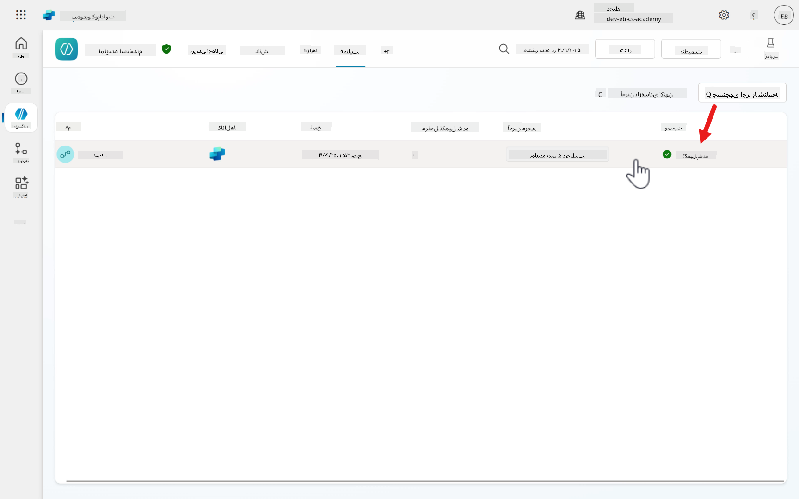

1. فعالیت را انتخاب کنید و محرک رویداد را در نقشه فعالیت انتخاب کنید. در پنل سمت راست، مشاهده کنید که چگونه پارامترهای ورودی در پیام شامل مقادیر پارامترهای `Resume Id`، `Resume Title` و `Resume Number` از ردیف **Dataverse** ایجاد شده است. این مقادیر از محتوای پویا تنظیم شده در مراحل 18 - 27 **آزمایش 3.1 - خودکارسازی آپلود رزومه‌ها به Dataverse دریافت شده از طریق ایمیل** گرفته شده‌اند.

       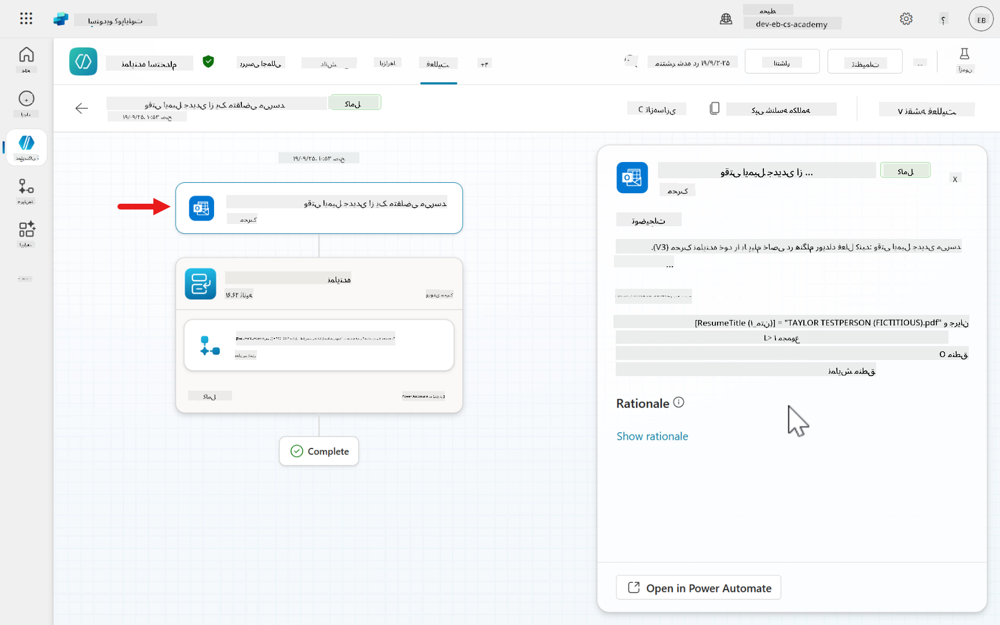

1. به برنامه مدل‌محور **Hiring Hub** بازگردید و در نمای سیستم **Resumes**، گزینه **Refresh** را انتخاب کنید تا نمای به‌روزرسانی شود. ردیف جدید ایجاد شده برای رزومه ارسال شده از طریق ایمیل اکنون لیست شده است زیرا از طریق محرک رویداد ایجاد شده است.

       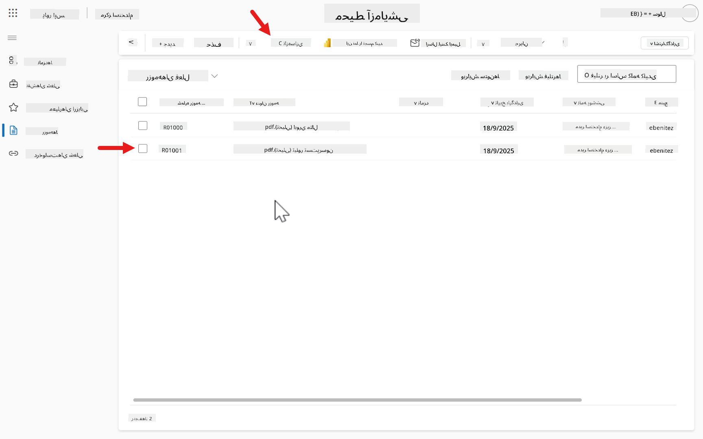

1. به Copilot Studio بازگردید و جریان عامل **Notify Teams Applicant Channel** را در **Application Intake Agent** در نقشه فعالیت انتخاب کنید. در پنل سمت راست، مشاهده کنید که چگونه ورودی‌ها دارای مقادیر از ردیف Dataverse هستند. این مقادیر از پیام ارسال شده توسط آخرین اقدام (**ارسال یک پیام به کوپایلوت مشخص شده برای پردازش**) در محرک رویداد که شامل مقادیر پارامترهای ردیف جدید ایجاد شده در Dataverse است، گرفته شده‌اند. این روش انتقال مقادیر پارامترها از محرک‌های رویداد به جریان‌های عامل است.

       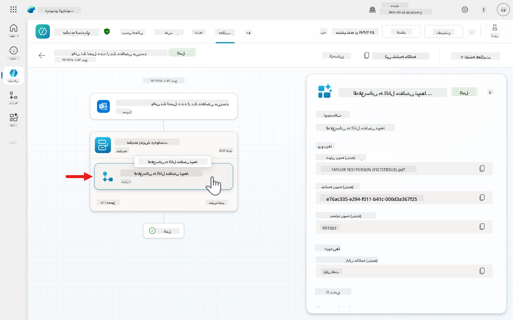

1. در نهایت، به کارت تطبیقی ارسال شده به کانال در **Microsoft Teams** نگاه کنید. در کانال، کارت تطبیقی را مشاهده خواهیم کرد که اطلاعات مربوط به ردیف رزومه جدید ایجاد شده در Dataverse را نمایش می‌دهد. روی لینک در ابتدای کارت تطبیقی حرکت کنید، مشاهده کنید که URL همان URL نمای سیستم رزومه‌ها است که قبلاً در JSON (مراحل 15 - 19 **آزمایش 3.2 - اطلاع‌رسانی به کانال Teams با استفاده از کارت تطبیقی**) پیکربندی شده است.

       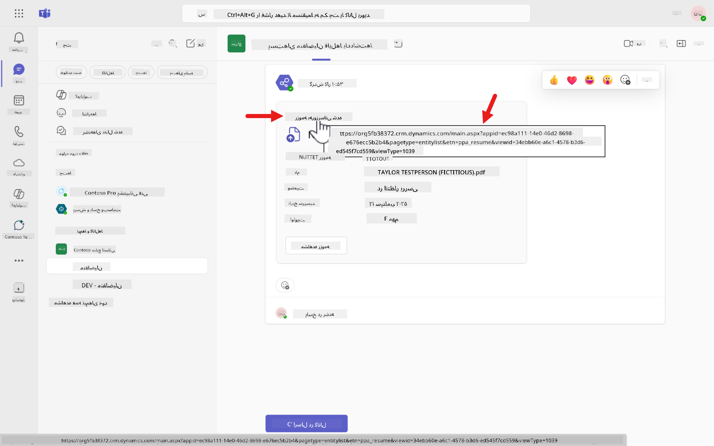

1. لینک را انتخاب کنید و به نمای سیستم رزومه‌ها در برنامه مدل‌محور **Hiring Hub** در مرورگر خود هدایت خواهید شد.

       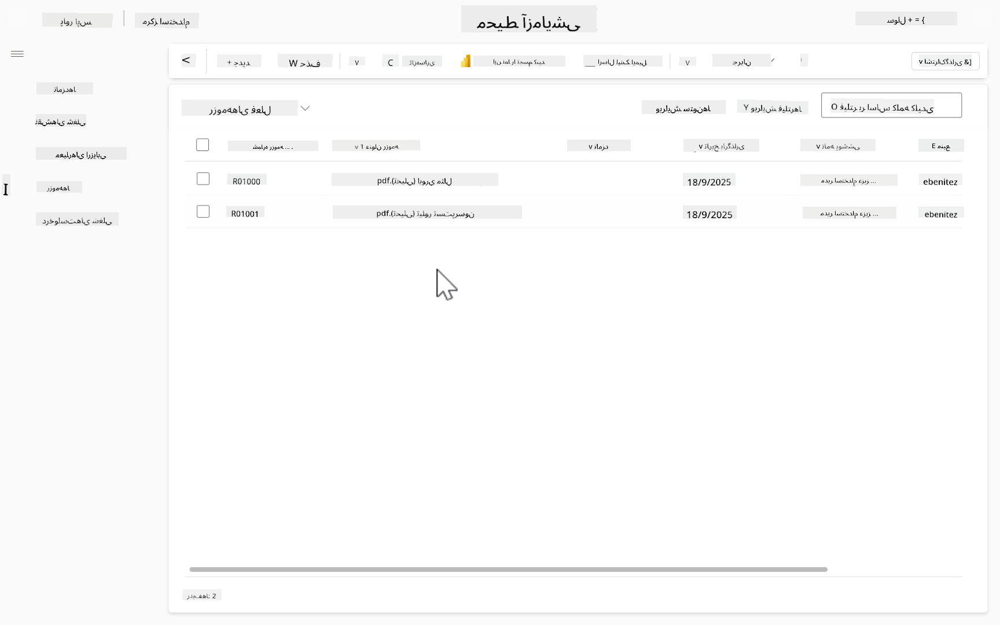

1. به کارت تطبیقی ارسال شده به کانال در Microsoft Teams بازگردید. این بار، روی **View Resume** حرکت کنید که اقدام `Action.OpenURL` کارت تطبیقی است. مشاهده کنید که URL همان URL ردیف رزومه است که قبلاً در JSON (مراحل 30 - 36 **آزمایش 3.2 - اطلاع‌رسانی به کانال Teams با استفاده از کارت تطبیقی**) پیکربندی شده است.

       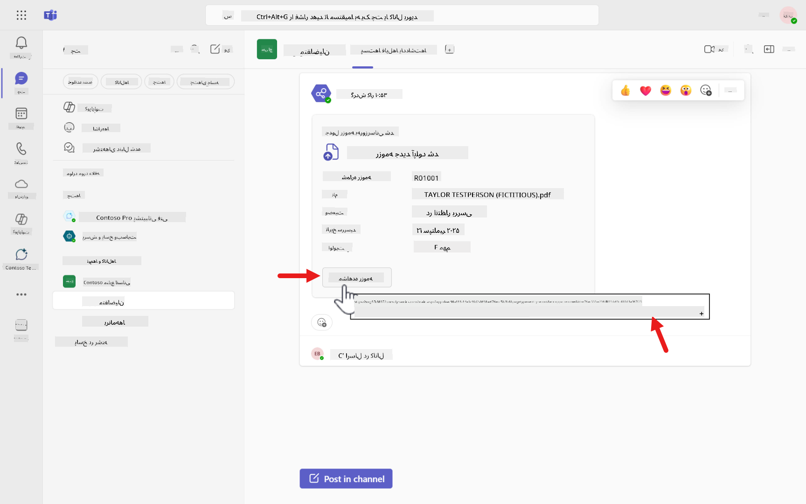

1. اقدام را انتخاب کنید و به فرم ردیف رزومه در برنامه مدل‌محور **Hiring Hub** در مرورگر خود هدایت خواهید شد.

       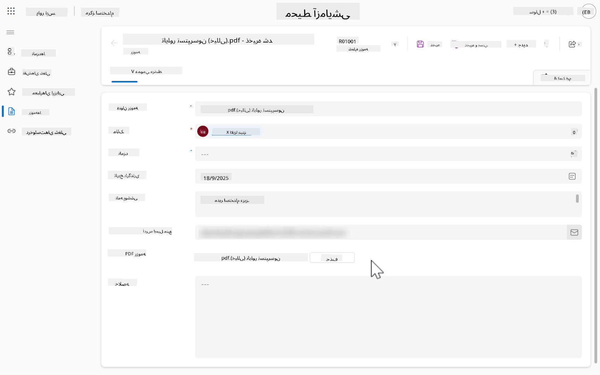

## ✅ مأموریت کامل شد

تبریک! 👏🏻 کار عالی، اپراتور.

✅ محرک رویداد: شما یک محرک رویداد ایجاد کرده‌اید که مقادیر پارامترهای Dataverse را به یک جریان عامل منتقل می‌کند.  
✅ ساخت جریان عامل: استفاده از مقادیر پارامترهای Dataverse برای ارسال یک کارت تطبیقی به کانال در Microsoft Teams برای اطلاع‌رسانی به تیم استخدام منابع انسانی.  
✅ به‌روزرسانی دستورالعمل‌های عامل فرعی: برای فراخوانی جریان پس از تکمیل محرک رویداد.

این امکان را برای **Hiring Agent** فراهم می‌کند که به صورت خودکار عمل کند و هر زمان که رزومه‌ها به عنوان پیوست ایمیل دریافت شوند، تیم استخدام منابع انسانی را برای بررسی دستی مطلع کند.

این پایان **آزمایش 03 - خودکارسازی ایمیل‌های درخواست شغلی کاندیداها** است، لینک زیر را انتخاب کنید تا به درس بعدی بروید.

⏭️ [انتقال به درس **نوشتن دستورالعمل‌های عامل**](../04-agent-instructions/README.md)

## 📚 منابع تاکتیکی

📖 [عامل خود را در Copilot Studio خودکار کنید](https://learn.microsoft.com/training/modules/autonomous-agents-online-workshop/?WT.mc_id=power-188561-ebenitez)

📖 [افزودن یک محرک رویداد](https://learn.microsoft.com/microsoft-copilot-studio/authoring-trigger-event?WT.mc_id=power-188561-ebenitez)

📖 [استفاده از جریان‌های عامل با عامل شما](https://learn.microsoft.com/microsoft-copilot-studio/advanced-flow?WT.mc_id=power-188561-ebenitez)

📖 [مقدمه‌ای بر محرک‌های Power Automate](https://learn.microsoft.com/power-automate/triggers-introduction?WT.mc_id=power-188561-ebenitez)

📖 [استفاده از جریان‌های Power Automate با عوامل](https://learn.microsoft.com/microsoft-copilot-studio/advanced-flow-create?WT.mc_id=power-188561-ebenitez)

📖 [جلوگیری از دست دادن داده‌ها برای Copilot Studio](https://learn.microsoft.com/microsoft-copilot-studio/admin-data-loss-prevention?WT.mc_id=power-188561-ebenitez)

---

**سلب مسئولیت**:  
این سند با استفاده از سرویس ترجمه هوش مصنوعی [Co-op Translator](https://github.com/Azure/co-op-translator) ترجمه شده است. در حالی که ما تلاش می‌کنیم دقت را حفظ کنیم، لطفاً توجه داشته باشید که ترجمه‌های خودکار ممکن است شامل خطاها یا نادرستی‌ها باشند. سند اصلی به زبان اصلی آن باید به عنوان منبع معتبر در نظر گرفته شود. برای اطلاعات حیاتی، ترجمه حرفه‌ای انسانی توصیه می‌شود. ما مسئولیتی در قبال سوء تفاهم‌ها یا تفسیرهای نادرست ناشی از استفاده از این ترجمه نداریم.