<!--
CO_OP_TRANSLATOR_METADATA:
{
  "original_hash": "616d142d4fb5f45d2a168fad6c1f9545",
  "translation_date": "2025-10-21T17:59:20+00:00",
  "source_file": "docs/operative-preview/07-multimodal-prompts/README.md",
  "language_code": "fa"
}
-->
# 🚨 مأموریت 07: استخراج محتوای رزومه با درخواست‌های چندرسانه‌ای

--8<-- "disclaimer.md"

## 🕵️‍♂️ نام رمز: `بررسی رزومه اسناد`

> **⏱️ زمان عملیات:** `~45 دقیقه`

## 🎯 خلاصه مأموریت

به مأمور خوش آمدید. مأموریت‌های قبلی شما مهارت‌های قدرتمند هماهنگی عامل‌ها را به شما آموخته‌اند، اما اکنون زمان آن رسیده است که یک قابلیت تغییر دهنده بازی را باز کنید: **تحلیل اسناد چندرسانه‌ای**.

وظیفه شما، اگر تصمیم به پذیرش آن دارید، **بررسی رزومه اسناد** است - استخراج داده‌های ساختاریافته از هر سند با دقت. در حالی که عامل‌های شما می‌توانند متن را به راحتی پردازش کنند، دنیای واقعی نیازمند مدیریت روزانه فایل‌های PDF، تصاویر و اسناد پیچیده است. رزومه‌ها انباشته می‌شوند، فاکتورها نیاز به پردازش دارند و فرم‌ها نیاز به دیجیتالی شدن فوری دارند.

این مأموریت شما را از یک سازنده عامل فقط متنی به یک **متخصص چندرسانه‌ای** تبدیل خواهد کرد. شما یاد خواهید گرفت که هوش مصنوعی را تنظیم کنید که اسناد را مانند یک تحلیلگر انسانی بخواند و درک کند - اما با سرعت و ثبات هوش مصنوعی. تا پایان مأموریت، شما یک سیستم کامل استخراج رزومه ساخته‌اید که با جریان کاری استخدام شما ادغام می‌شود.

تکنیک‌هایی که در اینجا یاد می‌گیرید برای عملیات پیشرفته پایه‌گذاری داده‌ها در مأموریت بعدی شما ضروری خواهند بود.

## 🔎 اهداف

در این مأموریت، شما یاد خواهید گرفت:

1. درخواست‌های چندرسانه‌ای چیست و چه زمانی باید از مدل‌های مختلف هوش مصنوعی استفاده کرد
1. چگونه درخواست‌ها را با ورودی‌های تصویر و سند تنظیم کنیم
1. چگونه خروجی درخواست‌ها را به صورت JSON برای استخراج داده‌های ساختاریافته قالب‌بندی کنیم
1. بهترین روش‌ها برای مهندسی درخواست‌ها با تحلیل اسناد
1. چگونه درخواست‌های چندرسانه‌ای را با جریان‌های عامل ادغام کنیم

## 🧠 درک درخواست‌های چندرسانه‌ای

### چه چیزی یک درخواست را "چندرسانه‌ای" می‌کند؟

درخواست‌های سنتی فقط با متن کار می‌کنند. اما درخواست‌های چندرسانه‌ای می‌توانند انواع مختلف محتوا را پردازش کنند:

- **متن**: دستورالعمل‌ها و محتواهای نوشته شده
- **تصاویر**: عکس‌ها، اسکرین‌شات‌ها، نمودارها و دیاگرام‌ها (.PNG، .JPG، .JPEG)  
- **اسناد**: فاکتورها، رزومه‌ها، فرم‌ها (.PDF)

این قابلیت سناریوهای قدرتمندی مانند تحلیل رزومه‌ها، پردازش فاکتورها یا استخراج داده‌ها از فرم‌ها را باز می‌کند.

### چرا چندرسانه‌ای برای جریان‌های کاری شما مهم است

هر روز، سازمان شما با این چالش‌های پردازش اسناد مواجه است:

- **بررسی رزومه‌ها**: خواندن دستی صدها رزومه زمان ارزشمندی می‌گیرد
- **پردازش فاکتورها**: استخراج جزئیات فروشنده، مبالغ و تاریخ‌ها از فرمت‌های مختلف سند
- **تحلیل فرم‌ها**: تبدیل فرم‌های کاغذی به داده‌های دیجیتال

درخواست‌های چندرسانه‌ای این گلوگاه‌ها را با ترکیب درک زبان هوش مصنوعی با قابلیت‌های تحلیل بصری حذف می‌کنند. این به هوش مصنوعی شما توانایی پردازش اسناد را به همان اندازه متن می‌دهد.

### سناریوهای رایج کسب‌وکار

در اینجا چند مثال از نحوه استفاده از درخواست‌های چندرسانه‌ای آورده شده است:

| سناریو                | وظیفه                                                                                                                                      | مثال فیلدهای خروجی                                                                                   |
|-------------------------|-------------------------------------------------------------------------------------------------------------------------------------------|---------------------------------------------------------------------------------------------------------|
| **بررسی رزومه‌ها**    | استخراج نام کاندیدا، ایمیل، تلفن، عنوان فعلی، سال‌های تجربه و مهارت‌های کلیدی.                                                 | نام کاندیدا، آدرس ایمیل، شماره تلفن، عنوان شغلی فعلی، سال‌های تجربه، مهارت‌های کلیدی         |
| **پردازش فاکتورها**  | استخراج اطلاعات فروشنده، تاریخ فاکتور، مبلغ کل و آیتم‌های خطی از این فاکتور.                                                 | نام فروشنده، تاریخ فاکتور، مبلغ کل، آیتم‌های خطی فاکتور                                             |
| **تحلیل فرم‌ها**       | تحلیل این فرم درخواست و استخراج تمام فیلدهای پر شده.                                                                              | نام فیلد (مثلاً نام متقاضی)، مقدار وارد شده (مثلاً جان دو)، ...                                  |
| **تأیید مدارک شناسایی** | استخراج نام، شماره شناسایی، تاریخ انقضا و آدرس از این مدرک شناسایی. تأیید کنید که تمام متن به وضوح قابل خواندن است و بخش‌های نامشخص را علامت‌گذاری کنید. | نام کامل، شماره شناسایی، تاریخ انقضا، آدرس، علامت‌گذاری بخش‌های نامشخص                        |

## ⚙️ انتخاب مدل در AI Builder

AI Builder مدل‌های مختلفی را ارائه می‌دهد که برای وظایف خاص بهینه شده‌اند. درک اینکه کدام مدل را استفاده کنید برای موفقیت حیاتی است.

!!! note "دقیق تا سپتامبر 2025"
    مدل‌های AI Builder به طور مرتب به‌روزرسانی می‌شوند، بنابراین مستندات [تنظیمات مدل AI Builder](https://learn.microsoft.com/ai-builder/prompt-modelsettings) را برای دسترسی به مدل‌های فعلی بررسی کنید.

### مقایسه مدل‌ها

تمام مدل‌های زیر از پردازش بصری و اسناد پشتیبانی می‌کنند

| مدل | 💰هزینه | ⚡سرعت | ✅بهترین برای |
|-------|------|-------|----------|
| **GPT-4.1 mini** | پایه (مقرون به صرفه‌ترین) | سریع | پردازش استاندارد اسناد، خلاصه‌سازی، پروژه‌های اقتصادی |
| **GPT-4.1** | استاندارد | متوسط | اسناد پیچیده، ایجاد محتوای پیشرفته، نیازهای دقت بالا |
| **o3** | پریمیوم | کند (دلایل اولویت) | تحلیل داده، تفکر انتقادی، حل مسائل پیچیده |
| **GPT-5 chat** | استاندارد | پیشرفته | درک اسناد جدید، بالاترین دقت پاسخ |
| **GPT-5 reasoning** | پریمیوم | کند (تحلیل پیچیده) | پیشرفته‌ترین تحلیل، برنامه‌ریزی، استدلال پیشرفته |

### توضیح تنظیمات دما

دمای تنظیمات تعیین می‌کند که پاسخ‌های هوش مصنوعی چقدر خلاق یا قابل پیش‌بینی باشند:

- **دمای 0**: قابل پیش‌بینی‌ترین، نتایج ثابت (بهترین برای استخراج داده‌ها)
- **دمای 0.5**: تعادل بین خلاقیت و ثبات  
- **دمای 1**: حداکثر خلاقیت (بهترین برای تولید محتوا)

برای تحلیل اسناد، از **دمای 0** استفاده کنید تا استخراج داده‌ها ثابت باشد.

## 📊 فرمت‌های خروجی: متن در مقابل JSON

انتخاب فرمت خروجی مناسب برای پردازش‌های بعدی حیاتی است.

### زمانی که از خروجی متن استفاده کنیم

خروجی متن برای موارد زیر مناسب است:

- خلاصه‌های قابل خواندن توسط انسان
- طبقه‌بندی‌های ساده
- محتوایی که نیاز به پردازش ساختاریافته ندارد

### زمانی که از خروجی JSON استفاده کنیم

خروجی JSON برای موارد زیر ضروری است:

- استخراج داده‌های ساختاریافته
- ادغام با پایگاه‌های داده یا سیستم‌ها
- پردازش جریان Power Automate
- نگاشت فیلدهای ثابت

### بهترین روش‌های JSON

1. **نام‌های فیلد واضح تعریف کنید**: از نام‌گذاری توصیفی و ثابت استفاده کنید
1. **مثال‌ها ارائه دهید**: نمونه خروجی و مقادیر برای هر فیلد را شامل کنید
1. **نوع داده‌ها را مشخص کنید**: مثال‌هایی برای تاریخ‌ها، اعداد و متن شامل کنید
1. **مدیریت داده‌های گم‌شده**: برای مقادیر null یا خالی برنامه‌ریزی کنید
1. **ساختار را اعتبارسنجی کنید**: با انواع مختلف اسناد آزمایش کنید

### ملاحظات کیفیت سند

- **وضوح**: اطمینان حاصل کنید که تصاویر واضح و قابل خواندن هستند
- **جهت‌گیری**: اسناد را قبل از پردازش به جهت مناسب بچرخانید
- **پشتیبانی فرمت**: با انواع خاص اسناد خود (PDF، JPG، PNG) آزمایش کنید
- **محدودیت‌های اندازه**: از محدودیت‌های اندازه فایل در محیط خود آگاه باشید

### بهینه‌سازی عملکرد

- **مدل‌های مناسب را انتخاب کنید**: فقط در صورت نیاز مدل‌ها را ارتقا دهید
- **درخواست‌ها را بهینه کنید**: اغلب، دستورالعمل‌های کوتاه‌تر و واضح‌تر عملکرد بهتری دارند
- **مدیریت خطا**: برای اسنادی که قابل پردازش نیستند برنامه‌ریزی کنید
- **هزینه‌ها را نظارت کنید**: مدل‌های مختلف مقدار متفاوتی از اعتبارهای AI Builder مصرف می‌کنند

## 🧪 آزمایشگاه 7: ساخت سیستم استخراج رزومه

زمان آن رسیده است که دانش چندرسانه‌ای خود را به کار ببرید. شما یک سیستم جامع استخراج رزومه خواهید ساخت که اسناد کاندیداها را تحلیل می‌کند و آن‌ها را به داده‌های ساختاریافته برای جریان کاری استخدام شما تبدیل می‌کند.

### پیش‌نیازها برای تکمیل این مأموریت

1. شما باید **یا**:

    - **مأموریت 06 را تکمیل کرده باشید** و سیستم استخدام چندعاملی خود را آماده داشته باشید، **یا**
    - **راه‌حل شروع مأموریت 07 را وارد کنید** اگر تازه شروع می‌کنید یا نیاز به جبران دارید. [دانلود راه‌حل شروع مأموریت 07](https://aka.ms/agent-academy)

1. نمونه اسناد رزومه از [رزومه‌های آزمایشی](https://download-directory.github.io/?url=https://github.com/microsoft/agent-academy/tree/main/operative/sample-data/resumes&filename=operative_sampledata)

!!! note "وارد کردن راه‌حل و داده‌های نمونه"
    اگر از راه‌حل شروع استفاده می‌کنید، به [مأموریت 01](../01-get-started/README.md) برای دستورالعمل‌های دقیق در مورد نحوه وارد کردن راه‌حل‌ها و داده‌های نمونه به محیط خود مراجعه کنید.

### 7.1 ایجاد یک درخواست چندرسانه‌ای

اولین هدف شما: ایجاد یک درخواست قادر به تحلیل اسناد رزومه و استخراج داده‌های ساختاریافته.

1. وارد [Copilot Studio](https://copilotstudio.microsoft.com) شوید و **ابزارها** را از منوی سمت چپ انتخاب کنید.

1. **+ ابزار جدید** را انتخاب کنید، سپس **درخواست** را انتخاب کنید.  
    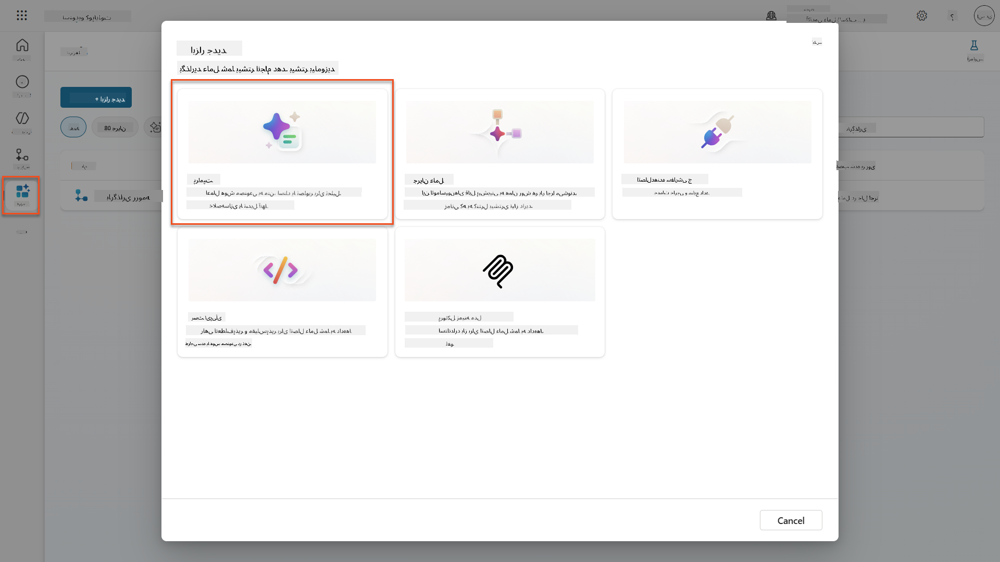

1. **نام درخواست** را از نام پیش‌فرض زمان‌بندی (مثلاً *درخواست سفارشی 09/04/2025، 04:59:11 PM*) به `خلاصه رزومه` تغییر دهید.

1. در قسمت دستورالعمل‌ها، این درخواست را اضافه کنید:

    ```text
    You are tasked with extracting key candidate information from a resume and cover letter to facilitate matching with open job roles and creating a summary for application review.
    
    Instructions:
    1. Extract Candidate Details:
        - Identify and extract the candidate’s full name.
        - Extract contact information, specifically the email address.
    2. Create Candidate Summary:
        - Summarize the candidate’s profile as multiline text (max 2000 characters) with the following sections:
            - Candidate name
            - Role(s) applied for if present
            - Contact and location
            - One-paragraph summary
            - Experience snapshot (last 2–3 roles with outcomes)
            - Key projects (1–3 with metrics)
            - Education and certifications
            - Top skills (Top 10)
            - Availability and work authorization
    
    Guidelines:
    - Extract information only from the provided resume and cover letter documents.
    - Ensure accuracy in identifying all details such as contact details and skills.
    - The summary should be concise but informative, suitable for quick application review.
    
    Resume: /document
    CoverLetter: /text
    ```

    !!! tip "استفاده از کمک Copilot"
        می‌توانید از "شروع با Copilot" برای ایجاد درخواست خود با استفاده از زبان طبیعی استفاده کنید. سعی کنید از Copilot بخواهید یک درخواست برای خلاصه کردن رزومه ایجاد کند!

1. **پیکربندی** پارامترهای ورودی:

    | پارامتر | نوع | نام | داده نمونه |
    |-----------|------|------|-------------|
    | رزومه | تصویر یا سند | رزومه | یک رزومه نمونه از پوشه داده‌های آزمایشی بارگذاری کنید |
    | نامه پوششی | متن | نامه پوششی | این یک رزومه است! |

1. **آزمایش** را انتخاب کنید تا خروجی اولیه متن از درخواست خود را مشاهده کنید.  
    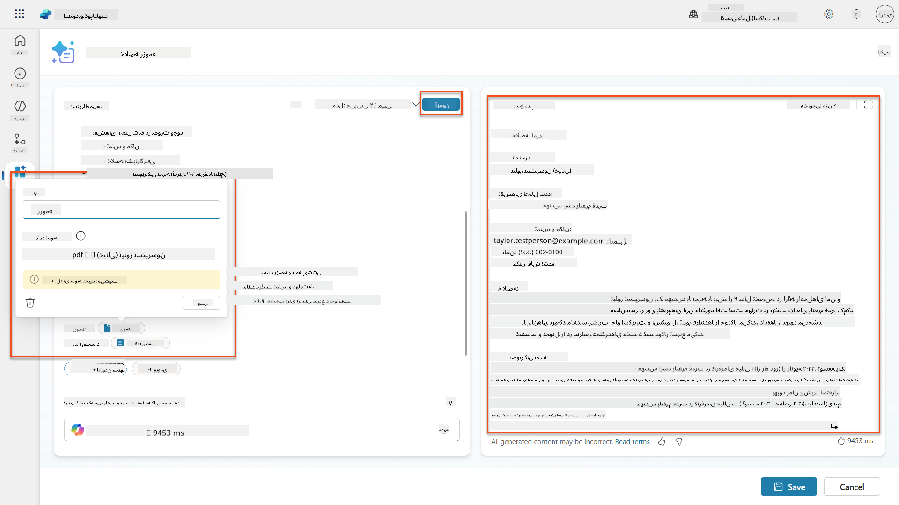

### 7.2 پیکربندی خروجی JSON

اکنون شما درخواست را به خروجی داده‌های ساختاریافته JSON تبدیل خواهید کرد.

1. این مشخصات فرمت JSON را به انتهای دستورالعمل‌های درخواست خود اضافه کنید:

    ```text
    Output Format:
    Provide the output in valid JSON format with the following structure:
    
    {
        "CandidateName": "string",
        "Email": "string",
        "Summary": "string max 2000 characters",
        "Skills": [ {"item": "Skill 1"}, {"item": "Skill 2"}],
        "Experience": [ {"item": "Experience 1"}, {"item": "Experience 2"}],
    }
    ```

1. تنظیم **خروجی** را از "متن" به **JSON** تغییر دهید.

1. دوباره **آزمایش** را انتخاب کنید تا تأیید کنید که خروجی اکنون به صورت JSON قالب‌بندی شده است.  
    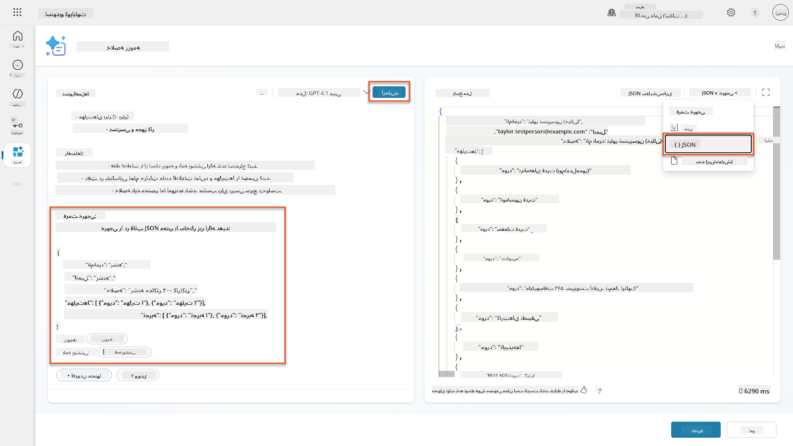

1. **اختیاری:** با مدل‌های مختلف هوش مصنوعی آزمایش کنید تا ببینید چگونه خروجی‌ها متفاوت هستند، سپس به مدل پیش‌فرض بازگردید.

1. **ذخیره** را انتخاب کنید تا درخواست ایجاد شود.

1. در گفتگوی **پیکربندی برای استفاده در عامل**، **لغو** را انتخاب کنید.

    !!! info "چرا هنوز این را به عنوان ابزار اضافه نمی‌کنیم"
        شما این درخواست را در یک جریان عامل استفاده خواهید کرد نه به طور مستقیم به عنوان یک ابزار، که کنترل بیشتری بر جریان کاری پردازش داده‌ها به شما می‌دهد.

### 7.3 افزودن درخواست به جریان عامل

شما یک جریان عامل ایجاد خواهید کرد که از درخواست شما برای پردازش رزومه‌های ذخیره شده در Dataverse استفاده می‌کند.

!!! tip "عبارات جریان عامل"
    بسیار مهم است که دستورالعمل‌ها برای نام‌گذاری گره‌ها و وارد کردن عبارات را دقیقاً دنبال کنید زیرا عبارات به گره‌های قبلی با استفاده از نام آن‌ها اشاره می‌کنند! برای یادآوری سریع به [مأموریت جریان عامل در استخدام](../../recruit/09-add-an-agent-flow/README.md#you-mentioned-expressions-what-are-expressions) مراجعه کنید!

1. به **عامل استخدام** خود در Copilot Studio بروید

1. تب **عامل‌ها** را انتخاب کنید و عامل فرعی **عامل پذیرش درخواست** را انتخاب کنید

1. در پنل **ابزارها**، **+ افزودن** → **+ ابزار جدید** → **جریان عامل** را انتخاب کنید

1. در گره "وقتی یک عامل جریان را فراخوانی می‌کند"، از **+ افزودن ورودی** برای افزودن پارامتر زیر استفاده کنید:

    | نوع | نام | توضیحات |
    |------|------|-------------|
    | متن | شماره رزومه | مطمئن شوید که از [شماره رزومه] استفاده کنید. این باید همیشه با حرف R شروع شود |

1. آیکون **+** درج عمل زیر گره اول را انتخاب کنید، **Dataverse** را جستجو کنید، **بیشتر ببینید** را انتخاب کنید، و سپس عمل **لیست ردیف‌ها** را پیدا کنید

1. روی **سه نقطه (...)** در گره لیست ردیف‌ها کلیک کنید و آن را به `دریافت رکورد رزومه` تغییر نام دهید، سپس پارامترهای زیر را تنظیم کنید:

    | ویژگی | نحوه تنظیم | مقدار |
    |----------|------------|-------|
    | **نام جدول** | انتخاب کنید | رزومه‌ها |
    | **فیلتر ردیف‌ها** | داده پویا (آیکون رعد و برق) | `ppa_resumenumber eq 'ResumeNumber'` جایگزین **ResumeNumber** با **وقتی یک عامل جریان را فراخوانی می‌کند** → **ResumeNumber** |
    | **تعداد ردیف‌ها** | وارد کنید | 1 |

    !!! tip "بهینه‌سازی این پرسش‌ها!"
        هنگام استفاده از این تکنیک در تولید، همیشه باید ستون‌های انتخاب شده را فقط به موارد مورد نیاز جریان عامل محدود کنید.

    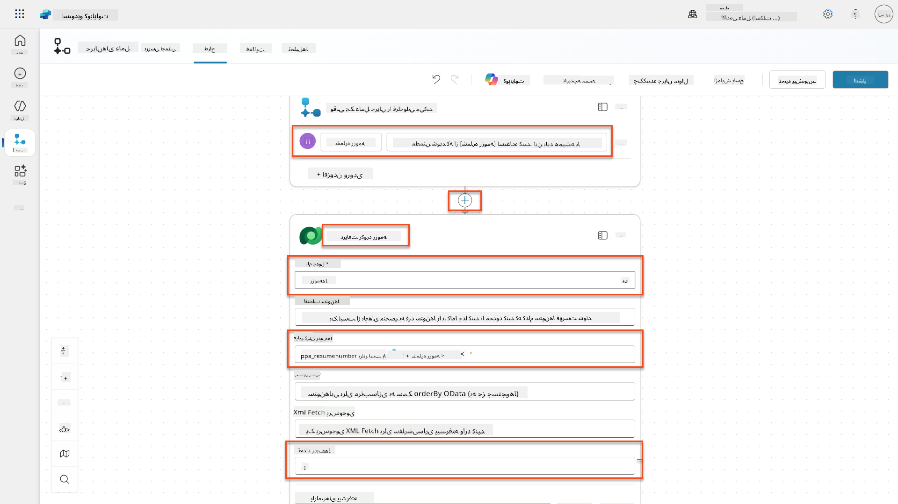

1. آیکون **+** درج عمل زیر گره دریافت رکورد رزومه را انتخاب کنید، **Dataverse** را جستجو کنید، **بیشتر ببینید** را انتخاب کنید، و سپس عمل **دانلود یک فایل یا تصویر** را پیدا کنید.

    !!! tip "عمل صحیح را انتخاب کنید!"
        مطمئن شوید که عمل پایان‌یافته به "از محیط انتخاب شده" را انتخاب نکنید

1. همانطور که قبلاً، عمل را به `دانلود رزومه` تغییر نام دهید، و سپس پارامترهای زیر را تنظیم کنید:

    | ویژگی | نحوه تنظیم | مقدار |
    |----------|------------|-------|
    | **نام جدول** | انتخاب کنید | رزومه‌ها |
    | **شناسه ردیف** | عبارت (آیکون fx) | `first(body('Get_Resume_Record')?['value'])?['ppa_resumeid']` |
    | **نام ستون** | انتخاب کنید | رزومه PDF |

    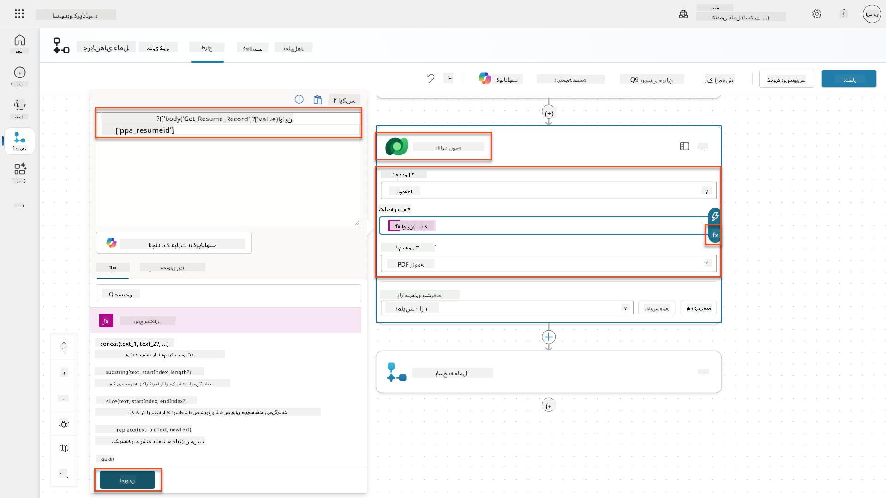

1. اکنون، آیکون **+** درج عمل زیر دانلود رزومه را انتخاب کنید، تحت **قابلیت‌های هوش مصنوعی**، **اجرای یک درخواست** را انتخاب کنید،

1. عمل را به `خلاصه رزومه` تغییر نام دهید و پارامترهای زیر را تنظیم کنید:

    | ویژگی | نحوه تنظیم | مقدار |
| **پیشنهاد** | انتخاب | خلاصه رزومه |
| **CoverLetter** | عبارت (آیکون fx) | `first(body('Get_Resume_Record')?['value'])?['ppa_coverletter']` |
| **Resume** | داده‌های پویا (آیکون رعد و برق) | دانلود رزومه → محتوای فایل یا تصویر |

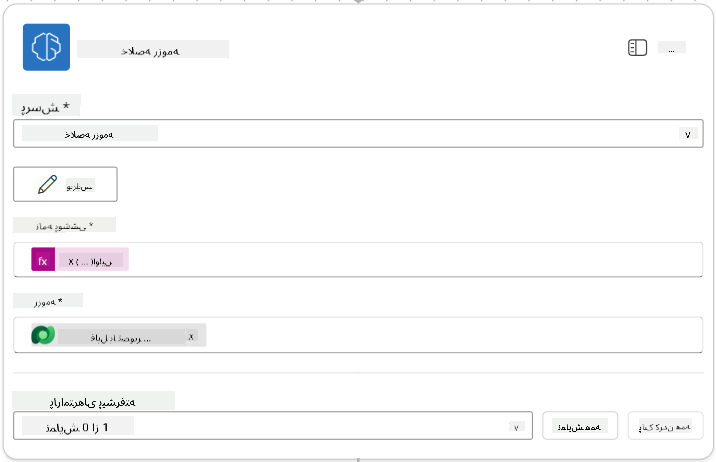

!!! tip "پارامترهای پیشنهاد"
    توجه کنید که پارامترهایی که پر می‌کنید همان‌هایی هستند که هنگام ایجاد پیشنهاد به عنوان پارامترهای ورودی تنظیم کرده‌اید.

### 7.4 ایجاد رکورد کاندیدا

حالا باید اطلاعاتی که پیشنهاد به شما داده را بگیرید و یک رکورد جدید برای کاندیدا ایجاد کنید، اگر قبلاً وجود ندارد.

1. آیکون **+** Insert action زیر گره Summarize Resume را انتخاب کنید، به دنبال **Dataverse** بگردید، **See more** را انتخاب کنید و سپس عمل **List rows** را پیدا کنید.

1. گره را به نام `Get Existing Candidate` تغییر نام دهید و پارامترهای زیر را تنظیم کنید:

    | ویژگی | نحوه تنظیم | مقدار |
    |-------|------------|-------|
    | **Table name** | انتخاب | Candidates |
    | **Filter rows** | داده‌های پویا (آیکون رعد و برق) | `ppa_email eq 'Email'`  **جایگزین کنید** `Email` با **Summarize Resume → Email** |
    | **Row count** | وارد کنید | 1 |

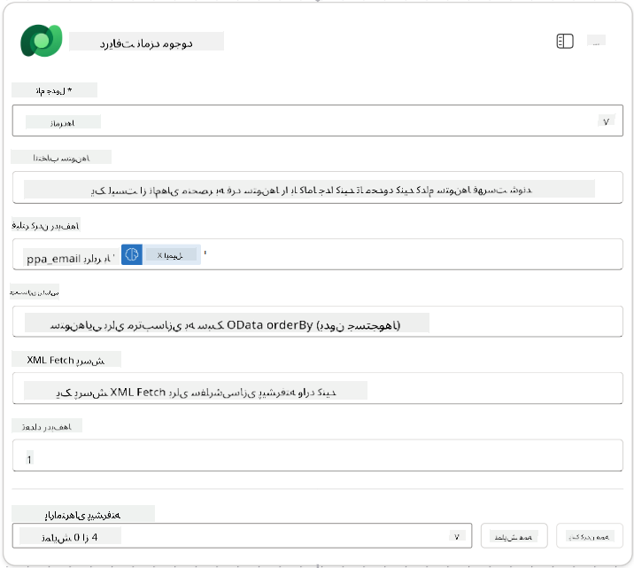

1. آیکون **+** Insert action زیر گره Get Existing Candidate را انتخاب کنید، به دنبال **Control** بگردید، **See more** را انتخاب کنید و سپس عمل **Condition** را پیدا کنید.

1. در ویژگی‌های شرط، شرط زیر را تنظیم کنید:

    | شرط | عملگر | مقدار |
    |-----|-------|-------|
    | عبارت (آیکون fx): `length(outputs('Get_Existing_Candidate')?['body/value'])` | برابر است با | 0 |

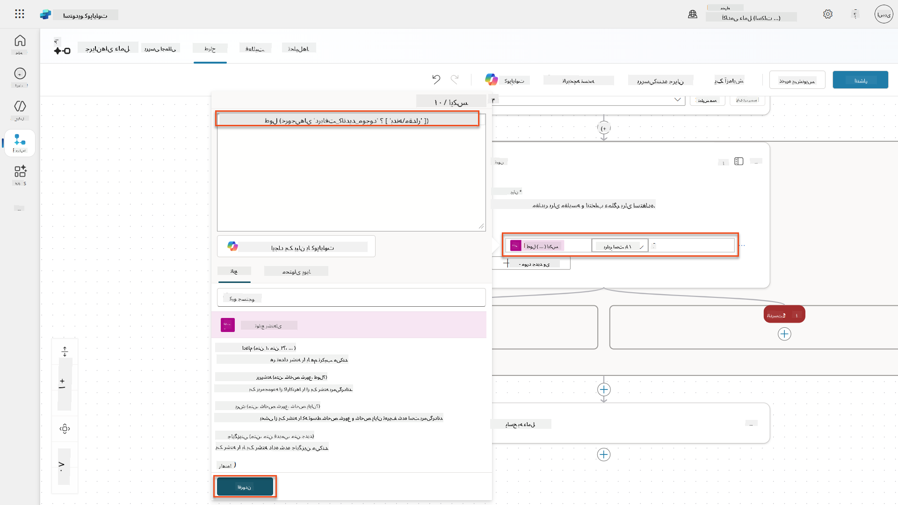

1. آیکون **+** Insert action در شاخه **True** را انتخاب کنید، به دنبال **Dataverse** بگردید، **See more** را انتخاب کنید و سپس عمل **Add a new row** را پیدا کنید.

1. گره را به نام `Add a New Candidate` تغییر نام دهید و پارامترهای زیر را تنظیم کنید:

    | ویژگی | نحوه تنظیم | مقدار |
    |-------|------------|-------|
    | **Table name** | انتخاب | Candidates |
    | **Candidate Name** | داده‌های پویا (آیکون رعد و برق) | Summarize Resume → `CandidateName` |
    | **Email** | داده‌های پویا (آیکون رعد و برق) | Summarize Resume → `Email` |

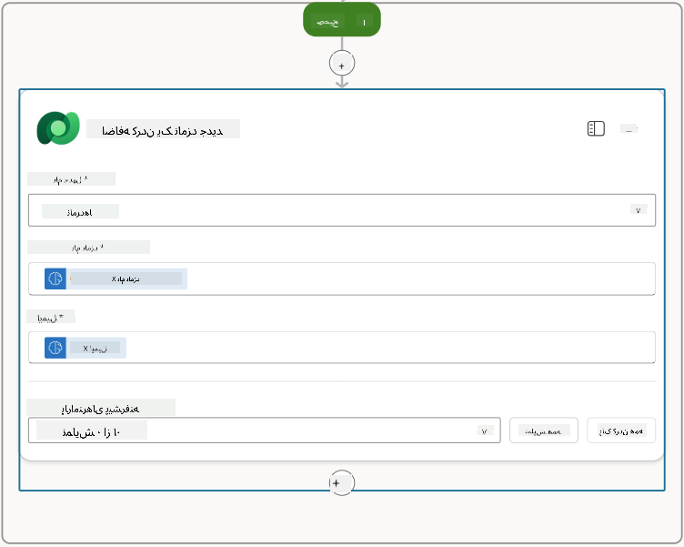

### 7.5 به‌روزرسانی رزومه و تنظیم خروجی‌های جریان

جریان را با به‌روزرسانی رکورد رزومه و تنظیم داده‌هایی که باید به عامل بازگردانده شود، کامل کنید.

1. آیکون **+** Insert action زیر شرط را انتخاب کنید، به دنبال **Dataverse** بگردید، **See more** را انتخاب کنید و سپس عمل **Update a row** را پیدا کنید.

1. عنوان را انتخاب کنید تا گره را به نام `Update Resume` تغییر نام دهید، **Show all** را انتخاب کنید و سپس پارامترهای زیر را تنظیم کنید:

    | ویژگی | نحوه تنظیم | مقدار |
    |-------|------------|-------|
    | **Table name** | انتخاب | Resumes |
    | **Row ID** | عبارت (آیکون fx) | `first(body('Get_Resume_Record')?['value'])?['ppa_resumeid']` |
    | **Summary** | داده‌های پویا (آیکون رعد و برق) | Summarize Resume → Text |
    | **Candidate (Candidates)** | عبارت (آیکون fx) | `if(equals(length(outputs('Get_Existing_Candidate')?['body/value']), 1), first(outputs('Get_Existing_Candidate')?['body/value'])?['ppa_candidateid'], outputs('Add_a_New_Candidate')?['body/ppa_candidateid'])` |

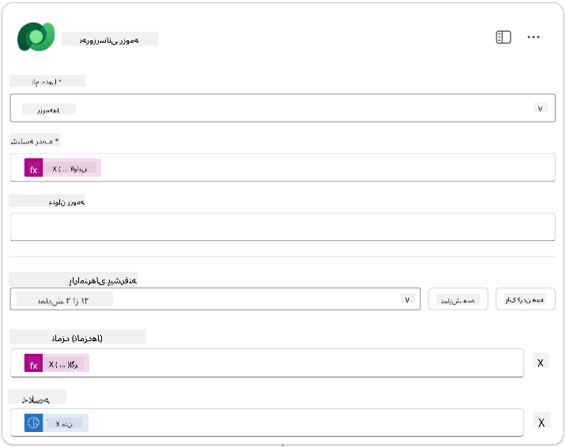

1. گره **Respond to the agent** را انتخاب کنید و سپس از **+ Add an output** برای تنظیم موارد زیر استفاده کنید:

    | نوع | نام              | نحوه تنظیم                      | مقدار                                                        | توضیحات                                            |
    |-----|------------------|----------------------------------|-------------------------------------------------------------|---------------------------------------------------|
    | متن | `CandidateName`   | داده‌های پویا (آیکون رعد و برق) | Summarize Resume → See more → CandidateName                  | [CandidateName] داده شده در رزومه                 |
    | متن | `CandidateEmail`  | داده‌های پویا (آیکون رعد و برق) | Summarize Resume → See more → Email                          | [CandidateEmail] داده شده در رزومه                |
    | متن | `CandidateNumber` | عبارت (آیکون fx)               | `concat('ppa_candidates/', if(equals(length(outputs('Get_Existing_Candidate')?['body/value']), 1), first(outputs('Get_Existing_Candidate')?['body/value'])?['ppa_candidateid'], outputs('Add_a_New_Candidate')?['body/ppa_candidateid']) )` | [CandidateNumber] کاندیدای جدید یا موجود         |
    | متن | `ResumeSummary`   | داده‌های پویا (آیکون رعد و برق) | Summarize Resume → See more → body/responsev2/predictionOutput/structuredOutput | خلاصه رزومه و جزئیات در قالب JSON                |

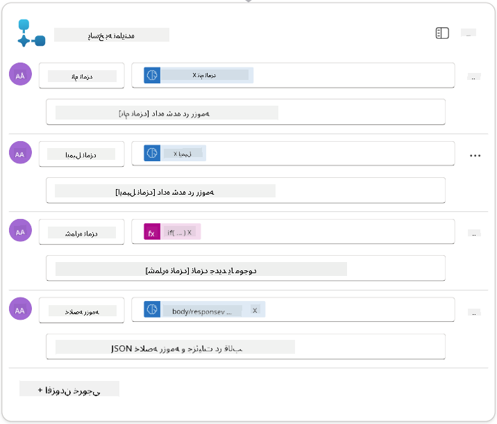

1. **Save draft** را در بالا سمت راست انتخاب کنید. جریان عامل شما باید به شکل زیر باشد  
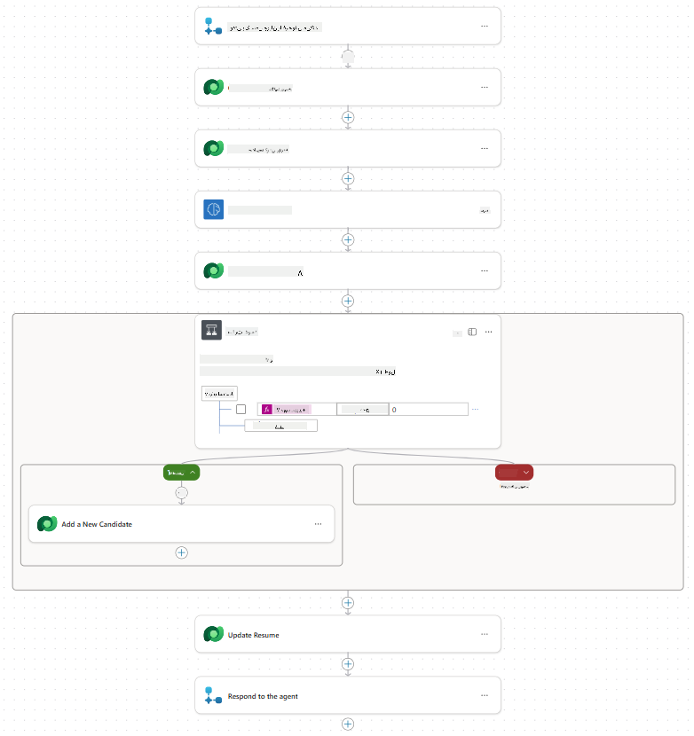

1. تب **Overview** را انتخاب کنید، **Edit** را در پنل **Details** انتخاب کنید.

    1. **نام جریان**: `Summarize Resume`
    1. **توضیحات**:

        ```text
        Summarize an existing Resume stored in Dataverse using a [ResumeNumber] as input, return the [CandidateNumber], and resume summary JSON
        ```

1. **Save** را انتخاب کنید.

1. دوباره تب **Designer** را انتخاب کنید و **Publish** را انتخاب کنید.

### 7.6 اتصال جریان به عامل

حالا جریان را به عنوان یک ابزار اضافه کنید و عامل خود را برای استفاده از آن تنظیم کنید.

1. **Hiring Agent** خود را در Copilot Studio باز کنید.

1. تب **Agents** را انتخاب کنید و **Application Intake Agent** را باز کنید.

1. پنل **Tools** را انتخاب کنید و **+ Add a tool** - > **Flow** -> **Summarize Resume** **(Agent Flow)** را انتخاب کنید.

1. **Add and configure** را انتخاب کنید.

1. تنظیمات ابزار را به صورت زیر تنظیم کنید:

    | تنظیم | مقدار |
    |-------|-------|
    | **توضیحات** | خلاصه کردن یک رزومه موجود ذخیره شده در Dataverse با استفاده از [ResumeNumber] به عنوان ورودی، بازگرداندن [CandidateNumber] و خلاصه رزومه در قالب JSON |
    | **زمان استفاده از این ابزار** | فقط زمانی که توسط موضوعات یا عوامل ارجاع داده شود |

1. **Save** را انتخاب کنید  
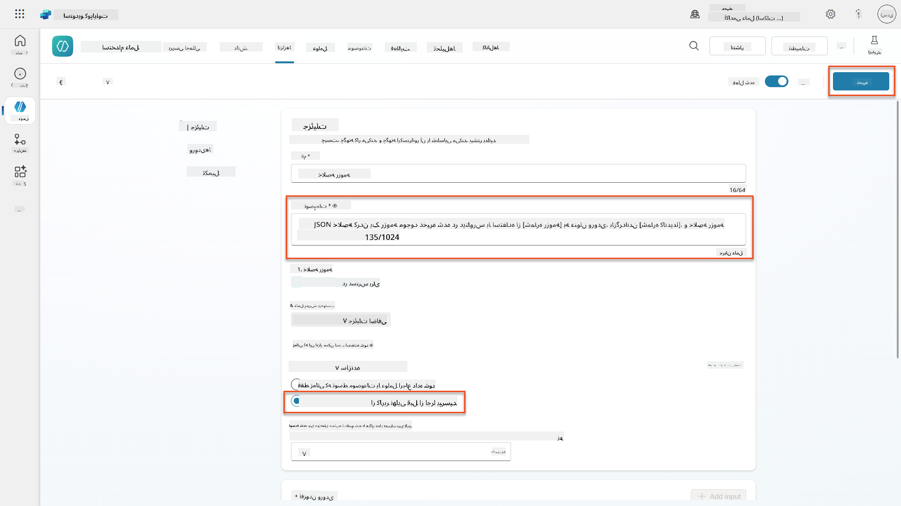

1. اگر ابزارها را در Hiring Agent انتخاب کنید، اکنون هر دو ابزار ما را خواهید دید که نشان می‌دهد توسط **Application Intake Agent** قابل استفاده هستند.  
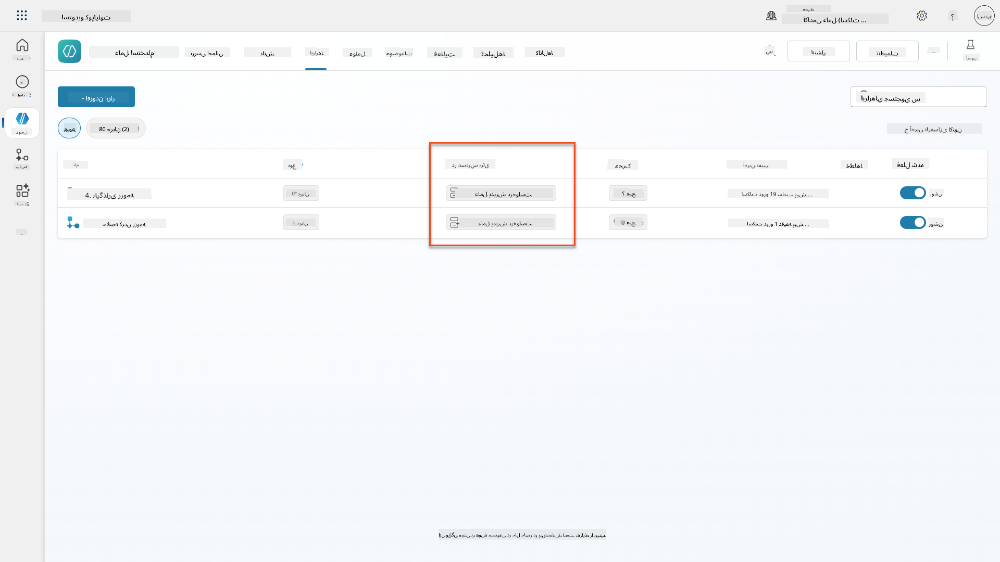

1. به دستورالعمل‌های عامل **Application Intake Child** بروید و مرحله **Post-Upload** را به صورت زیر تغییر دهید:

    ```text
    2. Post-Upload Processing  
        - After uploading, be sure to also output the [ResumeNumber] in all messages
        - Pass [ResumeNumber] to /Summarize Resume  - Be sure to use the correct value that will start with the letter R.
        - Be sure to also output the [CandidateNumber] in all messages
        - Use the [ResumeSummary] to output a summary of the processed Resume and candidate
    ```

    `/Summarize Resume` را با وارد کردن ارجاع به جریان عامل **Summarize Resume** با تایپ کردن اسلش (`/)`) یا انتخاب `/Summarize` برای وارد کردن ارجاع جایگزین کنید.  
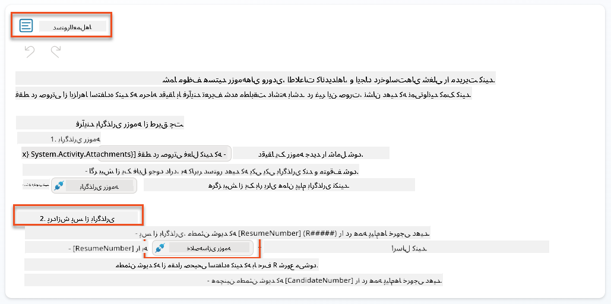

1. **Save** را انتخاب کنید.

### 7.7 آزمایش عامل خود

سیستم چندحالتی کامل خود را آزمایش کنید تا مطمئن شوید همه چیز به درستی کار می‌کند.

1. **آزمایش را شروع کنید**:

    - **Test** را انتخاب کنید تا پنل آزمایش باز شود.
    - تایپ کنید: `Here is a candidate Resume`

    - یکی از رزومه‌های نمونه را از [Test Resumes](https://download-directory.github.io/?url=https://github.com/microsoft/agent-academy/tree/main/operative/sample-data/resumes&filename=operative_sampledata) آپلود کنید.

1. **نتایج را بررسی کنید**:
    - پس از ارسال پیام و رزومه، بررسی کنید که شماره رزومه دریافت کنید (فرمت: R#####)
    - بررسی کنید که شماره کاندیدا و خلاصه دریافت کنید.
    - از نقشه فعالیت استفاده کنید تا ابزار آپلود رزومه و ابزار Summarize Resume را در عمل ببینید و خروجی‌های پیشنهاد خلاصه توسط عامل دریافت شود:  
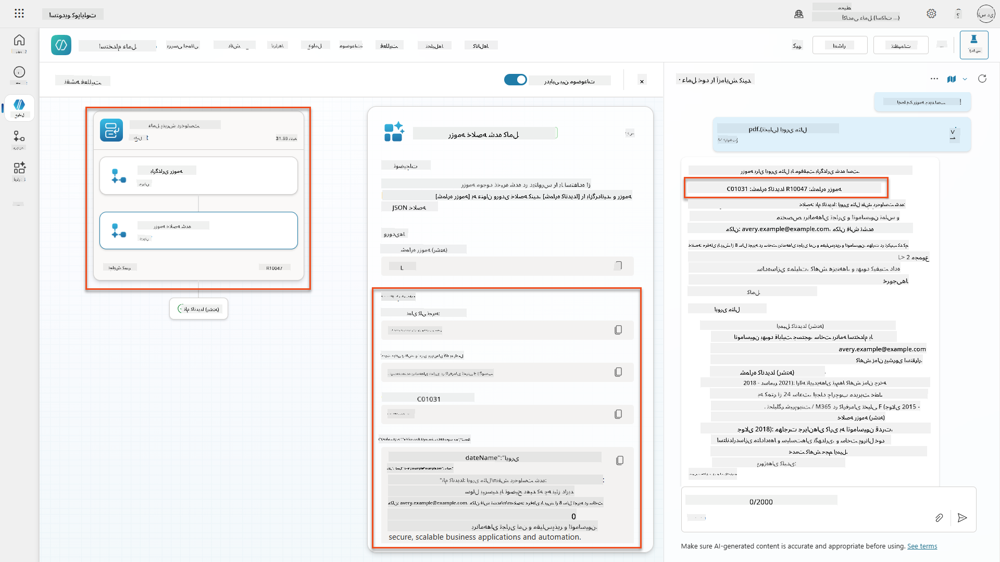

1. **بررسی ماندگاری داده‌ها**:
    - به [Power Apps](https://make.powerapps.com) بروید.
    - **Apps** → **Hiring Hub** → **Play** را باز کنید.
    - به **Resumes** بروید تا بررسی کنید که رزومه آپلود و پردازش شده است. باید اطلاعات خلاصه و یک رکورد کاندیدا مرتبط داشته باشد.
    - **Candidates** را بررسی کنید تا اطلاعات استخراج شده کاندیدا را ببینید.  
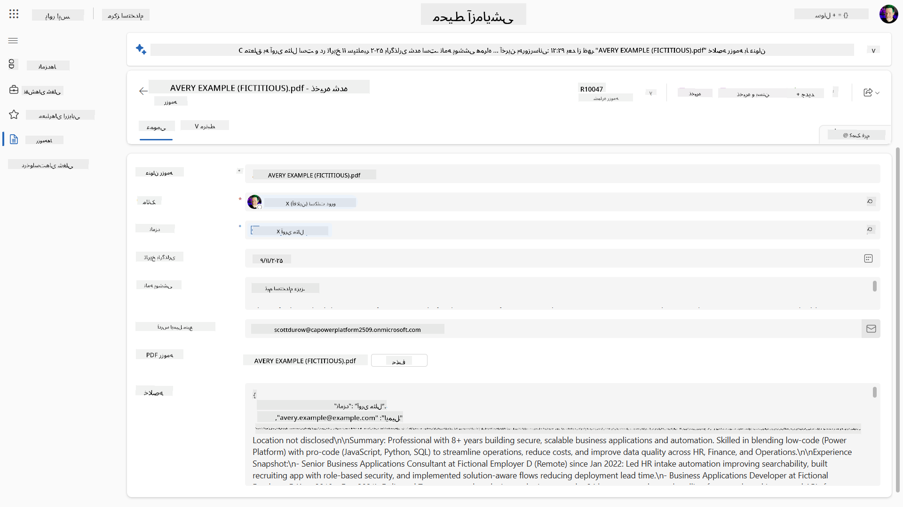
    - وقتی دوباره فرآیند را اجرا کنید، باید از کاندیدای موجود (بر اساس ایمیل استخراج شده از رزومه) استفاده کند به جای ایجاد یک کاندیدای جدید.

!!! tip "رفع اشکال"
    - **رزومه پردازش نمی‌شود**: مطمئن شوید که فایل PDF است و زیر محدودیت‌های اندازه قرار دارد.
    - **کاندیدا ایجاد نمی‌شود**: بررسی کنید که ایمیل به درستی از رزومه استخراج شده باشد.
    - **خطاهای فرمت JSON**: مطمئن شوید که دستورالعمل‌های پیشنهاد شما شامل ساختار دقیق JSON باشد.
    - **خطاهای جریان**: بررسی کنید که همه اتصالات Dataverse و عبارات به درستی تنظیم شده باشند.

### آمادگی برای تولید

اگرچه بخشی از این مأموریت نیست، برای آماده‌سازی جریان عامل برای تولید ممکن است موارد زیر را در نظر بگیرید:

1. **مدیریت خطا** - اگر شماره رزومه پیدا نشد یا پیشنهاد نتوانست سند را تجزیه کند، مدیریت خطا باید اضافه شود تا یک خطای واضح به عامل بازگردانده شود.
1. **به‌روزرسانی کاندیداهای موجود** - کاندیدا با استفاده از ایمیل پیدا می‌شود، سپس نام می‌تواند به نام موجود در رزومه به‌روزرسانی شود.
1. **تقسیم خلاصه‌سازی رزومه و ایجاد کاندیدا** - این عملکرد می‌تواند به جریان‌های عامل کوچکتر تقسیم شود تا نگهداری آن‌ها آسان‌تر شود و سپس به عامل دستور داده شود که به ترتیب از آن‌ها استفاده کند.

## 🎉 مأموریت کامل شد

کار عالی، عامل! **بازسازی رزومه سند** اکنون کامل شد. شما با موفقیت مهارت‌های پیشنهاد چندحالتی را تسلط پیدا کردید و اکنون می‌توانید داده‌های ساختاریافته را با دقت از هر سند استخراج کنید.

آنچه در این مأموریت به دست آوردید:

**✅ تسلط بر پیشنهاد چندحالتی**  
اکنون می‌دانید پیشنهاد چندحالتی چیست و چه زمانی از مدل‌های مختلف هوش مصنوعی برای نتایج بهینه استفاده کنید.

**✅ تخصص در پردازش سند**  
یاد گرفتید که پیشنهادها را با ورودی‌های تصویر و سند تنظیم کنید و خروجی‌ها را به صورت JSON برای استخراج داده‌های ساختاریافته قالب‌بندی کنید.

**✅ سیستم استخراج رزومه**  
یک سیستم کامل استخراج رزومه ایجاد کردید که اسناد کاندیدا را پردازش می‌کند و با جریان کاری استخدام شما ادغام می‌شود.

**✅ اجرای بهترین شیوه‌ها**  
بهترین شیوه‌ها را برای مهندسی پیشنهاد با تحلیل سند اعمال کردید و پیشنهادهای چندحالتی را با جریان‌های عامل ادغام کردید.

**✅ پایه‌ای برای پردازش پیشرفته**  
قابلیت‌های تحلیل سند پیشرفته شما اکنون آماده ویژگی‌های پیشرفته اتصال داده در مأموریت‌های آینده است.

🚀 **بعدی:** در مأموریت 08، یاد خواهید گرفت که چگونه پیشنهادهای خود را با داده‌های زنده از Dataverse تقویت کنید و راه‌حل‌های هوش مصنوعی پویا ایجاد کنید که با نیازهای متغیر کسب‌وکار سازگار شوند.

⏩ [حرکت به مأموریت 08: پیشنهادهای تقویت‌شده با اتصال Dataverse](../08-dataverse-grounding/README.md)

## 📚 منابع تاکتیکی

📖 [ایجاد یک پیشنهاد](https://learn.microsoft.com/ai-builder/create-a-custom-prompt?WT.mc_id=power-power-182762-scottdurow)

📖 [اضافه کردن ورودی متن، تصویر یا سند به پیشنهاد](https://learn.microsoft.com/ai-builder/add-inputs-prompt?WT.mc_id=power-182762-scottdurow)

📖 [پردازش پاسخ‌ها با خروجی JSON](https://learn.microsoft.com/ai-builder/process-responses-json-output?WT.mc_id=power-182762-scottdurow)

📖 [انتخاب مدل و تنظیمات دما](https://learn.microsoft.com/ai-builder/prompt-modelsettings?WT.mc_id=power-182762-scottdurow)

📖 [استفاده از پیشنهاد در Power Automate](https://learn.microsoft.com/ai-builder/use-a-custom-prompt-in-flow?WT.mc_id=power-182762-scottdurow)

📺 [AI Builder: خروجی‌های JSON در سازنده پیشنهاد](https://www.youtube.com/watch?v=F0fGnWrRY_I)

---

**سلب مسئولیت**:  
این سند با استفاده از سرویس ترجمه هوش مصنوعی [Co-op Translator](https://github.com/Azure/co-op-translator) ترجمه شده است. در حالی که ما تلاش می‌کنیم دقت را حفظ کنیم، لطفاً توجه داشته باشید که ترجمه‌های خودکار ممکن است شامل خطاها یا نادرستی‌ها باشند. سند اصلی به زبان اصلی آن باید به عنوان منبع معتبر در نظر گرفته شود. برای اطلاعات حیاتی، ترجمه حرفه‌ای انسانی توصیه می‌شود. ما مسئولیتی در قبال سوء تفاهم‌ها یا تفسیرهای نادرست ناشی از استفاده از این ترجمه نداریم.