<!--
CO_OP_TRANSLATOR_METADATA:
{
  "original_hash": "750f3ea8a94930439ebd8a10871b1d73",
  "translation_date": "2025-10-21T17:46:34+00:00",
  "source_file": "docs/operative-preview/08-dataverse-grounding/README.md",
  "language_code": "fa"
}
-->
# 🚨 مأموریت 08: بهبود درخواست‌ها با اتصال به Dataverse

--8<-- "disclaimer.md"

## 🕵️‍♂️ نام رمز: `کنترل اتصال`

> **⏱️ زمان عملیات:** `~60 دقیقه`

## 🎯 خلاصه مأموریت

خوش آمدید، مأمور. سیستم چندعاملی استخدام شما فعال است، اما یک بهبود حیاتی برای **اتصال داده‌ها** لازم است - مدل‌های هوش مصنوعی شما نیاز به دسترسی به داده‌های ساختاریافته سازمان شما به صورت لحظه‌ای دارند تا تصمیمات هوشمندانه بگیرند.

در حال حاضر، درخواست خلاصه رزومه شما با دانش ثابت کار می‌کند. اما اگر بتواند به پایگاه داده نقش‌های شغلی شما دسترسی پیدا کند تا تطابق‌های دقیق و به‌روز ارائه دهد چه؟ اگر بتواند معیارهای ارزیابی شما را بدون نیاز به کدنویسی سخت درک کند چه؟

در این مأموریت، شما درخواست سفارشی خود را با **اتصال به Dataverse** بهبود خواهید داد - اتصال درخواست‌ها به منابع داده زنده. این کار عامل‌های شما را از پاسخ‌دهندگان ثابت به سیستم‌های پویا و مبتنی بر داده تبدیل می‌کند که با نیازهای متغیر کسب‌وکار سازگار می‌شوند.

مأموریت شما: ادغام داده‌های لحظه‌ای نقش‌های شغلی و معیارهای ارزیابی در جریان تحلیل رزومه، ایجاد سیستمی خودبه‌روزرسان که با نیازهای استخدامی سازمان شما همگام باشد.

## 🔎 اهداف

در این مأموریت، شما یاد خواهید گرفت:

1. چگونه **اتصال به Dataverse** درخواست‌های سفارشی را بهبود می‌بخشد
1. زمان استفاده از اتصال داده‌ها در مقابل دستورالعمل‌های ثابت
1. طراحی درخواست‌هایی که داده‌های زنده را به صورت پویا ادغام می‌کنند
1. بهبود جریان خلاصه رزومه با تطابق نقش‌های شغلی

## 🧠 درک اتصال به Dataverse برای درخواست‌ها

**اتصال به Dataverse** به درخواست‌های سفارشی شما اجازه می‌دهد تا هنگام پردازش درخواست‌ها به داده‌های زنده از جداول Dataverse دسترسی پیدا کنند. به جای دستورالعمل‌های ثابت، درخواست‌های شما می‌توانند اطلاعات لحظه‌ای را برای تصمیم‌گیری‌های آگاهانه ادغام کنند.

### چرا اتصال به Dataverse مهم است

درخواست‌های سنتی با دستورالعمل‌های ثابت کار می‌کنند:

```text
Match this candidate to these job roles: Developer, Manager, Analyst
```

با اتصال به Dataverse، درخواست شما به داده‌های فعلی دسترسی پیدا می‌کند:

```text
Match this candidate to available job roles from the Job Roles table, 
considering current evaluation criteria and requirements
```

این روش چندین مزیت کلیدی ارائه می‌دهد:

- **به‌روزرسانی‌های پویا:** نقش‌های شغلی و معیارها بدون نیاز به تغییر درخواست‌ها تغییر می‌کنند
- **ثبات:** همه عامل‌ها از منابع داده فعلی یکسان استفاده می‌کنند
- **مقیاس‌پذیری:** نقش‌ها و معیارهای جدید به طور خودکار در دسترس قرار می‌گیرند
- **دقت:** داده‌های لحظه‌ای تضمین می‌کنند که تصمیمات نیازهای فعلی را منعکس می‌کنند

### چگونه اتصال به Dataverse کار می‌کند

وقتی اتصال به Dataverse را برای یک درخواست سفارشی فعال می‌کنید:

1. **انتخاب داده‌ها:** جداول و ستون‌های خاص Dataverse را برای ادغام انتخاب کنید. همچنین می‌توانید جداول مرتبطی را انتخاب کنید که سیستم بر اساس رکوردهای والد بازیابی شده فیلتر می‌کند.
1. **تزریق زمینه:** درخواست به طور خودکار داده‌های بازیابی شده را در زمینه درخواست ادغام می‌کند
1. **فیلتر هوشمند:** سیستم فقط داده‌های مرتبط با درخواست فعلی را در صورت ارائه فیلتر شامل می‌کند.
1. **خروجی ساختاریافته:** درخواست شما می‌تواند به داده‌های بازیابی شده ارجاع دهد و درباره رکوردهای بازیابی شده استدلال کند تا خروجی ایجاد کند.

### از ثابت به پویا: مزیت اتصال

بیایید جریان خلاصه رزومه فعلی شما از مأموریت 07 را بررسی کنیم و ببینیم چگونه اتصال به Dataverse آن را از هوش ثابت به هوش پویا تبدیل می‌کند.

**رویکرد ثابت فعلی:**
درخواست موجود شما شامل معیارهای ارزیابی کدنویسی شده و منطق تطابق از پیش تعیین شده بود. این رویکرد کار می‌کند اما نیاز به به‌روزرسانی دستی دارد هر زمان که نقش‌های شغلی جدید اضافه کنید، معیارهای ارزیابی را تغییر دهید یا اولویت‌های شرکت را تغییر دهید.

**تحول اتصال به Dataverse:**
با افزودن اتصال به Dataverse، جریان خلاصه رزومه شما:

- **به نقش‌های شغلی فعلی دسترسی پیدا می‌کند** از جدول نقش‌های شغلی شما
- **از معیارهای ارزیابی زنده استفاده می‌کند** به جای توضیحات ثابت  
- **تطابق‌های دقیق ارائه می‌دهد** بر اساس نیازهای لحظه‌ای

## 🎯 چرا درخواست‌های اختصاصی در مقابل مکالمات عامل

در مأموریت 02، شما تجربه کردید که چگونه عامل مصاحبه می‌تواند کاندیداها را به نقش‌های شغلی تطابق دهد، اما نیاز به درخواست‌های پیچیده کاربر داشت مانند:

```text
Upload this resume, then show me open job roles,
each with a description of the evaluation criteria, 
then use this to match the resume to at least one suitable
job role even if not a perfect match.
```

در حالی که این کار می‌کرد، درخواست‌های اختصاصی با اتصال به Dataverse مزایای قابل توجهی برای وظایف خاص ارائه می‌دهند:

### مزایای کلیدی درخواست‌های اختصاصی

| جنبه | مکالمات عامل | درخواست‌های اختصاصی |
|--------|-------------------|------------------|
| **ثبات** | نتایج بر اساس مهارت‌های کاربر در نوشتن درخواست متفاوت است | پردازش استاندارد شده هر بار |
| **تخصص** | استدلال عمومی ممکن است جزئیات کسب‌وکار را از دست بدهد | طراحی شده با منطق بهینه کسب‌وکار |
| **اتوماتیک‌سازی** | نیاز به تعامل انسانی و تفسیر دارد | به طور خودکار با خروجی JSON ساختاریافته فعال می‌شود |

## 🧪 آزمایش 8: افزودن اتصال به Dataverse به درخواست‌ها

زمان ارتقای قابلیت‌های تحلیل رزومه شما فرا رسیده است! شما جریان خلاصه رزومه موجود را با تطابق نقش‌های شغلی پویا بهبود خواهید داد.

### پیش‌نیازهای تکمیل این مأموریت

1. شما باید **یا**:

    - **مأموریت 07 را تکمیل کرده باشید** و سیستم تحلیل رزومه خود را آماده داشته باشید، **یا**
    - **راه‌حل شروع مأموریت 08 را وارد کنید** اگر تازه شروع می‌کنید یا نیاز به جبران دارید. [دانلود راه‌حل شروع مأموریت 08](https://aka.ms/agent-academy)

1. نمونه اسناد رزومه از [رزومه‌های آزمایشی](https://download-directory.github.io/?url=https://github.com/microsoft/agent-academy/tree/main/operative/sample-data/resumes&filename=operative_sampledata)

!!! note "وارد کردن راه‌حل و داده‌های نمونه"
    اگر از راه‌حل شروع استفاده می‌کنید، به [مأموریت 01](../01-get-started/README.md) برای دستورالعمل‌های دقیق در مورد نحوه وارد کردن راه‌حل‌ها و داده‌های نمونه به محیط خود مراجعه کنید.

### 8.1 افزودن اتصال به Dataverse به درخواست شما

شما بر اساس درخواست خلاصه رزومه‌ای که در مأموریت 07 ایجاد کرده‌اید، کار خواهید کرد. در حال حاضر فقط رزومه را خلاصه می‌کند، اما اکنون آن را با نقش‌های شغلی موجود در Dataverse متصل خواهید کرد تا همیشه به‌روز باشد.

ابتدا، جداول Dataverse که با آنها اتصال برقرار خواهید کرد را بررسی کنید:

1. **به [Power Apps](https://make.powerapps.com) بروید** و محیط خود را با استفاده از **تغییر‌دهنده محیط** در بالای سمت راست نوار ناوبری انتخاب کنید.

1. **جداول** را انتخاب کنید و جدول **نقش‌های شغلی** را پیدا کنید

1. ستون‌های کلیدی که برای اتصال استفاده خواهید کرد را بررسی کنید:

    | ستون | هدف |
    |--------|---------|
    | **شماره نقش شغلی** | شناسه منحصر به فرد برای تطابق نقش |
    | **عنوان شغلی** | نام نمایش برای نقش |
    | **توضیحات** | الزامات دقیق نقش |

1. به همین ترتیب، جداول دیگر مانند جدول **معیارهای ارزیابی** را بررسی کنید.

### 8.2 افزودن داده‌های اتصال به Dataverse به درخواست شما

1. **به Copilot Studio بروید** و محیط خود را با استفاده از **تغییر‌دهنده محیط** در بالای سمت راست نوار ناوبری انتخاب کنید.

1. **ابزارها** را از ناوبری سمت چپ انتخاب کنید.

1. **درخواست** را انتخاب کنید و درخواست **خلاصه رزومه** خود را از مأموریت 07 پیدا کنید.  
    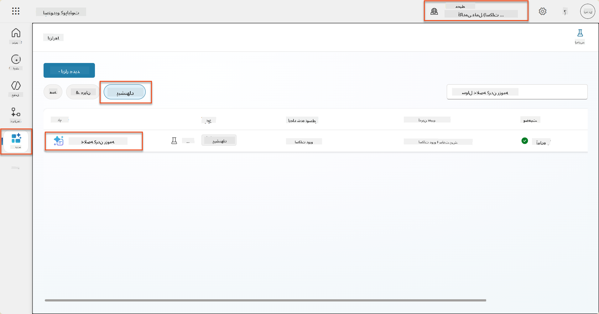

1. **ویرایش** را انتخاب کنید تا درخواست را اصلاح کنید و نسخه بهبود یافته زیر را جایگزین کنید:

    !!! important
        اطمینان حاصل کنید که پارامترهای رزومه و نامه پوششی به عنوان پارامترها دست نخورده باقی بمانند.

    ```text
    You are tasked with extracting key candidate information from a resume and cover letter to facilitate matching with open job roles and creating a summary for application review.
    
    ### Instructions:
    1. **Extract Candidate Details:**
       - Identify and extract the candidate's full name.
       - Extract contact information, specifically the email address.
    
    2. **Analyze Resume and Cover Letter:**
       - Review the resume content to identify relevant skills, experience, and qualifications.
       - Review the cover letter to understand the candidate's motivation and suitability for the roles.
    
    3. **Match Against Open Job Roles:**
       - Compare the extracted candidate information with the requirements and descriptions of the provided open job roles.
       - Use the job descriptions to assess potential fit.
       - Identify all roles that align with the candidate's cover letter and profile. You don't need to assess perfect suitability.
       - Provide reasoning for each match based on the specific job requirements.
    
    4. **Create Candidate Summary:**
       - Summarize the candidate's profile as multiline text with the following sections:
          - Candidate name
          - Role(s) applied for if present
          - Contact and location
          - One-paragraph summary
          - Top skills (8–10)
          - Experience snapshot (last 2–3 roles with outcomes)
          - Key projects (1–3 with metrics)
          - Education and certifications
          - Availability and work authorization
    
    ### Output Format
    
    Provide the output in valid JSON format with the following structure:
    
    {
      "CandidateName": "string",
      "Email": "string",
      "MatchedRoles": [
        {
          "JobRoleNumber": "ppa_jobrolenumber from grounded data",
          "RoleName": "ppa_jobtitle from grounded data",
          "Reasoning": "Detailed explanation based on job requirements"
        }
      ],
      "Summary": "string"
    }
    
    ### Guidelines
    
    - Extract information only from the provided resume and cover letter documents.
    - Ensure accuracy in identifying contact details.
    - Use the available job role data for matching decisions.
    - The summary should be concise but informative, suitable for quick application review.
    - If no suitable matches are found, indicate an empty list for MatchedRoles and explain briefly in the summary.
    
    ### Input Data
    Open Job Roles (ppa_jobrolenumber, ppa_jobtitle): /Job Role 
    Resume: {Resume}
    Cover Letter: {CoverLetter}
    ```

1. در ویرایشگر درخواست، `/نقش شغلی` را با انتخاب **+ افزودن محتوا**، انتخاب **Dataverse** → **نقش شغلی** و انتخاب ستون‌های زیر جایگزین کنید، و سپس **افزودن** را انتخاب کنید:

    1. **شماره نقش شغلی**

    1. **عنوان شغلی**

    1. **توضیحات**

    !!! tip
        می‌توانید نام جدول را برای جستجو تایپ کنید.

1. در گفتگوی **نقش شغلی**، ویژگی **فیلتر** را انتخاب کنید، **وضعیت** را انتخاب کنید، و سپس **فعال** را به عنوان مقدار **فیلتر** تایپ کنید.  
    

    !!! tip
        می‌توانید از **افزودن مقدار** در اینجا برای افزودن یک پارامتر ورودی نیز استفاده کنید - به عنوان مثال اگر درخواست برای خلاصه کردن یک رکورد موجود داشتید، می‌توانید شماره رزومه را به عنوان پارامتر برای فیلتر ارائه دهید.

1. سپس، جدول مرتبط Dataverse **معیارهای ارزیابی** را با انتخاب دوباره **+ افزودن محتوا**، پیدا کردن **نقش‌های شغلی**، و به جای انتخاب ستون‌ها در نقش شغلی، **نقش شغلی (معیارهای ارزیابی)** را گسترش دهید و ستون‌های زیر را انتخاب کنید، و سپس **افزودن** را انتخاب کنید:

    1. **نام معیار**

    1. **توضیحات**  
        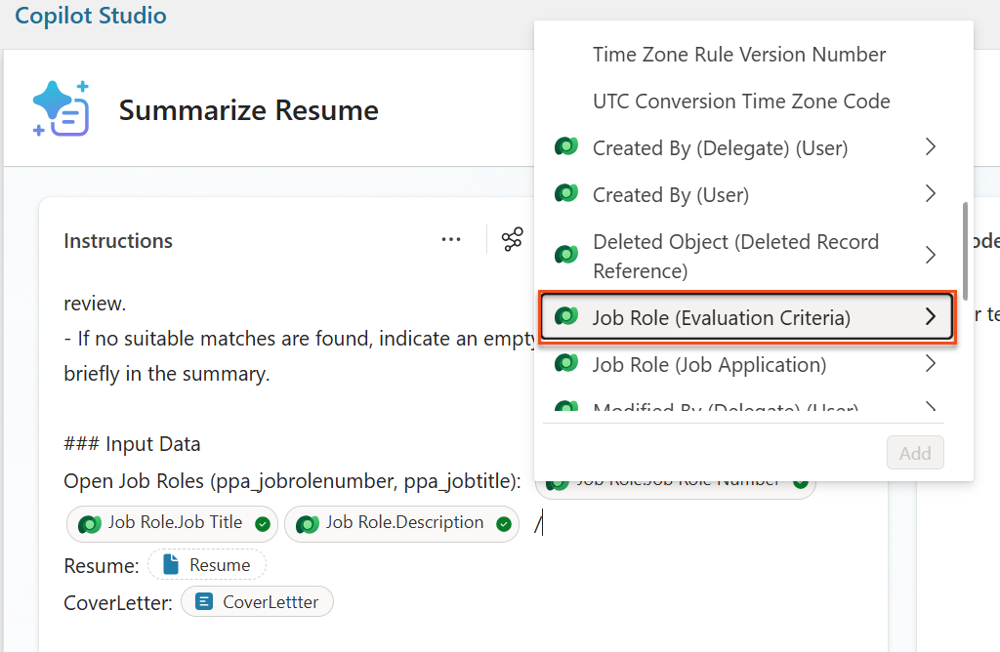

        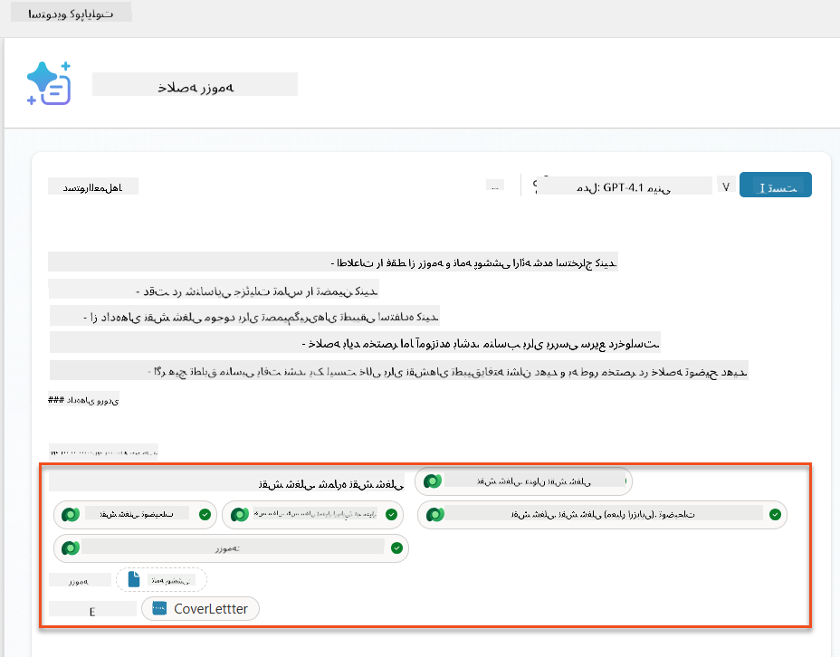

    !!! tip
        مهم است که معیارهای ارزیابی مرتبط را با انتخاب ابتدا نقش شغلی و سپس پیمایش در منو به نقش شغلی (معیارهای ارزیابی) انتخاب کنید. این تضمین می‌کند که فقط رکوردهای مرتبط برای نقش شغلی بارگذاری شوند.

1. **تنظیمات** را انتخاب کنید و **بازیابی رکورد** را به 1000 تنظیم کنید - این اجازه می‌دهد حداکثر نقش‌های شغلی و معیارهای ارزیابی در درخواست شما گنجانده شوند.  
    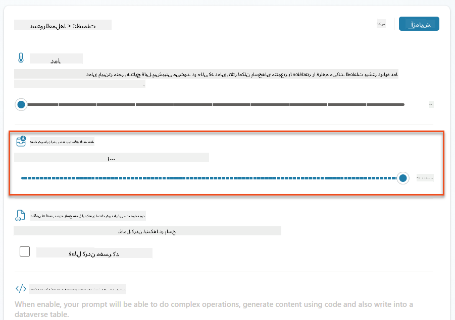

### 8.3 آزمایش درخواست بهبود یافته

1. پارامتر **رزومه** را انتخاب کنید و یک رزومه نمونه که در مأموریت 07 استفاده کرده‌اید را بارگذاری کنید.
1. **آزمایش** را انتخاب کنید.
1. پس از اجرای آزمایش، توجه کنید که خروجی JSON اکنون شامل **نقش‌های تطابق یافته** است.
1. برگه **دانش استفاده شده** را انتخاب کنید تا داده‌های Dataverse که قبل از اجرا با درخواست شما ادغام شده‌اند را مشاهده کنید.
1. **ذخیره** درخواست به‌روزرسانی شده خود را انجام دهید. سیستم اکنون به طور خودکار این داده‌های Dataverse را با درخواست شما ادغام خواهد کرد وقتی جریان عامل خلاصه رزومه موجود آن را فراخوانی کند.  
    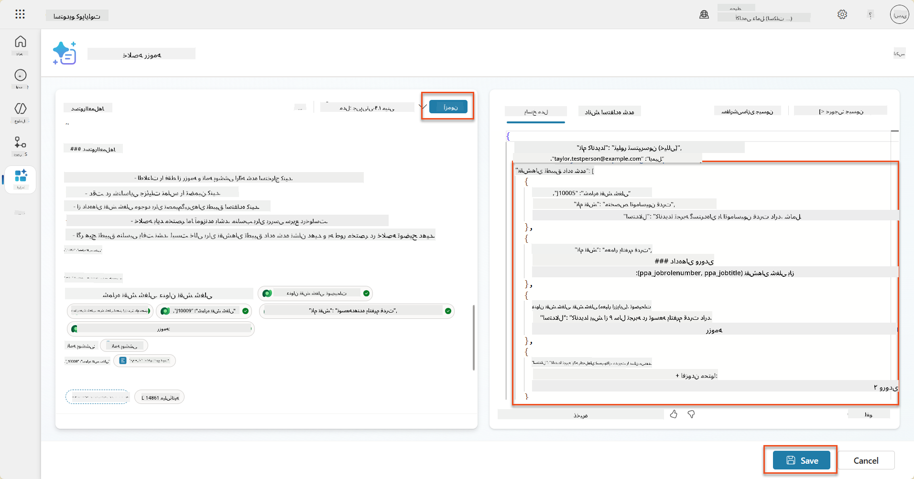

### 8.4 افزودن جریان عامل درخواست شغلی

برای اجازه دادن به عامل پذیرش درخواست ما برای ایجاد نقش‌های شغلی بر اساس نقش‌های پیشنهادی، باید یک جریان عامل ایجاد کنیم. عامل این ابزار را برای هر یک از نقش‌های شغلی پیشنهادی که کاندیدا به آن علاقه دارد فراخوانی خواهد کرد.

!!! tip "عبارات جریان عامل"
    بسیار مهم است که دستورالعمل‌ها برای نام‌گذاری گره‌ها و وارد کردن عبارات را دقیقاً دنبال کنید زیرا عبارات به گره‌های قبلی با استفاده از نام آنها ارجاع می‌دهند! برای یادآوری سریع به [مأموریت جریان عامل در استخدام](../../recruit/09-add-an-agent-flow/README.md#you-mentioned-expressions-what-are-expressions) مراجعه کنید!

1. داخل **عامل استخدام،** برگه **عامل‌ها** را انتخاب کنید و عامل فرعی **پذیرش درخواست** را باز کنید.

1. داخل پنل **ابزارها**، **+ افزودن** → **+ ابزار جدید** → **جریان عامل** را انتخاب کنید.

1. گره **وقتی یک عامل جریان را فراخوانی می‌کند** را انتخاب کنید، از **+ افزودن ورودی** برای افزودن پارامتر زیر استفاده کنید:

    | نوع | نام            | توضیحات                                                  |
    | ---- | --------------- | ------------------------------------------------------------ |
    | متن | `شماره رزومه`  | مطمئن شوید که فقط از [شماره رزومه] استفاده کنید - باید با حرف R شروع شود |
    | متن | `شماره نقش شغلی` | مطمئن شوید که فقط از [شماره نقش شغلی] استفاده کنید - باید با حرف J شروع شود |

    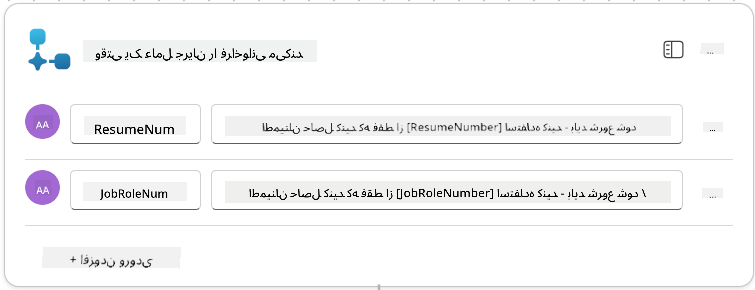

1. آیکون **+** درج عمل زیر گره اول را انتخاب کنید، **Dataverse** را جستجو کنید، **بیشتر ببینید** را انتخاب کنید، و سپس عمل **لیست رکوردها** را پیدا کنید.

1. **نام گره را تغییر دهید** به `دریافت رزومه`، و سپس پارامترهای زیر را تنظیم کنید:

    | ویژگی        | نحوه تنظیم                      | مقدار                                                        |
    | --------------- | ------------------------------- | ------------------------------------------------------------ |
    | **نام جدول**  | انتخاب                          | رزومه‌ها                                                      |
    | **فیلتر رکوردها** | داده پویا (آیکون رعد و برق) | `ppa_resumenumber eq 'شماره رزومه'` انتخاب کنید و **شماره رزومه** را با **وقتی یک عامل جریان را فراخوانی می‌کند** → **شماره رزومه** جایگزین کنید |
    | **تعداد رکوردها**   | وارد کنید                           | 1                                                            |

    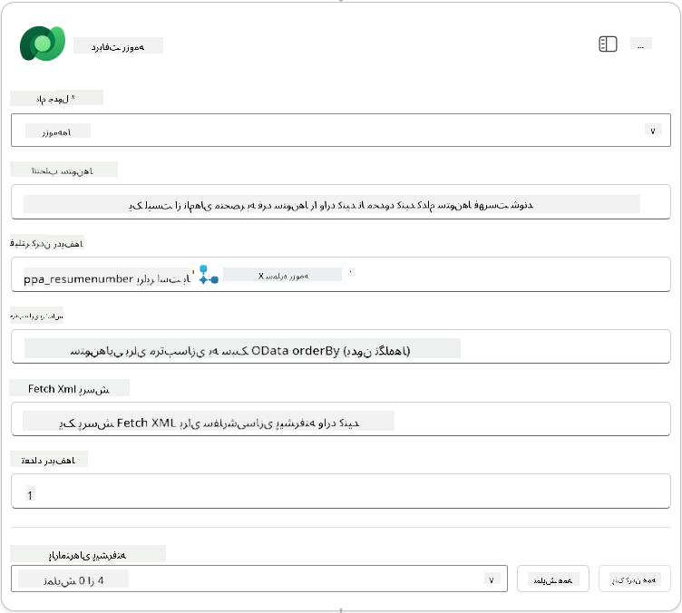

1. اکنون، آیکون **+** درج عمل زیر **دریافت رزومه** را انتخاب کنید، **Dataverse** را جستجو کنید، **بیشتر ببینید** را انتخاب کنید، و سپس عمل **لیست رکوردها** را پیدا کنید.

1. **نام گره را تغییر دهید** به `دریافت نقش شغلی`، و سپس پارامترهای زیر را تنظیم کنید:

    | ویژگی        | نحوه تنظیم                      | مقدار                                                        |
    | --------------- | ------------------------------- | ------------------------------------------------------------ |
    | **نام جدول**  | انتخاب                          | نقش‌های شغلی                                                    |
    | **فیلتر رکوردها** | داده پویا (آیکون رعد و برق) | `ppa_jobrolenumber eq 'شماره نقش شغلی'` انتخاب کنید و **شماره نقش شغلی** را با **وقتی یک عامل جریان را فراخوانی می‌کند** → **شماره نقش شغلی** جایگزین کنید |
    | **تعداد رکوردها**   | وارد کنید                           | 1                                                            |

    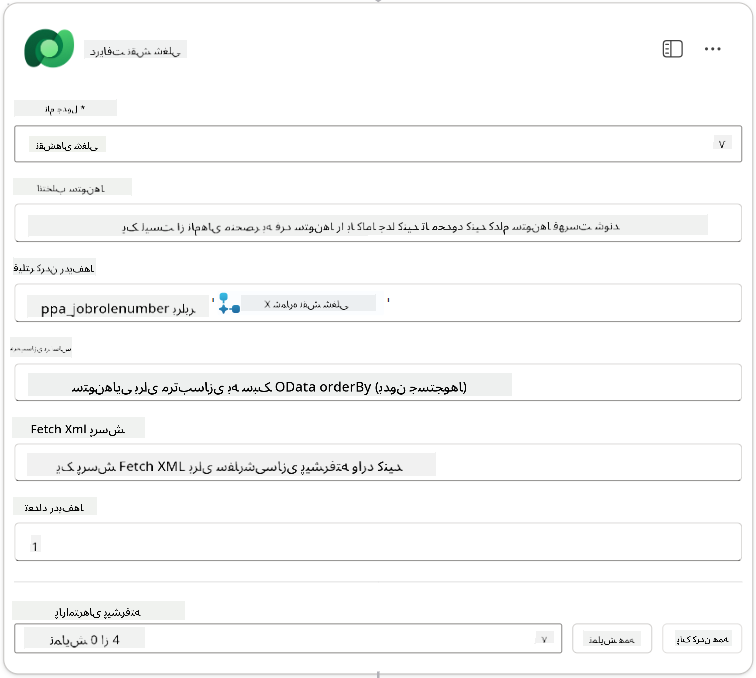

1. اکنون، آیکون **+** درج عمل زیر دریافت نقش شغلی را انتخاب کنید، **Dataverse** را جستجو کنید، **بیشتر ببینید** را انتخاب کنید، و سپس عمل **افزودن یک رکورد جدید** را پیدا کنید.

1. **نام گره را تغییر دهید** به `افزودن درخواست`، و سپس پارامترهای زیر را تنظیم کنید:

    | ویژگی                           | نحوه تنظیم           | مقدار                                                        |
    | ---------------------------------- | -------------------- | ------------------------------------------------------------ |
    | **نام جدول**                     | انتخاب               | درخواست‌های شغلی                                             |
    | **کاندیدا (کاندیداها)**             | عبارت (آیکون fx) | `concat('ppa_candidates/',first(outputs('دریافت رزومه')?['body/value'])?['_ppa_candidate_value'])` |
| **نقش شغلی (Job Roles)**               | عبارت (آیکون fx) | `concat('ppa_jobroles/',first(outputs('Get_Job_Role')?['body/value'])?['ppa_jobroleid'])` |
| **رزومه (Resumes)**                   | عبارت (آیکون fx) | `concat('ppa_resumes/', first(outputs('Get_Resume')?['body/value'])?['ppa_resumeid'])` |
| **تاریخ درخواست** (از **Show all** استفاده کنید) | عبارت (آیکون fx) | `utcNow()`                                                   |

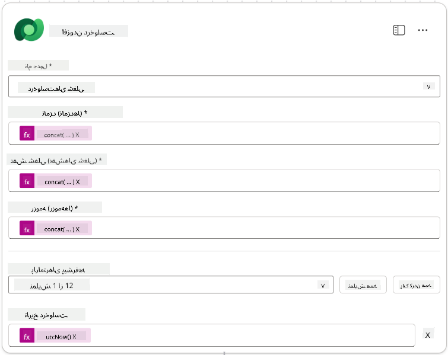

1. **گره پاسخ به نماینده** را انتخاب کنید و سپس **+ افزودن خروجی** را انتخاب کنید.

     | ویژگی        | نحوه تنظیم                      | جزئیات                                         |
     | --------------- | ------------------------------- | ----------------------------------------------- |
     | **نوع**        | انتخاب کنید                          | `Text`                                          |
     | **نام**        | وارد کنید                           | `ApplicationNumber`                             |
     | **مقدار**       | داده پویا (آیکون رعد و برق) | *افزودن درخواست → مشاهده بیشتر → شماره درخواست* |
     | **توضیحات** | وارد کنید                           | `شماره [ApplicationNumber] درخواست شغلی ایجاد شده`      |

     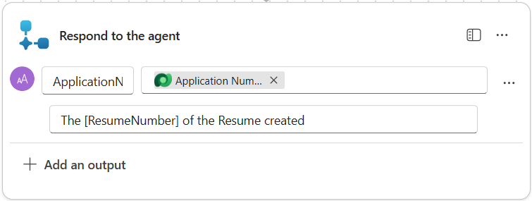

1. **ذخیره پیش‌نویس** را در بالا سمت راست انتخاب کنید.

1. برگه **نمای کلی** را انتخاب کنید، در پنل **جزئیات** روی **ویرایش** کلیک کنید.

      - **نام جریان**:`Create Job Application`
      - **توضیحات**:`ایجاد یک درخواست شغلی جدید با ارائه [ResumeNumber] و [JobRoleNumber]`
      - **ذخیره**

1. دوباره برگه **طراح** را انتخاب کنید و روی **انتشار** کلیک کنید.

### 8.5 افزودن ایجاد درخواست شغلی به نماینده

اکنون جریان منتشر شده را به نماینده پذیرش درخواست خود متصل خواهید کرد.

1. به **نماینده استخدام** بازگردید و برگه **نمایندگان** را انتخاب کنید. **نماینده پذیرش درخواست** را باز کنید و سپس پنل **ابزارها** را پیدا کنید.

1. **+ افزودن** را انتخاب کنید.

1. فیلتر **جریان** را انتخاب کنید و `Create Job Application` را جستجو کنید. جریان **Create Job Application** را انتخاب کنید و سپس **افزودن و پیکربندی** را انتخاب کنید.

1. پارامترهای زیر را تنظیم کنید:

    | پارامتر                                           | مقدار                                                        |
    | --------------------------------------------------- | ------------------------------------------------------------ |
    | **توضیحات**                                     | `ایجاد یک درخواست شغلی جدید با ارائه [ResumeNumber] و [JobRoleNumber]` |
    | **جزئیات اضافی → زمانی که این ابزار ممکن است استفاده شود** | `فقط زمانی که توسط موضوعات یا نمایندگان ارجاع داده شود`                   |

1. **ذخیره** را انتخاب کنید  
    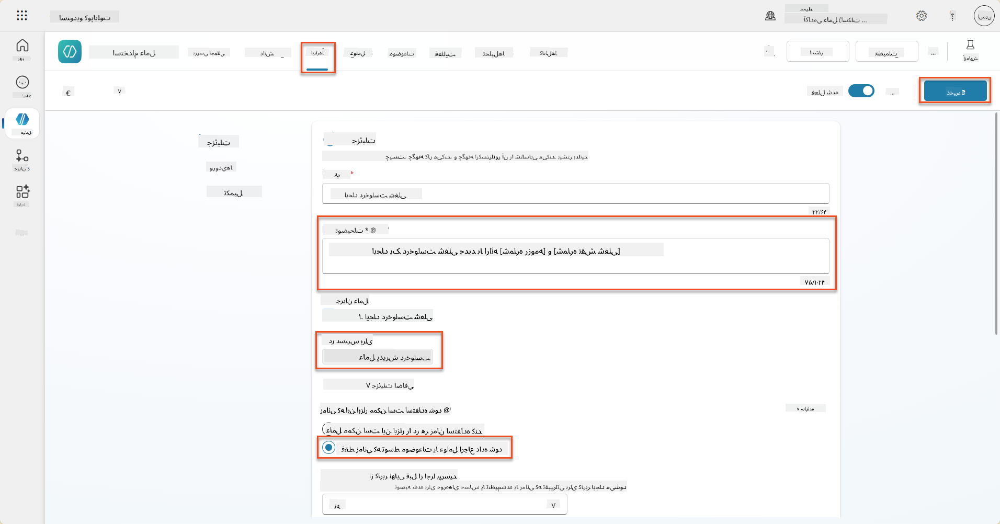

### 8.6 تعریف دستورالعمل‌های نماینده

برای ایجاد درخواست‌های شغلی، باید به نماینده بگویید که چه زمانی از ابزار جدید استفاده کند. در این مورد، از کاربر می‌خواهید تأیید کند که به کدام نقش‌های شغلی پیشنهادی درخواست دهد و به نماینده دستور می‌دهید که ابزار را برای هر نقش اجرا کند.

1. به **نماینده پذیرش درخواست** بازگردید و سپس پنل **دستورالعمل‌ها** را پیدا کنید.

1. در فیلد **دستورالعمل‌ها**، **دستورالعمل‌های واضح زیر را به انتهای دستورالعمل‌های موجود** اضافه کنید:

    ```text
    3. Post Resume Upload
       - Respond with a formatted bullet list of [SuggestedJobRoles] the candidate could apply for.  
       - Use the format: [JobRoleNumber] - [RoleDescription]
       - Ask the user to confirm which Job Roles to create applications for the candidate.
       - When the user has confirmed a set of [JobRoleNumber]s, move to the next step.
    
    4. Post Upload - Application Creation
        - After the user confirms which [SuggestedJobRoles] for a specific [ResumeNumber]:
        E.g. "Apply [ResumeNumber] for the Job Roles [JobRoleNumber], [JobRoleNumber], [JobRoleNumber]
        E.g. "apply to all suggested job roles" - this implies use all the [JobRoleNumbers] 
         - Loop over each [JobRoleNumber] and send with [ResumeNumber] to /Create Job Application   
         - Summarize the Job Applications Created
    
    Strict Rules (that must never be broken)
    You must always follow these rules and never break them:
    1. The only valid identifiers are:
      - ResumeNumber (ppa_resumenumber)→ format R#####
      - CandidateNumber (ppa_candidatenumber)→ format C#####
      - ApplicationNumber (ppa_applicationnumber)→ format A#####
      - JobRoleNumber (ppa_jobrolenumber)→ format J#####
    2. Never guess or invent these values.
    3. Always extract identifiers from the current context (conversation, data, or system output). 
    ```

1. جایی که دستورالعمل‌ها شامل یک اسلش (/) هستند، متن پس از / را انتخاب کنید و ابزار **Create Job Application** را انتخاب کنید.

1. **ذخیره** را انتخاب کنید  
    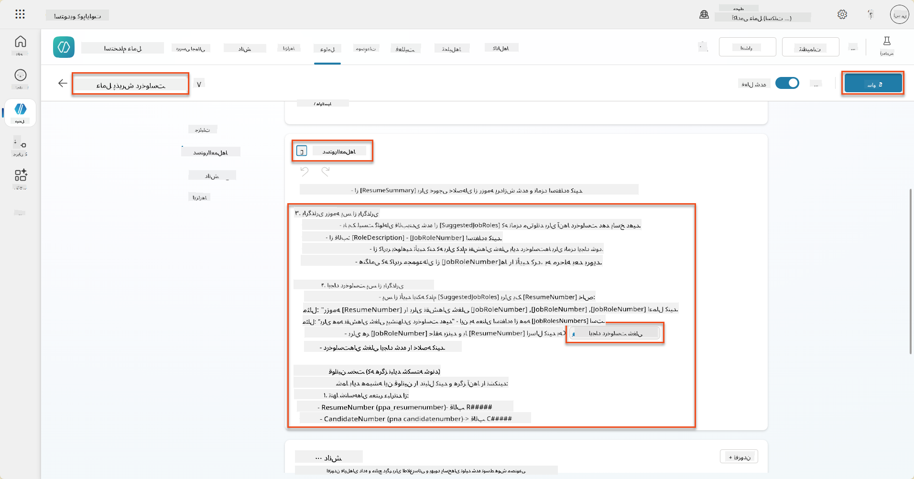

!!! tip "تکرار بر روی آیتم‌های متعدد در ارکستراسیون مولد"
    این دستورالعمل‌ها از توانایی ارکستراسیون مولد برای تکرار بر روی چندین ردیف هنگام تصمیم‌گیری درباره مراحل و ابزارهای مورد استفاده بهره می‌برند. نقش‌های شغلی مطابقت داده شده به طور خودکار خوانده می‌شوند و نماینده پذیرش درخواست برای هر ردیف اجرا خواهد شد. به دنیای جادویی ارکستراسیون مولد خوش آمدید!

### 8.7 آزمایش نماینده خود

1. **نماینده استخدام** خود را در Copilot Studio باز کنید.

1. یک رزومه نمونه را در چت **آپلود** کنید و تایپ کنید:

    ```text
    This is a new resume for the Power Platform Developer Role.
    ```

1. توجه کنید که نماینده لیستی از نقش‌های شغلی پیشنهادی را ارائه می‌دهد - هر کدام با شماره نقش شغلی.  
    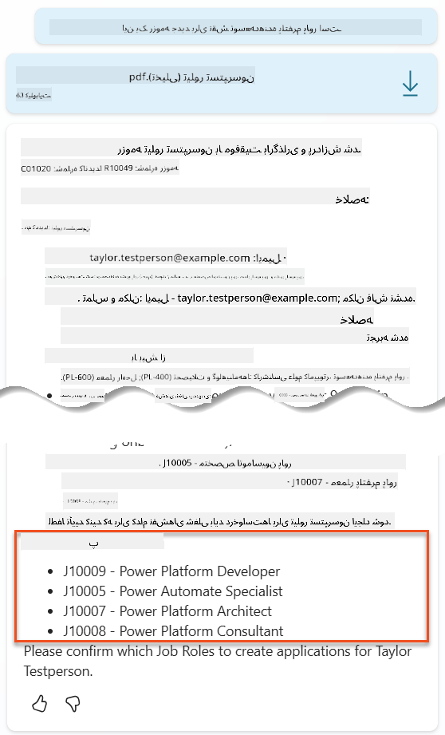

1. سپس می‌توانید مشخص کنید که کدام یک از این‌ها را می‌خواهید رزومه به عنوان درخواست شغلی اضافه شود.
    **نمونه‌ها:**

    ```text
    "Apply for all of those job roles"
    "Apply for the J10009 Power Platform Developer role"
    "Apply for the Developer and Architect roles"
    ```

    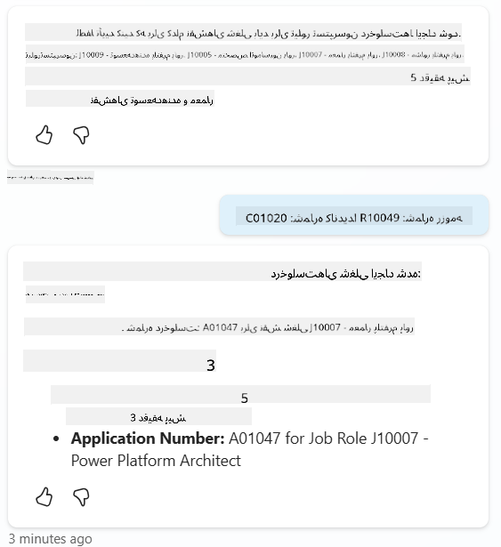

1. ابزار **Create Job Application** سپس برای هر نقش شغلی که مشخص کرده‌اید اجرا خواهد شد. داخل نقشه فعالیت، خواهید دید که ابزار Create Job Application برای هر یک از نقش‌های شغلی که درخواست ایجاد کرده‌اید اجرا می‌شود:  
    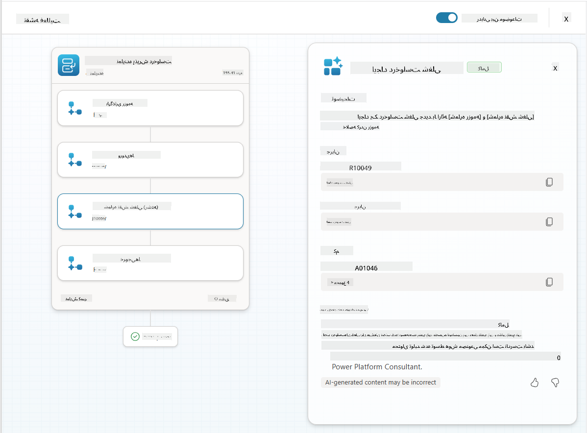

## 🎉 مأموریت کامل شد

کار فوق‌العاده‌ای انجام دادید، اپراتور! **عملیات کنترل زمین** اکنون کامل شد. شما با موفقیت قابلیت‌های هوش مصنوعی خود را با داده‌های پویا تقویت کردید و یک سیستم استخدام هوشمند واقعی ایجاد کردید.

آنچه در این مأموریت به دست آوردید:

**✅ تسلط بر اتصال به Dataverse**  
اکنون می‌دانید چگونه درخواست‌های سفارشی را به منابع داده زنده برای هوش پویا متصل کنید.

**✅ تحلیل رزومه پیشرفته**  
جریان خلاصه‌سازی رزومه شما اکنون به داده‌های نقش شغلی و معیارهای ارزیابی واقعی دسترسی دارد برای تطابق دقیق.

**✅ تصمیم‌گیری مبتنی بر داده**  
نمایندگان استخدام شما اکنون می‌توانند به طور خودکار با تغییر نیازهای شغلی سازگار شوند بدون نیاز به به‌روزرسانی دستی درخواست‌ها.

**✅ ایجاد درخواست شغلی**  
سیستم پیشرفته شما اکنون می‌تواند درخواست‌های شغلی ایجاد کند و آماده است برای ارکستراسیون جریان‌های کاری پیچیده‌تر.

🚀 **مأموریت بعدی:** در مأموریت بعدی، یاد خواهید گرفت که چگونه قابلیت‌های استدلال عمیق را پیاده‌سازی کنید که به نمایندگان شما کمک می‌کند تصمیمات پیچیده بگیرند و توضیحات دقیقی برای توصیه‌های خود ارائه دهند.

⏩ [حرکت به مأموریت 09: استدلال عمیق](../09-deep-reasoning/README.md)

## 📚 منابع تاکتیکی

📖 [استفاده از داده‌های خود در یک درخواست](https://learn.microsoft.com/ai-builder/use-your-own-prompt-data?WT.mc_id=power-182762-scottdurow)

📖 [ایجاد یک درخواست سفارشی](https://learn.microsoft.com/ai-builder/create-a-custom-prompt?WT.mc_id=power-182762-scottdurow)

📖 [کار با Dataverse در Copilot Studio](https://learn.microsoft.com/microsoft-copilot-studio/knowledge-add-dataverse?WT.mc_id=power-182762-scottdurow)

📖 [مروری بر درخواست‌های سفارشی AI Builder](https://learn.microsoft.com/ai-builder/prompts-overview?WT.mc_id=power-182762-scottdurow)

📖 [مستندات AI Builder در Power Platform](https://learn.microsoft.com/ai-builder/?WT.mc_id=power-182762-scottdurow)

📖 [آموزش: ایجاد درخواست‌های AI Builder با استفاده از داده‌های Dataverse خود](https://learn.microsoft.com/training/modules/ai-builder-grounded-prompts/?WT.mc_id=power-182762-scottdurow)

---

**سلب مسئولیت**:  
این سند با استفاده از سرویس ترجمه هوش مصنوعی [Co-op Translator](https://github.com/Azure/co-op-translator) ترجمه شده است. در حالی که ما تلاش می‌کنیم دقت را حفظ کنیم، لطفاً توجه داشته باشید که ترجمه‌های خودکار ممکن است شامل خطاها یا نادرستی‌ها باشند. سند اصلی به زبان اصلی آن باید به عنوان منبع معتبر در نظر گرفته شود. برای اطلاعات حیاتی، ترجمه حرفه‌ای انسانی توصیه می‌شود. ما مسئولیتی در قبال سوء تفاهم‌ها یا تفسیرهای نادرست ناشی از استفاده از این ترجمه نداریم.