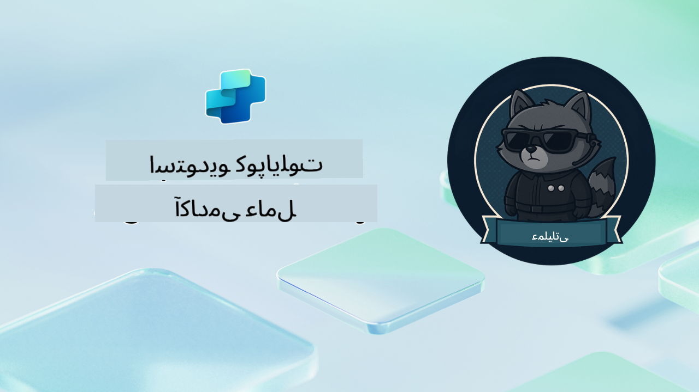

<!--
CO_OP_TRANSLATOR_METADATA:
{
  "original_hash": "24fcbe9a57d3439e05f8866e550c0a84",
  "translation_date": "2025-10-21T17:36:43+00:00",
  "source_file": "docs/operative-preview/README.md",
  "language_code": "fa"
}
-->
# خوش آمدید، مأمور

**خوش آمدید، مأمور.**  
ماموریت پیشرفته شما—اگر تصمیم به پذیرش آن دارید—تسلط بر هنر ساخت **سیستم‌های چند مأموری در سطح سازمانی** با استفاده از **Microsoft Copilot Studio** است.

این آموزش فشرده شما را فراتر از ایجاد مأمورهای پایه به دنیای پیچیده **هماهنگی چند مأموری** می‌برد: از خودکارسازی فرآیندهای استخدام تا ایمنی هوش مصنوعی، شما یاد خواهید گرفت که چگونه اکوسیستم‌های هوشمند مأمور را با استفاده از سناریوهای واقعی سازمانی بسازید، هماهنگ کنید و مستقر کنید.

--8<-- "disclaimer.md"

---

## 🎯 هدف مأموریت

با تکمیل برنامه آکادمی مأمور، شما قادر خواهید بود:

- طراحی و پیاده‌سازی **سیستم‌های چند مأموری** برای سناریوهای پیچیده کسب‌وکار
- تسلط بر **هماهنگی مأمورها** و الگوهای همکاری
- پیاده‌سازی **ایمنی هوش مصنوعی و تعدیل محتوا** در سیستم‌های تولیدی
- ساخت **پرامپت‌های چند حالته** برای پردازش و تحلیل اسناد
- استقرار **مأمورهای آماده سازمانی** با حاکمیت و آزمایش مناسب

---

## 🧪 پیش‌نیازها

برای تکمیل تمام مأموریت‌ها، شما نیاز دارید به:

- تکمیل آموزش **Agent Academy Recruit**
- یک محیط Microsoft Power Platform با مجوز **Copilot Studio**
- دسترسی به **Microsoft Dataverse**
- مجوزهای مدیریتی برای ایجاد راه‌حل‌ها و مأمورها

---

## 🧬 مخاطبان این دوره

این دوره پیشرفته مناسب است برای:

- **معماران راه‌حل** که سیستم‌های هوش مصنوعی سازمانی طراحی می‌کنند
- **توسعه‌دهندگان** که راه‌حل‌های مأمور آماده تولید می‌سازند
- **متخصصان IT** که حاکمیت و ایمنی هوش مصنوعی را اجرا می‌کنند
- **تحلیلگران کسب‌وکار** که جریان‌های کاری خودکار پیچیده ایجاد می‌کنند
- هر کسی که آماده است از مأمورهای پایه به سیستم‌های سازمانی **ارتقا یابد**

---

## 🧭 مرور برنامه آموزشی

این آکادمی به صورت یک سری عملیات میدانی پیش‌رونده ساختار یافته است—هر مأموریت بر اساس مأموریت قبلی ساخته می‌شود تا یک سیستم جامع خودکارسازی استخدام ایجاد کند.

| مأموریت | عنوان | خلاصه عملیات |
|---------|-------|-------------------|
| `01` | 🚨 [شروع کار با مأمور استخدام](./01-get-started/README.md) | زیرساخت‌های پایه را مستقر کنید و مأمور هماهنگ‌کننده مرکزی خود را ایجاد کنید |
| `02` | 🎭 [آماده‌سازی مأمور برای چند مأموری با مأمورهای متصل](./02-multi-agent/README.md) | تبدیل مأمور تک‌نفره به سیستم هماهنگ چند مأموری |
| `03` | ⚡ [خودکارسازی مأمور با Triggerها](./03-automate-triggers/README.md) | پیاده‌سازی رفتارهای خودمختار مأمور با Triggerهای مبتنی بر رویداد |
| `04` | 📝 [نوشتن دستورالعمل‌های مأمور](./04-agent-instructions/README.md) | تسلط بر ارتباط دقیق مأمور و کنترل رفتار |
| `05` | 💬 [شخصی‌سازی پاسخ‌های مأمور](./05-agent-responses/README.md) | سفارشی‌سازی پاسخ‌های مأمور برای تأثیر و تعامل حداکثری |
| `06` | 🛡️ [اصول تعدیل محتوا و ایمنی هوش مصنوعی](./06-ai-safety/README.md) | پیاده‌سازی اقدامات ایمنی و انطباق در سطح سازمانی |
| `07` | 🎨 [استخراج محتوای رزومه با پرامپت‌های چند حالته](./07-multimodal-prompts/README.md) | پردازش اسناد و تصاویر با قابلیت‌های پیشرفته هوش مصنوعی |
| `08` | 🗄️ [پرامپت‌ها - اتصال به Dataverse](./08-dataverse-grounding/README.md) | اتصال مأمورها به داده‌های سازمانی برای پاسخ‌های دقیق |
| `09` | 🧠 [استفاده از استدلال عمیق برای ارزیابی تناسب کاندیدا و آماده‌سازی مصاحبه](./09-deep-reasoning/README.md) | پیاده‌سازی استدلال هوش مصنوعی پیشرفته برای تصمیم‌گیری‌های پیچیده |
| `10` | 📄 [ایجاد اسناد مصاحبه خاص کاندیدا با پرامپت‌ها](./10-generate-documents/README.md) | ایجاد اسناد پویا بر اساس تحلیل مأمور |
| `11` | 📊 [دریافت بازخورد کاربران با کارت‌های تطبیقی](./11-obtain-user-feedback/README.md) | جمع‌آوری و پردازش بازخورد کاربران برای بهبود مستمر |
| `12` | 🌐 [انتشار مأمورهای خود در یک وب‌سایت نمایشی برای آزمایش ذینفعان](./12-demo-website/README.md) | استقرار راه‌حل کامل برای نمایش و آزمایش ذینفعان |

!!! note
    ✅ با تکمیل این برنامه آموزشی، نشان **Operative** را کسب خواهید کرد.  
    🔓 **Commander** در مراحل آینده باز خواهد شد.

<!-- markdownlint-disable-next-line MD033 -->

---

**سلب مسئولیت**:  
این سند با استفاده از سرویس ترجمه هوش مصنوعی [Co-op Translator](https://github.com/Azure/co-op-translator) ترجمه شده است. در حالی که ما تلاش می‌کنیم دقت را حفظ کنیم، لطفاً توجه داشته باشید که ترجمه‌های خودکار ممکن است شامل خطاها یا نادرستی‌ها باشند. سند اصلی به زبان اصلی آن باید به عنوان منبع معتبر در نظر گرفته شود. برای اطلاعات حیاتی، ترجمه حرفه‌ای انسانی توصیه می‌شود. ما مسئولیتی در قبال سوء تفاهم‌ها یا تفسیرهای نادرست ناشی از استفاده از این ترجمه نداریم.