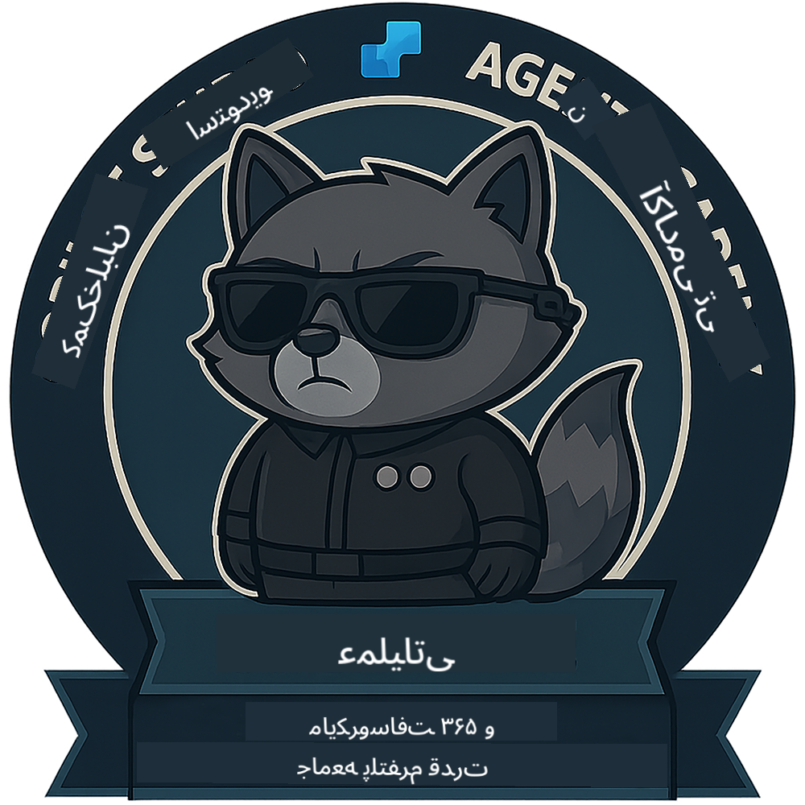

<!--
CO_OP_TRANSLATOR_METADATA:
{
  "original_hash": "1c5c8f18a1c1ec8fcbbb271403cf2ac6",
  "translation_date": "2025-10-21T19:10:32+00:00",
  "source_file": "docs/operative/README.md",
  "language_code": "fa"
}
-->
---
hide:
- navigation
---

# عملیاتی (به زودی)

این دوره هنوز بسیار محرمانه است. در آینده باز خواهد شد! 🔓

{ width="300" }

<!-- markdownlint-disable-next-line MD033 -->

---

**سلب مسئولیت**:  
این سند با استفاده از سرویس ترجمه هوش مصنوعی [Co-op Translator](https://github.com/Azure/co-op-translator) ترجمه شده است. در حالی که ما تلاش می‌کنیم دقت را حفظ کنیم، لطفاً توجه داشته باشید که ترجمه‌های خودکار ممکن است شامل خطاها یا نادرستی‌ها باشند. سند اصلی به زبان اصلی آن باید به عنوان منبع معتبر در نظر گرفته شود. برای اطلاعات حیاتی، ترجمه حرفه‌ای انسانی توصیه می‌شود. ما مسئولیتی در قبال سوء تفاهم‌ها یا تفسیرهای نادرست ناشی از استفاده از این ترجمه نداریم.