<!--
CO_OP_TRANSLATOR_METADATA:
{
  "original_hash": "d9cd8cd1a4fbd8915171a2ed972cc322",
  "translation_date": "2025-10-21T19:08:55+00:00",
  "source_file": "docs/recruit/00-course-setup/README.md",
  "language_code": "fa"
}
-->
# 🚨 مأموریت ۰۰: تنظیم دوره

## 🕵️‍♂️ نام رمز: `عملیات آماده‌سازی برای استقرار`

> **⏱️ زمان عملیات:** `~۳۰ دقیقه`  

## 🎯 خلاصه مأموریت

به اولین مأموریت آموزش خود به عنوان یک عامل استودیو کوپایلوت خوش آمدید.  
قبل از اینکه بتوانید اولین عامل هوش مصنوعی خود را بسازید، باید محیط توسعه‌ای آماده برای کار خود را ایجاد کنید.

این خلاصه شامل سیستم‌ها، اطلاعات دسترسی و مراحل تنظیم مورد نیاز برای فعالیت موفق در اکوسیستم Microsoft 365 است.

## 🔎 اهداف

مأموریت شما شامل موارد زیر است:

1. دریافت یک حساب کاربری Microsoft 365  
1. دسترسی به Microsoft Copilot Studio  
1. (اختیاری) دریافت مجوز Microsoft 365 Copilot برای انتشار در محیط تولید  
1. ایجاد یک محیط توسعه به عنوان محیط Copilot Studio برای ساخت و توسعه  
1. ایجاد یک سایت SharePoint به عنوان منبع داده برای مأموریت‌های بعدی  

---

## 🔍 پیش‌نیازها

قبل از شروع، مطمئن شوید که موارد زیر را دارید:

1. یک **آدرس ایمیل کاری یا تحصیلی** (آدرس‌های شخصی مانند @outlook.com، @gmail.com و غیره پشتیبانی نمی‌شوند).  
1. دسترسی به اینترنت و یک مرورگر مدرن (Edge، Chrome یا Firefox توصیه می‌شود).  
1. آشنایی ابتدایی با Microsoft 365 (مانند ورود به برنامه‌های Office یا Teams).  
1. (اختیاری) کارت اعتباری یا روش پرداخت در صورتی که قصد خرید مجوزهای پولی را دارید.

---

## مرحله ۱: دریافت حساب کاربری Microsoft 365

استودیو کوپایلوت در Microsoft 365 قرار دارد، بنابراین برای دسترسی به آن نیاز به یک حساب کاربری Microsoft 365 دارید. می‌توانید از حساب موجود خود استفاده کنید یا مراحل زیر را برای دریافت مجوز مناسب دنبال کنید:

1. **دریافت اشتراک پولی Microsoft 365 Business**  
   1. به [صفحه برنامه‌ها و قیمت‌گذاری Microsoft 365 Business](https://www.microsoft.com/microsoft-365/business/microsoft-365-plans-and-pricing) بروید.  
   1. ارزان‌ترین گزینه برای شروع، برنامه Microsoft 365 Business Basic است. گزینه `Try for free` را انتخاب کنید و فرم راهنمایی را برای تکمیل جزئیات اشتراک، اطلاعات حساب و پرداخت دنبال کنید.  
   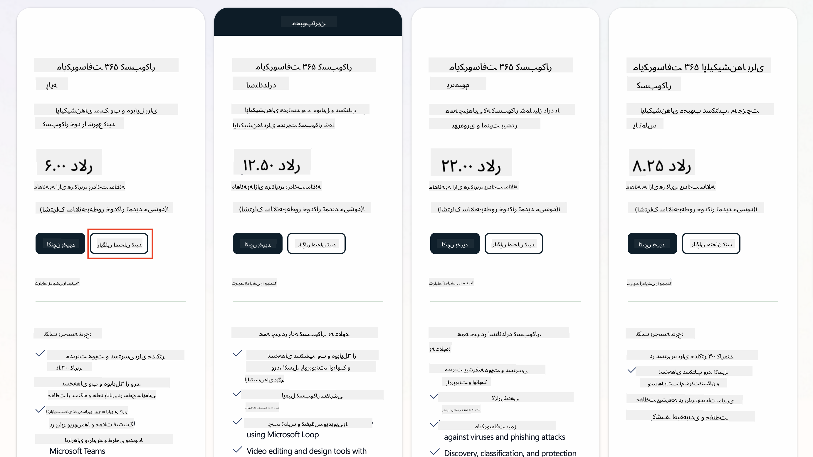  
   1. پس از دریافت حساب جدید، وارد شوید.

    !!! Tip
        اگر قصد دارید عوامل را در Microsoft 365 Copilot Chat منتشر کنید یا به داده‌های سازمانی (SharePoint، OneDrive، Dataverse) متصل شوید، نیاز به مجوز Microsoft 365 Copilot دارید. این یک مجوز اضافی است که می‌توانید اطلاعات بیشتر را [در سایت مجوزها](https://www.microsoft.com/microsoft-365/copilot#plans) بیابید.

---

## مرحله ۲: شروع آزمایشی Copilot Studio

پس از دریافت Tenant Microsoft 365، باید به Copilot Studio دسترسی پیدا کنید. می‌توانید یک آزمایش رایگان ۳۰ روزه را با مراحل زیر شروع کنید:

1. به [aka.ms/TryCopilotStudio](https://aka.ms/TryCopilotStudio) بروید.  
1. آدرس ایمیل حساب جدیدی که در مرحله قبل تنظیم کرده‌اید را وارد کنید و گزینه `Next` را انتخاب کنید.  
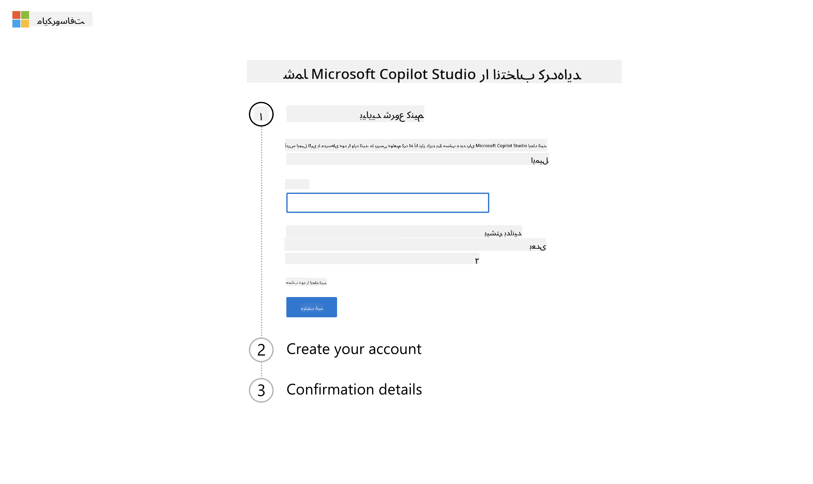  
1. باید حساب شما را شناسایی کند. گزینه `Sign In` را انتخاب کنید.  
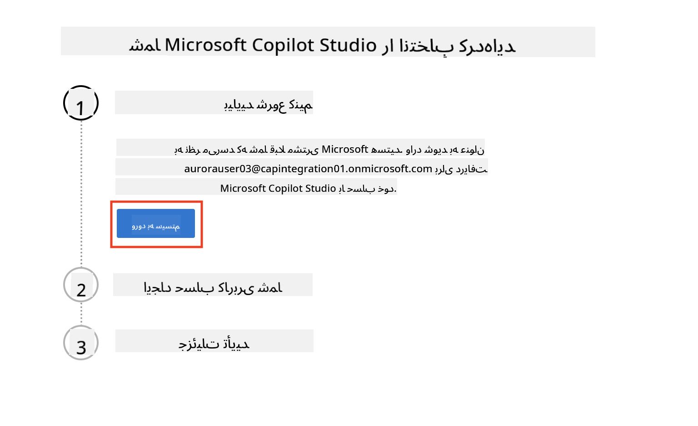  
1. گزینه `Start Free Trial` را انتخاب کنید.  
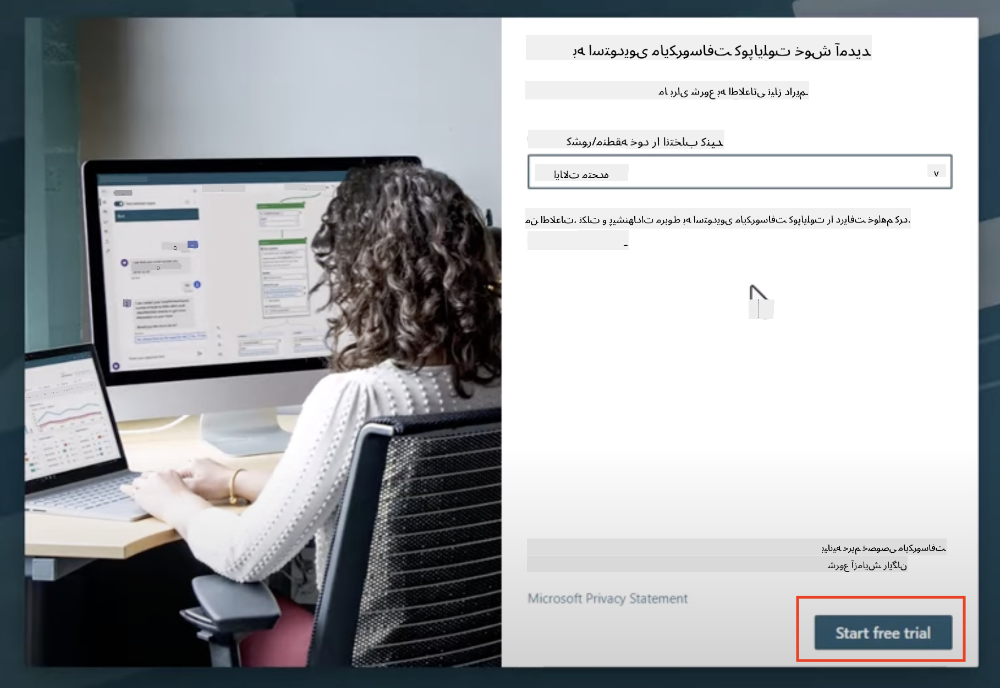  

!!! info "یادداشت‌های آزمایشی"  
     1. آزمایش رایگان قابلیت‌های کامل Copilot Studio را فراهم می‌کند.  
     1. شما ایمیل‌هایی درباره انقضای آزمایش خود دریافت خواهید کرد. می‌توانید آزمایش را در بازه‌های ۳۰ روزه تمدید کنید (تا ۹۰ روز زمان اجرا برای عامل‌ها).  
     1. اگر مدیر Tenant شما ثبت‌نام خودکار را غیرفعال کرده باشد، خطا مشاهده خواهید کرد—با مدیر Microsoft 365 خود تماس بگیرید تا آن را دوباره فعال کند.

---

## مرحله ۳: ایجاد محیط توسعه جدید

### ثبت‌نام برای برنامه توسعه‌دهنده Power Apps

با استفاده از همان Tenant Microsoft 365 در مرحله ۱، برای برنامه توسعه‌دهنده Power Apps ثبت‌نام کنید تا یک محیط توسعه رایگان برای ساخت و آزمایش با Copilot Studio ایجاد کنید.

1. در [وب‌سایت برنامه توسعه‌دهنده Power Apps](https://aka.ms/PowerAppsDevPlan) ثبت‌نام کنید.

    - آدرس ایمیل خود را وارد کنید  
    - کادر را علامت بزنید  
    - گزینه **Start free** را انتخاب کنید  

    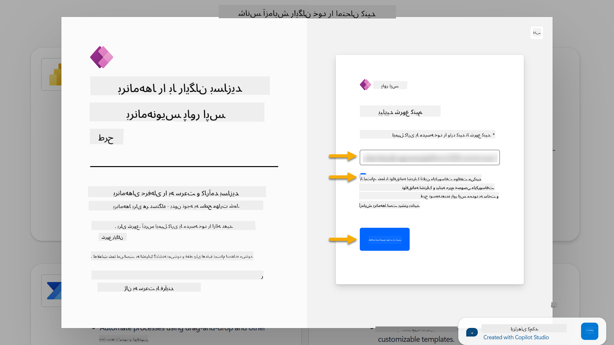

1. پس از ثبت‌نام برای برنامه توسعه‌دهنده، به [Power Apps](https://make.powerapps.com/) هدایت خواهید شد. محیط از نام شما استفاده می‌کند، به عنوان مثال **محیط Adele Vance**. اگر قبلاً محیطی با این نام وجود داشته باشد، محیط جدید توسعه‌دهنده به نام **محیط Adele Vance (1)** نام‌گذاری می‌شود.

    از این محیط توسعه‌دهنده در Copilot Studio هنگام تکمیل آزمایش‌ها استفاده کنید.

!!! Note
    اگر از حساب Microsoft 365 موجود خود استفاده می‌کنید و در مرحله ۱ حساب جدیدی ایجاد نکرده‌اید، به عنوان مثال - از حساب خود در سازمان کاری خود استفاده می‌کنید، ممکن است تیم مدیر IT شما (یا معادل آن) که Tenant/محیط‌ها را مدیریت می‌کند، فرآیند ثبت‌نام را غیرفعال کرده باشد. در این صورت، لطفاً با مدیر خود تماس بگیرید یا یک Tenant آزمایشی طبق مرحله ۱ ایجاد کنید.

---

## مرحله ۴: ایجاد سایت جدید SharePoint

یک سایت جدید SharePoint باید ایجاد شود که در [درس ۰۶ - ایجاد یک عامل سفارشی با استفاده از تجربه ایجاد مکالمه با Copilot و اتصال آن به داده‌های شما](../06-create-agent-from-conversation/README.md#62-add-an-internal-knowledge-source-using-a-sharepoint-site) استفاده خواهد شد.

1. نماد وافل را در سمت چپ بالای Microsoft Copilot Studio انتخاب کنید تا منو را مشاهده کنید. SharePoint را از منو انتخاب کنید.

    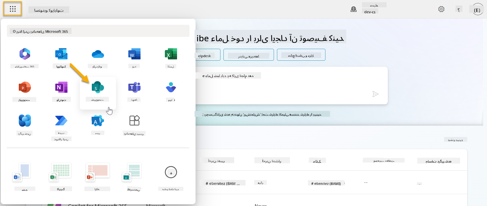

1. SharePoint بارگذاری خواهد شد. گزینه **+ Create site** را برای ایجاد یک سایت جدید SharePoint انتخاب کنید.

    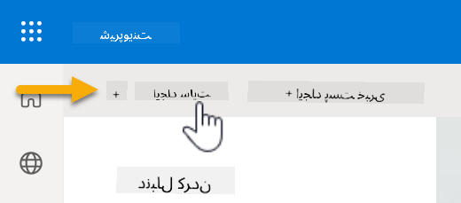

1. یک کادر محاوره‌ای ظاهر خواهد شد تا شما را در ایجاد یک سایت جدید SharePoint راهنمایی کند. گزینه **Team site** را انتخاب کنید.

    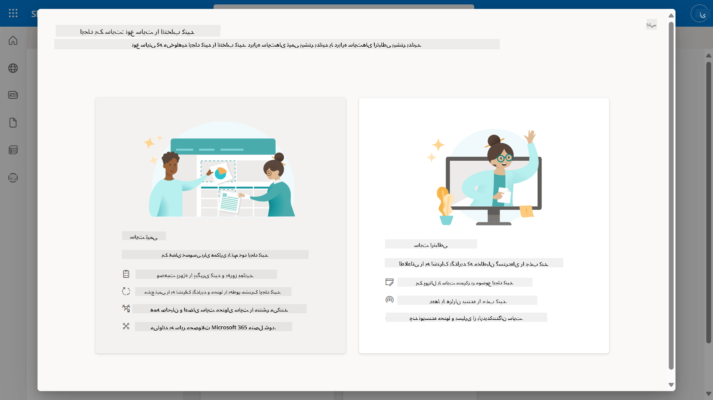

1. در مرحله بعد، لیستی از قالب‌های Microsoft به طور پیش‌فرض بارگذاری خواهد شد. به پایین اسکرول کنید و قالب **IT help desk** را انتخاب کنید.

    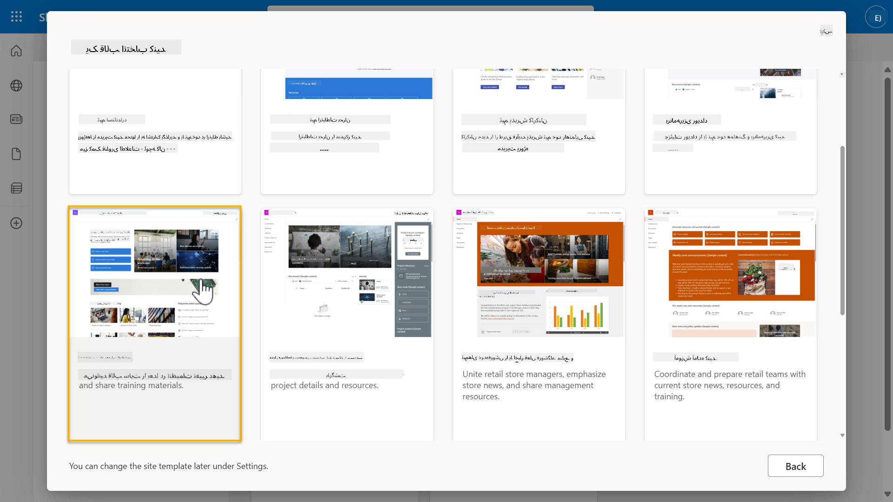

1. گزینه **Use template** را برای ایجاد یک سایت جدید SharePoint با استفاده از قالب میز کمک IT انتخاب کنید.

    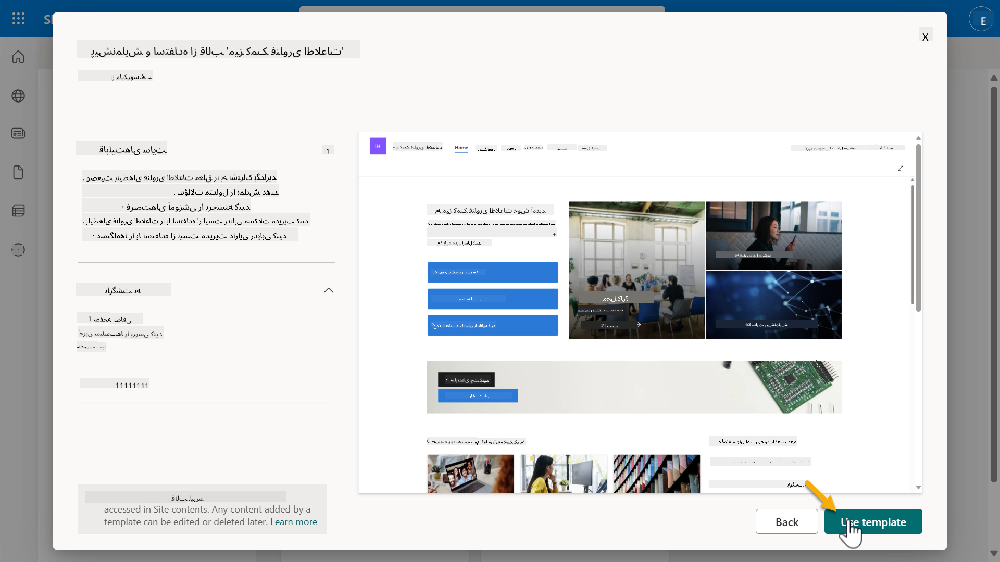

1. اطلاعات سایت خود را وارد کنید. مثال زیر را مشاهده کنید:

    | فیلد | مقدار |
    | --- | --- |
    | نام سایت | Contoso IT |
    | توضیحات سایت | Copilot Studio برای مبتدیان |
    | آدرس سایت | ContosoIT |

    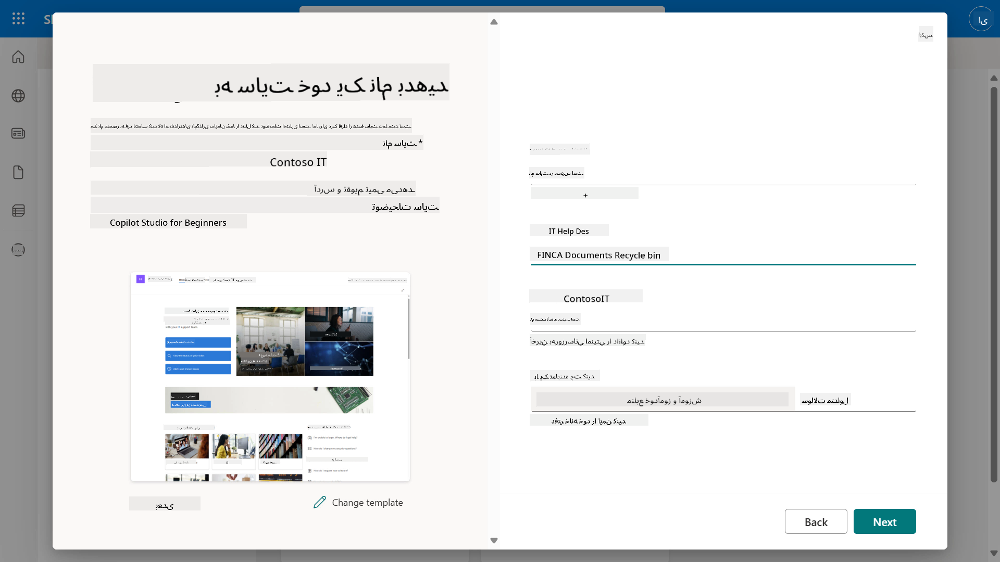

1. در مرحله نهایی، می‌توانید زبان سایت SharePoint را انتخاب کنید. به طور پیش‌فرض زبان **انگلیسی** خواهد بود. زبان را به **انگلیسی** بگذارید و گزینه **Create site** را انتخاب کنید.

    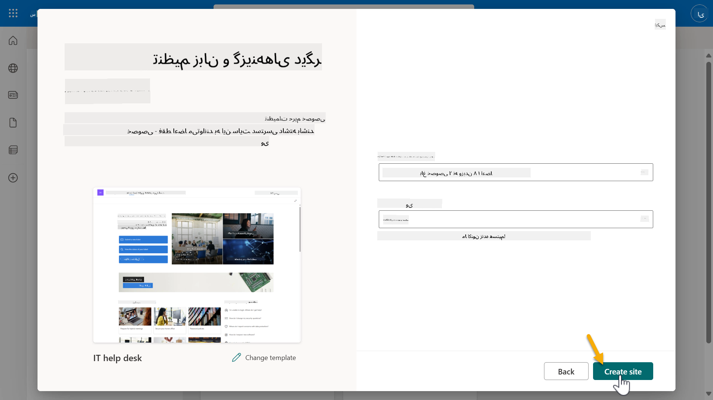

1. سایت SharePoint برای چند ثانیه آماده خواهد شد. در این مدت، می‌توانید انتخاب کنید که کاربران دیگر را به سایت خود اضافه کنید با وارد کردن آدرس ایمیل آن‌ها در فیلد **Add members**. پس از تکمیل، گزینه **Finish** را انتخاب کنید.

    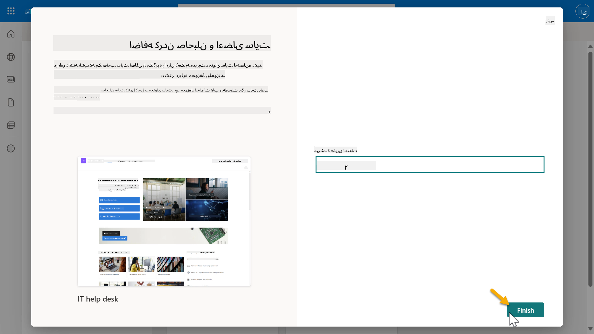

1. صفحه اصلی سایت SharePoint بارگذاری خواهد شد. **آدرس URL سایت SharePoint** را کپی کنید.

1. این قالب صفحات با داده‌های نمونه درباره سیاست‌های مختلف IT و دو لیست نمونه (Tickets و Devices) ارائه می‌دهد.

### استفاده از لیست SharePoint Devices

ما از لیست **Devices** در [مأموریت ۰۷ - افزودن موضوع جدید با محرک و گره‌ها](../07-add-new-topic-with-trigger/README.md#73-add-a-tool-using-a-connector) استفاده خواهیم کرد.

### افزودن ستون جدید

به سمت راست لیست اسکرول کنید و دکمه **+ Add column** را انتخاب کنید. نوع **hyperlink** را انتخاب کنید، **Image** را به عنوان نام ستون وارد کنید و گزینه افزودن را انتخاب کنید.

### ایجاد داده‌های نمونه در لیست SharePoint Devices

شما باید مطمئن شوید که این لیست را با حداقل ۴ آیتم داده نمونه پر کنید و یک ستون اضافی به این لیست اضافه کنید.  

هنگام افزودن داده‌های نمونه، مطمئن شوید که فیلدهای زیر پر شده‌اند:

- عکس دستگاه - از تصاویر موجود در [پوشه تصاویر دستگاه](https://github.com/microsoft/agent-academy/tree/main/docs/recruit/00-course-setup/images/device-images) استفاده کنید  
- عنوان  
- وضعیت  
- سازنده  
- مدل  
- نوع دارایی  
- رنگ  
- شماره سریال  
- تاریخ خرید  
- قیمت خرید  
- شماره سفارش  
- تصویر - از لینک‌های زیر استفاده کنید  

|دستگاه  |URL  |
|---------|---------|
|Surface Laptop 13     | [https://raw.githubusercontent.com/microsoft/agent-academy/refs/heads/main/docs/recruit/00-course-setup/images/device-images/Surface-Laptop-13.png](https://raw.githubusercontent.com/microsoft/agent-academy/refs/heads/main/docs/recruit/00-course-setup/images/device-images/Surface-Laptop-13.png)        |
|Surface Laptop 15     | [https://raw.githubusercontent.com/microsoft/agent-academy/refs/heads/main/docs/recruit/00-course-setup/images/device-images/Surface-Laptop-15.png](https://raw.githubusercontent.com/microsoft/agent-academy/refs/heads/main/docs/recruit/00-course-setup/images/device-images/Surface-Laptop-15.png)        |
|Surface Pro    | [https://raw.githubusercontent.com/microsoft/agent-academy/refs/heads/main/docs/recruit/00-course-setup/images/device-images/Surface-Pro-12.png](https://raw.githubusercontent.com/microsoft/agent-academy/refs/heads/main/docs/recruit/00-course-setup/images/device-images/Surface-Pro-12.png)        |
|Surface Studio    | [https://raw.githubusercontent.com/microsoft/agent-academy/refs/heads/main/docs/recruit/00-course-setup/images/device-images/Surface-Studio.png](https://raw.githubusercontent.com/microsoft/agent-academy/refs/heads/main/docs/recruit/00-course-setup/images/device-images/Surface-Studio.png)        |

---

## ✅ مأموریت کامل شد

شما با موفقیت:

- یک محیط توسعه Microsoft 365 تنظیم کردید  
- آزمایش Copilot Studio خود را فعال کردید  
- یک سایت SharePoint برای اتصال عامل‌ها ایجاد کردید  
- لیست Devices را برای استفاده در مأموریت‌های آینده پر کردید  

شما رسماً آماده شروع **آموزش عامل سطح مبتدی** در [درس ۰۱](../01-introduction-to-agents/README.md) هستید.  

<!-- markdownlint-disable-next-line MD033 -->

---

**سلب مسئولیت**:  
این سند با استفاده از سرویس ترجمه هوش مصنوعی [Co-op Translator](https://github.com/Azure/co-op-translator) ترجمه شده است. در حالی که ما تلاش می‌کنیم دقت را حفظ کنیم، لطفاً توجه داشته باشید که ترجمه‌های خودکار ممکن است شامل خطاها یا نادرستی‌ها باشند. سند اصلی به زبان اصلی آن باید به عنوان منبع معتبر در نظر گرفته شود. برای اطلاعات حیاتی، ترجمه حرفه‌ای انسانی توصیه می‌شود. ما مسئولیتی در قبال سوء تفاهم‌ها یا تفسیرهای نادرست ناشی از استفاده از این ترجمه نداریم.