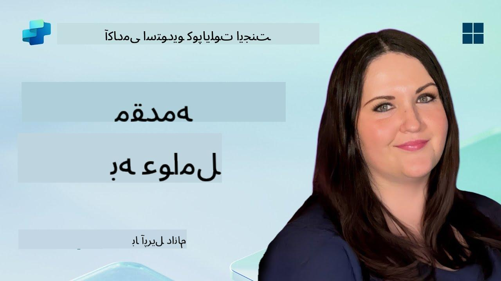

<!--
CO_OP_TRANSLATOR_METADATA:
{
  "original_hash": "d6706e107678264168d77b2e107710b1",
  "translation_date": "2025-10-21T18:29:25+00:00",
  "source_file": "docs/recruit/01-introduction-to-agents/README.md",
  "language_code": "fa"
}
-->
# 🚨 مأموریت ۰۱: معرفی عوامل

## 🕵️‍♂️ نام رمز: `عملیات رمزگشایی عامل هوش مصنوعی`

> **⏱️ زمان عملیات:** `~۳۰ دقیقه – فقط اطلاعات، نیاز به کار میدانی نیست`

🎥 **تماشای راهنما**

## 🎯 خلاصه مأموریت

خوش آمدید، تازه‌وارد. قبل از اینکه وارد ساخت عوامل شویم، باید مفاهیم هوش مصنوعی که آنها را قدرت می‌بخشند به خوبی درک کنید. این مأموریت شما را با دانش پایه‌ای در مورد هوش مصنوعی مکالمه‌ای، مدل‌های زبانی بزرگ (LLMs)، تولید مبتنی بر بازیابی (RAG) و انواع عواملی که می‌توانید در Copilot Studio ایجاد کنید، مجهز می‌کند.

## 🔎 اهداف

در این مأموریت، شما یاد خواهید گرفت:

1. هوش مصنوعی مکالمه‌ای چیست و چرا اهمیت دارد  
1. چگونه مدل‌های زبانی بزرگ (LLMs) تجربه‌های چت را قدرت می‌بخشند  
1. تولید مبتنی بر بازیابی (RAG) چه چیزی به میز می‌آورد  
1. تفاوت بین عوامل مکالمه‌ای و عوامل خودمختار  
1. چگونه عوامل در Copilot Studio از این مفاهیم بهره می‌برند  

بیایید شروع کنیم!

---

## هوش مصنوعی مکالمه‌ای چیست؟

هوش مصنوعی مکالمه‌ای به هر سیستمی اطلاق می‌شود که بتواند زبان انسانی – چه متن و چه گفتار – را به گونه‌ای که طبیعی به نظر برسد، درک، پردازش و پاسخ دهد. به چت‌بات‌ها در میزهای کمک یا دستیاران شخصی مجازی در برنامه‌های مورد علاقه‌تان فکر کنید. در پشت صحنه، بیشتر هوش مصنوعی‌های مکالمه‌ای مدرن به مدل‌های زبانی بزرگ (LLMs) متکی هستند که در ادامه به آنها خواهیم پرداخت.

### چرا اهمیت دارد؟

- **تجربه کاربری:** رابط‌های مکالمه‌ای اغلب از کلیک کردن در منوها شهودی‌تر هستند.  
- **مقیاس‌پذیری:** یک عامل می‌تواند ده‌ها یا صدها مکالمه همزمان را مدیریت کند.  
- **کارایی:** به جای ساخت اسکریپت‌های سفارشی مبتنی بر قوانین، عوامل مبتنی بر LLM به صورت پویا به ورودی کاربر تطبیق می‌یابند.  
- **قابلیت گسترش:** با طراحی مناسب، عوامل می‌توانند به پایگاه‌های دانش دسترسی پیدا کنند، به API‌ها متصل شوند یا به عنوان "همکاران دیجیتال" در جریان‌های کاری تجاری عمل کنند.

---

## مدل‌های زبانی بزرگ (LLMs) ۱۰۱

در قلب بیشتر سیستم‌های هوش مصنوعی مکالمه‌ای، **مدل‌های زبانی بزرگ** قرار دارند – شبکه‌های عصبی که بر روی مجموعه‌های عظیم متنی آموزش دیده‌اند. آنها الگوهای آماری زبان را یاد می‌گیرند تا بتوانند جملات منسجم تولید کنند، به سوالات پاسخ دهند یا حتی ایده‌پردازی کنند. نکات کلیدی برای درک:

1. **داده‌های آموزشی:** LLM‌ها ترابایت‌های متن (صفحات وب، کتاب‌ها، مقالات) را دریافت می‌کنند. این "دانش جهانی" به آنها اجازه می‌دهد در موضوعات مختلف پاسخ دهند.  
1. **توکن‌سازی:** متن به واحدهای کوچکتر به نام توکن‌ها (کلمات، زیرکلمات یا کاراکترها) تقسیم می‌شود. مدل یک توکن را در هر زمان پیش‌بینی می‌کند.  
1. **پنجره زمینه:** هر LLM محدودیتی در تعداد توکن‌هایی که می‌تواند "مشاهده" کند، دارد. فراتر از این محدودیت، توکن‌های قبلی حذف می‌شوند.  
1. **پرامپت‌دهی:** شما با ارسال یک پرامپت با LLM تعامل می‌کنید. هرچه پرامپت شما بهتر باشد، پاسخ متمرکزتر و مرتبط‌تر خواهد بود.  
1. **Zero-shot در مقابل Fine-tuning:** Zero-shot به معنای استفاده از LLM به همان صورت (فقط وزن‌های خام) است. Fine-tuning به معنای تنظیم مدل بر روی داده‌های خاص حوزه است تا برای نیازهای شما دقیق‌تر پاسخ دهد.

!!! Tip "نکته حرفه‌ای"
    یک قیاس رایج این است که LLM مانند یک "تکمیل خودکار فوق‌العاده هوشمند" است. این مدل معنای واقعی را مانند مغز انسان درک نمی‌کند، اما در پیش‌بینی بهترین کلمه (یا عبارت) بعدی در یک دنباله بسیار خوب است.

---

## تولید مبتنی بر بازیابی (RAG)

وقتی LLM‌ها فقط به داده‌های آموزشی ثابت متکی هستند، ممکن است دچار توهم شوند یا قدیمی شوند. RAG این مشکل را با اجازه دادن به مدل برای "جستجوی" اطلاعات جدید قبل از تولید پاسخ حل می‌کند. در سطح بالا، RAG به این صورت کار می‌کند:

1. **پرسش کاربر:** یک کاربر سوالی می‌پرسد (مثلاً، "آخرین اخبار درآمد سه‌ماهه Contoso چیست؟").  
1. **مرحله بازیابی:** سیستم یک منبع دانش (اسناد، پایگاه‌های داده داخلی، کتابخانه‌های SharePoint و غیره) را برای یافتن بخش‌های مرتبط جستجو می‌کند.  
1. **تقویت:** بخش‌های بازیابی شده به پرامپت LLM اضافه یا قبل از آن قرار می‌گیرند.  
1. **تولید:** LLM هم سوال کاربر و هم زمینه بازیابی شده را دریافت می‌کند و سپس پاسخی تولید می‌کند که بر اساس داده‌های به‌روز است.

با RAG، عامل شما می‌تواند به ویکی‌های داخلی شرکت، API‌های افزونه یا پایگاه دانش FAQ مراجعه کند و پاسخ‌هایی ارائه دهد که محدود به پارامترهای مدل منتشر شده ثابت نیستند.

---

## عوامل مکالمه‌ای در مقابل عوامل خودمختار

در زمینه Copilot Studio، اصطلاح **عامل** می‌تواند به انواع مختلفی از دستیارهای هوش مصنوعی اشاره داشته باشد. مفید است که تفاوت بین آنها را بدانید:

**عوامل مکالمه‌ای:**

- عمدتاً بر روی گفتگوی دوطرفه تمرکز دارند.  
- زمینه را در چندین مرحله مکالمه حفظ می‌کنند.  
- معمولاً از طریق جریان‌ها یا محرک‌های از پیش تعریف شده هماهنگ می‌شوند (مثلاً، "اگر کاربر X بگوید، با Y پاسخ دهید").  
- ایده‌آل برای پشتیبانی مشتری، FAQ‌ها، تعاملات هدایت‌شده، زمان‌بندی یا پرسش و پاسخ ساده.  
  - مثال‌ها:  
    - یک چت‌بات Teams که به سوالات سیاست‌های منابع انسانی پاسخ می‌دهد.  
    - یک ربات Power Virtual Agents در یک صفحه SharePoint که کاربران را در پر کردن یک فرم راهنمایی می‌کند.  

**عوامل خودمختار:**

- فراتر از چت دوطرفه عمل می‌کنند؛ آنها می‌توانند **اقداماتی** را به نمایندگی از کاربر انجام دهند.  
- از حلقه‌های استدلال LLM استفاده می‌کنند (مانند "برنامه‌ریزی → اقدام → مشاهده → برنامه‌ریزی مجدد") برای انجام وظایف.  
- به ابزارها یا API‌های خارجی متصل می‌شوند (مثلاً، اجرای یک جریان Power Automate، ارسال دعوت‌نامه‌های تقویم، دستکاری داده‌ها در Dataverse).  
- بدون نیاز به درخواست‌های مداوم انسانی عمل می‌کنند – پس از فعال شدن، می‌توانند فرآیندهای چندمرحله‌ای را به صورت خودمختار مدیریت کنند.  
  - مثال‌ها:  
    - یک عامل که برنامه سفر ایجاد می‌کند، پروازها را رزرو می‌کند و تأییدیه‌ها را ایمیل می‌کند.  
    - یک عامل "خلاصه‌کننده جلسه" که به تماس Teams می‌پیوندد، آن را به صورت زنده رونویسی می‌کند و یک خلاصه اجرایی به OneNote می‌نویسد.  

!!! Info "تفاوت کلیدی"
    عوامل مکالمه‌ای منتظر ورودی کاربر می‌مانند و به گفتگو پایبند هستند. عوامل خودمختار به طور فعال برنامه‌ریزی می‌کنند و یک دنباله‌ای از مراحل را با استفاده از دسترسی گسترده‌تر به ابزارها اجرا می‌کنند.

---

## عوامل در Copilot Studio

**Copilot Studio** سناریوهای مکالمه‌ای و خودمختار را تحت یک چارچوب متحد می‌کند. در اینجا نحوه کمک Copilot Studio به شما برای ساخت عوامل آمده است:

1. **طراح بصری عامل:** یک بوم کم‌کد برای تعریف پرامپت‌ها، حافظه و ابزارها برای هر دو جریان چت و اقدام.  
1. **پیکربندی‌های LLM:** انتخاب از میان مدل‌های مختلف OpenAI یا GPT سطح سازمانی مایکروسافت برای تطبیق نیازهای عملکرد و هزینه شما.  
1. **اتصالات بازیابی:** یکپارچه‌سازی‌های از پیش ساخته شده برای SharePoint، OneDrive، Azure Cognitive Search و Dataverse، که RAG را به صورت آماده ارائه می‌دهند.  
1. **ابزارها و عملکردهای سفارشی:** تعریف اقدامات HTTP سفارشی یا جریان‌های Power Automate که عامل شما می‌تواند به صورت خودمختار فراخوانی کند.  
1. **پشتیبانی چندحالتی:** فراتر از متن، عوامل Copilot Studio می‌توانند تصاویر، فایل‌ها یا داده‌های ساختاریافته را برای غنی‌سازی زمینه دریافت کنند.  
1. **انتشار و توزیع:** هنگامی که عامل شما آماده شد، می‌توانید آن را در Microsoft 365 Copilot منتشر کنید (تا کاربران بتوانند آن را در Teams، SharePoint، Outlook و غیره فراخوانی کنند) یا آن را به عنوان یک ویجت چت مستقل در یک صفحه وب جاسازی کنید.

---

## 🎉 مأموریت به پایان رسید

اکنون معرفی عوامل و مفاهیم پایه‌ای هوش مصنوعی را به پایان رسانده‌اید. شما درک می‌کنید:

1. **LLMs = "مغز" عامل شما**  
   - مسئول درک زبان و تولید محتوا.  
   - توکن‌های بیشتر = زمینه غنی‌تر، اما همچنین هزینه بالاتر در هر فراخوانی.  

1. **RAG = یکپارچه‌سازی دانش در زمان واقعی**  
   - شکاف بین یک LLM ثابت و منابع داده همیشه در حال تغییر را پر می‌کند.  
   - اسناد یا سوابق مرتبط را به پرامپت LLM بازیابی و تزریق می‌کند.  

1. **مکالمه‌ای در مقابل خودمختار**  
   - **مکالمه‌ای:** تمرکز بر جریان گفتگو و حفظ زمینه (مثلاً، "حافظه جلسه").  
   - **خودمختار:** افزودن "بلوک‌های اقدام" که به عامل اجازه می‌دهد به ابزارها یا خدمات خارجی فراخوانی کند.

---
در مرحله بعدی، شما اصول [Copilot Studio](../02-copilot-studio-fundamentals/README.md) را بررسی خواهید کرد!

هوشیار باشید، تازه‌وارد - سفر هوش مصنوعی شما تازه آغاز شده است!

## 📚 منابع تاکتیکی

🔗 [صفحه اصلی مستندات Copilot Studio](https://learn.microsoft.com/microsoft-copilot-studio/)

---

<!-- markdownlint-disable-next-line MD033 -->

---

**سلب مسئولیت**:  
این سند با استفاده از سرویس ترجمه هوش مصنوعی [Co-op Translator](https://github.com/Azure/co-op-translator) ترجمه شده است. در حالی که ما تلاش می‌کنیم دقت را حفظ کنیم، لطفاً توجه داشته باشید که ترجمه‌های خودکار ممکن است شامل خطاها یا نادرستی‌ها باشند. سند اصلی به زبان اصلی آن باید به عنوان منبع معتبر در نظر گرفته شود. برای اطلاعات حیاتی، ترجمه حرفه‌ای انسانی توصیه می‌شود. ما مسئولیتی در قبال سوء تفاهم‌ها یا تفسیرهای نادرست ناشی از استفاده از این ترجمه نداریم.