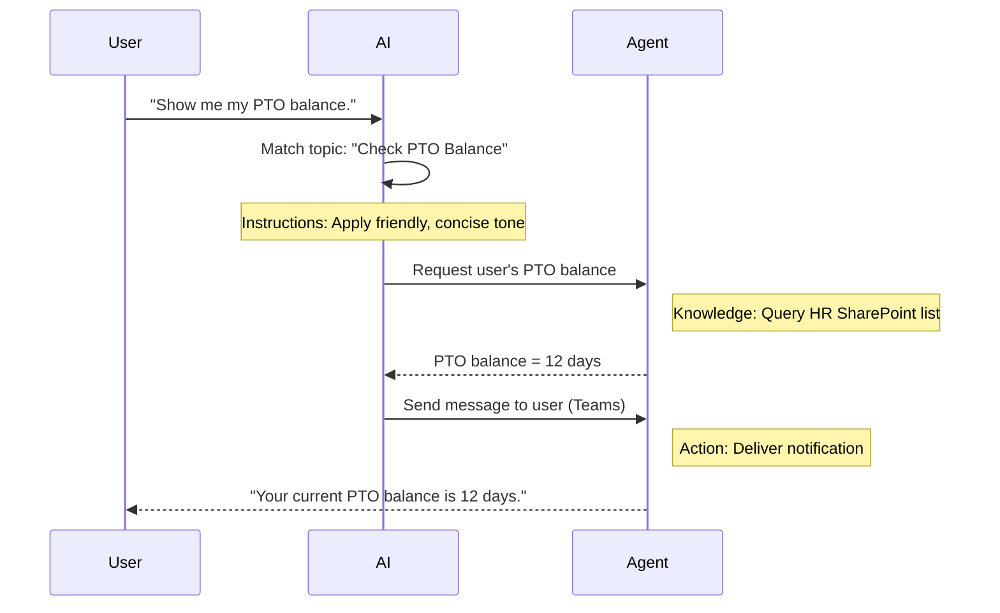

<!--
CO_OP_TRANSLATOR_METADATA:
{
  "original_hash": "90a3c5122f5687bbc8cc819990f175d4",
  "translation_date": "2025-10-21T18:57:29+00:00",
  "source_file": "docs/recruit/02-copilot-studio-fundamentals/README.md",
  "language_code": "fa"
}
-->
# 🚨 مأموریت ۰۲: اصول استودیو Copilot

## 🕵️‍♂️ نام رمز: `عملیات پروتکل اصلی`

> **⏱️ زمان عملیات:** `~۳۰ دقیقه – فقط اطلاعات، بدون نیاز به کار میدانی`  

🎥 **تماشای ویدیو راهنما**

[](https://www.youtube.com/watch?v=x4OCwDRGeLE "تماشای راهنما در یوتیوب")

## 🎯 خلاصه مأموریت

خوش آمدید، تازه‌کار. این مأموریت شما را با اطلاعات پایه‌ای مجهز می‌کند تا بفهمید استودیو Copilot چگونه کار می‌کند و چگونه می‌توانید عوامل هوشمندی بسازید که ارزش واقعی برای کسب‌وکار ایجاد کنند.

پیش از ساخت اولین عامل خود، باید چهار جزء کلیدی را که هر عامل هوش مصنوعی سفارشی را تشکیل می‌دهند، بشناسید: دانش، ابزارها، موضوعات و دستورالعمل‌ها. همچنین یاد خواهید گرفت که این عناصر چگونه در هماهنگ‌کننده استودیو Copilot با یکدیگر کار می‌کنند.

## 🔎 اهداف

در این مأموریت، شما:

- **یاد می‌گیرید استودیو Copilot چیست**
- **یاد می‌گیرید چه زمانی و چرا از عوامل استفاده کنید**
- **چهار بلوک سازنده عوامل را بررسی می‌کنید**
      - **دانش**
      - **ابزارها**
      - **موضوعات**
      - **دستورالعمل‌ها**
- **می‌فهمید این اجزا چگونه با هم کار می‌کنند** تا یک عامل هوشمند و خودکار ایجاد کنند

---

## عوامل در استودیو Copilot چیستند؟

یک **عامل** دستیار هوش مصنوعی تخصصی است که شما طراحی می‌کنید تا وظایف یا پرسش‌های خاصی را مدیریت کند. برخلاف یک چت‌بات عمومی، عامل شما:

- **اطلاعات خاص شرکت را می‌داند** (سیاست‌ها، اسناد، پایگاه‌های داده)  
- **وظایف واقعی را انجام می‌دهد** (ارسال پیام‌ها، ایجاد رویدادهای تقویم، به‌روزرسانی سوابق)  
- **زمینه مکالمه را حفظ می‌کند** تا بتواند به پرسش‌های قبلی پاسخ دهد  

از آنجا که استودیو Copilot کم‌کد است، شما می‌توانید اجزای از پیش ساخته شده را با کشیدن و رها کردن استفاده کنید—بدون نیاز به مهارت‌های عمیق برنامه‌نویسی. پس از ساخت عامل، افراد می‌توانند در داخل Teams، Slack یا حتی یک صفحه وب سفارشی از آن استفاده کنند تا پاسخ‌ها دریافت کنند یا گردش کارها را به‌طور خودکار فعال کنند.

---

## چه زمانی و چرا از استودیو Copilot استفاده کنیم

در حالی که Microsoft 365 Copilot کمک‌های عمومی هوش مصنوعی را در برنامه‌های Office ارائه می‌دهد، شما زمانی به یک عامل سفارشی نیاز دارید که:

### به دانش خاص حوزه نیاز دارید

- Copilot پیش‌فرض ممکن است از رویه‌ها یا داده‌های داخلی شرکت شما اطلاع نداشته باشد. یک عامل می‌تواند سایت‌های SharePoint، پایگاه‌های داده یا منابع سفارشی شما را جستجو کند تا پاسخ‌های دقیق و به‌روز ارائه دهد.  

### می‌خواهید گردش کارهای چندمرحله‌ای را خودکار کنید

- برای مثال: "وقتی کسی هزینه‌ای را ارسال می‌کند، آن را برای تأیید ارسال کنید، ردیاب مالی را به‌روزرسانی کنید و مدیر را مطلع کنید." یک عامل سفارشی می‌تواند هر مرحله را مدیریت کند، که با یک فرمان یا رویداد واحد فعال می‌شود.  

### به تجربه‌ای زمینه‌ای و درون‌ابزاری نیاز دارید  

- تصور کنید یک عامل "آموزش کارکنان جدید" در Teams که کارکنان منابع انسانی را در هر سیاست راهنمایی می‌کند، فرم‌های لازم را ارسال می‌کند و جلسات آشنایی را برنامه‌ریزی می‌کند—همه این‌ها در داخل پلتفرم همکاری موجود شما.  

---

## چهار بلوک سازنده یک عامل

هر عامل استودیو Copilot از چهار جزء اصلی ساخته شده است:

1. **دانش**  
1. **ابزارها (اقدامات)**  
1. **موضوعات**  
1. **دستورالعمل‌ها**

در ادامه، هر بلوک سازنده را تعریف می‌کنیم و نشان می‌دهیم که چگونه با هم کار می‌کنند تا یک عامل مؤثر ایجاد کنند.

### 1. دانش

**دانش** داده‌ها و زمینه‌ای است که عامل شما برای پاسخ دقیق به پرسش‌ها استفاده می‌کند. این بخش دو قسمت دارد:

#### دستورالعمل‌ها و زمینه سفارشی

- شما توضیح مختصری از هدف و لحن عامل می‌نویسید. برای مثال:  

    ```text
    You are an IT support agent. You help employees troubleshoot common software issues, provide troubleshooting steps, and escalate urgent tickets.
    ```

- در طول مکالمه، عامل نوبت‌های قبلی را به خاطر می‌سپارد تا بتواند به آنچه قبلاً بحث شده است، ارجاع دهد (برای مثال، اگر کاربر ابتدا بگوید "پرینتر من آفلاین است" و سپس بپرسد "آیا سطح جوهر را بررسی کردید؟" عامل زمینه پرینتر را به خاطر می‌آورد).

#### منابع دانش (داده‌های پایه)

- شما عامل خود را به چندین منبع داده—کتابخانه‌های SharePoint، سایت‌های مستندات، ویکی‌ها یا پایگاه‌های داده دیگر—متصل می‌کنید.  
- وقتی کاربر پرسشی می‌پرسد، عامل بخش‌های مرتبط را از آن منابع استخراج می‌کند تا پاسخ‌ها **بر اساس** سیاست‌های واقعی سازمان شما، راهنماهای محصول یا هر اطلاعات اختصاصی دیگر باشد.  
- شما حتی می‌توانید عامل را مجبور کنید فقط با اطلاعات موجود در آن منابع پاسخ دهد، و از حدس زدن یا "توهم" پاسخ‌ها جلوگیری کنید.

!!! example
    یک عامل "دستیار سیاست" ممکن است به سایت HR SharePoint شما متصل شود. اگر کاربر بپرسد، "نرخ انباشت PTO ما چیست؟" عامل متن دقیق را از سند سیاست HR بازیابی می‌کند، به جای اینکه به یک پاسخ عمومی هوش مصنوعی تکیه کند.

---

### 2. ابزارها (اقدامات)

**ابزارها (اقدامات)** تعریف می‌کنند که عامل فراتر از چت کردن چه کاری می‌تواند انجام دهد. هر اقدام یک وظیفه است که عامل به‌صورت برنامه‌ریزی شده اجرا می‌کند، مانند:

- ارسال ایمیل یا پیام Teams  
- ایجاد یا به‌روزرسانی یک رویداد تقویم  
- افزودن یا ویرایش یک رکورد در پایگاه داده (مثلاً لیست SharePoint یا جدول Dataverse)  
- فراخوانی یک جریان Power Automate یا API REST  

#### نحوه کار اقدامات

- **تعریف ورودی‌ها و خروجی‌ها**  
      - برای مثال، یک اقدام ارسال ایمیل ممکن است نیاز داشته باشد:  
        - `RecipientEmailAddress`  
        - `SubjectLine`  
        - `EmailBody`  

- **ترکیب اقدامات در گردش کارها**  
      - اغلب، انجام یک درخواست کاربر شامل چندین مرحله است.  
      - شما می‌توانید اقدامات را به ترتیب قرار دهید تا:  
             1. عامل داده‌ها را از یک لیست SharePoint بازیابی کند.  
             2. خلاصه‌ای با استفاده از LLM ایجاد کند.  
             3. پیام Teams با آن خلاصه ارسال کند.  

- **اتصال به سیستم‌های خارجی**  
      - اگر نیاز دارید یک CRM را به‌روزرسانی کنید یا یک API داخلی را فراخوانی کنید، یک اقدام سفارشی ایجاد کنید تا این کار را انجام دهد.  
      - استودیو Copilot می‌تواند با پلتفرم Power یا هر نقطه پایانی مبتنی بر HTTP ادغام شود.

!!! example "یک عامل "کمک هزینه" می‌تواند:"  
    1. به درخواست "ارسال هزینه" گوش دهد.  
    2. جزئیات هزینه کاربر را از یک فرم بگیرد.  
    3. از یک اقدام "افزودن به لیست SharePoint" برای ذخیره داده‌ها استفاده کند.  
    4. یک اقدام "ارسال ایمیل" را برای اطلاع‌رسانی به تأییدکننده فعال کند.  

---

### 3. موضوعات

**موضوعات** محرک‌های مکالمه یا نقاط ورود برای عامل شما را تعریف می‌کنند. هر موضوع مربوط به یک بخش از عملکرد یا دسته پرسش است.

#### محرک‌های مکالمه  

- یک موضوع ممکن است "ارسال درخواست IT"، "بررسی موجودی تعطیلات"، یا "ایجاد گزارش فروش" باشد.  
- در پشت صحنه، استودیو Copilot از **هماهنگی تولیدی** استفاده می‌کند: به جای تکیه بر کلمات کلیدی دقیق، هوش مصنوعی قصد کاربر را تفسیر می‌کند و بر اساس توضیح کوتاهی که شما ارائه می‌دهید، موضوع مناسب را انتخاب می‌کند.  

#### توضیحات موضوع  

- در هر موضوع، شما توضیحی واضح و مختصر از آنچه موضوع پوشش می‌دهد، می‌نویسید.

!!! example "مثال توضیح موضوع"
    این موضوع به کاربران کمک می‌کند تا یک درخواست پشتیبانی IT ارسال کنند، با جمع‌آوری جزئیات مشکل، اولویت و اطلاعات تماس.

- هوش مصنوعی از آن توضیح برای تصمیم‌گیری در مورد فعال کردن این موضوع استفاده می‌کند، حتی اگر عبارت کاربر دقیقاً مطابقت نداشته باشد.

#### ارتباط موضوعات با اقدامات  

- هر موضوع به یک یا چند اقدام یا مراحل بازیابی داده متصل است.  
- وقتی هوش مصنوعی یک موضوع را انتخاب می‌کند، مکالمه را از طریق دنباله‌ای که شما تعریف کرده‌اید هدایت می‌کند (پرسش‌های پیگیری، فراخوانی اقدامات، بازگرداندن نتایج).

!!! example
    اگر کاربر بگوید، "من نیاز به کمک برای راه‌اندازی لپ‌تاپ جدیدم دارم"، هوش مصنوعی ممکن است آن قصد را با موضوع "ارسال درخواست IT" مطابقت دهد. سپس عامل جزئیات مدل لپ‌تاپ، اطلاعات کاربر را می‌پرسد و به‌طور خودکار یک درخواست را در سیستم کمک‌رسانی ثبت می‌کند.

---

### 4. دستورالعمل‌ها

**دستورالعمل‌ها** (گاهی اوقات "پرامپت‌ها" یا "پیام‌های سیستمی" نامیده می‌شوند) لحن، سبک و مرزهای LLM را هدایت می‌کنند. آن‌ها شکل‌دهنده نحوه پاسخ‌دهی عامل در هر موقعیتی هستند.

#### نقش و شخصیت  

- شما به هوش مصنوعی می‌گویید که چه کسی است (مثلاً "شما یک عامل خدمات مشتری برای Contoso Retail هستید").  
- این لحن را تنظیم می‌کند—دوستانه، مختصر، رسمی یا غیررسمی—بسته به مورد استفاده شما.

#### دستورالعمل‌های پاسخ  

- هر قانونی که عامل باید رعایت کند را مشخص کنید، مانند:  
      - "همیشه اطلاعات سیاست را به صورت نکات کلیدی خلاصه کنید."  
      - "اگر پاسخ را نمی‌دانید، بگویید ‘متأسفم، من این اطلاعات را ندارم.’"  
      - "هرگز اطلاعات محرمانه را خارج از زمینه ارائه ندهید."

#### قوانین حافظه و زمینه

- شما می‌توانید به عامل دستور دهید که چند نوبت مکالمه را به خاطر بسپارد.  
- برای مثال: "جزئیات درخواست‌های این کاربر را تا سه پرسش پیگیری به خاطر بسپار."

!!! example "در یک عامل "مشاور مزایا"، ممکن است شامل شود:"
    "همیشه به آخرین کتابچه راهنمای HR هنگام پاسخ به پرسش‌ها ارجاع دهید. اگر درباره مهلت‌های ثبت‌نام پرسیده شد، تاریخ‌های خاص را از سیاست ارائه دهید. پاسخ‌ها را زیر ۱۵۰ کلمه نگه دارید."

---

## چگونه چهار بلوک سازنده با هم کار می‌کنند

وقتی **دانش**، **ابزارها**، **موضوعات** و **دستورالعمل‌ها** را کنار هم قرار می‌دهید، هماهنگ‌کننده هوش مصنوعی استودیو Copilot عاملی ایجاد می‌کند که:

1. **به دنبال یک موضوع مرتبط می‌گردد** (با راهنمایی توضیحات موضوع شما).  
1. **دستورالعمل‌ها را اعمال می‌کند** تا لحن خود را تنظیم کند، تصمیم بگیرد چه زمانی پرسش‌های پیگیری بپرسد و قوانین را اجرا کند.  
1. **از منابع دانش استفاده می‌کند** تا پاسخ‌های خود را بر اساس داده‌های سازمان شما پایه‌گذاری کند.  
1. **ابزارها (اقدامات) را فراخوانی می‌کند** تا وظایف را انجام دهد—ارسال پیام‌ها، به‌روزرسانی سوابق یا فراخوانی API‌ها.  

در پشت صحنه، هماهنگ‌کننده از یک رویکرد **برنامه‌ریزی تولیدی** استفاده می‌کند: تصمیم می‌گیرد که کدام مراحل را، به چه ترتیبی، برای انجام درخواست کاربر انجام دهد. اگر یک اقدام شکست بخورد (برای مثال، ایمیل ارسال نشود)، عامل دستورالعمل‌های مدیریت استثنا شما را دنبال می‌کند (پرسش توضیحی بپرسد یا خطا را گزارش دهد). از آنجا که LLM به زمینه مکالمه تطبیق می‌یابد، عامل می‌تواند حافظه را در طول چندین نوبت حفظ کند و اطلاعات جدید را در حین پیشرفت مکالمه وارد کند.

**مثال جریان تصویری:**  
<!--
1. **کاربر:** "موجودی PTO من را نشان بده."
1. **هوش مصنوعی (موضوعات):** موضوع "بررسی موجودی PTO" را مطابقت می‌دهد.  
1. **هوش مصنوعی (دستورالعمل‌ها):** از لحن دوستانه و مختصر استفاده می‌کند.  
1. **عامل (دانش):** لیست SharePoint HR را برای موجودی کاربر جستجو می‌کند.  
1. **عامل (اقدامات):** مقدار را بازیابی می‌کند و پیام Teams ارسال می‌کند:  
   > "موجودی PTO فعلی شما ۱۲ روز است."  
-->



---

## 🎉 مأموریت کامل شد

شما با موفقیت جلسه اطلاعات پایه‌ای خود را به پایان رساندید. اکنون چهار بلوک اساسی هر عامل در استودیو Copilot را یاد گرفته‌اید:

1. **دانش** – جایی که عامل اطلاعات واقعی را جستجو می‌کند و حافظه مکالمه را حفظ می‌کند.  
1. **ابزارها** – وظایفی که عامل می‌تواند انجام دهد تا کارها به‌طور خودکار انجام شوند.  
1. **موضوعات** – نحوه تشخیص قصد کاربر توسط عامل و تصمیم‌گیری درباره اجرای کدام گردش کار.  
1. **دستورالعمل‌ها** – قوانین، لحن و مرزهایی که هر پاسخ را هدایت می‌کنند.

با این اجزا، شما می‌توانید یک عامل پایه‌ای بسازید که به پرسش‌ها پاسخ دهد و گردش کارهای ساده را اجرا کند. در درس بعدی، ما یک آموزش گام‌به‌گام برای ایجاد یک عامل "Service Desk" ارائه خواهیم داد—از اتصال اولین منبع دانش تا تعریف یک موضوع و اتصال یک اقدام.

در ادامه: شما اولین [عامل اعلامی برای M365 Copilot](../03-create-a-declarative-agent-for-M365Copilot/README.md) خود را خواهید ساخت.

<!-- markdownlint-disable-next-line MD033 -->


---

**سلب مسئولیت**:  
این سند با استفاده از سرویس ترجمه هوش مصنوعی [Co-op Translator](https://github.com/Azure/co-op-translator) ترجمه شده است. در حالی که ما تلاش می‌کنیم دقت را حفظ کنیم، لطفاً توجه داشته باشید که ترجمه‌های خودکار ممکن است شامل خطاها یا نادرستی‌ها باشند. سند اصلی به زبان اصلی آن باید به عنوان منبع معتبر در نظر گرفته شود. برای اطلاعات حساس، ترجمه حرفه‌ای انسانی توصیه می‌شود. ما مسئولیتی در قبال سوء تفاهم‌ها یا تفسیرهای نادرست ناشی از استفاده از این ترجمه نداریم.