<!--
CO_OP_TRANSLATOR_METADATA:
{
  "original_hash": "0c51aabca81d6256990caf4c015e6195",
  "translation_date": "2025-10-21T18:32:29+00:00",
  "source_file": "docs/recruit/04-creating-a-solution/README.md",
  "language_code": "fa"
}
-->
# 🚨 مأموریت ۰۴: ایجاد یک راه‌حل برای عامل شما

## 🕵️‍♂️ نام رمز: `عملیات کنترل-آلت-بسته‌بندی`

> **⏱️ زمان عملیات:** `~۴۵ دقیقه`

🎥 **تماشای راهنمای ویدئویی**

[](https://www.youtube.com/watch?v=1iATbkgfcpU "تماشای راهنمای ویدئویی در یوتیوب")

## 🎯 خلاصه مأموریت

سازنده عامل، به عملیات تاکتیکی بعدی خود خوش آمدید. در این مأموریت، یاد خواهید گرفت که یک راه‌حل بسازید - وسیله رسمی استقرار برای عامل میز کمک IT شما که با Microsoft Copilot Studio ساخته شده است. این را به عنوان ایجاد یک کیف دیجیتال در نظر بگیرید که عامل شما و مصنوعات آن را نگه می‌دارد.

هر عاملی به یک خانه ساختاریافته نیاز دارد. این همان چیزی است که یک راه‌حل Power Platform فراهم می‌کند - نظم، قابلیت حمل و آمادگی برای تولید.

بیایید بسته‌بندی کنیم.

## 🔎 اهداف

در این مأموریت، یاد خواهید گرفت:

1. درک اینکه راه‌حل‌های Power Platform چیستند و نقش آنها در توسعه عامل
1. یادگیری مزایای استفاده از راه‌حل‌ها برای سازماندهی و استقرار عوامل
1. بررسی ناشران راه‌حل و اهمیت آنها در مدیریت اجزا
1. درک چرخه عمر راه‌حل Power Platform از توسعه تا تولید
1. ایجاد ناشر راه‌حل خود و راه‌حل سفارشی برای عامل میز کمک IT خود

## 🕵🏻‍♀️ راه‌حل؟ چیست؟

در Microsoft Power Platform، راه‌حل‌ها مانند کانتینرها یا بسته‌هایی هستند که تمام اجزای برنامه‌ها یا عوامل شما را نگه می‌دارند - این اجزا می‌توانند جداول، فرم‌ها، جریان‌ها و منطق سفارشی باشند. راه‌حل‌ها برای مدیریت چرخه عمر برنامه (ALM) ضروری هستند، آنها به شما امکان می‌دهند برنامه‌ها و عوامل خود را از ایده تا توسعه، آزمایش، استقرار و به‌روزرسانی مدیریت کنید.

در Copilot Studio، هر عاملی که ایجاد می‌کنید در یک راه‌حل Power Platform ذخیره می‌شود. به طور پیش‌فرض، عوامل در راه‌حل پیش‌فرض ایجاد می‌شوند، مگر اینکه یک راه‌حل سفارشی جدید ایجاد کنید تا عامل خود را در آن ایجاد کنید. این چیزی است که در این درس و آزمایش عملی یاد خواهیم گرفت 🤓.

راه‌حل‌ها به طور سنتی در **پورتال سازنده Power Apps** ایجاد شده‌اند - یک رابط وب که در آن می‌توانید برنامه‌ها، Dataverse، جریان‌ها، اجزای هوش مصنوعی و موارد دیگر را بسازید و سفارشی کنید.

   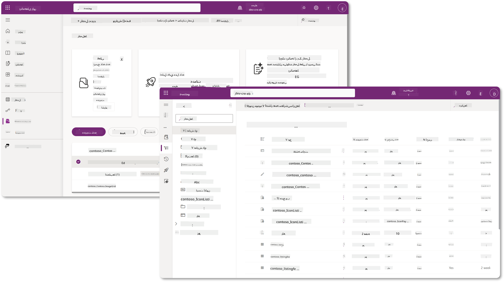

در Copilot Studio، اکنون **Solution Explorer** وجود دارد که می‌توانید راه‌حل‌های خود را مستقیماً مدیریت کنید. دیگر نیازی نیست به پورتال سازنده Power Apps بروید تا راه‌حل‌های خود را مدیریت کنید، این کار را می‌توان درست در داخل Copilot Studio انجام داد 🪄.

این بدان معناست که می‌توانید وظایف معمول مربوط به راه‌حل‌ها را انجام دهید:

- **ایجاد یک راه‌حل** - راه‌حل‌های سفارشی به عوامل امکان می‌دهند بین محیط‌ها صادر و وارد شوند.
- **تنظیم راه‌حل ترجیحی خود** - انتخاب کنید که عوامل، برنامه‌ها و غیره به طور پیش‌فرض در کدام راه‌حل ایجاد شوند.
- **افزودن یا حذف اجزا** - عامل شما ممکن است به اجزای دیگری مانند متغیرهای محیطی یا جریان‌های ابری اشاره کند. بنابراین این اجزا باید در راه‌حل گنجانده شوند.
- **صادرات راه‌حل‌ها** - برای انتقال راه‌حل‌ها به یک محیط هدف دیگر.
- **وارد کردن راه‌حل‌ها** - وارد کردن راه‌حل‌هایی که در جای دیگری ایجاد شده‌اند، از جمله ارتقا یا به‌روزرسانی راه‌حل‌ها.
- **ایجاد و مدیریت خطوط لوله راه‌حل** - خودکارسازی استقرار راه‌حل‌ها بین محیط‌ها.
- **یکپارچه‌سازی Git** - به توسعه‌دهندگان امکان می‌دهد راه‌حل‌ها را با مخازن Git برای کنترل نسخه، همکاری و ALM متصل کنند. فقط برای استفاده در محیط‌های توسعه‌دهنده در نظر گرفته شده است.

   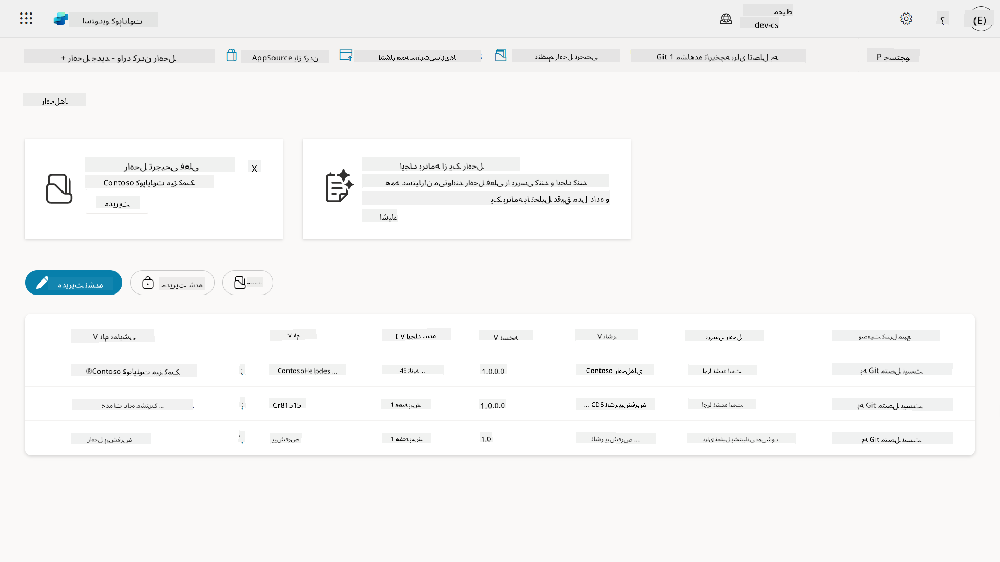

دو نوع راه‌حل وجود دارد:

- **راه‌حل‌های غیرمدیریت‌شده** - در طول توسعه استفاده می‌شوند. می‌توانید آزادانه و به دلخواه ویرایش و سفارشی کنید.
- **راه‌حل‌های مدیریت‌شده** - زمانی استفاده می‌شوند که آماده استقرار برنامه خود برای آزمایش یا تولید باشید. این‌ها قفل شده‌اند تا از تغییرات تصادفی جلوگیری شود.

## 🤔 چرا باید از یک راه‌حل برای عامل خود استفاده کنم؟

راه‌حل‌ها را به عنوان یک _جعبه ابزار_ در نظر بگیرید. وقتی نیاز دارید چیزی (یک عامل) را در یک مکان دیگر (محیط) تعمیر یا بسازید، تمام ابزارهای لازم (اجزا) را جمع‌آوری کرده و آنها را در جعبه ابزار خود (راه‌حل) قرار می‌دهید. سپس می‌توانید این جعبه ابزار را به مکان جدید (محیط) ببرید و از ابزارها (اجزا) برای تکمیل کار خود استفاده کنید یا ابزارهای جدید (اجزا) اضافه کنید تا عامل یا پروژه‌ای که می‌سازید را سفارشی کنید.

!!! quote "الایزا، مدافع ابری دوست‌داشتنی شما اینجا هست 🙋🏻‍♀️ تا چند کلمه به اشتراک بگذارد:"
    ما در نیوزیلند یک ضرب‌المثل داریم، "یک کیوی مرتب باشید!" که یک فراخوان برای اقدام نیوزیلندی‌ها 🥝 است تا مسئولیت محیط خود را با دفع صحیح زباله‌ها و تمیز نگه داشتن فضاهای عمومی بر عهده بگیرند. ما می‌توانیم همین مفهوم را برای عوامل استفاده کنیم و همه چیز مربوط به عامل خود را سازماندهی و قابل حمل نگه داریم، و این به شما کمک می‌کند یک محیط مرتب داشته باشید.

ایجاد یک عامل در یک راه‌حل اختصاصی در محیط منبع (توسعه‌دهنده) یک عادت خوب است. در اینجا دلایل ارزشمند بودن راه‌حل‌ها آورده شده است:

🧩 **توسعه سازمان‌یافته**

- شما عامل خود را از راه‌حل پیش‌فرض که همه چیز در محیط را شامل می‌شود جدا نگه می‌دارید. تمام اجزای عامل شما در یک مکان قرار دارند 🎯.

- همه چیزهایی که برای عامل خود نیاز دارید در یک راه‌حل قرار دارد، که صادرات و واردات آن به یک محیط هدف را آسان‌تر می‌کند 👉🏻 این یک عادت سالم در ALM است.

🧩 **استقرار ایمن**

- می‌توانید برنامه یا عامل خود را به عنوان یک راه‌حل مدیریت‌شده صادر کرده و آن را به محیط‌های هدف دیگر (مانند آزمایش یا تولید) بدون خطر ویرایش‌های تصادفی استقرار دهید.

🧩 **کنترل نسخه**

- می‌توانید پچ‌ها (اصلاحات هدفمند)، به‌روزرسانی‌ها (تغییرات جامع‌تر) یا ارتقاها (جایگزینی یک راه‌حل - معمولاً تغییرات عمده و معرفی ویژگی‌های جدید) ایجاد کنید.

- به شما کمک می‌کند تغییرات را به صورت کنترل‌شده اعمال کنید.

🧩 **مدیریت وابستگی**

- راه‌حل‌ها پیگیری می‌کنند که کدام بخش‌ها به دیگران وابسته هستند. این از خراب شدن چیزها هنگام ایجاد تغییرات جلوگیری می‌کند.

🧩 **همکاری تیمی**

- توسعه‌دهندگان و سازندگان می‌توانند با استفاده از راه‌حل‌های غیرمدیریت‌شده در توسعه همکاری کنند، سپس یک راه‌حل مدیریت‌شده را برای استقرار تحویل دهند.

## 🪪 درک ناشران راه‌حل

یک ناشر راه‌حل در Power Platform مانند یک برچسب یا برند است که مشخص می‌کند چه کسی یک راه‌حل را ایجاد کرده یا مالک آن است. این بخش کوچک اما مهمی از مدیریت برنامه‌ها، عوامل و سفارشی‌سازی جریان‌ها است، به ویژه هنگام کار در تیم‌ها یا در محیط‌های مختلف.

هنگامی که یک راه‌حل ایجاد می‌کنید، باید یک ناشر انتخاب کنید. این ناشر تعریف می‌کند:

- یک پیشوند که به تمام اجزای سفارشی اضافه می‌شود (مانند جداول، فیلدها و جریان‌ها).

- یک نام و اطلاعات تماس برای سازمان یا شخصی که مالک راه‌حل است.

### 🤔 چرا مهم است؟

1. **شناسایی آسان** - پیشوند (مثال - `new_` یا `abc_`) به شما کمک می‌کند به سرعت تشخیص دهید کدام اجزا به کدام راه‌حل یا تیم تعلق دارند.

1. **جلوگیری از تضادها** - اگر دو تیم یک ستون به نام وضعیت ایجاد کنند، پیشوندهای آنها (`teamA_status`, `teamB_status`) از برخورد نام‌ها جلوگیری می‌کند.

1. **پشتیبانی از ALM** - هنگام انتقال راه‌حل‌ها بین محیط‌ها (توسعه → آزمایش → تولید)، ناشر به پیگیری مالکیت و حفظ سازگاری کمک می‌کند.

### ✨ مثال

فرض کنید یک ناشر به نام Contoso Solutions با پیشوند `cts_` ایجاد می‌کنید.

اگر یک ستون سفارشی به نام _اولویت_ اضافه کنید، به عنوان `cts_Priority` در راه‌حل ذخیره می‌شود.

هر کسی که با این ستون در سطح راه‌حل مواجه شود، صرف‌نظر از اینکه در کدام محیط باشد، می‌تواند به راحتی آن را به عنوان ستونی که به Contoso Solutions مرتبط است شناسایی کند.

## 🧭 چرخه عمر راه‌حل Power Platform

حالا که هدف یک راه‌حل را درک کردید، بیایید چرخه عمر آن را یاد بگیریم.

**۱. ایجاد راه‌حل در محیط توسعه** - ابتدا یک راه‌حل جدید در محیط توسعه خود ایجاد کنید.

**۲. افزودن اجزا** - برنامه‌ها، جریان‌ها، جداول و عناصر دیگر را به راه‌حل خود اضافه کنید.

**۳. صادرات به عنوان راه‌حل مدیریت‌شده** - راه‌حل خود را برای استقرار با صادرات آن به عنوان یک راه‌حل مدیریت‌شده بسته‌بندی کنید.

**۴. وارد کردن به محیط آزمایش** - راه‌حل خود را در یک محیط آزمایش جداگانه آزمایش کنید تا مطمئن شوید همه چیز به درستی کار می‌کند.

**۵. وارد کردن به محیط تولید** - راه‌حل آزمایش‌شده را به محیط تولید زنده خود استقرار دهید.

**۶. اعمال پچ‌ها، به‌روزرسانی‌ها یا ارتقاها** - بهبودها یا اصلاحات را با استفاده از پچ‌ها، به‌روزرسانی‌ها یا ارتقاها انجام دهید. 🔁 چرخه را تکرار کنید!

### ✨ مثال

تصور کنید که یک عامل میز کمک IT ایجاد می‌کنید تا به کارکنان در مشکلاتی مانند مشکلات دستگاه، عیب‌یابی شبکه، تنظیم چاپگر و موارد دیگر کمک کند.

- شما در یک محیط توسعه با استفاده از یک راه‌حل غیرمدیریت‌شده شروع می‌کنید.

- هنگامی که آماده شد، آن را به عنوان یک راه‌حل مدیریت‌شده صادر کرده و به یک محیط هدف مانند آزمایش سیستم یا آزمایش پذیرش کاربر (UAT) وارد می‌کنید.

- پس از آزمایش، آن را به محیط تولید منتقل می‌کنید - همه این‌ها بدون دست زدن به نسخه اصلی توسعه.

## 🧪 آزمایش ۰۴: ایجاد یک راه‌حل جدید

اکنون یاد خواهیم گرفت

- [۴.۱ چگونه یک ناشر راه‌حل ایجاد کنیم](../../../../../docs/recruit/04-creating-a-solution)
- [۴.۲ چگونه یک راه‌حل ایجاد کنیم](../../../../../docs/recruit/04-creating-a-solution)

ما با مثال قبلی ادامه خواهیم داد، جایی که یک راه‌حل در محیط اختصاصی Copilot Studio ایجاد می‌کنیم تا عامل میز کمک IT خود را در آن بسازیم.

بیایید شروع کنیم!

### پیش‌نیازها

#### نقش امنیتی

در Copilot Studio، آنچه شما _می‌توانید انجام دهید_ در Solution Explorer به نقش امنیتی کاربر شما بستگی دارد.
اگر اجازه مدیریت راه‌حل‌ها در مرکز مدیریت Power Apps را ندارید، نمی‌توانید این وظایف را در Copilot Studio انجام دهید.

برای اطمینان از اینکه همه چیز به‌طور روان کار می‌کند، بررسی کنید که نقش‌های امنیتی و مجوزهای مناسب را دارید. یا اگر محیط‌ها را در سازمان خود مدیریت نمی‌کنید، از تیم مدیر IT خود (یا معادل آن) که مستأجر/محیط‌های شما را مدیریت می‌کند، درخواست کنید.

نقش‌های امنیتی زیر به کاربران امکان می‌دهند یک راه‌حل در محیط خود ایجاد کنند.

| نقش امنیتی    | توضیحات |
| ---------- | ---------- |
| سازنده محیط | مجوزهای لازم برای ایجاد، سفارشی‌سازی و مدیریت منابع در یک محیط خاص، از جمله راه‌حل‌ها را فراهم می‌کند  |
| سفارشی‌کننده سیستم  | مجوزهای گسترده‌تر از سازنده محیط، از جمله توانایی سفارشی‌سازی محیط و مدیریت نقش‌های امنیتی |
| مدیر سیستم   | بالاترین سطح مجوزها و توانایی مدیریت تمام جنبه‌های محیط، از جمله ایجاد و تخصیص نقش‌های امنیتی     |

#### محیط توسعه‌دهنده

اطمینان حاصل کنید که به محیط توسعه‌دهنده اختصاصی خود تغییر داده‌اید، به [درس ۰۰ - تنظیم دوره - مرحله ۳: ایجاد محیط توسعه‌دهنده جدید](../00-course-setup/README.md#step-3-create-new-developer-environment) مراجعه کنید.

1. در بالا سمت راست، نماد **چرخ‌دنده** را انتخاب کنید و از محیط پیش‌فرض به محیط خود تغییر دهید، برای مثال **محیط Adele Vance**.

    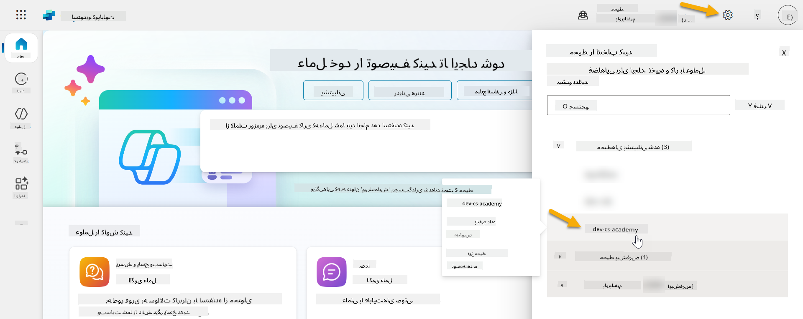

### ۴.۱ ایجاد ناشر راه‌حل

1. با استفاده از همان محیط Copilot Studio که در درس قبلی استفاده شد، نماد **سه نقطه (. . .)** را در منوی سمت چپ در Copilot Studio انتخاب کنید. **راه‌حل‌ها** را تحت عنوان **Explore** انتخاب کنید.

    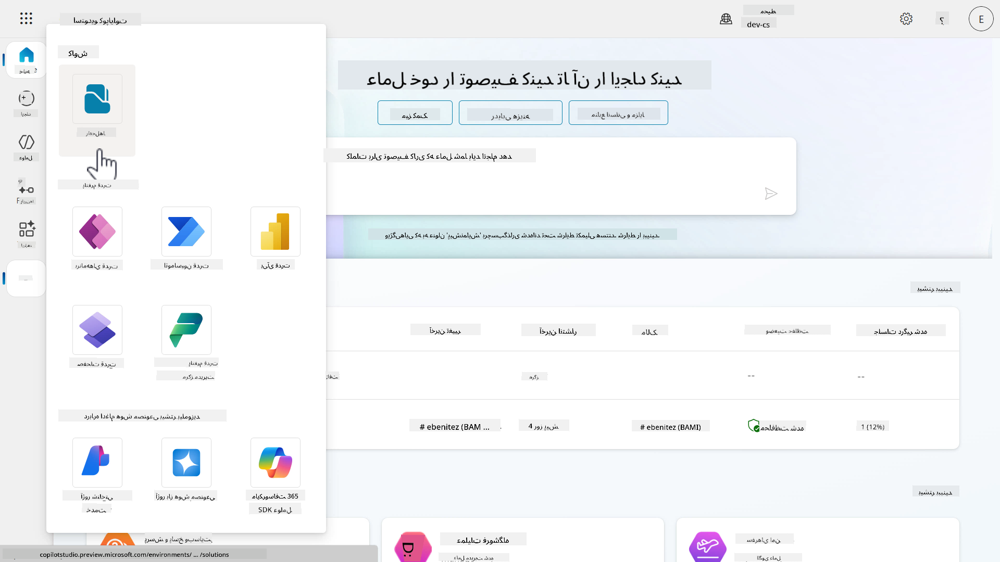

1. **Solution Explorer** در Copilot Studio بارگذاری خواهد شد. **+ راه‌حل جدید** را انتخاب کنید.

    

1. پنل **راه‌حل جدید** ظاهر خواهد شد که در آن می‌توانیم جزئیات راه‌حل خود را تعریف کنیم. ابتدا باید یک ناشر جدید ایجاد کنیم. **+ ناشر جدید** را انتخاب کنید.

    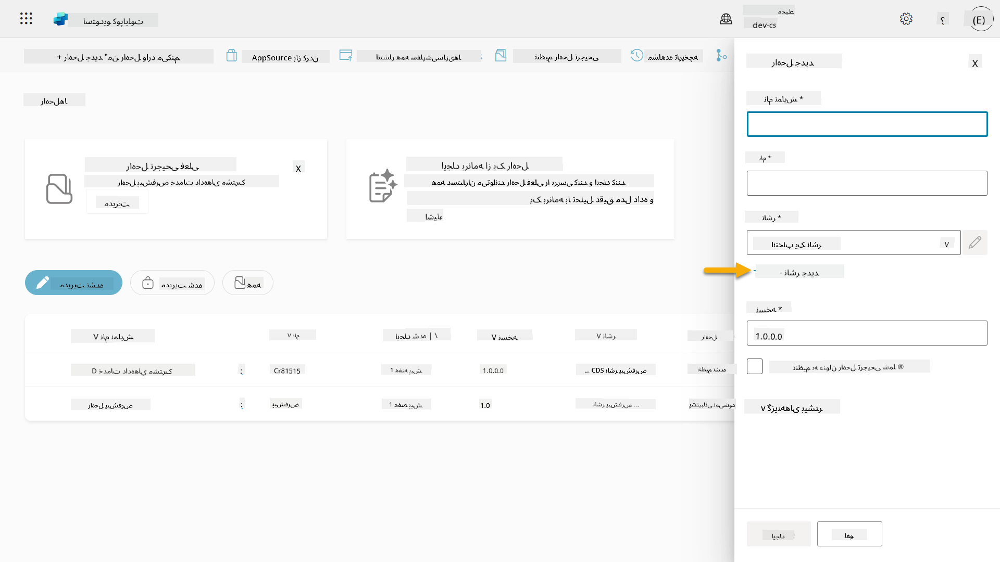  

1. تب **Properties** پنل **ناشر جدید** ظاهر خواهد شد که شامل فیلدهای ضروری و غیرضروری برای پر کردن در تب **Properties** است. اینجا جایی است که می‌توانیم جزئیات ناشر را که به عنوان برچسب یا برند مشخص‌کننده ایجادکننده یا مالک راه‌حل استفاده خواهد شد، مشخص کنیم.

    | ویژگی    | توضیحات | ضروری |
    | ---------- | ---------- | :----------: |
    | نام نمایشی | نام نمایشی برای ناشر | بله   |
    | نام  | نام منحصر به فرد و نام طرح برای ناشر  | بله    |
    | توضیحات   | هدف راه‌حل را مشخص می‌کند    | خیر     |
    | پیشوند    | پیشوند ناشر که به اجزای جدید ایجاد شده اعمال خواهد شد   | بله      |
    | پیشوند مقدار انتخابی   | یک عدد بر اساس پیشوند ناشر تولید می‌کند. این عدد زمانی که گزینه‌هایی به انتخاب‌ها اضافه می‌کنید استفاده می‌شود و نشان‌دهنده این است که کدام راه‌حل برای افزودن گزینه استفاده شده است.   | بله      |

    موارد زیر را به عنوان **نام نمایشی** کپی و جای‌گذاری کنید،

    ```text
    Contoso Solutions
    ```

    موارد زیر را به عنوان **نام** کپی و جای‌گذاری کنید،

    ```text
    ContosoSolutions
    ```

    موارد زیر را به عنوان **توضیحات** کپی و جای‌گذاری کنید،

    ```text
    Copilot Studio Agent Academy
    ```

    موارد زیر را برای **پیشوند** کپی و جای‌گذاری کنید،

    ```text
    cts
    ```

    به طور پیش‌فرض، پیشوند مقدار انتخابی یک مقدار عددی نمایش خواهد داد. این مقدار عددی را به نزدیک‌ترین هزار به‌روزرسانی کنید. برای مثال، در تصویر زیر من، ابتدا `77074` بود. این مقدار را از `77074` به `77000` به‌روزرسانی کنید.

    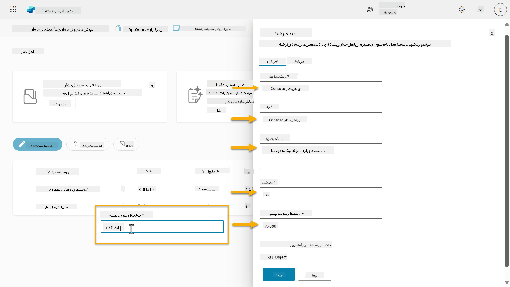  

1. اگر می‌خواهید جزئیات تماس برای راه‌حل را ارائه دهید، تب **Contact** را انتخاب کنید و ستون‌های نمایش داده شده را پر کنید.

    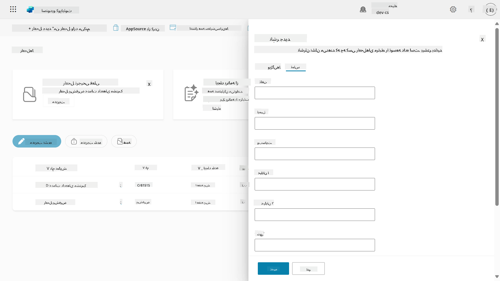

1. تب **Properties** را انتخاب کنید و **ذخیره** را برای ایجاد ناشر انتخاب کنید.

    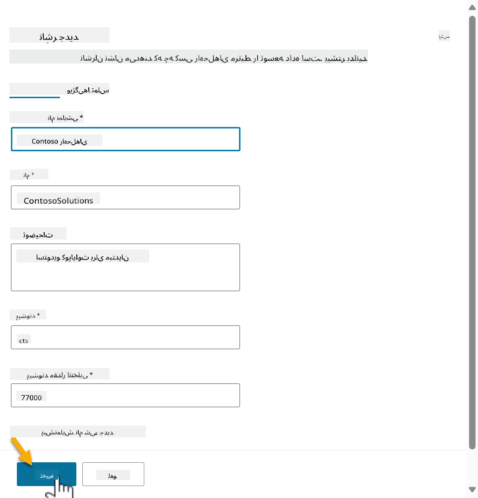
1. پانل ناشر جدید بسته می‌شود و شما به پانل **راه‌حل جدید** بازمی‌گردید که ناشر تازه ایجاد شده انتخاب شده است.

    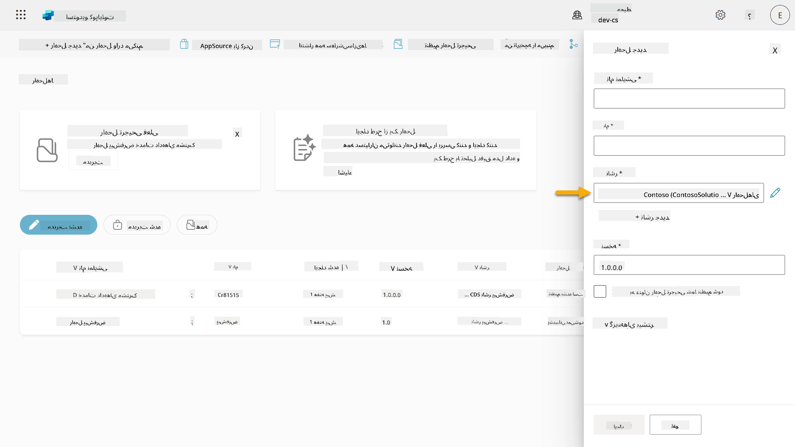  

آفرین، شما اکنون یک ناشر راه‌حل ایجاد کرده‌اید! 🙌🏻 حالا یاد می‌گیریم که چگونه یک راه‌حل سفارشی جدید ایجاد کنیم.

### 4.2 ایجاد یک راه‌حل جدید

1. حالا که راه‌حل‌های خود را ایجاد کرده‌ایم، می‌توانیم بقیه فرم را در پانل **راه‌حل جدید** تکمیل کنیم.

    متن زیر را به عنوان **نام نمایشی** کپی و جای‌گذاری کنید،

    ```text
    Contoso Helpdesk Agent
    ```

    متن زیر را به عنوان **نام** کپی و جای‌گذاری کنید،

    ```text
    ContosoHelpdeskAgent
    ```

    از آنجا که ما یک راه‌حل جدید ایجاد می‌کنیم، [**شماره نسخه**](https://learn.microsoft.com/power-apps/maker/data-platform/update-solutions#understanding-version-numbers-for-updates/?WT.mc_id=power-172615-ebenitez) به طور پیش‌فرض `1.0.0.0` خواهد بود.

    گزینه **تنظیم به عنوان راه‌حل ترجیحی شما** را علامت بزنید.

    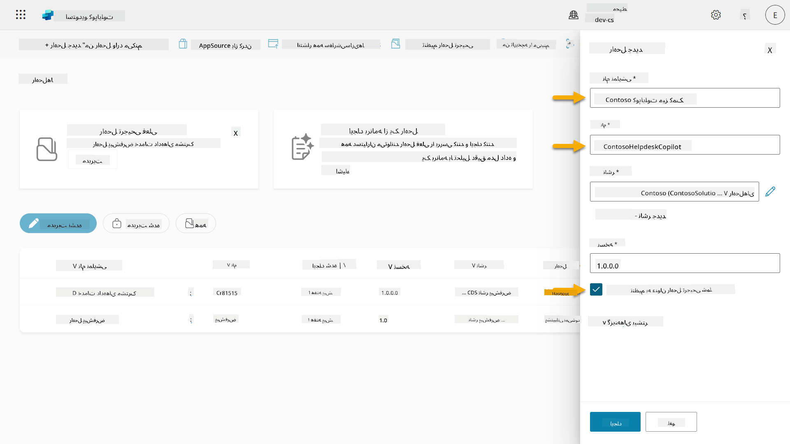  

1. گزینه **گزینه‌های بیشتر** را باز کنید تا جزئیات اضافی که می‌توان در یک راه‌حل ارائه داد را مشاهده کنید.

    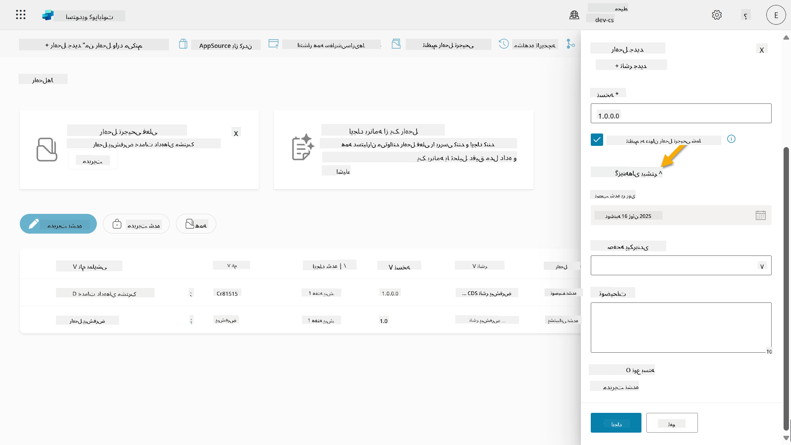

1. موارد زیر را مشاهده خواهید کرد:

    - **نصب شده در** - تاریخ نصب راه‌حل.

    - **صفحه پیکربندی** - توسعه‌دهندگان یک منبع وب HTML تنظیم می‌کنند تا به کاربران کمک کنند با برنامه، عامل یا ابزار خود تعامل داشته باشند، جایی که به عنوان یک صفحه وب در بخش اطلاعات با دستورالعمل‌ها یا دکمه‌ها ظاهر می‌شود. این بیشتر توسط شرکت‌ها یا توسعه‌دهندگانی که راه‌حل‌ها را با دیگران به اشتراک می‌گذارند استفاده می‌شود.

    - **توضیحات** - توضیحی درباره راه‌حل یا توضیحی کلی درباره صفحه پیکربندی.

    ما این موارد را برای این آزمایش خالی می‌گذاریم.

    گزینه **ایجاد** را انتخاب کنید.

    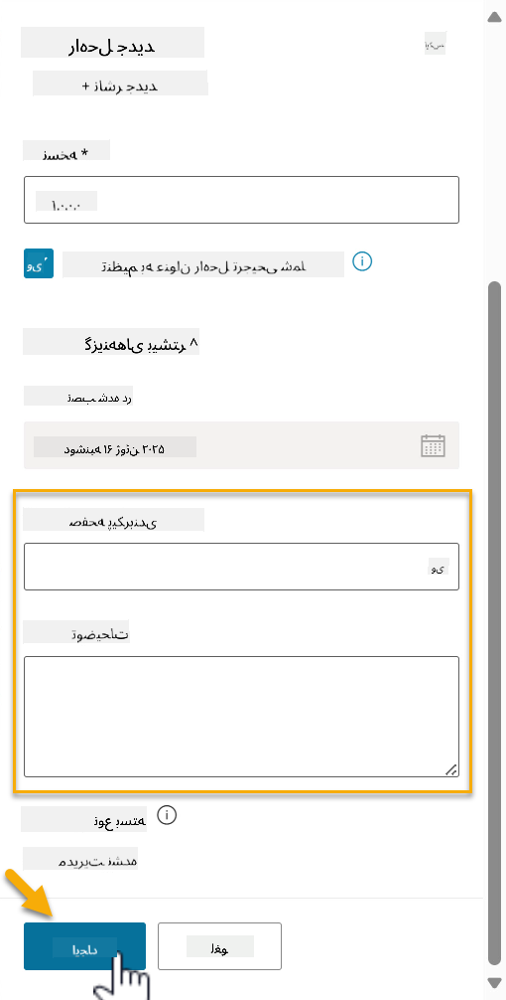

1. راه‌حل برای Contoso Helpdesk Agent اکنون ایجاد شده است. هیچ مؤلفه‌ای وجود نخواهد داشت تا زمانی که یک عامل در Copilot Studio ایجاد کنیم.

    نماد **پیکان بازگشت** را انتخاب کنید تا به Solution Explorer بازگردید.

    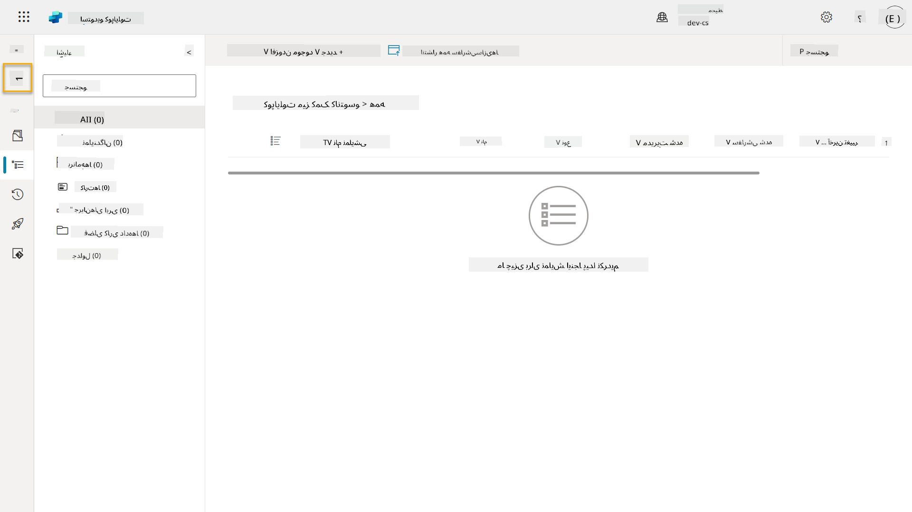

1. توجه کنید که چگونه Contoso Helpdesk Agent اکنون به عنوان **راه‌حل ترجیحی فعلی** نمایش داده می‌شود، زیرا قبلاً گزینه **تنظیم به عنوان راه‌حل ترجیحی شما** را علامت زده بودیم.

    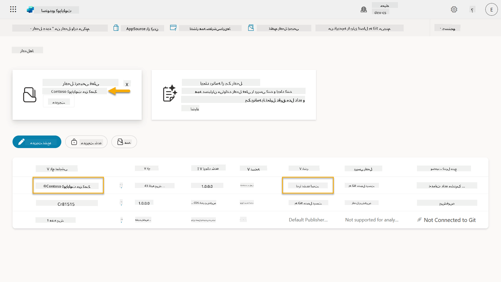

## ✅ مأموریت کامل شد

تبریک می‌گوییم! 👏🏻 شما یک ناشر ایجاد کرده‌اید و از آن در راه‌حل جدید خود برای ساخت عامل خود استفاده کرده‌اید!

آفرین، سازنده عامل. یک ردپای دیجیتال مرتب اولین قدم به سوی قابلیت عملیاتی در مقیاس است. اکنون شما ابزارها و ذهنیت لازم برای توسعه عامل پایدار و آماده برای سازمان را دارید.

این پایان **آزمایشگاه 04 - ایجاد یک راه‌حل** است، لینک زیر را انتخاب کنید تا به درس بعدی بروید. راه‌حلی که در این آزمایشگاه ایجاد کرده‌اید در آزمایشگاه درس بعدی استفاده خواهد شد.

⏭️ [به درس **شروع سریع با عوامل پیش‌ساخته** بروید](../05-using-prebuilt-agents/README.md)

## 📚 منابع تاکتیکی

🔗 [ایجاد یک راه‌حل](https://learn.microsoft.com/power-apps/maker/data-platform/create-solution/?WT.mc_id=power-172615-ebenitez)

🔗 [ایجاد و مدیریت راه‌حل‌ها در Copilot Studio](https://learn.microsoft.com/microsoft-copilot-studio/authoring-solutions-overview/?WT.mc_id=power-172615-ebenitez)

🔗 [اشتراک‌گذاری عوامل با کاربران دیگر](https://learn.microsoft.com/microsoft-copilot-studio/admin-share-bots/?WT.mc_id=power-172615-ebenitez)

🔗 [خلاصه منابع موجود برای نقش‌های امنیتی از پیش تعریف شده](https://learn.microsoft.com/power-platform/admin/database-security#summary-of-resources-available-to-predefined-security-roles/?WT.mc_id=power-172615-ebenitez)

🔗 [ارتقا یا به‌روزرسانی یک راه‌حل](https://learn.microsoft.com/power-apps/maker/data-platform/update-solutions/?WT.mc_id=power-172615-ebenitez)

🔗 [نمای کلی خطوط لوله در Power Platform](https://learn.microsoft.com/power-platform/alm/pipelines/?WT.mc_id=power-172615-ebenitez)

🔗 [نمای کلی ادغام Git در Power Platform](https://learn.microsoft.com/power-platform/alm/git-integration/overview/?WT.mc_id=power-172615-ebenitez)

<!-- markdownlint-disable-next-line MD033 -->


---

**سلب مسئولیت**:  
این سند با استفاده از سرویس ترجمه هوش مصنوعی [Co-op Translator](https://github.com/Azure/co-op-translator) ترجمه شده است. در حالی که ما تلاش می‌کنیم دقت را حفظ کنیم، لطفاً توجه داشته باشید که ترجمه‌های خودکار ممکن است شامل خطاها یا نادرستی‌ها باشند. سند اصلی به زبان اصلی آن باید به عنوان منبع معتبر در نظر گرفته شود. برای اطلاعات حیاتی، ترجمه حرفه‌ای انسانی توصیه می‌شود. ما مسئولیتی در قبال سوء تفاهم‌ها یا تفسیرهای نادرست ناشی از استفاده از این ترجمه نداریم.