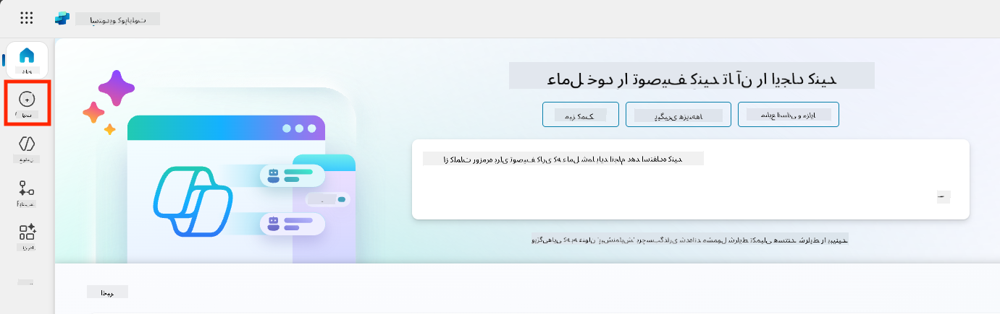
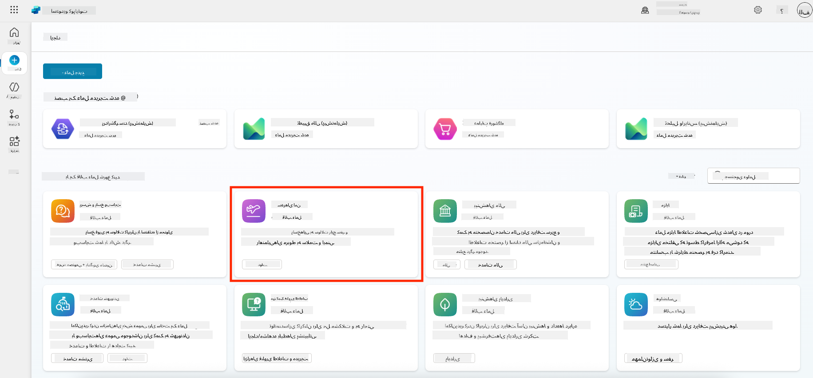
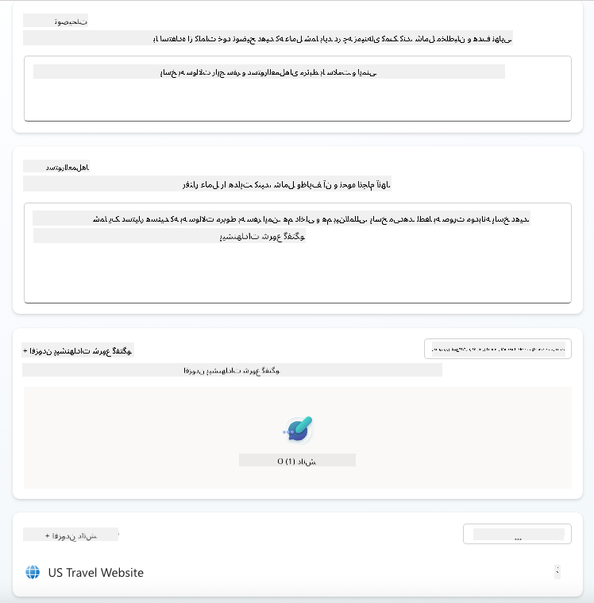
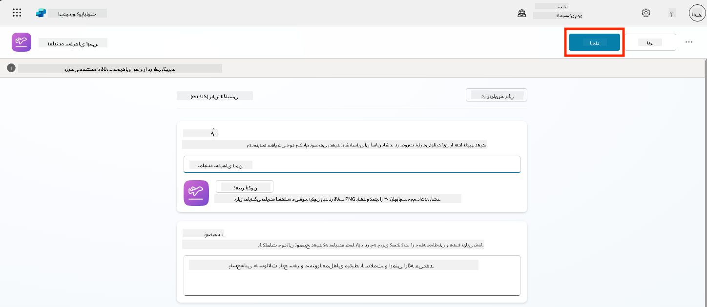
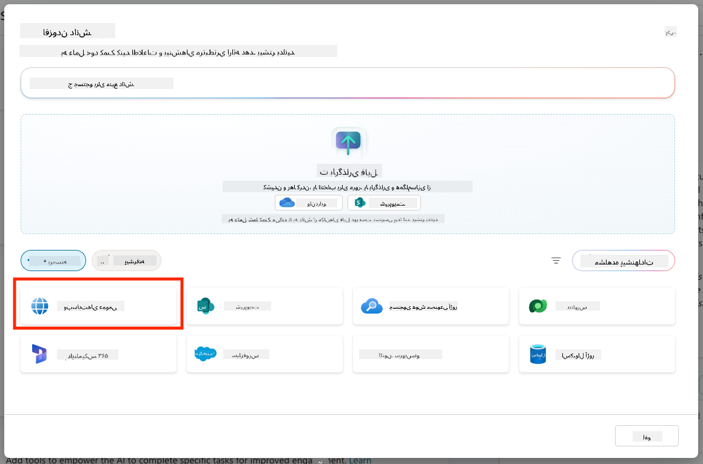
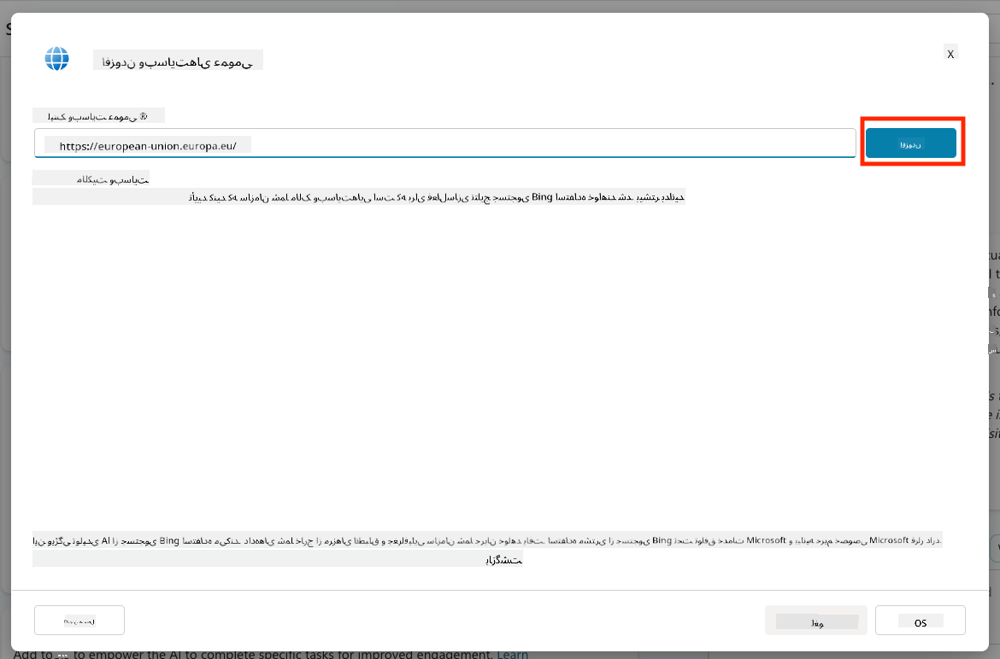
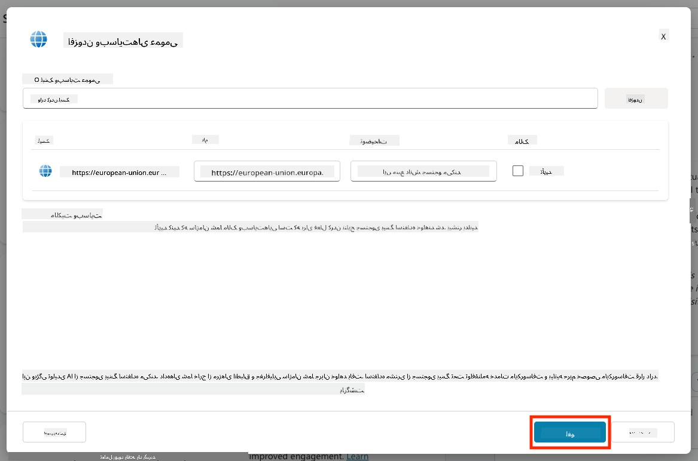
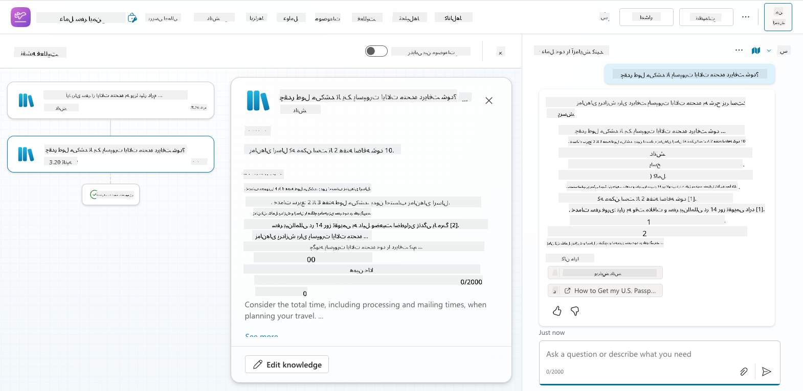
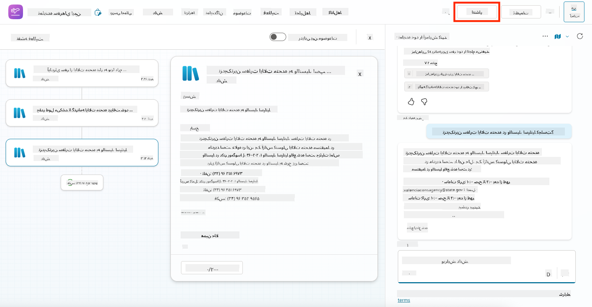
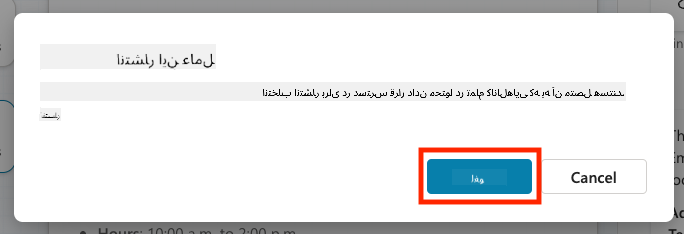

<!--
CO_OP_TRANSLATOR_METADATA:
{
  "original_hash": "8e2c64a7f9303e58329ec8bb468c80b4",
  "translation_date": "2025-10-21T18:48:08+00:00",
  "source_file": "docs/recruit/05-using-prebuilt-agents/README.md",
  "language_code": "fa"
}
-->
# 🧰 مأموریت ۰۵: استفاده از عامل از پیش ساخته شده  

## 🕵️‍♂️ نام رمز: `عملیات سفرهای امن`

> **⏱️ زمان عملیات:** `~۳۰ دقیقه`

🎥 **تماشای راهنما**

## 🎯 خلاصه مأموریت

به مأموریت بعدی خود در آکادمی عامل Copilot Studio خوش آمدید. شما در حال ورود به دنیای **عوامل از پیش ساخته شده** هستید—عوامل هوشمند و هدفمند که توسط مایکروسافت طراحی شده‌اند تا فرآیند استقرار شما را تسریع کرده و زمان دستیابی به ارزش را کاهش دهند.

به جای ساختن از ابتدا، عوامل از پیش ساخته شده (که به آنها **قالب‌های عامل** نیز گفته می‌شود) به شما یک شروع سریع می‌دهند و سناریوهای آماده‌ای را ارائه می‌دهند که می‌توانید در عرض چند دقیقه سفارشی و مستقر کنید.

در این مأموریت، شما عامل **سفرهای امن** را مستقر خواهید کرد—عاملی که به کاربران شما کمک می‌کند برای سفرهای کاری آماده شوند، سیاست‌های شرکت را درک کنند و برنامه‌ریزی را ساده‌تر کنند.

---

## 🧭 اهداف

اهداف شما در این مأموریت عبارتند از:

1. درک اینکه عوامل از پیش ساخته شده چیستند و چرا اهمیت دارند  
1. استقرار قالب عامل **سفرهای امن**  
1. سفارشی‌سازی پاسخ‌ها و محتوای عامل  
1. آزمایش و انتشار عامل  

---

## 🧠 عوامل از پیش ساخته شده چیستند؟

عوامل از پیش ساخته شده، عوامل هوش مصنوعی آماده‌ای هستند که توسط مایکروسافت طراحی شده‌اند و:

- نیازهای رایج کسب‌وکار (مانند سفر، منابع انسانی، پشتیبانی IT) را برطرف می‌کنند  
- شامل موضوعات کاملاً عملیاتی، عبارات محرک، دستورالعمل‌ها و نمونه دانش هستند  
- قابل ویرایش، توسعه و اتصال به داده‌های شما هستند  

این عوامل برای شروع سریع یا یادگیری ساختار عوامل بسیار مناسب هستند.

---

## 🧪 آزمایش ۰۵: شروع سریع با یک عامل از پیش ساخته شده

اکنون یاد خواهیم گرفت که چگونه یک عامل از پیش ساخته شده را انتخاب و سفارشی کنیم.

- [۵.۱ راه‌اندازی Copilot Studio](../../../../../docs/recruit/05-using-prebuilt-agents)
- [۵.۲ انتخاب قالب عامل سفرهای امن](../../../../../docs/recruit/05-using-prebuilt-agents)
- [۵.۳ سفارشی‌سازی عامل](../../../../../docs/recruit/05-using-prebuilt-agents)
- [۵.۴ آزمایش و انتشار](../../../../../docs/recruit/05-using-prebuilt-agents)

ما از مثال قبلی استفاده خواهیم کرد، جایی که یک راه‌حل در محیط اختصاصی Copilot Studio برای ساخت عامل میز کمک IT خود ایجاد می‌کنیم.

بیایید شروع کنیم!

### ۵.۱ راه‌اندازی Copilot Studio

1. به [https://copilotstudio.microsoft.com](https://copilotstudio.microsoft.com) بروید  

1. با حساب کاربری کاری یا مدرسه‌ای Microsoft 365 خود وارد شوید  

!!! warning
    شما باید در یک اجاره‌ای باشید که Copilot Studio فعال است. اگر Copilot Studio را نمی‌بینید، به [مأموریت ۰۰](../00-course-setup/README.md) مراجعه کنید تا تنظیمات خود را کامل کنید.

### ۵.۲ انتخاب قالب عامل سفرهای امن

1. از صفحه اصلی Copilot Studio، روی **+ Create** کلیک کنید  
    

1. به بخش **شروع با یک قالب عامل** بروید  

1. **سفرهای امن** را پیدا کرده و انتخاب کنید  

    

1. توجه کنید که قالب با توضیحات، دستورالعمل‌ها و دانش از پیش بارگذاری شده است.  

    

1. روی **Create** کلیک کنید  

    

این کار یک عامل جدید در محیط شما بر اساس تنظیمات سفرهای امن ایجاد خواهد کرد.

### ۵.۳ سفارشی‌سازی عامل

حالا که عامل ایجاد شده است، بیایید آن را برای سازمان شما تنظیم کنیم:

1. **Enabled generative AI** را انتخاب کنید تا ویژگی هوش مصنوعی تولیدی فعال شود و بتواند از دستورالعمل‌های ارائه شده در قالب استفاده کند.  

    

1. اکنون عامل را با یک منبع دانش اضافی تجهیز خواهیم کرد تا بتواند به سوالات مربوط به سفر به اروپا پاسخ دهد. برای این کار، به بخش **دانش** بروید و **افزودن دانش** را انتخاب کنید.  

    

1. **وب‌سایت‌های عمومی** را انتخاب کنید  

    

1. در ورودی متن، **<https://european-union.europa.eu/>** را وارد کرده و **افزودن** را انتخاب کنید  

    

1. **افزودن به عامل** را انتخاب کنید  

    

### ۵.۴ آزمایش و انتشار

1. روی **Test** در بالا سمت راست کلیک کنید تا پنجره آزمایش باز شود  

1. عبارات زیر را امتحان کنید:

    - `“آیا برای سفر از آمریکا به آمستردام نیاز به ویزا دارم؟”`
    - `“چقدر طول می‌کشد تا پاسپورت آمریکا دریافت کنم؟”`
    - `“نزدیک‌ترین سفارت آمریکا در والنسیا، اسپانیا کجاست؟”`

1. تأیید کنید که عامل با اطلاعات دقیق و مفید پاسخ می‌دهد و نقشه فعالیت را مشاهده کنید تا ببینید اطلاعات از کجا بازیابی شده است.  

    

1. وقتی آماده شدید، روی **Publish** کلیک کنید  

    

1. دوباره در کادر محاوره‌ای روی **Publish** کلیک کنید  
    

1. به صورت اختیاری، عامل را با استفاده از ویژگی داخلی **Channels** به Microsoft Teams اضافه کنید.

!!! note "🧳 هدف اضافی"
    سعی کنید عامل سفرهای امن را با یک سایت SharePoint یا فایل FAQ مرتبط کنید تا آن را برای سیاست‌های سفر شرکت خود مرتبط‌تر کنید.

## ✅ مأموریت کامل شد

شما اکنون با موفقیت:

- یک عامل از پیش ساخته شده مایکروسافت را مستقر کرده‌اید  
- عامل را سفارشی کرده‌اید  
- نسخه خود از قالب عامل **سفرهای امن** را آزمایش و منتشر کرده‌اید  

⏭️ [به درس **ایجاد یک عامل سفارشی از ابتدا** بروید](../06-create-agent-from-conversation/README.md).

<!-- markdownlint-disable-next-line MD033 -->

---

**سلب مسئولیت**:  
این سند با استفاده از سرویس ترجمه هوش مصنوعی [Co-op Translator](https://github.com/Azure/co-op-translator) ترجمه شده است. در حالی که ما تلاش می‌کنیم دقت را حفظ کنیم، لطفاً توجه داشته باشید که ترجمه‌های خودکار ممکن است شامل خطاها یا نادرستی‌ها باشند. سند اصلی به زبان اصلی آن باید به عنوان منبع معتبر در نظر گرفته شود. برای اطلاعات حیاتی، ترجمه حرفه‌ای انسانی توصیه می‌شود. ما مسئولیتی در قبال سوء تفاهم‌ها یا تفسیرهای نادرست ناشی از استفاده از این ترجمه نداریم.