<!--
CO_OP_TRANSLATOR_METADATA:
{
  "original_hash": "180f9cc0b40527f61be092c9b0f72aba",
  "translation_date": "2025-10-21T18:38:24+00:00",
  "source_file": "docs/recruit/06-create-agent-from-conversation/README.md",
  "language_code": "fa"
}
-->
# 🚨 مأموریت ۰۶: ایجاد یک عامل سفارشی با استفاده از زبان طبیعی در Copilot و اتصال آن به داده‌های شما

## 🕵️‍♂️ نام رمز: `عملیات ساخت عامل`

> **⏱️ زمان عملیات:** `~۷۵ دقیقه`

🎥 **تماشای راهنما**

[](https://www.youtube.com/watch?v=qZTtQVncGFg "تماشای راهنما در یوتیوب")

## 🎯 خلاصه مأموریت

به مأمور سازنده خوش آمدید. این مأموریت شما را در جایگاه فرماندهی قدرتمندترین قابلیت Copilot Studio قرار می‌دهد - ایجاد یک عامل سفارشی از ابتدا با استفاده از زبان طبیعی... و تقویت آن با داده‌های خودتان.

این فقط یک چت‌بات دیگر نیست. شما در حال ساخت یک همکار دیجیتال مجهز به دانش هستید - کسی که می‌تواند استدلال کند، پاسخ دهد و به اطلاعات واقعی سازمانی ارجاع دهد.

سلاح شما چیست؟ زبان طبیعی. مأموریت شما چیست؟ طراحی، آموزش و آزمایش یک عامل کمک‌رسانی کاملاً سفارشی که به سوالات IT با استفاده از SharePoint، فایل‌های آپلود شده یا URL‌های شرکت پاسخ دهد.

بیایید عامل خود را از پایه بسازیم.

## 🔎 اهداف

در این مأموریت، شما یاد خواهید گرفت:

1. درک اینکه عوامل سفارشی چیستند و چگونه با قالب‌های پیش‌ساخته متفاوت هستند
1. ایجاد عوامل با استفاده از دستورات زبان طبیعی و طراحی مکالمه با Copilot
1. اتصال عوامل به منابع دانش سازمانی شامل SharePoint، اسناد و وب‌سایت‌ها
1. یادگیری درباره ارکستراسیون تولیدی و اینکه چگونه عوامل به صورت پویا با استفاده از منابع داده مختلف جستجو و پاسخ می‌دهند
1. ساخت و آزمایش یک عامل کمک‌رسانی IT کاملاً عملیاتی که می‌تواند به سوالات از داده‌های شما پاسخ دهد

## 🤔 عامل سفارشی چیست؟

یک عامل سفارشی یک چت‌بات یا دستیار مجازی است که شما در Copilot Studio طراحی و ایجاد می‌کنید تا به کاربران در انجام وظایف یا پاسخ به سوالات خاص کمک کند. به آن سفارشی گفته می‌شود زیرا:

- **شما هدف را تعیین می‌کنید** - کمک به کاربران برای درخواست مرخصی، بررسی وضعیت سفارش، ارائه کمک در سوالات مرتبط با IT.
- **شما مکالمه را تعریف می‌کنید** - آنچه عامل می‌گوید و چگونه باید پاسخ دهد.
- **شما آن را با داده‌های خودتان متصل می‌کنید** - اتصال به داده‌های سازمانی از طریق منابع دانش پشتیبانی شده داخلی.
- **شما آن را به سیستم‌ها یا برنامه‌های خودتان متصل می‌کنید** - انتخاب از میان کانکتورها، جریان‌ها، API‌های REST و سرورهای پروتکل زمینه مدل.

!!! note
    به این صورت فکر کنید: شما در حال ساخت یک دستیار دیجیتال هستید که می‌تواند با کاربران صحبت کند و وظایف را برای آنها انجام دهد، مانند پاسخ به سوالات، جمع‌آوری اطلاعات مورد نیاز برای یک فرآیند یا اتصال به داده‌های سازمانی.

### 🤖 یک عامل سفارشی چه کاری می‌تواند انجام دهد؟

یک عامل سفارشی می‌تواند موارد زیر را انجام دهد:

- از کاربران اطلاعاتی مانند نام‌ها، تاریخ‌ها یا ترجیحات درخواست کند.
- اطلاعات را در یک پایگاه داده یا جدول ذخیره کند.
- بر اساس سوالات پرسیده شده داده‌ها را جستجو کرده و پاسخ دهد.
- به صورت خودکار بدون تعامل مستقیم کاربران با عامل کار کند.
- اقدامات را به صورت درخواستی از طریق تعامل مستقیم کاربران یا به صورت خودکار مانند ارسال ایمیل یا ایجاد رکوردها انجام دهد.

### 👩🏻‍💻 چرا از یک عامل سفارشی استفاده کنیم؟

- صرفه‌جویی در زمان با خودکارسازی وظایف تکراری.
- ارائه تجربه‌ای دوستانه و هدایت‌شده به کاربران.
- تطبیق آن با نیازهای کسب‌وکار یا پروژه شما.

### ✨ مثال

شما یک عامل سفارشی ایجاد می‌کنید که به کارکنان کمک می‌کند درخواست مرخصی بدهند.

این عامل نام آنها، تاریخ‌های مرخصی و نام مدیرشان را درخواست می‌کند، سپس اطلاعات را در سیستم تعیین‌شده‌ای که درخواست‌های مرخصی را مدیریت می‌کند، مانند یک لیست SharePoint ذخیره می‌کند.

اکنون، به جای اینکه کارکنان به لیست SharePoint بروند و یک آیتم جدید ایجاد کنند، فقط با عامل چت می‌کنند.

## 🗣️ استفاده از زبان طبیعی برای ایجاد عوامل

قبلاً یاد گرفتید که چگونه به سرعت عوامل را در Copilot Studio با استفاده از قالب‌های پیش‌ساخته عامل در [درس ۰۵ - شروع سریع با عوامل پیش‌ساخته](../05-using-prebuilt-agents/README.md) بسازید. در این درس، به تجربه ایجاد مکالمه‌ای با Copilot می‌پردازیم. Copilot Studio ساخت عوامل را با چت کردن با Copilot آسان می‌کند، درست مثل داشتن یک مکالمه.

در Copilot Studio، نیازی به نوشتن کد برای ایجاد یک عامل ندارید. به جای آن، شما توضیح می‌دهید که می‌خواهید عامل شما چه کاری انجام دهد و Copilot به شما کمک می‌کند آن را مرحله به مرحله از طریق یک تجربه شبیه چت بسازید.

## 🌱 اما من تازه‌کارم در "توصیف آنچه می‌خواهم" - چه کار کنم؟

توصیف در زبان طبیعی برای ایجاد یک عامل سفارشی ممکن است برای شما یک مفهوم جدید باشد. هر زمان که از Copilot در محصولات و خدمات مایکروسافت استفاده می‌کنید، شما از زبان طبیعی به شکل یک _دستور_ استفاده می‌کنید.

یک دستور پیام یا دستوری است که شما به یک عامل هوش مصنوعی می‌دهید تا به آن بگویید چه کاری می‌خواهید انجام دهد. به آن به عنوان دادن دستورالعمل به یک دستیار فکر کنید. هرچه دستورالعمل‌های شما واضح‌تر باشد، دستیار شما راحت‌تر آن را درک کرده و اجرا می‌کند.

### 🪄 چرا دستورات مهم هستند

- رفتار عامل را هدایت می‌کنند.
- به عامل کمک می‌کنند تا نوع مکالمه را درک کند.
- یک دستور خوب عامل را مفیدتر و دقیق‌تر می‌کند.

### 📝 نکات برای نوشتن یک دستور خوب

- واضح و مشخص باشید - دقیقاً بگویید که می‌خواهید عامل چه کاری انجام دهد.
- مانند کاربر فکر کنید - کاربر چه خواهد گفت؟ عامل چه باید پاسخ دهد؟
- مثال‌ها را شامل کنید - اگر ممکن است، یک نمونه تعامل ارائه دهید.

### ✨ مثال

فرض کنید تیم منابع انسانی نیاز به یک عامل دارد که در درخواست‌های مرخصی کمک کند.

دستور می‌تواند این باشد:

    “من می‌خواهم یک عامل بسازم که به کاربران کمک کند درخواست مرخصی بدهند. وقتی کاربر می‌گوید که می‌خواهد مرخصی بگیرد، عامل باید نام آنها، تاریخ شروع مرخصی، تاریخ پایان مرخصی و نام مدیرشان را درخواست کند. وقتی کاربر این اطلاعات را ارائه داد، عامل باید آن را در یک لیست SharePoint به نام ‘درخواست‌های مرخصی’ ذخیره کند و یک اعلان در یک کانال اختصاصی Microsoft Teams ارسال کند.”

چرا این دستور کار می‌کند:

- **هدف را به وضوح بیان می‌کند** - درخواست مرخصی
- **تعامل کاربر را توصیف می‌کند** - آنچه کاربر می‌گوید و آنچه عامل باید درخواست کند
- **داده‌های مورد نیاز را فهرست می‌کند** - نام، تاریخ شروع، تاریخ پایان، مدیر
- **محل ذخیره داده‌ها را ذکر می‌کند** - یک لیست SharePoint به نام درخواست‌های مرخصی

## 🔮 خوب، عامل خود را ایجاد کردم... چگونه آن را با دانش متصل کنم؟

در Copilot Studio، منابع دانش مکان‌هایی هستند که عامل شما می‌تواند اطلاعاتی برای ارائه پاسخ‌های بهتر پیدا کند. وقتی این منابع را اضافه می‌کنید، عامل شما می‌تواند داده‌های سازمانی شما را از مکان‌هایی مانند Power Platform، Dynamics 365، وب‌سایت‌ها و سایر سیستم‌ها یا خدماتی که شرکت شما استفاده می‌کند، وارد کند.

این منابع با هوش مصنوعی همکاری می‌کنند تا به عامل شما کمک کنند به سوالات کاربران با دقت بیشتری پاسخ دهد، این از طریق چیزی که به عنوان **ارکستراسیون تولیدی** شناخته می‌شود، انجام می‌شود.

### 🌿 ارکستراسیون تولیدی در زمینه عوامل چیست؟

ارکستراسیون تولیدی به این معناست که عامل از هوش مصنوعی برای تصمیم‌گیری پویا در مورد نحوه پاسخ به یک سوال با ترکیب مهارت‌های زبانی داخلی خود با اطلاعات از منابع دانش اضافه شده استفاده می‌کند.

وقتی یک کاربر سوالی می‌پرسد، عامل:

- سوال را با استفاده از هوش مصنوعی درک می‌کند.
- می‌تواند اطلاعات گم‌شده را با تولید سوالات در لحظه از کاربران درخواست کند.
- مرتبط‌ترین منابع دانش را انتخاب می‌کند.
- آن منابع را برای یافتن پاسخ‌ها جستجو می‌کند.
- یک پاسخ طبیعی و مفید با استفاده از اطلاعاتی که پیدا کرده تولید می‌کند.

### 🏦 چرا منابع دانش مهم هستند؟

1. **پاسخ‌های هوشمندتر** - وقتی منابع دانش را اضافه می‌کنید، عامل شما می‌تواند پاسخ‌های بهتر و دقیق‌تری با استفاده از داده‌های واقعی سازمان شما ارائه دهد.

1. **کار کمتر دستی** - شما مجبور نیستید هر پاسخ ممکن را بنویسید. عامل می‌تواند منابع اضافه شده را جستجو کرده و به صورت خودکار پاسخ دهد.

1. **استفاده از اطلاعات قابل اعتماد** - عامل شما می‌تواند پاسخ‌ها را از سیستم‌هایی که قبلاً استفاده می‌کنید مانند Dataverse، SharePoint یا وب‌سایت‌های شرکت استخراج کند تا کاربران اطلاعات قابل اعتماد از یک منبع معتبر داشته باشند.

1. **کار با هوش مصنوعی تولیدی** - منابع دانش و هوش مصنوعی به عامل شما کمک می‌کنند سوالات را درک کرده و به صورت طبیعی پاسخ دهند، حتی اگر سوال از پیش برنامه‌ریزی نشده باشد یا به عنوان دستور اولیه اضافه نشده باشد.

1. **انعطاف‌پذیر و قابل گسترش** - شما می‌توانید منابع دانش را در هر زمان در طول تنظیمات یا در آینده اضافه کنید، عامل شما با تغییر نیازهای شما هوشمندتر می‌شود.

### ✨ مثال

تصور کنید شما یک عامل برای کمک به کارکنان در سوالات منابع انسانی ایجاد می‌کنید. شما سند سیاست منابع انسانی شرکت و سایت SharePoint را به عنوان منابع دانش اضافه می‌کنید.

وقتی یک کارمند می‌پرسد، _“چند روز مرخصی دارم؟”_، عامل از ارکستراسیون تولیدی برای جستجوی آن منابع استفاده می‌کند و با سیاست صحیح پاسخ می‌دهد بدون اینکه شما مجبور باشید آن پاسخ را به صورت دستی بنویسید. این باعث صرفه‌جویی در زمان شما می‌شود تا نیازی به در نظر گرفتن هر سوال ممکن که یک کارمند ممکن است درباره حقوق خود بپرسد نداشته باشید.

## انواع منابع دانش که می‌توان اضافه کرد

1. **وب‌سایت‌های عمومی**
    - **چه کاری انجام می‌دهد:** وب‌سایت‌های خاص (مانند سایت شرکت شما) را با استفاده از Bing جستجو می‌کند.
    - **چرا مفید است:** عالی برای استخراج اطلاعات عمومی مانند سوالات متداول یا جزئیات محصولات.

1. **اسناد**
    - **چه کاری انجام می‌دهد:** از اسنادی که مستقیماً به عامل خود آپلود می‌کنید، مانند فایل‌های PDF یا Word استفاده می‌کند. این فایل‌های آپلود شده به صورت امن در Dataverse ذخیره می‌شوند.
    - **چرا مفید است:** به عامل شما امکان پاسخ به سوالات بر اساس راهنماها، دستورالعمل‌ها یا سیاست‌های داخلی را می‌دهد.

1. **SharePoint**
    - **چه کاری انجام می‌دهد:** به پوشه‌ها یا فایل‌های SharePoint با استفاده از Microsoft Graph Search متصل می‌شود.
    - **چرا مفید است:** ایده‌آل برای دسترسی به اسناد تیمی، سیاست‌های منابع انسانی یا فایل‌های پروژه ذخیره شده در SharePoint.

1. **Dataverse**
    - **چه کاری انجام می‌دهد:** از داده‌های ساختاریافته از جداول و ردیف‌های محیط Dataverse شما استفاده می‌کند و می‌تواند مترادف‌ها و تعاریف واژه‌نامه‌ای برای جداول و ستون‌ها را برای بهبود پاسخ‌های عامل اعمال کند.
    - **چرا مفید است:** وقتی نیاز به جستجوی داده‌های سازمانی ذخیره شده در Dataverse دارید، مانند اطلاعات مشتری.

1. **دانش زمان واقعی با کانکتورها**
    - **چه کاری انجام می‌دهد:** به عامل شما امکان دسترسی به داده‌های زنده از سایر سیستم‌های سازمانی مانند Salesforce، ServiceNow، Dynamics 365، AzureSQL، Databricks و موارد دیگر را در طول یک مکالمه با استفاده از مجوزهای کاربر می‌دهد.
    - **چرا مفید است:** پاسخ‌های به‌روز، امن و دقیق بدون ذخیره یا تکرار داده‌ها ارائه می‌دهد، عامل شما را هوشمندتر و ایمن‌تر می‌کند.

1. **Azure AI Search**
    - **چه کاری انجام می‌دهد:** به عامل شما امکان جستجو در مجموعه‌های بزرگ اسناد ذخیره شده در Azure با استفاده از جستجوی معنایی و برداری برای درک سوالات کاربران را می‌دهد.
    - **چرا مفید است:** پاسخ‌های دقیق و قابل اعتماد از منابع داده پیچیده ارائه می‌دهد، از استنادها پشتیبانی می‌کند و برای مجموعه‌های بزرگ اسناد با کنترل‌های دسترسی امن به خوبی مقیاس‌پذیر است.

## 🔒 یادداشت درباره امنیت

### احراز هویت منابع دانش

برخی منابع مانند SharePoint و Dataverse نیاز به احراز هویت کاربر دارند. این به این معناست که عامل فقط داده‌هایی را در پاسخ خود ارجاع می‌دهد که کاربر اجازه دیدن آنها را دارد. در حالی که سایر منابع ممکن است تنظیمات اضافی برای اتصال عامل به آنها نیاز داشته باشند، مانند Azure AI Search که نیاز به حساب Azure و مشخص کردن نوع احراز هویت دارد.

## بهبود پاسخ‌های عامل شما در Copilot Studio

پس از اینکه عامل شما از تجربه ایجاد مکالمه‌ای ایجاد شد، می‌خواهید عامل خود را در برابر دستورالعمل‌هایی که Copilot از دستور شما تولید کرده آزمایش کنید. بهبود پاسخ‌های عامل شما در Copilot Studio همه چیز درباره این است که مطمئن شوید اهداف شما را به وضوح درک کرده و اطلاعات مناسب برای کار دارد.

1. **دستورالعمل‌های عامل را اصلاح کنید** - این جایی است که شما به عامل خود می‌گویید چگونه باید رفتار کند. از زبان واضح و مشخص استفاده کنید.

    برای مثال:

    ✅ “مانند یک عامل پشتیبانی مشتری دوستانه که چیزها را به سادگی توضیح می‌دهد عمل کن.”

    ❌ “مفید باش.” (خیلی مبهم)

1. **لحن و زبان را بررسی کنید** - مطمئن شوید لحن عامل با مخاطبان شما مطابقت دارد.

    شما می‌توانید آن را تنظیم کنید تا:

    - دوستانه و غیررسمی باشد.
    - حرفه‌ای و مختصر باشد.
    - حمایت‌کننده و صبور باشد.

1. **منابع دانش را اضافه یا به‌روزرسانی کنید** - اگر عامل شما نیاز به پاسخ به سوالات درباره یک موضوع دارد، مطمئن شوید که به اطلاعات مناسب دسترسی دارد.

    - لینک‌هایی به وب‌سایت‌ها، اسناد یا سوالات متداول اضافه کنید.
    - محتوا را به‌روز نگه دارید.
    - از اطلاعات واضح و ساختارمند استفاده کنید.

1. **از موضوعات و محرک‌ها استفاده کنید** - اگر عامل شما نیاز به مدیریت وظایف یا مکالمات خاص دارد، می‌توانید موضوعاتی با عبارات محرک ایجاد کنید. این به هدایت مکالمه دقیق‌تر کمک می‌کند. در درس بعدی بیشتر درباره این موضوع یاد خواهیم گرفت.

1. **با سوالات واقعی آزمایش کنید** - سعی کنید سوالاتی که کاربران ممکن است بپرسند از عامل خود بپرسید.

    اگر پاسخ‌ها خوب نیستند:

    - دستورالعمل‌های سیستم را تنظیم کنید.
    - مثال‌ها یا دانش بیشتری اضافه کنید.
    - سوالات خود را بازنویسی کنید تا ببینید چگونه پاسخ می‌دهد.

1. **بررسی و تکرار کنید** - بهبود یک عامل یک فرآیند مداوم است!

    پس از انتشار:

    - بازخورد کاربران را جمع‌آوری کنید.
    - به سوالات یا سردرگمی‌های رایج توجه کنید.
    - تنظیمات عامل را بهبود دهید.

## 🧪 آزمایشگاه ۰۶: ایجاد یک عامل سفارشی در Copilot Studio

اکنون یاد خواهیم گرفت که چگونه یک عامل سفارشی ایجاد کنیم که بتواند بر اساس داده‌های شما چت کند

- [۶.۱ استفاده از زبان طبیعی برای ایجاد یک عامل با Copilot](../../../../../docs/recruit/06-create-agent-from-conversation)
- [۶.۲ افزودن یک منبع دانش داخلی با استفاده از سایت SharePoint](../../../../../docs/recruit/06-create-agent-from-conversation)
- [۶.۳ افزودن یک منبع دانش داخلی با آپلود یک سند](../../../../../docs/recruit/06-create-agent-from-conversation)
- [۶.۴ آزمایش عامل](../../../../../docs/recruit/06-create-agent-from-conversation)

### ✨ مورد استفاده
ما از همان سناریوی استفاده در [درس 03 - ایجاد یک عامل اعلامی برای Microsoft 365 Copilot](../03-create-a-declarative-agent-for-M365Copilot/README.md#use-case-scenario) استفاده خواهیم کرد.

**به عنوان** یک کارمند

**می‌خواهم** از عامل میز کمک فناوری اطلاعات برای مشکلاتی مانند مشکلات دستگاه، عیب‌یابی شبکه، تنظیم چاپگر به سرعت و با دقت کمک بگیرم.

**تا بتوانم** بهره‌وری خود را حفظ کنم و مشکلات فنی را بدون تأخیر حل کنم.

بیا شروع کنیم!

### ✨ پیش‌نیازها

- **سایت SharePoint**

ما از سایت SharePoint **Contoso IT** که در [درس 00 - تنظیم دوره - مرحله 3: ایجاد سایت جدید SharePoint](../00-course-setup/README.md#step-4-create-new-sharepoint-site) ایجاد شده است، استفاده خواهیم کرد.

اگر سایت SharePoint **Contoso IT** را تنظیم نکرده‌اید، لطفاً به [درس 00 - تنظیم دوره - مرحله 3: ایجاد سایت جدید SharePoint](../00-course-setup/README.md#step-4-create-new-sharepoint-site) بازگردید.

- **راه‌حل**

ما از راه‌حل **Contoso Helpdesk Agent** که در [درس 04 - ایجاد یک راه‌حل برای عامل شما](../04-creating-a-solution/README.md#41-create-a-solution-publisher) ایجاد شده است، استفاده خواهیم کرد.

اگر راه‌حل **Contoso Agent** را تنظیم نکرده‌اید، لطفاً به [درس 04 - ایجاد یک راه‌حل برای عامل شما](../04-creating-a-solution/README.md#41-create-a-solution-publisher) بازگردید.

### 6.1 استفاده از زبان طبیعی برای ایجاد یک عامل با Copilot

!!! warning "سؤالات Copilot ممکن است در جلسات مختلف متفاوت باشد"

    تجربه ایجاد مکالمه‌ای با Copilot ممکن است هر بار متفاوت باشد، جایی که سؤالات ارائه شده برای راهنمایی ممکن است کمی با جلسات قبلی متفاوت باشند.

1. به صفحه اصلی Copilot Studio بروید و در قسمت مربوطه، درخواست زیر را وارد کنید که عامل میز کمک فناوری اطلاعات را توصیف می‌کند. این درخواست شامل هدف عامل، زمینه، وظایف مورد انتظار و قالب پاسخ عامل است.

    ```text
    You are an IT help desk agent. Your goal is to assist users with their IT issues. You can access information from our company's knowledge base at https://support.microsoft.com/en-us. Your responses should be polite and helpful. If a user reports a slow computer, ask about the age of the device, current software versions, and if they've recently installed any new programs. If a user is experiencing trouble logging into their email, guide them through password reset procedures. You should be concise and informative, using step-by-step instructions with bullet points when appropriate.
    ```

      

1. تجربه ایجاد مکالمه‌ای با Copilot بارگذاری خواهد شد. خواهید دید که Copilot در حال پاسخ دادن به شما است.

      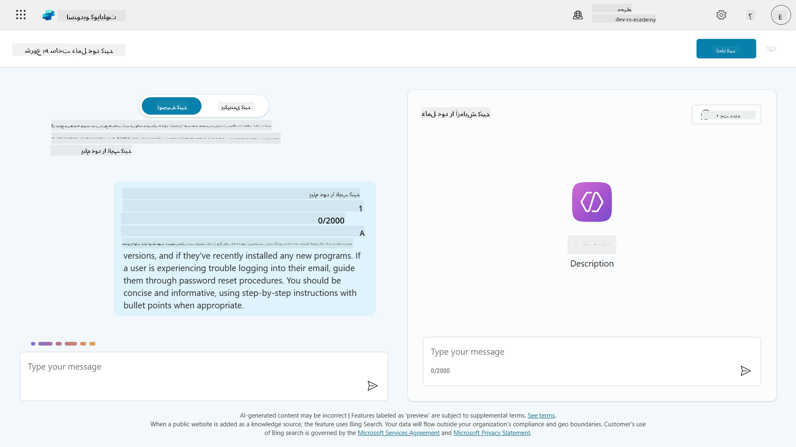

1. Copilot تأیید می‌کند که عامل با دستورالعمل‌های ارائه شده تنظیم شده است و از شما تأیید نام عامل را می‌خواهد. ما از Copilot می‌خواهیم که عامل ما را به نام زیر نام‌گذاری کند:

       ```text
       Contoso Helpdesk Agent
       ```

      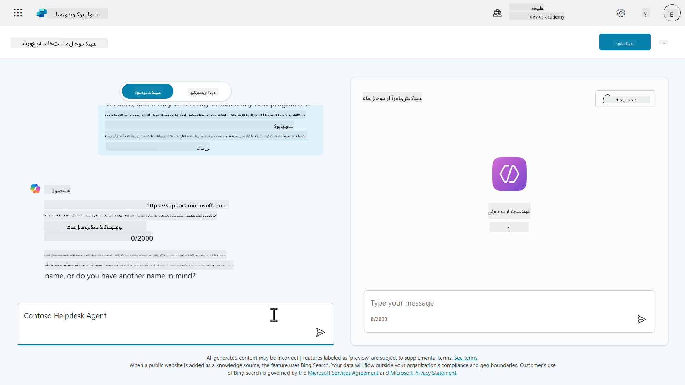

1. Copilot درخواست را انجام می‌دهد و خواهیم دید که نام عامل در پنل عامل به‌روزرسانی شده است. سپس Copilot از ما می‌خواهد دستورالعمل‌ها را اصلاح کنیم. از ما می‌پرسد که چگونه باید به مسائل خاص پاسخ دهیم و ما درخواست می‌کنیم که ابتدا مسئله را تأیید کند، مثال‌هایی از موضوعات برای پاسخ ارائه دهد و پاسخ را به صورت نکات گلوله‌ای قالب‌بندی کند.

    متن زیر را کپی کرده و درخواست را به Copilot ارسال کنید.

       ```text
       درخواست‌های فوری را اولویت‌بندی کنید. مثال‌هایی از مشکلات یا سناریوهای فناوری اطلاعات برای کمک: مشکلات دستگاه، اتصال شبکه، مشکلات ورود به سیستم. هنگام عیب‌یابی، ابتدا مسئله آن‌ها را تأیید کنید و با همدلی پاسخ دهید، سپس راهنمایی گام به گام با استفاده از نکات گلوله‌ای ارائه دهید و بپرسید آیا نیاز به کمک بیشتری دارند.
       ```

      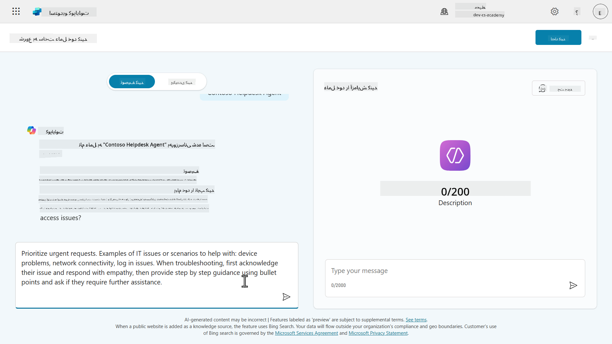

1. دستورالعمل‌های عامل پس از دریافت درخواست توسط Copilot به‌روزرسانی خواهند شد. توجه کنید که در پنل سمت راست، درخواست‌های اولیه اکنون ظاهر شده‌اند. این درخواست‌ها بر اساس دستورالعمل‌های ما شکل گرفته‌اند.

    سپس Copilot از ما می‌خواهد وب‌سایت‌های عمومی را برای پایه‌گذاری دانش عامل اضافه کنیم.

    متن زیر را کپی کرده و درخواست را به Copilot ارسال کنید.

      ```text
      https://support.microsoft.com
      ```

      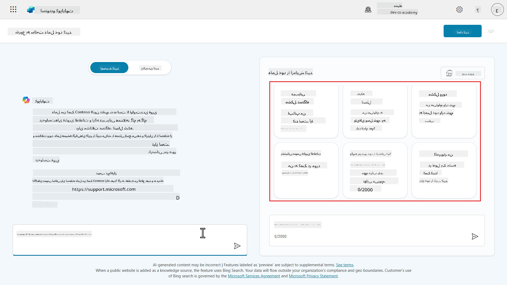

1. وب‌سایت عمومی به عنوان منبع دانش اضافه خواهد شد. Copilot می‌پرسد آیا منابع دانش اضافی باید اضافه شوند. ما نیازی به اضافه کردن وب‌سایت‌های عمومی اضافی نداریم.

    متن زیر را کپی کرده و درخواست را به Copilot ارسال کنید.

      ```text
      Proceed with setup
      ```

      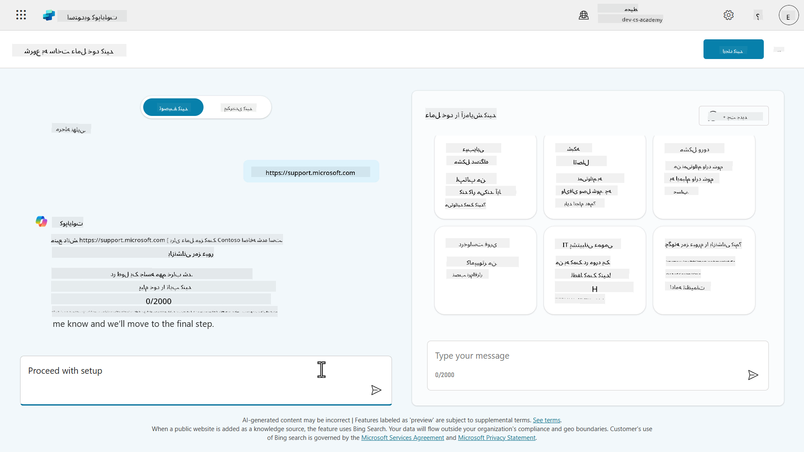

1. Copilot تأیید می‌کند که تنظیمات عامل Contoso Helpdesk Agent ما کامل شده است، اما ما یک تغییر دیگر اضافه خواهیم کرد. ما درخواست می‌کنیم که عامل ما به سؤالات مربوط به منابع انسانی پاسخ ندهد. این به عامل ما اطلاع می‌دهد که نباید به سؤالات مربوط به منابع انسانی که توسط کاربران پرسیده می‌شود پاسخ دهد.

    متن زیر را کپی کرده و درخواست را به Copilot ارسال کنید.

       ```text
       به سؤالات مربوط به منابع انسانی کمک نکنید، مثال‌ها عبارتند از: موجودی مرخصی تعطیلات من چقدر است؟ چند روز بیماری دارم؟ URL پورتال حقوق و دستمزد ما چیست؟
       ```

      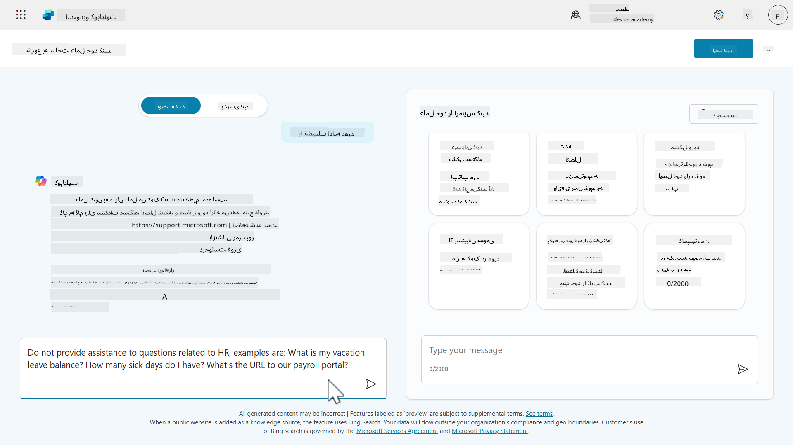

1. دستورالعمل‌ها به‌روزرسانی خواهند شد تا به سؤالات مربوط به منابع انسانی پاسخ داده نشود. ما نیازی به انجام به‌روزرسانی‌های بیشتر نداریم، عامل ما آماده ایجاد است.

      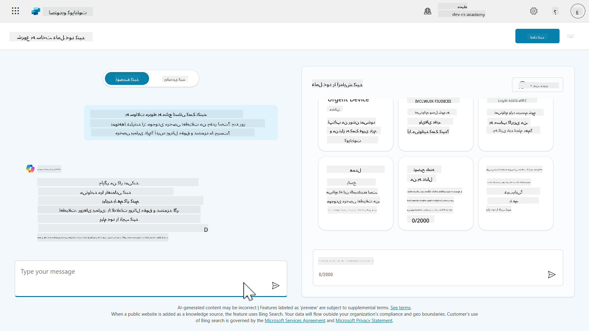

1. قبل از ایجاد عامل خود، بیایید چند کار انجام دهیم.

    ابتدا، برگه **Configure** را انتخاب کنید تا جزئیات عامل تعریف شده از مکالمه ما با Copilot را مشاهده کنید. اینجا جایی است که نام، توضیحات، دستورالعمل‌ها، دانش و درخواست‌های پیشنهادی/اولیه را خواهید دید.

      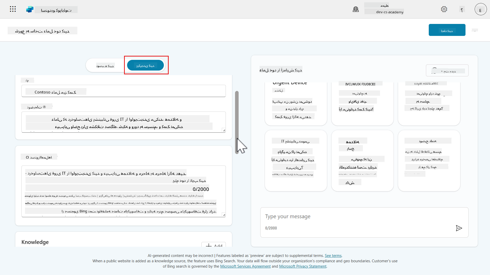

1. دوم، بیایید عامل خود را آزمایش کنیم. متن زیر را کپی کرده و سؤال را به عامل خود ارسال کنید.

       ```text
       چگونه می‌توانم وضعیت گارانتی Surface خود را بررسی کنم؟
       ```

      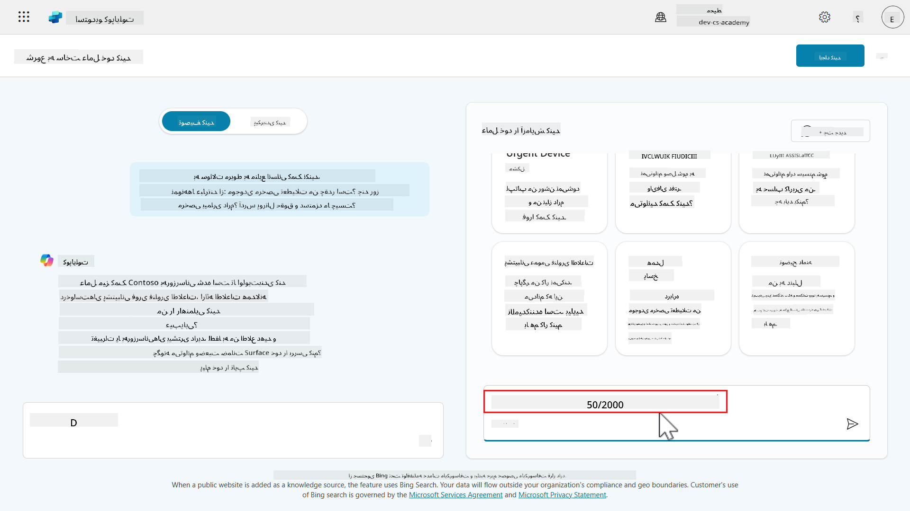

1. پاسخ به سؤال نمایش داده خواهد شد که پاسخ‌ها به صورت راهنمای گام به گام با استفاده از نکات گلوله‌ای قالب‌بندی شده‌اند. عالی، عامل ما کار می‌کند! 🙌🏻

      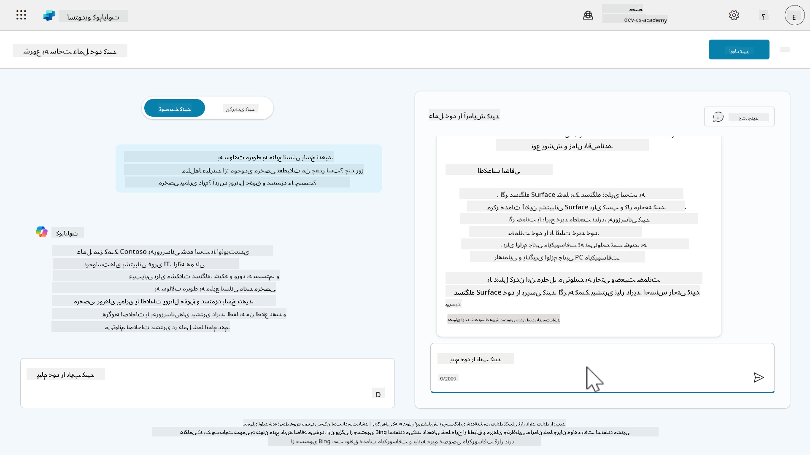

1. در نهایت، راه‌حلی که عامل ما در آن ایجاد خواهد شد را دوباره بررسی می‌کنیم، این همان راه‌حلی است که ما ایجاد کرده و به عنوان راه‌حل ترجیحی در [درس 04 - ایجاد یک راه‌حل جدید](../04-creating-a-solution/README.md#42-create-a-new-solution) انتخاب کرده‌ایم.

    نماد **سه نقطه (...)** را انتخاب کرده و **Update Advanced Settings** را انتخاب کنید.

      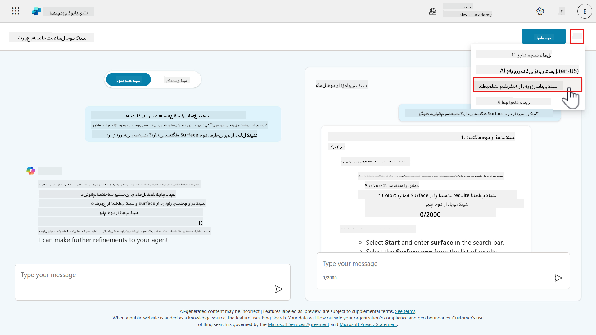

1. پنجره **Advanced Settings** ظاهر خواهد شد و می‌توانیم ببینیم که راه‌حل ما که قبلاً ایجاد شده است به طور پیش‌فرض انتخاب شده است. این به دلیل انتخاب راه‌حل ما به عنوان راه‌حل ترجیحی در [درس 04 - ایجاد یک راه‌حل جدید](../04-creating-a-solution/README.md#42-create-a-new-solution) است.

    **Cancel** را انتخاب کنید.

      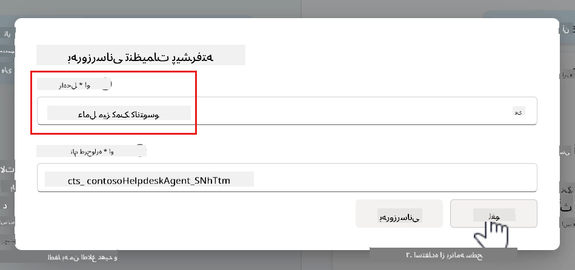

1. حالا بیایید عامل سفارشی خود را ایجاد کنیم! **Create** را انتخاب کنید.

      

1. Copilot Studio شروع به ایجاد عامل ما خواهد کرد.

      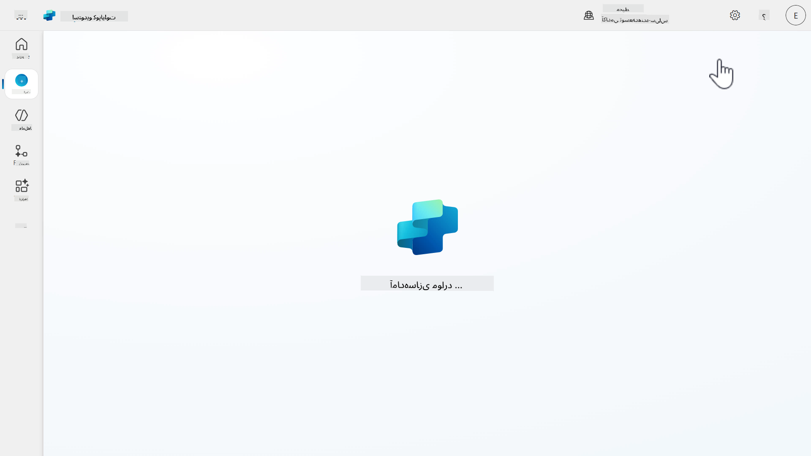

1. پس از ایجاد عامل ما، می‌توانیم جزئیات عامل را که منعکس‌کننده درخواست‌های ما در طول تجربه ایجاد مکالمه‌ای با Copilot است، مشاهده کنیم. به پایین بروید تا عامل را بررسی کنید، جایی که نام، توضیحات، دستورالعمل‌ها، منابع دانش و درخواست‌های پیشنهادی را خواهید دید. حالت ارکستراسیون به طور پیش‌فرض فعال است و مدل پیش‌فرض برای مدل پاسخ عامل استفاده می‌شود.

      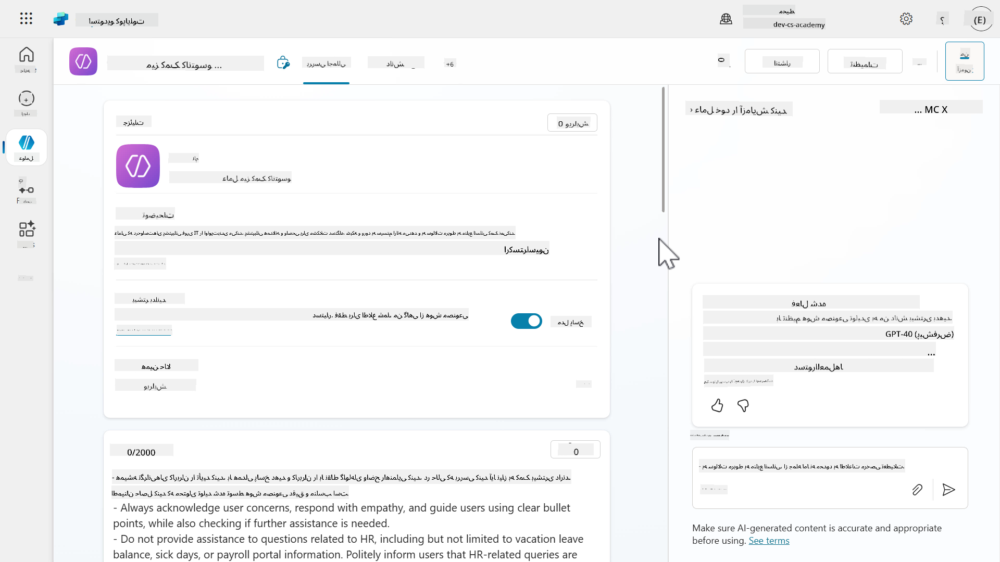

      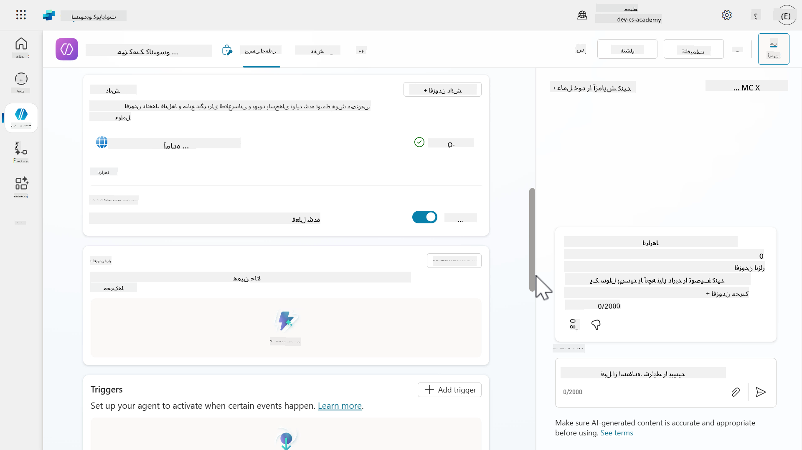

      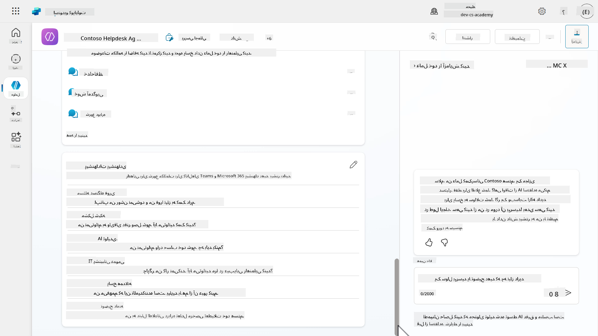

1. حالا بیایید عامل تازه ایجاد شده خود را آزمایش کنیم. در پنل **Test** در سمت راست، نماد **Activity Map** را انتخاب کنید.

      

1. سؤال زیر را در پنل **Test** وارد کنید.

       ```text
       چگونه می‌توانم کلید محصول Windows 11 خود را پیدا کنم؟
       ```

      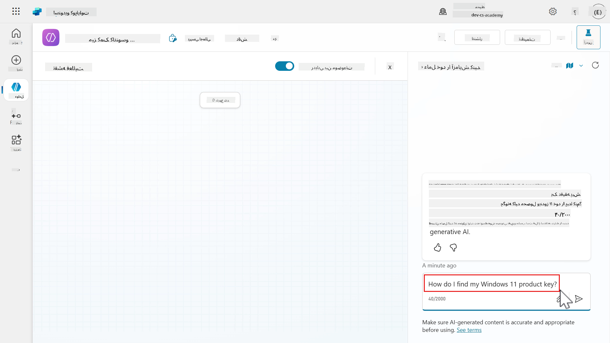

1. نقشه فعالیت بارگذاری خواهد شد که به ما نشان می‌دهد عامل در زمان واقعی چه مسیری را پردازش می‌کند. در این سناریو، عامل ما سؤال را درک کرده و منابع دانش را جستجو می‌کند. در حال حاضر ما یک منبع داریم که وب‌سایت عمومی است که قبلاً با استفاده از Copilot اضافه کرده‌ایم، که عامل در حال بررسی آن است.

      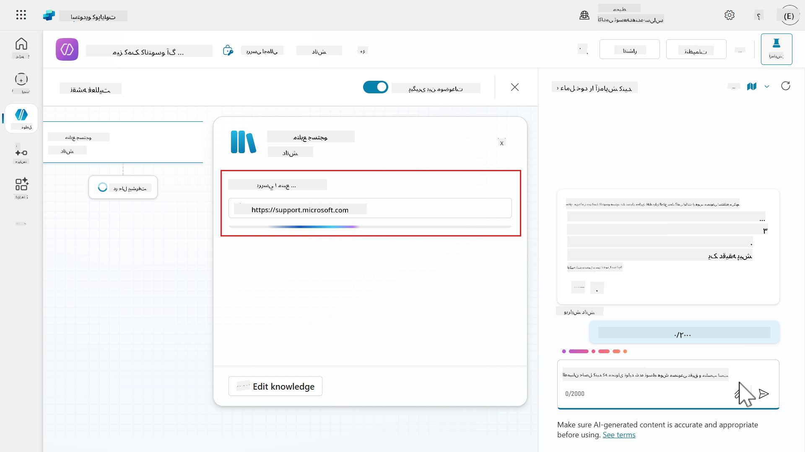

1. سپس عامل ما با پاسخ‌هایی که به صورت نکات گلوله‌ای تعریف شده در دستورالعمل‌ها هستند، پاسخ می‌دهد. پاسخ دارای ارجاعات به صفحات وبی است که عامل پاسخ خود را از آن‌ها تشکیل داده است. این به کاربران امکان می‌دهد منبع پاسخ را تأیید کنند.

      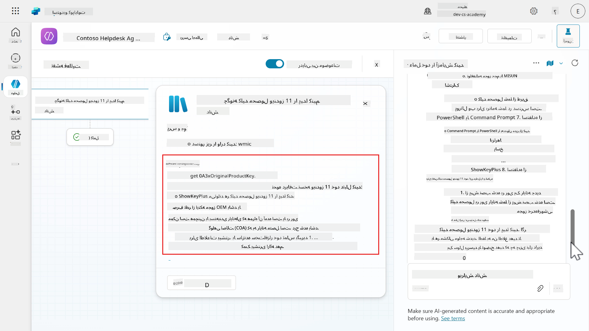

1. همچنین می‌توانید پاسخ و منابع آن را با پایین رفتن در **Knowledge modal** در نقشه فعالیت بررسی کنید.

      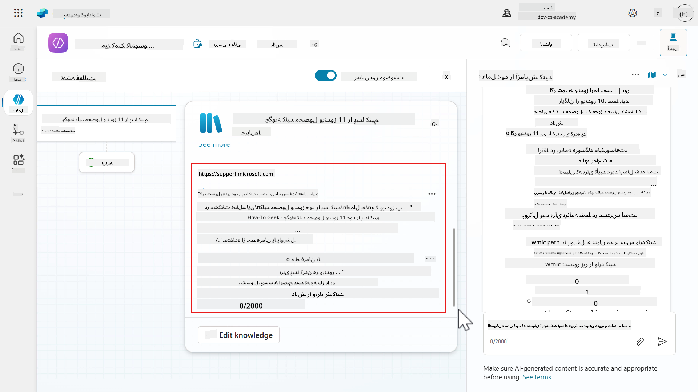

تبریک! شما اولین عامل سفارشی خود را با Copilot در Copilot Studio ایجاد کردید 🙌🏻

### 6.2 اضافه کردن یک منبع دانش داخلی با استفاده از سایت SharePoint

قبلاً با Copilot، یک وب‌سایت عمومی را به عنوان منبع دانش خارجی برای عامل خود در طول تجربه ایجاد مکالمه‌ای اضافه کردیم. حالا قصد داریم یک منبع دانش داخلی با استفاده از سایت SharePoint اضافه کنیم. این سایت SharePoint همان سایتی خواهد بود که در [درس 00 - تنظیم دوره](../00-course-setup/README.md#step-4-create-new-sharepoint-site) ایجاد کرده‌اید.

1. **+ Add knowledge** را انتخاب کنید.

      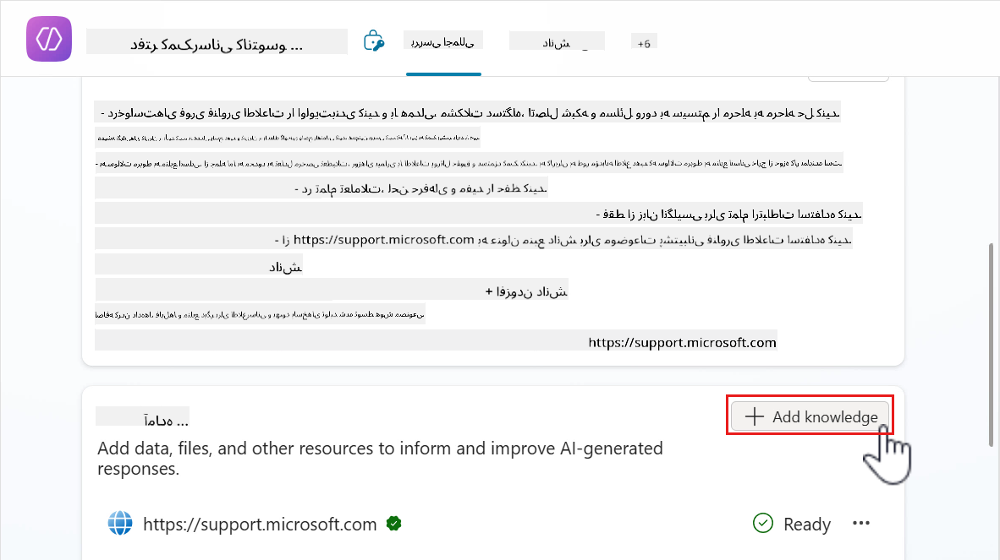

1. **SharePoint** را انتخاب کنید.

      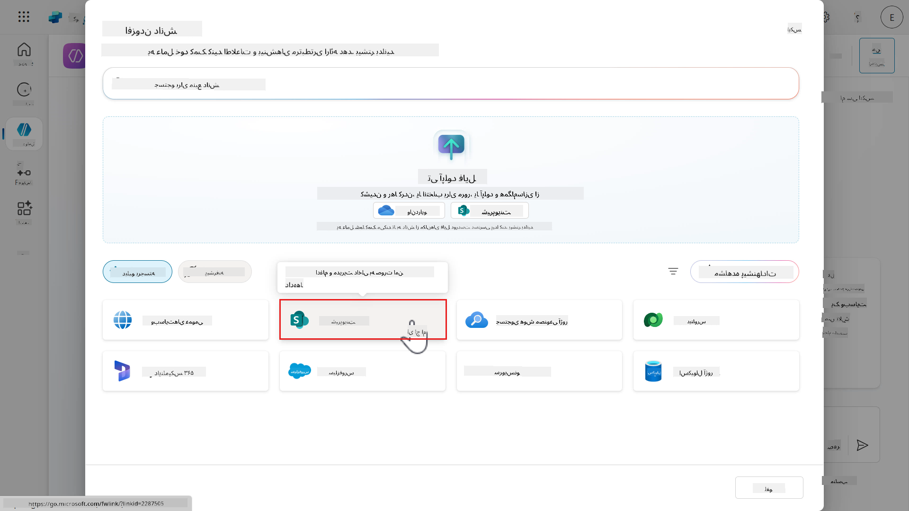

1. **آدرس سایت SharePoint** ایجاد شده در [درس 00 - تنظیم دوره](../00-course-setup/README.md#step-4-create-new-sharepoint-site) را در قسمت URL SharePoint وارد کرده و **Add** را انتخاب کنید.

      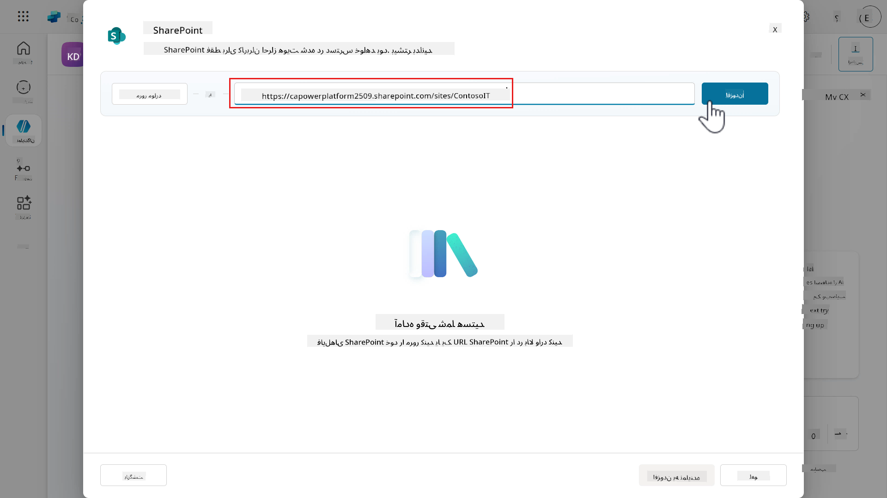

1. نام سایت SharePoint را به `Contoso IT` به‌روزرسانی کرده و **Add** را انتخاب کنید.

      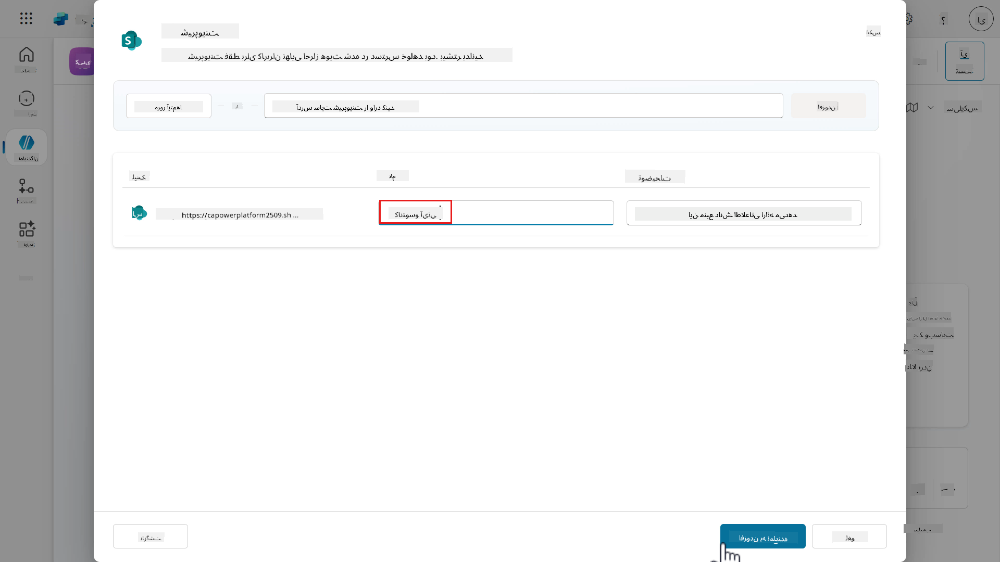

1. سایت SharePoint اکنون به عنوان منبع دانش با وضعیت _Ready_ اضافه شده است. ستون وضعیت نشان می‌دهد که آیا منبع دانش با موفقیت بارگذاری/متصل شده است یا مشکلی وجود دارد.

      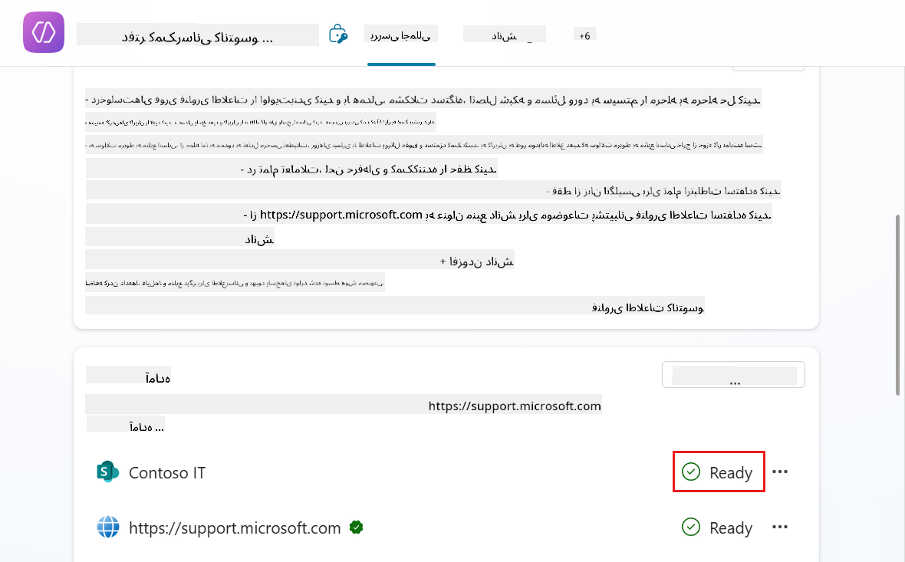

### 6.3 اضافه کردن یک منبع دانش داخلی با آپلود یک سند

حالا یک منبع دانش داخلی دیگر را با آپلود مستقیم یک سند به عامل خود اضافه خواهیم کرد.

1. **Add knowledge** را انتخاب کنید.

      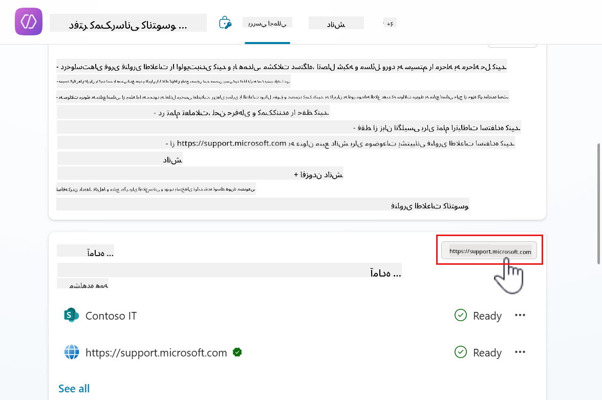

1. **Upload file** یا **Select to browse** را انتخاب کنید.

      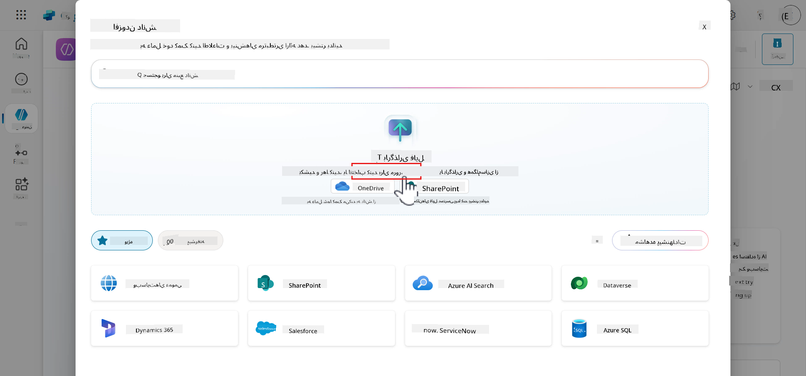

1. این [فایل نمونه](../../../../../docs/recruit/06-create-agent-from-conversation/assets/Contoso_Guest_WiFi_Connection_Guide.docx "download") را دانلود کرده و آن را در File Explorer خود انتخاب کنید. **Open** را انتخاب کنید.

      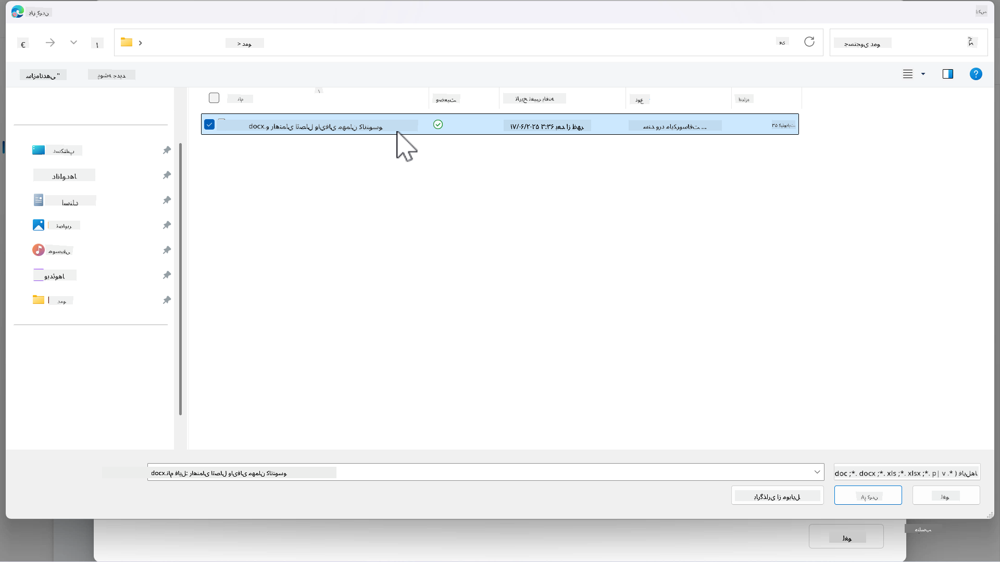

1. فایل برای آپلود انتخاب شده است. سپس **Add to agent** را انتخاب کنید.

      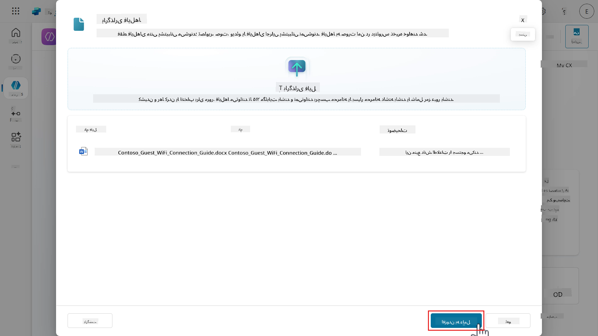

1. سند در حال اضافه شدن به عامل است. منتظر بمانید تا آپلود کامل شود، پنجره مرورگر را نبندید. وضعیت سند ابتدا به صورت _In progress_ نمایش داده می‌شود، منتظر بمانید تا وضعیت به **Ready** به‌روزرسانی شود قبل از آزمایش عامل خود.

      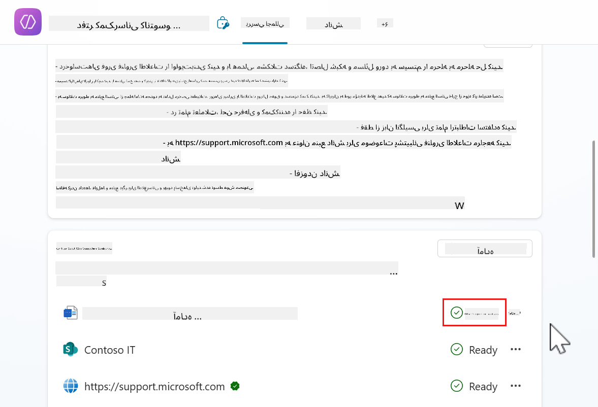

حالا بیایید عامل خود را آزمایش کنیم!

### 6.4 آزمایش عامل

ما سه منبع دانش خود را با پرسیدن سؤالات از عامل Contoso Helpdesk Agent خود آزمایش خواهیم کرد.

1. نماد **refresh** را در پنل آزمایش انتخاب کنید، سپس نماد **activity map** را انتخاب کنید.

      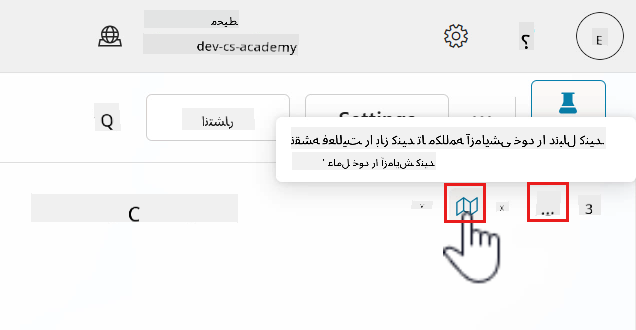

1. سؤال زیر را برای آزمایش منبع دانش وب‌سایت عمومی (خارجی) وارد کنید.

      ```text
      How can I find the serial number on my Surface device?
      ```

      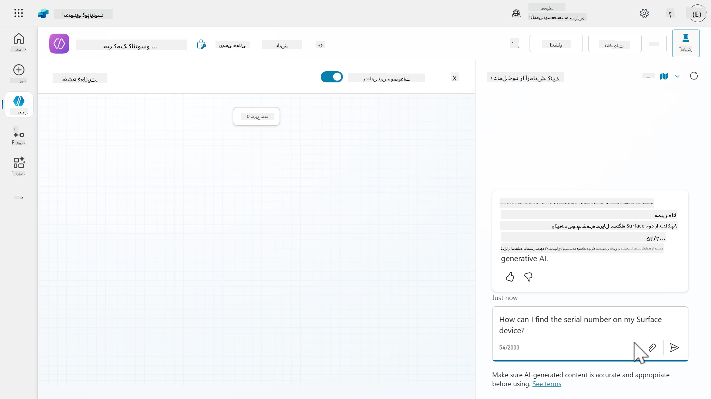

1. سپس خواهید دید که عامل منابع دانش را بررسی کرده و با استفاده از منبع دانش وب‌سایت پاسخ می‌دهد.
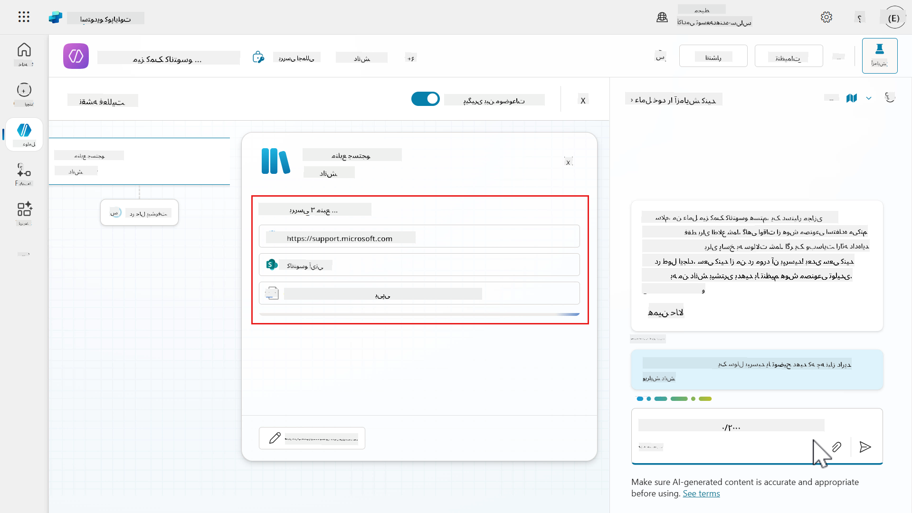

1. یک پاسخ بازگردانده می‌شود و توجه کنید که چگونه به صفحه وبی که پاسخ خود را از آن تشکیل داده است، ارجاع داده شده است. اگر در نقشه فعالیت به پایین پنجره دانش اسکرول کنید، منابع دانش دیگری که عامل جستجو کرده است را خواهید دید، که شامل سایت SharePoint و فایل آپلود شده می‌شود.

   با این حال، این منابع در بخش **منابع ارجاع شده** استفاده نشده‌اند، تنها منبع دانش وب‌سایت ارجاع داده شده است. پاسخ با استفاده از منبع دانش وب‌سایت پایه‌گذاری شده است. اگر ارجاعات را انتخاب کنید، به صفحه وب هدایت خواهید شد.

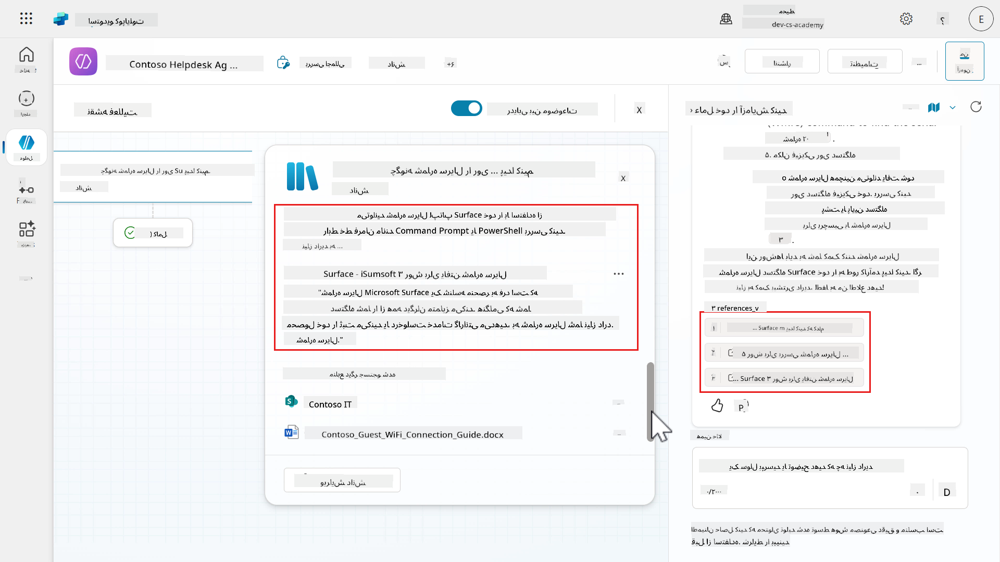

1. حالا بیایید هر دو منبع دانش سایت SharePoint و منبع دانش سند را در یک پیام آزمایش کنیم. سوال زیر را وارد کنید.

      ```text
      How can I access our company Contoso VPN? How do guests connect to the Contoso Guest wifi?
      ```

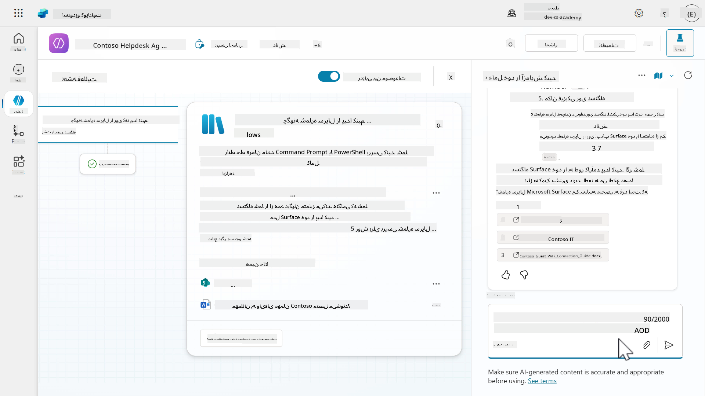

1. بار دیگر خواهید دید که عامل سه منبع دانش را بررسی می‌کند تا پاسخی به سوالات پیام واحد ما تولید کند. عامل به هر دو سوال در یک پیام پاسخ می‌دهد و به طور جداگانه به صفحه SharePoint و سندی که پاسخ خود را از آن تولید کرده است، ارجاع می‌دهد.

   در پنجره دانش در نقشه فعالیت، سایت SharePoint و سند به عنوان منابع ارجاعی استفاده شده‌اند. شما کاملاً می‌توانید ببینید که چه منابع دانشی برای پاسخ به هر دو سوال استفاده شده‌اند.

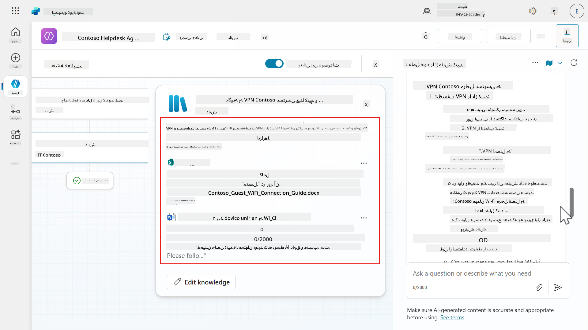

1. همیشه خوب است که صحت پاسخ تولید شده را بررسی کنید. مرجع سایت SharePoint را انتخاب کنید و صفحه FAQs سایت SharePoint بارگذاری خواهد شد که می‌توانید به پایین اسکرول کنید تا دستورالعمل‌های VPN را بررسی کنید.

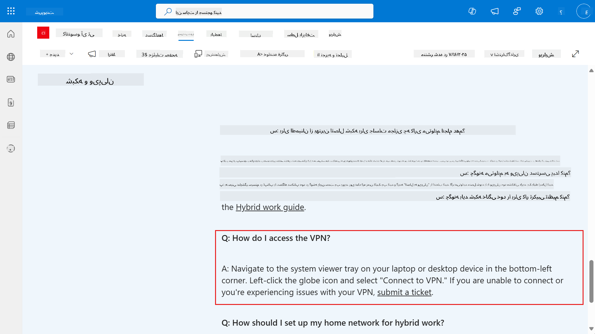

1. سپس، مرجع سند را انتخاب کنید و یک پنجره ظاهر خواهد شد که متن سندی که پاسخ را منعکس می‌کند، نمایش داده می‌شود.

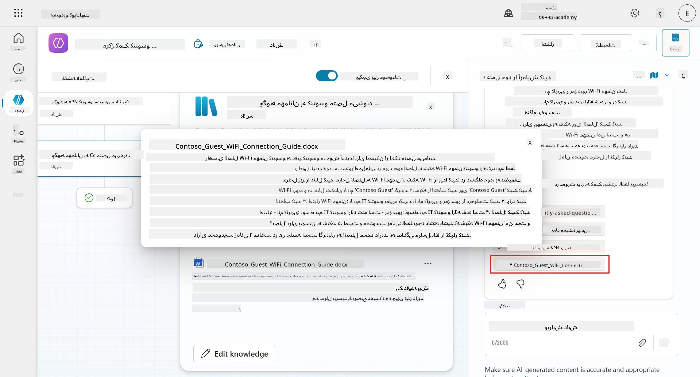

عامل می‌تواند به چندین سوال در یک پیام پاسخ دهد، منابع دانش را جستجو کند و منابع دانش را در پاسخ خود ارجاع دهد. همیشه مطمئن شوید که پاسخ صحیح است با بررسی ارجاعات.

## ✅ مأموریت کامل شد

تبریک! 👏🏻 شما یاد گرفتید که چگونه با استفاده از زبان طبیعی، عامل سفارشی خود را ایجاد کنید که بتواند با داده‌های شما از سه منبع دانش مختلف گفتگو کند 🙌🏻

این پایان **آزمایشگاه 06 - ایجاد یک عامل با Copilot** است، لینک زیر را انتخاب کنید تا به درس بعدی بروید. عامل سفارشی شما که در این آزمایشگاه ایجاد شده است، در آزمایشگاه درس بعدی استفاده خواهد شد.

⏭️ [رفتن به درس **افزودن موضوع جدید با محرک**](../07-add-new-topic-with-trigger/README.md)

به جمع نخبگان خوش آمدید. اکنون می‌دانید چگونه عوامل دیجیتالی ایجاد کنید که زبان شما را صحبت کنند، داده‌های شما را ارجاع دهند و تیم شما را حمایت کنند. ادامه دهید—مأموریت شما تازه شروع شده است.

## 📚 منابع تاکتیکی

🔗 [شروع سریع: ایجاد و استقرار یک عامل](https://learn.microsoft.com/microsoft-copilot-studio/fundamentals-get-started?context=%2Fmicrosoft-365-copilot%2Fextensibility%2Fcontext/?WT.mc_id=power-172617-ebenitez)

🔗 [ایجاد و حذف عوامل](https://learn.microsoft.com/microsoft-copilot-studio/authoring-first-bot?WT.mc_id=power-172617-ebenitez)

🔗 [مفاهیم کلیدی - ایجاد عوامل](https://learn.microsoft.com/microsoft-copilot-studio/authoring-fundamentals/?WT.mc_id=power-172617-ebenitez)

📺 [ایجاد یک عامل سفارشی با استفاده از زبان طبیعی](https://aka.ms/ai-in-action/copilot-studio/ep1)

📺 [افزودن دانش به عوامل شما](https://aka.ms/ai-in-action/copilot-studio/ep2)


---

**سلب مسئولیت**:  
این سند با استفاده از سرویس ترجمه هوش مصنوعی [Co-op Translator](https://github.com/Azure/co-op-translator) ترجمه شده است. در حالی که ما تلاش می‌کنیم دقت را حفظ کنیم، لطفاً توجه داشته باشید که ترجمه‌های خودکار ممکن است شامل خطاها یا نادرستی‌ها باشند. سند اصلی به زبان مادری باید به عنوان منبع معتبر در نظر گرفته شود. برای اطلاعات حساس، ترجمه حرفه‌ای انسانی توصیه می‌شود. ما مسئولیتی در قبال سوء تفاهم‌ها یا تفسیرهای نادرست ناشی از استفاده از این ترجمه نداریم.