<!--
CO_OP_TRANSLATOR_METADATA:
{
  "original_hash": "c04b3587170139bc23e3b5cfc24c89ac",
  "translation_date": "2025-10-21T19:03:45+00:00",
  "source_file": "docs/recruit/07-add-new-topic-with-trigger/README.md",
  "language_code": "fa"
}
-->
# 🚨 مأموریت 07: افزودن موضوع جدید با تریگر و نودها

## 🕵️‍♂️ نام رمز: `عملیات حفظ موضوع`

> **⏱️ زمان عملیات:** `~60 دقیقه`

🎥 **تماشای راهنما**

[](https://www.youtube.com/watch?v=7iPAZaA8nJs "تماشای راهنما در یوتیوب")

## 🎯 خلاصه مأموریت

شما یک عامل ساخته‌اید. این عامل گوش می‌دهد، یاد می‌گیرد و به سوالات پاسخ می‌دهد - اما حالا وقت آن است که تاکتیکی‌تر عمل کنید. در این مأموریت، شما به عمق سیستم می‌روید و به عامل خود یاد می‌دهید که چگونه به درخواست‌های خاص با دقت پاسخ دهد.

با استفاده از موضوعات و تریگرها، عامل شما می‌تواند:

- تشخیص قصد کاربر

- هدایت مکالمات با منطق

- جمع‌آوری و ذخیره متغیرها

- فعال کردن جریان‌ها و انجام اقدامات

شما فقط دیالوگ نمی‌سازید، بلکه مغز تصمیم‌گیری آن را سیم‌کشی می‌کنید. به Nexus عصبی خوش آمدید.

## 🔎 اهداف

در این مأموریت، شما یاد می‌گیرید:

1. درک اینکه موضوعات چیستند و نقش آن‌ها در ایجاد مکالمات ساختاریافته برای عامل شما
1. یادگیری ساختار موضوعات شامل عبارات تریگر و نودهای مکالمه
1. بررسی انواع مختلف نودهای مکالمه و نحوه استفاده از Power Fx برای منطق پویا
1. ایجاد موضوعات سفارشی از ابتدا برای مدیریت درخواست‌ها و وظایف خاص کاربران
1. ساخت یک موضوع کاربردی که به داده‌های SharePoint متصل می‌شود با استفاده از کانکتورها و ابزارها

## 🤔 موضوع چیست؟

موضوع یک مکالمه ساختاریافته است که به عامل شما کمک می‌کند به سوالات یا وظایف خاص کاربران پاسخ دهد. موضوع را به عنوان یک مکالمه کوچک یا وظیفه‌ای که عامل شما می‌تواند مدیریت کند تصور کنید. هر موضوع برای پاسخ به یک سوال یا درخواست خاص کاربر طراحی شده است.

### 🌌 هدف یک موضوع

سه هدف رایج برای موضوعات وجود دارد که بر اساس نیاز کاربران تعریف می‌شوند:

**اطلاعاتی** - پاسخ به سوالاتی مانند:

- `چیست …؟`
- `چه زمانی …؟`
- `چرا …؟`
- `می‌توانید به من بگویید …؟`

**انجام وظیفه** - به کاربران کمک می‌کند کاری انجام دهند:

- `"می‌خواهم …"`
- `"چگونه …؟"`
- `"نیاز دارم …؟"`

**رفع مشکل** - مشکلات را حل می‌کند:

- `چیزی کار نمی‌کند …`
- `با یک پیام خطا مواجه شده‌ام …`
- `چیزی غیرمنتظره می‌بینم …؟`

شما همچنین می‌توانید موضوعاتی برای سوالات مبهم مانند `نیاز به کمک دارم` ایجاد کنید که از کاربران جزئیات بیشتری قبل از ادامه درخواست می‌کند.

## 🐦 چرا موضوعات مفید هستند؟

موضوعات به شما کمک می‌کنند:

- دانش عامل خود را سازماندهی کنید.

- مکالمات را طبیعی جلوه دهید.

- مشکلات کاربران را به طور مؤثر حل کنید.

## 🪺 انواع موضوعات

1. **موضوعات سیستمی** - این‌ها از پیش ساخته شده‌اند و رویدادهای رایج مانند:
    - شروع مکالمه
    - پایان مکالمه
    - مدیریت خطاها
    - درخواست ورود کاربران
    - ارجاع به یک عامل انسانی را مدیریت می‌کنند.

1. **موضوعات سفارشی** - شما این‌ها را برای مدیریت وظایف یا سوالات خاص ایجاد می‌کنید مانند:
    - درخواست مرخصی کارمندان
    - درخواست دستگاه جدید یا جایگزین

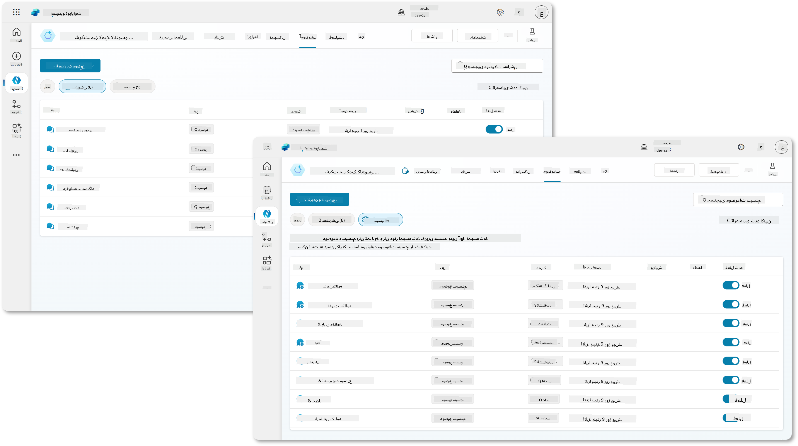

## 🧬 ساختار یک موضوع

هر موضوع معمولاً شامل موارد زیر است.

### 🗣️ عبارات تریگر

این‌ها کلمات یا جملاتی هستند که کاربران ممکن است برای شروع موضوع بیان کنند.

**نمونه‌ها:**

برای یک موضوع درخواست مرخصی، عبارات تریگر می‌توانند شامل موارد زیر باشند:

- `می‌خواهم مرخصی بگیرم`
- `درخواست مرخصی`
- `درخواست برای مرخصی`
- `چگونه می‌توانم درخواست مرخصی بدهم؟`

برای یک موضوع درخواست دستگاه، عبارات تریگر می‌توانند شامل موارد زیر باشند:

- `نیاز به دستگاه جدید دارم`
- `می‌توانم دستگاهی درخواست کنم؟`
- `می‌توانید به من در درخواست دستگاه کمک کنید؟`

### 💬 نودهای مکالمه

یک موضوع از نودهایی تشکیل شده است که مراحل را برای عامل پس از فعال شدن موضوع مشخص می‌کنند. شما این مراحل را به هم متصل می‌کنید تا جریان مکالمه‌ای ایجاد کنید که عامل شما هنگام تعامل با کاربران دنبال کند.

این‌ها را به عنوان دستورالعمل‌ها یا اقداماتی تصور کنید مانند:

- پرسیدن سوال از کاربر
- ارسال پیام‌ها
- فراخوانی یک سرویس خارجی مانند سیستم مدیریت مرخصی
- تنظیم یا بررسی متغیرها
- استفاده از شرایط برای شاخه‌بندی مکالمه
- هدایت به یک موضوع دیگر

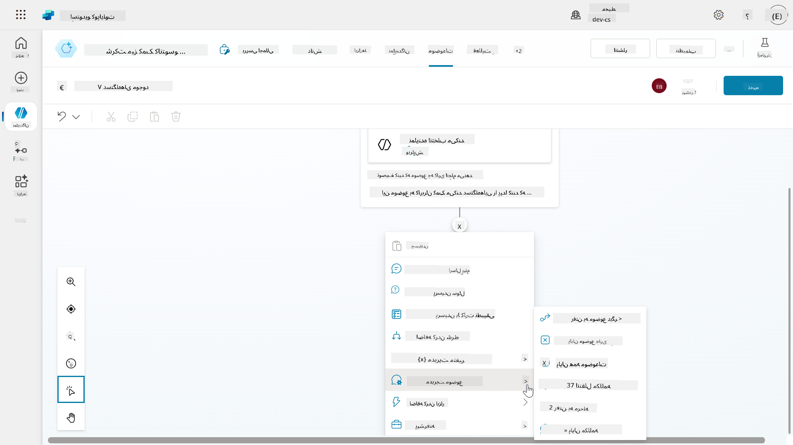

انواع اصلی نودهایی که می‌توانید به عامل اضافه کنید عبارتند از:

#### ارسال پیام

- **هدف** - ارسال پیام به کاربر.
- **نمونه** - `از درخواست شما متشکرم! من در این مورد به شما کمک خواهم کرد.`

این نود به عامل شما اجازه می‌دهد پیام‌هایی به کاربران ارسال کند که می‌تواند متن ساده یا محتوای غنی مانند تصاویر، ویدیوها، کارت‌ها، پاسخ‌های سریع و کارت‌های تطبیقی باشد.

شما می‌توانید پیام‌ها را با استفاده از متغیرها شخصی‌سازی کنید، چندین نوع پیام برای تنوع اضافه کنید و حتی خروجی گفتار را برای کانال‌های صوتی سفارشی کنید.

!!! tip
    این را به عنوان یک بلوک "چیزی بگو" تصور کنید که به عامل شما کمک می‌کند به طور واضح و تعاملی با کاربران ارتباط برقرار کند.

#### پرسیدن سوال

- **هدف** - از کاربر سوالی بپرسید و منتظر پاسخ او باشید.
- **نمونه** - `تاریخ‌های مرخصی شما چیست؟`

این نود برای پرسیدن اطلاعات خاص از کاربران در طول مکالمه و ذخیره پاسخ‌های آن‌ها در متغیرها برای استفاده بعدی استفاده می‌شود.

شما می‌توانید نوع سوال را مانند ورودی متن سفارشی کنید یا از موجودیت‌ها برای لیست تعریف‌شده‌ای از مقادیر که کاربر از آن انتخاب می‌کند استفاده کنید، و نحوه رفتار عامل را در صورت پاسخ نامعتبر یا رد کردن سوال تعریف کنید.

همچنین از محتوای غنی مانند تصاویر و پاسخ‌های سریع پشتیبانی می‌کند و به شما امکان می‌دهد تنظیمات اعتبارسنجی، تکرار سوال و وقفه را برای جریان روان مکالمه تنظیم کنید.

!!! tip
    این را به عنوان یک بلوک "بپرس و گوش کن" تصور کنید که به عامل شما کمک می‌کند به طور ساختاریافته با کاربران تعامل کند.

#### پرسیدن با کارت تطبیقی

- **هدف** - ارسال یک کارت تعاملی غنی با استفاده از JSON.
- **نمونه** - کارتی که یک انتخاب‌کننده تاریخ تقویم را نمایش می‌دهد تا کاربر تاریخ را انتخاب کند.

این نود کارت‌های تعاملی غنی را نشان می‌دهد که کاربران می‌توانند آن‌ها را پر کنند و ارسال کنند، مانند فرم‌هایی با جعبه‌های متن، دکمه‌ها و تصاویر. این اطلاعات کاربر را ضبط می‌کند و آن‌ها را در متغیرها ذخیره می‌کند که عامل شما می‌تواند بعداً در مکالمه استفاده کند.

!!! tip
    این را به عنوان یک بلوک "سازنده فرم قابل تنظیم" تصور کنید که عامل شما را جذاب‌تر و قادر به جمع‌آوری اطلاعات دقیق از کاربران می‌کند.

#### افزودن شرط

- **هدف** - منطق را به مکالمه اضافه کنید. چیزی را بررسی می‌کند و تصمیم می‌گیرد که بعداً چه کاری انجام دهد.
- **نمونه** - اگر کاربر بگوید `بله`، به مرحله بعد بروید. اگر `نه`، مکالمه را پایان دهید.

این نود نقاط تصمیم‌گیری را در جریان مکالمه عامل شما ایجاد می‌کند با بررسی اینکه آیا یک متغیر معیار خاصی را برآورده می‌کند. بر اساس اینکه شرط درست یا غلط باشد، عامل مسیرهای مختلفی را دنبال می‌کند.

!!! tip
    این را به عنوان یک بلوک "اگر-وگرنه" تصور کنید که به عامل شما کمک می‌کند بر اساس ورودی کاربر یا داده‌های ذخیره‌شده در متغیرها تصمیم‌گیری کند.

#### مدیریت متغیر

- **هدف** - اطلاعات (به نام متغیرها) را در طول مکالمه ذخیره یا پاک کنید.
- **نمونه** - تاریخ انتخاب‌شده توسط کاربر را در نود پرسیدن سوال که یک کارت تطبیقی نمایش می‌دهد ذخیره کنید.

این نود به شما امکان می‌دهد اطلاعاتی را در طول مکالمه ذخیره و مدیریت کنید، می‌تواند نام کاربر، پاسخ یا ترجیحات باشد. شما می‌توانید از انواع مختلف متغیرها مانند متن، اعداد یا تاریخ‌ها استفاده کنید، و آن‌ها می‌توانند به یک موضوع واحد محدود شوند، در موضوعات مختلف به اشتراک گذاشته شوند (جهانی)، یا حتی از سیستم یا محیط استخراج شوند.

!!! tip
    این را به عنوان یک "جعبه حافظه" تصور کنید که به عامل شما کمک می‌کند اطلاعات را به خاطر بسپارد و از آن‌ها در ادامه مکالمه با کاربر استفاده کند.

#### مدیریت موضوع

- **هدف** - مکالمه را به موضوع یا مرحله دیگری در همان موضوع منتقل کنید، مکالمه را انتقال دهید یا موضوع یا مکالمه را پایان دهید.
- **نمونه** - به موضوع "سیاست مرخصی" هدایت کنید.

این نود به عامل شما اجازه می‌دهد از یک موضوع به موضوع دیگر بدون شروع مجدد مکالمه منتقل شود، موضوع را پایان دهد، مکالمه را انتقال دهد یا به مرحله دیگری در همان موضوع برود. این به هدایت کاربران در بخش‌های مختلف جریان مکالمه کمک می‌کند با انتقال روان بین موضوعات، و شما می‌توانید متغیرها را بین آن‌ها منتقل کنید تا زمینه را حفظ کنید.

!!! tip
    این را به عنوان یک بلوک "برو به بخش/مرحله دیگر" تصور کنید که به عامل شما کمک می‌کند در چت با کاربران انعطاف‌پذیر باشد.

#### افزودن ابزار

- **هدف** - به ابزارهایی مانند کانکتورها، جریان‌های عامل، درخواست‌ها، جستجوی سفارشی، پرسش‌های جستجو، مهارت‌ها، پروتکل زمینه مدل متصل شوید.
- **نمونه** - جریان عامل اجرا شده پس از ارسال درخواست مرخصی توسط کاربر.

این نود قابلیت‌هایی به عامل شما می‌دهد تا با سیستم‌های خارجی تعامل کند یا وظایف خاصی را انجام دهد، مانند ارسال ایمیل، بررسی آب و هوا، یا دسترسی به پایگاه‌های داده. شما می‌توانید ابزارها را با استفاده از کانکتورهای داخلی، APIهای سفارشی، جریان‌های عامل، درخواست‌ها، یا اتصال به سرورهای پروتکل زمینه مدل (MCP) اضافه کنید، و حتی اتوماسیون رابط کاربری گرافیکی برای برنامه‌های دسکتاپ از طریق ابزار استفاده از کامپیوتر.

!!! tip
    ابزارها را به عنوان "بلوک‌های عملیاتی" تصور کنید که به عامل شما قدرت انجام کارهایی فراتر از _چت کردن_ می‌دهند، مانند فراخوانی یک API، اجرای یک فرآیند، یا جمع‌آوری خودکار ورودی کاربر.

#### نود پاسخ‌های تولیدی

- **هدف** - از یک مدل زبان بزرگ برای تولید پاسخ‌های طبیعی و انسانی بر اساس سوال کاربر و هر داده متصل استفاده کنید.
- **نمونه** - از منبع دانش متصل که حاوی اطلاعاتی درباره حقوق مرخصی است برای پاسخ به سوالات کاربران در مورد درخواست‌های مرخصی استفاده کنید.

این نود به عامل شما امکان می‌دهد به سوالات کاربران با استفاده از اطلاعات منابع مختلف دانش، مانند وب‌سایت‌ها، اسناد، SharePoint، یا داده‌های سفارشی پاسخ دهد. می‌توان از آن به عنوان یک راه‌حل جایگزین زمانی که هیچ موضوع مطابقتی پیدا نمی‌شود استفاده کرد، یا در یک موضوع برای ارائه پاسخ‌های دقیق‌تر و پویا بر اساس منابع خاصی که شما برای عامل خود تنظیم کرده‌اید.

!!! tip
    این را به عنوان یک "بلوک پاسخ هوشمند" تصور کنید که به عامل شما کمک می‌کند پاسخ‌های مفید و دقیق ارائه دهد با جستجوی محتوای قابل اعتماد که شما تعریف می‌کنید.

#### نود درخواست HTTP

- **هدف** - عامل خود را با ارسال درخواست‌های API (مانند `GET` یا `POST`) به سیستم‌های خارجی متصل کنید تا داده‌ها را بازیابی یا به‌روزرسانی کنید.
- **نمونه** - وقتی کاربر درخواست موجودی روزهای مرخصی خود را می‌کند، عامل یک درخواست `GET` به سیستم مدیریت مرخصی ارسال می‌کند و `remainingLeaveDays` را از پاسخ API استخراج کرده و مقدار را به کاربر پاسخ می‌دهد.

این نود به عامل شما امکان می‌دهد با ارسال درخواست‌های REST API، مانند `GET` یا `POST`، به سیستم‌های خارجی متصل شود. شما می‌توانید درخواست را با هدرها، محتوای بدنه و حتی استفاده از Power Fx برای افزودن داده‌های پویا سفارشی کنید، سپس پاسخ را در متغیرها ذخیره کنید تا بعداً در مکالمه استفاده شود.

!!! tip
    این را به عنوان یک "دریافت اطلاعات" بلوک تصور کنید که به عامل شما کمک می‌کند با سایر خدمات مانند بازیابی جزئیات کاربر یا ارسال داده به سیستم دیگر ارتباط برقرار کند.

#### ارسال یک رویداد

- **هدف** - به عامل شما اجازه می‌دهد اقدامات غیرپیام‌رسانی، مانند به‌روزرسانی‌های سیستم یا فعال‌سازی ابزارها - به کلاینت یا کانال ارسال کند، و به آن کمک کند وظایف را انجام دهد.
- **نمونه** - واکنش به ورود کاربر به چت با نمایش یک پیام خوش‌آمدگویی.

این نود به عامل شما امکان می‌دهد اقدامات غیرپیام‌رسانی به سیستم‌های خارجی یا کانال‌ها ارسال کند، که سپس تصمیم می‌گیرند چگونه پاسخ دهند. شما به هر رویداد یک نام می‌دهید و یک مقدار ضمیمه می‌کنید، که می‌تواند یک عدد یا متن ساده، یک متغیر، یا یک فرمول Power Fx باشد، و به صورت یک شی JSON ارسال می‌شود.

!!! tip
    این را به عنوان یک "فعال‌کننده خاموش" بلوک تصور کنید که به عامل شما کمک می‌کند کارهایی را پشت صحنه انجام دهد یا با ابزارهای خارجی بدون نیاز به گفتن چیزی توسط کاربر ارتباط برقرار کند.

## 🏋🏻‍♀️ استفاده از Power Fx در نودهای شما

در Copilot Studio، Power Fx یک زبان برنامه‌نویسی کم‌کد است که برای افزودن منطق و رفتار پویا به عامل شما استفاده می‌شود. این همان زبانی است که در Microsoft Power Apps استفاده می‌شود و طراحی شده تا ساده و شبیه به Excel باشد، که استفاده از آن را برای توسعه‌دهندگان و غیرتوسعه‌دهندگان آسان می‌کند.

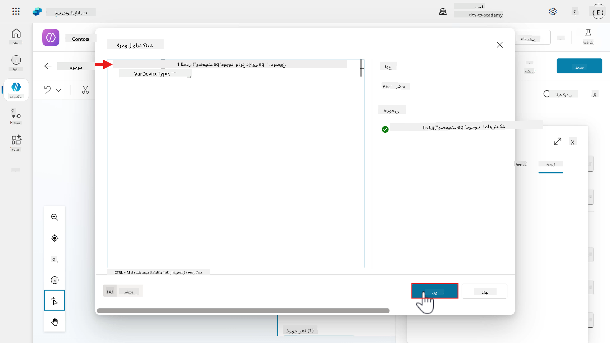

### Power Fx در موضوعات چه کاری می‌تواند انجام دهد؟

- تنظیم و دستکاری متغیرها
      - نمونه: `Set(userName, "Adele Vance")`
- ایجاد شرایط
      - نمونه: `If(score > 80, "Pass", "Fail")`
- قالب‌بندی و تبدیل داده‌ها
      - نمونه: `Text(DateValue, "dd/mm/yyyy")`

### چرا از Power Fx استفاده کنیم؟

- **انعطاف‌پذیر:** شما می‌توانید منطق را بدون نوشتن خطوط کامل کد بسازید.

- **آشنا:** اگر از فرمول‌های Excel استفاده کرده باشید، بسیار مشابه است.

- **قدرتمند:** به شما امکان می‌دهد مکالمات را شخصی‌سازی کنید، ورودی‌ها را اعتبارسنجی کنید و کنترل کنید که عامل شما چگونه بر اساس داده‌های کاربر رفتار کند.

## 🏗️ چگونه موضوعات را ایجاد و ویرایش کنم؟

دو روش برای ایجاد و ویرایش موضوعات برای عوامل شما وجود دارد.

### 1. ایجاد از ابتدا

این امکان را به شما می‌دهد که جریان‌های مکالمه سفارشی را از ابتدا بسازید، و می‌توانید هنگام ویرایش موضوع خود نودها را اضافه یا حذف کنید.

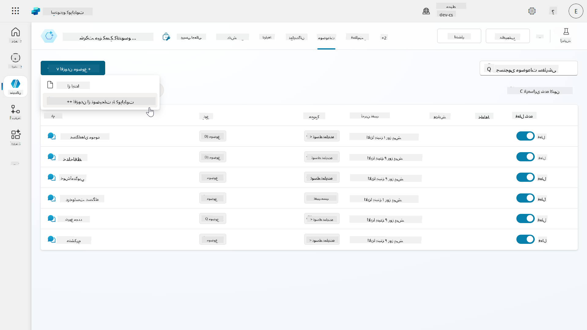

#### چرا این مفید است؟

- به شما کنترل کامل بر نحوه پاسخ‌دهی عامل خود می‌دهد.
- می‌توانید منطق را با استفاده از متغیرها، Power Fx و شرایط سفارشی کنید.
- برای ایجاد تجربیات سفارشی برای نیازهای خاص کسب‌وکار عالی است.

### 2. ایجاد با Copilot
این امکان را به شما می‌دهد که با استفاده از زبان طبیعی آنچه می‌خواهید را توصیف کنید و Copilot مکالمه را برای شما ایجاد کند. همین امر هنگام ویرایش موضوع شما نیز صدق می‌کند؛ از زبان طبیعی استفاده کنید و Copilot موضوع را بررسی و اصلاح خواهد کرد.

#### قابلیت‌های Copilot

- می‌تواند ایجاد و ویرایش کند:
      - گره‌های پیام
      - گره‌های سوال
      - گره‌های شرط
- از تنظیمات پیشرفته مانند نحوه درخواست مجدد از کاربر در صورت عدم پاسخ یا مدیریت وقفه‌ها در طول یک سوال پشتیبانی نمی‌کند. در صورت نیاز، همچنان می‌توانید این تنظیمات را به صورت دستی تنظیم کنید.

#### چرا این مفید است؟

- با کمک هوش مصنوعی، توسعه را سریع‌تر می‌کند.
- به شما اجازه می‌دهد روی منطق و تجربه کاربری تمرکز کنید به جای تنظیمات تکراری.
- فرآیندهای مکالمه را با کمترین تلاش آسان‌تر می‌کند.

#### ✨ نمونه درخواست‌ها

- **ایجاد یک موضوع**
      - `نام، سن و تاریخ تولد کاربر را بپذیرید و سپس پاسخ‌های او را تکرار کنید`
      - `آدرس خیابان، ایالت و کد پستی کاربر را جمع‌آوری کنید. کاربر باید بتواند هر سوال را تا ۴ بار دوباره امتحان کند`

- **ویرایش یک موضوع**
      - `یک سوال برای درخواست تاریخ تولد کاربر اضافه کنید`
      - `اطلاعات جمع‌آوری شده را در یک Adaptive Card خلاصه کنید.`

## 👩🏻‍🎨 خب، چگونه موضوعات را برای عامل خود طراحی کنم؟

### 🧙🏻‍♂️ مرحله ۱ - نیازهای کاربران را درک کنید

ابتدا سوالات یا وظایف رایجی که کاربران از عامل شما خواهند پرسید را شناسایی کنید. این‌ها می‌توانند شامل موارد زیر باشند:

- سوالاتی که کاربران اغلب می‌پرسند، مانند `حق مرخصی بیماری من چقدر است؟`
- وظایف رایجی که کاربران می‌خواهند انجام دهند، مانند ارسال یک فرم
- مشکلاتی که کاربران اغلب با آن مواجه می‌شوند، مانند مشکلات ورود به سیستم

### 📦 مرحله ۲ - سناریوها را گروه‌بندی کنید

نیازهای کاربران را بر اساس آنچه قبلاً یاد گرفتیم، به سه دسته بر اساس هدف موضوع سازماندهی کنید:

- اطلاعاتی - کاربر می‌خواهد چیزی بداند
- انجام وظیفه - کاربر می‌خواهد کاری انجام دهد
- رفع مشکل - کاربر نیاز به کمک برای حل یک مشکل دارد

### 🗺️ مرحله ۳ - مکالمه را ترسیم کنید

یک جریان مکالمه ساده از نحوه پاسخگویی عامل طراحی کنید:

- با یک خوش‌آمدگویی یا تأیید شروع کنید
- سوالات پیگیری برای دریافت جزئیات بپرسید
- پاسخ‌ها را ارائه دهید یا اقدامات لازم را انجام دهید

!!! tip
    مکالمه را کوتاه و متمرکز نگه دارید. فقط آنچه ضروری است بپرسید.

### 🔀 مرحله ۴ - انواع مختلف مکالمه را مدیریت کنید

برای هر دو نوع طراحی کنید:

- **یک‌مرحله‌ای** - یک سوال، یک پاسخ

- **چندمرحله‌ای** - یک مکالمه رفت و برگشتی با سوالات پیگیری

نمونه:

- کاربر: `می‌خواهم برای مرخصی درخواست کنم.`

- عامل: `حتماً! چه تاریخی می‌خواهید مرخصی شما شروع شود؟`

- کاربر: `۱۵ جولای`

- عامل: `متوجه شدم. و چه زمانی مرخصی شما پایان می‌یابد؟`

- کاربر: `۲۲ جولای.`

- عامل: `ممنون! دلیل مرخصی شما چیست؟`

- کاربر: `تعطیلات خانوادگی.`

- عامل: `ممنون از جزئیات. درخواست مرخصی شما از ۱۵ جولای تا ۲۲ جولای برای تعطیلات خانوادگی ثبت شد. به زودی تأییدیه دریافت خواهید کرد.`

### 🤖 مرحله ۵ - استفاده از هوش مصنوعی برای سوالات غیرمنتظره

حتی اگر موضوعی برای درخواست مرخصی طراحی کرده‌اید، ممکن است کاربران سوالاتی بپرسند که مستقیماً پوشش داده نشده‌اند. اینجاست که ویژگی‌های هوش مصنوعی مانند موضوع سیستم _تقویت مکالمه_ مفید واقع می‌شوند.

این موضوع شامل یک گره پاسخ‌های تولیدی است که به عامل شما اجازه می‌دهد فوراً از منابع دانش متصل استفاده کند. هر منبع دانشی که در سطح عامل اضافه شود، به طور خودکار در گره پاسخ‌های تولیدی در موضوع سیستم _تقویت مکالمه_ گنجانده می‌شود.

#### نمونه

- کاربر: `آیا می‌توانم روزهای مرخصی استفاده نشده را به سال بعد منتقل کنم؟`

این سوال ممکن است بخشی از جریان موضوع از پیش تعریف شده شما نباشد، به ویژه اگر موضوع شما فقط به درخواست‌های مرخصی پرداخته باشد.

#### چگونه هوش مصنوعی کمک می‌کند؟

اگر عامل شما به اسناد سیاست‌های منابع انسانی شرکت یا وب‌سایت داخلی متصل باشد، هوش مصنوعی می‌تواند:

- سیاست مرخصی مربوطه را جستجو کند
- قوانین را درک و خلاصه کند
- عامل پاسخ دهد: `طبق سیاست منابع انسانی، می‌توانید روزهای مرخصی استفاده نشده را به سال تقویمی بعد منتقل کنید. برای جزئیات بیشتر، بخش سیاست مرخصی را در پورتال منابع انسانی بررسی کنید.`

#### چرا این مفید است؟

- نیازی نیست برای هر سوال مرتبط با سیاست، موضوعی به صورت دستی ایجاد کنید.
- هوش مصنوعی می‌تواند پاسخ‌های دقیق را از منابع دانش معتبر استخراج کند.
- تجربه کاربری را با هوشمندتر و پاسخگوتر کردن عامل بهبود می‌بخشد.

### 🔬 مرحله ۶ - موضوع و جریان مکالمه را آزمایش کنید

قبل از انتشار موضوع:

- با سوالات واقعی یا ورودی‌های نمونه واقعی آزمایش کنید.
- مطمئن شوید که طبیعی و مفید به نظر می‌رسد.

!!! tip
    بهبودهایی را بر اساس آزمایش‌های خود در موضوع اعمال کنید، مانند افزودن گره‌های بیشتر یا حذف گره‌ها به جای هدایت به موضوع دیگر.

### ⚠️ مرحله ۷ - از تکرار محتوای وب‌سایت خودداری کنید

آنچه که قبلاً در وب‌سایت شما وجود دارد را کپی نکنید.

- بر موضوعاتی تمرکز کنید که کاربران اغلب درباره آن‌ها سوال می‌پرسند.
- موضوعات جدیدی بر اساس تاریخچه چت یا درخواست‌های پشتیبانی اضافه کنید.

### ✨ نمونه جریان مکالمه

در زیر نمونه‌ای از یک موضوع که درخواست‌های مرخصی را مدیریت می‌کند آورده شده است.

#### مرحله ۱: عبارت شروع

کاربر تایپ می‌کند،

`می‌خواهم درخواست مرخصی کنم`

#### مرحله ۲: عامل با استفاده از یک Adaptive Card جزئیات را درخواست می‌کند

عامل می‌پرسد،

`حتماً! چه تاریخ‌هایی را می‌خواهید مرخصی بگیرید؟`

Adaptive Card دارای کنترل انتخاب تاریخ شروع و پایان است.

#### مرحله ۳: کاربر تاریخ‌ها را ارائه می‌دهد

کاربر تاریخ شروع را به عنوان ۵ آگوست ۲۰۲۵ و تاریخ پایان را به عنوان ۱۰ آگوست ۲۰۲۵ انتخاب می‌کند و کارت را ارسال می‌کند. مقادیر تاریخ به عنوان متغیرها در خروجی کارت تطبیقی ذخیره می‌شوند.

#### مرحله ۴: اجرای جریان ابری

یک جریان ابری Power Automate اجرا شده که درخواست جدیدی در سیستم مدیریت مرخصی ایجاد می‌کند و ایمیلی برای اطلاع‌رسانی به مدیر ارسال می‌کند.

#### مرحله ۵: ارسال پیام تأیید به کاربر

عامل پاسخ می‌دهد،

`درخواست مرخصی شما از ۵ آگوست تا ۱۰ آگوست ثبت شد. مدیر شما بررسی خواهد کرد و به زودی پاسخ خواهد داد.`

## 🧪 آزمایشگاه ۰۷ - افزودن یک موضوع جدید با گره‌های مکالمه

اکنون یاد می‌گیریم که چگونه یک موضوع جدید با یک عبارت شروع و ابزارها اضافه کنیم. این آزمایشگاه شامل ایجاد یک موضوع از ابتدا است تا بتوانید نحوه سفارشی‌سازی موضوعات را بر اساس نیازهای خود درک کنید.

- [7.1 افزودن یک موضوع جدید از ابتدا](../../../../../docs/recruit/07-add-new-topic-with-trigger)
- [7.2 تعریف ورودی‌ها و خروجی‌های عبارت شروع](../../../../../docs/recruit/07-add-new-topic-with-trigger)
- [7.3 افزودن یک ابزار با استفاده از یک اتصال‌دهنده](../../../../../docs/recruit/07-add-new-topic-with-trigger)

### ✨ مورد استفاده

**به عنوان یک** کارمند

**می‌خواهم** بدانم چه دستگاه‌هایی موجود هستند

**تا بتوانم** لیستی از دستگاه‌های موجود داشته باشم

بیایید شروع کنیم!

### پیش‌نیازها

1. **لیست SharePoint**

    ما از لیست **Devices** در SharePoint که در [درس ۰۰ - تنظیم دوره - مرحله ۳: ایجاد سایت جدید SharePoint](../00-course-setup/README.md#step-4-create-new-sharepoint-site) ایجاد شده است استفاده خواهیم کرد.

    اگر لیست **Devices** در SharePoint را تنظیم نکرده‌اید، لطفاً به [درس ۰۰ - تنظیم دوره - مرحله ۳: ایجاد سایت جدید SharePoint](../00-course-setup/README.md#step-4-create-new-sharepoint-site) بازگردید.

1. **عامل پشتیبانی Contoso**

    ما از همان عاملی که قبلاً در [درس ۰۶ - ایجاد یک عامل سفارشی با استفاده از زبان طبیعی با Copilot و اتصال آن به داده‌های شما](../06-create-agent-from-conversation/README.md) ایجاد شده است استفاده خواهیم کرد.

### 7.1 افزودن یک موضوع جدید از ابتدا

1. برگه **Topics** را در نزدیکی نام عامل انتخاب کنید. اگر آن را نمی‌بینید، **+6** را انتخاب کنید و خواهید دید که **Topics** فهرست شده است.

    

1. برگه **Topics** بارگذاری می‌شود و به طور پیش‌فرض موضوعات _Custom_ نمایش داده می‌شوند. می‌توانید موضوعات را بر اساس All، Custom و System فیلتر کنید. موضوعات سفارشی و سیستمی که در حال حاضر مشاهده می‌کنید به طور خودکار هنگام ایجاد عامل ایجاد شده‌اند.

    **+ Add a topic** را انتخاب کنید و **From blank** را انتخاب کنید.

    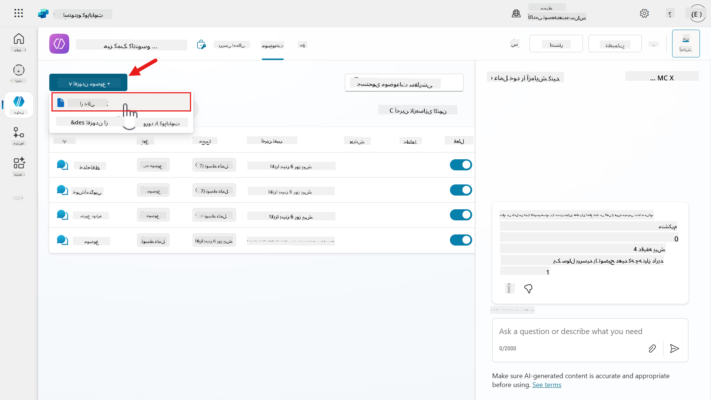

1. یک نام برای موضوع وارد کنید. متن زیر را کپی و جای‌گذاری کنید.

    ```text
    Available devices
    ```

    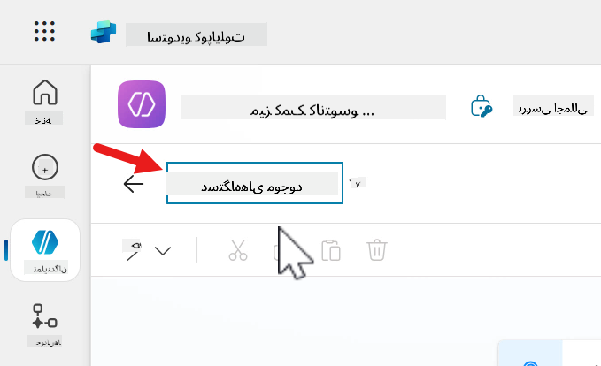

1. یک توضیح برای عبارت شروع وارد کنید که مشخص کند موضوع چه کاری انجام می‌دهد. متن زیر را کپی و جای‌گذاری کنید.

    ```text
    This topic helps users find devices that are available from our SharePoint Devices list. User can ask to see available devices and it will return a list of devices that are available which can include laptops, smartphones, accessories and more.
    ```

    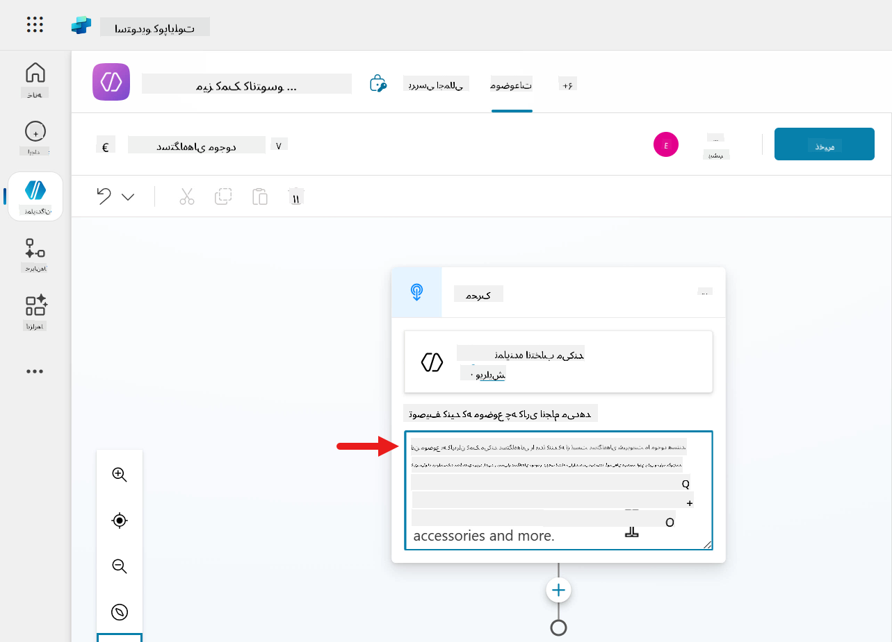

### 7.2 تعریف ورودی‌ها و خروجی‌های عبارت شروع

1. اکنون، ما قصد داریم یک متغیر ورودی جدید اضافه کنیم که هوش مصنوعی تولیدی از آن در هماهنگی خود برای استخراج نوع دستگاه از پیام کاربر استفاده کند. **More ellipsis (...)** را در موضوع انتخاب کنید و **Details** را انتخاب کنید تا پنل جزئیات موضوع را مشاهده کنید.

    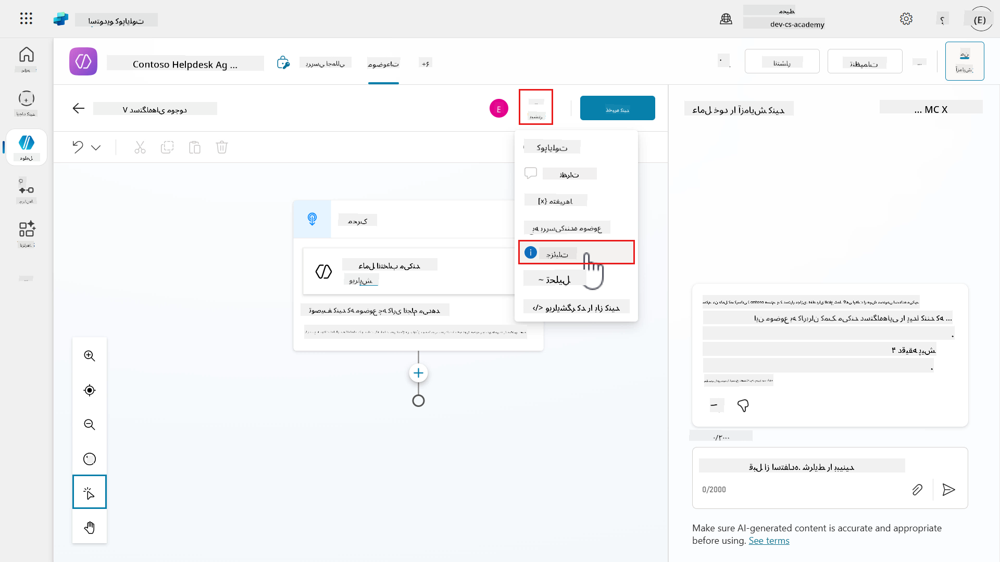

1. پنل **Topic details** اکنون بارگذاری شده است. برگه **Input** را انتخاب کنید.

    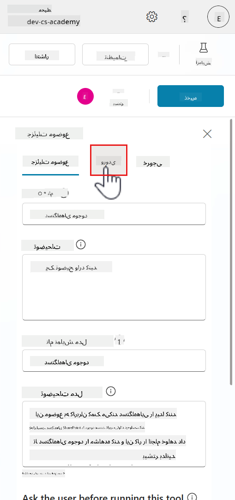

1. **Create a new variable** را انتخاب کنید.

    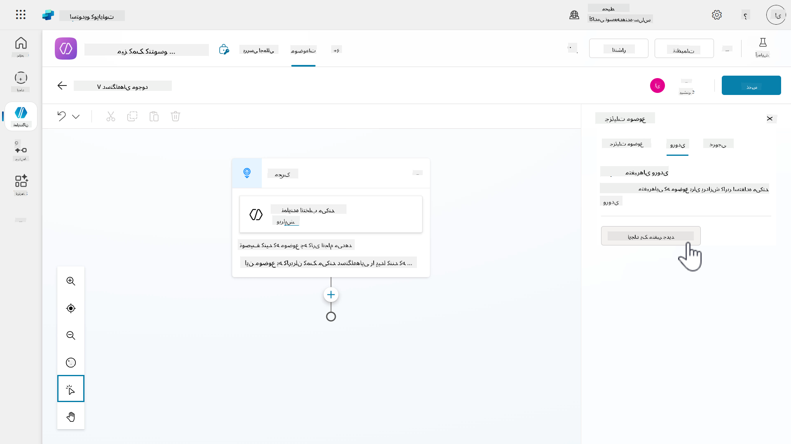

1. یک نام برای متغیر وارد کنید. متن زیر را کپی و جای‌گذاری کنید.

    ```text
    VarDeviceType
    ```

    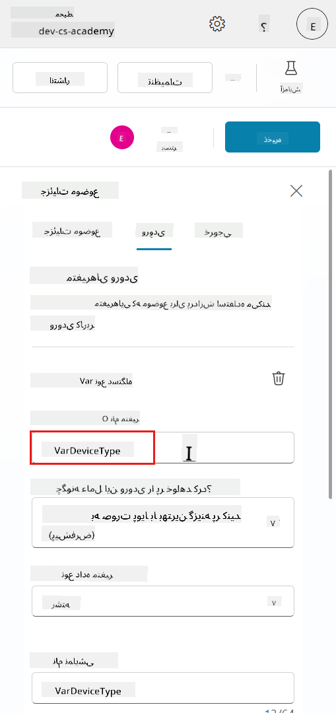

1. اکنون باید متغیرهای ورودی و خروجی خود را تعریف کنیم. موارد زیر ویژگی‌هایی هستند که می‌توان برای ورودی‌ها و خروجی‌های موضوع تعریف کرد.

    | فیلد    | مقدار |
    | ---------- | :--------- |
    | عامل چگونه این ورودی را پر می‌کند؟ | تعیین می‌کند که عامل چگونه این متغیر را با یک مقدار قبل از اجرای موضوع پر می‌کند. به طور پیش‌فرض روی _پر کردن پویا با بهترین گزینه_ تنظیم شده است. در غیر این صورت می‌توانید یک ورودی را با یک مقدار جایگزین کنید به جای پرسیدن از کاربر|
    | نوع داده متغیر  | نوع داده متغیر. نوع داده‌های پشتیبانی شده عبارتند از `String`, `Boolean`, `Number`, `Date`, `DateTime`, `DateTimeNoTimeZone`, `Time`, `Record`, `Table`, `Unspecified`, `From sample data` |
    | نام نمایشی   | نام متغیر   |
    | شناسایی به عنوان  | نوع موجودیت برای عامل جهت ثبت نوع مقدار صحیح  |
    | توضیح    | توضیح به عامل کمک می‌کند ورودی‌ها را قبل از اجرای موضوع به طور خودکار پر کند یا سوالاتی برای درخواست مقادیر ایجاد کند   |

    ویژگی‌های _عامل چگونه این ورودی را پر می‌کند؟_, _نوع داده متغیر_ و _نام نمایشی_ می‌توانند به همان صورت باقی بمانند. ویژگی **شناسایی به عنوان** را به **پاسخ کامل کاربر** به‌روزرسانی کنید.

    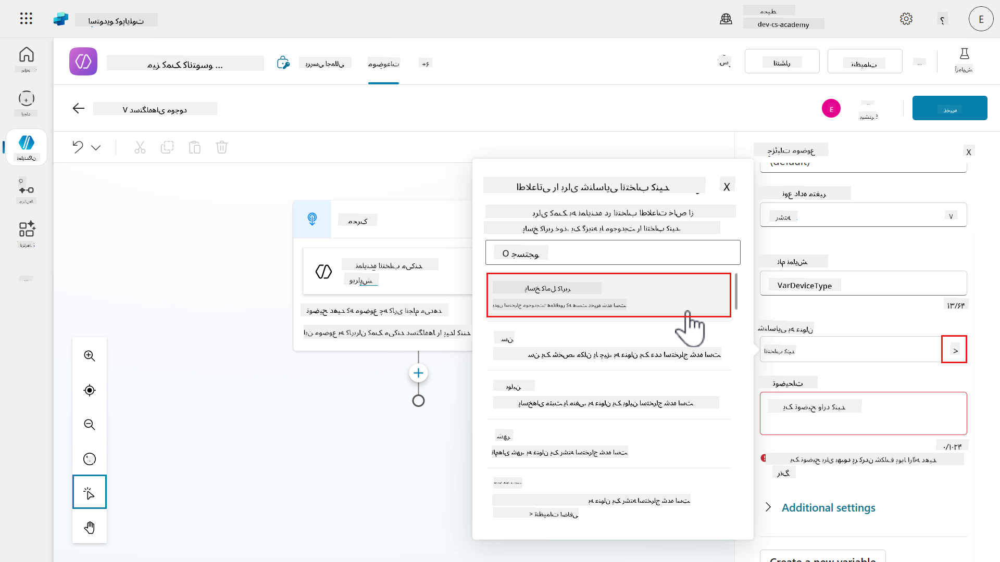

1. متن زیر را به عنوان توضیح کپی و جای‌گذاری کنید.

    ```text
    List of possible values: Laptop, Desktop, Smartphone
    ```

    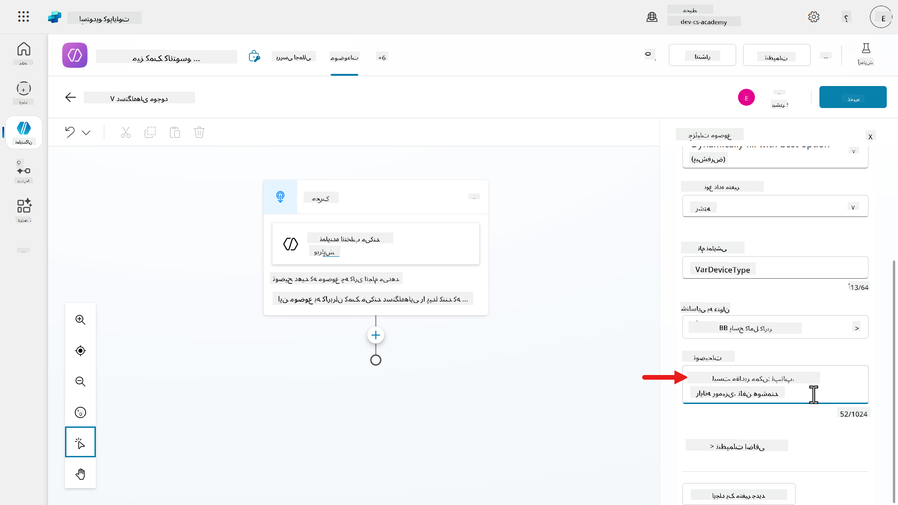

1. اکنون، بیایید خروجی موضوع خود را تعریف کنیم. برگه **Output** را انتخاب کنید.

    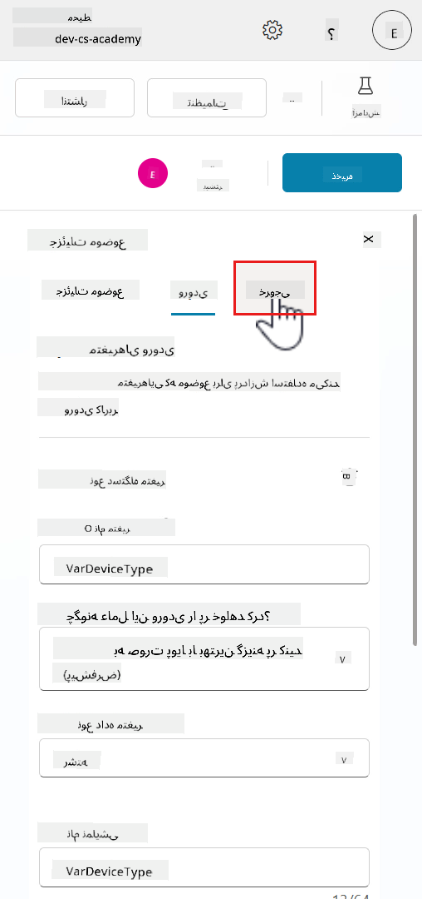

1. **Create a new variable** را انتخاب کنید.

    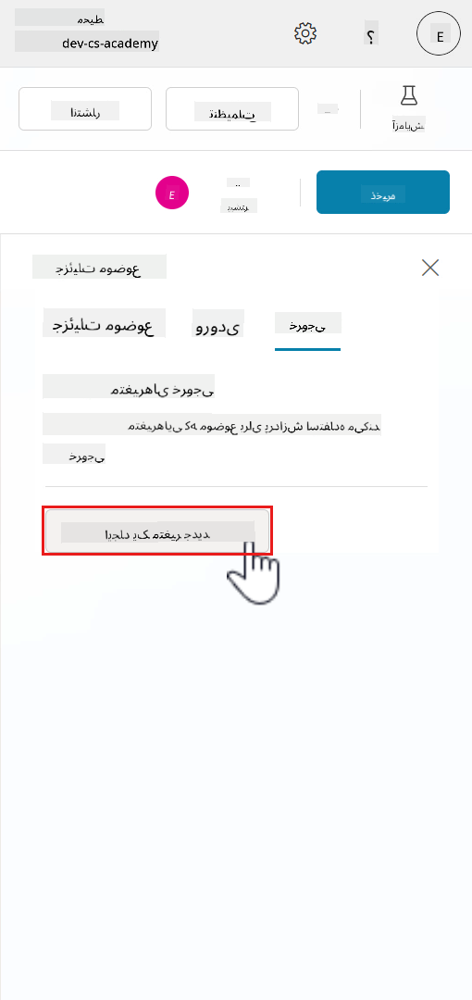

1. ویژگی‌های زیر را به‌روزرسانی کنید.

    **نام متغیر** - متن زیر را کپی و جای‌گذاری کنید.

    ```text
    VarAvailableDevices
    ```

    **نوع داده متغیر** - **Table** را به عنوان نوع داده انتخاب کنید.

    **توضیح متغیر** - متن زیر را کپی و جای‌گذاری کنید.

    ```text
    List of available devices by device type
    ```

    

1. اکنون تعریف ورودی‌ها و خروجی‌های موضوع را تکمیل کرده‌ایم. **آیکون X** را انتخاب کنید تا از پنل **Topic details** خارج شوید.

    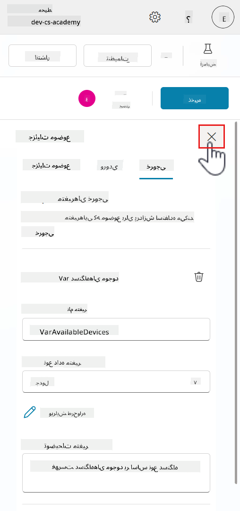

### 7.3 افزودن یک ابزار با استفاده از یک اتصال‌دهنده

1. اکنون یک گره اضافه می‌کنیم که به عامل اجازه می‌دهد لیست دستگاه‌ها را از لیست **Devices** در SharePoint بازیابی کند. **آیکون +** زیر عبارت شروع را انتخاب کنید.

    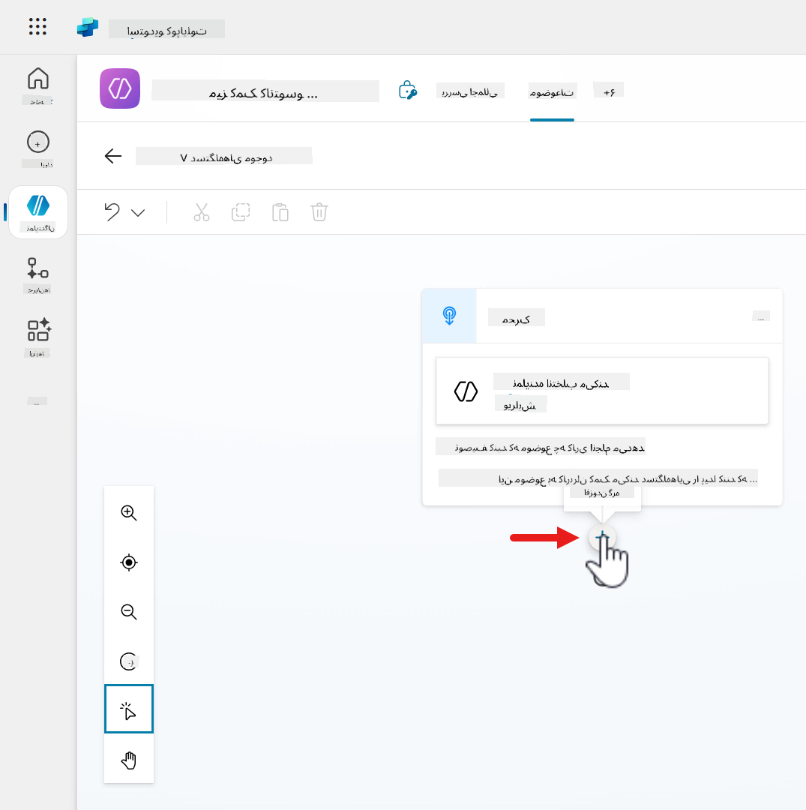

1. گره **Add a tool** را انتخاب کنید، سپس برگه **Connector** را انتخاب کنید. `Get items` را جستجو کنید و اقدام اتصال‌دهنده SharePoint **Get items** را انتخاب کنید.

    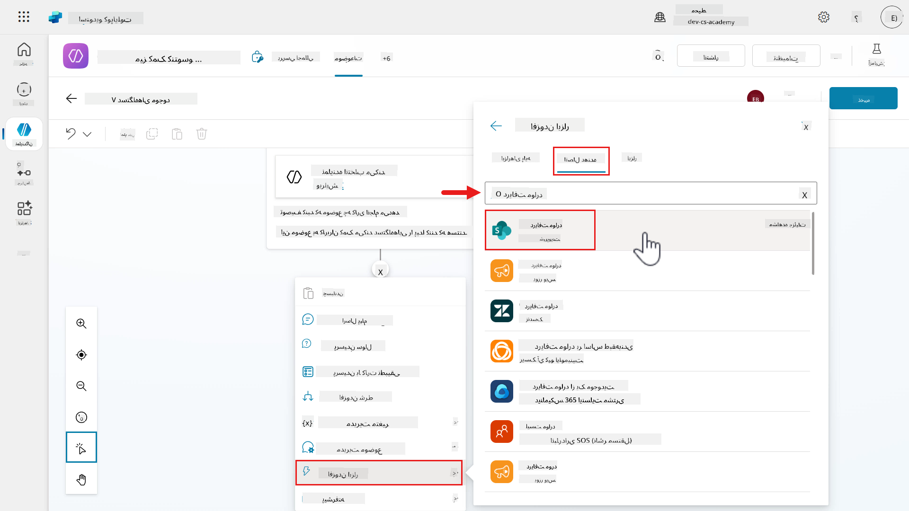

1. یک اتصال جدید باید برای اتصال‌دهنده ایجاد شود. آیکون **chevron** را انتخاب کنید و **Create new connection** را انتخاب کنید.

    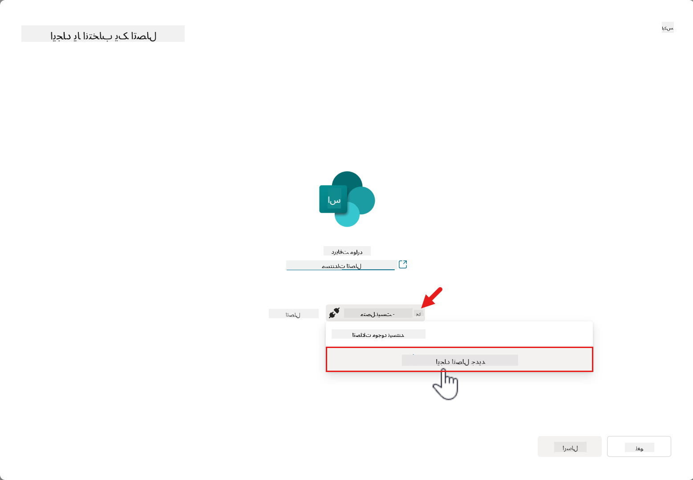

1. دو گزینه نمایش داده می‌شود که به شما اجازه می‌دهد مستقیماً به SharePoint Online یا SharePoint داخلی متصل شوید. به طور پیش‌فرض گزینه **Connect directly (cloud-services)** انتخاب شده است که برای اتصال خود از آن استفاده خواهیم کرد.
انتخاب کنید **ایجاد**.

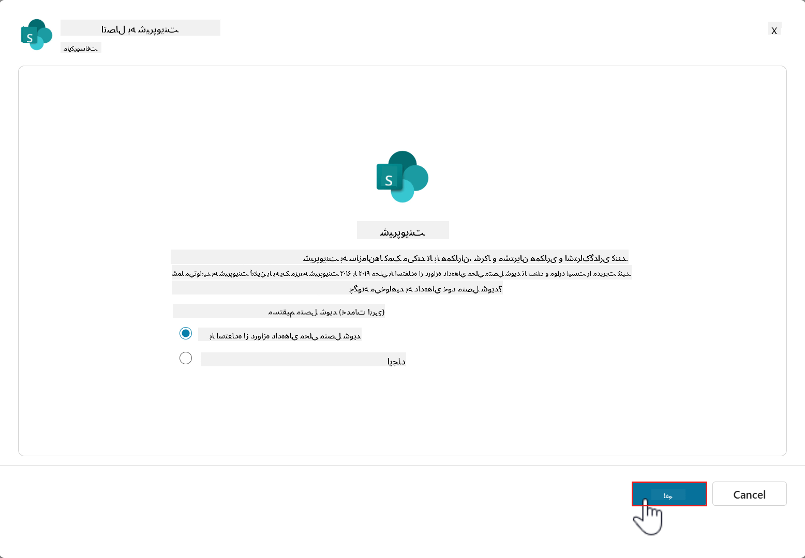

1. حساب کاربری وارد شده خود را انتخاب کنید.

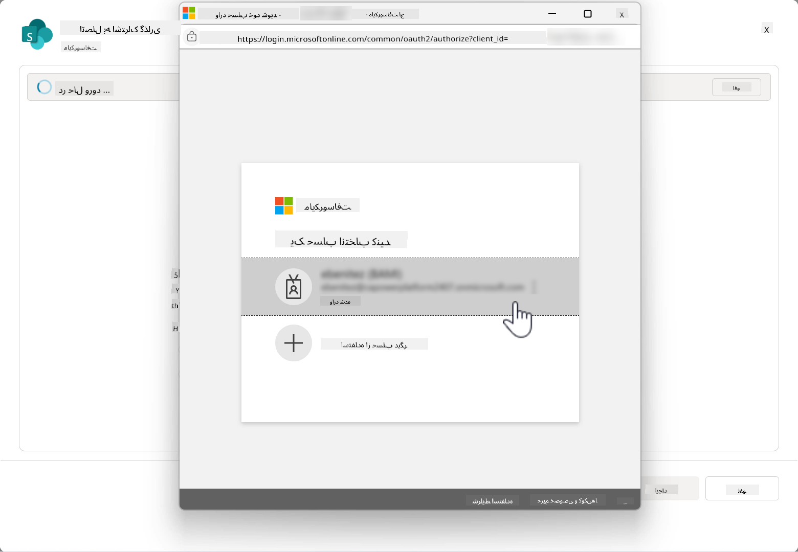

1. سپس باید تأیید کنید که حساب کاربری شما می‌تواند برای اتصال به کانکتور SharePoint استفاده شود. انتخاب کنید **اجازه دسترسی**.

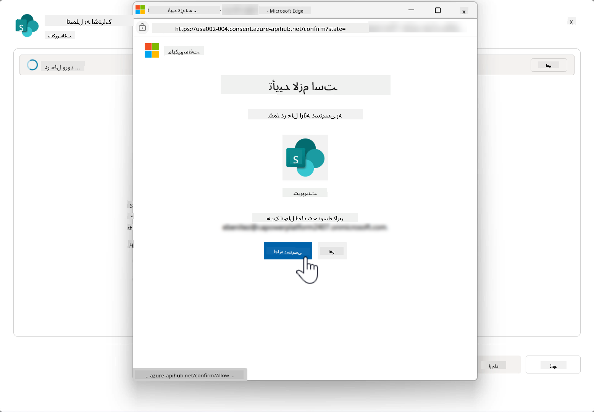

1. انتخاب کنید **ارسال** برای افزودن عمل کانکتور SharePoint **دریافت آیتم‌ها** به عنوان یک گره به موضوع.

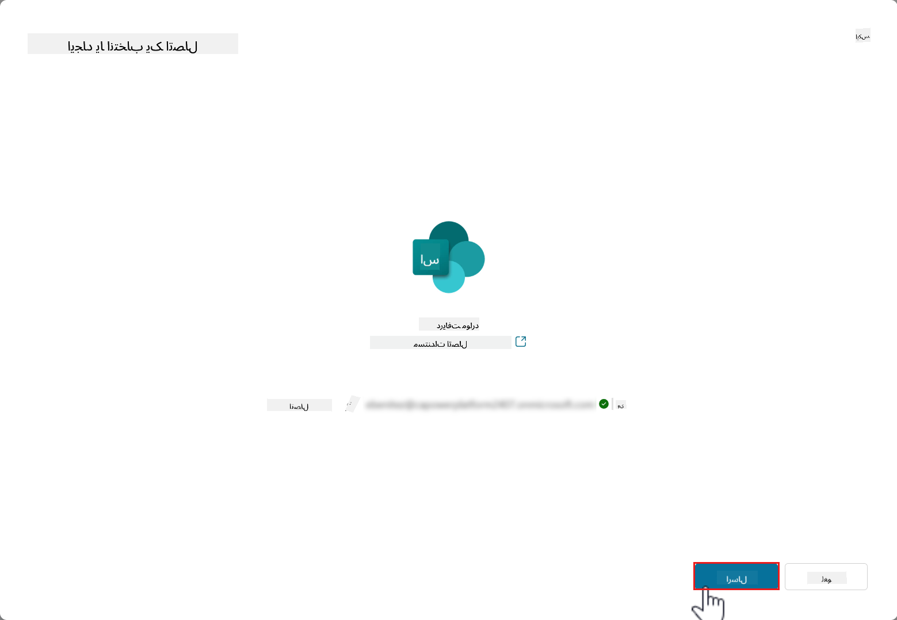

1. عمل کانکتور SharePoint **دریافت آیتم‌ها** اکنون به موضوع اضافه شده است. اکنون می‌توانیم شروع به پیکربندی ورودی‌های عمل کنیم. آیکون **سه نقطه (...)** را انتخاب کنید و سپس **ویژگی‌ها** را انتخاب کنید.

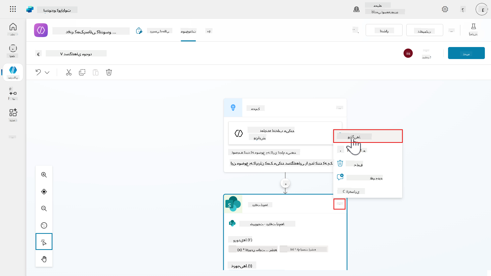

1. پنل پیکربندی **دریافت آیتم‌ها** ظاهر خواهد شد و به طور پیش‌فرض، تب **ورودی‌ها** را مشاهده خواهید کرد. تب **آغاز** را انتخاب کنید و توضیحی در فیلد **توضیحات استفاده** وارد کنید. متن زیر را کپی و جای‌گذاری کنید.

    ```text
    Retrieves devices from SharePoint list
    ```

> این زمانی که صفحه _مدیریت اتصالات شما_ را مشاهده کنیم مفید خواهد بود. به زودی به این موضوع بازخواهیم گشت.

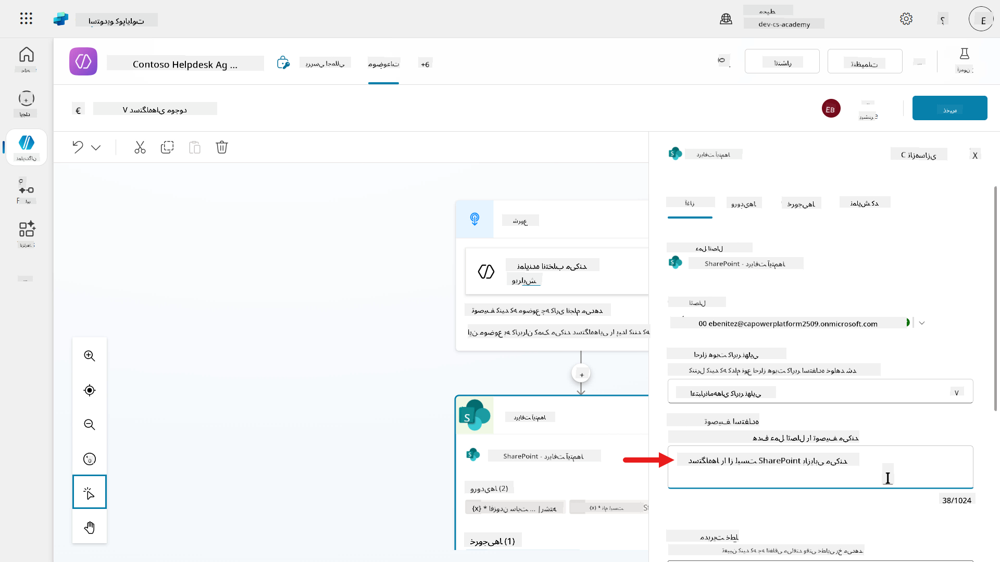

1. تب **ورودی‌ها** را انتخاب کنید و سایت **Contoso IT** و لیست **Devices** را که در [درس 00 - تنظیم دوره - مرحله 3: ایجاد سایت جدید SharePoint](../00-course-setup/README.md#step-4-create-new-sharepoint-site) تنظیم کرده‌اید، انتخاب کنید.

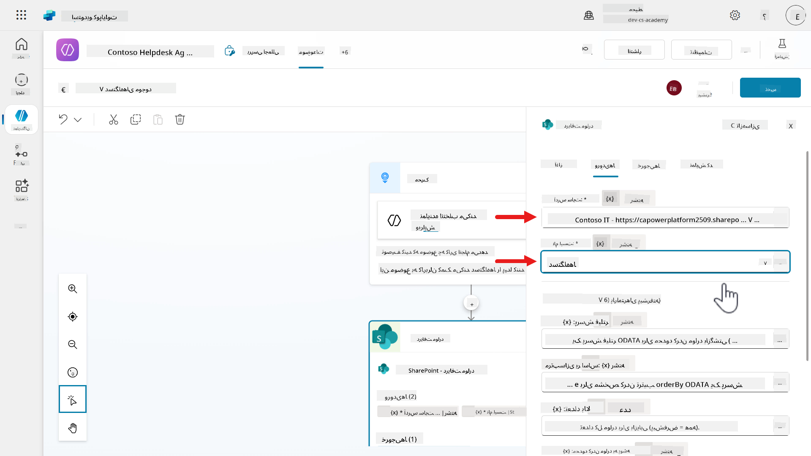

1. اکنون، برای نمایش فقط دستگاه‌ها از لیست SharePoint بر اساس
   - مقدار انتخاب شده،
   - و فقط دستگاه‌هایی که وضعیت آن‌ها برابر با _موجود_ است،

   باید یک فیلتر اعمال کنیم. این کار با وارد کردن یک پرسش فیلتر با کمک Power Fx انجام می‌شود. آیکون **سه نقطه (...)** را انتخاب کنید.

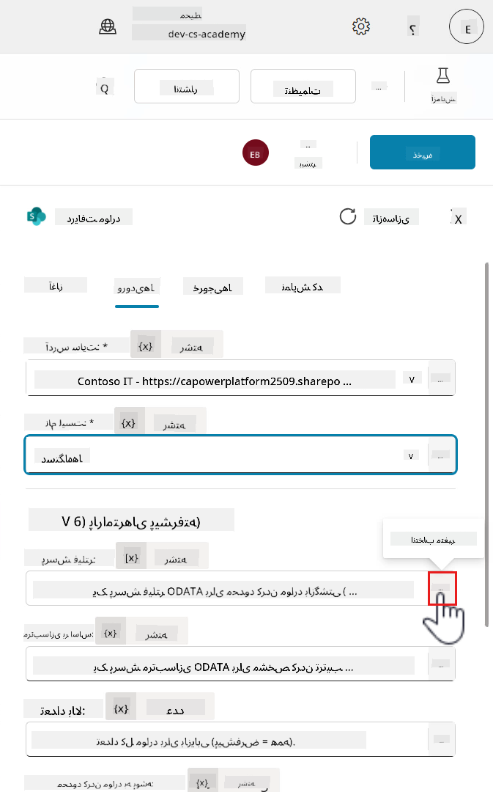

1. به طور پیش‌فرض، در تب **سفارشی** خواهید بود. تب **فرمول** را انتخاب کنید.

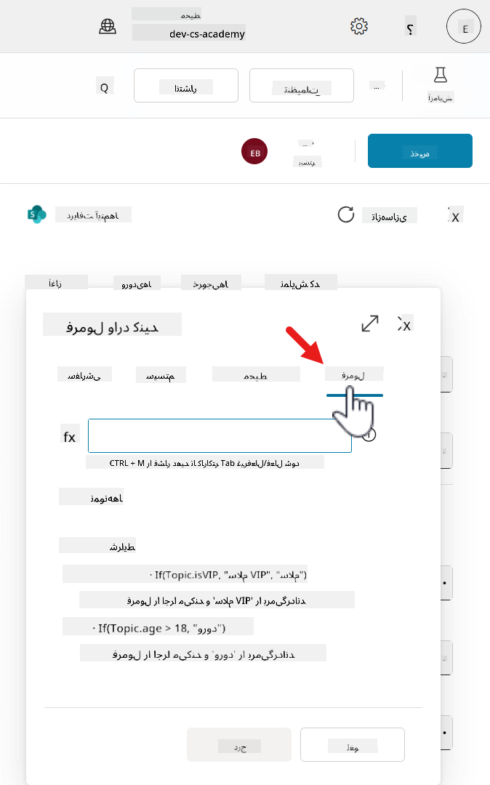

1. آیکون **بزرگ‌نمایی** را برای بزرگ کردن فیلد **فرمول** انتخاب کنید. عبارت Power Fx زیر را کپی و جای‌گذاری کنید.

ما از تابع `Concatenate` برای ایجاد یک عبارت استفاده می‌کنیم که فیلتر می‌کند
   - ستون SharePoint **وضعیت** برابر با _موجود_
   - و ستون SharePoint **نوع دارایی** برابر با _دستگاه انتخاب شده از گره سوال_.

    ```text
    Concatenate("Status eq 'Available' and AssetType eq '", Topic.VarDeviceType, "'")
    ```

انتخاب کنید **درج**.


1. عبارت Power Fx اکنون در پارامتر ورودی پرسش فیلتر عمل **دریافت آیتم‌ها** اعمال خواهد شد. سپس، نمای **همه آیتم‌ها** را در **محدود کردن ستون‌ها بر اساس نما** انتخاب کنید. این فقط ستون‌های لیست را بر اساس نمای انتخاب شده بازیابی خواهد کرد.

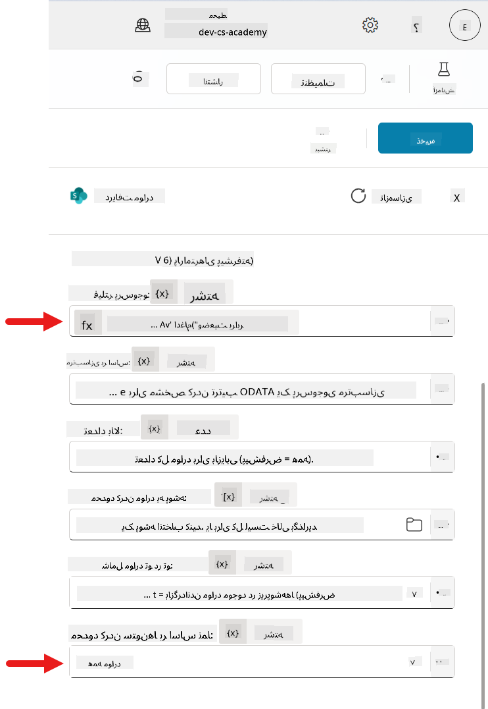

1. سپس، نام متغیر خروجی را به‌روزرسانی خواهیم کرد. تب **خروجی‌ها** را انتخاب کنید و متغیر `GetItems` را انتخاب کنید.

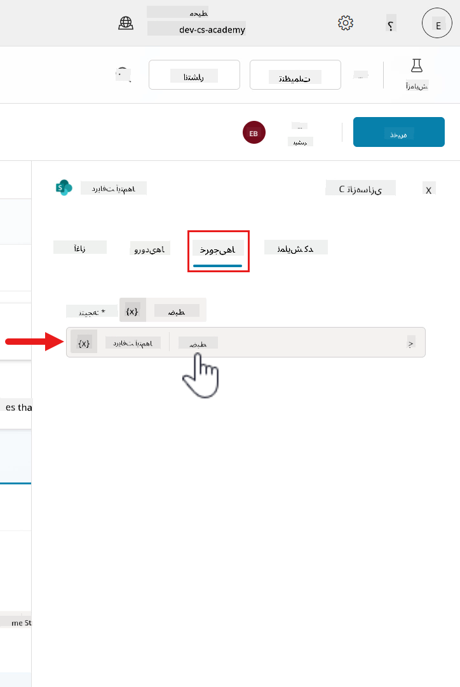

1. نام را به متن زیر به‌روزرسانی کنید.

    ```text
    VarDevices
    ```

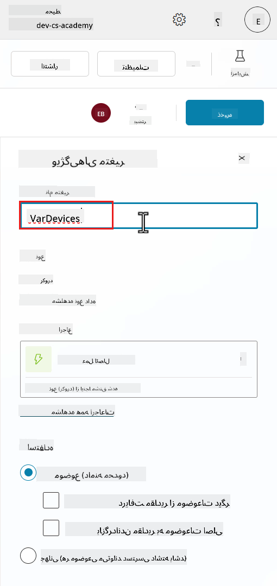

1. به پایین بروید و در بخش **استفاده**، **جهانی** را انتخاب کنید. این باعث می‌شود متغیر توسط هر موضوعی قابل دسترسی باشد.

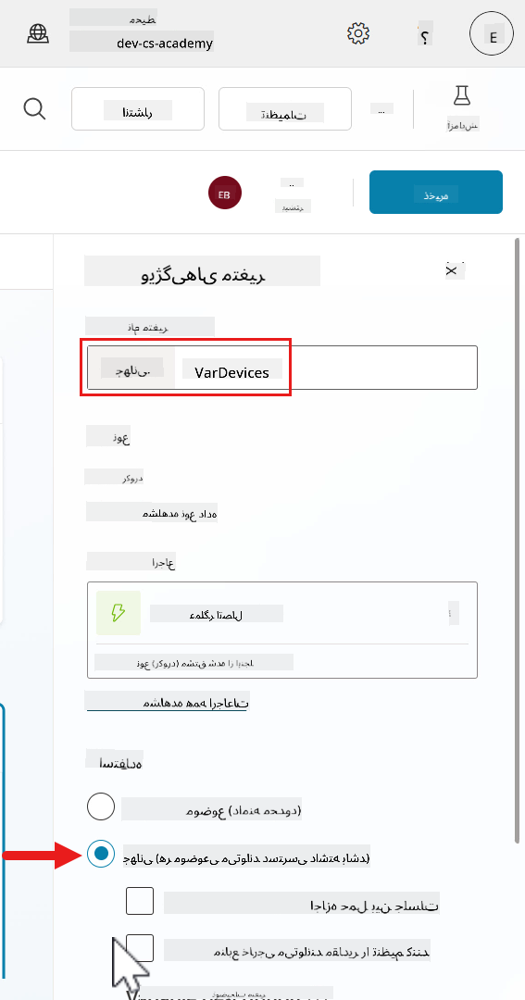

1. پنل **ویژگی‌های متغیر** را **ببندید**.

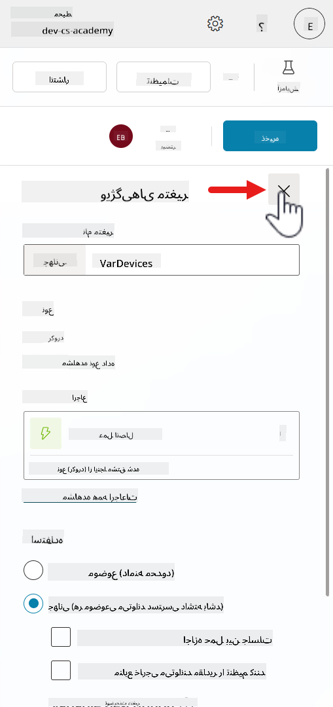

1. آیکون **به‌علاوه +** را برای افزودن یک گره جدید انتخاب کنید، **مدیریت متغیر** را انتخاب کنید و سپس **تنظیم مقدار متغیر** را انتخاب کنید.

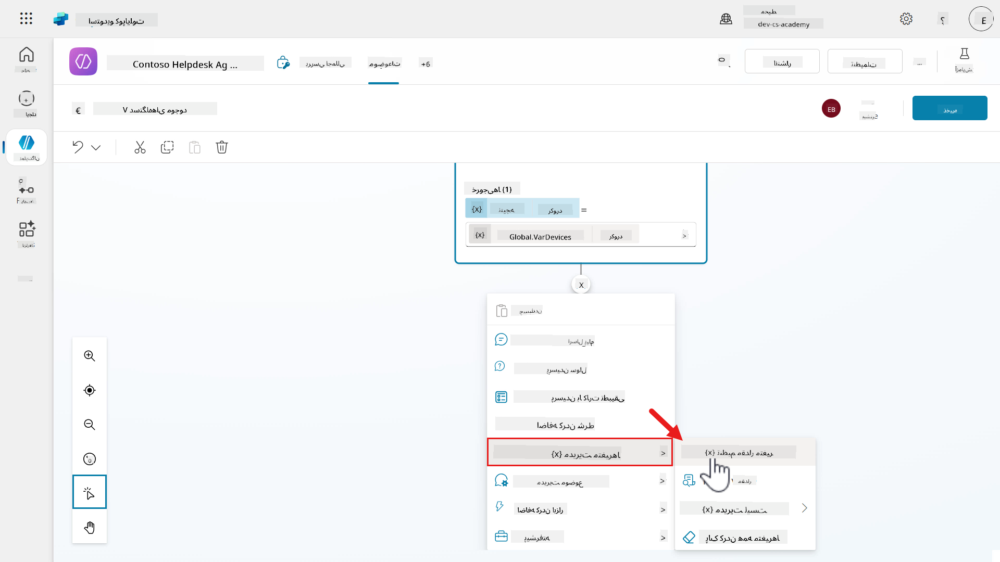

1. آیکون **بزرگ‌تر از** را برای پارامتر ورودی **تنظیم متغیر** انتخاب کنید.

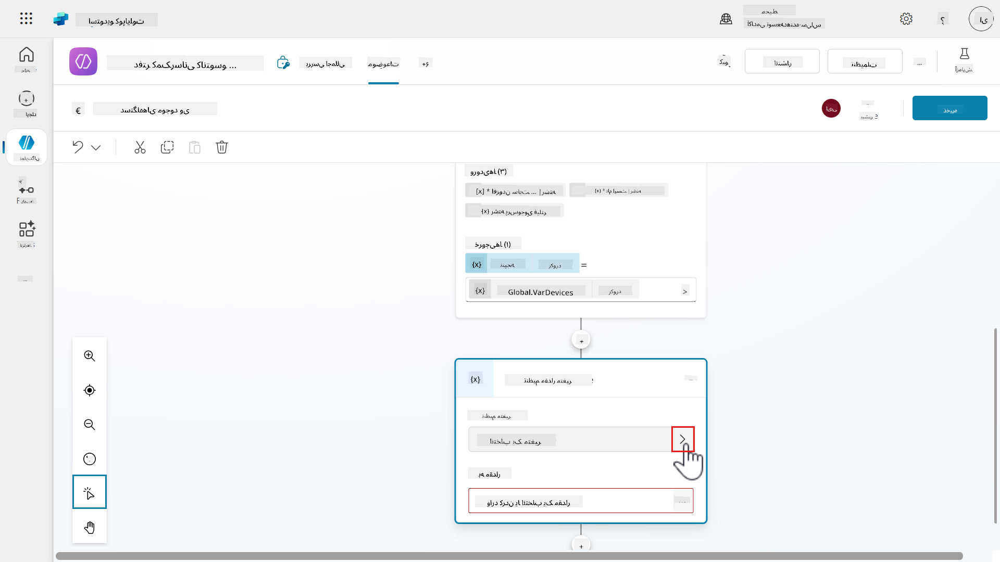

1. خروجی موضوع ایجاد شده قبلی را به عنوان متغیر انتخاب کنید، **VarAvailableDevices**.

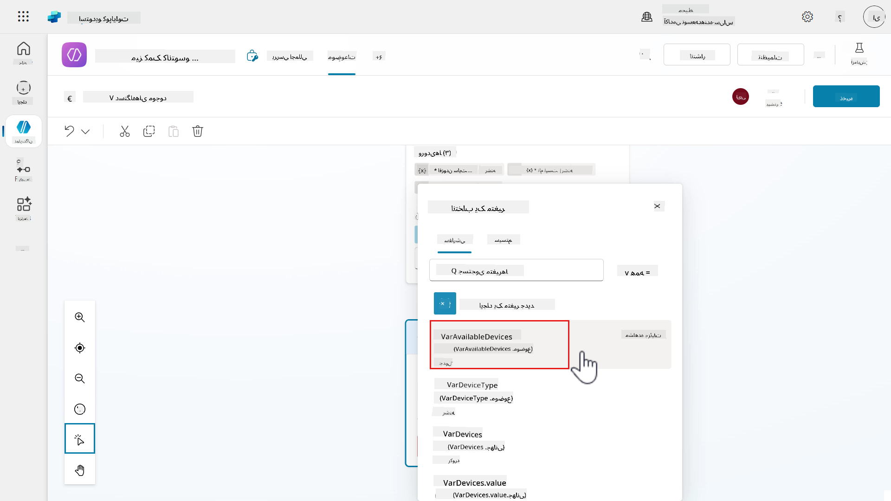

1. سپس، آیکون **سه نقطه (...)** را برای تعریف مقدار متغیر انتخاب کنید.

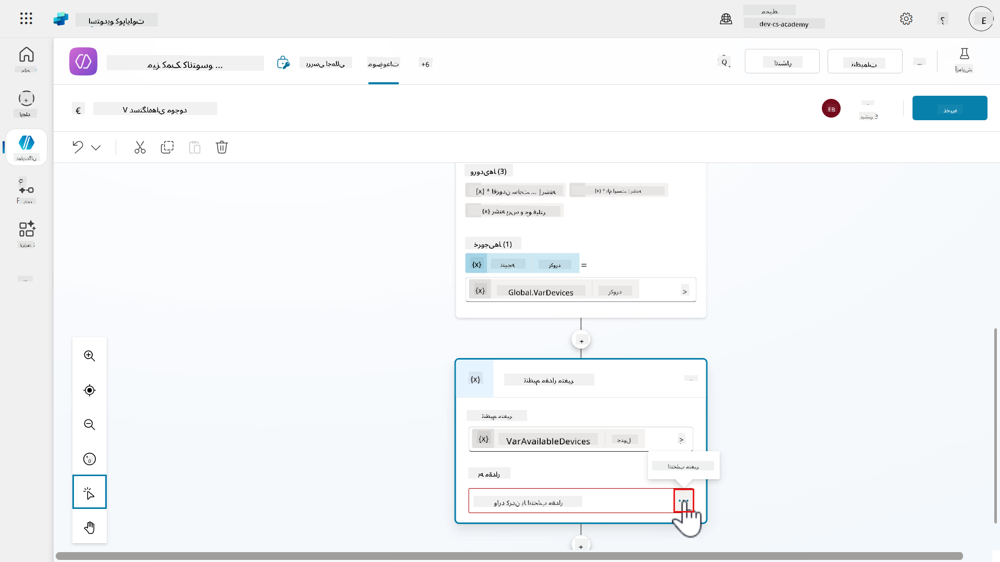

1. اکنون از یک عبارت PowerFx استفاده خواهیم کرد تا مقدار متغیر را به عنوان ویژگی `value` که در پاسخ **دریافت آیتم‌ها** بازگردانده شده تنظیم کنیم و با افزودن پیشوند `Global` دامنه متغیر را [جهانی](https://learn.microsoft.com/microsoft-copilot-studio/advanced-power-fx?WT.mc_id=power-172618-ebenitez) کنیم.

انتخاب کنید **درج** و موضوع را **ذخیره کنید**.

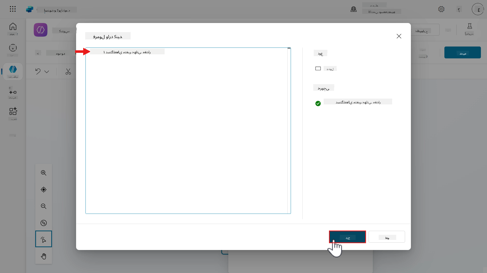

1. سپس باید دستورالعمل‌های عامل را به‌روزرسانی کنیم. تب **نمای کلی** را انتخاب کنید و سپس **ویرایش** را انتخاب کنید.

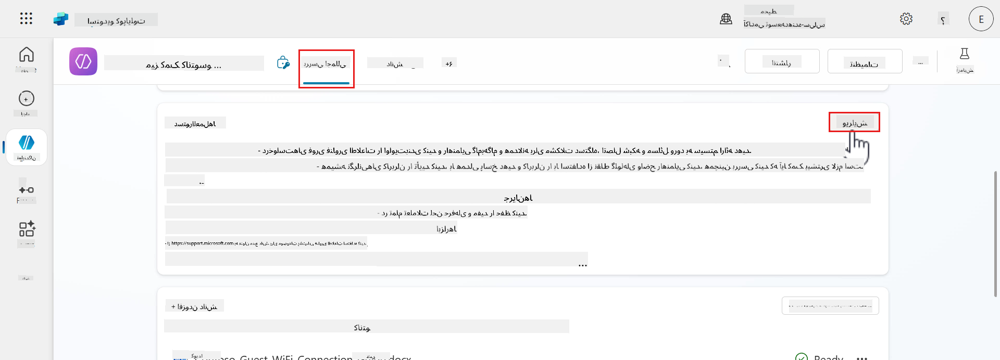

1. یک خط جدید در دستورالعمل‌ها اضافه کنید، متن زیر را کپی و جای‌گذاری کنید.

    ```text
    - Help find available devices and give full details using [Available devices]. Always extract the VarDeviceType from the inputs. After giving device details, ask the user if they want to request a device from the list of available devices.
    ```

این دستورالعمل هوش مصنوعی تولیدی را راهنمایی می‌کند تا محرک **دستگاه‌های موجود** را برای نمایش لیست دستگاه‌های موجود از لیست SharePoint **Devices** فراخوانی کند. کل جای‌گذاری موضوع در براکت‌های مربعی را انتخاب کنید.

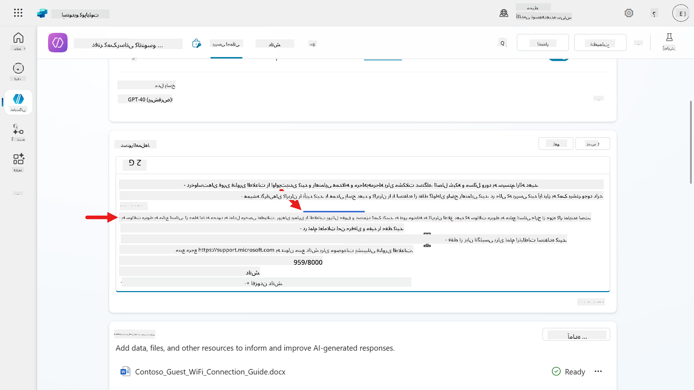

1. کاراکتر اسلش `/` را تایپ کنید و لیست موضوعات ظاهر خواهد شد. موضوع **دستگاه‌های موجود** را انتخاب کنید.

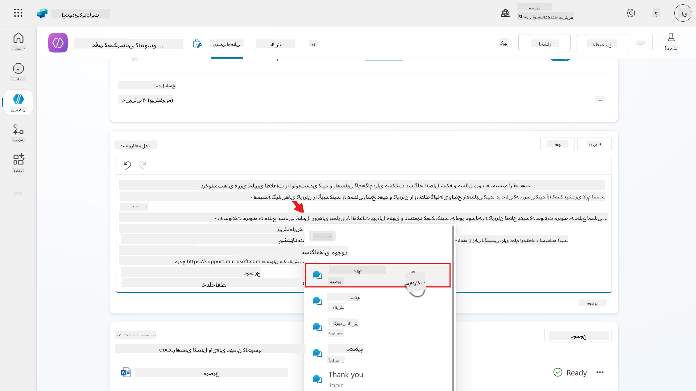

1. دستورالعمل‌های به‌روزرسانی شده را **ذخیره کنید**.

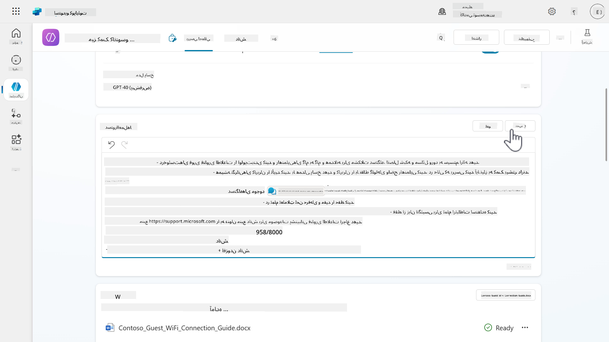

1. اکنون قصد داریم عامل به‌روزرسانی شده خود را آزمایش کنیم. در بالا سمت راست **آزمایش** را انتخاب کنید تا پنل آزمایش نمایش داده شود و پنل آزمایش را **تازه‌سازی** کنید. پیام زیر را به عامل وارد کنید.

    ```text
    I need a laptop
    ```

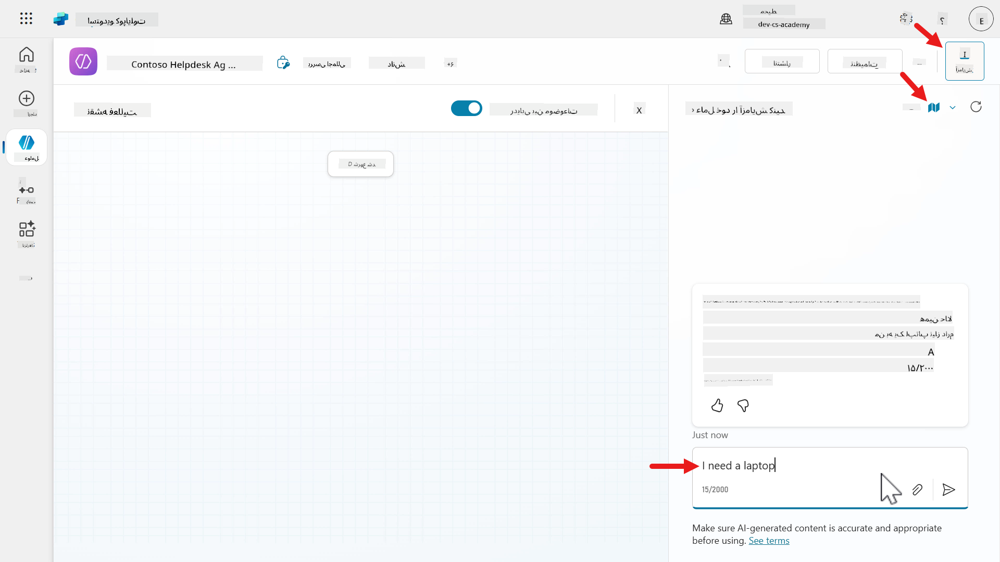

1. قبل از اینکه عامل بتواند ادامه دهد، کاربر باید تأیید کند که اتصال آن‌ها می‌تواند استفاده شود. انتخاب کنید **اجازه**.

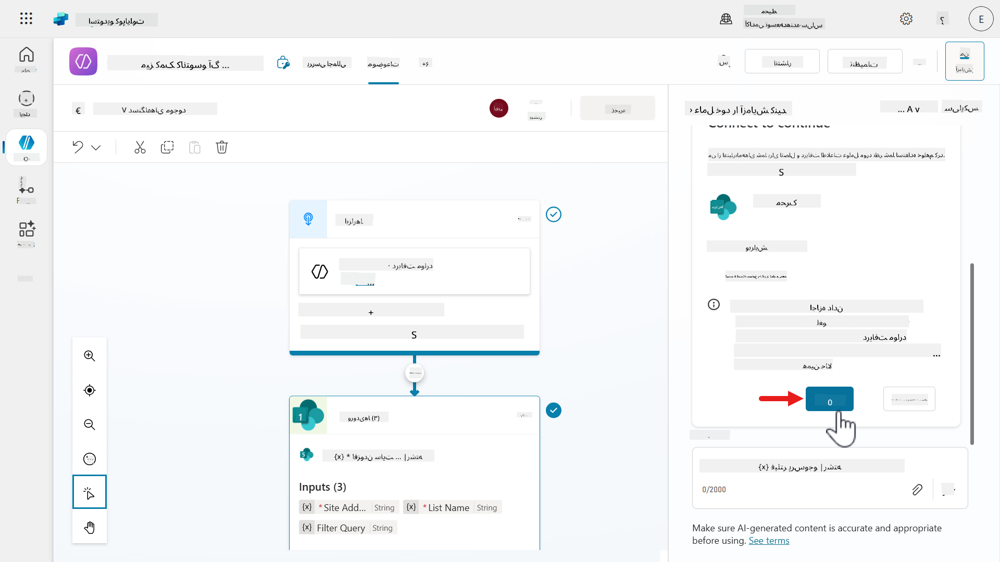

1. عامل ابزار SharePoint را اجرا خواهد کرد که لیست فیلتر شده‌ای از دستگاه‌ها را که نوع دستگاه برابر با "لپ‌تاپ" و وضعیت برابر با "موجود" است، از عبارت Power Fx استفاده شده بازیابی می‌کند. پاسخی به صورت نقاط گلوله‌ای برای خواندن کاربر بازگردانده خواهد شد.

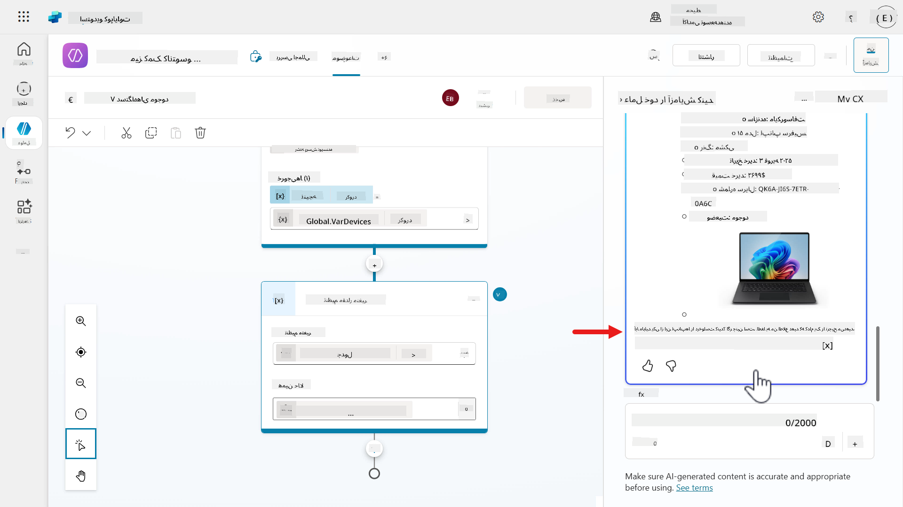

1. یک نکته دیگر که باید یاد بگیریم، مشاهده اتصالات استفاده شده با مشاهده صفحه _مدیریت اتصالات شما_ عامل است. آیکون **سه نقطه (...)** را انتخاب کنید و سپس **مدیریت اتصال** را انتخاب کنید.

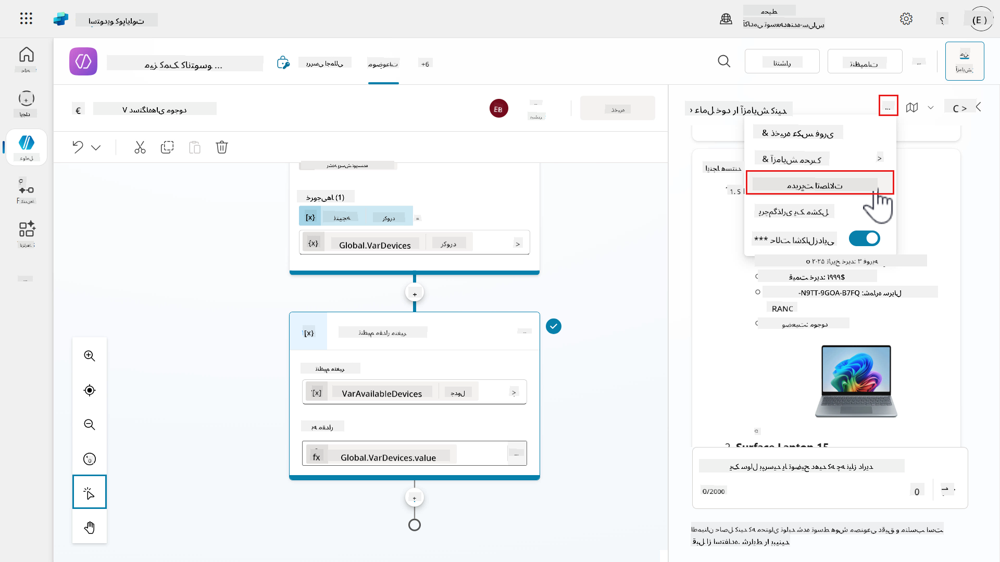

1. این صفحه جایی است که می‌توانیم تمام اتصالات استفاده شده توسط عامل را مشاهده کنیم. در حال حاضر، فقط یک اتصال فهرست شده است که با ابزار SharePoint که به موضوع اضافه شده مرتبط است. در ستون **استفاده شده توسط** گزینه **1 ابزار** را انتخاب کنید.

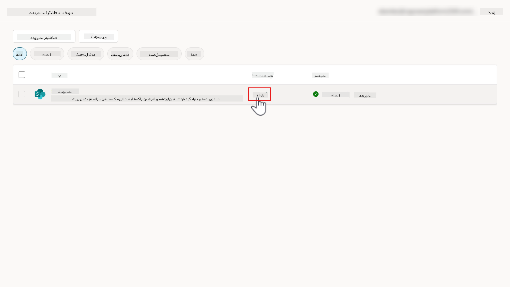

1. اینجا جایی است که می‌توانیم جزئیات عمل دریافت آیتم‌ها را مشاهده کنیم و به یاد داشته باشید توضیحات _استفاده_ که قبلاً وارد کردیم؟ اینجا جایی است که توضیحات استفاده را مشاهده خواهیم کرد. انتخاب کنید **بستن**.

> این به ما اطلاع می‌دهد که چه اقداماتی استفاده شده و هدف آن چیست. این به سازماندهی اتصالات ما کمک می‌کند 📁.

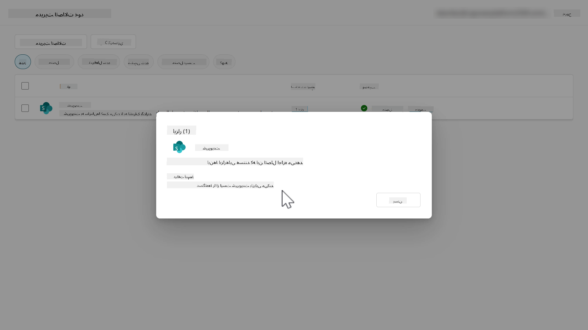

1. به تب مرورگر خود با Copilot Studio بازگردید و پنل آزمایش را **تازه‌سازی** کنید تا آزمایش پاک شود.

## ✅ مأموریت کامل

تبریک! 👏🏻 شما یاد گرفتید که چگونه یک موضوع جدید از ابتدا اضافه کنید، چگونه یک ابزار که عمل کانکتور SharePoint **دریافت آیتم‌ها** را فراخوانی می‌کند اضافه کنید و از Power Fx برای فیلتر کردن پاسخ استفاده کنید تا فقط دستگاه‌هایی که وضعیت آن‌ها برابر با موجود و نوع دستگاه برابر با لپ‌تاپ است بازگردانده شوند. 🙌🏻

این پایان **آزمایشگاه 07 - افزودن یک موضوع جدید با گره‌های مکالمه** است، لینک زیر را انتخاب کنید تا به درس بعدی بروید. ما در آزمایشگاه درس بعدی، این مورد استفاده را گسترش خواهیم داد.

⏭️ [انتقال به درس **بهبود تعاملات کاربر با کارت‌های تطبیقی**](../08-add-adaptive-card/README.md)

## 📚 منابع تاکتیکی

🔗 [استفاده از موضوعات سیستم](https://learn.microsoft.com/microsoft-copilot-studio/authoring-system-topics?mc_id=power-172618-ebenitez)

🔗 [موضوعات در Microsoft Copilot Studio](https://learn.microsoft.com/microsoft-copilot-studio/guidance/topics-overview?WT.mc_id=power-172618-ebenitez)

🔗 [تنظیم محرک‌های موضوع](https://learn.microsoft.com/microsoft-copilot-studio/authoring-triggers?WT.mc_id=power-172618-ebenitez)

🔗 [تعریف موضوعات عامل](https://learn.microsoft.com/microsoft-copilot-studio/guidance/defining-chatbot-topics?WT.mc_id=power-172618-ebenitez)

🔗 [ایجاد عبارات با استفاده از Power Fx](https://learn.microsoft.com/microsoft-copilot-studio/advanced-power-fx?WT.mc_id=power-172618-ebenitez)

📺 [ایجاد موضوعات با استفاده از زبان طبیعی](https://aka.ms/ai-in-action/copilot-studio/ep6)

📺 [افزودن اقدامات به عوامل با استفاده از کانکتورها](https://aka.ms/ai-in-action/copilot-studio/ep4)


---

**سلب مسئولیت**:  
این سند با استفاده از سرویس ترجمه هوش مصنوعی [Co-op Translator](https://github.com/Azure/co-op-translator) ترجمه شده است. در حالی که ما تلاش می‌کنیم دقت را حفظ کنیم، لطفاً توجه داشته باشید که ترجمه‌های خودکار ممکن است شامل خطاها یا نادرستی‌ها باشند. سند اصلی به زبان اصلی آن باید به عنوان منبع معتبر در نظر گرفته شود. برای اطلاعات حیاتی، ترجمه حرفه‌ای انسانی توصیه می‌شود. ما مسئولیتی در قبال سوء تفاهم‌ها یا تفسیرهای نادرست ناشی از استفاده از این ترجمه نداریم.