<!--
CO_OP_TRANSLATOR_METADATA:
{
  "original_hash": "cc4afa4a5a11c9d03896decfbcbd4060",
  "translation_date": "2025-10-21T18:25:27+00:00",
  "source_file": "docs/recruit/09-add-an-agent-flow/README.md",
  "language_code": "fa"
}
-->
# 🚨 مأموریت ۰۹: افزودن جریان عامل به موضوع خود برای خودکارسازی

## 🕵️‍♂️ نام رمز: `عملیات قدرت خودکارسازی`

> **⏱️ زمان عملیات:** `~۳۰ دقیقه`

🎥 **تماشای راهنما**

[](https://www.youtube.com/watch?v=vtLZJT3eBXg "تماشای راهنما در یوتیوب")

## 🎯 خلاصه مأموریت

عامل شما اکنون می‌تواند با کاربران گفتگو کند و اطلاعات ارائه دهد، اما برای رسیدن به برتری عملیاتی واقعی، باید بتواند اقدام کند. این مأموریت عامل مکالمه‌ای شما را به یک قدرت خودکارسازی تبدیل می‌کند، با تجهیز آن به جریان‌های عامل.

در پایان مأموریت، شما یک خودکارسازی درخواست دستگاه از ابتدا تا انتها ایجاد خواهید کرد که ورودی کاربر را از طریق کارت تطبیقی دریافت می‌کند، داده‌ها را از SharePoint بازیابی می‌کند، به مدیران از طریق ایمیل اطلاع‌رسانی می‌کند و بازخورد بی‌وقفه‌ای به کاربران ارائه می‌دهد - همه این‌ها توسط عامل شما از طریق خودکارسازی هوشمند جریان کاری هماهنگ می‌شود.

## 🔎 اهداف

در این مأموریت، شما یاد خواهید گرفت:

1. درک اینکه جریان‌های عامل چیست و چگونه با جریان‌های ابری Power Automate برای خودکارسازی متفاوت هستند.
1. یادگیری ویژگی‌های کلیدی که جریان‌های عامل را قدرتمند می‌سازند، از جمله اقدامات هوش مصنوعی و نویسندگی زبان طبیعی.
1. بررسی طراح جریان عامل و نحوه استفاده از عبارات برای مدیریت داده‌های پویا.
1. ایجاد یک خودکارسازی کامل درخواست دستگاه که داده‌های SharePoint و اطلاع‌رسانی‌های ایمیل را ادغام می‌کند.

## 🤔 جریان عامل چیست؟

جریان‌های عامل راهی قدرتمند برای خودکارسازی وظایف تکراری و ادغام برنامه‌ها و خدمات شما هستند. آن‌ها را به عنوان جریان‌های کاری ساختاریافته و مرحله به مرحله تصور کنید که عامل شما می‌تواند برای خودکارسازی وظایف یا اتصال به برنامه‌ها و خدمات دیگر اجرا کند. می‌توانید آن‌ها را به عنوان جریان‌های کوچک تصور کنید که به عامل شما کمک می‌کنند کارهایی مانند ارسال اطلاع‌رسانی‌ها، به‌روزرسانی سوابق یا پاسخ به رویدادها انجام دهد.

برخلاف عوامل خودمختار که از هوش مصنوعی برای تصمیم‌گیری در لحظه استفاده می‌کنند، جریان‌های عامل **جریان‌های کاری تعیین‌شده** هستند - به این معنی که هر بار مسیر یکسانی را دنبال می‌کنند و نتایج ثابت و قابل اعتماد ارائه می‌دهند.

به زبان ساده:

- آن‌ها به عامل شما کمک می‌کنند _کارها را انجام دهد_، نه فقط _چیزهایی را به کاربران بگوید_.
- آن‌ها قابل استفاده مجدد در موضوعات و عوامل مختلف هستند و می‌توانند توسط پیام‌های کاربر، رویدادها یا برنامه‌ها و خدمات دیگر فعال شوند.

## 🙋🏽 بله، اما چگونه با جریان‌های ابری Power Automate متفاوت است؟

هر دو جریان‌های عامل و جریان‌های ابری Power Automate به خودکارسازی وظایف کمک می‌کنند. آن‌ها برای اهداف مختلف طراحی شده‌اند و به روش‌های مختلف کار می‌کنند.

### 🤖 جریان‌های عامل در Copilot Studio

**برای چه چیزی هستند:**

- برای عوامل مکالمه‌ای و خودمختار (از طریق دستورالعمل‌های عامل) در Copilot Studio ساخته شده‌اند.
- بر خودکارسازی هوشمند و مبتنی بر هوش مصنوعی که با سیستم‌های کسب‌وکار تعامل دارد تمرکز دارند.

**چرا مفید هستند:**

- ساخت و مدیریت آسان مستقیماً در Copilot Studio.
- عالی برای خودکارسازی وظایفی که _در طول مکالمه_ با کاربران اتفاق می‌افتد، مانند ارسال درخواست مرخصی.
- نیازی به مجوز جداگانه Power Automate ندارید، زیرا صورتحساب بر اساس استفاده در Copilot Studio است. این می‌تواند برای تیم‌های سازمانی زمان و هزینه صرفه‌جویی کند.

**محدودیت‌ها:**

- نمی‌توانید آن‌ها را به اشتراک بگذارید، کپی کنید یا مالک مشترک اختصاص دهید.
- جریان‌های عامل فقط در Copilot Studio قابل مشاهده و استفاده هستند.
- در حال حاضر، محرک‌های رویداد برای عوامل را می‌توان در پورتال سازنده Power Automate ویرایش کرد.

### ☁️ جریان‌های ابری Power Automate

**برای چه چیزی هستند:**

- طراحی شده برای خودکارسازی عمومی در بسیاری از برنامه‌ها و خدمات.
- می‌توانند به طور مستقل اجرا شوند یا در کنار جریان‌های عامل کار کنند.

**چرا مفید هستند:**

- طیف گسترده‌ای از اتصال‌دهنده‌ها را ارائه می‌دهند.
- ایده‌آل برای خودکارسازی فرآیندها خارج از عوامل.
- قابل اشتراک‌گذاری، استفاده مجدد و مدیریت در تیم‌ها هستند.

**نیازمندی‌ها:**

- برای استفاده از آن‌ها به مجوز Power Automate نیاز دارید.

### 📗 خلاصه

| از این استفاده کنید | وقتی می‌خواهید |
| :- | :- |
| جریان‌های عامل | وظایف را داخل یک عامل خودکار کنید، از هوش مصنوعی استفاده کنید و همه چیز را در Copilot Studio نگه دارید |  
| جریان‌های ابری Power Automate | خودکارسازی در برنامه‌ها و خدمات یا ساخت جریان‌های کاری خارج از عوامل |

## 👍🏻 چرا از جریان‌های عامل استفاده کنیم

جریان‌های عامل همیشه یک مسیر ثابت را دنبال می‌کنند - هر بار که ورودی یکسانی داده شود، همان کار را انجام می‌دهند.

این باعث می‌شود:

- **قابل اعتماد** - می‌توانید مطمئن باشید که هر بار به همان شکل عمل می‌کنند.
- **قابل پیش‌بینی** - می‌دانید که چه نتیجه‌ای را هنگام اجرای جریان انتظار دارید.
- **بر اساس قوانین** - آن‌ها مراحل تعریف‌شده توسط شما را دنبال می‌کنند.

مزایای دیگر عبارتند از:

- **خودکارسازی** - به عامل شما امکان می‌دهد وظایف تکراری مانند ارسال فرم‌ها یا اطلاع‌رسانی‌ها را مدیریت کند.
- **متصل** - اتصال به بیش از ۱۴۰۰ اتصال‌دهنده مانند ServiceNow، SharePoint، Salesforce. در غیر این صورت می‌توانید اتصال‌دهنده سفارشی خود را بسازید.
- **یکپارچگی قوی** - جریان‌های عامل بخشی از منطق عامل هستند، مستقیماً توسط پیام‌های کاربر یا اقدامات در مکالمه فعال می‌شوند.
- **مقیاس‌پذیری** - استفاده مجدد از جریان‌ها در عوامل یا سناریوهای مختلف.
- **بدون کدنویسی یا کدنویسی کم** - می‌توانید جریان‌ها را با استفاده از زبان طبیعی یا یک طراح بصری بسازید.
- **پلتفرم همه‌جانبه** - می‌توانید جریان‌های عامل را در یک مکان طراحی، آزمایش و منتشر کنید - Copilot Studio. نیازی به جابجایی بین پلتفرم‌ها نیست.

## 🏄🏻‍♂️ جریان‌های عامل چگونه عامل شما را تقویت می‌کنند؟

جریان‌های عامل قابلیت‌های عامل شما را فراتر از "گفتگو کردن" با کاربران گسترش می‌دهند. آن‌ها به عامل اجازه می‌دهند اقدام کند و با سیستم‌ها تعامل داشته باشد.

فرض کنید شما در یک بخش مالی کار می‌کنید و تعداد زیادی فاکتور از فروشندگان دریافت می‌کنید. معمولاً کسی باید هر فاکتور را بخواند، جزئیات مهم - مبلغ، تاریخ، فرستنده - را استخراج کند و بررسی کند که آیا همه چیز با سوابق شما مطابقت دارد. سپس آن را برای تأیید به فرد مناسب ارسال کند. این کار زمان و تلاش زیادی می‌برد.

با جریان‌های عامل در Copilot Studio، می‌توانید این فرآیند را خودکار کنید. به محض دریافت فاکتور، عامل:

1. سند را با استفاده از پردازش هوشمند سند می‌خواند تا اطلاعات کلیدی را پیدا کند.
1. جزئیات را با داده‌های سازمانی شما بررسی می‌کند تا مطمئن شود همه چیز درست است.
1. آن را برای تأیید به فرد(های) مناسب ارسال می‌کند.

این کار زمان را صرفه‌جویی می‌کند، اشتباهات را کاهش می‌دهد و کل فرآیند را روان‌تر می‌کند.

### این‌گونه تصور کنید

- **عوامل**: تصمیم‌گیرندگان هوشمند
- **جریان‌های عامل**: اجراکنندگان قابل اعتماد

### چرا اهمیت دارد

- شما بهترین‌های هر دو جهان را دریافت می‌کنید: خودکارسازی قابل اعتماد و هوش مصنوعی انعطاف‌پذیر.
- ساخت و به‌روزرسانی جریان‌ها با تغییر نیازهای کسب‌وکار آسان است.
- می‌توانید خودکارسازی را در تیم‌ها گسترش دهید.

## 🔌 ویژگی‌های کلیدی که جریان‌های عامل را قدرتمند می‌سازند

1. **نویسندگی زبان طبیعی**
    - می‌توانید آنچه را که می‌خواهید جریان انجام دهد به زبان ساده توضیح دهید.
    - Copilot قصد شما را درک می‌کند و جریان را برای شما می‌سازد.
    - نیازی به نوشتن کد نیست - فقط ایده خود را توضیح دهید.

1. **اقدامات هوش مصنوعی**

    استفاده از هوش مصنوعی برای:

    - خواندن و درک اسناد یا تصاویر.
    - خلاصه کردن محتوای طولانی به پاسخ‌های کوتاه و مفید.
    - ارائه توصیه‌ها یا تصمیمات هوشمند.

1. **اقدامات تولیدی**
    - این‌ها به جریان اجازه می‌دهند در زمان واقعی تطبیق پیدا کند.
    - عامل می‌تواند مراحل را بر اساس اطلاعات در حال تغییر برنامه‌ریزی و تنظیم کند.

1. **اقدامات یکپارچه‌سازی**
    - جریان خود را به ابزارهای دیگر مانند Outlook، Microsoft Teams، ServiceNow، SharePoint و سایر برنامه‌ها و خدمات متصل کنید، از طریق بیش از ۱۴۰۰ اتصال‌دهنده داخلی یا اتصال‌دهنده سفارشی خود.
    - این به عامل شما کمک می‌کند با برنامه‌هایی که تیم شما از قبل استفاده می‌کند کار کند.

1. **انسان در حلقه**
    - مراحل تأیید را اضافه کنید که در آن یک فرد باید چیزی را بررسی یا تأیید کند.
    - [تأییدهای پیشرفته](https://learn.microsoft.com/microsoft-copilot-studio/flows-advanced-approvals?WT.mc_id=power-172621-ebenitez) از یادآوری‌ها، تفویض اختیار و تأییدهای چندمرحله‌ای پشتیبانی می‌کند.

## ⚙️ چگونه کار می‌کنند

1. **محرک**

    یک رویداد جریان را شروع می‌کند - مانند پرسش کاربر، فعال کردن جریان از یک موضوع، زمان‌بندی شده، یا رویدادی که در یک سیستم دیگر اتفاق می‌افتد.

1. **اقدامات**

    این‌ها مراحل بعدی هستند که عامل دنبال می‌کند - ارسال ایمیل، فراخوانی یک API، به‌روزرسانی یک تیکت در ServiceNow.

## 🧶 چگونه یک جریان عامل ایجاد کنیم

1. **زبان طبیعی**: توضیح دهید که می‌خواهید عامل چه کاری انجام دهد، و Copilot آن را برای شما می‌سازد.
1. **بوم طراح**: اقدامات، شرایط و حلقه‌ها را در طراح جریان عامل بکشید و رها کنید تا جریان عامل خود را بسازید.

## 🎨 طراح جریان عامل چیست؟

این یک ابزار بصری در Copilot Studio است که به شما کمک می‌کند جریان‌های عامل را بسازید، ویرایش کنید و مدیریت کنید که دستورالعمل‌های مرحله به مرحله‌ای را ارائه می‌دهند که عامل شما برای انجام وظایف دنبال می‌کند. این ابزار به گونه‌ای طراحی شده که استفاده از آن حتی اگر در جریان‌های عامل تازه‌کار باشید، آسان باشد.

### ویژگی‌های کلیدی طراح جریان عامل

1. **بوم بصری**
    - می‌توانید کل جریان خود را به صورت یک نمودار مشاهده کنید.
    - به راحتی بزرگ‌نمایی/کوچک‌نمایی کنید، نمای را تنظیم کنید یا از نقشه کوچک برای پیمایش جریان‌های بزرگ استفاده کنید.

1. **افزودن و حذف اقدامات**
    - روی دکمه _بعلاوه (+)_ کلیک کنید تا یک اقدام جدید مانند ارسال پیام یا به‌روزرسانی یک آیتم در لیست SharePoint اضافه کنید.
    - می‌توانید اقدامات را از اتصال‌دهنده‌ها جستجو کنید و از طریق تنظیمات آن‌ها پیکربندی کنید.
    - برای حذف یک اقدام، روی _سه نقطه (⋮)_ کلیک کنید و گزینه _حذف_ را انتخاب کنید.

1. **بررسی پارامترها**
    - روی هر اقدامی کلیک کنید تا تنظیمات آن به نام _پارامترها_ را مشاهده یا ویرایش کنید.
    - می‌توانید مقادیر را به صورت دستی وارد کنید یا از _عبارات_ برای پویا کردن آن‌ها استفاده کنید.

1. **تاریخچه نسخه**
    - هر بار که جریان خود را ذخیره می‌کنید، یک نسخه ثبت می‌شود.
    - می‌توانید به نسخه‌های قبلی بازگردید و آن‌ها را مشاهده یا بازیابی کنید.

1. **بررسی خطا**
    - _بررسی‌کننده جریان_ هر خطایی را برجسته می‌کند.
    - تمام خطاها باید قبل از انتشار جریان حل شوند.

1. **انتشار و آزمایش**
    - پس از رفع خطاها، جریان خود را منتشر کنید تا زنده شود.
    - از ویژگی _آزمایش_ برای اجرای دستی یا خودکار جریان خود استفاده کنید و بررسی کنید که آیا همان‌طور که انتظار می‌رود کار می‌کند.

### چرا از طراح جریان عامل استفاده کنیم؟

- **بصری و شهودی** - می‌توانید جریان‌ها را با کشیدن و کلیک کردن بسازید.
- **ایمن برای آزمایش** - تاریخچه نسخه به شما امکان می‌دهد تغییرات را لغو کنید.
- **آزمایش داخلی** - به شما کمک می‌کند مطمئن شوید همه چیز قبل از زنده شدن کار می‌کند.

## 🔤 شما از _عبارات_ صحبت کردید - عبارات چیستند؟

عبارات فرمول‌ها یا دستورات کوچکی هستند که به جریان عامل شما کمک می‌کنند با داده‌ها کار کند. شما از آن‌ها برای محاسبه مقادیر، قالب‌بندی متن، تصمیم‌گیری یا استخراج اطلاعات خاص از ورودی‌ها استفاده می‌کنید.

### چرا از عبارات استفاده کنیم؟

عبارات به شما امکان می‌دهند:

- **شخصی‌سازی نحوه مدیریت داده‌ها** - ترکیب نام‌ها، قالب‌بندی تاریخ‌ها.
- **تصمیم‌گیری** - اگر مقداری بزرگ‌تر از ۱۰ باشد، کاری انجام دهید.
- **تبدیل داده‌ها** - تغییر متن به حروف کوچک، استخراج بخشی از یک رشته.
- **منطق خودکارسازی** - بدون نوشتن کد کامل.

### عبارات چگونه به نظر می‌رسند؟

عبارات از توابع استفاده می‌کنند. من قصد دارم توضیحی از توابع را از Microsoft MVP سابق، جری وینستاک، قرض بگیرم.

!!! نقل قول
    توابع منطق داخلی هستند که داده‌های شما را از طریق عملیات ساده یا پیچیده در عبارت شما تبدیل می‌کنند.

توابع به شما امکان می‌دهند عبارات بسازید بدون اینکه نیاز به نوشتن کد داشته باشید.

به روشی که من دوست دارم توضیح دهم، یک تابع در جریان‌های عامل مشابه توابع Excel است. شما می‌توانید یک عملیات روی داده‌ها انجام دهید تا آن را به خروجی مطلوب تبدیل کنید. هنگام ساخت فرمول خود در Excel، شما مقدار ورودی خود را از سلول‌های یک جدول یا محدوده انتخاب می‌کنید و سپس توابع را برای دستکاری خروجی داده‌ها اعمال می‌کنید. یک مثال استفاده از تابع `COUNT` برای محاسبه تعداد سلول‌هایی است که از یک محدوده شامل اعداد هستند.

در جریان‌های عامل، به جای ارجاع داده‌ها از سلول‌های یک جدول، شما داده‌های خروجی از محرک یا اقدامات را هنگام ساخت عبارات خود ارجاع می‌دهید. ادامه مثال قبلی، از تابع `length` برای بازیابی تعداد آیتم‌های بازگشتی از اقدام اتصال‌دهنده _دریافت آیتم‌ها_ SharePoint استفاده کنید.

### چرا توابع مهم هستند؟

استفاده از توابع جریان‌های عامل شما را:

- **هوشمندتر** - آن‌ها می‌توانند به ورودی‌ها یا شرایط مختلف واکنش نشان دهند.
- **انعطاف‌پذیرتر** - شما می‌توانید نحوه مدیریت داده‌ها را شخصی‌سازی کنید.
- **کارآمدتر** - شما از مراحل دستی با خودکارسازی منطق اجتناب می‌کنید.

### توابع بسیار مفید

توابع زیر توابع رایج مورد استفاده در جریان‌های عامل هستند. برای لیست کامل توابع، به [راهنمای مرجع](https://learn.microsoft.com/azure/logic-apps/workflow-definition-language-functions-reference?WT.mc_id=power-172621-ebenitez) مراجعه کنید.

#### 🔡 متن

- `concat()` - دو یا چند قطعه متن را به هم متصل می‌کند.
      - مثال: `concat('سلام ', firstName)` → “سلام جان”

- `toLower()` / `toUpper()` - متن را به حروف کوچک یا بزرگ تغییر می‌دهد.
      - مفید برای استانداردسازی ورودی.

- `substring()` - بخشی از یک رشته را استخراج می‌کند.
      - مثال: دریافت سه حرف اول یک نام.

- `trim()` - فاصله‌ها را از ابتدا و انتهای متن حذف می‌کند.

#### 🔢 ریاضی و عدد

- `add()`, `sub()`, `mul()`, `div()` - عملیات ریاضی پایه.
      - مثال: `add(5, 3)` - خروجی ۸ است.

#### 📅 تاریخ و زمان

- `utcNow()` - تاریخ و زمان فعلی را در UTC دریافت می‌کند.
      - عالی برای ثبت زمان.

- `addDays()`, `addHours()` - زمان را به یک تاریخ اضافه می‌کند.
- مثال: `addDays(utcNow(), 7)` خروجی ۷ روز از اکنون است.

- `formatDateTime()` - یک تاریخ را به رشته‌ای خوانا تبدیل می‌کند.
  - مثال: دوشنبه، ۷ جولای ۲۰۲۵

#### ✅ منطقی

- `if()` - یک مقدار را در صورت درست بودن اجرا می‌کند و مقدار دیگری را در صورت نادرست بودن.
  - مثال: `if(score > 50, 'Pass', 'Fail')`

- `equals()` - بررسی می‌کند که آیا دو مقدار یکسان هستند.

- `and()`, `or()`, `not()` - ترکیب چند شرط.

#### 🪣 توابع کاربردی دیگر

- `coalesce()` - اولین مقدار غیر خالی را برمی‌گرداند.
  - مناسب برای مقادیر پیش‌فرض یا جایگزین.

- `guid()` - یک شناسه منحصر به فرد تولید می‌کند.
  - مناسب برای ردیابی یا ثبت.

- `length()` - تعداد کاراکترها یا آیتم‌ها را در یک رشته یا آرایه شمارش می‌کند.

## ⭐ بهترین روش‌ها

در اینجا چند روش پیشنهادی برای ساخت جریان‌های عامل در Copilot Studio آورده شده است.

1. **با ساده شروع کنید و به تدریج گسترش دهید**

   - با یک وظیفه کوچک و واضح مانند ارسال پیام شروع کنید.
   - پس از آزمایش اصول اولیه اتوماسیون خود، مراحل بیشتری اضافه کنید.

1. **از نام‌های واضح و توصیفی برای اقدامات استفاده کنید**

   - هر مرحله را به وضوح برچسب‌گذاری کنید تا شما و تیم‌تان بدانید که چه کاری انجام می‌دهد.
   - مثال: به جای نام پیش‌فرض "Update item" برای اقدام اتصال SharePoint، آن را به چیزی که به‌روزرسانی می‌کند تغییر نام دهید، مانند "Update device status".

1. **قبل از انتشار، خطاها را بررسی کنید**

   - از **بررسی‌کننده جریان** برای یافتن و رفع مشکلات استفاده کنید.
   - نمی‌توانید جریان‌ها را منتشر کنید اگر خطاهایی وجود داشته باشد، بنابراین سعی کنید آن‌ها را هنگام وقوع رفع کنید.

1. **جریان خود را به طور کامل آزمایش کنید**

   - فقط به این دلیل که ذخیره و منتشر می‌شود، به این معنا نیست که همانطور که انتظار می‌رود کار می‌کند.
   - از ویژگی _Test_ برای اجرای دستی یا خودکار جریان خود استفاده کنید و نتایج را بررسی کنید.

1. **از تاریخچه نسخه استفاده کنید**

   - جریان خود را اغلب ذخیره کنید تا در صورت نیاز بتوانید به نسخه‌های قبلی بازگردید.
   - می‌توانید نسخه‌های قبلی را با استفاده از پنل _Version History_ مشاهده و بازیابی کنید.

1. **از پارامترها و عبارات به‌طور هوشمندانه استفاده کنید**

   - هنگام پیکربندی اقدامات، از پارامترها برای پویا کردن جریان خود استفاده کنید.
   - می‌توانید مقادیر را به صورت دستی وارد کنید یا از عبارات برای محاسبه آن‌ها استفاده کنید، یا آن را با مقادیر اقدامات قبلی ترکیب کنید با استفاده از انتخابگر _dynamic content_.

1. **اقدامات استفاده نشده را حذف کنید**

   - اگر یک اقدام اضافه کردید و بعداً تصمیم گرفتید که به آن نیاز ندارید، آن را حذف کنید تا جریان شما تمیز بماند.

## 🧪 آزمایشگاه ۰۹ - افزودن جریان عامل برای اتوماسیون و بهبود قابلیت‌های موضوع

اکنون می‌خواهیم یاد بگیریم که چگونه موضوع خود را با کارت‌های تطبیقی و استفاده از قابلیت‌های پیشرفته موضوعات و گره‌ها بهبود دهیم.

- [۹.۱ ایجاد جریان عامل](../../../../../docs/recruit/09-add-an-agent-flow)
- [۹.۲ افزودن جریان عامل به موضوع](../../../../../docs/recruit/09-add-an-agent-flow)
- [۹.۳ به‌روزرسانی موضوع درخواست دستگاه با چندین گره برای تجربه کاربری بهتر](../../../../../docs/recruit/09-add-an-agent-flow)
- [۹.۴ آزمایش عامل با چندین سناریو](../../../../../docs/recruit/09-add-an-agent-flow)

### ✨ مورد استفاده

**به عنوان** مدیر یک کارمند

**می‌خواهم** درخواست‌های دستگاه را دریافت کنم

**تا بتوانم** دستگاه درخواست شده توسط کارمند را بررسی کنم.

بیایید شروع کنیم!

### پیش‌نیازها

1. **لیست SharePoint**

   ما از لیست **Devices** در SharePoint که در [درس ۰۰ - تنظیم دوره - مرحله ۳: ایجاد سایت جدید SharePoint](../00-course-setup/README.md#step-4-create-new-sharepoint-site) ایجاد شده است، استفاده خواهیم کرد.

   اگر لیست **Devices** در SharePoint را تنظیم نکرده‌اید، لطفاً به [درس ۰۰ - تنظیم دوره - مرحله ۳: ایجاد سایت جدید SharePoint](../00-course-setup/README.md#step-4-create-new-sharepoint-site) بازگردید.

1. **عامل میز کمک Contoso**

   ما از همان عاملی که قبلاً در [درس ۰۶ - ایجاد یک عامل سفارشی با استفاده از زبان طبیعی با Copilot و اتصال آن به داده‌های شما](../06-create-agent-from-conversation/README.md) ایجاد شده است، استفاده خواهیم کرد.

### ۹.۱ ایجاد جریان عامل

در این تمرین، ما یک جریان عامل ایجاد خواهیم کرد که آیتم SharePoint دستگاه انتخاب شده را بازیابی کرده و ایمیلی به مدیر با جزئیات دستگاه ارسال می‌کند.

1. در موضوع **Request device**، به گره **Ask with adaptive card** بروید و یک گره جدید اضافه کنید. **Add a tool** را انتخاب کنید و در تب **Basic tools** از پنل بازشو، **New Agent flow** را انتخاب کنید.

    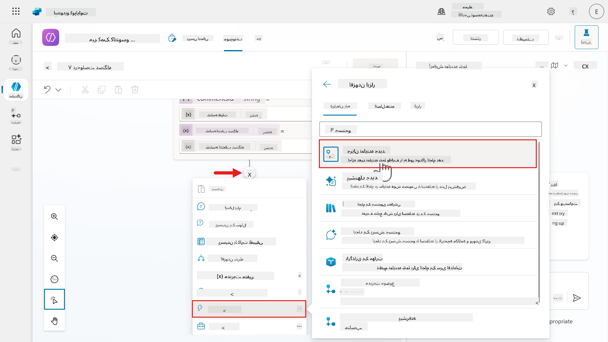

1. **طراح جریان عامل** با یک محرک و یک اقدام بارگذاری خواهد شد.

    - **محرک** - زمانی که یک عامل جریان را فراخوانی می‌کند
        - این جریان را از یک عامل Copilot Studio فعال می‌کند.

    - **اقدام** - پاسخ به عامل
        - این پاسخ را ارسال می‌کند که می‌تواند شامل مقادیر خروجی به عامل Copilot Studio باشد.

    محرک را انتخاب کنید.

    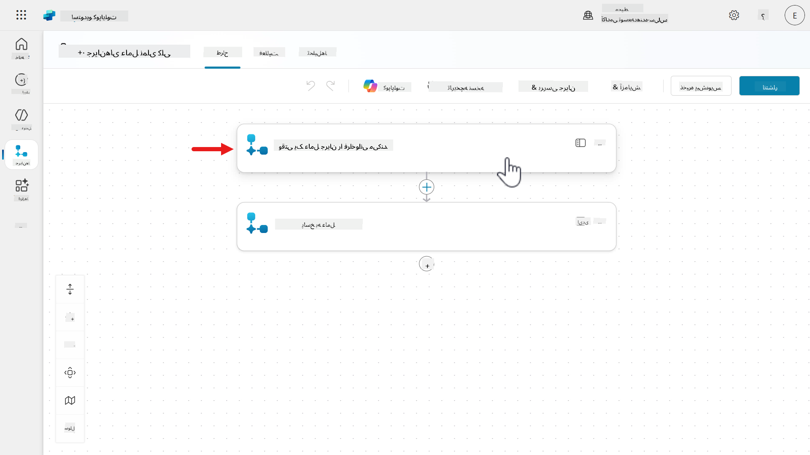

1. اکنون، چندین ورودی برای جریان عامل اضافه خواهیم کرد.

    - `DeviceSharePointId` - این مقدار، شناسه آیتم SharePoint را ذخیره خواهد کرد. این مقدار شناسه خروجی از گره Ask with adaptive card است که کاربر دستگاه را انتخاب کرده است.

    - `User` - این نام کاربر خواهد بود که از یک متغیر سیستمی عامل گرفته می‌شود.

    - `AdditionalComments` - این نظر وارد شده توسط کاربر خواهد بود که خروجی از گره Ask with adaptive card است.

    ابتدا `DeviceSharePointId` را به عنوان ورودی برای محرک خود اضافه خواهیم کرد. **+ Add an input** را انتخاب کنید.

    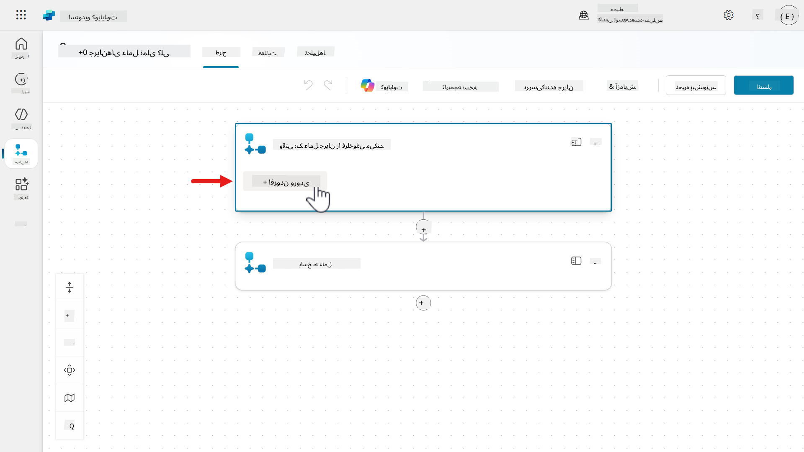

1. برای نوع ورودی کاربر، **Text** را انتخاب کنید.

    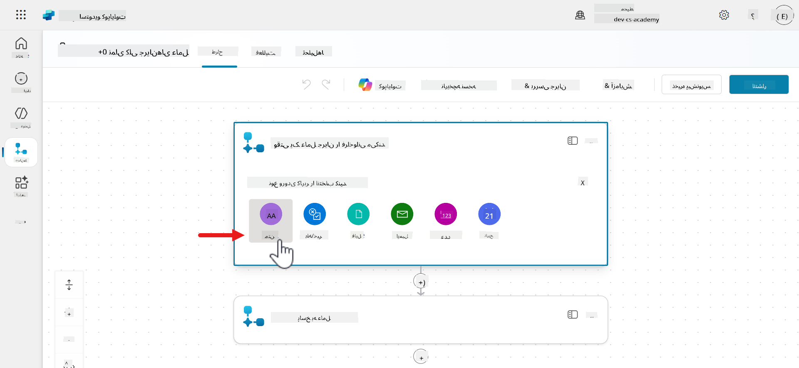

1. برای نام ورودی، موارد زیر را وارد کنید.

    ```text
    DeviceSharePointId
    ```

    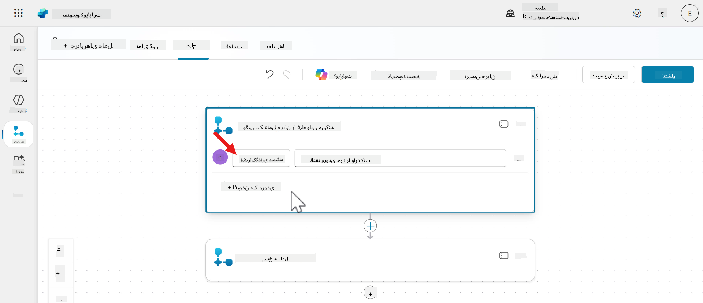

1. اکنون ورودی دوم، `User` را اضافه خواهیم کرد. همان مراحل را تکرار کنید، **+ Add an input** را انتخاب کنید و **Text** را انتخاب کنید.

    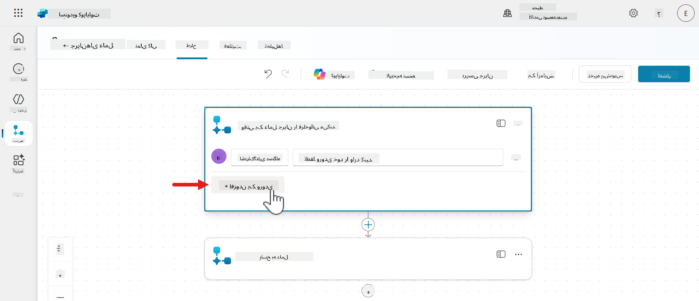

1. برای نام ورودی، موارد زیر را وارد کنید.

    ```text
    User
    ```

    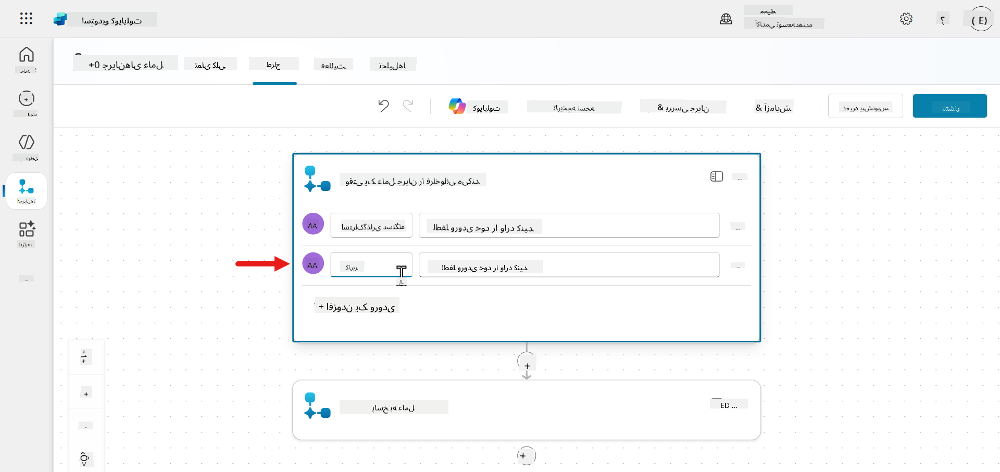

1. اکنون ورودی سوم، `AdditionalComments` را اضافه خواهیم کرد. همان مراحل را تکرار کنید، **+ Add an input** را انتخاب کنید و **Text** را انتخاب کنید.

    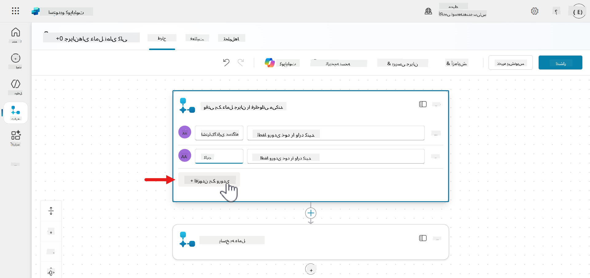

1. برای نام ورودی، موارد زیر را وارد کنید.

    ```text
    AdditionalComments
    ```

    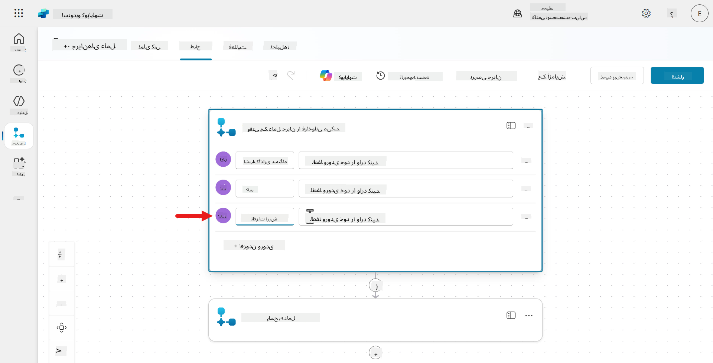

1. برای ورودی `AdditionalComments`، آن را به صورت اختیاری به‌روزرسانی خواهیم کرد. **آیکون سه نقطه (...)** را انتخاب کنید و **Make the field optional** را انتخاب کنید.

    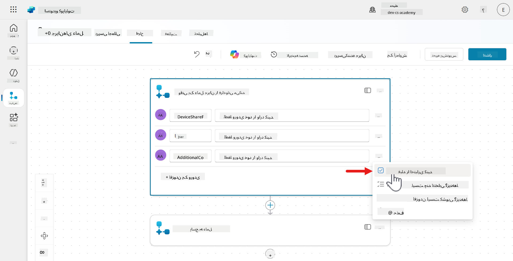

1. کار عالی! محرک اکنون پیکربندی شده است، ادامه می‌دهیم. **آیکون بعلاوه +** زیر محرک را انتخاب کنید تا یک اقدام جدید اضافه کنید.

    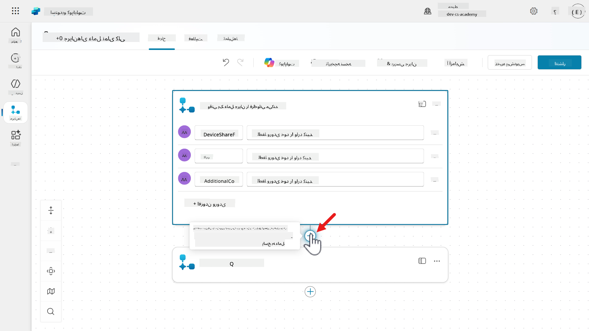

1. **پنل اقدامات** ظاهر خواهد شد که در آن می‌توانید اقدامات از بیش از ۱۴۰۰ اتصال داخلی به خدمات Microsoft و شخص ثالث را مشاهده کنید. در **فیلد جستجو** موارد زیر را وارد کنید،

    ```text
    Get item
    ```

    لیستی از اقدامات در نتایج جستجو نمایش داده خواهد شد. اقدام **Get item** از اتصال **SharePoint** را انتخاب کنید.

    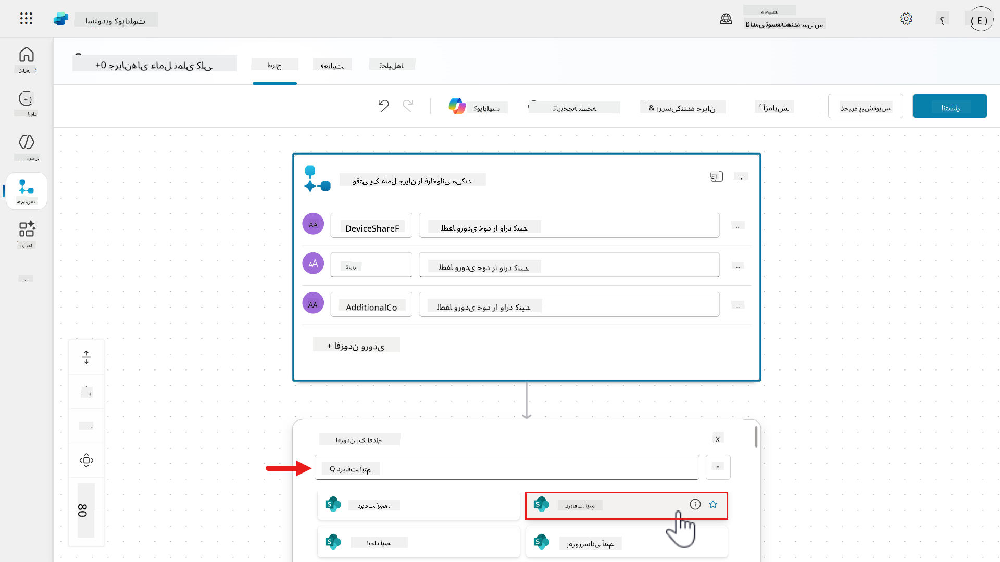

1. اکنون می‌توانیم اقدام **Get item** را پیکربندی کنیم.

    آیکون **سه نقطه (...)** در اقدام **Get item** را انتخاب کنید.

    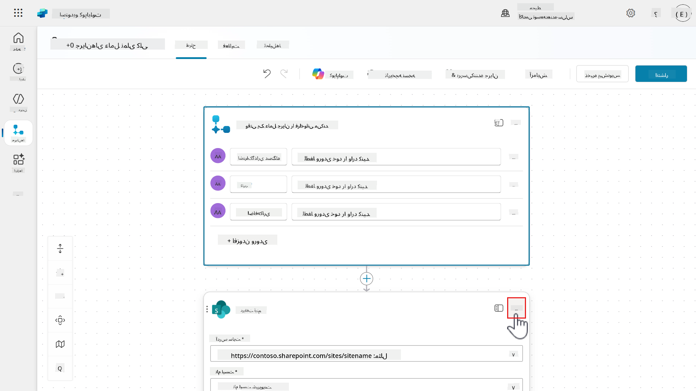

1. **Rename** را انتخاب کنید.

    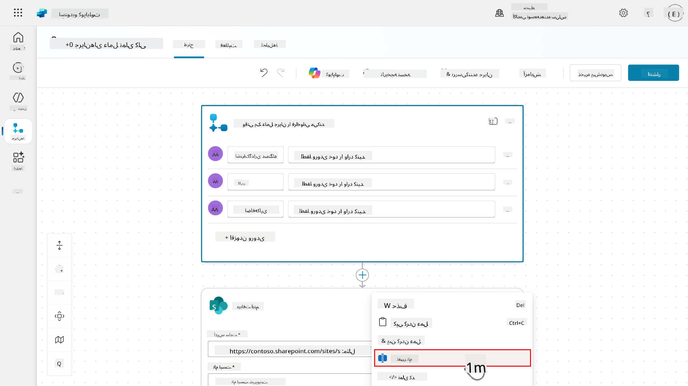

1. اقدام را به موارد زیر تغییر نام دهید،

    ```text
    Get Device
    ```

    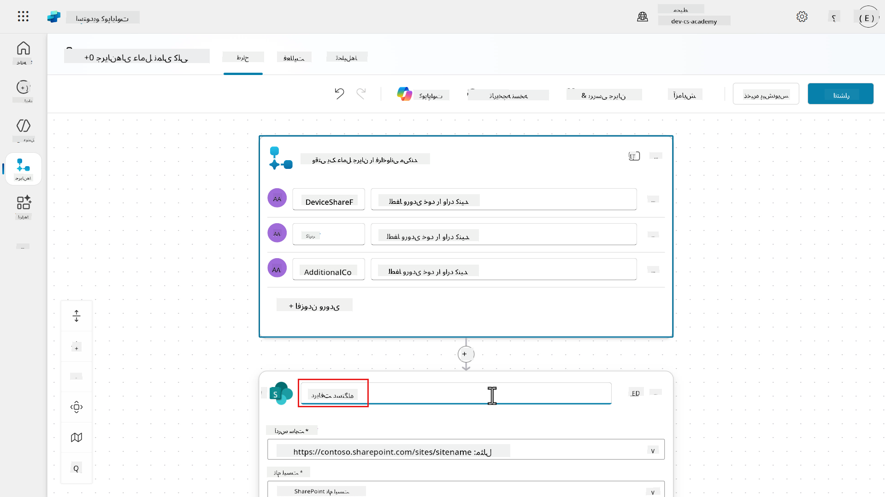

1. در فیلد **Site Address**، آدرس سایت SharePoint Contoso IT که در [درس ۰۰ - تنظیم دوره - مرحله ۳: ایجاد سایت جدید SharePoint](../00-course-setup/README.md#step-4-create-new-sharepoint-site) ایجاد شده است را انتخاب کنید.

    در فیلد **List Name**، لیست SharePoint **Devices** را انتخاب کنید.

    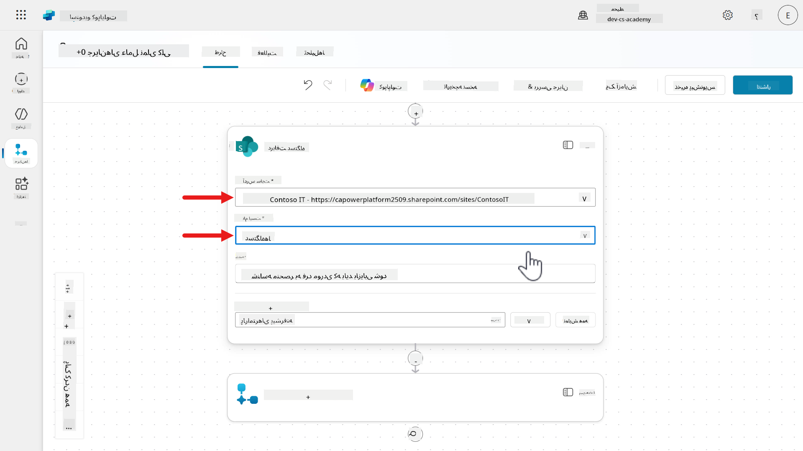

1. در فیلد **Id**، آیکون **صاعقه** یا **fx** در سمت راست را انتخاب کنید.

    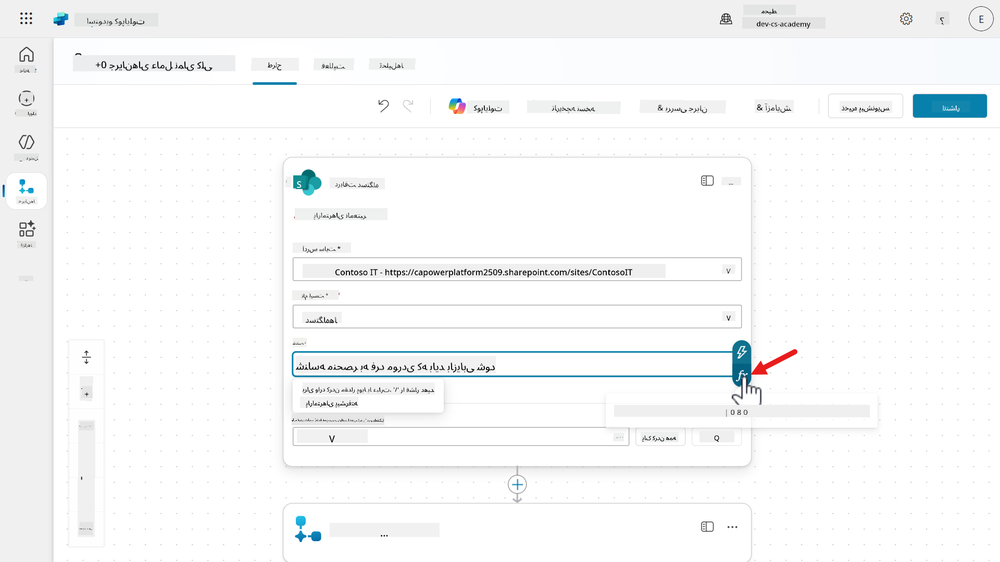

1. در تب **Dynamic content** پنل بازشو، موارد زیر را وارد کنید،

    ```text
    sharepoint
    ```

    نتایج جستجو پارامترهای ورودی که با مقدار جستجو شده مطابقت دارند را نشان خواهد داد. پارامتر **DeviceSharePointId** از محرک را انتخاب کنید.

    سپس **Add** را انتخاب کنید تا ورودی محتوای پویا به پارامتر **Id** اقدام اضافه شود.

    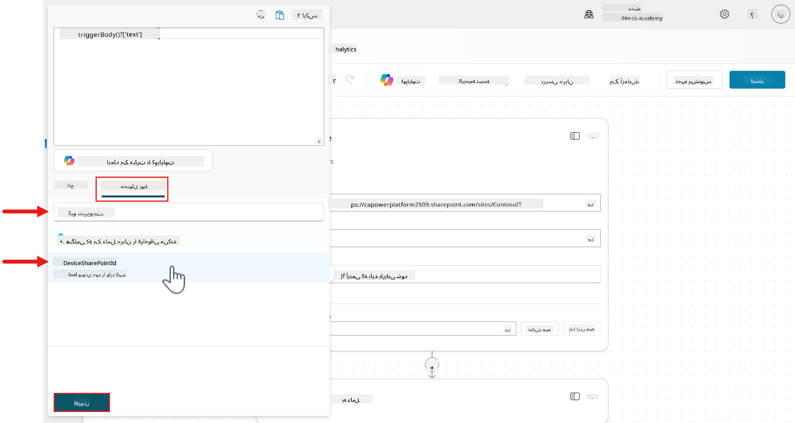

1. ورودی محتوای پویا از محرک اکنون در پارامتر **Id** اقدام ارجاع داده شده است. در مرحله بعد، یکی از پارامترهای پیشرفته را به‌روزرسانی خواهیم کرد. **Show all** را انتخاب کنید تا پارامترهای پیشرفته را مشاهده کنید.

    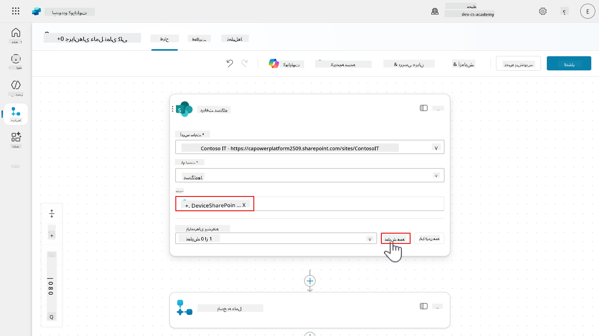

1. پارامتر **Limit Columns by View** نمایش داده خواهد شد و به طور پیش‌فرض روی **Use all columns (Do not limit)** تنظیم شده است. این مقدار را به یک نمای برای محدود کردن ستون‌های بازگشتی در پاسخ اقدام به‌روزرسانی خواهیم کرد. پارامتر **Limit Columns by View** را انتخاب کنید تا لیست نماها را مشاهده کنید.

    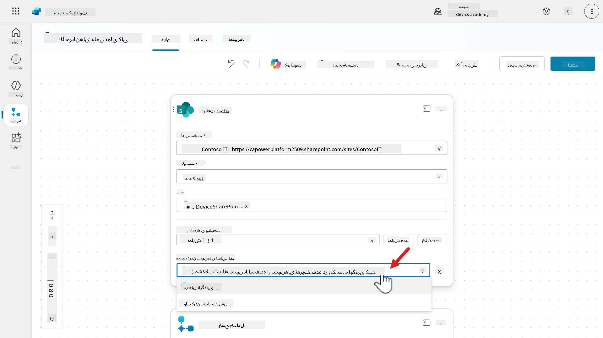

1. نمای **All Items** را انتخاب کنید.

    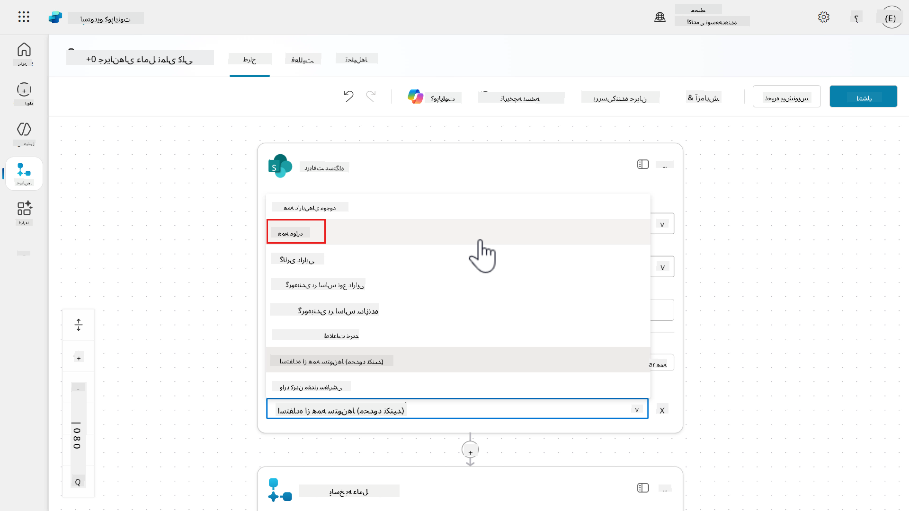

1. آیکون بعلاوه **+** زیر اقدام _Get Device_ را انتخاب کنید تا یک اقدام جدید اضافه کنید.

    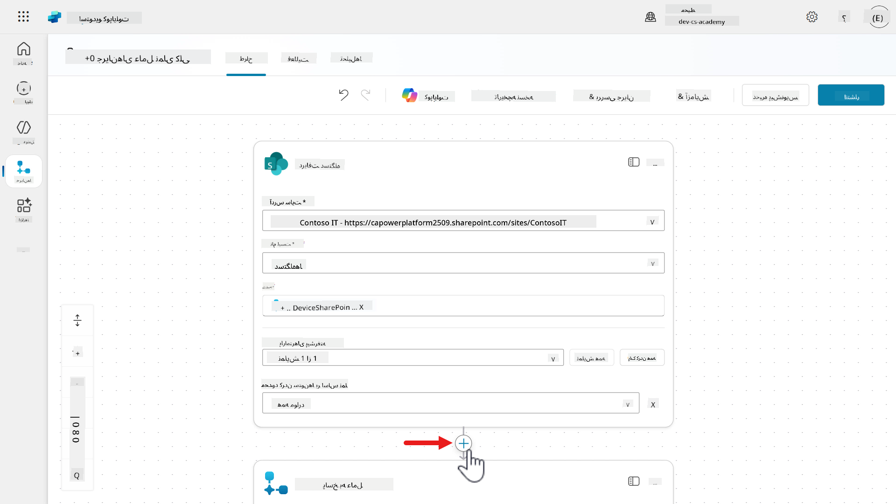

1. در فیلد جستجو موارد زیر را وارد کنید،

    ```text
    send an email
    ```

    لیستی از اقدامات در نتایج جستجو نمایش داده خواهد شد. اقدام **Send an email (V2)** از اتصال **Office 365 Outlook** را انتخاب کنید.

    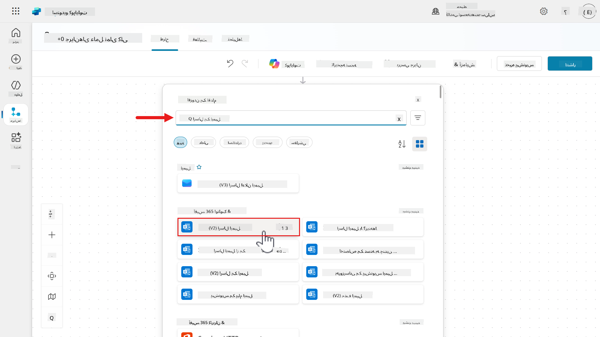

1. در مرحله بعد باید یک اتصال برای اقدام اتصال ایجاد کنیم. **Sign in** را انتخاب کنید.

    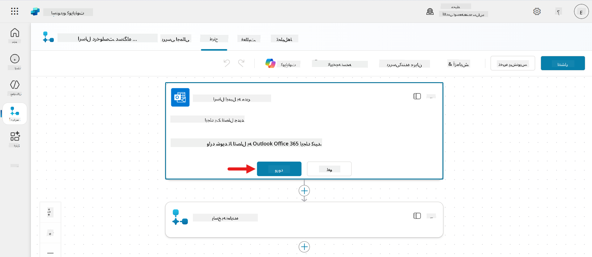

1. حساب کاربری وارد شده خود را انتخاب کنید.

    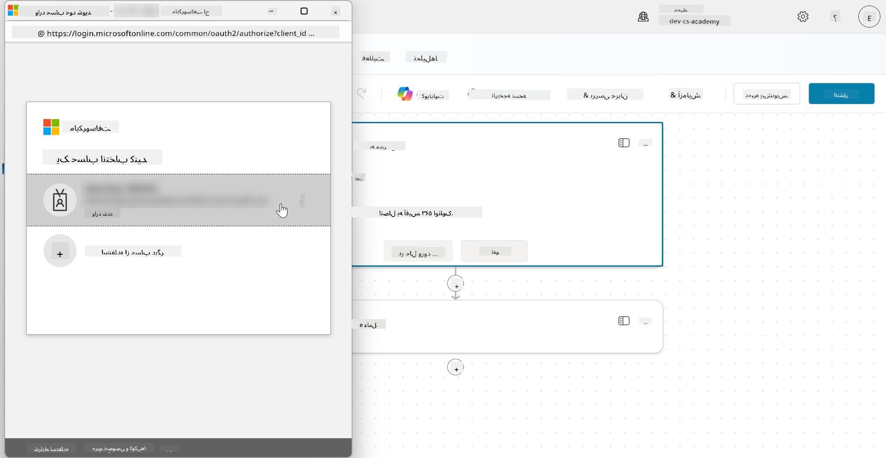

1. **Allow access** را انتخاب کنید. اکنون یک اتصال ایجاد شده است.

    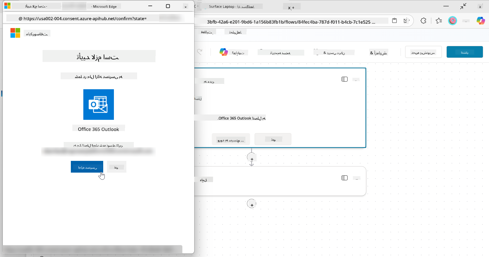

1. اقدام را به موارد زیر تغییر نام دهید،

    ```text
    Send an email to manager
    ```

    اکنون پارامترهای ورودی اقدام خود را تعریف می‌کنیم.

    برای پارامتر ورودی **To**، خودتان را انتخاب کنید. معمولاً این مدیر شما خواهد بود یا از اقدام دیگری استفاده می‌کنیم که مدیر شما را بر اساس پروفایل Entra ID شما می‌آورد، اما برای هدف این درس، خودتان را انتخاب کنید.

    برای پارامتر ورودی **Subject**، موارد زیر را وارد کنید،

    ```text
    Request type: new device
    ```

    برای پارامتر ورودی **Body**، موارد زیر را وارد کنید،

    ```text
    Hi,

    New device requested from

    Manufacturer:
    Model:
    Link to item in SharePoint
    Additional comments from:

    This is an automated email from Contoso Helpdesk Copilot
    ```

    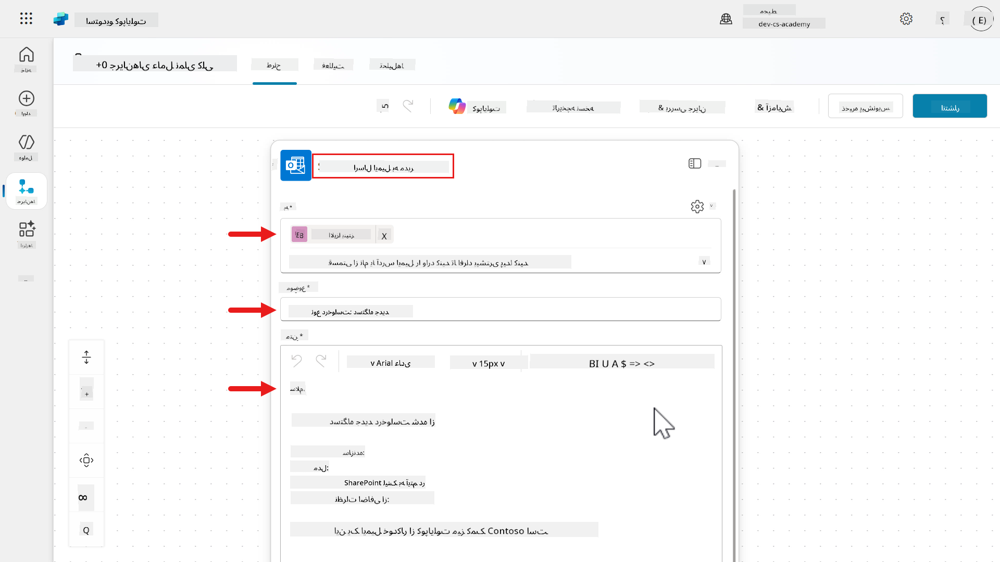

1. در مرحله بعد، پارامتر ورودی **Body** را با ارجاعات به ورودی محتوای پویا از **محرک** یا اقدام **Get item** به‌روزرسانی خواهیم کرد. پس از خط دوم یک فاصله وارد کنید زیرا نام کاربر از ورودی محرک، **User** را وارد خواهیم کرد.

    آیکون **صاعقه** یا **fx** در سمت راست را انتخاب کنید.

    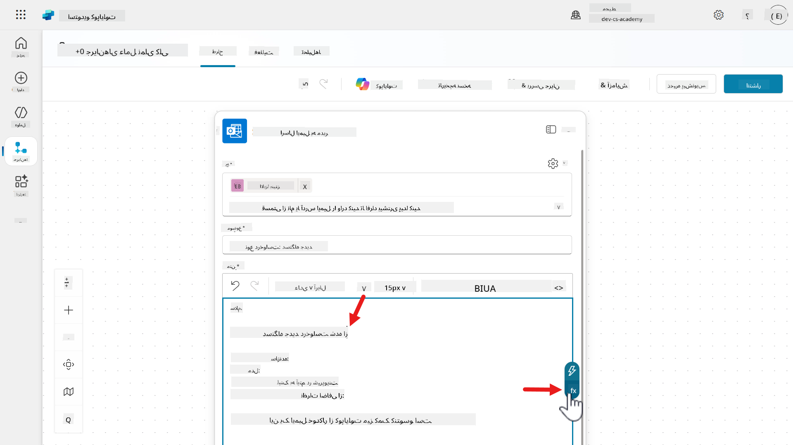

1. در تب **Dynamic content** پنل بازشو، ورودی **User** از محرک را انتخاب کنید.

    **Add** را انتخاب کنید تا ورودی محتوای پویا **User** به پارامتر **Body** اقدام اضافه شود.

    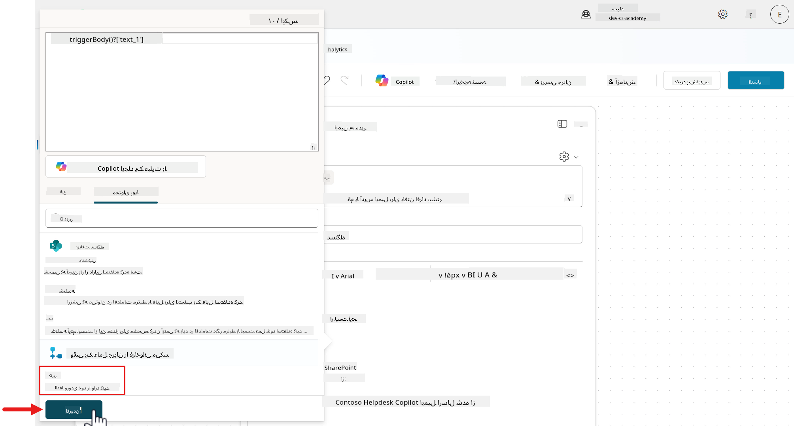
1. ورودی محتوای پویا از محرک اکنون در پارامتر **Body** اکشن ارجاع داده شده است. همین کار را برای خطوط باقی‌مانده در متن پیام ایمیل تکرار خواهیم کرد.

    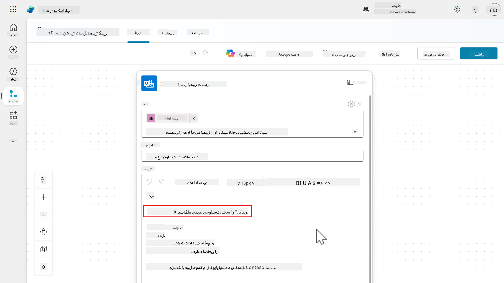

1. در فضای کنار `Manufacturer:` کلیک کنید. آیکون **صاعقه** یا **fx** در سمت راست را انتخاب کنید.

    در تب **Dynamic content** پنل پروازی، عبارت زیر را در فیلد جستجو وارد کنید،

    ```text
    manufacturer
    ```

    ورودی **Manufacturer value** از محرک را انتخاب کرده و **Add** را انتخاب کنید.

    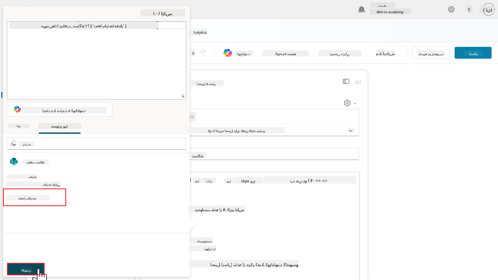

1. در فضای کنار `Model:` کلیک کنید. آیکون **صاعقه** یا **fx** در سمت راست را انتخاب کنید.

    در تب **Dynamic content** پنل پروازی، عبارت زیر را در فیلد جستجو وارد کنید،

    ```text
    model
    ```

    ورودی **Model** از اکشن **Get item** را انتخاب کرده و **Add** را انتخاب کنید.

    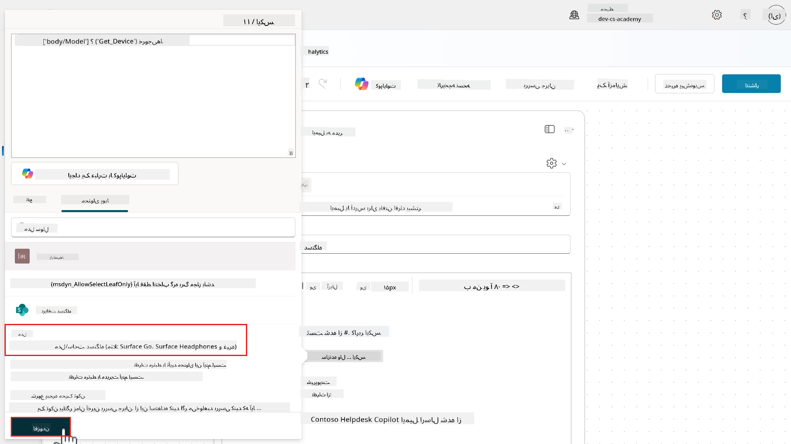

1. برای متن `Link to item in SharePoint`، این متن را به یک لینک در متن پیام ایمیل تبدیل خواهیم کرد. در ابتدای خط کلیک کنید و آیکون **صاعقه** یا **fx** در سمت راست را انتخاب کنید.

    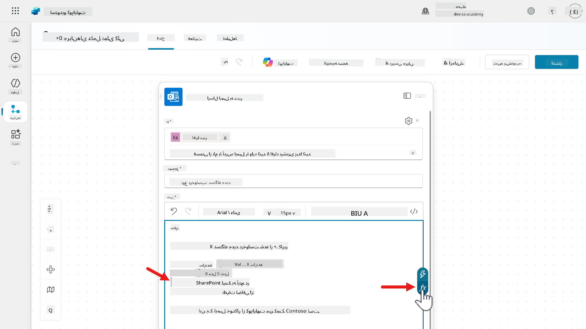

1. بعد از تگ HTML anchor کلیک کنید و آیکون **صاعقه** یا **fx** در سمت راست را انتخاب کنید.

    در تب **Dynamic content** پنل پروازی، عبارت زیر را در فیلد جستجو وارد کنید،

    ```text
    link to item
    ```

    ورودی **Link to item** از اکشن **Get item** را انتخاب کرده و **Add** را انتخاب کنید.

    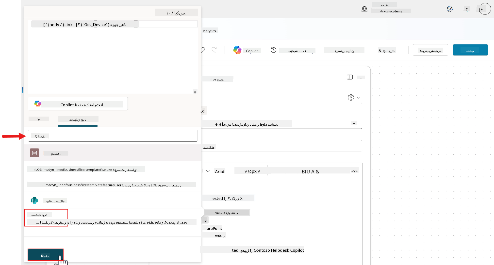

1. باید به ویرایشگر HTML تغییر حالت دهیم. آیکون **&lt;/&gt;** را انتخاب کنید.

    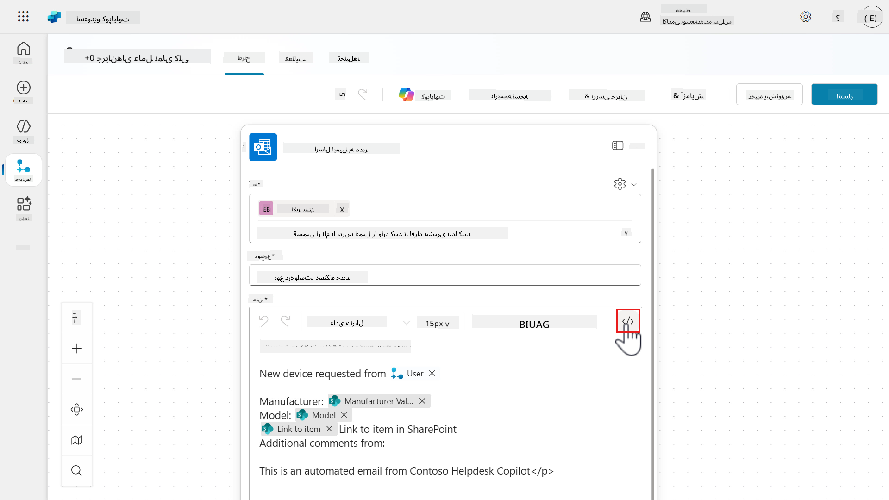

1. ویرایشگر HTML اکنون فعال شده است. قبل از متن `Link to item in SharePoint` کلیک کنید، یک تگ HTML anchor اضافه کنید تا یک لینک ایجاد شود. متن زیر را کپی و جای‌گذاری کنید.

    ```text
    <a href="
    ```

    

1. ورودی محتوای پویا **Link to item** اکنون در پارامتر **Body** ارجاع داده شده است. بعد از ورودی **Link to item** کلیک کنید، متن زیر را کپی و جای‌گذاری کنید.

    ```text
    ">
    ```

    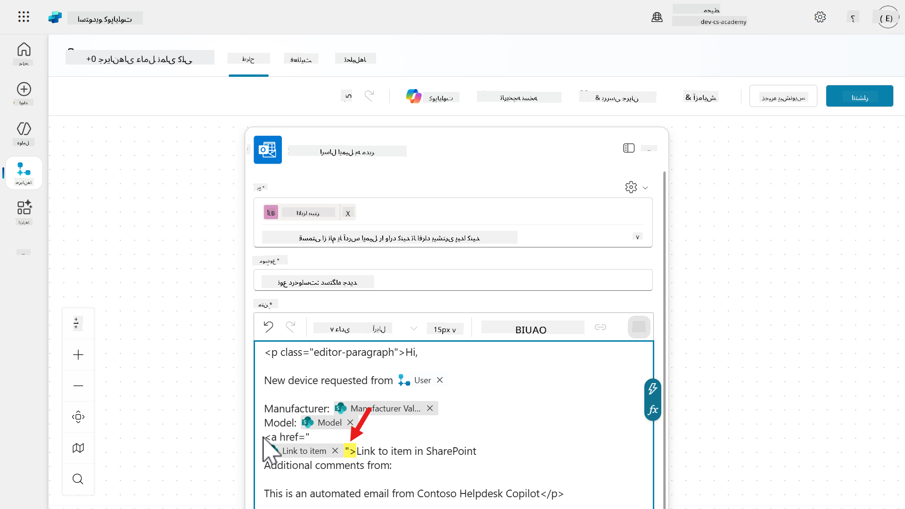

1. بعد از متن `Link to item in SharePoint` کلیک کنید، تگ HTML anchor را ببندید. متن زیر را کپی و جای‌گذاری کنید.

    ```text
    </a>
    ```

    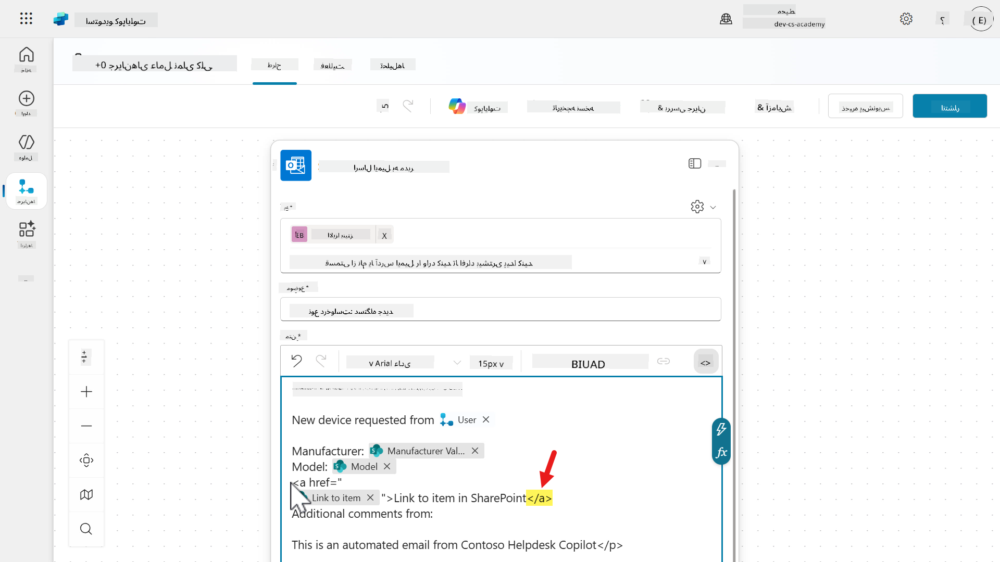

1. آیکون **&lt;/&gt;** را انتخاب کنید تا نمای کد تغییر کند.

    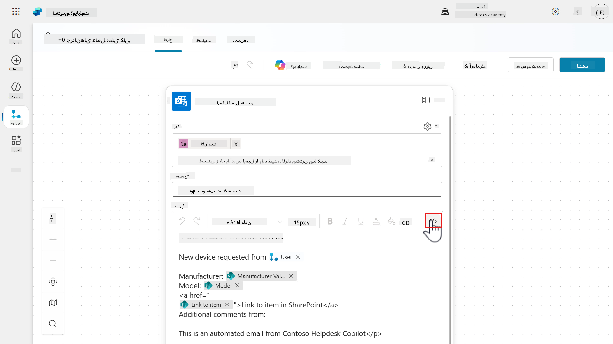

1. سپس دوباره آیکون **&lt;/&gt;** را انتخاب کنید تا نمای کد دوباره تغییر کند.

    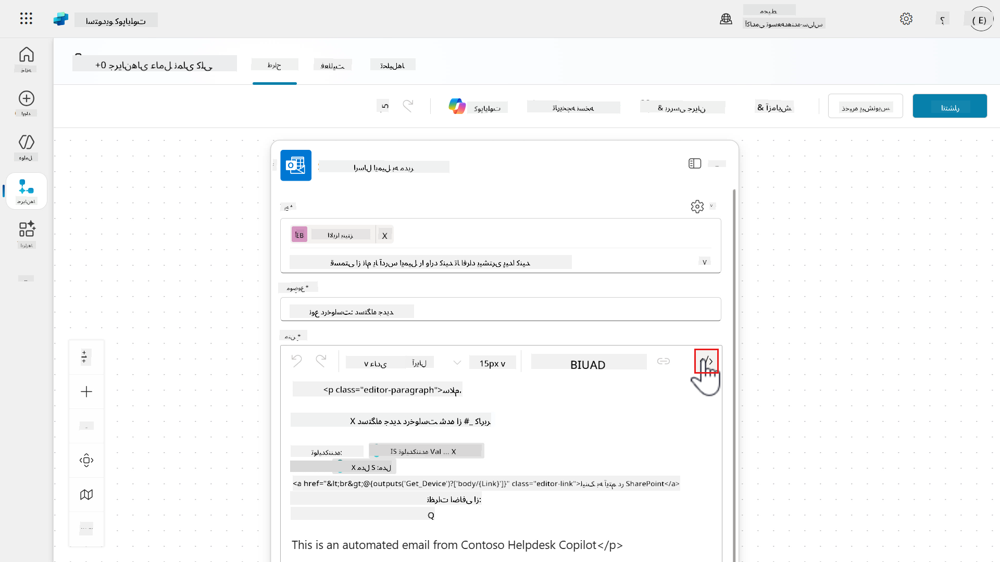

1. توجه کنید که چندین کاراکتر اضافی `&lt;br&gt;` وجود دارد. این کاراکترها را حذف کنید.

    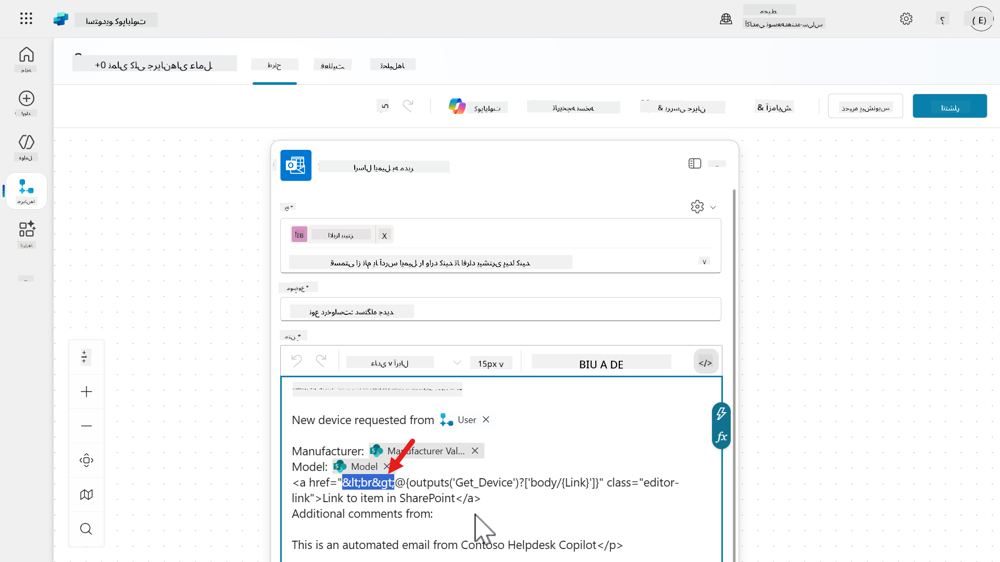

1. اکنون اضافه کردن لینک به متن پیام ایمیل به پایان رسیده است 😎 آیکون **&lt;/&gt;** را انتخاب کنید تا نمای کد تغییر کند.

    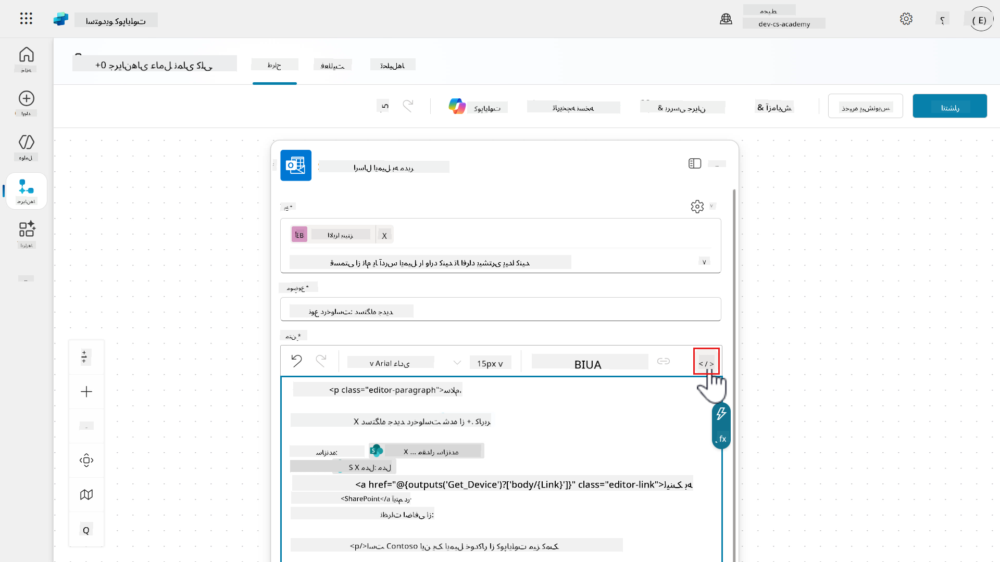

1. بعد از متن `Additional comments from` قبل از کاراکتر دو نقطه کلیک کنید و آیکون **صاعقه** یا **fx** در سمت راست را انتخاب کنید.

    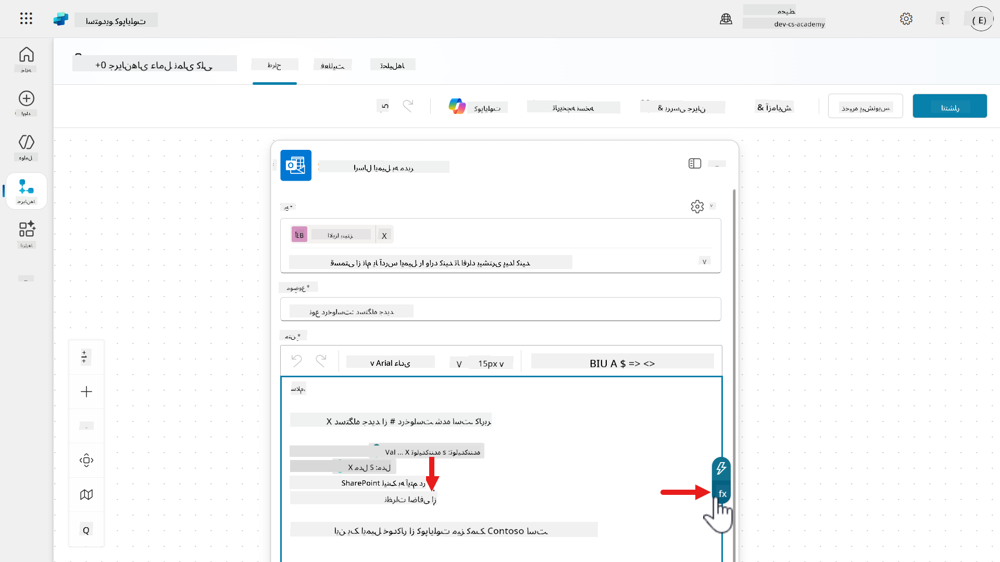

1. در تب **Dynamic content** پنل پروازی، عبارت زیر را در فیلد جستجو وارد کنید،

    ```text
    user
    ```

    پارامتر **User** از محرک را انتخاب کرده و **Add** را انتخاب کنید.

    

1. اکنون قصد داریم یک عبارت وارد کنیم که مقدار Additional Comments را نمایش دهد اگر توسط کاربر در گره **Ask an adaptive card** ارائه شده باشد، در غیر این صورت "None" را نمایش دهد اگر کاربر هیچ نظری ارائه ندهد.

    بعد از دو نقطه کلیک کنید و آیکون **صاعقه** یا **fx** در سمت راست را انتخاب کنید.

    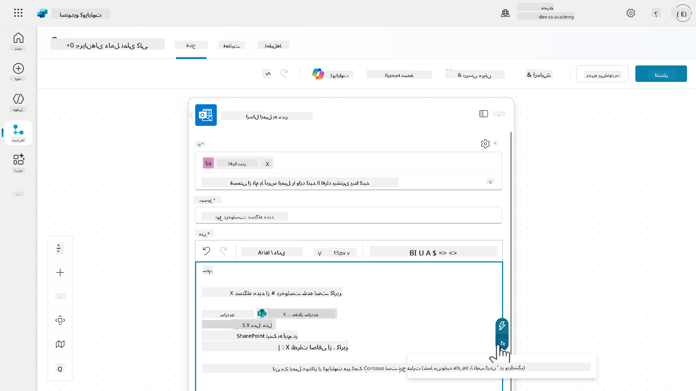

1. در تب **Function** پنل پروازی و در فیلد عبارت بالا، عبارت زیر را وارد کنید،

    ```text
    if(empty())
    ```

    این عبارت از تابع `if` برای یک شرط if-else استفاده می‌کند.

    تابع بعدی که استفاده می‌شود `empty` است که بررسی می‌کند آیا مقداری در یک پارامتر رشته‌ای وجود دارد یا خیر. پارامتر رشته‌ای که باید ارجاع داده شود مقدار پارامتر ورودی `AdditionalComments` از محرک است.

    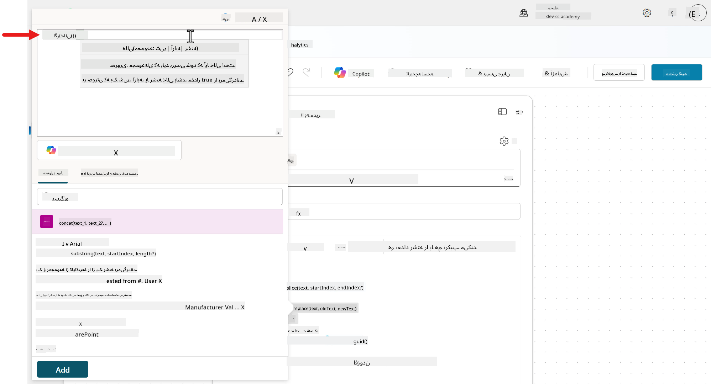

1. سپس، داخل پرانتزهای بعد از تابع `empty` کلیک کنید. قصد داریم پارامتر ورودی `AdditionalComments` از محرک را وارد کنیم.

    تب **Dynamic content** را انتخاب کنید. عبارت زیر را در فیلد جستجو وارد کنید،

    ```text
    Additional
    ```

    پنل را پایین بکشید و ورودی **AdditionalComments** از محرک را انتخاب کنید. پارامتر اکنون به عنوان یک پارامتر رشته‌ای در عبارت اضافه خواهد شد.

    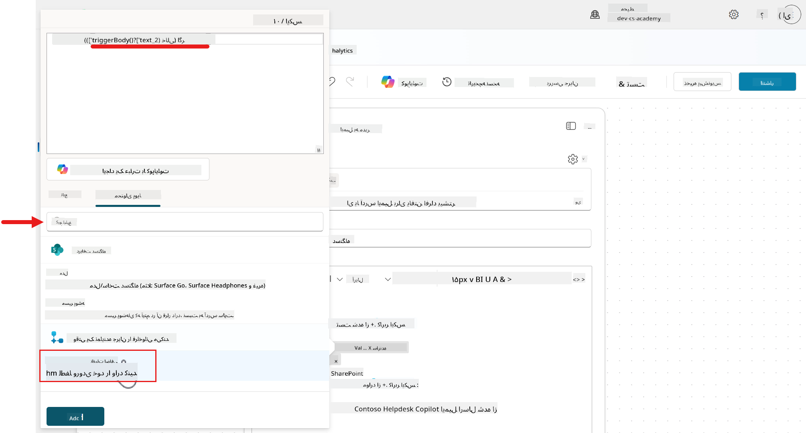

1. اکنون منطق **_true_** را تعریف خواهیم کرد، جایی که اگر پارامتر رشته‌ای `AdditionalComments` خالی باشد، می‌خواهیم یک رشته (متن) `None` نمایش داده شود.

    بعد از پرانتز که پارامتر رشته‌ای را محصور می‌کند، متن زیر را وارد کنید،

    ```text
    , 'None',
    ```

    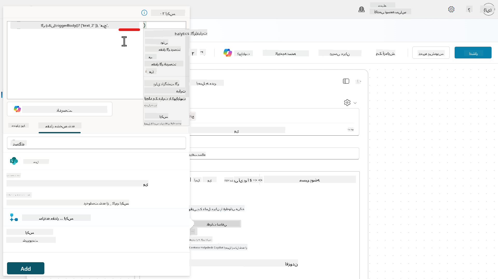

1. در نهایت منطق **_false_** را تعریف خواهیم کرد، جایی که اگر پارامتر رشته‌ای `AdditionalComments` خالی نباشد، می‌خواهیم مقدار پارامتر ورودی **AdditionalComments** از محرک را نمایش دهیم.

    > یادآوری این مقدار از فیلد Additional Comments کارت تطبیقی در گره **Ask with adaptive card** در موضوع **Request device** خواهد بود.

    بعد از کاما بعد از منطق **_true_**، تب **Dynamic content** را انتخاب کنید. عبارت زیر را در فیلد جستجو وارد کنید،

    ```text
    Additional
    ```

    پنل را پایین بکشید و ورودی **AdditionalComments** از محرک را انتخاب کنید. پارامتر اکنون به عنوان یک پارامتر رشته‌ای در عبارت اضافه خواهد شد.

    اکنون آن را به پارامتر **Body** اضافه کنید با انتخاب **Add**.

    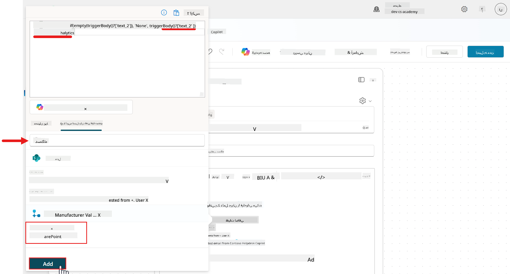

1. عالی، عبارت ما کامل شد! عبارت اکنون به پارامتر **Body** اضافه شده است. در نهایت، خط آخر را به صورت ایتالیک قالب‌بندی کنید.

    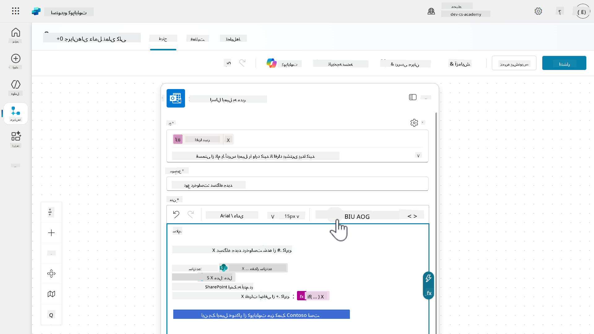

1. اکنون قصد داریم اکشن **Respond to the agent** را به‌روزرسانی کنیم تا مقدار پارامتر **Model value** از اکشن **Get item** را به عامل بازگرداند.

    کلید چپ ماوس را نگه دارید و به سمت بالا در داخل طراح حرکت کنید تا اکشن **Respond to the agent** را مشاهده کنید.

    اکشن **Respond to the agent** را انتخاب کنید و خروجی **Text** را به عنوان نوع انتخاب کنید.

    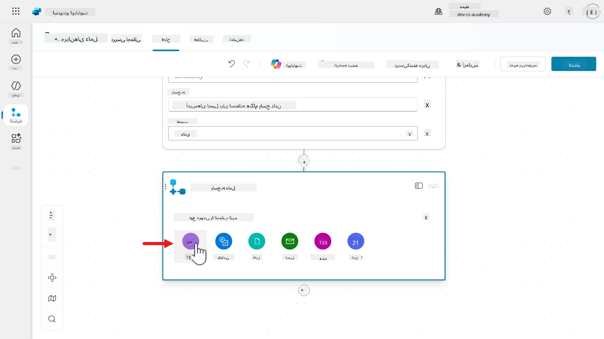

1. متن زیر را به عنوان نام خروجی وارد کنید.

    ```text
    ModelValue
    ```

    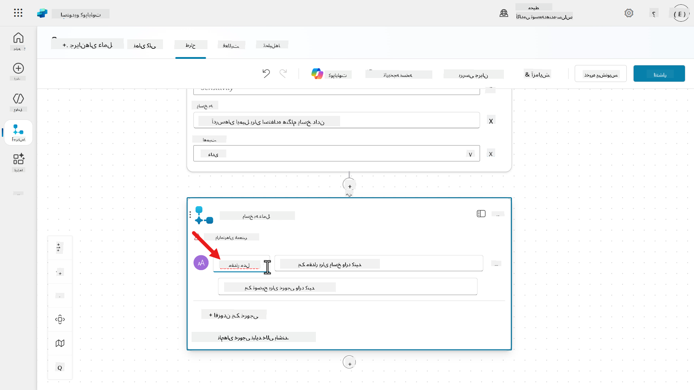

1. فیلد مقدار را انتخاب کنید و آیکون **صاعقه** یا **fx** در سمت راست را انتخاب کنید.

    

1. در تب **Dynamic content** پنل پروازی، عبارت زیر را در فیلد جستجو وارد کنید،

    ```text
    model
    ```

    پارامتر **Model** از اکشن **Get item** را انتخاب کرده و **Add** را انتخاب کنید.

    

1. پارامتر **Model** اکنون مقدار خروجی متن است. **Save draft** را انتخاب کنید تا جریان عامل ما ذخیره شود.

    اکنون جریان عامل ما کامل شده است 👏🏻

    

1. بیایید یک به‌روزرسانی دیگر به جریان عامل خود انجام دهیم قبل از انتشار. تب **Overview** را انتخاب کنید و **Edit** را انتخاب کنید.

    

1. برای **Flow name**، متن زیر را کپی و جای‌گذاری کنید.

    ```text
    Send device request email
    ```

    برای **Description**، آیکون **refresh** را انتخاب کنید تا از هوش مصنوعی برای تولید خودکار توضیحات بر اساس محرک و اکشن‌های جریان عامل استفاده کنید.

    **Save** را انتخاب کنید تا نام و توضیحات به‌روزرسانی شده جریان عامل ذخیره شود.

    

1. تب **Designer** را انتخاب کنید و **Publish** را انتخاب کنید تا جریان عامل منتشر شود و بتوان آن را به عنوان یک گره در موضوع **Request device** اضافه کرد.

    

1. پیام تأیید به زودی ظاهر می‌شود تا تأیید کند که جریان عامل منتشر شده است.

    

### 9.2 اضافه کردن جریان عامل به موضوع

اکنون جریان عامل را به موضوع **Request device** اضافه می‌کنیم.

1. **Agents** را در منوی سمت چپ انتخاب کنید و **Contoso Helpdesk Agent** را انتخاب کنید.

    

1. تب **Topics** را انتخاب کنید.

    

1. موضوع **Request device** را انتخاب کنید.

    

1. به گره **Ask with adaptive card** پایین بروید و یک گره جدید اضافه کنید.

    **Add a tool** را انتخاب کنید و در تب **Basic tools** پنل پروازی، جریان عامل **Send device request email** که اخیراً ایجاد و منتشر شده است را انتخاب کنید.

    

1. برای ورودی‌های محرک جریان عامل، باید خروجی‌های متغیر از گره **Ask with adaptive card** را انتخاب کنیم.

    آیکون **ellipsis (...)** برای ورودی **DeviceSharePointId** را انتخاب کنید.

    

1. متغیر **deviceSelectionId** را انتخاب کنید که یکی از خروجی‌های تعریف شده در گره **Ask with adaptive card** است.

    

1. سپس، آیکون **ellipsis (...)** برای ورودی **User** را انتخاب کنید.

    

1. تب **System** را در پنل پروازی متغیر انتخاب کنید و **User.DisplayName** را انتخاب کنید. این متغیر نام نمایشی کاربر داخلی که با عامل تعامل دارد را ذخیره می‌کند.

    

1. سپس، آیکون **greater than** برای **Advanced inputs** را انتخاب کنید تا ورودی **AdditionalComments** را ببینید.

    

1. آیکون **ellipsis (...)** برای ورودی AdditionalComments را انتخاب کنید.

    

1. تب **Formula** را انتخاب کنید و آیکون گسترش در پنل پروازی متغیر را انتخاب کنید زیرا از یک عبارت Power Fx استفاده خواهیم کرد.

    

1. مشابه عبارت در جریان عامل که یک بررسی شرطی با استفاده از تابع _if_ انجام می‌دهد، اما این بار
    - با استفاده از توابع Power Fx،
    - و وارد کردن یا هیچ مقداری، یا مقدار متغیر خروجی `commentsId` از گره **Ask with adaptive card**.

    توابع زیر را در فیلد Power Fx وارد کنید،

    ```text
    If(IsBlank())
    ```

این عبارت از تابع `If` برای یک دستور if-else استفاده می‌کند.

تابع بعدی که استفاده شده است `IsBlank` است که بررسی می‌کند آیا یک مقدار در یک پارامتر رشته‌ای وجود دارد یا وجود ندارد. پارامتر رشته‌ای که باید به آن ارجاع داده شود، متغیر خروجی `commentsId` از گره **Ask with adaptive card** است.


1. حالا روی **داخل پرانتزها** بعد از تابع `IsBlank` کلیک کنید. ما قصد داریم متغیر خروجی `commentsId` از گره **Ask with adaptive card** را وارد کنیم.

متن زیر را داخل پرانتز وارد کنید،

    ```text
    Topic.commentsId
    ```

و بعد از پرانتز یک کاما اضافه کنید.


1. حالا منطق را تعریف می‌کنیم:

   - وقتی **_true_** است - اگر پارامتر رشته‌ای `Topic.commentsId` خالی باشد، می‌خواهیم هیچ مقداری وارد نکنیم.
   - وقتی **_false_** است - اگر پارامتر رشته‌ای `Topic.commentsId` خالی نباشد، مقدار متغیر commentsId را وارد کنیم.

بعد از پرانتزی که پارامتر رشته‌ای را محصور کرده است، متن زیر را وارد کنید،

    ```text
    "", Topic.commentsId)
    ```

عبارت Power Fx باید به صورت زیر باشد،

    ```text
    If(IsBlank(Topic.commentsId), "", Topic.commentsId)
    ```

عالی! عبارت ما کامل شد! 🙌🏻 حالا **Insert** را انتخاب کنید تا پارامتر ورودی جریان عامل به عبارت Power Fx تنظیم شود.


1. **موضوع را ذخیره کنید.**

### 9.3 به‌روزرسانی موضوع درخواست دستگاه با چند گره برای تجربه بهتر کاربر

حالا دو گره دیگر اضافه می‌کنیم:

- **ارسال پیام** - این به عنوان یک پیام تأیید عمل می‌کند که به دستگاه انتخاب شده ارجاع می‌دهد و درخواست آن‌ها ارسال شده است.
- **مدیریت موضوع** - برای بستن مکالمه، به گره **پایان مکالمه** هدایت می‌شود.

بیایید شروع کنیم!

1. آیکون **به‌علاوه +** زیر گره جریان عامل را انتخاب کنید و گره **ارسال پیام** را انتخاب کنید.


1. متن زیر را در فیلد پیام وارد کنید،

    ```text
    Thanks
    ```

سپس **Insert variable** را انتخاب کنید زیرا می‌خواهیم به نام کاربر ارجاع دهیم.


1. تب **System** را انتخاب کنید و در فیلد جستجو `User` را جستجو کنید. متغیر **User.DisplayName** را انتخاب کنید.


1. متن زیر را در فیلد پیام وارد کنید،

    ```text
    . Your selected device,
    ```

سپس **Insert variable** را انتخاب کنید و این بار در تب **Custom**، متغیر **ModelValue** را انتخاب کنید.

سپس متن زیر را وارد کنید تا پیام کامل شود.

    ```text
    , has been submitted and will be reviewed by your manager.
    ```

پیام باید به صورت زیر باشد.


1. در نهایت، آیکون **به‌علاوه +** زیر گره **ارسال پیام** را انتخاب کنید و **مدیریت موضوع** را انتخاب کنید، سپس **رفتن به موضوع دیگر** و **پایان مکالمه** را انتخاب کنید.


1. **موضوع را ذخیره کنید.**


### 9.4 آزمایش عامل با چند سناریو

عالی!!! 😁 حالا می‌توانیم عامل خود را آزمایش کنیم.

#### 9.4.1 درخواست دستگاه و وارد کردن نظر در کارت تطبیقی

1. **تازه‌سازی** پنل آزمایش، آیکون **activity map** را انتخاب کنید و متن زیر را به عنوان پیام به عامل وارد کنید.

    ```text
    I need a laptop
    ```


1. عامل **دستگاه‌های موجود** را فعال می‌کند و با لیست دستگاه‌های موجود پاسخ می‌دهد. متن زیر را به عنوان پاسخ به سوال اینکه آیا می‌خواهید دستگاهی درخواست کنید وارد کنید.

    ```text
    Yes
    ```


1. توجه کنید که عامل **درخواست دستگاه** را طبق دستورالعمل‌های عامل فعال کرده و کارت تطبیقی اکنون در پیام عامل نمایش داده می‌شود.

دستگاه **Surface Laptop 15** را انتخاب کنید و متن زیر را به عنوان نظر وارد کنید.

    ```text
    I need 16GB of RAM please
    ```


1. به پایین اسکرول کنید تا دکمه **ارسال درخواست** را ببینید و آن را انتخاب کنید تا کارت تطبیقی به عامل ارسال شود.


1. **اجازه دادن** را انتخاب کنید تا عامل بتواند از اعتبارنامه‌های شما برای احراز هویت اتصال دو عملگر استفاده کند.


1. سپس عامل پیام تأیید را نمایش می‌دهد که شامل مدل انتخاب شده است، و سپس به موضوع **پایان مکالمه** هدایت می‌شود. عالی!


1. **بله** را انتخاب کنید تا بقیه موضوع **پایان مکالمه** را بررسی کنید.


1. سپس تجربه را با انتخاب یکی از ستاره‌ها در کارت مقیاس امتیازدهی ارزیابی کنید.

سپس عامل به گره نهایی **سوال** در موضوع **پایان مکالمه** می‌رود. **خیر** را انتخاب کنید.


1. موضوع سپس کامل می‌شود و یک پیام نهایی در پنل آزمایش نمایش داده می‌شود.


1. صندوق ورودی ایمیل خود را بررسی کنید تا ایمیلی که توسط جریان عامل به مدیر ارسال شده است را مرور کنید. می‌توانید جزئیات دستگاه انتخاب شده و یادداشت وارد شده در کارت تطبیقی را مشاهده کنید.


1. روی لینک کلیک کنید و مرورگر باید آیتم SharePoint دستگاه را بارگذاری کند. فوق‌العاده!


#### 9.4.2 درخواست دستگاه و وارد نکردن نظر در کارت تطبیقی

حالا سناریویی را آزمایش می‌کنیم که در آن نظری وارد نمی‌شود.

1. همان مراحل زیر را تکرار کنید:

   - **تازه‌سازی** پنل آزمایش و انتخاب آیکون **activity map**
   - وارد کردن پیام، `I need a laptop`
   - پاسخ دادن با `Yes` به سوال درخواست دستگاه


1. این بار دستگاه **Surface Laptop 13** را انتخاب کنید و نظری وارد نکنید.


1. **ارسال** درخواست با انتخاب دکمه **ارسال درخواست**.


1. این بار ایمیل دریافت شده در صندوق ورودی شما **None** را به عنوان نظر نمایش می‌دهد.


#### 9.4.3 درخواست نکردن دستگاه

حالا سناریوی نهایی را آزمایش می‌کنیم که در آن دستگاهی درخواست نمی‌شود و موضوع **خداحافظی** طبق دستورالعمل‌های عامل فعال می‌شود.

1. همان مراحل زیر را تکرار کنید:

   - **تازه‌سازی** پنل آزمایش و انتخاب آیکون **activity map**
   - وارد کردن پیام، `I need a laptop`
   - این بار پاسخ دادن با `No` به سوال درخواست دستگاه


1. عامل موضوع **خداحافظی** را فعال کرده و سوالی که در موضوع تعریف شده است پرسیده می‌شود.


## ✅ مأموریت کامل شد

تبریک می‌گوییم! 👏🏻 شما یاد گرفتید چگونه جریان عامل خود را بسازید و آن را به موضوع موجود **درخواست دستگاه** اضافه کنید، و چگونه عامل را به موضوع دیگری هدایت کنید.

این پایان **آزمایشگاه 09 - افزودن جریان عامل برای خودکارسازی و بهبود قابلیت‌های موضوع** است، لینک زیر را انتخاب کنید تا به درس بعدی بروید. ما در آزمایشگاه درس بعدی این مورد استفاده را گسترش خواهیم داد.

⏭️ [رفتن به درس **افزودن محرک‌های رویداد - فعال کردن قابلیت‌های عامل خودمختار**](../10-add-event-triggers/README.md)

## 📚 منابع تاکتیکی

🔗 [معرفی جریان‌های عامل: تحول خودکارسازی با جریان‌های کاری مبتنی بر هوش مصنوعی](https://www.microsoft.com/microsoft-copilot/blog/copilot-studio/introducing-agent-flows-transforming-automation-with-ai-first-workflows/)

🔗 [نمای کلی جریان‌های عامل](https://learn.microsoft.com/microsoft-copilot-studio/flows-overview?WT.mc_id=power-172621-ebenitez)

🔗 [استفاده از جریان‌های عامل با عامل شما](https://learn.microsoft.com/microsoft-copilot-studio/advanced-flow?WT.mc_id=power-172621-ebenitez)

🔗 [لیست توابع در راهنمای مرجع](https://learn.microsoft.com/azure/logic-apps/workflow-definition-language-functions-reference?WT.mc_id=power-172621-ebenitez)

📺 [جریان‌های عامل در Copilot Studio](https://www.youtube.com/watch?v=VJTKyk3Pr7s)

<!-- markdownlint-disable-next-line MD033 -->


---

**سلب مسئولیت**:  
این سند با استفاده از سرویس ترجمه هوش مصنوعی [Co-op Translator](https://github.com/Azure/co-op-translator) ترجمه شده است. در حالی که ما تلاش می‌کنیم دقت را حفظ کنیم، لطفاً توجه داشته باشید که ترجمه‌های خودکار ممکن است شامل خطاها یا نادرستی‌ها باشند. سند اصلی به زبان اصلی آن باید به عنوان منبع معتبر در نظر گرفته شود. برای اطلاعات حیاتی، ترجمه حرفه‌ای انسانی توصیه می‌شود. ما مسئولیتی در قبال سوء تفاهم‌ها یا تفسیرهای نادرست ناشی از استفاده از این ترجمه نداریم.