<!--
CO_OP_TRANSLATOR_METADATA:
{
  "original_hash": "cd99a76bcb7372ac2771b6ae178b023d",
  "translation_date": "2025-10-21T18:18:49+00:00",
  "source_file": "docs/recruit/10-add-event-triggers/README.md",
  "language_code": "fa"
}
-->
# 🚨 مأموریت ۱۰: افزودن محرک‌های رویداد - فعال‌سازی قابلیت‌های عامل خودکار

## 🕵️‍♂️ نام رمز: `عملیات روتین شبح`

> **⏱️ زمان عملیات:** `~۴۵ دقیقه`

🎥 **تماشای راهنمای ویدئویی**

[](https://www.youtube.com/watch?v=ZgwHL8PQ1nY "تماشای راهنما در یوتیوب")

## 🎯 خلاصه مأموریت

وقت آن است که عامل خود را از یک دستیار مکالمه‌ای به یک عامل خودکار ارتقا دهید. مأموریت شما این است که عامل خود را قادر سازید بدون نیاز به فراخوانی، به سیگنال‌های دریافتی از سراسر دامنه دیجیتال شما با دقت و سرعت پاسخ دهد.

با استفاده از محرک‌های رویداد، شما عامل خود را آموزش می‌دهید تا سیستم‌های خارجی مانند SharePoint، Teams و Outlook را نظارت کند و به محض دریافت سیگنال، اقدامات هوشمندانه‌ای انجام دهد. این عملیات عامل شما را به یک دارایی میدانی کاملاً عملیاتی تبدیل می‌کند - بی‌صدا، سریع و همیشه در حال نظارت.

موفقیت به معنای ساخت عواملی است که ارزش را آغاز می‌کنند - نه فقط به آن پاسخ می‌دهند.

## 🔎 اهداف

📖 این درس شامل موارد زیر است:

- درک محرک‌های رویداد و چگونگی فعال‌سازی رفتار خودکار عامل
- یادگیری تفاوت بین محرک‌های رویداد و محرک‌های موضوع، شامل جریان‌های کاری محرک و payloadها
- بررسی سناریوهای رایج محرک‌های رویداد
- درک ملاحظات احراز هویت، امنیت و انتشار برای عوامل مبتنی بر رویداد
- ساخت یک عامل خودکار میز کمک IT که به رویدادهای SharePoint پاسخ می‌دهد و ایمیل‌های تأیید ارسال می‌کند

## 🤔 محرک رویداد چیست؟

یک **محرک رویداد** مکانیزمی است که به عامل شما اجازه می‌دهد بدون نیاز به ورودی مستقیم کاربر، به رویدادهای خارجی پاسخ دهد. به آن به عنوان "نظارت" عامل خود برای رویدادهای خاص و انجام خودکار اقدامات در هنگام وقوع آن رویدادها فکر کنید.

برخلاف محرک‌های موضوع که نیاز به تایپ کاربر برای فعال‌سازی مکالمه دارند، محرک‌های رویداد بر اساس اتفاقاتی که در سیستم‌های متصل شما رخ می‌دهد فعال می‌شوند. به عنوان مثال:

- وقتی یک فایل جدید در SharePoint یا OneDrive for Business ایجاد می‌شود
- وقتی یک رکورد در Dataverse ایجاد می‌شود
- وقتی یک وظیفه در Planner تکمیل می‌شود
- وقتی یک پاسخ جدید به Microsoft Form ارسال می‌شود
- وقتی یک پیام جدید در Microsoft Teams اضافه می‌شود
- بر اساس یک برنامه تکراری (مانند یادآوری‌های روزانه)  
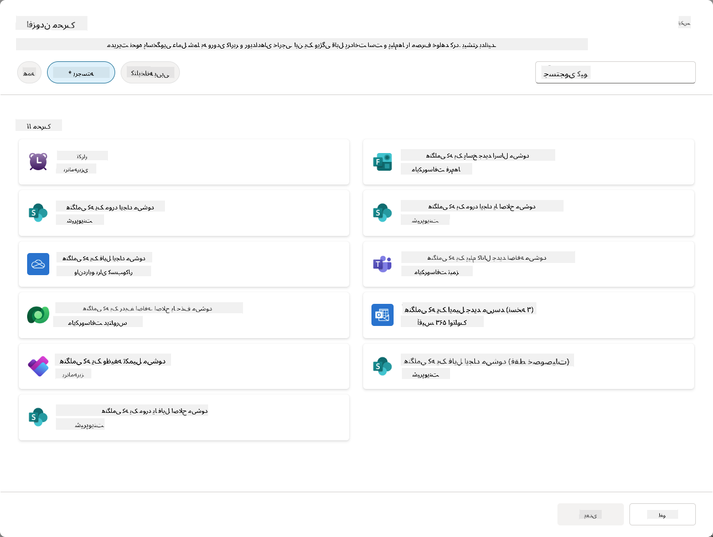

### چرا محرک‌های رویداد در عوامل خودکار اهمیت دارند؟

محرک‌های رویداد عامل شما را از یک دستیار واکنشی به یک کمک‌کننده خودکار و پیش‌فعال تبدیل می‌کنند:

1. **عملیات خودکار** - عامل شما می‌تواند ۲۴/۷ بدون دخالت انسانی کار کند و به رویدادها در لحظه وقوع پاسخ دهد.
    - *مثال:* به طور خودکار به اعضای جدید تیم خوش‌آمد بگوید وقتی به تیم اضافه می‌شوند.

1. **پاسخگویی در زمان واقعی** - به جای انتظار برای سوالات کاربران، عامل شما بلافاصله به رویدادهای مرتبط پاسخ می‌دهد.
    - *مثال:* تیم IT را مطلع کنید وقتی یک سند SharePoint تغییر می‌کند.

1. **اتوماسیون جریان کاری** - چندین اقدام را بر اساس یک رویداد محرک زنجیره کنید.
    - *مثال:* وقتی یک تیکت پشتیبانی جدید ایجاد می‌شود، یک وظیفه ایجاد کنید، مدیر را مطلع کنید و داشبورد پیگیری را به‌روزرسانی کنید.

1. **فرآیندهای منسجم** - اطمینان حاصل کنید که مراحل مهم هرگز از دست نمی‌روند با خودکارسازی پاسخ‌ها به رویدادهای کلیدی.
    - *مثال:* هر کارمند جدید به طور خودکار مواد آموزشی و درخواست‌های دسترسی دریافت می‌کند.

1. **اقدامات مبتنی بر داده** - از اطلاعات رویداد محرک برای تصمیم‌گیری هوشمندانه و انجام اقدامات مناسب استفاده کنید.
    - *مثال:* تیکت‌های فوری را بر اساس سطح اولویت در payload محرک به کارکنان ارشد ارجاع دهید.

## ⚙️ محرک‌های رویداد چگونه کار می‌کنند؟

محرک‌های رویداد از طریق یک جریان کاری سه مرحله‌ای عمل می‌کنند که به عامل شما اجازه می‌دهد به طور خودکار به رویدادهای خارجی پاسخ دهد:

### جریان کاری محرک

1. **تشخیص رویداد** - یک رویداد خاص در یک سیستم متصل (SharePoint، Teams، Outlook و غیره) رخ می‌دهد.
1. **فعال‌سازی محرک** - محرک رویداد این رویداد را تشخیص می‌دهد و یک payload را از طریق یک Power Automate Cloud Flow به عامل شما ارسال می‌کند.
1. **پاسخ عامل** - عامل شما payload را دریافت می‌کند و دستورالعمل‌هایی که تعریف کرده‌اید را اجرا می‌کند.

### محرک‌های رویداد در مقابل محرک‌های موضوع

درک تفاوت بین این دو نوع محرک بسیار مهم است:

| **محرک‌های رویداد** | **محرک‌های موضوع** |
|-------------------|-------------------|
| توسط رویدادهای سیستم خارجی فعال می‌شوند | توسط ورودی/عبارات کاربر فعال می‌شوند |
| رفتار خودکار عامل را فعال می‌کنند | پاسخ‌های مکالمه‌ای را فعال می‌کنند |
| از احراز هویت سازنده استفاده می‌کنند | گزینه‌ای برای احراز هویت کاربر |
| بدون تعامل کاربر اجرا می‌شوند | نیاز به شروع مکالمه توسط کاربر دارند |
| مثال‌ها: فایل ایجاد شده، ایمیل دریافت شده | مثال: "هوا چطور است؟" |

## 📦 درک payloadهای محرک

وقتی یک رویداد رخ می‌دهد، محرک یک **payload** به عامل شما ارسال می‌کند که شامل اطلاعاتی درباره رویداد و دستورالعمل‌هایی برای پاسخ است.

### payloadهای پیش‌فرض در مقابل سفارشی

هر نوع محرک دارای یک ساختار payload پیش‌فرض است، اما شما می‌توانید آن را سفارشی کنید:

**payload پیش‌فرض** - از فرمت استاندارد مانند `استفاده از محتوا از {Body}` استفاده می‌کند

- شامل اطلاعات اولیه رویداد
- از دستورالعمل‌های پردازش عمومی استفاده می‌کند
- مناسب برای سناریوهای ساده

**payload سفارشی** - دستورالعمل‌ها و قالب‌بندی داده‌های خاصی اضافه کنید

- شامل دستورالعمل‌های دقیق برای عامل شما
- دقیقاً مشخص کنید که چه داده‌ای استفاده شود و چگونه
- مناسب برای جریان‌های کاری پیچیده

### دستورالعمل‌های عامل در مقابل دستورالعمل‌های payload سفارشی

شما دو مکان برای هدایت رفتار عامل خود با محرک‌های رویداد دارید:

**دستورالعمل‌های عامل** (جهانی)

- راهنمایی کلی که برای همه محرک‌ها اعمال می‌شود
- مثال: "هنگام پردازش تیکت‌ها، همیشه ابتدا برای تکراری‌ها بررسی کنید"
- بهترین برای الگوهای رفتاری عمومی

**دستورالعمل‌های payload** (مخصوص محرک)

- دستورالعمل‌های خاص برای انواع محرک‌های فردی  
- مثال: "برای این به‌روزرسانی SharePoint، یک خلاصه به کانال پروژه ارسال کنید"
- بهترین برای عوامل پیچیده با محرک‌های متعدد

💡 **نکته حرفه‌ای**: از دستورالعمل‌های متناقض بین این دو سطح اجتناب کنید، زیرا این می‌تواند باعث رفتار غیرمنتظره شود.

## 🎯 سناریوهای رایج محرک‌های رویداد

در اینجا مثال‌های عملی از چگونگی بهبود عامل شما با محرک‌های رویداد آورده شده است:

### عامل میز کمک IT

- **محرک**: آیتم جدید لیست SharePoint (تیکت پشتیبانی)
- **اقدام**: به طور خودکار دسته‌بندی، اولویت‌بندی و اطلاع‌رسانی به اعضای تیم مناسب

### عامل ورود کارمندان

- **محرک**: کاربر جدید به Dataverse اضافه شده
- **اقدام**: ارسال پیام خوش‌آمدگویی، ایجاد وظایف ورود و فراهم کردن دسترسی

### عامل مدیریت پروژه

- **محرک**: وظیفه‌ای در Planner تکمیل شده
- **اقدام**: به‌روزرسانی داشبورد پروژه، اطلاع‌رسانی به ذینفعان و بررسی موانع

### عامل مدیریت اسناد

- **محرک**: فایل به یک پوشه خاص در SharePoint آپلود شده
- **اقدام**: استخراج متاداده، اعمال برچسب‌ها و اطلاع‌رسانی به صاحبان سند

### عامل دستیار جلسات

- **محرک**: رویداد تقویم ایجاد شده
- **اقدام**: ارسال یادآوری‌های پیش از جلسه و دستور جلسه، رزرو منابع

## ⚠️ ملاحظات انتشار و احراز هویت

قبل از اینکه عامل شما بتواند از محرک‌های رویداد در محیط تولید استفاده کند، باید ملاحظات احراز هویت و امنیت را درک کنید.

### احراز هویت سازنده

محرک‌های رویداد از **اعتبارنامه‌های سازنده عامل** برای تمام احراز هویت‌ها استفاده می‌کنند:

- عامل شما به سیستم‌ها با استفاده از مجوزهای شما دسترسی پیدا می‌کند
- کاربران ممکن است از طریق اعتبارنامه‌های شما به داده‌ها دسترسی پیدا کنند
- تمام اقدامات "به عنوان شما" انجام می‌شوند حتی زمانی که کاربران با عامل تعامل دارند

### بهترین شیوه‌های حفاظت از داده‌ها

برای حفظ امنیت هنگام انتشار عوامل با محرک‌های رویداد:

1. **ارزیابی دسترسی به داده‌ها** - بررسی کنید که محرک‌های شما به چه سیستم‌ها و داده‌هایی دسترسی دارند
1. **آزمایش کامل** - درک کنید که محرک‌ها چه اطلاعاتی را در payloadها شامل می‌شوند
1. **محدود کردن دامنه محرک** - از پارامترهای خاص برای محدود کردن رویدادهایی که محرک‌ها را فعال می‌کنند استفاده کنید
1. **بررسی داده‌های payload** - اطمینان حاصل کنید که محرک‌ها اطلاعات حساس را افشا نمی‌کنند
1. **نظارت بر استفاده** - فعالیت محرک و مصرف منابع را پیگیری کنید

## ⚠️ عیب‌یابی و محدودیت‌ها

این ملاحظات مهم را هنگام کار با محرک‌های رویداد در نظر داشته باشید:

### تأثیرات سهمیه و صورتحساب

- هر فعال‌سازی محرک به مصرف پیام شما اضافه می‌کند
- محرک‌های مکرر (مانند تکرار هر دقیقه) می‌توانند سریعاً سهمیه را مصرف کنند
- استفاده را نظارت کنید تا از محدودیت جلوگیری کنید

### الزامات فنی

- فقط برای عواملی که ارکستراسیون مولد فعال دارند در دسترس است
- نیاز به اشتراک‌گذاری جریان ابری آگاه به راه‌حل در محیط شما دارد

### جلوگیری از از دست دادن داده (DLP)

- سیاست‌های DLP سازمان شما تعیین می‌کند که کدام محرک‌ها در دسترس هستند
- مدیران می‌توانند محرک‌های رویداد را به طور کامل مسدود کنند
- اگر محرک‌های مورد انتظار در دسترس نیستند، با مدیر خود تماس بگیرید

## 🧪 آزمایشگاه ۱۰ - افزودن محرک‌های رویداد برای رفتار خودکار عامل

### 🎯 مورد استفاده

شما عامل میز کمک IT خود را بهبود خواهید داد تا به طور خودکار به درخواست‌های پشتیبانی جدید پاسخ دهد. وقتی کسی یک آیتم جدید در لیست تیکت‌های پشتیبانی SharePoint شما ایجاد کند، عامل شما:

1. به طور خودکار وقتی تیکت SharePoint ایجاد می‌شود فعال می‌شود
1. جزئیات تیکت و دستورالعمل‌هایی که می‌خواهید انجام دهد را ارائه می‌دهد
1. به طور خودکار تیکت را از طریق یک ایمیل تولید شده توسط هوش مصنوعی تأیید می‌کند

این آزمایشگاه نشان می‌دهد که چگونه محرک‌های رویداد رفتار کاملاً خودکار عامل را فعال می‌کنند.

### پیش‌نیازها

قبل از شروع این آزمایشگاه، اطمینان حاصل کنید که:

- ✅ آزمایشگاه‌های قبلی (به ویژه آزمایشگاه ۶-۸ برای عامل میز کمک IT) را تکمیل کرده‌اید
- ✅ به سایت SharePoint با لیست تیکت‌های پشتیبانی IT دسترسی دارید
- ✅ محیط Copilot Studio با محرک‌های رویداد فعال دارید
- ✅ عامل شما ارکستراسیون مولد فعال دارد
- ✅ مجوزهای مناسب در SharePoint و محیط Copilot Studio خود دارید

### ۱۰.۱ فعال‌سازی هوش مصنوعی مولد و ایجاد یک محرک ایجاد آیتم SharePoint

1. **عامل میز کمک IT** خود را در **Copilot Studio** باز کنید

1. ابتدا اطمینان حاصل کنید که **هوش مصنوعی مولد** برای عامل شما فعال است:
   - به تب **Overview** بروید
   - در بخش Orchestration، **Generative orchestration** را به **On** تغییر دهید اگر هنوز فعال نشده است  
     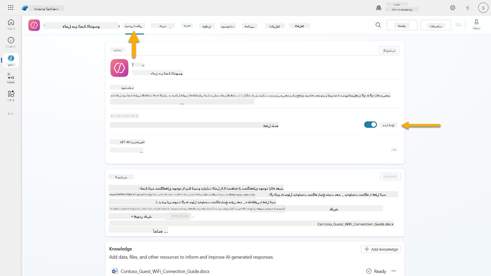

1. به تب **Overview** بروید و بخش **Triggers** را پیدا کنید

1. روی **+ Add trigger** کلیک کنید تا کتابخانه محرک باز شود  
    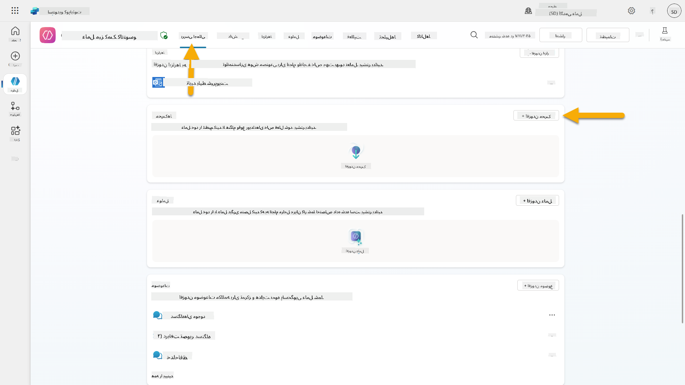

1. جستجو کنید و **When an item is created** (SharePoint) را انتخاب کنید  
    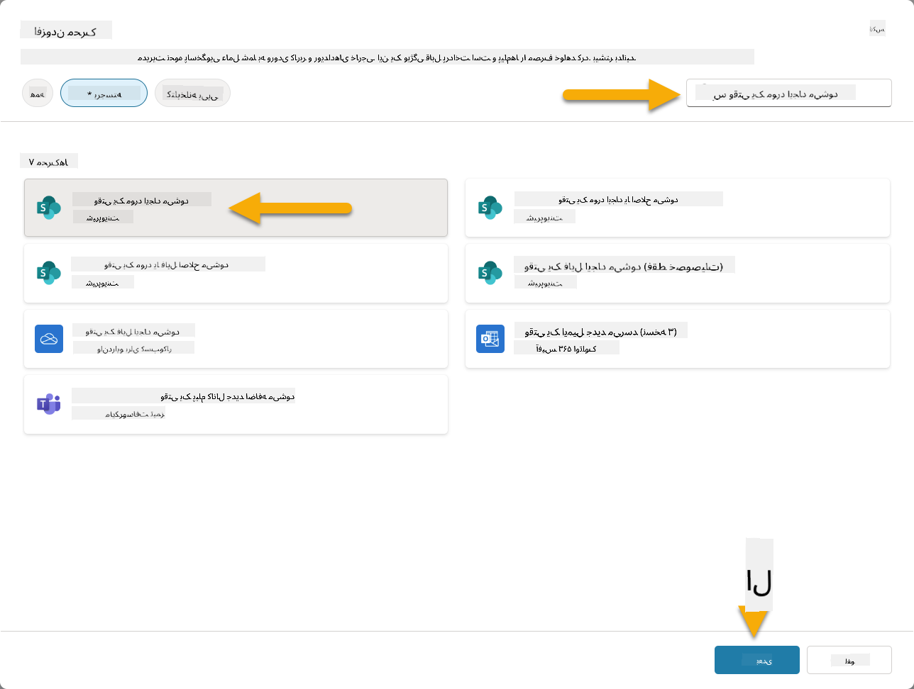

1. نام محرک و اتصالات را پیکربندی کنید:

   - **نام محرک:** New Support Ticket Created in SharePoint

1. منتظر بمانید تا اتصالات پیکربندی شوند و **Next** را برای ادامه انتخاب کنید.  
   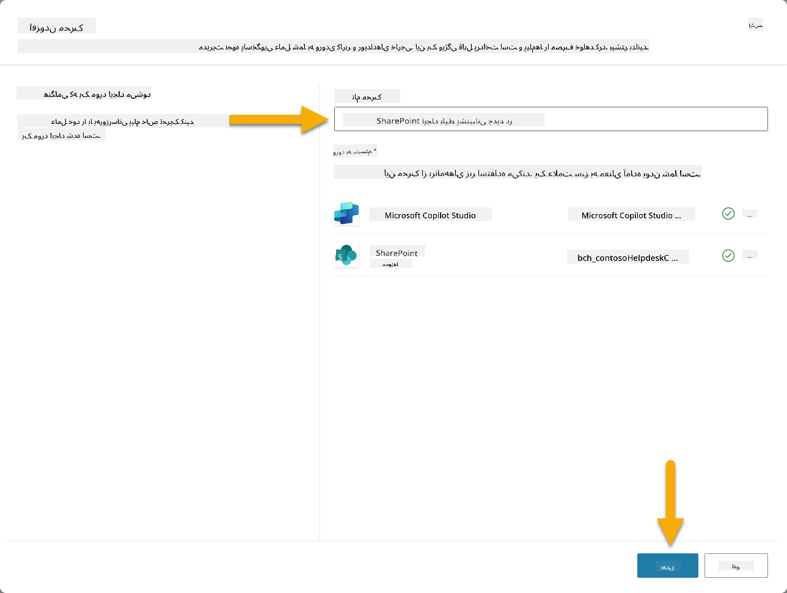

1. پارامترهای محرک را پیکربندی کنید:

   - **آدرس سایت**: سایت SharePoint "Contoso IT" خود را انتخاب کنید

   - **نام لیست**: لیست "Tickets" خود را انتخاب کنید

   - **دستورالعمل‌های اضافی به عامل وقتی توسط محرک فراخوانی می‌شود:**

     ```text
     New Support Ticket Created in SharePoint: {Body}
     
     Use the 'Acknowledge SharePoint Ticket' tool to generate the email body automatically and respond.
     
     IMPORTANT: Do not wait for any user input. Work completely autonomously.
     ```

     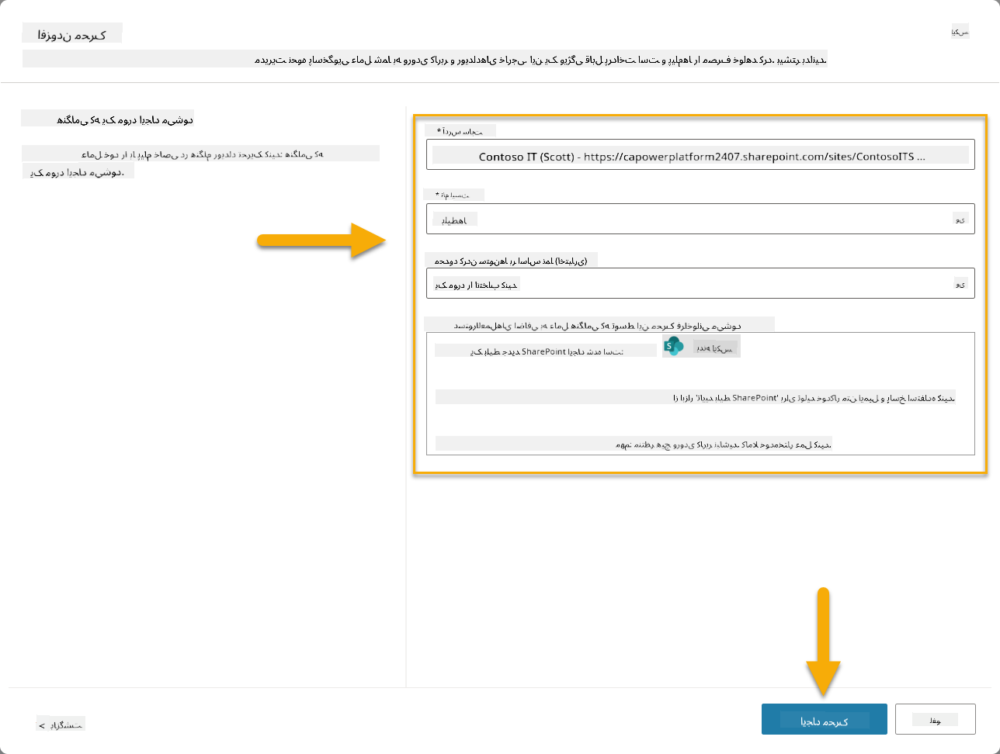

1. **ایجاد محرک** را انتخاب کنید تا ایجاد محرک کامل شود. یک Power Automate Cloud Flow به طور خودکار ایجاد می‌شود تا عامل را به طور خودکار فعال کند.

1. **بستن** را انتخاب کنید.

### ۱۰.۲ ویرایش محرک

1. در بخش **Triggers** از تب **Overview**، منوی **...** را در کنار محرک **New Support Ticket Created in SharePoint** انتخاب کنید

1. **Edit in Power Automate** را انتخاب کنید  
   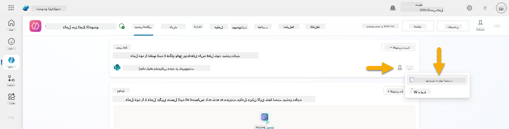

1. گره **Sends a prompt to the specified copilot for processing** را انتخاب کنید

1. در فیلد **Body/message**، محتوای Body را حذف کنید، **کلید اسلش رو به جلو** (/) را فشار دهید و **Insert Expression** را انتخاب کنید  
   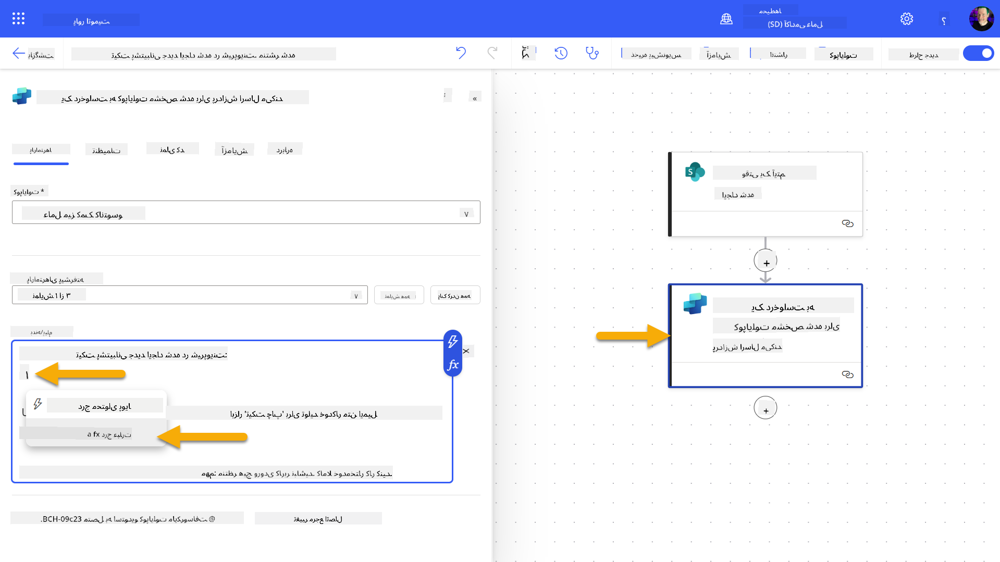

1. عبارت زیر را وارد کنید تا جزئیات خاصی درباره تیکت به عامل ارائه دهید:

    ```text
    concat('Submitted By Name: ', first(triggerOutputs()?['body/value'])?['Author/DisplayName'], '\nSubmitted By Email: ', first(triggerOutputs()?['body/value'])?['Author/Email'], '\nTitle: ', first(triggerOutputs()?['body/value'])?['Title'], '\nIssue Description: ', first(triggerOutputs()?['body/value'])?['Description'], '\nPriority: ', first(triggerOutputs()?['body/value'])?['Priority/Value'],'\nTicket ID : ', first(triggerOutputs()?['body/value'])?['ID'])
    ```

1. **افزودن** را انتخاب کنید  
   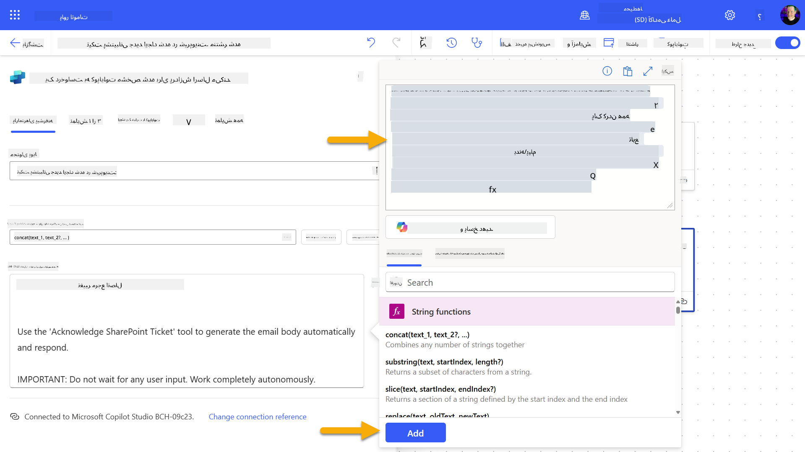

1. **انتشار** را از نوار ابزار بالا سمت راست انتخاب کنید.

### ۱۰.۳ ایجاد ابزاری برای تأیید ایمیل

1. **بازگشت** به عامل خود در Copilot Studio

1. به تب **Tools** در عامل خود بروید

1. روی **+ Add a tool** کلیک کنید و **Connector** را انتخاب کنید

1. جستجو کنید و **Send an email (V2)** connector را انتخاب کنید  
    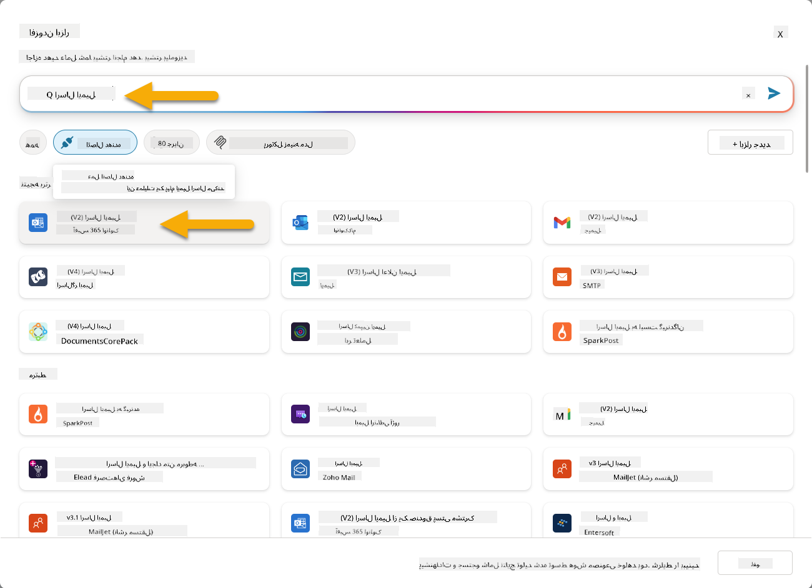

1. منتظر بمانید تا اتصال پیکربندی شود، سپس **Add and configure** را انتخاب کنید

1. تنظیمات ابزار را پیکربندی کنید:

   - **نام**: Acknowledge SharePoint ticket
   - **توضیحات**: این ابزار یک ایمیل تأیید ارسال می‌کند که یک تیکت دریافت شده است.

1. **Customize** را در کنار پارامترهای ورودی انتخاب کنید و به صورت زیر پیکربندی کنید:

    **To**:

    - **توضیحات**: آدرس ایمیل شخصی که تیکت SharePoint را ارسال کرده است
    - **شناسایی به عنوان**: ایمیل

    **Body**:

    - **توضیحات**: تأییدی که تیکت دریافت شده و ما قصد داریم ظرف ۳ روز کاری پاسخ دهیم.

    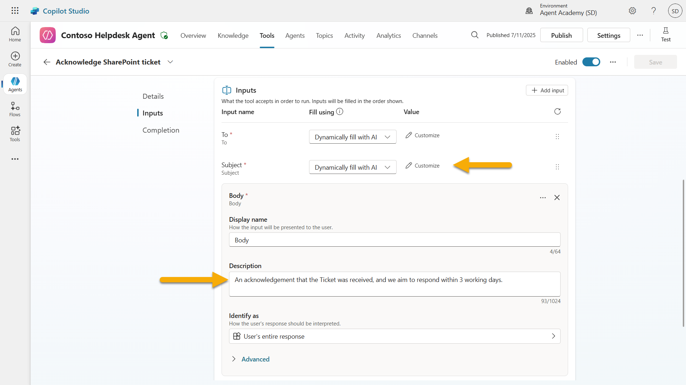

1. **ذخیره** را انتخاب کنید

### ۱۰.۴ آزمایش محرک

1. در داخل **عامل میز کمک** خود، تب **Overview** را انتخاب کنید
1. روی آیکون **Test Trigger** در کنار محرک **New Support Ticket Created in SharePoint** کلیک کنید. این کار پنجره **Test your trigger** را باز می‌کند.
1. یک تب جدید در مرورگر باز کنید و به لیست **SharePoint IT Support Tickets** خود بروید.
1. روی **+ Add new item** کلیک کنید تا یک تیکت آزمایشی ایجاد کنید:
   - **عنوان**: "عدم اتصال به VPN"
   - **توضیحات**: "عدم اتصال به شبکه وای‌فای شرکتی پس از به‌روزرسانی اخیر"
   - **اولویت**: "عادی"

1. آیتم SharePoint را **ذخیره کنید**  
    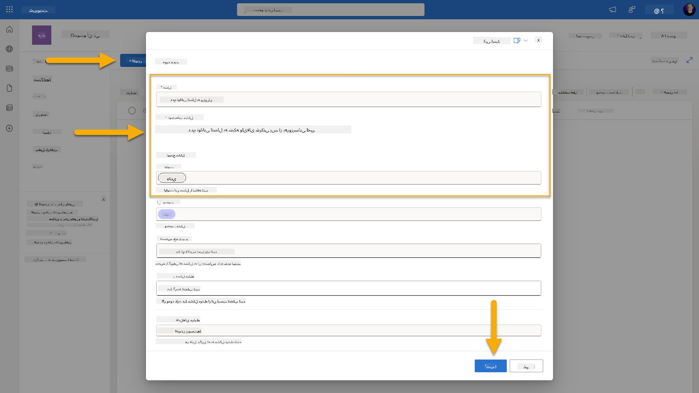
1. به **Copilot Studio** بازگردید و پنل **Test your trigger** را برای فعال شدن تریگر بررسی کنید. از آیکون **Refresh** برای بارگذاری رویداد تریگر استفاده کنید، این ممکن است چند دقیقه طول بکشد.  
    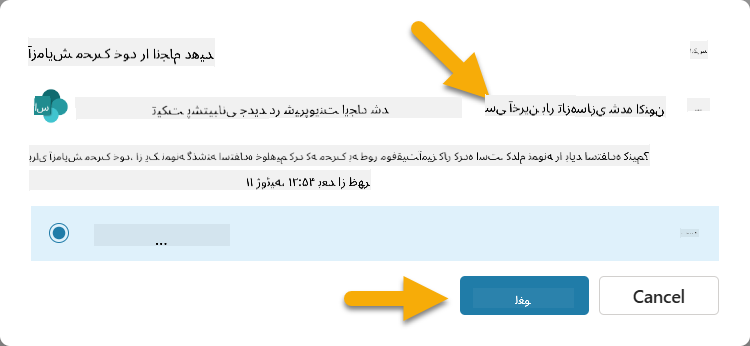
1. وقتی تریگر ظاهر شد، گزینه **Start testing** را انتخاب کنید.
1. آیکون **Activity Map** را در بالای پنل **Test your agent** انتخاب کنید.
1. تأیید کنید که عامل شما:
   - داده‌های تریگر را دریافت کرده است.
   - ابزار "Acknowledge SharePoint ticket" را فراخوانی کرده است.  
     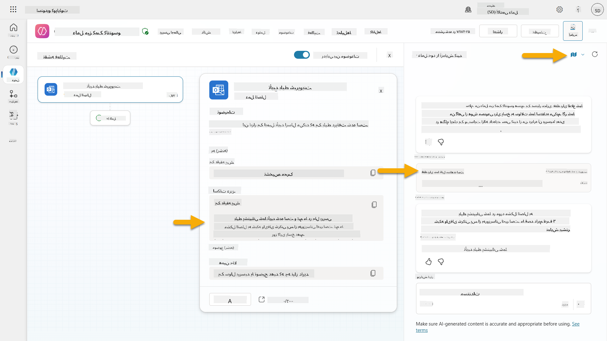
1. ایمیل ارسال‌شده به صندوق ورودی ارسال‌کننده را بررسی کنید تا تأییدیه ایمیل ارسال‌شده را تأیید کنید.  
    
1. تب **Activity** در Copilot Studio را مرور کنید تا اجرای کامل تریگر و ابزار را مشاهده کنید.

## ✅ مأموریت کامل شد

🎉 **تبریک!** شما با موفقیت تریگرهای رویداد را با ابزارهای اتصال پیاده‌سازی کردید که به عامل شما امکان می‌دهد به‌صورت خودکار عمل کند، ایمیل‌های تأییدیه ارسال کند و تیکت‌های پشتیبانی را بدون دخالت کاربر پردازش کند. پس از انتشار عامل شما، به‌صورت خودکار از طرف شما عمل خواهد کرد.

🚀 **درس بعدی**: در درس بعدی، یاد خواهید گرفت که چگونه [عامل خود را منتشر کنید](../11-publish-your-agent/README.md) در Microsoft Teams و Microsoft 365 Copilot، و آن را در دسترس کل سازمان خود قرار دهید!

⏭️ [به درس **انتشار عامل خود** بروید](../11-publish-your-agent/README.md)

## 📚 منابع تاکتیکی

آماده‌اید تا بیشتر درباره تریگرهای رویداد و عوامل خودکار یاد بگیرید؟ این منابع را بررسی کنید:

- **Microsoft Learn**: [عامل خود را در Copilot Studio خودکار کنید](https://learn.microsoft.com/training/modules/autonomous-agents-online-workshop/?WT.mc_id=power-177340-scottdurow)
- **مستندات**: [افزودن یک تریگر رویداد](https://learn.microsoft.com/microsoft-copilot-studio/authoring-trigger-event?WT.mc_id=power-177340-scottdurow)
- **بهترین روش‌ها**: [مقدمه‌ای بر تریگرهای Power Automate](https://learn.microsoft.com/power-automate/triggers-introduction?WT.mc_id=power-177340-scottdurow)
- **سناریوهای پیشرفته**: [استفاده از جریان‌های Power Automate با عوامل](https://learn.microsoft.com/microsoft-copilot-studio/advanced-flow-create?WT.mc_id=power-177340-scottdurow)
- **امنیت**: [جلوگیری از از دست دادن داده‌ها برای Copilot Studio](https://learn.microsoft.com/microsoft-copilot-studio/admin-data-loss-prevention?WT.mc_id=power-177340-scottdurow)

<!-- markdownlint-disable-next-line MD033 -->


---

**سلب مسئولیت**:  
این سند با استفاده از سرویس ترجمه هوش مصنوعی [Co-op Translator](https://github.com/Azure/co-op-translator) ترجمه شده است. در حالی که ما تلاش می‌کنیم دقت را حفظ کنیم، لطفاً توجه داشته باشید که ترجمه‌های خودکار ممکن است شامل خطاها یا نادرستی‌ها باشند. سند اصلی به زبان اصلی آن باید به عنوان منبع معتبر در نظر گرفته شود. برای اطلاعات حیاتی، ترجمه حرفه‌ای انسانی توصیه می‌شود. ما مسئولیتی در قبال سوء تفاهم‌ها یا تفسیرهای نادرست ناشی از استفاده از این ترجمه نداریم.