<!--
CO_OP_TRANSLATOR_METADATA:
{
  "original_hash": "9dceeba2eae2bb73e328602a060eddab",
  "translation_date": "2025-10-21T18:55:16+00:00",
  "source_file": "docs/recruit/11-publish-your-agent/README.md",
  "language_code": "fa"
}
-->
# 🚨 مأموریت 11: انتشار عامل شما

## 🕵️‍♂️ نام رمز: `عملیات انتشار انتشار انتشار`

> **⏱️ زمان عملیات:** `~30 دقیقه`

🎥 **تماشای راهنما**

## 🎯 خلاصه مأموریت

پس از تکمیل مجموعه‌ای از ماژول‌های چالش‌برانگیز، سازنده عامل، اکنون آماده مهم‌ترین مرحله خود هستید: انتشار عامل خود. وقت آن است که ساخته خود را در دسترس کاربران در Microsoft Teams و Microsoft 365 Copilot قرار دهید.

عامل شما—مجهز به مأموریتی واضح، ابزارهای قدرتمند و دسترسی به منابع کلیدی دانش—آماده خدمت است. با استفاده از Microsoft Copilot Studio، عامل خود را منتشر می‌کنید تا بتواند به کاربران واقعی کمک کند، درست در جایی که کار می‌کنند.

بیایید عامل خود را وارد عمل کنیم.

## 🔎 اهداف

📖 این درس شامل موارد زیر است:

1. چرا انتشار عامل شما مهم است
1. چه اتفاقی می‌افتد وقتی عامل خود را منتشر می‌کنید
1. چگونه یک کانال اضافه کنیم (Microsoft Teams و Microsoft 365 Copilot)
1. چگونه عامل را در Microsoft Teams اضافه کنیم
1. چگونه عامل را در Microsoft Teams برای کل سازمان خود در دسترس قرار دهیم

## 🚀 انتشار عامل

هر بار که روی یک عامل در Copilot Studio کار می‌کنید، ممکن است آن را با افزودن دانش یا ابزارها به‌روزرسانی کنید. وقتی آماده تغییرات هستید و به‌طور کامل آزمایش کرده‌اید، آماده انتشار آن هستید. انتشار تضمین می‌کند که آخرین به‌روزرسانی‌ها فعال هستند. وقتی عامل خود را با ابزارهای جدید به‌روزرسانی می‌کنید و دکمه انتشار را نمی‌زنید، هنوز برای کاربران نهایی در دسترس نیست.

همیشه مطمئن شوید که دکمه انتشار را فشار می‌دهید وقتی می‌خواهید به‌روزرسانی‌ها را به کاربران عامل خود منتقل کنید. عامل شما ممکن است کانال‌هایی به آن اضافه شده باشد و وقتی دکمه انتشار را فشار می‌دهید، به‌روزرسانی‌ها برای همه کانال‌هایی که به عامل اضافه کرده‌اید در دسترس قرار می‌گیرند.

## ⚙️ پیکربندی کانال‌ها

کانال‌ها تعیین می‌کنند که کاربران شما کجا می‌توانند به عامل شما دسترسی داشته باشند و با آن تعامل داشته باشند. پس از انتشار عامل خود، می‌توانید آن را در چندین کانال در دسترس قرار دهید. هر کانال ممکن است محتوای عامل شما را به‌طور متفاوتی نمایش دهد.

شما می‌توانید عامل خود را به کانال‌های زیر اضافه کنید:

- **Microsoft Teams و Microsoft 365 Copilot** - عامل خود را در چت‌ها و جلسات Teams و در تجربه‌های Microsoft 365 Copilot در دسترس قرار دهید ([بیشتر بدانید](https://learn.microsoft.com/microsoft-copilot-studio/publication-add-bot-to-microsoft-teams))
- **وب‌سایت نمایشی** - عامل خود را در یک وب‌سایت نمایشی که توسط Copilot Studio ارائه شده است آزمایش کنید ([بیشتر بدانید](https://learn.microsoft.com/microsoft-copilot-studio/publication-connect-bot-to-web-channels))
- **وب‌سایت سفارشی** - عامل خود را مستقیماً در وب‌سایت خود جاسازی کنید ([بیشتر بدانید](https://learn.microsoft.com/microsoft-copilot-studio/publication-connect-bot-to-web-channels))
- **اپلیکیشن موبایل** - عامل خود را در یک اپلیکیشن موبایل سفارشی ادغام کنید ([بیشتر بدانید](https://learn.microsoft.com/microsoft-copilot-studio/publication-connect-bot-to-custom-application))
- **SharePoint** - عامل خود را به سایت‌های SharePoint برای کمک به اسناد و سایت اضافه کنید ([بیشتر بدانید](https://learn.microsoft.com/microsoft-copilot-studio/publication-add-bot-to-sharepoint))
- **Facebook Messenger** - با کاربران از طریق پلتفرم پیام‌رسانی Facebook ارتباط برقرار کنید ([بیشتر بدانید](https://learn.microsoft.com/microsoft-copilot-studio/publication-add-bot-to-facebook))
- **Power Pages** - عامل خود را در وب‌سایت‌های Power Pages ادغام کنید ([بیشتر بدانید](https://learn.microsoft.com/microsoft-copilot-studio/publication-add-bot-to-power-pages))
- **کانال‌های Azure Bot Service** - به کانال‌های اضافی از جمله Slack، Telegram، Twilio SMS و موارد دیگر دسترسی پیدا کنید ([بیشتر بدانید](https://learn.microsoft.com/microsoft-copilot-studio/publication-connect-bot-to-azure-bot-service-channels))

برای افزودن یک کانال، به تب **Channels** در عامل خود بروید و کانالی را که می‌خواهید پیکربندی کنید انتخاب کنید. هر کانال نیازمندی‌های تنظیم خاصی دارد و ممکن است به احراز هویت یا مراحل پیکربندی اضافی نیاز داشته باشد.

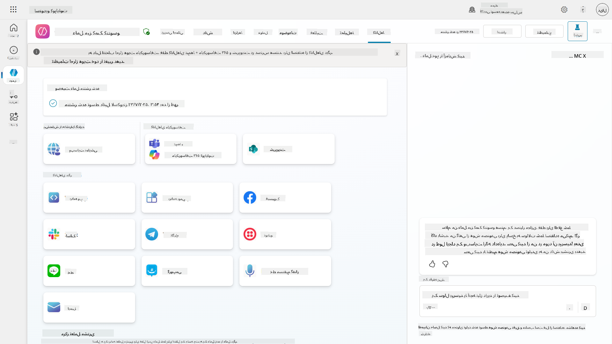

## 📺 تجربه‌های کانال

کانال‌های مختلف تجربه‌های کاربری متفاوتی دارند. هنگام ساختن یک عامل برای چندین کانال، مطمئن شوید که از تفاوت‌های هر کانال آگاه هستید. همیشه یک استراتژی خوب این است که عامل خود را در چندین کانال آزمایش کنید تا ببینید آیا واقعاً همان چیزی را که قصد داشتید انجام می‌دهد یا خیر.

| تجربه                          | وب‌سایت       | Teams و Microsoft 365 Copilot         | Facebook                 | Dynamics Omnichannel for Customer Service                   |
| ------------------------------- | ------------- | ------------------------------------- | ------------------------ | ----------------------------------------------------------- |
| [نظرسنجی رضایت مشتری][1]       | کارت تطبیقی   | فقط متن                              | فقط متن                 | فقط متن                                                     |
| [گزینه‌های چندگانه][1]          | پشتیبانی‌شده | [پشتیبانی تا شش گزینه (به‌عنوان کارت قهرمان)][4] | [پشتیبانی تا 13 گزینه][6] | [پشتیبانی جزئی][8]                                          |
| [Markdown][2]                   | پشتیبانی‌شده | [پشتیبانی جزئی][5]                   | [پشتیبانی جزئی][7]      | [پشتیبانی جزئی][9]                                          |
| [پیام خوش‌آمدگویی][1]           | پشتیبانی‌شده | پشتیبانی‌شده                         | پشتیبانی‌نشده           | پشتیبانی‌شده برای [چت][10]. پشتیبانی‌نشده برای سایر کانال‌ها. |
| [آیا منظور شما این بود][3]      | پشتیبانی‌شده | پشتیبانی‌شده                         | پشتیبانی‌شده            | پشتیبانی‌شده برای [Microsoft Teams][11]، [چت][10]، Facebook و کانال‌های فقط متن (پیام کوتاه از طریق [TeleSign][12] و [Twilio][13]، [WhatsApp][14]، [WeChat][15] و [Twitter][16]). اقدامات پیشنهادی به‌صورت لیست فقط متن ارائه می‌شوند؛ کاربران باید یک گزینه را دوباره تایپ کنند تا پاسخ دهند. |

[1]: https://learn.microsoft.com/microsoft-copilot-studio/authoring-create-edit-topics
[2]: https://daringfireball.net/projects/markdown/
[3]: https://learn.microsoft.com/microsoft-copilot-studio/advanced-ai-features
[4]: https://learn.microsoft.com/microsoftteams/platform/concepts/cards/cards-reference#hero-card
[5]: https://learn.microsoft.com/microsoftteams/platform/bots/how-to/format-your-bot-messages#text-only-messages
[6]: https://developers.facebook.com/docs/messenger-platform/send-messages/quick-replies/
[7]: https://www.facebook.com/help/147348452522644?helpref=related
[8]: https://learn.microsoft.com/dynamics365/customer-service/asynchronous-channels#suggested-actions-support
[9]: https://learn.microsoft.com/dynamics365/customer-service/asynchronous-channels#preview-support-for-formatted-messages
[10]: https://learn.microsoft.com/dynamics365/customer-service/set-up-chat-widget
[11]: https://learn.microsoft.com/dynamics365/customer-service/configure-microsoft-teams
[12]: https://learn.microsoft.com/dynamics365/customer-service/configure-sms-channel
[13]: https://learn.microsoft.com/dynamics365/customer-service/configure-sms-channel-twilio
[14]: https://learn.microsoft.com/dynamics365/customer-service/configure-whatsapp-channel
[15]: https://learn.microsoft.com/dynamics365/customer-service/configure-wechat-channel
[16]: https://learn.microsoft.com/dynamics365/customer-service/configure-twitter-channel

> [!NOTE]
> برخی مثال‌ها وجود دارند که می‌توانید از منطق متفاوت برای کانال‌های مختلف استفاده کنید. یک مثال از آن را می‌توانید در مخزن Power Platform Snippets پیدا کنید:
>
> هنری جیمز مثالی از نحوه نمایش یک کارت تطبیقی متفاوت وقتی کانال Microsoft Teams است به اشتراک گذاشته است. ([لینک به مثال](https://github.com/pnp/powerplatform-snippets/blob/main/copilot-studio/multiple-topics-matched-topic/source/multiple-topics-matched.yaml#L40))

## 🧪 آزمایشگاه 11: انتشار عامل خود به Teams و Microsoft 365 Copilot

### 🎯 مورد استفاده

عامل میز کمک IT Contoso شما اکنون با قابلیت‌های قدرتمند کاملاً پیکربندی شده است—می‌تواند به منابع دانش SharePoint دسترسی پیدا کند، بلیت‌های پشتیبانی ایجاد کند، اعلان‌های پیشگیرانه ارسال کند و به‌طور هوشمندانه به پرسش‌های کاربران پاسخ دهد. با این حال، همه این ویژگی‌ها در حال حاضر فقط در محیط توسعه‌ای که آن‌ها را ساخته‌اید در دسترس هستند.

**چالش:** کاربران نهایی نمی‌توانند از قابلیت‌های عامل شما بهره‌مند شوند تا زمانی که به‌درستی منتشر شود و از طریق کانال‌هایی که واقعاً در آن‌ها کار می‌کنند در دسترس قرار گیرد.

**راه‌حل:** انتشار عامل شما تضمین می‌کند که آخرین نسخه—با همه به‌روزرسانی‌های اخیر، موضوعات جدید، منابع دانش پیشرفته و جریان‌های پیکربندی‌شده—برای کاربران واقعی در دسترس است. بدون انتشار، کاربران همچنان با نسخه قدیمی‌تر عامل شما تعامل خواهند داشت که ممکن است فاقد قابلیت‌های حیاتی باشد.

افزودن کانال Teams و Microsoft 365 Copilot به همان اندازه مهم است زیرا:

- **ادغام با Teams**: کارکنان سازمان شما بیشتر روز خود را در Microsoft Teams برای همکاری، جلسات و ارتباطات می‌گذرانند. با افزودن عامل خود به Teams، کاربران می‌توانند بدون ترک محیط کاری اصلی خود از پشتیبانی IT بهره‌مند شوند.

- **Microsoft 365 Copilot**: کاربران می‌توانند به عامل تخصصی میز کمک IT شما مستقیماً در تجربه Microsoft 365 Copilot دسترسی پیدا کنند و آن را به‌طور یکپارچه در جریان کاری روزانه خود در برنامه‌های Office ادغام کنند.

- **دسترسی متمرکز**: به جای به خاطر سپردن وب‌سایت‌ها یا برنامه‌های جداگانه، کاربران می‌توانند از طریق پلتفرم‌هایی که قبلاً استفاده می‌کنند به پشتیبانی IT دسترسی پیدا کنند، اصطکاک را کاهش داده و پذیرش را افزایش دهند.

این مأموریت کار توسعه شما را به یک راه‌حل آماده تولید تبدیل می‌کند که ارزش واقعی را به کاربران نهایی سازمان شما ارائه می‌دهد.

### پیش‌نیازها

قبل از شروع این آزمایشگاه، مطمئن شوید که:

- ✅ آزمایشگاه‌های قبلی را تکمیل کرده‌اید و یک عامل میز کمک Contoso کاملاً پیکربندی‌شده دارید
- ✅ عامل شما آزمایش شده و آماده استفاده در محیط تولید است
- ✅ مجوزها در محیط Copilot Studio خود برای انتشار عوامل دارید
- ✅ دسترسی به Microsoft Teams در سازمان خود دارید

### 11.1 انتشار عامل خود

اکنون که تمام کارهای ما روی عامل انجام شده است، باید مطمئن شویم که تمام کارهای ما برای کاربران نهایی که قرار است از عامل ما استفاده کنند در دسترس است. برای اطمینان از اینکه محتوا برای همه کاربران در دسترس است، باید عامل خود را منتشر کنیم.

1. به عامل میز کمک Contoso در Copilot Studio بروید (از طریق [پورتال سازنده Copilot Studio](https://copilotstudio.microsoft.com))

    در Copilot Studio، انتشار عامل شما آسان است. فقط می‌توانید دکمه انتشار را در بالای نمای کلی عامل انتخاب کنید.

    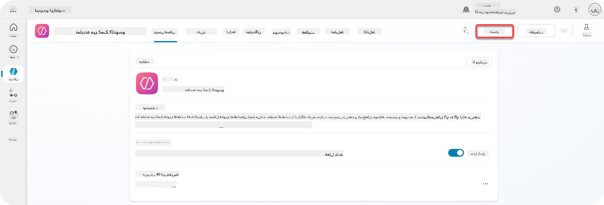

1. دکمه **Publish** را در عامل خود انتخاب کنید

    پنجره انتشار باز می‌شود - برای تأیید اینکه واقعاً می‌خواهید عامل خود را منتشر کنید.

    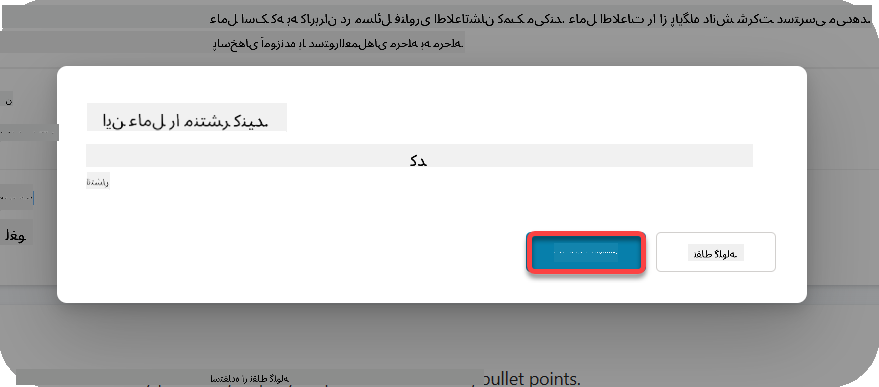

1. **Publish** را انتخاب کنید تا انتشار عامل خود را تأیید کنید

    اکنون پیامی نشان می‌دهد که عامل شما در حال انتشار است. نیازی نیست که آن پنجره باز باشد. وقتی عامل منتشر شد، به شما اطلاع داده می‌شود.

    

    وقتی انتشار عامل به پایان رسید، اعلان در بالای صفحه عامل نمایش داده می‌شود.

    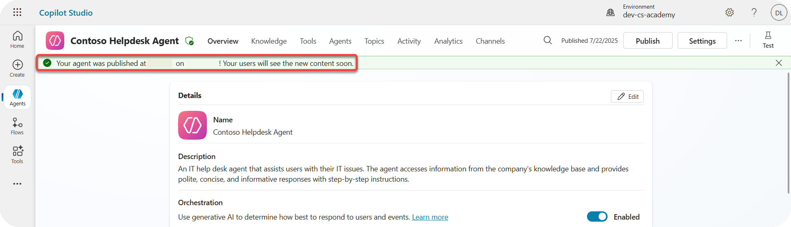

اما - ما فقط عامل را منتشر کردیم، هنوز آن را به یک کانال اضافه نکرده‌ایم، پس بیایید این کار را اکنون انجام دهیم!

### 11.2 افزودن کانال Teams و Microsoft 365 Copilot

1. برای افزودن کانال Teams و Microsoft 365 Copilot به عامل خود، باید **Channel** را در ناوبری بالای عامل انتخاب کنید

    

    در اینجا می‌توانیم همه کانال‌هایی را که می‌توانیم به این عامل اضافه کنیم ببینیم.

1. **Teams و Microsoft 365** را انتخاب کنید

    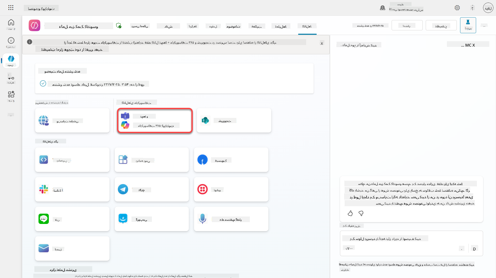

1. **Add channel** را انتخاب کنید تا ویزارد را تکمیل کرده و کانال را به عامل اضافه کنید

    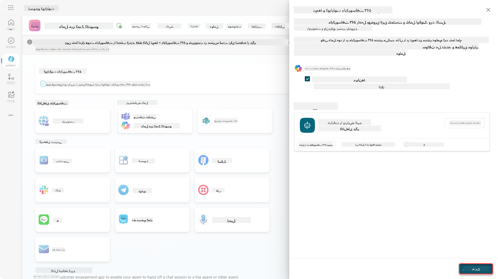

    این کار کمی زمان می‌برد تا اضافه شود. پس از اضافه شدن، یک اعلان سبز در بالای نوار کناری ظاهر می‌شود.

    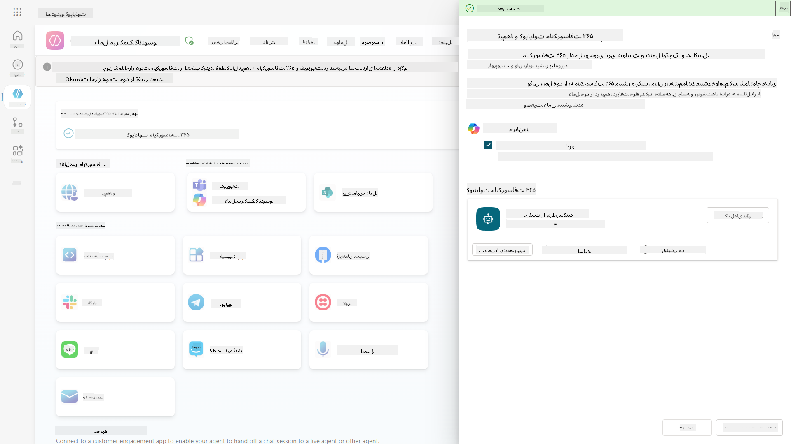

1. **See agent in Teams** را انتخاب کنید تا یک تب جدید باز شود

    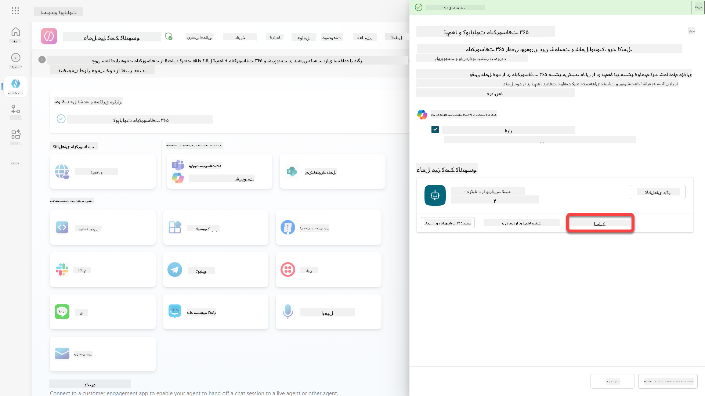

1. **Add** را انتخاب کنید تا عامل میز کمک Contoso را به Teams اضافه کنید

    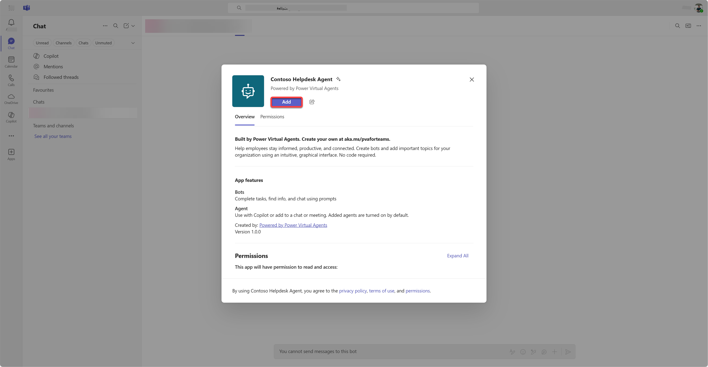

    این کار کمی زمان می‌برد. پس از آن باید صفحه زیر را نشان دهد:

    

1. **Open** را انتخاب کنید تا عامل در Teams باز شود

    این عامل را به‌عنوان یک اپلیکیشن Teams در Teams باز می‌کند

    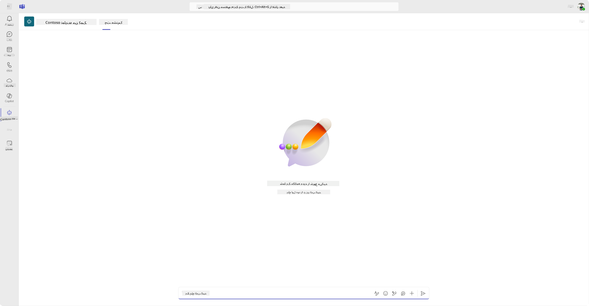

اکنون عامل را منتشر کرده‌ایم تا برای شما در Microsoft Teams کار کند، اما ممکن است بخواهید این را برای افراد بیشتری در دسترس قرار دهید.

### 11.3 در دسترس قرار دادن عامل برای همه کاربران در Tenant

1. تب مرورگر را که عامل میز کمک Contoso در آن باز شده است ببندید

    این باید شما را به Copilot Studio بازگرداند، جایی که پنل کناری Teams و Microsoft 365 Copilot هنوز باز است. ما فقط عامل را در Teams باز کردیم، اما می‌توانیم کارهای بیشتری در اینجا انجام دهیم. می‌توانیم جزئیات عامل را ویرایش کنیم، عامل را برای کاربران بیشتری منتشر کنیم و موارد دیگر.

1. **Edit details** را انتخاب کنید

    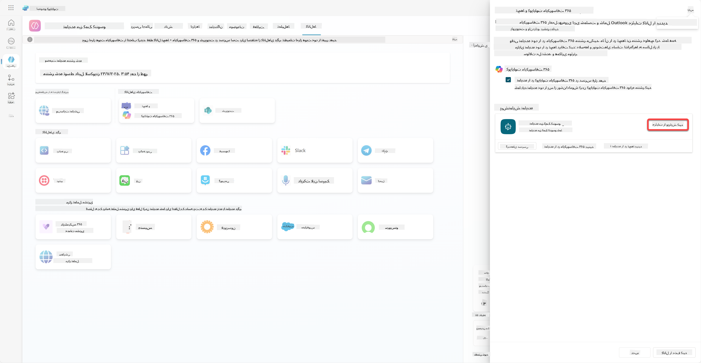
این پنل باز می‌شود که در آن می‌توانیم جزئیات و تنظیمات مختلفی از عامل را تغییر دهیم. می‌توانیم جزئیات پایه‌ای مانند آیکون، رنگ پس‌زمینه آیکون و توضیحات را تغییر دهیم. همچنین می‌توانیم تنظیمات Teams را تغییر دهیم (برای مثال اجازه دادن به کاربران برای افزودن عامل به یک تیم، یا استفاده از این عامل در چت‌های گروهی و جلسات) در اینجا. وقتی گزینه *بیشتر* را انتخاب کنید، می‌توانید جزئیات توسعه‌دهنده مانند نام توسعه‌دهنده، وب‌سایت، بیانیه حریم خصوصی و شرایط استفاده را نیز تغییر دهید.

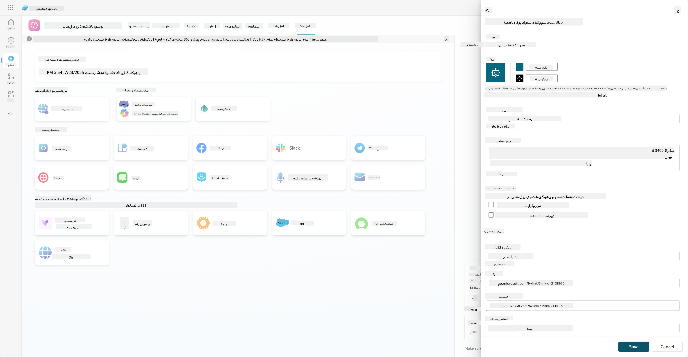

1. گزینه **لغو** را انتخاب کنید تا پنل ویرایش جزئیات بسته شود.

1. گزینه **گزینه‌های دسترسی** را انتخاب کنید.

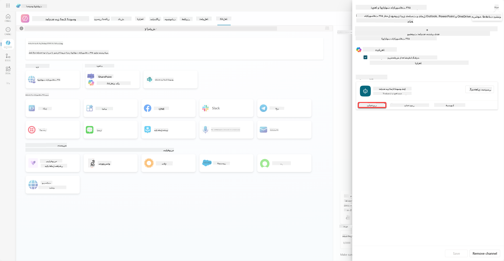

این پنل گزینه‌های دسترسی را باز می‌کند، جایی که می‌توانید لینکی را کپی کنید تا برای کاربران ارسال کنید تا از این عامل استفاده کنند (توجه داشته باشید، باید عامل را با کاربر به اشتراک بگذارید) و می‌توانید فایلی را دانلود کنید تا عامل خود را به فروشگاه Microsoft Teams یا Microsoft 365 اضافه کنید. برای نمایش عامل در فروشگاه، گزینه‌های دیگری نیز دارید: می‌توانید آن را به هم‌تیمی‌ها و کاربران مشترک نشان دهید (برای نمایش در بخش *ساخته شده با Power Platform*) یا می‌توانید آن را به همه افراد در سازمان خود نشان دهید (این نیاز به تأیید مدیر دارد).

1. گزینه **نمایش به همه افراد در سازمان من** را انتخاب کنید.

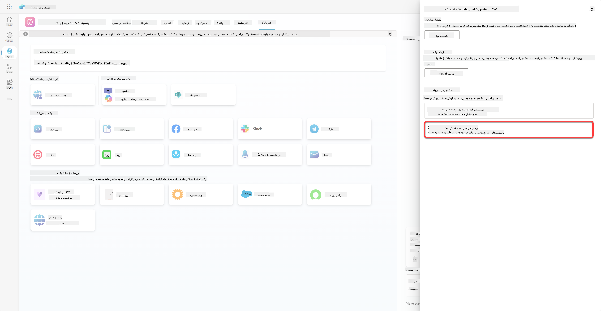

1. گزینه **ارسال برای تأیید مدیر** را انتخاب کنید.

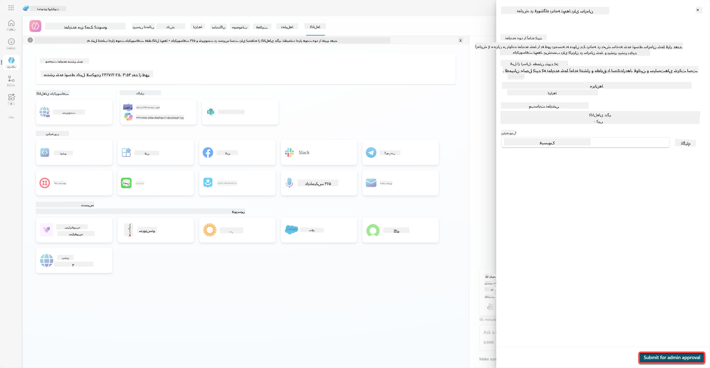

اکنون، مدیر شما باید ارسال عامل شما را تأیید کند. آن‌ها می‌توانند این کار را با رفتن به مرکز مدیریت Teams و جستجوی عامل Contoso Helpdesk در برنامه‌ها انجام دهند. در تصویر زیر می‌توانید ببینید که مدیر در مرکز مدیریت Teams چه چیزی را مشاهده می‌کند.

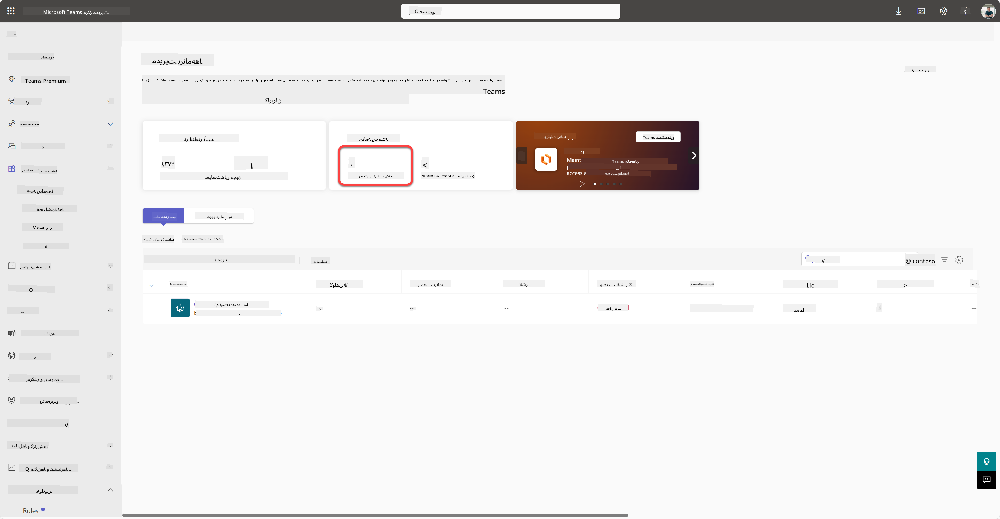

مدیر باید عامل Contoso Helpdesk را انتخاب کرده و گزینه *انتشار* را انتخاب کند تا عامل Contoso Helpdesk برای همه منتشر شود.

وقتی مدیر ارسال عامل را منتشر کرد، می‌توانید Copilot Studio را تازه‌سازی کنید و باید بنر *در دسترس در فروشگاه برنامه* را در گزینه‌های دسترسی مشاهده کنید.

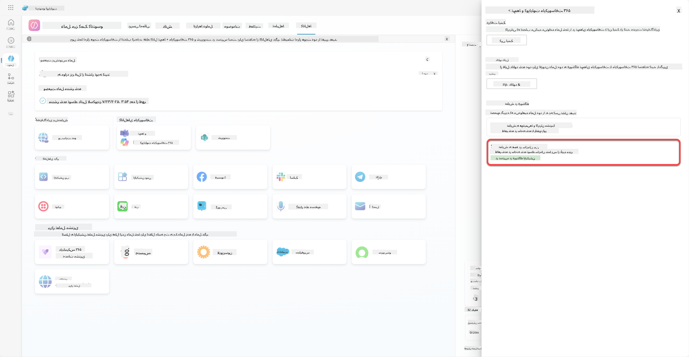

اینجا امکانات بیشتری نیز وجود دارد. مدیر شما می‌تواند سیاست تنظیمات جهانی را تغییر دهد و عامل Contoso Helpdesk را به صورت خودکار برای همه در مستاجر نصب کند. علاوه بر این - شما می‌توانید عامل Contoso Helpdesk را به نوار کناری سمت چپ پین کنید تا همه به راحتی به آن دسترسی داشته باشند.

## ✅ مأموریت کامل شد

🎉 **تبریک!** شما عامل خود را با موفقیت منتشر کردید و آن را به Teams و Microsoft 365 Copilot اضافه کردید! مرحله بعدی آخرین مأموریت دوره است: درک مجوزها.

⏭️ [به درس **درک مجوزها** بروید](../12-understanding-licensing/README.md)

## 📚 منابع تاکتیکی

🔗 [مستندات کانال‌های انتشار](https://learn.microsoft.com/microsoft-copilot-studio/publication-fundamentals-publish-channels)

---

**سلب مسئولیت**:  
این سند با استفاده از سرویس ترجمه هوش مصنوعی [Co-op Translator](https://github.com/Azure/co-op-translator) ترجمه شده است. در حالی که ما تلاش می‌کنیم دقت را حفظ کنیم، لطفاً توجه داشته باشید که ترجمه‌های خودکار ممکن است شامل خطاها یا نادرستی‌ها باشند. سند اصلی به زبان اصلی آن باید به عنوان منبع معتبر در نظر گرفته شود. برای اطلاعات حیاتی، ترجمه حرفه‌ای انسانی توصیه می‌شود. ما مسئولیتی در قبال سوء تفاهم‌ها یا تفسیرهای نادرست ناشی از استفاده از این ترجمه نداریم.