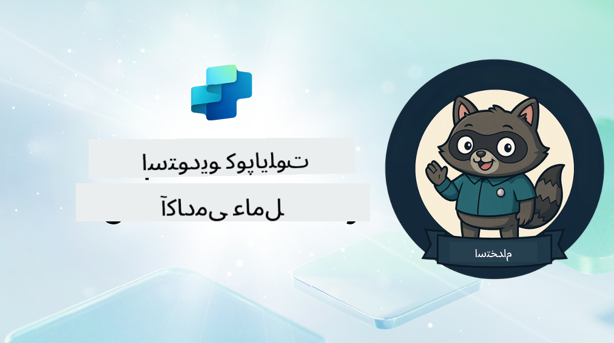

<!--
CO_OP_TRANSLATOR_METADATA:
{
  "original_hash": "8b5ecad9d5d073ea3f4c2b844e80f2e5",
  "translation_date": "2025-10-21T18:15:42+00:00",
  "source_file": "docs/recruit/README.md",
  "language_code": "fa"
}
-->
# خوش آمدید، کارآموز

**خوش آمدید، کارآموز.**  
ماموریت شما—اگر تصمیم به پذیرش آن دارید—تسلط بر هنر ساخت نماینده‌ها با استفاده از **Microsoft Copilot Studio** است.

این آموزش عملی نقطه ورود شما به **دنیای نماینده‌ها** است: از درخواست‌های پایه گرفته تا کارت‌های تطبیقی و جریان‌های نماینده، شما یاد خواهید گرفت که چگونه نماینده‌های هوشمند را با استفاده از ابزارها و موارد کاربرد واقعی بسازید، گسترش دهید و مستقر کنید.

---

## 🎯 هدف ماموریت

با تکمیل آکادمی نماینده، شما قادر خواهید بود:

- درک کنید نماینده‌ها در زمینه Microsoft Copilot Studio چه هستند
- بررسی کنید چگونه مدل‌های زبان بزرگ (LLMs)، تولید تقویت‌شده با بازیابی (RAG)، و هماهنگی در یک نماینده با هم ترکیب می‌شوند
- نماینده‌های **اعلانی** و **سفارشی** بسازید
- نماینده‌ها را با **موضوعات**، **کارت‌های تطبیقی** و **جریان‌های نماینده** بهبود دهید
- نماینده‌ها را در **Microsoft Teams** و **Microsoft 365 Copilot** مستقر کنید

---

## 🧪 پیش‌نیازها

برای تکمیل تمام ماموریت‌ها، شما نیاز دارید:

- یک اجاره‌دهنده توسعه‌دهنده Microsoft 365 (با فعال بودن SharePoint)
- دسترسی به **Microsoft Copilot Studio** (آزمایشی یا دارای مجوز)
- اختیاری: دانش پایه‌ای از SharePoint، Power Platform، یا Power Fx

---

## 🧬 این دوره برای چه کسانی مناسب است

این دوره مناسب است برای:

- سازندگان و توسعه‌دهندگانی که در حال بررسی **Copilot Studio** هستند
- متخصصان IT که در حال ساخت افزونه‌های **Microsoft 365 Copilot** هستند
- علاقه‌مندان به Power Platform که می‌خواهند با نماینده‌های هوشمند **سطح خود را ارتقا دهند**
- هر کسی که ترجیح می‌دهد با **عمل کردن** یاد بگیرد

---

## 🧭 نمای کلی برنامه درسی

این آکادمی به درس‌های پیشرفته تقسیم شده است—هر کدام به عنوان یک ماموریت میدانی طراحی شده‌اند تا مهارت‌های ساخت نماینده شما را ارتقا دهند.

| درس | عنوان | خلاصه ماموریت |
|--------|-------|------------------|
| `00` | 🧰 [راه‌اندازی دوره](./00-course-setup/README.md) | محیط توسعه، آزمایش Copilot Studio، و سایت SharePoint خود را راه‌اندازی کنید |
| `01` | 🧠 [مقدمه‌ای بر نماینده‌ها](./01-introduction-to-agents/README.md) | مفاهیم هوش مصنوعی مکالمه‌ای، LLM‌ها، و نماینده‌های خودمختار در مقابل اعلانی را درک کنید |
| `02` | 🛠️ [مبانی Copilot Studio](./02-copilot-studio-fundamentals/README.md) | بلوک‌های سازنده: دانش، مهارت‌ها، خودمختاری را یاد بگیرید |
| `03` | 👩‍💻 [ایجاد یک نماینده اعلانی](./03-create-a-declarative-agent-for-M365Copilot/README.md) | نماینده خود را به Microsoft 365 Copilot اضافه کنید، بر اساس یک درخواست پایه |
| `04` | 🧩 [ایجاد یک راه‌حل](./04-creating-a-solution/README.md) | نماینده خود را به یک راه‌حل قابل استفاده مجدد برای مدیریت محیط تبدیل کنید |
| `05` | 🚀 [شروع با نماینده‌های از پیش ساخته شده](./05-using-prebuilt-agents/README.md) | از یک نماینده قالبی برای تسریع راه‌اندازی استفاده کنید و آن را سفارشی کنید |
| `06` | ✍️ [ساخت یک نماینده سفارشی](./06-create-agent-from-conversation/README.md) | یک Copilot جدید بر اساس منابع دانش ایجاد کنید |
| `07` | 🧠 [افزودن یک موضوع با محرک‌ها](./07-add-new-topic-with-trigger/README.md) | از موضوعات برای تعریف مسیرهای پرسش/پاسخ سفارشی استفاده کنید |
| `08` | 🪪 [بهبود با کارت‌های تطبیقی](./08-add-adaptive-card/README.md) | یک کارت تطبیقی با استفاده از Power Fx و SharePoint بسازید |
| `09` | 🔁 [خودکارسازی با جریان‌های نماینده](./09-add-an-agent-flow/README.md) | از ورودی کارت تطبیقی برای راه‌اندازی جریان‌های پشت‌صحنه استفاده کنید |
| `10` | 🧭 [افزودن محرک‌های رویداد](./10-add-event-triggers/README.md) | نماینده خود را برای عمل خودمختار با استفاده از منطق مبتنی بر رویداد فعال کنید |
| `11` | 📢 [انتشار نماینده خود](./11-publish-your-agent/README.md) | نماینده خود را در Microsoft Teams و Microsoft 365 Copilot مستقر کنید |
| `12` | 🪪 [درک مجوزها](./12-understanding-licensing/README.md) | یاد بگیرید چگونه مجوزدهی و صورتحساب با Copilot Studio کار می‌کند |
| `13` | 🚨 [دریافت نشان کارآموزی خود](./course-completion-badges-recruit/README.md) | نشان خود را دریافت کنید و دستاورد خود را ثبت کنید! |

!!! note
    ✅ تکمیل این برنامه درسی نشان **کارآموز** را برای شما به ارمغان می‌آورد.  
    🔓 **عملیات** و **فرماندهی** در مراحل آینده باز خواهند شد.

<!-- markdownlint-disable-next-line MD033 -->

---

**سلب مسئولیت**:  
این سند با استفاده از سرویس ترجمه هوش مصنوعی [Co-op Translator](https://github.com/Azure/co-op-translator) ترجمه شده است. در حالی که ما تلاش می‌کنیم دقت را حفظ کنیم، لطفاً توجه داشته باشید که ترجمه‌های خودکار ممکن است شامل خطاها یا نادرستی‌ها باشند. سند اصلی به زبان اصلی آن باید به عنوان منبع معتبر در نظر گرفته شود. برای اطلاعات حیاتی، ترجمه حرفه‌ای انسانی توصیه می‌شود. ما مسئولیتی در قبال سوء تفاهم‌ها یا تفسیرهای نادرست ناشی از استفاده از این ترجمه نداریم.