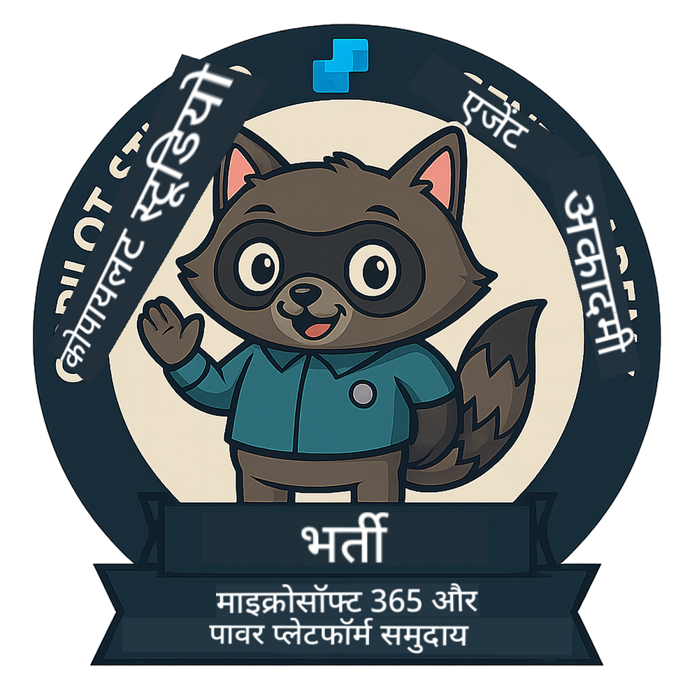

<!--
CO_OP_TRANSLATOR_METADATA:
{
  "original_hash": "15e57e059ce7689d602d7853187235cd",
  "translation_date": "2025-10-21T17:35:39+00:00",
  "source_file": "docs/index.md",
  "language_code": "hi"
}
-->
---
hide:
- navigation
---

# Copilot Studio Agent Academy

**Copilot Studio Agent Academy में आपका स्वागत है।**  

आपका मिशन—यदि आप इसे स्वीकार करते हैं—**Microsoft Copilot Studio** का उपयोग करके एजेंट बनाने की कला में महारत हासिल करना है।

यह व्यावहारिक प्रशिक्षण आपको **एजेंट्स की दुनिया** में प्रवेश करने का अवसर देता है: ग्राउंडेड प्रॉम्प्ट्स से लेकर Adaptive Cards और एजेंट फ्लो तक, आप वास्तविक दुनिया के उपकरणों और उपयोग मामलों का उपयोग करके बुद्धिमान एजेंट्स को बनाना, स्केल करना और तैनात करना सीखेंगे।

---

## 🏅 रैंक प्रगति

**Copilot Studio Agent Academy** एक बहु-चरणीय प्रशिक्षण कार्यक्रम है जो तीन एजेंट रैंकों में आपके कौशल को विकसित करने के लिए डिज़ाइन किया गया है। प्रत्येक स्तर में एक बैज और बढ़ती जिम्मेदारियां शामिल हैं:

| रैंक             | स्तर | दृश्य |
|------------------|:-----:|--------|
| 🟢 **Recruit**  [🚀 शुरू करें](https://aka.ms/agent-academy-recruit){ .md-button .md-button--primary }     | •     | { width="300" }     |
| 🔵 **Operative** (जल्द आ रहा है)   | ••    | { width="300" } |
| 🟡 **Commander** (जल्द आ रहा है)    | •••   | { width="300" } |

प्रत्येक स्तर पिछले स्तर पर आधारित होता है। अपना Recruit मिशन पूरा करें, और अपने एजेंट क्रेडेंशियल्स को बढ़ाने के लिए तैयार रहें।

---

## 🎒 अन्य पाठ्यक्रम

AI और एजेंट्स के बारे में सीखने के लिए इन अन्य पाठ्यक्रमों को देखें:

- [Microsoft Copilot Studio <3 MCP Lab](https://aka.ms/mcsmcplab)
- [Copilot Developer Camp](https://microsoft.github.io/copilot-camp/)
- [AI Agents for Beginners](https://microsoft.github.io/ai-agents-for-beginners/)
- [Model Context Protocol (MCP) For Beginners](https://github.com/microsoft/mcp-for-beginners)

---

## 🚑 समस्याएं

हम आपके फीडबैक की बहुत सराहना करते हैं! कृपया अपनी टिप्पणियां और समस्याएं साझा करने के लिए [issues list](https://github.com/microsoft/agent-academy/issues) का उपयोग करें। धन्यवाद!

---

## 📜 आचार संहिता

इस प्रोजेक्ट ने [Microsoft Open Source Code of Conduct](https://opensource.microsoft.com/codeofconduct/) को अपनाया है।

!!! info "संसाधन:"

    - [Microsoft Open Source Code of Conduct](https://opensource.microsoft.com/codeofconduct/)
    - [Microsoft Code of Conduct FAQ](https://opensource.microsoft.com/codeofconduct/faq/)
    - प्रश्न या चिंताओं के लिए [opencode@microsoft.com](mailto:opencode@microsoft.com) से संपर्क करें

---

[⭐️ हमारे रिपॉजिटरी को स्टार करें](https://github.com/microsoft/agent-academy){ .md-button .md-button--primary }

<!-- markdownlint-disable-next-line MD033 -->

---

**अस्वीकरण**:  
यह दस्तावेज़ AI अनुवाद सेवा [Co-op Translator](https://github.com/Azure/co-op-translator) का उपयोग करके अनुवादित किया गया है। जबकि हम सटीकता के लिए प्रयास करते हैं, कृपया ध्यान दें कि स्वचालित अनुवाद में त्रुटियां या अशुद्धियां हो सकती हैं। मूल भाषा में दस्तावेज़ को आधिकारिक स्रोत माना जाना चाहिए। महत्वपूर्ण जानकारी के लिए, पेशेवर मानव अनुवाद की सिफारिश की जाती है। इस अनुवाद के उपयोग से उत्पन्न किसी भी गलतफहमी या गलत व्याख्या के लिए हम उत्तरदायी नहीं हैं।