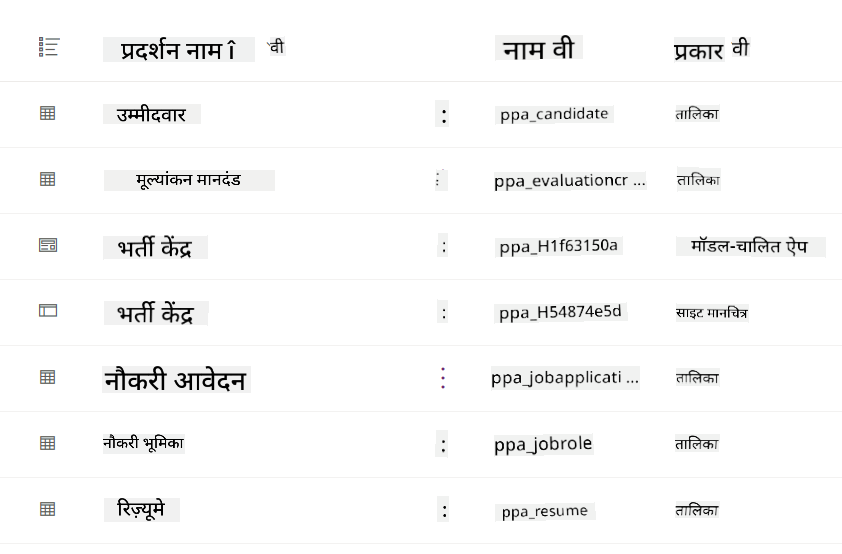
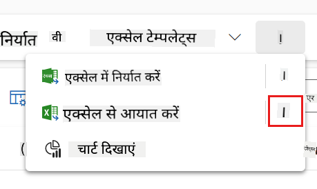
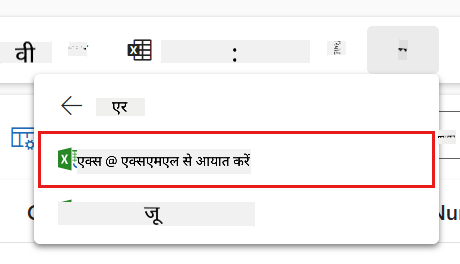
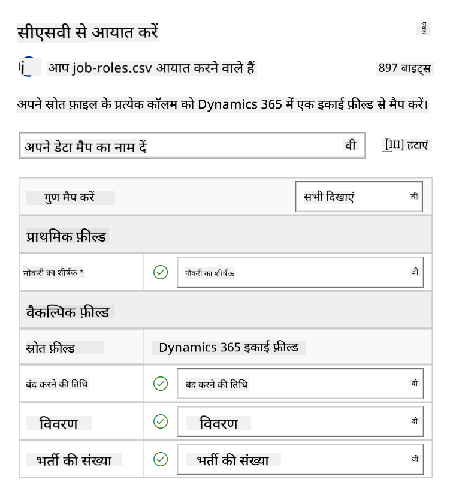
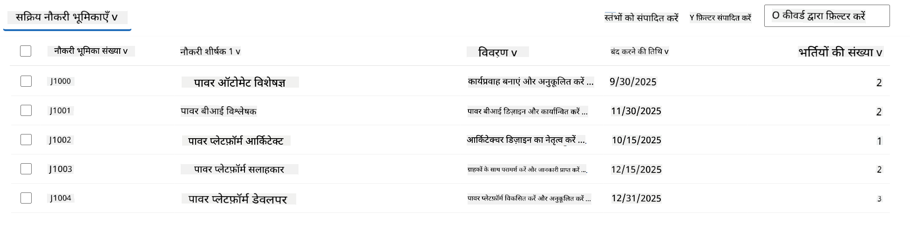

<!--
CO_OP_TRANSLATOR_METADATA:
{
  "original_hash": "2620cf9eaf09a3fc6be7fa31a3a62956",
  "translation_date": "2025-10-21T18:04:52+00:00",
  "source_file": "docs/operative-preview/01-get-started/README.md",
  "language_code": "hi"
}
-->
# 🚨 मिशन 01: हायरिंग एजेंट के साथ शुरुआत करें

--8<-- "disclaimer.md"

## 🕵️‍♂️ कोडनेम: `ऑपरेशन टैलेंट स्काउट`

> **⏱️ ऑपरेशन का समय:** `~45 मिनट`

## 🎯 मिशन विवरण

स्वागत है, एजेंट। आपका पहला असाइनमेंट है **ऑपरेशन टैलेंट स्काउट** - एक AI-संचालित भर्ती प्रणाली के लिए बुनियादी ढांचा स्थापित करना जो संगठनों को शीर्ष प्रतिभा की पहचान और भर्ती करने के तरीके को बदल देगा।

आपका मिशन, यदि आप इसे स्वीकार करते हैं, तो Microsoft Copilot Studio का उपयोग करके एक व्यापक हायरिंग प्रबंधन प्रणाली को तैनात और कॉन्फ़िगर करना है। आप सभी आवश्यक डेटा संरचनाओं के साथ एक पूर्व-निर्मित समाधान आयात करेंगे, फिर अपना पहला AI एजेंट बनाएंगे - **हायरिंग एजेंट** - जो भविष्य की सभी भर्ती प्रक्रियाओं के लिए केंद्रीय समन्वयक के रूप में काम करेगा।

यह प्रारंभिक तैनाती कमांड सेंटर स्थापित करती है जिसे आप एजेंट अकादमी ऑपरेटिव प्रोग्राम के दौरान बढ़ाएंगे। इसे अपनी संचालन आधार मानें - वह नींव जिस पर आप अगले मिशनों में विशेषज्ञ एजेंटों का पूरा नेटवर्क बनाएंगे।

---

## 🔎 उद्देश्य

इस मिशन को पूरा करके, आप:

- **परिदृश्य समझना**: हायरिंग ऑटोमेशन की चुनौतियों और समाधानों का व्यापक ज्ञान प्राप्त करेंगे  
- **समाधान तैनाती**: हायरिंग प्रबंधन प्रणाली की बुनियादी बातों को सफलतापूर्वक आयात और कॉन्फ़िगर करेंगे  
- **एजेंट निर्माण**: एक हायरिंग एजेंट बनाएंगे जो उस परिदृश्य की शुरुआत है जिसे आप एजेंट अकादमी ऑपरेटिव के रूप में बनाएंगे  

---

## 🔍 आवश्यकताएँ

इस मिशन को शुरू करने से पहले सुनिश्चित करें कि आपके पास:

- Copilot Studio लाइसेंस  
- Microsoft Power Platform वातावरण तक पहुंच  
- समाधान और एजेंट बनाने के लिए प्रशासनिक अनुमति  

---

## 🏢 हायरिंग ऑटोमेशन परिदृश्य को समझना

यह परिदृश्य दिखाता है कि कैसे एक कंपनी Microsoft Copilot Studio का उपयोग करके अपनी भर्ती प्रक्रिया को सुधार और स्वचालित कर सकती है। यह एजेंटों की एक प्रणाली को पेश करता है जो रिज्यूमे की समीक्षा, नौकरी भूमिकाओं की सिफारिश, इंटरव्यू सामग्री तैयार करने और उम्मीदवारों का मूल्यांकन करने जैसे कार्यों को संभालते हैं।

### व्यावसायिक मूल्य

यह समाधान HR टीमों को समय बचाने और बेहतर निर्णय लेने में मदद करता है:

- ईमेल के माध्यम से प्राप्त रिज्यूमे को स्वचालित रूप से प्रोसेस करना।  
- उम्मीदवार प्रोफाइल के आधार पर उपयुक्त नौकरी भूमिकाओं का सुझाव देना।  
- प्रत्येक उम्मीदवार के लिए अनुकूलित नौकरी आवेदन और इंटरव्यू गाइड बनाना।  
- अंतर्निहित सुरक्षा और मॉडरेशन सुविधाओं के माध्यम से निष्पक्ष और अनुपालन भर्ती प्रथाओं को सुनिश्चित करना।  
- समाधान को बेहतर बनाने के लिए फीडबैक एकत्र करना।  

### यह कैसे काम करता है

- एक केंद्रीय **हायरिंग एजेंट** प्रक्रिया का समन्वय करता है और Microsoft Dataverse में डेटा संग्रहीत करता है।  
- एक **एप्लिकेशन इनटेक एजेंट** रिज्यूमे पढ़ता है और नौकरी आवेदन बनाता है।  
- एक **इंटरव्यू प्रेप एजेंट** उम्मीदवार की पृष्ठभूमि के आधार पर इंटरव्यू प्रश्न और दस्तावेज़ तैयार करता है।  
- सिस्टम को एक डेमो वेबसाइट पर प्रकाशित किया जा सकता है, जिससे हितधारक इसके साथ इंटरैक्ट कर सकते हैं।  

यह परिदृश्य उन संगठनों के लिए आदर्श है जो AI-संचालित ऑटोमेशन का उपयोग करके अपनी भर्ती वर्कफ़्लो को आधुनिक बनाना चाहते हैं, जबकि पारदर्शिता, निष्पक्षता और दक्षता बनाए रखते हैं।

---

## 🧪 लैब: हायरिंग एजेंट सेटअप करें

इस हैंड्स-ऑन लैब में, आप अपनी हायरिंग ऑटोमेशन प्रणाली की नींव स्थापित करेंगे। आप एक पूर्व-कॉन्फ़िगर समाधान आयात करके शुरू करेंगे जिसमें उम्मीदवारों, नौकरी पदों और हायरिंग वर्कफ़्लो को प्रबंधित करने के लिए सभी आवश्यक Dataverse टेबल और डेटा संरचना शामिल हैं। इसके बाद, आप इन टेबल्स को नमूना डेटा से भरेंगे जो इस मॉड्यूल के दौरान आपके सीखने का समर्थन करेगा और परीक्षण के लिए यथार्थवादी परिदृश्य प्रदान करेगा। अंत में, आप Copilot Studio में हायरिंग एजेंट बनाएंगे, एक बुनियादी संवादात्मक इंटरफ़ेस सेट करेंगे जो भविष्य के मिशनों में जोड़े जाने वाले सभी अन्य फीचर्स का आधार होगा।

### 🧪 लैब 1.1: समाधान आयात करें

1. **[Copilot Studio](https://copilotstudio.microsoft.com)** पर जाएं  
1. बाईं नेविगेशन में **...** चुनें और **Solutions** चुनें  
1. शीर्ष पर **Import Solution** बटन चुनें  
1. **[डाउनलोड करें](https://raw.githubusercontent.com/microsoft/agent-academy/refs/heads/main/docs/operative-preview/01-get-started/assets/Operative_1_0_0_0.zip)** तैयार समाधान  
1. **Browse** चुनें और पिछले चरण से डाउनलोड किए गए समाधान का चयन करें  
1. **Next** चुनें  
1. **Import** चुनें  

!!! success
    सफल होने पर, आपको एक हरे रंग की सूचना बार दिखाई देगा जिसमें निम्न संदेश होगा:  
    "Solution "Operative" imported successfully."

जब समाधान आयात हो जाए, तो आयात किए गए समाधान का प्रदर्शन नाम (`Operative`) चुनकर देखें।

निम्नलिखित घटक आयात किए गए हैं:

| प्रदर्शन नाम | प्रकार | विवरण |
|-------------|------|-------------|
| Candidate | Table | उम्मीदवार की जानकारी |
| Evaluation Criteria | Table | भूमिका के लिए मूल्यांकन मानदंड |
| Hiring Hub | Model-Driven App | हायरिंग प्रक्रिया प्रबंधन के लिए एप्लिकेशन |
| Hiring Hub | Site Map | Hiring Hub ऐप के लिए नेविगेशन संरचना |
| Job Application | Table | नौकरी आवेदन |
| Job Role | Table | नौकरी भूमिकाएँ |
| Resume | Table | उम्मीदवारों के रिज्यूमे |

इस लैब के अंतिम कार्य के रूप में, पृष्ठ के शीर्ष पर **Publish all customizations** बटन चुनें।

### 🧪 लैब 1.2: नमूना डेटा आयात करें

इस लैब में, आप उन टेबल्स में नमूना डेटा जोड़ेंगे जिन्हें आपने लैब 1.1 में आयात किया था।

#### आयात करने के लिए फाइलें डाउनलोड करें

1. **[डाउनलोड करें](https://raw.githubusercontent.com/microsoft/agent-academy/refs/heads/main/docs/operative-preview/01-get-started/assets/evaluation-criteria.csv)** मूल्यांकन मानदंड के साथ CSV फाइल  
1. **[डाउनलोड करें](https://raw.githubusercontent.com/microsoft/agent-academy/refs/heads/main/docs/operative-preview/01-get-started/assets/job-roles.csv)** नौकरी भूमिकाओं के साथ CSV फाइल  

#### नौकरी भूमिका नमूना डेटा आयात करें

1. उस समाधान पर वापस जाएं जिसे आपने पिछले लैब में आयात किया था  
1. **Hiring Hub** Model-Driven App चुनें, पंक्ति के सामने चेकमार्क चुनकर  
1. शीर्ष पर **Play** बटन चुनें  

    !!! warning
        आपको फिर से लॉगिन करने के लिए कहा जा सकता है। सुनिश्चित करें कि आप ऐसा करें। ऐसा करने के बाद, आपको Hiring Hub ऐप दिखाई देना चाहिए।

1. बाईं नेविगेशन में **Job Roles** चुनें  
1. कमांड बार में **More** आइकन (तीन बिंदु एक के नीचे एक) चुनें  
1. *Import from Excel* के बगल में **दायां तीर** चुनें  

    

1. **Import from CSV** चुनें  

    

1. **Choose File** बटन चुनें, **job-roles.csv** फाइल चुनें जिसे आपने अभी डाउनलोड किया है और फिर **Open** चुनें  
1. **Next** चुनें  
1. अगले चरण को जैसा है वैसा छोड़ें और **Review Mapping** चुनें  

    

1. सुनिश्चित करें कि मैपिंग सही है और **Finish Import** चुनें  

    !!! info
        यह एक आयात शुरू करेगा और आप प्रगति को ट्रैक कर सकते हैं या प्रक्रिया को तुरंत समाप्त कर सकते हैं **Done** चुनकर।

1. **Done** चुनें  

यह थोड़ा समय ले सकता है, लेकिन आप **Refresh** बटन दबाकर देख सकते हैं कि आयात सफल हुआ है या नहीं।

#### मूल्यांकन मानदंड नमूना डेटा आयात करें

1. बाईं नेविगेशन में **Evaluation Criteria** चुनें  
1. कमांड बार में **More** आइकन (तीन बिंदु एक के नीचे एक) चुनें  
1. *Import from Excel* के बगल में **दायां तीर** चुनें  

     का उपयोग करके अनुवादित किया गया है। जबकि हम सटीकता के लिए प्रयास करते हैं, कृपया ध्यान दें कि स्वचालित अनुवाद में त्रुटियां या अशुद्धियां हो सकती हैं। मूल भाषा में दस्तावेज़ को आधिकारिक स्रोत माना जाना चाहिए। महत्वपूर्ण जानकारी के लिए, पेशेवर मानव अनुवाद की सिफारिश की जाती है। इस अनुवाद के उपयोग से उत्पन्न किसी भी गलतफहमी या गलत व्याख्या के लिए हम उत्तरदायी नहीं हैं।