<!--
CO_OP_TRANSLATOR_METADATA:
{
  "original_hash": "4fb913dfc3bbc71506dd3602c4b8e6ed",
  "translation_date": "2025-10-21T17:43:25+00:00",
  "source_file": "docs/operative-preview/02-multi-agent/README.md",
  "language_code": "hi"
}
-->
# 🚨 मिशन 02: जुड़े हुए एजेंट्स

--8<-- "disclaimer.md"

## 🕵️‍♂️ कोडनेम: `ऑपरेशन सिम्फनी`

> **⏱️ ऑपरेशन का समय:** `~45 मिनट`

## 🎯 मिशन का विवरण

वापस स्वागत है, एजेंट। मिशन 01 में, आपने अपना मुख्य हायरिंग एजेंट बनाया - भर्ती वर्कफ्लो को प्रबंधित करने के लिए एक मजबूत आधार। लेकिन एक एजेंट केवल इतना ही कर सकता है।

आपका असाइनमेंट, यदि आप इसे स्वीकार करते हैं, **ऑपरेशन सिम्फनी** है - आपके एकल एजेंट को **मल्टी-एजेंट सिस्टम** में बदलना: विशेष एजेंट्स की एक टीम जो मिलकर जटिल भर्ती चुनौतियों को संभालती है। इसे एक सोलो ऑपरेटर से एक विशेष टास्क फोर्स का नेतृत्व करने में अपग्रेड करने के रूप में सोचें।

जैसे एक सिम्फनी ऑर्केस्ट्रा में हर संगीतकार अपनी भूमिका को पूर्ण सामंजस्य में निभाता है, आप अपने मौजूदा हायरिंग एजेंट में दो महत्वपूर्ण विशेषज्ञ जोड़ेंगे: एक एप्लिकेशन इनटेक एजेंट जो स्वचालित रूप से रिज्यूमे प्रोसेस करता है, और एक इंटरव्यू प्रेप एजेंट जो व्यापक इंटरव्यू सामग्री तैयार करता है। ये एजेंट्स आपके मुख्य ऑर्केस्ट्रेटर के तहत सहजता से काम करेंगे।

## 🔎 उद्देश्य

इस मिशन में, आप सीखेंगे:

1. **चाइल्ड एजेंट्स** और **कनेक्टेड एजेंट्स** का उपयोग कब करना है  
1. **मल्टी-एजेंट आर्किटेक्चर** डिज़ाइन करना जो स्केल हो सके  
1. केंद्रित कार्यों के लिए **चाइल्ड एजेंट्स** बनाना  
1. एजेंट्स के बीच **संचार पैटर्न** स्थापित करना  
1. एप्लिकेशन इनटेक एजेंट और इंटरव्यू प्रेप एजेंट बनाना  

## 🧠 जुड़े हुए एजेंट्स क्या हैं?

Copilot Studio में, आप केवल एकल, मोनोलिथिक एजेंट्स बनाने तक सीमित नहीं हैं। आप **मल्टी-एजेंट सिस्टम्स** बना सकते हैं - विशेष एजेंट्स के नेटवर्क जो मिलकर जटिल वर्कफ्लो को संभालते हैं।

इसे वास्तविक दुनिया के संगठन की तरह सोचें: एक व्यक्ति के बजाय, आपके पास विशेषज्ञ होते हैं जो विशिष्ट कार्यों में उत्कृष्टता प्राप्त करते हैं और जब आवश्यक हो तो सहयोग करते हैं।

### मल्टी-एजेंट सिस्टम्स क्यों महत्वपूर्ण हैं

- **स्केलेबिलिटी:** प्रत्येक एजेंट को अलग-अलग टीमों द्वारा स्वतंत्र रूप से विकसित, परीक्षण और बनाए रखा जा सकता है।  
- **विशेषज्ञता:** एजेंट्स अपने सर्वश्रेष्ठ कार्य पर ध्यान केंद्रित कर सकते हैं। जैसे डेटा प्रोसेसिंग, उपयोगकर्ता इंटरैक्शन, निर्णय लेना।  
- **लचीलापन:** आप एजेंट्स को मिलाकर उपयोग कर सकते हैं, उन्हें विभिन्न प्रोजेक्ट्स में पुनः उपयोग कर सकते हैं, और अपने सिस्टम को धीरे-धीरे विकसित कर सकते हैं।  
- **रखरखाव:** एक एजेंट में बदलाव जरूरी नहीं कि अन्य एजेंट्स को प्रभावित करें, जिससे अपडेट सुरक्षित और आसान हो जाते हैं।  

### वास्तविक दुनिया का उदाहरण: भर्ती प्रक्रिया

हमारी भर्ती वर्कफ्लो पर विचार करें - कई एजेंट्स निम्नलिखित जिम्मेदारियों के साथ मिलकर काम कर सकते हैं:

- **रिज्यूमे इनटेक** में दस्तावेज़ पार्सिंग और डेटा एक्सट्रैक्शन कौशल की आवश्यकता होती है  
- **स्कोरिंग** में उम्मीदवारों के रिज्यूमे का मूल्यांकन और उन्हें नौकरी की आवश्यकताओं से मिलाना शामिल है  
- **इंटरव्यू तैयारी** में उम्मीदवार की फिटनेस के बारे में गहन तर्क की आवश्यकता होती है  
- **उम्मीदवार संचार** में सहानुभूतिपूर्ण संचार क्षमताओं की आवश्यकता होती है  

एक बड़े एजेंट को बनाने के बजाय जो इन सभी विभिन्न कौशलों को संभालने की कोशिश करता है, आप प्रत्येक क्षेत्र के लिए विशेष एजेंट्स बना सकते हैं और उन्हें एक साथ ऑर्केस्ट्रेट कर सकते हैं।

## 🔗 चाइल्ड एजेंट्स बनाम जुड़े हुए एजेंट्स: मुख्य अंतर

Copilot Studio मल्टी-एजेंट सिस्टम्स बनाने के दो तरीके प्रदान करता है, प्रत्येक के अलग-अलग उपयोग के मामले हैं:

### ↘️ चाइल्ड एजेंट्स

चाइल्ड एजेंट्स **हल्के विशेषज्ञ** होते हैं जो आपके मुख्य एजेंट के भीतर रहते हैं। इन्हें एक ही विभाग के भीतर विशेष टीमों के रूप में सोचें।

#### मुख्य तकनीकी विवरण

- चाइल्ड एजेंट्स मुख्य एजेंट के भीतर रहते हैं और उनके पास एक ही कॉन्फ़िगरेशन पेज होता है।  
- टूल्स और नॉलेज **मुख्य एजेंट में संग्रहीत** होते हैं, लेकिन चाइल्ड एजेंट के लिए "उपलब्ध" के रूप में कॉन्फ़िगर किए जाते हैं।  
- चाइल्ड एजेंट्स **अपने मुख्य एजेंट के टॉपिक्स साझा करते हैं**। टॉपिक्स को चाइल्ड एजेंट निर्देशों द्वारा संदर्भित किया जा सकता है।  
- चाइल्ड एजेंट्स को **अलग से प्रकाशित करने की आवश्यकता नहीं होती** - वे अपने मुख्य एजेंट के भीतर स्वचालित रूप से उपलब्ध होते हैं। इससे परीक्षण आसान हो जाता है क्योंकि मुख्य और चाइल्ड एजेंट्स में बदलाव **एक ही साझा कार्यक्षेत्र** में किए जा सकते हैं।  

#### चाइल्ड एजेंट्स का उपयोग करें जब:

- एक ही टीम पूरे समाधान का प्रबंधन करती है  
- आप टूल्स और नॉलेज को उप-एजेंट्स में तार्किक रूप से व्यवस्थित करना चाहते हैं  
- प्रत्येक एजेंट के लिए अलग-अलग प्रमाणीकरण या तैनाती की आवश्यकता नहीं है  
- एजेंट्स को अलग से प्रकाशित या स्वतंत्र रूप से उपयोग नहीं किया जाएगा  
- आपको कई समाधानों में एजेंट्स को पुनः उपयोग करने की आवश्यकता नहीं है  

**उदाहरण:** एक आईटी हेल्पडेस्क एजेंट जिसमें चाइल्ड एजेंट्स हों:

- पासवर्ड रीसेट प्रक्रियाओं के लिए  
- हार्डवेयर समस्या निवारण के लिए  
- सॉफ़्टवेयर इंस्टॉलेशन गाइड्स के लिए  

### 🔀 जुड़े हुए एजेंट्स

जुड़े हुए एजेंट्स **पूर्ण विकसित, स्वतंत्र एजेंट्स** होते हैं जिनके साथ आपका मुख्य एजेंट सहयोग कर सकता है। इन्हें एक प्रोजेक्ट पर काम करने वाले अलग-अलग विभागों के रूप में सोचें।

#### मुख्य तकनीकी विवरण

- जुड़े हुए एजेंट्स के पास **अपने स्वयं के टॉपिक्स** और बातचीत प्रवाह होते हैं। वे अपने स्वयं के सेटिंग्स, लॉजिक और तैनाती जीवनचक्र के साथ स्वतंत्र रूप से काम करते हैं।  
- जुड़े हुए एजेंट्स को **प्रकाशित किया जाना चाहिए** इससे पहले कि उन्हें अन्य एजेंट्स द्वारा जोड़ा और उपयोग किया जा सके।  
- परीक्षण के दौरान, जुड़े हुए एजेंट में किए गए बदलावों को प्रकाशित करना आवश्यक होता है इससे पहले कि उन्हें कॉलिंग एजेंट द्वारा उपयोग किया जा सके।  

#### जुड़े हुए एजेंट्स का उपयोग करें जब:

- विभिन्न टीम्स अलग-अलग एजेंट्स को स्वतंत्र रूप से विकसित और बनाए रखती हैं  
- एजेंट्स को अपने स्वयं के सेटिंग्स, प्रमाणीकरण और तैनाती चैनल्स की आवश्यकता होती है  
- आप एजेंट्स को अलग से प्रकाशित और बनाए रखना चाहते हैं, प्रत्येक एजेंट के लिए स्वतंत्र एप्लिकेशन जीवनचक्र प्रबंधन (ALM) के साथ  
- एजेंट्स को कई समाधानों में पुनः उपयोग किया जाना चाहिए  

**उदाहरण:** एक ग्राहक सेवा प्रणाली जो जुड़ती है:

- एक अलग बिलिंग एजेंट जो वित्त टीम द्वारा बनाए रखा जाता है  
- एक अलग तकनीकी सहायता एजेंट जो उत्पाद टीम द्वारा बनाए रखा जाता है  
- एक अलग रिटर्न्स एजेंट जो संचालन टीम द्वारा बनाए रखा जाता है  

!!! tip "टिप"
    आप दोनों दृष्टिकोणों को मिला सकते हैं! उदाहरण के लिए, आपका मुख्य एजेंट अन्य टीम्स के बाहरी एजेंट्स से जुड़ सकता है जबकि इसके अपने चाइल्ड एजेंट्स विशेष आंतरिक कार्यों के लिए हो सकते हैं।

## 🎯 मल्टी-एजेंट आर्किटेक्चर पैटर्न्स

मल्टी-एजेंट सिस्टम्स डिज़ाइन करते समय, एजेंट्स के इंटरैक्शन के आधार पर कई पैटर्न उभरते हैं:

| पैटर्न              | विवरण                                                                 | सर्वश्रेष्ठ उपयोग के लिए                                                      |
|----------------------|-----------------------------------------------------------------------------|---------------------------------------------------------------|
| **हब और स्पोक**    | एक मुख्य ऑर्केस्ट्रेटर एजेंट कई विशेष एजेंट्स के साथ समन्वय करता है। ऑर्केस्ट्रेटर उपयोगकर्ता इंटरैक्शन को संभालता है और कार्यों को चाइल्ड या जुड़े हुए एजेंट्स को सौंपता है। | जटिल वर्कफ्लो जहां एक एजेंट विशेष कार्यों का समन्वय करता है |
| **पाइपलाइन**         | एजेंट्स काम को एक के बाद एक पास करते हैं, प्रत्येक चरण में मूल्य जोड़ते हुए। | रैखिक प्रक्रियाएं जैसे एप्लिकेशन प्रोसेसिंग (इनटेक → स्क्रीनिंग → इंटरव्यू → निर्णय) |
| **सहयोगात्मक**    | एजेंट्स एक ही समस्या के विभिन्न पहलुओं पर एक साथ काम करते हैं, संदर्भ और परिणाम साझा करते हैं। | जटिल विश्लेषण जिसमें कई दृष्टिकोण या विशेषज्ञता क्षेत्रों की आवश्यकता होती है |

!!! tip "टिप"
    आपके पास इन पैटर्न्स का मिश्रण भी हो सकता है।

## 💬 एजेंट संचार और संदर्भ साझा करना

जब एजेंट्स एक साथ काम करते हैं, तो उन्हें प्रभावी ढंग से जानकारी साझा करने की आवश्यकता होती है। Copilot Studio में यह इस प्रकार काम करता है:

### बातचीत का इतिहास

डिफ़ॉल्ट रूप से, जब एक मुख्य एजेंट किसी चाइल्ड या जुड़े हुए एजेंट को कॉल करता है, तो वह **बातचीत का इतिहास** पास कर सकता है। यह विशेषज्ञ एजेंट को पूरा संदर्भ देता है कि उपयोगकर्ता किस बारे में चर्चा कर रहा है।

आप इसे सुरक्षा या प्रदर्शन कारणों से अक्षम कर सकते हैं - उदाहरण के लिए, यदि विशेषज्ञ एजेंट को केवल एक विशिष्ट कार्य पूरा करना है और उसे पूरी बातचीत का संदर्भ नहीं चाहिए। यह **डेटा लीक** के खिलाफ एक अच्छा बचाव हो सकता है।

### स्पष्ट निर्देश

आपका मुख्य एजेंट चाइल्ड या जुड़े हुए एजेंट्स को **विशिष्ट निर्देश** दे सकता है। उदाहरण: "इस रिज्यूमे को प्रोसेस करें और उनके कौशल को सीनियर डेवलपर भूमिका के लिए सारांशित करें।"

### रिटर्न वैल्यूज़

एजेंट्स संरचित जानकारी वापस कॉलिंग एजेंट को दे सकते हैं, जिससे मुख्य एजेंट उस जानकारी का उपयोग अगले चरणों में कर सके या अन्य एजेंट्स के साथ साझा कर सके।

### Dataverse इंटीग्रेशन

अधिक जटिल परिदृश्यों के लिए, एजेंट्स **Dataverse** या अन्य डेटा स्टोर्स के माध्यम से जानकारी साझा कर सकते हैं, जिससे कई इंटरैक्शन के दौरान स्थायी संदर्भ साझा करना संभव हो जाता है।

## ↘️ चाइल्ड एजेंट: एप्लिकेशन इनटेक एजेंट

आइए हमारी मल्टी-एजेंट हायरिंग प्रणाली बनाना शुरू करें। हमारा पहला विशेषज्ञ होगा **एप्लिकेशन इनटेक एजेंट** - एक चाइल्ड एजेंट जो आने वाले रिज्यूमे और उम्मीदवार की जानकारी को प्रोसेस करने के लिए जिम्मेदार है।

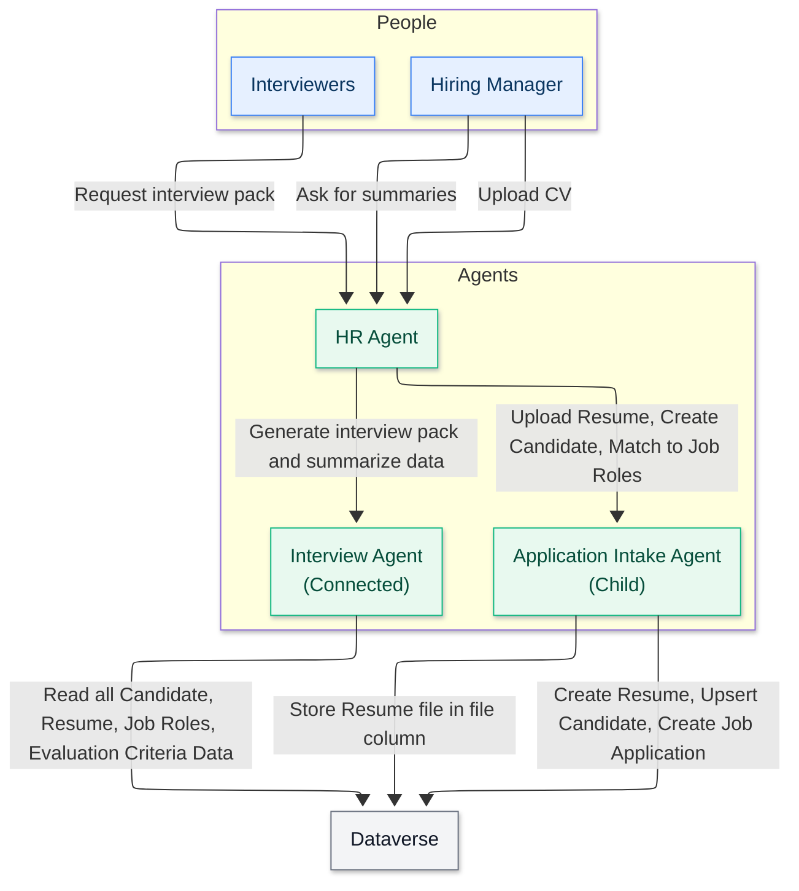
```mermaid
---
config:
  layout: elk
  look: neo
---
flowchart TB
 subgraph People["People"]
    direction TB
        HiringManager["Hiring Manager"]
        Interviewers["Interviewers"]
  end
 subgraph Agents["Agents"]
    direction LR
        ApplicationIntakeAgent["Application Intake Agent<br>(Child)"]
        InterviewAgent["Interview Agent<br>(Connected)"]
        HRAgent["HR Agent"]
  end
    HiringManager -- Upload CV --> HRAgent
    HRAgent -- Upload Resume, Create Candidate, Match to Job Roles --> ApplicationIntakeAgent
    ApplicationIntakeAgent -- Create Resume, Upsert Candidate, Create Job Application --> Dataverse["Dataverse"]
    ApplicationIntakeAgent -- Store Resume file in file column --> Dataverse
    HiringManager -- Ask for summaries --> HRAgent
    Interviewers -- Request interview pack --> HRAgent
    HRAgent -- Generate interview pack and summarize data --> InterviewAgent
    InterviewAgent -- Read all Candidate, Resume, Job Roles, Evaluation Criteria Data --> Dataverse
     HiringManager:::person
     Interviewers:::person
     ApplicationIntakeAgent:::agent
     InterviewAgent:::agent
     HRAgent:::agent
     Dataverse:::data
    classDef person fill:#e6f0ff,stroke:#3b82f6,color:#0b3660
    classDef agent fill:#e8f9ef,stroke:#10b981,color:#064e3b
    classDef data  fill:#f3f4f6,stroke:#6b7280,color:#111827
```

### 🤝 एप्लिकेशन इनटेक एजेंट की जिम्मेदारियां

- **रिज्यूमे सामग्री को पार्स करें** जो इंटरैक्टिव चैट के माध्यम से प्रदान किए गए PDF से हो (भविष्य के मिशन में आप सीखेंगे कि रिज्यूमे को स्वायत्त रूप से कैसे प्रोसेस करें)।  
- **संरचित डेटा निकालें** (नाम, कौशल, अनुभव, शिक्षा)  
- **उम्मीदवारों को खुले पदों से मिलाएं** योग्यता और कवर लेटर के आधार पर  
- **उम्मीदवार की जानकारी को Dataverse में संग्रहीत करें** बाद में प्रोसेसिंग के लिए  
- **आवेदन को डुप्लिकेट होने से बचाएं** एक ही उम्मीदवार को दो बार बनाने से बचने के लिए, ईमेल पते का उपयोग करके मौजूदा रिकॉर्ड्स से मिलाएं।  

### ⭐ यह चाइल्ड एजेंट क्यों होना चाहिए

एप्लिकेशन इनटेक एजेंट चाइल्ड एजेंट के रूप में पूरी तरह फिट बैठता है क्योंकि:

- यह दस्तावेज़ प्रोसेसिंग और डेटा एक्सट्रैक्शन के लिए विशेष है  
- इसे अलग से प्रकाशित करने की आवश्यकता नहीं है  
- यह हमारी समग्र हायरिंग समाधान का हिस्सा है जिसे एक ही टीम द्वारा प्रबंधित किया जाता है  
- यह एक विशिष्ट ट्रिगर (नया रिज्यूमे प्राप्त हुआ) पर केंद्रित है और हायरिंग एजेंट से बुलाया जाता है।  

## 🔀 जुड़े हुए एजेंट: इंटरव्यू प्रेप एजेंट  

हमारा दूसरा विशेषज्ञ होगा **इंटरव्यू प्रेप एजेंट** - एक जुड़ा हुआ एजेंट जो व्यापक इंटरव्यू सामग्री तैयार करने और उम्मीदवार की प्रतिक्रियाओं का मूल्यांकन करने में मदद करता है।

### 🤝 इंटरव्यू प्रेप एजेंट की जिम्मेदारियां

- **इंटरव्यू पैक तैयार करें** जिसमें कंपनी की जानकारी, भूमिका की आवश्यकताएं, और मूल्यांकन मानदंड शामिल हों  
- **इंटरव्यू प्रश्न तैयार करें** जो विशिष्ट भूमिकाओं और उम्मीदवार की पृष्ठभूमि के लिए अनुकूलित हों  
- **सामान्य प्रश्नों का उत्तर दें** नौकरी की भूमिकाओं और आवेदन के बारे में हितधारकों के साथ संचार के लिए  

### ⭐ यह जुड़ा हुआ एजेंट क्यों होना चाहिए

इंटरव्यू प्रेप एजेंट जुड़ा हुआ एजेंट के रूप में बेहतर काम करता है क्योंकि:

- टैलेंट एक्विजिशन टीम इसे कई हायरिंग प्रक्रियाओं में स्वतंत्र रूप से उपयोग करना चाह सकती है  
- इसे इंटरव्यू की सर्वोत्तम प्रथाओं और मूल्यांकन मानदंडों के अपने ज्ञान आधार की आवश्यकता है  
- विभिन्न हायरिंग मैनेजर्स इसे अपनी टीमों के लिए अनुकूलित करना चाह सकते हैं  
- इसे आंतरिक पदों के लिए भी पुनः उपयोग किया जा सकता है, न कि केवल बाहरी हायरिंग के लिए  

## 🧪 लैब 2.1: एप्लिकेशन इनटेक एजेंट जोड़ना

सिद्धांत को व्यवहार में लाने के लिए तैयार हैं? आइए आपके मौजूदा हायरिंग एजेंट में हमारा पहला चाइल्ड एजेंट जोड़ें।

### इस मिशन को पूरा करने के लिए आवश्यक शर्तें

आपको **या तो**:

- **मिशन 01 पूरा करना होगा** और आपका हायरिंग एजेंट तैयार होना चाहिए, **या**  
- **मिशन 02 स्टार्टर समाधान आयात करना होगा** यदि आप नए सिरे से शुरू कर रहे हैं या पकड़ने की आवश्यकता है। [मिशन 02 स्टार्टर समाधान डाउनलोड करें](https://aka.ms/agent-academy)

!!! note "समाधान आयात और नमूना डेटा"
    यदि आप स्टार्टर समाधान का उपयोग कर रहे हैं, तो [मिशन 01](../01-get-started/README.md) में दिए गए निर्देशों का पालन करें कि अपने वातावरण में समाधान और नमूना डेटा कैसे आयात करें।

### 2.1.1 समाधान सेटअप

1. Copilot Studio के अंदर, बाईं ओर नेविगेशन में टूल्स के नीचे तीन बिंदु (...) चुनें।  
1. **Solutions** चुनें।  
    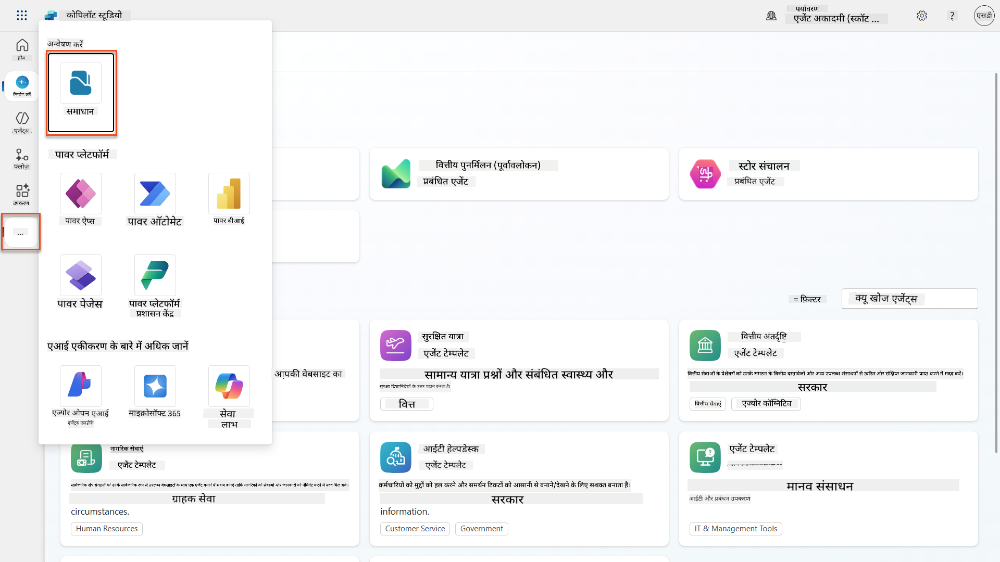  
1. अपने Operative समाधान को ढूंढें, उसके बगल में **तीन बिंदु (...)** चुनें, और **Set preferred solution** चुनें। यह सुनिश्चित करेगा कि आपका सारा काम इस समाधान में जोड़ा जाएगा।  
    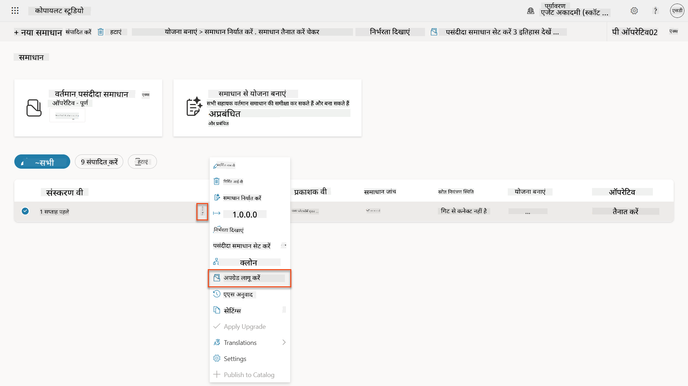  

### 2.1.2 अपने हायरिंग एजेंट के निर्देश कॉन्फ़िगर करें

1. **Copilot Studio पर जाएं।** सुनिश्चित करें कि आपका वातावरण शीर्ष दाईं ओर **Environment Picker** में चुना गया है।  

1. अपने **हायरिंग एजेंट** को मिशन 01 से खोलें।  

1. **Overview** टैब के **Instructions** सेक्शन में **Edit** चुनें और निम्नलिखित निर्देशों को शीर्ष पर जोड़ें:

    ```text
    You are the central orchestrator for the hiring process. You coordinate activities, provide summaries, and delegate work to specialized agents.
    ```

1. **Save** चुनें।  
    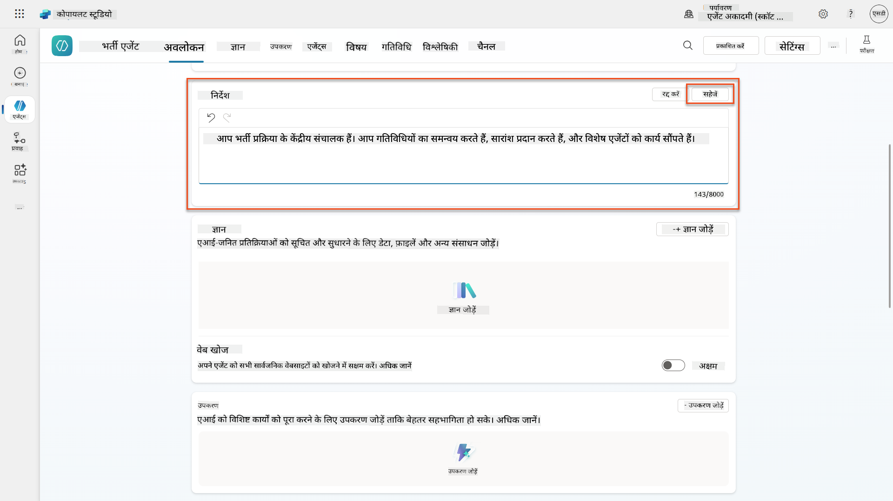  

1. **Settings** (शीर्ष दाईं ओर) चुनें।  

1. निम्नलिखित सेटिंग्स सुनिश्चित करें:

    | सेटिंग | मान |
    |---------|-------|
    | अपने एजेंट की प्रतिक्रियाओं के लिए जनरेटिव एआई ऑर्केस्ट्रेशन का उपयोग करें | **Yes** |
    | सामग्री मॉडरेशन | **Moderate** |
    | सामान्य ज्ञान का उपयोग करें | **Off** |
    | वेब से जानकारी का उपयोग करें | **Off** |
    | फ़ाइल अपलोड | **On** |

  
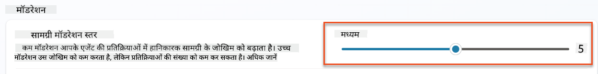  
  

### 2.1.3 एप्लिकेशन इनटेक चाइल्ड एजेंट जोड़ें

1. **Agents** टैब पर जाएं अपने हायरिंग एजेंट के भीतर - यहीं आप विशेषज्ञ एजेंट्स जोड़ेंगे।  

1. **+ Add** चुनें और फिर **Create an agent** चुनें। ध्यान दें कि इसे "*Create a lightweight agent that lives inside your current agent and inherits its settings. Ideal for breaking down complex logic*" के रूप में लेबल किया गया है।  
    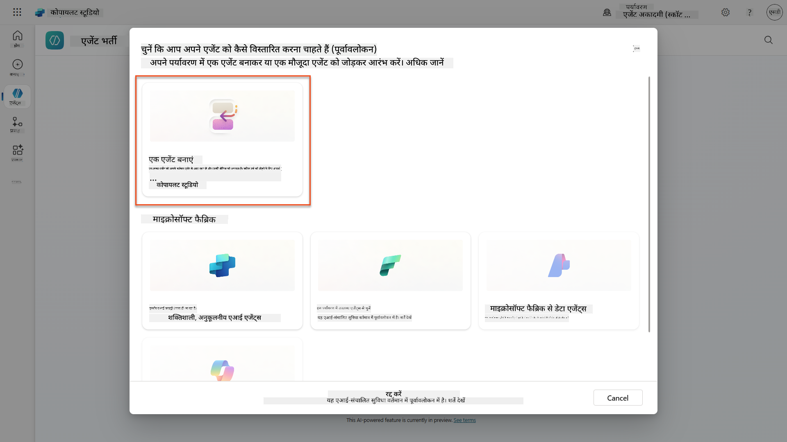  

1. अपने एजेंट का **नाम** `Application Intake Agent` रखें।  

1. **The agent chooses** चुनें - **When will this be used?** ड्रॉपडाउन में विवरण के आधार पर। ये विकल्प टॉपिक्स के लिए कॉन्फ़िगर किए जा सकने वाले ट्रिगर्स के समान हैं।  

1. **Description** को निम्नलिखित में सेट करें:

@@CODE_BLOCK
हम **Agent Flow tools** का उपयोग कर रहे हैं बजाय Topics के *Upload Resume* चरण के लिए क्योंकि यह बहु-चरण बैकएंड प्रक्रिया निश्चित निष्पादन और बाहरी सिस्टम के साथ एकीकरण की आवश्यकता रखती है। जबकि Topics संवादात्मक वार्तालाप को मार्गदर्शन देने के लिए सबसे अच्छे हैं, Agent Flows संरचित स्वचालन प्रदान करते हैं जो फ़ाइल प्रसंस्करण, डेटा सत्यापन, और डेटाबेस अपसर्ट्स (नए जोड़ें या मौजूदा अपडेट करें) को विश्वसनीय रूप से संभालने के लिए आवश्यक है, बिना उपयोगकर्ता इंटरैक्शन पर निर्भर हुए।

1. **Application Intake Agent** पेज के अंदर **Tools** सेक्शन को ढूंढें।  
   **महत्वपूर्ण:** यह पैरेंट एजेंट का Tools टैब नहीं है, बल्कि इसे चाइल्ड एजेंट निर्देशों के नीचे स्क्रॉल करके पाया जा सकता है।

1. **+ Add** चुनें  
   

1. **+ New tool** चुनें  
   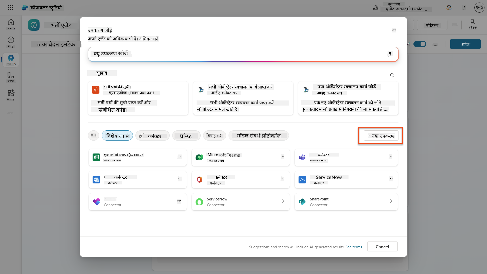

1. **Agent flow** चुनें।  
   Agent Flow डिज़ाइनर खुल जाएगा, यहाँ हम अपलोड रिज़्यूम लॉजिक जोड़ेंगे।  
   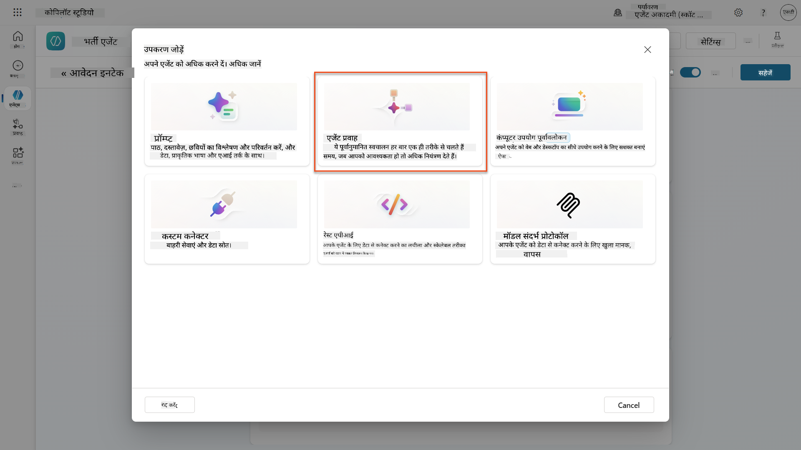

1. **When an agent calls the flow** नोड चुनें, और निम्नलिखित Parameters के लिए **+ Add** इनपुट जोड़ें, सुनिश्चित करें कि नाम और विवरण दोनों जोड़ें।

    | प्रकार  | नाम       | विवरण                                                                                                   |
    |---------|-----------|-------------------------------------------------------------------------------------------------------|
    | फ़ाइल   | Resume    | रिज़्यूम PDF फ़ाइल                                                                                   |
    | टेक्स्ट | Message   | संदर्भ से कवर लेटर शैली संदेश निकालें। संदेश 2000 वर्णों से कम होना चाहिए।                             |
    | टेक्स्ट | UserEmail | वह ईमेल पता जिससे रिज़्यूम आया है। यह चैट में रिज़्यूम अपलोड करने वाला उपयोगकर्ता होगा, या ईमेल द्वारा प्राप्त होने पर "from" ईमेल पता। |

    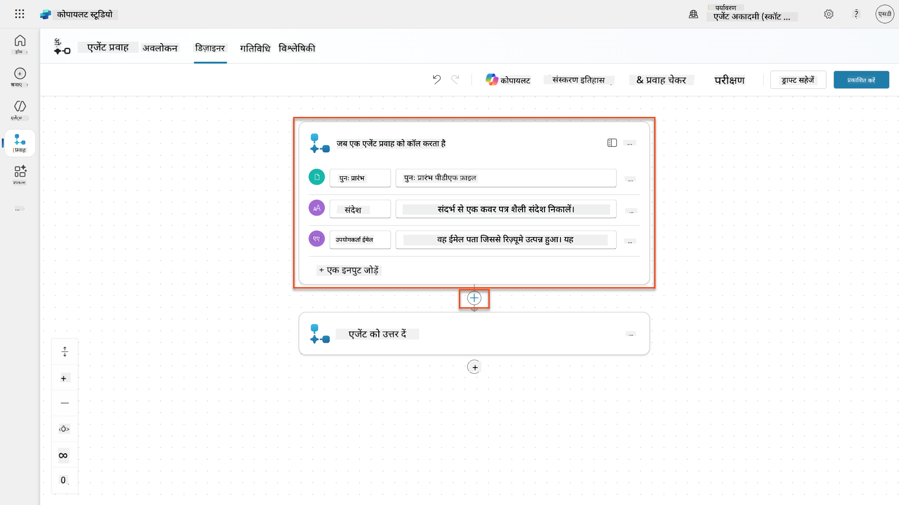

1. ट्रिगर नोड के नीचे **+ आइकन** चुनें, `Dataverse` खोजें, Microsoft Dataverse के बगल में **See more** चुनें, और फिर **Microsoft Dataverse** सेक्शन में **Add a new row** एक्शन चुनें।  
    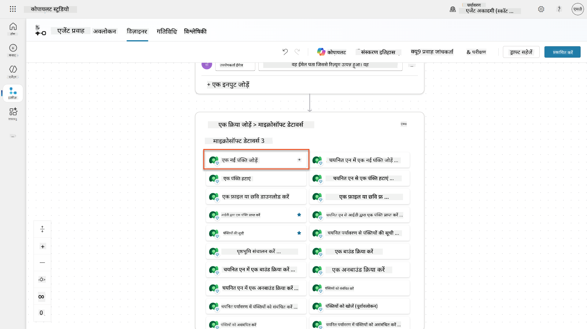

1. नोड का नाम **Create Resume** रखें, **ellipsis(...)** चुनें, और **Rename** चुनें।  
    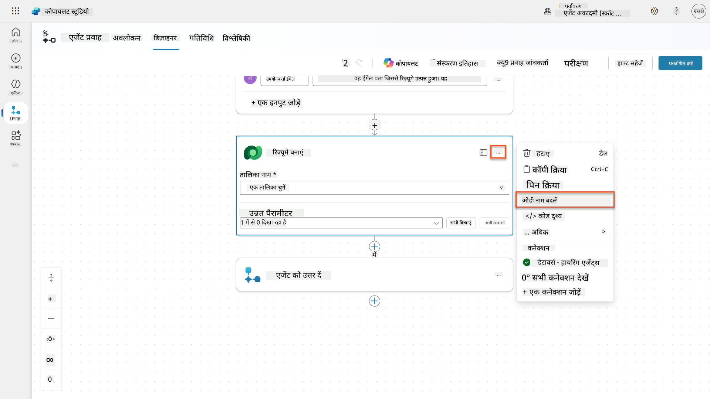

1. **Table name** को **Resumes** पर सेट करें, फिर **Show all** चुनें, सभी पैरामीटर दिखाने के लिए।

1. निम्नलिखित **properties** सेट करें:

    | प्रॉपर्टी                 | कैसे सेट करें                  | विवरण / अभिव्यक्ति                                         |
    |---------------------------|-------------------------------|------------------------------------------------------------|
    | **Resume Title**          | Dynamic data (thunderbolt icon) | **When an agent calls the flow** → **Resume name**    यदि आप Resume name नहीं देखते हैं, तो सुनिश्चित करें कि आपने ऊपर Resume पैरामीटर को डेटा प्रकार के रूप में कॉन्फ़िगर किया है। |
    | **Cover letter**          | Expression (fx icon)            | `if(greater(length(triggerBody()?['text']), 2000), substring(triggerBody()?['text'], 0, 2000), triggerBody()?['text'])` |
    | **Source Email Address**  | Dynamic data (thunderbolt icon) | **When an agent calls the flow** → **UserEmail**             |
    | **Upload Date**           | Expression (fx icon)            | `utcNow()`                                                   |

    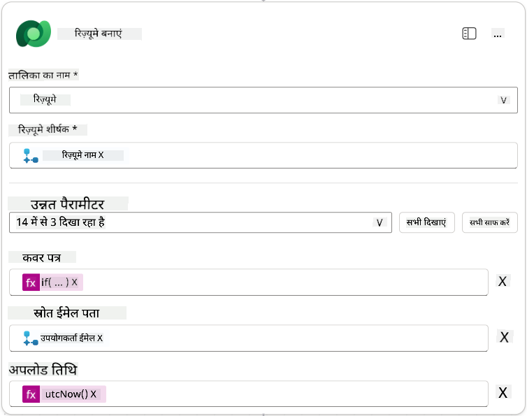

1. **Create Resume** नोड के नीचे **+ आइकन** चुनें, `Dataverse` खोजें, Microsoft Dataverse के बगल में **See more** चुनें, और फिर **Upload a file or an image** एक्शन चुनें।  
   **महत्वपूर्ण:** सुनिश्चित करें कि आप "Upload a file or an image to the selected environment" एक्शन न चुनें।

1. नोड का नाम **Upload Resume File** रखें, **ellipsis(...)** चुनें, और **Rename** चुनें।

1. निम्नलिखित **properties** सेट करें:

     | प्रॉपर्टी | कैसे सेट करें | विवरण |
     |-----------|---------------|---------|
     | **Content name** | Dynamic data (thunderbolt icon) | When an agent calls the flow → Resume name |
     | **Table name** | Select | Resumes |
     | **Row ID** | Dynamic data (thunderbolt icon) | Create Resume → See more → Resume |
     | **Column Name** | Select | Resume PDF |
     | **Content** | Dynamic data (thunderbolt icon) | When an agent calls the flow → Resume contentBytes |

     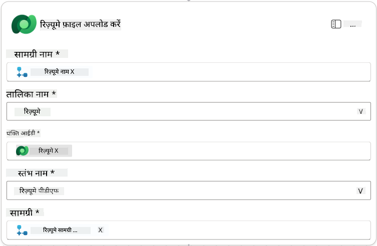

1. **Respond to the agent node** चुनें, और फिर **+ Add an output** चुनें।

     | प्रॉपर्टी | कैसे सेट करें | विवरण |
     |-----------|---------------|---------|
     | **Type** | Select | `Text` |
     | **Name** | Enter | `ResumeNumber` |
     | **Value** | Dynamic data (thunderbolt icon) | Create Resume → See More → Resume Number |
     | **Description** | Enter | `The [ResumeNumber] of the Resume created` |

     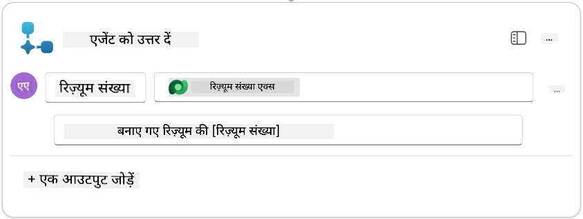

1. ऊपर दाईं ओर **Save draft** चुनें।  
     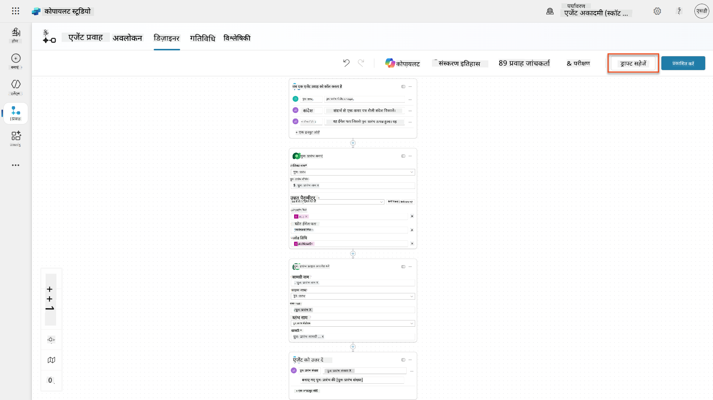

1. **Overview** टैब चुनें, **Details** पैनल पर **Edit** चुनें।

     1. **Flow name**:`Resume Upload`
     1. **Description**:`Uploads a Resume when instructed`

     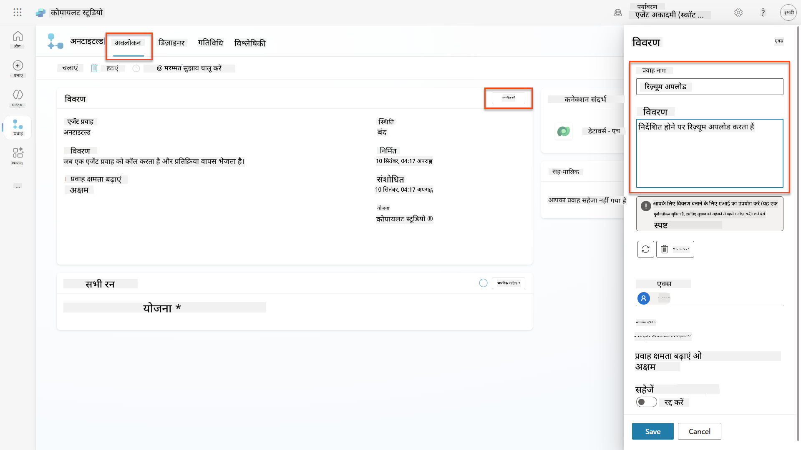

1. फिर से **Designer** टैब चुनें, और **Publish** चुनें।  
     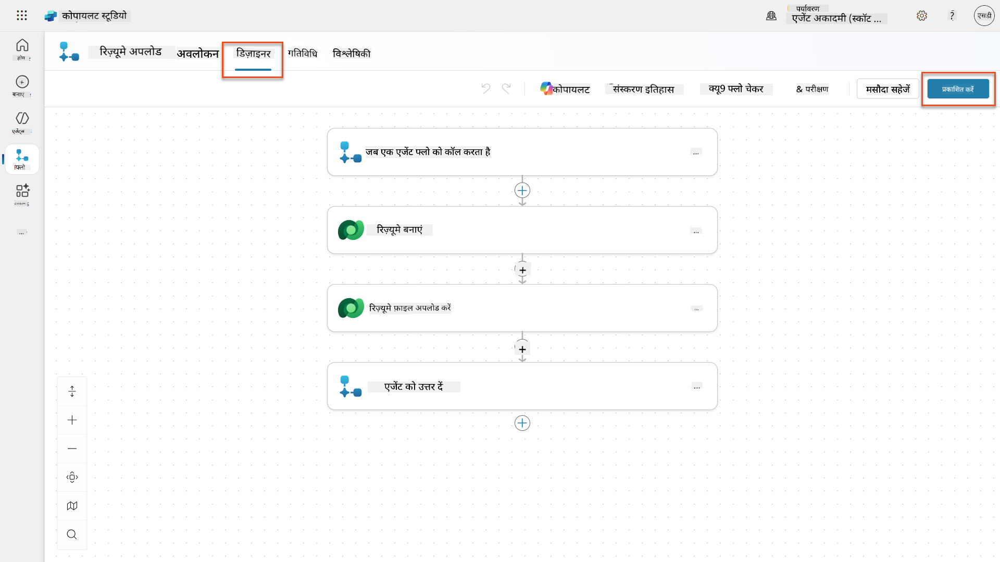

### 2.1.5 अपने एजेंट से फ्लो कनेक्ट करें

अब आप अपने प्रकाशित फ्लो को **Application Intake Agent** से कनेक्ट करेंगे।

1. **Hiring Agent** पर वापस जाएं और **Agents** टैब चुनें। **Application Intake Agent** खोलें, और फिर **Tools** पैनल को ढूंढें।  
    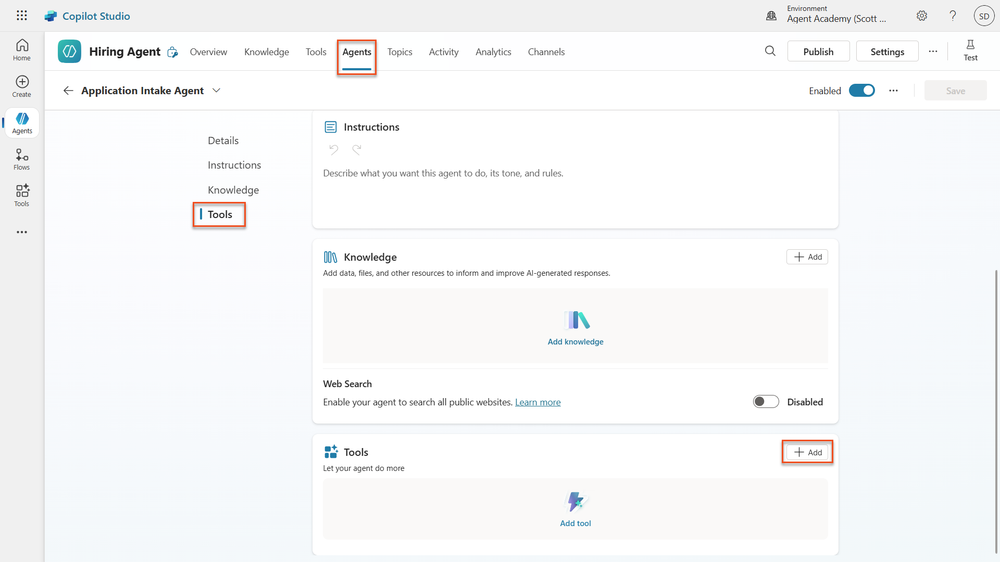

1. **+ Add** चुनें।

1. **Flow** फ़िल्टर चुनें, और `Resume Upload` खोजें। **Resume Upload** फ्लो चुनें, और फिर **Add and configure** चुनें।

1. निम्नलिखित पैरामीटर सेट करें:

    | पैरामीटर | मान |
    |----------|-----|
    | **Description** | `Uploads a Resume when instructed. STRICT RULE: Only call this tool when referenced in the form "Resume Upload" and there are Attachments` |
    | **Additional details → When this tool may be used** | `only when referenced by topics or agents` |
    | **Inputs → Add Input** | `contentBytes` |
    | **Inputs → Add Input** | `name` |

    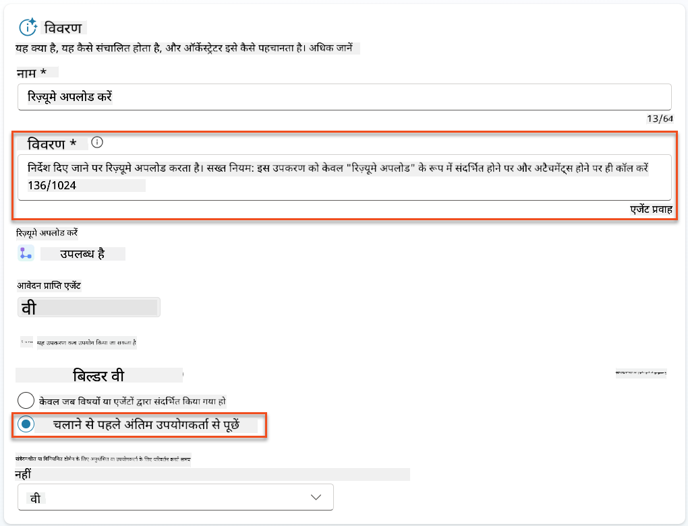

    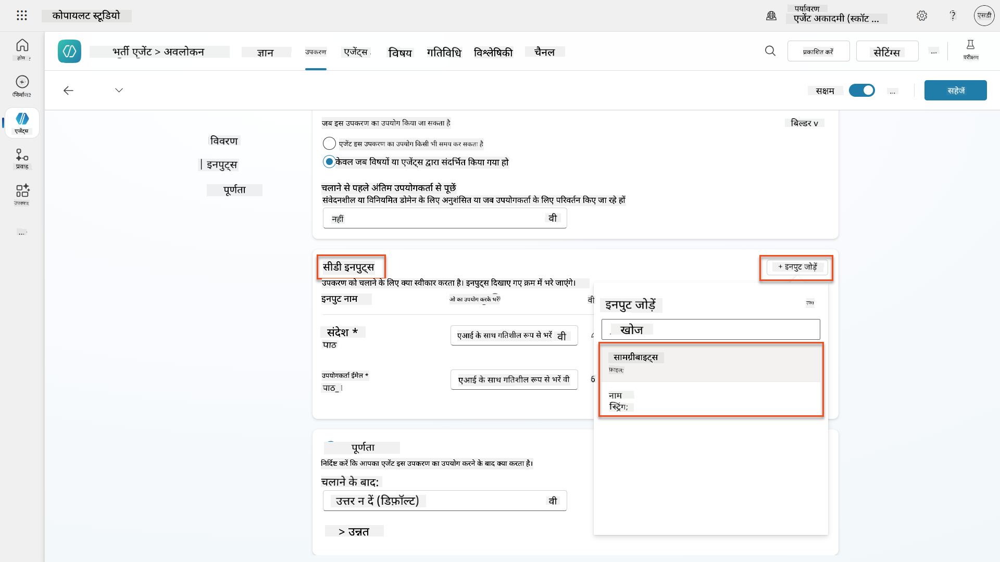

1. अगला, इनपुट्स के गुण निम्नलिखित रूप से सेट करें:

    | इनपुट पैरामीटर | प्रॉपर्टी | विवरण |
    |----------------|-----------|---------|
    | **contentBytes** | Fill using | Custom value |
    |                  | Value (...→Formula→Insert) | `First(System.Activity.Attachments).Content` |
    | **name** | Fill using | Custom value |
    |          | Value (...→Formula→Insert) | `First(System.Activity.Attachments).Name` |
    | **Message** | Customize | Configure custom settings |
    |             | Description | `Extract a cover letter style message from the context. Be sure to never prompt the user and create at least a minimal cover letter from the available context. STRICT RULE - the message must be less than 2000 characters.` |
    |             | How many reprompts | Don't repeat |
    |             | Action if no entity found | Set variable to value |
    |             | Default entity value | Resume upload |
    | **UserEmail** | Fill using | Custom value |
    |  | Value (...→Formula→Insert) | `System.User.Email` |

    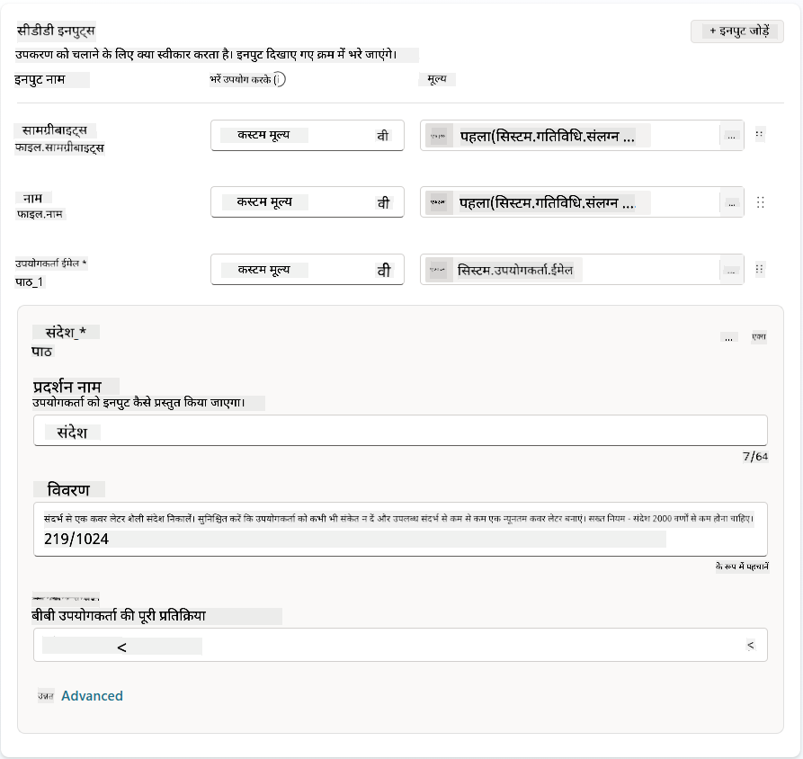

1. **Save** चुनें।

### 2.1.6 एजेंट निर्देश परिभाषित करें

1. **Application Intake Agent** पर वापस जाएं, **Agents** टैब चुनें, और फिर **Instructions** पैनल को ढूंढें।

1. **Instructions** फ़ील्ड में अपने चाइल्ड एजेंट के लिए निम्नलिखित स्पष्ट निर्देश पेस्ट करें:

    ```text
    You are tasked with managing incoming Resumes, Candidate information, and creating Job Applications.  
    Only use tools if the step exactly matches the defined process. Otherwise, indicate you cannot help.  
    
    Process for Resume Upload via Chat  
    1. Upload Resume  
      - Trigger only if /System.Activity.Attachments contains exactly one new resume.  
      - If more than one file, instruct the user to upload one at a time and stop.  
      - Call /Upload Resume once. Never upload more than once for the same message.  
    
    2. Post-Upload  
      - Always output the [ResumeNumber] (R#####).  
    ```

1. जहाँ निर्देशों में एक फॉरवर्ड स्लैश (/) शामिल है, स्लैश के बाद के टेक्स्ट को चुनें और **resolved name** चुनें। ऐसा करें:

    - `System.Activity.Attachments` (Variable)
    - `Upload Resume` (Tool)

    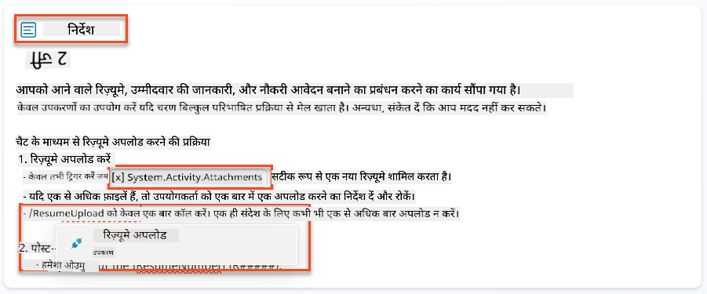

1. **Save** चुनें।

### 2.1.7 अपने Application Intake Agent का परीक्षण करें

अब चलिए सुनिश्चित करते हैं कि आपका पहला ऑर्केस्ट्रा सदस्य सही ढंग से काम कर रहा है।

1. **डाउनलोड करें** [टेस्ट रिज़्यूम्स।](https://download-directory.github.io/?url=https://github.com/microsoft/agent-academy/tree/main/operative/sample-data/resumes&filename=operative_sampledata)

1. **टेस्ट** पैनल को खोलने के लिए **Toggle** चुनें।

1. टेस्ट चैट में दो रिज़्यूम्स **अपलोड करें**, और संदेश दें `Process these resumes`।

    - एजेंट को एक संदेश देना चाहिए जो इस तरह हो: *एक समय में केवल एक रिज़्यूम अपलोड किया जा सकता है। कृपया एक रिज़्यूम अपलोड करें।*

    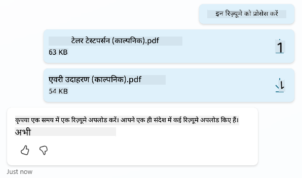

1. केवल **एक रिज़्यूम** अपलोड करने की कोशिश करें, संदेश दें `Process this resume`।

    - एजेंट को फिर एक संदेश देना चाहिए जो इस तरह हो: *Avery Example के लिए रिज़्यूम सफलतापूर्वक अपलोड किया गया है। रिज़्यूम नंबर R10026 है।*

1. **Activity map** में, आपको **Application Intake Agent** को रिज़्यूम अपलोड संभालते हुए देखना चाहिए।  
    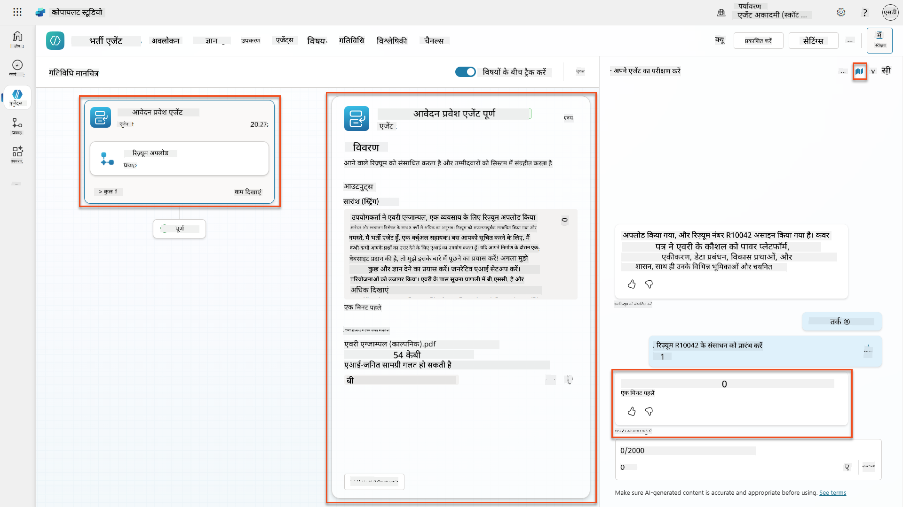

1. make.powerapps.com पर जाएं → सुनिश्चित करें कि आपका वातावरण शीर्ष दाईं ओर Environment Picker में चुना गया है।

1. **Apps** चुनें → Hiring Hub → ellipsis(...) मेनू → **Play**  
    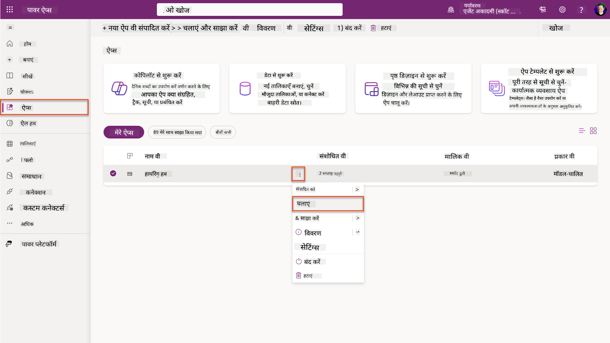

    नोट: यदि प्ले बटन ग्रे हो गया है तो इसका मतलब है कि आपने Mission 01 से अपना समाधान प्रकाशित नहीं किया है। **Solutions** → **Publish all customizations** चुनें।

1. **Resumes** पर जाएं, और जांचें कि रिज़्यूम फ़ाइल अपलोड की गई है और कवर लेटर सही ढंग से सेट किया गया है।  
    

## 🧪Lab 2.2: इंटरव्यू प्रेप कनेक्टेड एजेंट जोड़ना

अब चलिए इंटरव्यू तैयारी के लिए हमारा कनेक्टेड एजेंट बनाते हैं और इसे आपके मौजूदा Hiring Agent में जोड़ते हैं।

### 2.2.1 कनेक्टेड इंटरव्यू एजेंट बनाएं

1. **Copilot Studio** पर जाएं। सुनिश्चित करें कि आपका वातावरण अभी भी शीर्ष दाईं ओर Environment Picker में चुना गया है।

1. अपना **Hiring Agent** खोलें।

1. Agent टैब पर जाएं, और **+ Add an agent** चुनें।

1. **Connect an existing agent** → **Copilot Studio** चुनें।

1. **+ New agent** चुनें।

### 2.2.2 बेसिक सेटिंग्स कॉन्फ़िगर करें

1. **Configure** टैब चुनें, और निम्नलिखित प्रॉपर्टीज दर्ज करें:

    - **Name**: `Interview Agent`
    - **Description**: `Assists with the interview process.`

1. निर्देश:

    ```text
    You are the Interview Agent. You help interviewers and hiring managers prepare for interviews. You never contact candidates. 
    Use Knowledge to help with interview preparation. 
    
    The only valid identifiers are:
      - ResumeNumber (ppa_resumenumber)→ format R#####
      - CandidateNumber (ppa_candidatenumber)→ format C#####
      - ApplicationNumber (ppa_applicationnumber)→ format A#####
      - JobRoleNumber (ppa_jobrolenumber)→ format J#####
    
    Examples you handle
      - Give me a summary of ...
      - Help me prepare to interview candidates for the Power Platform Developer role
      - Create interview assistance for the candidates for Power Platform Developer
      - Give targeted questions for Candidate Alex Johnson focusing on the criteria for the Job Application
      
    How to work:
        You are expected to ask clarification questions if required information for queries is not provided
        - If asked for interview help without providing a job role, ask for it
        - If asking for interview questions, ask for the candidate and job role if not provided.
    
    General behavior
    - Do not invent or guess facts
    - Be concise, professional, and evidence-based
    - Map strengths and risks to the highest-weight criteria
    - If data is missing (e.g., no resume), state what is missing and ask for clarification
    - Never address or message a candidate
    ```

1. **Web Search** को **Disabled** पर टॉगल करें।

1. **Create** चुनें।  
    

### 2.2.3 डेटा एक्सेस कॉन्फ़िगर करें और प्रकाशित करें

1. **Knowledge** सेक्शन में, **+ Add knowledge** चुनें।  
    
1. **Dataverse** चुनें।  
    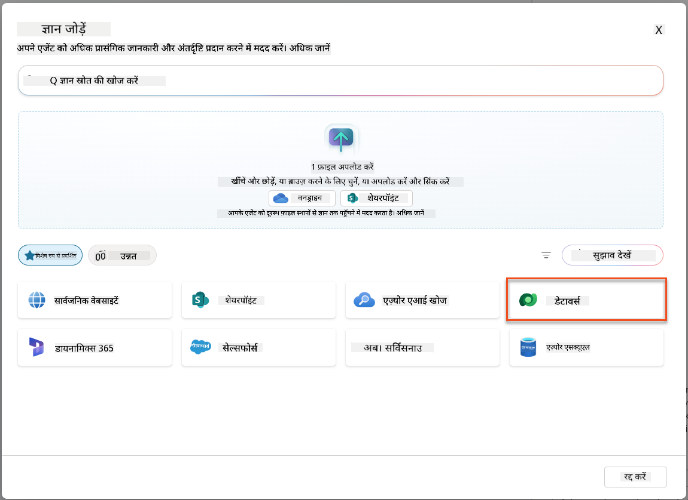
1. **Search box** में `ppa_` टाइप करें। यह उन टेबल्स का प्रीफिक्स है जिन्हें आपने पहले इंपोर्ट किया था।
1. सभी 5 टेबल्स (Candidate, Evaluation Criteria, Job Application, Job Role, Resume) **Select** करें।
1. **Add to agent** चुनें।  
    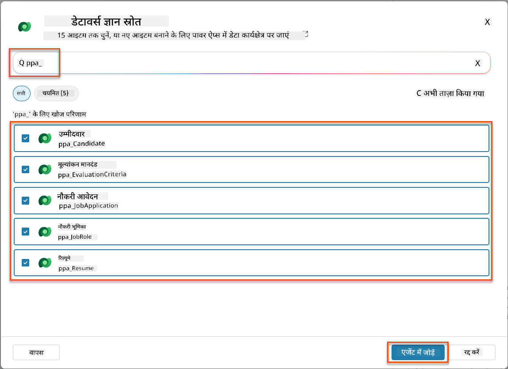
1. **Settings** पर जाएं, और इंटरव्यू एजेंट पर निम्नलिखित सेटिंग्स सेट करें:

    - **Let other agents connect to and use this one:** `On`
    - **Use general knowledge**: `Off`
    - **File uploads**: `Off`
    - **Content moderation level:** `Medium`
1. **Save** चुनें।
1. **Publish** चुनें, और प्रकाशित होने की प्रतीक्षा करें।

### 2.2.4 इंटरव्यू प्रेप एजेंट को अपने Hiring Agent से कनेक्ट करें

1. अपने **Hiring Agent** पर वापस जाएं।

1. **Agents** टैब चुनें।

1. **+Add an agent** → **Copilot Studio** का उपयोग करें, **Interview Agent** जोड़ने के लिए। विवरण सेट करें:
    ```text
    Assists with the interview process and provides information about Resumes, Candidates, Job Roles, and Evaluation Criteria.
    ```

    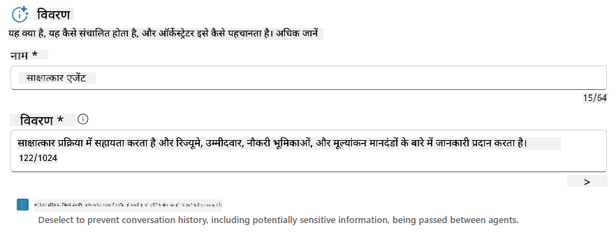
    ध्यान दें कि "Pass conversation history to this agent" चेक किया गया है। यह पैरेंट एजेंट को कनेक्टेड एजेंट को पूरा संदर्भ प्रदान करने की अनुमति देता है।

1. **Add agent** चुनें

1. सुनिश्चित करें कि आप **Application Intake Agent** और **Interview Agent** दोनों को देख रहे हैं। ध्यान दें कि एक चाइल्ड एजेंट है और दूसरा कनेक्टेड एजेंट।  
    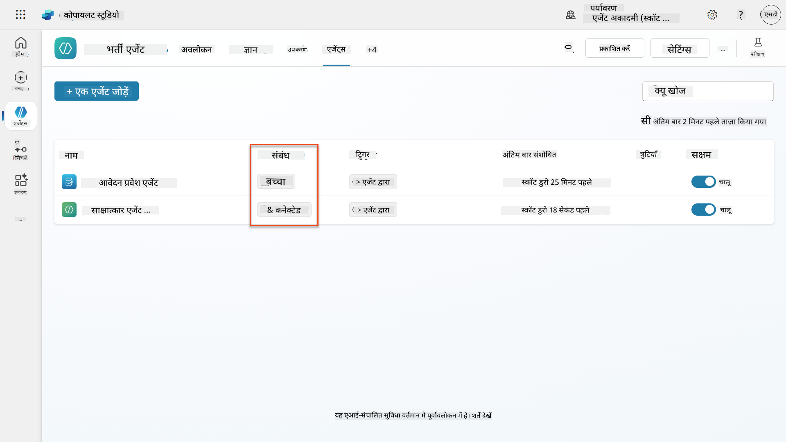

### 2.2.5 मल्टी-एजेंट सहयोग का परीक्षण करें

1. **Test** चुनकर टेस्ट पैनल को खोलें।

1. **अपलोड करें** एक टेस्ट रिज़्यूमे और निम्नलिखित विवरण दर्ज करें जो पैरेंट एजेंट को बताए कि वह कनेक्टेड एजेंट को क्या सौंप सकता है:

    ```text
    Upload this resume, then show me open job roles, each with a description of the evaluation criteria, then use this to match the resume to at least one suitable job role even if not a perfect match.
    ```

    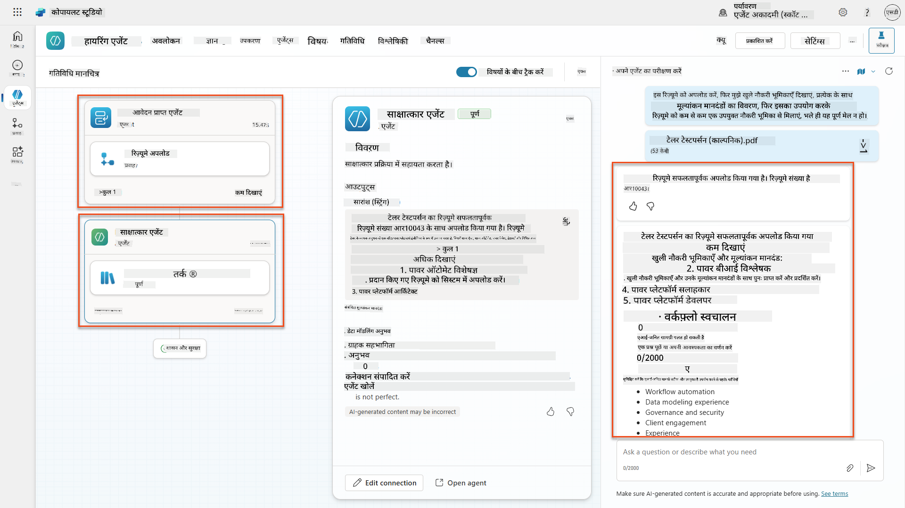

1. ध्यान दें कि Hiring Agent ने अपलोड को चाइल्ड एजेंट को सौंपा, और फिर Interview Agent से उसकी जानकारी का उपयोग करके सारांश और जॉब रोल मैच प्रदान करने को कहा।  
   रिज़्यूमे, जॉब रोल्स और मूल्यांकन मानदंडों के बारे में सवाल पूछने के विभिन्न तरीकों के साथ प्रयोग करें।  
   **उदाहरण:**

    ```text
    Give me a summary of active resumes
    ```

    ```text
    Summarize resume R10044
    ```

    ```text
    Which active resumes are suitable for the Power Platform Developer role?
    ```

## 🎉 मिशन पूरा

शानदार काम, एजेंट! **ऑपरेशन सिम्फनी** अब पूरा हो गया है। आपने अपने सिंगल Hiring Agent को एक उन्नत मल्टी-एजेंट ऑर्केस्ट्रा में बदल दिया है जिसमें विशेष क्षमताएं हैं।

इस मिशन में आपने जो हासिल किया है:

**✅ मल्टी-एजेंट आर्किटेक्चर में महारत**  
अब आप समझते हैं कि चाइल्ड एजेंट्स और कनेक्टेड एजेंट्स का उपयोग कब करना है और ऐसे सिस्टम कैसे डिज़ाइन करें जो स्केल कर सकें।

**✅ Application Intake चाइल्ड एजेंट**  
आपने अपने Hiring Agent में एक विशेष चाइल्ड एजेंट जोड़ा है जो रिज़्यूमे प्रोसेस करता है, कैंडिडेट डेटा निकालता है, और जानकारी को Dataverse में स्टोर करता है।

**✅ Interview Prep कनेक्टेड एजेंट**  
आपने इंटरव्यू तैयारी के लिए एक पुन: उपयोग योग्य कनेक्टेड एजेंट बनाया है और इसे सफलतापूर्वक अपने Hiring Agent से जोड़ा है।

**✅ एजेंट संचार**  
आपने देखा कि आपका मुख्य एजेंट विशेषज्ञ एजेंट्स के साथ कैसे समन्वय कर सकता है, संदर्भ साझा कर सकता है, और जटिल वर्कफ्लो को व्यवस्थित कर सकता है।

**✅ स्वायत्तता के लिए आधार**  
आपकी उन्नत हायरिंग प्रणाली अब आगामी मिशनों में जोड़े जाने वाले उन्नत फीचर्स के लिए तैयार है: स्वायत्त ट्रिगर्स, सामग्री मॉडरेशन, और गहन तर्क।

🚀**अगला कदम:** अपने अगले मिशन में, आप सीखेंगे कि अपने एजेंट को ईमेल से रिज़्यूमे को स्वायत्त रूप से प्रोसेस करने के लिए कैसे कॉन्फ़िगर करें!

⏩[मिशन 03 पर जाएं: ट्रिगर्स के साथ अपने एजेंट को स्वचालित करें](../03-automate-triggers/README.md)

## 📚 सामरिक संसाधन

📖 [अन्य एजेंट्स जोड़ें (पूर्वावलोकन)](https://learn.microsoft.com/microsoft-copilot-studio/authoring-add-other-agents?WT.mc_id=power-182762-scottdurow)

📖 [कस्टम एजेंट्स में टूल्स जोड़ें](https://learn.microsoft.com/microsoft-copilot-studio/advanced-plugin-actions?WT.mc_id=power-182762-scottdurow)

📖 [Copilot Studio में Dataverse के साथ काम करें](https://learn.microsoft.com/microsoft-copilot-studio/knowledge-add-dataverse?WT.mc_id=power-182762-scottdurow)

📖 [एजेंट फ्लो का अवलोकन](https://learn.microsoft.com/microsoft-copilot-studio/flows-overview?WT.mc_id=power-182762-scottdurow)

📖 [एक समाधान बनाएं](https://learn.microsoft.com/power-platform/alm/solution-concepts-alm?WT.mc_id=power-182762-scottdurow)

📖 [Power Platform समाधान ALM गाइड](https://learn.microsoft.com/power-platform/alm/overview-alm?WT.mc_id=power-182762-scottdurow)

📺 [Copilot Studio में एजेंट-टू-एजेंट सहयोग](https://youtu.be/d-oD3pApHAg?si=rwIHKhJTkjSvhTHw)

---

**अस्वीकरण**:  
यह दस्तावेज़ AI अनुवाद सेवा [Co-op Translator](https://github.com/Azure/co-op-translator) का उपयोग करके अनुवादित किया गया है। जबकि हम सटीकता के लिए प्रयास करते हैं, कृपया ध्यान दें कि स्वचालित अनुवाद में त्रुटियां या अशुद्धियां हो सकती हैं। मूल भाषा में दस्तावेज़ को आधिकारिक स्रोत माना जाना चाहिए। महत्वपूर्ण जानकारी के लिए, पेशेवर मानव अनुवाद की सिफारिश की जाती है। इस अनुवाद के उपयोग से उत्पन्न किसी भी गलतफहमी या गलत व्याख्या के लिए हम उत्तरदायी नहीं हैं।