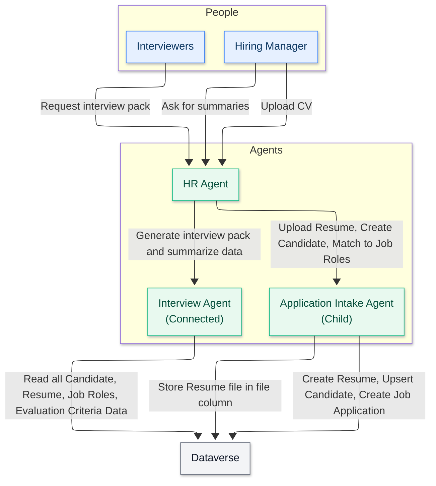

<!--
CO_OP_TRANSLATOR_METADATA:
{
  "original_hash": "02c15421de88efe63b32ca403c366f86",
  "translation_date": "2025-10-21T17:44:39+00:00",
  "source_file": "docs/operative-preview/02-multi-agent/assets/connected-agents-diagram.md",
  "language_code": "hi"
}
-->
# जुड़े हुए एजेंट्स का आरेख

---

**अस्वीकरण**:  
यह दस्तावेज़ AI अनुवाद सेवा [Co-op Translator](https://github.com/Azure/co-op-translator) का उपयोग करके अनुवादित किया गया है। जबकि हम सटीकता के लिए प्रयास करते हैं, कृपया ध्यान दें कि स्वचालित अनुवाद में त्रुटियां या अशुद्धियां हो सकती हैं। मूल भाषा में दस्तावेज़ को आधिकारिक स्रोत माना जाना चाहिए। महत्वपूर्ण जानकारी के लिए, पेशेवर मानव अनुवाद की सिफारिश की जाती है। इस अनुवाद के उपयोग से उत्पन्न किसी भी गलतफहमी या गलत व्याख्या के लिए हम उत्तरदायी नहीं हैं।