<!--
CO_OP_TRANSLATOR_METADATA:
{
  "original_hash": "75efaf515d5694d4fd549bfd6518901a",
  "translation_date": "2025-10-21T18:13:02+00:00",
  "source_file": "docs/operative-preview/03-automate-triggers/README.md",
  "language_code": "hi"
}
-->
# मिशन 03: इवेंट ट्रिगर्स जोड़ें ताकि स्वायत्त रूप से कार्य कर सकें

--8<-- "disclaimer.md"

## 🕵️‍♂️ कोडनेम: `ऑपरेशन सिग्नल पॉइंट`

> **⏱️ ऑपरेशन समय सीमा:** `~45 मिनट`

## 🎯 मिशन विवरण

फिर से स्वागत है, एजेंट। [मिशन 02](../02-multi-agent/README.md) में - आपने सीखा कि कैसे एक एप्लिकेशन इंटेक चाइल्ड एजेंट और एक इंटरव्यू प्रेप कनेक्टेड एजेंट बनाकर अपने मुख्य हायरिंग एजेंट की क्षमताओं को बढ़ाया जा सकता है।

आपका कार्य, यदि आप इसे स्वीकार करते हैं, **ऑपरेशन सिग्नल पॉइंट** है - **इवेंट ट्रिगर्स** में गहराई से उतरना - आपके एजेंट सिस्टम को प्रतिक्रियात्मक से **स्वायत्त संचालन** में बदलना। आप अपने एजेंट्स को मानव इनपुट की प्रतीक्षा करने से बाहरी घटनाओं पर सक्रिय रूप से प्रतिक्रिया देने और बिना निगरानी के बुद्धिमानी से कार्य करने के लिए बदल देंगे।

इसे ऐसे समझें जैसे एजेंट्स को _सवालों का जवाब देने_ से अपग्रेड करके _जरूरतों का अनुमान लगाने_ और _स्वतंत्र रूप से कार्य करने_ के लिए तैयार करना। इवेंट ट्रिगर्स और स्वचालित वर्कफ़्लो के माध्यम से, आपका हायरिंग एजेंट आने वाले रिज्यूमे ईमेल का पता लगाएगा, अटैचमेंट्स को स्वचालित रूप से प्रोसेस करेगा, डेटा को Dataverse में स्टोर करेगा, और Microsoft Teams के माध्यम से आपकी HR भर्ती टीम को सूचित करेगा - जबकि आप उच्च-मूल्य वाले कार्यों पर ध्यान केंद्रित करेंगे।

स्वचालन और बुद्धिमत्ता के मेल की दुनिया में आपका स्वागत है।

## 🔎 उद्देश्य

इस मिशन में, आप सीखेंगे:

1. कैसे इवेंट ट्रिगर्स उपयोगकर्ता इंटरैक्शन के बिना स्वायत्त एजेंट व्यवहार को सक्षम करते हैं
1. Copilot Studio में इंटरैक्टिव और स्वायत्त एजेंट्स के बीच का अंतर
1. कैसे इवेंट ट्रिगर्स बनाएं जो ईमेल अटैचमेंट्स को स्वचालित रूप से प्रोसेस करें और फाइल्स को Dataverse में अपलोड करें
1. कैसे एजेंट फ्लो बनाएं जो Teams चैनल्स में नोटिफिकेशन के लिए एडैप्टिव कार्ड्स पोस्ट करें
1. कैसे इवेंट ट्रिगर्स और एजेंट फ्लो के बीच डेटा पास करें ताकि एंड-टू-एंड स्वचालन हो सके

## 🤔 इवेंट ट्रिगर क्या है?

पहले [Recruit](../../recruit/10-add-event-triggers/README.md) में, हमने इवेंट ट्रिगर्स के बारे में सीखा। चलिए इसे जल्दी से दोहराते हैं ताकि अगर आपने इसे मिस कर दिया हो तो समझ सकें।

**इवेंट ट्रिगर्स** एजेंट को _अपने_ आप कार्य करने देते हैं जब किसी अन्य सिस्टम में कुछ होता है - उपयोगकर्ता संदेश की आवश्यकता नहीं होती। जब कॉन्फ़िगर किया गया इवेंट फायर होता है - जैसे "नया SharePoint आइटम," "नया ईमेल," "Planner टास्क असाइन," या यहां तक कि एक समय-आधारित पुनरावृत्ति, एक कनेक्टर आपके एजेंट को ट्रिगर पेलोड भेजता है। फिर एजेंट आपके निर्देशों का पालन करता है यह तय करने के लिए कि कौन से कार्य या टॉपिक्स कॉल करने हैं।

### मुख्य विशेषताएं

- **स्वायत्त सक्रियता:**
      - टॉपिक ट्रिगर्स के विपरीत जो तब शुरू होते हैं जब उपयोगकर्ता एजेंट को टाइप करता है, इवेंट ट्रिगर्स बाहरी घटनाओं से फायर होते हैं, जिससे सक्रिय व्यवहार सक्षम होता है।

- **पेलोड-ड्रिवन:**
      - प्रत्येक इवेंट एक पेलोड (वेरिएबल्स + वैकल्पिक निर्देश) कनेक्टर के माध्यम से डिलीवर करता है। एजेंट आपके परिभाषित निर्देशों और पेलोड का उपयोग करता है यह तय करने के लिए कि आगे क्या करना है।
      - उदाहरण के लिए _एक टॉपिक कॉल करें_ या _टूल्स द्वारा परिभाषित कार्यों को निष्पादित करें_।

- **आउट-ऑफ-द-बॉक्स उदाहरण:**
      - SharePoint/OneDrive फाइल या आइटम बनाया गया
      - Planner टास्क पूरा/असाइन किया गया
      - Microsoft Forms प्रतिक्रिया सबमिट की गई
      - पुनरावृत्ति/शेड्यूल

    उपलब्धता आपकी संगठन की डेटा नीतियों पर निर्भर करती है जो Power Automate में कॉन्फ़िगर की गई हैं।

- **जनरेटिव ऑर्केस्ट्रेशन की आवश्यकता:**
      - इवेंट ट्रिगर्स केवल तभी उपलब्ध होते हैं जब एजेंट के लिए जनरेटिव ऑर्केस्ट्रेशन सक्षम हो।

- **बिलिंग/उपयोग:**
      - प्रत्येक ट्रिगर डिलीवरी Copilot Studio क्षमता की ओर एक संदेश के रूप में गिना जाता है।
      - उदाहरण के लिए 10‑मिनट की पुनरावृत्ति हर 10 मिनट में एक संदेश भेजती है।

- **ऑथ मॉडल और सेटअप:**
      - आप एजेंट ओवरव्यू के तहत _Triggers_ में ट्रिगर्स जोड़ते हैं। ट्रिगर कनेक्टर के लिए ऑथेंटिकेशन एजेंट निर्माता के खाते ("एजेंट लेखक ऑथेंटिकेशन") का उपयोग करता है।
      - आप Power Automate निर्माता पोर्टल में ट्रिगर पैरामीटर और पेलोड को संपादित कर सकते हैं।

- **परीक्षण और अवलोकन:**
      - आप एजेंट के टेस्ट पैन से ट्रिगर्स का परीक्षण कर सकते हैं और प्रकाशन से पहले गतिविधि मानचित्र के साथ व्यवहार का निरीक्षण कर सकते हैं।

!!! info "डेवलपर्स के लिए संक्षेप में"

    इवेंट ट्रिगर्स को **वेबहुक-जैसे संकेत** के रूप में सोचें जो आपके एजेंट में एक संरचित पेलोड पुश करते हैं, जिससे यह _कार्य शुरू_ कर सके और सिस्टम्स के बीच कार्यों को चेन कर सके - बिना उपयोगकर्ता के पूछने की प्रतीक्षा किए।

### टॉपिक ट्रिगर्स - कैसे वे अलग हैं

पहले आपने [Recruit](../../recruit/07-add-new-topic-with-trigger/README.md) में टॉपिक ट्रिगर्स के बारे में सीखा, लेकिन आप अभी भी सोच सकते हैं कि _टॉपिक_ ट्रिगर्स _इवेंट_ ट्रिगर्स से कैसे अलग हैं, और यह अंतर क्यों महत्वपूर्ण है यह समझने के लिए कि क्या एक एजेंट स्वायत्त बनाता है।

टॉपिक ट्रिगर्स नियंत्रित करते हैं _कब एक टॉपिक चलता है_, आमतौर पर उपयोगकर्ता संदेश के जवाब में।

- जनरेटिव ऑर्केस्ट्रेशन में, डिफ़ॉल्ट ट्रिगर **By agent** है - प्लानर एक टॉपिक चुनता है जिसका नाम/विवरण उपयोगकर्ता के संदेश से सबसे अच्छा मेल खाता है।
- क्लासिक ऑर्केस्ट्रेशन में, डिफ़ॉल्ट **Phrases** है - प्लानर एक टॉपिक चुनता है जब एक या कई ट्रिगर वाक्यांश उपयोगकर्ता के संदेश से सबसे अच्छा मेल खाते हैं।

अन्य ट्रिगर प्रकारों में शामिल हैं `Message received`, `Event received`, `Activity received`, `Conversation update`, `Invoke received`, `On redirect`, `Inactivity`, और `Plan complete`.

!!! info "मुख्य अंतर"

    टॉपिक ट्रिगर्स चैट के अंदर _संवाद गतिविधि_ शुरू करने वाले हैं।
    
    इवेंट ट्रिगर्स सिस्टम _इवेंट_ शुरू करने वाले हैं जो कनेक्टर्स के माध्यम से डिलीवर किए जाते हैं और बिना किसी संवाद के एजेंट को चला सकते हैं।

### टॉपिक ट्रिगर बनाम इवेंट ट्रिगर का त्वरित गाइड

- **टॉपिक ट्रिगर:** उपयोगकर्ता (या चैट गतिविधि) ने X कहा/किया ➡️ टॉपिक T चलाएं।
- **इवेंट ट्रिगर:** SharePoint/Planner/Email/Timer ने पेलोड P के साथ फायर किया ➡️ एजेंट निर्देशों का मूल्यांकन करता है ➡️ कार्य/टॉपिक्स को तदनुसार कॉल करता है।

## 🏓 इंटरैक्टिव एजेंट बनाम स्वायत्त एजेंट - तुलना

अब जब आप इवेंट ट्रिगर्स और टॉपिक्स ट्रिगर्स के बीच का अंतर जानते हैं, तो चलिए इंटरैक्टिव एजेंट बनाम स्वायत्त एजेंट के बीच का अंतर सीखते हैं।

Copilot Studio में, "इंटरैक्टिव" का मतलब है एजेंट्स जो मुख्य रूप से चैट या चैनल में **टॉपिक्स** के माध्यम से संवाद करते हैं। "स्वायत्त" का मतलब है एजेंट्स जो **इवेंट ट्रिगर्स** का उपयोग करके बिना उपयोगकर्ता इनपुट के भी कार्य करते हैं।

निम्न तालिका उनके अंतर और समानताओं को सारांशित करती है।

| आयाम                              | इंटरैक्टिव एजेंट     | स्वायत्त एजेंट                                                                                              |
|-------------------------------------|-----------------------|---------------------------------------------------------------------------------------------------------------|
| कैसे शुरू होता है                   | उपयोगकर्ता (या चैट गतिविधि) एक टॉपिक को ट्रिगर करता है। उदाहरण: By agent, Phrases, Message received।   | बाहरी इवेंट ट्रिगर कनेक्टर के माध्यम से एजेंट को पेलोड भेजता है। उदाहरण: SharePoint, Planner, ईमेल, शेड्यूल, आदि। |
| प्राथमिक उपयोग                     | Q&A, गाइडेड वर्कफ़्लो, चैट में अनुरोध-चालित कार्य - Teams, वेब, आदि।  | सक्रिय संचालन और बैकग्राउंड स्वचालन - सिस्टम परिवर्तनों पर प्रतिक्रिया दें और फिर सूचित करें, फाइल करें, या कार्यों को ऑर्केस्ट्रेट करें। |
| ट्रिगर सतह                         | टॉपिक ट्रिगर्स: By agent / Phrases / Message received / Activity types / Invoke / Inactivity / Plan complete | इवेंट ट्रिगर्स लाइब्रेरी कनेक्टर्स के माध्यम से; पेलोड में इवेंट डेटा + वैकल्पिक निर्देश शामिल हैं। |
| प्लानर (जनरेटिव ऑर्केस्ट्रेशन)    | By agent और Plan complete ट्रिगर्स के लिए टॉपिक्स को चुनने/क्रमबद्ध करने के लिए मजबूत रूप से उपयोग किया गया। | इवेंट ट्रिगर्स के लिए आवश्यक; एजेंट निर्देशों + पेलोड का उपयोग करता है यह तय करने के लिए कि कौन से कार्य/टॉपिक्स को कॉल करना है। |
| सामान्य उदाहरण                     | उपयोगकर्ता पूछता है "हमारी रिफंड पॉलिसी क्या है?" → टॉपिक चलता है, ज्ञान क्वेरी करता है, प्रतिक्रिया देता है। | नया Planner टास्क असाइन किया गया → इवेंट ट्रिगर फायर करता है → एजेंट Teams संदेश पोस्ट करता है, रिकॉर्ड अपडेट करता है, या टॉपिक कॉल करता है। |
| सेटअप पथ                          | टॉपिक्स बनाएं, ट्रिगर प्रकार परिभाषित करें, संवाद/कार्य लिखें; चैनल्स में प्रकाशित करें। | इवेंट ट्रिगर जोड़ें (ओवरव्यू → ट्रिगर्स), एजेंट लेखक क्रेडेंशियल्स के साथ कनेक्टर को प्रमाणित करें, पेलोड/निर्देश कॉन्फ़िगर करें; टेस्ट पैन के माध्यम से परीक्षण करें; प्रकाशित करें। |
| ऑथ और गवर्नेंस                   | चैनल/ऑथ संदर्भ के तहत चलता है; टॉपिक ट्रिगर्स अनुमत चैनल्स में चैट गतिविधियों का जवाब देते हैं। | ट्रिगर उपलब्धता Power Automate डेटा नीतियों पर निर्भर करती है; कनेक्टर्स एजेंट निर्माता के खाते के तहत चलते हैं। |
| अवलोकन                           | Copilot Studio में टॉपिक्स का परीक्षण करें, संवाद ट्रांसक्रिप्ट्स/गतिविधियों का निरीक्षण करें। | प्रकाशन से पहले निष्पादन को मान्य करने के लिए Test trigger और गतिविधि मानचित्र का उपयोग करें, प्रकाशन के बाद गतिविधि की निगरानी करें। |
| क्षमता प्रभाव                     | प्रत्येक उपयोगकर्ता संदेश/एजेंट प्रतिक्रिया एक संदेश है जो क्षमता का उपभोग करता है। | प्रत्येक इवेंट डिलीवरी भी एक संदेश है, साथ ही कोई भी बाद के कार्य। उदाहरण: 10‑मिनट की पुनरावृत्ति = 6 संदेश/घंटा |

### कब किसका उपयोग करें?

- **टॉपिक ट्रिगर्स (इंटरैक्टिव)** चुनें जब उपयोगकर्ता एजेंट संवाद शुरू करते हैं - FAQ, गाइडेड इंटेक, या चैट के अंदर कमांड-स्टाइल कार्य। प्लानर का By agent ट्रिगर मैनुअल वाक्यांश क्यूरेशन को कम करता है।
- **इवेंट ट्रिगर्स (स्वायत्त)** जोड़ें जब एजेंट को संवाद शुरू करना चाहिए या खुद से कार्य करना चाहिए - SharePoint/Dataverse में अपडेट्स पर, आने वाले ईमेल पर, या शेड्यूल पर। यह आपको प्रतिक्रियात्मक से सक्रिय संचालन में ले जाता है।

## डेवलपर टिप्स और सावधानियां

1. **जनरेटिव ऑर्केस्ट्रेशन सक्षम करें** किसी भी एजेंट के लिए जिसे आप स्वायत्त बनाना चाहते हैं। अन्यथा इवेंट ट्रिगर्स दिखाई नहीं देंगे।

1. **पेलोड को जल्दी मॉडल करें।** तय करें कि ट्रिगर से आपके एजेंट को कौन से न्यूनतम फील्ड्स की आवश्यकता है जैसे `itemId`, `assignedTo`, `dueDate` और संक्षिप्त निर्देश जोड़ें जो एजेंट को बताए कि पेलोड मानों के आधार पर कौन सा कार्य/टॉपिक कॉल करना है।

1. **ऑथ स्कोप महत्वपूर्ण है।** ट्रिगर्स एजेंट निर्माता के खाते का उपयोग करके प्रमाणित होते हैं। सुनिश्चित करें कि उस खाते के पास सही कनेक्टर अनुमतियां हैं और यह Power Automate डेटा नीतियों का पालन करता है।

1. **लागत और शोर को नियंत्रित करें।** उच्च-आवृत्ति पुनरावृत्तियां या अत्यधिक चैट स्रोत जल्दी से संदेश खपत को बढ़ा सकते हैं - जहां संभव हो थ्रॉटल करें या ट्रिगर में शर्तें जोड़ें ताकि इवेंट्स को फ़िल्टर किया जा सके।

1. **प्रकाशन से पहले परीक्षण करें।** **Test trigger** और गतिविधि मानचित्र का उपयोग करें योजना और कॉल किए गए कार्यों को देखने के लिए - निर्देशों/पेलोड पर तब तक पुनरावृत्ति करें जब तक व्यवहार स्थिर न हो जाए।

## 🧪 लैब 03 - उम्मीदवार आवेदन ईमेल को स्वचालित करना

हम अगले चरण में **Hiring Agent** में एक इवेंट ट्रिगर जोड़ने जा रहे हैं और स्वायत्तता के लिए आगे की प्रक्रिया को संभालने के लिए चाइल्ड **Application Intake Agent** में एक एजेंट फ्लो बनाएंगे।

### ✨ उपयोग केस परिदृश्य

!!! info ""

    **एक** HR रिक्रूटर के रूप में

    **मैं चाहता हूं** कि जब मेरे इनबॉक्स में एक रिज्यूमे के साथ ईमेल आए, जिसे स्वचालित रूप से Dataverse में अपलोड किया गया हो, तो मुझे सूचित किया जाए

    **ताकि मैं** ईमेल द्वारा भेजे गए आवेदन के लिए स्वचालित रूप से Dataverse में अपलोड किए गए रिज्यूमे के बारे में सूचित रह सकूं

हम इसे दो तकनीकों का उपयोग करके प्राप्त करेंगे:

1. जब ईमेल आए तो एक इवेंट ट्रिगर,
    1. जांचें कि फाइल का `contentType` `PDF` के रूप में फॉर्मेट प्रकार है।
    1. फाइल को निकालें और Dataverse में Dataverse कनेक्टर के माध्यम से अपलोड करें।
    1. फिर Dataverse कार्यों से इनपुट पैरामीटर पास करके एजेंट को आगे की प्रक्रिया के लिए एक प्रॉम्प्ट भेजें।

1. चाइल्ड **Application Intake Agent** में एक एजेंट फ्लो जो इवेंट ट्रिगर में प्रॉम्प्ट द्वारा इनवोक किया गया है।
    1. इवेंट ट्रिगर के प्रॉम्प्ट से पास किए गए इनपुट पैरामीटर का उपयोग करके Microsoft Teams में एक चैनल में एक एडैप्टिव कार्ड पोस्ट करें ताकि HR रिक्रूटमेंट टीम को सूचित किया जा सके। एडैप्टिव कार्ड में Dataverse में रो का लिंक होगा जिसे **Hiring Agent** में देखा जाएगा।

चलो शुरू करें!

### ✨ इस मिशन को पूरा करने के लिए आवश्यकताएं

आपको **या तो**:

- **मिशन 01 और मिशन 02 पूरा किया हुआ होना चाहिए** और आपका Hiring Agent तैयार होना चाहिए, **या**
- **मिशन 03 स्टार्टर सॉल्यूशन आयात करें** यदि आप नए शुरू कर रहे हैं या पकड़ने की आवश्यकता है। [मिशन 03 स्टार्टर सॉल्यूशन डाउनलोड करें](https://aka.ms/agent-academy)

!!! note "सॉल्यूशन आयात और नमूना डेटा"
    यदि आप स्टार्टर सॉल्यूशन का उपयोग कर रहे हैं, तो [मिशन 01](../01-get-started/README.md) में दिए गए निर्देशों का पालन करें ताकि अपने वातावरण में सॉल्यूशन और नमूना डेटा आयात कर सकें।

आपको **Microsoft Teams** तक पहुंच की आवश्यकता होगी ताकि Microsoft Teams में एडैप्टिव कार्ड पोस्ट करने के दूसरे लैब अभ्यास को पूरा किया जा सके।

### लैब 3.1 - ईमेल द्वारा प्राप्त रिज्यूमे को Dataverse में अपलोड करना स्वचालित करें

1. Hiring Agent में, **Overview टैब** में नीचे स्क्रॉल करें और **+ Add trigger** चुनें।

       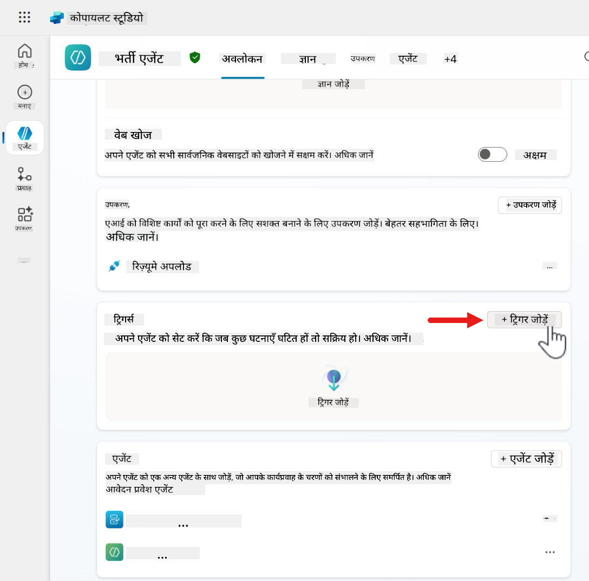

1. ट्रिगर्स की एक सूची दिखाई देगी। **When a new email arrives (V3)** चुनें और **Next** चुनें।

       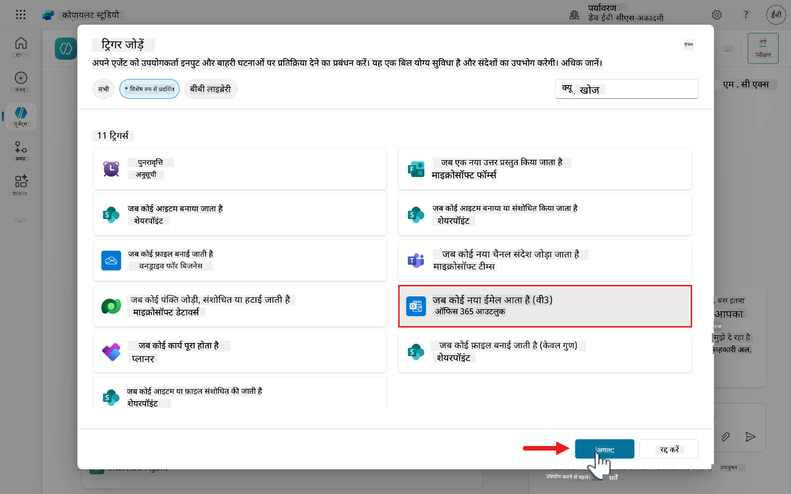

1. अब हम **Trigger name** और **Sign in** कनेक्शन रेफरेंस को देखेंगे।

       ट्रिगर नाम को निम्नलिखित में बदलें,
    
       ```text
       When a new email arrives from an applicant
       ```

       सुनिश्चित करें कि सूचीबद्ध ऐप्स के प्रत्येक कनेक्शन रेफरेंस के पास एक हरा
हम अब इवेंट ट्रिगर को अपडेट करने जा रहे हैं ताकि इसमें और अधिक ऑटोमेशन क्षमताएं जोड़ी जा सकें। ट्रिगर के पास **तीन बिंदु (...)** चुनें और **Power Automate में संपादित करें** चुनें।

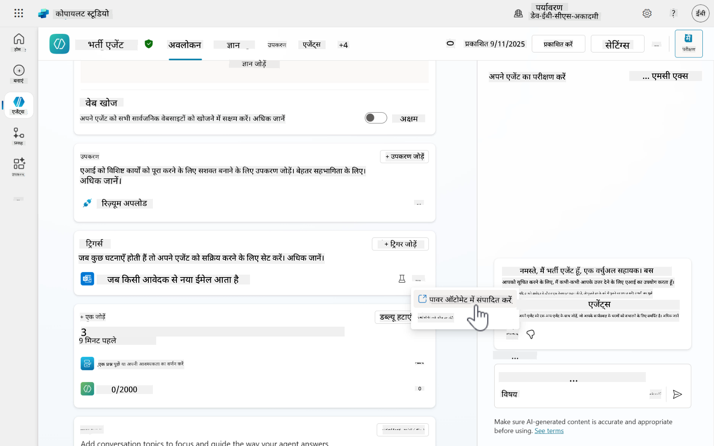

1. ट्रिगर तब Power Automate मेकर पोर्टल में एक फ्लो के रूप में लोड होगा। जो आप देख रहे हैं वह Power Automate मेकर पोर्टल में फ्लो डिज़ाइनर है। यहां हम अधिक ऑटोमेशन के लिए आगे की लॉजिक और एक्शन जोड़ सकते हैं। ट्रिगर शीर्ष पर दिखाई देगा, और फ्लो में अंतिम एक्शन के रूप में **निर्धारित कोपायलट को प्रोसेसिंग के लिए एक प्रॉम्प्ट भेजता है**।

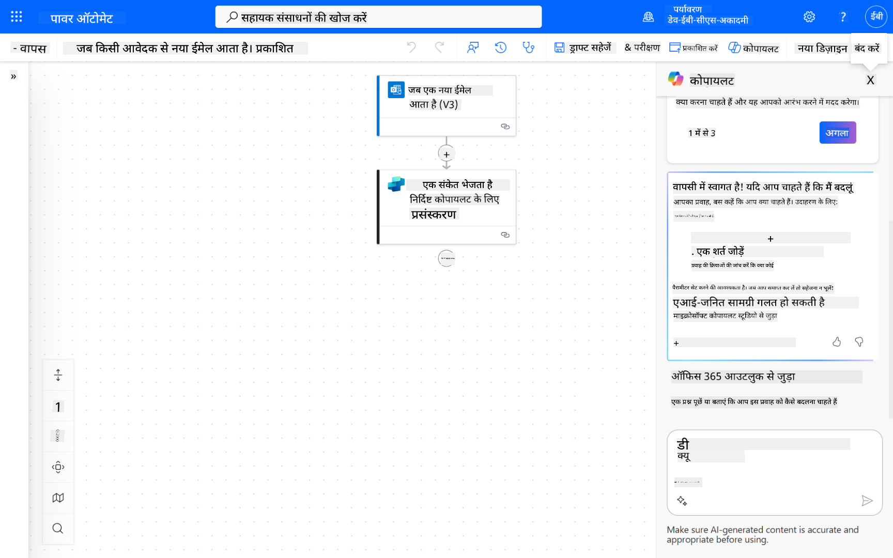

1. डिफ़ॉल्ट रूप से, Power Automate में **जब एक नया ईमेल आता है** ट्रिगर एक साथ कई ईमेल प्रोसेस कर सकता है यदि एक बार में कई ईमेल आते हैं, तो फ्लो केवल बैच के लिए एक बार चलेगा।

   सुनिश्चित करने के लिए कि फ्लो प्रत्येक ईमेल के लिए अलग-अलग चलता है, ट्रिगर की सेटिंग्स में **Split On** सेटिंग सक्षम करें और ड्रॉपडाउन एरे फ़ील्ड में `@triggerOutputs()?['body/value']` चुनें।

   **Split On** चालू होने और एरे फ़ील्ड को `@triggerOutputs()?['body/value']` पर सेट करने के साथ, फ्लो प्रत्येक संदेश के लिए अलग-अलग चलेगा, भले ही कई एक साथ आए हों।

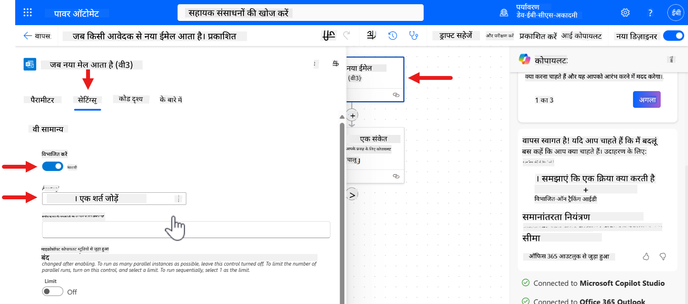

1. अब हम कुछ लॉजिक जोड़ने जा रहे हैं ताकि अटैचमेंट के फाइल प्रकार की जांच की जा सके। हम केवल .PDF फाइल अटैचमेंट अपलोड करना चाहते हैं और इमेज नहीं (ये ईमेल सिग्नेचर से आ सकती हैं)। ट्रिगर के नीचे **+** आइकन चुनें और **Built in tools** सेक्शन के तहत **Control** चुनें।

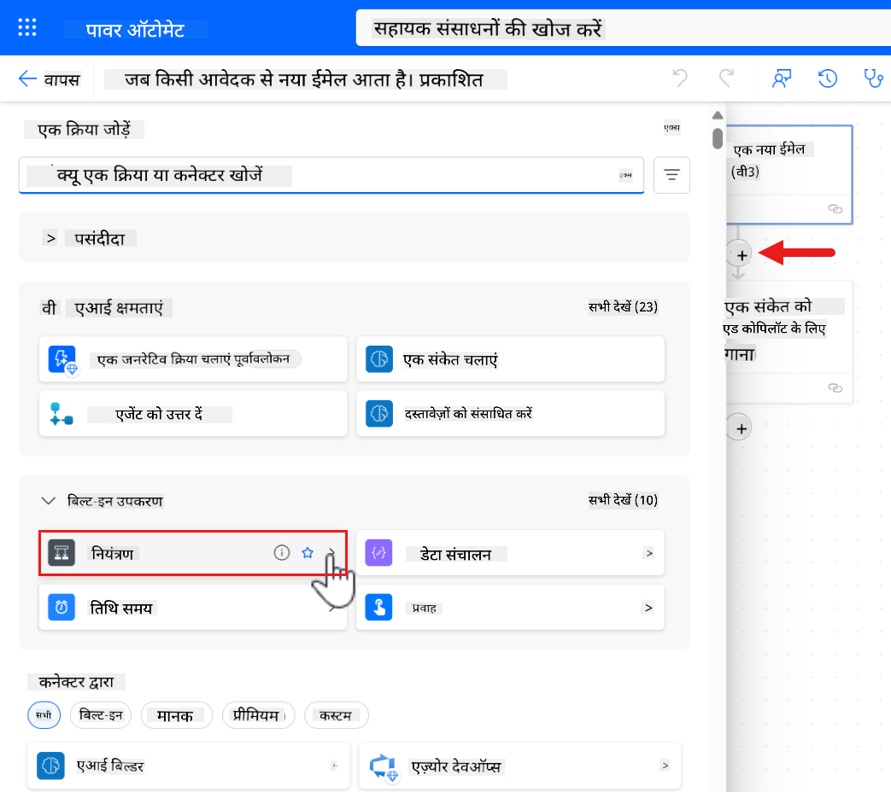

1. **Condition** एक्शन चुनें।


1. अब हम कंडीशन को कॉन्फ़िगर करेंगे ताकि यह जांच सके कि फाइल अटैचमेंट का प्रकार .PDF है। **Choose a value** फ़ील्ड में, दाईं ओर **lightning bolt icon** या **fx icon** चुनें।

   1. **Search** फ़ील्ड में निम्नलिखित टाइप करें,

      ```text
      content type
      ```

   1. फिर ट्रिगर से **Attachments Content-Type** पैरामीटर चुनें।

   1. इसके बाद, **Id** पैरामीटर में डायनामिक कंटेंट इनपुट जोड़ने के लिए **Add** चुनें।

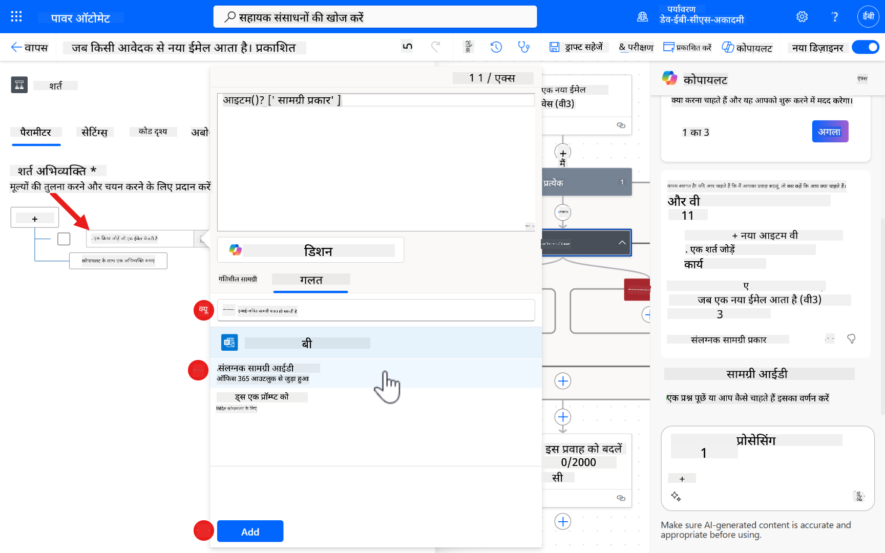

1. यहां थोड़ी देर रुकते हैं, आपने शायद देखा होगा कि **For each** एक्शन स्वचालित रूप से दिखाई दिया।

   **For each** एक्शन चुनें। यह एक्शन ईमेल में प्रत्येक अटैचमेंट के माध्यम से लूपिंग का प्रतिनिधित्व करता है, क्योंकि ट्रिगर से **Attachments Content-Type** पैरामीटर प्रत्येक अटैचमेंट से जुड़ा हुआ है।

   अंदर से, यह एक एरे है और यही कारण है कि जब हमने **Condition** एक्शन में **Attachments Content-Type** पैरामीटर चुना तो **For each** एक्शन स्वचालित रूप से जोड़ा गया।

   इसके बारे में अधिक जानने के लिए, निम्नलिखित अतिरिक्त लर्निंग ब्लॉक का विस्तार करें।

??? info "अतिरिक्त जानकारी: For each एक्शन स्वचालित रूप से दिखाई देना"

🤔 **"Apply to each" या "For each" स्वचालित रूप से क्यों दिखाई देता है?**

जब आप एक पैरामीटर (डायनामिक कंटेंट) चुनते हैं जो आइटम की सूची या एरे का प्रतिनिधित्व करता है - उदाहरण के लिए, अटैचमेंट, ईमेल, या पंक्तियों की सूची - Power Automate पहचानता है कि आप प्रत्येक आइटम को व्यक्तिगत रूप से प्रोसेस करना चाहते हैं।

आपकी मदद करने के लिए, Power Automate स्वचालित रूप से आपके एक्शन के चारों ओर एक **“Apply to each”** (या **For each**) लूप जोड़ता है। यह सुनिश्चित करता है कि आपका एक्शन सूची में प्रत्येक आइटम के लिए एक बार चलेगा, बजाय पूरी सूची को एक बार में प्रोसेस करने की कोशिश करने के (जो त्रुटियों का कारण बन सकता है)।

🦋 **उदाहरण**

- यदि आप पिछले एक्शन से "Attachments" चुनते हैं (जो एक एरे है), और इसे एक एक्शन में उपयोग करने की कोशिश करते हैं जो एक सिंगल फाइल की अपेक्षा करता है, तो Power Automate आपके एक्शन को **"Apply to each"** (या **For each**) लूप में लपेटता है। 
- इस तरह, आपका एक्शन **प्रत्येक अटैचमेंट** के लिए चलेगा - एक बार में।

💡 **मुख्य बिंदु**

- **स्वचालित:** लूप स्वचालित रूप से दिखाई देता है ताकि आप संग्रह में प्रत्येक आइटम को प्रोसेस कर सकें।
- **त्रुटियों को रोकता है:** लूप के बिना, आपका एक्शन विफल हो सकता है क्योंकि यह एक बार में कई आइटम को संभाल नहीं सकता।
- **दृश्य संकेत:** यह एक दृश्य तरीका है यह दिखाने के लिए कि आपका फ्लो सूची में प्रत्येक आइटम के लिए एक्शन को दोहराएगा।

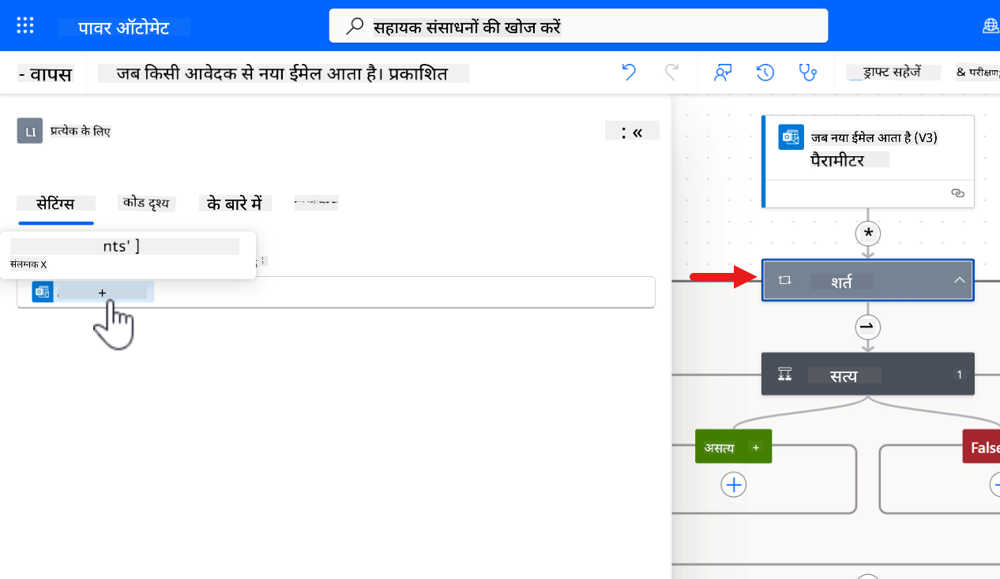

1. अगले **Choose a value** फ़ील्ड में, निम्नलिखित टाइप करें,

```text
application/pdf
```

यह सुनिश्चित करेगा कि प्रत्येक फाइल अटैचमेंट के लिए, यह जांच करेगा कि फाइल एक्सटेंशन फॉर्मेट .PDF है।


1. अब हम **True** पथ को कॉन्फ़िगर करेंगे ताकि ईमेल से फाइल को निकाला जा सके और इसे **Resume** Dataverse टेबल में अपलोड किया जा सके।

   **True** पथ में नीचे एक नया एक्शन जोड़ें और `html to text` खोजें। **Html to text** एक्शन चुनें।

   **Html to text** एक्शन के बारे में अधिक जानने के लिए, निम्नलिखित अतिरिक्त लर्निंग ब्लॉक का विस्तार करें।

??? info "अतिरिक्त जानकारी: Html to text एक्शन"

🤔 **"HTML to text" एक्शन क्या है?**

Power Automate में **HTML to text** एक्शन का उपयोग HTML-फॉर्मेटेड कंटेंट को साधारण टेक्स्ट में बदलने के लिए किया जाता है। यह विशेष रूप से उपयोगी है जब आपको डेटा (जैसे ईमेल, वेब कंटेंट, या API प्रतिक्रियाएं) प्राप्त होती हैं जिसमें HTML टैग होते हैं, और आप केवल पठनीय टेक्स्ट निकालना चाहते हैं बिना किसी फॉर्मेटिंग या कोड के।

⚙️ **यह कैसे काम करता है?**

- **इनपुट:** आप HTML कंटेंट की एक स्ट्रिंग प्रदान करते हैं (उदाहरण के लिए, ईमेल का बॉडी)।
- **आउटपुट:** एक्शन सभी HTML टैग को हटा देता है और केवल साधारण टेक्स्ट लौटाता है।

👍🏻 **आप इसे कब उपयोग करें?**

- जब आप ईमेल, वेब पेज, या API प्रतिक्रियाओं से पठनीय टेक्स्ट निकालना चाहते हैं जिसमें HTML होता है।
- सिस्टम को कंटेंट भेजने से पहले जो HTML फॉर्मेटिंग का समर्थन नहीं करते (जैसे SMS, Teams संदेश, या डेटाबेस)।
- डेटा को आगे की प्रोसेसिंग या विश्लेषण के लिए साफ करने के लिए।

🔭 **यह कहां मिलेगा?**

- Power Automate में Agent Flows के लिए, `HTML to text` नामक एक्शन खोजें। यह **Data Operations** कनेक्टर के तहत है।

💡 **मुख्य बिंदु**

- यह सभी HTML टैग को हटा देता है और केवल टेक्स्ट छोड़ता है।
- यह स्क्रिप्ट/स्टाइल को इंटरप्रेट या निष्पादित नहीं करता - केवल टैग हटाता है।
- डेटा को साफ करने और साधारण टेक्स्ट आउटपुट के लिए तैयार करने के लिए उपयोगी।

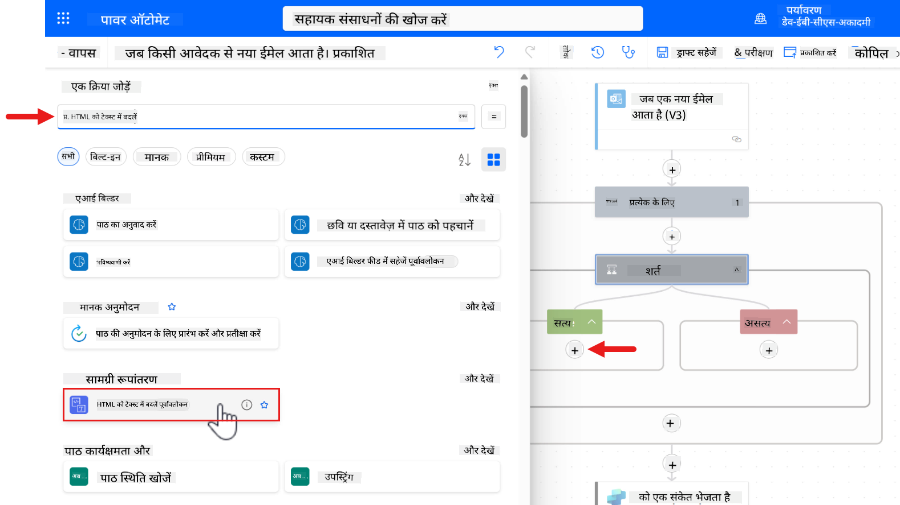

1. अगले चरण में, हमें **Html to text** एक्शन के लिए एक नया कनेक्शन रेफरेंस बनाना होगा। **Add new** चुनें।

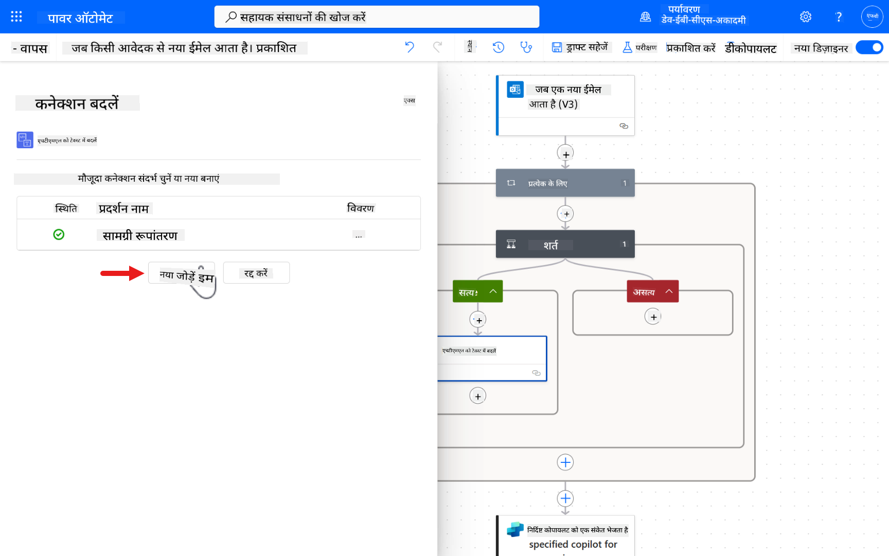

1. अब एक्शन को कॉन्फ़िगर किया जा सकता है। ट्रिगर से **Body** पैरामीटर जोड़ें। **Content** फ़ील्ड में, दाईं ओर **lightning bolt icon** या **fx icon** चुनें।

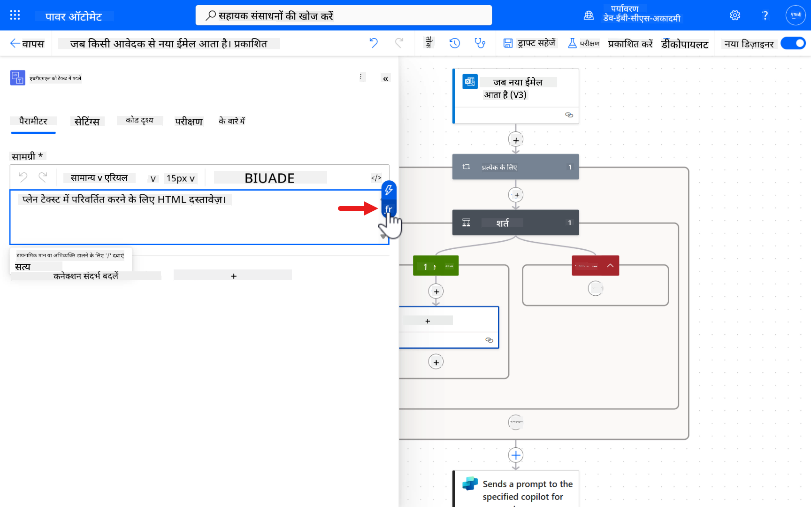

1. **Dynamic content** टैब में, `body` खोजें और **Body** पैरामीटर चुनें, फिर **Add** चुनें।


1. हमने इस एक्शन को कॉन्फ़िगर करना पूरा कर लिया है, इसलिए **दो कोण वाले ब्रैकेट («)** को चुनकर एक्शन से बाहर निकलें ताकि पैनल को बंद किया जा सके।

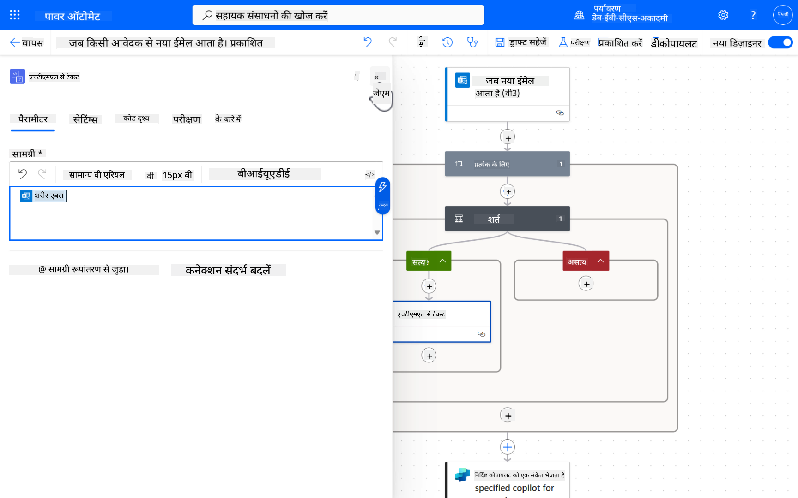

1. **Html to text** एक्शन के नीचे **+ आइकन** चुनकर एक नया एक्शन जोड़ें, जो एक्शन जोड़ने के लिए पैनल लोड करेगा। **Microsoft Dataverse** कनेक्टर चुनें।

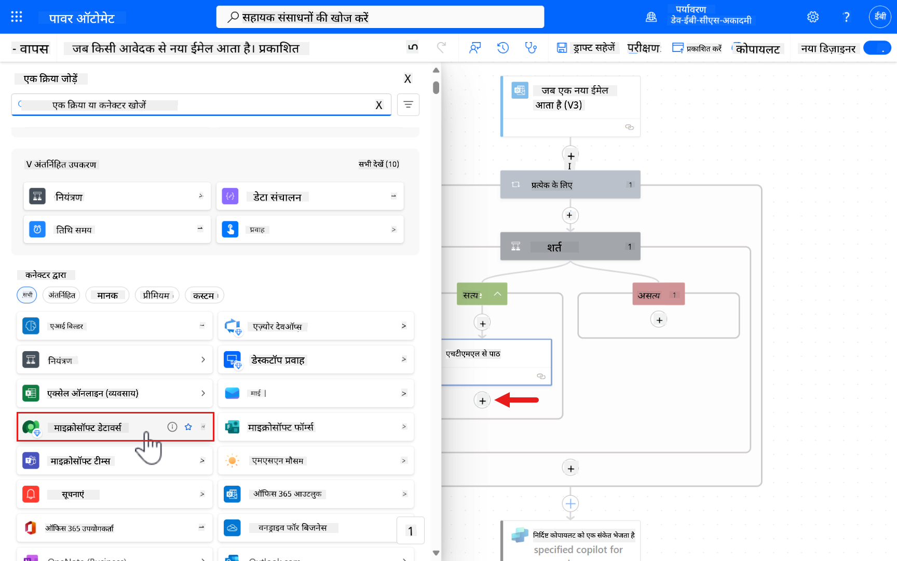

1. **Add a new row** एक्शन चुनें।

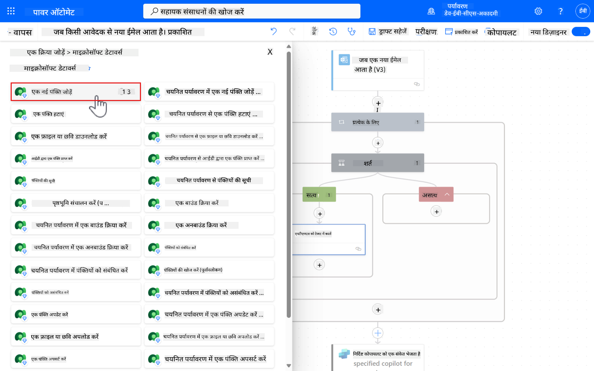

1. एक्शन का नाम बदलने के लिए **Ellipsis (...)** चुनें, निम्नलिखित को नाम के रूप में कॉपी और पेस्ट करें,

```text
Add a new Resume row
```

**Table name** पैरामीटर के लिए, `res` खोजें और **Resumes** टेबल चुनें।

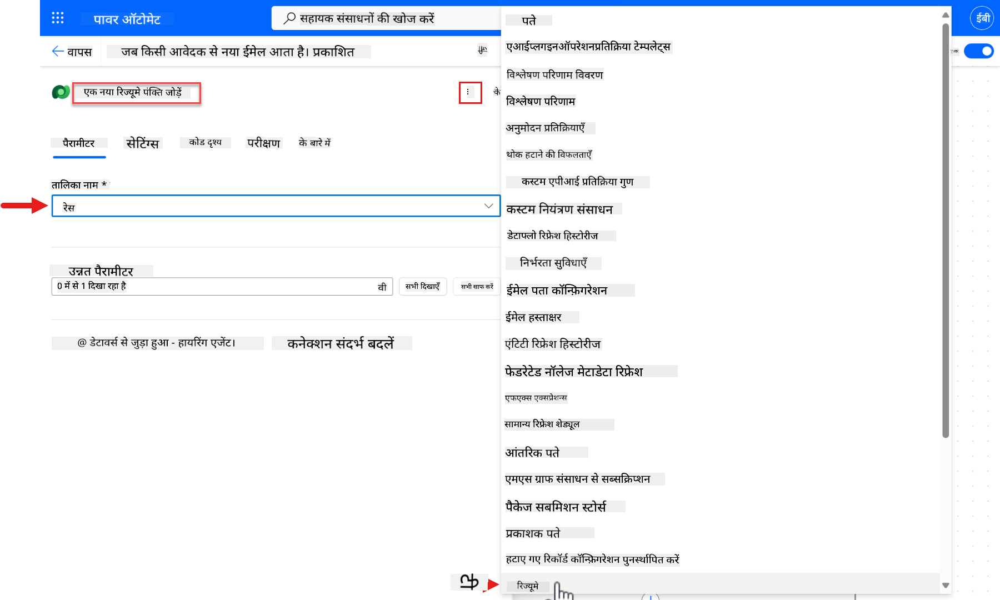

1. अगला **Resume Title** फ़ील्ड चुनें और दाईं ओर **lightning bolt icon** या **fx icon** चुनें।

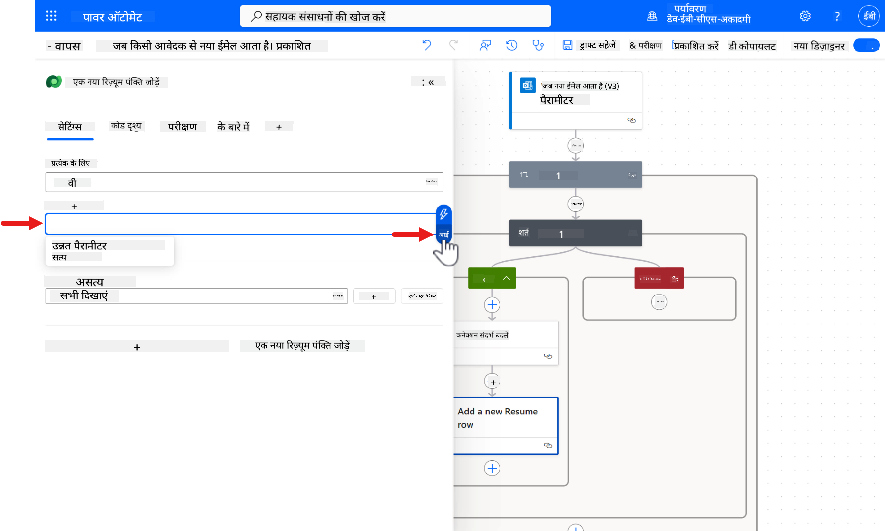

1. **Function tab** में, निम्नलिखित एक्सप्रेशन दर्ज करें जो `item()` फंक्शन का उपयोग करता है।

```text
item()?['name']
```

`item()` फंक्शन के बारे में अधिक जानने के लिए, निम्नलिखित अतिरिक्त लर्निंग ब्लॉक का विस्तार करें।

??? info "अतिरिक्त जानकारी: `item()` फंक्शन"

🤔 **`item()` फंक्शन क्या है?**

- जब आप **Apply to each** एक्शन का उपयोग करते हैं, Power Automate संग्रह (एरे) में प्रत्येक तत्व के माध्यम से जाता है।
- यह अक्सर **Apply to each** (या **For each**), **Select**, या **Filter array** जैसे एक्शन के अंदर उपयोग किया जाता है।

⚙️ **यह कैसे काम करता है?**

- `item()` एक फंक्शन है जो लूप या एरे ऑपरेशन में प्रोसेस किए जा रहे वर्तमान आइटम को लौटाता है।
- उस लूप के अंदर, `item()` प्रोसेस किए जा रहे _वर्तमान तत्व_ को संदर्भित करता है।

📌 **आप इसे कहां उपयोग करते हैं?**

- **Apply to each:** वर्तमान आइटम की प्रॉपर्टीज़ तक पहुंचने के लिए।
- **Select:** एरे में प्रत्येक आइटम को बदलने के लिए।
- **Filter array:** वर्तमान आइटम का मूल्यांकन करने के लिए।

🦋 **उदाहरण**

- लूप के अंदर एक्सप्रेशन:
       -  `item()?['Email']`
- यह वर्तमान आइटम के `Email` प्रॉपर्टी को प्राप्त करता है।

💡 **मुख्य बिंदु**

- `item()` _संदर्भ-संवेदनशील_ है: यह हमेशा उस लूप या एरे ऑपरेशन में वर्तमान आइटम को संदर्भित करता है जिसमें आप हैं।
- यदि आप लूप्स को नेस्ट करते हैं, तो आप `items('LoopName')` का उपयोग करके किसी विशिष्ट लूप में आइटम्स को संदर्भित कर सकते हैं।

**Resume Title** पैरामीटर में एक्सप्रेशन जोड़ने के लिए **Add** चुनें।

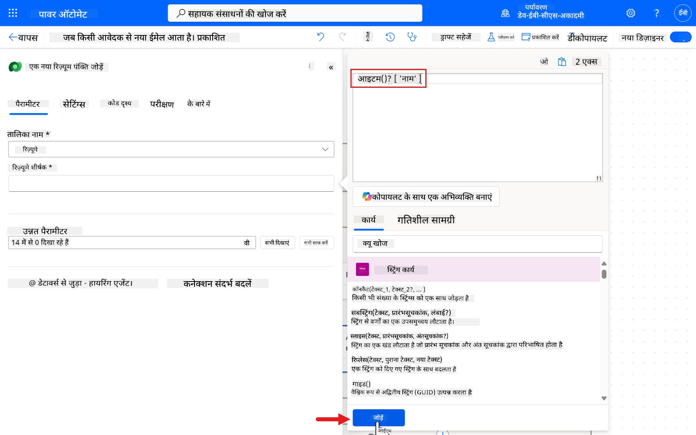

1. हमें अभी भी कई और पैरामीटर कॉन्फ़िगर करने की आवश्यकता है, **Show all** चुनें और **Cover Letter** फ़ील्ड में, दाईं ओर **lightning bolt icon** या **fx icon** चुनें।

**Function tab** में, निम्नलिखित एक्सप्रेशन दर्ज करें जो पिछले [मिशन](../02-multi-agent/README.md) में उपयोग किए गए एक्सप्रेशन का उपयोग करता है।

```text
if(greater(length(body('Html_to_text')), 2000), substring(body('Html_to_text'), 0, 2000), body('Html_to_text'))
```

यह एक्सप्रेशन जांचता है कि क्या **Html to text** एक्शन से _टेक्स्ट_ 2000 कैरेक्टर से लंबा है, और यदि हां, तो केवल पहले 2000 कैरेक्टर लौटाता है; अन्यथा, यह पूरा टेक्स्ट लौटाता है।

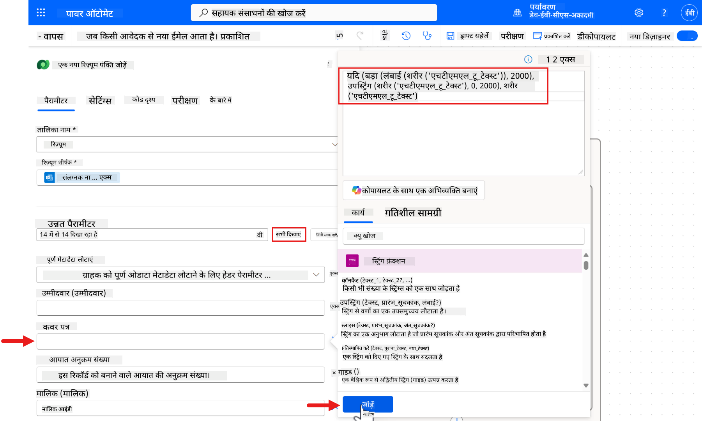

1. अब एक्सप्रेशन **Cover Letter** फ़ील्ड में जोड़ दिया गया है।

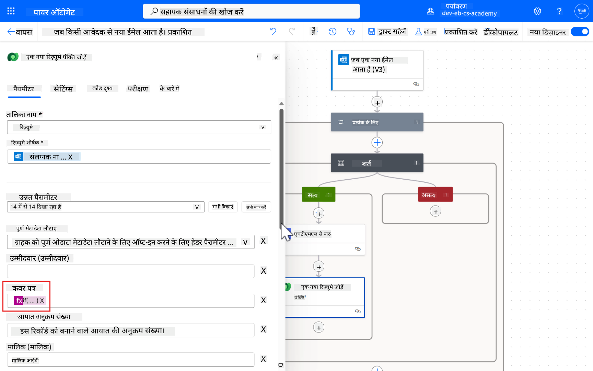

1. **Source Email Address** फ़ील्ड के लिए, `from` खोजें और ट्रिगर से **From** पैरामीटर चुनें क्योंकि इसमें ईमेल एड्रेस का मान होता है।

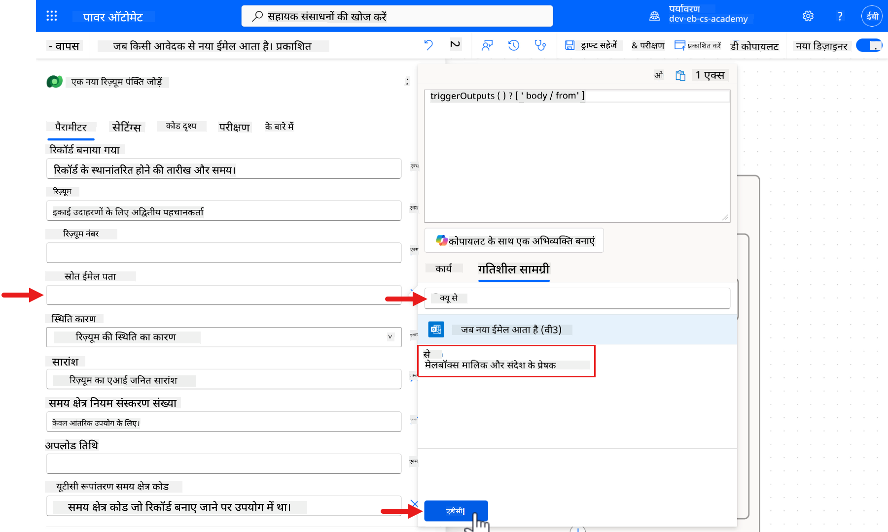

1. **Upload Date** फ़ील्ड के लिए, दाईं ओर **lightning bolt icon** या **fx icon** चुनें। **Function tab** में, निम्नलिखित एक्सप्रेशन दर्ज करें जो `utcNow()` फंक्शन का उपयोग करता है।

```text
utcNow()
```

`utcNow` फंक्शन के बारे में अधिक जानने के लिए, निम्नलिखित अतिरिक्त लर्निंग ब्लॉक का विस्तार करें।

??? info "अतिरिक्त जानकारी: `utcNow` फंक्शन"

🤔 **`utcNow()` फंक्शन क्या है?**

- Power Automate में `utcNow()` फंक्शन वर्तमान तारीख और समय को समन्वित यूनिवर्सल समय (UTC) में ISO 8601 फॉर्मेट में लौटाता है, जैसे: `2025-09-23T04:32:14Z`

🦋 **उदाहरण**

- एक्सप्रेशन:
       -  `concat('Report generated on ', utcNow())`
- आउटपुट है:
       - Report generated on `2025-09-23T04:32:14Z`

💡 **मुख्य बिंदु**


- **कोई तर्क (इनपुट पैरामीटर) आवश्यक नहीं:** यह हमेशा वर्तमान UTC टाइमस्टैम्प देता है।
   - **उपयोग के मामले**
       - लॉग्स या फाइल नामों में टाइमस्टैम्प जोड़ना
       - वर्तमान समय की तुलना अन्य तारीखों से करना
       - शेड्यूलिंग या समय-आधारित शर्तें

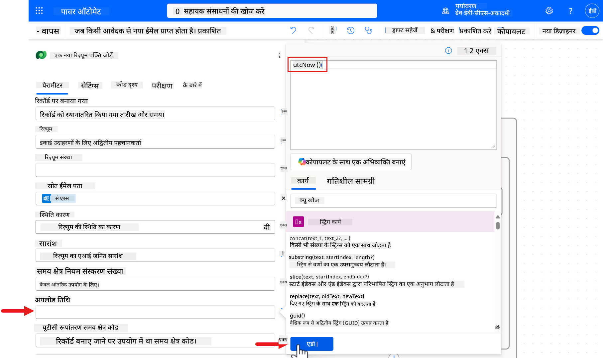

1. हमने अब **Add a new Resume row** एक्शन को कॉन्फ़िगर करना पूरा कर लिया है, तो चलिए पैनल से बाहर निकलते हैं और इसे बंद कर देते हैं।

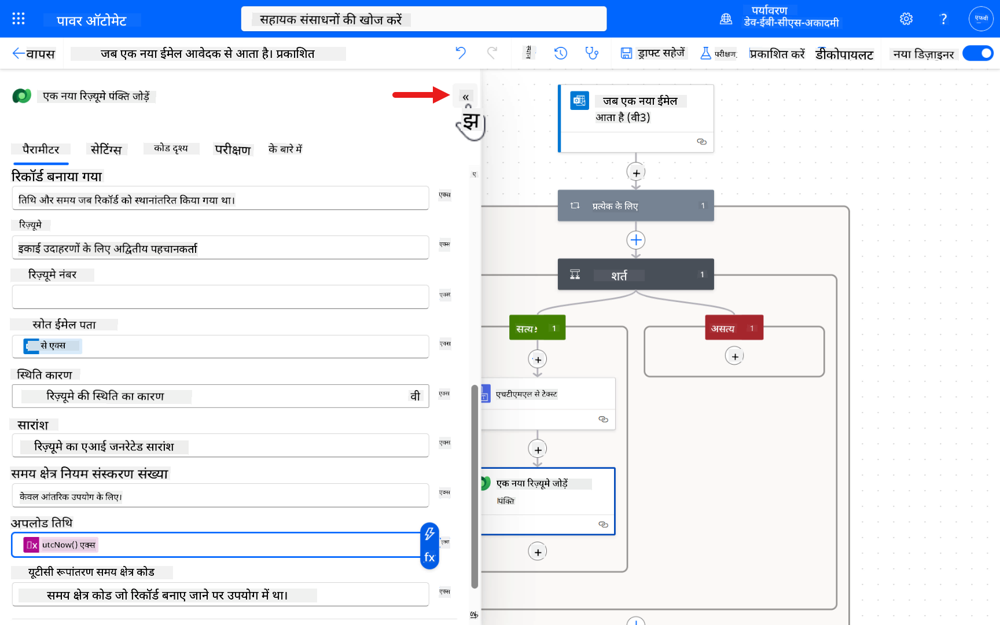

1. हम एक नया एक्शन जोड़ेंगे। इसके लिए **Add a new Resume row** एक्शन के नीचे **+ आइकन** चुनें, जो एक्शन जोड़ने के लिए पैनल लोड करेगा। फिर से **Microsoft Dataverse** कनेक्टर चुनें।

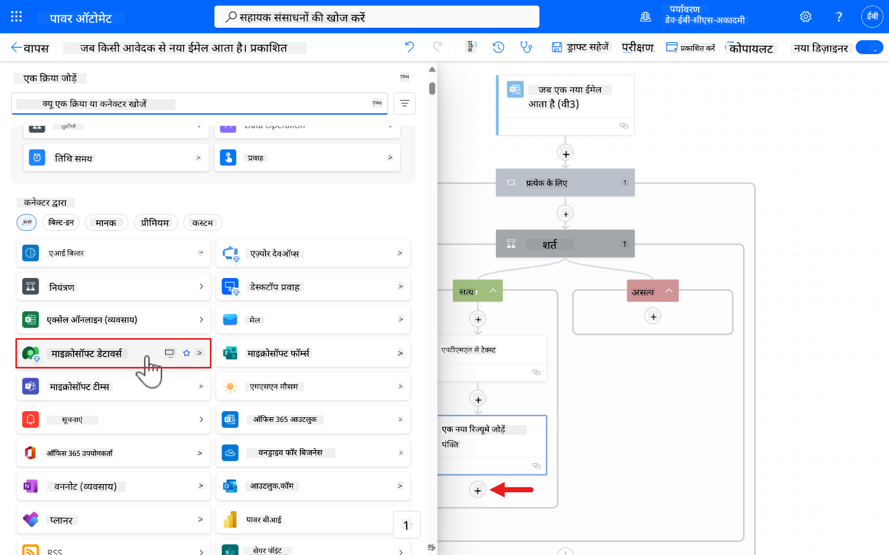

1. **Upload a file or an image** एक्शन चुनें।

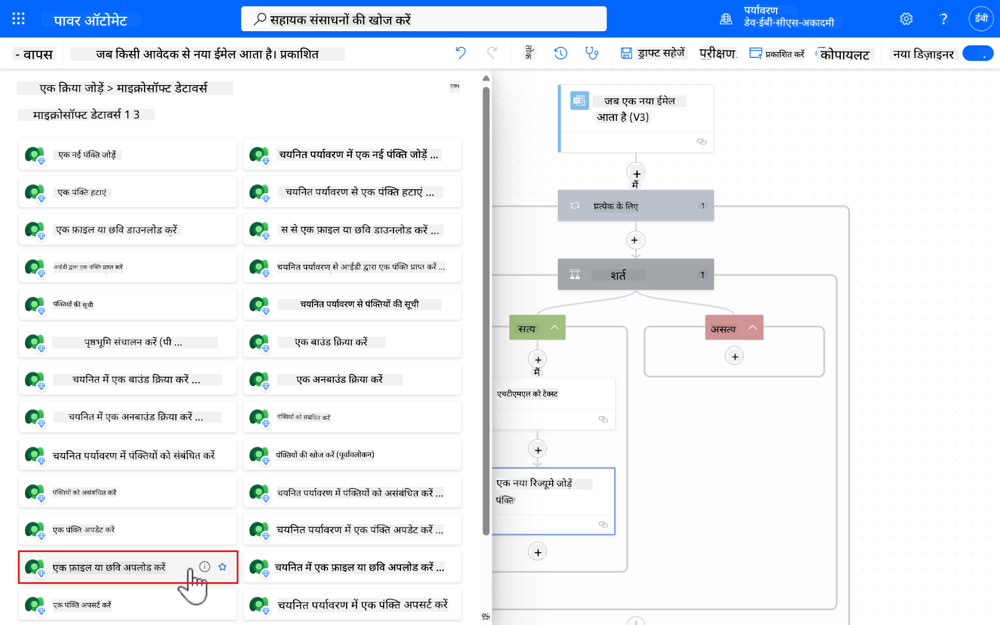

1. **Ellipsis (...)** चुनकर एक्शन का नाम बदलें, निम्नलिखित को कॉपी और पेस्ट करें:

```text
Upload Resume File
```

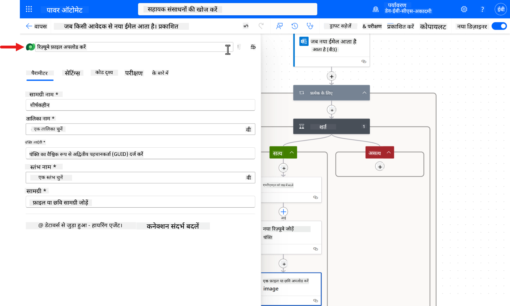

1. अगला **Content name** फ़ील्ड चुनें और दाईं ओर **lightning bolt icon** या **fx icon** चुनें।

   **Function tab** में, निम्नलिखित एक्सप्रेशन दर्ज करें जो `item ()` फ़ंक्शन का उपयोग करता है। यह वर्तमान आइटम (अटैचमेंट फाइल) की `name` प्रॉपर्टी प्राप्त करता है।

```text
item()?['name']
```

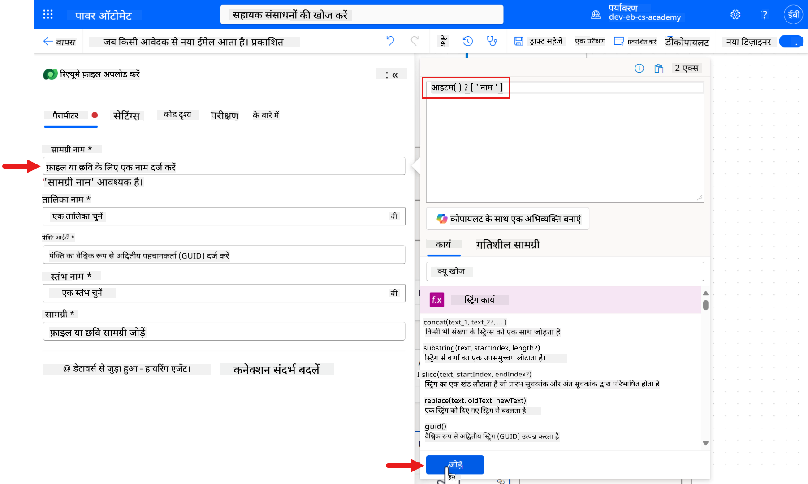

1. **Table name** पैरामीटर के लिए, `res` खोजें और **Resumes** टेबल चुनें।

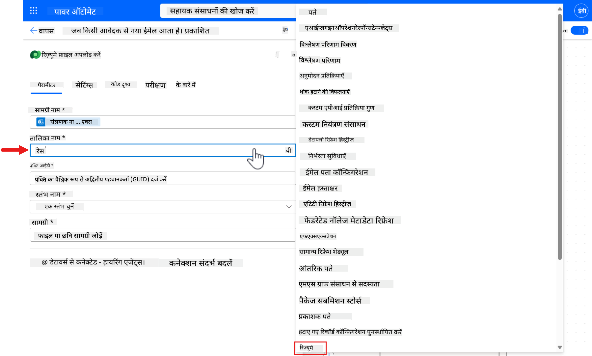

1. अगला **Row ID** फ़ील्ड चुनें और दाईं ओर **lightning bolt icon** या **fx icon** चुनें।

   `ID` खोजें और _Add a new row_ Dataverse एक्शन से **Resume** पैरामीटर चुनें क्योंकि इसमें उस रो का ID मान होता है जिसमें PDF फाइल अपलोड करनी है।

   **Add** चुनें।

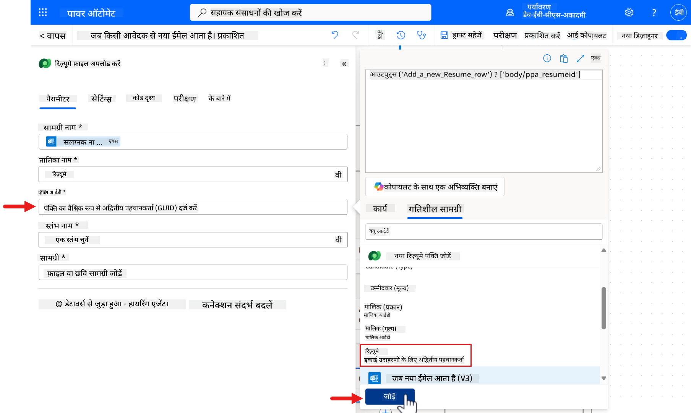

1. **Column name** फ़ील्ड चुनें और **Resume PDF** विकल्प चुनें।

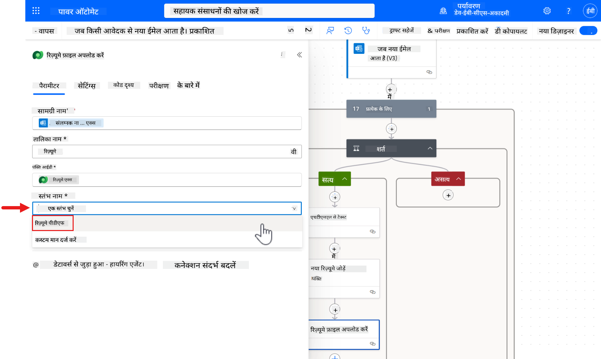

1. **Content** फ़ील्ड चुनें और दाईं ओर **lightning bolt icon** या **fx icon** चुनें।

   **Function tab** में, निम्नलिखित एक्सप्रेशन दर्ज करें जो `item ()` फ़ंक्शन का उपयोग करता है। यह वर्तमान आइटम (अटैचमेंट फाइल) की `contentBytes` प्रॉपर्टी प्राप्त करता है। `contentBytes` एक फाइल या अटैचमेंट के रॉ बाइनरी डेटा को संदर्भित करता है, जिसे Base64 स्ट्रिंग के रूप में एन्कोड किया गया है।

```text
item()?['contentBytes']
```

1. हमने इस एक्शन को कॉन्फ़िगर करना पूरा कर लिया है, तो चलिए एक्शन से बाहर निकलते हैं और पैनल को बंद करते हैं।

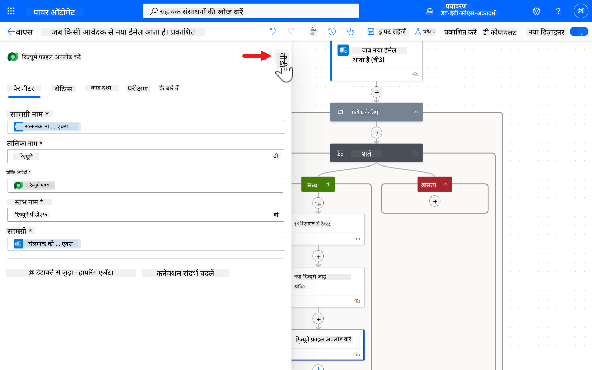

1. अगला, **Sends a prompt to the specified copilot for processing** चुनें, फिर इस एक्शन को _True_ पथ में **Upload Resume File** एक्शन के नीचे खींचें और छोड़ें।

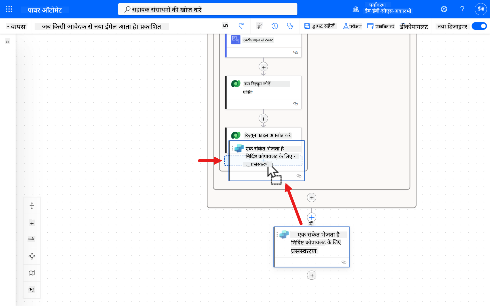

1. **Sends a prompt to the specified copilot for processing** चुनें और इसे कॉन्फ़िगर करें।

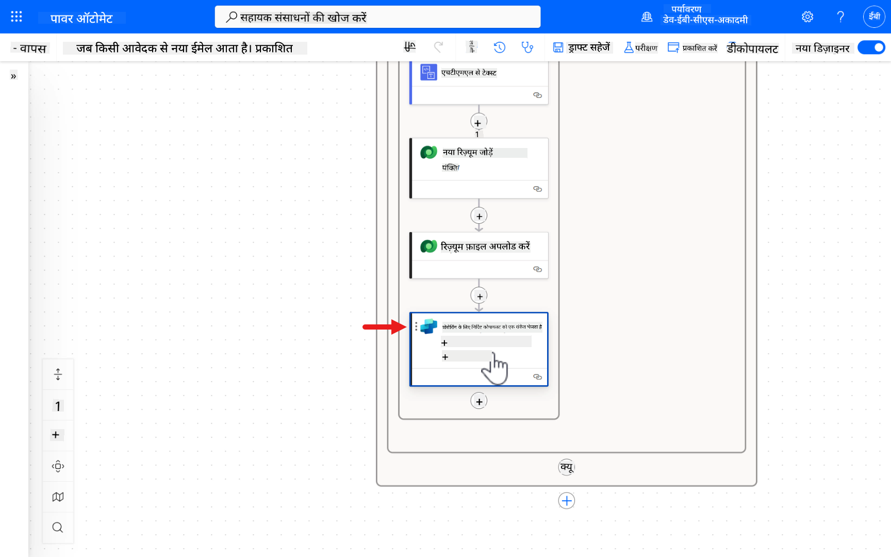

1. **Body/message** फ़ील्ड में, सभी फ़ील्ड सामग्री चुनें और इसे साफ/हटा दें।

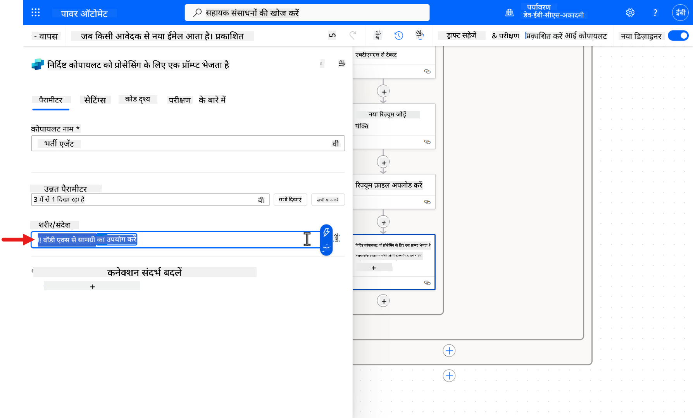

1. निम्नलिखित टेक्स्ट को **Body/message** फ़ील्ड में कॉपी और पेस्ट करें और `RESUME ID PLACEHOLDER` को हाइलाइट करें।

```text
Send [ResumeId (text)] = "RESUME ID PLACEHOLDER" and [ResumeTitle (text_1)] = "RESUME TITLE PLACEHOLDER" and [ResumeNumber (text_2)]= "RESUME NUMBER PLACEHOLDER" to the Tool "Notify Teams Applicant channel" in the child agent "Application Intake Agent"
```

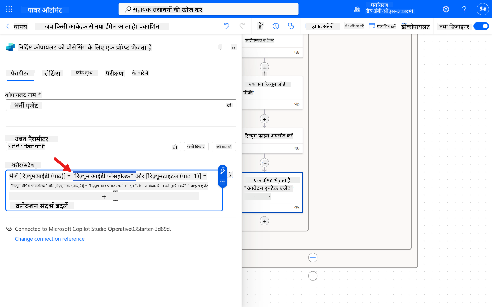

1. **lightning bolt icon** या **fx icon** चुनें।

   `resume` खोजें और _Add a new row Dataverse_ एक्शन से **Resume** पैरामीटर चुनें क्योंकि इसमें Resume रो का `ID` मान होता है।

   **Add** चुनें।

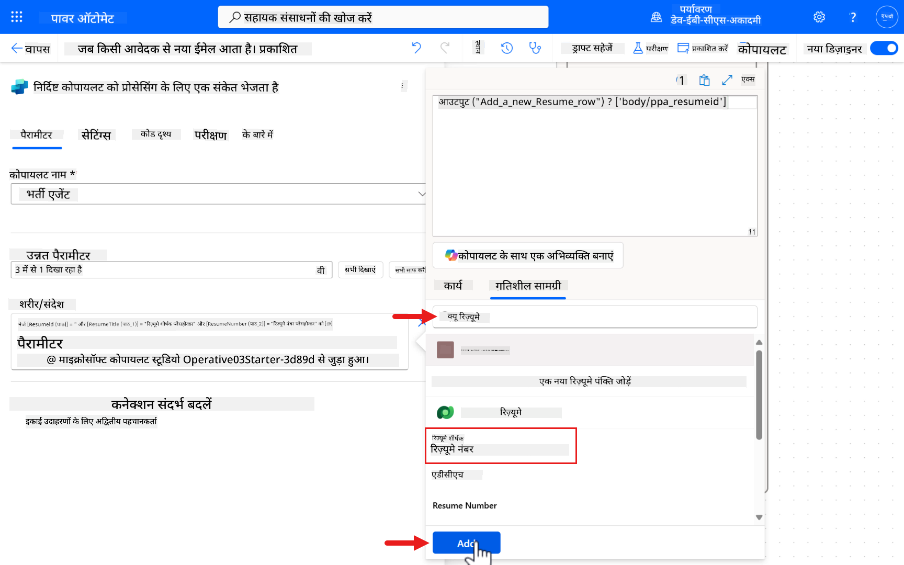

1. `RESUME TITLE PLACEHOLDER` को हाइलाइट करें। **lightning bolt icon** या **fx icon** चुनें।

   `title` खोजें और _Add a new row Dataverse_ एक्शन से **Resume Title** पैरामीटर चुनें क्योंकि इसमें Resume रो का `resume title` मान होता है।

   **Add** चुनें।


1. `RESUME NUMBER PLACEHOLDER` को हाइलाइट करें। **lightning bolt icon** या **fx icon** चुनें।

   `resume number` खोजें और _Add a new row Dataverse_ एक्शन से **Resume Number** पैरामीटर चुनें क्योंकि इसमें Resume रो का `Resume Number` मान होता है।

   **Add** चुनें।

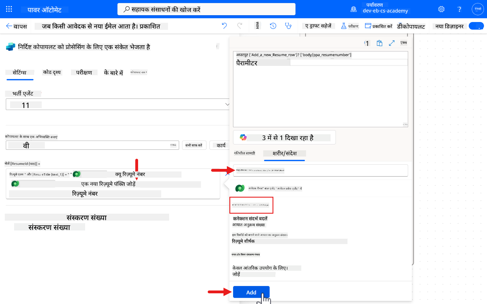

1. हमने इस एक्शन को कॉन्फ़िगर करना और हमारे एजेंट फ्लो को पूरा कर लिया है 🙌🏻 आप बहुत अच्छा कर रहे हैं! अब **Save draft** चुनकर हमारे इवेंट ट्रिगर फ्लो को सेव करें।

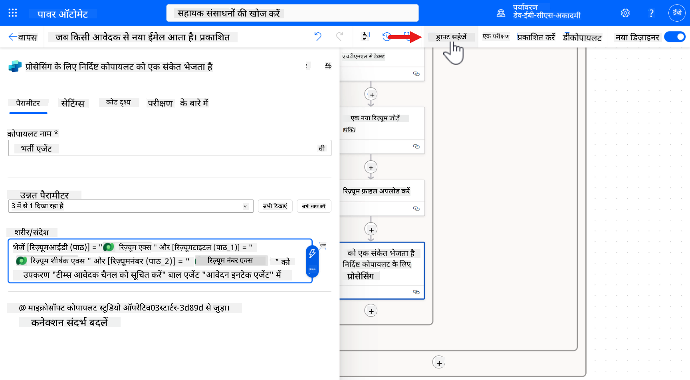

1. अब हमें एजेंट फ्लो के विवरण को संपादित करना है, **Back** चुनें।

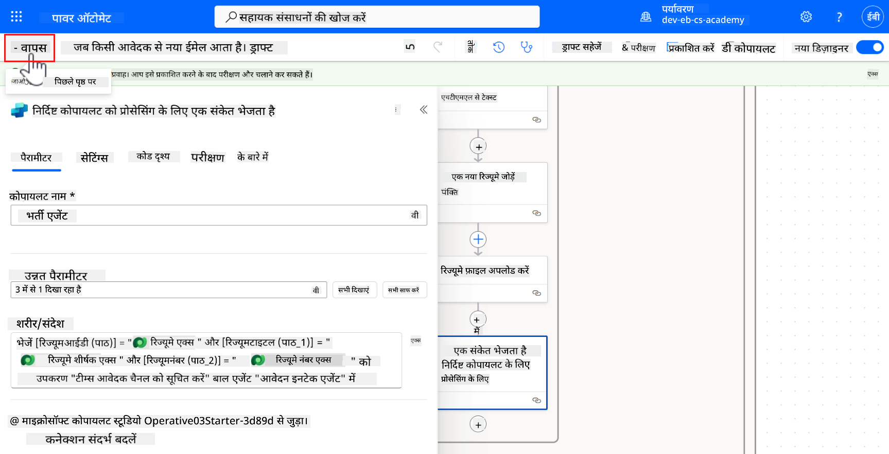

1. **Details** सेक्शन में **Edit** चुनें और **Plan** को **Copilot Studio** विकल्प में अपडेट करें।

   **Save** चुनें।

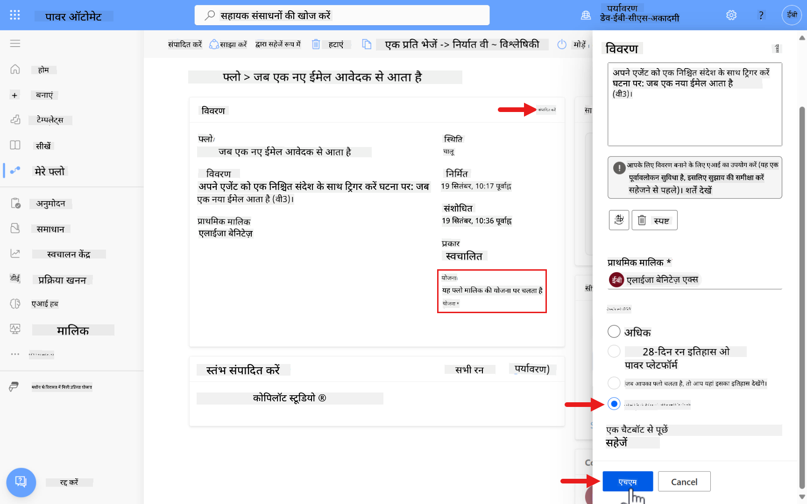

1. एक मोडल दिखाई देगा जो आपसे Copilot Studio प्लान में स्विच करने की पुष्टि करने के लिए कहेगा। **Confirm** चुनें।

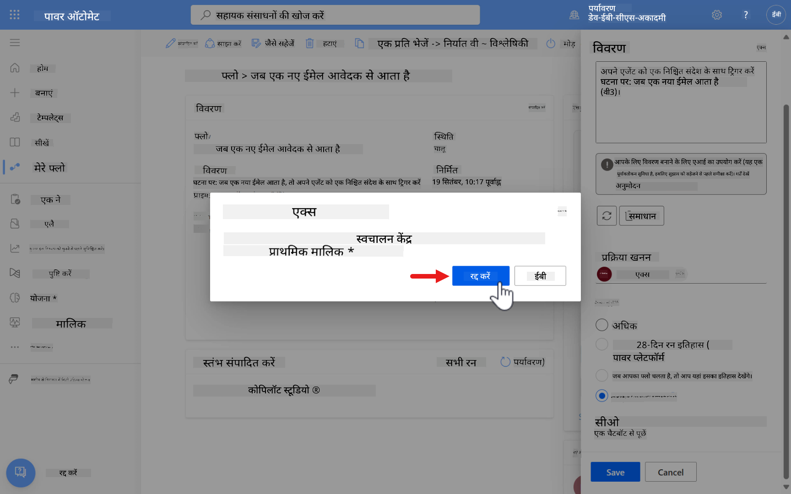

1. प्लान अब **Copilot Studio** में अपडेट हो गया है। **Edit** चुनें क्योंकि हमें हमारे एजेंट के लिए इवेंट ट्रिगर फ्लो को प्रकाशित करना है।

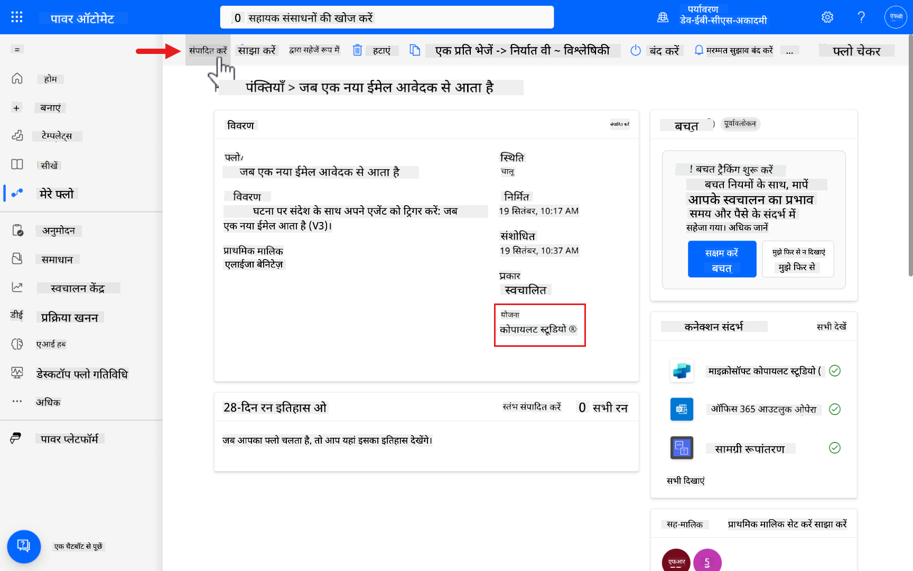

1. **Publish** चुनें।

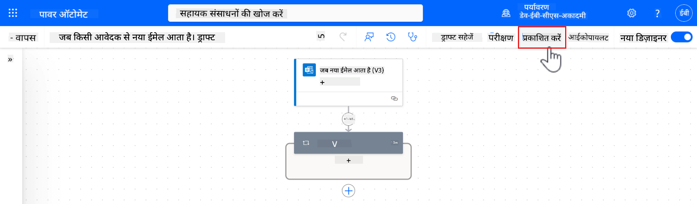

   बधाई हो! इवेंट ट्रिगर फ्लो अब प्रकाशित हो गया है 😃

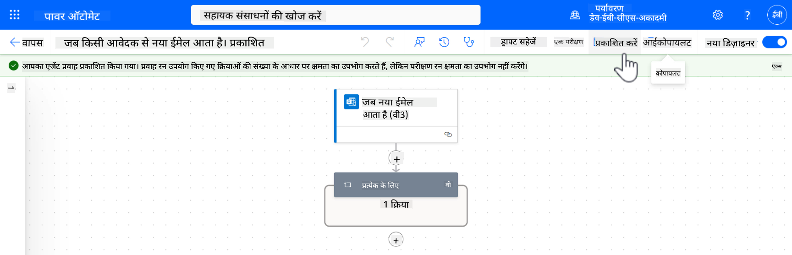

अब चलिए एक नया एजेंट फ्लो बनाते हैं जिसे चाइल्ड **Intake Application Agent** द्वारा इनवोक किया जाएगा।

### लैब 3.2 - एक एडैप्टिव कार्ड का उपयोग करके Teams चैनल को सूचित करें

अब हम चाइल्ड **Intake Application Agent** के लिए एक नया एजेंट फ्लो बनाने जा रहे हैं जो इवेंट ट्रिगर द्वारा पास किए गए मानों का उपयोग करता है, ताकि एक एडैप्टिव कार्ड को Teams चैनल में पोस्ट किया जा सके। यह एडैप्टिव कार्ड HR भर्ती टीम को उस PDF के बारे में सूचित करेगा जो स्वचालित रूप से अपलोड किया गया था ताकि वे इसे समीक्षा कर सकें।

चलो शुरू करें!

1. **Hiring Agent** में **Agents** टैब चुनें और **Application Intake Agent** चुनें।

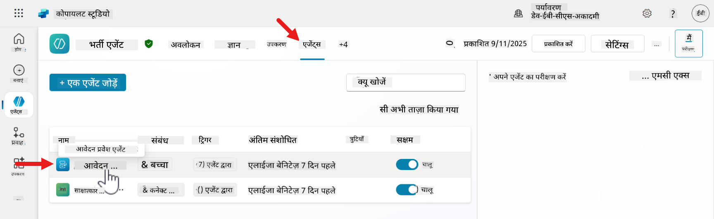

1. **Tools** तक स्क्रॉल करें और **+ Add** चुनें।

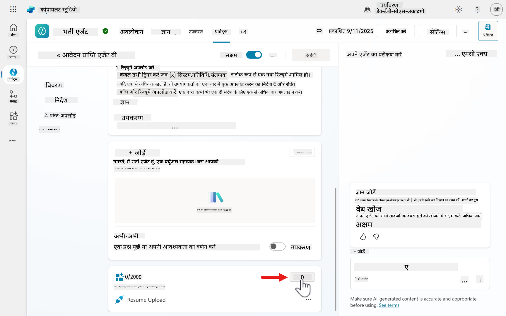

1. **Add tool** मोडल दिखाई देगा। **+ New tool** चुनें।

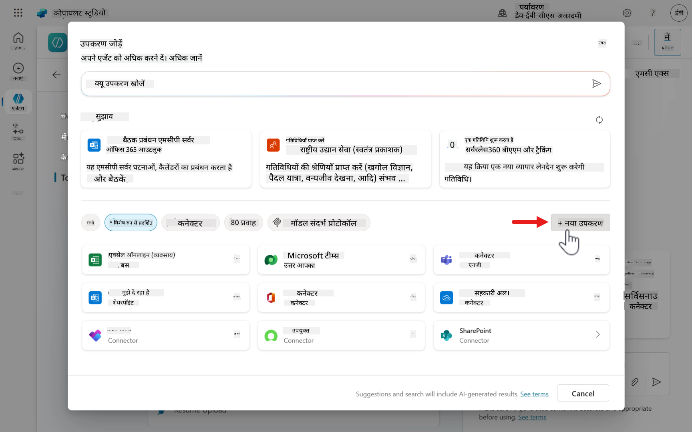

1. **Agent flow** चुनें।

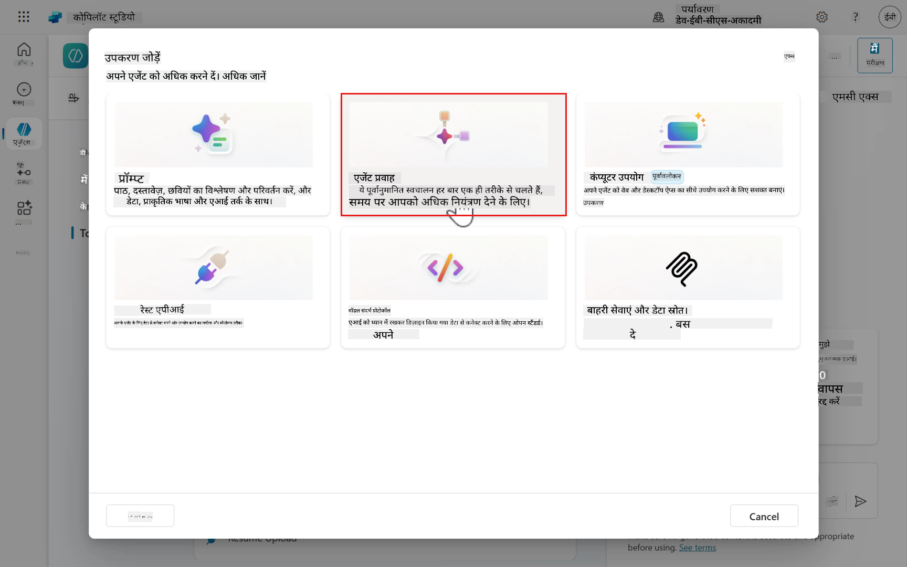

1. **agent flow designer** लोड होगा। **When an agent calls the flow** ट्रिगर में, **+ Add an input** चुनें।

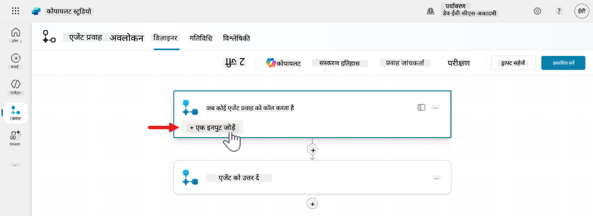

1. उपयोगकर्ता इनपुट के प्रकार के रूप में **Text** चुनें।

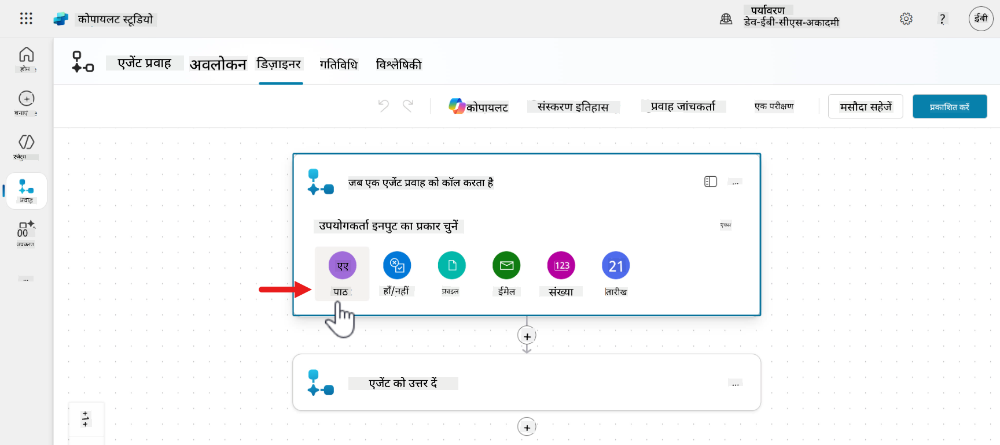

1. इनपुट टेक्स्ट फ़ील्ड में, इनपुट पैरामीटर नाम के लिए निम्नलिखित को कॉपी और पेस्ट करें।

```text
ResumeId
```

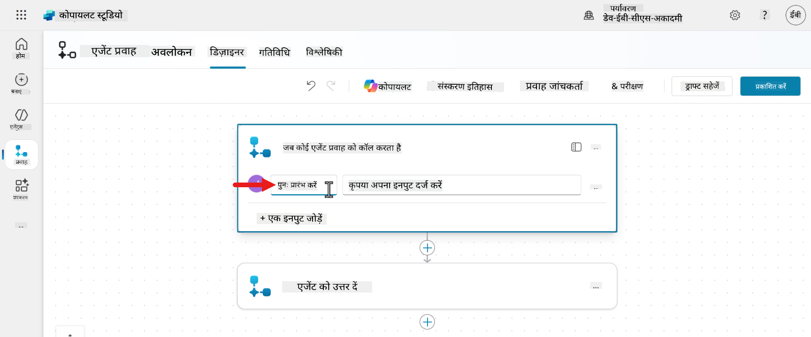

1. दूसरा टेक्स्ट इनपुट जोड़ने के लिए वही चरण दोहराएं। इनपुट पैरामीटर नाम के लिए निम्नलिखित को कॉपी और पेस्ट करें।

```text
ResumeTitle
```

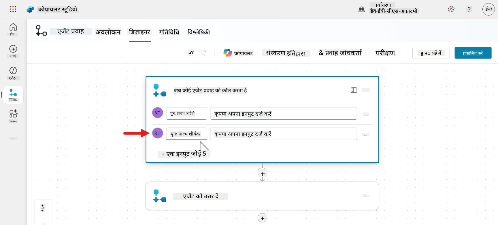

1. तीसरा टेक्स्ट इनपुट जोड़ने के लिए वही चरण दोहराएं। इनपुट पैरामीटर नाम के लिए निम्नलिखित को कॉपी और पेस्ट करें।

```text
ResumeNumber
```

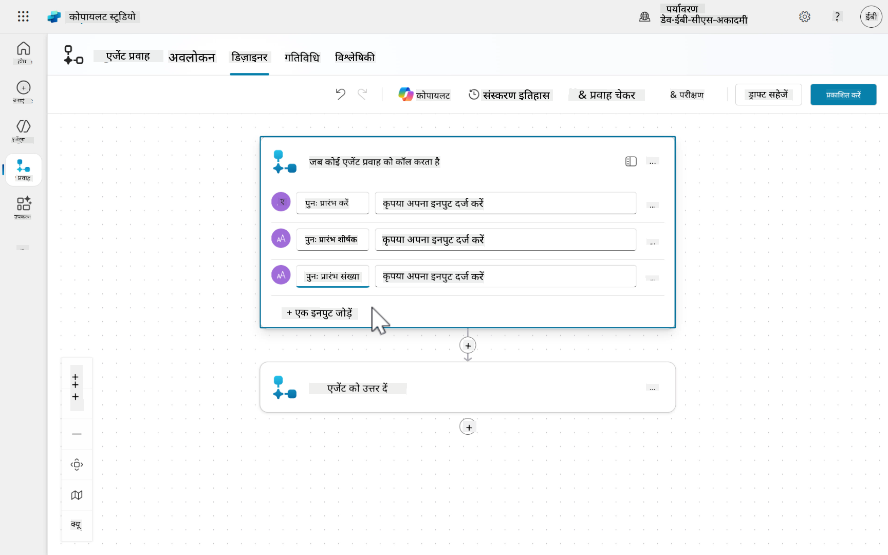

1. याद है कैसे [Recruit](../../recruit/08-add-adaptive-card/README.md#81-create-a-new-topic-with-an-adaptive-card-for-user-to-submit-their-request) में हमने एक टॉपिक के भीतर एक एडैप्टिव कार्ड जोड़ा था? इस बार, हम एक एजेंट फ्लो में एक एडैप्टिव कार्ड जोड़ने जा रहे हैं। अब हम अपने एजेंट फ्लो में एक और एक्शन जोड़ने जा रहे हैं जो एक एडैप्टिव कार्ड को Teams चैनल में पोस्ट करेगा।

   ट्रिगर के नीचे **+ आइकन** चुनें।

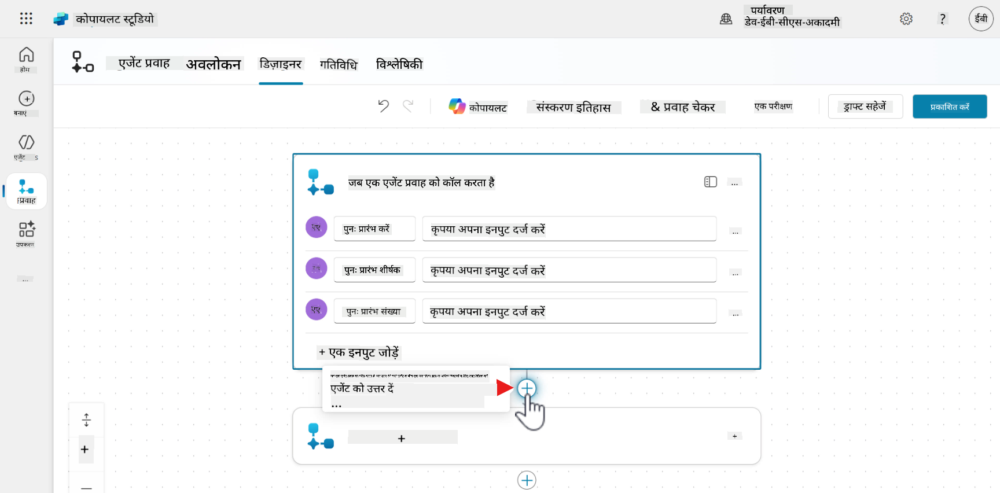

1. **Post card in a chat or channel** एक्शन चुनें।

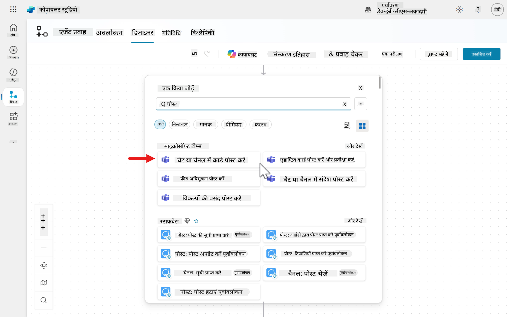

1. Microsoft Teams के लिए आपके साइन इन उपयोगकर्ता खाते के साथ एक कनेक्शन रेफरेंस बनाना होगा। **Sign in** चुनें।

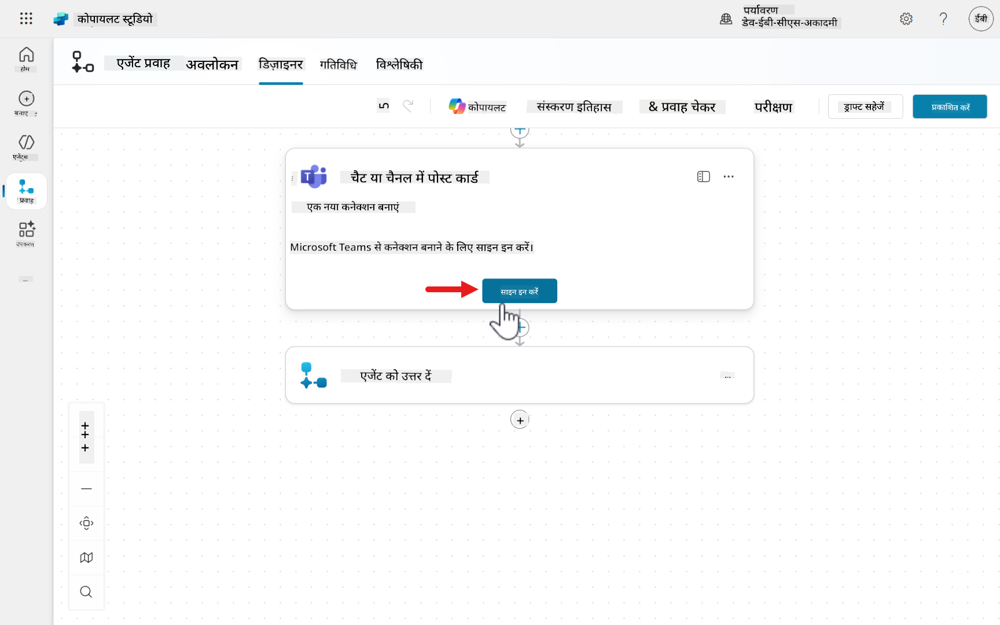

1. अपना उपयोगकर्ता खाता चुनें और फिर **Allow access** चुनें।

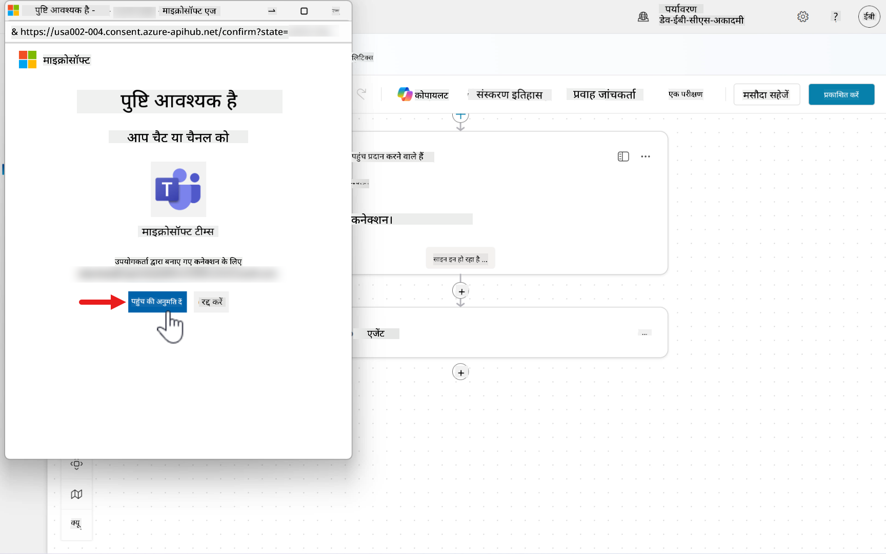

1. निम्नलिखित इनपुट पैरामीटर के लिए,

   | पैरामीटर | कैसे सेट करें | विवरण |
   |----------|------------|---------|
   | **Post as** | ड्रॉपडाउन | `Flow bot` विकल्प चुनें |
   | **Post in** | ड्रॉपडाउन | `Channel` विकल्प चुनें |
   | **Team** | ड्रॉपडाउन | अपनी एनवायरनमेंट में उपलब्ध किसी टीम को चुनें, जिसे आप इस लैब अभ्यास को पूरा करने के लिए एक्सेस कर सकते हैं |
   | **Channel** | ड्रॉपडाउन | अपनी एनवायरनमेंट में उपलब्ध किसी चैनल को चुनें, जिसे आप इस लैब अभ्यास को पूरा करने के लिए एक्सेस कर सकते हैं |

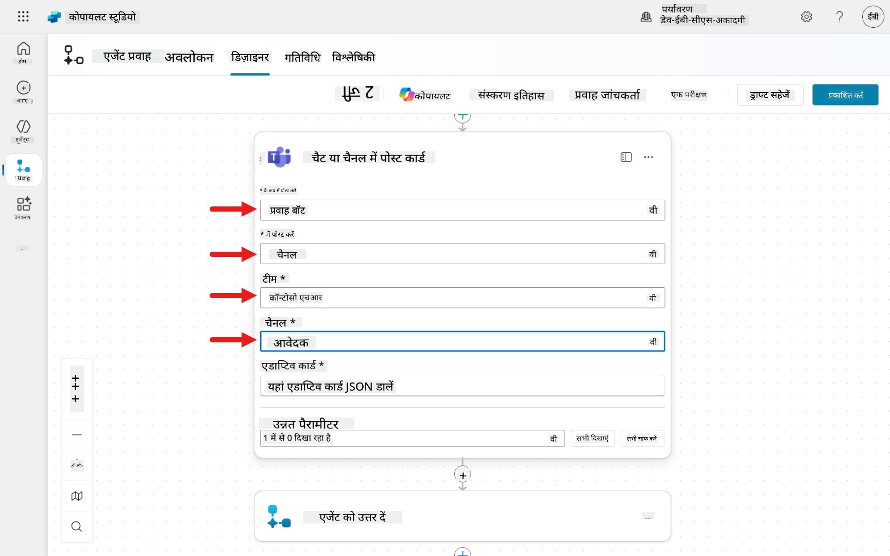

1. अगला, हम **Adaptive Card** फ़ील्ड को कॉन्फ़िगर करेंगे। **Adaptive Card** फ़ील्ड चुनें।

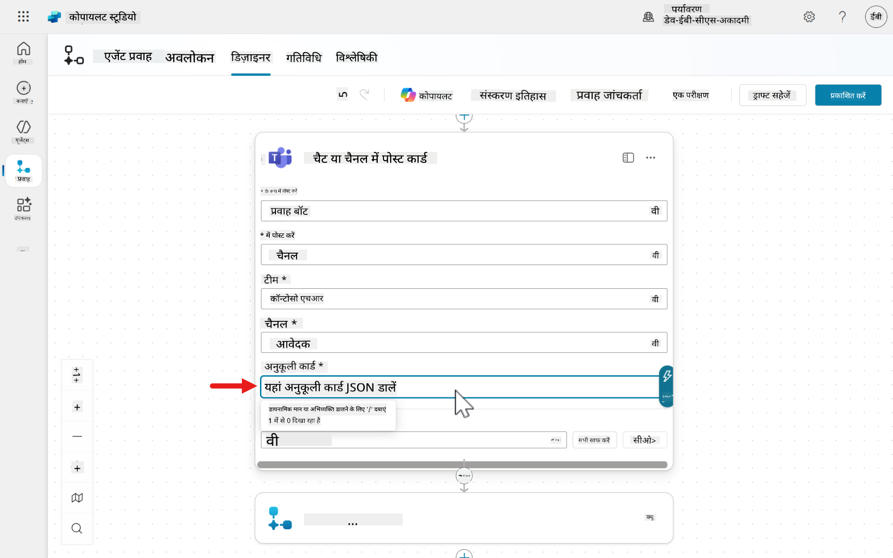

1. [Resume Table Updated JSON file](../../../../../docs/operative-preview/03-automate-triggers/assets/3.2_ResumeTableUpdated.json) खोलें, इसकी पूरी सामग्री कॉपी करें और इसे Adaptive Card फ़ील्ड में पेस्ट करें।

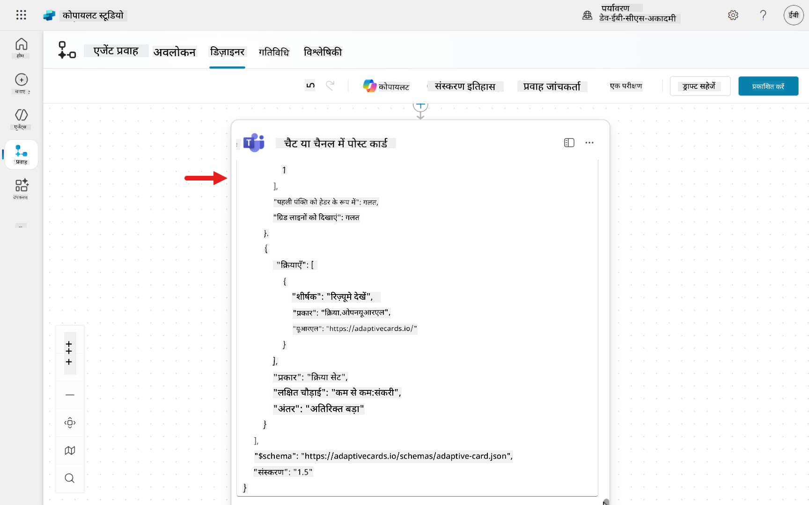

1. जैसे हमने [Recruit](../../recruit/08-add-adaptive-card/README.md#81-create-a-new-topic-with-an-adaptive-card-for-user-to-submit-their-request) में किया था, हम JSON पेलोड में मौजूदा मानों को वास्तविक मानों या डायनामिक कंटेंट से बदलने जा रहे हैं।

   सबसे पहले, चलिए `selectAction` प्रॉपर्टी के भीतर `url` प्रॉपर्टी के लिए URL को अपडेट करते हैं। इस URL को **Hiring Hub** मॉडल-ड्रिवन ऐप में Resumes सिस्टम व्यू के URL से बदल दिया जाएगा। इससे रिक्रूटर को एक्शन चुनने और मॉडल-ड्रिवन ऐप में Resumes सिस्टम व्यू पर निर्देशित होने की अनुमति मिलेगी।

   वर्तमान URL मान को हाइलाइट करें और इसे हटा दें।

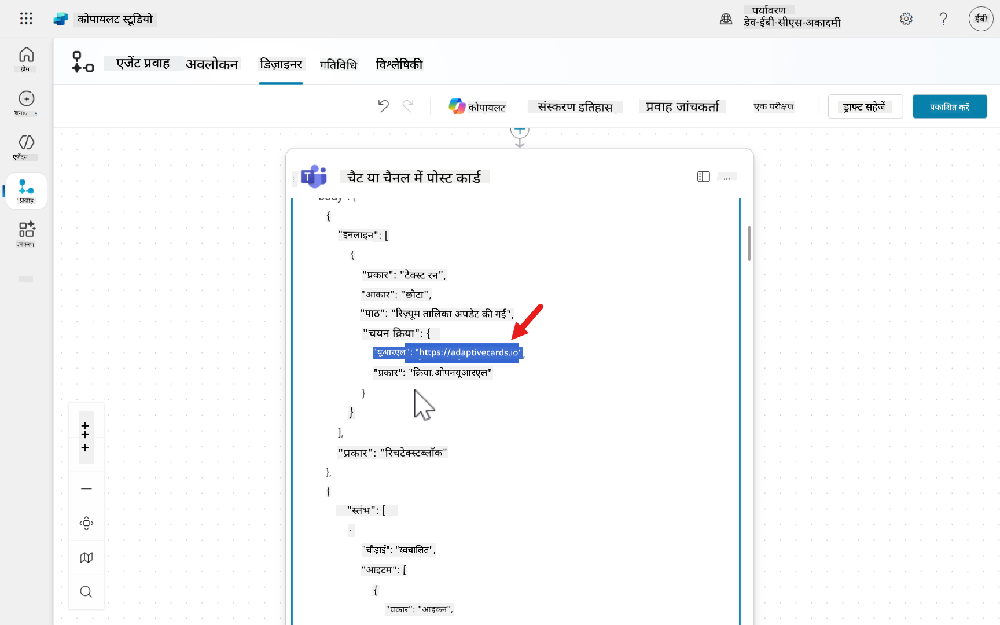

1. **Hiring Hub** मॉडल-ड्रिवन ऐप में, बाईं ओर के मेन्यू का उपयोग करके **Resumes** सिस्टम व्यू पर जाएं और URL कॉ
1. आपको निम्नलिखित देखना चाहिए, जहां पीले रंग में हाइलाइट किया गया है, वह **Hiring Hub** मॉडल-ड्रिवन ऐप का आपका पर्यावरण विवरण है।

     | पैरामीटर | मान | व्याख्या |
     |----------|------------|---------|
     | **Organization URI** | GUID | Dataverse/Dynamics 365 पर्यावरण संगठन URL |
     | **appid** | GUID | किसी विशेष मॉडल-ड्रिवन ऐप को खोलने के लिए, appid या appname क्वेरी पैरामीटर का उपयोग किया जाता है। इस मामले में, appid का उपयोग किया गया है |
     | **viewid** | GUID | क्वेरी पैरामीटर जो व्यू का id है |

       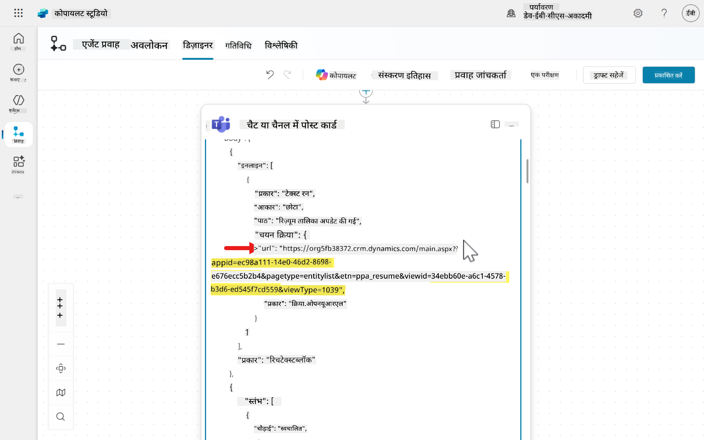

1. अगला, हम कई गुणों के लिए डायनामिक कंटेंट मान जोड़ेंगे। आइए उस टेक्स्ट से शुरू करें जो उस पंक्ति के रिज्यूमे नंबर संदर्भ को दिखाएगा जिसे इवेंट ट्रिगर द्वारा स्वतः बनाया गया था।

      **पैनल** आइकन का चयन करें ताकि एक्शन पैनल लोड हो सके।

       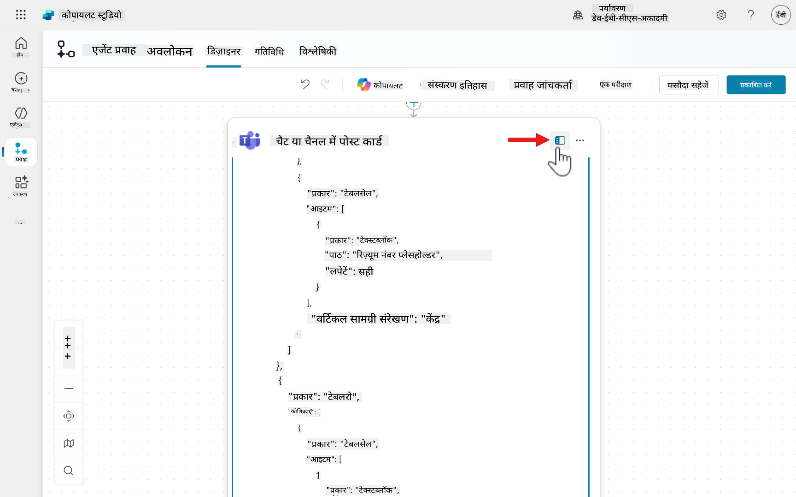

1. उस लाइन तक स्क्रॉल करें जहां आप `RESUME NUMBER PLACEHOLDER` के लिए `text` प्रॉपर्टी देखते हैं। प्लेसहोल्डर मान को हाइलाइट करें और इसे हटा दें।

       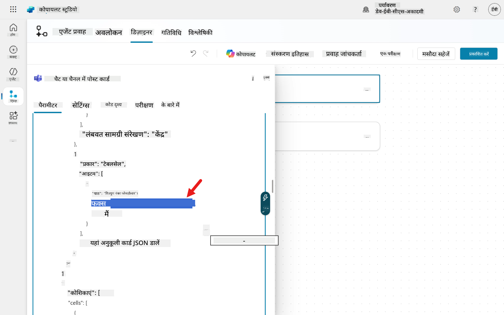

1. डबल कोटेशन मार्क्स के बीच क्लिक करें और दाईं ओर **लाइटनिंग बोल्ट आइकन** या **fx आइकन** का चयन करें।

      **Dynamic Content** टैब में **ResumeNumber** पैरामीटर का चयन करें और **Add** चुनें।

       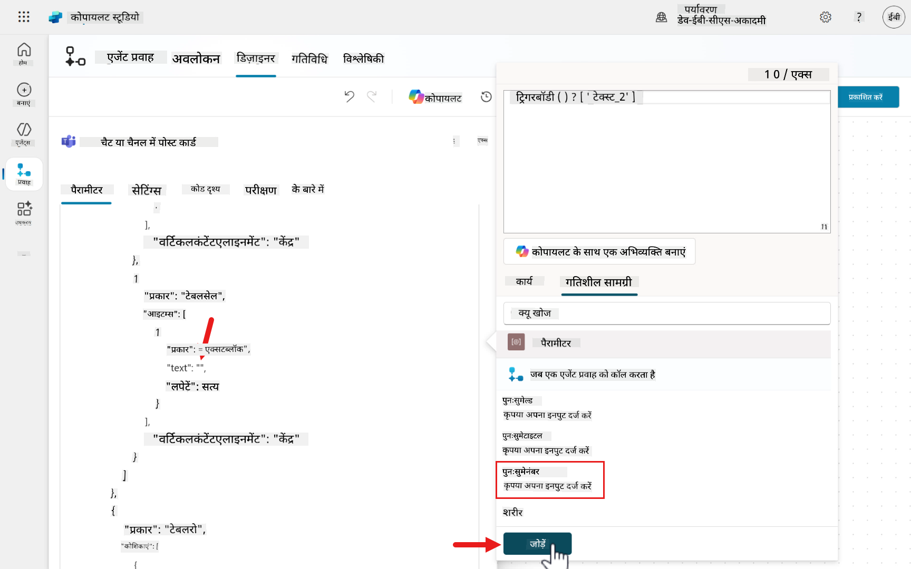

1. **ResumeNumber** पैरामीटर अब `text` प्रॉपर्टी में डायनामिक कंटेंट के रूप में जोड़ा जाएगा।

       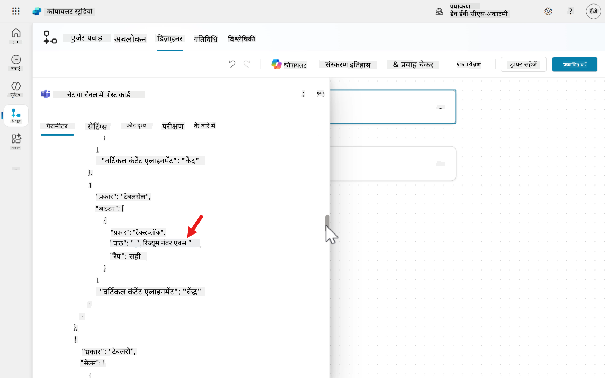

1. हम वही चरण `RESUME NAME PLACEHOLDER` के लिए दोहराएंगे। उस लाइन तक स्क्रॉल करें जहां आप `RESUME NAME PLACEHOLDER` के लिए `text` प्रॉपर्टी देखते हैं। प्लेसहोल्डर मान को हाइलाइट करें और इसे हटा दें।

       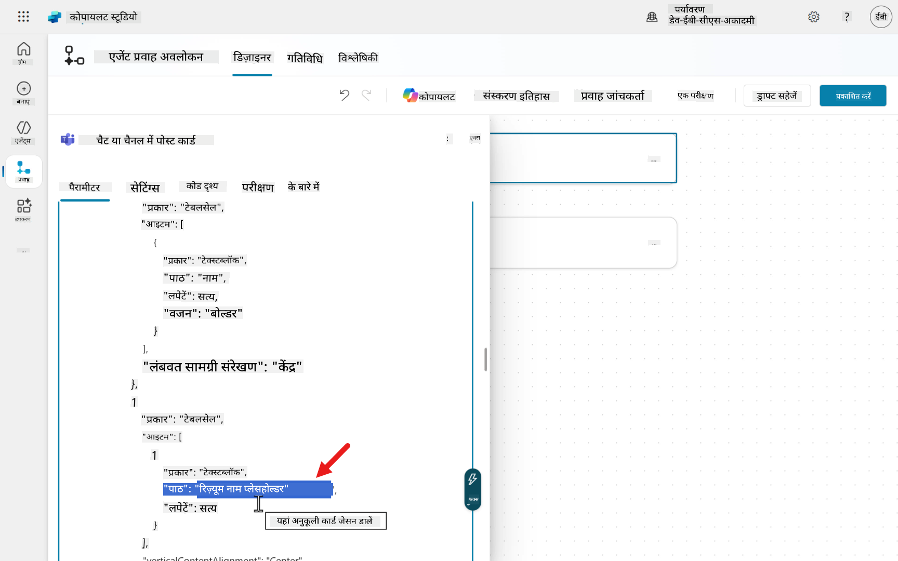

1. डबल कोटेशन मार्क्स के बीच क्लिक करें और दाईं ओर **लाइटनिंग बोल्ट आइकन** या **fx आइकन** का चयन करें।

      **Dynamic Content** टैब में **ResumeTitle** पैरामीटर का चयन करें और **Add** चुनें।

       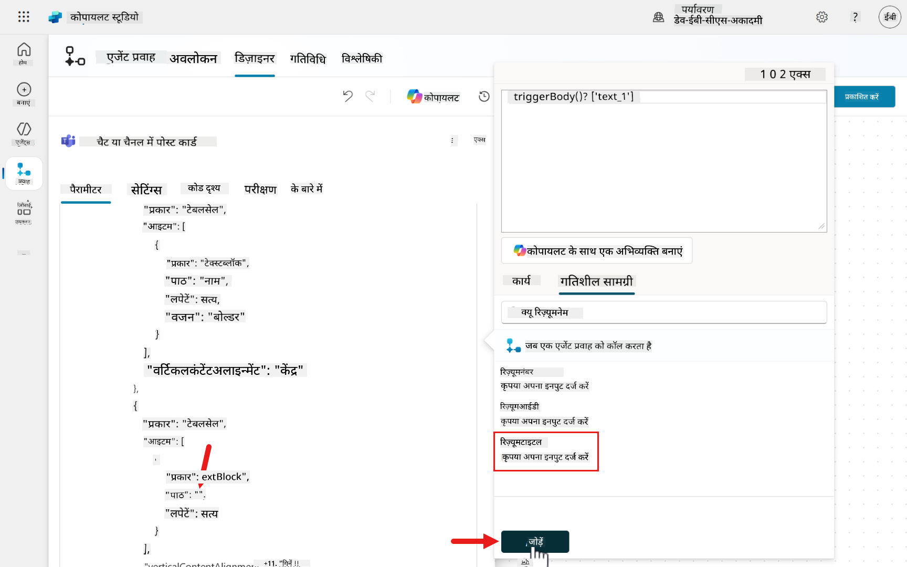

1. **ResumeTitle** पैरामीटर अब `text` प्रॉपर्टी में डायनामिक कंटेंट के रूप में जोड़ा जाएगा।

       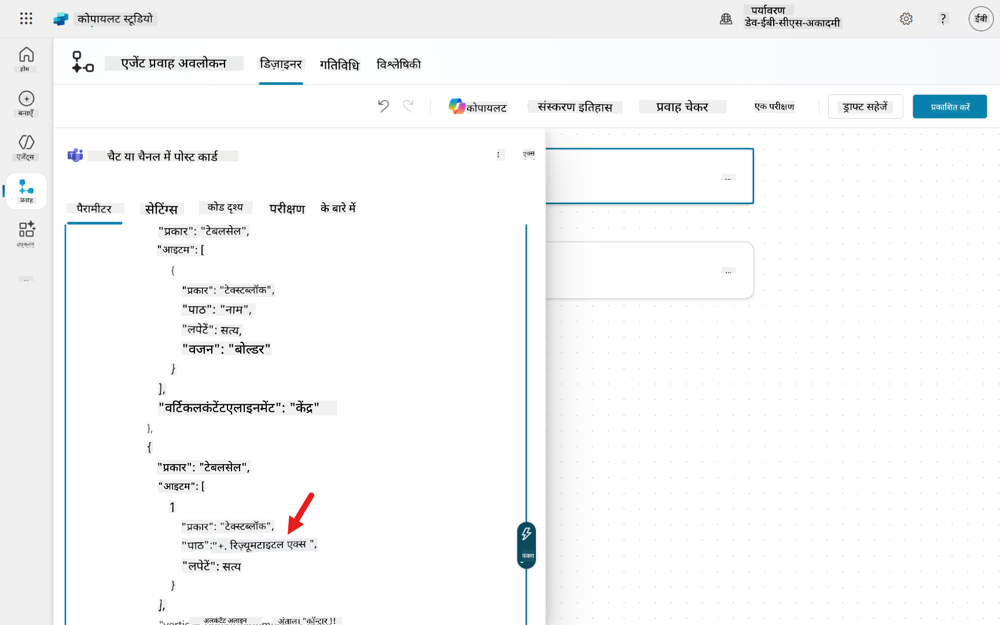

1. हम वही चरण **Due Date** मान के लिए दोहराएंगे जो यह दर्शाता है कि एक रिक्रूटर को रिज्यूमे की समीक्षा कब तक करनी चाहिए। उस लाइन तक स्क्रॉल करें जहां आप `May 21, 2023` के लिए `text` प्रॉपर्टी देखते हैं।

       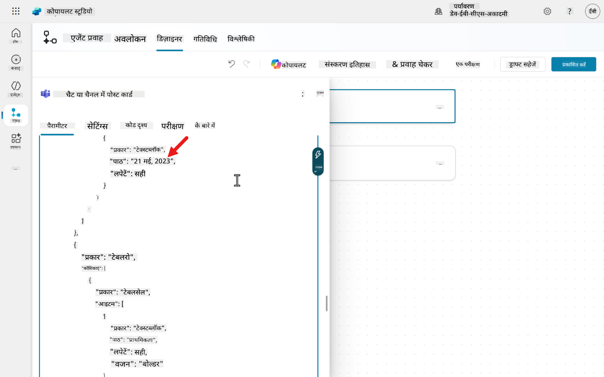

1. इस तारीख के प्लेसहोल्डर मान को हटा दें और डबल कोटेशन मार्क्स के बीच क्लिक करें।

       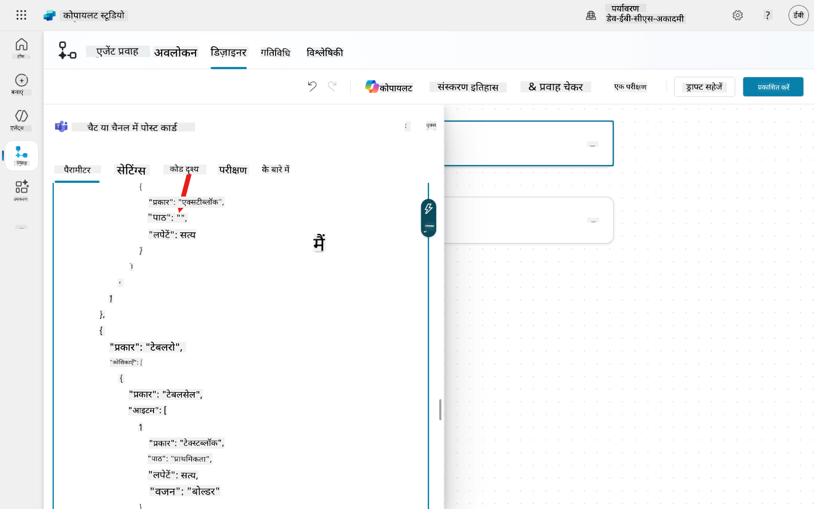

1. दाईं ओर **लाइटनिंग बोल्ट आइकन** या **fx आइकन** का चयन करें और **Function** टैब में निम्नलिखित एक्सप्रेशन दर्ज करें और **Add** चुनें।

       ```text
       addDays(utcNow(), 3, 'MMM dd, yyyy')
       ```

      यह एक्सप्रेशन दो फंक्शन्स का उपयोग करता है।

     | फंक्शन | व्याख्या |
     |----------|------------|
     | **addDays** | किसी दिए गए तारीख में निर्दिष्ट दिनों की संख्या जोड़ता है और परिणामस्वरूप तारीख को स्ट्रिंग फॉर्मेट में लौटाता है |
     | **utcNow** | वर्तमान तारीख और समय को Coordinated Universal Time (UTC) फॉर्मेट में स्ट्रिंग के रूप में लौटाता है। |

      utcNow मान के लिए, हम तारीख को महीने और तारीख, उसके बाद वर्ष के रूप में फॉर्मेट कर रहे हैं।

       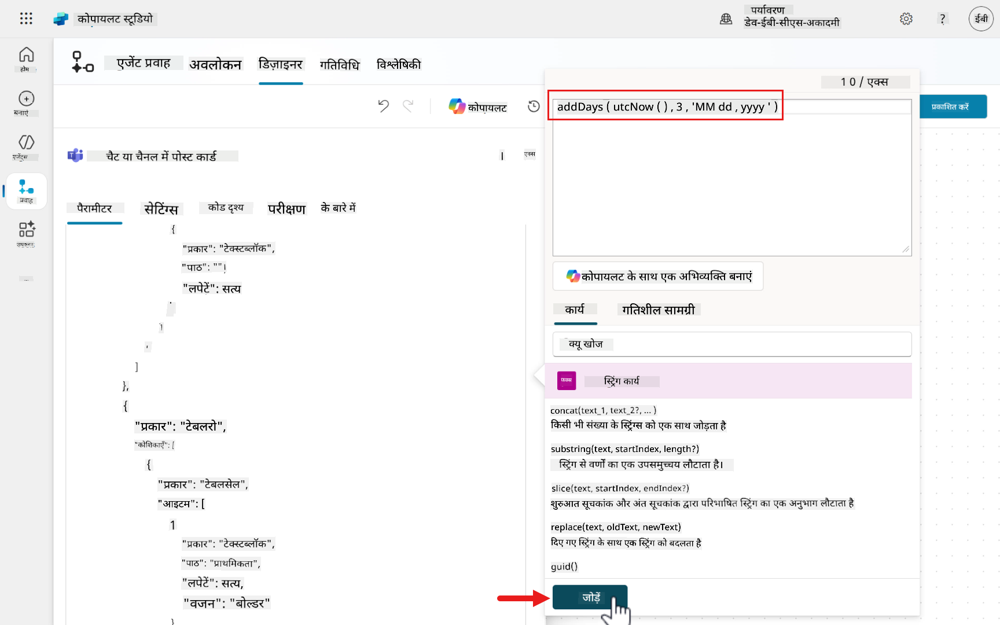

      एक्सप्रेशन अब `text` प्रॉपर्टी में जोड़ा जाएगा।

       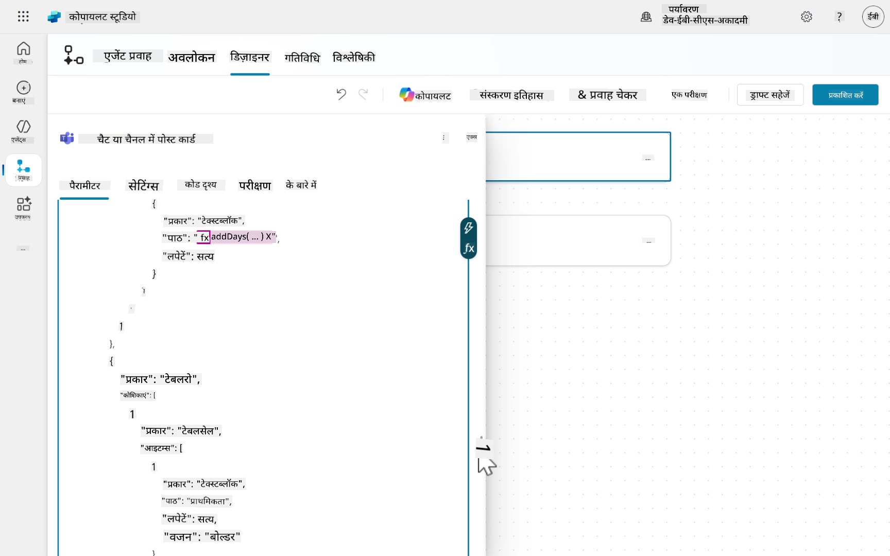

1. अंत में, हम JSON पेलोड के `actions` ऐरे प्रॉपर्टी के भीतर `url` प्रॉपर्टी के लिए URL को अपडेट करेंगे। वर्तमान प्लेसहोल्डर URL को **Hiring Hub** मॉडल-ड्रिवन ऐप में रिज्यूमे पंक्ति के URL से बदल दिया जाएगा। यह रिक्रूटर को एडैप्टिव कार्ड के `Action.OpenURL` एक्शन का चयन करने और मॉडल-ड्रिवन ऐप में रिज्यूमे पर निर्देशित होने की अनुमति देगा।

       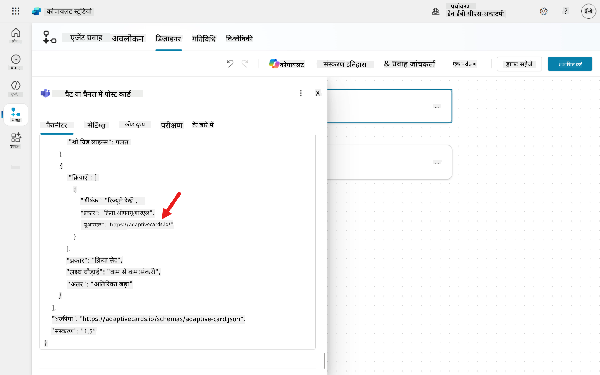

1. **Hiring Hub** मॉडल-ड्रिवन ऐप में, बाईं ओर के मेनू का उपयोग करके **Resumes** सिस्टम व्यू में एक पंक्ति खोलें। रिज्यूमे पंक्ति मॉडल-ड्रिवन ऐप में एक फॉर्म के रूप में लोड होगी।

      रिज्यूमे पंक्ति के लिए URL कॉपी करें।

    ??? जानकारी "यदि आपने **Hiring Hub** मॉडल-ड्रिवन ऐप को बंद कर दिया है तो वापस कैसे जाएं"

        1. [https://make.powerapps.com](https://make.powerapps.com) पर जाएं और सुनिश्चित करें कि आप उस डेवलपर पर्यावरण में हैं जिसे आप इन लैब अभ्यासों के लिए उपयोग कर रहे हैं, अन्यथा इसे स्विच करें।
        
        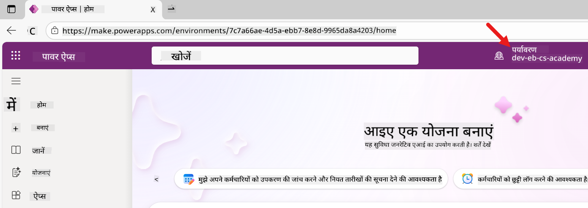

        1. बाईं ओर के मेनू पैन में **Apps** चुनें और **Hiring Hub** मॉडल-ड्रिवन ऐप के लिए, **Play** आइकन का चयन करें ताकि यह आपके ब्राउज़र में लोड हो सके।
        
        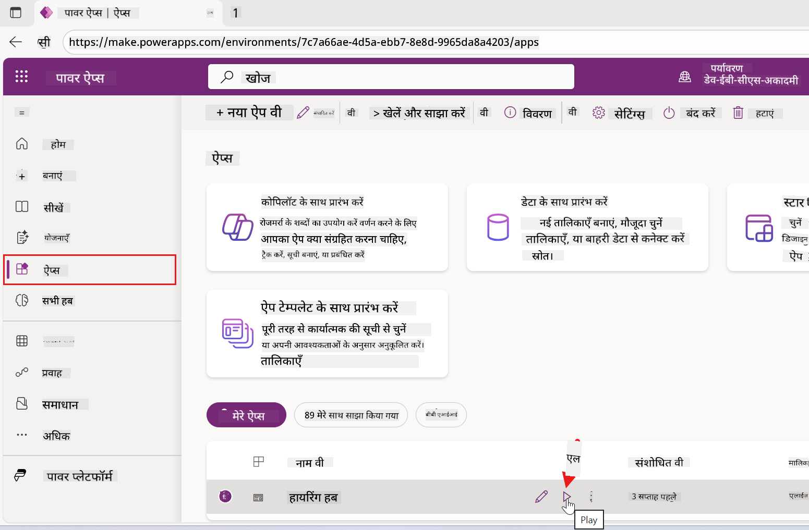

       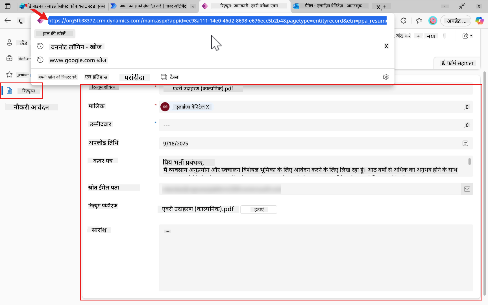

1. फिर एजेंट फ्लो पर वापस जाएं, वर्तमान प्लेसहोल्डर URL मान को हाइलाइट करें और इसे हटा दें।

       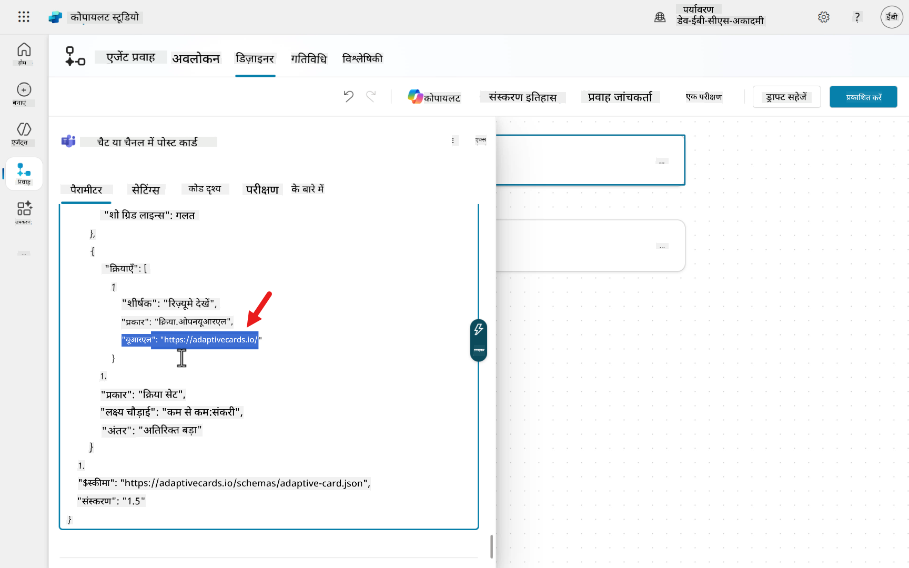

1. फिर कॉपी किए गए URL को `url` प्रॉपर्टी में पेस्ट करें।

       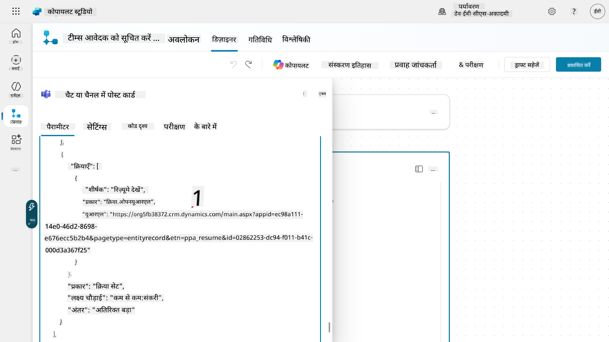

1. आपको निम्नलिखित देखना चाहिए। अंत में `GUID` id मान को हटा दें। हम इसे डायनामिक कंटेंट - **ResumeId** पैरामीटर से बदलेंगे।

       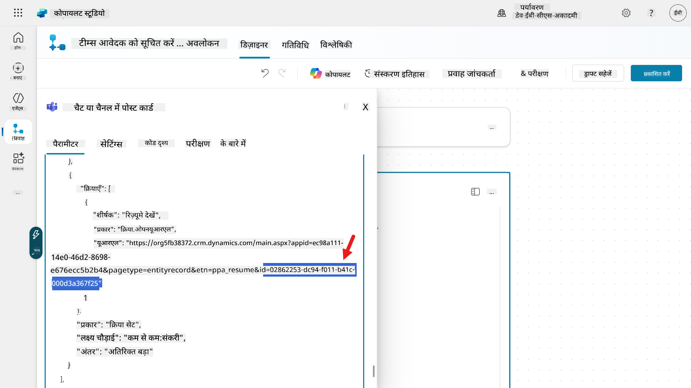

1. दाईं ओर **लाइटनिंग बोल्ट आइकन** या **fx आइकन** का चयन करें।

      **Dynamic Content** टैब में **ResumeId** पैरामीटर का चयन करें और **Add** चुनें।

       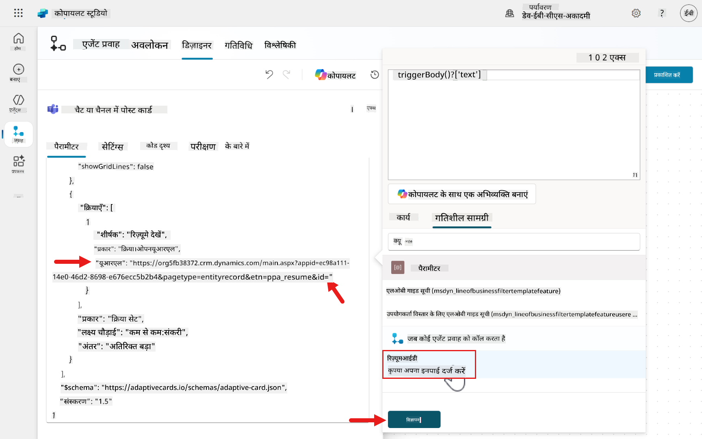

1. **ResumeId** डायनामिक कंटेंट के रूप में जोड़ा जाएगा। निम्नलिखित पीले रंग में हाइलाइट किया गया है, वह **Hiring Hub** मॉडल-ड्रिवन ऐप का आपका पर्यावरण विवरण है।

     | पैरामीटर | मान | व्याख्या |
     |----------|------------|---------|
     | **Organization URI** | GUID | Dataverse/Dynamics 365 पर्यावरण संगठन URL |
     | **appid** | GUID | किसी विशेष मॉडल-ड्रिवन ऐप को खोलने के लिए, appid या appname क्वेरी पैरामीटर का उपयोग किया जाता है। इस मामले में, appid का उपयोग किया गया है |
     | **id** | GUID | क्वेरी पैरामीटर जो रिज्यूमे पंक्ति का id है |

       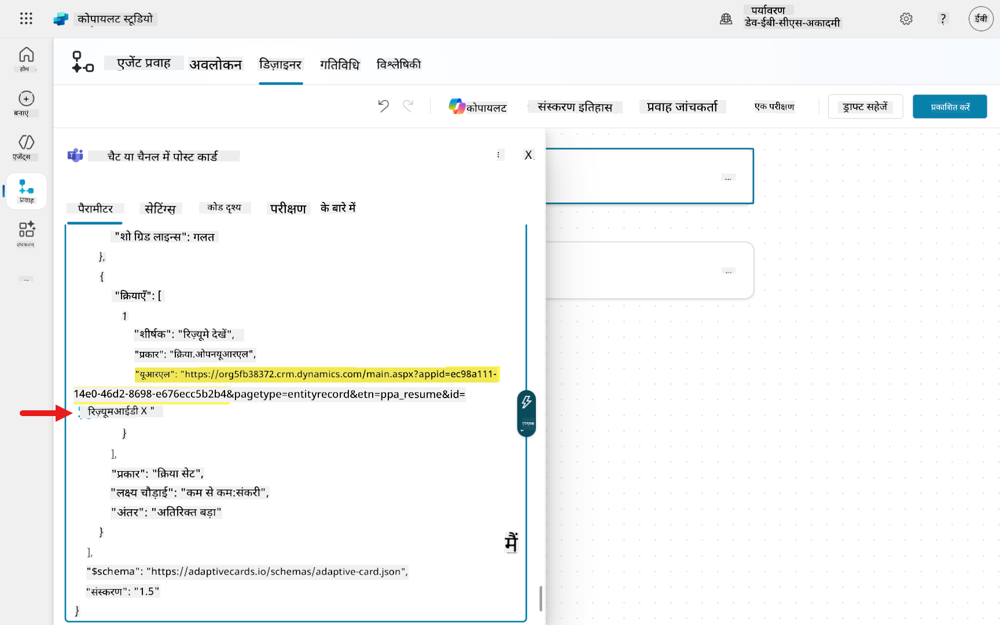

1. हमने **Post card in a chat or channel** एक्शन को कॉन्फ़िगर करना पूरा कर लिया है 👏🏻। **x** आइकन का चयन करके एक्शन कॉन्फ़िगरेशन पैनल से बाहर निकलें।

       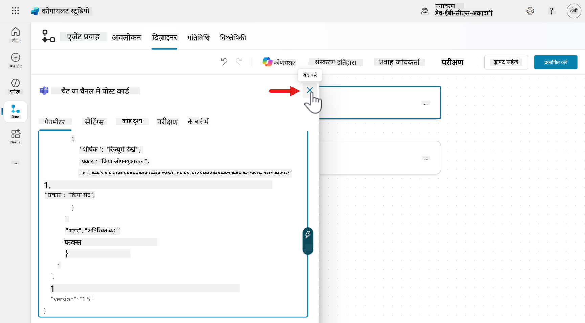

1. अंत में, हम अंतिम एक्शन **Respond to the agent** को कॉन्फ़िगर करेंगे ताकि एजेंट को टेक्स्ट भेजकर प्रोसेसिंग समाप्त की जा सके।

      **Respond to the agent** एक्शन में, **+Add an output** का चयन करें।

       

1. आउटपुट के प्रकार के रूप में **Text** चुनें।

       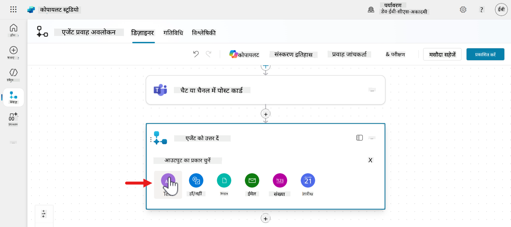

1. आउटपुट के नाम के रूप में निम्नलिखित दर्ज करें।

       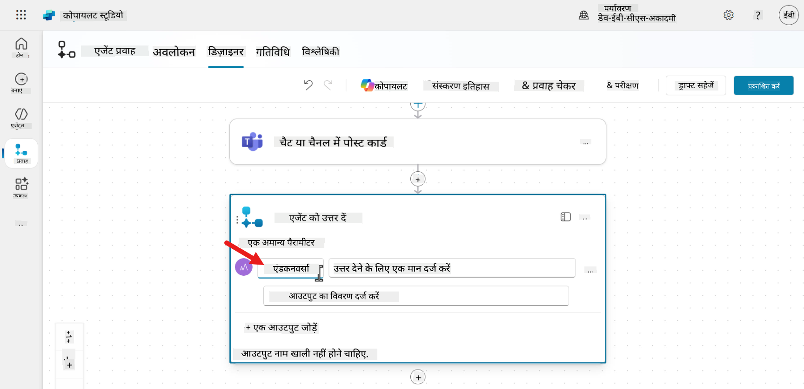

1. आउटपुट के मान के रूप में निम्नलिखित दर्ज करें।

       ```text
       Finished
       ```

       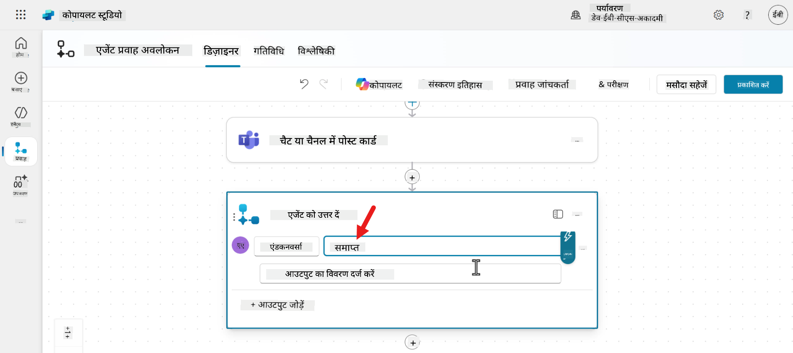

1. हमने अब एजेंट फ्लो को कॉन्फ़िगर करना पूरा कर लिया है। एजेंट फ्लो को सेव करने के लिए **Save draft** चुनें। सेव होने पर एक पुष्टिकरण संदेश दिखाई देगा।

       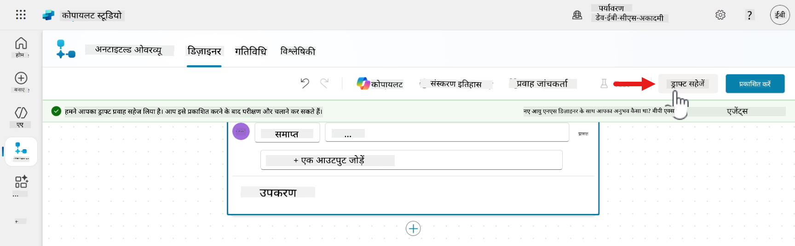

1. एजेंट फ्लो को प्रकाशित करने से पहले, हमें एजेंट फ्लो के विवरण को अपडेट करना होगा। **Overview** टैब पर जाएं और **Edit** चुनें।

      फ्लो नाम फ़ील्ड में निम्नलिखित दर्ज करें।

       ```text
       Notify Teams Applicant channel
       ```      

      इसके बाद, एजेंट फ्लो के विवरण को AI का उपयोग करके अपडेट करने के लिए **Refresh** आइकन का चयन करें।

      फिर एजेंट फ्लो के अपडेटेड विवरण को सेव करने के लिए **Save** चुनें।

       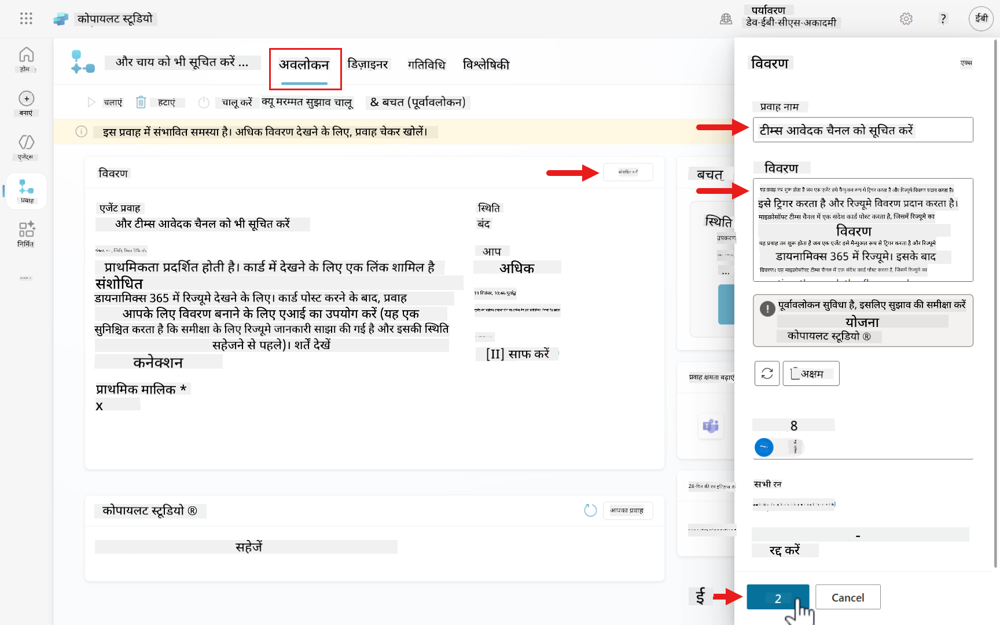

1. **Designer** टैब पर वापस जाएं और एजेंट फ्लो को प्रकाशित करने के लिए **Publish** चुनें। सेव होने पर एक पुष्टिकरण संदेश दिखाई देगा।

       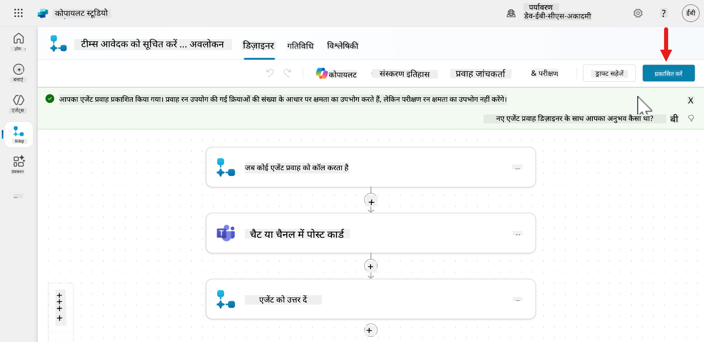

1. अब एजेंट फ्लो को **Application Intake Agent** में एक टूल के रूप में जोड़ा जाना चाहिए। **Hiring Agent** पर वापस जाएं और **Agents** टैब चुनें, फिर **Application Intake Agent** चुनें।

       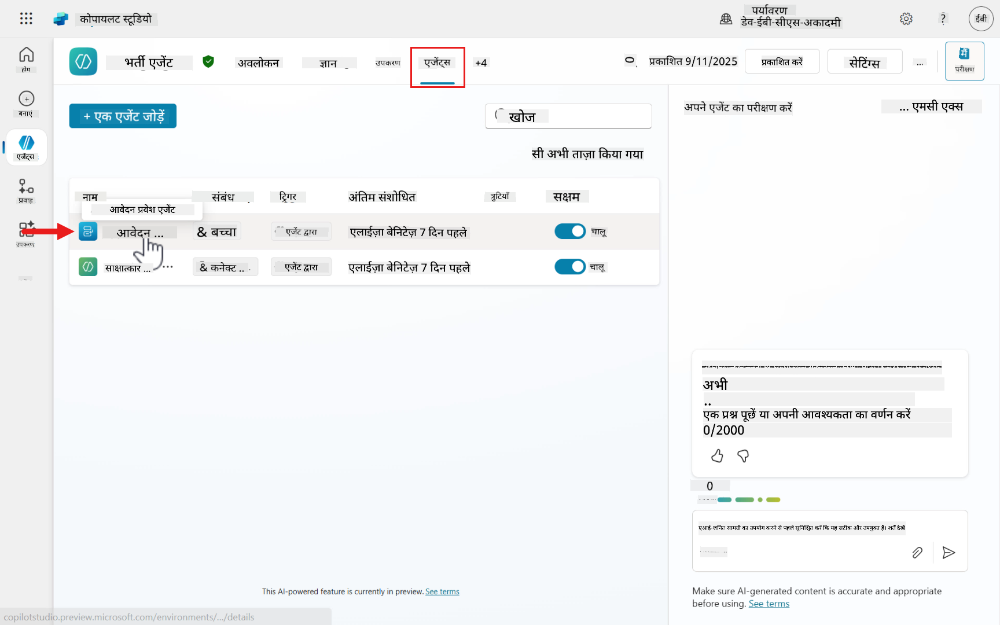

1. एजेंट के **Details** सेक्शन में, हम **Description** फ़ील्ड को अपडेट करेंगे। निम्नलिखित को कॉपी करें और विवरण टेक्स्ट के अंत में पेस्ट करें।

       ```text
       and also notify the Teams Applicant channel
       ```

       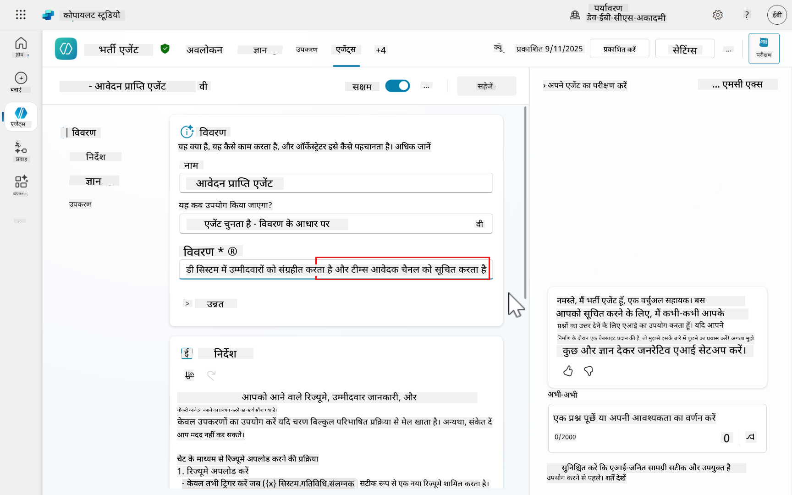

1. अगला, हम एजेंट फ्लो को एक टूल के रूप में जोड़ेंगे। नीचे स्क्रॉल करें और **+ Add** चुनें।

       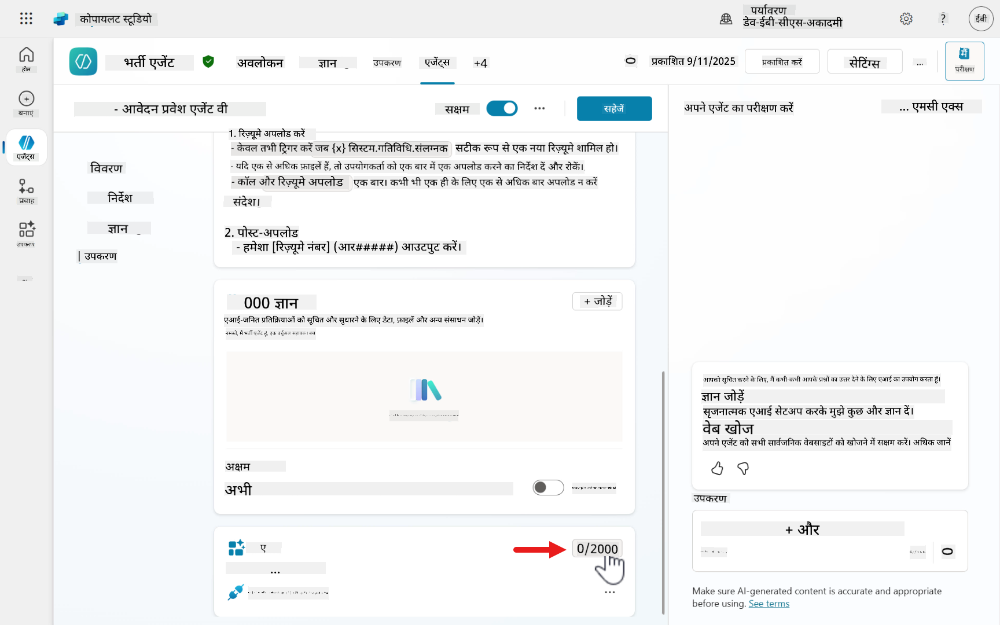

1. पहले बनाए गए एजेंट फ्लो, **Notify Teams Applicant Channel** का चयन करें।

       

1. अगला **Add and configure** चुनें।

       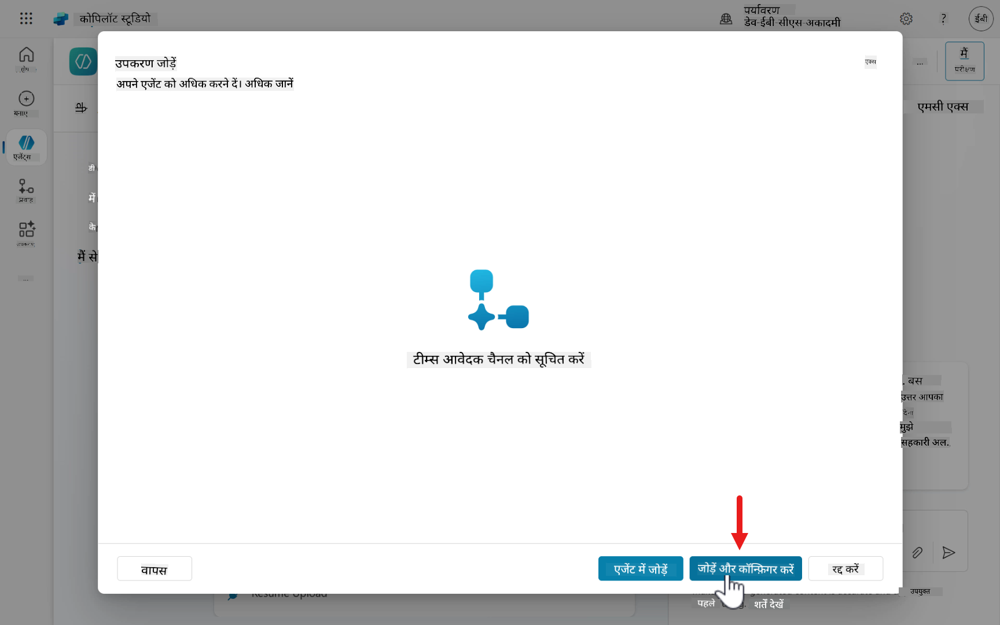

1. एजेंट फ्लो के **Inputs** सेक्शन में, पहले एजेंट फ्लो में कॉन्फ़िगर किए गए तीन इनपुट दिखाई देंगे। डिफ़ॉल्ट रूप से, **Fill using** कॉन्फ़िगरेशन **Dynamically fill with AI** पर सेट है। हम इस सेटिंग को वैसे ही रखेंगे क्योंकि इवेंट ट्रिगर से प्रॉम्प्ट (अंतिम एक्शन में, **Sends a prompt to the specified copilot for processing** - यह **Lab 3.1 - Automate uploading resumes to Dataverse received by email** के चरण 38-44 हैं) में पैरामीटर मान होंगे जिन्हें AI निकालेगा।

       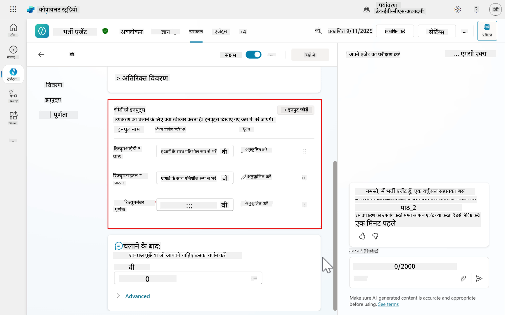

1. अब जब टूल को **Application Intake Agent** में जोड़ दिया गया है, एजेंट के निर्देशों को अपडेट करने की आवश्यकता है। एजेंट्स की सूची में वापस जाने के लिए **back arrow** आइकन का चयन करें।

       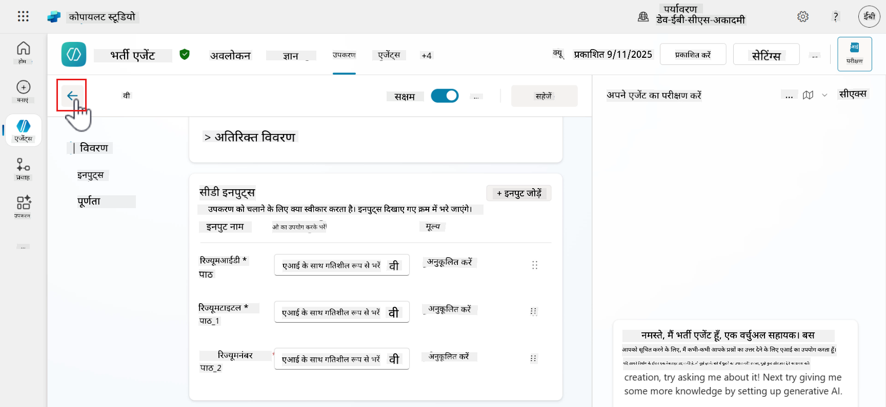

1. **Hiring Agent** के **Agents** टैब में **Application Intake Agent** चुनें।

       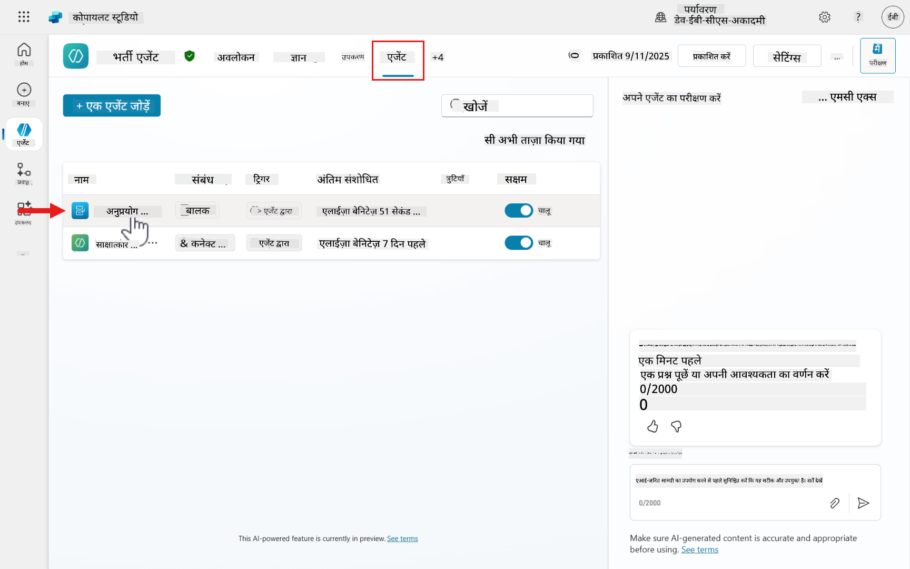

1. **Instructions** फ़ील्ड में, `2.Post-Upload` निर्देशों के बाद एक नई लाइन दर्ज करें। निम्नलिखित निर्देशों को कॉपी करें और पेस्ट करें।

       ```text
       Process for Resume Upload via Email
       1. When you receive a message, **Send [ResumeId (text)] = "1680265f-5793-f011-b41b-7c1e525be9f7" and [ResumeTitle (text_1)] = "TAYLOR TESTPERSON (FICTITIOUS).pdf" and [ResumeNumber (text_2)]= "R01026" to the Tool "Notify Teams Applicant channel"** in the child agent "Application Intake Agent", call [AGENT FLOW PLACEHOLDER]
       ```

       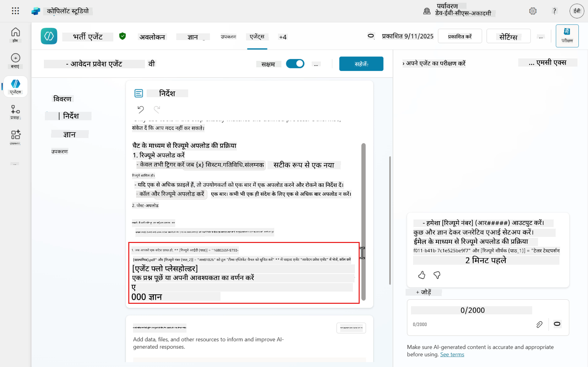

1. `[AGENT FLOW PLACEHOLDER` टेक्स्ट को हाइलाइट करें।

       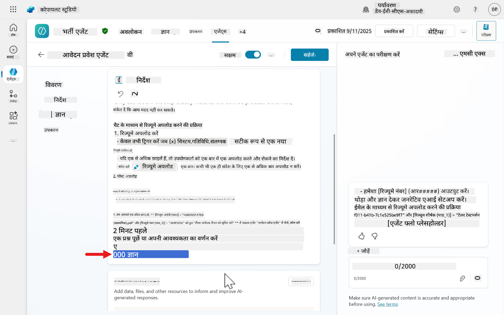

1. फॉरवर्ड स्लैश कैरेक्टर `/` दर्ज करें और **Notify Teams Applicant Channel** टूल का चयन करें।

       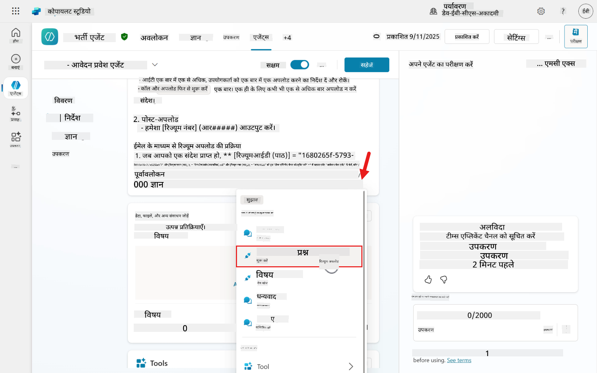
1. एजेंट फ्लो अब **Application Intake Agent** द्वारा निर्देशों के अनुसार शुरू किया जाएगा, अंतिम क्रिया (**संदेश को निर्दिष्ट कोपायलट को प्रोसेसिंग के लिए भेजता है**) के बाद, इवेंट ट्रिगर संदेश को वापस एजेंट के पास भेजता है जिसमें पैरामीटर मान होते हैं।

      **Save** चुनें ताकि **Application Intake Agent** के लिए अपडेटेड निर्देश सहेजे जा सकें।

       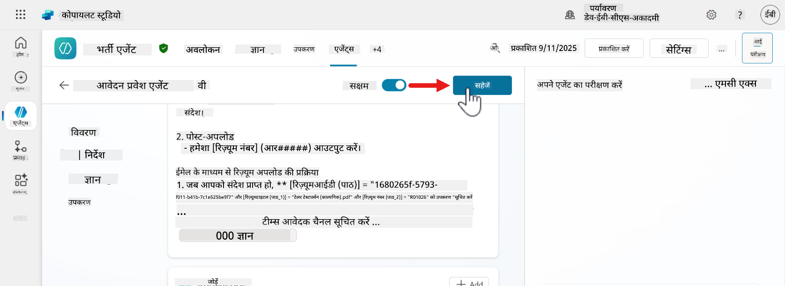

1. एजेंट को सहेजने के बाद निर्देश अब अपडेट हो जाएंगे।

       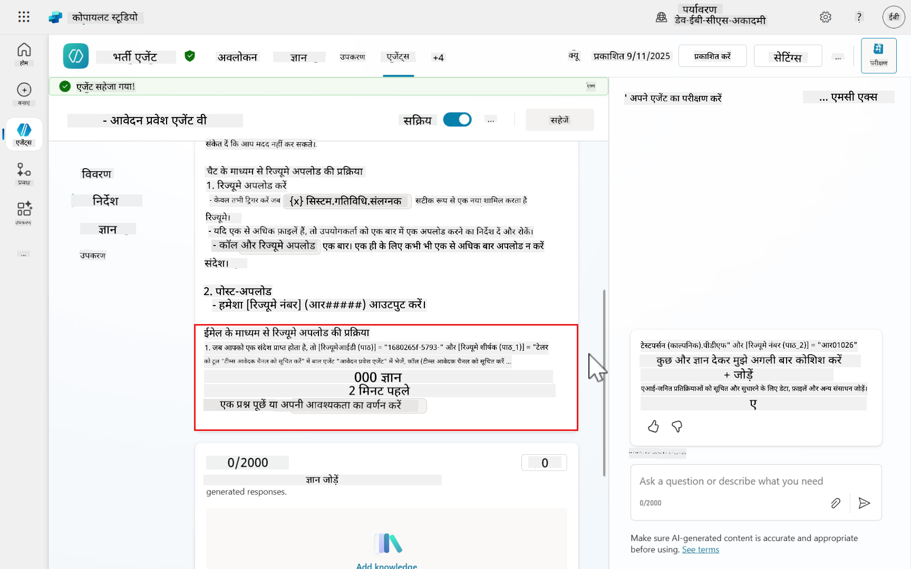

1. अब हमें **Hiring Agent** को **Publish** करना होगा। ऊपर दाईं ओर **Publish** चुनें, और जो _Publish this agent modal_ दिखाई देगा उसमें **Publish** चुनें।

       

1. Publish होने के बाद, एक पुष्टि संदेश दिखाई देगा कि एजेंट Publish हो गया है।

       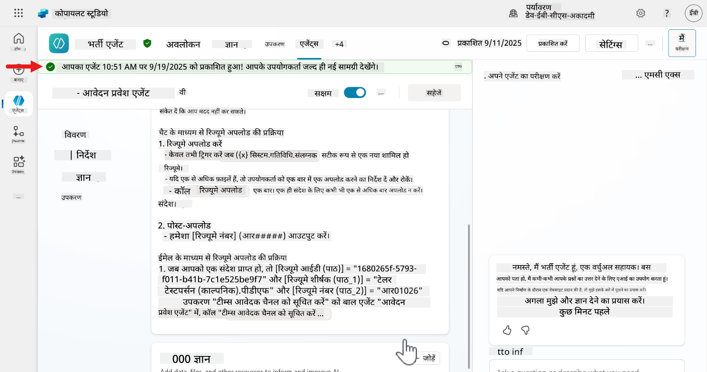

अब हम एजेंट का परीक्षण कर सकते हैं!

### लैब 3.3 - इवेंट ट्रिगर का परीक्षण करें

1. इवेंट ट्रिगर को निष्पादित करने के लिए, एक ईमेल भेजना होगा जिसमें एक Resume pdf फाइल हो। Outlook में, एक नया ईमेल संदेश तैयार करें।

     | ईमेल घटक | विवरण |
     |----------|------------|
     | **To recipient** | अपने साइन इन किए गए उपयोगकर्ता खाते का उपयोग करें |
     | **File attachment** | [TAYLOR TESTPERSON (FICTITIOUS)](../../../../../docs/operative-preview/test-data/resumes/TAYLOR%20TESTPERSON%20(FICTITIOUS).pdf) फाइल अपलोड करें |
     | **Body** | नीचे दिए गए टेक्स्ट को ईमेल बॉडी में कॉपी और पेस्ट करें |

       ```text
       प्रिय Hiring Manager,

       मैं आपके संगठन में Senior Power Platform Engineer पद में अपनी रुचि व्यक्त करने के लिए लिख रहा हूं। Microsoft क्लाउड प्लेटफॉर्म पर सुरक्षित और स्केलेबल समाधान प्रदान करने के नौ वर्षों से अधिक अनुभव के साथ, मुझे विश्वास है कि मैं आपकी टीम में प्रभावी योगदान दे सकता हूं।

       मेरी हाल की भूमिका में Lead Power Platform Engineer के रूप में, मैंने एक स्वचालित रिज्यूम-इनटेक पाइपलाइन विकसित की, जिससे मैनुअल ट्रायेज कम हुआ और खोज क्षमता में सुधार हुआ। मैंने HR केस प्रबंधन एप्लिकेशन प्रदान किए, समाधान-जागरूक फ्लो पेश किए, और PR चेक लागू किए जिससे डिप्लॉयमेंट लीड टाइम में सुधार हुआ। मेरी विशेषज्ञता में Power Apps, Power Automate, Power Pages, Dataverse, और Microsoft 365 सेवाओं की एक श्रृंखला शामिल है, साथ ही Graph/REST APIs और Azure Functions के साथ एकीकरण।

       पहले, मैंने Teams अनुमोदन को अनुकूली कार्ड के साथ विकसित किया, अनुमोदन समय को उसी दिन तक कम किया, और मजबूत त्रुटि-प्रबंधन फ्रेमवर्क बनाए। मेरा बैकग्राउंड Power Automate में पुराने वर्कफ्लो को माइग्रेट करने और सैकड़ों कर्मचारियों द्वारा अपनाए गए सेल्फ-सर्विस पोर्टल बनाने में भी शामिल है।

       मैंने कंप्यूटर साइंस में B.Sc. किया है और Power Platform Developer (PL-400) और Solution Architect (PL-600) के रूप में प्रमाणित हूं। मैं मेंटरिंग के प्रति भी जुनूनी हूं और स्थानीय मेकर समूहों के साथ स्वयंसेवा किया है।

       कृपया मेरे CV को विचार के लिए संलग्न करें। मैं आपके आवश्यकताओं के साथ अपने कौशल और अनुभव को कैसे संरेखित करता हूं, इस पर चर्चा करने का अवसर स्वागत करता हूं।

       आपके समय और विचार के लिए धन्यवाद।

       सादर,
       Taylor Testperson
       ```

       **Send** करें जब ईमेल तैयार हो जाए।

       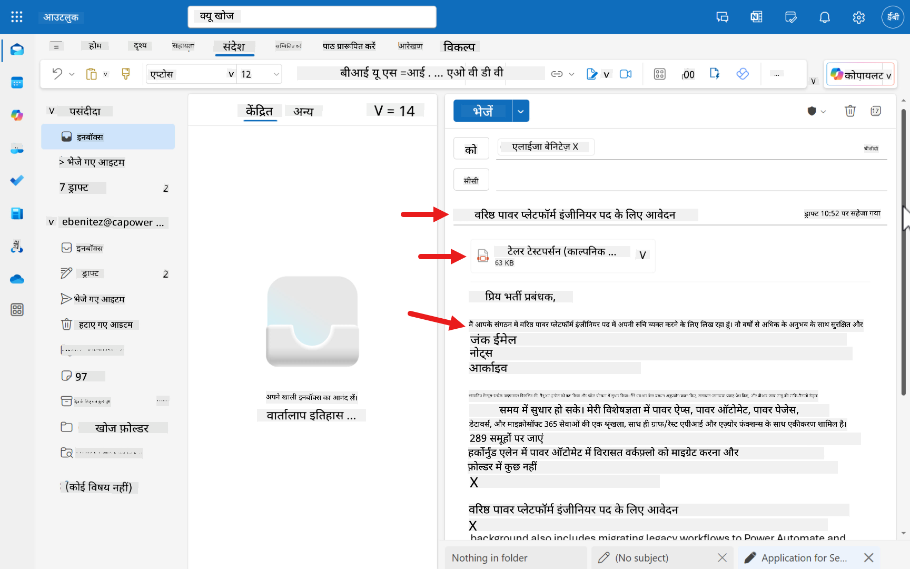

1. Power Automate मेकर पोर्टल में इवेंट ट्रिगर फ्लो के लिए, **Refresh** आइकन चुनें ताकि भेजे गए ईमेल के लिए सफल फ्लो रन को देखा जा सके।

       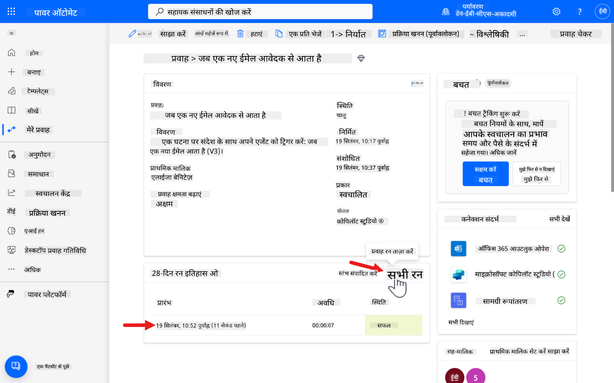

1. Copilot Studio में वापस जाएं और **Hiring Agent** में **Activity** टैब चुनें।

       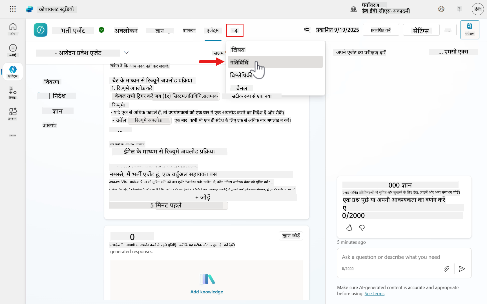

1. **Activity** टैब लोड होगा जो **Hiring Agent** की सभी गतिविधियों को दिखाएगा। एक गतिविधि होगी जिसका नाम **Automated** होगा और उसकी स्थिति **Complete** होगी। यह गतिविधि इवेंट ट्रिगर और एजेंट फ्लो का प्रतिनिधित्व करती है जिसे शुरू किया गया था।

       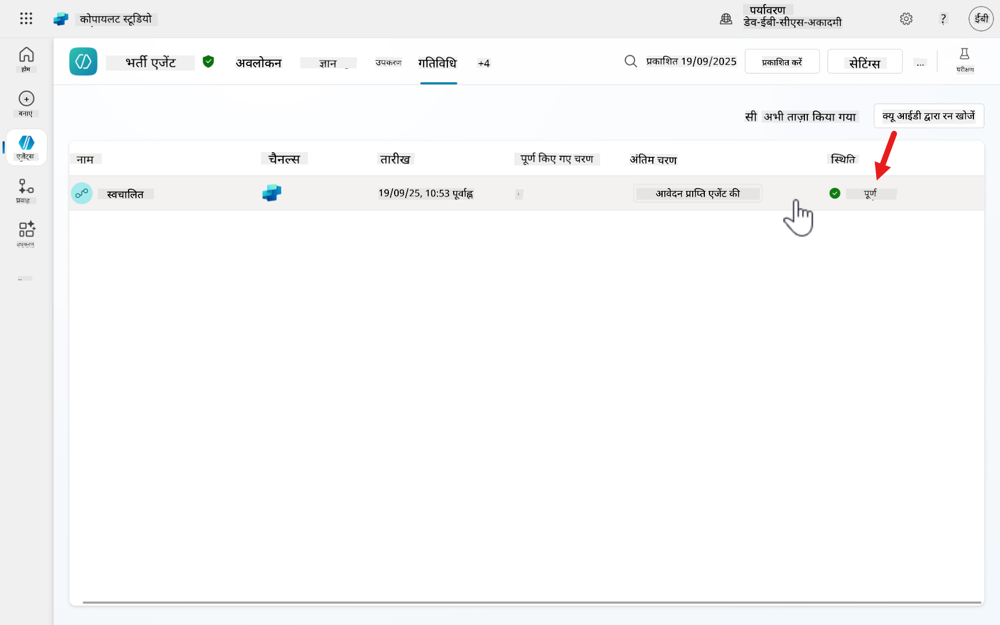

1. गतिविधि चुनें, और गतिविधि मानचित्र में इवेंट ट्रिगर चुनें। दाईं ओर पैनल में देखें कि प्रॉम्प्ट में इनपुट पैरामीटर में `Resume Id`, `Resume Title` और `Resume Number` पैरामीटर मान हैं जो **Dataverse** पंक्ति से बनाए गए थे। यह पहले **Lab 3.1 - Automate uploading resumes to Dataverse received by email** के चरण 18 - 27 में कॉन्फ़िगर किए गए डायनामिक कंटेंट मानों से था।

       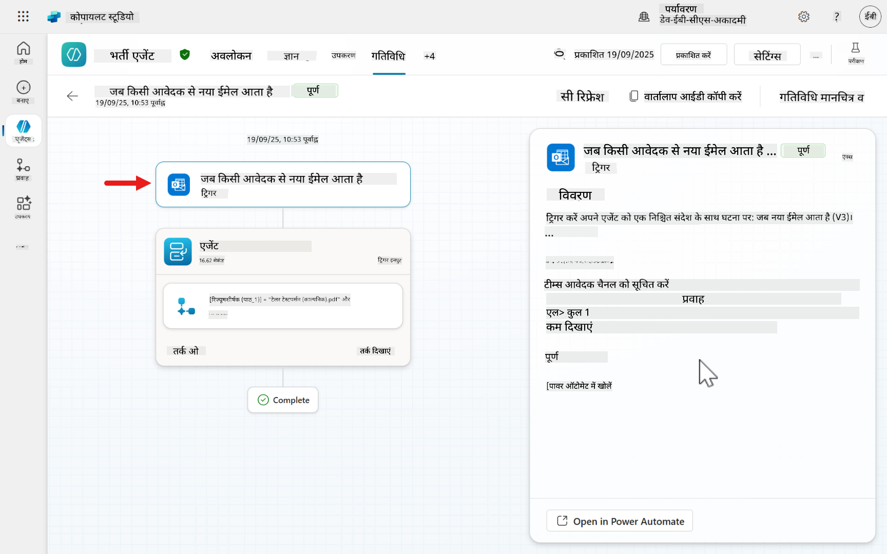

1. **Hiring Hub** मॉडल-ड्रिवन ऐप में वापस जाएं और **Resumes system view** में **Refresh** चुनें ताकि दृश्य को रिफ्रेश किया जा सके। ईमेल द्वारा भेजे गए रिज्यूम के लिए बनाई गई नई पंक्ति अब सूचीबद्ध होगी क्योंकि इसे इवेंट ट्रिगर के माध्यम से बनाया गया था।

       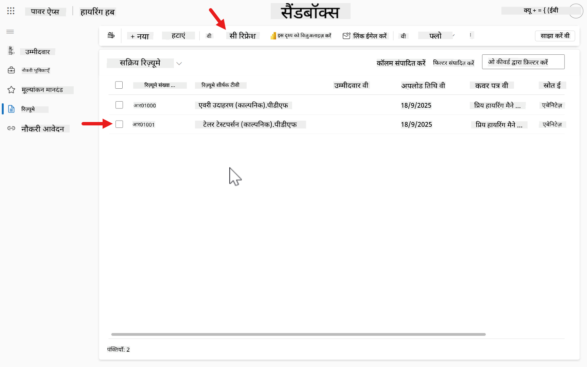

1. Copilot Studio में वापस जाएं और **Application Intake Agent** में गतिविधि मानचित्र के भीतर **Notify Teams Applicant Channel** एजेंट फ्लो चुनें। दाईं ओर पैनल में देखें कि इनपुट में Dataverse पंक्ति से मान हैं। यह इवेंट ट्रिगर में अंतिम क्रिया (**संदेश को निर्दिष्ट कोपायलट को प्रोसेसिंग के लिए भेजता है**) द्वारा भेजे गए प्रॉम्प्ट से था जिसमें नई बनाई गई Dataverse पंक्ति से पैरामीटर मान होते हैं। इस तरह हम इवेंट ट्रिगर से एजेंट फ्लो में पैरामीटर मान पास कर सकते हैं।

       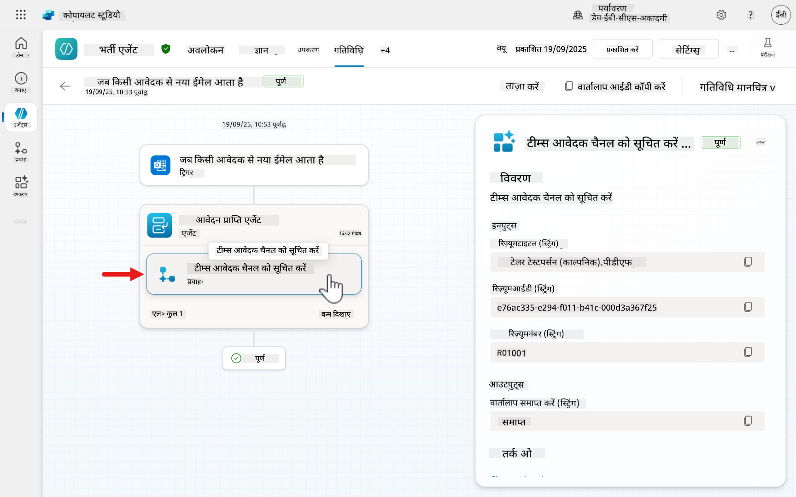

1. अंत में, **Microsoft Teams** में चैनल पर पोस्ट किए गए अनुकूली कार्ड को देखें। चैनल में, हम अनुकूली कार्ड देखेंगे जो Dataverse में नई बनाई गई Resume पंक्ति की जानकारी प्रदर्शित करता है। अनुकूली कार्ड की शुरुआत में हाइपरलिंक पर होवर करें, देखें कि URL वह Resumes system view URL है जिसे हमने पहले JSON (चरण 15 - 19 **Lab 3.2 - Notify a Teams channel using an adaptive card**) पेलोड में कॉन्फ़िगर किया था।

       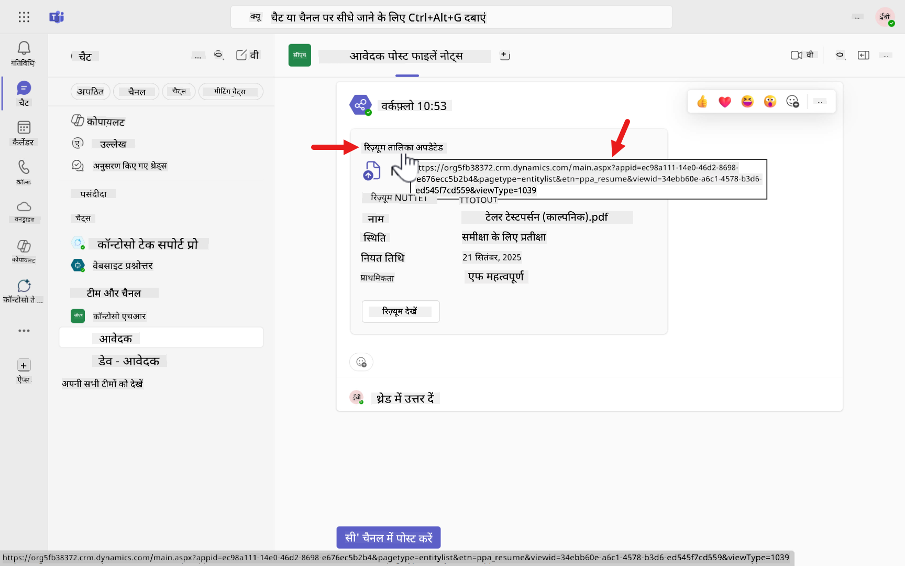

1. हाइपरलिंक चुनें, और आप **Hiring Hub** मॉडल-ड्रिवन ऐप में अपने ब्राउज़र पर Resumes system view पर निर्देशित होंगे।

       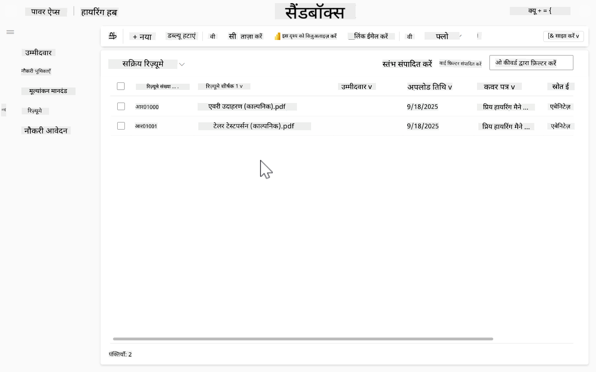

1. Microsoft Teams में चैनल पर वापस जाएं और पोस्ट किए गए अनुकूली कार्ड पर जाएं। इस बार, **View Resume** पर होवर करें जो अनुकूली कार्ड का `Action.OpenURL` एक्शन है। देखें कि URL वह Resume पंक्ति है जिसे हमने पहले JSON (चरण 30 - 36 **Lab 3.2 - Notify a Teams channel using an adaptive card**) पेलोड में कॉन्फ़िगर किया था।

       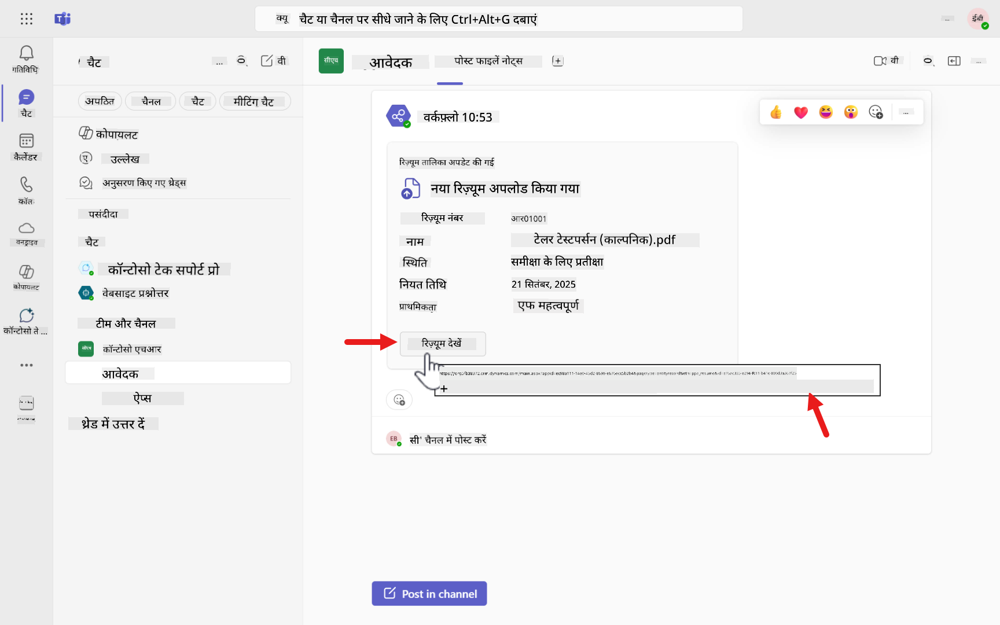

1. एक्शन चुनें, और आप **Hiring Hub** मॉडल-ड्रिवन ऐप में अपने ब्राउज़र पर Resume पंक्ति फॉर्म पर निर्देशित होंगे।

       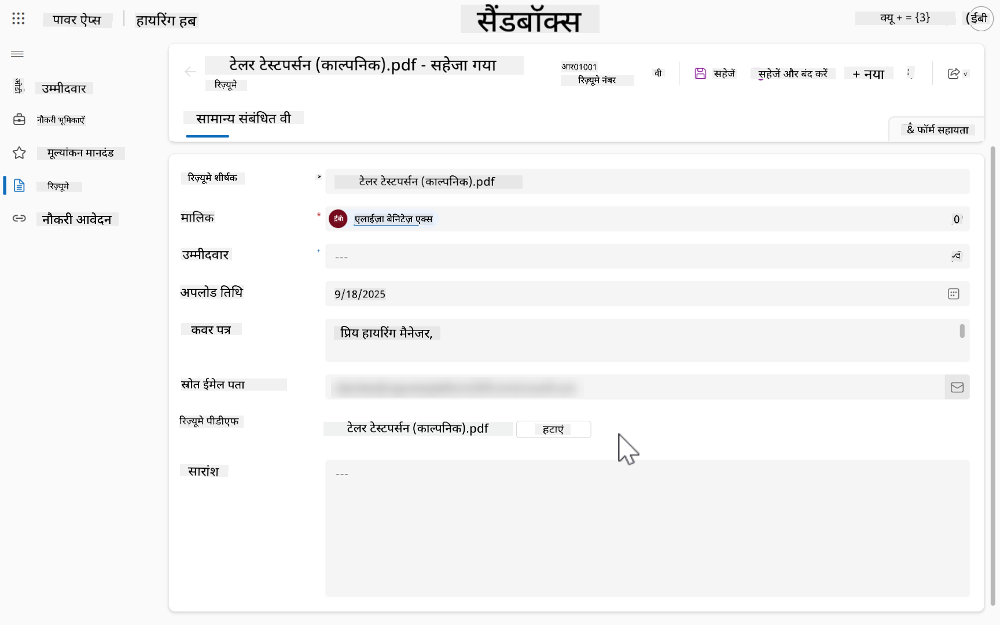

## ✅ मिशन पूरा

बधाई हो! 👏🏻 शानदार काम, ऑपरेटिव।

✅ इवेंट ट्रिगर: आपने एक इवेंट ट्रिगर बनाया है जो Dataverse पैरामीटर मानों को एजेंट फ्लो में पास करता है।  
✅ एजेंट फ्लो बनाया: Dataverse पैरामीटर मानों का उपयोग करता है ताकि Microsoft Teams में चैनल पर अनुकूली कार्ड पोस्ट कर HR भर्ती टीम को सूचित किया जा सके।  
✅ चाइल्ड एजेंट निर्देश अपडेट किए: ताकि इवेंट ट्रिगर पूरा होने के बाद फ्लो को शुरू किया जा सके।

यह **Hiring Agent** को स्वायत्त रूप से काम करने में सक्षम बनाता है जब भी ईमेल अटैचमेंट के रूप में रिज्यूम प्राप्त होते हैं और HR भर्ती टीम को मैनुअल समीक्षा के लिए सूचित करता है।

यह **Lab 03 - Automating candidate application emails** का अंत है, नीचे दिए गए लिंक पर क्लिक करें ताकि अगले पाठ पर जा सकें।

⏭️ [**Authoring Agent Instructions** पाठ पर जाएं](../04-agent-instructions/README.md)

## 📚 सामरिक संसाधन

📖 [Copilot Studio में अपने एजेंट को स्वायत्त बनाएं](https://learn.microsoft.com/training/modules/autonomous-agents-online-workshop/?WT.mc_id=power-188561-ebenitez)  
📖 [एक इवेंट ट्रिगर जोड़ें](https://learn.microsoft.com/microsoft-copilot-studio/authoring-trigger-event?WT.mc_id=power-188561-ebenitez)  
📖 [अपने एजेंट के साथ एजेंट फ्लो का उपयोग करें](https://learn.microsoft.com/microsoft-copilot-studio/advanced-flow?WT.mc_id=power-188561-ebenitez)  
📖 [Power Automate ट्रिगर्स परिचय](https://learn.microsoft.com/power-automate/triggers-introduction?WT.mc_id=power-188561-ebenitez)  
📖 [एजेंट्स के साथ Power Automate फ्लो का उपयोग करना](https://learn.microsoft.com/microsoft-copilot-studio/advanced-flow-create?WT.mc_id=power-188561-ebenitez)  
📖 [Copilot Studio के लिए डेटा लॉस प्रिवेंशन](https://learn.microsoft.com/microsoft-copilot-studio/admin-data-loss-prevention?WT.mc_id=power-188561-ebenitez)  

---

**अस्वीकरण**:  
यह दस्तावेज़ AI अनुवाद सेवा [Co-op Translator](https://github.com/Azure/co-op-translator) का उपयोग करके अनुवादित किया गया है। जबकि हम सटीकता के लिए प्रयास करते हैं, कृपया ध्यान दें कि स्वचालित अनुवाद में त्रुटियां या अशुद्धियां हो सकती हैं। मूल भाषा में दस्तावेज़ को आधिकारिक स्रोत माना जाना चाहिए। महत्वपूर्ण जानकारी के लिए, पेशेवर मानव अनुवाद की सिफारिश की जाती है। इस अनुवाद के उपयोग से उत्पन्न किसी भी गलतफहमी या गलत व्याख्या के लिए हम उत्तरदायी नहीं हैं।