<!--
CO_OP_TRANSLATOR_METADATA:
{
  "original_hash": "616d142d4fb5f45d2a168fad6c1f9545",
  "translation_date": "2025-10-21T18:00:14+00:00",
  "source_file": "docs/operative-preview/07-multimodal-prompts/README.md",
  "language_code": "hi"
}
-->
# 🚨 मिशन 07: मल्टीमॉडल प्रॉम्प्ट्स के साथ रिज़्यूम सामग्री निकालना

--8<-- "disclaimer.md"

## 🕵️‍♂️ कोडनेम: `DOCUMENT RESUME RECON`

> **⏱️ ऑपरेशन समय सीमा:** `~45 मिनट`

## 🎯 मिशन का विवरण

स्वागत है, ऑपरेटिव। आपके पिछले मिशन ने आपको शक्तिशाली एजेंट ऑर्केस्ट्रेशन कौशल प्रदान किए हैं, लेकिन अब समय है एक गेम-चेंजिंग क्षमता को अनलॉक करने का: **मल्टीमॉडल डॉक्यूमेंट एनालिसिस**।

आपका असाइनमेंट, यदि आप इसे स्वीकार करते हैं, **Document Resume Recon** है - किसी भी डॉक्यूमेंट से सटीकता के साथ संरचित डेटा निकालना। जबकि आपके एजेंट टेक्स्ट को आसानी से प्रोसेस कर सकते हैं, असली दुनिया में रोज़ाना PDF, इमेज और जटिल डॉक्यूमेंट्स को संभालने की आवश्यकता होती है। रिज़्यूम का ढेर लगता है, इनवॉइस प्रोसेसिंग की ज़रूरत होती है, और फॉर्म्स को तुरंत डिजिटाइज़ करना होता है।

यह मिशन आपको टेक्स्ट-ओनली एजेंट बिल्डर से **मल्टीमॉडल विशेषज्ञ** में बदल देगा। आप AI को कॉन्फ़िगर करना सीखेंगे जो डॉक्यूमेंट्स को एक मानव विश्लेषक की तरह पढ़ता और समझता है - लेकिन AI की गति और स्थिरता के साथ। मिशन के अंत तक, आप एक पूरा रिज़्यूम एक्सट्रैक्शन सिस्टम बना चुके होंगे जो आपके हायरिंग वर्कफ़्लो के साथ इंटीग्रेट होता है।

यहां सीखी गई तकनीकें आपके अगले मिशन में उन्नत डेटा ग्राउंडिंग ऑपरेशन्स के लिए आवश्यक होंगी।

## 🔎 उद्देश्य

इस मिशन में, आप सीखेंगे:

1. मल्टीमॉडल प्रॉम्प्ट्स क्या हैं और विभिन्न AI मॉडल्स का उपयोग कब करना है
1. इमेज और डॉक्यूमेंट इनपुट्स के साथ प्रॉम्प्ट्स को कैसे कॉन्फ़िगर करें
1. प्रॉम्प्ट आउटपुट्स को JSON के रूप में कैसे फॉर्मेट करें ताकि संरचित डेटा निकाला जा सके
1. डॉक्यूमेंट एनालिसिस के लिए प्रॉम्प्ट इंजीनियरिंग के सर्वोत्तम अभ्यास
1. मल्टीमॉडल प्रॉम्प्ट्स को Agent Flows के साथ कैसे इंटीग्रेट करें

## 🧠 मल्टीमॉडल प्रॉम्प्ट्स को समझना

### एक प्रॉम्प्ट को "मल्टीमॉडल" क्या बनाता है?

पारंपरिक प्रॉम्प्ट्स केवल टेक्स्ट के साथ काम करते हैं। लेकिन मल्टीमॉडल प्रॉम्प्ट्स कई प्रकार की सामग्री को प्रोसेस कर सकते हैं:

- **टेक्स्ट**: लिखित निर्देश और सामग्री
- **इमेज**: फोटो, स्क्रीनशॉट, चार्ट और डायग्राम (.PNG, .JPG, .JPEG)  
- **डॉक्यूमेंट्स**: इनवॉइस, रिज़्यूम, फॉर्म्स (.PDF)

यह क्षमता शक्तिशाली परिदृश्यों को खोलती है जैसे रिज़्यूम का विश्लेषण करना, इनवॉइस प्रोसेस करना, या फॉर्म्स से डेटा निकालना।

### आपके वर्कफ़्लो के लिए मल्टीमॉडल क्यों महत्वपूर्ण है

हर दिन, आपकी संस्था इन डॉक्यूमेंट प्रोसेसिंग चुनौतियों का सामना करती है:

- **रिज़्यूम स्क्रीनिंग**: सैकड़ों रिज़्यूम को मैन्युअली पढ़ना समय की बर्बादी है
- **इनवॉइस प्रोसेसिंग**: विभिन्न डॉक्यूमेंट फॉर्मेट्स से विक्रेता विवरण, राशि और तारीखें निकालना
- **फॉर्म एनालिसिस**: पेपर फॉर्म्स को डिजिटल डेटा में बदलना

मल्टीमॉडल प्रॉम्प्ट्स इन बाधाओं को समाप्त करते हैं, AI की भाषा समझने की क्षमता को विज़ुअल एनालिसिस क्षमताओं के साथ जोड़कर। यह आपके AI को टेक्स्ट जितना ही प्रभावी तरीके से डॉक्यूमेंट्स प्रोसेस करने की क्षमता देता है।

### सामान्य व्यावसायिक परिदृश्य

यहां कुछ उदाहरण दिए गए हैं कि मल्टीमॉडल प्रॉम्प्ट्स को कैसे लागू किया जा सकता है:

| परिदृश्य                | कार्य                                                                                                                                      | उदाहरण आउटपुट फ़ील्ड्स                                                                                   |
|-------------------------|-------------------------------------------------------------------------------------------------------------------------------------------|---------------------------------------------------------------------------------------------------------|
| **रिज़्यूम स्क्रीनिंग**    | उम्मीदवार का नाम, ईमेल, फोन, वर्तमान पद, अनुभव के वर्षों और प्रमुख कौशल निकालें।                                                 | उम्मीदवार का नाम, ईमेल पता, फोन नंबर, वर्तमान नौकरी का शीर्षक, अनुभव के वर्ष, प्रमुख कौशल         |
| **इनवॉइस प्रोसेसिंग**  | विक्रेता की जानकारी, इनवॉइस की तारीख, कुल राशि और इस इनवॉइस से लाइन आइटम्स निकालें।                                                 | विक्रेता का नाम, इनवॉइस की तारीख, कुल राशि, इनवॉइस लाइन आइटम्स                                             |
| **फॉर्म एनालिसिस**       | इस आवेदन फॉर्म का विश्लेषण करें और सभी भरे हुए फ़ील्ड्स निकालें।                                                                              | फ़ील्ड का नाम (जैसे, आवेदक का नाम), दर्ज की गई वैल्यू (जैसे, जॉन डो), ...                                  |
| **आईडी डॉक्यूमेंट सत्यापन** | इस पहचान दस्तावेज़ से नाम, आईडी नंबर, समाप्ति तिथि और पता निकालें। सुनिश्चित करें कि सभी टेक्स्ट स्पष्ट रूप से पढ़ने योग्य हैं और किसी भी अस्पष्ट भाग को चिह्नित करें। | पूरा नाम, पहचान संख्या, समाप्ति तिथि, पता, अस्पष्ट भाग का फ्लैग                        |

## ⚙️ AI Builder में मॉडल चयन

AI Builder विभिन्न कार्यों के लिए अनुकूलित मॉडल प्रदान करता है। यह समझना कि किस मॉडल का उपयोग करना है, सफलता के लिए महत्वपूर्ण है।

!!! note "सितंबर 2025 तक सटीक"
    AI Builder मॉडल नियमित रूप से अपडेट किए जाते हैं, इसलिए वर्तमान मॉडल उपलब्धता के लिए [AI Builder मॉडल सेटिंग्स दस्तावेज़](https://learn.microsoft.com/ai-builder/prompt-modelsettings) देखें।

### मॉडल तुलना

निम्नलिखित सभी मॉडल विज़न और डॉक्यूमेंट प्रोसेसिंग का समर्थन करते हैं:

| मॉडल | 💰लागत | ⚡गति | ✅सर्वश्रेष्ठ उपयोग |
|-------|------|-------|----------|
| **GPT-4.1 मिनी** | बेसिक (सबसे किफायती) | तेज़ | मानक डॉक्यूमेंट प्रोसेसिंग, सारांश, बजट-सचेत प्रोजेक्ट्स |
| **GPT-4.1** | स्टैंडर्ड | मध्यम | जटिल डॉक्यूमेंट्स, उन्नत सामग्री निर्माण, उच्च सटीकता की आवश्यकता |
| **o3** | प्रीमियम | धीमा (पहले कारण) | डेटा विश्लेषण, महत्वपूर्ण सोच, परिष्कृत समस्या-समाधान |
| **GPT-5 चैट** | स्टैंडर्ड | उन्नत | नवीनतम डॉक्यूमेंट समझ, उच्चतम प्रतिक्रिया सटीकता |
| **GPT-5 रीजनिंग** | प्रीमियम | धीमा (जटिल विश्लेषण) | सबसे परिष्कृत विश्लेषण, योजना, उन्नत रीजनिंग |

### तापमान सेटिंग्स की व्याख्या

तापमान नियंत्रित करता है कि आपके AI प्रतिक्रियाएं कितनी रचनात्मक या पूर्वानुमानित हैं:

- **तापमान 0**: सबसे पूर्वानुमानित, सुसंगत परिणाम (डेटा एक्सट्रैक्शन के लिए सबसे अच्छा)
- **तापमान 0.5**: रचनात्मकता और सुसंगतता का संतुलन  
- **तापमान 1**: अधिकतम रचनात्मकता (सामग्री निर्माण के लिए सबसे अच्छा)

डॉक्यूमेंट एनालिसिस के लिए, **तापमान 0** का उपयोग करें ताकि सुसंगत डेटा एक्सट्रैक्शन सुनिश्चित हो सके।

## 📊 आउटपुट फॉर्मेट्स: टेक्स्ट बनाम JSON

डाउनस्ट्रीम प्रोसेसिंग के लिए सही आउटपुट फॉर्मेट चुनना महत्वपूर्ण है।

### टेक्स्ट आउटपुट कब उपयोग करें

टेक्स्ट आउटपुट अच्छा काम करता है:

- मानव-पढ़ने योग्य सारांशों के लिए
- सरल वर्गीकरणों के लिए
- सामग्री जो संरचित प्रोसेसिंग की आवश्यकता नहीं है

### JSON आउटपुट कब उपयोग करें

JSON आउटपुट आवश्यक है:

- संरचित डेटा एक्सट्रैक्शन के लिए
- डेटाबेस या सिस्टम्स के साथ इंटीग्रेशन के लिए
- Power Automate फ्लो प्रोसेसिंग के लिए
- सुसंगत फ़ील्ड मैपिंग के लिए

### JSON सर्वोत्तम अभ्यास

1. **स्पष्ट फ़ील्ड नाम परिभाषित करें**: वर्णनात्मक, सुसंगत नामकरण का उपयोग करें
1. **उदाहरण प्रदान करें**: प्रत्येक फ़ील्ड के लिए नमूना आउटपुट और मान शामिल करें
1. **डेटा प्रकार निर्दिष्ट करें**: तारीखों, संख्याओं और टेक्स्ट के लिए उदाहरण शामिल करें
1. **गायब डेटा को संभालें**: null या खाली मानों की योजना बनाएं
1. **संरचना को मान्य करें**: विभिन्न प्रकार के डॉक्यूमेंट्स के साथ परीक्षण करें

### डॉक्यूमेंट गुणवत्ता विचार

- **रिज़ॉल्यूशन**: सुनिश्चित करें कि इमेज स्पष्ट और पढ़ने योग्य हैं
- **ओरिएंटेशन**: प्रोसेसिंग से पहले डॉक्यूमेंट्स को सही ओरिएंटेशन में घुमाएं
- **फॉर्मेट समर्थन**: अपने विशिष्ट डॉक्यूमेंट प्रकारों (PDF, JPG, PNG) के साथ परीक्षण करें
- **आकार सीमा**: अपने वातावरण में फ़ाइल आकार प्रतिबंधों के बारे में जागरूक रहें

### प्रदर्शन अनुकूलन

- **उपयुक्त मॉडल चुनें**: केवल आवश्यकता होने पर मॉडल अपग्रेड करें
- **प्रॉम्प्ट्स को अनुकूलित करें**: अक्सर, छोटे, स्पष्ट निर्देश बेहतर प्रदर्शन करते हैं
- **त्रुटि हैंडलिंग**: उन डॉक्यूमेंट्स की योजना बनाएं जिन्हें प्रोसेस नहीं किया जा सकता
- **लागत की निगरानी करें**: विभिन्न मॉडल्स AI Builder क्रेडिट्स की अलग-अलग मात्रा का उपयोग करते हैं

## 🧪 लैब 7: एक रिज़्यूम एक्सट्रैक्शन सिस्टम बनाना

अब आपके मल्टीमॉडल ज्ञान को व्यवहार में लाने का समय है। आप एक व्यापक रिज़्यूम एक्सट्रैक्शन सिस्टम बनाएंगे जो उम्मीदवार डॉक्यूमेंट्स का विश्लेषण करता है और उन्हें आपके हायरिंग वर्कफ़्लो के लिए संरचित डेटा में बदलता है।

### इस मिशन को पूरा करने के लिए आवश्यकताएँ

1. आपको **या तो**:

    - **मिशन 06 पूरा किया होना चाहिए** और आपका मल्टी-एजेंट हायरिंग सिस्टम तैयार होना चाहिए, **या**
    - **मिशन 07 स्टार्टर सॉल्यूशन आयात करें** यदि आप नए सिरे से शुरू कर रहे हैं या पकड़ने की आवश्यकता है। [मिशन 07 स्टार्टर सॉल्यूशन डाउनलोड करें](https://aka.ms/agent-academy)

1. [टेस्ट रिज़्यूम्स](https://download-directory.github.io/?url=https://github.com/microsoft/agent-academy/tree/main/operative/sample-data/resumes&filename=operative_sampledata) से नमूना रिज़्यूम डॉक्यूमेंट्स

!!! note "सॉल्यूशन आयात और नमूना डेटा"
    यदि आप स्टार्टर सॉल्यूशन का उपयोग कर रहे हैं, तो अपने वातावरण में सॉल्यूशन्स और नमूना डेटा आयात करने के विस्तृत निर्देशों के लिए [मिशन 01](../01-get-started/README.md) देखें।

### 7.1 एक मल्टीमॉडल प्रॉम्प्ट बनाएं

आपका पहला उद्देश्य: एक ऐसा प्रॉम्प्ट बनाना जो रिज़्यूम डॉक्यूमेंट्स का विश्लेषण कर सके और संरचित डेटा निकाल सके।

1. [Copilot Studio](https://copilotstudio.microsoft.com) में साइन इन करें और बाईं ओर नेविगेशन से **Tools** चुनें।

1. **+ New tool** चुनें, फिर **Prompt** चुनें।  
    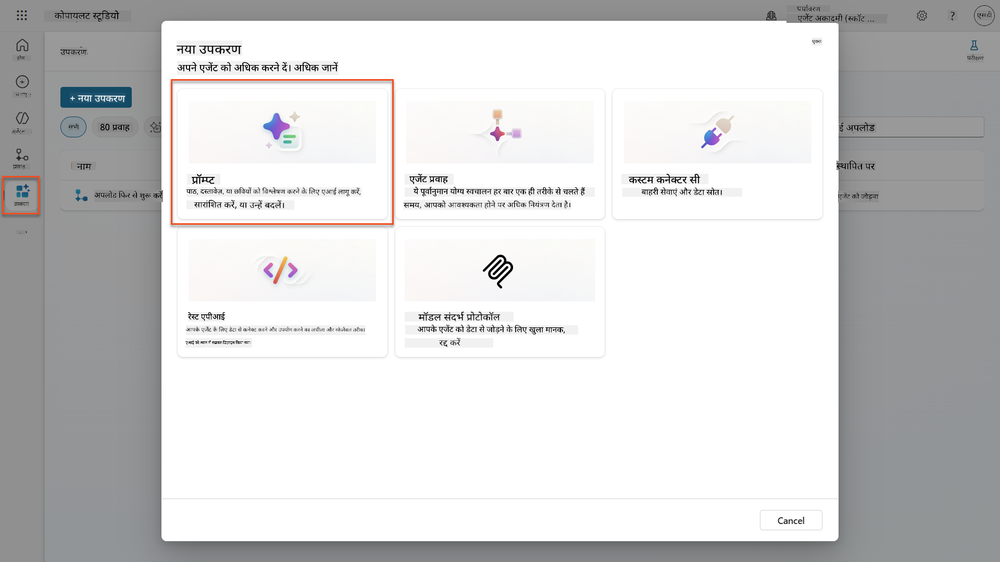

1. प्रॉम्प्ट का नाम डिफ़ॉल्ट टाइमस्टैम्प नाम (जैसे *Custom prompt 09/04/2025, 04:59:11 PM*) से बदलकर `Summarize Resume` रखें।

1. **Instructions** फ़ील्ड में यह प्रॉम्प्ट जोड़ें:

    ```text
    You are tasked with extracting key candidate information from a resume and cover letter to facilitate matching with open job roles and creating a summary for application review.
    
    Instructions:
    1. Extract Candidate Details:
        - Identify and extract the candidate’s full name.
        - Extract contact information, specifically the email address.
    2. Create Candidate Summary:
        - Summarize the candidate’s profile as multiline text (max 2000 characters) with the following sections:
            - Candidate name
            - Role(s) applied for if present
            - Contact and location
            - One-paragraph summary
            - Experience snapshot (last 2–3 roles with outcomes)
            - Key projects (1–3 with metrics)
            - Education and certifications
            - Top skills (Top 10)
            - Availability and work authorization
    
    Guidelines:
    - Extract information only from the provided resume and cover letter documents.
    - Ensure accuracy in identifying all details such as contact details and skills.
    - The summary should be concise but informative, suitable for quick application review.
    
    Resume: /document
    CoverLetter: /text
    ```

    !!! tip "Copilot सहायता का उपयोग करें"
        आप "Get started with Copilot" का उपयोग करके प्राकृतिक भाषा का उपयोग करके अपना प्रॉम्प्ट जनरेट कर सकते हैं। Copilot से पूछें कि वह एक प्रॉम्प्ट बनाए जो रिज़्यूम का सारांश तैयार करे!

1. **इनपुट पैरामीटर्स** कॉन्फ़िगर करें:

    | पैरामीटर | प्रकार | नाम | नमूना डेटा |
    |-----------|------|------|-------------|
    | Resume | इमेज या डॉक्यूमेंट | Resume | टेस्ट-डेटा फ़ोल्डर से एक नमूना रिज़्यूम अपलोड करें |
    | CoverLetter | टेक्स्ट | CoverLetter | Here is a Resume! |

1. **Test** चुनें ताकि आपके प्रॉम्प्ट से प्रारंभिक टेक्स्ट आउटपुट देखा जा सके।  
    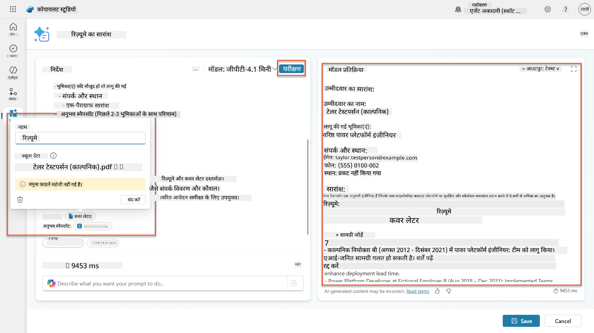

### 7.2 JSON आउटपुट कॉन्फ़िगर करें

अब आप प्रॉम्प्ट को साधारण टेक्स्ट के बजाय संरचित JSON डेटा आउटपुट करने के लिए बदलेंगे।

1. अपने प्रॉम्प्ट निर्देशों के अंत में यह JSON फॉर्मेट स्पेसिफिकेशन जोड़ें:

    ```text
    Output Format:
    Provide the output in valid JSON format with the following structure:
    
    {
        "CandidateName": "string",
        "Email": "string",
        "Summary": "string max 2000 characters",
        "Skills": [ {"item": "Skill 1"}, {"item": "Skill 2"}],
        "Experience": [ {"item": "Experience 1"}, {"item": "Experience 2"}],
    }
    ```

1. **Output** सेटिंग को "Text" से बदलकर **JSON** करें।

1. फिर से **Test** चुनें ताकि यह सत्यापित किया जा सके कि आउटपुट अब JSON के रूप में फॉर्मेट किया गया है।  
    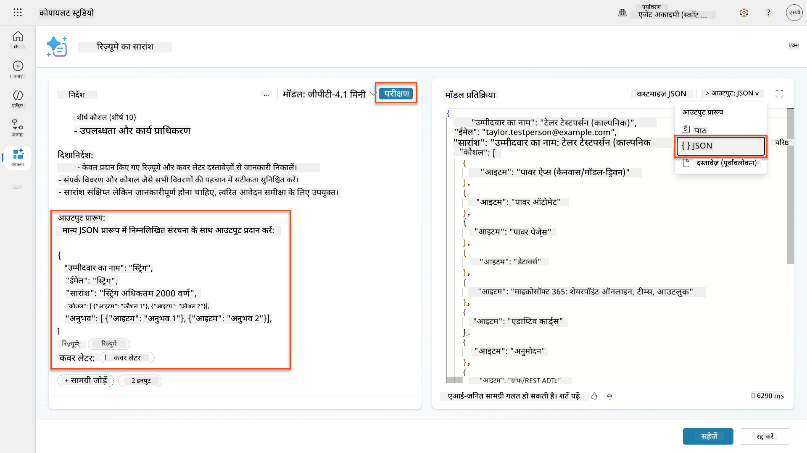

1. **वैकल्पिक:** विभिन्न AI मॉडल्स के साथ प्रयोग करें ताकि देखा जा सके कि आउटपुट कैसे भिन्न होते हैं, फिर डिफ़ॉल्ट मॉडल पर वापस लौटें।

1. प्रॉम्प्ट बनाने के लिए **Save** चुनें।

1. **Configure for use in Agent** डायलॉग में, **Cancel** चुनें।

    !!! info "हम इसे अभी एक टूल के रूप में क्यों नहीं जोड़ रहे हैं"
        आप इस प्रॉम्प्ट का उपयोग सीधे एक टूल के रूप में करने के बजाय एक Agent Flow में करेंगे, जो डेटा प्रोसेसिंग वर्कफ़्लो पर अधिक नियंत्रण देता है।

### 7.3 प्रॉम्प्ट को एक Agent Flow में जोड़ें

आप एक Agent Flow बनाएंगे जो आपके प्रॉम्प्ट का उपयोग Dataverse में संग्रहीत रिज़्यूम्स को प्रोसेस करने के लिए करता है।

!!! tip "Agent Flow एक्सप्रेशन्स"
    यह बहुत महत्वपूर्ण है कि आप अपने नोड्स का नामकरण और एक्सप्रेशन्स को ठीक उसी तरह दर्ज करें जैसा निर्देश दिया गया है क्योंकि एक्सप्रेशन्स पिछले नोड्स को उनके नाम का उपयोग करके संदर्भित करते हैं! [Recruit में Agent Flow मिशन](../../recruit/09-add-an-agent-flow/README.md#you-mentioned-expressions-what-are-expressions) में एक्सप्रेशन्स पर एक त्वरित पुनरावलोकन के लिए देखें।

1. Copilot Studio के अंदर अपने **Hiring Agent** पर जाएं।

1. **Agents** टैब चुनें, और चाइल्ड **Application Intake Agent** चुनें।

1. **Tools** पैनल के अंदर, **+ Add** → **+ New tool** → **Agent flow** चुनें।

1. जब एक एजेंट फ्लो को कॉल करता है नोड चुनें, **+ Add an input** का उपयोग करके निम्न पैरामीटर जोड़ें:

    | प्रकार | नाम | विवरण |
    |------|------|-------------|
    | टेक्स्ट | ResumeNumber | सुनिश्चित करें कि [ResumeNumber] का उपयोग करें। यह हमेशा अक्षर R से शुरू होना चाहिए |

1. **+** Insert action आइकन चुनें जो पहले नोड के नीचे है, **Dataverse** खोजें, **See more** चुनें, और फिर **List rows** एक्शन को ढूंढें।

1. **List rows** नोड पर **ellipsis (...)** चुनें, और इसे `Get Resume Record` नाम दें, और निम्न पैरामीटर्स सेट करें:

    | प्रॉपर्टी | कैसे सेट करें | मान |
    |----------|------------|-------|
    | **Table name** | चुनें | Resumes |
    | **Filter rows** | डायनामिक डेटा (थंडरबोल्ट आइकन) | `ppa_resumenumber eq 'ResumeNumber'` **ResumeNumber** को **When an agent calls the flow** → **ResumeNumber** से बदलें |
    | **Row count** | दर्ज करें | 1 |

    !!! tip "उन क्वेरीज़ को ऑप्टिमाइज़ करें!"
        उत्पादन में इस तकनीक का उपयोग करते समय, आपको हमेशा चुने गए कॉलम्स को केवल उन तक सीमित करना चाहिए जो Agent Flow द्वारा आवश्यक हैं।

    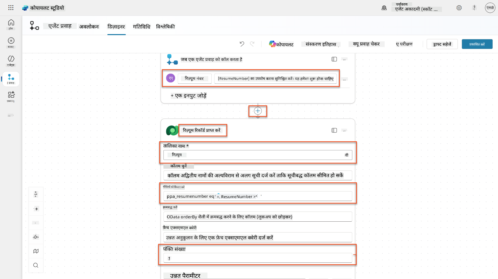

1. **Get Resume Record** नोड के नीचे **+** Insert action आइकन चुनें, **Dataverse** खोजें, **See more** चुनें, और फिर **Download a file or an image** एक्शन को ढूंढें।

    !!! tip "सही एक्शन चुनें!"
        सुनिश्चित करें कि आप उस एक्शन को न चुनें जो "from selected environment" पर समाप्त होता है।

1. पहले की तरह, एक्शन का नाम `Download Resume` रखें, और निम्न पैरामीटर्स सेट करें:

    | प्रॉपर्टी | कैसे सेट करें | मान |
    |----------|------------|-------|
    | **Table name** | चुनें | Resumes |
    | **Row ID** | एक्सप्रेशन (
| **प्रॉम्प्ट** | चयन करें | रिज़्यूमे का सारांश बनाएं |
| **कवर लेटर** | अभिव्यक्ति (fx आइकन) | `first(body('Get_Resume_Record')?['value'])?['ppa_coverletter']` |
| **रिज़्यूमे** | डायनामिक डेटा (थंडरबोल्ट आइकन) | रिज़्यूमे डाउनलोड करें → फ़ाइल या इमेज सामग्री |

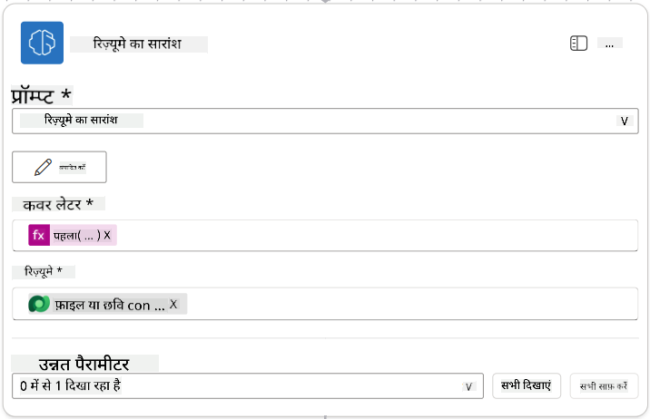

!!! tip "प्रॉम्प्ट पैरामीटर"
ध्यान दें कि जो पैरामीटर आप भर रहे हैं, वही हैं जो आपने प्रॉम्प्ट बनाते समय इनपुट पैरामीटर के रूप में कॉन्फ़िगर किए थे।

### 7.4 कैंडिडेट रिकॉर्ड बनाएं

अब आपको प्रॉम्प्ट से प्राप्त जानकारी का उपयोग करके एक नया कैंडिडेट रिकॉर्ड बनाना होगा, यदि वह पहले से मौजूद नहीं है।

1. **+** इंसर्ट एक्शन आइकन को Summarize Resume नोड के नीचे चुनें, **Dataverse** खोजें, **See more** चुनें, और फिर **List rows** एक्शन को ढूंढें।

1. नोड का नाम बदलें `Get Existing Candidate`, और निम्नलिखित पैरामीटर सेट करें:

    | प्रॉपर्टी | कैसे सेट करें | मान |
    |-----------|---------------|-----|
    | **टेबल का नाम** | चयन करें | Candidates |
    | **फिल्टर रो** | डायनामिक डेटा (थंडरबोल्ट आइकन) | `ppa_email eq 'Email'`  **Replace** `Email` को **Summarize Resume → Email** से बदलें |
    | **रो काउंट** | दर्ज करें | 1 |

    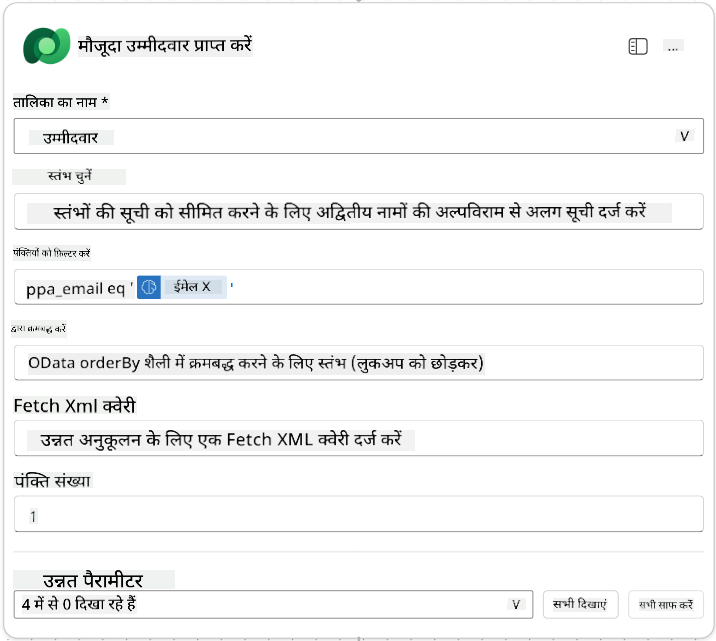

1. **+** इंसर्ट एक्शन आइकन को Get Existing Candidate नोड के नीचे चुनें, **Control** खोजें, **See more** चुनें, और फिर **Condition** एक्शन को ढूंढें।

1. कंडीशन प्रॉपर्टीज में निम्नलिखित कंडीशन सेट करें:

    | कंडीशन | ऑपरेटर | मान |
    |--------|---------|-----|
    | अभिव्यक्ति (fx आइकन): `length(outputs('Get_Existing_Candidate')?['body/value'])` | बराबर है | 0 |

    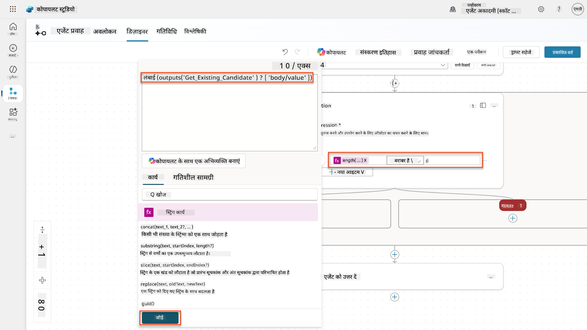

1. **True** ब्रांच में **+** इंसर्ट एक्शन आइकन चुनें, **Dataverse** खोजें, **See more** चुनें, और फिर **Add a new row** एक्शन को ढूंढें।

1. नोड का नाम बदलें `Add a New Candidate`, और निम्नलिखित पैरामीटर सेट करें:

    | प्रॉपर्टी | कैसे सेट करें | मान |
    |-----------|---------------|-----|
    | **टेबल का नाम** | चयन करें | Candidates |
    | **कैंडिडेट का नाम** | डायनामिक डेटा (थंडरबोल्ट आइकन) | Summarize Resume → `CandidateName` |
    | **ईमेल** | डायनामिक डेटा (थंडरबोल्ट आइकन) | Summarize Resume → `Email` |

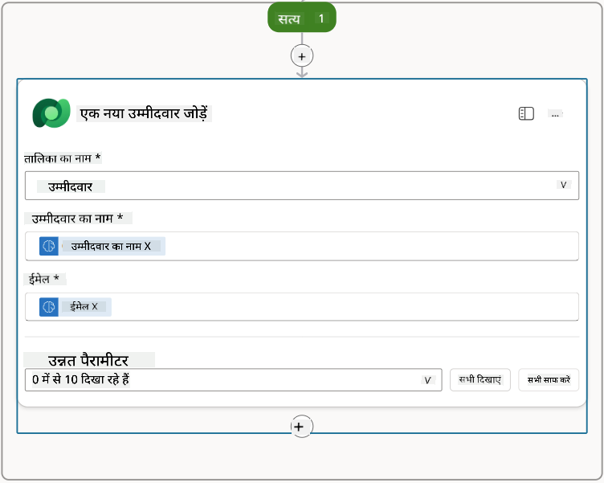

### 7.5 रिज़्यूमे अपडेट करें और फ्लो आउटपुट्स को कॉन्फ़िगर करें

फ्लो को पूरा करें, रिज़्यूमे रिकॉर्ड को अपडेट करें और एजेंट को लौटाने के लिए डेटा कॉन्फ़िगर करें।

1. कंडीशन के नीचे **+** इंसर्ट एक्शन आइकन चुनें, **Dataverse** खोजें, **See more** चुनें, और फिर **Update a row** एक्शन को ढूंढें।

1. शीर्षक को `Update Resume` के रूप में बदलें, **Show all** चुनें, और निम्नलिखित पैरामीटर सेट करें:

    | प्रॉपर्टी | कैसे सेट करें | मान |
    |-----------|---------------|-----|
    | **टेबल का नाम** | चयन करें | Resumes |
    | **रो आईडी** | अभिव्यक्ति (fx आइकन) | `first(body('Get_Resume_Record')?['value'])?['ppa_resumeid']` |
    | **सारांश** | डायनामिक डेटा (थंडरबोल्ट आइकन) | Summarize Resume → Text |
    | **कैंडिडेट (Candidates)** | अभिव्यक्ति (fx आइकन) | `if(equals(length(outputs('Get_Existing_Candidate')?['body/value']), 1), first(outputs('Get_Existing_Candidate')?['body/value'])?['ppa_candidateid'], outputs('Add_a_New_Candidate')?['body/ppa_candidateid'])` |

    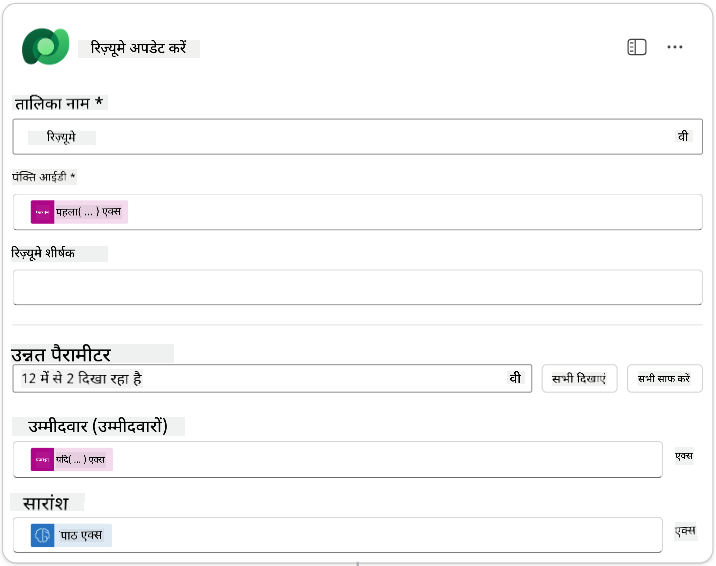

1. **Respond to the agent** नोड चुनें और फिर **+ Add an output** का उपयोग करें:

    | प्रकार | नाम              | कैसे सेट करें                  | मान                                                        | विवरण                                            |
    |-------|------------------|-------------------------------|------------------------------------------------------------|-------------------------------------------------|
    | टेक्स्ट | `CandidateName`   | डायनामिक डेटा (थंडरबोल्ट आइकन) | Summarize Resume → See more → CandidateName                  | रिज़्यूमे में दिया गया [CandidateName]           |
    | टेक्स्ट | `CandidateEmail`  | डायनामिक डेटा (थंडरबोल्ट आइकन) | Summarize Resume → See more → Email                          | रिज़्यूमे में दिया गया [CandidateEmail]          |
    | टेक्स्ट | `CandidateNumber` | अभिव्यक्ति (fx आइकन)            | `concat('ppa_candidates/', if(equals(length(outputs('Get_Existing_Candidate')?['body/value']), 1), first(outputs('Get_Existing_Candidate')?['body/value'])?['ppa_candidateid'], outputs('Add_a_New_Candidate')?['body/ppa_candidateid']) )` | नए या मौजूदा कैंडिडेट का [CandidateNumber]      |
    | टेक्स्ट | `ResumeSummary`   | डायनामिक डेटा (थंडरबोल्ट आइकन) | Summarize Resume → See more → body/responsev2/predictionOutput/structuredOutput | JSON फॉर्म में रिज़्यूमे सारांश और विवरण         |

    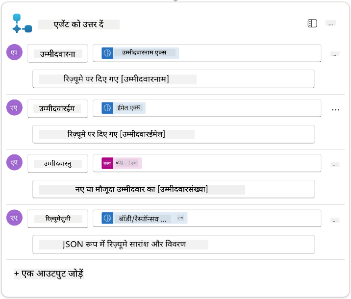

1. ऊपर दाईं ओर **Save draft** चुनें। आपका Agent Flow निम्नलिखित जैसा दिखना चाहिए  
    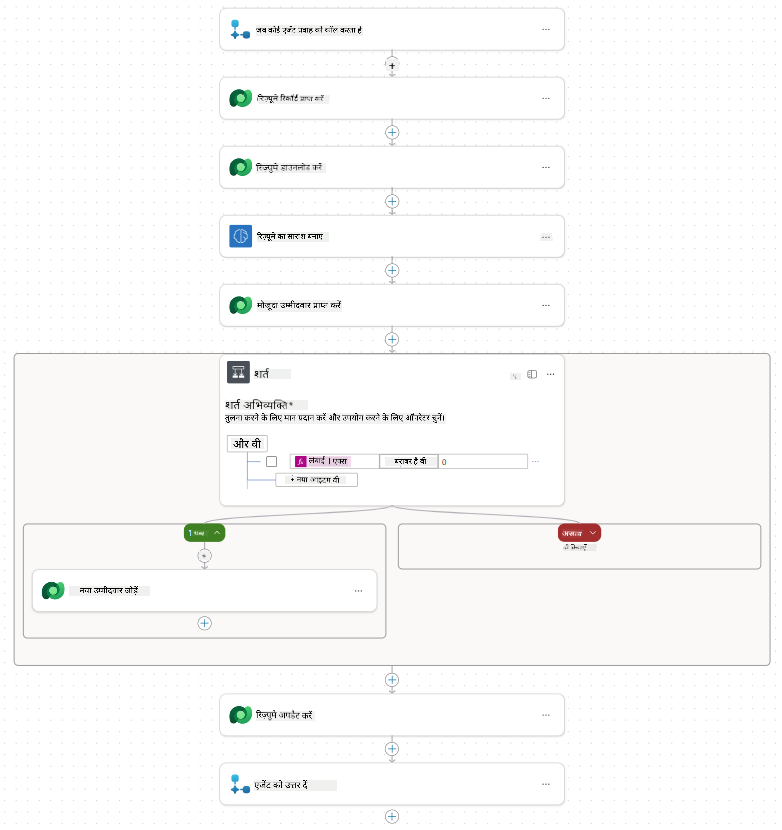

1. **Overview** टैब चुनें, **Details** पैनल पर **Edit** चुनें

    1. **Flow name**:`Summarize Resume`
    1. **Description**:

        ```text
        Summarize an existing Resume stored in Dataverse using a [ResumeNumber] as input, return the [CandidateNumber], and resume summary JSON
        ```

1. **Save** चुनें

1. फिर से **Designer** टैब चुनें, और **Publish** चुनें।

### 7.6 फ्लो को अपने एजेंट से कनेक्ट करें

अब आप फ्लो को एक टूल के रूप में जोड़ेंगे और अपने एजेंट को इसका उपयोग करने के लिए कॉन्फ़िगर करेंगे।

1. Copilot Studio में अपना **Hiring Agent** खोलें

1. **Agents** टैब चुनें, और **Application Intake Agent** खोलें

1. **Tools** पैनल चुनें, और **+ Add a tool** - > **Flow** -> **Summarize Resume** **(Agent Flow)** चुनें

1. **Add and configure** चुनें

1. टूल सेटिंग्स को निम्नलिखित के रूप में कॉन्फ़िगर करें:

    | सेटिंग | मान |
    |--------|-----|
    | **Description** | Dataverse में संग्रहीत मौजूदा रिज़्यूमे को [ResumeNumber] इनपुट के रूप में सारांशित करें, [CandidateNumber] और रिज़्यूमे सारांश JSON लौटाएं |
    | **When this tool may be used** | केवल तब जब टॉपिक्स या एजेंट्स द्वारा संदर्भित किया जाए |

1. **Save** चुनें  
    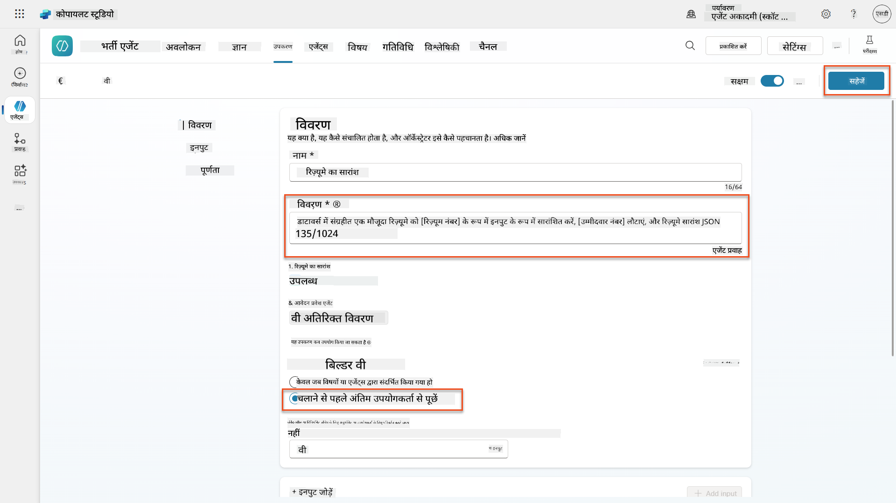

1. यदि आप Hiring Agent के अंदर Tools चुनते हैं, तो आप देखेंगे कि हमारे दोनों टूल्स अब **Application Intake Agent** द्वारा उपयोग किए जा सकते हैं।  
    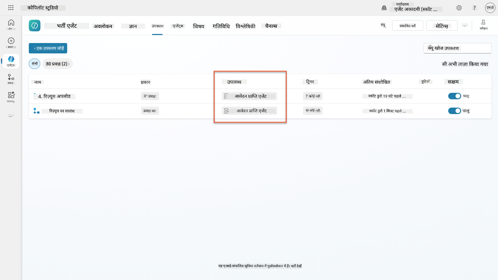

1. **Application Intake Child** एजेंट निर्देशों पर जाएं, और **Post-Upload** चरण को निम्नलिखित में संशोधित करें:

    ```text
    2. Post-Upload Processing  
        - After uploading, be sure to also output the [ResumeNumber] in all messages
        - Pass [ResumeNumber] to /Summarize Resume  - Be sure to use the correct value that will start with the letter R.
        - Be sure to also output the [CandidateNumber] in all messages
        - Use the [ResumeSummary] to output a summary of the processed Resume and candidate
    ```

    `/Summarize Resume` को **Summarize Resume agent flow** के संदर्भ को जोड़कर बदलें, `/` टाइप करके या `/Summarize` चुनकर संदर्भ जोड़ें।  
    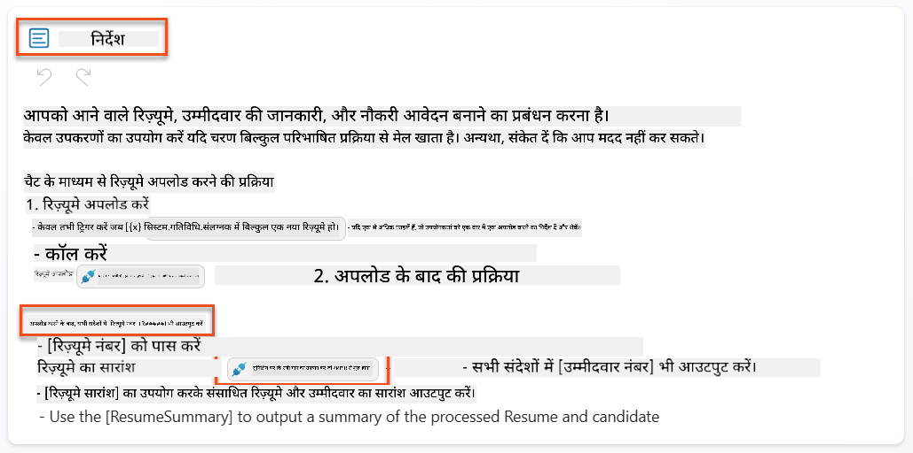

1. **Save** चुनें।

### 7.7 अपने एजेंट का परीक्षण करें

अपने संपूर्ण मल्टीमॉडल सिस्टम का परीक्षण करें ताकि यह सुनिश्चित हो सके कि सब कुछ सही ढंग से काम कर रहा है।

1. **परीक्षण शुरू करें**:

    - **Test** चुनें ताकि परीक्षण पैनल खुल सके
    - टाइप करें: `Here is a candidate Resume`

    - [Test Resumes](https://download-directory.github.io/?url=https://github.com/microsoft/agent-academy/tree/main/operative/sample-data/resumes&filename=operative_sampledata) से एक नमूना रिज़्यूमे अपलोड करें

1. **परिणाम सत्यापित करें**:
    - जब आप संदेश और रिज़्यूमे भेजते हैं, तो सुनिश्चित करें कि आपको एक रिज़्यूमे नंबर (फॉर्मेट: R#####) प्राप्त होता है
    - सुनिश्चित करें कि आपको एक कैंडिडेट नंबर और सारांश प्राप्त होता है
    - एक्टिविटी मैप का उपयोग करें ताकि रिज़्यूमे अपलोड टूल और Summarize Resume टूल को क्रियान्वित होते हुए देखें, और एजेंट द्वारा Summary Prompt के आउटपुट प्राप्त होते हैं:  
        

1. **डेटा स्थायित्व जांचें**:
    - [Power Apps](https://make.powerapps.com) पर जाएं
    - **Apps** → **Hiring Hub** → **Play** खोलें
    - **Resumes** पर जाएं ताकि यह सत्यापित किया जा सके कि रिज़्यूमे अपलोड और प्रोसेस किया गया था। इसमें सारांश जानकारी और संबंधित कैंडिडेट रिकॉर्ड होना चाहिए।
    - **Candidates** पर जाएं ताकि निकाली गई कैंडिडेट जानकारी देखी जा सके  
        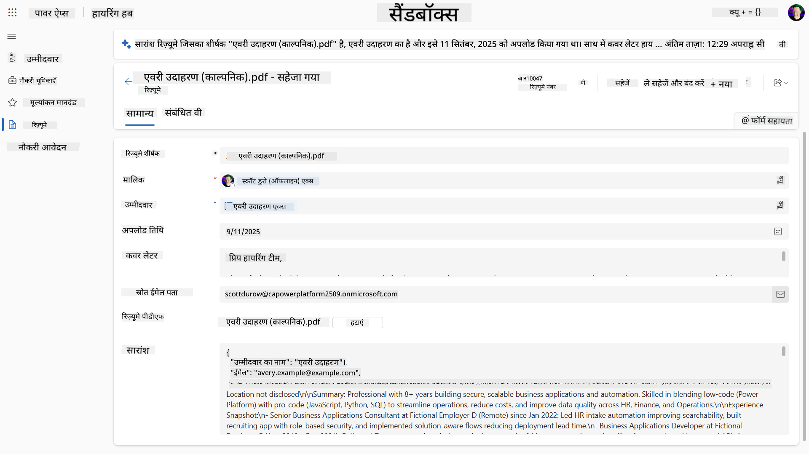
    - जब आप प्रक्रिया को फिर से चलाते हैं, तो यह मौजूदा कैंडिडेट (रिज़्यूमे से निकाले गए ईमेल पर आधारित) का उपयोग करेगा, नया बनाने के बजाय।

!!! tip "समस्या निवारण"
    - **रिज़्यूमे प्रोसेस नहीं हो रहा**: सुनिश्चित करें कि फ़ाइल PDF है और आकार सीमा के भीतर है
    - **कोई कैंडिडेट नहीं बनाया गया**: जांचें कि ईमेल रिज़्यूमे से सही ढंग से निकाला गया था
    - **JSON फॉर्मेट त्रुटियां**: सुनिश्चित करें कि आपके प्रॉम्प्ट निर्देशों में सटीक JSON संरचना शामिल है
    - **फ्लो त्रुटियां**: सुनिश्चित करें कि सभी Dataverse कनेक्शन और अभिव्यक्तियां सही ढंग से कॉन्फ़िगर की गई हैं

### उत्पादन तैयारी

हालांकि यह मिशन का हिस्सा नहीं है, इस एजेंट फ्लो को उत्पादन के लिए तैयार बनाने के लिए आप निम्नलिखित पर विचार कर सकते हैं:

1. **त्रुटि हैंडलिंग** - यदि रिज़्यूमे नंबर नहीं मिला, या प्रॉम्प्ट दस्तावेज़ को पार्स करने में विफल रहा, तो एजेंट को स्पष्ट त्रुटि लौटाने के लिए त्रुटि हैंडलिंग जोड़ी जानी चाहिए।
1. **मौजूदा कैंडिडेट्स को अपडेट करना** - ईमेल का उपयोग करके कैंडिडेट पाया जाता है, फिर नाम को रिज़्यूमे पर दिए गए नाम से मिलाने के लिए अपडेट किया जा सकता है।
1. **रिज़्यूमे सारांश और कैंडिडेट निर्माण को विभाजित करना** - इस कार्यक्षमता को छोटे एजेंट फ्लो में विभाजित किया जा सकता है ताकि उन्हें बनाए रखना आसान हो, और फिर एजेंट को उन्हें क्रम में उपयोग करने के निर्देश दिए जा सकें।

## 🎉 मिशन पूरा

शानदार काम, Operative! **Document Resume Recon** अब पूरा हो गया है। आपने मल्टीमॉडल प्रॉम्प्ट्स में महारत हासिल कर ली है और अब किसी भी दस्तावेज़ से सटीकता के साथ संरचित डेटा निकाल सकते हैं।

आपने इस मिशन में क्या हासिल किया:

**✅ मल्टीमॉडल प्रॉम्प्ट्स में महारत**  
अब आप समझते हैं कि मल्टीमॉडल प्रॉम्प्ट्स क्या हैं और इष्टतम परिणामों के लिए विभिन्न AI मॉडल का उपयोग कब करना है।

**✅ दस्तावेज़ प्रोसेसिंग विशेषज्ञता**  
आपने इमेज और दस्तावेज़ इनपुट के साथ प्रॉम्प्ट्स को कॉन्फ़िगर करना और JSON के रूप में आउटपुट को संरचित डेटा निकालने के लिए फॉर्मेट करना सीखा।

**✅ रिज़्यूमे एक्सट्रैक्शन सिस्टम**  
आपने एक संपूर्ण रिज़्यूमे एक्सट्रैक्शन सिस्टम बनाया है जो कैंडिडेट दस्तावेज़ों को प्रोसेस करता है और आपके हायरिंग वर्कफ़्लो के साथ एकीकृत करता है।

**✅ सर्वोत्तम प्रथाओं का कार्यान्वयन**  
आपने दस्तावेज़ विश्लेषण के साथ प्रॉम्प्ट इंजीनियरिंग के सर्वोत्तम प्रथाओं को लागू किया और मल्टीमॉडल प्रॉम्प्ट्स को Agent Flows के साथ एकीकृत किया।

**✅ उन्नत प्रोसेसिंग के लिए आधार**  
आपकी उन्नत दस्तावेज़ विश्लेषण क्षमताएं अब उन उन्नत डेटा ग्राउंडिंग सुविधाओं के लिए तैयार हैं जिन्हें हम आगामी मिशनों में जोड़ेंगे।

🚀 **अगला:** मिशन 08 में, आप सीखेंगे कि Dataverse से रियल-टाइम डेटा के साथ अपने प्रॉम्प्ट्स को कैसे बढ़ाया जाए, जिससे ऐसे डायनामिक AI समाधान बनें जो बदलती व्यावसायिक आवश्यकताओं के अनुकूल हों।

⏩ [मिशन 08 पर जाएं: Dataverse ग्राउंडिंग के साथ उन्नत प्रॉम्प्ट्स](../08-dataverse-grounding/README.md)

## 📚 सामरिक संसाधन

📖 [प्रॉम्प्ट बनाएं](https://learn.microsoft.com/ai-builder/create-a-custom-prompt?WT.mc_id=power-power-182762-scottdurow)

📖 [अपने प्रॉम्प्ट में टेक्स्ट, इमेज, या दस्तावेज़ इनपुट जोड़ें](https://learn.microsoft.com/ai-builder/add-inputs-prompt?WT.mc_id=power-182762-scottdurow)

📖 [JSON आउटपुट के साथ प्रतिक्रियाओं को प्रोसेस करें](https://learn.microsoft.com/ai-builder/process-responses-json-output?WT.mc_id=power-182762-scottdurow)

📖 [मॉडल चयन और तापमान सेटिंग्स](https://learn.microsoft.com/ai-builder/prompt-modelsettings?WT.mc_id=power-182762-scottdurow)

📖 [Power Automate में अपने प्रॉम्प्ट का उपयोग करें](https://learn.microsoft.com/ai-builder/use-a-custom-prompt-in-flow?WT.mc_id=power-182762-scottdurow)

📺 [AI Builder: प्रॉम्प्ट बिल्डर में JSON आउटपुट्स](https://www.youtube.com/watch?v=F0fGnWrRY_I)

---

**अस्वीकरण**:  
यह दस्तावेज़ AI अनुवाद सेवा [Co-op Translator](https://github.com/Azure/co-op-translator) का उपयोग करके अनुवादित किया गया है। जबकि हम सटीकता के लिए प्रयास करते हैं, कृपया ध्यान दें कि स्वचालित अनुवाद में त्रुटियां या अशुद्धियां हो सकती हैं। मूल भाषा में दस्तावेज़ को आधिकारिक स्रोत माना जाना चाहिए। महत्वपूर्ण जानकारी के लिए, पेशेवर मानव अनुवाद की सिफारिश की जाती है। इस अनुवाद के उपयोग से उत्पन्न किसी भी गलतफहमी या गलत व्याख्या के लिए हम उत्तरदायी नहीं हैं।